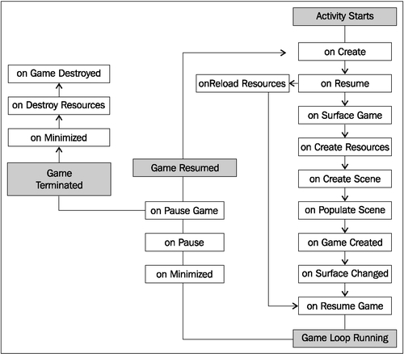
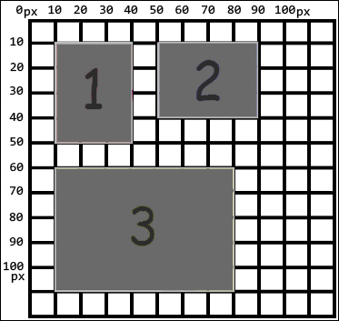
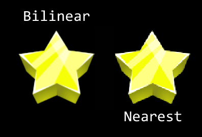
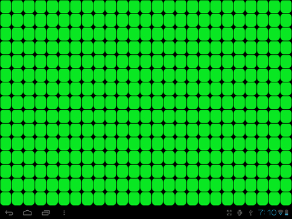

# 第一章：AndEngine 游戏结构

在本章中，我们将了解构建**AndEngine**游戏中所需的主要组成部分。主题包括：

+   了解生命周期

+   选择我们的引擎类型

+   选择分辨率策略

+   创建对象工厂

+   创建游戏管理器

+   引入声音和音乐

+   使用不同类型的纹理

+   应用纹理选项

+   使用 AndEngine 字体资源

+   创建资源管理器

+   保存和加载游戏数据

# 引言

AndEngine 最吸引人的方面是创建游戏的极大便捷性。在首次接触 AndEngine 后，在几周内设计和编码一个游戏并非遥不可及，但这并不意味着它将是一个完美的游戏。如果我们不理解引擎的工作原理，编码过程可能会很繁琐。为了创建精确、有序且可扩展的项目，了解 AndEngine 的主要构建块和游戏结构是一个好主意。

在本章中，我们将介绍 AndEngine 和一般游戏编程中最必要的几个组成部分。我们将查看一些类，这些类将帮助我们快速高效地创建各种游戏的基础。此外，我们还将介绍资源和对象类型之间的区别，这些区别在塑造游戏的整体外观和感觉方面起着最重要的作用。如果需要，建议将本章作为参考资料保存。

# 了解生命周期

在初始化游戏时，了解操作的顺序是很重要的。游戏的基本需求包括创建引擎、加载游戏资源、以及设置初始屏幕和设置。这就是创建 AndEngine 游戏基础所需的一切。但是，如果我们计划在游戏中实现更多多样性，那么了解 AndEngine 中包含的完整生命周期是明智的。

## 准备就绪

请参考代码包中名为`PacktRecipesActivity`的类。

## 如何操作…

AndEngine 生命周期包括我们直接负责定义的几个方法。这些方法包括创建`EngineOptions`对象，创建`Scene`对象，以及用子实体填充场景。这些方法的调用顺序如下：

1.  定义`onCreateEngineOptions()`方法：

    ```kt
    @Override
    public EngineOptions onCreateEngineOptions() {

      // Define our mCamera object
      mCamera = new Camera(0, 0, WIDTH, HEIGHT);

      // Declare & Define our engine options to be applied to our Engine object
      EngineOptions engineOptions = new EngineOptions(true,
          ScreenOrientation.LANDSCAPE_FIXED, new FillResolutionPolicy(),
          mCamera);

      // It is necessary in a lot of applications to define the following
      // wake lock options in order to disable the device's display
      // from turning off during gameplay due to inactivity
      engineOptions.setWakeLockOptions(WakeLockOptions.SCREEN_ON);

      // Return the engineOptions object, passing it to the engine
      return engineOptions;
    }
    ```

1.  定义`onCreateResources()`方法：

    ```kt
    @Override
    public void onCreateResources(
        OnCreateResourcesCallback pOnCreateResourcesCallback) {

      /* We should notify the pOnCreateResourcesCallback that we've finished
        * loading all of the necessary resources in our game AFTER they are loaded.
        * onCreateResourcesFinished() should be the last method called.  */
      pOnCreateResourcesCallback.onCreateResourcesFinished();
    }
    ```

1.  定义`onCreateScene()`方法：

    ```kt
    @Override
    public void onCreateScene(OnCreateSceneCallback pOnCreateSceneCallback) {
      // Create the Scene object
      mScene = new Scene();

      // Notify the callback that we're finished creating the scene, returning
      // mScene to the mEngine object (handled automatically)
      pOnCreateSceneCallback.onCreateSceneFinished(mScene);
    }
    ```

1.  定义`onPopulateScene()`方法：

    ```kt
    @Override
    public void onPopulateScene(Scene pScene,
      OnPopulateSceneCallback pOnPopulateSceneCallback) {

      // onPopulateSceneFinished(), similar to the resource and scene callback
      // methods, should be called once we are finished populating the scene.
      pOnPopulateSceneCallback.onPopulateSceneFinished();
    }
    ```

## 工作原理…

在此食谱类中找到的代码是任何 AndEngine 游戏的基础。我们设置了一个主活动类，作为进入我们应用程序的入口点。活动包含 AndEngine 活动生命周期中我们负责的四个主要方法，从创建`EngineOptions`选项开始，创建资源，创建场景，以及填充场景。

在第一步中，我们覆盖了引擎的`onCreateEngineOptions()`方法。在这个方法内部，我们主要关注实例化`Camera`对象和`EngineOptions`对象。这两个对象的构造函数允许我们定义应用程序的显示属性。此外，通过调用`engineOptions.setWakeLockOptions(WakeLockOptions.SCREEN_ON)`方法，我们阻止了在应用程序不活动期间屏幕自动关闭。

在第二步中，我们继续覆盖`onCreateResources()`方法，该方法为我们提供了一个特定方法，用于创建和设置游戏所需的所有资源。这些资源可能包括纹理、声音和音乐以及字体。在这一步和接下来的两步中，我们需要调用相应的方法回调，以继续应用程序的生命周期。对于`onCreateResources()`方法，我们必须在方法的最后包含调用`pOnCreateResourcesCallback.onCreateResourcesFinished()`。

第三步涉及实例化和设置`Scene`对象。设置场景可以像本食谱中显示的那么简单，或者对于更复杂的项目，它可能包括设置触摸事件监听器、更新处理器等。完成场景设置后，我们必须调用`pOnCreateSceneCallback.onCreateSceneFinished(mScene)`方法，将我们新创建的`mScene`对象传递给引擎，以便在设备上显示。

最后需要处理的步骤包括定义`onPopulateScene()`方法。此方法专门用于将子实体附加到场景。与之前的两个步骤一样，我们必须调用`pOnPopulateSceneCallback.onPopulateSceneFinished()`以继续剩余的 AndEngine 生命周期调用。

在以下列表中，我们将按照从活动启动到终止时调用的顺序介绍生命周期方法。

启动期间的生命周期调用如下：

+   `onCreate`：此方法是 Android SDK 的原生应用程序入口点。在 AndEngine 开发中，此方法只需调用我们`BaseGameActivity`类中的`onCreateEngineOptions()`方法，然后将返回的选项应用到游戏引擎中。

+   `onResume`：这是 Android SDK 的另一个原生方法。在这里，我们从`EngineOptions`对象获取唤醒锁设置，然后为引擎的`RenderSurfaceView`对象调用`onResume()`方法。

+   `onSurfaceCreated`：此方法将在我们活动的初始启动过程中调用`onCreateGame()`，或者如果活动之前已经部署，则将布尔变量注册为`true`以重新加载资源。

+   `onReloadResources`：如果我们的应用程序从最小化状态恢复到焦点状态，此方法将重新加载游戏资源。在应用程序首次执行时不会调用此方法。

+   `onCreateGame`：这是为了处理 AndEngine 生命周期中接下来三个回调的执行顺序。

+   `onCreateResources`：这个方法允许我们声明和定义在启动活动时应用所需的最初资源。这些资源包括但不限于纹理、声音和音乐以及字体。

+   `onCreateScene`：在这里，我们处理活动场景对象的初始化。在这个方法中可以附加实体到场景，但为了保持组织性，通常最好在`onPopulateScene()`中附加实体。

+   `onPopulateScene`：在生命周期中的`onPopulateScene()`方法里，我们几乎完成了场景的设置，尽管还有一些生命周期调用会由引擎自动处理。这个方法应该用来定义应用首次启动时场景的视觉结果。注意，此时场景已经被创建并应用到引擎中。如果此时没有加载屏幕或启动画面，并且有许多实体需要附加到场景中，那么在某些情况下可能会看到实体被附加到场景上。

+   `onGameCreated`：这表明`onCreateGame()`序列已经完成，如有必要，重新加载资源，否则什么都不做。是否重新加载资源取决于在五个生命周期调用之前的`onSurfaceCreated`方法中简要提到的布尔变量。

+   `onSurfaceChanged`：每次应用的方向从横屏模式变为竖屏模式，或者从竖屏模式变为横屏模式时，都会调用这个方法。

+   `onResumeGame`：这是在活动启动周期中最后一个调用的方法。如果我们的活动在没有问题的情况下到达这一点，将调用引擎的`start()`方法，使游戏的更新线程活跃起来。

在最小化/终止过程中的生命周期调用如下：

+   `onPause`：活动最小化或结束时首先调用的方法。这是原生安卓的暂停方法，它调用`RenderSurfaceView`对象的暂停方法，并恢复游戏引擎应用的唤醒锁设置。

+   `onPauseGame`：接下来，AndEngine 的`onPause()`实现，它只是简单地在引擎上调用`stop()`方法，导致引擎的所有更新处理器以及更新线程停止。

+   `onDestroy`：在`onDestroy()`方法中，AndEngine 会清除由引擎管理类持有的`ArrayList`对象中包含的所有图形资源。这些管理类包括`VertexBufferObjectManager`类、`FontManager`类、`ShaderProgramManager`类，以及最后的`TextureManager`类。

+   `onDestroyResources`：这个方法名称可能有些误导，因为我们已经在`onDestroy()`中卸载了大部分资源。这个方法真正的作用是，通过调用相应管理器的`releaseAll()`方法，释放所有存储在其中的声音和音乐对象。

+   `onGameDestroyed`：最后，我们到达在整个 AndEngine 生命周期中需要调用的最后一个方法。在这个方法中没有太多动作发生。AndEngine 只是将用于 Engine 的`mGameCreated`布尔变量设置为`false`，表示活动不再运行。

在以下图片中，我们可以看到当创建游戏、最小化或销毁游戏时，生命周期的实际表现：



### 注意

由于 AndEngine 生命周期的异步性质，在单个启动实例期间可能会多次执行某些方法。这些事件的发生在设备之间是不同的。

## 还有更多…

在本食谱的前一部分中，我们已经介绍了主要的`BaseGameActivity`类。以下类可以作为`BaseGameActivity`类的替代品，每个类都有自己的一些细微差别。

### `LayoutGameActivity`类

`LayoutGameActivity`类是一个有用的活动类，它允许我们将 AndEngine 场景图视图集成到普通的 Android 应用程序中。另一方面，使用这个类，我们还可以将原生的 Android SDK 视图，如按钮、滑动条、下拉列表、附加布局或其他任何视图包含到我们的游戏中。然而，使用这种活动最流行的原因是便于在游戏中实现广告，作为一种获取收益的手段。

为`LayoutGameActivity`类设置需要几个额外的步骤。

1.  在项目的默认布局 XML 文件中添加以下行。这个文件通常称为`main.xml`。以下代码段将 AndEngine `RenderSurfaceView`类添加到我们的布局文件中。这是将在设备上显示我们游戏的视图：

    ```kt
    <org.andengine.opengl.view.RenderSurfaceView
    android:id="@+id/gameSurfaceView"
    android:layout_width="fill_parent"
    android:layout_height="fill_parent"/>
    ```

1.  这种活动类型的第二个也是最后一个额外步骤是在第一步中引用布局 XML 文件和`RenderSurfaceView`，在`LayoutGameActivity`重写方法中。以下代码假设布局文件在`res/layout/`文件夹中称为`main.xml`；在这种情况下，可以在完成第一步后将其复制/粘贴到我们的`LayoutGameActivity`类中：

    ```kt
    @Override
    protected int getLayoutID() {
      return R.layout.main;
    }

    @Override
    protected int getRenderSurfaceViewID() {
      return R.id.gameSurfaceView;
    }
    ```

### `SimpleBaseGameActivity`和`SimpleLayoutGameActivity`类

如建议的那样，`SimpleBaseGameActivity`和`SimpleLayoutGameActivity`类使重写生命周期方法变得更容易处理。它们不要求我们重写`onPopulateScene()`方法，而且，在我们定义完重写的方法后，我们也不需要调用方法回调。使用这些活动类型，我们可以简单地添加未实现的生命周期方法，AndEngine 会为我们处理回调。

### `SimpleAsyncGameActivity`类

我们将要讨论的最后一个游戏活动类是`SimpleAsyncGameActivity`类。这个类包括三个可选的生命周期方法：`onCreateResourcesAsync()`、`onCreateSceneAsync()`和`onPopulateSceneAsync()`，以及通常的`onCreateEngineOptions()`方法。这个活动与其他活动的主要区别在于，它为每个"Async"方法提供了加载进度条。以下代码片段展示了当纹理加载时我们如何增加加载进度条：

```kt
@Override
public void onCreateResourcesAsync(IProgressListener pProgressListener)
    throws Exception {

  // Load texture number one
  pProgressListener.onProgressChanged(10);

  // Load texture number two
  pProgressListener.onProgressChanged(20);

  // Load texture number three
  pProgressListener.onProgressChanged(30);

  // We can continue to set progress to whichever value we'd like
  // for each additional step through onCreateResourcesAsync...
}
```

### 提示

**下载示例代码**

你可以从你在[`www.PacktPub.com`](http://www.PacktPub.com)的账户中下载你所购买的所有 Packt 图书的示例代码文件。如果你在其他地方购买了这本书，可以访问[`www.PacktPub.com/support`](http://www.PacktPub.com/support)注册，我们会将文件直接通过电子邮件发送给你。

# 选择我们的引擎类型

在我们开始编程游戏之前，最好先确定游戏所需的性能需求。AndEngine 包含几种不同类型的引擎供我们选择使用，每种都有其自身的优势。当然，这些优势取决于我们计划创建的游戏类型。

## 准备工作

执行本章中的*了解生命周期*食谱，以在我们的 IDE 中设置一个基本的 AndEngine 项目，然后继续到*如何操作…*部分。

## 如何操作…

为了正确地为我们的游戏定义一个特定的`Engine`对象，我们必须重写`onCreateEngine()`方法，这是 AndEngine 启动过程的一部分。在任意基础的 AndEngine 活动中添加以下代码，以手动处理引擎的创建：

```kt
/* The onCreateEngine method allows us to return a 'customized' Engine object
* to the Activity which for the most part affects the way frame updates are 
* handled. Depending on the Engine object used, the overall feel of the 
* gameplay can alter drastically. 
*/
@Override
public Engine onCreateEngine(EngineOptions pEngineOptions) {
  return super.onCreateEngine(pEngineOptions);
  /* The returned super method above simply calls:
      return new Engine(pEngineOptions);
  */
}
```

## 工作原理…

以下是 AndEngine 中可用的各种`Engine`对象的概览，以及一个简短的代码片段，展示如何设置每个`Engine`对象：

+   `Engine`：首先，我们有一个普通的`Engine`对象。对于大多数游戏开发来说，`Engine`对象并不理想，因为它在每秒帧数上没有任何限制。在两个不同的设备上，你很可能会注意到游戏速度的差异。一个思考方式是，如果两个不同的设备同时开始观看同一个视频，较快的设备可能会先完成视频观看，而不是同时完成。因此，在运行较慢的设备上可能会出现明显的问题，尤其是在物理是游戏重要部分的情况下。将这种类型的引擎集成到我们的游戏中不需要额外的步骤。

+   `FixedStepEngine`：我们可用的第二种引擎是`FixedStepEngine`。这是游戏开发中理想的引擎，因为它强制游戏循环以恒定速度更新，而与设备无关。这是通过根据经过的时间更新游戏，而不是根据设备执行代码的能力来实现的。`FixedStepEngine`要求我们按顺序传递`EngineOptions`对象和一个`int`值。这个`int`值定义了每秒引擎将强制运行的步数。以下代码创建了一个以恒定`60`步每秒运行的引擎：

    ```kt
    @Override
    public Engine onCreateEngine(EngineOptions pEngineOptions) {
      // Create a fixed step engine updating at 60 steps per second
        return new FixedStepEngine(pEngineOptions, 60);
      }
    ```

+   `LimitedFPSEngine`：`LimitedFPSEngine`引擎允许我们设置引擎运行的每秒帧数限制。这将导致引擎进行一些内部计算，如果首选 FPS 与引擎当前实现的 FPS 之间的差值大于预设值，引擎将会等待一小段时间后再进行下一次更新。`LimitedFPSEngine`在构造函数中需要两个参数，包括`EngineOptions`对象和一个指定最大每秒帧数的`int`值。以下代码创建了一个最大以 60 帧每秒运行的引擎：

    ```kt
    @Override
    public Engine onCreateEngine(EngineOptions pEngineOptions) {
      // Create a limited FPS engine, which will run at a maximum of 60 FPS
      return new LimitedFPSEngine(pEngineOptions, 60);
    }
    ```

+   `SingleSceneSplitScreenEngine`和`DoubleSceneSplitScreenEngine`：`SingleSceneSplitScreenEngine`引擎和`DoubleSceneSplitScreenEngine`引擎允许我们创建带有两个独立摄像头的游戏，可以是单个场景，通常用于单人游戏，也可以是两个场景，用于单个设备上的多人游戏。这些只是示例，然而，这两个引擎可以具有广泛的应用，包括迷你地图、多重视角、菜单系统等等。更多关于设置这些类型`Engine`对象的详细信息，请参见第四章，*创建分屏游戏*。

# 选择分辨率策略

选择分辨率策略可能是一个敏感的话题，特别是考虑到我们正在处理的平台目前主要运行在从 3 英寸显示屏到 10.1 英寸的设备上。通常，开发者和用户都希望游戏能够占据设备显示的完整宽度和高度，但在某些情况下，我们可能需要仔细选择分辨率策略，以便按照我们开发者的意愿正确显示场景。在本节中，我们将讨论 AndEngine 中包含的各种分辨率策略，这将帮助我们决定哪种策略可能最适合我们应用程序的需求。

## 如何操作…

我们选择遵循的分辨率策略必须作为参数包含在`EngineOptions`构造函数中，该函数是在 AndEngine 生命周期中的`onCreateEngineOptions()`方法里创建的。以下代码使用`FillResolutionPolicy`类创建我们的`EngineOptions`对象，这一部分将在本章后面进行解释：

```kt
EngineOptions engineOptions = new EngineOptions(true,
    ScreenOrientation.LANDSCAPE_FIXED, new FillResolutionPolicy(),
    mCamera); 
```

我们只需向构造函数传递另一个分辨率策略类变体，就可以选择不同的分辨率策略。

## 它的工作原理…

以下是 AndEngine 的`BaseResolutionPolicy`子类型的概述。这些策略用于指定 AndEngine 如何根据各种因素处理应用程序的显示宽度和高度：

+   `FillResolutionPolicy`：如果我们只是希望应用程序占据显示器的全部宽度和高度，`FillResolutionPolicy`类是典型的分辨率策略。虽然此策略允许应用程序以真正的全屏模式运行，但它可能会导致场景为了占据显示器的全部可用尺寸而在某些部分产生明显的拉伸。我们只需在`EngineOptions`构造函数中的分辨率策略参数中包含`new FillResolutionPolicy()`，即可选择此分辨率策略。

+   `FixedResolutionPolicy`：`FixedResolutionPolicy`类允许我们为应用程序应用固定的显示尺寸，无论设备显示尺寸或`Camera`对象尺寸如何。此策略可以通过`new FixedResolutionPolicy(pWidth, pHeight)`传递给`EngineOptions`，其中`pWidth`定义了应用程序视图将覆盖的最终宽度，而`pHeight`定义了应用程序视图将覆盖的最终高度。例如，如果我们向此策略类型的构造函数传递 800 的宽度和 480 的高度，在一个分辨率为 1280 x 752 的平板电脑上，由于分辨率策略与实际显示尺寸之间没有补偿，我们将得到一个空白黑色区域。

+   `RatioResolutionPolicy`：如果需要在不扭曲精灵的情况下获得最大显示尺寸，`RatioResolutionPolicy`类是最佳的分辨率策略选择。另一方面，由于 Android 设备范围广泛，涵盖了许多显示尺寸，某些设备可能会在显示的顶部和底部，或左右两侧看到“黑边”。此分辨率策略的构造函数可以传递一个`float`值，用于定义显示尺寸的首选比率值，或者传递宽度和高度参数，从中通过宽度除以高度来提取比率值。例如，`new RatioResolutionPolicy(1.6f)`来定义一个比率，或者`new RatioResolutionPolicy(mCameraWidth, mCameraHeight)`，假设`mCameraWidth`和`mCameraHeight`是定义的`Camera`对象尺寸。

+   `RelativeResolutionPolicy`：这是最终的分辨率策略。该策略允许我们根据缩放因子对整个应用程序视图进行放大或缩小，`1f`是默认值。我们可以使用构造函数对视图应用一般缩放——`new RelativeResolutionPolicy(1.5f)`——这将使宽度和高度都增加`1.5`倍；或者我们可以指定单独的宽度和高度缩放比例，例如，`new RelativeResolutionPolicy(1.5f, 0.5f)`。需要注意的是，在使用此策略时，我们必须小心缩放因子，因为过大的缩放会导致应用程序在无警告的情况下关闭。尽量保持缩放因子小于`1.8f`；否则，请确保在各种设备上进行大量测试。

# 创建对象工厂

对象工厂是在编程的各个领域中都有使用的有用设计模式。特别是在游戏开发中，工厂可能被用来生成敌人对象、生成子弹对象、粒子效果、物品对象等等。实际上，AndEngine 在创建声音、音乐、纹理和字体等时也使用了工厂模式。在这个示例中，我们将了解如何创建一个对象工厂，并讨论如何在我们自己的项目中使用它们来简化对象创建。

## 准备工作

请参考代码包中名为`ObjectFactory`的类。

## 如何操作…

在这个示例中，我们使用`ObjectFactory`类作为我们轻松创建和返回`BaseObject`类子类型的方式。然而，在实际项目中，工厂通常不会包含内部类。

1.  在我们创建对象工厂之前，我们应该创建我们的基类以及至少几个扩展基类的子类型：

    ```kt
    public static class BaseObject {

      /* The mX and mY variables have no real purpose in this recipe, however in
       * a real factory class, member variables might be used to define position,
       * color, scale, and more, of a sprite or other entity.   */
      private int mX;
      private int mY;

      // BaseObject constructor, all subtypes should define an mX and mY value on creation
      BaseObject(final int pX, final int pY){
        this.mX = pX;
        this.mY = pY;
      }
    }
    ```

1.  一旦我们拥有一个带有任意数量的子类型的基类，我们现在可以开始考虑实现工厂设计模式。`ObjectFactory`类包含处理创建并返回类型为`LargeObject`和`SmallObject`对象的方法：

    ```kt
    public class ObjectFactory {

      // Return a new LargeObject with the defined 'x' and 'y' member variables.
      public static LargeObject createLargeObject(final int pX, final int pY){
        return new LargeObject(pX, pY);
      }
      // Return a new SmallObject with the defined 'x' and 'y' member variables.
      public static SmallObject createSmallObject(final int pX, final int pY){
        return new SmallObject(pX, pY);
      }
    }
    ```

## 它的工作原理是…

在这个示例的第一步中，我们创建了一个`BaseObject`类。这个类包括两个成员变量`mX`和`mY`，如果我们处理的是 AndEngine 实体，可以想象它们将定义设备显示上的位置。一旦我们设置好了基类，就可以开始创建基类的子类型。这个示例中的`BaseObject`类有两个内部类扩展它，一个名为`LargeObject`，另一个名为`SmallObject`。对象工厂的工作是确定我们需要创建的基类的哪个子类型，以及定义对象的属性，或者在这个实例中是`mX`和`mY`成员变量。

在第二步中，我们将查看`ObjectFactory`代码。这个类应该包含与工厂处理的具体对象类型相关的任何对象创建的变化。在这种情况下，两个独立的对象仅需要一个定义了`mX`和`mY`变量的变量。在现实世界中，我们可能会发现创建一个`SpriteFactory`类很有帮助。这个类可能包含几种不同的方法，用于通过`SpriteFactory.createSprite()`、`SpriteFactory.createButtonSprite()`和`SpriteFactory.createTiledSprite()`创建普通精灵、按钮精灵或平铺精灵。此外，这些方法可能还需要定义位置、缩放、纹理区域、颜色等参数。这个类最重要的方面是它的方法返回一个对象的新子类型，因为这是工厂类背后的整个目的。

# 创建游戏管理器

游戏管理器是大多数游戏的重要组成部分。游戏管理器是一个类，应该包含与游戏玩法相关的数据；包括但不限于跟踪分数、信用/货币、玩家健康和其他一般游戏信息。在本主题中，我们将研究一个游戏管理器类，以了解它们如何融入我们的游戏结构。

## 准备就绪

请参考代码包中名为`GameManager`的类。

## 如何操作…

我们将要介绍的游戏管理器将遵循单例设计模式。这意味着在整个应用程序生命周期中，我们只创建类的单个实例，并且可以在整个项目中访问其方法。按照以下步骤操作：

1.  创建游戏管理器单例：

    ```kt
    private static GameManager INSTANCE;

    // The constructor does not do anything for this singleton
    GameManager(){
    }

    public static GameManager getInstance(){
      if(INSTANCE == null){
        INSTANCE = new GameManager();
      }
      return INSTANCE;
    }
    ```

1.  创建成员变量以及相应的获取器和设置器，以跟踪游戏数据：

    ```kt
    // get the current score
    public int getCurrentScore(){
      return this.mCurrentScore;
    }

    // get the bird count
    public int getBirdCount(){
      return this.mBirdCount;
    }

    // increase the current score, most likely when an enemy is destroyed
    public void incrementScore(int pIncrementBy){
      mCurrentScore += pIncrementBy;
    }

    // Any time a bird is launched, we decrement our bird count
    public void decrementBirdCount(){
      mBirdCount -= 1;
    }
    ```

1.  创建一个重置方法，将所有数据恢复到它们的初始值：

    ```kt
    // Resetting the game simply means we must revert back to initial values.
    public void resetGame(){
      this.mCurrentScore = GameManager.INITIAL_SCORE;
      this.mBirdCount = GameManager.INITIAL_BIRD_COUNT;
      this.mEnemyCount = GameManager.INITIAL_ENEMY_COUNT;
    }
    ```

## 它是如何工作的…

根据创建的游戏类型，游戏管理器肯定有不同的任务。这个示例的`GameManager`类旨在模仿某个情感鸟品牌的类。我们可以看到，这个特定`GameManager`类中的任务有限，但随着游戏玩法的复杂化，游戏管理器通常会增长，因为它需要跟踪更多信息。

在这个配方的第一步中，我们将`GameManager`类设置为单例模式。单例是一种设计模式，旨在确保整个应用程序生命周期中只存在一个静态的此类实例。由于其静态特性，我们可以全局调用游戏管理器的方法，这意味着我们可以在项目中任何类中访问其方法，而无需创建新的`GameManager`类。为了获取`GameManager`类的实例，我们可以在项目的任何类中调用`GameManager.getInstance()`。这样做将会在`GameManager`类尚未被引用的情况下，为其分配一个新的`GameManager`类给`INSTANCE`。然后返回`INSTANCE`对象，这样我们就可以调用`GameManager`类中的数据修改方法，例如`GameManager.getInstance().getCurrentScore()`。

在第二步中，我们创建了用于修改和获取存储在`GameManager`类中的数据的 getter 和 setter 方法。这个配方中的`GameManager`类包含三个`int`值，用于跟踪重要的游戏数据：`mCurrentScore`（当前得分）、`mBirdCount`（鸟类计数）和`mEnemyCount`（敌人计数）。这些变量各自都有对应的 getter 和 setter，使我们能够轻松地修改游戏数据。在游戏过程中，如果有一个敌人被摧毁，我们可以调用`GameManager.getInstance().decrementEnemyCount()`以及`GameManager.getInstance().incrementScore(pValue)`，其中`pValue`可能由被摧毁的敌人对象提供。

设置这个游戏管理器的最后一步是提供一个重置游戏数据的方法。由于我们使用的是单例模式，无论我们是从小游戏转到主菜单、商店还是其他任何场景，`GameManager`类的数据都不会自动恢复到默认值。这意味着每次重置关卡时，我们也必须重置游戏管理器的数据。在`GameManager`类中，我们设置了一个名为`resetGame()`的方法，其作用是简单地将数据恢复到原始值。

当开始一个新关卡时，我们可以调用`GameManager.getInstance().resetGame()`以快速将所有数据恢复到初始值。然而，这是一个通用的`GameManager`类，具体哪些数据应该在关卡重置或加载时重置完全由开发者决定。如果`GameManager`类存储了信用/货币数据，例如在商店中使用时，最好不要将这个特定变量重置回默认值。

# 引入声音和音乐。

声音和音乐在游戏玩法中对用户起着重要作用。如果使用得当，它们可以给游戏带来额外的优势，让玩家在玩游戏时能够完全沉浸其中。另一方面，如果使用不当，它们也可能引起烦恼和不满。在这个配方中，我们将深入探讨 AndEngine 中的`Sound`和`Music`对象，涵盖从加载它们到修改它们的速率等内容。

## 准备工作

完成本章提供的*了解生命周期*配方，以便我们在 IDE 中设置一个基本的 AndEngine 项目。此外，我们应在项目的`assets/`文件夹中创建一个新的子文件夹。将此文件夹命名为`sfx`，并添加一个名为`sound.mp3`的声音文件，以及另一个名为`music.mp3`的文件。完成这些操作后，继续阅读*如何操作…*部分。

## 如何操作…

执行以下步骤，设置游戏以使用`Sound`和`Music`对象。请注意，`Sound`对象用于声音效果，例如爆炸、碰撞或其他短音频播放事件。而`Music`对象用于长时间音频播放事件，如循环菜单音乐或游戏音乐。

1.  第一步是确保我们的`Engine`对象认识到我们计划在游戏中使用`Sound`和`Music`对象。在创建`EngineOptions`对象之后，在我们的活动生命周期的`onCreateEngineOptions()`方法中添加以下几行：

    ```kt
    engineOptions.getAudioOptions().setNeedsMusic(true);
    engineOptions.getAudioOptions().setNeedsSound(true);
    ```

1.  在第二步中，我们将为声音和音乐工厂设置资源路径，然后加载`Sound`和`Music`对象。`Sound`和`Music`对象是资源，所以你可能已经猜到，以下代码可以放入我们活动生命周期的`onCreateResources()`方法中：

    ```kt
    /* Set the base path for our SoundFactory and MusicFactory to
      * define where they will look for audio files.
     */
    SoundFactory.setAssetBasePath("sfx/");
    MusicFactory.setAssetBasePath("sfx/");

    // Load our "sound.mp3" file into a Sound object
    try {
      Sound mSound = SoundFactory.createSoundFromAsset(getSoundManager(), this, "sound.mp3");
    } catch (IOException e) {
      e.printStackTrace();
    }

    // Load our "music.mp3" file into a music object
    try {
      Music mMusic = MusicFactory.createMusicFromAsset(getMusicManager(), this, "music.mp3");
    } catch (IOException e) {
      e.printStackTrace();
    }
    ```

1.  一旦`Sound`对象被加载到`SoundManager`类中，我们就可以根据需要通过调用`play()`来播放它们，无论是碰撞时、按钮点击还是其他情况：

    ```kt
    // Play the mSound object
    mSound.play();
    ```

1.  `Music`对象应该与`Sound`对象以不同的方式处理。在大多数情况下，如果我们的`Music`对象应该在游戏中持续循环，我们应在活动生命周期内处理所有的`play()`和`pause()`方法：

    ```kt
    /* Music objects which loop continuously should be played in
    * onResumeGame() of the activity life cycle
    */
    @Override
    public synchronized void onResumeGame() {
      if(mMusic != null && !mMusic.isPlaying()){
        mMusic.play();
      }

      super.onResumeGame();
    }

    /* Music objects which loop continuously should be paused in
    * onPauseGame() of the activity life cycle
    */
    @Override
    public synchronized void onPauseGame() {
      if(mMusic != null && mMusic.isPlaying()){
        mMusic.pause();
      }

      super.onPauseGame();
    }
    ```

## 工作原理…

在这个配方的第一步，我们需要让引擎知道我们是否将利用 AndEngine 播放`Sound`或`Music`对象的能力。如果忽略这一步，将导致应用程序出现错误，因此在我们将音频实现到游戏中之前，请确保在`onCreateEngineOptions()`方法中返回`EngineOptions`之前完成这一步。

在第二步中，我们访问应用程序生命周期的`onCreateResources()`方法。首先，我们设置了`SoundFactory`和`MusicFactory`的基路径。如*准备就绪*部分所述，我们应在项目的`assets/sfx`文件夹中为我们的音频文件保留一个文件夹，其中包含所有音频文件。通过在两个用于音频的工厂类上调用`setAssetBasePath("sfx/")`，我们现在指向了查找音频文件的正确文件夹。完成此操作后，我们可以通过使用`SoundFactory`类加载`Sound`对象，以及通过使用`MusicFactory`类加载`Music`对象。`Sound`和`Music`对象要求我们传递以下参数：根据我们正在加载的音频对象类型选择`mEngine.getSoundManager()`或`mEngine.getMusicManager()`，`Context`类即`BaseGameActivity`，或者是这个活动，以及音频文件名称的字符串格式。

在第三步中，我们现在可以对希望播放的音频对象调用`play()`方法。但是，这个方法应该在`onCreateResources()`回调通知所有资源都已加载之后才能调用。为了安全起见，我们只需在 AndEngine 生命周期的`onCreateResources()`部分之后，不再播放任何`Sound`或`Music`对象。

在最后一步中，我们设置`Music`对象，以便在活动启动时以及从生命周期中调用`onResumeGame()`时调用其`play()`方法。在另一端，在`onPauseGame()`期间，调用`Music`对象的`pause()`方法。在大多数情况下，最好以这种方式设置我们的`Music`对象，特别是由于应用程序中断的最终不可避免性，例如电话或意外弹出点击。这种方法将允许我们的`Music`对象在应用程序失去焦点时自动暂停，并在我们从最小化返回后重新开始执行。

### 注意事项

在这个配方和其他与资源加载相关的配方中，文件名已经被硬编码到代码片段中。这样做是为了增加简单性，但建议使用我们项目的`strings.xml` Android 资源文件，以保持字符串的组织和易于管理。

## 还有更多…

AndEngine 使用 Android 原生的声音类为我们的游戏提供音频娱乐。除了`play()`和`pause()`方法之外，这些类还包含一些额外的方法，允许我们在运行时对音频对象有更多的控制。

### 音乐对象

以下列表包括为`Music`对象提供的方法：

+   `seekTo`：`seekTo(pMilliseconds)`方法允许我们定义特定`Music`对象的音频播放应从哪里开始。`pMilliseconds`等于音频轨道的位置（毫秒），我们希望在调用`Music`对象的`play()`时从此位置开始播放。为了获取`Music`对象的持续时间（毫秒），我们可以调用`mMusic.getMediaPlayer().getDuration()`。

+   `setLooping`：`setLooping(pBoolean)`方法简单定义了`Music`对象在到达持续时间末端后是否应从开始处重新播放。如果`setLooping(true)`，则`Music`对象会持续重复，直到应用程序关闭或调用`setLooping(false)`为止。

+   `setOnCompletionListener`：此方法允许我们在`Music`对象中应用一个监听器，这给了我们待音频完成时执行函数的机会。这是通过向我们的`Music`对象添加`OnCompletionListener`来完成的，如下所示：

    ```kt
    mMusic.setOnCompletionListener(new OnCompletionListener(){
      /* In the event that a Music object reaches the end of its duration,
      * the following method will be called
      */
      @Override
      public void onCompletion(MediaPlayer mp) {
      // Do something pending Music completion
      }
    });
    ```

+   `setVolume`：使用`setVolume(pLeftVolume, pRightVolume)`方法，我们可以独立调整左和右立体声通道。音量控制的最低和最高范围等于`0.0f`（无音量）和`1.0f`（全音量）。

### Sound 对象

以下列表包括为`Sound`对象提供的方法： 

+   `setLooping`：具体详情请参阅上文`Music`对象的`setLooping`方法的描述。此外，`Sound`对象允许我们使用`mSound.setLoopCount(pLoopCount)`设置音频轨道循环的次数，其中`pLoopCount`是一个定义循环次数的`int`值。

+   `setRate`：`setRate(pRate)`方法允许我们定义`Sound`对象的播放速率或速度，其中`pRate`等于浮点值表示的速率。默认速率为`1.0f`，降低速率会降低音频音调，提高速率会增加音频音调。请注意，Android API 文档指出，速率接受的范围在`0.5f`至`2.0f`之间。超出此范围可能会在播放时产生错误。

+   `setVolume`：具体详情请参阅上文`Music`对象的`setVolume`方法的描述。

### 注意

对于那些不擅长音频创作的我们来说，有许多免费资源可供使用。网上有许多免费的音频数据库，我们可以在公共项目中使用，例如[`www.soundjay.com`](http://www.soundjay.com)。请注意，大多数免费使用的数据库要求对使用的文件进行署名。

# 处理不同类型的纹理

了解如何管理纹理应该是每位游戏开发者的主要优先任务之一。当然，仅了解纹理的基础知识也是可以制作游戏的，但长远来看，这很可能会导致性能问题、纹理溢出和其他不希望出现的结果。在本教程中，我们将探讨如何将纹理构建到游戏中，以提供效率，同时减少纹理填充问题出现的可能性。

## 准备工作

执行本章中给出的*了解生命周期*教程，以便我们在 IDE 中设置了一个基本的 AndEngine 项目。此外，此教程需要三个 PNG 格式的图像。第一个矩形命名为`rectangle_one.png`，宽 30 像素，高 40 像素。第二个矩形命名为`rectangle_two.png`，宽 40 像素，高 30 像素。最后一个矩形命名为`rectangle_three.png`，宽 70 像素，高 50 像素。将这些矩形图像添加到项目的`assets/gfx/`文件夹后，继续进行*如何操作…*部分。

## 如何操作…

在 AndEngine 中构建纹理时涉及两个主要组成部分。在以下步骤中，我们将创建一个所谓的纹理图集，它将存储在*准备工作*部分提到的三个矩形 PNG 图像中的三个纹理区域。

1.  此步骤是可选的。我们将`BitmapTextureAtlasTextureRegionFactory`类指向我们的图像所在的文件夹。默认情况下，工厂指向`assets/`文件夹。通过在工厂的默认基本路径后附加`gfx/`，现在它将在`assets/gfx/`中查找我们的图像：

    ```kt
    BitmapTextureAtlasTextureRegionFactory.setAssetBasePath("gfx/");
    ```

1.  接下来，我们将创建`BitmapTextureAtlas`。纹理图集可以看作是包含许多不同纹理的地图。在这种情况下，我们的“地图”或`BitmapTextureAtlas`的大小将为 120 x 120 像素：

    ```kt
    // Create the texture atlas at a size of 120x120 pixels
    BitmapTextureAtlas mBitmapTextureAtlas = new BitmapTextureAtlas(mEngine.getTextureManager(), 120, 120);
    ```

1.  当我们有了`BitmapTextureAtlas`可以使用时，现在可以创建我们的`ITextureRegion`对象，并将它们放置在`BitmapTextureAtlas`纹理中的特定位置。我们将使用`BitmapTextureAtlasTextureRegionFactory`类，它帮助我们绑定 PNG 图像到特定的`ITextureRegion`对象，并在我们上一步创建的`BitmapTextureAtlas`纹理图集中定义一个位置来放置`ITextureRegion`对象：

    ```kt
    /* Create rectangle one at position (10, 10) on the mBitmapTextureAtlas */
    ITextureRegion mRectangleOneTextureRegion = BitmapTextureAtlasTextureRegionFactory.createFromAsset(mBitmapTextureAtlas, this, "rectangle_one.png", 10, 10);

    /* Create rectangle two at position (50, 10) on the mBitmapTextureAtlas */
    ITextureRegion mRectangleTwoTextureRegion = BitmapTextureAtlasTextureRegionFactory.createFromAsset(mBitmapTextureAtlas, this, "rectangle_two.png", 50, 10);

    /* Create rectangle three at position (10, 60) on the mBitmapTextureAtlas */
    ITextureRegion mRectangleThreeTextureRegion = BitmapTextureAtlasTextureRegionFactory.createFromAsset(mBitmapTextureAtlas, this, "rectangle_three.png", 10, 60);
    ```

1.  最后一步是将我们的`ITextureRegion`对象加载到内存中。我们可以通过调用包含所述`ITextureRegion`对象的`BitmapTextureAtlas`图集来实现这一点：

    ```kt
    mBitmapTextureAtlas.load();
    ```

## 工作原理…

在 AndEngine 开发中，为了给我们的项目创建纹理，我们将使用两个主要组件。第一个组件被称为`BitmapTextureAtlas`，可以将其视为一个具有最大宽度和高度的平面，可以在其宽度和高度范围内存储子纹理。这些子纹理被称为纹理区域，或者具体到 AndEngine 中是`ITextureRegion`对象。`ITextureRegion`对象的目的仅是作为对内存中特定纹理的引用，该纹理位于`BitmapTextureAtlas`图集中的 x 和 y 位置。看待这两个组件的一种方式是想象一块空白的画布，这代表纹理图集，以及一把贴纸，这些将代表纹理区域。画布会有一个最大尺寸，在这个区域内我们可以将贴纸放在任何我们想要的地方。有了这个想法，我们在画布上放置了一把贴纸。现在，我们所有的贴纸都整齐地摆放在这个画布上，我们可以随时取用并放置到任何我们想要的地方。还有一些更细节的内容，但这会在稍后介绍。

了解了`BitmapTextureAtlas`和`ITextureRegion`对象的基础知识之后，创建我们纹理的步骤现在应该更有意义了。如第一步所述，设置`BitmapTextureAtlasTextureRegionFactory`类的基路径是完全可选的。我们包含这一步只是因为它让我们无需在创建`ITextureRegion`对象时重复说明我们的图像位于哪个文件夹。例如，如果我们不设置基路径，我们就必须以`gfx/rectangle_one.png`、`gfx/rectangle_two.png`等方式引用我们的图像。

在第二步中，我们创建`BitmapTextureAtlas`对象。这一步相当直接，因为我们只需指定引擎的`TextureManager`对象来处理纹理加载，以及纹理图集的宽度和高度，按此顺序。由于在这些步骤中我们只处理三个小图像，120x120 像素就非常合适。

关于纹理图集，有一点非常重要，那就是永远不要创建过多的纹理图集；比如，不要为了存放一个 32x32 像素的单个图像而创建一个 256x256 的图集。另一个重要点是，避免创建超过 1024x1024 像素的纹理图集。安卓设备在最大纹理尺寸上各不相同，尽管有些设备可能能够存储高达 2048x2048 像素的纹理，但大量设备的最大限制是 1024x1024。超过最大纹理尺寸将会导致在启动时强制关闭，或者在特定设备上无法正确显示纹理。如果没有其他选择，确实需要大图像，请参考第四章中的*背景拼接*部分，*使用摄像头*。

在这个食谱的第三步中，我们正在创建我们的`ITextureRegion`对象。换句话说，我们正在将指定的图像应用到`mBitmapTextureAtlas`对象上，并定义该图像在图集中的确切位置。使用`BitmapTextureAtlasTextureRegionFactory`类，我们可以调用`createFromAsset(pBitmapTextureAtlas, pContext, pAssetPath, pTextureX, pTextureY)`方法，这使得创建纹理区域变得轻而易举。从左到右列出参数的顺序，`pBitmapTextureAtlas`参数指定了希望存储`ITextureRegion`对象的纹理图集。`pContext`参数允许类从`gfx/`文件夹中打开图像。`pAssetPath`参数定义了我们正在寻找的特定文件的名称，例如`rectangle_one.png`。最后的两个参数，`pTextureX`和`pTextureY`，定义了放置`ITextureRegion`对象的纹理图集上的位置。以下图像表示在第三步中定义的三个`ITextureRegion`对象的样子。请注意，代码和图像之间的位置是一致的：



在前一个图像中，请注意，每个矩形与纹理边缘之间至少有 10 个像素的间隔。`ITextureRegion`对象并不是像这样间隔开来以使事物更易于理解，尽管这样做有帮助。实际上，它们是间隔开来的，以便添加所谓的**纹理图集源间隔**。这种间隔的作用是防止在将纹理应用到精灵时发生纹理重叠。这种重叠被称为**纹理溢出**。尽管按照本食谱创建的纹理并不能完全消除纹理溢出的可能性，但在将某些纹理选项应用于纹理图集时，它确实降低了这个问题发生的可能性。

想了解更多关于纹理选项的信息，请参阅本章中提供的*应用纹理选项*食谱。此外，本主题中的*还有更多...*部分描述了创建纹理图集的另一种方法，这种方法完全解决了纹理溢出的问题！强烈推荐。

## 还有更多内容…

当涉及到将纹理添加到我们的游戏时，我们可以采取多种不同的方法。它们都有自己的优点，有些甚至涉及到负面因素。

### BuildableBitmapTextureAtlas

`BuildableBitmapTextureAtlas`对象是一种将`ITextureRegion`对象实现到我们的纹理图集中的便捷方式，无需手动定义位置。`BuildableBitmapTextureAtlas`纹理图集的目的是通过将它们放置到最方便的坐标上来自动放置其`ITextureRegion`对象。这种创建纹理的方法是最简单且最高效的，因为当构建包含许多纹理图集的大型游戏时，这种方法可能会节省时间，有时甚至可以避免错误。除了`BuildableBitmapTextureAtlas`的自动化之外，它还允许开发者定义纹理图集源的透明边距，从而消除纹理溢出的任何情况。这是 AndEngine 的 GLES 1.0 分支中最突出的视觉问题之一，因为当时没有内置方法为纹理图集提供边距。

使用`BuildableBitmapTextureAtlas`图集与`BitmapTextureAtlas`路径略有不同。以下是使用`BuildableBitmapTextureAtlas`图集的此食谱代码：

```kt
/* Create a buildable bitmap texture atlas - same parameters required
* as with the original bitmap texture atlas */
BuildableBitmapTextureAtlas mBuildableBitmapTextureAtlas = new BuildableBitmapTextureAtlas(mEngine.getTextureManager(), 120, 120);

/* Create the three ITextureRegion objects. Notice that when using 
 * the BuildableBitmapTextureAtlas, we do not need to include the final
 * two pTextureX and pTextureY parameters. These are handled automatically! */
ITextureRegion mRectangleOneTextureRegion = BitmapTextureAtlasTextureRegionFactory.createFromAsset(mBuildableBitmapTextureAtlas, this, "rectangle_one.png");
ITextureRegion mRectangleTwoTextureRegion = BitmapTextureAtlasTextureRegionFactory.createFromAsset(mBuildableBitmapTextureAtlas, this, "rectangle_two.png");
ITextureRegion mRectangleThreeTextureRegion = BitmapTextureAtlasTextureRegionFactory.createFromAsset(mBuildableBitmapTextureAtlas, this, "rectangle_three.png");

// Buildable bitmap texture atlases require a try/catch statement
try {
  /* Build the mBuildableBitmapTextureAtlas, supplying a BlackPawnTextureAtlasBuilder
    * as its only parameter. Within the BlackPawnTextureAtlasBuilder's parameters, we
    * provide 1 pixel in texture atlas source space and 1 pixel for texture atlas source
    * padding. This will alleviate the chance of texture bleeding.
    */
  mBuildableBitmapTextureAtlas.build(new BlackPawnTextureAtlasBuilder<IBitmapTextureAtlasSource, BitmapTextureAtlas>(0, 1, 1));
} catch (TextureAtlasBuilderException e) {
  e.printStackTrace();
}

// Once the atlas has been built, we can now load
mBuildableBitmapTextureAtlas.load();
```

如此代码所示，`BuildableBitmapTextureAtlas`与`BitmapTextureAtlas`图集之间存在一些细微差别。首先要注意的是，在创建我们的`ITextureRegion`对象时，我们不再需要指定纹理区域应在纹理图集上的放置位置。使用`BuildableBitmapTextureAtlas`替代方案时的第二个小变化是，在调用`load()`方法之前，我们必须在`mBuildableBitmapTextureAtlas`上调用`build(pTextureAtlasBuilder)`方法。在`build(pTextureAtlasBuilder)`方法中，我们必须提供一个`BlackPawnTextureAtlasBuilder`类，定义三个参数。按顺序，这些参数是`pTextureAtlasBorderSpacing`、`pTextureAtlasSourceSpacing`和`pTextureAtlasSourcePadding`。在上述代码片段中，我们几乎可以消除所有情况下的纹理溢出可能性。然而，在极端情况下，如果仍有纹理溢出，只需增加第三个参数，这将有助于解决任何问题。

### 纹理区域块

纹理区域块本质上与普通纹理区域是相同的对象。两者的区别在于，纹理区域块允许我们传递一个图像文件并从中创建一个精灵表。这是通过指定我们精灵表中的列数和行数来完成的。从此，AndEngine 将自动将纹理区域块均匀分布成段。这将允许我们在`TiledTextureRegion`对象中导航每个段。这就是纹理区域块如何表现为创建具有动画的精灵的样子。


### 注意

实际的精灵表不应该在每列和每行周围有轮廓。在上一张图片中它们是为了显示如何将精灵表划分为等分段。

假设前面的图像宽度为 165 像素，高度为 50 像素。由于我们有 11 个单独的列和单行，我们可以像这样创建`TiledTextureRegion`对象：

```kt
TiledTextureRegion mTiledTextureRegion = BitmapTextureAtlasTextureRegionFactory.createTiledFromAsset(mBitmapTextureAtlas, context,"sprite_sheet.png",11,1);
```

这段代码的作用是告诉 AndEngine 将`sprite_sheet.png`图像划分为`11`个独立的部分，每个部分宽度为 15 像素（因为 165 像素除以 11 个部分等于 15）。现在我们可以使用这个分块纹理区域对象实例化一个带有动画的精灵。

### 压缩纹理

除了更常见的图像类型（`.bmp`、`.jpeg`和`.png`），AndEngine 还内置了对 PVR 和 ETC1 压缩纹理的支持。使用压缩纹理的主要好处是它对减少加载时间和可能在游戏过程中提高帧率的影响。就此而言，使用压缩纹理也有缺点。例如，ETC1 不支持在其纹理中使用 alpha 通道。压缩纹理也可能导致纹理质量明显下降。这些类型纹理的使用应与压缩纹理所表示的对象的重要性相关。你很可能不希望将整个游戏的纹理格式基于压缩纹理，但对于大量微妙的图像，使用压缩纹理可以为你的游戏带来明显的性能提升。

## 另请参阅

+   本章中的*创建资源管理器*。

+   本章中的*应用纹理选项*。

# 应用纹理选项

我们已经讨论了 AndEngine 提供的不同类型的纹理；现在让我们看看我们可以为纹理提供哪些选项。这个主题的内容往往会对我们游戏的质量和性能产生显著影响。

## 准备就绪

执行本章中提供的*处理不同类型的纹理*的步骤，以便我们使用`BitmapTextureAtlas`或`BuildableBitmapTextureAtlas`加载，设置了一个基本的 AndEngine 项目。

## 如何操作…

为了修改纹理图集的选项和/或格式，我们需要根据是否要定义选项、格式或两者都定义，向`BitmapTextureAtlas`构造函数中添加一个或两个参数。以下是修改纹理格式和纹理选项的代码：

```kt
BitmapTextureAtlas mBitmapTextureAtlas = new BitmapTextureAtlas(mEngine.getTextureManager(), 1024, 1024, BitmapTextureFormat.RGB_565, TextureOptions.BILINEAR);
```

从这里开始，放置在此特定纹理图集中的所有纹理区域都将应用定义的纹理格式和选项。

## 工作原理…

AndEngine 允许我们为纹理图集应用纹理选项和格式。应用于纹理图集的各种选项和格式的组合将影响精灵对我们游戏的整体质量和性能影响。当然，如果提到的精灵使用了与修改后的`BitmapTextureAtlas`图集相关的`ITextureRegion`对象，情况也是如此。

AndEngine 中可用的基本纹理选项如下：

+   **最近邻**：此纹理选项默认应用于纹理图集。这是我们能够应用在纹理图集中的最快性能的纹理选项，但也是质量最差的。这个选项意味着纹理将通过获取与像素最近的纹理元素颜色来应用构成显示的像素的混合。类似于像素代表数字图像的最小元素，**纹理元素（texel）**代表纹理的最小元素。

+   **双线性**：AndEngine 中的第二个主要的纹理过滤选项称为双线性纹理过滤。这种方法在性能上会有所下降，但缩放后精灵的质量将提高。双线性过滤获取每个像素的四个最近的纹理元素，以提供更平滑的屏幕图像混合。

请查看以下图表，以比较双线性过滤和最近邻过滤：



这两张图像以最高的位图格式渲染。在这种情况下，最近邻与双线性过滤之间的区别非常明显。在图像的左侧，双线性星星几乎看不到锯齿边缘，颜色非常平滑。在右侧，我们得到了一个使用最近邻过滤渲染的星星。由于锯齿边缘更加明显，质量水平受到影响，如果仔细观察，颜色也不够平滑。

以下是几个额外的纹理选项：

**重复**：重复纹理选项允许精灵“重复”纹理，假设精灵的大小超出了`ITextureRegion`对象的宽度和高度。在大多数游戏中，地形通常是通过创建重复纹理并拉伸精灵的大小来生成的，而不是创建许多独立的精灵来覆盖地面。

让我们看看如何创建一个重复纹理：

```kt
    /* Create our repeating texture. Repeating textures require width/height which are a power of two */
    BuildableBitmapTextureAtlas texture = new BuildableBitmapTextureAtlas(engine.getTextureManager(), 32, 32, TextureOptions.REPEATING_BILINEAR);

    // Create our texture region - nothing new here
    mSquareTextureRegion = BitmapTextureAtlasTextureRegionFactory.createFromAsset(texture, context, "square.png");

    try {
      // Repeating textures should not have padding
      texture.build(new BlackPawnTextureAtlasBuilder<IBitmapTextureAtlasSource, BitmapTextureAtlas>(0, 0, 0));
      texture.load();

    } catch (TextureAtlasBuilderException e) {
      Debug.e(e);
    }
```

之前的代码基于一个 32 x 32 像素的方形图像。创建重复纹理时需要注意的两点是：

+   使用重复纹理选项格式的纹理图集需要尺寸为 2 的幂（2, 4, 8, 16 等）

+   如果你使用的是可构建的纹理图集，在`build()`方法中不要应用填充或间距，因为这在纹理的重复中会被考虑在内，破坏了重复纹理的第一个规则。

接下来，我们需要创建一个使用这种重复纹理的精灵：

```kt
/* Increase the texture region's size, allowing repeating textures to stretch up to 800x480 */
ResourceManager.getInstance().mSquareTextureRegion.setTextureSize(800, 480);
// Create a sprite which stretches across the full screen
Sprite sprite = new Sprite(0, 0, 800, 480, ResourceManager.getInstance().mSquareTextureRegion, mEngine.getVertexBufferObjectManager());
```

我们在这里所做的的是将纹理区域的尺寸增加到 800 x 480 像素。这并不会改变应用了重复选项的纹理图像的大小，而是允许图像最多重复至 800 x 480 像素。这意味着，如果我们创建了一个精灵并提供了重复纹理，我们可以将精灵的尺寸缩放到 800 x 480 像素，同时仍然显示重复效果。然而，如果精灵超出了纹理区域的宽度或高度尺寸，超出区域将不应用纹理。

这是来自设备截图的结果：



**预乘透明度**：最后，我们有一个选项可以将预乘透明度纹理选项添加到我们的纹理中。这个选项的作用是将每个 RGB 值乘以指定的透明通道，然后在最后应用透明通道。这个选项的主要目的是让我们能够修改颜色的不透明度而不会损失颜色。请记住，直接修改带有预乘透明度值的精灵的透明度值可能会产生不想要的效果。当这个选项应用于透明度为`0`的精灵时，精灵可能不会完全透明。

当将纹理选项应用到我们的纹理图集时，我们可以选择最近邻或双线性纹理过滤选项。除了这些纹理过滤选项，我们还可以选择重复选项、预乘透明度选项，或者两者都选。

## 还有更多…

除了纹理选项，AndEngine 还允许我们设置每个纹理图集的纹理格式。纹理格式，类似于纹理选项，通常根据其用途来决定。纹理的格式可以极大地影响图像的性能和质量，甚至比纹理选项更明显。纹理格式允许我们选择纹理图集中 RGB 值的可用颜色范围。根据所使用的纹理格式，我们还可能允许或不允许精灵具有任何透明度值，这会影响纹理的透明度。

纹理格式的命名约定并不复杂。所有格式的名称类似于**RGBA_8888**，下划线左侧指的是纹理可用的颜色或透明通道。下划线右侧指的是每个颜色通道可用的位数。

### 纹理格式

以下是可以使用的纹理格式：

+   `RGBA_8888`：允许纹理使用红色、绿色、蓝色和透明通道，每个通道分配 8 位。由于我们有 4 个通道，每个通道分配 8 位（4 x 8），我们得到一个 32 位的纹理格式。这是这四种格式中最慢的纹理格式。

+   `RGBA_4444`：允许纹理使用红色、绿色、蓝色和透明通道，每个通道分配 4 位。按照与前一个格式相同的规则，我们得到一个 16 位的纹理格式。与`RGBA_8888`相比，你会注意到这个格式的改进，因为我们保存的信息量只有 32 位格式的一半。质量将明显受损；请看以下图片：

    在这张图片中，我们比较了两种纹理格式的差异。两颗星星都使用默认的纹理选项（最近邻）进行渲染，这与图像的 RGBA 格式无关。我们更感兴趣的是两颗星星的颜色质量。左侧的星星以全 32 位颜色能力进行渲染，右侧的则是 16 位。两颗星星之间的差异相当明显。

+   `RGB_565`：这是另一种 16 位的纹理格式，不过它不包括透明通道；使用这种纹理格式的纹理将不支持透明度。由于缺乏透明度，这种格式的需求有限，但它仍然很有价值。这种纹理格式的一个使用场景是显示全屏图像，如背景。背景不需要透明度，因此在引入背景时，记住这种格式是明智的。这样节省的性能相当明显。

    ### 提示

    `RGB_565`格式的颜色质量与之前展示的`RGBA_4444`星形图像大致相同。

+   `A_8`：最后，我们来看最后一种纹理格式，它是 8 位的透明通道（不支持颜色）。这也是一种使用范围有限的格式；A_8 格式通常用作具有颜色的精灵的透明遮罩（叠加）。这种格式的一个使用例子是，通过简单地叠加这种纹理的精灵，然后随着时间的推移改变透明度，使屏幕渐变出现或消失。

在创建纹理图集时，考虑哪些类型的精灵将使用哪种类型的纹理区域，并据此将它们打包到纹理图集中是一个好主意。对于较重要的精灵，我们很可能会选择使用`RGBA_8888`纹理格式，因为这些精灵将是我们游戏的主要焦点。这些对象可能包括前景精灵、主角精灵或屏幕上任何视觉上更突出的物体。背景覆盖了设备整个表面区域，所以我们很可能不需要透明度。对于这些精灵，我们将使用`RGB_565`以移除透明通道，这将有助于提高性能。最后，我们有那些可能颜色不多、可能较小或只是不需要太多视觉吸引力的物体。对于这类精灵，我们可以使用`RGBA_4444`纹理格式，以减少这些纹理所需的内存一半。

## 参见

+   本章了解*生命周期*。

+   本章介绍*不同类型的纹理*的处理方法。

+   在第二章中，*使用实体*，介绍了如何通过精灵使场景*生动起来*。

# 使用 AndEngine 字体资源

AndEngine 字体设置简单，可以包含在我们的`Text`对象中使用，显示在屏幕上。我们可以选择预设字体，也可以通过`assets`文件夹添加自己的字体。

## 准备就绪

执行本章提供的*了解生命周期*的步骤，这样我们就可以在 IDE 中设置基本的 AndEngine 项目，然后继续阅读*如何操作…*部分。

## 如何操作…

下面的代码片段展示了创建预设、自定义资源、预设描边和自定义资源描边字体对象的四种不同选项。字体创建应该在`BaseGameActivity`类的`onCreateResources()`方法中进行。

+   预设字体的`create()`方法如下：

    ```kt
    Font mFont = FontFactory.create(mEngine.getFontManager(), mEngine.getTextureManager(), 256, 256, Typeface.create(Typeface.DEFAULT, Typeface.NORMAL),  32f, true, org.andengine.util.adt.color.Color.WHITE_ABGR_PACKED_INT)

    mFont.load();
    ```

+   自定义字体的`createFromAsset()`方法如下：

    ```kt
    Font mFont = FontFactory.createFromAsset(mEngine.getFontManager(), mEngine.getTextureManager(), 256, 256, this.getAssets(), "Arial.ttf", 32f, true, org.andengine.util.adt.color.Color.WHITE_ABGR_PACKED_INT); 

    mFont.load();
    ```

+   描边字体的`createStroke()`和`createStrokeFromAsset()`方法如下：

    ```kt
    BitmapTextureAtlas mFontTexture = new BitmapTextureAtlas(mEngine.getTextureManager(), 256, 256, TextureOptions.BILINEAR);

    Font mFont = FontFactory.createStroke(mEngine.getFontManager(), mFontTexture, Typeface.create(Typeface.DEFAULT, Typeface.BOLD), 32, true, org.andengine.util.adt.color.Color.WHITE_ABGR_PACKED_INT, 3, org.andengine.util.adt.color.Color.BLACK_ABGR_PACKED_INT);

    mFont.load();
    ```

## 工作原理…

如我们所见，根据我们希望字体呈现的效果，我们可以采取不同的方法来创建我们的`Font`对象。然而，所有字体都需要我们定义纹理宽度和纹理高度，无论是直接作为`FontFactory`类`create`方法的参数，还是通过使用`BitmapTextureAtlas`对象间接定义。在之前的代码片段中，我们使用宽度为`256`像素、高度为`256`像素的纹理大小创建了所有三个`Font`对象。不幸的是，目前还没有简单的方法在运行时自动确定所需的纹理大小，以支持不同的语言、文本大小、描边值或字体样式。

目前，最常见的方法是将纹理宽度和高度设置为大约`256`像素，然后向上或向下进行小调整，直到纹理大小刚好合适，不会在`Text`对象中产生伪影。字体大小在确定`Font`对象所需的最终纹理大小中起着最重要的作用，因此非常大的字体，例如 32 及以上，可能需要更大的纹理大小。

### 注意

所有`Font`对象在能够正确显示`Text`对象中的字符之前，都需要调用`load()`方法。

让我们看看*如何操作…*部分中介绍的各种方法是如何工作的：

+   `create()`方法：`create()`方法不允许太多自定义。从第五个参数开始，这个方法的参数包括提供字体样式、字体大小、抗锯齿选项和颜色。我们使用的是 Android 原生字体类，它只支持几种不同的字体和样式。

+   `createFromAsset()`方法：我们可以使用这个方法将自定义字体引入到我们的项目中，通过我们的`assets`文件夹。假设我们有一个叫做`Arial.ttf`的真类型字体位于项目的`assets`文件夹中。我们可以看到，一般的创建过程是相同的。在这个方法中，我们必须传递活动的`AssetManager`类，这可以通过我们活动的`getAssets()`方法获得。接下来的参数是我们想要导入的真类型字体。

+   `createStroke()`和`createStrokeFromAsset()`方法：最后，我们有了描边字体。描边字体使我们能够为`Text`对象中的字符添加轮廓。在这些情况下，当我们希望我们的文本“突出”时，这些字体很有用。为了创建描边字体，我们需要提供一个纹理图集作为第二个参数，而不是传递引擎的纹理管理器。从这个点开始，我们可以通过字体类型或通过我们的`assets`文件夹来创建描边字体。此外，我们还提供了定义两个新颜色值的选项，这两个值作为最后两个参数添加。有了这些新参数，我们能够调整轮廓的厚度以及颜色。

## 还有更多…

`Font`类目前的设置，最好预加载我们期望通过`Text`对象显示的字符。不幸的是，AndEngine 目前在还有新字母要绘制时仍然调用垃圾回收器，因此为了避免`Text`对象首次“熟悉”字母时的卡顿，我们可以调用以下方法：

```kt
mFont.prepareLetters("abcdefghijklmnopqrstuvwxyz".toCharArray())
```

此方法调用将准备从 a 到 z 的小写字母。这个方法应该在游戏加载屏幕期间的某个时刻被调用，以避免任何可察觉的垃圾回收。在离开`Font`对象的话题之前，还有一个重要的类我们应该讨论。AndEngine 包含一个名为`FontUtils`的类，它允许我们通过`measureText(pFont, pText)`方法获取关于`Text`对象在屏幕上的宽度的信息。在处理动态变化的字符串时，这很重要，因为它为我们提供了重新定位`Text`对象的选项，假设字符串的宽度或高度（以像素为单位）已经改变。

## 另请参阅

+   *了解本章中的生命周期*。

+   在本章中*处理不同类型的纹理*。

+   在第二章《*使用实体*》中，将文本应用到图层。

# 创建资源管理器

在本主题中，我们最终将从更大的角度查看我们的资源。有了资源管理器，我们将能够轻松地通过单一、方便的位置，调用如`loadTextures()`、`loadSounds()`或`loadFonts()`等方法，来加载游戏需要的不同类型的资源。

## 准备就绪

请参考代码包中名为`ResourceManager`的类。

## 如何操作…

`ResourceManager`类是以单例设计模式为理念设计的。这允许我们通过简单的调用`ResourceManager.getInstance()`来全局访问我们游戏的所有资源。`ResourceManager`类的主要目的是存储资源对象，加载资源，以及卸载资源。以下步骤展示了我们如何使用`ResourceManager`来处理我们游戏场景之一的纹理。

1.  声明将在我们游戏的不同场景中使用的所有资源：

    ```kt
    /* The variables listed should be kept public, allowing us easy access
    to them when creating new Sprites, Text objects and to play sound files */
    public ITextureRegion mGameBackgroundTextureRegion;
    public ITextureRegion mMenuBackgroundTextureRegion;
    public Sound  mSound;

    public Font  mFont;
    ```

1.  提供处理在`ResourceManager`类中声明的音频、图形和字体资源加载的`load`方法：

    ```kt
    public synchronized void loadGameTextures(Engine pEngine, Context pContext){
    // Set our game assets folder in "assets/gfx/game/"
        BitmapTextureAtlasTextureRegionFactory.setAssetBasePath("gfx/game/");

    BuildableBitmapTextureAtlas mBitmapTextureAtlas = new BuildableBitmapTextureAtlas(pEngine.getTextureManager(), 800, 480);

    mGameBackgroundTextureRegion = BitmapTextureAtlasTextureRegionFactory.createFromAsset(mBitmapTextureAtlas, pContext, "game_background.png");

    try {
      mBitmapTextureAtlas.build(new BlackPawnTextureAtlasBuilder<IBitmapTextureAtlasSource, BitmapTextureAtlas>(0, 1, 1));
      mBitmapTextureAtlas.load();
    } catch (TextureAtlasBuilderException e) {
      Debug.e(e);
    }
    }
    ```

1.  第三步涉及提供一个与我们的`ResourceManager`类的`load`方法相对应的所有资源的卸载方法：

    ```kt
    public synchronized void unloadGameTextures(){
      // call unload to remove the corresponding texture atlas from memory
      BuildableBitmapTextureAtlas mBitmapTextureAtlas = (BuildableBitmapTextureAtlas) mGameBackgroundTextureRegion.getTexture();
      mBitmapTextureAtlas.unload();

      // ... Continue to unload all textures related to the 'Game' scene

      // Once all textures have been unloaded, attempt to invoke the Garbage Collector
      System.gc();
    }
    ```

## 它是如何工作的…

通过在项目中实现一个`ResourceManager`类，我们可以轻松地完全独立地加载各种场景资源。因此，我们必须确保我们的`public`类方法是同步的，以确保我们在一个线程安全的环境中运行。这对于单例的使用尤为重要，因为我们只有一个类实例，有多个线程访问它的可能性。除此之外，现在我们只需要一行代码即可加载场景资源，这极大地帮助我们的主活动类保持更有条理。以下是使用资源管理器时，我们的`onCreateResources()`方法应该看起来像什么样子：

```kt
@Override
public void onCreateResources(
    OnCreateResourcesCallback pOnCreateResourcesCallback) {

  // Load the game texture resources
  ResourceManager.getInstance().loadGameTextures(mEngine, this);

  // Load the font resources
  ResourceManager.getInstance().loadFonts(mEngine);

  // Load the sound resources
  ResourceManager.getInstance().loadSounds(mEngine, this);

  pOnCreateResourcesCallback.onCreateResourcesFinished();
}
```

在第一步中，我们声明了所有的资源，包括`Font`对象，`ITextureRegion`对象，以及`Sound`/`Music`对象。在这个特定的示例中，我们只处理有限数量的资源，但在一个功能齐全的游戏中，这个类可能包括 50、75，甚至超过 100 个资源。为了从我们的`ResourceManager`类中获取资源，我们只需在任何类中包含以下代码行：

`ResourceManager.getInstance().mGameBackgroundTextureRegion`。

在第二步中，我们创建了`loadGameTextures(pEngine, pContext)`方法，用于加载`Game`场景的纹理。对于游戏中的每个附加场景，我们应该有一个单独的`load`方法。这使得可以轻松地动态加载资源。

在最后一步中，我们创建`unload`方法，处理与每个`load`方法相对应的资源卸载。然而，如果有任何数量的资源在我们的游戏多个场景中使用，可能需要创建一个没有伴随`unload`方法的`load`方法。

## 还有更多…

在较大的项目中，有时我们可能会发现自己频繁地将主要对象传递给类。资源管理器的另一个用途是存储一些更重要的游戏对象，如`Engine`或`Camera`。这样我们就不必不断地将这些对象作为参数传递，而可以调用相应的`get`方法以获取游戏的`Camera`、`Engine`或我们将在类中引用的任何其他特定对象。

## 另请参阅

+   在本章中*引入声音和音乐*。

+   在本章中*处理不同类型的纹理*。

+   在本章中*使用 AndEngine 字体资源*。

# 保存和加载游戏数据

在游戏结构章节的最后一个主题中，我们将设置一个可以在项目中使用的类来管理和设置数据。我们必须保存的更明显的游戏数据应该包括角色状态、高分和其他可能在我们的游戏中包含的各种数据。我们还应该跟踪游戏可能具有的某些选项，例如用户是否静音、血腥效果等。在这个示例中，我们将使用一个名为`SharedPreferences`的类，它将允许我们轻松地将数据保存到设备上，以便在稍后的时间检索。

### 注意

`SharedPreferences`类是快速存储和检索原始数据类型的一种很好的方式。然而，随着数据量的增加，我们用来存储数据的方法的需求也会增加。如果我们的游戏确实需要存储大量数据，可以考虑使用 SQLite 数据库来存储数据。

## 准备工作

请参考代码包中名为`UserData`的类。

## 如何操作…

在这个示例中，我们设置了一个名为`UserData`的类，该类将存储一个布尔变量以决定是否静音，以及一个`int`变量，该变量将定义用户已解锁的最高级别。根据游戏的需求，可能需要在类中包含更多或更少的数据类型，无论是最高分、货币还是其他与游戏相关的数据。以下步骤描述了如何设置一个类，在用户的设备上包含和存储用户数据：

1.  第一步涉及声明我们的常量`String`变量，这些变量将保存对我们偏好文件的引用，以及保存对偏好文件内部数据引用的“键”名称，以及相应的“值”变量。此外，我们还声明了`SharedPreferences`对象以及一个编辑器：

    ```kt
    // Include a 'filename' for our shared preferences
    private static final String PREFS_NAME = "GAME_USERDATA";

    /* These keys will tell the shared preferences editor which
      data we're trying to access */

    private static final String UNLOCKED_LEVEL_KEY = "unlockedLevels";
    private static final String SOUND_KEY = "soundKey";

    /* Create our shared preferences object & editor which will
     be used to save and load data */
    private SharedPreferences mSettings;
    private SharedPreferences.Editor mEditor;

    // keep track of our max unlocked level
    private int mUnlockedLevels;

    // keep track of whether or not sound is enabled
    private boolean mSoundEnabled;
    ```

1.  为我们的`SharedPreferences`文件创建一个初始化方法。这个方法将在我们的游戏首次启动时被调用，如果不存在，则为我们的游戏创建一个新文件，如果存在，则从偏好文件加载现有值：

    ```kt
    public synchronized void init(Context pContext) {
      if (mSettings == null) {
        /* Retrieve our shared preference file, or if it's not yet
          * created (first application execution) then create it now
          */
        mSettings = context.getSharedPreferences(PREFS_NAME, Context.MODE_PRIVATE);
        /* Define the editor, used to store data to our preference file
         */
        mEditor = mSettings.edit();

        /* Retrieve our current unlocked levels. if the UNLOCKED_LEVEL_KEY
          * does not currently exist in our shared preferences, we'll create
          * the data to unlock level 1 by default
          */
        mUnlockedLevels = mSettings.getInt(UNLOCKED_LEVEL_KEY, 1);

        /* Same idea as above, except we'll set the sound boolean to true
          * if the setting does not currently exist
          */
        mSoundEnabled = mSettings.getBoolean(SOUND_KEY, true);
      }
    }
    ```

1.  接下来，我们将为那些打算存储在`SharedPreferences`文件中的每个值提供获取方法，以便我们可以在整个游戏中访问数据：

    ```kt
    /* retrieve the max unlocked level value */
    public synchronized int getMaxUnlockedLevel() {
      return mUnlockedLevels;
    }
    ```

1.  最后，我们必须为那些打算存储在`SharedPreferences`文件中的每个值提供设置方法。设置方法将负责将数据保存到设备上：

    ```kt
    public synchronized void unlockNextLevel() {
      // Increase the max level by 1
      mUnlockedLevels++;

      /* Edit our shared preferences unlockedLevels key, setting its
       * value our new mUnlockedLevels value
        */
      mEditor.putInt(UNLOCKED_LEVEL_KEY, mUnlockedLevels);

      /* commit() must be called by the editor in order to save
        * changes made to the shared preference data
       */
      mEditor.commit();
    }
    ```

## 工作原理…

这个类展示了我们如何通过使用`SharedPreferences`类轻松地存储和检索游戏的数据和选项。`UserData`类的结构相当直接，可以以相同的方式使用，以便适应我们可能想要在游戏中包含的各种其他选项。

在第一步中，我们只是开始声明所有必要的常量和成员变量，这些变量我们将用于处理游戏中的不同类型的数据。对于常量，我们有一个名为`PREFS_NAME`的`String`变量，它定义了游戏的偏好文件的名称，还有另外两个`String`变量，它们将分别作为对偏好文件中单个原始数据类型的引用。对于每个键常量，我们应该声明一个相应的变量，当数据第一次加载时，偏好文件数据将存储到这个变量中。

在第二步中，我们提供了从游戏的偏好文件中加载数据的方法。这个方法只需要在游戏启动过程中调用一次，以将`SharedPreferences`文件中的数据加载到`UserData`类的成员变量中。首先调用`context.getSharedPreferences(PREFS_NAME, Context.MODE_PRIVATE)`，我们检查是否有针对我们的应用程序在`PREFS_NAME`字符串下的`SharedPreference`文件，如果没有，那么我们将创建一个新的文件——`MODE_PRIVATE`，意味着该文件对其他应用程序不可见。

一旦完成，我们可以从偏好文件中调用获取器方法，如`mUnlockedLevels = mSettings.getInt(UNLOCKED_LEVEL_KEY, 1)`。这将偏好文件中`UNLOCKED_LEVEL_KEY`键的数据传递给`mUnlockedLevels`。如果游戏的偏好文件当前没有为定义的键保存任何值，那么默认值`1`将被传递给`mUnlockedLevels`。这将针对`UserData`类处理的每种数据类型继续进行。在这种情况下，只是关卡和声音。

在第三步中，我们设置了对`UserData`类处理的每种数据类型相对应的获取器方法。这些方法可以在游戏中的任何地方使用；例如，在关卡加载时，我们可以调用`UserData.getInstance().isSoundMuted()`，以确定是否应该对`Music`对象调用`play()`。

在第四步中，我们创建了将数据保存到设备的方法。这些方法非常直接，无论我们处理哪种数据，它们都应该相当相似。我们可以从参数中获取一个值，如`setSoundMuted(pEnableSound)`，或者简单地递增，如`unlockNextLevel()`中所示。

当我们最终想要将数据保存到设备上时，我们使用`mEditor`对象，使用适合我们要存储的原始数据类型的方法，指定存储数据的键以及值。例如，对于关卡解锁，我们使用方法`mEditor.putInt(UNLOCKED_LEVEL_KEY, mUnlockedLevels)`，因为我们正在存储一个`int`变量。对于`boolean`变量，我们调用`putBoolean(pKey, pValue)`，对于`String`变量，我们调用`putString(pKey, pValue)`，依此类推。

## 还有更多...

不幸的是，在客户端设备上存储数据时，无法保证用户不会访问数据以进行操纵。在 Android 平台上，大多数用户无法访问保存我们游戏数据的`SharedPreferences`文件，但是拥有 root 权限的用户则能够查看该文件并根据需要做出修改。为了解释的方便，我们使用了明显的键名，比如`soundKey`和`unlockedLevels`。使用某种形式的混淆可以帮助让文件对于偶然在 root 设备上发现游戏数据的普通用户来说更像是一堆乱码。

如果我们想要进一步保护游戏数据，那么更为安全的做法是对偏好设置文件进行加密。Java 的`javax.crypto.*`包是一个不错的起点，但请记住，加密和解密确实需要时间，这可能会增加游戏加载时间。
