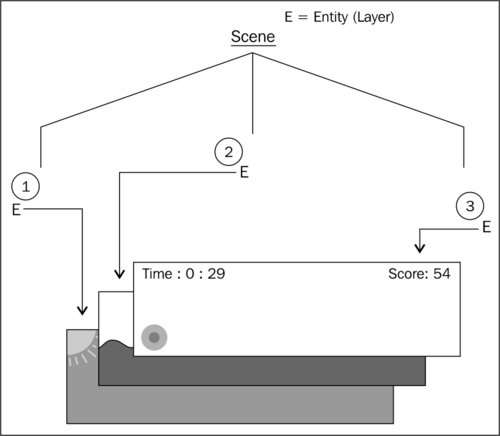
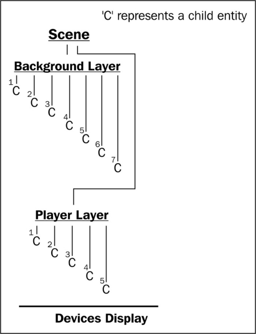
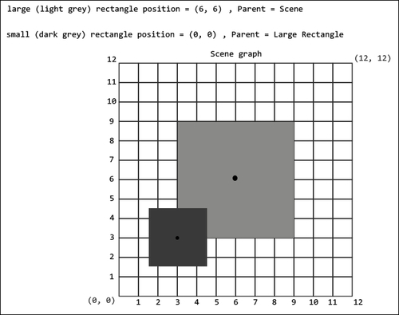
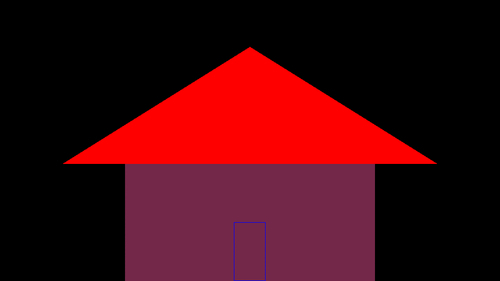
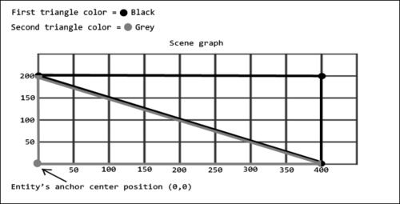
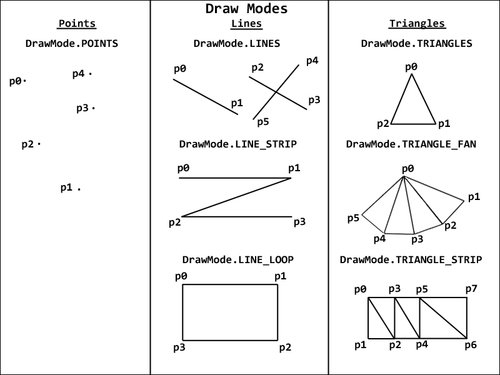
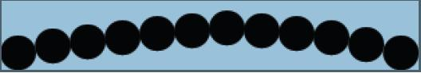
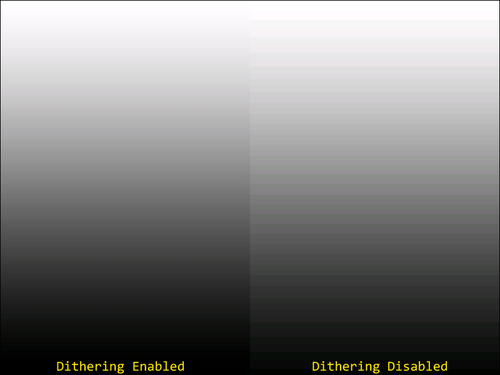
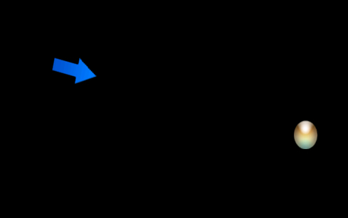

# 第二章：使用实体

在本章中，我们将开始探讨如何在屏幕上显示对象以及我们可以处理这些对象的多种方式。主题包括：

+   理解 AndEngine 实体

+   将原始图形应用到图层

+   使用精灵为场景注入生命

+   将文本应用到图层

+   使用相对旋转

+   重写`onManagedUpdate`方法

+   使用修饰符和实体修饰符

+   使用粒子系统

# 引言

在本章中，我们将开始使用 AndEngine 中包含的所有精彩的实体。实体为我们提供了一个基础，游戏世界中显示的每个对象都将依赖它，无论是分数文本、背景图像、玩家的角色、按钮以及所有其他内容。可以这样想，通过 AndEngine 的坐标系统，我们游戏中任何可以放置的对象在最基本的层面上都是一个实体。在本章中，我们将开始使用`Entity`对象及其许多子类型，以便在我们的游戏中充分利用它们。

# 理解 AndEngine 实体

AndEngine 游戏引擎遵循**实体-组件**模型。实体-组件设计在当今许多游戏引擎中非常普遍，这有充分的理由。它易于使用，模块化，并且在所有游戏对象都可以追溯到单一的、最基本的`Entity`对象的程度上非常有用。实体-组件模型可以被认为是游戏引擎对象系统最基本级别的“实体”部分。`Entity`类只处理我们游戏对象依赖的最基本数据，比如位置、旋转、颜色、与场景的附加和分离等。而“组件”部分指的是`Entity`类的模块化子类型，比如`Scene`、`Sprite`、`Text`、`ParticleSystem`、`Rectangle`、`Mesh`以及所有可以放入我们游戏中的其他对象。组件旨在处理更具体的任务，而实体则作为所有组件依赖的基础。

## 如何操作...

为了从最基础的`Entity`方法开始，我们将一个`Entity`对象附加到`Scene`对象上：

创建并将一个`Entity`对象附加到`Scene`对象只需要以下两行代码：

```kt
Entity layer = new Entity();
mScene.attachChild(layer);
```

## 工作原理...

这里给出的两行代码允许我们创建一个基本的`Entity`对象并将其附加到我们的`Scene`对象上。正如本食谱中*如何操作...*一节所定义的，一个`Entity`对象通常被用作图层。接下来几段将会讨论图层的用途。

实体在游戏开发中非常重要。在 AndEngine 中，事实是，我们场景上显示的所有对象都源自实体（包括`Scene`对象本身！）。在大多数情况下，我们可以假设实体要么是场景上视觉显示的对象，如`Sprite`、`Text`或`Rectangle`对象，要么是一个层，如`Scene`对象。由于`Entity`类的广泛性，我们将分别讨论实体的两种用途，好像它们是不同的对象。

实体的第一个，也可能是最重要的方面是分层能力。在游戏设计中，层是一个非常简单的概念；然而，由于游戏在游戏过程中倾向于支持大量的实体，在初次了解它们时，事情可能会很快变得混乱。我们必须将层视为一个具有一个父级和无限数量的子级的对象，除非另有定义。顾名思义，层的目的在于以有组织的方式将我们的各种实体对象应用到场景上，幸运的是，这也使我们能够对层执行一个会影响其所有子级一致的动作，例如，重新定位和施加某些实体修饰符。我们可以假设，如果我们有一个背景、一个中景和一个前景，那么我们的游戏将会有三个独立的层。这三个层将根据它们附加到场景的顺序以特定的顺序出现，就像将纸张堆叠在一起一样。如果我们从上往下看这个堆叠的纸张，最后添加到堆栈中的纸张将出现在其余纸张的前面。对于附加到`Scene`对象的`Entity`对象，同样的规则适用；这在前面的图片中显示：



前面的图片描绘了一个由三个`Entity`对象层组成的基本游戏场景。这三个层都有特定的目的，即按照深度存储所有相关实体。首先应用到场景的是背景层，包括一个包含蓝天和太阳的精灵。接着应用到场景的是中景层。在这个层上，我们会找到与玩家相关的对象，包括玩家行走的景观、可收集的物品、敌人等等。最后，我们有了前景层，用于在设备的显示屏上显示最前面的实体。在所展示的图中，前景层用于显示用户界面，包括一个按钮和两个`Text`对象。

让我们再次看看一个带有子实体附加层的场景可能是什么样子：



这张图显示了场景如何在屏幕上显示实体的深度/层次。在图的底部，我们有设备的显示。我们可以看到**背景层**首先附属于**场景**，然后是**玩家层**。这意味着附属于背景的实体将位于**玩家层**子实体的后面。记住这一点，这个规则同样适用于子实体。首先附着在层上的子实体在深度上将会位于任何随后附着物体的后面。

最后，关于一般 AndEngine 实体的一个最后一个关键主题是实体组合。在继续之前，我们应该了解的一个事实是*子实体继承父实体的值！*这是许多新的 AndEngine 开发者在设置游戏中的多层时遇到问题的地方。从倾斜、缩放、位置、旋转、可见性等所有属性，当父实体的属性发生变化时，子实体都会考虑在内。查看下面的图，它展示了 AndEngine 中实体的**位置**组合：



首先，我们应该了解在 AndEngine 的锚点中心分支中，坐标系统是从实体的左下角开始的。增加 x 值会将实体位置向右移动，增加 y 值会将实体位置向上移动。减少 x/y 值则会产生相反的效果。有了这个概念，我们可以看到附属于**场景**的较大矩形在**场景**上的位置被设定为坐标**（6, 6）**。由于较小矩形附属于较大矩形，而不是相对于**场景**的坐标系统，它实际上是使用大矩形的坐标系统。这意味着小矩形的锚点中心位置将直接位于大矩形坐标系统的**（0, 0）**位置上。正如我们在前一张图片中看到的，大矩形坐标系统上的**（0, 0）**位置是其左下角。

### 注意

旧的 AndEngine 分支与 AndEngine 最新的锚点中心分支之间的主要区别在于，定位实体不再意味着我们将实体的左上角设置在坐标系统上的一个位置。相反，实体的中心点将被放置在定义的位置上，这也在前面的图中有所展示。

## 还有更多...

AndEngine 中的 `Entity` 对象包含许多不同的方法，这些方法影响实体的许多方面。这些方法在塑造 `Entity` 对象的整体特性方面发挥着至关重要的作用，无论实体的子类型如何。为了完全控制实体的外观、反应、存储信息等，了解如何操作实体是一个好主意。使用以下列表来熟悉 `Entity` 对象的一些最重要的方法及其相应的获取方法。本章及后续章节将详细介绍此列表中未提及的方法。

+   `setVisible(pBoolean)` 和 `isVisible()`: 这个方法可以用来设置实体是否在场景中可见。将这些方法设置为 `true` 将允许实体渲染，设置为 `false` 将禁用渲染。

+   `setChildrenVisible(pBoolean)` 和 `isChildrenVisible()`: 类似于 `setVisible(pBoolean)` 方法，不同之处在于它定义了调用实体的子实体的可见性，而不是自身。

+   `setCullingEnabled(pBoolean)` 和 `isCullingEnabled()`: 实体剔除可能是一种非常有前景的性能优化技术。更多详情请参见第八章中的*通过实体剔除禁用渲染*，*最大化性能*。

+   `collidesWith(pOtherEntity)`: 这个方法用于检测调用此方法的实体与作为此方法参数提供的`Entity`对象发生碰撞或重叠时。如果实体正在碰撞，此方法将返回 `true`。

+   `setIgnoreUpdate(pBoolean)` 和 `isIgnoreUpdate()`: 忽略实体更新可以提供明显的性能提升。更多详情请参见第八章中的*忽略实体更新*，*最大化性能*。

+   `setChildrenIgnoreUpdate(pBoolean)` 和 `isChildrenIgnoreUpdate()`: 类似于 `setIgnoreUpdate(pBoolean)` 方法，不同之处在于它只影响调用实体的子实体，而不是自身。

+   `getRootEntity()`: 这个方法将遍历实体的父实体，直到找到根父实体。找到根父实体后，此方法将返回根 `Entity` 对象；在大多数情况下，根是我们的游戏 `Scene` 对象。

+   `setTag(pInt)` 和 `getTag()`: 这个方法可以用来在实体中存储整数值。通常用于为实体设置标识值。

+   `setParent(pEntity)` 和 `hasParent()`: 将父实体设置为调用此方法的实体。`hasParent()` 方法根据调用实体是否有父实体返回 `true` 或 `false` 值。

+   `setZIndex(pInt)` 和 `getZIndex()`: 设置调用实体的 `Z` 索引。值较大的实体将出现在值较小的实体前面。默认情况下，所有实体的 `Z` 索引都是 `0`，这意味着它们将按照附加的顺序出现。更多详情请参见下面的 `sortChildren()` 方法。

+   `sortChildren()`: 在对实体或实体组的 `Z` 索引进行修改后，必须在它们的父对象上调用此方法，修改后的效果才能在屏幕上显示。

+   `setPosition(pX, pY)` 或 `setPosition(pEntity)`: 此方法用于将实体的位置设置为特定的 x/y 值，或者可以用来设置到另一个实体的位置。此外，我们可以使用 `setX(pX)` 和 `setY(pY)` 方法仅对单个轴的位置进行更改。

+   `getX()` 和 `getY()`: 这些方法用于获取实体的本地坐标位置；即相对于其父对象的位置。

+   `setWidth(pWidth)` 和 `setHeight(pHeight)` 或 `setSize(pWidth, pHeight)`: 这些方法用于设置调用实体的宽度和高度。此外，我们还可以使用 `getWidth()` 和 `getHeight()` 方法，它们将返回各自值作为浮点数据类型。

+   `setAnchorCenter(pAnchorCenterX, pAnchorCenterY)`: 此方法用于设置实体的锚点中心。锚点中心是 `Entity` 对象内部的一个位置，实体将围绕它旋转、倾斜和缩放。此外，修改锚点中心值将重新定位实体的“定位”锚点，从默认的中心点移动。例如，如果我们把锚点中心位置移动到实体的左上角，调用 `setPosition(0,0)` 将会把实体的左上角放置在位置 `(0,0)`。

+   `setColor(pRed, pGreen, pBlue)` 和 `getColor()`: 此方法用于设置实体的颜色，颜色值从 `0.0f`（无颜色）到 `1.0f`（全颜色）不等。

+   `setUserData(pObject)` 和 `getUserData()`: 这两个方法在开发 AndEngine 游戏时非常有用。它们允许我们在实体中存储我们选择的任何对象，并在任何时刻修改或检索它。用户数据存储的一个可能用途是确定玩家角色持有什么类型的武器。充分利用这些方法吧！

# 将原始图形应用于图层

AndEngine 的原始类型包括 `Line`、`Rectangle`、`Mesh` 和 `Gradient` 对象。在本主题中，我们将重点关注 `Mesh` 类。Mesh 对象对于创建游戏中更为复杂的形状非常有用，其应用场景无限广阔。在本教程中，我们将使用 `Mesh` 对象来构建如下所示的房屋：



## 准备工作…

请参考代码包中名为 `ApplyingPrimitives` 的类。

## 如何操作…

为了创建一个`Mesh`对象，我们需要比典型的`Rectangle`或`Line`对象做更多的工作。使用`Mesh`对象有很多好处。它们可以帮助我们加强 OpenGL 坐标系统的技能，我们可以创建形状奇特的原始物体，并且能够改变单个顶点的位置，这对于某些类型的动画来说非常有用。

1.  创建`Mesh`对象的第一步是创建我们的缓冲数据，这些数据用于指定构成网格形状的点：

    ```kt
      float baseBufferData[] = {
          /* First Triangle */
          0, BASE_HEIGHT, UNUSED, /* first point */
          BASE_WIDTH, BASE_HEIGHT, UNUSED, /* second point */
          BASE_WIDTH, 0, UNUSED, 	/* third point */

          /* Second Triangle */
          BASE_WIDTH, 0, UNUSED, /* first point */
          0, 0, UNUSED, /* second point */
          0, BASE_HEIGHT, UNUSED, /* third point */
      };
    ```

1.  一旦缓冲数据配置完成，我们就可以继续创建`Mesh`对象。

    ```kt
    Mesh baseMesh = new Mesh((WIDTH * 0.5f) - (BASE_WIDTH * 0.5f), 0, baseBufferData, baseBufferData.length / POINTS_PER_TRIANGLE, DrawMode.TRIANGLES, mEngine.getVertexBufferObjectManager());
    ```

## 它是如何工作的…

让我们进一步分解这个过程，以了解我们是如何使用原始`Mesh`对象制作房屋的。

在第一步中，我们创建`baseMesh`对象的缓冲数据。这个缓冲数据用于存储 3D 空间中的点。缓冲数据中每三个值，由换行符分隔，构成 3D 世界中的一个顶点。但是，应该明白，由于我们使用的是 2D 游戏引擎，第三个值，即`Z`索引，对我们来说是没有用的。因此，我们将每个顶点的第三个值定义为该食谱类中声明的`UNUSED`常量，等于`0`。每个三角形的点表示为`(x, y, z)`，以避免混淆顺序。请参阅以下图表，了解第一步中定义的点如何绘制到网格上的矩形：



前一个图表展示了在*如何操作…*部分第一步中看到的`baseMesh`对象的缓冲数据，或者说是绘制点。黑色线条代表第一组点：

```kt
      0, BASE_HEIGHT, UNUSED, /* first point */
      BASE_WIDTH, BASE_HEIGHT, UNUSED, /* second point */
      BASE_WIDTH, 0, UNUSED,  /* third point */
```

`baseMesh`对象缓冲数据中的第二组点由灰色线条表示：

```kt
      BASE_WIDTH, 0, UNUSED, /* first point */
      0, 0, UNUSED, /* second point */
      0, BASE_HEIGHT, UNUSED, /* third point */
```

由于`BASE_HEIGHT`等于`200`且`BASE_WIDTH`等于`400`，我们可以读取到第一个三角形的第一个点`(0, BASE_HEIGHT)`位于矩形形状的左上角。顺时针移动，第一个三角形的第二个点位于`(BASE_WIDTH, BASE_HEIGHT)`的位置，这将是矩形形状的右上角。显然，一个三角形由三个点组成，所以这让我们还有一个顶点要绘制。我们第一个三角形的最后一个顶点位于`(BASE_WIDTH, 0)`的位置。作为一个个人挑战，使用前一个图中的场景图，找出灰色三角形的绘制点与缓冲数据相比如何！

在第二步中，我们将`baseMesh`对象的缓冲区数据用来构建`Mesh`对象。`Mesh`对象是`Entity`类的一个子类型，因此一旦我们创建了`Mesh`对象，就可以对其进行重新定位、缩放、旋转以及进行其他必要的调整。按照构造函数中出现的顺序，参数如下：x 轴位置、y 轴位置、缓冲区数据、顶点数量、绘制模式和顶点缓冲对象管理器。前两个参数和最后一个参数对所有实体都是典型的，但缓冲区数据、顶点数量和绘制模式对我们来说是新的。缓冲区数据是数组，它指定了已绘制的顶点，这在第一步中已经介绍过。顶点数量只是缓冲区数据中包含的顶点数。我们缓冲数据中的每一个 x、y、z 坐标组成一个单独的顶点，这就是为什么我们用`baseBufferData.length`值除以三来得到这个参数。最后，`DrawMode`定义了`Mesh`对象将如何解释缓冲区数据，这可以极大地改变网格的最终形状。不同的`DrawMode`类型和用途可以在本主题的*还有更多...*部分中找到。

在继续之前，您可能会注意到“门”，或者更确切地说，代表门的蓝色线条并不是以与屋顶和基础`Mesh`对象相同的方式创建的。相反，我们使用线条而不是三角形来绘制门的外框。请查看以下代码，它来自`doorBufferData`数组，定义了线条连接的点：

```kt
      0, DOOR_HEIGHT, UNUSED, /* first point */
      DOOR_WIDTH, DOOR_HEIGHT, UNUSED, /* second point */
      DOOR_WIDTH, 0, UNUSED, /* third point */
      0, 0, UNUSED, /* fourth point */
      0, DOOR_HEIGHT, UNUSED /* fifth point */
```

再次，如果我们绘制一个场景图，并像之前代表`baseMesh`对象点的图那样标出这些点，我们实际上可以连接这些点，线条将形成一个矩形形状。一开始可能会让人感到困惑，尤其是在试图在脑海中创建形状时。从定义的顶点开始绘制自定义形状的诀窍是，在您喜欢的文档或图像编辑软件中保存一个空白场景图。创建一个类似于`baseMesh`对象缓冲数据表示图的场景图，并使用它来标出点，然后简单地将点复制到代码中！

### 注意事项

需要特别记住的是，在之前场景图中的`(0,0)`位置代表了`Mesh`对象的中心。由于我们是向上和向右构建网格顶点，网格的锚定中心位置将不代表手动绘制的形状的中心！在构建`Mesh`对象时，这一点非常重要。

## 还有更多...

对于初学者来说，创建网格可能是一个相当令人畏惧的主题，但有很多原因让我们习惯它们。AndEngine 开发者们的一个主要原因是它可以帮助我们理解 OpenGL 在较低层次上如何将形状绘制到显示上，这反过来又使我们更容易掌握更高层次的游戏开发功能。以下图片包含了 AndEngine 为我们提供的各种`DrawMode`类型，以便以不同方式创建`Mesh`对象：



前图展示了我们的缓冲数据中的顶点将如何根据所选的`DrawMode`类型由`Mesh`对象绘制到场景中。此图中的每个**p#**代表我们缓冲数据数组中的`顶点（x，y 和 z 值）`。以下是每个`DrawMode`类型的图像表示的解释：

+   `DrawMode.POINTS`：这种选择允许我们在网格的缓冲数据中为每个顶点绘制单独的点。这些点不会由任何线条连接；它们仅仅在网格上为每个点显示一个点。

+   `DrawMode.LINES`：这种选择允许我们在网格上绘制单独的线条。每两个顶点将由线条连接。

+   `DrawMode.LINE_STRIP`：这种选择允许我们在网格上绘制点，第一个点之后的每个点都连接到前一个点。例如，**p1**将连接到**p0**，**p2**将连接到**p1**，依此类推。

+   `DrawMode.LINE_LOOP`：这种选择与`DrawMode.LINE_STRIP`类型类似，但是，第一个点与最后一个点也会由线条连接。这允许我们通过线条创建闭合的形状。

+   `DrawMode.TRIANGLES`：这种选择允许我们在网格上为缓冲数据中定义的每组三个顶点绘制单独的三角形。这种绘制模式要求我们将顶点保持在三的倍数。

+   `DrawMode.TRIANGLE_FAN`：这种选择允许我们绘制锥形或金字塔形状的网格。正如在之前的图中可以看到的，我们首先指定一个点，定义锥形的顶部点，然后继续指定形状的底部点。这种绘制模式需要定义三个或更多的顶点在缓冲数据中。

+   `DrawMode.TRIANGLE_STRIP`：这种选择使我们能够轻松创建自定义的多边形网格。在初始化三角形的第三个顶点之后，缓冲数据中定义的每个顶点都会生成一个新的三角形，创建一个新的“带”。请参阅图表示例。这种绘制模式需要定义三个或更多的顶点在缓冲数据中。

## 另请参阅

+   本章节中提供的*了解 AndEngine 实体*。

# 使用精灵为场景带来生机

我们在这里讨论的可能是创建任何 2D 游戏最必要的一个方面。精灵（Sprites）允许我们在场景中显示 2D 图像，这些图像可以用来展示按钮、角色/化身、环境主题、背景以及游戏中可能需要通过图像文件来表示的任何其他实体。在本教程中，我们将介绍 AndEngine 的`Sprite`实体的各个方面，这将为我们提供在以后更复杂的情况下继续使用`Sprite`对象所需的信息。

## 准备工作...

在深入了解精灵如何创建的内部工作机制之前，我们需要了解如何创建和管理 AndEngine 的`BitmapTextureAtlas`/`BuildableBitmapTextureAtlas`对象以及`ITextureRegion`对象。更多信息，请参考第一章，*AndEngine 游戏结构*中的教程，*使用不同类型的纹理*和*应用纹理选项*。

阅读完这些教程后，创建一个新的空 AndEngine 项目，使用`BaseGameActivity`类，提供一个尺寸最大为 1024 x 1024 像素的 PNG 格式图像，将其命名为`sprite.png`并放在项目的`assets/gfx/`文件夹中，然后继续本教程的*如何操作...*部分。

## 如何操作...

我们只需几个快速步骤就可以创建并将精灵应用到我们的`Scene`对象中。我们首先必须设置精灵将使用的必要纹理资源，创建`Sprite`对象，然后必须将`Sprite`对象附加到我们的`Scene`对象。以下步骤将提供更多详细信息：

1.  我们将从在`BaseGameActivity`类的`onCreateResources()`方法中创建纹理资源开始。确保`mBitmapTextureAtlas`和`mSpriteTextureRegion`对象是全局变量，这样它们就可以在活动的各种生命周期方法中被访问：

    ```kt
      BitmapTextureAtlasTextureRegionFactory.setAssetBasePath("gfx/");

        /* Create the bitmap texture atlas for the sprite's texture region */
        BuildableBitmapTextureAtlas mBitmapTextureAtlas = new BuildableBitmapTextureAtlas(mEngine.getTextureManager(), 256, 256, TextureOptions.BILINEAR);

        /* Create the sprite's texture region via the BitmapTextureAtlasTextureRegionFactory */
        mSpriteTextureRegion = BitmapTextureAtlasTextureRegionFactory.createFromAsset(mBitmapTextureAtlas, this, "sprite.png");

        /* Build the bitmap texture atlas */
        try {
          mBitmapTextureAtlas.build(new BlackPawnTextureAtlasBuilder<IBitmapTextureAtlasSource, BitmapTextureAtlas>(0, 1, 1));
        } catch (TextureAtlasBuilderException e) {
          e.printStackTrace();
        }
        /* Load the bitmap texture atlas into the device's gpu memory */
        mBitmapTextureAtlas.load();
    ```

1.  接下来，我们将创建`Sprite`对象。我们可以在活动的`onCreateScene()`或`onPopulateScene()`方法中创建并附加`Sprite`对象到`Scene`对象。在它的构造函数中需要提供的参数包括，按此顺序，精灵的初始 x 坐标、初始 y 坐标、`ITextureRegion`对象，最后是`mEngine`对象的顶点缓冲区管理器：

    ```kt
        final float positionX = WIDTH * 0.5f;
        final float positionY = HEIGHT * 0.5f;

        /* Add our marble sprite to the bottom left side of the Scene initially */
        Sprite mSprite = new Sprite(positionX, positionY, mSpriteTextureRegion, mEngine.getVertexBufferObjectManager());
    The last step is to attach our Sprite to the Scene, as is necessary in order to display any type of Entity on the device's display:
        /* Attach the marble to the Scene */
        mScene.attachChild(mSpriteTextureRegion);
    ```

## 它的工作原理...

如前一部分的步骤所示，实际上设置`mBitmapTextureAtlas`和`mSpriteTextureRegion`对象比专门创建和设置`mSprite`对象需要更多的工作。因此，建议在开始之前先完成*入门...*部分提到的两个教程。

在第一步中，我们将创建适合我们`sprite.png`图像需求的`mBitmapTextureAtlas`和`mSpriteTextureRegion`对象。在这一步中，请随意使用任何纹理选项或纹理格式。很好地了解它们是非常有想法的。

一旦我们创建了`ITextureRegion`对象并且它已经准备好使用，我们可以进入第二步，创建`Sprite`对象。创建一个精灵是一个直接的任务。前两个参数将用于定义精灵的初始位置，相对于其中心点。对于第三个参数，我们将传递在第一步中创建的`ITextureRegion`对象，以便为场景中的精灵提供图像外观。最后，我们传递`mEngine.getVertexBufferObjectManager()`方法，这是大多数实体子类型所必需的。

一旦我们的`Sprite`对象被创建，我们必须在它能在设备上显示之前将它附加到`Scene`对象，或者我们可以将它附加到已经连接到`Scene`对象的另一个`Entity`对象上。关于实体组合、放置以及其他各种必须了解的`Entity`对象方面，请参阅本章中提供的*了解 AndEngine 实体*食谱。

## 还有更多内容...

没有某种形式的精灵动画，游戏是不完整的。毕竟，玩家只能在游戏中返回这么多次，之后就会对那些角色在屏幕上滑动而不动脚、攻击敌人时不挥舞武器，或者手榴弹只是消失而不是产生漂亮的爆炸效果的游戏感到厌倦。在这个时代，人们想要玩看起来和感觉都很棒的游戏，而像黄油般平滑的动画精灵没有什么能比得上“好极了！”，不是吗？

在第一章，*AndEngine 游戏结构*中的*使用不同类型的纹理*食谱中，我们介绍了如何创建一个`TiledTextureRegion`对象，该对象允许我们将可用的精灵表作为纹理导入到游戏中。现在让我们找出如何使用`TiledTextureRegion`对象与`AnimatedSprite`对象为游戏的精灵添加动画。在这个演示中，代码将处理一个尺寸为 300 x 50 像素的图像。精灵表可以是如图所示的那样简单，以了解如何创建动画：



前图中的精灵表可用于创建一个有 12 列 1 行的`TiledTextureRegion`对象。为这个精灵表创建`BuildableBitmapTextureAtlas`和`TiledTextureRegion`对象可以使用以下代码。但是，在导入这段代码之前，请确保在测试项目中全局声明纹理区域—`TiledTextureRegion mTiledTextureRegion`。

```kt
    /* Create the texture atlas at the same dimensions as the image (300x50)*/
    BuildableBitmapTextureAtlas mBitmapTextureAtlas = new BuildableBitmapTextureAtlas(mEngine.getTextureManager(), 300, 50, TextureOptions.BILINEAR);

    /* Create the TiledTextureRegion object, passing in the usual parameters,
     * as well as the number of rows and columns in our sprite sheet for the 
     * final two parameters */
    mTiledTextureRegion = BitmapTextureAtlasTextureRegionFactory.createTiledFromAsset(mBitmapTextureAtlas, this, "gfx/sprite_sheet.png", 12, 1);

    /* Build and load the mBitmapTextureAtlas object */
    try {
      mBitmapTextureAtlas.build(new BlackPawnTextureAtlasBuilder<IBitmapTextureAtlasSource, BitmapTextureAtlas>(0, 0, 0));
    } catch (TextureAtlasBuilderException e) {
      e.printStackTrace();
    }
    mBitmapTextureAtlas.load();
```

既然我们的项目中已经有了可以操作的`mTiledTextureRegion`精灵表，我们可以创建并动画化`AnimatedSprite`对象。如果你使用的是如图所示带有黑色圆圈的精灵表，别忘了将`Scene`对象的颜色改为非黑色，这样我们才能看到`AnimatedSprite`对象：

```kt
    /* Create a new animated sprite in the center of the scene */
    AnimatedSprite animatedSprite = new AnimatedSprite(WIDTH * 0.5f, HEIGHT * 0.5f, mTiledTextureRegion, mEngine.getVertexBufferObjectManager());

    /* Length to play each frame before moving to the next */
    long frameDuration[] = {100, 200, 300, 400, 500, 600, 700, 800, 900, 1000, 1100, 1200};

    /* We can define the indices of the animation to play between */
    int firstTileIndex = 0;
    int lastTileIndex = mTiledTextureRegion.getTileCount();

    /* Allow the animation to continuously loop? */
    boolean loopAnimation = true;

    * Animate the sprite with the data as set defined above */
    animatedSprite.animate(frameDuration, firstTileIndex, lastTileIndex, loopAnimation, new IAnimationListener(){

      @Override
      public void onAnimationStarted(AnimatedSprite pAnimatedSprite,
          int pInitialLoopCount) {
        /* Fired when the animation first begins to run*/
      }

      @Override
      public void onAnimationFrameChanged(AnimatedSprite pAnimatedSprite,
          int pOldFrameIndex, int pNewFrameIndex) {
         /* Fired every time a new frame is selected to display*/
      }

      @Override
      public void onAnimationLoopFinished(AnimatedSprite pAnimatedSprite,
          int pRemainingLoopCount, int pInitialLoopCount) {
        /* Fired when an animation loop ends (from first to last frame) */
      }

      @Override
      public void onAnimationFinished(AnimatedSprite pAnimatedSprite) {
        /* Fired when an animation sequence ends */
      }
      );

    mScene.attachChild(animatedSprite);
```

创建`AnimatedSprite`对象可以按照本食谱中创建常规`Sprite`对象的步骤进行。一旦创建完成，我们就可以设置其动画数据，包括单个帧的持续时间、要动画化的第一块和最后一块图块索引，以及是否要连续循环动画。注意，`frameDuration`数组必须等于帧数！不遵循此规则将导致抛出`IllegalArgumentException`异常。数据设置完成后，我们可以在`AnimatedSprite`对象上调用`animate()`方法，提供所有数据，并在需要时添加`IAnimationListener`监听器。正如监听器中的注释所示，通过 AndEngine 的`AnimatedSprite`类，我们对动画的控制能力得到了大幅提升。

### 使用 OpenGL 的抖动功能

在移动平台上开发视觉上吸引人的游戏时，我们很可能会希望图像中包含一些渐变，特别是在处理 2D 图形时。渐变非常适合创建光照效果、阴影以及许多其他无法应用于完整 2D 世界的对象。问题在于，我们是为移动设备开发，因此不幸的是，我们无法使用无限量的资源。因此，AndEngine 默认将表面视图的颜色格式下采样为`RGB_565`。无论我们在纹理中定义的纹理格式如何，它们在设备上显示之前总是会被下采样。我们可以更改应用于 AndEngine 表面视图的颜色格式，但在开发包含许多精灵的大型游戏时，性能损失可能不值得。

这里，我们有两张具有渐变纹理的简单精灵的独立屏幕截图；这两种纹理都使用了`RGBA_8888`纹理格式和`BILINEAR`纹理过滤（最高质量）。



右侧的图像未经任何修改就应用到了`Scene`对象上，而左侧的图像启用了 OpenGL 的抖动功能。这两张其他方面相同的图像之间的差异立即显而易见。抖动是我们对抗表面视图应用的降采样的一种很好的方法，而无需依赖最大颜色质量格式。简而言之，通过在图像颜色中加入低级别的随机噪声，结果得到了更平滑的完成效果，如左侧的图像所示。

在 AndEngine 中，为我们的实体应用抖动很简单，但与所有事物一样，明智的做法是选择哪些纹理应用抖动。该算法确实增加了一点额外的开销，如果使用过于频繁，可能会导致比简单地将我们的表面视图恢复为`RGBA_8888`更大的性能损失。在以下代码中，我们在`preDraw()`方法中启用抖动，在`postDraw()`方法中禁用它：

```kt
@Override
protected void preDraw(GLState pGLState, Camera pCamera) {
  // Enable dithering
  pGLState.enableDither();
  super.preDraw(pGLState, pCamera);
}

@Override
protected void postDraw(GLState pGLState, Camera pCamera) {
  // Disable dithering
  pGLState.disableDither();
  super.postDraw(pGLState, pCamera);
}
```

晕染可以应用于 AndEngine 的`Shape`类的任何子类型（`Sprites`、`Text`、基元等）。

### 注意

有关 OpenGL ES 2.0 以及如何使用所有不同函数的更多信息，请访问[`www.khronos.org/opengles/sdk/docs/man/`](http://www.khronos.org/opengles/sdk/docs/man/)。

## 另请参阅

+   在第一章中*处理不同类型的纹理*，*处理实体*

+   在第一章中*应用纹理选项*，*处理实体*。

+   在本章中*了解 AndEngine 实体*。

# 将文本应用到图层

文本是游戏开发的重要组成部分，因为它可以用来动态显示积分系统、教程、描述等。AndEngine 还允许我们通过指定自定义的`Font`对象来创建更适合个别游戏类型的文本样式。在本教程中，我们将创建一个`Text`对象，它会随当前系统时间更新自身，并在字符串长度增长或缩短时调整其位置。这将为我们需要显示分数、时间和其他非特定动态字符串情况下的`Text`对象使用做好准备。

## 准备就绪…

将`Text`对象应用到我们的`Scene`对象需要了解 AndEngine 的字体资源。请执行第一章中的教程，*使用 AndEngine 字体资源*，然后继续本教程的*如何操作…*部分。参考与此食谱活动代码捆绑中的名为`ApplyingText`的类。

## 如何操作…

当我们将`Text`对象应用到我们的`Scene`对象上时，需要创建一个`Font`对象来定义文本的样式，并创建`Text`对象本身。以下步骤将说明我们必须采取的具体操作，以便在我们的场景上正确显示`Text`对象：

1.  创建任何`Text`对象的第一步是为自己准备一个`Font`对象。`Font`对象将作为定义`Text`对象样式的资源。此外，我们还需要准备我们计划让`Text`对象显示的字母：

    ```kt
        mFont = FontFactory.create(mEngine.getFontManager(),
            mEngine.getTextureManager(), 256, 256,
            Typeface.create(Typeface.DEFAULT, Typeface.NORMAL), 32f, true,
            Color.WHITE);
        mFont.load();

        /*
         * Prepare the mFont object for the most common characters used. This
         * will eliminate the need for the garbage collector to run when using a
         * letter/number that's never been used before
         */
          mFont.prepareLetters("Time: 1234567890".toCharArray());
    Once we've got our Font object created and ready for use, we can create the Text:
        /* Create the time Text object which will update itself as time passes */
        Text mTimeText = new Text(0, timeTextHeight, mFont, TIME_STRING_PREFIX
            + TIME_FORMAT, MAX_CHARACTER_COUNT, mEngine.getVertexBufferObjectManager()) {

          // Overridden methods as seen in step 3...
        };
    ```

1.  如果我们处理的是可能永远不会改变的最终字符串，那么只需要涵盖前两个步骤。然而，在本教程中，我们将需要覆盖`Text`实体的`onManagedUpdate()`方法，以便随时间对其字符串进行调整。在本例中，每经过一秒钟，我们就会更新字符串的时间值：

    ```kt
        int lastSecond = 0;

        @Override
        protected void onManagedUpdate(float pSecondsElapsed) {

          Calendar c = Calendar.getInstance();

          /*
          * We will only obtain the second for now in order to verify
           * that it's time to update the Text's string
          */
          final int second = c.get(Calendar.SECOND);

          /*
           * If the last update's second value is not equal to the
          * current...
           */
          if (lastSecond != second) {

          /* Obtain the new hour and minute time values */
            final int hour = c.get(Calendar.HOUR);
            final int minute = c.get(Calendar.MINUTE);

            /* also, update the latest second value */
            lastSecond = second;

             /* Build a new string with the current time */
            final String timeTextSuffix = hour + ":" + minute + ":"
               + second;

            /* Set the Text object's string to that of the new time */
            this.setText(TIME_STRING_PREFIX + timeTextSuffix);

            /*
              * Since the width of the Text will change with every change
             * in second, we should realign the Text position to the
              * edge of the screen minus half the Text's width
            */
            this.setX(WIDTH - this.getWidth() * 0.5f);
          }

          super.onManagedUpdate(pSecondsElapsed);
        }
    Finally, we can make color adjustments to the Text and then attach it to the Scene or another Entity:
        /* Change the color of the Text to blue */
        mTimeText.setColor(0, 0, 1);

        /* Attach the Text object to the Scene */
        mScene.attachChild(mTimeText);
    ```

## 它是如何工作的…

在这一点上，我们应该已经了解了如何创建`Font`对象，因为我们在第一章中已经讨论过。如果还不知道如何创建`Font`对象，请访问第一章中的教程，*使用 AndEngine 字体资源*，*处理实体*。

在第一步中，我们只是创建了一个基本的`Font`对象，它将为我们的`Text`对象创建一个相当通用的样式。创建`Font`对象后，我们只准备`Text`对象在其生命周期内将显示的必要字符，使用`mFont.prepareLetters()`方法。这样做可以避免在`Font`对象内调用垃圾收集器。这个配方中使用的值显然是从`0`到`9`，因为我们处理的是时间，以及组成字符串`Time:`的单个字符。

完成第一步后，我们可以进入第二步，创建`Text`对象。`Text`对象需要我们指定其在屏幕上的初始位置（x 和 y 坐标），使用的`Font`对象样式，要显示的初始字符串，其最大字符数，以及所有`Entity`对象所需的顶点缓冲对象管理器。然而，由于我们处理的这个`Text`对象有一个动态更新的`String`值，这将需要调整 x 轴，包括 x 坐标以及初始字符串在内的参数并不重要，因为它们将在更新`Text`对象时频繁调整。最重要的参数是最大字符数。如果`Text`对象的最大字符数超过了此参数内指定的值，将导致应用程序接收到`ArrayIndexOutOfBoundsException`异常，很可能会需要终止。因此，我们在以下代码片段中累加最大字符串的长度：

```kt
  private static final String TIME_STRING_PREFIX = "Time: ";
  private static final String TIME_FORMAT = "00:00:00";

  /* Obtain the maximum number of characters that our Text 
   * object will need to display*/
  private static final int MAX_CHARACTER_COUNT = TIME_STRING_PREFIX.length() + TIME_FORMAT.length();
```

在第三步中，我们覆盖了`Text`对象的`onManagedUpdate()`方法，以便在每秒过去后对`Text`对象的字符串应用更改。首先，我们只需获取设备的当前秒值，用它来与上一次调用`Text`对象的`onManagedUpdate()`方法中的秒值进行比较。这样，我们可以避免在每次更新时都使用系统时间更新`Text`对象。如果`Text`对象字符串上次更新的秒值与新的秒值不同，那么我们继续通过`Calendar.getInstance().get(HOUR)`方法和`MINUTE`变体获取当前的分钟和小时值。现在我们已经获得了所有的值，我们构建了一个包含更新时间的新字符串，并在`Text`对象上调用`setText(pString)`来更改它将在设备上显示的字符串。

然而，由于每个单独的字符宽度可能具有不同的值，我们也需要调整位置，以保持整个`Text`对象在屏幕上。默认情况下，锚点位置被设置为`Entity`对象的中心，因此通过调用`this.setX(WIDTH - this.getWidth() * 0.5f)`（其中`this`指的是`Text`对象），我们将实体最中心的点定位在屏幕最大宽度右侧，然后减去实体宽度的一半。这将允许文本即使在其字符改变了`Text`对象的宽度后，也能沿着屏幕边缘正确显示。

## 还有更多...

有时我们的游戏可能需要对`Text`对象的字符串进行一些格式化处理。在我们需要调整`Text`对象的水平对齐方式、如果字符串超出一定宽度则对文本应用自动换行，或者在文本前添加一个空格的情况下，我们可以使用一些非常易于使用的方法。以下方法可以直接在`Text`对象上调用；例如，`mText.setLeading(3)`：

+   `setAutoWrap(pAutoWrap)`: 这个方法允许我们定义`Text`实体是否执行自动换行，以及如何执行。我们可以为参数选择的选项包括`AutoWrap.NONE`、`AutoWrap.LETTERS`、`AutoWrap.WORDS`和`AutoWrap.CJK`。使用`LETTERS`时，行中断不会在空白前等待，而`WORDS`会等待。`CJK`变体是允许对中、日、韩字符进行自动换行的选项。这个方法应该与`setAutoWrapWidth(pWidth)`一起使用，其中`pWidth`定义了`Text`对象字符串中任意单行的最大宽度，在需要时导致换行。

+   `setHorizontalAlign(pHorizontalAlign)`: 这个方法允许我们定义`Text`对象字符串应遵循的对齐类型。参数包括`HorizontalAlign.LEFT`、`HorizontalAlign.CENTER`和`HorizontalAlign.RIGHT`。其结果类似于我们在文本编辑器内设置对齐时看到的效果。

+   `setLeading(pLeading)`: 这个方法允许我们在`Text`对象字符串的开始处设置一个前置空间。所需的参数是一个浮点值，它定义了字符串的前导宽度。

## 另请参阅

+   在第一章中*使用 AndEngine 字体资源*，*处理实体*。

+   在本章中*覆盖 onManagedUpdate 方法*。

# 使用相对旋转

在 2D 空间中相对于其他实体的位置旋转实体是一个很棒的功能。相对旋转的使用是无限的，并且似乎总是移动游戏开发新手中的“热门话题”。这种技术被广泛应用的一个较为突出的例子是在塔防游戏中，它允许塔的炮塔朝向敌人（非玩家角色）行走的方向。在这个示例中，我们将介绍一种旋转我们的`Entity`对象的方法，以便它们指向给定的 x/y 位置。以下图像展示了我们如何在场景上创建一个箭头，它会自动指向圆形图像的位置，无论它移动到哪里：



## 准备工作…

这个示例我们需要包含两个图像；一个名为`marble.png`，尺寸为 32x32 像素，另一个名为`arrow.png`，宽 31 像素，高 59 像素。弹珠可以是任何图像，我们只需随意在场景中拖动这个图像。箭头图像应该呈箭头形状，图像上的箭头直接朝上。请参考引言中的屏幕截图以了解需要包含的图像示例。将这些资源包含在空的`BaseGameActivity`测试项目中，然后请参考代码包中的名为`RelativeRotation`的类。

## 如何操作…

按照以下步骤操作：

1.  在`BaseGameActivity`类中实现`IOnSceneTouchListener`监听器：

    ```kt
    public class RelativeRotation extends BaseGameActivity implements IOnSceneTouchListener{
    ```

1.  在`onCreateScene()`方法中设置`Scene`对象的`onSceneTouchListener`：

    ```kt
    mScene.setOnSceneTouchListener(this);
    ```

1.  使用弹珠和小箭头的图像填充`Scene`对象。小箭头图像位于场景中心，而弹珠的位置会更新为任意触摸事件位置的坐标：

    ```kt
        /* Add our marble sprite to the bottom left side of the Scene initially */
        mMarbleSprite = new Sprite(mMarbleTextureRegion.getWidth(), mMarbleTextureRegion.getHeight(), mMarbleTextureRegion, mEngine.getVertexBufferObjectManager());

        /* Attach the marble to the Scene */
        mScene.attachChild(mMarbleSprite);

        /* Create the arrow sprite and center it in the Scene */
        mArrowSprite = new Sprite(WIDTH * 0.5f, HEIGHT * 0.5f, mArrowTextureRegion, mEngine.getVertexBufferObjectManager());

        /* Attach the arrow to the Scene */
        mScene.attachChild(mArrowSprite);
    ```

1.  第四步介绍了`onSceneTouchEvent()`方法，它通过设备显示上的触摸事件处理弹珠图像的移动：

    ```kt
      @Override
      public boolean onSceneTouchEvent(Scene pScene, TouchEvent pSceneTouchEvent) {
        // If a user moves their finger on the device
        if(pSceneTouchEvent.isActionMove()){

          /* Set the marble's position to that of the touch even coordinates */
         mMarbleSprite.setPosition(pSceneTouchEvent.getX(), pSceneTouchEvent.getY());

          /* Calculate the difference between the two sprites x and y coordinates */
          final float dX = mMarbleSprite.getX() - mArrowSprite.getX();
          final float dY = mMarbleSprite.getY() - mArrowSprite.getY();

          /* Calculate the angle of rotation in radians*/
          final float angle = (float) Math.atan2(-dY, dX);
          /* Convert the angle from radians to degrees, adding the default image rotation */
          final float rotation = MathUtils.radToDeg(angle) + DEFAULT_IMAGE_ROTATION;

          /* Set the arrow's new rotation */
          mArrowSprite.setRotation(rotation);

          return true;
        }

        return false;
      }
    ```

## 工作原理…

在这个类中，我们创建了一个由箭头图像表示的精灵，并将其放置在屏幕正中心，自动指向由弹珠表示的另一个精灵。通过在`BaseGameActivity`类中实现`IOnSceneTouchListener`监听器，弹珠可以拖动。然后，我们将触摸监听器注册到`mScene`对象。在实体根据另一个实体的位置进行旋转的情况下，我们不得不在某个持续更新的方法中包含旋转功能，否则我们的箭头不会持续反应。我们可以通过更新线程来实现这一点，但在这个实例中，我们将在重写的`onSceneTouchEvent()`方法中包含该功能，因为直到我们触摸场景，“目标”实际上不会移动。

在第一步中，我们通过实现`IOnSceneTouchListener`接口，允许我们的活动重写`onSceneTouchEvent()`方法。一旦我们实现了触摸监听器，就可以进行第二步，让`Scene`对象接收触摸事件，并根据活动重写的`onSceneTouchEvent()`方法中的代码做出响应。这是通过`setOnSceneTouchListener(pSceneTouchListener)`方法完成的。

在第四步中，`if(pSceneTouchEvent.isActionMove())`条件语句判断是否有一个手指在场景上移动，更新大理石的位置，并在条件语句返回`true`时计算箭头精灵的新旋转。

我们首先通过以下代码段中看到的`setPosition(pX, pY)`方法，将大理石的位置更新到触摸的位置：

```kt
mMarbleSprite.setPosition(pSceneTouchEvent.getX(), pSceneTouchEvent.getY());
```

接下来，我们从目标的 x/y 坐标中减去指针的 x/y 坐标。这为我们提供了每个精灵坐标之间的差值，这将用于计算两个位置之间的角度。在这种情况下，指针是`mArrowSprite`对象，目标是`mMarbleSprite`对象：

```kt
/* Calculate the difference between the two sprites x and y coordinates */
final float dX = mMarbleSprite.getX() - mArrowSprite.getX();
final float dY = mMarbleSprite.getY() - mArrowSprite.getY();

/* Calculate the angle of rotation in radians*/
final float angle = (float) Math.atan2(-dY, dX);
```

最后，由于 AndEngine 的`setRotation(pRotation)`方法使用度数，而`atan2(pY, pX)`方法返回弧度，我们必须进行简单的转换。我们将使用 AndEngine 的`MathUtils`类，其中包括一个`radToDeg(pRadian)`方法，将我们的角度值从弧度转换为度数。一旦我们获得了正确的度数角度，我们将设置`mArrowSprite`对象的旋转：

```kt
/* Convert the angle from radians to degrees, adding the default image rotation */
final float rotation = MathUtils.radToDeg(angle) + DEFAULT_IMAGE_ROTATION;

/* Set the arrow's new rotation */
mArrowSprite.setRotation(rotation);
```

需要注意的最后一点是，`DEFAULT_IMAGE_ROTATION`值是一个表示`90`度的`int`值。这个值仅用于偏移`mArrowSprite`精灵的旋转，否则我们将需要在我们的图像编辑软件中适当旋转图像。如果自定义图像中的指针没有指向图像的最顶部，这个值可能需要调整，以便将指针与目标对齐。

# 重写`onManagedUpdate`方法

重写`Entity`对象的`onManagedUpdate()`方法在所有类型的情况下都非常有用。这样做，我们可以让我们的实体在每次通过更新线程更新实体时执行代码，每秒发生多次，除非实体被设置为忽略更新。可能性非常多，包括动画化我们的实体，检查碰撞，产生定时事件等等。使用我们的`Entity`对象的`onManagedUpdate()`方法还可以节省我们为单一实体创建和注册新的定时处理器以处理基于时间的事件。

## 准备就绪…

这个示例需要具备对 AndEngine 中`Entity`对象的基本了解。请阅读本章提供的*了解 AndEngine 实体*的整个示例，然后创建一个新的空 AndEngine 项目，包含一个`BaseGameActivity`类，并参考代码包中名为`OverridingUpdates`的类。

## 如何操作…

在这个示例中，我们将创建两个`Rectangle`对象。一个矩形将保持场景中心位置，持续旋转。第二个矩形将在场景中从左到右、从下到上连续移动，当到达右侧时重置回左侧，当到达场景顶部时重置回底部。此外，移动的矩形在与中心矩形碰撞时将变为绿色。所有这些移动和条件判断都将通过每个对象重写的`onManagedUpdate(pSecondsElapsed)`方法来应用和执行。

1.  重写第一个`Rectangle`对象的`onManagedUpdate()`方法，以实现连续旋转：

    ```kt
        /* Value which defines the rotation speed of this Entity */
        final int rotationIncrementalFactor = 25;

        /* Override the onManagedUpdate() method of this Entity */
        @Override
        protected void onManagedUpdate(float pSecondsElapsed) {

          /* Calculate a rotation offset based on time passed */
          final float rotationOffset = pSecondsElapsed * rotationIncrementalFactor;

          /* Apply the rotation offset to this Entity */
          this.setRotation(this.getRotation() + rotationOffset);

          /* Proceed with the rest of this Entity's update process */
          super.onManagedUpdate(pSecondsElapsed);
        }
    ```

1.  重写第二个`Rectangle`对象的`onManagedUpdate()`方法，以实现连续的位置更新、条件检查和碰撞检测：

    ```kt
        /* Value to increment this rectangle's position by on each update */
        final int incrementXValue = 5;

        /* Obtain half the Entity's width and height values */
        final float halfWidth = this.getWidth() * 0.5f;
        final float halfHeight = this.getHeight() * 0.5f;

        /* Override the onManagedUpdate() method of this Entity */
        @Override
        protected void onManagedUpdate(float pSecondsElapsed) {

          /* Obtain the current x/y values */
          final float currentX = this.getX();
          final float currentY = this.getY();

          /* obtain the max width and next height, used for condition checking */
          final float maxWidth = currentX + halfWidth;
          final float nextHeight = currentY + halfHeight;

          // On every update...
          /* Increment the x position if this Entity is within the camera WIDTH */
           if(maxWidth <= WIDTH){
            /* Increase this Entity's x value by 5 pixels */
            this.setX(currentX + incrementXValue);
          } else {
            /* Reset the Entity back to the bottom left of the Scene if it exceeds the mCamera's
            * HEIGHT value */
            if(nextHeight >= HEIGHT){
            this.setPosition(halfWidth, halfHeight);
            } else {
              /* if this Entity reaches the WIDTH value of our camera, move it
               * back to the left side of the Scene and slightly increment its y position */
              this.setPosition(halfWidth, nextHeight);
            }
          }

           /* If the two rectangle's are colliding, set this rectangle's color to GREEN */
          if(this.collidesWith(mRectangleOne) && this.getColor() != org.andengine.util.adt.color.Color.GREEN){
          this.setColor(org.andengine.util.adt.color.Color.GREEN);

          /* If the rectangle's are no longer colliding, set this rectangle's color to RED */
          } else if(this.getColor() != org.andengine.util.adt.color.Color.RED){
          this.setColor(org.andengine.util.adt.color.Color.RED);
          }

          /* Proceed with the rest of this Entity's update process */
          super.onManagedUpdate(pSecondsElapsed);
       }
    ```

## 工作原理…

在我们创建的第一个`Rectangle`对象中，我们重写其`onManagedUpdate(pSecondsElapsed)`方法，以持续更新旋转到新值。对于第二个`Rectangle`对象，我们使其从屏幕最左侧连续移动到最右侧。当第二个矩形到达屏幕最右侧时，它会被重新定位到左侧，并将场景中的`Rectangle`对象提高半个`Rectangle`对象的高度。此外，当两个矩形重叠时，移动的矩形将改变颜色为绿色，直到它们不再接触。

第一步的代码允许我们在每次实体更新时创建一个事件。在这个特定的重写方法中，我们基于自上次更新以来经过的秒数计算`Rectangle`对象的旋转偏移量。因为实体每秒更新多次，具体取决于设备能够达到的每秒帧数，我们将`pSecondsElapsed`乘以`25`以稍微增加旋转速度。否则，我们每次更新时将使实体沿`0.01`度旋转，那样物体以该速率完成一次完整旋转将需要相当长的时间。我们可以在处理更新时利用`pSecondsElapsed`更新，以便基于自上次更新以来经过的时间对事件进行修改。

第二步比第一步要复杂一些。在第二步中，我们覆盖了第二个矩形的`onManagedUpdate()`方法，以便在每次实体更新时执行位置检查、碰撞检查以及更新矩形的定位。首先，我们声明了一些变量，这些变量将包含如实体当前位置、实体的半宽和半高值以便从锚点中心正确偏移，以及用于检查位置的下一个更新位置等值。这样做可以减少实体更新过程中所需计算的数量。如果在更新线程中应用了优化不佳的代码，很快就会导致帧率降低。尽可能多地使用方法调用和计算是很重要的；例如，在`onManagedUpdate()`方法中多次获取`currentX`值，比多次调用`this.getX()`更为理想。

继续第二步中的位置检查和更新，我们首先确定矩形的锚点中心加上其半宽（由`maxWidth`变量表示）是否小于或等于表示显示最右侧坐标的`WIDTH`值。如果为真，我们会将矩形的 x 坐标增加`incrementXValue`，即 5 个像素。另一方面，如果`nextHeight`值大于或等于摄像机的`HEIGHT`值，我们会将矩形对象重置回场景的左下角；或者如果矩形还没有到达显示顶部，只需将矩形的宽度增加其半宽并返回到左侧。

最后，我们在第二个`Rectangle`对象的`onManagedUpdate()`方法中拥有了碰撞检查方法。通过调用`this.collidesWith(mRectangleOne)`，我们可以确定`this`对象是否与指定对象（在本例中是`mRectangleOne`）发生重叠。然后我们会进行一个额外的检查，以确定如果检测到碰撞，颜色是否已经等于我们打算将`Rectangle`对象改变成的颜色；如果条件返回`true`，则将`Rectangle`对象设置为绿色。然而，如果每个更新都由多个`Entity`对象执行，`collidesWith()`可能是一个相当昂贵的碰撞检查方法！在这个示例中，我们纯粹是将此碰撞检查方法作为示例。一个可以考虑的选项是在执行碰撞检测之前，对两个对象进行轻量级的距离检测。

## 还有更多…

如前所述，*所有子对象都会从其父对象接收到更新调用*。在这种情况下，子实体也继承了父级修改后的`pSecondsElapsed`值。我们甚至可以通过重写其`onManagedUpdate()`方法并减少`pSecondsElapsed`值，来减慢整个`Scene`对象及其所有子对象的运行速度，如下所示：

```kt
super.onManagedUpdate(pSecondsElapsed * 0.5f);
```

将等于`pSecondsElapsed`值一半的返回值传递给`super`方法，将导致所有附加到该`Scene`对象的实体在各个方面都减慢一半。这是在考虑游戏暂停或创建慢动作效果选项时需要记住的一点小技巧。

# 使用修改器和实体修改器

AndEngine 为我们提供了所谓的**修改器**和**实体修改器**。通过使用这些修改器，我们可以非常轻松地为实体应用整洁的效果。这些修改器在定义的时间范围内对`Entity`对象应用特定的变化，如移动、缩放、旋转等。此外，我们还可以为实体修改器包含监听器和缓动函数，以完全控制它们的工作方式，这使得它们成为在我们的`Scene`对象中应用某些类型动画的最强大方法之一。

### 注意

在继续之前，我们应该提到 AndEngine 中的修改器和实体修改器是两个不同的对象。修改器是直接应用于实体，随时间修改实体的属性，如缩放、移动和旋转。而实体修改器则用作任何数量的修改器的容器，处理一组修改器的执行顺序。这将在本食谱的后续内容中进一步讨论。

## 准备就绪…

此食谱需要了解 AndEngine 中`Entity`对象的基础知识。请阅读本章提供的*了解 AndEngine 实体*的整个食谱，然后创建一个新的空 AndEngine 项目，包含一个`BaseGameActivity`类，然后参考此食谱中的*如何操作…*部分。

## 如何操作…

在此食谱中，我们将介绍 AndEngine 的实体修改器，包括修改器监听器和缓动函数，以应用平滑的过渡效果。如果这听起来令人困惑，不必害怕！AndEngine 的修改器实际上非常易于使用，只需几个基本步骤就可以为我们的`Entity`对象应用不同类型的动画。以下步骤涵盖了设置具有移动修改器的`Entity`对象，这将引导我们进一步讨论实体修改器。将这些步骤中的代码导入到活动的`onPopulateScene()`方法中：

1.  创建并附加任何类型的实体到`Scene`对象。我们将为这个实体应用实体修改器：

    ```kt
    /* Define the rectangle's width/height values */
    final int rectangleDimensions = 80;

    /* Define the initial rectangle position in the bottom 
     * left corner of the Scene */
    final int initialPosition = (int) (rectangleDimensions * 0.5f);

    /* Create the Entity which we will apply modifiers to */
    Rectangle rectangle = new Rectangle(initialPosition, initialPosition, rectangleDimensions, rectangleDimensions, mEngine.getVertexBufferObjectManager());

    /* Set the rectangle's color to white so we can see it on the Scene */
    rectangle.setColor(org.andengine.util.adt.color.Color.WHITE);

    /* Attach the rectangle to the Scene */
    mScene.attachChild(rectangle);
    ```

1.  一旦我们在`Scene`对象上放置了一个实体，我们就可以开始创建我们的修改器了。在这一步中，我们将创建一个`MoveModifier`对象，它允许我们随时间对实体的位置进行更改。但首先，我们将定义其值：

    ```kt
    /* Define the movement modifier values */
    final float duration = 3;
    final float fromX = initialPosition;
    final float toX = WIDTH - rectangleDimension * 0.5f;
    final float fromY = initialPosition;
    final float toY = HEIGHT - rectangleDimension * 0.5f;

    /* Create the MoveModifier with the defined values */
    MoveModifier moveModifier = new MoveModifier(duration, fromX, fromY, toX, toY);
    ```

1.  现在我们已经创建并设置好了`moveModifier`对象，我们可以通过以下调用将此修改器注册到我们希望的任何实体上，这将开始移动效果：

    ```kt
    /* Register the moveModifier to our rectangle entity */
    rectangle.registerEntityModifier(moveModifier);
    ```

## 它的工作原理是……

实体修改器的话题相当广泛，因此我们将从步骤开始深入。从那里，我们将使用这些步骤作为基础，以便进一步深入到关于实体修改器使用更复杂的讨论和示例。

在第一步中，我们只是创建了一个`Entity`对象，在这个案例中是一个`Rectangle`，我们将用它作为应用修改器的测试对象。只需将此步骤中的代码添加到`onPopulateScene()`方法中；在接下来的修改器和实体修改器“实验”中，这段代码将保持不变。

在第二步中，我们将开始使用最基本的修改器之一，当然是`MoveModifier`。这个修改器允许我们定义移动的起始位置、结束位置以及从起点到终点移动所需的秒数。正如我们所看到的，这非常简单，修改器最值得注意的是，在大多数情况下，这就是设置大多数修改器所需的全部内容。所有修改器真正需要的是一个“from”值、一个“to”值以及定义“from-to”发生秒数的时长。记住这一点，在大多数情况下，使用修改器将会非常轻松！

接下来，在第三步中，我们只需通过`registerEntityModifier(pModifier)`方法将我们新创建的`moveModifier`对象应用到`rectangle`对象上。这将使`moveModifier`效果应用到矩形上，首先将其定位到“from”坐标，然后在 3 秒的时间内移动到“to”坐标。

我们知道，要向`Entity`对象注册修改器或实体修改器，可以调用`entity.registerEntityModifier(pEntityModifier)`，但我们也应该知道，一旦完成修改器，我们应该将其从`Entity`对象中移除。我们可以通过调用`entity.unregisterEntityModifier(pEntityModifier)`来实现，或者如果我们想移除附加到`Entity`对象的所有实体修改器，可以调用`entity.clearEntityModifiers()`。另一方面，如果一个修改器或实体修改器运行了完整的时长，而我们还没有准备好从实体中移除它，我们必须调用`modifier.reset()`以重新播放效果。或者，如果我们想在重新播放效果之前对修改器进行微调，可以调用`modifier.reset(duration, fromValue, toValue)`。其中`reset`方法中的参数将相对于我们要重置的修改器类型。

`moveModifier`对象有效，但它非常无聊！毕竟，我们只是在将一个矩形从场景的左下角移动到右上角。幸运的是，这只是修改器应用表面的刮擦。以下小节包含了 AndEngine 能够应用到我们的`Entity`对象的所有修改器的参考，必要时还提供了示例。

### AndEngine 的修改器

以下是我们可以应用到实体上的所有 AndEngine 修改器的集合。更高级的修改器将提供一个快速示例代码片段。在介绍它们时，请随意在您的测试项目中尝试：

+   `AlphaModifier`：使用这个修改器，可以随时间调整实体的透明度值。构造函数的参数包括持续时间、起始透明度和结束透明度，依次排列。

+   `ColorModifier`：使用这个修改器，可以随时间调整实体的颜色值。构造函数的参数包括持续时间、起始红色、结束红色、起始绿色、结束绿色、起始蓝色和结束蓝色，依次排列。

+   `DelayModifier`：这个修改器旨在分配给实体修改器对象，以便在一个修改器被执行和另一个修改器被执行之间提供延迟。参数包括持续时间。

+   `FadeInModifier`：基于`AlphaModifier`类，`FadeInModifier`修改器在定义的持续时间内在构造函数中提供，将实体的透明度值从`0.0f`更改为`1.0f`。

+   `FadeOutModifier`：与`FadeOutModifier`类似，只不过透明度值被交换了。

+   `JumpModifier`：这个修改器可以用来向实体应用“跳跃”动作。参数包括持续时间、起始 X、结束 X、起始 Y、结束 Y 和跳跃高度。这些值将定义在定义的持续时间内在视觉上实体跳跃的距离和高度。

+   `MoveByModifier`：这个修改器允许我们偏移实体的位置。参数包括持续时间、X 偏移和 Y 偏移，依次排列。例如，指定一个偏移量为`-15`将使实体在场景上向左移动 15 个单位。

+   `MoveXModifier`和`MoveYModifier`：这些修改器与`MoveModifier`类似，允许我们向实体提供移动。然而，这些方法只根据方法名称确定在单个轴上应用移动。参数包括持续时间、起始坐标和结束坐标，依次排列。

+   `RotationAtModifier`：这个修改器允许我们在偏移旋转中心的同时向实体应用旋转。参数包括持续时间、起始旋转、结束旋转、旋转中心 X 和旋转中心 Y。

+   `RotationByModifier`：这个修改器允许我们偏移实体的当前旋转值。参数包括持续时间和旋转偏移值。例如，提供一个旋转偏移值为`90`将使实体顺时针旋转九十度。

+   `RotationModifier`：这个修改器允许我们从一个特定值旋转实体到另一个特定值。参数包括持续时间、起始旋转和目标旋转。

+   `ScaleAtModifier`：这个修改器允许我们在缩放时偏移缩放中心来缩放实体。参数包括持续时间、起始缩放、目标缩放、缩放中心 x 和缩放中心 y。

+   `ScaleModifier`：这个修改器允许我们从一个特定值缩放实体到另一个特定值。参数包括持续时间、起始缩放和目标缩放，按此顺序。

+   `SkewModifier`：这个修改器允许我们随时间改变实体的 x 和 y 值。参数包括持续时间、起始斜切 x、目标斜切 x、起始斜切 y 和目标斜切 y，顺序是特定的。

+   `PathModifier`：这个修改器相对于`MoveModifier`，不过我们可以添加任意多的“到”坐标。这使得我们可以在`Scene`对象上为实体创建一个路径，通过为`PathModifier`修改器指定 x/y 坐标对来跟随。在以下步骤中，我们将了解如何为我们的实体创建一个`PathModifier`修改器：

    1.  定义路径的航点。x 和 y 坐标的航点数组应该具有相同数量的点，因为它们将按顺序配对以形成`PathModifier`的单个 x/y 坐标。我们必须在每个数组中至少设置两个点，因为我们需要至少一个起始点和结束点：

        ```kt
            /* Create a list which specifies X coordinates to follow */
            final float pointsListX[] = {
                initialPosition, /* First x position */
                WIDTH - initialPosition, /* Second x position */
                WIDTH - initialPosition, /* Third x position */
                initialPosition, /* Fourth x position */
                initialPosition /* Fifth x position */
            };

            /* Create a list which specifies Y coordinates to follow */
            final float pointsListY[] = {
                initialPosition, /* First y position */
                HEIGHT - initialPosition, /* Second y position */
                initialPosition, /* Third y position */
                HEIGHT - initialPosition, /* Fourth y position */
                initialPosition /* Fifth y position */
            };
        ```

    1.  创建一个`Path`对象，我们将使用它将分开数组中的各个点配对成航点。我们通过遍历数组并在`path`对象上调用`to(pX, pY)`方法来实现这一点。请注意，每次我们调用这个方法，我们都在`path`对象中添加一个额外的航点：

        ```kt
            /* Obtain the number of control points we have */
            final int controlPointCount = pointsListX.length;

            /* Create our Path object which we will pair our x/y coordinates into */
            org.andengine.entity.modifier.PathModifier.Path path = new Path(controlPointCount);

            /* Iterate through our point lists */
            for(int i = 0; i < controlPointCount; i++){
              /* Obtain the coordinates of the control point at the index */
              final float positionX = pointsListX[i];
              final float positionY = pointsListY[i];

              /* Setup a new way-point by pairing together an x and y coordinate */
              path.to(positionX, positionY);
            }
        ```

    1.  最后，一旦我们定义了航点，就可以创建`PathModifier`对象，提供持续时间以及我们的`path`对象作为参数：

        ```kt
            /* Movement duration */
            final float duration = 3;
            /* Create the PathModifier */
            PathModifier pathModifier = new PathModifier(duration, path);

            /* Register the pathModifier object to the rectangle */
            rectangle.registerEntityModifier(pathModifier);
        ```

+   `CardinalSplineMoveModifier`：这是我们最后要讨论的修改器。这个修改器与`PathModifier`修改器相对相似，不过我们可以对`Entity`对象的移动施加张力。这允许在接近拐角或改变方向时实现更流畅和平滑的移动，实际上看起来相当不错。在以下步骤中，我们将了解如何为我们的实体创建一个`CardinalSplineMoveModifier`修改器：

    1.  第一步与`PathModifier`修改器类似，是创建我们的点数组。在这个例子中，我们可以从`PathModifier`示例的第一步复制代码。然而，这个修改器与`PathModifier`对象的一个区别在于，我们需要至少 4 个单独的 x 和 y 点。

    1.  第二步是确定控制点的数量，定义张力，并创建一个`CardinalSplineMoveModifierConfig`对象。这是`CardinalSplineMoveModifier`修改器的`PathModifier`修改器中`Path`对象的等价物。张力可以在`-1`到`1`之间，不能多也不能少。张力为`-1`将使`Entity`对象的移动非常松散，在转角和方向变化时非常松散；而张力为`1`将非常像`PathModifier`修改器，在移动上非常严格：

        ```kt
            /* Obtain the number of control points we have */
            final int controlPointCount = pointsListX.length;

            /* Define the movement tension. Must be between -1 and 1 */
            final float tension = 0f;

            /* Create the cardinal spline movement modifier configuration */
            CardinalSplineMoveModifierConfig config = new CardinalSplineMoveModifierConfig(controlPointCount, tension);
        ```

    1.  在第三步中，与`PathModifier`修改器非常相似，我们必须将 x/y 坐标配对在我们的点数组中，不过在这个情况下，我们是将它们存储在`config`对象中：

        ```kt
            /* Iterate through our control point indices */
            for(int index = 0; index < controlPointCount; index++){

              /* Obtain the coordinates of the control point at the index */
              final float positionX = pointsListX[index];
              final float positionY = pointsListY[index];

              /* Set position coordinates at the current index in the config object */
              config.setControlPoint(index, positionX, positionY);
            }
        ```

    1.  接下来，我们只需简单地定义移动的持续时间，创建`CardinalSplineMoveModifier`修改器，提供持续时间和`config`对象作为参数，并最终将修改器注册到`Entity`对象上：

        ```kt
            /* Movement duration */
            final float duration = 3;

            /* Create the cardinal spline move modifier object */
            CardinalSplineMoveModifier cardinalSplineMoveModifier = new CardinalSplineMoveModifier(duration, config);

            /* Register the cardinalSplineMoveModifier object to the rectangle object */
            rectangle.registerEntityModifier(cardinalSplineMoveModifier);
        ```

现在我们已经对可以应用到实体上的各个修改器有了深入的理解，我们将介绍 AndEngine 中的三个主要实体修改器以及它们的用途。

### AndEngine 的实体修改器

AndEngine 包含三种实体修改器对象，用于通过将两个或更多修改器组合成一个单一事件或序列，为我们的`Entity`对象构建复杂的动画。这三种不同的实体修改器包括`LoopEntityModifier`、`ParallelEntityModifier`和`SequenceEntityModifier`对象。接下来，我们将描述这些实体修改器的具体细节和示例，展示如何将它们组合成单一动画事件。

+   `LoopEntityModifier`：这个实体修改器允许我们无限次数或指定次数（如果提供了第二个`int`参数）循环指定的修改器。这是最简单的实体修改器。一旦我们设置好了`LoopEntityModifier`，就可以直接将其应用于`Entity`对象：

    ```kt
        /* Define the move modifiers properties */
        final float duration = 3;
        final float fromX = 0;
        final float toX = 100;

        /* Create the move modifier */
        MoveXModifier moveXModifier = new MoveXModifier(duration, fromX, toX);

        /* Create a loop entity modifier, which will loop the move modifier
         *  indefinitely, or until unregistered from the rectangle.
         *  If we want to provide a loop count, we can add a second int parameter 
         *  to this constructor */
        LoopEntityModifier loopEntityModifier = new LoopEntityModifier(moveXModifier);

        /* register the loopEntityModifier to the rectangle */
        rectangle.registerEntityModifier(loopEntityModifier);

    ```

+   `ParallelEntityModifier`：这个实体修改器允许我们将无限数量的修改器组合成一个单一动画。这个实体修改器提供的参数中的修改器将同时运行在`Entity`对象上。这使得我们可以在旋转时缩放修改器，例如，在以下示例中可以看到。欢迎在示例中添加更多修改器进行练习：

    ```kt
        /* Scale modifier properties */
        final float scaleDuration = 2;
        final float fromScale = 1;
        final float toScale = 2;
        /* Create a scale modifier */
        ScaleModifier scaleModifier = new ScaleModifier(scaleDuration, fromScale, toScale);

        /* Rotation modifier properties */
        final float rotateDuration = 3;
        final float fromRotation = 0;
        final float toRotation = 360 * 4;
        /* Create a rotation modifier */
        RotationModifier rotationModifier = new RotationModifier(rotateDuration, fromRotation, toRotation);

        /* Create a parallel entity modifier */
        ParallelEntityModifier parallelEntityModifier = new ParallelEntityModifier(scaleModifier, rotationModifier);

        /* Register the parallelEntityModifier to the rectangle */
        rectangle.registerEntityModifier(parallelEntityModifier);

    ```

+   `SequenceEntityModifier`：这个实体修改器允许我们将修改器串联起来，在单个`Entity`对象上按顺序执行。这个修改器是在之前提到的修改器列表中使用`DelayModifier`对象的理想实体修改器。以下示例显示了一个从屏幕左下角移动到屏幕中心的`Entity`对象，暂停`2`秒，然后缩小到比例因子为`0`：

    ```kt
        /* Move modifier properties */
        final float moveDuration = 2;
        final float fromX = initialPosition;
        final float toX = WIDTH * 0.5f;
        final float fromY = initialPosition;
        final float toY = HEIGHT * 0.5f;
        /* Create a move modifier */
        MoveModifier moveModifier = new MoveModifier(moveDuration, fromX, fromY, toX, toY);

        /* Create a delay modifier */
        DelayModifier delayModifier = new DelayModifier(2);

        /* Scale modifier properties */
        final float scaleDuration = 2;
        final float fromScale = 1;
        final float toScale = 0;
        /* Create a scale modifier */
        ScaleModifier scaleModifier = new ScaleModifier(scaleDuration, fromScale, toScale);

        /* Create a sequence entity modifier */
        SequenceEntityModifier sequenceEntityModifier = new SequenceEntityModifier(moveModifier, delayModifier, scaleModifier);

        /* Register the sequenceEntityModifier to the rectangle */
       rectangle.registerEntityModifier(sequenceEntityModifier);
    ```

更重要的是要知道我们可以将`SequenceEntityModifier`修改器添加到`ParallelEntityModifier`修改器中，将`ParallelEntityModifier`修改器添加到`LoopEntityModifier`修改器中，或者是我们能想到的任何其他组合！这使得修改器和实体修改器的可能性变得极其广泛，并允许我们以相当大的便利性为实体创建极其复杂的动画。

## 还有更多内容...

在继续下一个主题之前，我们应该看看为实体修改器包含的额外特性。还有两个参数我们可以传递给实体修改器，我们之前还没有讨论过；那就是修改器监听器和缓动函数。这两个类可以帮助我们使修改器比我们在*如何工作...*部分看到的更加定制化。

`IEntityModifierListener`监听器可以用来在修改器开始和结束时触发事件。在以下代码段中，我们只是简单地向 logcat 打印日志，以通知我们修改器何时开始和结束。

```kt
IEntityModifierListener entityModifierListener = new IEntityModifierListener(){

  // When the modifier starts, this method is called
  @Override
  public void onModifierStarted(IModifier<IEntity> pModifier,
      IEntity pItem) {
    Log.i("MODIFIER", "Modifier started!");
  }

  // When the modifier finishes, this method is called
  @Override
  public void onModifierFinished(final IModifier<IEntity> pModifier,
      final IEntity pItem) {
    Log.i("MODIFIER", "Modifier started!");
  }
};

modifier.addModifierListener();
```

之前的代码展示了一个带有基本日志输出的修改器监听器的框架。在更接近游戏开发的场景中，一旦修改器完成，我们可以调用`pItem.setVisible(false)`。例如，这可以用于处理场景中细微的落叶或雨滴，这些落叶或雨滴离开了摄像头的视野。然而，我们决定用监听器来做什么完全取决于我们自己的判断。

最后，我们将快速讨论 AndEngine 中的缓动函数。缓动函数是给实体修改器添加额外“酷炫”层次的好方法。习惯了修改器之后，缓动函数可能会真正吸引你，因为它们给修改器带来了所需的额外动力，以产生完美效果。解释缓动函数的最好方法是想象一个游戏，菜单按钮从屏幕顶部落下并“弹跳”到位。这里的弹跳就是我们的缓动函数产生效果的情况。

```kt
    /* Move modifier properties */
    final float duration = 3;
    final float fromX = initialPosition;
    final float toX = WIDTH - initialPosition;
    final float fromY = initialPosition;
    final float toY = HEIGHT - initialPosition;

    /* Create a move modifier with an ease function */
    MoveModifier moveModifier = new MoveModifier(duration, fromX, fromY, toX, toY, org.andengine.util.modifier.ease.EaseElasticIn.getInstance());

    rectangle.registerEntityModifier(moveModifier);
```

正如我们在这里看到的，给修改器应用缓动函数只需在修改器的构造函数中添加一个额外的参数即可。通常最困难的部分是选择使用哪一个，因为缓动函数列表相当长。花些时间查看`org.andengine.util.modifier.ease`包提供的各种缓动函数。只需将前一段代码中的`EaseElasticIn`替换为你想要测试的缓动函数，然后重新构建项目以查看效果！

### 提示

**缓动函数参考**

从 Google Play 将**AndEngine – Examples**应用程序下载到你的设备上。打开应用程序并找到**Using EaseFunctions**的例子。尽管与最新的 AndEngine 分支相比，示例应用程序相当过时，但缓动函数示例仍然是一个绝对有效的工具，用于确定哪些缓动函数最适合我们游戏的需求！

## 另请参阅

+   本章节中*了解 AndEngine 实体*。

# 使用粒子系统

**粒子系统**可以为我们的游戏提供非常吸引人的效果，涵盖游戏中的许多不同事件，如爆炸、火花、血腥、雨等。在本章中，我们将介绍 AndEngine 的`ParticleSystem`类，这将用于创建定制化的粒子效果，满足我们的各种需求。

## 准备工作…

本食谱需要了解 AndEngine 中`Sprite`对象的基础知识。请阅读第一章中的整个食谱，*使用不同类型的纹理*以及本章中给出的*了解 AndEngine 实体*。接下来，创建一个带有`BaseGameActivity`类的新的空 AndEngine 项目，并从代码包中的`WorkingWithParticles`类导入代码。

## 如何操作…

为了开始在 AndEngine 中创建粒子效果，我们需要至少三个对象。这些对象包括代表生成的单个粒子的`ITextureRegion`对象，一个`ParticleSystem`对象和一个`ParticleEmitter`对象。一旦我们有了这些，我们就可以开始向我们的粒子系统添加所谓的粒子初始化器和粒子修改器，以创建我们自己的个性化效果。以下步骤将指导如何设置一个基本的粒子系统，以便在此基础上进行构建。

1.  第一步涉及决定我们希望粒子系统生成的图像。这可以是任何图像、任何颜色和任何大小。随意创建一个图像，并设置`BuildableBitmapTextureAtlas`和`ITextureRegion`来将图像加载到测试项目的资源中。为了保持事情简单，请将图像的尺寸控制在 33x33 像素以下以适应本食谱。

1.  创建`ParticleEmitter`对象。现在我们将使用`PointParticleEmitter`对象子类型：

    ```kt
        /* Define the center point of the particle system spawn location */
        final int particleSpawnCenterX = (int) (WIDTH * 0.5f);
        final int particleSpawnCenterY = (int) (HEIGHT * 0.5f);

        /* Create the particle emitter */
        PointParticleEmitter particleEmitter = new PointParticleEmitter(particleSpawnCenterX, particleSpawnCenterY);
    ```

1.  创建`ParticleSystem`对象。我们将使用`BatchedSpriteParticleSystem`对象实现，因为它是 AndEngine 中包含的最新和最好的`ParticleSystem`对象子类型。它允许我们创建大量粒子，同时大大降低典型`SpriteParticleSystem`对象的开销：

    ```kt
        /* Define the particle system properties */
        final float minSpawnRate = 25;
        final float maxSpawnRate = 50;
        final int maxParticleCount = 150;

        /* Create the particle system */
        BatchedSpriteParticleSystem particleSystem = new BatchedSpriteParticleSystem(
            particleEmitter, minSpawnRate, maxSpawnRate, maxParticleCount,
            mTextureRegion,
            mEngine.getVertexBufferObjectManager());
    ```

1.  在创建粒子系统的最后一步中，我们将添加任意组合的粒子发射器和粒子修改器，然后将粒子系统附加到`Scene`对象上：

    ```kt
        /* Add an acceleration initializer to the particle system */
        particleSystem.addParticleInitializer(new AccelerationParticleInitializer<UncoloredSprite>(25f, -25f, 50f, 100f));

        /* Add an expire initializer to the particle system */
        particleSystem.addParticleInitializer(new ExpireParticleInitializer<UncoloredSprite>(4));

        /* Add a particle modifier to the particle system */
        particleSystem.addParticleModifier(new ScaleParticleModifier<UncoloredSprite>(0f, 3f, 0.2f, 1f));

        /* Attach the particle system to the Scene */
        mScene.attachChild(particleSystem);
    ```

## 它是如何工作的…

对于许多新的 AndEngine 开发者来说，处理粒子似乎是一个相当困难的课题，但实际上恰恰相反。在 AndEngine 中创建粒子效果非常简单，但如往常一样，我们应该学会走再尝试飞！在本食谱的步骤中，我们设置了一个相当基础的粒子系统。随着话题的深入，我们将讨论并插入粒子系统的其他模块化组件，以拓宽我们对构成复杂粒子系统效果各个部分的知识。

在第一步中，我们需要建立一个`ITextureRegion`对象来为我们的粒子系统提供资源。`ITextureRegion`对象将视觉上代表每个生成的独立粒子。纹理区域可以是任何大小，但通常它们会在 2 x 2 到 32 x 32 像素之间。请记住，粒子系统旨在生成大量的对象，因此`ITextureRegion`对象越小，就粒子系统而言性能会越好。

在第二步中，我们创建了一个粒子发射器并将其置于`Scene`对象的中心。粒子发射器是粒子系统中的一个组件，它控制着粒子的初始生成位置。在本食谱中，我们使用的是`PointParticleEmitter`对象类型，它会简单地在场景上以`particleSpawnCenterX`和`particleSpawnCenterY`变量定义的相同坐标生成所有粒子。AndEngine 还包括其他四种粒子发射器类型，我们稍后会进行讨论。

当我们创建并适当地设置好粒子发射器后，我们可以进入第三步并创建`BatchedSpriteParticleSystem`对象。我们需要按顺序向`BatchedSpriteParticleSystem`对象传递的参数包括：粒子发射器、粒子的最小生成速率、最大生成速率、可以同时显示的最大粒子数量、粒子应视觉代表的`ITextureRegion`对象，以及`mEngine`对象的顶点缓冲区对象管理器。

最后，在第四步中，我们添加了一个`AccelerationParticleInitializer`对象，它将为粒子提供加速运动，使它们不仅仅停留在它们产生的地方。我们还添加了一个`ExpireParticleInitializer`对象，用于在定义的时间后销毁粒子。如果没有某种初始化器或修改器移除粒子，`BatchedParticleSystem`对象最终会达到其最大粒子限制，并停止产生粒子。最后，我们向粒子系统添加了一个`ScaleParticleModifier`对象，它将随时间改变每个粒子的缩放比例。这些粒子初始化器和粒子修改器将稍作深入解释，现在只需知道这是我们应用它们到粒子系统的步骤。添加完我们选择的初始化器和修改器后，我们将`particleSystem`对象附加到`Scene`对象上。

完成这四个步骤后，粒子系统将开始产生粒子。然而，我们可能并不总是希望粒子从特定的粒子系统中产生。要禁用粒子产生，可以调用`particleSystem.setParticlesSpawnEnabled(false)`，或者设置为`true`以重新启用粒子产生。除了这个方法，`BatchedSpriteParticleSystem`对象还包含`Entity`对象的所有普通功能和方法。

有关粒子系统的各个组成部分的更多信息，请参见以下子主题。这些主题包括粒子发射器、粒子初始化器和粒子修改器。

### 粒子发射器的选择

AndEngine 包含五种可立即使用的粒子发射器，它们可以改变场景上粒子的初始放置，这不应与定义粒子发射器位置混淆。有关每个粒子发射器的工作原理，请查看粒子发射器列表。请随时在步骤二的配方中用以下列表中的粒子发射器替换粒子发射器。

+   `PointParticleEmitter`：这是最基础的粒子发射器；这种粒子发射器使所有产生的粒子在场景上同一定义的位置产生。粒子产生的位置不会有任何变化。然而，可以通过调用`pointParticleEmitter.setCenter(pX, pY)`方法来改变粒子发射器的位置，其中`pX`和`pY`定义了产生粒子的新坐标。

+   `CircleOutlineParticleEmitter`：这种粒子发射器子类型将使粒子在圆形轮廓的位置产生。这个发射器构造函数中需要包含的参数包括 x 坐标、y 坐标和一个定义圆形轮廓整体大小的半径。请看以下示例：

    ```kt
        /* Define the center point of the particle system spawn location */
        final int particleSpawnCenterX = (int) (WIDTH * 0.5f);
        final int particleSpawnCenterY = (int) (HEIGHT * 0.5f);

        /* Define the radius of the circle for the particle emitter */
        final float particleEmitterRadius = 50;

        /* Create the particle emitter */
        CircleOutlineParticleEmitter particleEmitter = new CircleOutlineParticleEmitter(particleSpawnCenterX, particleSpawnCenterY, particleEmitterRadius);
    ```

+   `CircleParticleEmitter`：这种粒子发射器子类型允许粒子在`CircleOutlineParticleEmitter`对象仅限于边缘轮廓的圆形区域内任何位置生成。`CircleParticleEmitter`对象在其构造函数中需要与`CircleOutlineParticleEmitter`对象相同的参数。要测试这种粒子发射器子类型，只需将`CircleOutlineParticleEmitter`示例中的对象重构为使用`CircleParticleEmitter`对象即可。

+   `RectangleOutlineParticleEmitter`：这种粒子发射器子类型将导致粒子从由构造函数参数定义大小的矩形的四个角生成。与`CircleOutlineParticleEmitter`对象不同，这种粒子发射器不允许粒子围绕矩形的整个边缘生成。请参阅以下示例：

    ```kt
        /* Define the center point of the particle system spawn location */
        final int particleSpawnCenterX = (int) (WIDTH * 0.5f);
        final int particleSpawnCenterY = (int) (HEIGHT * 0.5f);

        /* Define the width and height of the rectangle particle emitter */
        final float particleEmitterWidth = 50;
        final float particleEmitterHeight = 100;

        /* Create the particle emitter */
        RectangleOutlineParticleEmitter particleEmitter = new RectangleOutlineParticleEmitter(particleSpawnCenterX, particleSpawnCenterY, particleEmitterWidth, particleEmitterHeight);
    ```

+   `RectangleParticleEmitter`：这种粒子发射器子类型允许粒子在由构造函数参数定义的矩形形状的边界区域内任何位置生成。要测试这种粒子发射器子类型，只需将`RectangleOutlineParticleEmitter`示例中的对象重构为使用`RectangleParticleEmitter`对象即可。

### 粒子初始化器选择

粒子初始化器对粒子系统至关重要。它们为我们提供了对最初生成的每个单独粒子执行操作的可能性。这些粒子初始化器最棒的一点是，它们允许我们提供最小/最大值，这使我们有机会随机化生成粒子的属性。以下列出了 AndEngine 提供的所有粒子初始化器及其使用示例。请随意用此列表中的粒子初始化器替换配方中的那些。

### 注意

以下粒子初始化器可以通过简单的调用`particleSystem.addParticleInitializer(pInitializer)`添加，此外，还可以通过`particleSystem.removeParticleInitializer(pInitializer)`移除。

+   `ExpireParticleInitializer`：我们将从列表中最必要的粒子初始化器开始。`ExpireParticleInitializer`对象提供了一种移除存活时间过长的粒子的方法。如果我们不包括某种形式的粒子过期机制，那么随着所有粒子系统在任意给定时间都有可以激活的粒子数量的限制，我们的粒子很快就会没有粒子可以生成。以下示例创建了一个`ExpireParticleModifier`对象，该对象使单个粒子在`2`到`4`秒之间过期：

    ```kt
        /* Define min/max particle expiration time */
        final float minExpireTime = 2;
        final float maxExpireTime = 4;
        ExpireParticleInitializer<UncoloredSprite> expireParticleInitializer = new ExpireParticleInitializer<UncoloredSprite>(minExpireTime, maxExpireTime);
    ```

+   `AccelerationParticleInitializer`：这个初始化器允许我们以加速度的形式应用移动，使得生成的粒子在达到定义的速度之前会加速。x 轴或 y 轴上的正值将使粒子向上向右移动，而负值将使粒子向下向左移动。在以下示例中，将为粒子赋予最小/最大值，这将导致粒子的移动方向是随机的：

    ```kt
        /* Define the acceleration values */
        final float minAccelerationX = -25;
        final float maxAccelerationX = 25;
        final float minAccelerationY = 25;
        final float maxAccelerationY = 50;

        AccelerationParticleInitializer<UncoloredSprite> accelerationParticleInitializer = new AccelerationParticleInitializer<UncoloredSprite>(minAccelerationX, maxAccelerationX, minAccelerationY, maxAccelerationY);
    ```

+   `AlphaInitializer`：`AlphaInitializer`对象非常基础。它仅允许我们使用未确定的 alpha 值初始化粒子。以下示例将导致每个单独的粒子以`0.5f`到`1f`之间的 alpha 值生成：

    ```kt
        /* Define the alpha values */
        final float minAlpha = 0.5f;
        final float maxAlpha = 1;

        AlphaParticleInitializer<UncoloredSprite> alphaParticleInitializer = new AlphaParticleInitializer<UncoloredSprite>(minAlpha, maxAlpha);
    ```

+   `BlendFunctionParticleInitializer`：这个粒子初始化器允许我们生成应用了特定 OpenGL 混合函数的粒子。关于混合函数及其结果的更多信息，可以在网上找到许多资源。以下是使用`BlendFunctionParticleInitializer`对象的示例：

    ```kt
        BlendFunctionParticleInitializer<UncoloredSprite> blendFunctionParticleInitializer = new BlendFunctionParticleInitializer<UncoloredSprite>(GLES20.GL_ONE, GLES20.GL_ONE_MINUS_SRC_ALPHA);
    ```

+   `ColorParticleInitializer`：`ColorParticleInitializer`对象允许我们为精灵提供最小/最大值之间的颜色。这使得我们可以随机化每个生成粒子的颜色。以下示例将生成具有完全不同随机颜色的粒子：

    ```kt
        /* Define min/max values for particle colors */
        final float minRed = 0f;
        final float maxRed = 1f;
        final float minGreen = 0f;
        final float maxGreen = 1f;
        final float minBlue = 0f;
        final float maxBlue = 1f;

        ColorParticleInitializer<UncoloredSprite> colorParticleInitializer = new ColorParticleInitializer<UncoloredSprite>(minRed, maxRed, minGreen, maxGreen, minBlue, maxBlue);
    ```

+   `GravityParticleInitializer`：这个粒子初始化器允许我们生成像遵循地球重力规则一样的粒子。`GravityParticleInitializer`对象在其构造函数中不需要参数：

    ```kt
        GravityParticleInitializer<UncoloredSprite> gravityParticleInitializer = new GravityParticleInitializer<UncoloredSprite>();
    ```

+   `RotationParticleInitializer`：`RotationParticleInitializer`对象允许我们定义粒子生成时的旋转最小/最大值。以下示例将导致每个单独的粒子以`0`到`359`度之间的任意角度生成：

    ```kt
        /* Define min/max values for the particle's rotation */
        final float minRotation = 0;
        final float maxRotation = 359;

        RotationParticleInitializer<UncoloredSprite> rotationParticleInitializer = new RotationParticleInitializer<UncoloredSprite>(minRotation, maxRotation);
    ```

+   `ScaleParticleInitializer`：`ScaleParticleInitializer`对象允许我们定义粒子生成时的缩放最小/最大值。以下示例将允许粒子以`0.5f`到`1.5f`之间的任意比例因子生成：

    ```kt
        /* Define min/max values for the particle's scale */
        final float minScale = 0.5f;
        final float maxScale = 1.5f;
        ScaleParticleInitializer<UncoloredSprite> scaleParticleInitializer = new ScaleParticleInitializer<UncoloredSprite>(minScale, maxScale);
    ```

+   `VelocityParticleInitializer`：这个最后的粒子初始化器，与`AccelerationParticleInitializer`对象类似，允许我们在生成粒子时为它们提供移动。然而，这个初始化器使粒子以恒定速度移动，并且除非手动配置，否则不会随时间增加或减少速度：

    ```kt
        /* Define min/max velocity values of the particles */
        final float minVelocityX = -25;
        final float maxVelocityX = 25;
        final float minVelocityY = 25;
        final float maxVelocityY = 50;

        VelocityParticleInitializer<UncoloredSprite> velocityParticleInitializer = new VelocityParticleInitializer<UncoloredSprite>(minVelocityX, maxVelocityX, minVelocityY, maxVelocityY);
    ```

有关 AndEngine 的粒子修改器列表，请参阅以下部分。

### 粒子修改器选择

AndEngine 的粒子修改器在开发复杂的粒子系统时非常有用。它们允许我们根据粒子存活的时间为单个粒子提供变化。与实体修改器类似，粒子修改器是“从时间到时间，从值到值”的格式。再次强调，请随意将列表中的任何粒子修改器添加到您当前测试项目中。

### 注意

以下粒子修改器可以通过简单的调用`particleSystem.addParticleModifier(pModifier)`添加，并且可以通过`particleSystem.removeParticleModifier(pModifier)`移除。

+   `AlphaParticleModifier`：这个修改器允许粒子在其生命周期内，在两个时间点之间改变 alpha 值。以下示例中，修改器将在`1`秒内从 alpha 值`1`过渡到`0`。修改器将在粒子生成后`1`秒生效：

    ```kt
        /* Define the alpha modifier's properties */
        final float fromTime = 1;
        final float toTime = 2;
        final float fromAlpha = 1;
        final float toAlpha = 0;
        AlphaParticleModifier<UncoloredSprite> alphaParticleModifier = new AlphaParticleModifier<UncoloredSprite>(fromTime, toTime, fromAlpha, toAlpha);
    ```

+   `ColorParticleModifier`：这个修改器允许粒子在其生命周期内，在两个时间点之间改变颜色。以下修改器将导致粒子在两秒内从绿色变为红色，从时间`0`开始。这意味着过渡将在粒子生成后立即开始：

    ```kt
        /* Define the color modifier's properties */
        final float fromTime = 0;
        final float toTime = 2;
        final float fromRed = 0;
        final float toRed = 1;
        final float fromGreen = 1;
        final float toGreen = 0;
        final float fromBlue 0;
        final float toBlue = 0;

        ColorParticleModifier<UncoloredSprite> colorParticleModifier = new ColorParticleModifier<UncoloredSprite>(fromTime, toTime, fromRed, toRed, fromGreen, toGreen, fromBlue, toBlue);
    ```

+   `OffCameraExpireParticleModifier`：将此修改器添加到粒子系统中，离开`Camera`对象视野的粒子将被销毁。我们可以将此作为`ExpireParticleInitializer`对象的替代，但任何粒子系统至少应该激活这两者之一。需要提供给这个修改器的唯一参数是我们的`Camera`对象：

    ```kt
        OffCameraExpireParticleModifier<UncoloredSprite> offCameraExpireParticleModifier = new OffCameraExpireParticleModifier<UncoloredSprite>(mCamera);
    ```

+   `RotationParticleModifier`：这个修改器允许我们在粒子的生命周期内，在两个时间点之间改变粒子的旋转角度。以下示例将导致粒子在其生命周期的`1`到`4`秒之间旋转`180`度：

    ```kt
        /* Define the rotation modifier's properties */
        final float fromTime = 1;
        final float toTime = 4;
        final float fromRotation = 0;
        final float toRotation = 180;

        RotationParticleModifier<UncoloredSprite> rotationParticleModifier = new RotationParticleModifier<UncoloredSprite>(fromTime, toTime, fromRotation, toRotation);
    ```

+   `ScaleParticleModifier`：`ScaleParticleModifier`对象允许我们在粒子的生命周期内，在两个时间点之间改变粒子的缩放比例。以下示例将导致粒子在其生命周期的`1`到`3`秒之间，从缩放比例`0.5f`增长到`1.5f`：

    ```kt
        /* Define the scale modifier's properties */
        final float fromTime = 1;
        final float toTime = 3;
        final float fromScale = 0.5f;
        final float toScale = 1.5f;

        ScaleParticleModifier<UncoloredSprite> scaleParticleModifier = new ScaleParticleModifier<UncoloredSprite>(fromTime, toTime, fromScale, toScale);
    ```

+   `IParticleModifier`：最后，我们有了粒子修改器接口，它允许我们在粒子初始化时或通过更新线程对每个粒子进行更新时，对单个粒子进行自定义修改。以下示例展示了如何通过在粒子到达`Scene`对象坐标系下`20`以下值时，禁用 y 轴上的移动来模拟粒子着陆。我们可以使用这个接口，根据需要虚拟地对粒子进行任何更改：

    ```kt
        IParticleModifier<UncoloredSprite> customParticleModifier = new IParticleModifier<UncoloredSprite>(){

          /* Fired only once when a particle is first spawned */
          @Override
          public void onInitializeParticle(Particle<UncoloredSprite> pParticle) {
              * Make customized modifications to a particle on initialization */
          }

          /* Fired on every update to a particle in the particle system */
          @Override
          public void onUpdateParticle(Particle<UncoloredSprite> pParticle) {
              * Make customized modifications to a particle on every update to the particle */
                    Entity entity = pParticle.getEntity();
              * Obtain the particle's position and movement properties */
            final float currentY = entity.getY();
            final float currentVelocityY = pParticle.getPhysicsHandler().getVelocityY();
            final float currentAccelerationY = pParticle.getPhysicsHandler().getAccelerationY();

            /* If the particle is close to the bottom of the Scene and is moving... */
            if(entity.getY() < 20 && currentVelocityY != 0 || currentAccelerationY != 0){

              /* Restrict movement on the Y axis. Simulates landing on the ground */
              pParticle.getPhysicsHandler().setVelocityY(0);
              pParticle.getPhysicsHandler().setAccelerationY(0);
            }
            }

        };
    ```

既然我们已经介绍了所有的粒子发射器、粒子初始化器和粒子修改器，尝试通过组合你想要的初始化器和修改器，创建更复杂的粒子系统吧！

## 另请参阅

+   在第一章，*AndEngine 游戏结构*中*使用不同类型的纹理*。

+   本章节中的*了解 AndEngine 实体*。
