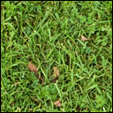
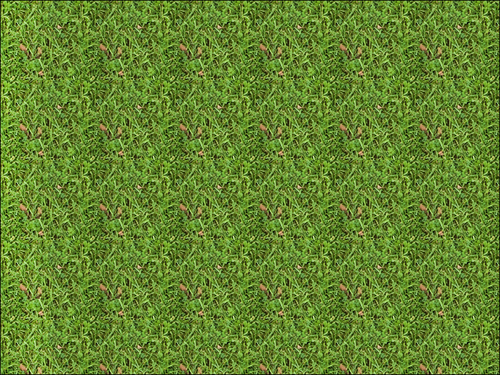
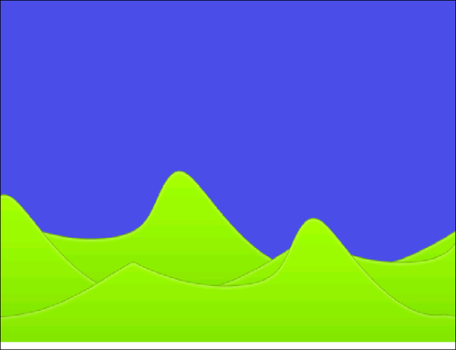
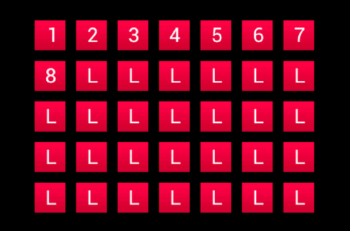
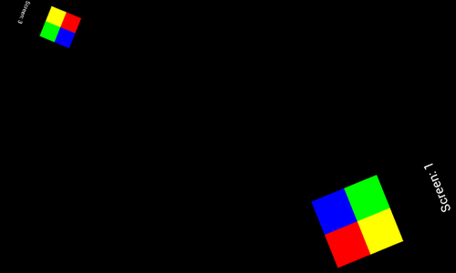
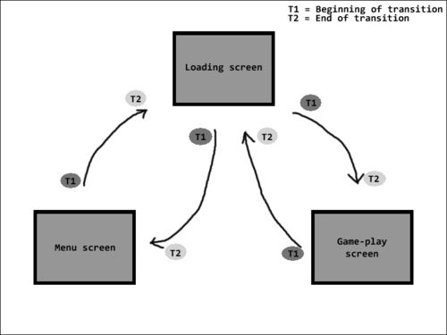

# 第三章：设计你的菜单

在本章中，我们将开始了解如何使用 AndEngine 创建一个易于管理的菜单系统。主题包括：

+   向菜单添加按钮

+   为菜单添加音乐

+   应用背景

+   使用视差背景创建透视效果

+   创建我们的关卡选择系统

+   隐藏和检索图层

# 引言

游戏中的菜单系统本质上是游戏提供的场景或活动的地图。在游戏中，菜单应该看起来吸引人，并微妙地提示在游戏过程中可以期待什么。菜单应该组织有序，便于玩家理解。在本章中，我们将看看我们可以应用到自己游戏中的各种选项，以创建适用于任何类型游戏的实用且吸引人的菜单。

# 向菜单添加按钮

在 AndEngine 中，我们可以使用任何`Entity`对象或`Entity`对象子类型创建触摸响应的按钮。然而，AndEngine 包含一个名为`ButtonSprite`的类，其纹理表示取决于`Entity`对象是被按下还是未被按下。在本教程中，我们将利用 AndEngine 的`ButtonSprite`类并覆盖其`onAreaTouched()`方法，以便向我们的菜单和/或游戏的`Scene`对象添加触摸响应按钮。此外，本教程关于触摸事件的代码可以应用于游戏中的任何其他`Entity`对象。

## 准备就绪…

本教程需要你对 AndEngine 中的`Sprite`对象有基本的了解。请通读第一章中的*使用不同类型的纹理*教程，特别是关于图块纹理区域的部分。接下来，访问第二章中的*通过精灵使场景生动*教程，*使用实体*。

一旦涵盖了关于纹理和精灵的教程，请创建一个带有空的`BaseGameActivity`类的新的 AndEngine 项目。最后，我们需要创建一个名为`button_tiles.png`的精灵表，其中包含两个图像，并将其放置在项目中的`assets/gfx/`文件夹中；一个用于“未按下”按钮的表示，另一个用于“按下”按钮的表示。请参考以下图片以了解图像应有的样子。以下图片是 300 x 50 像素，或者每个图块 150 x 50 像素：


请参考代码捆绑包中名为`CreatingButtons`的类，并将代码导入到你的项目中。

## 如何操作…

`ButtonSprite`类非常方便，因为它为我们处理了图块纹理区域与按钮状态变化之间的关系。以下步骤概述了设置`ButtonSprite`对象所需执行的任务：

1.  声明一个全局的`ITiledTextureRegion`对象，命名为`mButtonTextureRegion`，然后在`BaseGameActivity`类的`onCreateResources()`方法中，创建一个新的适用于您的`button_tiles.png`图像的`BuildableBitmapTextureAtlas`对象。构建并加载纹理区域和纹理图集对象，以便我们稍后可以使用它们来创建`ButtonSprite`对象。

1.  为了使`ButtonSprite`对象按预期工作，我们应在`mScene`对象上设置适当的触摸区域绑定。将以下代码复制到活动的`onCreateScene()`方法中：

    ```kt
    mScene.setTouchAreaBindingOnActionDownEnabled(true);
    ```

1.  创建`ButtonSprite`对象，为其提供`mButtonTextureRegion`对象并重写其`onAreaTouched()`方法：

    ```kt
    /* Create the buttonSprite object in the center of the Scene */
    ButtonSprite buttonSprite = new ButtonSprite(WIDTH * 0.5f,
        HEIGHT * 0.5f, mButtonTextureRegion,
        mEngine.getVertexBufferObjectManager()) {
      /* Override the onAreaTouched() event method */
      @Override
      public boolean onAreaTouched(TouchEvent pSceneTouchEvent,
          float pTouchAreaLocalX, float pTouchAreaLocalY) {
        /* If buttonSprite is touched with the finger */
        if(pSceneTouchEvent.isActionDown()){
          /* When the button is pressed, we can create an event 
           * In this case, we're simply displaying a quick toast */
          CreatingButtons.this.runOnUiThread(new Runnable(){
            @Override
            public void run() {
              Toast.makeText(getApplicationContext(), "Button Pressed!", Toast.LENGTH_SHORT).show();
            }
          });
        }
        /* In order to allow the ButtonSprite to swap tiled texture region 
         * index on our buttonSprite object, we must return the super method */
        return super.onAreaTouched(pSceneTouchEvent, pTouchAreaLocalX, pTouchAreaLocalY);
      }
    };
    ```

1.  最后一步是注册触摸区域并将`buttonSprite`对象附加到`mScene`对象：

    ```kt
    /* Register the buttonSprite as a 'touchable' Entity */
    mScene.registerTouchArea(buttonSprite);
    /* Attach the buttonSprite to the Scene */
    mScene.attachChild(buttonSprite);
    ```

## 它的工作原理是…

本食谱使用了`ButtonSprite`对象与`ITiledTextureRegion`对象来展示两个独立的按钮状态。其中一个图块将作为按钮未被按下时的纹理，另一个则作为当手指触摸显示上的`Entity`对象时按钮被按下的纹理。

在第一步中，我们创建纹理资源以应用于`ButtonSprite`对象，这将在接下来的步骤中实现。`ButtonSprite`类需要一个具有两个索引的`ITiledTextureRegion`对象，或者在本文档的*入门...* 部分所示的图中可以看到两个图块。`ITiledTextureRegion`对象的第一索引应包含按钮未被按下的表示，这将默认应用于`ButtonSprite`对象。第二个`ITiledTextureRegion`索引应表示`ButtonSprite`对象的按下状态。`ButtonSprite`类会根据`ButtonSprite`对象当前处于的状态自动在这两个`ITiledTextureRegion`索引之间切换；分别是`ButtonSprite.State.NORMAL`表示未被按下，将`ButtonSprite`对象的当前图块索引设置为`0`，以及`ButtonSprite.State.PRESSED`，是的，你猜对了，表示按下状态，将`ButtonSprite`对象的当前图块索引设置为`1`。

在第二步中，为了让`ButtonSprite`对象按预期工作，我们需要在`mScene`对象内对按下动作启用触摸区域绑定。我们在活动生命周期的`onCreateScene()`方法中启用此功能，在创建`mScene`对象之后立即进行。这样做可以允许我们的`ButtonSprite`对象在我们将手指拖离`ButtonSprite`触摸区域时注册为未按下状态。如果忽略这一步，那么当我们将手指按在`Entity`对象的触摸区域并拖离时，`ButtonSprite`对象将保持按下状态，这对于玩家来说可能会被认为是“有缺陷”的。在第三步中，我们创建`ButtonSprite`对象，并将其置于场景中心。理想情况下，我们可以创建`ButtonSprite`对象并将其放置在场景上，它应该就能正常工作。然而，`ButtonSprite`毕竟是一个按钮，因此当它被按下时应该触发一个事件。我们可以通过重写`onAreaTouched()`超方法并根据`ButtonSprite`对象的触摸区域是否被按下、手指是否在其上拖动或者手指是否从显示区域内释放来创建事件。在本教程中，我们仅在`ButtonSprite`对象的`pSceneTouchEvent`注册了`isActionDown()`方法时显示一个`Toast`消息。在游戏开发的真实场景中，这个按钮同样可以允许/禁止声音静音、开始新游戏，或者我们为其选择的任何其他动作。用于触摸事件状态检查的其他两个方法是`pSceneTouchEvent.isActionMove()`和`pSceneTouchEvent.isActionUp()`。

最后，一旦创建了`buttonSprite`对象，我们将需要注册触摸区域并将`Entity`对象附加到`mScene`对象上。此时，我们应该清楚，为了在场景上显示一个实体，我们首先必须将其附加。同样，为了让`buttonSprite`对象的`onAreaTouched()`超方法能够执行，我们必须记得调用`mScene.registerTouchArea(buttonSprite)`。对于任何我们希望提供触摸事件的其它`Entity`对象也是如此。

## 另请参阅

+   在第一章中了解*使用不同类型的纹理*，*AndEngine 游戏结构*。

+   在第二章中了解*AndEngine 实体*，*使用实体*。

+   在第二章中了解如何通过精灵使场景生动，*使用实体*。

# 向菜单中添加音乐

在本主题中，我们将创建一个静音按钮，用于控制菜单主题音乐。按下静音按钮将导致音乐如果当前暂停则播放，如果当前播放则暂停。这种静音音乐和声音的方法也可以应用于游戏内的选项和其他允许声音和音乐播放的游戏区域。与之前的教程不同，我们将使用一个`TiledSprite`对象，它允许我们根据声音是否播放或暂停来设置`Sprite`对象的图块索引。请记住，这个教程不仅适用于启用和禁用菜单音乐。我们还可以在游戏过程中遵循同样的方法处理许多其他可切换的选项和状态。

## 准备工作…

本教程要求你对 AndEngine 中的`Sprite`对象以及使用触摸事件执行操作有基本了解。此外，由于我们将在本教程中整合`Music`对象，我们应当了解如何将`Sound`和`Music`对象加载到游戏资源中。请阅读整个教程，第一章中的*处理不同类型的纹理*，特别是关于图块纹理区域的部分。接下来，查看第一章中的*AndEngine 游戏结构*中的引入声音和音乐教程。最后，我们将处理精灵，因此我们应当快速浏览第二章中的*使用精灵为场景注入生命*教程。

在覆盖了纹理、声音和精灵的相关主题后，创建一个带有空的`BaseGameActivity`类的新的 AndEngine 项目。我们需要创建一个名为`sound_button_tiles.png`的精灵表，其中包含两个图像，并将其放置在项目的`assets/gfx/`文件夹中；一个用于“非静音”按钮表示，另一个用于“静音”按钮表示。以下是一个图像的示例，以了解图像应该是什么样子。以下图像是 100 x 50 像素，或者每个图块 50 x 50 像素：


我们还需要在项目的`assets/sfx/`文件夹中包含一个 MP3 格式的声音文件。声音文件可以是为你执行此教程目的而选择的任何喜欢的音乐曲目。

请参考代码包中名为`MenuMusic`的类，并将代码导入到你的项目中。

## 如何操作…

本教程介绍了一系列 AndEngine 功能的组合。我们将音乐、纹理、精灵、图块纹理区域和触摸事件整合到一个便捷的小包中。结果是一个切换按钮，可以控制`Music`对象的播放。按照以下步骤，看看我们是如何创建这个切换按钮的。

1.  在第一步中，我们将使用两个全局对象；`mMenuMusic`是一个`Music`对象，`mButtonTextureRegion`是一个`ITiledTextureRegion`对象。在活动的`onCreateResources()`方法中，我们使用`assets/*`文件夹中的相应资源创建这些对象。如果需要，请参考*入门…*部分提到的教程，了解更多关于创建这些资源的信息。

1.  接下来，我们可以直接跳转到活动的`onPopulateScene()`方法，在这里我们将使用`TiledSprite`类创建`mMuteButton`对象。我们需要重写`mMuteButton`对象的`onAreaTouched()`方法，以便在按下按钮时暂停或播放音乐：

    ```kt
    /* Create the music mute/unmute button */
    TiledSprite mMuteButton = new TiledSprite(buttonX, buttonY,
        mButtonTextureRegion, mEngine.getVertexBufferObjectManager()) {

      /* Override the onAreaTouched() method allowing us to define custom
      * actions */
      @Override
      public boolean onAreaTouched(TouchEvent pSceneTouchEvent,
          float pTouchAreaLocalX, float pTouchAreaLocalY) {
        /* In the event the mute button is pressed down on... */
        if (pSceneTouchEvent.isActionDown()) {
          if (mMenuMusic.isPlaying()) {
            /*  If music is playing, pause it and set tile index to  MUTE  */
            this.setCurrentTileIndex(MUTE);
            mMenuMusic.pause();
          } else {
            /* If music is paused, play it and set tile index to UNMUTE */
            this.setCurrentTileIndex(UNMUTE);
            mMenuMusic.play();
          }
          return true;
        }
        return super.onAreaTouched(pSceneTouchEvent, pTouchAreaLocalX,
            pTouchAreaLocalY);
      }
    };
    ```

1.  创建按钮后，我们需要初始化`mMuteButton`和`mMenuMusic`对象的初始状态。这一步包括将`mMuteButton`对象的图块索引设置为`UNMUTE`常量值，该值等于`1`，注册并将`mMuteButton`对象附加到`mScene`对象，设置`mMenuMusic`为循环播放，并最终在`mMenuMusic`对象上调用`play()`方法：

    ```kt
    /* Set the current tile index to unmuted on application startup */
    mMuteButton.setCurrentTileIndex(UNMUTE);

    /* Register and attach the mMuteButton to the Scene */
    mScene.registerTouchArea(mMuteButton);
    mScene.attachChild(mMuteButton);

    /* Set the mMenuMusic object to loop once it reaches the track's end */
    mMenuMusic.setLooping(true);
    /* Play the mMenuMusic object */
    mMenuMusic.play();
    ```

1.  在处理任何`Music`对象时，最后一步是确保在应用最小化时暂停音乐，否则它将在后台继续播放。在本教程中，我们将最小化时暂停`mMenuMusic`对象。然而，如果用户返回应用程序，只有当应用最小化时`mMuteButton`对象的图块索引等于`UNMUTE`常量值，音乐才会播放：

    ```kt
    @Override
    public synchronized void onResumeGame() {
      super.onResumeGame();

      /* If the music and button have been created */
      if (mMenuMusic != null && mMuteButton != null) {
        /* If the mMuteButton is set to unmuted on resume... */
        if(mMuteButton.getCurrentTileIndex() == UNMUTE){
          /* Play the menu music */
          mMenuMusic.play();
        }
      }
    }

    @Override
    public synchronized void onPauseGame() {
      super.onPauseGame();

      /* Always pause the music on pause */
      if(mMenuMusic != null && mMenuMusic.isPlaying()){
        mMenuMusic.pause();
      }
    }
    ```

## 它是如何工作的…

这个特定的教程在游戏开发中非常有用；不仅适用于声音和音乐的静音，还适用于各种切换按钮。虽然本教程专门处理`Music`对象的播放，但它包含了开始使用各种其他切换按钮所需的所有必要代码，这些按钮可能更适合我们游戏的具体需求。

在第一步中，我们必须为`mMenuMusic`对象和`mMuteButton`对象设置必要的资源。`mMenuMusic`对象将加载名为`menu_music.mp3`的音频文件，该文件可以是任何 MP3 文件，最好是音乐轨道。`mMuteButton`对象将加载名为`sound_button_tiles.png`的图块表，其中包含两个单独的图块。这些对象都在`BaseGameActivity`对象生命周期的`onCreateResourceS()`方法中处理。关于这些资源的创建，可以在本教程的*入门…*部分提到的教程中找到更多信息。

在第二步中，我们设置了`mMuteButton`对象，该对象属于`TiledSprite`类型。`TiledSprite`类允许我们使用`ITiledTextureRegion`对象，这使得我们可以设置`mMuteButton`对象将在场景中显示的当前图块索引。在重写的`onAreaTouched()`方法中，我们通过`if (pSceneTouchEvent.isActionDown())`语句检查`mMuteButton`对象是否被按下。然后，我们通过`Music`对象的`isPlaying()`方法继续判断`mMenuMusic`对象是否正在播放。如果音乐正在播放，那么在`mMuteButton`按钮上按下手指将导致`mMenuMusic`对象调用`pause()`方法，并将`mMuteButton`对象的当前图块索引恢复为`MUTE`常量值，即`0`。如果音乐没有播放，那么我们执行相反操作，在`mMenuMusic`对象上调用`play()`方法，并将`mMuteButton`对象的图块索引恢复为`UNMUTE`，即`1`。

在第三步中，我们设置了`mMenuMusic`和`mMuteButton`对象的默认状态，即播放音乐并将当前图块索引设置为`UNMUTE`。这将导致应用程序每次启动时播放音乐。设置好默认按钮和音乐状态后，我们继续注册`mMuteButton`对象的触摸区域，并将`Entity`对象附加到`Scene`对象。这一步可以进一步操作，以保存`mMuteButton`对象的状态到设备，从而根据用户过去的偏好加载音乐静音的默认状态。有关保存/加载数据和状态的信息，请参阅第一章中的*保存和加载游戏数据*菜谱，*AndEngine 游戏结构*。

最后一步非常重要，处理`Music`对象时应该始终包含这一步。这一步的目的是在第一章中的*引入声音和音乐*菜谱中详细解释的。但是，这个菜谱在`onResumeGame()`方法中的代码有一个小变化。在应用程序最小化的情况下，用户可能期望他们的游戏状态在等待，就像他们最后将其焦点返回时一样。因此，在应用程序最大化时触发`onResumeGame()`时，我们不是播放`mMenuMusic`对象，而是判断在游戏窗口最小化之前`mMuteButton`按钮的图块索引是否设置为`UNMUTE`。如果是这样，那么我们可以对`mMenuMusic`对象调用`play()`方法，否则我们可以忽略它，直到用户决定再次按下`mMuteButton`播放音乐。

## 另请参阅

+   第一章中的*处理不同类型的纹理*，*AndEngine 游戏结构*。

+   在第一章，*AndEngine 游戏结构*中，引入声音和音乐。

+   在第二章，*使用实体*中，了解 AndEngine 实体。

+   在第二章，*使用实体*中，介绍如何通过精灵使场景生动起来。

# 应用背景

AndEngine 的`Scene`对象允许我们为其应用静态背景。背景可以用来显示纯色、实体、精灵或重复精灵，这些都不会受到`Camera`对象位置或缩放因子变化的影响。在本食谱中，我们将看看如何将不同类型的背景应用到我们的`Scene`对象上。

## 如何操作…

在 AndEngine 中，`Background`对象是我们`Scene`对象最基本的背景类型。这个对象允许场景以纯色视觉展示。我们首先会设置`Scene`对象以显示`Background`对象，以便熟悉如何将背景应用到场景中。在本食谱的后面，我们将介绍大部分剩余的`Background`对象子类型，以涵盖所有关于将背景应用到场景的选项。为`Scene`对象设置背景只需以下两个步骤：

1.  定义并创建`Background`对象的属性：

    ```kt
    /* Define background color values */
    final float red = 0;
    final float green = 1;
    final float blue = 1;
    final float alpha = 1;

    /* Create a new background with the specified color values */
    Background background = new Background(red, green, blue, alpha);
    ```

1.  将`Background`对象设置到`Scene`对象上，并启用背景功能：

    ```kt
    /* Set the mScene object's background */
    mScene.setBackground(background);

    /* Set the background to be enabled */
    mScene.setBackgroundEnabled(true);
    ```

## 工作原理…

在决定使用 AndEngine 的默认背景之前，我们必须确定背景是否需要考虑相机移动。我们可以将这些背景视为“粘附”在相机视图中。这意味着对相机所做的任何移动都不会影响背景的位置。对于任何其他形式的相机重新定位，包括缩放，也同样适用。因此，我们不应该在背景上包含任何需要随相机移动而滚动的对象。这是应用到`Scene`对象的`Background`对象与附加到`Scene`对象的`Entity`对象之间的区别。任何应该随相机移动而看似移动的“背景”，都应该作为`Entity`对象附加到`Scene`对象上，以作为“背景层”，所有表示背景图像的精灵都将附着在上面。

现在我们已经了解了`Background`对象与`Entity`对象之间的区别，接下来将继续介绍本食谱的步骤。从本食谱的步骤中我们可以看到，设置一个枯燥、老旧的有色背景是一项简单的任务。然而，了解它仍然是有用的。在第一步中，我们将定义`Background`对象的属性，并创建一个`Background`对象，将所述属性作为参数传入。对于基本的`Background`对象，这些参数仅包括三个颜色值以及`Background`对象颜色的 alpha 值。但是，正如我们稍后将讨论的，不同类型的背景将根据类型需要不同的参数。当我们讨论到这一点时，为了方便起见，将会概述这些差异。

在`Scene`对象上设置`Background`对象的第二步将始终是相同的两个方法调用，无论我们应用的是哪种类型的背景。我们必须通过`setBackground(pBackground)`设置场景的背景，并通过调用`setBackgroundEnabled(true)`确保场景的背景已启用。另一方面，我们也可以通过向后者方法提供一个`false`参数来禁用背景。

这就是在我们的`Scene`对象上设置背景的全部内容。然而，在我们自己的游戏中，我们很可能会对基本的有色背景感到不满意。请参阅本食谱的*还有更多...*部分，了解各种`Background`对象子类型的列表和示例。

## 还有更多...

在以下各节中，我们将介绍我们可以在游戏中使用的不同类型的静态背景。所有的`Background`对象子类型都允许我们为未被`Sprite`实体、`Rectangle`实体或其他方式覆盖的背景部分指定背景颜色。这些背景都遵循在*工作原理...*部分提到的相同"静态"规则，即它们在摄像头移动时不会移动。

### EntityBackground 类

`EntityBackground`类允许我们应用单个`Entity`对象，或整个`Entity`对象的图层作为我们场景的背景。这可以用于将多个`Entity`对象组合到一个`Background`对象中，以便在场景上显示。在以下代码中，我们将两个矩形附加到`Entity`对象的图层上，然后使用`Entity`对象作为背景：

```kt
    /* Create a rectangle in the bottom left corner of the Scene */
    Rectangle rectangleLeft = new Rectangle(100, 100, 200, 200,
        mEngine.getVertexBufferObjectManager());

    /* Create a rectangle in the top right corner of the Scene */
    Rectangle rectangleRight = new Rectangle(WIDTH - 100, HEIGHT - 100, 200, 200,
        mEngine.getVertexBufferObjectManager());
    /* Create the entity to be used as a background */
    Entity backgroundEntity = new Entity();

    /* Attach the rectangles to the entity which will be applied as a background */
    backgroundEntity.attachChild(rectangleLeft);
    backgroundEntity.attachChild(rectangleRight);

    /* Define the background color properties */
    final float red = 0;
    final float green = 0;
    final float blue = 0;

    /* Create the EntityBackground, specifying its background color & entity to represent the background image */
    EntityBackground background = new EntityBackground(red, green, blue, backgroundEntity);

    /* Set & enable the background */
    mScene.setBackground(background);
    mScene.setBackgroundEnabled(true);
```

`EntityBackground`对象的参数包括`red`、`green`和`blue`颜色值，最后是作为背景显示的`Entity`对象或图层。一旦创建了`EntityBackground`对象，我们只需按照本食谱中*如何操作...*部分的第二步进行操作，我们的`EntityBackground`对象将准备好显示我们选择附加到`backgroundEntity`对象上的任何内容！

### SpriteBackground 类

`SpriteBackground`类允许我们将单个`Sprite`对象作为背景图像附加到场景中。请注意，为了适应显示的大小，这个精灵不会被拉伸或扭曲。为了使精灵在相机的视野中横跨整个宽度和高度，我们必须在考虑相机宽度和高度的情况下创建`Sprite`对象。使用以下代码，我们可以将单个`Sprite`对象作为场景的背景图像。假设`mBackgroundTextureRegion`对象的尺寸与以下代码中的`WIDTH`和`HEIGHT`值相同，这些值表示相机的宽度和高度值：

```kt
/* Create the Sprite object */
Sprite sprite = new Sprite(WIDTH * 0.5f, HEIGHT * 0.5f, mBackgroundTextureRegion,
    mEngine.getVertexBufferObjectManager());

/* Define the background color values */
final float red = 0;
final float green = 0;
final float blue = 0;

/* Create the SpriteBackground object, specifying 
 * the color values & Sprite object to display*/
SpriteBackground background = new SpriteBackground(red, green, blue, sprite);

/* Set & Enable the background */
mScene.setBackground(background);
mScene.setBackgroundEnabled(true);
```

我们可以像创建其他对象一样创建`Sprite`对象。在创建`SpriteBackground`对象时，我们传递常规颜色参数以及我们希望在背景上显示的`Sprite`对象。

### 注意

当使用`SpriteBackground`和`RepeatingSpriteBackground`时，将`BitmapTextureFormat.RGB_565`应用到纹理图集上是一个好主意。由于背景可能会横跨整个显示，我们通常不需要 alpha 通道，这可以提高在低端设备上游戏的性能。

### RepeatingSpriteBackground 类

`RepeatingSpriteBackground`类非常适合创建地形纹理图或仅仅用纹理填充场景中的空白空间。我们可以轻松地将以下 128 x 128 像素的纹理转换成背景，使其在整个显示长度上重复纹理：



使用前面纹理创建`RepeatingSpriteBackground`对象后，得到的背景图像尺寸为 1280 x 752 像素，如下所示：



创建`RepeatingSpriteBackground`对象需要比之前的`Background`对象子类型多做一点工作。我们将重复的图像文件加载到`AssetBitmapTexture`对象中，然后将其提取为`ITextureRegion`对象供背景使用。由于我们要将纹理用于在`RepeatingSpriteBackground`中重复，我们必须在`AssetBitmapTexture`构造函数中提供`TextureOptions.REPEATING_BILINEAR`或`TextureOptions.REPEATING_NEAREST`纹理选项。此外，在处理重复纹理时，我们的图像文件尺寸必须保持为 2 的幂次方。OpenGL 的环绕模式要求纹理尺寸为 2 的幂次方，以正确地重复纹理。不遵循此规则将导致重复的精灵显示为黑色形状。将以下代码放入测试活动的`onCreateResources()`方法中。`mRepeatingTextureRegion`对象必须声明为全局`ITextureRegion`对象：

```kt
AssetBitmapTexture mBitmapTexture = null;

try {
  /* Create the AssetBitmapTexture with the REPEATING_* texture option */
  mBitmapTexture = new AssetBitmapTexture(mEngine.getTextureManager(), this.getAssets(), "gfx/grass.png", BitmapTextureFormat.RGB_565,TextureOptions.REPEATING_BILINEAR);
} catch (IOException e) {
  e.printStackTrace();
}
/* Load the bitmap texture */
mBitmapTexture.load();

/* Extract the bitmap texture into an ITextureRegion */
mRepeatingTextureRegion = TextureRegionFactory.extractFromTexture(mBitmapTexture);
```

下一步是创建`RepeatingSpriteBackground`对象。我们将此代码包含在我们的活动生命周期的`onCreateScene()`方法中：

```kt

/* Define the RepeatingSpriteBackground sizing parameters */
final float cameraWidth = WIDTH;
final float cameraHeight = HEIGHT;
final float repeatingScale = 1f;

/* Create the RepeatingSpriteBackground */
RepeatingSpriteBackground background = new RepeatingSpriteBackground(cameraWidth, cameraHeight, mRepeatingTextureRegion, repeatingScale,
    mEngine.getVertexBufferObjectManager());

/* Set & Enable the background */
mScene.setBackground(background);
mScene.setBackgroundEnabled(true);
```

`RepeatingSpriteBackground`对象的前两个参数定义了重复纹理将覆盖的最大区域，从显示的左下角开始。在本例中，我们覆盖了整个显示区域。我们传递的第三个纹理是作为重复纹理使用的`ITextureRegion`对象。如前所述，这个纹理区域必须遵循二的幂次维度规则。第四个参数是重复纹理的缩放因子。默认缩放为`1`；增加缩放会使重复纹理放大，这可能使重复模式更容易看到。减少缩放因子会缩小每个重复的纹理，有时可以帮助隐藏重复纹理中的明显瑕疵。请记住，调整重复纹理的缩放不会影响根据前两个参数定义的`RepeatingSpriteBackground`对象的整体大小，因此可以自由调整，直到纹理看起来正确为止。

## 参见以下内容

+   在第一章，*AndEngine 游戏结构*中，*使用不同类型的纹理*。

+   在第二章，*使用实体*中，*用精灵让场景生动起来*。

# 使用视差背景创建透视效果

将**视差**背景应用于游戏可以产生视觉上令人愉悦的透视效果。尽管我们使用的是 2D 引擎，但我们可以创建一个通过使用视差值来产生深度错觉的背景，这些视差值根据相机移动确定精灵的运动速度。本主题将介绍视差背景以及如何使用它们为完全 2D 的世界添加深度感。我们将使用的类是`ParallaxBackground`和`AutoParallaxBackground`。

## 准备就绪…

此食谱需要具备 AndEngine 中`Sprite`对象的基本知识。请通读第一章，*AndEngine 游戏结构*中的整个食谱，*使用不同类型的纹理*。接下来，请访问第二章，*使用实体*中的食谱，*用精灵让场景生动起来*。

在介绍了纹理和精灵的相关方法之后，创建一个带有空的`BaseGameActivity`类的新的 AndEngine 项目。最后，我们需要在项目的`assets/gfx/`文件夹中创建一个名为`hill.png`的图像。这个图像的尺寸应为 800 x 150 像素。图像可以类似于以下图形：


请参考代码包中名为`UsingParallaxBackgrounds`的类，并将代码导入到您的项目中。

## 如何操作…

`ParallaxBackground`对象是 AndEngine 中最先进的`Background`对象子类型。它需要比所有`Background`对象子类型更多的设置，但如果分解成小步骤，实际上并不那么困难。执行以下步骤，了解如何设置一个与相机移动相关的`ParallaxBackground`对象。为了简洁起见，我们将省略可以在活动生命周期的`onCreateEngineOptions()`方法中找到的自动相机移动代码：

1.  创建`Sprite`对象的`ITextureRegion`对象的第一个步骤通常是创建我们的`BuildableBitmapTextureAtlas`。纹理图集应足够大以容纳`hill.png`图像，其宽度为 800 像素，高度为 150 像素。创建纹理图集后，继续创建`ITextureRegion`对象，然后像往常一样构建和加载纹理图集。这应该都在活动生命周期的`onCreateResources()`方法内完成。

1.  剩余的步骤将在活动生命周期的`onCreateScene()`方法内进行。首先，我们需要创建所有将出现在背景上的`Sprite`对象。在此教程中，我们将应用三个`Sprite`对象，以便方便地放置在背景上，以增强不同精灵之间的距离错觉：

    ```kt
    final float textureHeight = mHillTextureRegion.getHeight();

    /* Create the hill which will appear to be the furthest
    * into the distance. This Sprite will be placed higher than the 
     * rest in order to retain visibility of it */
    Sprite hillFurthest = new Sprite(WIDTH * 0.5f, textureHeight * 0.5f + 50, mHillTextureRegion,
        mEngine.getVertexBufferObjectManager());

    /* Create the hill which will appear between the furthest and closest
     * hills. This Sprite will be placed higher than the closest hill, but
    * lower than the furthest hill in order to retain visibility */
    Sprite hillMid = new Sprite(WIDTH * 0.5f, textureHeight * 0.5f + 25, mHillTextureRegion,
        mEngine.getVertexBufferObjectManager());

    /* Create the closest hill which will not be obstructed by any other hill 
    * Sprites. This Sprite will be placed at the bottom of the Scene since
    * nothing will be covering its view */
    Sprite hillClosest = new Sprite(WIDTH * 0.5f, textureHeight * 0.5f, mHillTextureRegion,
        mEngine.getVertexBufferObjectManager());
    ```

1.  接下来，我们将创建`ParallaxBackground`对象。构造函数的三个参数通常定义背景颜色。更重要的是，我们必须重写`ParallaxBackground`对象的`onUpdate()`方法，以处理在背景上等待任何相机移动时`Sprite`对象移动：

    ```kt
    /* Create the ParallaxBackground, setting the color values to represent 
    * a blue sky */
    ParallaxBackground background = new ParallaxBackground(0.3f, 0.3f, 0.9f) {

      /* We'll use these values to calculate the parallax value of the background */
      float cameraPreviousX = 0;
      float parallaxValueOffset = 0;

      /* onUpdates to the background, we need to calculate new 
       * parallax values in order to apply movement to the background
      * objects (the hills in this case) */
      @Override
      public void onUpdate(float pSecondsElapsed) {
        /* Obtain the camera's current center X value */
        final float cameraCurrentX = mCamera.getCenterX();

        /* If the camera's position has changed since last 
         * update... */
        if (cameraPreviousX != cameraCurrentX) {

          /* Calculate the new parallax value offset by 
           * subtracting the previous update's camera x coordinate
           * from the current update's camera x coordinate */
          parallaxValueOffset +=  cameraCurrentX - cameraPreviousX;

          /* Apply the parallax value offset to the background, which 
           * will in-turn offset the positions of entities attached
           * to the background */
          this.setParallaxValue(parallaxValueOffset);

          /* Update the previous camera X since we're finished with this 
           * update */
          cameraPreviousX = cameraCurrentX;
        }
        super.onUpdate(pSecondsElapsed);
      }
    };
    ```

1.  创建`ParallaxBackground`对象后，我们现在必须将`ParallaxEntity`对象附加到`ParallaxBackground`对象上。`ParallaxEntity`对象要求我们为实体定义一个视差因子以及一个用于视觉表示的`Sprite`对象，在这种情况下将是山丘：

    ```kt
    background.attachParallaxEntity(new ParallaxEntity(5, hillFurthest));
    background.attachParallaxEntity(new ParallaxEntity(10, hillMid));
    background.attachParallaxEntity(new ParallaxEntity(15, hillClosest));
    ```

1.  最后，像所有`Background`对象一样，我们必须将其应用到`Scene`对象并启用它：

    ```kt
    /* Set & Enabled the background */
    mScene.setBackground(background);
    mScene.setBackgroundEnabled(true);
    ```

## 它是如何工作的…

在此教程中，我们将设置一个`ParallaxBackground`对象，其中包含三个独立的`ParallaxEntity`对象。这三个`ParallaxEntity`对象将代表我们场景背景中的山丘。通过使用视差因子和视差值，`ParallaxBackground`对象允许每个`ParallaxEntity`对象在`Camera`对象改变其位置时以不同的速度偏移它们的位置。这使得`ParallaxEntity`对象能够产生透视效果。众所周知，离我们更近的物体会比远处的物体看起来移动得更快。

在“*如何操作...*”部分的第一步是创建我们的`Sprite`对象的基本且必要的任务。在这个食谱中，我们使用一个单一的纹理区域/图像来表示所有三个将附加到背景的精灵。然而，请随意修改这个食谱，以便让三个`Sprite`对象中的每一个都能使用自己的定制图像。实践将有助于进一步理解如何操作`ParallaxBackground`对象，在游戏中创建整洁的场景。

在第二步中，我们设置三个将作为`ParallaxEntity`对象附加到背景的`Sprite`对象。我们将它们都放置在场景中心的 x 坐标处。`ParallaxBackground`类仅用于将透视应用于 x 坐标移动，因此，随着摄像机的移动，背景上的精灵位置将离开初始 x 坐标。也就是说，重要的是要知道`ParallaxBackground`对象将不断地将附加到背景的每个`ParallaxEntity`对象的副本拼接在一起，以补偿可能离开摄像机视野的背景对象。以下是`ParallaxBackground`对象如何将背景对象端对端拼接的可视化表示：


由于`ParallaxEntity`对象在`ParallaxBackground`对象上的拼接方式，为了创建可能不会在背景上经常出现的对象，我们必须在图像文件本身中包含透明填充。

至于定义精灵的 y 坐标，最好是将精灵分散开，以便能够区分背景上最近和最远的山丘。为了创建最佳的透视效果，最远的物体在场景中应该显得更高，因为从层次上讲，它们将隐藏在更近的对象后面。

在第三步中，我们创建`ParallaxBackground`对象。构造函数与所有其他`Background`对象子类型一样，定义了背景颜色。真正的魔法发生在`ParallaxBackground`对象的覆盖`onUpdate()`方法中。我们有两个变量；`cameraPreviousX`和`cameraCurrentX`，它们将首先被测试以确保两者之间存在差异，以减少任何不必要的代码执行。如果这两个值不相等，我们将累积先前和当前摄像机位置之间的差异到一个`parallaxValueOffset`变量中。通过在`ParallaxBackground`对象上调用`setParallaxValue(parallaxValueOffset)`，我们基本上只是告诉背景摄像机已经改变了位置，现在是更新所有`ParallaxEntity`对象位置以进行补偿的时候了。增加视差值将导致`ParallaxEntity`对象向左平移，而减少它则导致它们向右平移。

在第四步中，我们最终创建`ParallaxEntity`对象，为每个对象提供一个视差因子和一个`Sprite`对象。视差因子将定义`Sprite`对象基于摄像头移动的速度是快还是慢。为了创建更逼真的风景，距离较远的对象应该具有比近处对象更小的值。此外，`attachParallaxEntity(pParallaxEntity)`方法类似于将`Entity`对象附加到`Scene`对象，因为第二个附加的对象将出现在第一个前面，第三个将出现在第二个前面，依此类推。因此，我们从最远的对象开始将`ParallaxEntity`对象附加到`ParallaxBackground`，然后逐步靠近最近的物体。

完成所有前面的步骤后，我们可以简单地将`ParallaxBackground`应用到`Scene`对象并启用它。从现在开始，任何摄像头的移动都将决定背景景物中对象的位置！

## 还有更多…

AndEngine 还包括一个`AutoParallaxBackground`类，它和`ParallaxBackground`类在设置视觉效果方面类似。两者的区别在于，`AutoParallaxBackground`类允许我们指定一个恒定速率，在该速率下，无论摄像头是否移动，`ParallaxEntity`对象都会在屏幕上移动。这种类型的背景对于需要看起来不断移动的游戏很有用，比如赛车游戏或任何快节奏的横版滚动游戏。另一方面，`AutoParallaxBackground`类也可以用于在游戏过程中创建简单的效果，例如云层在屏幕上持续滚动，即使是在`Camera`和`Scene`对象位置看似静态的游戏中也是如此。

我们可以通过对这一食谱活动的简单调整来创建一个`AutoParallaxBackground`对象。用以下代码片段替换当前的`ParallaxBackground`对象创建。注意，`autoParallaxSpeed`变量定义了`ParallaxEntity`对象在背景上的移动速度，因为它们不再基于摄像头的移动：

```kt
/* Define the speed that the parallax entities will move at.
 * 
* Set to a negative value for movement in the opposite direction */
final float autoParallaxSpeed = 3;

/* Create an AutoParallaxBackground */
AutoParallaxBackground background = new AutoParallaxBackground(0.3f, 0.3f, 0.9f, autoParallaxSpeed);
```

此外，移除所有与`mCamera`对象的`onUpdate()`方法相关的代码，因为它将不再影响`ParallaxEntity`对象的位置。

下图展示了将三个不同高度的丘陵层附加到`ParallaxBackground`或`AutoParallaxBackground`对象的结果，当然，这里没有考虑移动：



## 另请参阅

+   在第一章《AndEngine 游戏结构》中*处理不同类型的纹理*。

+   在第二章《使用实体》中*用精灵为场景赋予生命*。

+   本章节提供的*应用背景*。

# 创建我们的关卡选择系统

如果你曾经玩过带有多个关卡的移动游戏，那么你可能已经知道我们将在本章中处理什么。我们将创建一个类，为游戏提供一个包含关卡瓦片的网格，以便用户可以选择一个关卡进行游戏。这个类非常易于管理，并且高度可定制，从按钮纹理、列数、行数等，都可以轻松设置。最终结果将如下所示：



### 注意

`LevelSelector`类的这个实现扩展了 AndEngine 的`Entity`对象。这使得应用实体修改器和基于触摸事件的滚动变得相当简单。

## 准备就绪…

`LevelSelector`类高度依赖于 AndEngine 的`Entity`、`Sprite`和`Text`对象的使用。为了理解`LevelSelector`是如何工作的，请花时间阅读关于这些对象的相关内容。这些内容包括第二章中的*理解 AndEngine 实体*，*使用实体*，*用精灵使场景生动*，以及*将文本应用到图层*。

`LevelSelector`对象需要一个带有图像文件引用的`ITextureRegion`对象。可以自由创建一个表示 50x50 像素尺寸的方形按钮的图像，如本食谱介绍中的图所示。虽然这个`ITextureRegion`对象在`LevelSelector`类内部并不需要，但在本食谱末尾在空的`BaseGameActivity`测试项目中测试`LevelSelector`类时需要它。

请参考代码包中名为`LevelSelector`的类，以获取此食谱的工作代码。请随意使用这个类，并根据你的游戏需求进行修改！

## 如何操作…

尽管其规模可能相当大，但`LevelSelector`类实际上非常易于使用。在这个食谱中，我们将介绍两个类；第一个是处理关卡瓦片（或按钮）如何在场景上形成网格的`LevelSelector`类。第二个是`LevelSelector`的内部类，称为`LevelTile`。`LevelTile`类允许我们轻松添加或删除可能对游戏有用的额外数据。为了保持简单，我们将分别讨论这两个类，从`LevelSelector`类开始。

以下步骤解释了`LevelSelector`类如何以网格格式在场景上排列`LevelTile`对象：

1.  创建`LevelSelector`构造函数，初始化所有变量。这个构造函数很直接，直到我们必须通过`mInitialX`和`mInitialY`变量指定第一个`LevelTile`对象的位置：

    ```kt
    final float halfLevelSelectorWidth = ((TILE_DIMENSION * COLUMNS) + TILE_PADDING
        * (COLUMNS - 1)) * 0.5f;
    this.mInitialX = (this.mCameraWidth * 0.5f) - halfLevelSelectorWidth;

    /* Same math as above applies to the Y coordinate */
    final float halfLevelSelectorHeight = ((TILE_DIMENSION * ROWS) + TILE_PADDING
        * (ROWS - 1)) * 0.5f;
    this.mInitialY = (this.mCameraHeight * 0.5f) + halfLevelSelectorHeight;
    ```

1.  接下来，我们必须创建一个方法，用于构建`LevelSelector`对象的瓦片网格。我们正在创建一个名为`createTiles(pTextureRegion, pFont)`的方法，通过循环一定的`ROWS`和`COLUMNS`值，将瓦片放置在预定的坐标中，从而完全自动化创建关卡瓦片网格：

    ```kt
    public void createTiles(final ITextureRegion pTextureRegion,
        final Font pFont) {

      /* Temp coordinates for placing level tiles */
      float tempX = this.mInitialX + TILE_DIMENSION * 0.5f;
      float tempY = this.mInitialY - TILE_DIMENSION * 0.5f;

      /* Current level of the tile to be placed */
      int currentTileLevel = 1;

      /* Loop through the Rows, adjusting tempY coordinate after each
       * iteration */
      for (int i = 0; i < ROWS; i++) {

        /* Loop through the column positions, placing a LevelTile in each
         * column */
        for (int o = 0; o < COLUMNS; o++) {

          final boolean locked;

          /* Determine whether the current tile is locked or not */
          if (currentTileLevel <= mMaxLevel) {
            locked = false;
          } else {
            locked = true;
          }

          /* Create a level tile */
          LevelTile levelTile = new LevelTile(tempX, tempY, locked,
              currentTileLevel, pTextureRegion, pFont);

          /* Attach the level tile's text based on the locked and
          * currentTileLevel variables pass to its constructor */
          levelTile.attachText();

          /* Register & Attach the levelTile object to the LevelSelector */
          mScene.registerTouchArea(levelTile);
          this.attachChild(levelTile);

          /* Increment the tempX coordinate to the next column */
          tempX = tempX + TILE_DIMENSION + TILE_PADDING;

          /* Increment the level tile count */
          currentTileLevel++;
        }

        /* Reposition the tempX coordinate back to the first row (far left) */
        tempX = mInitialX + TILE_DIMENSION * 0.5f;

        /* Reposition the tempY coordinate for the next row to apply tiles */
        tempY = tempY - TILE_DIMENSION - TILE_PADDING;
      }
    }
    ```

1.  `LevelSelector`类的第三步也是最后一步是包含两个方法；一个用于显示`LevelSelector`类的网格，另一个用于隐藏`LevelSelector`类的网格。为了简单起见，我们将这些方法称为`show()`和`hide()`，不带参数：

    ```kt
    /* Display the LevelSelector on the Scene. */
    public void show() {

      /* Register as non-hidden, allowing touch events */
      mHidden = false;

      /* Attach the LevelSelector the the Scene if it currently has no parent */
      if (!this.hasParent()) {
        mScene.attachChild(this);
      }

      /* Set the LevelSelector to visible */
      this.setVisible(true);
    }

    /* Hide the LevelSelector on the Scene. */
    public void hide() {

      /* Register as hidden, disallowing touch events */
      mHidden = true;

      /* Remove the LevelSelector from view */
      this.setVisible(false);
    }
    ```

现在，我们继续讨论`LevelTile`类的步骤。`LevelTile`内部类是 AndEngine 的`Sprite`对象的扩展。我们实现自己的`LevelTile`类的原因是让每个瓦片存储自己的数据，例如瓦片表示的关卡是否锁定，用于显示瓦片关卡编号的`Font`和`Text`对象，瓦片的关卡编号本身等等。这个类可以很容易地被修改以存储更多信息，例如特定关卡的用户的最高分，关卡颜色主题，或者我们想要包含的任何其他内容。以下步骤将引导我们创建`LevelTile`内部类：

1.  创建`LevelTile`构造函数：

    ```kt
    public LevelTile(float pX, float pY, boolean pIsLocked,
        int pLevelNumber, ITextureRegion pTextureRegion, Font pFont) {
      super(pX, pY, LevelSelector.this.TILE_DIMENSION,
        LevelSelector.this.TILE_DIMENSION, pTextureRegion,
        LevelSelector.this.mEngine.getVertexBufferObjectManager());

      /* Initialize the necessary variables for the LevelTile */
      this.mFont = pFont;
      this.mIsLocked = pIsLocked;
      this.mLevelNumber = pLevelNumber;
    }
    ```

1.  为`LevelTile`类创建必要的 getter 方法。对于这样一个基本的`LevelTile`类，我们只需要访问有关瓦片表示的关卡编号的锁定状态以及瓦片表示的关卡编号的数据：

    ```kt
    /* Method used to obtain whether or not this level tile represents a
     * level which is currently locked */
    public boolean isLocked() {
      return this.mIsLocked;
    }

    /* Method used to obtain this specific level tiles level number */
    public int getLevelNumber() {
      return this.mLevelNumber;
    }
    ```

1.  为了在每个`LevelTile`对象上显示关卡编号，我们将创建一个`attachText()`方法，以在创建每个`LevelTile`对象后处理将`Text`对象应用到它们上面：

    ```kt
    public void attachText() {
      String tileTextString = null;

      /* If the tile's text is currently null... */
      if (this.mTileText == null) {
        /* Determine the tile's string based on whether it's locked or
        * not */
        if (this.mIsLocked) {
          tileTextString = "Locked";
        } else {
          tileTextString = String.valueOf(this.mLevelNumber);
        }
        /* Setup the text position to be placed in the center of the tile */
        final float textPositionX = LevelSelector.this.TILE_DIMENSION * 0.5f;
        final float textPositionY = textPositionX;

        /* Create the tile's text in the center of the tile */
        this.mTileText = new Text( textPositionX,
            textPositionY, this.mFont,
            tileTextString, tileTextString.length(),
            LevelSelector.this.mEngine.getVertexBufferObjectManager());

        /* Attach the Text to the LevelTile */
        this.attachChild(mTileText);
      }
    }
    ```

1.  最后但同样重要的是，我们将重写`LevelTile`类的`onAreaTouched()`方法，以便在瓦片被按下时提供一个默认操作。执行的的事件应根据`mIsLocked`布尔值的不同而有所不同：

    ```kt
    @Override
    public boolean onAreaTouched(TouchEvent pSceneTouchEvent,
        float pTouchAreaLocalX, float pTouchAreaLocalY) {
      /* If the LevelSelector is not hidden, proceed to execute the touch
       * event */
      if (!LevelSelector.this.mHidden) {
        /* If a level tile is initially pressed down on */
        if (pSceneTouchEvent.isActionDown()) {
          /* If this level tile is locked... */
          if (this.mIsLocked) {
            /* Tile Locked event... */
        LevelSelector.this.mScene.getBackground().setColor(
            org.andengine.util.adt.color.Color.RED);
          } else {
            /* Tile unlocked event... This event would likely prompt
             * level loading but without getting too complicated we
             * will simply set the Scene's background color to green */
        LevelSelector.this.mScene.getBackground().setColor(
                org.andengine.util.adt.color.Color.GREEN);

            /**
             * Example level loading:
             *     LevelSelector.this.hide();
             * SceneManager.loadLevel(this.mLevelNumber);
             */
          }
          return true;
        }
      }
      return super.onAreaTouched(pSceneTouchEvent, pTouchAreaLocalX,
          pTouchAreaLocalY);
    }
    ```

## 它是如何工作的…

这种`LevelSelector`类的实现允许我们通过在活动中添加少量的代码来创建可选择关卡瓦片的网格。在我们讨论将`LevelSelector`类实现到我们的活动中之前，让我们看看这个类是如何工作的，以便我们了解如何可能修改这个类以更好地满足一系列不同游戏的具体需求。正如*如何做…*部分根据这个食谱中使用的两个类将步骤分为两段一样，我们也将分两个部分解释每个类是如何工作的。我们将再次从`LevelSelector`类开始。

### 解释`LevelSelector`类

首先，`LevelSelector`类包含了许多成员变量，我们需要了解这些变量，才能充分利用这个对象。以下是在此类中使用变量的列表以及每个变量的描述：

+   `COLUMNS`：`LevelSelector`类网格水平轴上显示的`LevelTile`对象数量。

+   `ROWS`：`LevelSelector`类网格垂直轴上显示的`LevelTile`对象数量。

+   `TILE_DIMENSION`：每个单独的`LevelTile`对象的宽度和高度值。

+   `TILE_PADDING`：`LevelSelector`类网格上每个`LevelTile`对象之间的间距（以像素为单位）。

+   `mChapter`：此值定义了`LevelSelector`类的章节值。这个变量可以让我们通过为每个`LevelSelector`对象指定不同的章节值，创建代表游戏内不同章节/世界/区域的一系列`LevelSelector`对象。

+   `mMaxLevel`：此值定义了用户在我们游戏中当前已达到的最高解锁等级。这个变量将会与每个被触碰的`LevelTile`对象的等级数字进行测试。不应该允许用户进入大于此变量的等级。

+   `mCameraWidth`/`mCameraHeight`：这些值仅用于帮助将`LevelSelector`和`LevelTile`对象正确对齐在场景中心。

+   `mInitialX`：此变量用于保存`LevelSelector`类网格每一行的初始 x 坐标的引用。每次网格的一整行布局完成后，下一行的第一个`LevelTile`对象将返回到这个 x 坐标。

+   `mInitialY`：此变量仅用于定义第一个`LevelTile`对象的 y 坐标。由于我们是按照从左到右、从上到下的方式构建`LevelSelector`类的网格，因此在后续的瓷砖放置中，我们无需返回到初始的 y 坐标。

+   `mHidden`：此变量的布尔值确定`LevelTile`对象是否响应触摸事件。如果`LevelSelector`对象在场景中不可见，此变量设置为`true`，否则为`false`。

所有成员变量都处理完毕后，理解`LevelSelector`类的工作原理就会变得轻而易举！在第一步中，我们创建`LevelSelector`构造函数以初始化所有类变量。构造函数应该很容易理解，直到我们定义`mInitialX`和`mInitialY`变量的那一点。我们所做的就是基于列数、行数、瓦片尺寸和瓦片间隔来计算`LevelSelector`类网格的整体宽度和高度的一半。为了计算总宽度，我们需要将`COLUMNS`值乘以每个`LevelTile`对象的宽度。由于我们在每个瓦片之间包括间隔，我们还必须计算间隔将占用的空间。然而，间隔只会在瓦片之间发生，这意味着在最后一列不需要计算间隔，因此我们可以从间隔计算中减去一列。然后我们将这个值除以一半，以得出整个网格宽度的一半。最后，从`Camera`对象的中心位置减去整个网格宽度的一半，将给我们第一个`LevelTile`对象的 x 坐标！同样的数学方法适用于计算初始 y 坐标，除了 y 轴处理行而不是列，因此我们需要在计算`mInitialY`变量时进行相应的调整，以获得正确的 y 坐标。

`LevelSelector`类的第二步介绍了`LevelTile`对象创建和放置的方法。这是网格制作的魔法开始的地方。在我们开始迭代之前，我们声明并定义了临时的坐标，这些坐标将用于在网格上放置每个`LevelTile`对象，并在放置每个瓦片后相应地增加它们的值。`TILE_DIMENSION * 0.5f`的计算仅仅是为了适应 AndEngine 的`Entity`对象的锚点，或者说是依赖于`Entity`对象中心的放置坐标。此外，我们初始化了一个名为`currentTileLevel`的临时关卡数，将其初始化为`1`，这表示第一关的瓦片。每次在网格上放置一个关卡瓦片时，这个变量都会增加 1。定义了初始关卡瓦片的值后，我们继续创建`for`循环，它将遍历构成网格的行和列的每个位置。从第一行开始，我们将遍历 N 列，每次放置瓦片后，通过加上`TILE_DIMENSION`和`TILE_PADDING`来增加`tempX`变量，这将给我们下一个位置。当我们达到最大列数时，我们通过加上`TILE_DIMENSION`和`TILE_PADDING`来减少`tempY`变量，以便下降到下一行进行填充。这个过程一直持续到没有更多的行需要填充。

`LevelSelector`类中最后一步包括调用`setVisible(pBoolean)`的代码，在`LevelSelector`对象上设置，如果调用`show()`方法则启用可见性，如果调用`hide()`方法则禁用可见性。第一次`LevelSelector`对象调用`show()`时，它将被附加到`Scene`对象上。此外，`mHidden`变量将根据`LevelSelector`对象的可见性进行调整。

### 解释`LevelTile`类。

与`LevelSelector`类一样，我们将从概述`LevelTile`类不同成员变量的目的开始。以下是此类别中使用的变量列表以及每个变量的描述：

+   `mIsLocked`：`mIsLocked`布尔变量由`LevelTile`构造函数中的参数定义。此变量定义了此`LevelTile`对象的触摸事件是否应该产生积极事件，如加载关卡，或消极事件，如通知关卡已锁定。

+   `mLevelNumber`：这个变量简单地保存了`LevelTile`对象级别编号的值。该值是根据其在网格上的位置确定的；例如，放置在网格上的第一个瓦片将代表第 1 关，第二个瓦片将代表第 2 关，依此类推。

+   `mFont`和`mTileText`：`mFont`和`mTileText`对象用于在每个`LevelTile`上显示`Text`对象。如果`LevelTile`对象被认为是锁定的，那么瓦片上将会显示单词**locked**，否则将显示瓦片的关卡编号。

在`LevelTile`类的第一步中，我们只是介绍了构造函数。这里没有什么特别之处。但需要注意的是，构造函数确实依赖于常量`TILE_DIMENSION`值来指定瓦片的宽度/高度尺寸，而不需要指定参数。这是为了保持`LevelSelector`和`LevelTile`类之间的一致性。

在第二步中，我们引入了两个 getter 方法，可以用来获取`LevelTile`类的更重要值。尽管我们目前在任何一个类中都没有使用这些方法，但当`LevelSelector`/`LevelTile`对象被实现到一个需要如关卡编号等数据在游戏中传递的全功能游戏中时，它们可能变得很重要。

第三步介绍了一种方法，用于将`Text`对象附加到`LevelTile`，称为`attachText()`。此方法将`mTileText`对象放置在`LevelTile`对象的正中心，其字符串取决于`LevelTile`对象的锁定状态。如`mFont`和`mTileText`变量解释中所述，`mTileText`对象的`String`变量将显示**locked**（锁定）或瓦片的关卡编号。

最后一步要求我们覆盖`LevelTile`对象的`onAreaTouched()`方法。在我们考虑对任何瓷砖上的触摸事件做出响应之前，我们首先要确定包含`LevelTile`对象的`LevelSelector`对象是否可见。如果不可见，就没有必要处理任何触摸事件；但如果`LevelSelector`对象可见，那么我们就继续检查瓷砖是否被按下。如果按下了`LevelTile`对象，我们接着检查瓷砖是锁定还是解锁。在类的当前状态下，我们只是设置场景背景的颜色，以表示按下的瓷砖是否锁定。然而，在实际应用中，当前锁定事件可以替换为基本通知，表明选定的瓷砖已锁定。如果瓷砖没有锁定，那么触摸事件应该根据`LevelTile`对象的`mLevelNumber`变量将用户带到选定的关卡。如果游戏包含多个章节/世界/区域，那么我们可以根据游戏加载关卡的方式，采用以下伪代码实现：

```kt
LevelSelector.this.hide();
SceneManager.loadLevel(this.mLevelNumber, LevelSelector.this.mChapter);
```

## 还有更多…

一旦我们将`LevelSelector`类包含在我们选择的任何项目中，我们就可以轻松地将工作级别的选择网格实现到我们的`BaseGameActivity`中。为了正确创建`LevelSelector`对象并在我们的场景中显示它，我们需要确保已经创建了`ITextureRegion`对象和字体对象，以便在为`LevelSelector`类创建`LevelTile`对象时使用。我们将省略资源创建代码，以保持`LevelSelector`类的示例简洁。如有需要，请访问第一章中的食谱，*处理不同类型的纹理*以及*使用 AndEngine 字体资源*，了解更多关于如何为这个类设置必要资源的信息。

下面的代码展示了如何创建`LevelSelector`对象，可以在创建必要的`ITextureRegion`和字体`objects`之前，将其复制到任何活动的`onCreateScene()`方法中：

```kt
/* Define the level selector properties */
final int maxUnlockedLevel = 7;
final int levelSelectorChapter = 1;
final int cameraWidth = WIDTH;
final int cameraHeight = HEIGHT

/* Create a new level selector */
LevelSelector levelSelector = new LevelSelector(maxUnlockedLevel, levelSelectorChapter, cameraWidth, cameraHeight, mScene, mEngine);

/* Generate the level tiles for the levelSelector object */
levelSelector.createTiles(mTextureRegion, mFont);

/* Display the levelSelector object on the scene */
levelSelector.show();
```

这个`LevelSelector`类的一个很好的特性是它是一个`Entity`对象子类型。如果我们希望对其应用花哨的过渡效果，以便根据需要进出摄像头的视野，我们可以简单地调用`levelSelector.registerEntityModifier(pEntityModifier)`。由于在调用`createTiles()`方法时，`LevelTile`对象附加到`LevelSelector`对象上，因此`LevelSelector`对象位置的任何变化也会同步影响所有`LevelTile`对象。这也使得在处理多个章节时，创建可滚动的关卡选择器实现变得非常容易添加。

## 参见

+   在第二章中了解*AndEngine 实体*，*使用实体*。

+   在第二章中，通过精灵使场景生动起来，*使用实体*。

+   在第二章中将文本应用到图层中，*使用实体*。

# 隐藏和检索图层

在我们的游戏中，屏幕管理有几个不同的选项；屏幕可以是菜单屏幕、加载屏幕、游戏玩法屏幕等等。我们可以使用多个活动来充当每个屏幕，我们可以使用更明显的`Scene`对象来充当游戏中的每个屏幕，或者我们可以使用`Entity`对象来充当每个屏幕。尽管大多数开发者倾向于跟随使用多个活动或多个`Scene`对象来充当不同的游戏屏幕，但我们将快速查看使用`Entity`对象来充当游戏中的不同屏幕。

使用`Entity`对象作为我们游戏中的各种屏幕，相较于前述两种方法有许多好处。实体方法允许我们同时向游戏中应用许多不同的屏幕或图层。与使用多个活动或`Scene`对象作为游戏中的不同屏幕不同，我们可以使用`Entity`对象在设备上可视化显示多个屏幕。这非常有用，因为我们可以应用进入或离开游戏玩法时的过渡效果，并根据需要轻松加载和卸载资源。

下面的图片展示了此配方代码的实际应用。我们看到的是两个带有多个`Rectangle`子对象的`Entity`图层，在相机的视野中交替进行过渡进入和过渡移出。这表示我们可以如何使用`Entity`对象来处理一组或多组子对象之间的过渡效果：



## 准备就绪…

此配方需要了解`Entity`对象以及它们如何被用作图层来包含一组子对象。此外，我们通过使用实体修改器为这些图层添加过渡效果。在继续此配方之前，请确保阅读第二章中的整个配方，*了解 AndEngine 实体*，*使用实体*，*覆盖 onManagedUpdate() 方法*，以及*使用修改器和实体修改器*。

请参考代码包中名为`HidingAndRetrievingLayers`的类，以获取此配方的有效代码，并将其导入一个空的 AndEngine `BaseGameActivity`类。

## 如何操作…

以下步骤概述了如何使用实体修改器来处理游戏内不同屏幕/层次之间的过渡效果。这个食谱包括一个处理层次转换的简单方法，然而在实际应用中，这项任务通常是由屏幕/层次管理类完成的。层次之间的交换是基于经过的时间，仅用于自动化演示的目的。

1.  创建并将层次/屏幕定义为`Entity`对象，以及使用`ParallelEntityModifier`对象的过渡效果。这些对象应该是全局的：

    ```kt
    /* These three Entity objects will represent different screens */
    private final Entity mScreenOne = new Entity();
    private final Entity mScreenTwo = new Entity();
    private final Entity mScreenThree = new Entity();

    /* This entity modifier is defined as the 'transition-in' modifier
     * which will move an Entity/screen into the camera-view */
    private final ParallelEntityModifier mMoveInModifier = new ParallelEntityModifier(
      new MoveXModifier(3, WIDTH, 0),
      new RotationModifier(3, 0, 360),
      new ScaleModifier(3, 0, 1));

    /* This entity modifier is defined as the 'transition-out' modifier
     * which will move an Entity/screen out of the camera-view */
    private final ParallelEntityModifier mMoveOutModifier = new ParallelEntityModifier(
      new MoveXModifier(3, 0, -WIDTH),
      new RotationModifier(3, 360, 0),
      new ScaleModifier(3, 1, 0));
    ```

1.  创建`mScene`对象，重写其`onManagedUpdate()`方法以便处理调用下一步引入的`setLayer(pLayerIn, pLayerOut)`方法。此外，我们将在创建`mScene`对象后附加我们的`Entity`对象层次：

    ```kt
    mScene = new Scene() {
      /* Variable which will accumulate time passed to
       * determine when to switch screens */
      float timeCounter = 0;

      /* Define the first screen indices to be transitioned in and out */
      int layerInIndex = 0;
      int layerOutIndex = SCREEN_COUNT - 1;

      /* Execute the code below on every update to the mScene object */
      @Override
      protected void onManagedUpdate(float pSecondsElapsed) {

        /* If accumulated time is equal to or greater than 4 seconds */
        if (timeCounter >= 4) {

         /* Set screens to be transitioned in and out */
          setLayer(mScene.getChildByIndex(layerInIndex),
              mScene.getChildByIndex(layerOutIndex));

          /* Reset the time counter */
          timeCounter = 0;

          /* Setup the next screens to be swapped in and out */
          if (layerInIndex >= SCREEN_COUNT - 1) {
            layerInIndex = 0;
           layerOutIndex = SCREEN_COUNT - 1;
          } else {
            layerInIndex++;
            layerOutIndex = layerInIndex - 1;
          }

        }
        /* Accumulate seconds passed since last update */
        timeCounter += pSecondsElapsed;
        super.onManagedUpdate(pSecondsElapsed);
      }
    };

    /* Attach the layers to the scene.
     * Their layer index (according to mScene) is relevant to the
     * order in which they are attached */
    mScene.attachChild(mScreenOne); // layer index == 0
    mScene.attachChild(mScreenTwo); // layer index == 1
    mScene.attachChild(mScreenThree); // layer index == 2
    ```

1.  最后，我们将创建一个`setLayer(pLayerIn, pLayerOut)`方法，我们可以用它来处理将实体修改器注册到适当的`Entity`对象，根据它是否应该进入或离开相机视角：

    ```kt
    /* This method is used to swap screens in and out of the camera-view */
    private void setLayer(IEntity pLayerIn, IEntity pLayerOut) {

      /* If the layer being transitioned into the camera-view is invisible,
       * set it to visibile */
      if (!pLayerIn.isVisible()) {
       pLayerIn.setVisible(true);
      }

      /* Global modifiers must be reset after each use */
      mMoveInModifier.reset();
      mMoveOutModifier.reset();

      /* Register the transitional effects to the screens */
      pLayerIn.registerEntityModifier(mMoveInModifier);
      pLayerOut.registerEntityModifier(mMoveOutModifier);
    }
    ```

## 它是如何工作的…

这个食谱涵盖了与`Entity`层次转换相关的一个简单但有用的系统。更大的游戏可能会涉及更多变量来考虑层次交换，但这个概念对于所有项目规模中的实体/屏幕索引和创建屏幕转换方法都是相关的。

在第一步中，我们将创建全局对象。三个`Entity`对象将代表游戏内的不同屏幕。在此食谱中，三个`Entity`对象都包含四个`Rectangle`子对象，这使我们能够可视化屏幕过渡，然而我们可以将每个`Entity`对象解释为不同的屏幕，如菜单屏幕、加载屏幕和游戏玩法屏幕。我们还创建了两个全局`ParallelEntityModifier`实体修改器，以处理屏幕的位置变化。`mMoveInModifier`修改器将把注册的屏幕从相机视角右侧外部移动到相机视角中心。`mMoveOutModifier`修改器将把注册的屏幕从相机视角中心移动到相机视角左侧外部。这两个修改器都包括一个简单的旋转和缩放效果，以产生“滚动”过渡效果。

在下一步中，我们将创建`mScene`对象并将全局声明的`Entity`对象附加到它上面。在这个食谱中，我们设置`mScene`对象根据经过的时间处理屏幕交换，然而在讨论`mScene`对象的`onManagedUpdate()`方法如何处理屏幕交换之前，让我们看看如何获取`Entity`对象的索引，因为它们将用于确定哪些屏幕将被转换：

```kt
mScene.attachChild(mScreenOne); // layer index == 0
mScene.attachChild(mScreenTwo); // layer index == 1
mScene.attachChild(mScreenThree); // layer index == 2
```

如这段代码所示，我们根据名称以数字顺序附加屏幕。一旦`Entity`对象被附加到`Scene`对象，我们就可以在父对象上调用`getChildByIndex(pIndex)`方法，以通过其索引获取`Entity`对象。子项的索引由它们附加到另一个对象的顺序决定。我们在`mScene`对象的`onManagedUpdate()`方法中使用这些索引，以确定每四秒需要交换到摄像机视野中以及需要从视野中移出的实体/屏幕。

在初始化`mScene`对象期间，我们实例化了两个`int`变量，用于确定哪些屏幕需要进出摄像机的视野。最初，我们将`layerInIndex`定义为值`0`，这等于`mScreenOne`对象的索引，并将`layerOutIndex`定义为值`SCREEN_COUNT – 1`，这等于按附加到`Scene`对象的顺序`mScreenThree`对象的索引。在`mScene`对象的`onManagedUpdate()`方法中每四秒，我们会调用`setLayer(pLayerIn, pLayerOut)`方法来开始屏幕过渡，将`timeCounter`变量重置为累积下一个四秒，并确定下一个需要进出摄像机视野的`Entity`对象。虽然这个例子并不完全适用于大多数游戏，但它旨在让我们了解如何使用子索引来通过`setLayer(pLayerIn,pLayerOut)`方法进行过渡调用。

在最后一步中，我们引入了`setLayer(pLayerIn, pLayerOut)`方法，它处理将实体修改器应用于通过参数传递的`Entity`对象。这个方法有三个目标；首先，如果当前不可见，它将设置正在过渡到视图中的层为可见，它重置我们的`mMoveInModifier`和`mMoveOutModifier`对象，以便它们可以为`Entity`对象提供完整的过渡效果，最后，它在`pLayerIn`和`pLayerOut`参数上调用`registerEntityModifier(pEntityModifier)`，在`Entity`对象上启动过渡效果。

## 还有更多...

这个方法仅适用于在游戏中使用多个`Entity`对象作为不同屏幕的游戏结构。然而，如何在屏幕之间处理过渡完全取决于开发者。在做出决定之前，了解我们处理游戏中多个屏幕的不同选择的好坏是明智的。请查看以下列表，了解不同方法的优缺点：

+   **活动/屏幕**：

    +   优点：通过简单调用活动的`finish()`方法，Android 操作系统将为我们处理资源卸载，使得资源管理变得非常简单。

    +   缺点：每个屏幕过渡都会在启动新活动/屏幕时显示短暂的黑色屏幕。

    +   缺点：必须为每个活动加载各自的资源。这意味着预加载资源不是一个选项，这可能会增加整体加载时间，尤其是考虑到可能在所有屏幕上使用的资源，如字体或音乐播放资源。

    +   缺点：由于 Android 的内存管理功能，被视为后台进程的活动可能会在任何时候被杀死，假设设备内存不足。这会在我们离开一个应该保持暂停状态直到用户返回的活动时造成问题。有可能当我们需要时，从任何活动转换而来的状态可能无法以相同的状态返回。

+   **场景/屏幕**：

    +   优点：有可能预加载可能跨多个屏幕使用的必要资源。这可以大大帮助减少加载时间，具体取决于可预加载资源的数量。

    +   优点：我们能够在游戏中引入加载屏幕，而不是在资源加载时显示空白屏幕。

    +   优点/缺点：必须开发一个屏幕和资源管理系统，以便处理资源的加载/卸载和屏幕的切换。根据特定游戏的大小和需求，这可能是一个相当大的任务。然而，这种方法可以在屏幕间移动时实现无缝过渡，因为我们可以更方便地加载/卸载资源，而不是在用户决定切换屏幕时立即进行。

    +   缺点：通常一次只能将一个`Scene`对象应用到我们的 Engine 对象上，这意味着屏幕过渡在动画/流畅性方面将会有所不足。设置的屏幕将简单地替换之前的屏幕。

+   **实体/屏幕**：

    +   优点：当处理`Entity`对象作为屏幕时，我们可以将任意数量的对象附加到一个`Scene`对象。这使我们能够获得场景/屏幕方法的所有优点，同时增加了能够添加基于时间的过渡效果的好处，例如从菜单屏幕“滑动”到加载屏幕，再到游戏屏幕。这正是本教程代码所展示的。

    +   优点/缺点：与场景/屏幕方法一样，我们需要自己处理所有屏幕和资源的清理。优点大于缺点，但是与活动/屏幕方法相比，根据项目的大小，某些人可能会认为需要屏幕/资源管理系统是一个缺点。

在结束这个教程之前，还有一个重要的话题在本教程中没有讨论。请看下面的图，它展示了这个教程在设备上的显示结果可能的样子：



前图展示了用户在游戏内不同屏幕间导航时典型的过渡事件。我们讲解过这种导航是如何通过将新屏幕带入摄像机视野来实现的。更重要的是，这些过渡事件还应该处理资源的加载和卸载。毕竟，没有理由在**菜单屏幕**未展示给用户时还让它占用设备宝贵的资源。在理想情况下，如果我们如前图所示从**菜单屏幕**移动到**游戏玩法屏幕**，在**T1**阶段，**游戏玩法屏幕**将开始加载其资源。一旦达到**T2**阶段，意味着**加载屏幕**成为游戏当前的主屏幕，此时会卸载**菜单屏幕**的所有必要资源，并将其从`Scene`对象中分离，以移除不必要的开销。

这只是关于如何在游戏中处理屏幕间过渡以实现流畅过渡和减少过渡间的加载时间的一个简要概述。关于屏幕管理的内部工作原理的更深入信息，请参见第五章《场景和图层管理》。

## 另请参阅

+   在第二章《使用实体》中的*了解 AndEngine 实体*。

+   在第二章《使用实体》中*覆盖 onManagedUpdate()方法*。

+   在第二章《使用实体》中的*使用修饰符和实体修饰符*。
