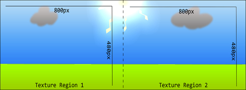

# 第四章：使用摄像机

本章将介绍 AndEngine 的各种摄像机对象和高级摄像机控制。主题包括：

+   引入摄像机对象

+   使用边界摄像机限制摄像机区域

+   使用缩放摄像机更近距离观察

+   使用平滑摄像机创建平滑移动

+   捏合缩放摄像机功能

+   拼接背景

+   为摄像机应用 HUD

+   将控制器附加到显示

+   坐标转换

+   创建分屏游戏

# 引言

AndEngine 包括三种类型的摄像机，不包括基础的`Camera`对象，这允许我们更具体地控制摄像机的行为。摄像机在游戏中可以扮演许多不同的角色，在某些情况下，我们可能需要不止一个摄像机。这一章将介绍我们可以使用 AndEngine 的`Camera`对象的不同目的和方式，以便在我们的游戏中应用更高级的摄像机功能。

# 引入摄像机对象

在设计大型游戏时，摄像机可以有许多用途，但它的主要目标是将在游戏世界的特定区域显示在设备的屏幕上。这一主题将介绍基础的`Camera`类，涵盖摄像机的一般方面，以便为将来的摄像机使用提供参考。

## 如何操作...

在游戏开发中，摄像机的重要性在于它决定了我们在设备上能看到什么。创建我们的摄像机就像下面的代码一样简单：

```kt
final int WIDTH = 800;
final int HEIGHT = 480;

// Create the camera
Camera mCamera = new Camera(0, 0, WIDTH, HEIGHT);
```

`WIDTH`和`HEIGHT`值将定义游戏场景的区域，该区域将在设备上显示。

## 它是如何工作的...

重要的是要了解摄像机的主要功能，以便在我们的项目中充分利用它。所有不同的摄像机都继承了本主题中找到的方法。让我们看看在 AndEngine 开发中一些最必要的摄像机方法：

**摄像机定位**：

`Camera`对象遵循与实体相同的坐标系。例如，将摄像机的坐标设置为`(0,0)`，将设置摄像机的中心点为定义的坐标。此外，增加 x 值将摄像机向右移动，增加 y 值将摄像机向上移动。减少这些值将产生相反的效果。为了将摄像机重新定位到定义的位置中心，我们可以调用以下方法：

```kt
// We can position the camera anywhere in the game world
mCamera.setCenter(WIDTH / 2, HEIGHT / 2);
```

上述代码对默认的摄像机位置没有任何影响（假设`WIDTH`和`HEIGHT`值用于定义摄像机的宽度和高度）。这将设置摄像机的中心到我们场景的“中心”，当创建`Camera`对象时，这自然等于摄像机`WIDTH`和`HEIGHT`值的一半。在需要将摄像机重置回初始位置的情况下，可以使用前面的方法调用，这在摄像机在游戏过程中移动，但在用户返回菜单时应返回初始位置时很有用。

不设置特定坐标而移动摄像头可以通过`offsetCenter(x,y)`方法实现，其中`x`和`y`值定义了在场景坐标中偏移摄像头的距离。此方法将指定的参数值添加到摄像头的当前位置：

```kt
// Move the camera up and to the right by 5 pixels
mCamera.offsetCenter(5, 5);
// Move the camera down and to the left by 5 pixels
mCamera.offsetCenter(-5, -5);
```

此外，我们可以通过以下方法获取摄像头的中心坐标（x 和 y）：

```kt
mCamera.getCenterX();
mCamera.getCenterY();
```

**调整摄像头的宽度和高度**：

可以通过摄像头的`set()`方法调整摄像头的初始宽度和高度。我们还可以通过调用如`setXMin()`/`setXMax()`和`setYMin()`/`setYMax()`等方法来设置摄像头的最小/最大 x 和 y 值。以下代码将使摄像头宽度减半，同时保持初始的摄像头高度：

```kt
// Shrink the camera by half its width
mCamera.set(0, 0, mCamera.getWidth() / 2, mCamera.getHeight());
```

需要注意的是，在缩小摄像头宽度的同时，我们会失去在定义区域之外的像素和任何实体的可见性。此外，缩小或扩展摄像头的宽度和高度可能会导致实体看起来被拉伸或压缩。通常，在开发典型游戏时，修改摄像头的宽度和高度并不是必要的。

`Camera`对象还允许我们通过调用`getXMin()`/`getXMax()`和`getYMin()`/`getYMax()`获取摄像头的当前最小/最大宽度和高度值。

**可见性检查**：

`Camera`类允许我们检查特定的`Entity`对象是否在摄像头的视野内可见。`Entity`对象子类型包括但不限于`Line`和`Rectangle`基元，`Sprite`和`Text`对象，以及它们的子类型，如`TiledSprite`和`ButtonSprite`对象等。可以通过以下方法进行可见性检查：

```kt
// Check if entity is visible. true if so, false otherwise
mCamera.isEntityVisible(entityObject);
```

可见性检查对于许多游戏来说非常有用，例如，重用可能离开摄像头视野的对象，这样就可以限制在可能产生大量对象并最终离开摄像头视野的情况下创建对象的总数。相反，我们可以重用离开摄像头视野的对象。

**追逐实体功能**：

在很多游戏中，常常需要摄像头跟随屏幕上的`Entity`对象移动，例如在横向卷轴游戏中。我们可以通过调用一个简单的方法轻松设置摄像头跟随游戏世界中任何地方的实体移动。

```kt
mCamera.setChaseEntity(entityObject);
```

之前的代码将在每次更新摄像头时将摄像头位置应用到指定实体的位置上。这确保了实体始终处于摄像头的中心。

### 注意：由于原文最后一行只有一个单词"Note"，并没有提供足够的信息来进行翻译，因此在这里保留原文。如果需要进一步的翻译，请提供完整的句子或段落。

在本书的多数食谱中，我们指定了 800 像素的摄像头宽度和 480 像素的摄像头高度。然而，这些值完全取决于开发者，并且应由游戏的需求来定义。选择这些特定的值是因为它们相对适合小屏幕和大屏幕设备。

# 使用边界摄像头限制摄像头区域

`BoundCamera`对象允许我们定义摄像机区域的具体边界，限制摄像机在 x 轴和 y 轴上可以移动的距离。当摄像机需要跟随玩家但又不超出关卡边界时（例如用户靠近墙壁时），这种摄像机非常有用。

## 如何操作...

创建`BoundCamera`对象需要与普通`Camera`对象相同的参数：

```kt
BoundCamera mCamera = new BoundCamera(0, 0, WIDTH, HEIGHT);
```

## 它是如何工作的...

`BoundCamera`对象扩展了普通的`Camera`对象，为我们提供了本章中*摄像机对象介绍*一节描述的所有原始摄像机功能。实际上，除非我们在`BoundCamera`对象上配置了一个有边界的区域，否则我们实际上是在使用基本的`Camera`对象。

在摄像机对其可移动区域应用限制之前，我们必须定义摄像机可以自由移动的可用区域：

```kt
// WIDTH = 800;
// HEIGHT = 480;
// WIDTH and HEIGHT are equal to the camera's width and height
mCamera.setBounds(0, 0, WIDTH * 4, HEIGHT);

// We must call this method in order to apply camera bounds
mCamera.setBoundsEnabled(true);
```

上述代码将从场景坐标`(0,0)`的位置开始设置摄像机边界，一直到`(3200,480)`，因为我们把摄像机的宽度放大了四倍作为最大 x 区域，允许摄像机滚动四倍于其宽度。由于边界高度设置为与摄像机高度相同的值，摄像机将不会响应 y 轴上的变化。

## 另请参阅

+   本章节提供的*摄像机对象介绍*。

# 用缩放摄像机更近距离地观察

AndEngine 的`BoundCamera`和`Camera`对象默认不支持放大和缩小。如果我们想要允许摄像机缩放，可以创建一个扩展了`BoundCamera`类的`ZoomCamera`对象。这个对象包括其继承类所有的功能，包括创建摄像机边界。

## 如何操作...

`ZoomCamera`对象与`BoundCamera`类似，在创建摄像机时不需要定义额外的参数：

```kt
ZoomCamera mCamera = new ZoomCamera(0, 0, WIDTH, HEIGHT);
```

## 它是如何工作的…

为了向摄像机应用缩放效果，我们可以调用`setZoomFactor(factor)`方法，其中`factor`是我们想要应用到`Scene`对象的放大倍数。通过以下代码可以实现放大和缩小：

```kt
// Divide the camera width/height by 1.5x (Zoom in)
mCamera.setZoomFactor(1.5f);

// Divide the camera width and height by 0.5x (Zoom out)
mCamera.setZoomFactor(0.5f);
```

在处理摄像机的缩放因子时，我们必须知道`1`的因子等于`Camera`类的默认因子。大于`1`的缩放因子将摄像机向场景内缩放，而任何小于`1`的值将使摄像机向外缩放。

处理缩放因子的数学运算非常基础。摄像机只需将缩放因子除以我们摄像机的`WIDTH`和`HEIGHT`值，有效实现摄像机的“缩放”。如果我们的摄像机宽度是`800`，那么`1.5f`的缩放因子将使摄像机向内缩放，最终将摄像机的宽度设置为`533.3333`，这将限制场景显示的区域面积。

### 注意

在应用了缩放因子（不等于 1）的情况下，`ZoomCamera`对象返回的`getMinX()`、`getMaxX()`、`getMinY()`、`getMaxY()`、`getWidth()`和`getHeight()`值会自动被缩放因子除。

## 还有更多…

在缩放摄像头中启用不等于 1 的因子的边界，将对摄像头能够平移的总可用区域产生影响。假设边界的最小和最大 x 值从 0 设置为 800，如果摄像头宽度等于 800，那么在 x 轴上将不允许有任何移动。如果我们放大摄像头，摄像头的宽度将减小，从而允许摄像头移动时有更多的余地。

### 注意

如果定义了一个缩放因子，导致摄像头的宽度或高度超出摄像头边界，那么将应用缩放因子到摄像头，但超出轴将不允许移动。

## 另请参阅

+   *本章中提供的摄像头对象介绍*。

+   *本章中提供的限制摄像头区域的边界摄像头*。

# 使用平滑摄像头创建平滑移动

`SmoothCamera`对象是四种可选摄像头中最先进的一个。这个摄像头支持所有不同的摄像头功能类型（边界、缩放等），并新增了一个选项，即在为摄像头设置新位置时，可以给摄像头的移动速度应用一个定义好的速度。这样做的结果是，摄像头在移动时看起来会“平滑”地进入和退出，从而实现相当微妙的摄像头移动。

## 如何操作…

这种摄像头类型是四种中唯一需要在构造函数中定义额外参数的一个。这些额外的参数包括摄像头可以移动的最大 x 和 y 速度以及处理摄像头缩放速度的最大缩放因子变化。让我们看看创建这种摄像头的样子：

```kt
// Camera movement speeds
final float maxVelocityX = 10;
final float maxVelocityY = 5;
// Camera zoom speed
final float maxZoomFactorChange = 5;

// Create smooth camera
mCamera = new SmoothCamera(0, 0, WIDTH, HEIGHT, maxVelocityX, maxVelocityY, maxZoomFactorChange);
```

## 工作原理…

在这个示例中，我们将创建一个摄像头，为摄像头的移动和缩放应用平滑的过渡效果。与其他三种摄像头类型不同，不是直接使用`setCenter(x,y)`将摄像头中心设置到定义的位置，而是使用`maxVelocityX`、`maxVelocityY`和`maxZoomFactorChange`变量来定义摄像头从点 A 到点 B 的移动速度。增加速度会使摄像头移动更快。

对于`SmoothCamera`类，无论是摄像头移动还是缩放，都有两种选择。我们可以通过调用这些任务的默认摄像头方法（`camera.setCenter()`和`camera.setZoomFactor()`）使摄像头平滑移动或缩放。另一方面，有时我们需要立即重新定位摄像头。这可以通过分别调用`camera.setCenterDirect()`和`camera.setZoomFactorDirect()`方法来实现。这些方法通常用于重置平滑摄像头的位置。

## 另请参阅

+   本章节中提供的*相机对象介绍*。

+   本章节中提到的*限制相机区域的边界相机*。

+   本章节中提供的*通过缩放相机近距离观察*。

# 捏合缩放相机功能

AndEngine 包含一系列“检测器”类，可以与场景触摸事件结合使用。本主题将介绍如何使用`PinchZoomDetector`类，以便通过在屏幕上按两指，并让它们靠近或分开来调整缩放因子，从而允许相机的缩放。

## 开始操作…

请参考代码包中名为`ApplyingPinchToZoom`的类。

## 如何操作…

按照以下步骤进行操作，以设置捏合缩放功能。

1.  我们首先要做的是将适当的监听器实现到我们的类中。由于我们将处理触摸事件，因此需要包含`IOnSceneTouchListener`接口。此外，我们还需要实现`IPinchZoomDetectorListener`接口，以处理相机缩放因子在等待触摸事件时的变化：

    ```kt
    public class ApplyingPinchToZoom extends BaseGameActivity implements
        IOnSceneTouchListener, IPinchZoomDetectorListener {
    ```

1.  在`BaseGameActivity`类的`onCreateScene()`方法中，将`Scene`对象的触摸监听器设置为`this`活动，因为我们让`BaseGameActivity`类实现触摸监听器类。我们还将在此方法中创建并启用`mPinchZoomDetector`对象：

    ```kt
    /* Set the scene to listen for touch events using
    * this activity's listener */
    mScene.setOnSceneTouchListener(this);

    /* Create and set the zoom detector to listen for 
     * touch events using this activity's listener */
    mPinchZoomDetector = new PinchZoomDetector(this);

    // Enable the zoom detector
    mPinchZoomDetector.setEnabled(true);
    ```

1.  在`BaseGameActivity`类的实现的`onSceneTouchEvent()`方法中，我们必须将触摸事件传递给`mPinchZoomDetector`对象：

    ```kt
    @Override
    public boolean onSceneTouchEvent(Scene pScene, TouchEvent pSceneTouchEvent) {
      // Pass scene touch events to the pinch zoom detector
      mPinchZoomDetector.onTouchEvent(pSceneTouchEvent);
      return true;
    }
    ```

1.  接下来，当`mPinchZoomDetector`对象检测到用户在屏幕上使用两指操作时，我们将获取`ZoomCamera`对象的初始缩放因子。我们将使用通过`IPinchZoomDetectorListener`接口实现的`onPinchZoomStarted()`方法：

    ```kt
    /* This method is fired when two fingers press down
    * on the display */
    @Override
    public void onPinchZoomStarted(PinchZoomDetector pPinchZoomDetector,
        TouchEvent pSceneTouchEvent) {
      // On first detection of pinch zooming, obtain the initial zoom factor
      mInitialTouchZoomFactor = mCamera.getZoomFactor();
    }
    ```

1.  最后，在检测到屏幕上出现捏合动作时，我们将更改`ZoomCamera`对象的缩放因子。这段代码将放在`onPinchZoom()`和`onPinchZoomFinished()`方法中：

    ```kt
    @Override
    public void onPinchZoom(PinchZoomDetector pPinchZoomDetector,
        TouchEvent pTouchEvent, float pZoomFactor) {

      /* On every sub-sequent touch event (after the initial touch) we offset
      * the initial camera zoom factor by the zoom factor calculated by
      * pinch-zooming */
      final float newZoomFactor = mInitialTouchZoomFactor * pZoomFactor;

      // If the camera is within zooming bounds
      if(newZoomFactor < MAX_ZOOM_FACTOR && newZoomFactor > MIN_ZOOM_FACTOR){
        // Set the new zoom factor
        mCamera.setZoomFactor(newZoomFactor);
      }
    }
    ```

## 工作原理…

在此食谱中，我们覆盖了发生在我们场景上的场景触摸事件，将这些触摸事件传递给`PinchZoomDetector`对象，该对象将处理`ZoomCamera`对象的缩放功能。以下步骤将引导我们了解捏合缩放的工作原理。由于在此活动中我们将使用缩放因子，因此我们需要使用`ZoomCamera`类或`SmoothCamera`类的实现。

在这个配方的第一步和第二步中，我们正在实现所需的监听器，并将它们注册到`mScene`对象和`mPinchZoomDetector`对象。由于`ApplyingPinchToZoom`活动正在实现监听器，我们可以将代表我们`BaseGameActivity`类的`this`传递给`mScene`对象作为触摸监听器。我们还可以将此活动作为捏合检测监听器。一旦创建了捏合检测器，我们可以通过调用`setEnabled(pSetEnabled)`方法来启用或禁用它。

在第三步中，我们将`pSceneTouchEvent`对象传递给捏合检测器的`onTouchEvent()`方法。这样做可以让捏合检测器获取特定的触摸坐标，这些坐标将在内部用于根据手指位置计算缩放因子。

当在屏幕上按下两个手指时，捏合检测器将触发第四步中显示的代码片段。我们必须在此时获取相机的初始缩放因子，以便在触摸坐标改变时正确偏移缩放因子。

最后一步涉及计算偏移缩放因子并将其应用于`ZoomCamera`对象。通过将初始缩放因子与`PinchZoomDetector`对象计算的缩放因子变化相乘，我们可以成功偏移相机的缩放因子。一旦我们计算了`newZoomFactor`对象的值，我们调用`setZoomFactor(newZoomFactor)`以改变我们相机的缩放级别。

将缩放因子限制在特定范围内只需添加一个`if`语句，指定我们需要的最大和/或最小缩放因子即可。在这种情况下，我们的相机不能缩放比`0.5f`更小，或者比`1.5f`更大。

## 另请参阅

+   本章提供了*使用缩放相机近距离观察*的内容。

# 拼接背景

尽管 AndEngine 的`Scene`对象允许我们为场景设置背景，但这并不总是我们项目的可行解决方案。为了使背景能够进行平移和缩放，我们可以把多个纹理区域拼接在一起，并将其直接应用到场景中作为精灵。这一主题将要讲述如何将两个 800 x 480 的纹理区域拼接在一起，以创建一个更大的可平移和可缩放的背景。背景拼接背后的想法是允许场景的部分以较小的块显示。这为我们提供了创建较小纹理尺寸的机会，以避免超过大多数设备 1024 x 1024 的最大纹理尺寸限制。此外，我们可以启用剪裁，以便在屏幕上不显示场景部分时，不绘制它们，以提高性能。以下图展示了结果：



## 开始使用...

执行本章给出的食谱*捏合缩放相机功能*，以了解捏合缩放的工作原理。此外，我们还需要准备两张单独的 800 x 480 像素的图片，类似于本食谱引言中的前一个图像，以 PNG 格式保存，然后在代码包中引用名为`StitchedBackground`的类。

## 如何操作…

背景拼接是一个简单的概念，它涉及将两个或更多的精灵直接并排放置，重叠放置，或者上下放置，以形成看似拥有一个单一的、大精灵的效果。在本食谱中，我们将介绍如何做到这一点，以避免可怕的纹理溢出效应。按照以下步骤操作：

1.  首先，我们需要创建我们的`BuildableBitmapTextureAtlas`和`ITextureRegion`对象。非常重要的一点是，纹理图集的大小必须与我们的图片文件完全相同，以避免纹理溢出。同时，在构建纹理图集的过程中，我们绝不能包含任何填充或间隔。以下代码将创建左侧的纹理图集和纹理区域，同样的代码也适用于右侧：

    ```kt
    /* Create the background left texture atlas */
    BuildableBitmapTextureAtlas backgroundTextureLeft = new BuildableBitmapTextureAtlas(
        mEngine.getTextureManager(), 800, 480);

    /* Create the background left texture region */
    mBackgroundLeftTextureRegion = BitmapTextureAtlasTextureRegionFactory
        .createFromAsset(backgroundTextureLeft, getAssets(),
            "background_left.png");

    /* Build and load the background left texture atlas */
    try {
      backgroundTextureLeft
          .build(new BlackPawnTextureAtlasBuilder<IBitmapTextureAtlasSource, BitmapTextureAtlas>(
              0, 0, 0));
      backgroundTextureLeft.load();
    } catch (TextureAtlasBuilderException e) {
      e.printStackTrace();
    }
    ```

1.  一旦纹理资源就位，我们就可以移动到活动的`onPopulateScene()`方法中，在那里我们将创建并将精灵应用到`Scene`对象上：

    ```kt
    final int halfTextureWidth = (int) (mBackgroundLeftTextureRegion.getWidth() * 0.5f);
    final int halfTextureHeight = (int) (mBackgroundLeftTextureRegion.getHeight() * 0.5f);

    // Create left background sprite
    mBackgroundLeftSprite = new Sprite(halfTextureWidth, halfTextureHeight, mBackgroundLeftTextureRegion,
        mEngine.getVertexBufferObjectManager())
    ;
    // Attach left background sprite to the background scene
    mScene.attachChild(mBackgroundLeftSprite);

    // Create the right background sprite, positioned directly to the right of the first segment
    mBackgroundRightSprite = new Sprite(mBackgroundLeftSprite.getX() + mBackgroundLeftTextureRegion.getWidth(),
        halfTextureHeight, mBackgroundRightTextureRegion,
        mEngine.getVertexBufferObjectManager());

    // Attach right background sprite to the background scene
    mScene.attachChild(mBackgroundRightSprite);
    ```

## 它是如何工作的…

背景拼接可以在许多不同的场景中使用，以避免某些问题。这些问题包括导致某些设备不兼容的过大纹理尺寸，不响应相机位置或缩放因子变化的静态背景，以及性能问题等。在本食谱中，我们创建了一个大背景，这是通过将两个`Sprite`对象并排放置拼接而成的，每个代表不同的`TextureRegion`对象。结果是形成一个大于相机宽度两倍的大背景，尺寸为 1600 x 480 像素。

在处理允许场景滚动的拼接背景的大多数情况下，我们将需要启用一些相机边界，以防止在相机试图超出背景区域时更新相机位置。我们可以使用`ZoomCamera`对象来实现这一点，将边界设置为背景预定的尺寸。由于我们处理的是两个各为 800 x 480 像素的 PNG 图片并排拼接，可以肯定地说，坐标`(0,0)`到`(1600, 480)`足以作为相机边界。

如第一步所述，使用这种方法创建大型背景时，我们必须遵循一些规则。图像大小必须与`BuildableBitmapTextureAtlas`纹理图集大小完全相同！不遵循此规则可能会导致精灵之间周期性地出现伪影，这对玩家来说是非常分散注意力的。这也意味着我们不应该在用于背景拼接的`BuildableBitmapTextureAtlas`对象中包含超过一个`ITextureRegion`对象。在这种情况下，我们还应该避免使用填充和间距功能。然而，遵循这些规则，我们仍然可以对纹理图集应用`TextureOptions.BILINEAR`纹理过滤，并且不会导致问题。

在第二步中，我们继续创建`Sprite`对象。这里没有特别之处；我们只是在给定位置创建一个`Sprite`对象，然后在第一个旁边直接设置下一个精灵。对于极其庞大和多样的背景，将纹理拼接在一起的方法可以帮助显著降低应用程序的性能成本，允许我们停止渲染不再可见的背景较小部分。这个特性称为**剔除**。有关如何实现这一点，请参见第八章，*最大化性能*中的*通过实体剔除禁用渲染*。

## 参见 also（此处的"also"似乎是原文的残留，若不需要翻译请忽略）

+   在第二章，*设计您的菜单*中，介绍*使用精灵让场景生动*。

+   本章节提供*通过缩放相机更近距离观察*。

+   本章节介绍*捏合缩放相机功能*。

+   在第八章，*最大化性能*中，介绍*通过实体剔除禁用渲染*。

# 向相机应用 HUD。

即使是最简单的游戏，**HUD（抬头显示）**也可能是一个非常实用的组件。HUD 的目的是包含一组按钮、文本或任何其他`Entity`对象，以便为用户提供界面。HUD 有两个关键点：第一，无论相机是否改变位置，HUD 的子对象始终会在屏幕上显示；第二，HUD 的子对象始终会显示在场景子对象的前面。在本章中，我们将向相机应用 HUD，以便在游戏过程中为用户提供界面。

## 如何操作...

将以下代码导入您选择的任何`BaseGameActivity`的`onCreateEngineOptions()`方法中，如果需要，请替换此代码片段中的相机类型：

```kt
@Override
public EngineOptions onCreateEngineOptions() {

  // Create the camera
  Camera mCamera = new Camera(0, 0, WIDTH, HEIGHT);

  // Create the HUD
  HUD mHud = new HUD();

  // Attach the HUD to the camera
  mCamera.setHUD(mHud);

  EngineOptions engineOptions = new EngineOptions(true,
      ScreenOrientation.LANDSCAPE_FIXED, new FillResolutionPolicy(),
      mCamera);

  return engineOptions;
}
```

## 它是如何工作的…

使用`HUD`类通常是一项非常简单的任务。根据所创建的游戏类型，`HUD`类的实用性可能会有很大差异，但无论如何，在决定使用这个类之前，我们必须了解一些事情：

+   `HUD`实体在相机移动时不会改变位置。一旦定义了它们的位置，实体将保持在该屏幕位置，除非通过`setPosition()`方法进行设置。

+   `HUD`实体将始终出现在任何`Scene`实体的顶部，无论 z-index、应用顺序或任何其他场景如何。

+   在任何情况下都不应将剔除应用于要附加到`HUD`类的实体。剔除以相同的方式影响`HUD`类上的`Entity`对象，就像它会影响`Scene`对象上的`Entity`对象一样，即使`Entity`对象似乎没有移出屏幕。这将导致看似随机消失的`HUD`实体。只是不要这么做！

在*如何操作...*部分的代码中，我们可以看到设置`HUD`类非常简单。创建并应用`HUD`对象到相机只需以下两行代码即可完成：

```kt
  // Create the HUD
  HUD mHud = new HUD();

  // Attach the HUD to the camera
  mCamera.setHUD(mHud);
```

从这一点开始，我们可以将`HUD`对象视为游戏中任何其他层的实体应用。

# 将控制器应用于显示

根据我们正在创建的游戏类型，玩家互动有许多可能的解决方案。AndEngine 包含两个独立的类，其中一个模拟方向控制板，称为`DigitalOnScreenControl`，另一个模拟摇杆，称为`AnalogOnScreenControl`。本主题将介绍 AndEngine 的`AnalogOnScreenControl`类，但使用这个类将给我们足够的信息去使用任一控制器。

## 开始吧...

此配方需要两个独立的资源，它们将作为控制器的基础和旋钮。在继续*如何操作...*部分之前，请将名为`controller_base.png`和`controller_knob.png`的图片包含到您选择的项目中的`assets/gfx`文件夹中。这些图片可能看起来像下面的图，基础为 128 x 128 像素，旋钮为 64 x 64 像素：


## 如何操作...

一旦我们为控制器准备好了两个必要的资源，我们就可以开始编码了。首先，我们可以开始创建保存控制器资源的`ITextureRegion`和`BuildableBitmapTextureAtlas`对象。对于控制器纹理图集或纹理区域没有特殊步骤；像创建普通精灵一样创建它们。像往常一样，在您选择的活动中的`onCreateResources()`方法中完成此操作。

一旦`ITextureRegion`对象被编码并准备好在活动内使用，我们可以在活动对象的`onCreateScene()`方法中创建`AnalogOnScreenControl`类，如下所示：

```kt
// Position the controller in the bottom left corner of the screen
final float controllerX = mControllerBaseTextureRegion.getWidth();
final float controllerY = mControllerBaseTextureRegion.getHeight();

// Create the controller
mController = new AnalogOnScreenControl(controllerX, controllerY, mCamera, mControllerBaseTextureRegion, mControllerKnobTextureRegion, 0.1f, mEngine.getVertexBufferObjectManager(), new IAnalogOnScreenControlListener(){
  /* The following method is called every X amount of seconds,
  * where the seconds are determined by the pTimeBetweenUpdates
  * parameter in the controller's constructor  */
  @Override
  public void onControlChange(
      BaseOnScreenControl pBaseOnScreenControl, float pValueX,
      float pValueY) {
    mCamera.setCenter(mCamera.getCenterX() + (pValueX * 10), mCamera.getCenterY() + (pValueY * 10));
    Log.d("Camera", String.valueOf(mCamera.getCenterX()));
  }

  // Fired when the knob is simply pressed
  @Override
  public void onControlClick(
      AnalogOnScreenControl pAnalogOnScreenControl) {
    // Do nothing
  }

});

// Initialize the knob to its center position
mController.refreshControlKnobPosition();

// Set the controller as a child scene
mScene.setChildScene(mController);
```

## 工作原理...

如我们所见，一些参数与我们创建`Sprite`对象时定义的参数并无不同。前五个参数是自解释的。第六个参数`(0.1f)`是“更新之间的时间”参数。这个值控制`onControlChange()`方法内的事件被触发的频率。对于 CPU 密集型代码，增加更新之间的时间可能有益，而对于复杂性较低的代码，非常低的更新时间可能没有问题。

控制器构造函数中必须包含的最后一个参数是`IanalogOnScreenControlListener`，它处理基于控制器是被简单点击还是被按住并保持在一个偏移位置的事件。

正如我们在`onControlChange()`事件中所见，我们可以通过`pValueX`和`pValueY`变量获取控制器旋钮的当前位置。这些值包含了控制器的 x 和 y 偏移量。在本示例中，我们使用旋钮的 x 和 y 偏移量来移动摄像头的位置，这也让我们了解到如何使用这些变量来移动其他实体，例如玩家的精灵。

# 坐标转换

在某些场景对象依赖于多个实体作为游戏精灵的基础层的场景中，坐标转换可能非常有用。在包含许多父对象，每个父对象都有自己的子对象集合的游戏中，需要获取子对象相对于`Scene`对象的位置是常有的事。在所有层在整个游戏中始终保持相同的（0, 0）坐标的情况下，这不是问题。另一方面，当我们的层开始移动时，子对象的位置会随父对象移动，但它们在层上的坐标保持不变。本主题将涵盖将场景坐标转换为局部坐标，以允许嵌套实体在场景上正确定位。

## 如何操作…

将以下代码导入你选择的任何`BaseGameActivity`的`onCreateScene()`方法中。

1.  本方法的第一个步骤是创建一个`Rectangle`对象并将其应用到`Scene`对象上。这个`Rectangle`对象将作为另一个`Rectangle`对象的父实体。我们将它的颜色设置为蓝色，以便当两个矩形重叠时可以区分，因为父`Rectangle`对象将不断移动：

    ```kt
    /* Create a rectangle on the Scene that will act as a layer */
    final Rectangle rectangleLayer = new Rectangle(0, HEIGHT * 0.5f, 200, 200, mEngine.getVertexBufferObjectManager()){

      /* Obtain the half width of this rectangle */
      int halfWidth = (int) (this.getWidth() * 0.5f);

      /* Boolean value to determine whether to pan left or right */
      boolean incrementX = true;

      @Override
      protected void onManagedUpdate(float pSecondsElapsed) {

        float currentX = this.getX();

        /* Determine whether or not the layer should pan left or right */
        if(currentX + halfWidth > WIDTH){
          incrementX = false;
        }
        else if (currentX - halfWidth < 0){
          incrementX = true;
        }
        /* Increment or decrement the layer's position based on incrementX */
        if(incrementX){
          this.setX(currentX + 5f);
        } else {
          this.setX(currentX - 5f);
        }

        super.onManagedUpdate(pSecondsElapsed);
      }
    };

    rectangleLayer.setColor(0, 0, 1);

    // Attach the layer to the scene
    mScene.attachChild(rectangleLayer);
    ```

1.  接下来，我们将子`Rectangle`对象添加到我们先前创建的第一个`Rectangle`对象中。这个`Rectangle`对象不会移动；相反，它将保持在屏幕中心，而其父对象继续在周围移动。这个`Rectangle`对象将利用坐标转换来保持其位置：

    ```kt
    /* Create a smaller, second rectangle and attach it to the first */
    Rectangle rectangle = new Rectangle(0, 0, 50, 50, mEngine.getVertexBufferObjectManager()){

      /* Obtain the coordinates in the middle of the Scene that we will
       * convert to everytime the parent rectangle moves */
      final float convertToMidSceneX = WIDTH * 0.5f;
      final float convertToMidSceneY = HEIGHT * 0.5f;

      @Override
      protected void onManagedUpdate(float pSecondsElapsed) {

        /* Convert the specified x/y coordinates into Scene coordinates,
          * passing the resulting coordinates into the convertedCoordinates array */
        final float convertedCoordinates[] = rectangleLayer.convertSceneCoordinatesToLocalCoordinates(convertToMidSceneX, convertToMidSceneY);

        /* Since the parent is moving constantly, we must adjust this rectangle's
         * position on every update as well. This will keep in in the center of the 
         * display at all times */
        this.setPosition(convertedCoordinates[0], convertedCoordinates[1]);

        super.onManagedUpdate(pSecondsElapsed);
      }

    };

    /* Attach the second rectangle to the first rectangle */
    rectangleLayer.attachChild(rectangle);
    ```

## 它是如何工作的…

上面的`onCreateScene()`方法创建了一个包含两个独立`Rectangle`实体的`Scene`对象。第一个`Rectangle`实体将直接附加到`Scene`对象上。第二个`Rectangle`实体将附加到第一个`Rectangle`实体上。名为`rectangleLayer`的第一个`Rectangle`实体将会持续地从左向右和从右向左移动。通常，这会导致其子实体的位置跟随相同的移动模式，但在这个示例中，我们使用坐标转换，以允许子`Rectangle`实体在其父实体移动时保持静止。

在此示例中，`rectangle`对象包括两个名为`convertToMidSceneX`和`convertToMidSceneY`的变量。这些变量简单地保存了我们想要将局部坐标转换到的`Scene`坐标中的位置。正如我们所看到的，它们的坐标被定义在场景的中间。在`rectangle`对象的`onManagedUpdate()`方法中，我们然后使用`rectangleLayer.convertSceneCoordinatesToLocalCoordinates(convertToMidSceneX, convertToMidSceneY)`方法，将结果坐标传递给一个浮点数组。这样做的基本上是询问`rectangleLayer`对象：“在你看来，场景上的位置 x/y 在哪里？”由于`rectangleLayer`对象直接附加到`Scene`对象，它可以轻松地确定特定`Scene`坐标的位置，因为它依赖于原生的`Scene`坐标系统。

当尝试访问返回的坐标时，我们可以通过`convertedCoordinates[0]`获取转换后的 x 坐标，并使用`convertedCoordinates[1]`获取转换后的 y 坐标。

在将`Scene`坐标转换为局部`Entity`坐标的基础上，我们还可以将局部`Entity`坐标转换为`Scene`坐标、触摸事件坐标、摄像头坐标以及许多其他选项。然而，一旦我们从这个示例开始，对坐标转换有了基本的了解，其余的转换方法将看起来非常相似。

# 创建一个分屏游戏

本示例将介绍`DoubleSceneSplitScreenEngine`类，该类通常用于允许多个玩家在显示器的每一半上玩他们自己的游戏实例的游戏中。`DoubleSceneSplitScreenEngine`类使我们能够为设备的显示器的每一半提供自己的`Scene`和`Camera`对象，从而让我们完全控制显示器每一半将看到的内容。

## 开始使用…

请参考代码包中名为`SplitScreenExample`的类。

## 如何操作…

要使我们的游戏支持两个独立的`Scene`对象，我们需要在最初设置`BaseGameActivity`类时采取略有不同的方法。然而，一旦我们设置好了独立的`Scene`对象，管理它们实际上与只处理一个场景非常相似，除了每个场景只有原始显示空间的一半这一点。执行以下步骤以了解如何设置`DoubleSceneSplitScreenEngine`类。

1.  我们首先需要将`WIDTH`值减半，因为每个相机将需要设备显示的一半空间。试图将 800 像素的宽度适配到每个相机将导致每个场景上的对象出现明显的扭曲。在声明变量时，我们还将设置两个`Scene`对象和两个`Camera`对象，这些将用于`DoubleSceneSplitScreenEngine`的实现：

    ```kt
      public static final int WIDTH = 400;
      public static final int HEIGHT = 480;

    /* We'll need two Scene's for the DoubleSceneSplitScreenEngine */
      private Scene mSceneOne;
      private Scene mSceneTwo;

      /* We'll also need two Camera's for the DoubleSceneSplitScreenEngine */
      private SmoothCamera mCameraOne;
      private SmoothCamera mCameraTwo;
    ```

1.  然后，我们将在`BaseGameActivity`类的`onCreateEngineOptions()`方法中创建两个独立的`SmoothCamera`对象。这些相机将用于为显示的每一半提供独立的视图。在这个示例中，我们应用了自动缩放，以展示`DoubleSceneSplitScreenEngine`的结果：

    ```kt
    /* Create the first camera (Left half of the display) */
    mCameraOne = new SmoothCamera(0, 0, WIDTH, HEIGHT, 0, 0, 0.4f){
      /* During each update to the camera, we will determine whether
       * or not to set a new zoom factor for this camera */
      @Override
      public void onUpdate(float pSecondsElapsed) {
        final float currentZoomFactor = this.getZoomFactor();
        if(currentZoomFactor >= MAX_ZOOM_FACTOR){
          this.setZoomFactor(MIN_ZOOM_FACTOR);
        }
        else if(currentZoomFactor <= MIN_ZOOM_FACTOR){
          this.setZoomFactor(MAX_ZOOM_FACTOR);
        }
        super.onUpdate(pSecondsElapsed);
      }
    };
    /* Set the initial zoom factor for camera one*/
    mCameraOne.setZoomFactor(MAX_ZOOM_FACTOR);

    /* Create the second camera (Right half of the display) */
    mCameraTwo = new SmoothCamera(0, 0, WIDTH, HEIGHT, 0, 0, 1.2f){
      /* During each update to the camera, we will determine whether
       * or not to set a new zoom factor for this camera */
      @Override
      public void onUpdate(float pSecondsElapsed) {
        final float currentZoomFactor = this.getZoomFactor();
        if(currentZoomFactor >= MAX_ZOOM_FACTOR){
          this.setZoomFactor(MIN_ZOOM_FACTOR);
        }
        else if(currentZoomFactor <= MIN_ZOOM_FACTOR){
          this.setZoomFactor(MAX_ZOOM_FACTOR);
        }
        super.onUpdate(pSecondsElapsed);
      }
    };
    /* Set the initial zoom factor for camera two */
    mCameraTwo.setZoomFactor(MIN_ZOOM_FACTOR);
    ```

1.  在我们`BaseGameActivity`类的`onCreateEngineOptions()`方法中还需要处理一个任务，就是创建`EngineOptions`对象，将`mCameraOne`对象作为主相机传递。另外，场景可能需要同时处理触摸事件，因此我们也将启用多点触控：

    ```kt
    /* The first camera is set via the EngineOptions creation, as usual */
    EngineOptions engineOptions = new EngineOptions(true,
        ScreenOrientation.LANDSCAPE_FIXED, new FillResolutionPolicy(),
        mCameraOne);

    /* If users should be able to control each have of the display
     *  simultaneously with touch events, we'll need to enable 
     *  multi-touch in the engine options */
    engineOptions.getTouchOptions().setNeedsMultiTouch(true);
    ```

1.  在第四步中，我们将覆盖`BaseGameActivity`类的`onCreateEngine()`方法，以创建一个`DoubleSceneSplitScreenEngine`对象，而不是默认的`Engine`对象：

    ```kt
    @Override
    public Engine onCreateEngine(EngineOptions pEngineOptions) {

      /* Return the DoubleSceneSplitScreenEngine, passing the pEngineOptions
      * as well as the second camera object. Remember, the first camera has
      * already been applied to the engineOptions which in-turn applies the
      * camera to the engine. */
      return new DoubleSceneSplitScreenEngine(pEngineOptions, mCameraTwo);
    }
    ```

1.  接下来，在`onCreateScene()`方法中，我们将创建两个`Scene`对象，按照我们的选择设置它们，并最终将每个`Scene`对象设置到`DoubleSceneSplitScreenEngine`对象中：

    ```kt
    @Override
    public void onCreateScene(OnCreateSceneCallback pOnCreateSceneCallback) {

      /* Create and setup the first scene */
      mSceneOne = new Scene();
      mSceneOne.setBackground(new Background(0.5f, 0, 0));

      /* In order to keep our camera's and scenes organized, we can
       * set the Scene's user data to store its own camera */
      mSceneOne.setUserData(mCameraOne);

      /* Create and setup the second scene */
      mSceneTwo = new Scene();
      mSceneTwo.setBackground(new Background(0,0,0.5f));

      /* Same as the first Scene, we set the second scene's user data
       * to hold its own camera */
      mSceneTwo.setUserData(mCameraTwo);

      /* We must set the second scene within mEngine object manually.
       * This does NOT need to be done with the first scene as we will
       * be passing it to the onCreateSceneCallback, which passes it
       * to the Engine object for us at the end of onCreateScene()*/
      ((DoubleSceneSplitScreenEngine) mEngine).setSecondScene(mSceneTwo);

      /* Pass the first Scene to the engine */
      pOnCreateSceneCallback.onCreateSceneFinished(mSceneOne);
    }
    ```

1.  既然我们的两个`Camera`对象已经设置好了，两个`Scene`对象也已经设置好并附加到引擎上，我们可以开始根据需要将`Entity`对象附加到每个`Scene`对象上，只需像往常一样指定要附加到的`Scene`对象。这段代码应该放在`BaseGameActivity`类的`onPopulateScene()`方法中：

    ```kt
        /* Apply a rectangle to the center of the first scene */
        Rectangle rectangleOne = new Rectangle(WIDTH * 0.5f, HEIGHT * 0.5f, rectangleDimensions, rectangleDimensions, mEngine.getVertexBufferObjectManager());
        rectangleOne.setColor(org.andengine.util.adt.color.Color.BLUE);
        mSceneOne.attachChild(rectangleOne);

        /* Apply a rectangle to the center of the second scene */
        Rectangle rectangleTwo = new Rectangle(WIDTH * 0.5f, HEIGHT * 0.5f, rectangleDimensions, rectangleDimensions, mEngine.getVertexBufferObjectManager());
        rectangleTwo.setColor(org.andengine.util.adt.color.Color.RED);
        mSceneTwo.attachChild(rectangleTwo);
    ```

## 它的工作原理...

使用`DoubleSceneSplitScreenEngine`类时，如果我们要为多人游戏进行设置，可以假设我们的项目将需要两套所有的东西。更具体地说，我们需要为屏幕的每一半各设置两个`Scene`对象以及两个`Camera`对象。由于我们将每个`Camera`对象的观看区域一分为二，我们将把相机的`WIDTH`值减半。大多数情况下，400 像素宽和 480 像素高的相机尺寸是合理的，这使我们能够保持实体的适当透视。

在第二步中，我们设置了两个`SmoothCamera`对象，它们将自动对各自场景进行放大和缩小，以为此食谱提供视觉结果。然而，`DoubleSceneSplitScreenEngine`类可以使用任何`Camera`对象的变体，包括最基本类型而不会导致任何问题。

在第三步中，我们继续创建`EngineOptions`对象。我们提供了`mCameraOne`对象作为`EngineOptions`构造函数中的`pCamera`参数，就像我们在任何普通实例中所做的那样。此外，我们在`EngineOptions`对象中启用了多点触控，以允许同时为每个`Scene`对象注册触摸事件。忽略多点触控设置将导致每个场景必须等待另一个场景没有被按下时才能注册触摸事件。

在第四步中，我们创建了`DoubleSceneSplitScreenEngine`对象，传入上一步创建的`pEngineOptions`参数以及第二个`Camera`对象—`mCameraTwo`。在代码的这个阶段，我们已经将两个摄像头注册到引擎中；第一个是在`EngineOptions`对象中注册的，第二个作为参数传递给`DoubleSceneSplitScreenEngine`类。

第五步包括`BaseGameActivity`类的`onCreateScene()`方法，在这里我们将创建并设置两个`Scene`对象。在最基本的层面上，这涉及到创建`Scene`对象，启用并设置或禁用场景的背景，将场景的用户数据设置为存储其相应的摄像头，并最终将`Scene`对象传递给我们的`mEngine`对象。虽然第二个`Scene`对象需要我们调用`mEngine`对象的`setSecondScene(mSceneTwo)`方法，但`mSceneOne`对象是像在任何`BaseGameActivity`中一样传递给`Engine`对象的；在`pOnCreateSceneCallback.onCreateSceneFinished(mSceneOne)`方法中。

在第六步中，我们可以说已经“走出困境”。在这一点上，我们已经完成了引擎、场景和摄像头的设置，现在可以开始按照我们的喜好填充每个场景。在这一点上，我们可以做的事情的可能性非常广泛，包括将第二个场景用作小地图、多人游戏的视角、对第一个场景的另一种视角等等。此时，选择要附加`Entity`对象的`Scene`对象会非常简单，只需调用`mSceneOne.attachChild(pEntity)`或`mSceneTwo.attachChild(pEntity)`即可。
