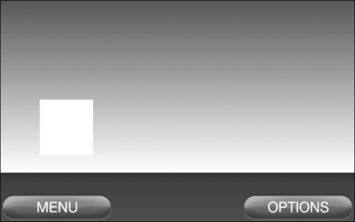
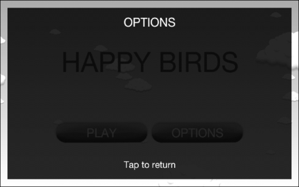
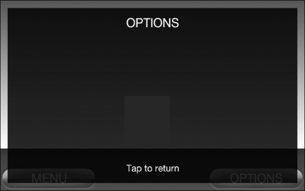

# 第五章：场景和图层管理

管理场景和图层对于使用菜单和多个游戏级别的游戏来说是一个必要条件。本章将介绍以下主题的场景管理器的创建和使用：

+   创建场景管理器

+   为场景资源设置资源管理器

+   定制管理的场景和图层

+   设置一个活动以使用场景管理器

# 简介

创建一个管理游戏菜单和场景的过程是提高框架速度的最快方法之一。一个设计良好的游戏通常依赖于强大且定制化的场景管理器来处理菜单和游戏内的关卡。定制场景管理器的方法有很多，但基础通常包括：

+   在场景之间切换

+   自动加载和卸载场景资源和元素

+   在处理场景资源和构建场景时显示加载屏幕

除了场景管理器的核心功能之外，我们还将创建一种在场景之上显示图层的方法，这样我们就可以为游戏添加另一层可用性。

# 创建场景管理器

创建一个仅替换引擎当前场景为另一个场景的场景管理器相当简单，但这种做法对玩家来说并不具有图形上的吸引力。在资源加载和场景构建时显示加载屏幕已经成为游戏设计中的一种广泛接受的做法，因为它让玩家知道游戏在进行的工作不仅仅只是闲置。

## 准备就绪...

打开本章代码包中的`SceneManager.java`类。同时，也请打开`ManagedScene.java`和`ManagedLayer.java`类。我们将在本食谱的讨论中引用这三个类。类内的内联注释提供了关于本食谱讨论内容的额外信息。

## 如何操作...

按照以下步骤了解`SceneManager`类的功能，以便我们可以为未来的项目创建一个定制版的场景管理器：

1.  首先，请注意`SceneManager`类是作为单例创建的，这样我们就可以从项目的任何地方访问它。此外，它使用我们的`ResourceManager`类提供的`getEngine()`引用来存储对引擎对象的本地引用，但如果我们选择不使用资源管理器，这个引用可以在创建`SceneManager`类时设置。

1.  其次，注意在`getInstance()`方法之后创建的变量。前两个变量`mCurrentScene`和`mNextScene`保存了对当前已加载场景和将要加载的场景的引用。`mEngine`变量保存了对引擎的引用。我们将使用这个引擎引用来设置我们的管理场景，以及注册/注销`mLoadingScreenHandler`更新处理器。整型变量`mNumFramesPassed`在更新处理器中计算已渲染的帧数，以确保加载屏幕至少显示了一帧。通过下一个变量`mLoadingScreenHandler`实现显示加载屏幕的功能，我们将在下一步中更详细地了解它。其余变量用于管理图层，并跟踪图层处理过程的状态或保存与图层处理过程相关的实体引用。

1.  第三，查看`mLoadingScreenHandler IUpdateHandler`更新处理器中的`onUpdate()`方法。请注意，这里有两个条件块——第一个在卸载上一个场景并随后加载下一个场景之前等待一帧，而第二个则等待直到下一个场景的加载屏幕至少显示最短时间之后，它才隐藏加载屏幕并重置更新处理器使用的变量。更新处理器中的整个这个过程使得在`ManagedScene`加载和构建自身时可以使用加载屏幕。

1.  类中的下一个方法是`showScene()`方法，当我们想要从当前场景导航到一个后续场景时，我们将调用它。它首先将引擎相机的位置和大小重置为其起始位置和大小，以防止之前的任何相机调整破坏新场景的展示。接下来，我们通过`ManagedScene`类的`hasLoadingScreen`属性检查新场景是否将显示加载屏幕。

    如果新的`ManagedScene`类将显示加载屏幕，我们将它的子场景设置为`onLoadingScreenLoadAndShown()`方法返回的场景，并暂停`ManagedScene`类的所有渲染、更新和触摸事件。下面的`if`块确保如果场景已经在加载阶段，可以加载新场景。这种情况应该很少见，但如果从 UI 线程调用显示新场景，则可能会发生。然后，将`mNextScene`变量设置为新的`ManagedScene`类，以供`mLoadingScreenHandler`更新处理器和引擎的场景使用。

    如果新的`ManagedScene`类不显示加载屏幕，我们将`mNextScene`变量设置为新的`ManagedScene`类，将新的`ManagedScene`类设置为引擎的场景，卸载之前显示的场景，并加载新场景。如果没有显示加载屏幕，`showScene()`方法仅用于将新场景替换为之前显示的场景。

1.  接下来，看看`showLayer()`方法。由于我们的层是在游戏中其他所有内容之上显示的，因此我们将它们作为相机`HUD`对象的子场景进行附加。该方法首先确定相机是否有`HUD`对象来附加子场景。如果有，它将`mCameraHadHud`布尔值设置为`true`。如果没有，我们将创建一个占位符 HUD 对象并将其设置为相机的`HUD`对象。接下来，如果`showLayer()`方法被调用以暂停底层`ManagedScene`的渲染、更新或触摸事件，我们将设置一个占位符场景作为`ManagedScene`场景的子场景，并传递给`showLayer()`方法的模态属性。最后，我们将层的相机设置为引擎的相机，缩放层以匹配相机的屏幕依赖性缩放，并将局部层相关变量设置为下一步引用的`hideLayer()`方法使用。

1.  `hideLayer()`方法首先检查当前是否有层正在显示。如果有，将清除相机`HUD`对象的子场景，从`ManagedScene`类中清除占位符子场景，并重置层显示系统。

按以下步骤了解`ManagedScene`和`ManagedLayer`类的构建方式：

1.  查看`ManagedScene`类，注意类开始部分列出的变量。`hasLoadingScreen`布尔值、`minLoadingScreenTime`浮点数和`elapsedLoadingScreenTime`浮点数变量由`SceneManager`类在处理`ManagedScene`类的加载屏幕时使用。`isLoaded`布尔值反映了`ManagedScene`类构建的完成状态。第一个构造函数是在不需要加载屏幕的情况下的便捷构造函数。第二个构造函数根据传递的值设置加载屏幕变量，这决定了加载屏幕应显示的最短时间。构造函数后面的公共方法由`SceneManager`类调用，并调用适当的抽象方法，这些方法列在类的底部。

1.  `ManagedLayer`类与`ManagedScene`类非常相似，但其固有的功能和缺少加载屏幕使其更容易创建。构造函数根据传递的`pUnloadOnHidden`布尔变量设置层在隐藏后是否应该卸载。构造函数后面的公共方法调用下面的适当抽象方法。

## 它的工作原理...

场景管理器存储对引擎当前场景的引用。当告诉场景管理器显示一个新场景时，它会先隐藏并卸载当前场景，然后将新场景设置为当前场景。然后，如果场景有的话，它会加载并显示新场景的加载屏幕。为了在加载场景其余部分之前显示加载屏幕，我们必须允许引擎渲染一帧。`mNumFramesPassed`整数值跟踪自过程开始以来发生的更新次数，也就是场景渲染次数。

在显示加载屏幕之后，或者如果不需要使用加载屏幕，场景管理器通过调用`onLoadManagedScene()`让场景自行加载。加载完成后，如果存在加载屏幕，并且已经显示至少一定时间，则隐藏加载屏幕并显示场景。如果加载屏幕没有显示足够的时间，我们会暂停场景的更新，这样场景就不会在加载屏幕隐藏之前开始。要了解更多关于这个场景管理器如何处理场景切换的信息，请参考`SceneManager.java`补充代码中的内联注释。

为了便于使用图层，场景管理器利用摄像头的 HUD 确保图层绘制在所有其他内容之上。如果摄像头已经有了 HUD，我们在应用图层之前先保存它，这样在图层隐藏后可以恢复原始的 HUD。此外，我们可以通过使用占位符场景来暂停底层场景的更新、渲染和触摸区域。占位符场景作为子场景附加到底层场景，因此我们必须保存底层场景已经附加的任何子场景。场景管理器通过同一方法调用来处理图层的加载和显示，让图层的子类确定是否需要重新加载，或者是否只需加载一次以减少性能负担重的加载。

## 另请参阅...

+   *在本章中自定义管理场景和图层*。

+   *在本章中设置一个活动以使用场景管理器*。

+   *在第四章中为摄像头应用 HUD*，*使用摄像头*。

# 为场景资源设置资源管理器。

为了便于菜单和游戏场景加载资源，必须首先设置资源管理器来处理这些资源。当我们调用资源管理器的`loadMenuResources()`或`loadGameResources()`方法时，它会自动加载相应的资源。同样，对于使用大量内存的菜单或游戏场景，卸载资源只需调用资源管理器的`unloadMenuResources()`、`unloadGameResources()`或`unloadSharedResources()`方法。

## 准备就绪...

打开本章代码包中的`ResourceManager.java`类，因为我们将参考它来完成这个配方。同时，也请查看该类的内联注释，以获取有关代码特定部分更多信息。

## 如何操作...

按照以下步骤了解`ResourceManager`类是如何被设置以与我们的管理场景一起使用的：

1.  注意`ResourceManager`类中定义的公共非静态变量。当加载纹理时，这个类会使用引擎和上下文变量，但它们也为我们提供了一种在整个项目中访问这些重要对象的方法。`cameraWidth`、`cameraHeight`、`cameraScaleFactorX`和`cameraScaleFactorY`变量在此类中未使用，但将在整个项目中用于相对于屏幕放置和缩放实体。

1.  找到`setup()`方法。这个方法会设置前一步中引用的非静态变量，并在我们的活动类中覆盖的`onCreateResources()`方法中被调用。重要的是，在调用`ResourceManager`类的任何其他方法之前先调用`setup()`，因为其他每个方法和变量都依赖于引擎和上下文变量。

1.  接下来，看看静态资源变量。这些变量将由我们的场景用于实体或声音，并且必须在调用之前设置。还要注意，带有游戏或菜单前缀的静态变量将分别由我们的游戏或菜单场景使用，而没有前缀的静态变量将在两种类型之间共享。

1.  现在找到`loadGameResources()`和`loadMenuResources()`方法。当我们的管理游戏和菜单场景首次启动时，将调用这些方法。这些方法的重要职责是调用后续的`ResourceManager`方法，这些方法设置前一步中引用的静态变量。相反，`unloadGameResources()`和`unloadMenuResources()`卸载其各自场景的资源，并且当应用程序流程完成资源使用后应调用它们。

## 工作原理...

在最基本的层面上，资源管理器提供了加载和卸载资源的手段。除此之外，我们定义了一系列变量，包括引擎和上下文对象，这让我们在创建场景中的实体时能够轻松访问游戏的某些常见元素。这些变量也可以放在游戏管理器或对象工厂中，但由于大多数对资源管理器的调用都接近于创建实体的代码，因此我们将其包含在资源管理器中。

## 另请参阅...

+   在第一章，*AndEngine 游戏结构*中*创建资源管理器*。

+   在第一章，*AndEngine 游戏结构*中*创建游戏管理器*。

+   在第一章，*AndEngine 游戏结构*中*创建对象工厂*。

# 定制管理场景和图层

场景管理器的主要目的是处理我们游戏中的管理场景。这些管理场景是高度可定制的，但我们希望尽可能避免重写我们的代码。为了完成这项任务，我们将使用两个扩展了 `ManagedScene` 类的类，`ManagedGameScene` 和 `ManagedMenuScene`。通过这种方式构建我们的场景类，我们将拥有共享通用基础的菜单和游戏场景。

## 准备就绪...

打开本章代码包中的以下类：`ManagedMenuScene.java`、`ManagedGameScene.java`、`MainMenu.java`、`GameLevel.java` 和 `OptionsLayer.java`。我们将在本食谱中多次引用这些类。

## 如何操作...

按照以下步骤了解 `ManagedMenuScene` 和 `ManagedGameScene` 类是如何基于 `ManagedScene` 类构建的，以创建可定制的、可扩展的场景，并将其传递给 `SceneManager` 类：

1.  查看 `ManagedMenuScene` 类。它只包含两个简单的构造函数和一个重写的 `onUnloadManagedScene()` 方法。重写的方法防止了 `isLoaded` 布尔值被设置，因为我们将不会利用场景管理器的自动卸载菜单场景功能。

1.  现在，我们将注意力转向 `ManagedGameScene` 类。这个类首先创建了一个游戏内 `HUD` 对象、一个加载屏幕 `Text` 对象以及一个加载屏幕 `Scene` 对象。`ManagedGameScene` 类的主构造函数首先将场景的触摸事件绑定设置设为真。接下来，设置场景的缩放以镜像摄像机的屏幕依赖性缩放，并将场景的位置设为摄像机的底部中心。最后，构造函数设置 HUD 的缩放以匹配摄像机的缩放。

    `ManagedGameScene` 类重写了 `ManagedScene` 类的 `onLoadingScreenLoadAndShown()` 和 `onLoadingScreenUnloadAndHidden()` 方法，以显示和隐藏一个简单的加载屏幕，该屏幕显示一个单一的 `Text` 对象。

    `ManagedScene` 类的 `onLoadScene()` 方法被重写，以构建一个表示游戏内部分的场景，该场景包含一个背景和两个按钮，允许玩家返回 `MainMenu` 或显示 `OptionsLayer`。

按照以下步骤了解如何扩展 `ManagedMenuScene` 和 `ManagedGameScene` 类以创建 `MainMenu` 和 `GameLevel` 场景：

1.  `MainMenu`类被设计为单例模式，以防止创建类的多个实例从而占用宝贵的内存空间。同时，它省略了加载屏幕，因为它几乎是瞬间加载和创建的。构成`MainMenu`类的所有实体都被定义为类级别变量，包括背景、按钮、文本和移动的实体。`MainMenu`类从`ManagedScene`类继承的场景流程方法有`onLoadScene()`、`onShowScene()`、`onHideScene()`和`onUnloadScene()`，其中只有`onLoadScene()`方法包含代码。`onLoadScene()`方法加载并构建了一个场景，包括一个背景、20 个水平移动的云朵、一个标题和两个按钮。注意，每个按钮都会调用场景管理器——播放按钮显示`GameLevel`场景，选项按钮显示`OptionsLayer`。

1.  `GameLevel`类扩展了`ManagedGameScene`类，并只覆盖了`onLoadScene()`方法，在场景中创建并随机定位一个正方形矩形。这表明`ManagedGameScene`类构成了`GameLevel`类的大部分内容，而且不同级别之间的元素仍然可以使用由`ManagedGameScene`类创建的相同基础。

按照以下步骤了解`OptionsLayer`类是如何扩展`ManagedLayer`类的层功能的：

1.  关于`OptionsLayer`类，首先注意它被定义为单例，这样在首次创建后它将保留在内存中。接下来，注意两个更新处理器`SlideIn`和`SlideOut`。这些处理器在显示或隐藏层时为层添加动画效果，并为游戏提供额外的图形兴趣层。更新处理器只是简单地将层移动到`onUpdate()`方法的`pSecondsElapsed`参数成比例的特定位置，以使移动平滑。

1.  从`ManagedLayer`类继承的`onLoadLayer()`方法被覆盖，以创建一个作为层背景的黑色矩形和两个显示标题和退出层方式的`Text`对象。`onShowLayer()`和`onHideLayer()`方法向引擎注册适当的更新处理器。当层滑出屏幕时，注意`SlideOut`更新处理器调用场景管理器隐藏层——这就是使用这个特定场景管理器的框架实现结束动画的方式。

## 它是如何工作的...

`ManagedMenuScene`类的唯一目的是覆盖从`ManagedScene`类继承的`onUnloadManagedScene()`方法，以防止场景内实体的重新创建。注意在扩展`ManagedMenuScene`的`MainMenu`类中覆盖的`onUnloadScene()`方法，我们将其留空以确保`MainMenu`类保留在内存中，这样我们可以从游戏场景和其他菜单快速切换回它。

### 注意

在运行此项目时，如果主菜单中有任何动画，请注意，当另一个场景正在显示时，动画会暂停，但一旦主菜单再次显示，动画就会恢复。这是因为尽管主菜单仍然加载在内存中，但它不会作为引擎的当前场景进行更新。

`ManagedGameScene`类使用一个`HUD`对象，允许游戏关卡拥有一组与引擎摄像机一起移动的控件。尽管在这个例子中我们将按钮添加到`GameHud`对象，但 HUD 上可以使用任何控件。我们为`ManagedGameScene`类使用的构造函数设置了加载屏幕的持续时间、触摸选项以及游戏场景和`GameHud`的比例，以提升游戏在不同设备上的视觉吸引力。对于游戏场景，我们利用场景管理器启用的加载屏幕。对于加载屏幕，我们创建了一个简单的场景，显示文本**Loading...**，但可以使用任何非动画实体的排列。当显示加载屏幕时，我们加载游戏资源并创建游戏场景。在这种情况下，一个简单的背景由单个精灵构建，屏幕上的控件被添加到`GameHud`对象。请注意，添加到`GameHud`对象的控件会被缩放到摄像机比例因子的倒数。这是必要的，因为我们要使它们在所有设备上具有相同的物理尺寸。在`ManagedGameScene`类中定义的最后一个方法是`onUnloadScene()`，用于卸载场景。

### 备注

注意，我们所有的卸载操作都是在更新线程中完成的。这样做可以防止引擎尝试处理在当前线程中早已移除的实体，并防止抛出`ArrayIndexOutOfBoundsException`异常。

对于主菜单，我们不需要加载屏幕，因此在`onLoadingScreenLoadAndShown()`方法中直接返回`null`。在为主菜单创建简单的精灵背景时，我们必须将其缩放以填满屏幕。注意主菜单在创建精灵和按钮时是如何使用`ResourceManager`类中的菜单资源的。同样，注意点击按钮时，我们会调用`SceneManager`类来加载下一个场景或显示一个图层。以下两张截图展示了主菜单在两个不同设备上的显示效果，以演示摄像机缩放如何与场景组合一起工作。第一张截图是在 10.1 英寸的摩托罗拉 Xoom 上：


第二张是在 5.3 英寸的三星 Galaxy Note 上：


我们的`GameLevel`类与其超类`ManagedGameScene`相比相对较小，这是因为我们希望每个关卡只包含各自所需的信息。以下屏幕截图展示了`GameLevel`类在实际中的使用情况：



`OptionsLayer`类可以从任何场景中显示，如下两张截图所示。第一张是在主菜单上：



当第二个游戏级别加载了`GameLevel`类时：



## 另请参阅...

+   在本章中*创建场景管理器*。

+   在第四章，*使用相机工作*中*连接控制器到显示*。

# 设置活动以使用场景管理器

由于我们的场景管理器的工作方式，将其实例化以供扩展了 AndEngine 的`BaseGameActivity`类的`Activity`类使用需要很少的努力。我们还将实现一个精确的屏幕分辨率缩放方法，以确保所有设备上的外观一致性。`SceneManager`类和`ManagedScenes`类依赖在`ResourceManager`类中定义的变量来注册更新处理程序和创建实体。在查看这个指南时，请注意我们在使用`SceneManager`类的任何功能之前设置`ResourceManager`类。

## 准备工作...

创建一个扩展了 AndEngine 的`BaseGameActivity`类的新活动，或者加载你已经创建的一个。将现有活动适配为使用场景管理器需要与新建活动相同的步骤，因此不必担心重新开始一个项目以实现场景管理器。

## 如何操作...

按以下步骤准备一个活动以使用我们的场景管理器：

1.  在你的活动中定义以下变量以处理精确的屏幕分辨率缩放。这样做可以使屏幕元素在所有安卓设备上几乎物理上一致：

    ```kt
    static float DESIGN_SCREEN_WIDTH_PIXELS = 800f;
    static float DESIGN_SCREEN_HEIGHT_PIXELS = 480f;
    static float DESIGN_SCREEN_WIDTH_INCHES = 4.472441f;
    static float DESIGN_SCREEN_HEIGHT_INCHES = 2.805118f;
    static float MIN_WIDTH_PIXELS = 320f, MIN_HEIGHT_PIXELS = 240f;
    static float MAX_WIDTH_PIXELS = 1600f, MAX_HEIGHT_PIXELS = 960f;
    public float cameraWidth;
    public float cameraHeight;
    public float actualScreenWidthInches;
    public float actualScreenHeightInches;
    ```

1.  在活动类的相应位置添加以下方法来处理**返回**按钮：

    ```kt
    public boolean onKeyDown(final int keyCode, final KeyEvent event) 
    {
      if (keyCode == KeyEvent.KEYCODE_BACK
        && event.getAction() == KeyEvent.ACTION_DOWN) {
        if(ResourceManager.getInstance().engine!=null){
          if(SceneManager.getInstance().isLayerShown)
            SceneManager.getInstance().
              currentLayer.onHideLayer();
          else if( SceneManager.getInstance().
              mCurrentScene.getClass().
              getGenericSuperclass().
              equals(ManagedGameScene.class) || 
              (SceneManager.getInstance().
              mCurrentScene.getClass().
              getGenericSuperclass().
              equals(ManagedMenuScene.class) &!
              SceneManager.getInstance().
              mCurrentScene.getClass().
              equals(MainMenu.class)))
              SceneManager.getInstance().
              showMainMenu();
          else
            System.exit(0);
        }
        return true;
      } else {
        return super.onKeyDown(keyCode, event);
      }
    }
    ```

1.  接下来，用以下代码填充`onCreateEngineOptions()`方法：

    ```kt
    actualScreenWidthInches = getResources().
      getDisplayMetrics().widthPixels /
      getResources().getDisplayMetrics().xdpi;
    actualScreenHeightInches = getResources().
      getDisplayMetrics().heightPixels / 
      getResources().getDisplayMetrics().ydpi;
    cameraWidth = Math.round(
      Math.max(
        Math.min(
          DESIGN_SCREEN_WIDTH_PIXELS * 
          (actualScreenWidthInches / 
            DESIGN_SCREEN_WIDTH_INCHES),
        MAX_WIDTH_PIXELS),
      MIN_WIDTH_PIXELS));
    cameraHeight = Math.round(
      Math.max(
        Math.min(
          DESIGN_SCREEN_HEIGHT_PIXELS * 
          (actualScreenHeightInches /
            DESIGN_SCREEN_HEIGHT_INCHES),
        MAX_HEIGHT_PIXELS),
      MIN_HEIGHT_PIXELS));
    EngineOptions engineOptions = new EngineOptions(true,
      ScreenOrientation.LANDSCAPE_SENSOR,
      new FillResolutionPolicy(), 
      new Camera(0, 0, cameraWidth, cameraHeight));
    engineOptions.getAudioOptions().setNeedsSound(true);
    engineOptions.getAudioOptions().setNeedsMusic(true);
    engineOptions.getRenderOptions().setDithering(true);
    engineOptions.getRenderOptions().
      getConfigChooserOptions().setRequestedMultiSampling(true);
    engineOptions.setWakeLockOptions(WakeLockOptions.SCREEN_ON);
    return engineOptions;
    ```

1.  在`onCreateResources()`方法中放置以下行：

    ```kt
    ResourceManager.getInstance().setup(this.getEngine(),
      this.getApplicationContext(),
      cameraWidth, cameraHeight,
      cameraWidth/DESIGN_SCREEN_WIDTH_PIXELS,
      cameraHeight/DESIGN_SCREEN_HEIGHT_PIXELS);
    ```

1.  最后，在`onCreateScene()`方法中添加以下代码：

    ```kt
    SceneManager.getInstance().showMainMenu();
    pOnCreateSceneCallback.onCreateSceneFinished(
      MainMenu.getInstance());
    ```

## 工作原理...

我们首先定义开发设备屏幕的属性，以便我们可以进行计算，确保所有玩家尽可能接近我们看待游戏的方式。实际上，计算是在第三步中展示的`onCreateEngineOptions()`方法中处理的。对于引擎选项，我们启用了声音、音乐、平滑渐变的抖动处理、平滑边缘的多重采样以及防止玩家短暂切换到其他应用时游戏资源被销毁的唤醒锁定。

在第 4 步中，我们通过传递`Engine`对象、`Context`、当前相机宽度和高度以及当前相机尺寸与设计设备屏幕尺寸的比例来设置`ResourceManager`类。最后，我们告诉`SceneManager`类显示主菜单，并通过`pOnCreateSceneCallback`参数将`MainMenu`类作为引擎的场景传递。

## 另请参阅...

+   在本章中*创建场景管理器*。

+   在第一章，*AndEngine 游戏结构*中了解*生命周期*。
