# 第六章：物理学的应用

基于物理的游戏为玩家提供了许多其他类型无法体验的独特体验。本章介绍了 AndEngine 的 **Box2D 物理扩展** 的使用。我们的食谱包括：

+   Box2D 物理扩展简介

+   理解不同的物体类型

+   创建分类过滤的物体

+   创建多固定装置物体

+   通过指定顶点创建独特的物体

+   使用力、速度和扭矩

+   对特定物体应用反重力

+   与关节一起工作

+   创建布娃娃

+   创建绳子

+   与碰撞工作

+   使用 preSolve 和 postSolve

+   创建可破坏的物体

+   射线投射

# Box2D 物理扩展简介

基于物理的游戏是移动设备上最受欢迎的游戏类型之一。AndEngine 允许使用 Box2D 扩展来创建基于物理的游戏。通过这个扩展，我们可以构建任何类型的物理现实的 2D 环境，从小的简单模拟到复杂游戏。在本食谱中，我们将创建一个演示简单设置的活动，以利用 Box2D 物理引擎扩展。此外，我们将在本章的剩余食谱中使用此活动。

## 准备就绪...

首先，创建一个名为 `PhysicsApplication` 的新活动类，该类扩展了 `BaseGameActivity` 并实现了 `IAccelerationListener` 和 `IOnSceneTouchListener`。

## 如何操作...

按照以下步骤构建我们的 `PhysicsApplication` 活动类：

1.  在类中创建以下变量：

    ```kt
      public static int cameraWidth = 800;
      public static int cameraHeight = 480;
      public Scene mScene;
      public FixedStepPhysicsWorld mPhysicsWorld;
      public Body groundWallBody;
      public Body roofWallBody;
      public Body leftWallBody;
      public Body rightWallBody;
    ```

1.  我们需要建立活动的基础。为此，首先在类中放置这四个常见的重写方法，以设置引擎、资源和主场景：

    ```kt
      @Override
      public Engine onCreateEngine(final EngineOptions
          pEngineOptions) {
        return new FixedStepEngine(pEngineOptions, 60);
      }

      @Override
      public EngineOptions onCreateEngineOptions() {
        EngineOptions engineOptions = new EngineOptions(true,
          ScreenOrientation.LANDSCAPE_SENSOR, new
            FillResolutionPolicy(), new Camera(0,
              0, cameraWidth, cameraHeight));
        engineOptions.getRenderOptions().setDithering(true);
        engineOptions.getRenderOptions().
          getConfigChooserOptions()
            .setRequestedMultiSampling(true);
        engineOptions.setWakeLockOptions(
          WakeLockOptions.SCREEN_ON);
        return engineOptions;
      }

      @Override
      public void onCreateResources(OnCreateResourcesCallback
          pOnCreateResourcesCallback) {
        pOnCreateResourcesCallback.
          onCreateResourcesFinished();
      }

      @Override
      public void onCreateScene(OnCreateSceneCallback
          pOnCreateSceneCallback) {
        mScene = new Scene();
        mScene.setBackground(new Background(0.9f,0.9f,0.9f));
        pOnCreateSceneCallback.onCreateSceneFinished(mScene);
      }
    ```

1.  继续设置活动，通过添加以下重写方法，该方法将用于填充我们的场景：

    ```kt
      @Override
      public void onPopulateScene(Scene pScene,
        OnPopulateSceneCallback pOnPopulateSceneCallback) {
      }
    ```

1.  接下来，我们将用以下代码填充前一个方法，以创建我们的 `PhysicsWorld` 对象和 `Scene` 对象：

    ```kt
        mPhysicsWorld = new FixedStepPhysicsWorld(60, new
          Vector2(0f,-SensorManager.GRAVITY_EARTH*2),
            false, 8, 3);
        mScene.registerUpdateHandler(mPhysicsWorld);
        final FixtureDef WALL_FIXTURE_DEF =
          PhysicsFactory.createFixtureDef(0, 0.1f,
            0.5f);
        final Rectangle ground =
          new Rectangle(cameraWidth / 2f, 6f,
            cameraWidth - 4f, 8f,
            this.getVertexBufferObjectManager());
        final Rectangle roof = 
          new Rectangle(cameraWidth / 2f, cameraHeight – 
            6f, cameraWidth - 4f, 8f,
            this.getVertexBufferObjectManager());
        final Rectangle left = 
          new Rectangle(6f, cameraHeight / 2f, 8f, 
            cameraHeight - 4f,
            this.getVertexBufferObjectManager());
        final Rectangle right =
            new Rectangle(cameraWidth - 6f,
            cameraHeight / 2f, 8f,
            cameraHeight - 4f,
            this.getVertexBufferObjectManager());
        ground.setColor(0f, 0f, 0f);
        roof.setColor(0f, 0f, 0f);
        left.setColor(0f, 0f, 0f);
        right.setColor(0f, 0f, 0f);
        groundWallBody =
          PhysicsFactory.createBoxBody(
          this.mPhysicsWorld, ground, 
          BodyType.StaticBody, WALL_FIXTURE_DEF);
        roofWallBody =
          PhysicsFactory.createBoxBody(
          this.mPhysicsWorld, roof,
          BodyType.StaticBody, WALL_FIXTURE_DEF);
        leftWallBody =
          PhysicsFactory.createBoxBody(
          this.mPhysicsWorld, left,
          BodyType.StaticBody, WALL_FIXTURE_DEF);
        rightWallBody =
          PhysicsFactory.createBoxBody(
          this.mPhysicsWorld, right,
          BodyType.StaticBody, WALL_FIXTURE_DEF);
        this.mScene.attachChild(ground);
        this.mScene.attachChild(roof);
        this.mScene.attachChild(left);
        this.mScene.attachChild(right);
        // Further recipes in this chapter will require us
          to place code here.
        mScene.setOnSceneTouchListener(this);
        pOnPopulateSceneCallback.onPopulateSceneFinished();
    ```

1.  以下重写活动处理场景触摸事件、加速度计输入以及两个引擎生命周期事件—`onResumeGame` 和 `onPauseGame`。将它们放在类的末尾以完成此食谱：

    ```kt
      @Override
      public boolean onSceneTouchEvent(Scene pScene, TouchEvent
          pSceneTouchEvent) {
        // Further recipes in this chapter will require us
          to place code here.
        return true;
      }

      @Override
      public void onAccelerationAccuracyChanged(
          AccelerationData pAccelerationData) {}

      @Override
      public void onAccelerationChanged(
          AccelerationData pAccelerationData) {
        final Vector2 gravity = Vector2Pool.obtain(
          pAccelerationData.getX(), 
          pAccelerationData.getY());
        this.mPhysicsWorld.setGravity(gravity);
        Vector2Pool.recycle(gravity);
      }

      @Override
      public void onResumeGame() {
        super.onResumeGame();
        this.enableAccelerationSensor(this);
      }

      @Override
      public void onPauseGame() {
        super.onPauseGame();
        this.disableAccelerationSensor();
      }
    ```

## 工作原理...

我们首先要定义一个相机的宽度和高度。然后，我们定义一个 `Scene` 对象和一个 `FixedStepPhysicsWorld` 对象，在其中进行物理模拟。最后一组变量定义了作为我们基于物理的场景边界的对象。

在第二步中，我们重写了`onCreateEngine()`方法，以返回一个每秒处理`60`次更新的`FixedStepEngine`对象。我们这样做的同时还使用了一个`FixedStepPhysicsWorld`对象，是为了创建一个在所有设备上都能保持一致的模拟，而不管设备处理物理模拟的效率如何。然后我们使用标准偏好创建`EngineOptions`对象，仅用一个简单的回调创建`onCreateResources()`方法，并将主场景设置为浅灰色背景。

在`onPopulateScene()`方法中，我们创建了一个`FixedStepPhysicsWorld`对象，其重力是地球的两倍，通过`(x,y)`坐标的`Vector2`对象传递，并且每秒更新`60`次。重力可以被设置为其他值以使模拟更加真实，或者设置为`0`以创建零重力模拟。重力设置为`0`对于太空模拟或者使用俯视摄像机视角而不是侧视视角的游戏很有用。布尔参数`false`设置了`PhysicsWorld`对象的`AllowSleep`属性，告诉`PhysicsWorld`在停止后不要让任何实体自行停用。`FixedStepPhysicsWorld`对象的最后两个参数告诉物理引擎计算速度和位置移动的次数。更高的迭代次数将创建更准确的模拟，但也可能因为处理器负载增加而导致延迟或抖动。在创建`FixedStepPhysicsWorld`对象之后，我们将其注册为主场景的更新处理器。未经注册，物理世界不会运行模拟。

变量`WALL_FIXTURE_DEF`是一个**固定装置定义**。固定装置定义包含了将在物理世界中作为固定装置创建的实体的形状和材质属性。固定装置的形状可以是圆形或多边形的。固定装置的材质通过其密度、弹性和摩擦系数来定义，这些都是在创建固定装置定义时需要提供的。在创建`WALL_FIXTURE_DEF`变量之后，我们创建了四个矩形，它们将代表墙壁实体的位置。在 Box2D 物理世界中，一个实体是由固定装置组成的。虽然只需要一个固定装置来创建一个实体，但多个固定装置可以创建具有不同属性的复杂实体。

在`onPopulateScene()`方法的后续部分，我们创建了将作为物理世界中的墙壁的盒子实体。之前创建的矩形被传递给这些实体以定义它们的位置和形状。然后我们将这些实体定义为静态的，这意味着它们在物理模拟中不会对任何力产生反应。最后，我们将墙壁固定装置定义传递给实体以完成它们的创建。

创建刚体后，我们将矩形附加到主场景，并将场景的触摸监听器设置为我们活动，该活动将通过 `onSceneTouchEvent()` 方法访问。`onPopulateScene()` 方法中的最后一行告诉引擎场景已准备好显示。

重写的 `onSceneTouchEvent()` 方法将处理我们场景的所有触摸交互。`onAccelerationAccuracyChanged()` 和 `onAccelerationChanged()` 方法继承自 `IAccelerationListener` 接口，允许我们在设备倾斜、旋转或平移时改变物理世界的重力。我们重写 `onResumeGame()` 和 `onPauseGame()` 方法，以防止游戏活动不在前台时加速计使用不必要的电池电量。

## 还有更多...

在重写的 `onAccelerationChanged()` 方法中，我们两次调用了 `Vector2Pool` 类。`Vector2Pool` 类只是为我们提供了一种复用 `Vector2` 对象的方法，否则这些对象可能需要系统进行垃圾回收。在较新的设备上，Android 垃圾收集器已经得到优化，以减少明显的卡顿，但较旧的设备可能会根据被垃圾回收的变量占用的内存量仍然出现延迟。

### 注意

访问 [`www.box2d.org/manual.html`](http://www.box2d.org/manual.html) 查看完整的**Box2D 用户手册**。AndEngine Box2D 扩展基于官方 Box2D C++ 物理引擎的 Java 移植版本，因此在程序上存在一些差异，但总体概念仍然适用。

## 另请参阅

+   了解本章中的*不同身体类型*。

# 了解不同的身体类型

Box2D 物理世界为我们提供了创建不同身体类型的方法，使我们能够控制物理模拟。我们可以生成**动态刚体**，它们会对力和其他刚体做出反应；**静态刚体**，它们不会移动；以及**运动刚体**，它们会移动但不受力或其他刚体的影响。选择每个刚体的类型对于产生准确的物理模拟至关重要。在本教程中，我们将看到三种不同身体类型的刚体在碰撞期间如何相互反应。

## 准备工作...

按照本章开始部分给出的 *Box2D 物理扩展介绍* 部分的教程，创建一个新的活动，以便创建具有不同身体类型的刚体。

## 如何操作...

完成以下步骤，了解为刚体指定不同的身体类型如何影响它们：

1.  首先，在 `onPopulateScene()` 方法中插入以下固定定义：

    ```kt
    FixtureDef BoxBodyFixtureDef = 
      PhysicsFactory.createFixtureDef(20f, 0f, 0.5f);
    ```

1.  接下来，在上一步的固定定义之后放置以下代码，创建三个矩形及其对应的刚体：

    ```kt
    Rectangle staticRectangle = new Rectangle(cameraWidth /
      2f,75f,400f,40f,this.getVertexBufferObjectManager());
    staticRectangle.setColor(0.8f, 0f, 0f);
    mScene.attachChild(staticRectangle);
    PhysicsFactory.createBoxBody(mPhysicsWorld, staticRectangle,
      BodyType.StaticBody, BoxBodyFixtureDef);

    Rectangle dynamicRectangle = new Rectangle(400f, 120f, 40f, 40f,
      this.getVertexBufferObjectManager());
    dynamicRectangle.setColor(0f, 0.8f, 0f);
    mScene.attachChild(dynamicRectangle);
    Body dynamicBody = PhysicsFactory.createBoxBody(mPhysicsWorld,
      dynamicRectangle, BodyType.DynamicBody, BoxBodyFixtureDef);
    mPhysicsWorld.registerPhysicsConnector(new PhysicsConnector(
      dynamicRectangle, dynamicBody);

    Rectangle kinematicRectangle = new Rectangle(600f, 100f,
      40f, 40f, this.getVertexBufferObjectManager());
    kinematicRectangle.setColor(0.8f, 0.8f, 0f);
    mScene.attachChild(kinematicRectangle);
    Body kinematicBody = PhysicsFactory.createBoxBody(mPhysicsWorld,
      kinematicRectangle, BodyType.KinematicBody, BoxBodyFixtureDef);
    mPhysicsWorld.registerPhysicsConnector(new PhysicsConnector(
      kinematicRectangle, kinematicBody);
    ```

1.  最后，在上一步定义之后添加以下代码，为我们的运动刚体设置线性和角速度：

    ```kt
    kinematicBody.setLinearVelocity(-2f, 0f);
    kinematicBody.setAngularVelocity((float) (-Math.PI));
    ```

## 工作原理...

在第一步中，我们创建了`BoxBodyFixtureDef`夹具定义，我们将在第二步创建刚体时使用它。有关夹具定义的更多信息，请参阅本章中的*Box2D 物理扩展介绍*食谱。

在第二步中，我们首先通过调用`Rectangle`构造函数来定义`staticRectangle`矩形。我们将`staticRectangle`放置在场景的下方中央位置，坐标为`cameraWidth / 2f, 75f`，并设置矩形的宽度为`400f`，高度为`40f`，使其成为一条长条形平板。然后，我们通过调用`staticRectangle.setColor(0.8f, 0f, 0f)`将`staticRectangle`矩形的颜色设置为红色。最后，对于`staticRectangle`矩形，我们通过调用`mScene.attachChild()`方法，并将`staticRectangle`作为参数，将其附加到场景中。接下来，我们在物理世界中创建一个与`staticRectangle`相匹配的刚体。为此，我们调用`PhysicsFactory.createBoxBody()`方法，参数包括`mPhysicsWorld`（我们的物理世界）、`staticRectangle`（告诉箱子以与`staticRectangle`矩形相同的位置和大小创建）、`BodyType.StaticBody`（将刚体定义为静态）以及我们的`BoxBodyFixtureDef`夹具定义。

我们下一个矩形`dynamicRectangle`在位置`400f`和`120f`处创建，位于场景的中央，略高于`staticRectangle`矩形。我们的`dynamicRectangle`矩形的宽度和高度设置为`40f`，使其成为一个小的正方形。然后，我们通过调用`dynamicRectangle.setColor(0f, 0.8f, 0f)`将其颜色设置为绿色，并通过`mScene.attachChild(dynamicRectangle)`将其附加到我们的场景中。接下来，我们使用与`staticRectangle`矩形相同的方式，通过`PhysicsFactory.createBoxBody()`方法创建`dynamicBody`变量。注意，我们将`dynamicBody`变量的`BodyType`设置为`DynamicBody`。这会将刚体设置为动态的。现在，我们注册`PhysicsConnector`与物理世界，将`dynamicRectangle`和`dynamicBody`连接起来。`PhysicsConnecter`类将场景中的实体与物理世界中的刚体相连接，表示刚体在场景中的实时位置和旋转。

我们最后的矩形`kinematicRectangle`在位置`600f`和`100f`处创建，这将其放置在我们场景右侧的`staticRectangle`矩形上方。它被设置为具有`40f`的高度和宽度，使其成为像我们的`dynamicRectangle`矩形那样的小正方形。然后我们将`kinematicRectangle`矩形的颜色设置为黄色并附加到我们的场景中。与我们之前创建的两个物体类似，我们调用`PhysicsFactory.createBoxBody()`方法来创建我们的`kinematicBody`变量。请注意，我们使用`BodyType`类型为`KinematicBody`的参数来创建`kinematicBody`变量。这将其设置为运动学物体，因此只能通过设置其速度来进行移动。最后，我们在`kinematicRectangle`矩形和`kinematicBody`物体类型之间注册一个`PhysicsConnector`类。

在最后一步中，我们通过调用`setLinearVelocity()`方法并设置 x 轴上的`-2f`向量来设置`kinematicBody`物体的线性速度，使其向左移动。最后，我们通过调用`kinematicBody.setAngularVelocity((float) (-Math.PI))`将`kinematicBody`物体的角速度设置为负的π。有关设置物体速度的更多信息，请参见本章节中的*使用力、速度和扭矩*食谱。

## 还有更多内容...

静态物体不能通过施加或设定的力来移动，但可以使用`setTransform()`方法进行重新定位。然而，在模拟运行时，我们应避免使用`setTransform()`方法，因为它会使模拟变得不稳定，并可能导致一些奇怪的行为。相反，如果我们想要改变静态物体的位置，可以在创建模拟时进行，如果需要在运行时改变位置，只需检查新的位置是否会导致静态物体与现有的动态物体或运动学物体重叠。

运动学物体不能施加力，但我们可以通过`setLinearVelocity()`和`setAngularVelocity()`方法设置它们的速度。

## 另请参阅

+   本章节中的*Box2D 物理扩展介绍*。

+   本章节中的*使用力、速度和扭矩*。

# 创建分类筛选的物体

根据我们想要实现的物理模拟类型，控制哪些物体能够发生碰撞可能非常有用。在 Box2D 中，我们可以为夹具分配一个类别和类别筛选器，以控制哪些夹具可以互动。本食谱将介绍两个定义了类别筛选的夹具，这些夹具将通过触摸场景创建的物体来演示类别筛选。

## 准备好了...

按照本章开始部分给出的*Box2D 物理扩展介绍*部分的步骤创建一个活动。这个活动将促进本节中使用的分类筛选物体的创建。

## 如何操作...

按照以下步骤构建我们的分类筛选演示活动：

1.  在活动中定义以下类级别变量：

    ```kt
    private int mBodyCount = 0;
    public static final short CATEGORYBIT_DEFAULT = 1;
    public static final short CATEGORYBIT_RED_BOX = 2;
    public static final short CATEGORYBIT_GREEN_BOX = 4;
    public static final short MASKBITS_RED_BOX =
      CATEGORYBIT_DEFAULT + CATEGORYBIT_RED_BOX;
    public static final short MASKBITS_GREEN_BOX =
      CATEGORYBIT_DEFAULT + CATEGORYBIT_GREEN_BOX;
    public static final FixtureDef RED_BOX_FIXTURE_DEF =
      PhysicsFactory.createFixtureDef(1, 0.5f, 0.5f, false,
        CATEGORYBIT_RED_BOX, MASKBITS_RED_BOX, (short)0);
    public static final FixtureDef GREEN_BOX_FIXTURE_DEF =
      PhysicsFactory.createFixtureDef(1, 0.5f, 0.5f, false,
        CATEGORYBIT_GREEN_BOX, MASKBITS_GREEN_BOX, (short)0);
    ```

1.  接下来，在类中创建此方法，以在给定位置生成新的类别筛选刚体：

    ```kt
    private void addBody(final float pX, final float pY) {
      this.mBodyCount++;
      final Rectangle rectangle = new Rectangle(pX, pY, 50f, 50f,
        this.getVertexBufferObjectManager());
      rectangle.setAlpha(0.5f);
      final Body body;
      if(this.mBodyCount % 2 == 0) {
        rectangle.setColor(1f, 0f, 0f);
        body = PhysicsFactory.createBoxBody(this.mPhysicsWorld,
          rectangle, BodyType.DynamicBody, RED_FIXTURE_DEF);
      } else {
        rectangle.setColor(0f, 1f, 0f);
        body = PhysicsFactory.createBoxBody(this.mPhysicsWorld,
          rectangle, BodyType.DynamicBody, GREEN_FIXTURE_DEF);
      }
      this.mScene.attachChild(rectangle);
      this.mPhysicsWorld.registerPhysicsConnector(new PhysicsConnector(
        rectangle, body, true, true));
    }
    ```

1.  最后，用以下代码填充`onSceneTouchEvent()`方法的主体，该代码通过传递触摸位置来调用`addBody()`方法：

    ```kt
    if(this.mPhysicsWorld != null)
      if(pSceneTouchEvent.isActionDown())
        this.addBody(pSceneTouchEvent.getX(),
          pSceneTouchEvent.getY());
    ```

## 它的工作原理是...

在第一步中，我们创建了一个整数`mBodyCount`，用于计算我们向物理世界添加了多少个刚体。`mBodyCount`整数在第二步中用于确定应将哪种颜色（从而确定哪个类别）分配给新的刚体。

我们通过定义具有唯一幂次方的短整数来创建`CATEGORYBIT_DEFAULT`、`CATEGORYBIT_RED_BOX`和`CATEGORYBIT_GREEN_BOX`类别位，以及通过将相关的类别位相加来定义`MASKBITS_RED_BOX`和`MASKBITS_GREEN_BOX`掩码位。类别位用于为固定装置分配一个类别，而掩码位结合不同的类别位以确定固定装置可以与哪些类别发生碰撞。然后，我们将类别位和掩码位传递给固定装置定义以创建具有类别碰撞规则的固定装置。

第二步是一个简单的方法，用于创建一个矩形及其对应的刚体。该方法采用我们想要用来创建新刚体的`X`和`Y`位置参数，并将它们传递给`Rectangle`对象的构造函数，同时我们还传递了一个高度和宽度为`50f`以及活动的`VertexBufferObjectManager`。然后，我们使用`rectangle.setAlpha()`方法将矩形设置为 50%透明。之后，我们定义一个刚体，并通过将`mBodyCount`变量与`2`取模来确定每个创建的刚体的颜色和装置。确定颜色和装置后，我们通过设置矩形的颜色和创建一个刚体来分配它们，传递我们的`mPhysicsWorld`物理世界、矩形、动态刚体类型以及先前确定的装置。最后，我们将矩形附加到我们的场景中，并注册一个`PhysicsConnector`类以将矩形连接到我们的刚体。

第三步仅当已创建物理世界且场景的`TouchEvent`为`ActionDown`时，才从第二步调用`addBody()`方法。传递的参数`pSceneTouchEvent.getX()`和`pSceneTouchEvent.getY()`表示在场景上接收触摸输入的位置，这也是我们想要创建新的类别筛选刚体的位置。

## 还有更多...

所有固定装置的默认类别值为一。在为特定固定装置创建掩码位时，请记住，包含默认类别的任何组合都会导致该固定装置与所有未设置为避免与之碰撞的其他固定装置发生碰撞。

## 另请参阅

+   本章介绍*Box2D 物理扩展*。

+   本章中*了解不同的刚体类型*。

# 创建具有多个装置的刚体。

有时我们需要一个具有不同物理属性的身体部位。例如，带保险杠的车如果撞墙应该与没有保险杠的车有不同的反应。在 Box2D 中创建这样的多固定装置身体是相当简单直接的。在本节中，我们将了解如何通过创建两个固定装置并将它们添加到空身体中来创建多固定装置身体。

## 准备工作...

按照本章开始部分*Box2D 物理扩展介绍*一节中的步骤创建一个新的活动，以便促进我们多固定装置身体的创建。

## 如何操作...

按照以下步骤，了解如何创建多固定装置身体：

1.  在`onPopulateScene()`方法中放置以下代码，以创建两个具有修改过的`AnchorCenter`值的矩形，这允许在连接到身体时进行精确放置：

    ```kt
    Rectangle nonbouncyBoxRect = new Rectangle(0f, 0f, 100f, 100f,
      this.getEngine().getVertexBufferObjectManager());
    nonbouncyBoxRect.setColor(0f, 0f, 0f);
    nonbouncyBoxRect.setAnchorCenter(((nonbouncyBoxRect.getWidth() / 2) -
      nonbouncyBoxRect.getX()) / nonbouncyBoxRect.getWidth(),
        ((nonbouncyBoxRect.getHeight() / 2) –
          nonbouncyBoxRect.getY()) /
            nonbouncyBoxRect.getHeight());
    mScene.attachChild(nonbouncyBoxRect);
    Rectangle bouncyBoxRect = new Rectangle(0f, -55f, 90f, 10f,
      this.getEngine().getVertexBufferObjectManager());
    bouncyBoxRect.setColor(0f, 0.75f, 0f);
    bouncyBoxRect.setAnchorCenter(((bouncyBoxRect.getWidth() / 2) –
      bouncyBoxRect.getX()) / bouncyBoxRect.getWidth(),
        ((bouncyBoxRect.getHeight() / 2) –
          bouncyBoxRect.getY()) /
            bouncyBoxRect.getHeight());
    mScene.attachChild(bouncyBoxRect);
    ```

1.  以下代码创建了一个`Body`对象和两个固定装置，一个完全弹性，另一个完全非弹性。在前面步骤中创建矩形后添加它：

    ```kt
    Body multiFixtureBody = mPhysicsWorld.createBody(new BodyDef());
    multiFixtureBody.setType(BodyType.DynamicBody);

    FixtureDef nonbouncyBoxFixtureDef =   PhysicsFactory.createFixtureDef(20, 0.0f, 0.5f);
    final PolygonShape nonbouncyBoxShape = new PolygonShape();
    nonbouncyBoxShape.setAsBox((nonbouncyBoxRect.getWidth() / 2f) /
      PhysicsConstants.PIXEL_TO_METER_RATIO_DEFAULT,
        (nonbouncyBoxRect.getHeight() / 2f) /
          PhysicsConstants.PIXEL_TO_METER_RATIO_DEFAULT, 
            new Vector2(nonbouncyBoxRect.getX() /
          PhysicsConstants.PIXEL_TO_METER_RATIO_DEFAULT,
              nonbouncyBoxRect.getY() /
          PhysicsConstants.PIXEL_TO_METER_RATIO_DEFAULT), 0f);
    nonbouncyBoxFixtureDef.shape = nonbouncyBoxShape;
    multiFixtureBody.createFixture(nonbouncyBoxFixtureDef);
    mPhysicsWorld.registerPhysicsConnector(new PhysicsConnector(
      nonbouncyBoxRect, multiFixtureBody));

    FixtureDef bouncyBoxFixtureDef = 
      PhysicsFactory.createFixtureDef(20, 	1f, 0.5f);
    final PolygonShape bouncyBoxShape = new PolygonShape();
    bouncyBoxShape.setAsBox((bouncyBoxRect.getWidth() / 2f) /
      PhysicsConstants.PIXEL_TO_METER_RATIO_DEFAULT,
        (bouncyBoxRect.getHeight() / 2f) /
          PhysicsConstants.PIXEL_TO_METER_RATIO_DEFAULT, 
            new Vector2(bouncyBoxRect.getX() /
          PhysicsConstants.PIXEL_TO_METER_RATIO_DEFAULT,
              bouncyBoxRect.getY() /
          PhysicsConstants.PIXEL_TO_METER_RATIO_DEFAULT), 0f);
    bouncyBoxFixtureDef.shape = bouncyBoxShape;
    multiFixtureBody.createFixture(bouncyBoxFixtureDef);
    mPhysicsWorld.registerPhysicsConnector(new PhysicsConnector(
      bouncyBoxRect, multiFixtureBody));
    ```

1.  最后，我们需要设置多固定装置身体的位置，既然它已经被创建了。在前面步骤中创建身体后，放置以下对`setTransform()`的调用：

    ```kt
    multiFixtureBody.setTransform(400f /
      PhysicsConstants.PIXEL_TO_METER_RATIO_DEFAULT, 240f /
        PhysicsConstants.PIXEL_TO_METER_RATIO_DEFAULT, 0f);
    ```

## 工作原理...

我们首先使用`Rectangle`构造函数定义一个矩形，它将代表一个非弹性的固定装置，在 x 轴和 y 轴上传递`0f`，表示世界原点。然后我们传递一个高度和宽度为`100f`，这使得矩形成为一个大正方形，以及活动的`VertexBufferObjectManager`。

接着，我们将非弹跳矩形的颜色设置为黑色 `0f, 0f, 0f`，并使用 `nonbouncyBoxRect.setAnchorCenter()` 方法设置其锚点中心，以表示在第二步创建的物体上，非弹跳矩形将被附着的地点的位置。锚点中心的位置 `(((nonbouncyBoxRect.getWidth() / 2) - nonbouncyBoxRect.getX()) / nonbouncyBoxRect.getWidth(), ((nonbouncyBoxRect.getHeight() / 2) – nonbouncyBoxRect.getY()) / nonbouncyBoxRect.getHeight()` 将矩形的定位和大小转换为相对于原点的位置。在我们的非弹跳矩形的情况下，锚点中心保持在默认的 `0.5f, 0.5f`，但对于任何从非原点中心矩形创建的固定装置，这个公式是必要的。接下来，我们将非弹跳矩形附加到场景中。然后，我们使用与非弹跳矩形相同的方法创建一个将表示弹跳组件的矩形，但是我们将矩形在 y 轴上放置在 `-55f` 的位置，使其直接位于非弹跳矩形的下方。我们还将矩形的宽度设置为 `90f`，使其比之前的矩形略小，并将高度设置为 `10f`，使其成为一个细长的条，作为非弹跳矩形下方的弹跳部分。使用与非弹跳矩形相同的公式设置弹跳矩形的锚点中心后，我们将其附加到场景中。请注意，我们已经修改了每个矩形的 `AnchorCenter` 值，这样在第二步中注册的 `PhysicsConnectors` 类可以在运行模拟时将矩形放置在正确的位置。还要注意，我们在世界原点创建我们的矩形和多固定装置物体，以简化计算并提高速度。在物体创建之后，我们将其移动到模拟中应有的位置，如第三步所示，当我们调用 `multiFixtureBody.setTransform()` 方法时，使用参数 `400f / PhysicsConstants.PIXEL_TO_METER_RATIO_DEFAULT` 和 `240f / PhysicsConstants.PIXEL_TO_METER_RATIO_DEFAULT`，这代表了物理世界中的屏幕中心，以及 `0f`，这表示物体将具有的零旋转。

在第二步中，我们通过调用 `mPhysicsWorld.createBody(new BodyDef())` 创建一个空的物体 `multiFixtureBody`，并通过调用其 `setType()` 方法并传入参数 `BodyType.DynamicBody` 来设置它为动态的。然后，我们定义一个用于非弹跳组件的固定装置定义 `nonbouncyBoxFixtureDef`。

接下来，我们创建一个名为 `nonbouncyBoxShape` 的 `PolygonShape` 形状，并通过调用 `nonbouncyBoxShape` 形状的 `setAsBox()` 方法，将第一个两个参数设置为 `nonbouncyBoxRect.getWidth() / 2f` 和 `nonbouncyBoxRect.getHeight() / 2f`，使其模仿我们的 `nonbouncyBoxRect` 矩形，从而将其设置为与 `nonbouncyBoxRect` 矩形具有相同的宽度和高度。这两个参数都除以 `PhysicsConstants.PIXEL_TO_METER_RATIO_DEFAULT` 以将值缩放到物理世界。此外，`setAsBox()` 方法的头两个参数是半尺寸。这意味着正常的宽度 `10f` 将作为 `5f` 传递给 `setAsBox()` 方法。`setAsBox()` 方法的下一个参数是一个 `Vector2` 参数，用于标识我们的 `nonbouncyBoxShape` 形状在物理世界中的位置。我们将其设置为我们的 `nonbouncyBoxRect` 矩形的当前位置，并通过使用 `PhysicsConstants.PIXEL_TO_METER_RATIO_DEFAULT` 变量进行缩放，将位置转换为物理世界坐标。`setAsBox()` 方法的最后一个参数是 `nonbouncyBoxShape` 应具有的旋转。因为我们的 `nonbouncyBoxRect` 矩形没有旋转，所以我们使用 `0f`。

然后，我们将 `nonbouncyBoxFixtureDef` 夹具定义的 `shape` 属性设置为 `nonbouncyBoxShape`，将形状应用到我们的夹具定义中。接下来，通过调用物体的 `createFixture()` 方法，并将 `nonbouncyBoxFixtureDef` 夹具定义作为参数，将夹具附加到我们的 multifixture 物体上。然后，我们注册一个 `PhysicsConnector` 类，将场景中的 `nonbouncyBoxRect` 矩形与物理世界中的 `multiFixtureBody` 物体连接起来。最后，我们按照创建非弹跳夹具时使用的相同程序来创建我们的弹跳夹具。结果应该是一个带有绿色弹跳边的黑色正方形。

### 注意

通过将夹具定义中的 `isSensor` 属性设置为 `true`，可以创建一个传感器夹具，使其能够与其他夹具接触而不发生物理交互。关于传感器的更多信息，请参见 Box2D 手册中的**夹具**部分，链接为 [`www.box2d.org/manual.html`](http://www.box2d.org/manual.html)。

## 另请参阅

+   本章介绍 Box2D 物理扩展*。

+   本章中*了解不同的物体类型*。

# 通过指定顶点创建独特的物体。

我们物理模拟中的所有东西不必都是由矩形或圆形制成的。我们还可以通过创建多边形点的列表来创建多边形物体。这种方法对于创建特定类型的地形、车辆和角色很有用。在本教程中，我们将演示如何从顶点列表中创建一个独特的物体。

## 准备就绪...

按照本章开始部分给出的*Box2D 物理扩展介绍*一节中的步骤创建一个活动。这个活动将轻松允许创建一个具有顶点的独特构造的物体。

## 如何操作...

完成以下步骤以定义和创建我们独特的多边形主体：

1.  我们独特主体的顶点将由`Vector2`对象列表定义。将以下列表添加到`onPopulateScene()`方法中：

    ```kt
    List<Vector2> UniqueBodyVertices = new ArrayList<Vector2>();
    UniqueBodyVertices.addAll((List<Vector2>) ListUtils.toList(
      new Vector2[] {
        new Vector2(-53f,-75f),
        new Vector2(-107f,-14f),
        new Vector2(-101f,41f),
        new Vector2(-71f,74f),
        new Vector2(69f,74f),
        new Vector2(98f,41f),
        new Vector2(104f,-14f),
        new Vector2(51f,-75f),
        new Vector2(79f,9f),
        new Vector2(43f,34f),
        new Vector2(-46f,34f),
        new Vector2(-80f,9f)
    }));
    ```

1.  要使用前面的顶点列表，我们必须通过`EarClippingTriangulator`类处理它们，将顶点列表转换为物理引擎将用于创建多个固定装置并连接成一个单一主体的三角形列表。在初始`Vector2`列表创建后放置以下代码：

    ```kt
    List<Vector2> UniqueBodyVerticesTriangulated =
      new EarClippingTriangulator().
        computeTriangles(UniqueBodyVertices);
    ```

1.  要创建表示我们独特主体的网格，以及调整三角化顶点以在物理世界中使用，请添加以下代码片段：

    ```kt
    float[] MeshTriangles =
      new float[UniqueBodyVerticesTriangulated.size() * 3];
    for(int i = 0; i < UniqueBodyVerticesTriangulated.size(); i++) {
      MeshTriangles[i*3] = UniqueBodyVerticesTriangulated.get(i).x;
      MeshTriangles[i*3+1] = UniqueBodyVerticesTriangulated.get(i).y;
      UniqueBodyVerticesTriangulated.get(i).
        mul(1/PhysicsConstants.PIXEL_TO_METER_RATIO_DEFAULT);
    }
    Mesh UniqueBodyMesh = new Mesh(400f, 260f, MeshTriangles,
      UniqueBodyVerticesTriangulated.size(), DrawMode.TRIANGLES,
        this.getVertexBufferObjectManager());
    UniqueBodyMesh.setColor(1f, 0f, 0f);
    mScene.attachChild(UniqueBodyMesh);
    ```

1.  既然我们已经调整了顶点以在物理世界中使用，我们可以创建主体：

    ```kt
    FixtureDef uniqueBodyFixtureDef =
      PhysicsFactory.createFixtureDef(20f, 0.5f, 0.5f);
    Body uniqueBody = PhysicsFactory.createTrianglulatedBody(
      mPhysicsWorld, UniqueBodyMesh, UniqueBodyVerticesTriangulated,
        BodyType.DynamicBody, uniqueBodyFixtureDef);
    mPhysicsWorld.registerPhysicsConnector(
      new PhysicsConnector(UniqueBodyMesh, uniqueBody));
    ```

1.  最后，我们希望独特主体有与之碰撞的物体。添加以下主体定义以创建两个静态主体，它们将在我们的物理世界中充当小钉子：

    ```kt
    FixtureDef BoxBodyFixtureDef = 
      PhysicsFactory.createFixtureDef(20f, 0.6f, 0.5f);
    Rectangle Box1 = new Rectangle(340f, 160f, 20f, 20f, 
      this.getVertexBufferObjectManager());
    mScene.attachChild(Box1);
    PhysicsFactory.createBoxBody(mPhysicsWorld, Box1, 
      BodyType.StaticBody, BoxBodyFixtureDef);
    Rectangle Box2 = new Rectangle(600f, 160f, 20f, 20f, 
      this.getVertexBufferObjectManager());
    mScene.attachChild(Box2);
    PhysicsFactory.createBoxBody(mPhysicsWorld, Box2, 
      BodyType.StaticBody, BoxBodyFixtureDef);
    ```

## 工作原理...

我们最初创建的顶点列表表示我们独特主体的形状，相对于主体的中心。在第二步中，我们使用`EarClippingTriangulator`类创建另一个顶点列表。从`EarClippingTriangulator`类的`computeTriangles()`方法返回的列表包含了构成我们独特主体的所有三角形点。以下图展示了在通过`EarClippingTriangulator`类处理顶点之前和之后我们的多边形主体的样子。请注意，我们的主体将由表示原始形状的几个三角形形状组成：

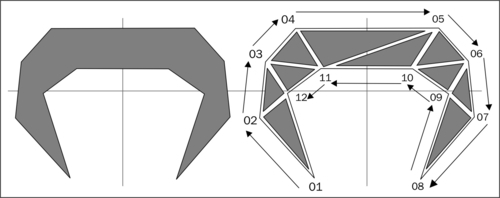

在第三步中，将每个顶点添加到`MeshTriangles`数组以用于创建表示我们主体的网格后，我们每个顶点都乘以`1/PhysicsConstants.PIXEL_TO_METER_RATIO_DEFAULT`，这相当于将顶点的坐标除以默认的像素到米比率。这种除法过程是用于将场景坐标转换为物理世界坐标的常见做法。物理世界以米为单位测量距离，因此需要从像素进行转换。任何一致且合理的值都可以用作转换常数，但默认的像素到米比率是每米 32 像素，几乎在每一个模拟中都已被证明是有效的。

第四步通过调用`PhysicsFactory.createTrianglulatedBody`创建独特的主体。需要注意的是，尽管可以从非三角化的顶点列表创建多边形主体，但只有当我们的列表顶点少于七个时，这样做才会有所好处。即使列表很小，三角化主体对模拟的影响也没有明显的负面影响。

### 注意

有几个物理主体编辑器可以简化主体的创建。以下都是与 AndEngine 兼容的：

+   **Physics Body Editor**（免费）：[`code.google.com/p/box2d-editor`](http://code.google.com/p/box2d-editor)

+   **PhysicsEditor**（付费）：[`www.codeandweb.com/physicseditor`](http://www.codeandweb.com/physicseditor)

+   **Inkscape**（免费，需要插件）：[`inkscape.org/`](http://inkscape.org/)

## 另请参阅

+   本章介绍*Box2D 物理扩展*。

+   本章了解*不同的物体类型*。

# 使用力、速度和扭矩

无论我们创建何种类型的模拟，我们很可能会至少想要控制一个物体。在 Box2D 中移动物体，我们可以施加线性或角力，设置线性或角速度，并以扭矩的形式施加角力。在本食谱中，我们将看到如何对多个物体施加这些力和速度。

## 准备就绪...

按照本章开始部分*Box2D 物理扩展*一节的步骤创建一个新活动，以便创建能够对力、速度和扭矩做出反应的物体。然后，更新活动，包括来自代码捆绑包中`ForcesVelocitiesTorqueActivity`类的附加代码。

## 如何操作...

参考补充的`ForcesVelocitiesTorqueActivity`类，以获取本食谱的完整示例。我们将在本节中仅介绍食谱的基础知识：

1.  我们首先会使用处理物体线性运动的方法。在`LinearForceRect`矩形重写的`onAreaTouched()`方法中放置以下代码片段：

    ```kt
    LinearForceBody.applyForce(0f, 2000f, 
      LinearForceBody.getWorldCenter().x, 
      LinearForceBody.getWorldCenter().y);
    ```

1.  接下来，将此代码插入到`LinearImpulseRect`矩形的`onAreaTouched()`方法中：

    ```kt
    LinearImpulseBody.applyLinearImpulse(0f, 200f, 
      LinearImpulseBody.getWorldCenter().x, 
      LinearImpulseBody.getWorldCenter().y);
    ```

1.  然后，将此代码添加到`LinearVelocityRect`矩形的`onAreaTouched()`方法中：

    ```kt
    LinearVelocityBody.setLinearVelocity(0f, 20f);
    ```

1.  现在，我们将使用影响物体角运动的`Body`方法。将此代码放在`AngularTorqueRect`矩形的`onAreaTouched()`方法中：

    ```kt
    AngularTorqueBody.applyTorque(2000f);
    ```

1.  在`AngularImpulseRect`矩形的`onAreaTouched()`方法中插入以下代码：

    ```kt
    AngularImpulseBody.applyAngularImpulse(20f);
    ```

1.  最后，将此代码添加到`AngularVelocityRect`矩形的`onAreaTouched()`方法中：

    ```kt
    AngularVelocityBody.setAngularVelocity(10f);
    ```

## 工作原理...

在第一步中，我们通过调用`LinearForceBody`的`applyForce()`方法，并在 x 轴上使用`0f`，在 y 轴上使用`2000f`的力参数，在其世界坐标中心`LinearForceBody.getWorldCenter().x`和`LinearForceBody.getWorldCenter().y`处施加一个强大的、正的垂直力。

第二步通过`LinearImpulseBody.applyLinearImpulse()`方法在`LinearImpulseBody`物体上应用一个线性冲量。`applyLinearImpulse()`方法的前两个参数是相对于世界坐标轴的冲量量。我们使用值`0f`和`200f`来应用一个指向正上方的适度冲量。`applyLinearImpulse()`方法的剩余两个参数是冲量在世界坐标中应用到的物体的 x 和 y 位置。我们传递`LinearImpulseBody.getWorldCenter().x`和`LinearImpulseBody.getWorldCenter().y`，以在`LinearImpulseBody`物体的中心应用冲量。

在第三步中，我们通过调用`LinearVelocityBody.setLinearVelocity()`方法并传入参数`0f`和`20f`来设置`LinearVelocityBody`的线性速度。参数`0f`表示物体在 x 轴上不会移动，而参数`20f`则立即将 y 轴上的运动速度设置为每秒 20 米。使用`setLinearVelocity()`方法时，速度会自动设置在物体的质心上。

第四步给`AngularTorqueBody`应用一个扭矩。我们调用`AngularTorqueBody.applyTorque()`方法并传入值`2000f`，以在物体的质心上给`AngularTorqueBody`施加一个非常大的扭矩。

在第五步中，我们通过调用`AngularImpulseBody.applyAngularImpulse()`方法并传入值`20f`，给`AngularImpulseBody`物体应用一个角冲量。这个小的角冲量将被应用到`AngularImpulseBody`物体的质心上。

在最后一步中，我们设置`AngularVelocityBody`物体的角速度。我们调用`AngularVelocityBody.setAngularVelocity()`方法并传入值`10f`，使物体立即以每秒 10 弧度的速度旋转。

## 还有更多...

*冲量*与*力*的不同之处在于，它们独立于时间步长起作用。实际上，冲量等于*力*乘以*时间*。同样，*力*等于*冲量*除以*时间*。

设置物体的速度和应用冲量相似，但有一个重要的区别——直接应用冲量会增加或减少速度，而设置速度并不会逐渐增加或减少速度。

## 另请参阅

+   本章中的《*Box2D 物理扩展简介*》。

+   本章中了解不同的物体类型。

# 对特定物体应用反重力

在上一个食谱中，我们了解了力如何影响物体。使用与重力相对抗的恒定力，我们可以使物体从物理世界的重力中释放出来。如果与重力相对抗的力足够大，物体甚至会飘走！在这个食谱中，我们将创建一个与重力相抵消的物体。

## 准备好了...

按照本章开始部分《*Box2D 物理扩展简介*》一节中的步骤创建一个活动。这个活动将有助于创建一个受到恒定力作用的物体，该力与重力相对抗。

## 如何操作...

对于此教程，按照以下步骤创建一个反对重力的刚体：

1.  在活动中放置以下定义：

    ```kt
    Body gravityBody;
    Body antigravityBody;
    final FixtureDef boxFixtureDef = PhysicsFactory.createFixtureDef(2f, 0.5f, 0.9f);
    ```

1.  接下来，创建一个矩形和刚体，以演示重力对刚体的正常影响。在`onPopulateScene()`方法中放置以下代码片段：

    ```kt
    Rectangle GravityRect = new Rectangle(300f, 240f, 100f, 100f,   this.getEngine().getVertexBufferObjectManager());
    GravityRect.setColor(0f, 0.7f, 0f);
    mScene.attachChild(GravityRect);
    mScene.registerTouchArea(GravityRect);
    gravityBody = PhysicsFactory.createBoxBody(mPhysicsWorld, 
      GravityRect, BodyType.DynamicBody, boxFixtureDef);
    gravityBody.setLinearDamping(0.4f);
    gravityBody.setAngularDamping(0.6f);
    mPhysicsWorld.registerPhysicsConnector(new PhysicsConnector(
      GravityRect, gravityBody));
    ```

1.  最后，创建一个矩形和刚体，以展示如何通过在每次更新时施加反重力力使刚体忽略重力：

    ```kt
    Rectangle AntiGravityRect = new Rectangle(500f, 240f, 100f, 100f, 
      this.getEngine().getVertexBufferObjectManager()) {
      @Override
      protected void onManagedUpdate(final float pSecondsElapsed) {
        super.onManagedUpdate(pSecondsElapsed);
        antigravityBody.applyForce(
          -mPhysicsWorld.getGravity().x * 
            antigravityBody.getMass(),
          -mPhysicsWorld.getGravity().y * 
            antigravityBody.getMass(),
          antigravityBody.getWorldCenter().x, 
          antigravityBody.getWorldCenter().y);
      }
    };
    AntiGravityRect.setColor(0f, 0f, 0.7f);
    mScene.attachChild(AntiGravityRect);
    mScene.registerTouchArea(AntiGravityRect);
    antigravityBody = PhysicsFactory.createBoxBody(mPhysicsWorld, 
      AntiGravityRect, BodyType.DynamicBody, boxFixtureDef);
    antigravityBody.setLinearDamping(0.4f);
    antigravityBody.setAngularDamping(0.6f);
    mPhysicsWorld.registerPhysicsConnector(new PhysicsConnector(
      AntiGravityRect, antigravityBody));
    ```

## 它是如何工作的...

我们采取的第一步是定义一个受重力影响的刚体、一个反对重力的刚体，以及创建刚体时使用的夹具定义。

接下来，我们创建一个受重力影响的矩形及其对应的刚体。有关创建矩形的更多信息，请参阅第二章中的*将基元应用于层*教程，*使用实体*，或有关创建刚体的更多信息，请参阅本章中的*了解不同的刚体类型*教程。

然后，我们创建反重力刚体及其连接的矩形。通过重写反重力矩形的`onManagedUpdate()`方法，我们可以在其中放置代码，这些代码将在每次引擎更新后运行。在`AntiGravityRect`矩形的情况下，我们用`antigravityBody.applyForce()`方法填充`onManagedUpdate()`方法，传递负的`mPhysicsWorld.getGravity()`方法的`x`和`y`值乘以`antigravityBody`的质量，并最终设置力在世界中心的`antigravityBody`上施加。通过在`onManagedUpdate()`方法中使用与物理世界的重力完全相反的力，每次更新后，反重力刚体都能对抗物理世界的重力。此外，我们施加的力必须乘以刚体的质量，以完全抵消重力的效果。参考以下图表以更好地了解反重力刚体的功能：

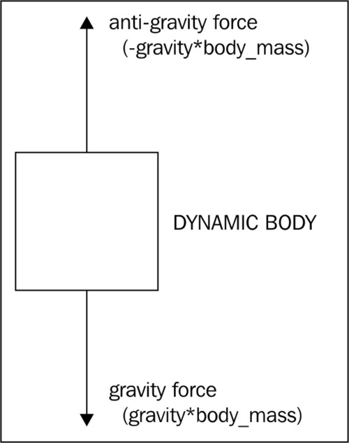

## 另请参阅

+   *本章中的 Box2D 物理扩展介绍*。

+   *在本章中使用力、速度和扭矩*。

# 使用关节

在 Box2d 中，**关节**用于连接两个刚体，使每个刚体以某种方式附着在另一个上。各种类型的关节使我们能够定制角色、车辆和世界。此外，关节可以在模拟过程中创建和销毁，这为我们的游戏提供了无限的可能性。在本教程中，我们将创建一个线关节，以演示如何在物理世界中设置和使用关节。

## 准备工作...

按照本章开始部分给出的*Box2D 物理扩展介绍*部分的步骤创建一个活动。这个活动将有助于创建两个刚体和一个连接线关节，我们将在此教程中使用它们。参考补充代码中的`JointsActivity`类，了解更多类型的关节示例。

## 如何操作...

按照以下步骤创建一个线关节：

1.  在我们的活动中定义以下变量：

    ```kt
    Body LineJointBodyA;
    Body LineJointBodyB;
    final FixtureDef boxFixtureDef =
      PhysicsFactory.createFixtureDef(20f, 0.2f, 0.9f);
    ```

1.  在`onPopulateScene()`方法中添加以下代码，以创建两个矩形及其相关联的物体：

    ```kt
    Rectangle LineJointRectA = new Rectangle(228f, 240f, 30f, 30f,   this.getEngine().getVertexBufferObjectManager());
    LineJointRectA.setColor(0.5f, 0.25f, 0f);
    mScene.attachChild(LineJointRectA);
    LineJointBodyA = PhysicsFactory.createBoxBody(mPhysicsWorld, 
      LineJointRectA, BodyType.KinematicBody, boxFixtureDef);
    Rectangle LineJointRectB = new Rectangle(228f, 200f, 30f, 30f,
        this.getEngine().getVertexBufferObjectManager()) {
      @Override
      protected void onManagedUpdate(final float pSecondsElapsed) 
      {
        super.onManagedUpdate(pSecondsElapsed);
        LineJointBodyB.applyTorque(1000f);
        LineJointBodyB.setAngularVelocity( Math.min(
          LineJointBodyB.getAngularVelocity(),0.2f));
      }
    };
    LineJointRectB.setColor(0.75f, 0.375f, 0f);
    mScene.attachChild(LineJointRectB);
    LineJointBodyB = PhysicsFactory.createBoxBody(mPhysicsWorld, 
      LineJointRectB, BodyType.DynamicBody, boxFixtureDef);
    mPhysicsWorld.registerPhysicsConnector(new PhysicsConnector(
      LineJointRectB, LineJointBodyB));
    ```

1.  在前一步显示的代码之后放置以下代码，以创建一个连接前一步物体的线关节：

    ```kt
    final LineJointDef lineJointDef = new LineJointDef();
    lineJointDef.initialize(LineJointBodyA, LineJointBodyB, 
    	LineJointBodyB.getWorldCenter(), new Vector2(0f,1f));
    lineJointDef.collideConnected = true;
    lineJointDef.enableLimit = true;
    lineJointDef.lowerTranslation = -220f / 
      PhysicsConstants.PIXEL_TO_METER_RATIO_DEFAULT;
    lineJointDef.upperTranslation = 0f;
    lineJointDef.enableMotor = true;
    lineJointDef.motorSpeed = -200f;
    lineJointDef.maxMotorForce = 420f;
    mPhysicsWorld.createJoint(lineJointDef);
    ```

## 工作原理...

我们首先定义两个物体`LineJointBodyA`和`LineJointBodyB`，它们将连接到我们的线关节，以及将应用于这些物体的`boxFixtureDef`夹具定义。关于创建夹具定义的更多信息，请参考本章开始部分提供的*Box2D 物理扩展介绍*食谱。

在第二步中，我们使用`Rectangle()`构造函数创建`LineJointRectA`矩形，其位置为`228f`和`240f`，使其位于场景左半部分的中间位置，高度和宽度设置为`30f`以使其成为一个小正方形。然后，我们通过调用`LineJointRectA.setColor()`方法并传入参数`0.5f`、`0.25f`和`0f`将其颜色设置为深橙色。接下来，我们通过调用`PhysicsFactory.createBoxBody()`构造函数创建与`LineJointRectA`矩形相关联的`LineJointBodyA`物体，传入参数`mPhysicsWorld`（即我们的物理世界）、`LineJointRectA`（用于定义物体的形状和位置）、`BodyType`为`BodyType.KinematicBody`以及`boxFixtureDef`夹具定义。

接下来，我们以创建`LineJointRectA`和`LineJointBodyA`相同的方式处理`LineJointRectB`和`LineJointBodyB`的创建，但在创建`LineJointRectB`时增加了重写的`onManagedUpdate()`方法，并添加了一个`PhysicsConnector`类以连接`LineJointRectB`和`LineJointBodyB`。`LineJointRectB`的`onManagedUpdate()`方法通过调用`LineJointBodyB.applyTorque()`方法并传入值`1000f`，对`LineJointBodyB`施加大的扭矩。施加扭矩后，我们确保`LineJointBodyB`物体的角速度不超过`0.2f`，通过将`Math.min(LineJointBodyB.getAngularVelocity(), 0.2f)`传递给`LineJointBodyB.setAngularVelocity()`方法。最后，在第二步末尾创建并注册的`PhysicsConnector`类将我们场景中的`LineJointRectB`与物理世界中的`LineJointBodyB`连接起来。

在第三步中，我们创建线性关节。为了初始化线性关节，我们使用`lineJointDef.initialize()`方法，并传入相关联的刚体`LineJointBodyA`和`LineJointBodyB`。然后，我们将`LineJointBodyB`的世界中心作为关节的锚点，并传入包含关节的世界单位轴的`Vector2`。我们关节的世界轴设置为`0f`和`1f`，这意味着在 x 轴上没有移动，在 y 轴上以`1f`的比例移动。然后，我们通过将`lineJointDef.collideConnected`变量设置为`true`来告诉关节允许两个刚体之间的碰撞，并通过将`lineJointDef.enableLimit`变量设置为`true`来启用关节的限制，这限制了`LineJointBodyB`与第一个刚体的距离。为了设置关节的下限距离，即`LineJointBodyB`可以在负方向上移动多远，我们将`lineJointDef.lowerTranslation`变量设置为`-220f / PhysicsConstants.PIXEL_TO_METER_RATIO_DEFAULT`。对于上限距离，我们将`lineJointDef.upperTranslation`变量设置为`0f`，以防止`LineJointBodyB`被推到`LineJointBodyA`之上。接下来，我们通过将`lineJointDef.enableMotor`变量设置为`true`来启用关节的电机，这将根据电机的速度将`LineJointBodyB`向`LineJointBodyA`拉或推。最后，我们通过将`lineJointDef.motorSpeed`变量设置为`-200f`来给关节的电机一个快速的负速度，使`LineJointBodyB`向`lowerTranslation`限制移动，并通过将`lineJointDef.maxMotorForce`变量设置为`420f`来给电机一个强大的最大力。

线性关节的作用类似于汽车的悬挂和车轮部分。它允许在一个轴上进行约束运动，通常是车辆的垂直方向，并允许第二个刚体旋转或必要时作为动力轮。下图说明了线性关节的各个组成部分：

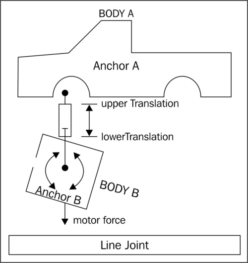

## 还有更多...

所有关节都有两个刚体，并为我们提供了允许连接刚体之间碰撞的选项。我们可以在需要时启用碰撞，但每个关节的`collideConnected`变量的默认值是`false`。此外，所有关节的第二个刚体应该是具有`BodyType.DynamicBody`类型的`BodyType`。

对于具有频率的任何关节，该频率决定了关节的弹性行为，切勿将频率设置为超过物理世界时间步长的一半。如果物理世界的时间步长为 40，我们应分配给关节频率的最大值应为`20f`。

如果在关节处于活动状态时，与关节连接的任一刚体被销毁，则关节也会被销毁。这意味着当我们处理物理世界时，只要我们销毁所有刚体，就不需要销毁其中的关节。

### 更多关节类型

线性关节只是我们可以在物理模拟中使用的几种关节类型之一。其他类型的关节包括距离关节、鼠标关节、棱柱关节、滑轮关节、旋转关节和焊接关节。继续阅读以了解每种类型的更多信息。参考补充的`JointsActivity`类，以获得每种关节类型的更深入示例。

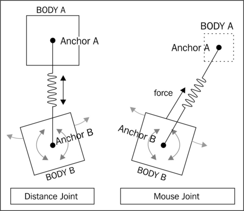

#### 距离关节

**距离关节**只是试图保持其连接的刚体之间的特定距离。如果我们不设置距离关节的长度，它会假定长度为其刚体之间的初始距离。以下代码创建了一个距离关节：

```kt
final DistanceJointDef distanceJointDef = new DistanceJointDef();
distanceJointDef.initialize(DistanceJointBodyA,
  DistanceJointBodyB, DistanceJointBodyA.getWorldCenter(),
    DistanceJointBodyB.getWorldCenter());
distanceJointDef.length = 3.0f;
distanceJointDef.frequencyHz = 1f;
distanceJointDef.dampingRatio = 0.001f;
```

请注意，我们通过传递两个要连接的刚体`DistanceJointBodyA`和`DistanceJointBodyB`以及刚体的中心点`DistanceJointBodyA.getWorldCenter()`和`DistanceJointBodyB.getWorldCenter()`作为关节的锚点来初始化距离关节。接下来，我们通过设置`distanceJointDef.length`变量为`3.0f`来设置关节的长度，这告诉关节在物理世界中两个刚体应该相隔 3 米。最后，我们将`distanceJointDef.frequencyHz`变量设置为`1f`以强制关节弹簧具有小的频率，并将`distanceJointDef.dampingRatio`变量设置为`0.001f`以产生连接刚体的非常小的阻尼效果。为了更容易理解距离关节的外观，请参考前面的图表。

#### 鼠标关节

**鼠标关节**试图使用设定的最大力将一个刚体拉到特定位置，通常是触摸的位置。它是一个很好的测试用关节，但对于大多数游戏的发布版本，我们应选择使用适当的代码将动力刚体移动到触摸注册的位置。要了解鼠标关节的作用，请参考前面的图表。以下代码定义了一个鼠标关节：

```kt
final MouseJointDef mouseJointDef = new MouseJointDef();
mouseJointDef.bodyA = MouseJointBodyA;
mouseJointDef.bodyB = MouseJointBodyB;
mouseJointDef.dampingRatio = 0.0f;
mouseJointDef.frequencyHz = 1f;
mouseJointDef.maxForce = (100.0f * MouseJointBodyB.getMass());
```

与其他关节不同，鼠标关节没有`initialize()`方法来帮助设置关节。我们首先创建`mouseJointDef`鼠标关节定义，并将`mouseJointDef.bodyA`变量设置为`MouseJointBodyA`，将`mouseJointDef.bodyB`变量设置为`MouseJointBodyB`，以告诉关节它将连接哪些刚体。在我们所有的模拟中，`MouseJointBodyA`应该是一个不动的刚体，在鼠标关节激活时不会移动。

接下来，我们将`mouseJointDef.dampingRatio`变量设置为`0.0f`，使关节完全没有阻尼。然后，我们将`mouseJointDef.frequencyHz`变量设置为`1f`，以在`MouseJointBodyB`达到鼠标关节的目标时强制产生轻微的频率响应，我们可以在下面的代码中看到这一点。最后，我们将`mouseJointDef`的`maxForce`变量设置为`(100.0f * MouseJointBodyB.getMass())`方法。强大的力`100.0f`乘以`MouseJointBodyB`的质量，以考虑`MouseJointBodyB`质量的变化。

在这段代码中，我们初始化了鼠标关节，但它只应在模拟开始后激活。要在模拟运行时从类的`onSceneTouchEvent()`方法内部激活鼠标关节，请参阅以下代码。请注意，`mouseJoint`变量是一个鼠标关节，在类级别创建：

```kt
if(pSceneTouchEvent.isActionDown()) {
  mouseJointDef.target.set(MouseJointBodyB.getWorldCenter());
  mouseJoint = (MouseJoint)mPhysicsWorld.createJoint(
    mouseJointDef);
  final Vector2 vec = Vector2Pool.obtain(
    pSceneTouchEvent.getX() / 
    PhysicsConstants.PIXEL_TO_METER_RATIO_DEFAULT, 
    pSceneTouchEvent.getY() / 
    PhysicsConstants.PIXEL_TO_METER_RATIO_DEFAULT);
  mouseJoint.setTarget(vec);
  Vector2Pool.recycle(vec);
} else if(pSceneTouchEvent.isActionMove()) {
  final Vector2 vec = Vector2Pool.obtain(
    pSceneTouchEvent.getX() / 
    PhysicsConstants.PIXEL_TO_METER_RATIO_DEFAULT, 
    pSceneTouchEvent.getY() / 
    PhysicsConstants.PIXEL_TO_METER_RATIO_DEFAULT);
  mouseJoint.setTarget(vec);
  Vector2Pool.recycle(vec);
} else if(pSceneTouchEvent.isActionCancel() || 
    pSceneTouchEvent.isActionOutside() || 
      pSceneTouchEvent.isActionUp()) {
  mPhysicsWorld.destroyJoint(mouseJoint);
}
```

当屏幕首次被触摸时，通过检查`pSceneTouchEvent.isActionDown()`确定，我们使用`mouseJointDef.target.set()`方法将初始鼠标关节目标设置为`MouseJointBodyB`的世界中心，通过`MouseJointBodyB.getWorldCenter()`方法获取。然后，我们通过在物理世界中使用`MouseJoint`关节转换的`mPhysicsWorld.createJoint()`方法以及`mouseJointDef`变量作为参数创建鼠标关节定义，来设置`mouseJoint`变量。关节创建后，我们从`Vector2Pool`创建`Vector2`，保存场景触摸位置`pSceneTouchEvent.getX()`和`pSceneTouchEvent.getY()`，通过除以`PhysicsConstants.PIXEL_TO_METER_RATIO_DEFAULT`转换为物理世界的坐标。

然后，我们将`mouseJoint`关节的目标变量更改为先前创建的`Vector2`，并将`Vector2`回收至`Vector2Pool`。当触摸仍然有效时，通过检查`pSceneTouchEvent.isActionMove()`确定，我们使用在物理世界中创建鼠标关节后立即使用的相同过程来更新鼠标关节的目标。我们从`Vector2Pool`获取`Vector2`，将其设置为转换后的物理世界触摸位置，将鼠标关节的目标设置为该`Vector2`，然后回收`Vector2`。一旦触摸释放，通过检查`pSceneTouchEvent.isActionCancel()`，`pSceneTouchEvent.isActionOutside()`，或`pSceneTouchEvent.isActionUp()`确定，我们通过调用`mPhysicsWorld.destroyJoint()`方法并传入我们的`mouseJoint`变量作为参数，在世界中销毁鼠标关节。

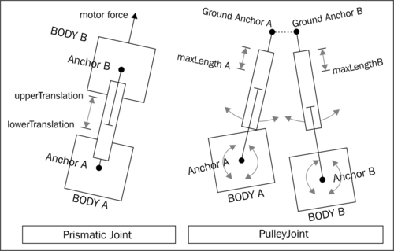

#### 斜轴关节（prismatic joint）

**斜轴关节**允许其连接的刚体沿单一轴滑动分离或靠拢，必要时可以由电机驱动。刚体具有锁定的旋转，因此在使用斜轴关节设计模拟时我们必须牢记这一点。考虑前面的图表来理解这个关节是如何工作的。以下代码创建了一个斜轴关节：

```kt
final PrismaticJointDef prismaticJointDef =
  new PrismaticJointDef();
prismaticJointDef.initialize(PrismaticJointBodyA,
  PrismaticJointBodyB, PrismaticJointBodyA.getWorldCenter(), 
    new Vector2(0f,1f));
prismaticJointDef.collideConnected = false;
prismaticJointDef.enableLimit = true;
prismaticJointDef.lowerTranslation = -80f / 
  PhysicsConstants.PIXEL_TO_METER_RATIO_DEFAULT;
prismaticJointDef.upperTranslation = 80f / 
  PhysicsConstants.PIXEL_TO_METER_RATIO_DEFAULT;
prismaticJointDef.enableMotor = true;
prismaticJointDef.maxMotorForce = 400f;
prismaticJointDef.motorSpeed = 500f;
mPhysicsWorld.createJoint(prismaticJointDef);
```

定义了`prismaticJointDef`变量之后，我们使用`prismaticJointDef.initialize()`方法对其进行初始化，并传递我们的连接刚体`PrismaticJointBodyA`和`PrismaticJointBodyB`，锚点被声明为`PrismaticJointBodyA`在世界坐标系中的中心点，以及关节的世界单位向量轴，以`Vector2`对象`Vector2(0f,1f)`表示。我们通过将`prismaticJointDef.collideConnected`变量设置为`false`来禁用两个刚体之间的碰撞，并通过将`prismaticJointDef.enableLimit`变量设置为`true`来启用关节滑动范围的限制。

为了设置关节的限制，我们将`lowerTranslation`和`upperTranslation`属性分别设置为`-80f`和`80f`像素，然后除以`PhysicsConstants.PIXEL_TO_METER_RATIO_DEFAULT`，将像素限制转换为物理世界中的米。最后，我们通过将`prismaticJointDef.enableMotor`属性设置为`true`来启用马达，通过`prismaticJointDef.maxMotorForce`属性将其最大力设置为`400f`，并通过`prismaticJointDef.motorSpeed`属性将其速度设置为正值`500f`，以驱动`PrismaticJointBodyB`向关节的上限移动。

#### 滑轮关节

**滑轮关节**的作用非常类似于真实的滑轮——当一侧下降时，另一侧上升。滑轮关节的长度在初始化时确定，并且在创建后不应更改。参考前图以了解滑轮关节的外观。以下代码创建了一个滑轮关节：

```kt
final PulleyJointDef pulleyJointDef = new PulleyJointDef();
pulleyJointDef.initialize(
    PulleyJointBodyA,
    PulleyJointBodyB,
    PulleyJointBodyA.getWorldPoint(
      new Vector2(0f, 2.5f)),
    PulleyJointBodyB.getWorldPoint(
      new Vector2(0f, 2.5f)),
    PulleyJointBodyA.getWorldCenter(),
    PulleyJointBodyB.getWorldCenter(),
    1f);
mPhysicsWorld.createJoint(pulleyJointDef);
```

创建了`pulleyJointDef`变量之后，我们通过`pulleyJointDef.initialize()`方法对其进行初始化。`pulleyJointDef.initialize()`方法的前两个参数是两个连接的刚体，分别是`PulleyJointBodyA`和`PulleyJointBodyB`。接下来的两个参数是滑轮的地面锚点，在这种情况下，它们分别位于每个刚体上方`2.5f`米处。为了获取每个刚体上方世界坐标系中的相对点，我们使用每个刚体的`getWorldPoint()`方法，x 参数为`0`，y 参数为每个刚体上方`2.5`米。`pulleyJointDef.initialize()`方法的第五和第六个参数是每个刚体在世界坐标系中的锚点。在这个模拟中，我们使用中心点，因此传递每个连接刚体的`getWorldCenter()`方法。

方法的最后一个参数是滑轮的比例，在这种情况下是`1f`。比例为`2`将导致`PulleyJointBodyA`相对于其地面锚点的移动距离是`PulleyJointBodyB`的每段距离变化的两倍。此外，因为`PulleyJointBodyA`相对于其地面锚点移动所需的工作量是`PulleyJointBodyB`所需工作量的一半，所以`PulleyJointBodyA`比`PulleyJointBodyB`有更大的杠杆作用，导致在正常模拟中`PulleyJointBodyA`更容易受到重力的影响，从而起到提升`PulleyJointBodyB`的作用。创建滑轮接头的最后一步是调用`mPhysicsWorld.createJoint()`方法，并将我们的`pulleyJointDef`变量传递给它。

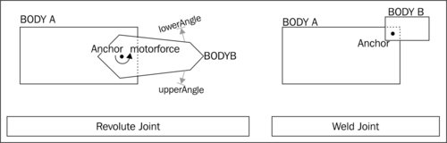

#### 转动关节

**转动关节**是 Box2D 模拟中最受欢迎的关节类型。它本质上是两个连接体之间的一个支点，具有可选的电机和限制。查看前一个图表可以帮助更清楚地了解转动关节的工作原理。以下代码创建了一个转动关节：

```kt
final RevoluteJointDef revoluteJointDef = new RevoluteJointDef();
revoluteJointDef.initialize(
    RevoluteJointBodyA,
    RevoluteJointBodyB,
    RevoluteJointBodyA.getWorldCenter());
revoluteJointDef.enableMotor = true;
revoluteJointDef.maxMotorTorque = 5000f;
revoluteJointDef.motorSpeed = -1f;
mPhysicsWorld.createJoint(revoluteJointDef);
```

我们首先将`revoluteJointDef`定义为新创建的`RevoluteJointDef()`方法。然后，我们使用`revoluteJointDef.initialize()`方法初始化它，参数为`RevoluteJointBodyA`和`RevoluteJointBodyB`以连接两个刚体，以及`RevoluteJointBodyA`的`getWorldCenter()`方法来定义关节旋转的位置。接着，我们通过将`revoluteJointDef.enableMotor`属性设置为`true`来启用我们的转动关节的电机。然后，我们将`maxMotorTorque`属性设置为`5000f`以使电机非常强大，并将`motorSpeed`属性设置为`-1f`以使电机以非常慢的速度顺时针旋转。最后，我们通过调用`mPhysicsWorld.createJoint(revoluteJointDef)`在物理世界中创建转动关节，使物理世界使用我们的`revoluteJointDef`变量创建一个转动关节。

#### 焊接接头

**焊接关节**将两个刚体连接在一起并禁用它们之间的旋转。它对于可破坏物体非常有用，但是较大的可破坏物体可能会由于 Box2D 的迭代位置求解器产生的抖动而偶尔失败。在这种情况下，我们会从多个夹具创建物体，并在物体分离时以新刚体的形式重新创建每个部分。参考前一个焊接关节的图表，可以更好地理解它是如何工作的。以下代码创建了一个焊接关节：

```kt
final WeldJointDef weldJointDef = new WeldJointDef();
weldJointDef.initialize(WeldJointBodyA, WeldJointBodyB,
  WeldJointBodyA.getWorldCenter());
mPhysicsWorld.createJoint(weldJointDef);
```

要创建我们的焊接关节，我们首先创建一个名为`weldJointDef`的`WeldJointDef`定义。然后，通过调用`weldJointDef.initialize()`方法并传入`WeldJointBodyA`和`WeldJointBodyB`的身体参数以及关节在世界坐标系中`WeldJointBodyA`身体的中心作为锚点来初始化它。焊接关节的锚点似乎可以放在任何地方，但由于 Box2D 在碰撞处理焊接关节的锚点时的方式，我们希望将其放置在连接身体之一的中心位置。否则，在与具有大质量的身体碰撞时，可能会导致关节剪切或位移。

## 另请参阅

+   本章中的*Box2D 物理扩展介绍*。

+   本章中的*了解不同的身体类型*。

# 创建布娃娃

物理模拟中最受欢迎的角色描绘之一是布娃娃。这类角色的视觉外观根据细节而有所不同，但底层系统始终相同——我们只是通过关节将几个物理身体附着到更大的物理身体上。在本食谱中，我们将创建一个布娃娃。

## 准备工作...

复习本章中*Box2D 物理扩展介绍*食谱中物理活动创建，*了解不同的身体类型*食谱中身体创建，以及*处理关节*食谱中旋转关节和鼠标关节的使用。

## 如何操作...

请参考补充的`RagdollActivity`类，这是我们在此食谱中使用的代码。

## 工作原理...

第一步是定义代表布娃娃多个身体的变量。我们的身体包括代表头部的`headBody`，代表躯干的`torsoBody`，代表左臂的`leftUpperarmBody`和`leftForearmBody`，代表右臂的`rightUpperarmBody`和`rightForearmBody`，代表左腿的`leftThighBody`和`leftCalfBody`，以及最后代表右腿的`rightThighBody`和`rightCalfBody`。以下图表显示了如何使用旋转关节将我们所有的身体连接在一起：

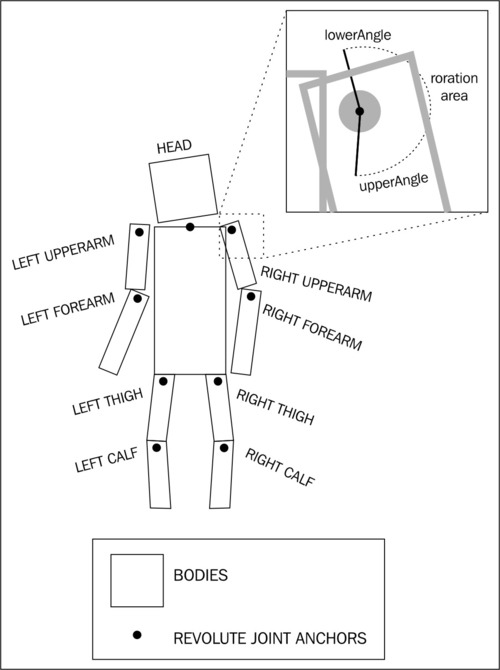

接下来，我们定义了当屏幕被触摸时用来抛掷布娃娃的鼠标关节所需的变量，即`Vector2 localMouseJointTarget`鼠标关节的目标，`mouseJointDef`鼠标关节定义，`mouseJoint`关节，以及鼠标关节的地面身体`MouseJointGround`。然后，我们创建了将应用于布娃娃各个部分的固定装置定义——头部的`headFixtureDef`，躯干的`torsoFixtureDef`，手臂的`armsFixtureDef`以及腿部的`legsFixtureDef`。有关创建固定装置定义的更多信息，请参考本章中的*Box2D 物理扩展介绍*食谱。

然后，在`onPopulateScene()`方法中，我们为布娃娃的每个身体部位创建单独的矩形和它们关联的物体，这些在活动中定义。每个矩形与其对应身体部位的位置和大小完全匹配。在我们创建要链接到矩形的物体时，我们通过`PhysicsFactory.createBoxBody()`方法的最后一个参数分配活动中定义的适当的固定定义。最后，对于每个矩形身体组，我们向物理世界注册一个`PhysicsConnector`对象。有关创建物体和`PhysicsConnector`对象的更多信息，请参考本章中的*了解不同的身体类型*食谱。

接下来，我们将创建许多旋转关节，用以连接布娃娃的身体部位。每个关节的锚点位置是在世界坐标系中我们希望该身体部位旋转的地方，通过每个关节定义的`initialize()`方法的最后一个参数传递。我们确保每个关节连接的物体不会相互碰撞，通过将关节的`collideConnected`属性设置为`false`。这不会阻止物体与其他布娃娃部分发生碰撞，但确实允许关节的物体在旋转时重叠。接下来，注意我们给关节定义应用了限制，以防止身体部位移动超出一定的运动范围，这很像人类移动四肢时的限制。如果不为关节设置限制，将会创建一个允许其四肢完全旋转的布娃娃，这种表示虽然不真实，但对于某些模拟是必要的。有关旋转关节的更多信息，请参考本章中的*使用关节*食谱。

创建表示布娃娃关节的旋转关节之后，我们创建了`mouseJointDef`鼠标关节定义，这将允许我们拖动布娃娃在场景中飞来飞去。我们将布娃娃的`headBody`作为鼠标关节的第二个物体，但根据模拟的需要，可以使用连接到布娃娃的任何物体。创建布娃娃的最后一个步骤是设置鼠标关节，以便在运行时通过`onSceneTouchEvent()`方法的触摸交互使用。有关使用鼠标关节的更多信息，请参考本章中的*使用关节*食谱。

## 另请参阅

+   本章中的*Box2D 物理扩展介绍*。

+   本章中的*了解不同的身体类型*。

+   本章中的*使用关节*。

# 创建一根绳子

尽管使用 Box2D 模拟真实的绳子是性能密集型的，但一个简单的绳子不仅快速，而且非常可定制。从构建的角度来看，绳子类似于布娃娃，可以为游戏增加额外的可玩层次。如果一个物理模拟看起来过于平淡，无法吸引玩家，那么添加绳子将肯定给玩家另一个喜欢游戏的原因。在本食谱中，我们将创建一个用于我们模拟的物理启用的绳子。

## 准备好...

回顾本章中的*Box2D 物理扩展介绍*食谱中基于物理的活动创建，*了解不同的身体类型*食谱中的身体创建，以及*使用关节*食谱中的旋转关节和鼠标关节的使用。

## 如何操作...

请参考补充的`Rope`和`RopeActivity`类，了解我们在此食谱中使用的代码。

## 它是如何工作的...

在 Box2D 中创建的绳子可以被视为由关节连接在一起的相似身体的链条。我们可以使用矩形或圆形身体来定义绳子的每个部分，但圆形身体在与其他身体碰撞时抓住并拉伸的可能性较小。查看以下图表，了解我们如何为物理模拟设计绳子：

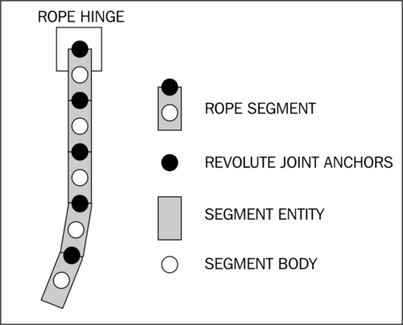

首先，参考`Rope`类，这将使我们更容易创建多条绳子，并一次性为我们的模拟调整所有绳子。`Rope`类中的初始代码是一组反映每条绳子特定属性的变量。`numRopeSegments`变量保存我们的绳子将拥有的段数。`ropeSegmentsLength`和`ropeSegmentsWidth`变量保存每个绳子段的长度和宽度。接下来，`ropeSegmentsOverlap`变量表示每个绳子段与上一个绳子段重叠多少，这可以防止在轻微拉伸时出现间隙。`RopeSegments`数组和`RopeSegmentsBodies`数组为我们的绳子的每个部分定义矩形和身体。最后，`RopeSegmentFixtureDef`固定定义将保存我们将应用于绳子每个部分的固定装置数据。

接下来，我们创建一个名为`Rope`的构造函数，以处理绳子的放置、细节、长度、宽度、重量以及绳子的总体创建。然后，我们为上一步创建的变量赋值。注意，`RopeSegmentFixtureDef`固定定义从最大密度开始。由于绳子的每个部分都是通过构造函数后面的`for`循环创建的，因此固定装置的密度（从而质量）会递减到最小密度。这通过给最高身体部分最大的强度来防止拉伸，以保持较低身体部分。

在`Rope`构造函数的`for`循环开始处，我们为每个绳索段定义了旋转关节。关于旋转关节的更多信息，请参见本章中的*使用关节*部分。然后，我们创建了表示该段的矩形`RopeSegments[i]`，并检查确保当`i`小于`1`时，第一个段根据构造函数中传递的`pAttachTo`铰链放置，而其余的段相对于它们的前一段`RopeSegments[i-1]`放置。创建矩形时包括了一个重叠值`ropeSegmentsOverlap`，以消除由 Box2D 的迭代过程造成的绳索中的间隔。

在我们创建了段的矩形并通过调用`RopeSegments[i].setColor(0.97f, 0.75f, 0.54f)`将其颜色设置为棕色之后，我们对`RopeSegmentFixtureDef`固定定义应用了密度计算，并使用`PhysicsFactory.createCircleBody()`方法基于段的矩形创建了一个圆形体。关于创建体的更多信息，请参考本章中的*了解不同的体类型*部分。然后，我们通过`setAngularDamping(4f)`方法为每个绳索段体设置适中的角阻尼，并通过`setLinearDamping(0.5f)`方法设置轻微的线性阻尼，以消除绳索行为中的不可预测性。

之后，我们通过将`RopeSegmentsBodies[i].setBullet`属性设置为`true`，使绳索段能够作为子弹行动，这减少了我们的段穿过碰撞体的机会。最后，我们为当前绳索段相对于前一段或如果当前段是绳索中的第一段则相对于铰链创建旋转关节。关于旋转关节的更多信息，请参见本章中的*使用关节*部分。

对于我们的活动类，我们首先创建了用于鼠标关节的必要变量，该关节将绳索的铰链体移动到触摸位置，并定义了我们的`RopeHingeBody`体，该体将作为绳索的锚点。然后在`onPopulateScene()`方法中，我们创建了`RopeHingeBody`体，随后是我们的`rope`对象，将绳索铰链体作为第一个参数传递给`Rope`构造函数。关于创建体的更多信息，请参考本章中的*了解不同的体类型*部分。`Rope`构造函数的下一个参数告诉我们的绳索要有`10`个段长，每个段长`25f`像素，宽`10f`像素，重叠`2f`像素，具有最小密度`5f`和最大密度`50f`，以及我们附加绳索段矩形的`mScene`场景。`Rope`构造函数的最后两个参数告诉绳索在我们的`mPhysicsWorld`物理世界中创建段体，并将每个段的矩形设置为活动类的`VertexBufferObjectManager`管理。

接下来，我们定义并设置用于我们的鼠标关节的变量。请注意，我们将`RopeHingeBody`设置为鼠标关节的第二个物体。最后，我们设置`onSceneTouchEvent()`方法来处理我们的鼠标关节。有关鼠标关节的更多信息，请参考本章中的*处理关节*部分。

## 另请参阅

+   本章中的*Box2D 物理扩展介绍*。

+   本章中的*了解不同的物体类型*。

+   本章中的*处理关节*。

# 处理碰撞

在基于物理模拟的游戏中，使物体之间的碰撞产生某种效果，无论是播放声音还是处理物体，通常都是必要的部分。处理碰撞一开始看起来可能是一项艰巨的任务，但当我们了解了`ContactListener`接口的每个部分如何工作之后，它就会变得很自然。在本教程中，我们将演示如何处理固定装置之间的碰撞。

## 准备好了...

按照本章开始部分*Box2D 物理扩展介绍*中的步骤创建一个新活动，这将有助于创建我们的模拟，其中我们将控制碰撞行为。

## 如何操作...

按照以下步骤演示我们对碰撞的控制：

1.  在活动类的开始处放置以下定义：

    ```kt
    public Rectangle dynamicRect;
    public Rectangle staticRect;
    public Body dynamicBody;
    public Body staticBody;
    public boolean setFullAlphaForDynamicBody = false;
    public boolean setHalfAlphaForDynamicBody = false;
    public boolean setFullAlphaForStaticBody = false;
    public boolean setHalfAlphaForStaticBody = false;
    final FixtureDef boxFixtureDef = PhysicsFactory.createFixtureDef(2f,
      0f, 0.9f);
    ```

1.  要在`ContactListener`接口中确定特定物体是否被接触，请在活动中插入以下方法：

    ```kt
    public boolean isBodyContacted(Body pBody, Contact pContact)
    {
      if(pContact.getFixtureA().getBody().equals(pBody) ||
        pContact.getFixtureB().getBody().equals(pBody))
        return true;
      return false;
    }
    ```

1.  下面的方法与之前的方法相似，但除了第一个物体外，还测试了另一个物体。在之前的 方法后，将以下代码添加到类中：

    ```kt
    public boolean areBodiesContacted(Body pBody1, Body pBody2, Contact pContact)
    {
      if(pContact.getFixtureA().getBody().equals(pBody1) ||
          pContact.getFixtureB().getBody().equals(pBody1))
        if(pContact.getFixtureA().getBody().equals(pBody2) ||
          pContact.getFixtureB().getBody().equals(pBody2))
          return true;
      return false;
    }
    ```

1.  接下来，我们将创建一个动态物体和一个静态物体来测试碰撞。在`onPopulateScene()`方法中放置以下内容：

    ```kt
    dynamicRect = new Rectangle(300f, 240f, 100f, 100f, 
      this.getEngine().getVertexBufferObjectManager());
    dynamicRect.setColor(0f, 0.7f, 0f);
    dynamicRect.setAlpha(0.5f);
    mScene.attachChild(dynamicRect);
    dynamicBody = PhysicsFactory.createBoxBody(mPhysicsWorld, 
      dynamicRect, BodyType.DynamicBody, boxFixtureDef);
    dynamicBody.setLinearDamping(0.4f);
    dynamicBody.setAngularDamping(0.6f);
    mPhysicsWorld.registerPhysicsConnector(new PhysicsConnector(
      dynamicRect, dynamicBody));

    staticRect = new Rectangle(500f, 240f, 100f, 100f, 
      this.getEngine().getVertexBufferObjectManager());
    staticRect.setColor(0f, 0f, 0.7f);
    staticRect.setAlpha(0.5f);
    mScene.attachChild(staticRect);
    staticBody = PhysicsFactory.createBoxBody(mPhysicsWorld, staticRect,
      BodyType.StaticBody, boxFixtureDef);
    ```

1.  现在，我们需要设置物理世界的`ContactListener`属性。在`onPopulateScene()`方法中添加以下内容：

    ```kt
    mPhysicsWorld.setContactListener(new ContactListener(){
      @Override
      public void beginContact(Contact contact) {
        if(contact.isTouching())
        if(areBodiesContacted(staticBody,dynamicBody,contact))
          setFullAlphaForStaticBody = true;
        if(isBodyContacted(dynamicBody,contact))
          setFullAlphaForDynamicBody = true;
      }
      @Override
      public void endContact(Contact contact) {
        if(areBodiesContacted(staticBody,dynamicBody,contact))
          setHalfAlphaForStaticBody = true;
        if(isBodyContacted(dynamicBody,contact))
          setHalfAlphaForDynamicBody = true;
      }
      @Override
      public void preSolve(Contact contact, Manifold oldManifold) {}
      @Override
      public void postSolve(Contact contact, ContactImpulse impulse) {}
    });
    ```

1.  由于物理世界可能会每次接触多次调用`ContactListener`接口，我们希望将所有逻辑从`ContactListener`接口移动到一个每次引擎更新只调用一次的更新处理程序中。在`onPopulateScene()`方法中放置以下内容，以完成我们的活动：

    ```kt
    mScene.registerUpdateHandler(new IUpdateHandler() {
      @Override
      public void onUpdate(float pSecondsElapsed) {
        if(setFullAlphaForDynamicBody) {
          dynamicRect.setAlpha(1f);
          setFullAlphaForDynamicBody = false;
        } else if(setHalfAlphaForDynamicBody) {
          dynamicRect.setAlpha(0.5f);
          setHalfAlphaForDynamicBody = false;
        }
        if(setFullAlphaForStaticBody) {
          staticRect.setAlpha(1f);
          setFullAlphaForStaticBody = false;
        } else if(setHalfAlphaForStaticBody) {
          staticRect.setAlpha(0.5f);
          setHalfAlphaForStaticBody = false;
        }
      }
      @Override public void reset() {}
    });
    ```

## 它是如何工作的...

首先，我们定义了用于可视化碰撞的矩形和物体。我们还定义了几个布尔变量，这些变量将根据`ContactListener`接口的结果进行更改。最后的变量是用于创建具有碰撞功能的物体的固定装置定义。

在第二步和第三步中，我们创建了两个便捷方法`isBodyContacted()`和`areBodiesContacted()`，这将使在`ContactListener`接口中确定物体的存在变得更加容易。注意，每个方法中的`if`语句检查了每个物体与两个固定装置的碰撞情况。由于接触监听器传递`Contact`对象的方式，我们无法确定哪个固定装置将与特定物体相关联，因此我们必须检查两者。

第四步创建了本模拟中使用的矩形和物体——一个静态的和一个动态的。我们使用它们的`setAlpha()`方法将矩形的透明度设置为`0.5f`，以演示当前没有发生接触。在碰撞时，矩形的透明度恢复为不透明，并在碰撞结束后重新设置为透明。

在第五步中，我们通过重写继承的方法来设置物理世界的接触监听器。第一个方法，`beginContact()`，在物理世界中发生碰撞时被调用。在这个方法中，我们首先通过检查`contact`参数的`isTouching()`属性来测试碰撞是否真正涉及到两个物体的接触。Box2D 认为，当两个物体的**AABB**（边界框）重叠时，碰撞就开始了，而不是实际物体接触时。参考下一张图来了解碰撞和接触的区别。之后，我们会检查我们的物体是否都参与了碰撞，或者只有其中一个。如果是，我们将我们的完全不透明布尔变量设置为`true`。下一个方法，`endContact()`，在物体不再碰撞时被调用。如果我们的物体参与了正在结束的碰撞，我们会将半透明布尔变量设置为`true`。接触监听器中的其余方法在碰撞纠正计算发生之前或之后被调用。因为我们只想测试哪些物体发生了碰撞，所以不需要使用这两个方法。

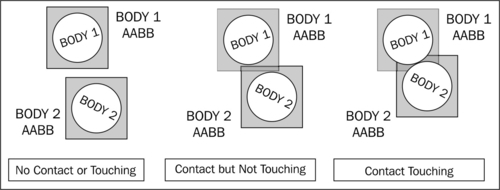

在第六步中，我们创建了一个更新处理器，以从`ContactListener`接口中移除有效代码。它只是检查`ContactListener`接口内设置的布尔值，以确定在每次引擎更新后需要采取哪些操作。在采取了正确的操作后，我们重置布尔变量。我们需要从接触监听器中移除有效代码的原因是，接触监听器可能会被多次调用，而且通常在每次碰撞时都会被调用多次。如果在接触监听器内部改变游戏的得分，得分通常会比我们预期的变化大得多。我们可以有一个变量来检查是否已经处理了接触，但这样的代码流程会变得混乱，最终会适得其反。

## 另请参阅

+   本章节的*Box2D 物理扩展介绍*。

+   本章节讲述*理解不同的身体类型*。

+   本章节介绍`preSolve`和`postSolve`。

# 使用`preSolve`和`postSolve`

在接触监听器的`presolve`方法中使用碰撞的可用数据，该方法在 Box2D 迭代器引起反应之前被调用，这让我们能独特地控制碰撞发生的方式。`preSolve()`方法通常用于创建角色可以从下面跳过但仍然可以从上面走过去的“单向”平台。在反应已经启动后被调用的`postSolve()`方法，为我们提供了碰撞的纠正数据，也称为**冲击力**。这些数据可以用来销毁或分解物体。在本教程中，我们将演示如何正确使用`ContactListener`接口的`preSolve()`和`postSolve()`方法。

## 准备就绪...

按照本章开始部分提供的*Box2D 物理扩展介绍*部分中的步骤创建一个新活动。这个新活动将方便我们使用接触监听器内调用的`preSolve()`和`postSolve()`方法。

## 如何操作...

按以下步骤完成演示这些方法使用的活动：

1.  在活动的开始处放置以下定义：

    ```kt
    Body dynamicBody;
    Body staticBody;
    FixtureDef boxFixtureDef = PhysicsFactory.createFixtureDef(20f, 0.5f,
      0.9f);
    Vector2 localMouseJointTarget = new Vector2();
    MouseJointDef mouseJointDef;
    MouseJoint mouseJoint;
    Body groundBody;
    ```

1.  为了确定哪个或哪些刚体被接触，将这些方法插入到类中：

    ```kt
    public boolean isBodyContacted(Body pBody, Contact pContact)
    {
      if(pContact.getFixtureA().getBody().equals(pBody) ||
          pContact.getFixtureB().getBody().equals(pBody))
        return true;
      return false;
    }

    public boolean areBodiesContacted(Body pBody1, Body pBody2, Contact pContact)
    {
      if(pContact.getFixtureA().getBody().equals(pBody1) ||
          pContact.getFixtureB().getBody().equals(pBody1))
        if(pContact.getFixtureA().getBody().equals(pBody2) ||
          pContact.getFixtureB().getBody().equals(pBody2))
          return true;
      return false;
    }
    ```

1.  我们将测试一个小型动态刚体和一个大型静态刚体之间的碰撞。在`onPopulateScene()`方法中放置以下代码以创建这样的刚体：

    ```kt
    Rectangle dynamicRect = new Rectangle(400f, 60f, 40f, 40f, 
      this.getEngine().getVertexBufferObjectManager());
    dynamicRect.setColor(0f, 0.6f, 0f);
    mScene.attachChild(dynamicRect);
    dynamicBody = PhysicsFactory.createBoxBody(mPhysicsWorld, 
      dynamicRect, BodyType.DynamicBody, boxFixtureDef);
    mPhysicsWorld.registerPhysicsConnector(new PhysicsConnector(
      dynamicRect, dynamicBody));

    Rectangle staticRect = new Rectangle(400f, 240f, 200f, 10f,
      this.getEngine().getVertexBufferObjectManager());
    staticRect.setColor(0f, 0f, 0f);
    mScene.attachChild(staticRect);
    staticBody = PhysicsFactory.createBoxBody(mPhysicsWorld, staticRect,
      BodyType.StaticBody, boxFixtureDef);
    mPhysicsWorld.registerPhysicsConnector(new PhysicsConnector(
      staticRect, staticBody));
    ```

1.  接下来，我们需要为物理世界设置接触监听器。在`onPopulateScene()`方法中插入以下内容：

    ```kt
    mPhysicsWorld.setContactListener(new ContactListener(){
      float maxImpulse;
      @Override
      public void beginContact(Contact contact) {}

      @Override
      public void endContact(Contact contact) {}

      @Override
      public void preSolve(Contact contact, Manifold oldManifold) {
        if(areBodiesContacted(dynamicBody, staticBody, contact))
          if(dynamicBody.getWorldCenter().y < 
              staticBody.getWorldCenter().y)
            contact.setEnabled(false);
      }

      @Override
      public void postSolve(Contact contact, ContactImpulse impulse) {
        if(areBodiesContacted(dynamicBody, staticBody, contact)) {
          maxImpulse = impulse.getNormalImpulses()[0];
          for(int i = 1; i <
              impulse.getNormalImpulses().length;
              i++)
            maxImpulse = Math.max( 
              impulse.getNormalImpulses()[i],
              maxImpulse);
          if(maxImpulse>400f)
            dynamicBody.setAngularVelocity(30f);
        }
      }
    });
    ```

1.  我们希望可以通过触摸想要移动到的位置来移动较小的刚体。添加以下代码以设置一个鼠标关节，使我们能够这样做：

    ```kt
    groundBody = mPhysicsWorld.createBody(new BodyDef());
    mouseJointDef = new MouseJointDef();
    mouseJointDef.bodyA = groundBody;
    mouseJointDef.bodyB = dynamicBody;
    mouseJointDef.dampingRatio = 0.5f;
    mouseJointDef.frequencyHz = 1f;
    mouseJointDef.maxForce = (40.0f * dynamicBody.getMass());
    mouseJointDef.collideConnected = false;
    ```

1.  最后，在`onSceneTouchEvent()`方法中插入以下内容，以控制上一步创建的鼠标关节：

    ```kt
    if(pSceneTouchEvent.isActionDown()) {
      mouseJointDef.target.set(dynamicBody.getWorldCenter());
      mouseJoint = (MouseJoint)mPhysicsWorld.createJoint(mouseJointDef);
      final Vector2 vec = Vector2Pool.obtain(pSceneTouchEvent.getX() / 
        PhysicsConstants.PIXEL_TO_METER_RATIO_DEFAULT, 
          pSceneTouchEvent.getY() / 
          PhysicsConstants.PIXEL_TO_METER_RATIO_DEFAULT);
      mouseJoint.setTarget(vec);
      Vector2Pool.recycle(vec);
    } else if(pSceneTouchEvent.isActionMove()) {
      final Vector2 vec = Vector2Pool.obtain(pSceneTouchEvent.getX() / 
        PhysicsConstants.PIXEL_TO_METER_RATIO_DEFAULT, 
          pSceneTouchEvent.getY() / 
          PhysicsConstants.PIXEL_TO_METER_RATIO_DEFAULT);
      mouseJoint.setTarget(vec);
      Vector2Pool.recycle(vec);
      return true;
    } else if(pSceneTouchEvent.isActionCancel() || 
        pSceneTouchEvent.isActionOutside() || 
        pSceneTouchEvent.isActionUp()) {
      mPhysicsWorld.destroyJoint(mouseJoint);
    }
    ```

## 它是如何工作的...

我们首先定义一个静态刚体、一个动态刚体以及一个将用于创建这两个刚体的夹具定义。然后，我们创建两个使使用接触监听器管理碰撞变得更容易的方法。接下来，我们使用相关联的矩形创建刚体。

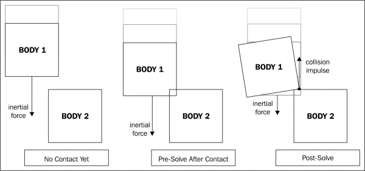

在第四步中，我们设置了物理世界的接触监听器。注意，我们在接触监听器开始处创建了一个变量`maxImpulse`，以在接触监听器的末尾的`postSolve()`方法中使用。对于这个模拟，我们不需要`beginContact()`和`endContact()`方法，因此我们让它们保持为空。在`preSolve()`方法中，我们首先测试以确定接触是否发生在我们的两个身体之间，`dynamicBody`和`staticBody`。如果是，我们测试`dynamicBody`是否在我们的`staticBody`下方，通过检查`dynamicBody.getWorldCenter().y`属性是否小于`staticBody.getWorldCenter().y`属性，如果是，我们取消碰撞。这使得动态身体可以从下方穿过静态身体，同时仍然从上方与静态身体发生碰撞。

在`postSolve()`方法中，我们测试以确保只处理我们先前定义的动态和静态身体。如果是这样，我们将`maxImpulse`变量设置为`impulse.getNormalImpulses()`数组中的第一个冲量。这个列表保存了两个碰撞夹具之间所有接触点的纠正冲量。接下来，我们遍历冲量列表，并将`maxImpulse`变量设置为当前`maxImpulse`值或列表中的当前冲量值，以较大者为准。这为我们提供了碰撞中的最大纠正冲量，然后我们使用它来旋转动态身体，如果冲力足够大，在这个模拟中是`400f`的冲量。

第五步初始化用于在屏幕上拖动动态身体的鼠标关节，第六步使用`onSceneTouchEvent()`方法控制鼠标关节。有关鼠标关节的更多信息，请参考*处理关节*。

## 另请参阅

+   本章节中介绍了*Box2D 物理扩展入门*。

+   本章节中*了解不同的身体类型*。

+   本章节中*处理关节*。

+   本章节中*处理碰撞*。

# 创建可破坏的物体

使用物理世界接触监听器中的`postSolve()`方法提供的冲量数据，我们可以得到每次碰撞的冲击力。将这个数据扩展到使多体物体破碎，只需确定哪个身体发生碰撞，以及冲击力是否足够大以至于能将身体从多体物体中分离。在本教程中，我们将演示如何创建由多个身体组成的可破坏物体。

## 准备就绪...

按照本章开始部分*Box2D 物理扩展入门*一节中的步骤创建一个活动。这个活动将促进我们在此节中使用的可破坏身体组的创建。

## 如何操作...

按照以下步骤创建一个在受到大力碰撞时可以破碎的物体：

1.  向活动类中添加以下定义：

    ```kt
    public Body box1Body;
    public Body box2Body;
    public Body box3Body;
    public boolean breakOffBox1 = false;
    public boolean breakOffBox2 = false;
    public boolean breakOffBox3 = false;
    public Joint box1And2Joint;
    public Joint box2And3Joint;
    public Joint box3And1Joint;
    public boolean box1And2JointActive = true;
    public boolean box2And3JointActive = true;
    public boolean box3And1JointActive = true;
    public final FixtureDef boxFixtureDef = 
      PhysicsFactory.createFixtureDef(20f, 0.0f, 0.9f);
    ```

1.  为了更容易确定哪个身体被接触，请在类中插入此方法：

    ```kt
    public boolean isBodyContacted(Body pBody, Contact pContact)
    {
      if(pContact.getFixtureA().getBody().equals(pBody) ||
          pContact.getFixtureB().getBody().equals(pBody))
        return true;
      return false;
    }
    ```

1.  我们将要创建一个由三个盒子组成的物理对象，这些盒子通过焊接关节保持在一起。在`onPopulateScene()`方法中定义以下盒子：

    ```kt
    Rectangle box1Rect = new Rectangle(400f, 260f, 40f, 40f, 
      this.getEngine().getVertexBufferObjectManager());
    box1Rect.setColor(0.75f, 0f, 0f);
    mScene.attachChild(box1Rect);
    box1Body = PhysicsFactory.createBoxBody(mPhysicsWorld, box1Rect,
      BodyType.DynamicBody, boxFixtureDef);
    mPhysicsWorld.registerPhysicsConnector(new PhysicsConnector(
      box1Rect, box1Body));

    Rectangle box2Rect = new Rectangle(380f, 220f, 40f, 40f, 
      this.getEngine().getVertexBufferObjectManager());
    box2Rect.setColor(0f, 0.75f, 0f);
    mScene.attachChild(box2Rect);
    box2Body = PhysicsFactory.createBoxBody(mPhysicsWorld, box2Rect, 
      BodyType.DynamicBody, boxFixtureDef);
    mPhysicsWorld.registerPhysicsConnector(new PhysicsConnector(
      box2Rect, box2Body));
    Rectangle box3Rect = new Rectangle(420f, 220f, 40f, 40f,
      this.getEngine().getVertexBufferObjectManager());
    box3Rect.setColor(0f, 0f, 0.75f);
    mScene.attachChild(box3Rect);
    box3Body = PhysicsFactory.createBoxBody(mPhysicsWorld, box3Rect, 
      BodyType.DynamicBody, boxFixtureDef);
    mPhysicsWorld.registerPhysicsConnector(new PhysicsConnector(
      box3Rect, box3Body));
    ```

1.  接下来，在上一步中定义的盒子定义之后，在`onPopulateScene()`方法中放置以下焊接关节定义：

    ```kt
    final WeldJointDef box1and2JointDef = new WeldJointDef();
    box1and2JointDef.initialize(box1Body, box2Body,
      box1Body.getWorldCenter());
    box1And2Joint = mPhysicsWorld.createJoint(box1and2JointDef);

    final WeldJointDef box2and3JointDef = new WeldJointDef();
    box2and3JointDef.initialize(box2Body, box3Body,
      box2Body.getWorldCenter());
    box2And3Joint = mPhysicsWorld.createJoint(box2and3JointDef);

    final WeldJointDef box3and1JointDef = new WeldJointDef();
    box3and1JointDef.initialize(box3Body, box1Body,
      box3Body.getWorldCenter());
    box3And1Joint = mPhysicsWorld.createJoint(box3and1JointDef);
    ```

1.  现在我们需要设置物理世界的接触监听器。将以下代码添加到`onPopulateScene()`方法中：

    ```kt
    mPhysicsWorld.setContactListener(new ContactListener(){
      float maxImpulse;
      @Override
      public void beginContact(Contact contact) {}
      @Override
      public void endContact(Contact contact) {}
      @Override
      public void preSolve(Contact contact, Manifold oldManifold) {}	@Override
      public void postSolve(Contact contact, ContactImpulse impulse) {
        maxImpulse = impulse.getNormalImpulses()[0];
        for(int i = 1; i < impulse.getNormalImpulses().length; i++) 
        {
          maxImpulse = Math.max(impulse.getNormalImpulses()[i],
            maxImpulse);
        }
        if(maxImpulse>800f) {
          if(isBodyContacted(box1Body,contact))
            breakOffBox1 = true;
          else if(isBodyContacted(box2Body,contact))
            breakOffBox2 = true;
          else if(isBodyContacted(box3Body,contact))
            breakOffBox3 = true;
        }
      }
    });
    ```

1.  最后，为了从接触监听器中移除逻辑，请在`onPopulateScene()`方法中放置以下更新处理程序：

    ```kt
    mScene.registerUpdateHandler(new IUpdateHandler() {
      @Override
      public void onUpdate(float pSecondsElapsed) {
        if(breakOffBox1) {
          if(box1And2JointActive)
            mPhysicsWorld.destroyJoint(box1And2Joint);
          if(box3And1JointActive)
            mPhysicsWorld.destroyJoint(box3And1Joint);
          box1And2JointActive = false;
          box3And1JointActive = false;
          breakOffBox1 = false;
        }
        if(breakOffBox2) {
          if(box1And2JointActive)
            mPhysicsWorld.destroyJoint(box1And2Joint);
          if(box2And3JointActive)
            mPhysicsWorld.destroyJoint(box2And3Joint);
          box1And2JointActive = false;
          box2And3JointActive = false;
          breakOffBox1 = false;
        }
        if(breakOffBox3) {
          if(box2And3JointActive)
            mPhysicsWorld.destroyJoint(box2And3Joint);
          if(box3And1JointActive)
            mPhysicsWorld.destroyJoint(box3And1Joint);
          box2And3JointActive = false;
          box3And1JointActive = false;
          breakOffBox1 = false;
        }
      }
      @Override public void reset() {}
    });
    ```

## 工作原理...

第一步初步定义了三个我们将通过焊接关节连接在一起的身体。接下来，我们定义了三个布尔变量，表示如果有，哪个身体应该从身体组中释放。然后，我们定义了三个保持我们的身体在一起的焊接关节以及表示关节是否存在的相应布尔值。最后，我们定义了一个固定装置定义，我们将根据它创建三个盒状身体。

第二步创建了一个方法，该方法允许我们确定一个特定的身体是否参与了碰撞，这与*处理碰撞*的教程中看到的内容类似。第三步创建我们的身体，第四步创建连接它们的焊接关节。有关创建身体的更多信息，请参考*理解不同的物体类型*的教程，或者有关使用关节的更多信息，请参考*使用关节*的教程。

在第五步中，我们设置了物理世界的接触监听器，只创建了`maxImpulse`变量，并只填充了`postSolve()`方法。在`postSolve()`方法中，我们确定碰撞冲量的力是否足以破坏与一个物体相连的关节。如果是，我们会确定应该从组中分离哪个物体，并为此物体设置相关的布尔值。设置`ContactListener`接口后，我们注册了一个更新处理程序，根据哪些物体被标记为需要分离来销毁相应的关节。由于三个物体中的每一个都与另外两个物体相连，因此对于组中的每个物体都有两个关节需要销毁。当我们销毁关节时，我们会将每个被销毁的关节标记为非活动状态，这样我们就不会尝试销毁已经销毁的关节。

## 另请参阅

+   本章节介绍*Box2D 物理扩展的入门*。

+   本章节讲解如何*理解不同的物体类型*。

+   本章节讲解如何*使用关节*。

+   本章节介绍如何使用`preSolve`和`postSolve`。

# 光线投射

通过物理世界进行**光线投射**是一种从一个点向另一个点发射假想线，并返回距离、遇到的每个固定装置以及每个被撞击表面的法线向量的计算。光线投射可用于任何从激光和视野锥到确定一个假想子弹击中什么的一切。在本教程中，我们将演示如何在我们的物理世界中执行光线投射。

## 准备工作...

按照本章开始部分*Box2D 物理扩展介绍*中的步骤创建一个新活动，以便我们在物理世界中使用光线投射。

## 如何操作...

按照以下步骤创建一个光线投射演示：

1.  在活动的开始处放置以下定义：

    ```kt
    Body BoxBody;
    Line RayCastLine;
    Line RayCastLineHitNormal;
    Line RayCastLineHitBounce;
    float[] RayCastStart = {cameraWidth/2f,15f};
    float RayCastAngle = 0f;
    float RayCastNormalAngle = 0f;
    float RayCastBounceAngle = 0f;
    float RaycastBounceLineLength = 200f;
    final FixtureDef boxFixtureDef =
      PhysicsFactory.createFixtureDef(1f, 0.5f, 0.9f);
    ```

1.  当我们告诉物理世界执行光线投射（raycast）时，它会使用一个提供的`callback`接口，让我们可以利用光线投射收集到的信息。在活动中放置以下`RayCastCallback`定义：

    ```kt
    RayCastCallback rayCastCallBack = new RayCastCallback() {
      @Override
      public float reportRayFixture(Fixture fixture, Vector2 point,
        Vector2 normal, float fraction)
      {
        float[] linePos = {
          point.x * 
          PhysicsConstants.PIXEL_TO_METER_RATIO_DEFAULT,
          point.y * 
          PhysicsConstants.PIXEL_TO_METER_RATIO_DEFAULT,
          (point.x + (normal.x)) *
          PhysicsConstants.PIXEL_TO_METER_RATIO_DEFAULT,
          (point.y + (normal.y)) *
          PhysicsConstants.PIXEL_TO_METER_RATIO_DEFAULT};
      RayCastLineHitNormal.setPosition(
        linePos[0],linePos[1],
        linePos[2],linePos[3]);
      RayCastLineHitNormal.setVisible(true);
      RayCastNormalAngle = MathUtils.radToDeg(
        (float) Math.atan2(
          linePos[3]-linePos[1],
          linePos[2]-linePos[0]));
      RayCastBounceAngle = (2*RayCastNormalAngle)-RayCastAngle;
      RayCastLineHitBounce.setPosition(
        linePos[0], linePos[1],
        (linePos[0] + FloatMath.cos((RayCastBounceAngle + 180f) * 
          MathConstants.DEG_TO_RAD) * RaycastBounceLineLength),
        (linePos[1] + FloatMath.sin((RayCastBounceAngle + 180f) * 
          MathConstants.DEG_TO_RAD)*RaycastBounceLineLength));
      RayCastLineHitBounce.setVisible(true);
      return 0f;
      }
    };
    ```

1.  为了让光线投射有撞击的对象，我们将在物理世界中创建一个盒子。在`onPopulateScene()`方法中插入以下代码片段：

    ```kt
    Rectangle Box1 = new Rectangle(400f, 350f, 200f, 200f, 
      this.getEngine().getVertexBufferObjectManager());
    Box1.setColor(0.3f, 0.3f, 0.3f);
    BoxBody = PhysicsFactory.createBoxBody(mPhysicsWorld, Box1,
      BodyType.StaticBody, boxFixtureDef);
    BoxBody.setTransform(BoxBody.getWorldCenter(), MathUtils.random(0.349f, 1.222f));
    mScene.attachChild(Box1);
    mPhysicsWorld.registerPhysicsConnector(
      new PhysicsConnector(Box1, BoxBody));
    ```

1.  接下来，我们将定义一个`Line`对象，它表示从光线投射中收集到的一些信息。在`onPopulateScene()`方法中添加以下内容：

    ```kt
    RayCastLine = new Line(0f, 0f, 0f, 0f,
      mEngine.getVertexBufferObjectManager());
    RayCastLine.setColor(0f, 1f, 0f);
    RayCastLine.setLineWidth(8f);
    mScene.attachChild(RayCastLine);

    RayCastLineHitNormal = new Line(0f, 0f, 0f, 0f, 
      mEngine.getVertexBufferObjectManager());
    RayCastLineHitNormal.setColor(1f, 0f, 0f);
    RayCastLineHitNormal.setLineWidth(8f);
    mScene.attachChild(RayCastLineHitNormal);

    RayCastLineHitBounce = new Line(0f, 0f, 0f, 0f, 
      mEngine.getVertexBufferObjectManager());
    RayCastLineHitBounce.setColor(0f, 0f, 1f);
    RayCastLineHitBounce.setLineWidth(8f);
    mScene.attachChild(RayCastLineHitBounce);
    ```

1.  最后，我们希望光线投射在触摸场景的任何地方发生。在`onSceneTouchEvent()`方法中放置以下内容：

    ```kt
    if(pSceneTouchEvent.isActionMove()||pSceneTouchEvent.isActionDown()){
      RayCastAngle = MathUtils.radToDeg((float)
        Math.atan2(pSceneTouchEvent.getY() - RayCastStart[1],
          pSceneTouchEvent.getX() - RayCastStart[0]));
      RayCastLine.setPosition(
        RayCastStart[0], RayCastStart[1],
        pSceneTouchEvent.getX(), pSceneTouchEvent.getY());
      RayCastLine.setVisible(true);
      RayCastLineHitNormal.setVisible(false);
      RayCastLineHitBounce.setVisible(false);
      mPhysicsWorld.rayCast(rayCastCallBack, 
        new Vector2(
          RayCastStart[0] / 
          PhysicsConstants.PIXEL_TO_METER_RATIO_DEFAULT,
          RayCastStart[1] /
          PhysicsConstants.PIXEL_TO_METER_RATIO_DEFAULT),
        new Vector2(
          pSceneTouchEvent.getX() /
          PhysicsConstants.PIXEL_TO_METER_RATIO_DEFAULT,
          pSceneTouchEvent.getY() /
          PhysicsConstants.PIXEL_TO_METER_RATIO_DEFAULT));
    }
    if(pSceneTouchEvent.isActionUp() || 
      pSceneTouchEvent.isActionOutside() || 
      pSceneTouchEvent.isActionCancel())
    {
      RayCastLine.setVisible(false);
    }
    ```

## 工作原理...

我们首先定义了一个刚体`BoxBody`，我们将使用光线投射与之交互。然后，我们定义了几条视觉上表示光线投射的线条。最后，我们定义了一系列变量，帮助我们确定光线投射的位置和结果。

在第二步中，我们定义了一个`RayCastCallback`接口，当我们请求物理世界计算光线投射时，将传递这个接口。在回调中，我们使用重写的`reportRayFixture()`方法。每次请求的光线投射遇到新的固定装置时，都会调用这个方法。在方法中，我们使用光线投射返回的点和平面变量来修改表示报告固定装置撞击表面的法线位置。设置法线可见后，我们确定法线角度，然后是反弹角度。接着我们定位反弹线以表示光线投射的反弹，并设置反弹线可见。最后，我们返回`0`，告诉光线投射在撞击第一个固定装置后终止。为了更好地理解光线投射回调中返回的各种参数，请参考以下图表：

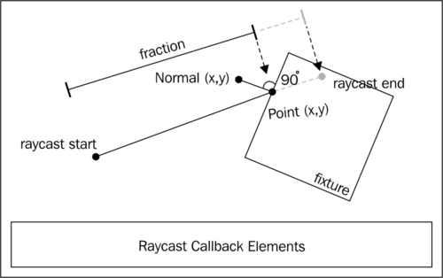

第三步创建了第一步中定义的刚体，并通过调用`BoxBody.setTransform()`方法设置了半随机的旋转，最后一个参数为`MathUtils.random(0.349f, 1.222f)`，这使得刚体的旋转在`0.349`弧度和`1.222`弧度之间。第四步创建了表示光线投射各个部分的视觉线条。关于创建刚体的更多信息，请参阅本章中的*了解不同的刚体类型*菜谱；关于线条的更多信息，请参阅第二章，*使用实体*。

在第五步中，我们将`onSceneTouchEvent()`方法分配给处理射线投射（raycasting）。当触摸发生时，我们首先设置`RayCastAngle`变量以供射线投射的回调函数使用。然后，我们定位主射线线，并将其设置为可见，同时将与其他射线相关的线设置为不可见。最后，我们通过传递我们的回调函数、射线投射的起始位置和结束位置，从物理世界中请求射线投射。当触摸事件结束时，我们将主射线线设置为不可见。

## 另请参阅。

+   本章介绍*Box2D 物理扩展*。
