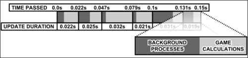

# 第七章：使用更新处理器

**更新处理器**让我们能够每次引擎更新时运行特定的代码片段。一些游戏引擎内置了一个作为主循环的更新处理器，但使用 AndEngine，我们可以轻松地创建尽可能多的这些循环。本章将介绍以下内容：

+   开始使用更新处理器

+   将更新处理器附加到实体

+   使用条件更新处理器

+   处理从游戏中移除实体的操作

+   添加游戏计时器

+   根据经过的时间设置实体属性

# 开始使用更新处理器

更新处理器本质上是我们在每次引擎更新场景时注册到实体或引擎的代码片段。在大多数情况下，这种更新每次绘制帧时都会发生，无论实体或场景是否已更改。更新处理器可以是运行游戏的一种强大方式，但过度使用它们或在它们中执行繁重的计算将导致性能下降。本节将介绍向活动添加简单更新处理器的基础知识。

## 准备好了...

创建一个名为`UpdateHandlersActivity`的新类，该类继承自`BaseGameActivity`。我们将使用这个类来创建一个基本的更新处理器。

## 如何操作...

按照以下步骤创建一个显示已发生多少次更新的更新处理器：

1.  在我们的`UpdateHandlersActivity`类中放置以下定义：

    ```kt
    public static int cameraWidth = 800;
    public static int cameraHeight = 480;
    public Scene mScene;public Font fontDefault32Bold;
    public Text countingText;
    public int countingInt = 0;
    ```

1.  接下来，向类中添加以下重写的方法。

    ```kt
    @Override
    public EngineOptions onCreateEngineOptions() {
      return new EngineOptions(true, 
        ScreenOrientation.LANDSCAPE_SENSOR,
        new FillResolutionPolicy(), new Camera(0, 0, 
        cameraWidth, cameraHeight)).setWakeLockOptions(
        WakeLockOptions.SCREEN_ON);
    }
    @Override
    public void onCreateResources(OnCreateResourcesCallback
        pOnCreateResourcesCallback) {
      fontDefault32Bold = FontFactory.create(
        mEngine.getFontManager(),
        mEngine.getTextureManager(), 256, 256,
        Typeface.create(Typeface.DEFAULT, Typeface.BOLD),
        32f, true, Color.BLACK_ARGB_PACKED_INT);
      fontDefault32Bold.load();
      pOnCreateResourcesCallback.onCreateResourcesFinished();
    }
    @Override
    public void onCreateScene(OnCreateSceneCallback
        pOnCreateSceneCallback) {
      mScene = new Scene();
      mScene.setBackground(new Background(0.9f,0.9f,0.9f));
      pOnCreateSceneCallback.onCreateSceneFinished(mScene);
    }
    ```

1.  最后，将这个最后的方法插入我们的类中：

    ```kt
    @Override
    public void onPopulateScene(Scene pScene,
        OnPopulateSceneCallback pOnPopulateSceneCallback) {
      countingText = new Text(400f, 240f,
        fontDefault32Bold, "0", 10,
        this.getVertexBufferObjectManager());
      mScene.attachChild(countingText);
      mScene.registerUpdateHandler(new IUpdateHandler() {
        @Override
        public void onUpdate(float pSecondsElapsed) {
          countingInt++;
          countingText.setText(
            String.valueOf(countingInt));
        }
        @Override public void reset() {}
      });
      pOnPopulateSceneCallback.onPopulateSceneFinished();
    }
    ```

## 工作原理...

第一步和第二步涵盖了创建一个简单的`BaseGameActivity`类的过程。关于创建`BaseGameActivity`类的更多信息，请参见第一章中的*Know the life cycle*部分，*AndEngine 游戏结构*。注意，我们在`onCreateResources()`方法中创建并加载了一个`Font`对象。关于字体和使用它们的`Text`实体的更多信息，请参见第二章中的*Applying text to a layer*部分，*使用实体*。

在第三步中，我们通过将`onCreateResources()`方法中创建的`fontDefault32Bold`字体传递给`Text`构造函数，以及屏幕居中和最大字符串长度参数`10`个字符，创建了一个`Text`实体`countingText`。将`countingText`实体附加到场景后，我们注册了更新处理器。在我们的更新处理器的`onUpdate()`方法中，我们增加`countingInt`整数，并将`countingText`实体的文本设置为该整数。这让我们可以直接在游戏中以文本形式显示已经发生了多少次更新，从而绘制了多少帧。

## 另请参阅

+   第一章中的*Know the life cycle*，*AndEngine 游戏结构*。

+   在第二章，*使用实体*中*Applying text to a layer*。

# 将更新处理器附加到实体上

除了能够将更新处理器与`Scene`对象注册之外，我们还可以与特定实体注册更新处理器。通过将更新处理器与实体注册，只有当实体被附加到引擎的场景中时，处理器才会被调用。这个示例通过创建一个更新处理器，它与一个最初未附加的实体注册，来递增屏幕上的文本，演示了这一过程。

## 准备中...

创建一个名为`AttachUpdateHandlerToEntityActivity`的新类，该类继承自`BaseGameActivity`并实现`IOnSceneTouchListener`接口。我们将使用这个类将更新处理器附加到一个`Entity`对象上，等到场景被触摸时再将其附加到场景中。

## 如何操作...

按照以下步骤创建一个活动，演示更新处理器如何依赖于其父实体来运行：

1.  在我们新的活动类中插入以下定义：

    ```kt
    public static int cameraWidth = 800;
    public static int cameraHeight = 480;
    public Scene mScene;
    public Font fontDefault32Bold;
    public Text countingText;
    public int countingInt = 0;
    public Entity blankEntity;
    ```

1.  然后，在类中放置以下重写的方法：

    ```kt
    @Override
    public EngineOptions onCreateEngineOptions() {
      return new EngineOptions(true, 
        ScreenOrientation.LANDSCAPE_SENSOR,
        new FillResolutionPolicy(), new Camera(0, 0, 
        cameraWidth, cameraHeight)).setWakeLockOptions(
        WakeLockOptions.SCREEN_ON);
    }
    @Override
    public void onCreateResources(OnCreateResourcesCallback
        pOnCreateResourcesCallback) {
      fontDefault32Bold = FontFactory.create(
        mEngine.getFontManager(),
        mEngine.getTextureManager(), 256, 256,
        Typeface.create(Typeface.DEFAULT, Typeface.BOLD),
        32f, true, Color.BLACK_ARGB_PACKED_INT);
      fontDefault32Bold.load();
      pOnCreateResourcesCallback.onCreateResourcesFinished();
    }
    @Override
    public void onCreateScene(OnCreateSceneCallback
        pOnCreateSceneCallback) {
      mScene = new Scene();
      mScene.setBackground(new Background(0.9f,0.9f,0.9f));
      pOnCreateSceneCallback.onCreateSceneFinished(mScene);
    }
    ```

1.  接下来，将以下重写的`onPopulateScene()`方法添加到我们的活动类中：

    ```kt
    @Override
    public void onPopulateScene(Scene pScene,
        OnPopulateSceneCallback pOnPopulateSceneCallback) {
      countingText = new Text(400f, 240f,
        fontDefault32Bold, "0", 10,
        this.getVertexBufferObjectManager());
      mScene.attachChild(countingText);
      blankEntity = new Entity();
      blankEntity.registerUpdateHandler(new IUpdateHandler() {
        @Override
        public void onUpdate(float pSecondsElapsed) {
          countingInt++;
          countingText.setText(
            String.valueOf(countingInt));
        }
        @Override public void reset() {}
      });
      mScene.setOnSceneTouchListener(this);
      pOnPopulateSceneCallback.onPopulateSceneFinished();
    }
    ```

1.  最后，在我们的`AttachUpdateHandlerToEntityActivity`类中插入以下重写的方法以完成它：

    ```kt
    @Override
    public boolean onSceneTouchEvent(Scene pScene,
        TouchEvent pSceneTouchEvent) {
      if(pSceneTouchEvent.isActionDown() && 
          !blankEntity.hasParent())
        mScene.attachChild(blankEntity);
      return true;
    }
    ```

## 工作原理...

第一步和第二步涵盖了创建一个简单的`BaseGameActivity`类。有关创建 BaseGameActivity 类的更多信息，请参见第一章中的*Know the life cycle*一节，*AndEngine 游戏结构*。然而请注意，我们在`onCreateResources()`方法中创建并加载了一个`Font`对象。关于字体和使用它们的`Text`实体的更多信息，请参见第二章中的*Applying text to a layer*一节，*使用实体*。

第三步创建了一个文本实体`countingText`，并将其附加到我们场景的中心。然后，通过调用`Entity()`构造函数创建我们的空白实体`blankEntity`，并且将更新处理器与其注册。注意，在第四步中的`onSceneTouchEvent()`方法检测到触摸事件之前，空白实体并不会被附加到场景中。更新处理器的`onUpdate()`方法仅仅是将`countingText`实体的文本递增，以显示更新处理器正在运行。

第四步创建了`onSceneTouchEvent()`方法，该方法在场景被触摸时被调用。我们检查以确保触摸事件是一个按下动作，并且我们的空白实体还没有父实体，然后将`blankEntity`附加到场景中。

## 还有更多...

运行此示例时，我们可以看到，在空白实体附加到场景之前，更新处理程序不会被调用。这种效果与覆盖实体的`onManagedUpdate()`方法类似。将更新处理程序注册到实体可以用于创建具有自身逻辑的敌人，或者是在显示之前不应该动画化的场景部分。注册到`Scene`对象中另一个`Entity`对象的子`Entity`对象的更新处理程序仍然有效。此外，实体的可见性并不影响其注册的更新处理程序是否运行。

## 另请参阅

+   在本章中开始使用更新处理程序。

+   在第一章中了解*AndEngine 游戏结构*的生命周期。

+   在第二章中了解*AndEngine 实体*，*使用实体*。

+   在第二章中，将文本应用到图层，*使用实体*。

+   在第二章中*覆盖 onManagedUpdate*，*使用实体*。

# 结合条件使用更新处理程序。

为了减少运行具有繁重计算更新处理程序的性能成本，我们可以包含一个条件语句，告诉更新处理程序在另一个更新周期内运行一组特定的指令。例如，如果我们有敌人检查玩家是否在他们的视线范围内，我们可以选择让视野计算每三次更新只运行一次。在本示例中，我们将演示一个简单的条件语句，通过触摸屏幕在性能密集型计算和非常简单的计算之间进行切换。

## 准备工作...

创建一个名为`UpdateHandlersAndConditionalsActivity`的新类，该类继承自`BaseGameActivity`并实现`IOnSceneTouchListener`接口。我们将使用这个类来演示如何在使用更新处理程序时使用条件语句。

## 如何操作...

按照以下步骤创建一个使用条件块来确定要运行哪段代码的更新处理程序：

1.  在新类中放置以下定义：

    ```kt
    public static int cameraWidth = 800;
    public static int cameraHeight = 480;
    public Scene mScene;
    public Font fontDefault32Bold;
    public Text countingText;
    public int countingInt = 0;
    public boolean performanceIntensiveLoop = true;
    public double performanceHeavyVariable;
    ```

1.  然后，添加以下重写的方法：

    ```kt
    @Override
    public EngineOptions onCreateEngineOptions() {
      return new EngineOptions(true, 
        ScreenOrientation.LANDSCAPE_SENSOR,
        new FillResolutionPolicy(), new Camera(0, 0, 
        cameraWidth, cameraHeight)).setWakeLockOptions(
        WakeLockOptions.SCREEN_ON);
    }
    @Override
    public void onCreateResources(OnCreateResourcesCallback
        pOnCreateResourcesCallback) {
      fontDefault32Bold = FontFactory.create(
        mEngine.getFontManager(),
        mEngine.getTextureManager(), 256, 256,
        Typeface.create(Typeface.DEFAULT, Typeface.BOLD),
        32f, true, Color.BLACK_ARGB_PACKED_INT);
      fontDefault32Bold.load();
      pOnCreateResourcesCallback.onCreateResourcesFinished();
    }
    @Override
    public void onCreateScene(OnCreateSceneCallback
        pOnCreateSceneCallback) {
      mScene = new Scene();
      mScene.setBackground(new Background(0.9f,0.9f,0.9f));
      pOnCreateSceneCallback.onCreateSceneFinished(mScene);
    }
    ```

1.  接下来，插入以下重写的`onPopulateScene()`方法：

    ```kt
    @Override
    public void onPopulateScene(Scene pScene,
        OnPopulateSceneCallback pOnPopulateSceneCallback) {
      countingText = new Text(400f, 240f, 
        fontDefault32Bold, "0", 10,
        this.getVertexBufferObjectManager());
      mScene.attachChild(countingText);
      mScene.registerUpdateHandler(new IUpdateHandler() {
        @Override
        public void onUpdate(float pSecondsElapsed) {
          if(performanceIntensiveLoop) {
            countingInt++;
            for(int i = 3; i < 1000000; i++)
            performanceHeavyVariable = 
              Math.sqrt(i);
          } else {
            countingInt--;
          }
          countingText.setText(
            String.valueOf(countingInt));
        }
        @Override public void reset() {}
      });
      mScene.setOnSceneTouchListener(this);
      pOnPopulateSceneCallback.onPopulateSceneFinished();
    }
    ```

1.  最后，创建此`onSceneTouchEvent()`方法以完成我们的活动：

    ```kt
    @Override
    public boolean onSceneTouchEvent(Scene pScene, TouchEvent 
        pSceneTouchEvent) {
      if(pSceneTouchEvent.isActionDown())
        performanceIntensiveLoop = !performanceIntensiveLoop;
      return true;
    }
    ```

## 工作原理...

在第一步中，我们定义了测试床共有的变量以及一个布尔型变量`performanceIntensiveLoop`，它告诉我们的更新处理程序采取哪个动作，以及一个双精度变量`performanceHeavyVariable`，我们将在性能密集型计算中使用它。第二步为我们的活动创建标准方法。有关创建`BaseGameActivity`类的更多信息，请参见第一章中的*了解生命周期*示例。

在第三步中，我们在注册更新处理器到场景之前创建了`countingText`。在每次更新时，它会检查`performanceIntensiveLoop`布尔变量，以确定它应该执行繁重任务（几乎调用一百万次`Math`类的`sqrt()`方法），还是执行简单任务（递减`countingInt`变量的文本）。

第四步是`onSceneTouchEvent()`方法，每次触摸屏幕时都会切换`performanceIntensiveLoop`布尔变量。

## 另请参阅

+   本章节中的*开始使用更新处理器*。

+   第一章中的*Know the life cycle*，*AndEngine 游戏结构*。

+   第二章中的*将文本应用到层上*，*使用实体*。

# 处理从游戏中移除实体的操作

在更新处理器中分离实体有时可能会抛出`IndexOutOfBoundsException`异常，因为实体是在引擎更新过程中被移除的。为了避免该异常，我们创建了一个`Runnable`参数，在所有其他更新完成后，在更新线程上最后运行。在本教程中，我们将通过使用`BaseGameActivity`类的`runOnUpdateThread()`方法，从游戏中安全地移除实体。

## 准备就绪...

创建一个名为`HandlingRemovalOfEntityActivity`的新类，该类继承自`BaseGameActivity`。我们将使用这个类来学习如何安全地从更新处理器中移除实体。

## 如何操作...

按照以下步骤，我们可以在不抛出异常的情况下从一个父实体中移除一个实体：

1.  在`HandlingRemovalOfEntityActivity`类中插入以下定义：

    ```kt
    public static int cameraWidth = 800;
    public static int cameraHeight = 480;
    public Scene mScene;
    public Rectangle spinningRect;
    public float totalElapsedSeconds = 0f;
    ```

1.  接下来，将这些重写的方法添加到类中：

    ```kt
    @Override
    public EngineOptions onCreateEngineOptions() {
      return new EngineOptions(true, 
        ScreenOrientation.LANDSCAPE_SENSOR,
        new FillResolutionPolicy(), new Camera(0, 0, 
        cameraWidth, cameraHeight)).setWakeLockOptions(
        WakeLockOptions.SCREEN_ON);
    }
    @Override
    public void onCreateResources(OnCreateResourcesCallback
        pOnCreateResourcesCallback) {
      pOnCreateResourcesCallback.onCreateResourcesFinished();
    }
    @Override
    public void onCreateScene(OnCreateSceneCallback
        pOnCreateSceneCallback) {
      mScene = new Scene();
      mScene.setBackground(new Background(0.9f,0.9f,0.9f));
      pOnCreateSceneCallback.onCreateSceneFinished(mScene);
    }
    ```

1.  最后，在活动中放置以下`onPopulateScene()`方法以完成它：

    ```kt
    @Override
    public void onPopulateScene(Scene pScene,
        OnPopulateSceneCallback pOnPopulateSceneCallback) {
      spinningRect = new Rectangle(400f, 240f, 100f, 20f,
        this.getVertexBufferObjectManager());
      spinningRect.setColor(Color.BLACK);
      spinningRect.registerUpdateHandler(new IUpdateHandler() {
        @Override
        public void onUpdate(float pSecondsElapsed) {
          spinningRect.setRotation(
            spinningRect.getRotation()+0.4f);
          totalElapsedSeconds += pSecondsElapsed;
          if(totalElapsedSeconds > 5f) {
            runOnUpdateThread(new Runnable() {
              @Override
              public void run() {
                spinningRect.detachSelf();
              }});
          }
        }
        @Override public void reset() {}
      });
      mScene.attachChild(spinningRect);
      pOnPopulateSceneCallback.onPopulateSceneFinished();
    }
    ```

## 工作原理...

在第一步中，我们定义了常规的`BaseGameActivity`变量以及一个正方形`Rectangle`对象，`spinningRect`，它将在原地旋转，还有一个浮点变量`totalElapsedSeconds`，用于跟踪自更新处理程序开始以来已经过去了多少秒。第二步创建了标准的`BaseGameActivity`方法。有关创建 AndEngine 活动的更多信息，请参见第一章中的*Know the life cycle*部分，*AndEngine 游戏结构*。

在第三步中，我们通过调用`Rectangle`构造函数并设置屏幕中心位置来创建第一步中定义的`spinningRect`矩形。然后通过`setColor()`方法将`Rectangle`对象设置为黑色。接下来，它注册了我们的更新处理器，记录经过的时间，如果自活动开始以来已经超过`5`秒，则从屏幕上移除矩形。请注意，我们从场景中分离矩形的方式是调用`runOnUpdateThread()`。此方法将`Runnable`参数传递给引擎，以便在更新周期完成后运行。

## 另请参阅

+   在本章中，*开始使用更新处理器*。

+   在第一章 *AndEngine 游戏结构* 中，*了解生命周期*。

+   在第二章 *使用实体* 中，*给图层应用图元*。

# 添加游戏计时器

许多游戏会倒计时并挑战玩家在给定的时间内完成任务。这样的挑战对玩家来说是有益的，并且常常增加了游戏的重复玩价值。在之前的教程中，我们跟踪了总经过时间。在本教程中，我们将从一个时间开始，并从中减去更新处理器提供的时间。

## 准备就绪...

创建一个名为 `GameTimerActivity` 的新类，该类继承自 `BaseGameActivity`。我们将使用这个类从更新处理器创建一个游戏计时器。

## 如何操作...

按照以下步骤使用更新处理器创建游戏计时器：

1.  在我们新活动类中放置以下变量定义：

    ```kt
    public static int cameraWidth = 800;
    public static int cameraHeight = 480;
    public Scene mScene;
    public Font fontDefault32Bold;
    public Text countingText;
    public float EndingTimer = 10f;
    ```

1.  接下来，插入以下标准覆盖方法：

    ```kt
    @Override
    public EngineOptions onCreateEngineOptions() {
      return new EngineOptions(true, 
        ScreenOrientation.LANDSCAPE_SENSOR,
        new FillResolutionPolicy(), new Camera(0, 0, 
        cameraWidth, cameraHeight)).setWakeLockOptions(
        WakeLockOptions.SCREEN_ON);
    }
    @Override
    public void onCreateResources(OnCreateResourcesCallback
        pOnCreateResourcesCallback) {
      fontDefault32Bold = FontFactory.create(
        mEngine.getFontManager(),
        mEngine.getTextureManager(), 256, 256,
        Typeface.create(Typeface.DEFAULT, Typeface.BOLD), 
        32f, true, Color.BLACK_ARGB_PACKED_INT);
      fontDefault32Bold.load();
      pOnCreateResourcesCallback.onCreateResourcesFinished();
    }
    @Override
    public void onCreateScene(OnCreateSceneCallback
        pOnCreateSceneCallback) {
      mScene = new Scene();
      mScene.setBackground(new Background(0.9f,0.9f,0.9f));
      pOnCreateSceneCallback.onCreateSceneFinished(mScene);
    }
    ```

1.  最后，将这个覆盖的 `onPopulateScene()` 方法添加到 `GameTimerActivity` 类中：

    ```kt
    @Override
    public void onPopulateScene(Scene pScene,
        OnPopulateSceneCallback pOnPopulateSceneCallback) {
      countingText = new Text(400f, 240f, 
        fontDefault32Bold, "10", 10,
        this.getVertexBufferObjectManager());
      mScene.attachChild(countingText);
      mScene.registerUpdateHandler(new IUpdateHandler() {
        @Override
        public void onUpdate(float pSecondsElapsed) {
          EndingTimer-=pSecondsElapsed;
          if(EndingTimer<=0) {
            // The timer has ended
            countingText.setText("0");
            mScene.unregisterUpdateHandler(this);
          } else {
            countingText.setText(String.valueOf(
              Math.round(EndingTimer)));
          }
        }
        @Override public void reset() {}
      });
      pOnPopulateSceneCallback.onPopulateSceneFinished();
    }
    ```

## 工作原理...

在第一步中，我们将常见的 `BaseGameActivity` 变量以及一个设置为 `10` 秒的 `EndingTimer` 浮点变量定义。第二步为我们的活动创建常见方法。有关创建 BaseGameActivity 类的更多信息，请参见第一章 *AndEngine 游戏结构* 中的*了解生命周期*教程。

在第三步中，我们创建 `countingText` 实体，并使用我们的场景注册一个更新处理器，该处理器通过 `pSecondsElapsed` 变量倒计时 `EndingTimer` 变量，直到它达到 `0`。当它达到 `0` 时，我们只需通过调用场景的 `unregisterUpdateHandler()` 方法，从场景中注销更新处理器。在实际游戏中，计时器结束可能意味着结束一个关卡，甚至召唤下一波敌人攻击玩家。

## 另请参阅

+   在本章中，*开始使用更新处理器*。

+   在第一章 *AndEngine 游戏结构* 中，*了解生命周期*。

+   在第二章 *使用实体* 中，*给图层应用文本*。

# 根据经过的时间设置实体属性

在移动游戏开发中，设备之间的连贯性是更为重要的方面之一。玩家期望游戏能够适当地缩放以适应他们设备的屏幕，但游戏开发中另一个重要且经常被忽视的方面是基于时间而不是引擎更新来设置移动和动画。在本教程中，我们将使用更新处理器来设置实体的属性。

## 准备就绪...

创建一个名为 `SettingEntityPropertiesBasedOnTimePassedActivity` 的新类，该类继承自 `BaseGameActivity`。我们将使用这个类来演示如何使用更新处理器来随时间设置实体属性。

## 如何操作...

按照以下步骤，我们可以根据已经过去的时间设置实体的属性：

1.  在活动中定义以下变量：

    ```kt
    public static int cameraWidth = 800;
    public static int cameraHeight = 480;
    public Scene mScene;
    public Rectangle spinningRect;
    ```

1.  然后，在这些重写的方法中放入以下类：

    ```kt
    @Override
    public EngineOptions onCreateEngineOptions() {
      return new EngineOptions(true, 
      ScreenOrientation.LANDSCAPE_SENSOR,
      new FillResolutionPolicy(), new Camera(0, 0,
      cameraWidth, cameraHeight)).setWakeLockOptions(
      WakeLockOptions.SCREEN_ON);
    }
    @Override
    public void onCreateResources(OnCreateResourcesCallback
        pOnCreateResourcesCallback) {
      pOnCreateResourcesCallback.onCreateResourcesFinished();
    }
    @Override
    public void onCreateScene(OnCreateSceneCallback
        pOnCreateSceneCallback) {
      mScene = new Scene();
      mScene.setBackground(new Background(0.9f,0.9f,0.9f));
      pOnCreateSceneCallback.onCreateSceneFinished(mScene);
    }
    ```

1.  最后，在活动末尾插入此`onPopulateScene()`方法以完成它：

    ```kt
    @Override
    public void onPopulateScene(Scene pScene,
        OnPopulateSceneCallback pOnPopulateSceneCallback) {
      spinningRect = new Rectangle(400f, 240f, 100f, 20f,
        this.getVertexBufferObjectManager());
      spinningRect.setColor(Color.BLACK);
      spinningRect.registerUpdateHandler(new IUpdateHandler() {
        @Override
        public void onUpdate(float pSecondsElapsed) {
          spinningRect.setRotation(
            spinningRect.getRotation() +
            ((pSecondsElapsed*360f)/2f));
        }
        @Override public void reset() {}
      });
      mScene.attachChild(spinningRect);
      pOnPopulateSceneCallback.onPopulateSceneFinished();
    }
    ```

## 它是如何工作的...

与本章中的其他方法一样，我们首先创建常见的`BaseGameActivity`变量。对于这个方法，我们还定义了一个`Rectangle`对象`spinningRect`，它将以每秒特定的圈数旋转。有关创建 AndEngine 活动的更多信息，请参见第一章 *AndEngine 游戏结构*中的*了解生命周期*方法。

在第三步中，我们通过首先创建我们的`spinningRect`矩形来填充`onPopulateScene()`方法，然后我们使用它来注册我们的更新处理程序。在更新处理程序的`onUpdate()`方法内部，我们将矩形的旋转设置为等于其当前的旋转，通过`getRotation()`方法，加上一个计算，将`pSecondsElapsed`变量调整为每秒设定的圈数。下图展示了我们游戏中的更新并不具有相等的持续时间，因此必须利用`pSecondsElapsed`参数而不是一个恒定值：



## 还有更多...

我们在更新处理程序的`onUpdate()`方法中使用的计算使`Rectangle`对象以每秒半圈的速度旋转。如果我们把计算中的`(pSecondsElapsed*360f)`部分乘以`4`，矩形将以每秒 4 圈的速度旋转。对于基于时间的线性移动，只需将所需的每秒像素数与`pSecondsElapsed`变量相乘。

## 另请参阅

+   本章节将开始介绍更新处理程序。

+   *了解生命周期*在第 第一章 *AndEngine 游戏结构*中。
