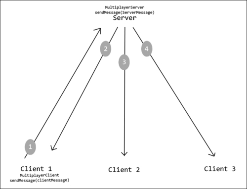
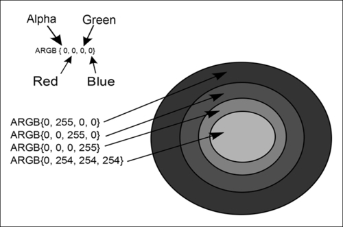
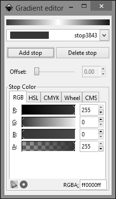

# 第九章：AndEngine 扩展概述

在本章中，我们将介绍一些 AndEngine 最受欢迎的扩展的目的和用法。本章包括以下主题：

+   创建动态壁纸

+   使用多人游戏扩展进行网络通信

+   使用**可伸缩矢量图形**（**SVG**）创建高分辨率图形

+   使用 SVG 纹理区域进行颜色映射

# 简介

在扩展概述章节中，我们将开始使用一些 AndEngine 没有打包的类。有许多扩展可以编写，以添加各种改进或额外功能到任何默认的 AndEngine 游戏。在本章中，我们将使用三个主要扩展，它们将允许我们使用 AndEngine 创建动态壁纸，创建允许多个设备直接相互连接或连接到专用服务器的在线游戏，并最终将 SVG 文件作为纹理区域整合到我们的游戏中，从而在游戏中实现高分辨率和可伸缩的图形。

AndEngine 包含一个相对较长的扩展列表，我们可以将这些扩展包含在项目中，以便使某些任务更容易完成。不幸的是，由于扩展的数量和一些扩展的当前状态，我们限制在本章中包含的扩展数量。然而，大多数 AndEngine 扩展相对容易使用，并且包含可以从 Nicolas Gramlich 的公共 GitHub 仓库获取的示例项目——[`github.com/nicolasgramlich`](https://github.com/nicolasgramlich)。以下是其他 AndEngine 扩展的列表以及简短的用途描述：

+   `AndEngineCocosBuilderExtension`：这个扩展允许开发者通过使用**所见即所得**（**WYSIWYG**）的概念来创建游戏。这种方法允许开发者在使用 CocosBuilder 软件为桌面电脑的 GUI 拖放环境中构建应用程序。这个扩展可以帮助将菜单和关卡设计简化为在屏幕上放置对象，并将设置导出到一个可以通过`AndEngineCocosBuilderExtension`扩展读取的文件。

+   `AndEngineAugmentedRealityExtension`：增强现实扩展允许开发者轻松地将一个普通的 AndEngine 活动转换为一个增强现实活动，它将在屏幕上显示设备的物理摄像头视图。然后我们能够将实体附着在屏幕上显示的摄像头视图之上。

+   `AndEngineTexturePackerExtension`：这个扩展允许开发者导入通过 TexturePacker 程序为桌面电脑创建的精灵表。这个程序通过让我们将图片拖放到程序中，将完成的精灵表导出为 AndEngine 可读取的格式，然后使用`AndEngineTexturePackerExtension`扩展简单地将它加载到我们的项目中，使得创建精灵表变得非常简单。

+   `AndEngineTMXTiledMapExtensions`：这个扩展可以在基于图块地图样式的游戏中大大提高生产力。使用 TMX 图块地图编辑器，开发者只需将精灵/图块拖放到基于网格的关卡编辑器中即可创建关卡。一旦在编辑器中创建了一个关卡，只需将其导出为 `.tmx` 文件格式，然后使用 `AndEngineTMXTiledMapExtension` 将关卡加载到我们的项目中。

# 创建动态壁纸

动态壁纸扩展是 AndEngine 提供的 Android 开发资源中的一个很好的补充。使用这个扩展，我们可以轻松地通过使用我们习惯于游戏开发的所有普通 AndEngine 类来创建壁纸。在本主题中，我们将创建一个包含简单粒子系统的动态壁纸，该粒子系统在屏幕顶部生成粒子。壁纸设置将包括一个允许用户增加粒子移动速度的值。

### 注意

本教程假设您至少具备 Android SDK 的 `Activity` 类的基本知识，以及对 Android 视图对象（如 `SeekBars` 和 `TextViews`）的一般了解。

## 准备就绪

动态壁纸不是典型的 Android 活动。相反，它们是一个服务，在项目设置方面需要略有不同的方法。在访问代码之前，让我们继续创建动态壁纸所需的文件夹和文件。

### 注意

参考代码捆绑包中名为 `LiveWallpaperExtensionExample` 的项目。

我们将在下一节介绍每个文件中驻留的代码：

1.  在 `res/layout` 文件夹中创建或覆盖当前的 `main.xml` 文件，将其命名为 `settings_main.xml`。这个布局文件将用于创建用户调整壁纸属性设置活动的布局。

1.  在 `res` 文件夹中创建一个名为 `xml` 的新文件夹。在这个文件夹内，创建一个新的 `xml` 文件，并将其命名为 `wallpaper.xml`。这个文件将用作壁纸图标的引用，以及描述和设置活动的引用，该设置活动将用于修改壁纸属性。

## 如何操作…

我们将从填充所有 XML 文件开始，以便容纳一个动态壁纸服务。这些文件包括 `settings_main.xml`、`wallpaper.xml`，最后是 `AndroidManifest.xml`。

1.  创建 `settings_main.xml` 布局文件：

    第一步涉及将 `settings_main.xml` 文件定义为壁纸设置活动的布局。没有限制开发者使用特定布局样式的规则，但对于动态壁纸来说，最常见的方法是使用一个简单的 `TextView` 和相应的 `Spinner` 来提供修改动态壁纸可调整值的方式。

1.  打开 `res/xml/` 文件夹中的 `wallpaper.xml` 文件。将以下代码导入 `wallpaper.xml`：

    ```kt
    <?xml version="1.0" encoding="utf-8"?>
    <wallpaper 
        android:settingsActivity="com.Live.Wallpaper.Extension.Example.LiveWallpaperSettings"
        android:thumbnail="@drawable/ic_launcher"/>
    ```

1.  修改 `AndroidManifest.xml` 以满足壁纸服务的需求：

    在第三步中，我们必须修改`AndroidManifest.xml`，以便允许我们的项目作为壁纸服务运行。在项目的`AndroidManifest.xml`文件中，替换`<manifest>`标签内的所有代码，使用以下内容：

    ```kt
    <uses-feature android:name="android.software.live_wallpaper" />

    <application android:icon="@drawable/ic_launcher" >
        <service
            android:name=".LiveWallpaperExtensionService"
            android:enabled="true"
            android:icon="@drawable/ic_launcher"
            android:label="@string/service_name"
            android:permission="android.permission.BIND_WALLPAPER" >
            <intent-filter android:priority="1" >
                <action android:name="android.service.wallpaper.WallpaperService" />
            </intent-filter>

            <meta-data
                android:name="android.service.wallpaper"
                android:resource="@xml/wallpaper" />
        </service>

        <activity
            android:name=".LiveWallpaperSettings"
            android:exported="true"
            android:icon="@drawable/ic_launcher"
            android:label="@string/live_wallpaper_settings"
            android:theme="@android:style/Theme.Black" >
        </activity>
    ```

处理完这三个 xml 文件后，我们可以创建实时壁纸所需的类。我们将使用三个类来处理实时壁纸的执行。这些类是`LiveWallpaperExtensionService.java`、`LiveWallpaperSettings.java`和`LiveWallpaperPreferences.java`，在以下步骤中将会介绍：

1.  创建实时壁纸偏好设置类：

    `LiveWallpaperPreferences.java`类与我们在第一章，*AndEngine 游戏结构*中讨论的偏好设置类相似。在这种情况下，偏好设置类的主要目的是处理生成的粒子的速度值。以下方法用于保存和加载粒子的速度值。请注意，我们取反了`mParticleSpeed`值，因为我们希望粒子向屏幕底部移动：

    ```kt
    // Return the saved value for the mParticleSpeed variable
    public int getParticleSpeed(){
      return -mParticleSpeed;
    }

    // Save the mParticleSpeed value to the wallpaper's preference file
    public void setParticleSpeed(int pParticleSpeed){
      this.mParticleSpeed = pParticleSpeed;
      this.mSharedPreferencesEditor.putInt(PARTICLE_SPEED_KEY, mParticleSpeed);
      this.mSharedPreferencesEditor.commit();
    }
    ```

1.  创建实时壁纸设置活动：

    实时壁纸的设置活动扩展了 Android SDK 的`Activity`类，使用`settings_main.xml`文件作为活动的布局。此活动的目的是根据`SeekBar`对象的进度为`mParticleSpeed`变量获取一个值。一旦退出设置活动，`mParticleSpeed`值就会被保存到我们的偏好设置中。

1.  创建实时壁纸服务：

    为设置实时壁纸而涉及的最终步骤是创建`LiveWallpaperExtensionService.java`类，其中包含实时壁纸服务的代码。为了指定我们希望该类使用实时壁纸扩展类，我们只需在`LiveWallpaperExtensionService.java`声明中添加`extends BaseLiveWallpaperService`。完成这一步后，我们可以看到，设置`BaseLiveWallpaperService`类与从这时起设置`BaseGameActivity`类非常相似，这使我们能够加载资源、应用精灵，或我们已经习惯的任何其他常见的 AndEngine 任务。

## 工作原理…

如果我们从整个项目来看，这个“配方”相当大，但幸运的是，与类文件相关的代码在之前的章节中已经讨论过了，所以不必担心！为了简洁起见，我们将省略在之前章节中已经讨论过的类。如果需要复习，请查看*查看更多...*小节中提到的主题。

在第一步中，我们要做的就是创建一个最小的 Android `xml`布局，用于设置活动。完全有可能跳过这一步，使用 AndEngine 的`BaseGameActivity`作为设置活动，但为了简化问题，我们采用了非常基本的`TextView/SeekBar`方法。这对开发人员来说节省了时间，对用户来说也更加方便。尽量保持这个屏幕简洁，因为它应该是一个简单屏幕，有简单的目的。

在第二步中，我们将创建一个`wallpaper.xml`文件，该文件将作为`AndroidManifest.xml`文件中动态壁纸服务所需的一些规范的引用。这个文件仅仅用于存储服务的属性，这些属性包括包和类名，或者按下壁纸预览中的**设置...**按钮时要启动的设置活动的“链接”。`wallpaper.xml`还包括对壁纸选择窗口中要使用的图标的引用。

在第三步中，我们正在修改`AndroidManifest.xml`文件，以便将动态壁纸服务作为本项目的主组件运行，而不是启动一个活动。在`<service>`标签内，我们为壁纸服务包含了`name`、`icon`和`label`属性。这些属性与活动中的属性具有相同的目的。另外两个属性是`android:enabled="true"`，这意味着我们希望默认启用壁纸服务，以及`android:permission="android.permission.BIND_WALLPAPER"`属性，这意味着只有 Android 操作系统可以绑定到该服务。活动的属性与此类似，只是我们包括了`exported`和`theme`属性，并排除了`enabled`和`permission`属性。`android:exported="true"`属性表示活动可以通过外部进程启动，而主题属性将改变设置活动 UI 的外观。

第四步涉及创建我们将用于存储用户可调整值的偏好设置类。在这个食谱中，我们在偏好设置类中包含了一个名为`mParticleSpeed`的单个值，并带有相应的获取器和设置器方法。在一个更复杂的动态壁纸中，我们可以在此基础上构建这个类，使我们能够轻松添加或移除变量，为壁纸提供尽可能多的自定义属性。

在第五步中，我们创建了一个`Activity`类，当用户在动态壁纸预览屏幕上按下**设置...**按钮时显示。在这个特定的`Activity`中，我们获取了`settings_main.xml`文件作为我们的布局，其中包含两个用于显示标签和相应值的`TextView`视图类型，以及一个允许操作壁纸可调整值的`SeekBar`。这个`Activity`最重要的任务是当用户选择理想的速度后，能够将设置保存到偏好文件中。这是通过在`SeekBar`意识到用户移动了`SeekBar`滑块时调整`mParticleSpeed`变量来完成的：

```kt
// OnProgressChanged represents a movement on the slider
  @Override
  public void onProgressChanged(SeekBar seekBar, int progress,
      boolean fromUser) {
    // Set the mParticleSpeed depending on the SeekBar's position(progress)
    mParticleSpeed = progress;
```

在此事件中，除了更新`mParticleSpeed`值，相关的`TextView`也会被更新。然而，这个值实际上只有在用户离开设置活动时才会保存到偏好文件中，以避免不必要地覆盖偏好文件。为了将新值保存到偏好文件，我们可以在`Activity`类最小化时从`LiveWallpaperPreferences`单例调用`setParticleSpeed(mParticleSpeed)`：

```kt
@Override
protected void onPause() {
  // onPause(), we save the current value of mParticleSpeed to the preference file.
  // Anytime the wallpaper's lifecycle is executed, the mParticleSpeed value is loaded
  LiveWallpaperPreferences.getInstance().setParticleSpeed(mParticleSpeed);
  super.onPause();
}
```

在第六步也是最后一步中，我们终于可以开始编写动态壁纸的视觉部分。在这款特定的壁纸中，我们在视觉吸引力方面保持了简单，但我们确实涵盖了开发壁纸所需的所有必要信息。如果我们查看`LiveWallpaperExtensionService`类，需要关注的一些关键变量包括以下内容：

```kt
  private int mParticleSpeed;

  // These ratio variables will be used to keep proper scaling of entities
  // regardless of the screen orientation
  private float mRatioX;
  private float mRatioY;
```

尽管在其他类解释中我们已经讨论了`mParticleSpeed`变量，但此时应该很清楚，我们将使用这个变量来最终确定粒子的速度，因为这是将处理`ParticleSystem`对象的类。上面声明的另外两个'比例'变量是为了帮助我们保持实体的适当缩放比例。这些变量在用户将设备从横屏倾斜到竖屏或反之亦然时是必需的，这样我们就可以根据表面视图的宽度和高度计算粒子的比例，以防止实体在方向改变时被拉伸或扭曲。跳到这个类的底部覆盖方法，以下代码确定了`mRatioX`和`mRatioY`的值：

```kt
@Override
public void onSurfaceChanged(GLState pGLState, int pWidth, int pHeight) {

  if(pWidth > pHeight){
      mRatioX = 1;
      mRatioY = 1;
    } else {
      mRatioX = ((float)pHeight) / pWidth;
      mRatioY = ((float)pWidth) / pHeight;
    }

    super.onSurfaceChanged(pGLState, pWidth, pHeight);
  }
```

我们可以在这里看到，`if`语句正在检查设备是否处于横屏或竖屏模式。如果`pWidth`大于`pHeight`，这意味着当前的方向是横屏模式，将 x 和 y 的比例尺设置为默认值 1。另一方面，如果设备设置为竖屏模式，那么我们必须重新计算粒子实体的比例尺。

当处理完`onSurfaceChanged()`方法后，我们继续讨论剩余的关键点，下一个是偏好设置管理。处理偏好设置是一项相当琐碎的任务。首先，我们应该初始化偏好设置文件，以防这是第一次启动壁纸。我们通过在`onCreateEngineOptions()`中的`LiveWallpaperPreferences`实例调用`initPreferences(this)`方法来实现这一点。我们还需要重写`onResume()`方法，以便通过从`LiveWallpaperPreferences`实例调用`getParticleSpeed()`方法，用偏好设置文件中存储的值加载`mParticleSpeed`变量。

最后，我们来到实时壁纸设置的最后一个步骤，即设置粒子系统。这个特定的粒子系统并不特别花哨，但它包括一个`ParticleModifier`对象，其中有一些需要注意的点。由于我们将`IParticleModifier`接口添加到粒子系统中，因此我们可以在每次更新每个粒子时访问由系统生成的单个粒子。在`onUpdateParticle()`方法中，我们将根据从偏好设置文件中加载的`mParticleSpeed`变量设置粒子的速度：

```kt
  // speed set by the preferences...
  if(currentVelocityY != mParticleSpeed){
    // Adjust the particle's velocity to the proper value
    particlePhysicsHandler.setVelocityY(mParticleSpeed);
  }
```

如果粒子的比例不等于`mRatioX/mRatioY`值，我们还必须调整粒子的比例，以补偿设备方向：

```kt
  // If the particle's scale is not equal to the current ratio
  if(entity.getScaleX() != mRatioX){
    // Re-scale the particle to better suit the current screen ratio
    entity.setScale(mRatioX, mRatioY);
  }
```

这样就完成了使用 AndEngine 设置实时壁纸的全部工作！尝试玩转粒子系统，在设置中添加新的可自定义值，看看你能想出什么。使用这个扩展，你将能够快速上手，立即创建新的实时壁纸！

## 另请参阅…

+   第一章中的*保存和加载游戏数据*部分，*AndEngine 游戏结构*。

+   第二章中的*使用粒子系统*部分，*使用实体*。

# 使用多人游戏扩展进行网络编程

这里无疑是最受欢迎的游戏设计方面。这当然是多人游戏。在这个项目配方中，我们将使用 AndEngine 的多玩家扩展，以便直接在移动设备上创建一个完全功能性的客户端和服务器。一旦我们介绍了这个扩展包括的类和特性，以简化网络编程，你将能够将你的在线游戏想法变为现实！

## 准备就绪

创建一个多人游戏可能需要相当多的组件，以满足项目的可读性。

### 注意

请参考代码包中的名为`MultiplayerExtensionExample`的项目。

因此，我们将把这些不同的组件分为五个类别。

创建一个名为`MultiplayerExtensionExample`的新 Android 项目。项目准备就绪后，创建四个具有以下名称的新类文件：

+   `MultiplayerExtensionExample.java`：本食谱的`BaseGameActivity`类

+   `MultiplayerServer.java`：包含主要服务器组件的类

+   `MultiplayerClient.java`：包含主要客户端组件的类

+   `ServerMessages.java`：包含旨在从服务器发送到客户端的消息的类

+   `ClientMessages.java`：包含旨在从客户端发送到服务器的消息的类

打开项目的`AndroidManifest.xml`文件，并添加以下两个`<uses-permission>`属性：

```kt
<uses-permission android:name="android.permission.ACCESS_WIFI_STATE"/>
<uses-permission android:name="android.permission.INTERNET"/>
```

## 如何操作...

为了保持本食谱中内容的相对性，我们将按照*准备就绪*部分提到的顺序，依次处理每个类，从`MultiplayerExtensionExample`类开始。

1.  为`mMessagePool`声明并注册服务器/客户端消息：

    ```kt
    this.mMessagePool.registerMessage(ServerMessages.SERVER_MESSAGE_ADD_POINT, AddPointServerMessage.class);
    this.mMessagePool.registerMessage(ClientMessages.CLIENT_MESSAGE_ADD_POINT, AddPointClientMessage.class);  
    ```

1.  配置场景触摸监听器，以允许与服务器之间的消息发送和接收：

    ```kt
    if (pSceneTouchEvent.getAction() == TouchEvent.ACTION_MOVE) {
      if (mServer != null) {

        if(mClient != null){
          // Obtain a ServerMessage object from the mMessagePool
          AddPointServerMessage message = (AddPointServerMessage) MultiplayerExtensionExample.this.mMessagePool.obtainMessage(ServerMessages.SERVER_MESSAGE_ADD_POINT);
          // Set up the message with the device's ID, touch coordinates and draw color
          message.set(SERVER_ID, pSceneTouchEvent.getX(), pSceneTouchEvent.getY(), mClient.getDrawColor());
          // Send the client/server's draw message to all clients
          mServer.sendMessage(message);
          // Recycle the message back into the message pool
          MultiplayerExtensionExample.this.mMessagePool.recycleMessage(message);
        return true;
        }
        // If device is running as a client...
      } else if(mClient != null){
        /* Similar to the message sending code above, except
         * in this case, the client is *not* running as a server.
         * This means we have to first send the message to the server
         * via a ClientMessage rather than ServerMessage
         */
        AddPointClientMessage message = (AddPointClientMessage) MultiplayerExtensionExample.this.mMessagePool.obtainMessage(ClientMessages.CLIENT_MESSAGE_ADD_POINT);
        message.set(CLIENT_ID, pSceneTouchEvent.getX(), pSceneTouchEvent.getY(), mClient.getDrawColor());
        mClient.sendMessage(message);
        MultiplayerExtensionExample.this.mMessagePool.recycleMessage(message);

        return true;
      }  
    }
    ```

1.  创建一个*开关*对话框，提示用户选择作为服务器或客户端。如果选择了服务器或客户端组件，我们将初始化这两个组件中的一个：

    ```kt
    mServer = new MultiplayerServer(SERVER_PORT);
    mServer.initServer();

    // or...

    mClient = new MultiplayerClient(mServerIP,SERVER_PORT, mEngine, mScene);
    mClient.initClient();
    ```

1.  重写活动的`onDestroy()`方法，在活动被销毁时终止服务器和客户端组件：

    ```kt
    @Override
    protected void onDestroy() {
      // Terminate the client and server socket connections
      // when the application is destroyed
      if (this.mClient != null)
        this.mClient.terminate();

      if (this.mServer != null)
        this.mServer.terminate();
      super.onDestroy();
    }
    ```

    一旦所有主要活动的功能就位，我们可以继续编写服务器端代码。

1.  创建服务器的初始化方法——创建处理服务器客户端连接的`SocketServer`对象：

    ```kt
    // Create the SocketServer, specifying a port, client listener and 
    // a server state listener (listeners are implemented in this class)
    MultiplayerServer.this.mSocketServer = new SocketServer<SocketConnectionClientConnector>(
        MultiplayerServer.this.mServerPort,
        MultiplayerServer.this, MultiplayerServer.this) {

          // Handle client connection here...
    };
    ```

1.  处理客户端连接到服务器。这涉及到注册客户端消息并定义如何处理它们：

    ```kt
      // Called when a new client connects to the server...
    @Override
    protected SocketConnectionClientConnector newClientConnector(
      SocketConnection pSocketConnection)
      throws IOException {
        // Create a new client connector from the socket connection
        final SocketConnectionClientConnector clientConnector = new       SocketConnectionClientConnector(pSocketConnection);

        // Register the client message to the new client
      clientConnector.registerClientMessage(ClientMessages.CLIENT_MESSAGE_ADD_POINT, AddPointClientMessage.class, new IClientMessageHandler<SocketConnection>(){

        // Handle message received by the server...
        @Override
        public void onHandleMessage(
        ClientConnector<SocketConnection> pClientConnector,
            IClientMessage pClientMessage)
            throws IOException {
          // Obtain the client message
          AddPointClientMessage incomingMessage = (AddPointClientMessage) pClientMessage;

          // Create a new server message containing the contents of the message received
          // from a client
          AddPointServerMessage outgoingMessage = new AddPointServerMessage(incomingMessage.getID(), incomingMessage.getX(), incomingMessage.getY(), incomingMessage.getColorId());

          // Reroute message received from client to all other clients
          sendMessage(outgoingMessage);
        }
      });

      // Return the new client connector
      return clientConnector;
    }
    ```

1.  声明并初始化了`SocketServer`对象后，我们需要调用其`start()`方法：

    ```kt
    // Start the server once it's initialized
    MultiplayerServer.this.mSocketServer.start();
    ```

1.  创建`sendMessage()`服务器广播方法：

    ```kt
    // Send broadcast server message to all clients
    public void sendMessage(ServerMessage pServerMessage){
      try {
        this.mSocketServer.sendBroadcastServerMessage(pServerMessage);
      } catch (IOException e) {
        e.printStackTrace();
      }
    }
    ```

1.  创建`terminate()`方法以关闭连接：

    ```kt
    // Terminate the server socket and stop the server thread
    public void terminate(){
      if(this.mSocketServer != null)
      this.mSocketServer.terminate();
    }
    ```

    服务器端代码完成后，我们将在`MultiplayerClient`类中继续实现客户端代码。这个类与`MultiplayerServer`类非常相似，因此我们将省略不必要的客户端步骤。

1.  创建`Socket`、`SocketConnection`，最后创建`ServerConnector`以与服务器建立连接：

    ```kt
    // Create the socket with the specified Server IP and port
    Socket socket = new Socket(MultiplayerClient.this.mServerIP, MultiplayerClient.this.mServerPort);
    // Create the socket connection, establishing the input/output stream
    SocketConnection socketConnection = new SocketConnection(socket);
    // Create the server connector with the specified socket connection
    // and client connection listener
    MultiplayerClient.this.mServerConnector = new SocketConnectionServerConnector(socketConnection, MultiplayerClient.this);
    ```

1.  处理从服务器接收到的消息：

    ```kt
    // obtain the class casted server message
    AddPointServerMessage message = (AddPointServerMessage) pServerMessage;

    // Create a new Rectangle (point), based on values obtained via the server
    // message received
    Rectangle point = new Rectangle(message.getX(), message.getY(), 3, 3, mEngine.getVertexBufferObjectManager());

    // Obtain the color id from the message
    final int colorId = message.getColorId();
    ```

1.  创建客户端和服务器消息：

    `ClientMessage`和`ServerMessage`旨在作为数据包，能够被发送到服务器和客户端，以及从服务器和客户端接收。在这个食谱中，我们将为客户端和服务器创建一个消息，以处理发送关于在客户端设备上绘制点的信息。这些消息中存储的变量包括：

    ```kt
    // Member variables to be read in from the server and sent to clients
    private int mID;
    private float mX;
    private float mY;
    private int mColorId;
    ```

    读取和写入通信数据就像以下这样简单：

    ```kt
    // Apply the read data to the message's member variables
    @Override
    protected void onReadTransmissionData(DataInputStream pDataInputStream)
        throws IOException {
      this.mID = pDataInputStream.readInt();
      this.mX = pDataInputStream.readFloat();
      this.mY = pDataInputStream. readFloat();
      this.mColorId = pDataInputStream.readInt();
    }

    // Write the message's member variables to the output stream
    @Override
    protected void onWriteTransmissionData(
        DataOutputStream pDataOutputStream) throws IOException {
      pDataOutputStream.writeInt(this.mID);
      pDataOutputStream.writeFloat(this.mX);
      pDataOutputStream.writeFloat(this.mY);
      pDataOutputStream.writeInt(mColorId);
    }
    ```

## 工作原理...

在本食谱实现的服务器/客户端通信中，我们构建了一个允许直接在移动设备上部署服务器的应用程序。从这里，其他移动设备可以作为客户端连接到前述的移动服务器。一旦服务器与至少一个客户端建立连接，如果任何客户端创建了触摸事件，服务器将开始向所有客户端中继消息，在所有连接的客户端屏幕上绘制点。如果这听起来有些令人困惑，不用害怕，很快一切就会变得清晰。

在前五个步骤中，我们将编写`BaseGameActivity`类。这个类是服务器和客户端的入口点，同时也提供了触摸事件功能，使客户端能够在屏幕上绘图。

在第一步中，我们需要将必要的`ServerMessage`和`ClientMessage`对象注册到我们的`mMessagePool`中。`mMessagePool`对象是 AndEngine 中`MultiPool`类的扩展。关于如何使用`MessagePool`类回收通过网络发送和接收的消息，请参阅第八章《最大化性能》中的*创建精灵池*部分。

在第二步中，我们通过设置一个场景触摸监听器接口来建立场景，该接口的目的是发送跨网络的消息。在触摸监听器内部，我们可以使用简单的条件语句来检查设备是否作为客户端或服务器运行，通过`if(mServer != null)`这行代码，如果设备作为服务器运行则返回 true。此外，我们可以调用`if(mClient != null)`来检查设备是否作为客户端运行。在服务器检查中嵌套的客户端检查，如果设备同时作为客户端和服务器运行，将返回 true。如果设备作为客户端运行，发送消息只需从`mMessagePool`获取一条新消息，在消息上调用`set(device_id, touchX, touchY, colorId)`方法，然后调用`mClient.sendMessage(message)`。消息发送后，我们应该始终将其回收至池中，以免浪费内存。在继续之前，最后要提到的一点是，在嵌套的客户端条件中，我们发送的是服务器消息而不是客户端消息。这是因为在这种情况下，客户端同时也是服务器。这意味着我们可以跳过向服务器发送客户端消息，因为服务器已经包含了触摸事件数据。

第三步对于大多数开发者来说可能并不是理想的情况，因为我们使用对话框作为选择设备是作为服务器还是客户端的手段。这个场景仅用于展示如何初始化组件，所以对话框并不一定重要。选择用户是否能够主持游戏取决于游戏类型和开发者的想法，但这个方案至少涵盖了如何设置服务器（如果需要的话）。请记住，在初始化服务器时，我们只需要知道**端口号**。另一方面，客户端需要知道有效的**服务器 IP**和服务器端口才能建立连接。一旦使用这些参数构建了`MultiplayerServer`和/或`MultiplayerClient`类，我们就可以初始化组件。初始化的目的将在不久后介绍。

对于`BaseGameActivity`类的第四步也是最后一步，是允许活动在调用`onDestroy()`时终止`MultiplayerServer`和`MultiplayerClient`的连接。这将关闭通信线程和套接字，在应用程序被销毁之前。

接下来，我们看看第五步中的`MultiplayerServer`代码，了解服务器的初始化。在创建服务器用来监听新客户端连接的`SocketServer`对象时，我们必须传入服务器的端口号，以及一个`ClientConnectorListener`和一个`SocketServerListener`。`MultiplayerServer`类实现了这两个监听器，记录服务器启动、停止、客户端连接到服务器以及客户端断开连接时的日志。

在第六步中，我们正在实施处理服务器如何响应传入连接以及如何处理客户端接收到的消息的系统。以下是按应实施顺序涉及的过程：

+   当新客户端连接到服务器时，将调用`protected SocketConnectionClientConnector newClientConnector(...)`。

+   创建一个新的`SocketConnectionClientConnector`供客户端用作新客户端与服务器之间的通信手段。

+   通过`registerClientMessage(flag, message.class, messageHandlerInterface)`注册你希望服务器识别的`ClientMessages`。

+   在`messageHandlerInterface`接口的`onHandleMessage()`方法中，我们处理从网络接收到的任何消息。在这种情况下，服务器只是将客户端的消息中继回所有连接的客户端。

+   返回新的`clientConnector`对象。

这些点概述了服务器/客户端通信的主要功能。在这个示例中，我们使用单一消息在客户端设备上绘制点，但对于更广泛的消息范围，只要标志参数与我们在`onHandleMessage()`接口中获得的消息类型匹配，我们就可以继续调用`registerClientMessage()`方法。一旦注册了所有适当的消息，并且我们完成了客户端处理代码，我们可以继续第七步，在`mSocketServer`对象上调用`start()`。

在第八步中，我们为服务器创建了`sendMessage(message)`方法。服务器的`sendMessage(message)`版本通过简单地遍历客户端连接器列表，向每个连接器调用`sendServerMessage(message)`，向所有客户端发送广播消息。如果我们希望向单个客户端发送服务器消息，可以直接在单个`ClientConnector`上调用`sendServerMessage(message)`。在另一端，我们有客户端版本的`sendMessage(message)`。客户端的`sendMessage()`方法实际上并不向其他客户端发送消息；实际上，客户端根本不与其他客户端通信。客户端的工作是与服务器通信，然后服务器再与其他客户端通信。查看以下图表以更好地了解我们的网络通信是如何工作的：



在前述图中，流程由数字标出。首先，客户端将消息发送到服务器。一旦服务器接收到消息，它将遍历其客户端列表中的每个`ClientConnector`对象，向所有客户端发送广播。

创建`MultiplayerServer`组件的最后一步是创建一个用于终止`mSocketServer`的方法。此方法由我们主活动中的`onDestroy()`调用，以便在我们使用完毕后销毁通信线程。

服务器端的所有代码准备就绪后，我们可以继续编写客户端代码。`MultiplayerClient`的代码与服务器端有些相似，但存在一些差异。在与服务器建立连接时，我们必须比服务器初始化时更具体一些。首先，我们必须创建一个新的 Socket，指定要连接的 IP 地址以及服务器端口号。然后，我们将`Socket`传递给一个新的`SocketConnection`对象，用于在 socket 上建立输入/输出流。完成此操作后，我们可以创建我们的`ServerConnector`，其目的是在客户端和服务器之间建立最终的连接。

现在我们已经接近一个完整的客户端/服务器通信项目了！第 11 步是真正的魔法发生的地方——客户端接收服务器消息。为了接收服务器消息，类似于服务器接收消息的实现，我们只需调用`mServerConnector.registerServerMessage(...)`，这会给我们一个填充`onHandleMessage(serverConnector, serverMessage)`接口的机会。同样，类似于服务器端的实现，我们可以将`serverMessage`对象强制转换为`AddPointServerMessage`类，这样我们就能获取到消息中存储的自定义值。

现在，我们已经将所有服务器和客户端代码处理完毕，来到了最后一步。这当然就是创建将用于`MessagePool`的消息，以及我们一直在到处发送和接收的对象。我们需要了解两种不同类型的消息对象。第一种是`ServerMessage`，它包括那些*从客户端发送并由服务器接收/读取*的消息。另一种消息，你已经猜到了，是`ClientMessage`，它用于*从服务器发送并由客户端接收/读取*。通过创建我们自己的消息类，我们可以轻松地将由基本数据类型表示的数据块打包并发送到网络中。基本数据类型包括`int`、`float`、`long`、`boolean`等。

在这个食谱中使用的消息里，我们存储了一个 ID，用以标识消息是来自客户端还是服务器，每个客户端触摸事件的 x 和 y 坐标，以及当前选定的绘图颜色 ID。每个值都应该有其对应的*获取*方法，这样我们在接收到消息时就能获取到消息的详细信息。此外，通过覆盖客户端或服务器消息，我们必须实现`onReadTransmissionData(DataInputStream)`方法，它允许我们从输入流中获取数据类型并将它们复制到我们的成员变量中。我们还必须实现`onWriteTransmissionData(DataOutputStream)`方法，用于将成员变量写入数据流并发送到网络中。在创建服务器和客户端消息时，我们需要注意的一个问题是，接收到的成员变量中的数据是以它们发送时的顺序获取的。请看我们服务器消息的读写方法的顺序：

```kt
  // write method
  pDataOutputStream.writeInt(this.mID);
  pDataOutputStream.writeFloat(this.mX);
  pDataOutputStream.writeFloat(this.mY);
  pDataOutputStream.writeInt(this.mColorId);

  // read method
  this.mID = pDataInputStream.readInt();
  this.mX = pDataInputStream.readFloat();
  this.mY = pDataInputStream. readFloat();
  this.mColorId = pDataInputStream.readInt();
```

在记住前面的代码的前提下，我们可以确信，如果我们向输出流中写入包含`int`、`float`、`int`、`boolean`和一个`float`的消息，任何接收该消息的设备将分别读取一个`int`、`float`、`int`、`boolean`和一个`float`。

# 使用 SVG 创建高分辨率图形

将**可缩放矢量图形**（**SVG**）集成到我们的移动游戏中，对于开发来说是一个巨大的优势，尤其是在与 Android 平台合作时。最大的好处，也是我们将在本主题中讨论的内容，是 SVG 可以根据运行我们应用的设备进行缩放。不再需要为更大的显示屏创建多个 PNG 图片集，更重要的是，不再需要在大型屏幕设备上处理严重的像素化图形！在本主题中，我们将使用`AndEngineSVGTextureRegionExtension`扩展来为我们的精灵创建高分辨率纹理区域。请看下面的截图，左侧是标准分辨率图像的缩放，右侧是 SVG 的效果：


尽管 SVG 资源在创建多种屏幕尺寸的高分辨率图形时可能非常有说服力，但在`SVG`扩展当前的状态下，也存在一些缺点。`SVG`扩展不会渲染所有可用的元素，例如文本和 3D 形状。然而，大多数必要的元素都是可用的，并且在运行时可以正确加载，如路径、渐变、填充颜色和一些形状。在 SVG 加载过程中未能加载的元素将通过 Logcat 显示。

从 SVG 文件中移除不受`SVG`扩展支持的元素是一个明智的选择，因为它们可能会影响加载时间，这是使用`SVG`扩展的另一个负面因素。由于 SVG 纹理在加载到内存之前必须先转换为 PNG 格式，因此它们的加载时间将比 PNG 文件长得多。根据每个 SVG 中包含的元素数量，SVG 纹理的加载时间可能会达到等效 PNG 图像的两到三倍。最常见的解决方法是，在应用程序首次启动时将 SVG 纹理以 PNG 格式保存到设备上。随后的每次启动都会加载 PNG 图像，以减少加载时间，同时保持设备特定的图像分辨率。

## 准备工作

请参考代码包中名为`WorkingWithSVG`的项目。

## 如何操作...

使用 SVG 纹理区域是一个简单易行且效果显著的任务。

1.  与普通的`TextureRegion`类似，首先我们需要一个`BuildableBitmapTextureAtlas`：

    ```kt
    // Create a new buildable bitmap texture atlas to build and contain texture regions
    BuildableBitmapTextureAtlas bitmapTextureAtlas = new BuildableBitmapTextureAtlas(mEngine.getTextureManager(), 1024, 1024, TextureOptions.BILINEAR);
    ```

1.  现在我们已经设置好了纹理图集，可以通过使用`SVGBitmapTextureAtlasTextureRegionFactory`单例来创建 SVG 纹理区域：

    ```kt
    // Create a low-res (32x32) texture region of svg_image.svg
    mLowResTextureRegion = SVGBitmapTextureAtlasTextureRegionFactory.createFromAsset(bitmapTextureAtlas, this, "svg_image.svg", 32,32);

    // Create a med-res (128x128) texture region of svg_image.svg
    mMedResTextureRegion = SVGBitmapTextureAtlasTextureRegionFactory.createFromAsset(bitmapTextureAtlas, this, "svg_image.svg", 128, 128);

    // Create a high-res (256x256) texture region of svg_image.svg
    mHiResTextureRegion = SVGBitmapTextureAtlasTextureRegionFactory.createFromAsset(bitmapTextureAtlas, this, "svg_image.svg", 256,256);    
    ```

## 工作原理...

如我们所见，创建一个`SVG`纹理区域与普通的`TextureRegion`并没有太大区别。两者在实例化方面的唯一真正区别在于，我们必须输入一个`width`和`height`值作为最后两个参数。这是因为，与平均的栅格图像格式不同，由于固定的像素位置，其宽度和高度或多或少是硬编码的，`SVG`像素位置可以按我们喜欢的任何大小进行放大或缩小。如果我们缩放`SVG`纹理区域，向量的坐标将简单地调整自己以继续生成清晰、精确的图像。一旦构建了`SVG`纹理区域，我们就可以像应用其他任何纹理区域一样将其应用于精灵。

了解如何创建`SVG`纹理区域是很好的，但它的意义远不止于此。毕竟，在游戏中使用 SVG 图像的美妙之处在于能够根据设备显示大小来缩放图像。这样，我们就不需要为小屏幕设备加载大图像以适应平板电脑，也不需要通过创建小的纹理区域来节省内存，让平板用户受苦。`SVG`扩展实际上使我们能够非常简单地处理根据显示大小进行缩放的概念。以下代码展示了我们如何为所有创建的`SVG`纹理区域实现大规模缩放因子。这将使我们避免手动根据显示大小创建不同大小的纹理区域：

```kt
float mScaleFactor = 1;

// Obtain the device display metrics (dpi)
DisplayMetrics displayMetrics = this.getResources().getDisplayMetrics();

int deviceDpi = displayMetrics.densityDpi;

switch(deviceDpi){
case DisplayMetrics.DENSITY_LOW:
  // Scale factor already set to 1
  break;

case DisplayMetrics.DENSITY_MEDIUM:
  // Increase scale to a suitable value for mid-size displays
  mScaleFactor = 1.5f;
  break;

case DisplayMetrics.DENSITY_HIGH:
  // Increase scale to a suitable value for larger displays
  mScaleFactor = 2;
  break;

case DisplayMetrics.DENSITY_XHIGH:
  // Increase scale to suitable value for largest displays
  mScaleFactor = 2.5f;
  break;

default:
  // Scale factor already set to 1
  break;
}

SVGBitmapTextureAtlasTextureRegionFactory.setScaleFactor(mScaleFactor);
```

上述代码可以复制并粘贴到活动的`onCreateEngineOptions()`方法中。需要做的就是决定您希望根据设备大小为 SVG 应用哪些缩放因子！从这一点开始，我们可以创建一个单一的`SVG`纹理区域，根据显示大小，纹理区域将相应地缩放。例如，我们可以加载如下纹理区域：

```kt
  mLowResTextureRegion = SVGBitmapTextureAtlasTextureRegionFactory.createFromAsset(bitmapTextureAtlas, this, "svg_image.svg", 32,32);
```

我们可以将纹理区域的宽度和高度值定义为`32`，但是通过在工厂类中调整缩放因子，对于`DENSITY_XHIGH`显示，纹理区域会通过将指定值与缩放因子相乘来构建成`80x80`。处理具有自动缩放因子的纹理区域时要小心。缩放还会增加它们在`BuildableBitmapTextureAtlas`对象中占用的空间，如果超出限制，可能会像其他任何`TextureRegion`一样导致错误。

## 参见……

+   在第一章，*AndEngine 游戏结构*中的*不同类型的纹理*部分。

# 使用 SVG 纹理区域进行色彩映射

`SVG` 纹理区域的一个有用特点是，我们可以轻松地映射纹理的颜色。这种技术在允许用户为其角色的角色选择自定义颜色的游戏中很常见，无论是服装和配饰颜色、发色、肤色、地形主题等等。在本主题中，我们将在构建 `SVG` 纹理区域时使用 `ISVGColorMapper` 接口，为我们的精灵创建自定义颜色集。

## 准备工作

在我们开始颜色映射的编码工作之前，需要创建一个带有预设颜色的 SVG 图像。我们可以将这些预设颜色视为我们的*映射图*。许多开发者中最受欢迎的 SVG 编辑器之一是**Inkscape**，它是一款免费、易于使用且功能齐全的编辑器。可以从以下链接下载 Inkscape，[`inkscape.org/download/`](http://inkscape.org/download/)，或者你也可以选择使用其他你喜欢的 SVG 编辑器。

## 如何操作...

颜色映射听起来可能是一项繁琐的工作，但实际上非常容易完成。我们需要做的是保持 `SVG` 图像与代码之间的一点点一致性。牢记这一点，创建多颜色的单一源纹理可以是一个非常快速的任务。以下步骤包括从绘制 `SVG` 图像以方便颜色映射，到编写将颜色映射到应用程序中 `SVG` 图像特定区域的代码的过程。

+   绘制我们的 `SVG` 图像：

    为了在运行时轻松地将颜色映射到 `SVG` 纹理区域，我们需要在选择的编辑器中绘制一个 `SVG` 图像。这涉及到为我们的 `ISVGColorMapper` 接口容易识别而将图像的不同部分进行颜色编码。下图显示了一个带有定义颜色值的形状，这些颜色值显示在图的左侧。

    

+   实现 `ISVGColorMapper` 接口：

    在通过 `SVGBitmapTextureAtlasTextureRegionFactory` 创建 `SVG` 纹理区域之前，我们将根据我们的 `SVG` 图像定义 `ISVGColorMapper` 接口。如果我们查看以下代码中的条件语句，我们可以看到我们正在检查前一个图中找到的相同颜色值：

    ```kt
    ISVGColorMapper svgColorMapper = new ISVGColorMapper(){
      @Override
      public Integer mapColor(final Integer pColor) {
        // If the path contains no color channels, return null
        if(pColor == null) {
          return null;
        }

        // Obtain color values from 0-255
        int alpha = Color.alpha(pColor);
        int red = Color.red(pColor);
        int green = Color.green(pColor);
        int blue = Color.blue(pColor);

        // If the SVG image's color values equal red, or ARGB{0,255,0,0}
        if(red == 255 && green == 0 && blue == 0){
          // Return a pure blue color
          return Color.argb(0, 0, 0, 255);

        // If the SVG image's color values equal green, or ARGB{0,0,255,0}
        } else if(red == 0 && green == 255 && blue == 0){
          // Return a pure white
          return Color.argb(0, 255, 255, 255);

        // If the SVG image's color values equal blue, or ARGB{0,0,0,255}
        } else if(red == 0 && green == 0 && blue == 255){
          // Return a pure blue color
          return Color.argb(0, 0, 0, blue);

        // If the SVG image's color values are white, or ARGB{0,254,254,254}
        } else if(red == 254 && blue == 254 && green == 254){
          // Return a pure red color
          return Color.argb(0, 255, 0, 0);

        // If our "custom color" conditionals do not apply...
        } else {

          // Return the SVG image's default color values
          return Color.argb(alpha, red, green, blue);
        }
      }
    };

    // Create an SVG texture region
    mSVGTextureRegion = SVGBitmapTextureAtlasTextureRegionFactory.createFromAsset(bitmapTextureAtlas, this, "color_mapping.svg", 256,256, svgColorMapper); 
    ```

+   最后，一旦定义了接口，我们可以在创建纹理区域时将其作为最后一个参数传入。完成这一步后，使用 `SVG` 纹理区域创建新的精灵将产生颜色映射器中定义的颜色值。

## 工作原理…

在开始之前，先简单介绍一下颜色知识；如果你在看这个食谱的代码，并对我们为条件语句和颜色结果选择的*随机*值感到困惑，这非常简单。每个颜色成分（红色、绿色和蓝色）可以提供 0 到 255 之间的任何颜色值。将 0 值传递给颜色成分将导致该颜色没有贡献，而传递 255 则被认为是*完全*颜色贡献。考虑到这一点，我们知道如果所有颜色成分返回 0 值，我们将把黑色传递给纹理区域的路径。如果我们给红色成分传递 255 值，同时绿色和蓝色都传递 0，我们知道纹理区域的路径将会是明亮的红色。

如果我们回顾一下*如何操作...*部分中的图表，我们可以看到**alpha、红色、绿色和蓝色**（**ARGB**）的颜色值，以及指向它们代表的圆圈区域的箭头。这些不会直接影响我们纹理区域颜色的最终结果；它们的存在仅仅是为了让我们可以在颜色映射器界面中引用圆圈的每一部分。注意，圆圈最外层的部分是明亮的红色，值为 255。考虑到这一点，请看我们颜色映射器中的以下条件：

```kt
    // If the SVG image's color values equal red, or ARGB{0,255,0,0}
    } else if(red == 255 && green == 0 && blue == 0){
      // Return a pure blue color
      return Color.argb(0, 0, 0, 255);

    // If the SVG image's color values equal green, or ARGB{0,0,255,0}
    }
```

前一段代码中的条件语句将会检查`SVG`图像中是否包含没有任何绿色或蓝色贡献的纯红色值，并以纯蓝色替代。这就是颜色交换的原理，也是我们如何将颜色映射到图像中的方法！了解到这一点，我们完全有可能为我们的`SVG`图像创建许多不同的颜色集合，但针对每一组颜色，我们必须提供一个独立的纹理区域。

需要特别注意的一个重要关键是，我们应该包含一个返回值，当我们的条件都不满足时，它会返回默认路径的颜色值。这允许我们省略一些条件，比如`SVG`图像的轮廓或其他颜色等小细节，而是在我们喜欢的`SVG`编辑器中打开图像时按出现的颜色填充。这应该作为颜色映射器中的最后一个`else`语句包含：

```kt
    // If our "custom color" conditionals do not apply...
    } else {
      // Return the SVG image's default color values
      return Color.argb(alpha, red, green, blue);
    }
```

## 还有更多…

在本食谱的*工作原理...*部分，我们介绍了如何改变静态`SVG`图像路径的颜色。如果不深入考虑上述提到的创建颜色主题的想法，这听起来像是创建更多对象、地形、角色等的终极方法。但事实上，在当今时代，许多游戏需要变化以创造吸引人的资源。所谓的变化，当然是指渐变。回想我们上面编写的条件语句，我们在返回自定义颜色之前检查绝对的颜色值。

幸运的是，处理渐变并不太困难，因为我们可以调整渐变的**停止颜色**，而颜色之间的插值将自动为我们处理！我们可以将*停止点*视为定义渐变颜色的点，随着距离的增加，它在其他*停止点*之间进行插值。这就是产生渐变混合效果的原因，这也在通过本食谱中描述的相同方法创建颜色主题时发挥作用。以下是开始为纯红色`RGB{255, 0, 0}`，到纯绿色`RGB{0, 255, 0}`，最后到蓝色`RGB{0, 0, 255}`的渐变的屏幕截图：



如果我们要在`SVG`图像中使用上述渐变，只需简单修改每个停止点的特定颜色位置，就可以轻松应用颜色映射以及颜色停止点之间的适当插值。以下代码将改变渐变，使其呈现红色、绿色和黄色，而不是将蓝色作为第三个颜色停止点：

```kt
    } else if(red == 0 && green == 0 && blue == 255){
      // Return a pure blue color
      return Color.argb(0, 255, 255, 0);
       }
```

## 另请参阅…

+   *使用 SVG 创建高分辨率图形*部分。
