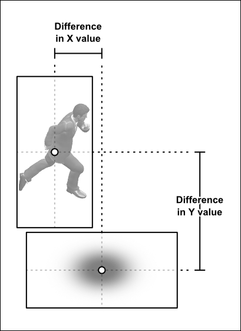
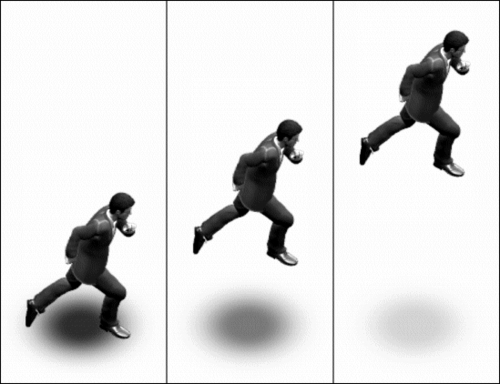
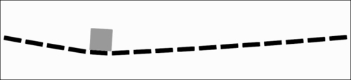

# 第十章：从 AndEngine 获取更多内容

本章将介绍比前几章更具体应用的附加食谱。这些食谱包括：

+   从文件夹加载所有纹理

+   使用纹理网格

+   应用基于精灵的阴影

+   创建基于物理的移动平台

+   创建基于物理的绳索桥梁

# 从文件夹加载所有纹理

当创建一个包含大量纹理的游戏时，逐个加载每个纹理可能会变得繁琐。在这种游戏中创建加载和检索纹理的方法不仅可以节省开发时间，还可以减少运行时的整体加载时间。在本食谱中，我们将创建一种使用单行代码加载大量纹理的方法。

## 准备就绪...

首先，创建一个名为`TextureFolderLoadingActivity`的新活动类，继承自`BaseGameActivity`类。接下来，在`assets/gfx/`文件夹中创建一个名为`FolderToLoad`的文件夹。最后，将五张图片放入`assets/gfx/FolderToLoad/`文件夹中，分别命名为：`Coin1`、`Coin5`、`Coin10`、`Coin50`和`Coin100`。

## 如何操作...

按照以下步骤填写我们的`TextureFolderLoadingActivity`活动类：

1.  在我们的活动中放置以下简单的代码使其功能化：

    ```kt
    @Override
    public EngineOptions onCreateEngineOptions() {
      return new EngineOptions(true,
        ScreenOrientation.LANDSCAPE_SENSOR, 
        new FillResolutionPolicy(), 
        new Camera(0, 0, 800, 480))
        .setWakeLockOptions(WakeLockOptions.SCREEN_ON);
    }
    @Override
    public void onCreateResources(OnCreateResourcesCallback
        pOnCreateResourcesCallback) {
      pOnCreateResourcesCallback.onCreateResourcesFinished();
    }
    @Override
    public void onCreateScene(OnCreateSceneCallback 
        pOnCreateSceneCallback) {
      Scene mScene = new Scene();
      mScene.setBackground(new Background(0.9f,0.9f,0.9f));
      pOnCreateSceneCallback.onCreateSceneFinished(mScene);
    }
    @Override
    public void onPopulateScene(Scene pScene, 
        OnPopulateSceneCallback pOnPopulateSceneCallback) {
      pOnPopulateSceneCallback.onPopulateSceneFinished();
    }
    ```

1.  接下来，将这个`ArrayList`变量和`ManagedStandardTexture`类放在活动内：

    ```kt
    public final ArrayList<ManagedStandardTexture> loadedTextures = 
      new ArrayList<ManagedStandardTexture>();
    public class ManagedStandardTexture {
      public ITextureRegion textureRegion;
      public String name;
      public ManagedStandardTexture(String pName, 
          final ITextureRegion pTextureRegion) {
        name = pName;
        textureRegion = pTextureRegion;
      }
      public void removeFromMemory() {
        loadedTextures.remove(this);
        textureRegion.getTexture().unload();
        textureRegion = null;
        name = null;
      }
    }
    ```

1.  然后，将下面两个方法添加到活动类中，以便我们通过只传递`TextureOptions`参数和文件名来加载纹理：

    ```kt
    public ITextureRegion getTextureRegion(TextureOptions 
          pTextureOptions, String pFilename) {
      loadAndManageTextureRegion(pTextureOptions,pFilename);
      return loadedTextures.get(
        loadedTextures.size()-1).textureRegion;
    }
    public void loadAndManageTextureRegion(TextureOptions 
          pTextureOptions, String pFilename) {
      AssetBitmapTextureAtlasSource cSource = 
        AssetBitmapTextureAtlasSource.create(
        this.getAssets(), pFilename);  
      BitmapTextureAtlas TextureToLoad = 
        new BitmapTextureAtlas(mEngine.getTextureManager(), 
          cSource.getTextureWidth(), 
          cSource.getTextureHeight(), 
          pTextureOptions);
      TextureRegion TextureRegionToLoad = 
        BitmapTextureAtlasTextureRegionFactory.
          createFromAsset(TextureToLoad, this, 
            pFilename, 0, 0);     
      TextureToLoad.load();
      loadedTextures.add(new ManagedStandardTexture(
        pFilename.substring(
          pFilename.lastIndexOf("/")+1, 
          pFilename.lastIndexOf(".")),
        TextureRegionToLoad));
    }
    ```

1.  现在，插入以下方法，允许我们加载单个或多个文件夹内的所有纹理：

    ```kt
    public void loadAllTextureRegionsInFolders(TextureOptions 
        pTextureOptions, String... pFolderPaths) {
      String[] listFileNames;
      String curFilePath;
      String curFileExtension;
      for (int i = 0; i < pFolderPaths.length; i++)
        try {
          listFileNames = this.getAssets().
            list(pFolderPaths[i].substring(0, 
            pFolderPaths[i].lastIndexOf("/")));
          for (String fileName : listFileNames) {
            curFilePath = 
              pFolderPaths[i].concat(fileName);
            curFileExtension = 
              curFilePath.substring(
              curFilePath.lastIndexOf("."));
            if(curFileExtension.
              equalsIgnoreCase(".png")
              || curFileExtension.
              equalsIgnoreCase(".bmp")
              || curFileExtension.
              equalsIgnoreCase(".jpg"))
              loadAndManageTextureRegion(
                pTextureOptions, 
                curFilePath);
          }
        } catch (IOException e) {
          System.out.print("Failed to load textures
            from folder!");
          e.printStackTrace();
          return;
        }
    }
    ```

1.  接着，将以下方法放入活动中，让我们可以卸载所有的`ManagedStandardTexture`类或通过其短文件名检索纹理：

    ```kt
    public void unloadAllTextures() {
      for(ManagedStandardTexture curTex : loadedTextures) {
        curTex.removeFromMemory();
        curTex=null;
        loadedTextures.remove(curTex);
      }
      System.gc();
    }

    public ITextureRegion getLoadedTextureRegion(String pName) {
      for(ManagedStandardTexture curTex : loadedTextures)
        if(curTex.name.equalsIgnoreCase(pName))
          return curTex.textureRegion;
      return null;
    }
    ```

1.  既然我们的活动类中已经有了所有方法，请在`onCreateResources()`方法中放置以下代码行：

    ```kt
    this.loadAllTextureRegionsInFolders(TextureOptions.BILINEAR, "gfx/FolderToLoad/");
    ```

1.  最后，在`onPopulateScene()`方法中添加以下代码，以展示我们如何通过名称检索已加载的纹理：

    ```kt
    pScene.attachChild(new Sprite(144f, 240f, 
      getLoadedTextureRegion("Coin1"), 
      this.getVertexBufferObjectManager()));
    pScene.attachChild(new Sprite(272f, 240f, 
      getLoadedTextureRegion("Coin5"), 
      this.getVertexBufferObjectManager()));
    pScene.attachChild(new Sprite(400f, 240f, 
      getLoadedTextureRegion("Coin10"), 
      this.getVertexBufferObjectManager()));
    pScene.attachChild(new Sprite(528f, 240f, 
      getLoadedTextureRegion("Coin50"), 
      this.getVertexBufferObjectManager()));
    pScene.attachChild(new Sprite(656f, 240f, 
      getLoadedTextureRegion("Coin100"), 
      this.getVertexBufferObjectManager()));
    ```

## 工作原理...

在第一步中，我们通过实现大多数 AndEngine 游戏使用的标准覆盖`BaseGameActivity`方法来设置我们的`TextureFolderLoadingActivity`活动类。有关为 AndEngine 设置活动更多信息，请参见第一章中的*了解生命周期*食谱，*AndEngine 游戏结构*。

在第二步中，我们创建一个`ManagedStandardTexture`对象的`ArrayList`变量，这个定义紧跟在`ArrayList`变量的定义之后。`ManagedStandardTextures`是简单的容器，它持有一个指向`ITextureRegion`区域的指针和一个表示`ITextureRegion`对象名称的字符串变量。`ManagedStandardTexture`类还包括一个卸载`ITextureRegion`的方法，并准备在下次垃圾收集时从内存中移除这些变量。

第三步包括两个方法，`getTextureRegion()`和`loadAndManageTextureRegion()`：

+   `getTextureRegion()`方法调用了`loadAndManageTextureRegion()`方法，并从第二步中定义的名为`loadedTextures`的`ArrayList`变量返回最近加载的纹理。

+   `loadAndManageTextureRegion()`方法创建了一个名为`cSource`的`AssetBitmapTextureAtlasSource`源，它仅用于在以下`BitmapTextureAtlas`对象`TextureToLoad`的定义中传递纹理的宽度和高度。

`TextureRegion`对象`TextureRegionToLoad`是通过调用`BitmapTextureAtlasTextureRegionFactory`对象的`createFromAsset()`方法创建的。然后加载`TextureToLoad`，并通过创建一个新的`ManagedStandardTexture`类，将`TextureRegionToLoad`对象添加到`loadedTextures` `ArrayList`变量中。有关纹理的更多信息，请参见第一章中的*不同类型的纹理*食谱，*AndEngine 游戏结构*。

在第四步中，我们创建了一个方法，该方法解析通过`pFolderPaths`数组传递的每个文件夹中的文件列表，并使用`TextureOptions`参数将图像文件加载为纹理。`listFileNames`字符串数组保存了`pFolderPaths`文件夹中每个文件夹的文件列表，`curFilePath`和`curFileExtension`变量用于存储文件路径及其相对扩展名，以便确定哪些文件是 AndEngine 支持的图像。第一个`for`循环简单地对每个给定的文件夹路径执行解析和加载过程。`getAssets().list()`方法抛出`IOException`异常，因此需要将其包含在`try-catch`块中。它用于获取通过传递的`String`参数中的所有文件列表。第二个`for`循环将`curFilePath`设置为当前`i`值的文件夹路径与`listFileNames`数组中的当前文件名拼接而成。接下来，`curFileExtension`字符串变量被设置为`curFilePath`变量的最后一个"。"索引，以返回扩展名，使用`substring()`方法。然后，我们检查以确保当前文件的扩展名等于 AndEngine 支持的扩展名，并在为`true`时调用`loadAndManageTextureRegion()`方法。最后，我们通过向日志发送消息并打印来自`IOException`异常的`StackTrace`消息来捕获`IOException`异常。

第五步包括两个方法，`unloadAllTextures()`和`getLoadedTextureRegion()`，它们协助我们管理通过我们之前的方法加载的纹理：

+   `unloadAllTextures()`方法遍历`loadedTextures` `ArrayList`对象中的所有`ManagedStandardTextures`，并使用`removeFromMemory()`方法卸载它们，在从`loadedTextures`中移除它们并请求系统进行垃圾回收之前。

+   `getLoadedTextureRegion()`方法检查`loadedTextures`变量中的每个`ManagedStandardTexture`，与`pName`字符串参数进行对比，如果名称相等，则返回当前`ManagedStandardTexture`类的`ITextureRegion`区域，否则如果没有匹配，则返回`null`。

第六步通过传递一个`BILINEAR` `TextureOption`参数和我们的`FolderToLoad`文件夹的资产文件夹路径，从`onCreateResources()`活动方法内部调用`loadAllTextureRegionsInFolders()`方法。有关`TextureOptions`的更多信息，请参见第一章，*AndEngine 游戏结构*中的*向我们的纹理应用选项*食谱。

在最后一步中，我们在`onPopulateScene()`活动方法内部将五个精灵附加到我们的场景中。每个精灵构造函数都调用`getLoadedTextureRegion()`方法，并传递精灵图像文件的相应简称。每个精灵的位置将它们放置在屏幕上的一条水平线上。一次性加载纹理的精灵显示应类似于以下图像。有关创建精灵的更多信息，请参见第二章，*使用实体*中的*向层中添加精灵*食谱。


## 另请参阅

+   在第一章，*AndEngine 游戏结构*中的*理解生命周期*。

+   在第一章，*AndEngine 游戏结构*中的*不同类型的纹理*。

+   在第一章，*AndEngine 游戏结构*中的*向我们的纹理应用选项*。

+   在第二章，*使用实体*中的*向层中添加精灵*。

# 使用纹理网格

**纹理网格**，即简单应用了纹理的三角剖分多边形，在移动游戏中越来越受欢迎，因为它们允许创建和非矩形形状的操作。具有处理纹理网格的能力通常创建了一个额外的游戏机制层，这些机制以前实现起来成本过高。在本食谱中，我们将学习如何从一组预定的三角形创建纹理网格。

## 准备就绪...

首先，创建一个名为`TexturedMeshActivity`的新活动类，继承自`BaseGameActivity`。接下来，将一个名为`dirt.png`的无缝拼接纹理，尺寸为 512 x 128，放在我们项目的`assets/gfx/`文件夹中。最后，将代码包中的`TexturedMesh.java`类导入到我们的项目中。

## 如何操作...

按照以下步骤构建我们的`TexturedMeshActivity`活动类：

1.  在我们的活动中放置以下代码，以获得一个标准的 AndEngine 活动：

    ```kt
    @Override
    public EngineOptions onCreateEngineOptions() {
      return new EngineOptions(true,
        ScreenOrientation.LANDSCAPE_SENSOR, 
        new FillResolutionPolicy(), 
        new Camera(0, 0, 800, 480))
        .setWakeLockOptions(WakeLockOptions.SCREEN_ON);
    }
    @Override
    public void onCreateResources(OnCreateResourcesCallback
        pOnCreateResourcesCallback) {
      pOnCreateResourcesCallback.onCreateResourcesFinished();
    }
    @Override
    public void onCreateScene(OnCreateSceneCallback 
        pOnCreateSceneCallback) {
      Scene mScene = new Scene();
      mScene.setBackground(new Background(0.9f,0.9f,0.9f));
      pOnCreateSceneCallback.onCreateSceneFinished(mScene);
    }
    @Override
    public void onPopulateScene(Scene pScene, 
        OnPopulateSceneCallback pOnPopulateSceneCallback) {
      pOnPopulateSceneCallback.onPopulateSceneFinished();
    }
    ```

1.  在`onPopulateScene()`方法中添加以下代码片段：

    ```kt
    BitmapTextureAtlas texturedMeshT = new BitmapTextureAtlas(
      this.getTextureManager(), 512, 128, 
      TextureOptions.REPEATING_BILINEAR);
    ITextureRegion texturedMeshTR = 
      BitmapTextureAtlasTextureRegionFactory.
      createFromAsset(texturedMeshT, this, "gfx/dirt.png", 0, 0);
    texturedMeshT.load();
    float[] meshTriangleVertices = {
        24.633111f,37.7835047f,-0.00898f,113.0324447f,
        -24.610162f,37.7835047f,0.00387f,-37.7900953f,
        -103.56176f,37.7901047f,103.56176f,37.7795047f,
        0.00387f,-37.7900953f,-39.814736f,-8.7311953f,
        -64.007044f,-83.9561953f,64.00771f,-83.9621953f,
        39.862562f,-8.7038953f,0.00387f,-37.7900953f};
    float[] meshBufferData = new float[TexturedMesh.VERTEX_SIZE * 
      (meshTriangleVertices.length/2)];
    for( int i = 0; i < meshTriangleVertices.length/2; i++) {
      meshBufferData[(i * TexturedMesh.VERTEX_SIZE) + 
        TexturedMesh.VERTEX_INDEX_X] = 
        meshTriangleVertices[i*2];
      meshBufferData[(i * TexturedMesh.VERTEX_SIZE) + 
        TexturedMesh.VERTEX_INDEX_Y] = 
        meshTriangleVertices[i*2+1];
    }
    TexturedMesh starTexturedMesh = new TexturedMesh(400f, 225f, 
      meshBufferData, 12, DrawMode.TRIANGLES, texturedMeshTR, 
      this.getVertexBufferObjectManager());
    pScene.attachChild(starTexturedMesh);
    ```

## 工作原理...

在第一步中，我们准备`TexturedMeshActivity`类，通过插入大多数 AndEngine 游戏使用的标准的重写`BaseGameActivity`方法。有关使用 AndEngine 设置活动的更多信息，请参见第一章，*Understanding the life cycle*部分。

在第二步中，我们首先定义了`texturedMeshT`，这是一个`BitmapTextureAtlas`对象，构造函数的最后一个参数是`REPEATING_BILINEAR` `TextureOption`，用于创建一个在构成我们纹理网格的三角形中无缝平铺的纹理。有关`TextureOptions`的更多信息，请参见第一章，*Applying options to our textures*部分。

创建了`texturedMeshTR` `ITextureRegion`对象并加载了我们的`texturedMeshT`对象之后，我们定义了一个浮点数数组，用于指定构成我们纹理网格的每个三角形的每个顶点的相对连续的 x 和 y 位置。以下图片将更好地展示如何在纹理网格中使用三角形的顶点：


接下来，我们创建`meshBufferData`浮点数组，并将其大小设置为`TexturedMesh`类的顶点大小乘以`meshTriangleVertices`数组中的顶点数——一个顶点在数组中占用两个索引，`X`和`Y`，因此我们必须将长度除以`2`。然后，对于`meshTriangleVertices`数组中的每个顶点，我们将顶点的位置应用到`meshBufferData`数组中。最后，我们创建名为`starTexturedMesh`的`TexturedMesh`对象。`TexturedMesh`构造函数的参数如下：

+   构造函数的前两个参数是`400f`，`225f`的 x 和 y 位置。

+   接下来的两个参数是`meshBufferData`缓冲数据和我们在`meshBufferData`数组中放置的顶点数，`12`。

+   `TexturedMesh`构造函数的最后三个参数是`Triangles`的`DrawMode`、网格的`ITextureRegion`和我们`VertexBufferObjectManager`对象。

有关创建`Meshes`的更多信息，从中派生出`TexturedMesh`类，请参见第二章，*Applying primitives to a layer*部分。

## 参见以下内容

+   在第一章，*AndEngine 游戏结构*中，了解生命周期，即*Understanding the life cycle*。

+   在第一章，*AndEngine 游戏结构*中，我们讨论了如何将选项应用到我们的纹理中，即*Applying options to our textures*。

+   在第二章，*Working with Entities*中，我们讨论了如何将图元应用到图层，即*Applying primitives to a layer*。

# 应用基于精灵的阴影

在游戏中添加阴影可以增加视觉深度，使游戏更具吸引力。简单地在对象下方放置一个带有阴影纹理的精灵是一种快速有效的处理阴影创建的方法。在本章中，我们将学习如何保持阴影与其父对象正确对齐的同时完成这一工作。

## 准备就绪...

首先，创建一个名为`SpriteShadowActivity`的新活动类，该类继承自`BaseGameActivity`并实现`IOnSceneTouchListener`。接下来，将大小为 256 x 128 且名为`shadow.png`的阴影图像放入`assets/gfx/`文件夹中。最后，将大小为 128 x 256 且名为`character.png`的角色图像放入`assets/gfx/`文件夹中。

## 如何操作...

按照以下步骤构建我们的`SpriteShadowActivity`活动类：

1.  在我们的活动类中放入以下标准的 AndEngine 活动代码：

    ```kt
    @Override
    public EngineOptions onCreateEngineOptions() {
      EngineOptions engineOptions = new EngineOptions(true, 
        ScreenOrientation.LANDSCAPE_SENSOR, 
        new FillResolutionPolicy(), 
        new Camera(0, 0, 800, 480))
        .setWakeLockOptions(WakeLockOptions.SCREEN_ON);
      engineOptions.getRenderOptions().setDithering(true);
      return engineOptions;
    }
    @Override
    public void onCreateResources(OnCreateResourcesCallback 
        pOnCreateResourcesCallback) {
      pOnCreateResourcesCallback.onCreateResourcesFinished();
    }
    @Override
    public void onCreateScene(OnCreateSceneCallback 
        pOnCreateSceneCallback) {
      Scene mScene = new Scene();
      mScene.setBackground(new Background(0.8f,0.8f,0.8f));
      pOnCreateSceneCallback.onCreateSceneFinished(mScene);
    }
    @Override
    public void onPopulateScene(Scene pScene, OnPopulateSceneCallback 
        pOnPopulateSceneCallback) {
      pScene.setOnSceneTouchListener(this);
      pOnPopulateSceneCallback.onPopulateSceneFinished();
    }
    @Override
    public boolean onSceneTouchEvent(Scene pScene, 
        TouchEvent pSceneTouchEvent) {
      return true;
    }
    ```

1.  接下来，在我们的活动中放置这些变量，以便我们具体控制阴影：

    ```kt
    Static final float CHARACTER_START_X = 400f;
    static final float CHARACTER_START_Y = 128f;
    static final float SHADOW_OFFSET_X = 0f;
    static final float SHADOW_OFFSET_Y = -64f;
    static final float SHADOW_MAX_ALPHA = 0.75f;
    static final float SHADOW_MIN_ALPHA = 0.1f;
    static final float SHADOW_MAX_ALPHA_HEIGHT = 200f;
    static final float SHADOW_MIN_ALPHA_HEIGHT = 0f;
    static final float SHADOW_START_X = CHARACTER_START_X + SHADOW_OFFSET_X;
    static final float SHADOW_START_Y = CHARACTER_START_Y + SHADOW_OFFSET_Y;
    static final float CHARACTER_SHADOW_Y_DIFFERENCE = 
      CHARACTER_START_Y - SHADOW_START_Y;
    static final float SHADOW_ALPHA_HEIGHT_DIFFERENCE = 
      SHADOW_MAX_ALPHA_HEIGHT - SHADOW_MIN_ALPHA_HEIGHT;
    static final float SHADOW_ALPHA_DIFFERENCE = 
      SHADOW_MAX_ALPHA - SHADOW_MIN_ALPHA;
    Sprite shadowSprite;
    Sprite characterSprite;
    ```

1.  现在，将以下方法放入我们的活动中，使阴影的 alpha 值与角色与阴影的距离成反比：

    ```kt
    public void updateShadowAlpha() {
      shadowSprite.setAlpha(MathUtils.bringToBounds(
        SHADOW_MIN_ALPHA, SHADOW_MAX_ALPHA, 
        SHADOW_MAX_ALPHA - ((((characterSprite.getY()-
        CHARACTER_SHADOW_Y_DIFFERENCE)-SHADOW_START_Y) / 
        SHADOW_ALPHA_HEIGHT_DIFFERENCE) * 
        SHADOW_ALPHA_DIFFERENCE)));
    }
    ```

1.  在`onSceneTouchEvent()`方法中插入以下代码片段：

    ```kt
    if(pSceneTouchEvent.isActionDown() || 
        pSceneTouchEvent.isActionMove()) {
      characterSprite.setPosition(
        pSceneTouchEvent.getX(), 
        Math.max(pSceneTouchEvent.getY(), 
          CHARACTER_START_Y));
    }
    ```

1.  最后，用以下代码片段填充`onPopulateScene()`方法：

    ```kt
    BitmapTextureAtlas characterTexture = 
      new BitmapTextureAtlas(this.getTextureManager(), 128, 256, 
        TextureOptions.BILINEAR);
    TextureRegion characterTextureRegion = 
      BitmapTextureAtlasTextureRegionFactory.createFromAsset(
        characterTexture, this, "gfx/character.png", 0, 0);
    characterTexture.load();
    BitmapTextureAtlas shadowTexture = 
      new BitmapTextureAtlas(this.getTextureManager(), 256, 128, 
        TextureOptions.BILINEAR);
    TextureRegion shadowTextureRegion = 
      BitmapTextureAtlasTextureRegionFactory.createFromAsset(
        shadowTexture, this, "gfx/shadow.png", 0, 0);
    shadowTexture.load();
    shadowSprite = new Sprite(SHADOW_START_X, SHADOW_START_Y, 
      shadowTextureRegion,this.getVertexBufferObjectManager());
    characterSprite = new Sprite(CHARACTER_START_X, CHARACTER_START_Y, 
      characterTextureRegion,this.getVertexBufferObjectManager()) 
      {
      @Override
      public void setPosition(final float pX, final float pY) {
        super.setPosition(pX, pY);
        shadowSprite.setPosition(
          pX + SHADOW_OFFSET_X, shadowSprite.getY());
        updateShadowAlpha();
      }
    };
    pScene.attachChild(shadowSprite);
    pScene.attachChild(characterSprite);
    updateShadowAlpha();
    ```

## 它是如何工作的...

在第一步中，我们通过实现大多数 AndEngine 游戏使用的标准覆盖`BaseGameActivity`方法来设置我们的`SpriteShadowActivity`活动类。有关使用 AndEngine 设置活动的更多信息，请参见第一章中的*了解生命周期*部分，*AndEngine 游戏结构*。

下图展示了这个方法是如何将我们的阴影精灵放置在角色精灵的关系位置上的：



在第二步中，我们定义了几个常量，这些常量将控制阴影精灵`shadowSprite`与角色精灵`characterSprite`的对齐方式：

+   前两个常量`CHARACTER_START_X`和`CHARACTER_START_Y`设置了`characterSprite`的初始位置。

+   接下来的两个常量`SHADOW_OFFSET_X`和`SHADOW_OFFSET_Y`控制了阴影与角色精灵在 x 和 y 轴上的初始位置距离。

+   `SHADOW_OFFSET_X`常量也用于在移动角色精灵时更新阴影精灵的位置。

接下来的四个常量控制了`shadowSprite`精灵的 alpha 值如何被控制以及控制到什么程度：

+   `SHADOW_MAX_ALPHA`和`SHADOW_MIN_ALPHA`设置了 alpha 值的绝对最大和最小值，这会根据角色与阴影在 y 轴上的距离而改变。距离越远，`shadowSprite`的 alpha 值越低，直至达到最低水平。

+   `SHADOW_MAX_ALPHA_HEIGHT`常量表示角色与阴影的距离在影响`shadowSprite`的 alpha 值之前，可以达到的最大距离，之后默认为`SHADOW_MIN_ALPHA`。

+   `SHADOW_MIN_ALPHA_HEIGHT` 常量表示角色距离阴影的最小距离，该距离会影响阴影的透明度变化。如果 `SHADOW_MIN_ALPHA_HEIGHT` 大于 `0`，当角色距离阴影低于 `SHADOW_MIN_ALPHA_HEIGHT` 时，阴影的透明度将处于最大值。

剩余的常量会从之前的集合中自动计算得出。`SHADOW_START_X` 和 `SHADOW_START_Y` 代表 `shadowSprite` 图像的起始位置。它们是通过将阴影的偏移值加到角色的起始位置来计算的。`CHARACTER_SHADOW_Y_DIFFERENCE` 常量表示角色与阴影在 y 轴上的初始起始距离。`SHADOW_ALPHA_HEIGHT_DIFFERENCE` 常量表示最小高度和最大高度之间的差，用于在运行时调节阴影的透明度。最后的常量 `SHADOW_ALPHA_DIFFERENCE` 表示 `shadowSprite` 图像的最小和最大透明度水平之间的差。与 `SHADOW_ALPHA_HEIGHT_DIFFERENCE` 常量类似，它在运行时用于确定阴影的透明度水平。

在第二步中的最后两个变量 `shadowSprite` 和 `characterSprite` 分别代表我们场景中的阴影和角色。

在第三步中，我们创建一个方法来更新阴影的透明度。我们调用 `shadowSprite.setAlpha()` 方法，并以 `MathUtils.bringToBounds()` 方法作为参数。`MathUtils.bringToBounds()` 方法接受一个最小值和最大值，确保第三个值在这个范围内。我们将 `SHADOW_MIN_ALPHA` 和 `SHADOW_MAX_ALPHA` 常量作为 `bringToBounds()` 方法的头两个参数传递。

第三个参数是基于 `characterSprite` 图像与 `shadowSprite` 图像之间的距离确定阴影透明度的算法。该算法首先从角色的 y 轴位置减去 `CHARACTER_SHADOW_Y_DIFFERENCE` 常量。这为我们提供了当前影响阴影透明度的 y 值的上限。接下来，我们从 y 轴上的阴影起始位置减去该值，以得到当前角色与阴影的理想距离。然后，我们将该距离除以 `SHADOW_ALPHA_HEIGHT_DIFFERENCE`，以得到约束距离到透明度的单位比率，并将该比率乘以 `SHADOW_ALPHA_DIFFERENCE` 常量，以得到约束距离到约束透明度的单位比率。目前，我们的比率是倒置的，随着距离的增加会提高透明度，这与我们随着角色移动更远而降低透明度的目标相反，因此我们从 `SHADOW_MAX_ALPHA` 常量中减去它，以得到随着距离增加而降低透明度的正确比率。完成算法后，我们使用 `bringToBounds()` 方法确保算法产生的透明度值被限制在 `SHADOW_MIN_ALPHA` 到 `SHADOW_MAX_ALPHA` 的范围内。

第四步通过检查触摸事件的 `isActionDown()` 和 `isActionMove()` 属性，设置在屏幕首次触摸或触摸移动时 `characterSprite` 精灵的位置。在这种情况下，`setPosition()` 方法简单地将 x 值设置为触摸的 x 值，将 y 值设置为触摸的 y 值或角色的起始 y 值，以较大者为准。

在最后一步中，我们加载 `TextureRegions`、`characterTextureRegion` 和 `shadowTextureRegion` 对象，用于角色和阴影。关于 `TextureRegions` 的更多信息，请参见第一章，*AndEngine 游戏结构*中的*不同类型的纹理*食谱。然后，我们使用它们的起始常量作为构造函数中的位置创建 `shadowSprite` 和 `characterSprite` 精灵。对于 `characterSprite`，我们重写 `setPosition()` 方法，也设置偏移 x 后的 `shadowSprite` 精灵的位置，然后调用 `updateShadowAlpha()` 方法，以在角色移动后为阴影设置适当的 alpha 值。最后，我们将 `shadowSprite` 和 `characterSprite` 精灵附加到我们的场景中，并调用 `updateShadowAlpha()` 方法设置阴影的初始 alpha 值。以下图片显示了阴影的 alpha 级别如何相对于角色距离的变化而改变：



## 另请参阅

+   在第一章，*AndEngine 游戏结构*中了解*生命周期*。

+   在第一章，*AndEngine 游戏结构*中了解*不同类型的纹理*。

# 创建基于物理的移动平台

大多数平台风格的游戏都有某种移动平台，这挑战玩家以准确的时机着陆。从开发者的角度来看，平台只是一个从一处移动到另一处的物理启用的物体。在本教程中，我们将了解如何创建一个水平移动的平台。

## 准备就绪...

创建一个名为 `MovingPhysicsPlatformActivity` 的新活动类，该类继承自 `BaseGameActivity`。

## 如何操作...

按照以下步骤构建我们的 `MovingPhysicsPlatformActivity` 活动类：

1.  在我们的活动中插入以下代码段以使其功能正常：

    ```kt
    @Override
    public Engine onCreateEngine(final EngineOptions pEngineOptions) {
      return new FixedStepEngine(pEngineOptions, 60);
    }
    @Override
    public EngineOptions onCreateEngineOptions() {
      return new EngineOptions(true, 
        ScreenOrientation.LANDSCAPE_SENSOR, 
        new FillResolutionPolicy(), 
        new Camera(0, 0, 800, 480)
        ).setWakeLockOptions(WakeLockOptions.SCREEN_ON);
    }
    @Override
    public void onCreateResources(OnCreateResourcesCallback 
        pOnCreateResourcesCallback) {
      pOnCreateResourcesCallback.onCreateResourcesFinished();
    }
    @Override
    public void onCreateScene(OnCreateSceneCallback 
        pOnCreateSceneCallback) {
      Scene mScene = new Scene();
      mScene.setBackground(new Background(0.9f,0.9f,0.9f));
      pOnCreateSceneCallback.onCreateSceneFinished(mScene);
    }
    @Override
    public void onPopulateScene(Scene pScene, OnPopulateSceneCallback 
        pOnPopulateSceneCallback) {
      pOnPopulateSceneCallback.onPopulateSceneFinished();
    }
    ```

1.  在 `onPopulateScene()` 方法中添加以下代码段：

    ```kt
    FixedStepPhysicsWorld mPhysicsWorld = 
      new FixedStepPhysicsWorld(60, 
      new Vector2(0,-SensorManager.GRAVITY_EARTH*2f), 
      false, 8, 3); 
    pScene.registerUpdateHandler(mPhysicsWorld);
    Rectangle platformRect = new Rectangle(400f, 200f, 250f, 20f, 
      this.getVertexBufferObjectManager());
    platformRect.setColor(0f, 0f, 0f);
    final FixtureDef platformFixtureDef = 
      PhysicsFactory.createFixtureDef(20f, 0f, 1f);
    final Body platformBody = PhysicsFactory.createBoxBody( 
      mPhysicsWorld, platformRect, BodyType.KinematicBody, 
      platformFixtureDef);
    mPhysicsWorld.registerPhysicsConnector(
      new PhysicsConnector(platformRect, platformBody));
    pScene.attachChild(platformRect);
    float platformRelativeMinX = -200f;
    float platformRelativeMaxX = 200f;
    final float platformVelocity = 3f;
    final float platformMinXWorldCoords = 
      (platformRect.getX() + platformRelativeMinX) / 
      PhysicsConstants.PIXEL_TO_METER_RATIO_DEFAULT;
    final float platformMaxXWorldCoords = 
      (platformRect.getX() + platformRelativeMaxX) / 
      PhysicsConstants.PIXEL_TO_METER_RATIO_DEFAULT;
    platformBody.setLinearVelocity(platformVelocity, 0f);
    ```

1.  在 `onPopulateScene()` 方法中的前一行代码下面直接插入以下代码：

    ```kt
    pScene.registerUpdateHandler(new IUpdateHandler() {
      @Override
      public void onUpdate(float pSecondsElapsed) {
        if(platformBody.getWorldCenter().x > 
            platformMaxXWorldCoords) {
          platformBody.setTransform(
            platformMaxXWorldCoords,
            platformBody.getWorldCenter().y,
            platformBody.getAngle());
          platformBody.setLinearVelocity(
            -platformVelocity, 0f);
        } else if(platformBody.getWorldCenter().x < 
            platformMinXWorldCoords) {
          platformBody.setTransform(
            platformMinXWorldCoords,
            platformBody.getWorldCenter().y,
            platformBody.getAngle());
          platformBody.setLinearVelocity(
            platformVelocity, 0f);
        }
      }
      @Override
      public void reset() {}
    });
    ```

1.  在 `onPopulateScene()` 方法中完成我们的活动，通过在前一行代码之后放置以下代码来创建一个在平台上休息的物理启用的盒子：

    ```kt
    Rectangle boxRect = new Rectangle(400f, 240f, 60f, 60f, 
      this.getVertexBufferObjectManager());
    boxRect.setColor(0.2f, 0.2f, 0.2f);
    FixtureDef boxFixtureDef = 
      PhysicsFactory.createFixtureDef(200f, 0f, 1f);
    mPhysicsWorld.registerPhysicsConnector(
      new PhysicsConnector(boxRect,
        PhysicsFactory.createBoxBody( mPhysicsWorld, boxRect, 
        BodyType.DynamicBody, boxFixtureDef)));
    pScene.attachChild(boxRect);
    ```

## 工作原理...

在第一步中，我们准备`MovingPhysicsPlatformActivity`类，通过向其中插入大多数 AndEngine 游戏使用的标准覆盖`BaseGameActivity`方法。关于如何为 AndEngine 设置活动的更多信息，请参见第一章中的*了解生命周期*一节，*AndEngine 游戏结构*。以下图片展示了我们的平台如何在单轴上移动，在本例中是向右移动，同时保持上面的盒子：


在第二步中，我们首先创建一个`FixedStepPhysicsWorld`对象，并将其注册为场景的更新处理器。然后，我们创建一个名为`platformRect`的`Rectangle`对象，它将代表我们的移动平台，并将其放置在屏幕中心附近。接下来，我们使用`setColor()`方法将`platformRect`矩形的颜色设置为黑色，红色、绿色和蓝色的浮点参数值为`0f`。然后，我们为平台创建一个固定装置定义。注意，摩擦力设置为`1f`，以防止物体在平台移动时滑动过多。

接下来，我们为平台创建一个名为`platformBody`的`Body`对象。然后，我们注册一个`PhysicsConnector`类，将`platformRect`矩形连接到`platformBody`对象。将`platformRect`附加到我们的场景后，我们声明并设置将控制移动平台的变量：

+   `platformRelativeMinX`和`platformRelativeMaxX`变量表示平台从其起始位置向左和向右移动的场景单位距离。

+   `platformVelocity`变量表示我们物理平台物体的速度，单位为每秒米。

+   接下来的两个变量`platformMinXWorldCoords`和`platformMaxXWorldCoords`表示`platformRelativeMinX`和`platformRelativeMaxX`变量的绝对位置，并从平台的初始 x 位置按默认的`PIXEL_TO_METER_RATIO_DEFAULT`比例计算得出。

+   最后，我们将`platformBody`的初始速度设置为`platformVelocity`变量，以使物体在场景首次绘制时立即主动移动。关于创建物理模拟的更多信息，请参见第六章中的*Box2D 物理扩展介绍*和*了解不同的物体类型*一节。

第三步，我们向场景注册一个新的`IUpdateHandler`处理器。在`onUpdate()`方法中，我们测试平台的位置是否超出了之前定义的绝对边界`platformMinXWorldCoords`和`platformMaxXWorldCoords`。根据达到的绝对边界，我们将`platformBody`的位置设置到达到的边界，并将其速度设置为远离边界。关于条件更新处理器的更多信息，请参见第七章中的*更新处理器与条件*部分。

在第四步中，我们创建并附加一个盒子物体，使其在平台上休息。关于如何创建具有物理效果的盒子，请参考第六章中的*了解不同的物体类型*部分。

## 另请参阅

+   在第一章中了解*生命周期*。

+   在第六章中查看*Box2D 物理扩展介绍*。

+   在第六章中了解*不同的物体类型*。

+   在第七章中查看*更新处理器与条件*。

# 创建基于物理的绳索桥梁

使用 Box2D 物理扩展，创建复杂的物理效果元素很简单。一个这样的复杂元素例子就是能对碰撞做出反应的绳索桥梁。在本教程中，我们将看到如何实现一个根据特定参数创建绳索桥梁的方法，这些参数控制着桥梁的大小和物理属性。

## 准备工作...

创建一个名为`PhysicsBridgeActivity`的新活动类，该类继承自`BaseGameActivity`。

## 如何操作...

按照以下步骤构建我们的`PhysicsBridgeActivity`活动类：

1.  在我们的活动中放置以下代码，以获得标准的 AndEngine 活动：

    ```kt
    @Override
    public Engine onCreateEngine(final EngineOptions pEngineOptions) {
      return new FixedStepEngine(pEngineOptions, 60);
    }
    @Override
    public EngineOptions onCreateEngineOptions() {
      return new EngineOptions(true, 
        ScreenOrientation.LANDSCAPE_SENSOR,
        new FillResolutionPolicy(), 
        new Camera(0, 0, 800, 480))
        .setWakeLockOptions(WakeLockOptions.SCREEN_ON);
    }
    @Override
    public void onCreateResources(OnCreateResourcesCallback 
        pOnCreateResourcesCallback) {
      pOnCreateResourcesCallback.onCreateResourcesFinished();
    }
    @Override
    public void onCreateScene(OnCreateSceneCallback 
        pOnCreateSceneCallback) {
      Scene mScene = new Scene();
      mScene.setBackground(new Background(0.9f,0.9f,0.9f));
      pOnCreateSceneCallback.onCreateSceneFinished(mScene);
    }
    @Override
    public void onPopulateScene(Scene pScene, OnPopulateSceneCallback 
        pOnPopulateSceneCallback) {
      pOnPopulateSceneCallback.onPopulateSceneFinished();
    }
    ```

1.  接下来，在我们的活动中放置以下不完整的方法。这个方法将有助于我们创建桥梁：

    ```kt
    public void createBridge(Body pGroundBody,
        final float[] pLeftHingeAnchorPoint, 
        final float pRightHingeAnchorPointX, 
        final int pNumSegments, 
        final float pSegmentsWidth, 
        final float pSegmentsHeight,
        final float pSegmentDensity, 
        final float pSegmentElasticity,
        final float pSegmentFriction, 
        IEntity pScene, PhysicsWorld pPhysicsWorld, 
        VertexBufferObjectManager 
          pVertexBufferObjectManager) {
      final Rectangle[] BridgeSegments = 
        new Rectangle[pNumSegments];
      final Body[] BridgeSegmentsBodies = new Body[pNumSegments];
      final FixtureDef BridgeSegmentFixtureDef =
        PhysicsFactory.createFixtureDef(
        pSegmentDensity, pSegmentElasticity, 
        pSegmentFriction);
      final float BridgeWidthConstant = pRightHingeAnchorPointX – 
        pLeftHingeAnchorPoint[0] + pSegmentsWidth;
      final float BridgeSegmentSpacing = (
        BridgeWidthConstant / (pNumSegments+1) – 
        pSegmentsWidth/2f);
      for(int i = 0; i < pNumSegments; i++) {

      }
    }
    ```

1.  在上述`createBridge()`方法中的`for`循环内插入以下代码：

    ```kt
    BridgeSegments[i] = new Rectangle(
      ((BridgeWidthConstant / (pNumSegments+1))*i) + 
        pLeftHingeAnchorPoint[0] + BridgeSegmentSpacing, 
      pLeftHingeAnchorPoint[1]-pSegmentsHeight/2f,
      pSegmentsWidth, pSegmentsHeight, 
      pVertexBufferObjectManager);
    BridgeSegments[i].setColor(0.97f, 0.75f, 0.54f);
    pScene.attachChild(BridgeSegments[i]);
    BridgeSegmentsBodies[i] = PhysicsFactory.createBoxBody(
      pPhysicsWorld, BridgeSegments[i], BodyType.DynamicBody, 
      BridgeSegmentFixtureDef);
    BridgeSegmentsBodies[i].setLinearDamping(1f);
    pPhysicsWorld.registerPhysicsConnector(
      new PhysicsConnector(BridgeSegments[i], 
        BridgeSegmentsBodies[i]));
    final RevoluteJointDef revoluteJointDef = new RevoluteJointDef();
    if(i==0) {
      Vector2 anchorPoint = new Vector2(
        BridgeSegmentsBodies[i].getWorldCenter().x – 
          (BridgeSegmentSpacing/2 + pSegmentsWidth/2)/ 
          PhysicsConstants.PIXEL_TO_METER_RATIO_DEFAULT, 
        BridgeSegmentsBodies[i].getWorldCenter().y);
      revoluteJointDef.initialize(pGroundBody, 
        BridgeSegmentsBodies[i], anchorPoint);
    } else {
      Vector2 anchorPoint = new Vector2(
        (BridgeSegmentsBodies[i].getWorldCenter().x + 
          BridgeSegmentsBodies[i-1]
          .getWorldCenter().x)/2, 
        BridgeSegmentsBodies[i].getWorldCenter().y);
      revoluteJointDef.initialize(BridgeSegmentsBodies[i-1], 
        BridgeSegmentsBodies[i], anchorPoint);
    }
    pPhysicsWorld.createJoint(revoluteJointDef);
    if(i==pNumSegments-1) {
      Vector2 anchorPoint = new Vector2(BridgeSegmentsBodies[i].getWorldCenter().x + (BridgeSegmentSpacing/2 + pSegmentsWidth/2)/PhysicsConstants.PIXEL_TO_METER_RATIO_DEFAULT, BridgeSegmentsBodies[i].getWorldCenter().y);
      revoluteJointDef.initialize(pGroundBody, BridgeSegmentsBodies[i], anchorPoint);
      pPhysicsWorld.createJoint(revoluteJointDef);
    }
    ```

1.  最后，在我们的`onPopulateScene()`方法内添加以下代码：

    ```kt
    final FixedStepPhysicsWorld mPhysicsWorld = new FixedStepPhysicsWorld(60, new Vector2(0,-SensorManager.GRAVITY_EARTH), false, 8, 3);
    pScene.registerUpdateHandler(mPhysicsWorld);

    FixtureDef groundFixtureDef = PhysicsFactory.createFixtureDef(0f, 0f, 0f);
    Body groundBody = PhysicsFactory.createBoxBody(mPhysicsWorld, 0f, 0f, 0f, 0f, BodyType.StaticBody, groundFixtureDef);

    createBridge(groundBody, new float[] {0f,240f}, 800f, 16, 40f, 10f, 4f, 0.1f, 0.5f, pScene, mPhysicsWorld, this.getVertexBufferObjectManager());

    Rectangle boxRect = new Rectangle(100f,400f,50f,50f,this.getVertexBufferObjectManager());
    FixtureDef boxFixtureDef = PhysicsFactory.createFixtureDef(25f, 0.5f, 0.5f);
    mPhysicsWorld.registerPhysicsConnector(new PhysicsConnector(boxRect, PhysicsFactory.createBoxBody(mPhysicsWorld, boxRect, BodyType.DynamicBody, boxFixtureDef)));
    pScene.attachChild(boxRect);
    ```

## 工作原理...

在第一步中，我们通过实现大多数 AndEngine 游戏使用的标准覆盖`BaseGameActivity`方法来设置`PhysicsBridgeActivity`活动类。关于如何为 AndEngine 设置活动，请参考第一章中的*了解生命周期*部分。以下图片展示了我们带有物理效果的桥梁，以及一个带有物理效果的方块在其上休息的样子：



在第二步中，我们实现了一个名为`createBridge()`的方法的开头，该方法将创建具有物理效果的桥。第一个参数`pGroundBody`是桥将附加到的地面`Body`对象。第二个参数`pLeftHingeAnchorPoint`表示桥左上侧的 x 和 y 位置。第三个参数`pRightHingeAnchorPointX`表示桥右侧的 x 位置。接下来的三个参数`pNumSegments`、`pSegmentsWidth`和`pSegmentsHeight`表示桥将由多少个桥段组成以及每个桥段的宽度和高度。`pSegmentDensity`、`pSegmentElasticity`和`pSegmentFriction`参数将直接传递给一个夹具定义，该定义将应用于桥的桥段。有关夹具定义的更多信息，请参见第六章，*物理应用*中的*Box2D 物理扩展介绍*食谱。接下来的两个参数`pScene`和`pPhysicsWorld`告诉我们的方法桥段矩形和桥段实体应该附加到什么上。最后一个参数是我们的`VertexBufferObjectManager`对象，它将被传递给表示我们桥每个段的矩形。

在`createBridge()`方法中定义的前两个变量，`BridgeSegments`和`BridgeSegmentsBodies`，是用于保存桥段矩形和桥段实体的数组。它们的长度由`pNumSegments`参数传递定义。下一个变量，`BridgeSegmentFixtureDef`，是每个桥段将拥有的夹具定义。`BridgeWidthConstant`变量表示桥的宽度，通过计算左侧和右侧锚点加上桥的单个桥段宽度之差得出。最后一个变量，`BridgeSegmentSpacing`，表示每个桥段之间应有的空间，通过将桥的宽度除以桥段数量加一，然后减去桥段半宽度得出。然后我们创建一个`for`循环，该循环将根据`pNumSegments`参数传递的数量创建并定位桥段。

在第三步中，我们填充之前创建的`for`循环。首先，我们创建当前桥段的矩形`BridgeSegments[i]`，它将作为桥段的视觉表示。我们将其放置在 x 轴上，使用`BridgeWidthConstant`变量除以桥段数量加一，然后乘以当前桥段编号，并加上左侧铰链的 x 位置`pLeftHingeAnchorPoint[0]`和桥段之间的间距`BridgeSegmentSpacing`。对于当前桥段矩形的 y 轴位置，我们将其放置在左侧铰链的 y 位置减去桥段高度除以`2f`的位置，使其与铰链位置平齐。

接下来，我们将每个段落的颜色设置为浅橙色，红色`0.97f`，绿色`0.75f`，蓝色`0.54f`。将`Rectangle`对象附加到传递的场景后，通过将段落的矩形和`BodyType`值`Dynamic`传递给标准的`PhysicsFactory.CreateBoxBody()`方法来创建当前段落的刚体。然后，我们将线性阻尼设置为`1f`，以平滑由碰撞引起的节奏性运动。接下来，我们注册一个`PhysicsConnector`类，将当前段落的矩形连接到当前段落的刚体。

既然我们已经为每个段落建立了位置并创建了相应的矩形和刚体，我们创建一个`RevoluteJointDef`对象`revoluteJointDef`，通过旋转关节将每个段落连接到桥梁。我们测试当前段落是否是第一个，如果是，则将段落连接到地面`Body`对象，而不是前一个段落。对于第一个桥梁段落，`Vector2 anchorPoint`的定义将`RevoluteJointDef`定义的锚点放置在段落的 x 值`BridgeSegmentsBodies[i].getWorldCenter().x`减去段落间距`BridgeSegmentSpacing`除以`2`，加上段落宽度`pSegmentsWidth`除以`2`，并缩放到`PIXEL_TO_METER_RATIO_DEFAULT`默认值的位置。第一个段落锚点的 y 位置简单地是当前段落的 y 值`BridgeSegmentsBodies[i].getWorldCenter().y`。对于其余的段落，通过计算当前段落的 x 位置与上一个段落的 x 位置的均值来确定锚点的 x 位置。

然后，使用`initialize()`方法初始化`revoluteJointDef`，第一个刚体设置为地面刚体`pGroundBody`，如果当前段落是第一个；如果不是第一个，则设置为前一段的刚体`BridgeSegmentsBodies[i-1]`。`revoluteJointDef`的第二个刚体设置为当前段落的刚体，并在退出`if`语句后，使用`pPhysicsWorld`对象的`createJoint()`方法创建关节。然后我们测试当前段落是否将是最后一个创建的，如果是，则使用与第一个段落相似的锚点 x 位置公式，在段落的右侧创建另一个旋转关节，将段落连接到地面刚体。有关物理模拟的更多信息，请参见第六章，*物理应用*中的*Box2D 物理扩展介绍*和*了解不同的刚体类型*食谱。

在最后一步中，我们首先在`onPopulateScene()`方法内部创建一个`FixedStepPhysicsWorld`对象，并将其注册为场景的更新处理器。然后，我们创建一个地面物体，我们的桥梁将附着在上面。接下来，我们通过调用`createBridge()`方法来创建桥梁。我们传递`groundBody`作为第一个参数，一个表示屏幕左中部的位置`0f,240f`作为左锚点，以及代表屏幕右侧的 x 位置作为右锚点。然后，我们传递一个整数`16`作为要创建的段数，以及一个段宽和高度为`40f`和`10f`。接下来，我们传递一个段密度`4f`，一个段弹性`0.1f`，一个段摩擦`0.5f`，我们的场景，将段矩形将附着其上，我们的物理世界，以及我们的`VertexBufferObjectManager`对象。现在我们的桥梁已经创建好了，我们创建了一个简单的盒子物体，以显示桥梁能够正确地反应碰撞。

## 另请参阅

+   在第一章，*AndEngine 游戏结构*中了解*生命周期*。

+   在第六章，*应用物理*中介绍*Box2D 物理扩展*。

+   在第六章，*应用物理*中理解*不同的物体类型*。
