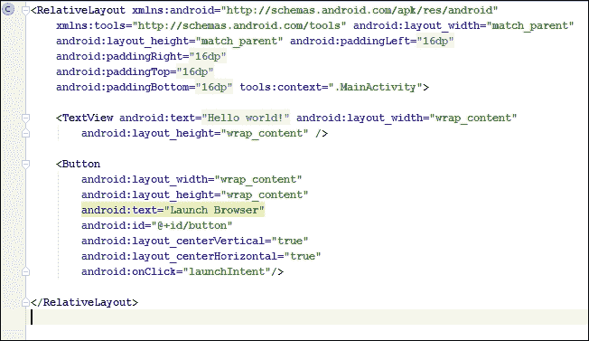
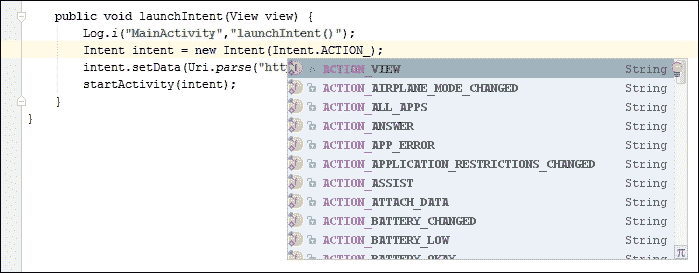
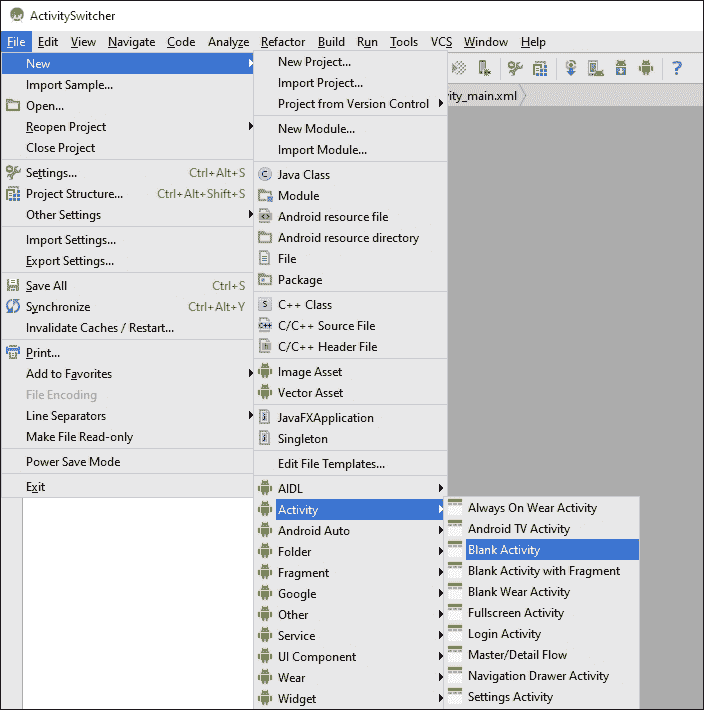
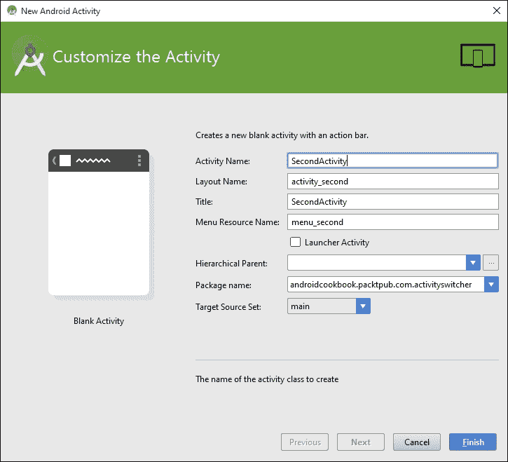
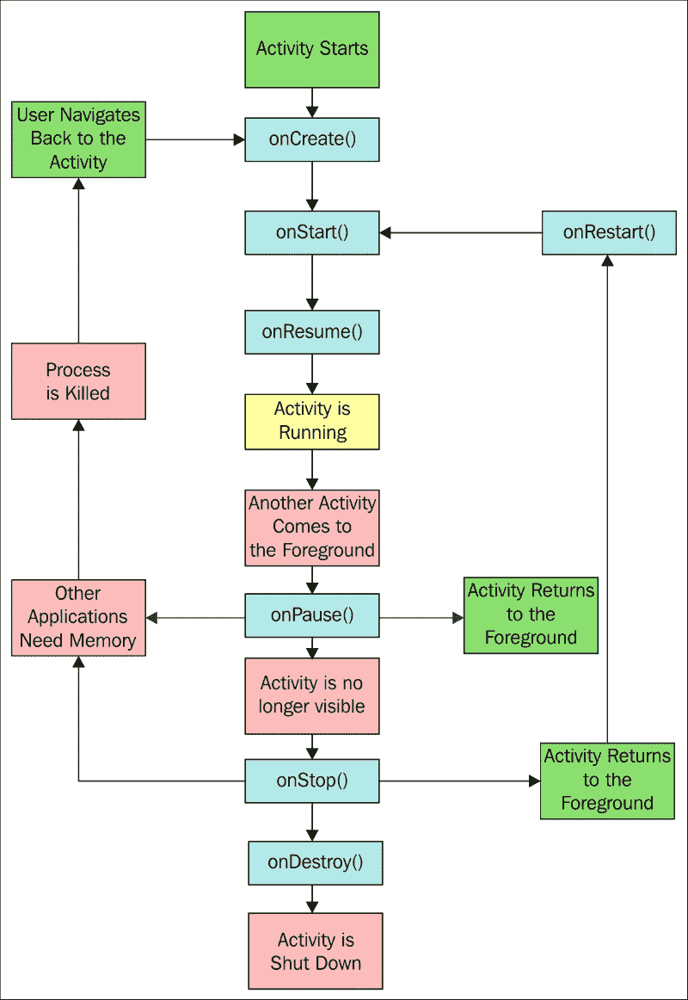

# 第一章：活动

本章节包括以下食谱：

+   声明一个活动

+   使用意图对象启动新活动

+   在活动之间切换

+   向另一个活动传递数据

+   从活动中返回结果

+   保存活动状态

+   存储持久活动数据

+   理解活动生命周期

# 引言

Android SDK 提供了一个强大的工具来编程移动设备，掌握这个工具的最佳方式是直接开始。虽然你可以从头到尾阅读这本书，因为这是一本食谱，但它特别设计成允许你跳转到特定任务并立即获得结果。

**活动**是大多数 Android 应用的基本构建块，因为活动类提供了应用与屏幕之间的接口。大多数 Android 应用至少会有一个活动，如果不是几个（但并非必须）。如果后台服务应用没有用户界面，则不一定需要活动。

本章节解释如何在应用程序中*声明*和*启动*活动，以及如何通过在它们之间共享数据、从它们请求结果和从一个活动内部调用另一个活动来同时管理多个活动。

本章节还简要探讨了通常与活动结合使用的**意图**对象。意图可以用于在您自己的应用程序中的活动之间传输数据，以及在外部应用程序中，如 Android 操作系统（一个常见的例子是使用意图启动默认的网页浏览器）。

### 注意

要开始开发 Android 应用程序，请访问**Android Studio**页面下载新的 Android Studio IDE 和**Android SDK**捆绑包：

[`developer.android.com/sdk/index.html`](http://developer.android.com/sdk/index.html)

# 声明一个活动

活动和其他应用组件，如**服务**，是在`AndroidManifest` XML 文件中声明的。声明活动是我们告诉系统关于我们的活动以及如何请求它的方式。例如，一个应用通常会指出至少有一个活动应该作为桌面图标可见，并作为进入应用的主要入口。

## 准备就绪

Android Studio 是新的用于开发 Android 应用程序的工具，取代了现在已弃用的**Eclipse ADT**解决方案。本书将使用 Android Studio 展示所有食谱，因此如果你还没有安装它，请访问 Android Studio 网站（链接已提供）以安装 IDE 和 SDK 捆绑包。

## 如何操作...

在这个第一个示例中，我们将指导你创建一个新项目。Android Studio 提供了一个**快速入门**向导，使得这个过程非常简单。按照以下步骤开始：

1.  启动 Android Studio，会出现**欢迎使用 Android Studio**对话框。

1.  点击**开始一个新的 Android Studio 项目**选项。

1.  输入应用程序名称；对于此示例，我们使用了`DeclareAnActivity`。点击**下一步**。

1.  在**将活动添加到移动设备**对话框中，点击**空白活动**按钮，然后点击**下一步**。

1.  在**目标 Android 设备**对话框中，选择**Android 6.0（API 23）**作为最低 SDK（对于此示例，你选择哪个 API 级别其实并不重要，因为自从 API 级别 1 以来就已经存在活动，但选择最新版本被认为是最佳实践）。点击**下一步**。

1.  由于我们之前选择了**空白活动**选项，所以会显示**自定义活动**对话框。你可以保留提供的默认设置，但注意默认的活动名称是`MainActivity`。点击**完成**。

完成向导后，Android Studio 将创建项目文件。对于此示例，我们将要检查的两个文件是`MainActivity.java`（对应于第 6 步中提到的活动名称）和`AndroidManifest.xml`。

如果你查看`MainActivity.java`文件，你会发现它非常基础。这是因为我们选择了**空白活动**选项（在第 4 步）。现在看看`AndroidManifest.xml`文件。这里是我们实际声明活动的地方。在`<application>`元素内是`<activity>`元素：

```kt
<activity
    android:name=".MainActivity"
    android:label="@string/app_name">
    <intent-filter>
        <action android:name="android.intent.action.MAIN"/>

        <category android:name="android.intent.category.LAUNCHER"/>
    </intent-filter>
</activity>
```

### 注意

在 Android Studio 中查看此`xml`时，你可能会注意到标签元素显示了`strings.xml`资源文件中定义的实际文本。这是新 IDE 中增强功能的一个小例子。

## 工作原理...

声明一个活动只需简单声明`<activity>`元素，并使用`android:name`属性指定活动类的名称。将`<activity>`元素添加到**Android Manifest**中，我们是在表明意图将此组件包含在应用程序内。任何未在清单中声明的活动（或其他任何组件）都不会被包含在应用程序中。尝试访问或使用未声明的组件将在运行时抛出异常。

在前面的代码中，还有一个属性—`android:label`。此属性表示屏幕上显示的标题以及如果这是启动器活动的话图标标签。

### 注意

要查看可用应用程序属性的全部列表，请查看以下资源：

[`developer.android.com/guide/topics/manifest/activity-element.html`](http://developer.android.com/guide/topics/manifest/activity-element.html)

# 使用意图对象启动新活动

Android 应用程序模型可以看作是一种面向服务的模型，活动作为组件，意图作为它们之间传递的消息。这里，一个意图用于启动显示用户通话记录的活动，但意图可以用作很多事情，我们将在本书中多次遇到它们。

## 准备就绪

为了简化事情，我们将使用一个意图对象来启动 Android 的一个内置应用程序，而不是创建一个新的应用程序。这只需要一个非常基础的应用程序，因此用 Android Studio 启动一个新的 Android 项目，并将其命名为`ActivityStarter`。

## 如何操作...

为了让示例简单，以便我们专注于手头的任务，我们将创建一个函数来展示一个意图操作，并从活动中的按钮调用这个函数。

在 Android Studio 中创建新项目后，请按照以下步骤操作：

1.  打开`MainActivity.java`类，并添加以下函数：

    ```kt
    public void launchIntent(View view) {
        Intent intent = new Intent(Intent.ACTION_VIEW);
        intent.setData(Uri.parse("https://www.packtpub.com/"));
        startActivity(intent);
    }
    ```

    当你输入这段代码时，Android Studio 会对 View 和意图给出这个警告：**无法解析符号'Intent'**。

    这意味着你需要将库引用添加到项目中。你可以通过在`import`部分手动输入以下代码来实现这一点：

    ```kt
    import android.view.View;

    import android.content.Intent;
    ```

    或者，只需点击红色字体的文字，按*Alt* + *Enter*，让 Android Studio 为你添加库引用。

1.  打开`activity_main.xml`文件，并添加以下 XML 代码：

    ```kt
    <Button
        android:layout_width="wrap_content"
        android:layout_height="wrap_content"
        android:text="Launch Browser"
        android:id="@+id/button"
        android:layout_centerVertical="true"
        android:layout_centerHorizontal="true"
        android:onClick="launchIntent"/>
    ```

    

1.  现在是运行应用程序并查看意图操作的时候了。你需要创建一个 Android 模拟器（在 Android Studio 中，转到**工具 | Android | AVD 管理器**）或者将一个物理设备连接到你的电脑。

1.  当你按下**启动浏览器**按钮时，你会看到默认的网页浏览器打开，并显示指定的 URL。

## 它是如何工作的...

尽管这个应用很简单，但它展示了 Android 操作系统背后的许多强大功能。意图对象只是一个消息对象。意图可以用于在应用程序的组件之间（如服务和广播接收器）以及与其他设备上的应用程序进行通信（正如本例中所做的那样）。

### 注意

要在物理设备上测试，你可能需要为你的设备安装驱动程序（驱动程序针对硬件制造商是特定的）。你还需要在设备上启用开发者模式。启用开发者模式根据 Android 操作系统版本而有所不同。如果你在设备设置中看不到开发者模式选项，打开**关于手机**选项，并开始点击**构建号**。点击三次后，你应该会看到一个**Toast**消息，告诉你正在成为开发者的路上。再点击四次将启用该选项。

在本例中，我们通过指定`ACTION_VIEW`作为我们想要执行的操作（我们的意图）来创建一个意图对象。你可能已经注意到，当你输入`Intent`然后输入句点时，Android Studio 提供了一个弹出式可能性的列表（这是自动完成功能），如下所示：



`ACTION_VIEW`与数据中的 URL 一起，表示意图是查看网站，因此会启动默认浏览器（不同的数据可能会启动不同的应用）。在这个例子中，我们的意图只是查看 URL，所以我们仅使用`startActivity()`方法调用意图。根据我们的需求，还有其他调用意图的方法。在*从活动中返回结果*的食谱中，我们将使用`startActivityForResult()`方法。

## 还有更多内容...

对于 Android 用户来说，下载他们喜欢的网页浏览、拍照、发短信等应用是非常常见的。使用意图，您可以允许您的应用利用用户喜欢的应用，而不是试图重新发明所有这些功能。

## 另请参阅

若要从菜单选择启动一个活动，请参考第四章中的*处理菜单选择*部分，*菜单*。

# 在活动之间切换

通常我们会在一个活动内部激活另一个活动。尽管这不是一个困难的任务，但它需要比之前的食谱更多的设置，因为它需要两个活动。我们将创建两个活动类，并在清单中声明它们。我们还将创建一个按钮，就像在之前的食谱中所做的那样，以切换到活动。

## 准备工作

我们将在 Android Studio 中创建一个新项目，就像在之前的食谱中所做的那样，并将这个项目命名为`ActivitySwitcher`。Android Studio 将创建第一个活动`ActivityMain`，并在清单中自动声明。

## 如何操作...

1.  由于 Android Studio 新项目向导已经创建了第一个活动，我们只需要创建第二个活动。打开**ActivitySwitcher**项目，并按照此截图所示导航至**文件** | **新建** | **活动** | **空白活动**：

1.  在**自定义活动**对话框中，您可以保留默认的**活动名称**，即`Main2Activity`，或者像这里显示的那样更改为`SecondActivity`：

1.  打开`MainActivity.java`文件，并添加以下函数：

    ```kt
    public void onClickSwitchActivity(View view) {
        Intent intent = new Intent(this, SecondActivity.class);
        startActivity(intent);
    }
    ```

1.  现在，打开位于`\res\layout`文件夹中的`activity_main.xml`文件，并添加以下 XML 代码来创建按钮：

    ```kt
    <Button
        android:id="@+id/button"
        android:layout_width="wrap_content"
        android:layout_height="wrap_content"
        android:layout_centerVertical="true"
        android:layout_centerHorizontal="true"
        android:text="Launch SecondActivity"
        android:onClick="onClickSwitchActivity"/>
    ```

1.  实际上，您现在可以运行代码，并看到第二个活动出现。我们将会更进一步，在`SecondActivity`中添加一个按钮来关闭它，这将带我们回到第一个活动。打开`SecondActivity.java`文件，并添加此函数：

    ```kt
    public void onClickClose(View view) {
        finish();
    }
    ```

1.  最后，在`SecondActivity`布局中添加**关闭**按钮。打开`activity_second.xml`文件，并在自动生成的`<TextView>`元素之后添加以下`<Button>`元素：

    ```kt
    <Button
        android:id="@+id/buttonClose"
        android:layout_width="wrap_content"
        android:layout_height="wrap_content"
        android:text="Close"
        android:layout_centerVertical="true"
        android:layout_centerHorizontal="true"
        android:onClick="onClickClose"/>
    ```

1.  在您的设备或模拟器上运行应用程序，并查看按钮的实际效果。

## 工作原理...

本练习的真正工作在于第 3 步中的 `onClickSwitchActivity()` 方法。在这里，我们使用 `SecondActivity.class` 为意图声明第二个活动。我们通过在第二个活动中添加关闭按钮，展示了常见的实际场景——启动一个新活动，然后关闭它，并返回到原始调用活动。这种行为是在 `onClickClose()` 函数中实现的。它所做的只是调用 `finish()`，但这告诉系统我们已经完成了活动。实际上，`finish()` 并没有返回到调用活动或任何特定的活动；它只是关闭当前活动并依赖于**回退栈**。如果我们想要一个特定的活动，可以再次使用意图对象（在创建意图时只需更改类名）。

这种活动切换并不能构成一个令人兴奋的应用程序。我们的活动除了演示如何从一个活动切换到另一个活动之外，什么也不做，这当然将成为我们开发几乎所有应用程序的基本方面。

如果我们手动创建活动，我们需要将它们添加到清单中。通过使用这些步骤，Android Studio 已经处理了 XML。要查看 Android Studio 的操作，请打开 `AndroidManifest.xml` 文件并查看 `<application>` 元素：

```kt
<activity
    android:name=".MainActivity"
    android:label="@string/app_name">
    <intent-filter>
        <action android:name="android.intent.action.MAIN"/>
        <category android:name="android.intent.category.LAUNCHER/>
    </intent-filter>
</activity>
<activity
    android:name=".SecondActivity"
    android:label="@string/title_activity_second">
</activity>
```

在前面自动生成的代码中需要注意的是，第二个活动没有 `<intent-filter>` 元素。主活动通常是在启动应用程序时的入口点。这就是为什么定义了 `MAIN` 和 `LAUNCHER` ——以便系统知道在应用程序启动时应该启动哪个活动。

## 另请参阅

+   要了解有关嵌入如 Button 之类的控件的更多信息，请访问 第三章，*视图、控件和样式*。

# 将数据传递给另一个活动

意图对象被定义为消息对象。作为消息对象，其目的是与应用程序的其他组件进行通信。在这个食谱中，我们将向您展示如何使用意图传递信息以及如何再次获取它。

## 准备工作

这个食谱将从上一个食谱结束的地方开始。我们将这个项目称为 `SendData`。

## 如何操作...

由于此食谱基于上一个食谱，因此大部分工作已经完成。我们将在主活动中添加一个 `EditText` 元素，以便我们有一些内容发送到 `SecondActivity`。我们将使用（自动生成的）`TextView` 视图来显示消息。以下是完整的步骤：

1.  打开 `activity_main.xml`，移除现有的 `<TextView>` 元素，并添加以下 `<EditText>` 元素：

    ```kt
    <EditText
        android:id="@+id/editTextData"
        android:layout_width="match_parent"
        android:layout_height="wrap_content"/>
    ```

    我们在上一个食谱中创建的 `<Button>` 元素没有变化。

1.  现在，打开 `MainActivity.java` 文件，并按如下所示更改 `onClickSwitchActivity()` 方法：

    ```kt
    public void onClickSwitchActivity(View view) {
        EditText editText = (EditText)findViewById(R.id.editTextData);
        String text = editText.getText().toString();
        Intent intent = new Intent(this, SecondActivity.class);
        intent.putExtra(Intent.EXTRA_TEXT,text);
        startActivity(intent);
    }
    ```

1.  接下来，打开 `activity_second.xml` 文件，并修改 `<TextView>` 元素以包含 ID 属性：

    ```kt
    <TextView
        android:id="@+id/textViewText"
        android:text="@string/hello_world"
        android:layout_width="wrap_content"
        android:layout_height="wrap_content"/>
    ```

1.  最后一个改变是编辑第二个活动以查找这个新的数据并在屏幕上显示它。打开`SecondActivity.java`文件，并按以下方式编辑`onCreate()`：

    ```kt
    protected void onCreate(Bundle savedInstanceState) {
        super.onCreate(savedInstanceState);
        setContentView(R.layout.activity_second);
        TextView textView = (TextView)findViewById(R.id.textViewText);
        if (getIntent()!=null && getIntent().hasExtra(Intent.EXTRA_TEXT)) {
            textView.setText(getIntent().getStringExtra(Intent.EXTRA_TEXT));
        }
    }
    ```

1.  现在运行项目。在主活动中输入一些文本，然后按下**启动第二个活动**以查看它发送的数据。

## 它是如何工作的...

如预期的那样，意图对象正在完成所有工作。我们像在之前的食谱中一样创建了一个意图，然后添加了一些额外的数据。你注意到`putExtra()`方法调用了吗？在我们的例子中，我们使用了已经定义的`Intent.EXTRA_TEXT`作为标识符，但我们并不一定要这么做。我们可以使用我们想要的任何键（如果你熟悉名称/值对，你之前应该已经见过这个概念）。

使用名称/值对的关键点在于，你必须使用相同的名称来获取数据。这就是为什么我们在使用`getStringExtra()`读取额外数据时使用相同的键标识符。

第二个活动是用我们创建的意图启动的，所以只需获取意图并检查随它发送的数据。我们在`onCreate()`中进行这项操作：

```kt
textView.setText(getIntent().getStringExtra(Intent.EXTRA_TEXT));
```

## 还有更多...

我们不仅限于发送`String`数据。意图对象非常灵活，并且已经支持基本数据类型。回到 Android Studio，点击`putExtra`方法。然后按下*Ctrl*和*空格键*。Android Studio 将会弹出自动完成列表，这样你就可以看到你可以存储的不同数据类型了。

# 从活动中返回结果

能够从一个活动启动另一个活动是很好的，但我们经常需要知道被调用的活动在任务中的表现，甚至需要知道哪个活动被调用了。`startActivityForResult()`方法提供了这个解决方案。

## 准备工作

从活动中返回结果与我们在之前的食谱中调用活动的方式并没有太大不同。你可以使用之前食谱中的项目，或者开始一个新项目并将其命名为`GettingResults`。无论如何，一旦你有一个带有两个活动以及调用第二个活动所需代码的项目，你就可以开始了。

## 如何操作...

获取结果只需要进行少量更改：

1.  首先，打开`MainActivity.java`并将以下常量添加到类中：

    ```kt
    public static final String REQUEST_RESULT="REQUEST_RESULT";
    ```

1.  接下来，通过修改`onClickSwitchActivity()`方法以期待一个结果来改变调用意图的方式：

    ```kt
    public void onClickSwitchActivity(View view) {
        EditText editText = (EditText)findViewById(R.id.editTextData);
        String text = editText.getText().toString();
        Intent intent = new Intent(this, SecondActivity.class);
        intent.putExtra(Intent.EXTRA_TEXT,text);
        startActivityForResult(intent,1);
    }
    ```

1.  然后，添加这个新方法以接收结果：

    ```kt
    @Override
    protected void onActivityResult(int requestCode, int resultCode, Intent data) {
        super.onActivityResult(requestCode, resultCode, data);
        if (resultCode==RESULT_OK) {
            Toast.makeText(this, Integer.toString(data.getIntExtra(REQUEST_RESULT, 0)), Toast.LENGTH_LONG).show();
        }
    }
    ```

1.  最后，在`SecondActivity.java`中修改`onClickClose`以设置返回值，如下所示：

    ```kt
    public void onClickClose(View view) {
        Intent returnIntent = new Intent();
        returnIntent.putExtra(MainActivity.REQUEST_RESULT,42);
        setResult(RESULT_OK, returnIntent);
        finish();
    }
    ```

## 它是如何工作的...

如你所见，获取结果回来相对简单。我们只需使用`startActivityForResult`调用意图，这样它就知道我们想要一个结果。我们设置`onActivityResult()`回调处理程序以接收结果。最后，我们确保在关闭活动之前，第二个活动使用`setResult()`返回一个结果。在这个例子中，我们只是用静态值设置一个结果。我们仅显示我们收到的内容以演示这个概念。

检查结果码以确保用户没有取消操作是一个好习惯。它从技术上来说是一个整数，但系统将其作为布尔值使用。检查`RESULT_OK`或`RESULT_CANCEL`并根据情况进行处理。在我们的示例中，第二个活动没有取消按钮，那么为什么要检查呢？如果用户点击了返回按钮怎么办？系统会将结果码设置为`RESULT_CANCEL`，并将意图设置为 null，这将导致我们的代码抛出异常。

我们使用了**Toast**对象，这是一种便捷的弹出式**消息**，可以用来不打扰地通知用户。它还作为一种方便的调试方法，因为它不需要特殊的布局或屏幕空间。

## 还有更多...

除了结果码，`onActivityResults()`还包括一个**请求码**。你可能想知道这是从哪里来的？它只是与`startActivityForResult()`调用一起传递的整数值，形式如下：

```kt
startActivityForResult(Intent intent, int requestCode);
```

我们没有检查请求码，因为我们知道只有一个结果需要处理——但在有多个活动的小型应用程序中，这个值可以用来识别请求的来源。

### 提示

如果使用负请求码调用`startActivityForResult()`，它将表现得就像调用`startActivity()`一样——也就是说，它不会返回结果。

## 另请参阅

+   要了解有关创建新的活动类的更多信息，请参考*在活动之间切换*的食谱。

+   想了解更多关于 Toasts 的信息，请查看第七章中的*制作 Toast*食谱，*警报和通知*

# 保存活动状态

移动环境非常动态，用户更换任务比在桌面上更频繁。由于移动设备通常资源较少，可以预期你的应用程序在某个时刻会被中断。系统完全关闭你的应用程序以提供更多资源给当前任务也是非常可能的。这是移动设备的天性。

用户可能会在你的应用中开始输入内容，被电话呼叫打断，或者切换到另一个应用发送短信，等到他们回到你的应用时，系统可能已经完全关闭它以释放内存。为了提供最佳用户体验，你需要预期这种行为，并让用户更容易从离开的地方继续。好消息是，Android 操作系统通过提供回调来通知你的应用程序状态变化，从而简化了这一过程。

### 注意

只需旋转设备，操作系统就会销毁并重新创建你的活动。这可能看起来有些过激，但这样做是有原因的——通常需要为纵向和横向提供不同的布局，这样可以确保你的应用程序使用正确的资源。

在这个教程中，你将看到如何处理 `onSaveInstanceState()` 和 `onRestoreInstanceState()` 回调来保存应用程序的状态。我们将通过创建一个计数器变量，并在每次按下 **计数** 按钮时增加它来演示这一点。我们还将有一个 `EditText` 和一个 `TextView` 小部件，以观察它们默认的行为。

## 准备工作

在 Android Studio 中创建一个新项目，并将其命名为 `StateSaver`。我们只需要一个活动，所以自动生成的 MainActivity 就足够了。但是，我们需要一些小部件，包括 `EditText`、`Button` 和 `TextView`。它们的布局（在 `activity_main.xml` 中）将如下所示：

```kt
<EditText
    android:id="@+id/editText"
    android:layout_width="match_parent"
    android:layout_height="wrap_content"
    android:layout_alignParentTop="true"
    android:layout_alignParentStart="true"/>

<Button
    android:id="@+id/button"
    android:layout_width="wrap_content"
    android:layout_height="wrap_content"
    android:layout_centerInParent="true"
    android:text="Count"
    android:onClick="onClickCounter"/>

<TextView
    android:id="@+id/textViewCounter"
    android:layout_width="wrap_content"
    android:layout_height="wrap_content"
    android:layout_below="@id/button"/>
```

## 如何操作...

执行以下步骤：

1.  为了跟踪计数器，我们需要在项目中添加一个全局变量，以及用于保存和恢复的键。在 `MainActivity.java` 类中添加以下代码：

    ```kt
    static final String KEY_COUNTER = "COUNTER";
    private int mCounter=0;
    ```

1.  然后添加处理按钮按下的代码；它增加计数器并在 `TextView` 小部件中显示结果：

    ```kt
    public void onClickCounter(View view) {
        mCounter++;
        ((TextView)findViewById(R.id.textViewCounter)).setText("Counter: " + Integer.toString(mCounter));
    }
    ```

1.  为了接收应用程序状态变化的通知，我们需要在应用程序中添加 `onSaveInstanceState()` 和 `onRestoreInstanceState()` 方法。打开 `MainActivity.java` 文件，并添加以下内容：

    ```kt
    @Override
    protected void onSaveInstanceState(Bundle outState) {
        super.onSaveInstanceState(outState);
        outState.putInt(KEY_COUNTER,mCounter);
    }

    @Override
    protected void onRestoreInstanceState(Bundle savedInstanceState) {
        super.onRestoreInstanceState(savedInstanceState);
        mCounter=savedInstanceState.getInt(KEY_COUNTER);
    }
    ```

1.  运行程序，尝试改变方向，看看它的表现（如果你使用模拟器，*Ctrl* + *F11* 将旋转设备）。

## 它是如何工作的...

所有活动在其生命周期中都会经历多个状态。通过设置回调来处理事件，我们可以在活动被销毁之前让代码保存重要信息。

第 3 步是实际保存和恢复状态发生的地方。系统会向这些方法发送一个 **Bundle**（一个数据对象，也使用名称/值对）。我们使用 `onSaveInstanceState()` 回调来保存数据，并在 `onRestoreInstanceState()` 回调中取出。

但是等等！你在旋转设备之前尝试在 `EditText` 视图中输入文本了吗？如果是，你会注意到文本也被恢复了，但我们没有任何代码来处理这个视图。默认情况下，系统会自动保存状态，前提是它有一个唯一的 ID（并非所有视图都会自动保存状态，比如 `TextView`，但如果我们想要，可以手动保存）。

### 提示

请注意，如果你希望 Android 自动保存和恢复视图的状态，该视图必须有一个唯一的 ID（在布局中使用 `android:id=` 属性指定）。注意，并非所有视图类型都会自动保存和恢复视图的状态。

## 还有更多...

`onRestoreInstanceState()` 回调不是唯一可以恢复状态的地方。看看 `onCreate()` 的签名：

```kt
onCreate(Bundle savedInstanceState)

```

这两个方法接收同一个名为`savedInstanceState`的`Bundle`实例。你可以将恢复代码移动到`onCreate()`方法中，效果是一样的。但需要注意的是，如果没有数据，比如在活动初次创建时，`savedInstanceState`包将为空。如果你想从`onRestoreInstanceState()`回调中移动代码，只需确保数据不是空的，如下所示：

```kt
if (savedInstanceState!=null) {
    mCounter = savedInstanceState.getInt(KEY_COUNTER);
}
```

## 另请参阅

+   *存储持久活动数据*的菜谱将介绍持久存储。

+   请查看第六章，*数据处理*，了解更多关于 Android 活动的例子。

+   *了解活动生命周期*的菜谱解释了 Android 活动的生命周期。

# 存储持久活动数据

能够在临时基础上存储关于我们活动的信息非常有用，但通常我们希望应用程序能够跨多个会话记住信息。

Android 支持 SQLite，但对于简单的数据来说，这可能会带来很多开销，比如用户的名字或高分。幸运的是，Android 还提供了`SharedPreferences`这样的轻量级选项，适用于这些场景。

## 准备工作

你可以使用上一个菜谱的项目，或者启动一个新项目并称之为`PersistentData`（在实际应用中，你可能无论如何都会这样做）。在之前的菜谱中，我们将`mCounter`保存在会话状态中。在这个菜谱中，我们将添加一个新方法来处理`onPause()`并将`mCounter`保存到`SharedPreferences`中。我们将在`onCreate()`中恢复该值。

## 如何操作...

我们只需做两个更改，都在`MainActivity.java`文件中：

1.  在活动关闭之前，添加以下`onPause()`方法以保存数据：

    ```kt
    @Override
    protected void onPause() {
        super.onPause();

        SharedPreferences settings = getPreferences(MODE_PRIVATE);
        SharedPreferences.Editor editor = settings.edit();
        editor.putInt(KEY_COUNTER, mCounter);
        editor.commit();
    }
    ```

1.  然后在`onCreate()`的最后添加以下代码以恢复计数器：

    ```kt
    SharedPreferences settings = getPreferences(MODE_PRIVATE);

    int defaultCounter = 0;
    mCounter = settings.getInt(KEY_COUNTER, defaultCounter);
    ```

1.  运行程序并尝试一下。

## 工作原理...

如你所见，这与保存状态数据非常相似，因为它也使用名称/值对。这里，我们只存储了一个`int`，但我们同样可以轻松地存储其他基本数据类型。每种数据类型都有相应的获取器和设置器，例如，`SharedPreferences.getBoolean()`或`SharedPreferences.setString()`。

保存我们的数据需要`SharedPreferences.Editor`的服务。这是通过`edit()`调用的，接受`remove()`和`clear()`过程以及如`putInt()`的设置器。请注意，我们必须在这里用`commit()`语句结束任何存储操作。

## 还有更多内容...

`getPreferences()`访问器的稍微复杂一点的变体是`getSharedPreferences()`。它可以用来存储多个偏好设置。

### 使用多个偏好文件

使用`getSharedPreferences()`与使用其对应的方法没有区别，但它允许使用不止一个偏好文件。它的形式如下：

```kt
getSharedPreferences(String name, int mode)
```

在这里，`name` 是文件。`mode` 可以是 `MODE_PRIVATE`、`MODE_WORLD_READABLE` 或 `MODE_WORLD_WRITABLE`，描述了文件的访问级别。

## 另请参阅

+   第六章，*数据处理*，更多关于数据存储的示例

# 理解活动生命周期

对于一个活动来说，Android 操作系统是一个充满危险的地方。系统对电池供电平台上的资源需求管理非常严格。当内存不足时，我们的活动可能会被从内存中清除，不会有任何预兆，同时包含的任何数据也会丢失。因此，理解活动生命周期至关重要。

下图显示了活动在其生命周期内经历的各个阶段：



除了阶段，图表还显示了可以覆盖的方法。如您所见，在之前的食谱中我们已经利用了这些方法中的大部分。希望了解全局情况将有助于您的理解。

## 准备工作

在 Android Studio 中创建一个带有 **空白活动** 的新项目，并将其命名为 `ActivityLifecycle`。我们将使用（自动生成）的 `TextView` 方法来显示状态信息。

## 如何操作...

为了观察应用程序经历各个阶段的过程，我们将为所有阶段创建方法：

1.  打开 `activity_main.xml` 并为自动生成的 `TextView` 添加一个 ID：

    ```kt
    android:id="@+id/textViewState"
    ```

1.  剩下的步骤将在 `MainActivity.java` 中进行。添加以下全局声明：

    ```kt
    private TextView mTextViewState;
    ```

1.  修改 `onCreate()` 方法以保存 `TextView` 并设置初始文本：

    ```kt
    mTextViewState = (TextView)findViewById(R.id.textViewState);
    mTextViewState.setText("onCreate()\n");
    ```

1.  添加以下方法来处理剩余的事件：

    ```kt
    @Override
    protected void onStart() {
        super.onStart();
        mTextViewState.append("onStart()\n");
    }

    @Override
    protected void onResume() {
        super.onResume();
        mTextViewState.append("onResume()\n");
    }

    @Override
    protected void onPause() {
        super.onPause();
        mTextViewState.append("onPause()\n");
    }

    @Override
    protected void onStop() {
        super.onStop();
        mTextViewState.append("onStop()\n");
    }

    @Override
    protected void onRestart() {
        super.onRestart();
        mTextViewState.append("onRestart()\n");
    }

    @Override
    protected void onDestroy() {
        super.onDestroy();
        mTextViewState.append("onDestroy()\n");
    }
    ```

1.  运行应用程序，观察当活动被按下返回和主页键中断时会发生什么。尝试其他操作，比如任务切换，看看它们对应用程序的影响。

## 工作原理...

我们的活动可以处于这三种状态之一：**active**、**paused** 或 **stopped**。还有一种第四状态，**destroyed**，但我们可以安全地忽略它：

+   当活动的界面可供用户使用时，活动处于 `active` 状态。它从 `onResume()` 持续到 `onPause()`，这是当另一个活动进入前台时触发的。如果这个新活动没有完全遮盖我们的活动，那么我们的活动将保持 `paused` 状态，直到新活动完成或消失。然后它会立即调用 `onResume()` 并继续。

+   当新启动的活动填满屏幕或使我们的活动不可见时，我们的活动将进入 `stopped` 状态，恢复时总会调用 `onRestart()`。

+   当活动处于 `paused` 或 `stopped` 状态时，操作系统可以在内存不足或其他应用程序需要时将其从内存中移除。

+   值得注意的是，我们实际上从未看到 `onDestroy()` 方法的实际结果，因为此时活动已被移除。如果你想进一步探索这些方法，那么使用 `Activity.isFinishing()` 来查看在 `onDestroy()` 执行之前活动是否真的在结束，是非常值得的，如下面的代码段所示：

    ```kt
    @Override
      public void onPause() {
      super.onPause();
      mTextView.append("onPause()\n ");
      if (isFinishing()){
        mTextView.append(" ... finishing");
      }
    }
    ```

### 提示

在实现这些方法时，请在进行任何操作之前调用超类。

## 还有更多...

### 关闭一个活动

要关闭一个活动，直接调用它的 `finish()` 方法，这又会进而调用 `onDestroy()`。要从子活动执行相同操作，请使用 `finishFromChild(Activity child)`，其中 `child` 是调用子活动。

了解活动是正在关闭还是仅仅暂停，通常很有用，`isFinishing(boolean)` 方法返回的值可以指示活动处于这两种状态中的哪一种。
