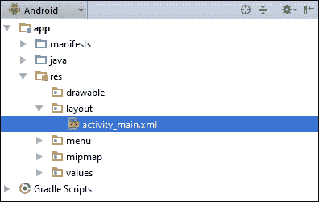
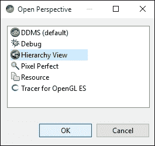
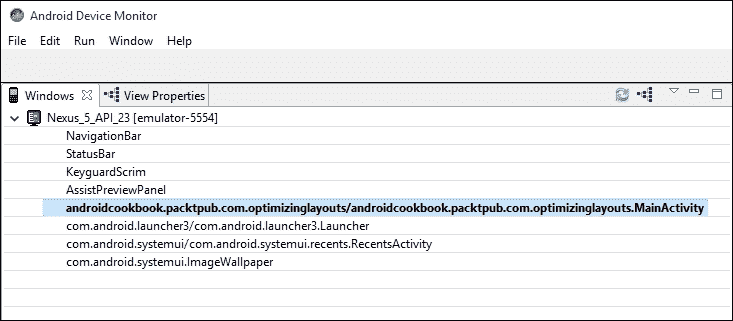
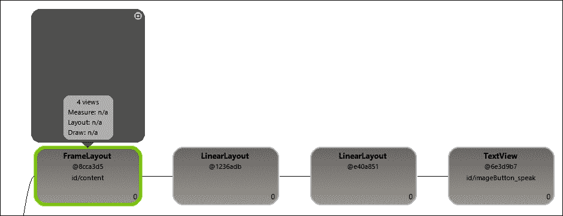
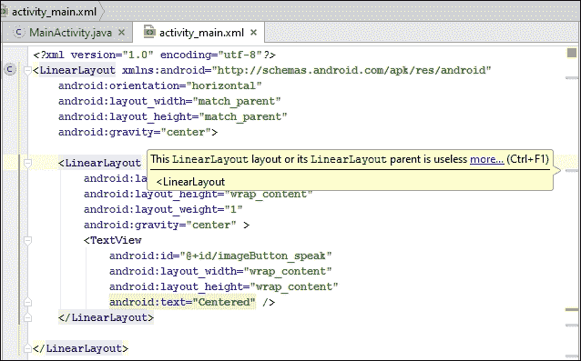

# 第二章：布局

在本章中，我们将涵盖以下主题：

+   定义和填充布局

+   使用 RelativeLayout

+   使用 LinearLayout

+   创建表格 – TableLayout 和 GridLayout

+   使用 ListView、GridView 和适配器

+   在运行时更改布局属性

+   使用层次结构查看器优化布局

# 简介

在 Android 中，用户界面是在一个**布局**中定义的。布局可以在 XML 中声明，或者在代码中动态创建。（建议在 XML 中声明布局，以保持表现层与实现层的分离。）布局可以定义一个单独的`ListItem`、一个片段，甚至是整个 Activity。布局文件存储在 `/res/layout` 文件夹中，并在代码中使用以下标识符引用：`R.layout.<文件名不带扩展名>`。

Android 提供了有用的`Layout`类，这些类包含和组织活动的各个元素（如按钮、复选框和其他`Views`）。`ViewGroup`对象是一个容器对象，它作为 Android 的`Layout`类家族的基础类。放置在布局中的视图形成一个层次结构，最顶层的布局是父布局。

Android 提供了多种内置布局类型，专为特定目的设计，如`RelativeLayout`，它允许视图相对于其他元素定位。`LinearLayout`可以根据指定的方向堆叠视图或将它们水平对齐。`TableLayout`可用于布局视图网格。在各种布局中，我们还可以使用`Gravity`对齐视图，并通过`Weight`控制提供比例大小。布局和`ViewGroups`可以相互嵌套，以创建复杂的配置。提供了十几种不同的布局对象，用于管理小部件、列表、表格、画廊和其他显示格式，此外，您还可以从基类派生以创建自己的自定义布局。

# 定义和填充布局

使用 Android Studio 向导创建新项目时，它会自动创建`res/layout/activity_main.xml`文件（如下截图所示）。然后在`onCreate()`回调中使用`setContentView(R.layout.activity_main)`填充 XML 文件。



在这个示例中，我们将创建两个略有不同的布局，并通过按钮在它们之间切换。

## 准备工作

在 Android Studio 中创建一个新项目，并将其命名为`InflateLayout`。创建项目后，展开`res/layout`文件夹，以便我们可以编辑`activity_main.xml`文件。

## 如何操作...

1.  编辑`res/layout/activity_main.xml`文件，使其包含如下定义的按钮：

    ```kt
    <Button
        android:id="@+id/buttonLeft"
        android:layout_width="wrap_content"
        android:layout_height="wrap_content"
        android:text="Left Button"
        android:layout_centerVertical="true"
        android:layout_alignParentLeft="true"
        android:onClick="onClickLeft"/>
    ```

1.  现在，复制`activity_main.xml`并将其命名为`activity_main2.xml`。更改按钮，使其与以下内容相匹配：

    ```kt
    <Button
        android:id="@+id/buttonRight"
        android:layout_width="wrap_content"
        android:layout_height="wrap_content"
        android:text="Right Button"
        android:layout_centerVertical="true"
        android:layout_alignParentRight="true"
        android:onClick="onClickRight"/>
    ```

1.  打开`MainActivity.java`，并添加以下两个方法来处理按钮点击：

    ```kt
    public void onClickLeft(View view) {
        setContentView(R.layout.activity_main2);
    }

    public void onClickRight(View view) {
        setContentView(R.layout.activity_main);
    }
    ```

1.  在设备或模拟器上运行此应用程序，查看效果。

## 工作原理...

这里的关键是调用`setContentView()`，我们在之前自动生成的`onCreate()`代码中遇到过。只需将布局 ID 传递给`setContentView()`，它就会自动膨胀布局。

此代码旨在让概念易于理解，但对于仅更改按钮属性（在这个例子中，我们只需在按钮点击时更改对齐方式）来说可能过于复杂。通常在`onCreate()`方法中只需要对布局进行一次膨胀，但有时你可能需要像我们这里一样手动膨胀一个布局。（如果你要手动处理方向变化，这将是一个很好的例子。）

## 还有更多...

除了像我们在这里用资源 ID 标识布局，`setContentView()`还可以接受一个视图作为参数，例如：

```kt
findViewById(R.id.myView)
setContentView(myView);
```

## 参阅以下内容

+   如前所述，在第五章，*探索片段、应用微件和系统 UI*的*片段*主题中，查看更改屏幕布局的替代方法。

# 使用 RelativeLayout

如*引言*中所述，`RelativeLayout`允许视图相对于彼此和父视图定位。`RelativeLayout`特别有用，因为它可以减少嵌套布局的数量，这对于降低内存和处理要求非常重要。

## 准备工作

创建一个名为`RelativeLayout`的新项目。默认布局使用`RelativeLayout`，我们将用它来水平和垂直对齐视图。

## 如何操作...

1.  打开`res/layout/activity_main.xml`文件，并按如下方式进行修改：

    ```kt
    <TextView
        android:id="@+id/textView1"
        android:layout_width="wrap_content"
        android:layout_height="wrap_content"
        android:text="Centered"
        android:layout_centerVertical="true"
        android:layout_centerHorizontal="true" />
    <TextView
        android:id="@+id/textView2"
        android:layout_width="wrap_content"
        android:layout_height="wrap_content"
        android:text="Below TextView1"
        android:layout_below="@+id/textView1"
        android:layout_toLeftOf="@id/textView1" />
    <TextView
        android:id="@+id/textView3"
        android:layout_width="wrap_content"
        android:layout_height="wrap_content"
        android:text="Bottom Right"
        android:layout_alignParentBottom="true"
        android:layout_alignParentEnd="true" />
    ```

1.  运行代码，或者在**设计**标签中查看布局

## 工作原理...

这是一个非常简单的练习，但它展示了`RelativeLayout`的几种选项：`layout_centerVertical`、`layout_centerHorizontal`、`layout_below`、`layout_alignParentBottom`等。

最常用的`RelativeLayout`布局属性包括：

+   `layout_below`：此视图应位于指定视图之下

+   `layout_above`：此视图应位于指定视图之上

+   `layout_alignParentTop`：将此视图与父视图的顶部边缘对齐

+   `layout_alignParentBottom`：将此视图与父视图的底边缘对齐

+   `layout_alignParentLeft`：将此视图与父视图的左边缘对齐

+   `layout_alignParentRight`：将此视图与父视图的右边缘对齐

+   `layout_centerVertical`：在父视图中垂直居中此视图

+   `layout_centerHorizontal`：在父视图中水平居中此视图

+   `layout_center`：在父视图中水平和垂直居中此视图

    ### 注意

    要获取完整的`RelativeLayout`参数列表，请访问：[`developer.android.com/reference/android/widget/RelativeLayout.LayoutParams.html`](http://developer.android.com/reference/android/widget/RelativeLayout.LayoutParams.html)。

## 还有更多...

与我们之前看到的相比，下面是仅使用`LinearLayout`来居中`TextView`的示例（创建与`RelativeLayout`的`layout_center`参数相同的效果）：

```kt
<?xml version="1.0" encoding="utf-8"?>
<LinearLayout 
    android:orientation="horizontal"
    android:layout_width="match_parent"
    android:layout_height="match_parent"
    android:gravity="center">
    <LinearLayout
        android:layout_width="0dp"
        android:layout_height="wrap_content"
        android:layout_weight="1"
        android:gravity="center" >
        <TextView
            android:id="@+id/imageButton_speak"
            android:layout_width="wrap_content"
            android:layout_height="wrap_content"
            android:text="Centered" />
    </LinearLayout>
</LinearLayout>
```

请注意，此布局比等效的`RelativeLayout`（即嵌套在父`LinearLayout`中的`LinearLayout`）深一个层级。尽管这是一个简单的例子，但避免不必要的嵌套是一个好主意，因为它可能会影响性能，尤其是在重复膨胀布局时（如`ListItem`）。

## 另请参阅

+   下一个食谱*使用 LinearLayout*将为您提供另一种布局选择

+   有关高效布局设计的更多信息，请参阅*使用层次结构查看器优化布局*的食谱。

# 使用 LinearLayout

另一个常见的布局选项是`LinearLayout`，它根据指定的方向，将子视图排列在单列或单行中。默认方向（如果未指定）是垂直，将视图对齐在单列中。

`LinearLayout`有一个`RelativeLayout`没有的关键特性——`权重`属性。在定义视图时，我们可以指定一个`layout_weight`参数，让视图根据可用空间动态调整大小。选项包括让视图填充所有剩余空间（如果视图具有更高的权重），让多个视图在给定空间内适应（如果所有视图权重相同），或者按权重比例分配视图空间。

我们将创建一个包含三个`EditText`视图的`LinearLayout`，以演示权重属性如何使用。在这个例子中，我们将使用三个`EditText`视图——一个用于输入`收件人地址`参数，另一个用于输入`主题`，第三个用于输入`消息`。`收件人`和`主题`视图各占一行，剩余空间留给消息视图。

## 准备工作

创建一个新项目，将其命名为`LinearLayout`。我们将用`LinearLayout`替换在`activity_main.xml`中创建的默认`RelativeLayout`。

## 如何操作...

1.  打开`res/layout/activity_main.xml`文件，并按如下方式替换：

    ```kt
    <LinearLayout 
        android:orientation="vertical"
        android:layout_width="match_parent"
        android:layout_height="match_parent">
        <EditText
            android:id="@+id/editTextTo"
            android:layout_width="match_parent"
            android:layout_height="wrap_content"
            android:hint="To" />
        <EditText
            android:id="@+id/editTextSubject"
            android:layout_width="match_parent"
            android:layout_height="wrap_content"
            android:hint="Subject" />
        <EditText
            android:id="@+id/editTextMessage"
            android:layout_width="match_parent"
            android:layout_height="0dp"
            android:layout_weight="1"
            android:gravity="top"
            android:hint="Message" />
    </LinearLayout>
    ```

1.  运行代码，或者在**设计**标签中查看布局。

## 工作原理...

当使用`LinearLayout`的垂直方向时，子视图会在单列中创建（一个叠在另一个上面）。前两个视图使用`android:layout_height="wrap_content"`属性，使它们各占一行。`editTextMessage`使用以下属性来指定高度：

```kt
android:layout_height="0dp"
android:layout_weight="1"
```

使用`LinearLayout`时，它会告诉 Android 根据权重计算高度。权重为 0（如果未指定，则为默认值）表示视图不应该扩展。在这个例子中，只有`editTextMessage`视图被定义了权重，因此它将独自扩展以填充父布局中的任何剩余空间。

### 提示

当使用水平方向时，指定`android:layout_height="0dp"`（连同权重），让 Android 计算宽度。

将权重属性视为百分比可能有助于理解。在这种情况下，定义的总权重是 1，所以这个视图获得了剩余空间的 100%。如果我们给另一个视图分配了 1 的权重，那么总权重将是 2，所以这个视图将获得 50%的空间。尝试给其他视图之一添加权重（确保也将高度更改为`0dp`）以查看效果。

如果你给其他视图之一（或两者）添加了权重，你注意到文本位置了吗？没有为`gravity`指定值时，文本只会保持在视图空间的中心。`editTextMessage`指定了：`android:gravity="top"`，这将强制文本位于视图的顶部。

## 还有更多内容...

可以使用按位`OR`组合多个属性选项。（Java 使用管道字符（|）表示`OR`）。例如，我们可以结合两个重力选项，使其既沿着父视图的顶部对齐，又在可用空间内居中：

```kt
android:layout_gravity="top|center"
```

需要注意的是，`layout_gravity`和`gravity`标签不是一回事。`layout_gravity`决定了视图在其父视图中的位置，而`gravity`控制视图内内容的位置——例如，按钮上文本的对齐方式。

## 另请参阅

+   之前的食谱，*使用 RelativeLayout*

# 创建表格——TableLayout 和 GridLayout

当你在 UI 中需要创建一个表格时，Android 提供了两种方便的布局选项：`TableLayout`（以及`TableRow`）和`GridLayout`（在 API 14 中添加）。这两种布局选项可以创建看起来相似的表格，但每个都使用不同的方法。使用`TableLayout`时，行和列是动态添加的，随着表格的构建而添加。使用`GridLayout`时，行和列的大小在布局定义中定义。

这两种布局没有绝对的好坏，只是根据你的需求选择最适合的布局。我们将使用每种布局创建一个 3x3 网格以进行比较，因为你可以轻易地在同一个应用程序中使用这两种布局。

## 准备好了

为了专注于布局并提供更简单的比较，我们将为这个食谱创建两个独立的应用程序。创建两个新的 Android 项目，第一个名为`TableLayout`，另一个名为`GridLayout`。

## 如何操作...

1.  从`TableLayout`项目开始，打开**activity_main.xml**。将根布局更改为`TableLayout`。

1.  添加三个`TableRows`，每个`TableRow`包含三组`TextViews`，以创建一个 3x3 矩阵。为了演示目的，列被标记为 A-C，行被标记为 1-3，所以第一个`TextViews`行将是 A1，B1 和 C1。最终结果将如下所示：

    ```kt
    <TableLayout

        android:layout_width="match_parent"
        android:layout_height="match_parent">
        <TableRow
            android:layout_width="match_parent"
            android:layout_height="match_parent">
            <TextView
                android:layout_width="wrap_content"
                android:layout_height="wrap_content"
                android:text="A1"
                android:id="@+id/textView1" />
            <TextView
                android:layout_width="wrap_content"
                android:layout_height="wrap_content"
                android:text="B1"
                android:id="@+id/textView2" />
            <TextView
                android:layout_width="wrap_content"
                android:layout_height="wrap_content"
                android:text="C1"
                android:id="@+id/textView3" />
        </TableRow>
        <TableRow
            android:layout_width="match_parent"
            android:layout_height="match_parent">
            <TextView
                android:layout_width="wrap_content"
                android:layout_height="wrap_content"
                android:text="A2"
                android:id="@+id/textView4" />
            <TextView
                android:layout_width="wrap_content"
                android:layout_height="wrap_content"
                android:text="B2"
                android:id="@+id/textView5" />
            <TextView
                android:layout_width="wrap_content"
                android:layout_height="wrap_content"
                android:text="C2"
                android:id="@+id/textView6" />
        </TableRow>
        <TableRow
            android:layout_width="match_parent"
            android:layout_height="match_parent">
            <TextView
                android:layout_width="wrap_content"
                android:layout_height="wrap_content"
                android:text="A3"
                android:id="@+id/textView7" />
            <TextView
                android:layout_width="wrap_content"
                android:layout_height="wrap_content"
                android:text="B3"
                android:id="@+id/textView8" />
            <TextView
                android:layout_width="wrap_content"
                android:layout_height="wrap_content"
                android:text="C3"
                android:id="@+id/textView9" />
        </TableRow>
    </TableLayout>
    ```

1.  现在，打开`GridLayout`项目以编辑`activity_main.xml`。将根布局更改为`GridLayout`。在`GridLayout`元素中添加`columnCount=3`和`rowCount=3`属性。

1.  现在，向`GridLayout`中添加九个`TextViews`。我们将使用与前面的`TableLayout`相同的文本以便进行一致的比较。由于`GridView`不使用`TableRows`，前三个`TextViews`位于第 1 行，接下来的三个位于第 2 行，依此类推。最终结果将如下所示：

    ```kt
    <GridLayout

        android:layout_width="match_parent"
        android:layout_height="match_parent"
        android:columnCount="3"
        android:rowCount="3">
        <TextView
            android:layout_width="wrap_content"
            android:layout_height="wrap_content"
            android:text="A1"
            android:id="@+id/textView1" />
        <TextView
            android:layout_width="wrap_content"
            android:layout_height="wrap_content"
            android:text="B1"
            android:id="@+id/textView2" />
        <TextView
            android:layout_width="wrap_content"
            android:layout_height="wrap_content"
            android:text="C1"
            android:id="@+id/textView3" />
        <TextView
            android:layout_width="wrap_content"
            android:layout_height="wrap_content"
            android:text="A2"
            android:id="@+id/textView4" />
        <TextView
            android:layout_width="wrap_content"
            android:layout_height="wrap_content"
            android:text="B2"
            android:id="@+id/textView5" />
        <TextView
            android:layout_width="wrap_content"
            android:layout_height="wrap_content"
            android:text="C2"
            android:id="@+id/textView6" />
        <TextView
            android:layout_width="wrap_content"
            android:layout_height="wrap_content"
            android:text="A3"
            android:id="@+id/textView7" />
        <TextView
            android:layout_width="wrap_content"
            android:layout_height="wrap_content"
            android:text="B3"
            android:id="@+id/textView8" />
        <TextView
            android:layout_width="wrap_content"
            android:layout_height="wrap_content"
            android:text="C3"
            android:id="@+id/textView9" />
    </GridLayout>
    ```

1.  您可以运行应用程序，或者使用**设计**标签来查看结果。

## 工作原理...

如您在查看创建的表格时所见到的那样，屏幕上的表格基本看起来是一样的。主要区别在于创建它们的代码。

在`TableLayout`的 XML 中，每一行都是通过`TableRow`添加到表格中的。每个视图都成为一个列。这不是必须的，因为单元格可以跳过或留空。（在下一节中了解如何在`TableRow`中指定单元格位置。）

`GridLayout`使用相反的方法。在创建表格时指定行数和列数。我们不必指定行或列的信息（尽管我们可以，下面会讨论）。Android 会自动按顺序将每个视图添加到单元格中。

## 还有更多内容...

首先，让我们看看两种布局之间的更多相似之处。这两种布局都有能力拉伸列以使用剩余的屏幕空间。对于`TableLayout`，在 xml 声明中添加以下属性：

```kt
android:stretchColumns="1"
```

`stretchColumns`指定了需要拉伸的列的（基于零的）索引。（`android:shrinkColumns`是一个可以收缩的列的基于零的索引，以便表格可以适应屏幕。）

为了在`GridLayout`中实现相同的效果，请在 B 列中的所有视图上添加以下属性（`textView2`、`textView5`和`textView8`）：

```kt
android:layout_columnWeight="1"
```

### 注意

给定列中的所有单元格必须定义权重，否则它不会拉伸。

现在，让我们来看一下它们之间的不同之处，因为这确实是决定针对特定任务使用哪种布局的关键。首先要注意的是列和行是如何定义的。在`TableLayout`中，行是明确定义的，使用`TableRow`。（Android 会根据拥有最多单元格的行来确定表格中的列数。）在定义视图时，使用`android`:`layoutColumn`属性来指定列。

相比之下，在`GridLayout`中，在定义表格时（如前所示使用`columnCount`和`rowCount`）指定行数和列数。

在前面的示例中，我们只是将`TextViews`添加到`GridLayout`中，并让系统自动定位它们。我们可以通过在定义视图时指定行和列的位置来更改此行为，例如：

```kt
android:layout_row="2"
android:layout_column="2"
```

### 提示

在添加每个视图后，Android 会自动增加单元格计数器，因此*下一个*视图也应该指定行和列，否则，您可能无法得到预期的结果。

与 *LinearLayout* 配方中显示的 `LinearLayout` 一样，`GridLayout` 也提供了支持水平和垂直（默认）方向的 orientation 属性。方向决定了单元格的放置方式。（水平方向首先填充列，然后向下移动到下一行。垂直方向则先填充每行的第一列，然后移动到下一列。）

# 使用 `ListView`、`GridView` 和适配器

`ListView` 和 `GridView` 都是 `ViewGroup` 的后代，但它们更像是一个 View，因为它们是由数据驱动的。换句话说，在设计时，你不需要定义可能填充 `ListView`（或 `GridView`）的所有可能的 View，而是从传递给 View 的数据动态创建内容。（`ListItem` 的布局可以在设计时创建，以控制数据在运行时的外观。）

例如，如果你需要向用户展示一个国家列表，你可以创建一个 `LinearLayout` 并为每个国家添加一个按钮。这种方法有几个问题：确定可用国家、保持按钮列表更新、有足够的屏幕空间来容纳所有国家等等。否则，你可以创建一个国家列表来填充 `ListView`，它将为每个条目创建一个按钮。

我们将使用第二种方法创建一个示例，从一个国家名称数组中填充 `ListView`。

## 准备工作

在 Android Studio 中创建一个新项目，并将其命名为 `ListView`。默认的 `ActivityMain` 类扩展了 `Activity` 类。我们将改为让它扩展 `ListActivity` 类。然后，我们将创建一个简单的字符串列表并将其绑定到 `ListView` 上，以在运行时派生按钮。

## 如何操作...

1.  打开 **MainActivity.java** 文件，并更改基本声明，使其扩展 `ListActivity` 而不是 `Activity` 类：

    ```kt
    public class MainActivity extends ListActivity {
    ```

1.  修改 `onCreate()` 使其与以下代码相匹配：

    ```kt
    protected void onCreate(Bundle savedInstanceState) {
      super.onCreate(savedInstanceState);
      String[] countries = new String[]{"China", "France", "Germany", "India", "Russia", "United Kingdom", "United States"};

      ListAdapter countryAdapter = new ArrayAdapter<String>(this, android.R.layout.simple_list_item_1, countries);
      setListAdapter(countryAdapter);

        getListView().setOnItemClickListener(new AdapterView.OnItemClickListener() {
            @Override
            public void onItemClick(AdapterView<?> parent, Viewview, int position, long id) {
                String s = ((TextView) view).getText() + " " +position;
                Toast.makeText(getApplicationContext(), s, 
                    Toast.LENGTH_SHORT).show();
            }
        });
    }
    ```

1.  现在，在模拟器或设备上运行应用程序，查看填充后的 `ListView`。

## 它是如何工作的...

我们首先创建一个简单的国家名称数组，然后使用它来填充 `ListAdapter`。在这个例子中，我们在构造 `ListAdapter` 时使用了 `ArrayAdapter`，但 Android 还有其他几种适配器类型可用。例如，如果你的数据存储在数据库中，你可以使用 `CursorAdapter`。如果内置类型之一不符合你的需求，你总是可以使用 `CustomAdapter`。

我们用以下这行代码创建适配器：

```kt
ListAdapter countryAdapter = new ArrayAdapter<String>(this, android.R.layout.simple_list_item_1, countries);
```

在这里，我们使用我们的字符串数组（最后一个参数）实例化 `ArrayAdapter`。注意 `android.R.layout.simple_list_item_1` 参数吗？这定义了按钮的布局。这里，我们使用了 Android 提供的布局之一，但我们也可以创建自己的布局并传递我们的 ID。

一旦我们准备好适配器，只需通过 `setListAdapter()` 调用将其传递给底层的 `ListView`。（底层的 `ListView` 来自扩展 `ListViewActivity`。）最后，我们实现 `setOnItemClickListener` 以在用户按下列表中的按钮（代表一个国家）时显示一个 Toast。

`ListViews` 在 Android 中非常常见，因为它们通过滚动视图高效地利用屏幕空间，这对于小屏幕非常有用。`ScrollView` 布局提供了一种替代方法来创建类似的滚动效果。这两种方法的主要区别在于，`ScrollView` 布局在显示给用户之前会完全展开，而 `ListView` 只展开用户将看到的部分视图。对于有限的数据，这可能不是问题，但对于较大的数据集，在列表显示之前应用程序可能会耗尽内存。

由于 `ListView` 是由数据适配器驱动的，因此数据可以轻松更改。即使在我们的有限示例中，向屏幕添加一个新国家也只需将该名称添加到国家列表中。更重要的是，在用户使用应用程序时，列表可以在运行时更新（例如，从网站下载更新后的列表以显示实时选项）。

## 还有更多...

`ListView` 还支持通过 `setChoiceMode()` 方法设置多选模式。要查看其效果，请在 `setListAdapter()` 之后添加以下代码行：

```kt
getListView().setChoiceMode(ListView.CHOICE_MODE_MULTIPLE);
```

然后，将 `ListItem` 布局从 `android.R.layout.simple_list_item_1` 更改为 `android.R.layout.simple_list_item_checked`。

尽管大多数需要滚动列表的应用程序都使用 `ListView`，但 Android 也提供了 `GridView`。它们在功能上非常相似，甚至使用相同的数据适配器。主要区别在于视觉效果，它允许多列显示。为了更好地理解，让我们将 `ListView` 示例更改为 `GridView`。

首先，我们需要将 `MainActivity` 修改为再次继承自 `Activity`，而不是 `ListActivity`。（这将撤销之前的第 1 步。）然后，用以下代码替换 `onCreate()`：

```kt
protected void onCreate(Bundle savedInstanceState) {
    super.onCreate(savedInstanceState);
    GridView gridView = new GridView(this);
    setContentView(gridView);
    String[] countries = new String[]{"China", "France", "Germany", "India", "Russia", "United Kingdom", "United States"};
    ListAdapter countryAdapter = new ArrayAdapter<String>(this, android.R.layout.simple_list_item_1, countries);
    gridView.setAdapter(countryAdapter);
    gridView.setNumColumns(2);
    gridView.setOnItemClickListener(new AdapterView.OnItemClickListener() {
        @Override
        public void onItemClick(AdapterView<?> parent, View view, int position, long id) {
                String s = ((TextView) view).getText() + " " + position;
            Toast.makeText(getApplicationContext(), s, Toast.LENGTH_SHORT).show();
        }
    });
}
```

如您所见，`GridView` 的设置代码比 `ListView` 的要多。`onCreate()` 方法创建了一个新的 `GridView` 并在 `setContentView()` 调用中传递它。（我们使用了在*定义和填充布局*中提到的 `setContentView` 的这种变体，而不是创建仅包含 `GridView` 的布局，但最终结果相同。）

`ListViewActivity` 基类处理了其中大部分工作，但 `GridView` 没有相应的活动类来继承。

# 在运行时更改布局属性

在 Android 开发中，通常推荐的做法是用 XML 定义 UI，用 Java 定义应用程序代码，将用户界面代码与应用程序代码分开。有时，从 Java 代码中修改（甚至构建）UI 要容易或高效得多。幸运的是，这在 Android 中很容易实现。

在上一个示例中，我们看到了一个从代码中修改布局的小例子，我们设置了 `GridView` 列的数量以在代码中显示。在这个示例中，我们将获取对 `LayoutParams` 对象的引用，以在运行时改变边距。

## 准备工作

在这里，我们将使用 XML 设置一个简单的布局，并使用 `LinearLayout.LayoutParams` 对象在运行时改变视图的边距。

## 如何操作...

1.  打开 `activity_main.xml` 文件，将布局从 `RelativeLayout` 更改为 `LinearLayout`。它将如下所示：

    ```kt
    <LinearLayout 

        android:layout_width="match_parent"
        android:layout_height="match_parent">
    </LinearLayout>
    ```

1.  添加一个 `TextView` 并包含一个 ID，如下所示：

    ```kt
    android:id="@+id/textView"
    ```

1.  添加 `Button` 并包含一个 ID，如下所示：

    ```kt
    android:id="@+id/button"
    ```

1.  打开 `MainActivity.java` 并在 `onCreate()` 方法中添加以下代码以设置 `onClick` 事件监听器：

    ```kt
    Button button = (Button)findViewById(R.id.button);
    button.setOnClickListener(new View.OnClickListener() {
        @Override
        public void onClick(View view) {
            ((TextView)findViewById(R.id.textView)).setText("Changed at runtime!");
            LinearLayout.LayoutParams params = (LinearLayout.LayoutParams)view.getLayoutParams();
            params.leftMargin += 5;
        }
    });
    ```

1.  在设备或模拟器上运行程序。

## 工作原理...

每个视图（因此也包括 `ViewGroup`）都有一组与其关联的布局参数。特别是，所有视图都有参数来告诉它们的父视图期望的高度和宽度。这些通过 `layout_height` 和 `layout_width` 参数定义。我们可以使用 `getLayoutParams()` 方法从代码中访问此布局信息。布局信息包括布局高度、宽度、边距以及任何类特定的参数。在这个例子中，我们通过获取按钮的 `LayoutParams` 并改变边距，在每次点击时移动按钮。

# 使用层次查看器优化布局

在开始优化你的布局之前，了解 Android 布局过程是有帮助的。布局的膨胀开始于活动首次显示时。发生以下三个步骤：

+   **测量（Measure）**：这里视图确定它们的大小，从父视图开始，遍历所有子视图。父视图可能需要多次调用子视图以确定最终大小。

+   **布局（Layout）**：这里父视图确定其子视图的位置

+   **绘制（Draw）**：这里视图实际上被渲染。

这个过程从父视图开始，然后遍历其所有子视图。这些子视图再遍历它们的子视图。这样就创建了布局树（Layout Tree），父视图成为树中的根节点。

**层次查看器（Hierarchy Viewer）**是 **Android SDK** 中包含的一个用于检查布局的工具。它以图形化的方式显示布局树，并附带了每个视图/节点的计时结果。通过检查树状布局和计时，你可以查找低效的设计和瓶颈。拥有这些信息，你就可以优化你的布局了。

对于这个示例，我们将使用层次查看器（Hierarchy Viewer）检查在 *使用 RelativeLayout* 示例中给出的布局。

## 准备工作

在 *Using RelativeLayout* 配方中的 *There's more…* 部分展示了一个 `LinearLayout` 示例，以突出显示布局之间的差异。评论指出 `LinearLayout` 需要一个嵌套布局。我们将使用示例 `LinearLayout` 创建一个名为 `OptimizingLayouts` 的新项目。然后，我们将使用层次结构查看器检查布局。为此，我们需要一个已获得 root 权限的 Android 设备或模拟器。

### 注意

层次结构查看器只能连接到已获得 root 权限的设备，例如模拟器。

## 如何操作...

1.  在 Android Studio 中打开 `OptimizingLayouts` 项目。在已获得 root 权限的设备（或模拟器）上运行项目，并确保屏幕可见（如需解锁则解锁）。

1.  在 Android Studio 中，通过以下菜单选项启动 Android Device Monitor：**Tools** | **Android** | **Android Device Monitor**。

1.  在 Android Device Monitor 中，通过转到 **Window** | **Open Perspective…** 切换到层次视图视角，这将弹出以下对话框：

1.  现在点击 **Hierarchy Viewer** 然后点击 **OK**。

1.  在左侧的 **Windows** 部分列出了带有运行进程的设备列表。点击 `OptimizingLayouts` 进程以检查布局。

1.  在 **TreeView** 部分查看此活动的图形表示（位于层次查看器视角的中心窗格，占据了大部分空间）。

## 工作原理...

树状布局部分显示了组成此布局的视图的图形层次结构以及布局时间。（不幸的是，对于此演示，渲染时间太快，无法进行视觉颜色编码参考。）对于此示例重要的是之前展示的嵌套 `LinearLayouts`。（花时间探索构成此布局的其他视图是值得的，这样您可以看到 Android 在幕后为我们做了什么。）

如已在 `RelativeLayout` 示例中提到，解决方案是使用 `RelativeLayout` 重新设计此布局。理想情况下，我们希望有一个更宽、更扁平的布局，而不是深层嵌套的布局，以减少在调整大小步骤中所需迭代次数。从时间上讲，这显然是一个微不足道的例子，但即使这个例子也可能产生影响。想象一下，用户基于这种低效布局在 `ListView` 中快速浏览成千上万的条目。如果在滚动时遇到卡顿，您的优化步骤可以从在层次结构查看器中检查布局开始。

## 还有更多...

**Lint** 是 Android SDK 中包含的另一个工具，Android Studio 提供了内置支持。默认情况下，您已经在使用 Lint 检查代码中的问题，例如不推荐使用的 API 调用、目标 API 级别不支持 API 调用、安全问题等。对于我们的优化布局关注点，Lint 将自动检查的一些条件包括以下内容：

+   深层布局——默认最大层级为 10 级

+   嵌套权重，这对性能不利

+   无用的父节点

+   无用的叶节点

如果在 Android Studio 中检查此布局的 Lint 警告，你会在第二个`LinearLayout`元素上看到以下警告：



`ViewStub`还可以用来优化布局。将`ViewStub`视为布局的“懒加载”。`ViewStub`中的布局在需要之前不会展开，这减少了需要展开的视图数量。布局将更快渲染并使用更少的内存。这是在需要时提供不常用功能（如`打印`功能）的一种好方法，但在不需要时不占用内存。以下是一个`ViewStub`的示例：

```kt
<ViewStub
    android:id="@+id/viewStubPrint"
    android:inflatedId="@id/print"
    android:layout="@layout/print"
    android:layout_width="wrap_content"
    android:layout_height="wrap_content"/>
```

实际上有两种方法可以展开`ViewStub`：

+   将`ViewStub`的可见性参数设置为`VISIBLE`：

    ```kt
    ((ViewStub) findViewById(R.id.viewStubPrint)).setVisibility(View.VISIBLE);
    ```

+   在`ViewStub`上调用`inflate()`方法：

    ```kt
    View view = ((ViewStub) findViewById(R.id.viewStubPrint)).inflate();
    ```

一旦`ViewStub`被展开，`ViewStub`的 ID 将从布局中移除，并替换为展开后的 ID。
