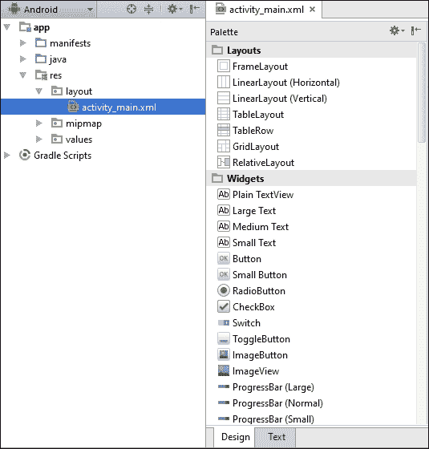
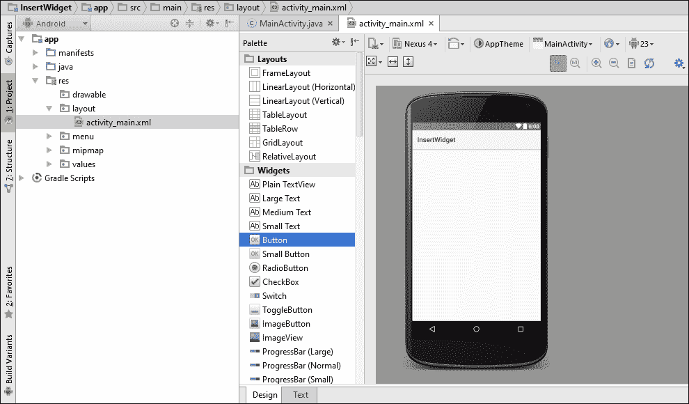
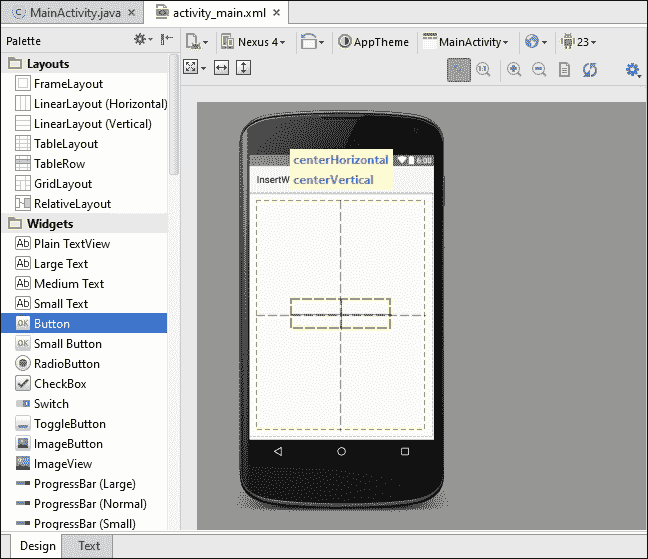
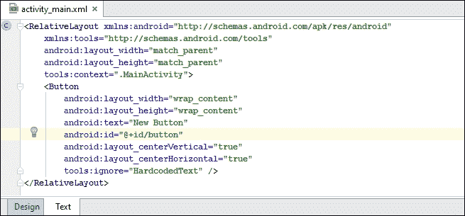
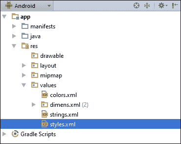
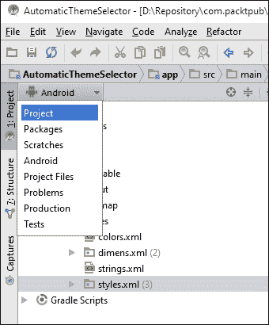
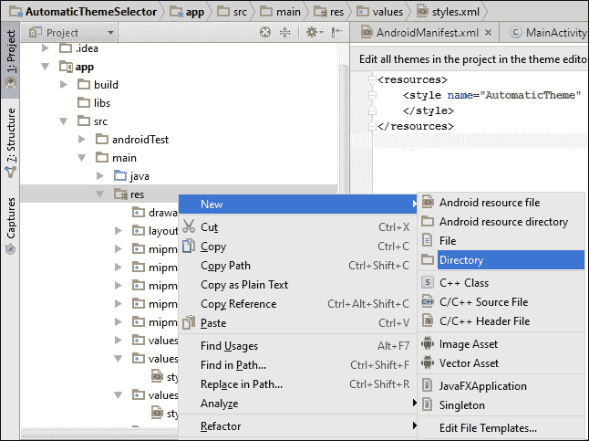

# 第三章：视图、控件和样式

在本章中，我们将介绍以下主题：

+   在布局中插入小部件

+   使用图形显示按钮状态

+   在运行时创建控件

+   创建自定义组件

+   将样式应用于视图

+   将样式转变为主题

+   根据 Android 操作系统版本选择主题

# 介绍

**控件**一词在 Android 中可以指代几个不同的概念。当大多数人谈论控件时，他们指的是**应用控件**，通常出现在主屏幕上。应用控件本身就像迷你应用程序，因为它们通常提供基于它们主要应用程序的功能子集。（通常，大多数应用控件随应用程序一起安装，但这不是必需的。它们可以是独立的应用，以控件格式存在。）一个常见的应用控件示例是提供多种不同主屏幕控件的风 weather 应用程序。第五章，*探索片段、应用控件和系统 UI*，将讨论主屏幕应用控件并提供创建你自己的食谱。

在为 Android 开发时，控件一词通常指的是在布局文件中放置的专用视图，如 Button、TextView、CheckBox 等。在本章中，我们将专注于应用开发中的控件。

要查看**Android SDK** 提供的控件列表，请在 Android Studio 中打开一个布局文件，并点击**设计**标签。在设计视图的左侧，你会在**布局**部分下方看到**控件**部分，如下面的屏幕截图所示：



如你所见，**Android SDK** 提供了许多有用的控件——从简单的 TextView、Button 或 Checkbox 到更复杂的控件，如 Clock、DatePicker 和 Calendar。内置控件虽然很有用，但扩展 SDK 提供的内容也非常容易。我们可以扩展现有控件来自定义其功能，或者通过扩展基础的 View 类来从头创建我们自己的控件。（我们将在后面的*创建自定义组件*食谱中提供一个示例。）

控件的视觉外观也可以自定义。这些设置可以用来创建**样式**，进而用来创建**主题**。就像在其他开发环境中一样，创建主题可以轻松地改变我们整个应用程序的外观，而无需付出太多努力。最后，Android SDK 还提供了许多内置主题和变体，如来自 Android 3/4 的 Holo 主题和来自 Android 5 的 Material 主题。（Android 6.0 没有发布新主题。）

# 在布局中插入控件

如您在之前的食谱中所见，**小部件** 在布局文件中声明，或者在代码中创建。对于这个食谱，我们将逐步使用 Android Studio Designer 添加一个按钮。（对于后续的食谱，我们只展示从 TextView 的布局 XML。）创建按钮后，我们将创建一个 `onClickListener()`。

## 准备工作

在 Android Studio 中开始一个新项目，并将其命名为 `InsertWidget`。为创建电话和平板项目选择默认选项，并在提示 Activity 类型时选择 **Empty Activity**。您可以删除默认的 TextView（或者保留它），因为对于这个食谱来说不需要。

## 如何操作...

要将小部件插入到布局中，请按照以下步骤操作：

1.  在 Android Studio 中打开 `activity_main.xml` 文件并点击 **设计** 选项卡。

1.  在小部件列表中找到 **Button** 并将其拖到右侧活动屏幕的中央。Android 会根据按钮放置的位置自动设置布局参数。如果您像截图那样将按钮居中，Android Studio 会在 XML 中设置这些参数。

1.  要查看创建的 `xml`，请点击如下截图所示的 **文本** 选项卡。看看按钮是如何使用 `RelativeLayout` 参数居中的。同时注意默认的 ID，因为下一步我们会需要它。

1.  现在，打开 `MainActivity.java` 文件以编辑代码。在 `onCreate()` 方法中添加以下代码以设置 `onClickListener()`：

    ```kt
    Button button = (Button)findViewById(R.id.button);
    button.setOnClickListener(new View.OnClickListener() {
        @Override
        public void onClick(View view) {
            Toast.makeText(MainActivity.this,"Clicked",Toast.LENGTH_SHORT).show();
        }
    });
    ```

1.  在设备或模拟器上运行应用程序。

## 工作原理...

使用 Android Studio 创建 UI 就像拖放 Views 一样简单。您还可以直接在 **设计** 选项卡中编辑 Views 的属性。切换到 XML 代码只需点击 **文本** 选项卡。

这里我们所做的是在 Android 开发中非常常见的操作——在 XML 中创建 UI，然后在 Java 代码中将 UI 组件（Views）连接起来。要从代码中引用一个 View，它必须有一个与之关联的资源标识符。这是通过使用 `id` 参数完成的：

```kt
android:id="@+id/button"
```

我们的 `onClickListener` 函数会在按钮被按下时在屏幕上显示一个名为 **Toast** 的弹出消息。

## 还有更多...

再次看看我们之前创建的标识符格式，`@+id/button`。`@` 表示这是一个资源，而 **+** 符号表示新资源。（如果我们忘记包含加号，将会在编译时出现错误，提示 **No resource matched the indicated name**（没有资源与指定的名称匹配））。

## 另请参阅

+   Butter Knife（开源项目）—Android Views 的字段和方法绑定：[`jakewharton.github.io/butterknife/`](http://jakewharton.github.io/butterknife/)

# 使用图形显示按钮状态

我们讨论了 Android 视图的灵活性以及行为和视觉外观如何定制。在本教程中，我们将创建一个可绘制的 **状态选择器**，这是一个在 XML 中定义的资源，它根据视图的状态指定要使用的可绘制资源。最常用的状态以及可能的值包括：

+   `state_pressed=["true" | "false"]`

+   `state_focused=["true" | "false"]`

+   `state_selected=["true" | "false"]`

+   `state_checked=["true" | "false"]`

+   `state_enabled=["true" | "false"]`

要定义状态选择器，请创建一个带有 `<selector>` 元素的 XML 文件，如下所示：

```kt
<?xml version="1.0" encoding="utf-8"?>
<selector  >
</selector>
```

在 `<selector>` 元素内，我们定义一个 `<item>` 以根据指定的状态确定要使用的可绘制资源。以下是一个使用多个状态的 `<item>` 元素示例：

```kt
<item
    android:drawable="@android:color/darker_gray"
    android:state_checked="true"
    android:state_selected="false"/>
```

### 提示

需要记住，文件是从上往下读取的，因此第一个符合状态要求的项将被使用。一个默认的可绘制资源，没有包含状态的，应该放在最后。

对于本教程，我们将使用状态选择器根据 `ToggleButton` 的状态改变背景颜色。

## 准备工作

在 Android Studio 中创建一个名为 `StateSelector` 的新项目，使用默认的 **手机 & 平板** 选项。当提示选择 **活动类型** 时，选择 **空活动**。为了便于输入本教程的代码，我们将使用颜色作为表示按钮状态的图形。

## 如何操作...

我们将从创建状态选择器开始，这是一个用 XML 代码定义的资源文件。然后我们将设置按钮使用新的状态选择器。以下是步骤：

1.  在 `res/drawable` 文件夹中创建一个名为 `state_selector.xml` 的新 `XML` 文件。该文件应包含以下 XML 代码：

    ```kt
    <?xml version="1.0" encoding="utf-8"?>
    <selector >
        <item
            android:drawable="@android:color/darker_gray"
            android:state_checked="true"/>
        <item
            android:drawable="@android:color/white"
            android:state_checked="false"/>
    </selector>
    ```

1.  现在，打开 **activity_main.xml** 文件，并按以下方式添加一个 `ToggleButton`：

    ```kt
    <ToggleButton
        android:layout_width="wrap_content"
        android:layout_height="wrap_content"
        android:text="New ToggleButton"
        android:id="@+id/toggleButton"
        android:layout_centerVertical="true"
        android:layout_centerHorizontal="true"
        android:background="@drawable/state_selector" />
    ```

1.  在设备或模拟器上运行应用程序。

## 工作原理...

这里需要理解的主要概念是 Android 状态选择器。如第二步所示，我们创建了一个资源文件，根据 `state_checked` 指定了一个 **可绘制资源**（在这种情况下是颜色）。

除了选中状态，Android 还支持许多其他状态条件。在输入 `android:state` 时，查看自动完成下拉列表以查看其他选项。

创建好可绘制资源（第一步的 XML）后，我们只需告诉视图使用它。由于我们希望根据状态改变背景颜色，因此我们使用 `android:background` 属性。

`state_selector.xml` 是一个可传递给任何接受可绘制资源的属性的可绘制资源。例如，我们可以使用以下 XML 替换复选框中的按钮：

```kt
android:button="@drawable/state_selector"
```

## 还有更多...

如果我们想要实际的图片作为图形，而不仅仅是颜色变化呢？这就像更改项状态中引用的可绘制资源一样简单。

可以下载的源代码使用了两个图形图像，从[`pixabay.com/`](https://pixabay.com/)下载（选择这个网站是因为图像可以免费使用，且不需要登录。）

一旦你有了想要的图像，将它们放在`res/drawable`文件夹中。然后，在 XML 中更改状态项行以引用你的图像。以下是一个示例：

```kt
<item
    android:drawable="@drawable/checked_on"
    android:state_checked="true"/>
```

（将`check_on`更改为与您的图像资源名称匹配。）

### 使用指定文件夹进行屏幕特定资源

当 Android 遇到`@drawable`引用时，它会期望在`res/drawable`文件夹之一中找到目标。这些是为不同的屏幕密度设计的：`ldpi`（低每英寸点数）、`mdpi`（中等）、`hdpi`（高）和`xhdpi`（超高），它们允许我们为特定目标设备创建资源。当应用程序在特定设备上运行时，Android 将从与实际屏幕密度最接近的指定文件夹加载资源。

如果它发现这个文件夹是空的，它会尝试下一个最接近的匹配，以此类推，直到找到命名的资源。出于教程目的，不需要为每种可能的密度创建一组单独的文件，因此将我们的图像放在`drawable`文件夹中是在任何设备上运行练习的简单方法。

### 提示

要获取可用的资源标识符的完整列表，请访问[`developer.android.com/guide/topics/resources/providing-resources.html`](http://developer.android.com/guide/topics/resources/providing-resources.html)。

## 另请参阅

有关在 Android 上选择资源的另一个示例，请参阅关于*根据操作系统版本选择主题*的食谱。

# 在运行时创建小部件

如前所述，通常 UI 是在`XML`文件中声明，然后在运行时通过 Java 代码进行修改。完全有可能在 Java 代码中创建 UI，但对于复杂的布局，通常认为这不是最佳实践。

前一章中的 GridView 示例是在代码中创建的。但与 GridView 食谱不同，在这个食谱中，我们将向在`activity_main.xml`中定义的现有布局中添加一个视图。

## 准备工作

在 Android Studio 中创建一个新项目，并将其命名为`RuntimeWidget`。在选择**活动类型**时，选择**空活动**选项。

## 如何操作...

我们将从为现有布局添加 ID 属性开始，这样我们就可以在代码中访问布局。一旦我们在代码中有了对布局的引用，我们就可以向现有布局中添加新视图。以下是步骤：

1.  打开`res/layout/activity_main.xml`，并为主要的`RelativeLayout`添加 ID 属性，如下所示：

    ```kt
    android:id="@+id/layout"
    ```

1.  完全移除默认的`<TextView>`元素。

1.  打开`MainActivity.java`文件，以便我们可以在`onCreate()`方法中添加代码。在`setContentView()`之后添加以下代码，以获取对`RelativeLayout`的引用：

    ```kt
    RelativeLayout layout = (RelativeLayout)findViewById(R.id.layout);
    ```

1.  使用以下代码创建一个 DatePicker 并将其添加到布局中：

    ```kt
    DatePicker datePicker = new DatePicker(this);
    layout.addView(datePicker);
    ```

1.  在设备或模拟器上运行程序。

## 工作原理...

这段代码应该非常直观。首先，我们使用`findViewById`获取父布局的引用。我们在第一步中为现有的 RelativeLayout 添加了 ID，以便更容易引用。我们在代码中创建一个 DatePicker，并使用`addView()`方法将其添加到布局中。

## 还有更多...

如果我们想完全从代码创建整个布局呢？尽管这可能不是最佳实践，但在某些时候，从代码创建布局肯定更容易（也更简单）。让我们看看如果我们不使用`activity_main.xml`中的布局，这个例子会是什么样子。以下是`onCreate()`的样子：

```kt
@Override
protected void onCreate(Bundle savedInstanceState) {
    super.onCreate(savedInstanceState);
    RelativeLayout layout = new RelativeLayout(this);
    DatePicker datePicker = new DatePicker(this);
    layout.addView(datePicker);
    setContentView(layout);
}
```

在这个例子中，其实并没有太大区别。如果你在代码中创建了一个视图，并且稍后想要引用它，你需要保留对对象的引用，或者给视图分配一个 ID 以使用`findViewByID()`。要给视图分配 ID，请使用**setID()**方法，传入**View.generateViewId()**（以生成唯一 ID）或在 xml 中使用**<resources>**定义 ID。

# 创建自定义组件

正如我们在之前的教程中所看到的，Android SDK 提供了广泛的组件。但是当你找不到符合你独特需求的预建组件时会发生什么呢？你可以随时创建自己的组件！

在本教程中，我们将介绍如何创建一个自定义组件，该组件从 View 类派生，就像内置小部件一样。以下是一个高级概述：

1.  创建一个扩展自 View 的新类。

1.  创建自定义构造函数。

1.  重写`onMeasure()`，默认实现返回 100 x 100 的大小。

1.  重写`onDraw()`，默认实现不绘制任何内容。

1.  定义自定义方法和监听器（例如 on<*Event*>()）。

1.  实现自定义功能。

### 提示

虽然重写`onMeasure()`和`onDraw()`不是严格要求的，但默认行为很可能不是你想要的。

## 准备就绪

在 Android Studio 中开始一个新项目，并将其命名为`CustomView`。使用默认的向导选项，包括**Phone & Tablet SDK**，并在提示选择 Activity 类型时选择**Empty Activity**。一旦项目文件在 Android Studio 中创建并打开，你就可以开始了。

## 如何操作...

我们将为自定义组件创建一个新类，从 Android View 类派生。我们的自定义组件可以是现有类的子类，比如 Activity，但我们将在一个单独的文件中创建它，以便更容易维护。以下是步骤：

1.  首先创建一个新的 Java 类，并将其命名为`CustomView`。这里我们将实现自定义组件，如引言中所描述的。

1.  修改类构造函数，使其继承自 View。它应该如下所示：

    ```kt
    public class CustomView extends View {
    ```

1.  为类定义一个`Paint`对象，将在`onDraw()`中使用：

    ```kt
    final Paint mPaint = new Paint();
    ```

1.  创建一个默认构造函数，需要活动`Context`，这样我们就可以加载视图。我们也将在这里设置画笔属性。构造函数应该如下所示：

    ```kt
    public CustomView(Context context) {
        super(context);
        mPaint.setColor(Color.BLACK);
        mPaint.setTextSize(30);
    }
    ```

1.  按如下方式重写`onDraw()`方法：

    ```kt
    @Override
    protected void onDraw(Canvas canvas) {
        super.onDraw(canvas);
        setBackgroundColor(Color.CYAN);
        canvas.drawText("Custom Text", 100, 100, mPaint);
        invalidate();
    }
    ```

1.  最后，在`MainActivity.java`中通过将`setContentView()`替换为我们的视图来扩展自定义视图，如下所示：

    ```kt
    setContentView(new CustomView(this));
    ```

1.  在设备或模拟器上运行应用程序以查看实际效果。

## 工作原理...

我们首先扩展了 View 类，正如内置组件所做的。接下来，我们创建默认构造函数。这很重要，因为我们需要将上下文传递给超类，我们通过以下调用实现：

```kt
super(context);
```

我们需要重写`onDraw()`，否则，如引言中所述，我们的自定义视图将不会显示任何内容。当调用`onDraw()`时，系统会传递一个**画布**对象。画布是我们视图的屏幕区域。（因为我们没有重写`onMeasure()`，我们的视图将是 100 x 100，但由于我们的整个活动仅包含这个视图，因此我们的整个屏幕都是我们的画布。）

我们在类级别创建了`Paint`对象，并作为`final`，以更有效地分配内存。（`onDraw()`应该尽可能高效，因为它每秒可能会被调用多次。）从运行程序中可以看出，我们的 onDraw()实现只是将背景色设置为青色，并使用`drawText()`将文本打印到屏幕上。

## 还有更多...

实际上，还有很多内容。我们只是触及了自定义组件能做什么的皮毛。幸运的是，从本例中可以看出，实现基本功能并不需要太多代码。我们可以很容易地用一整章来讨论诸如将布局参数传递给视图、添加监听器回调、重写`onMeasure()`、在 IDE 中使用我们的视图等主题。这些功能都可以根据你的需求添加。 

尽管自定义组件应该能够处理任何解决方案，但可能还有其他编码量更少的选项。扩展现有小部件通常足以满足需求，无需从头开始自定义组件的开销。如果你需要的解决方案包含多个小部件，还有**复合控件**。复合控件（如组合框）只是将两个或多个控件组合在一起作为一个单独的小部件。

复合控件通常会从布局扩展而来，而不是从视图，因为你将添加多个小部件。你可能不需要重写 onDraw()和 onMeasure()，因为每个小部件都会在其各自的方法中处理绘制。

## 另请参阅

+   有关绘制的更多信息，请查看*第九章，图形和动画*。有关 View 对象的完整详细信息，请访问 Android 开发者资源：[`developer.android.com/reference/android/view/View.html`](http://developer.android.com/reference/android/view/View.html)

# 将样式应用于视图

**样式**是一组属性设置的集合，用于定义视图的外观。正如在定义布局时你已经看到的，一个视图提供了许多设置以决定它的外观及功能。我们已经设置了视图的高度、宽度、背景颜色和内边距，还有更多的设置，比如文字颜色、字体、文字大小、边距等等。创建样式就像把这些设置从布局中提取出来，然后放入一个样式资源中一样简单。

在这个食谱中，我们将通过创建样式并将其连接到视图的步骤。

与级联样式表类似，Android 样式允许你将设计设置与 UI 代码分开指定。

## 准备工作

创建一个新的 Android Studio 项目，命名为`Styles`。使用默认的向导选项创建一个 Phone & Tablet 项目，并在提示选择 Activity 时选择 Empty Activity。默认情况下，向导还会创建一个`styles.xml`文件，我们将在这个食谱中使用它。

## 如何操作...

我们将创建自己的样式资源，以改变`TextView`的外观。我们可以按照以下步骤将新的样式添加到 Android Studio 创建的`styles.xml`资源中：

1.  打开位于`res/values`中的默认`styles.xml`文件，如下所示：

1.  我们将通过在现有的`AppTheme`样式下方添加以下 XML，创建一个名为`MyStyle`的新样式：

    ```kt
    <style name="MyStyle">
        <item name="android:layout_width">match_parent</item>
        <item name="android:layout_height">wrap_content</item>
        <item name="android:background">#000000</item>
        <item name="android:textColor">#AF0000</item>
        <item name="android:textSize">20sp</item>
        <item name="android:padding">8dp</item>
        <item name="android:gravity">center</item>
    </style>
    ```

1.  现在告诉视图使用这个样式。打开`activity_main.xml`文件，并在现有的`<TextView>`元素中添加以下属性：

    ```kt
    style="@style/MyStyle"
    ```

1.  运行应用程序或在**设计**标签中查看结果。

## 它是如何工作的...

**样式**是一个资源，通过在 xml 文件的`<resources>`元素中嵌套`<style>`元素来定义。我们使用了现有的`styles.xml`文件，但这不是必须的，因为我们可以使用我们想要的任何文件名。正如这个食谱所示，一个 xml 文件中可以包含多个`<style>`元素。

一旦创建了样式，你可以轻松地将其应用到任意数量的其他视图上。如果你想拥有一个具有相同风格的按钮怎么办？只需在布局中放置一个按钮，并分配相同的样式。

如果我们创建了一个新的按钮，但希望按钮能扩展到视图的完整宽度怎么办？我们如何只为那个视图覆盖样式？很简单，就像你一直做的那样，在布局中指定属性。局部属性将优先于**样式**中的属性。

## 还有更多...

样式还有一个特性：**继承**。在定义样式时指定一个父样式，我们可以让样式相互构建，形成一个样式层次结构。如果你查看`styles.xml`中的默认样式`AppTheme`，你会看到以下这一行：

```kt
<style name="AppTheme" parent="Theme.AppCompat.Light.DarkActionBar">
```

`AppTheme`继承自 Android SDK 中定义的主题。

### 提示

如果你想要从自己创建的样式中继承，有一个快捷方法。你可以先指定父样式的名称，然后是句点，接着是新名称，例如：

`<style name="MyParent.MyStyle" >`

你已经看到了如何为视图指定样式，但如果我们希望应用中的所有 TextView 都使用特定样式呢？我们不得不回到每个 TextView 并指定样式。但还有另一种方法。我们可以在样式中包含一个`textViewStyle`项，以自动为所有 TextView 分配样式。（每种小部件类型都有一个样式，因此你可以对按钮、切换按钮、文本视图等进行此操作。）

要为所有 TextView 设置样式，请在`AppTheme`样式中添加以下行：

```kt
<item name="android:textViewStyle">@style/MyStyle</item>
```

由于我们应用的主题已经使用了`AppTheme`，因此只需在`AppTheme`中添加那一行，我们所有的 TextView 就可以使用自定义的`MyStyle`样式。

## 另请参阅

Android 设计支持库位于：

[`android-developers.blogspot.de/2015/05/android-design-support-library.html`](http://android-developers.blogspot.de/2015/05/android-design-support-library.html)

# 将样式转变为主题

**主题**是一种应用于活动或整个应用的样式。要设置主题，请在`AndroidManifest.xml`文件中使用`android:theme`属性。`theme`属性适用于`<Application>`元素以及`<Activity>`元素。该元素内的所有视图都将使用指定的主题样式。

通常设置应用主题，但随后会用不同的主题覆盖特定的活动。

在上一个示例中，我们使用向导自动创建的`AppTheme`样式设置了`textViewStyle`。在本示例中，你将学习如何设置应用和活动的主题。

除了我们已经探讨过的样式设置外，还有一些我们没有讨论的样式选项，因为它们不适用于视图，而是适用于整个窗口。例如隐藏应用标题或操作栏以及设置窗口背景等设置，这些适用于窗口，因此必须设置为主题。

对于这个示例，我们将基于自动生成的`AppTheme`创建一个新主题。我们的新主题将修改窗口外观，使其成为一个**对话框**。我们还将查看`AndroidManifest.xml`中的`theme`设置。

## 准备就绪

在 Android Studio 中开始一个新项目，并将其命名为`Themes`。使用默认的向导选项，并在提示活动类型时选择**空活动**。

## 如何操作...

我们首先在现有的`styles.xml`文件中添加一个新主题，使我们的活动看起来像一个对话框。以下是创建新主题并设置活动使用新主题的步骤：

1.  由于**主题**是在与**样式**相同的资源中定义的，打开位于 `res/values` 目录下的 `styles.xml` 文件，并创建一个新的样式。我们将基于已提供的 AppTheme 创建一个新样式，并设置 `windowIsFloating`。XML 将如下所示：

    ```kt
    <style name="AppTheme.MyDialog">
        <item name="android:windowIsFloating">true</item>
    </style>
    ```

1.  接下来，设置 Activity 使用这个新的对话框主题。打开 `AndroidManifest.xml` 文件，并在 Activity 元素中添加一个 `theme` 属性，如下所示：

    ```kt
    <activity android:name=".MainActivity"
        android:theme="@style/AppTheme.MyDialog">
    ```

    请注意，现在 Application 和 Activity 都将指定一个主题。

1.  现在，在设备或模拟器上运行应用程序，以查看对话框主题的实际效果。

## 工作原理...

我们的新主题 `MyDialog` 使用替代的父主题声明继承基础的 `AppTheme`，因为 `AppTheme` 是在我们的代码中定义的（而不是系统主题）。如引言所述，某些设置适用于整个窗口，这就是我们看到 `windowIsFloating` 设置的原因。一旦声明了我们的新主题，我们就在 `AndroidManifest` 文件中将主题分配给活动。

## 还有更多...

你可能已经注意到，我们只需将 `windowIsFloating` 添加到现有的 `AppTheme` 中就可以完成。由于此应用只有一个 Activity，最终结果将是相同的，但是，任何新的活动也将显示为对话框。

# 根据安卓版本选择主题

大多数用户更愿意看到应用使用 Android 提供的最新主题。**现在支持 Material 主题**，对于升级到 Android Lollipop 的应用来说很常见。为了与市场上许多其他应用竞争，你可能也希望升级你的应用，但那些仍在运行较旧版本 Android 的用户怎么办呢？通过正确设置我们的资源，我们可以使用 Android 中的**资源选择**，根据用户运行的 Android 操作系统版本自动定义父主题。

首先，让我们探讨 Android 中可用的三个主要主题：

+   主题 – Gingerbread 及更早版本

+   Theme.Holo – Honeycomb (API 11)

+   Theme.Material – Lollipop (API 21)

（截至目前，Android 6.0 似乎还没有新的主题。）

本指南将展示如何为 Android 正确设置资源目录，以便根据应用运行的 API 版本使用最合适的主题。

## 准备工作

在 Android Studio 中启动一个新项目，并将其命名为 `AutomaticThemeSelector`。使用默认向导选项创建一个 Phone & Tablet 项目。在选择 Activity 类型时，选择**空活动**。

## 如何操作...

根据选择的 API 版本，Android Studio 可能会使用 App 兼容性库。由于我们想要明确设置使用哪个主题，所以在这个项目中我们不希望使用这些库。我们将从确保扩展自通用的 Activity 类开始，然后我们可以添加新的样式资源，根据 API 选择主题。以下是步骤：

1.  我们需要确保 `MainActivity` 从 `Activity` 而不是 `AppCompatActivity` 扩展。打开 `ActivityMain.java` 文件，如果需要，将其更改为以下内容：

    ```kt
    public class MainActivity extends Activity {
    ```

1.  打开`activity_main.xml`，并添加两个视图：一个 Button 和一个 Checkbox。

1.  打开`styles.xml`，移除`AppTheme`，因为它将不再使用。添加我们的新主题，使文件内容如下所示：

    ```kt
    <resources>
        <style name="AutomaticTheme" parent="android:Theme.Light">
        </style>
    </resources>
    ```

1.  我们需要为 API 11 和 21 创建两个新的 values 文件夹。为此，我们需要将 Android Studio 更改为使用项目视图而不是 Android 视图。（否则，在下一步中我们看不到新文件夹。）在**项目**窗口顶部，显示**Android**，将其更改为**项目**以获取项目视图。请参阅以下截图：

1.  通过在`res`文件夹上右键并导航到**新建** | **目录**来创建新目录，如下面的截图所示：

    为第一个目录使用以下名称：`values-v11`

    对第二个目录重复此操作，使用`values-v21`

1.  现在，在每个新目录中创建一个`styles.xml`文件。（在`values-v11`目录上右键，选择**新建** | **文件**选项。）对于`values-v11`，使用以下样式来定义 Holo 主题：

    ```kt
    <resources>
        <style name="AutomaticTheme" parent="android:Theme.Holo.Light">
        </style>
    </resources>
    For the values-v21, use the following code to define the Material theme:
    <resources>
        <style name="AutomaticTheme" parent="android:Theme.Material.Light">
        </style>
    </resources>
    ```

1.  最后一步是告诉应用使用我们的新主题。为此，请打开`AndroidManifest.xml`，并将`android:theme`属性更改为`AutomaticTheme`。它应如下所示：

    ```kt
    android:theme="@style/AutomaticTheme"
    ```

1.  现在，在物理设备或模拟器上运行应用程序。如果你想查看三个不同的主题，你需要有一个运行不同版本 Android 的设备或模拟器。

## 工作原理...

在此食谱中，我们使用 Android 资源选择过程来根据 API 版本分配适当的主题（主题也是一种资源）。由于我们需要根据其发布的操作系统版本选择主题，因此我们创建了两个指定 API 版本的新 values 文件夹。这样，我们总共有三个`styles.xml`文件：默认样式，`values-v11`目录中的样式，以及`values-v21`目录中的样式。

注意，相同的主题名称在所有三个`styles.xml`文件中都有定义。这就是资源选择的工作方式。Android 将使用最适合我们值的目录中的资源。这里我们使用 API 级别，但也有其他标准可供使用。根据其他标准（如屏幕大小、屏幕密度，甚至是方向）定义单独的资源是非常常见的。

上一步是在 Android Manifest 中将我们的新主题指定为应用主题。

## 还有更多内容…

有关资源选择的更多信息，请参阅前一个食谱“*使用图像显示按钮状态*”中的“*使用针对屏幕特定资源的指定文件夹*”主题。
