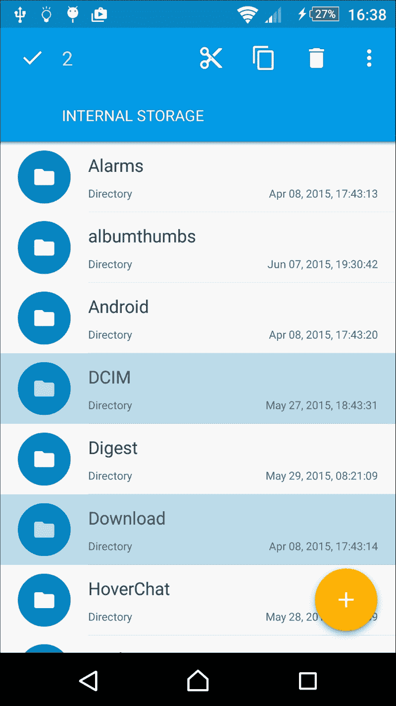
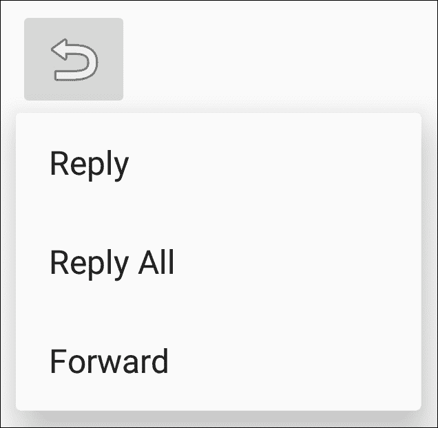

# 第四章：菜单

在本章中，我们将涵盖以下主题：

+   创建选项菜单

+   在运行时修改菜单和菜单项

+   为视图启用上下文操作模式

+   在 ListView 中使用上下文批量模式

+   创建弹出菜单

# 引言

Android 操作系统是一个不断变化的环境。最早的 Android 设备（在 Android 3.0 之前）需要有一个硬件菜单按钮。尽管现在不再需要硬件按钮，但菜单的重要性并未降低。实际上，**Menu** API 已经扩展，现在支持三种不同类型的菜单：

+   **选项菜单和操作栏**：这是标准的菜单，用于应用程序的全局选项。使用它来添加额外的功能，如搜索、设置等。

+   **上下文模式**（**上下文操作模式**）：这通常通过长按激活。（可以把它看作是在桌面上右键点击。）这用于对按下的项目执行操作，如回复电子邮件或删除文件。

+   **弹出菜单**：这为附加操作提供了一个弹出式选择（如下拉菜单）。菜单选项不是用来影响按下的项目，而是像前面描述的那样使用上下文模式。例如，点击分享按钮并获得额外的分享选项列表。

菜单资源与其他 Android UI 组件类似；它们通常在 XML 中创建，但也可以在代码中创建。我们第一个食谱，如下一节所示，将展示 XML 菜单格式以及如何扩展它。

# 创建选项菜单

在我们实际创建和显示菜单之前，先来看一下菜单的最终效果。以下是 Chrome 浏览器菜单部分的截图：


最明显的特点是，菜单会根据屏幕大小显示不同的样子。默认情况下，菜单项将被添加到溢出菜单中——这就是当你点击最右侧边缘的三个点时看到的菜单。

菜单通常在资源文件中使用`XML`创建（像许多其他 Android 资源一样），但它们存储在`res/menu`目录中，尽管也可以在代码中创建。要创建菜单资源，请使用如下所示的`<menu>`元素：

```kt
<menu >
</menu>
```

`<item>`元素定义了每个单独的菜单项，并包含在`<menu>`元素中。一个基本的菜单项如下所示：

```kt
<item 
    android:id="@+id/settings"
    android:title="@string/settings" />
```

最常见的`<item>`属性如下：

+   `id`：这是标准的资源标识符

+   `title`：这表示要显示的文本

+   `icon`：这是一个可绘制的资源

+   `showAsAction`：这已经如下解释（*见下一段*）

+   `enabled`：默认情况下是启用的

让我们更详细地看一下`showAsAction`。

`showAsAction`属性控制菜单项的显示方式。选项包括以下内容：

+   `ifRoom`：如果空间足够，此菜单项应包含在操作栏中

+   `withText`：表示应显示标题和图标

+   `never`：表示菜单项不应包含在操作栏中；始终在溢出菜单中显示。

+   `always`：表示菜单项应始终包含在操作栏中（空间有限，请谨慎使用）。

    ### 注意

    可以使用管道符（|）分隔组合多个选项，例如 `showAsAction="ifRoom|withText"`。

了解了菜单资源的基础知识后，我们现在准备创建一个标准的选项菜单并充气它。

## 准备就绪

使用 Android Studio 创建一个名为 `OptionsMenu` 的新项目。选择默认的 **Phone & Tablet** 选项，并在提示 Activity 类型时选择 **Empty Activity**。由于向导默认不创建 `res/menu` 文件夹，在继续之前，请导航至 **File** | **New | Directory** 来创建它。

## 如何操作...

按照前一部分描述创建新项目后，您就可以创建菜单了。但是，首先，我们将在 `strings.xml` 文件中为菜单标题添加一个字符串资源。在创建菜单的 XML 时，我们将使用新的字符串作为菜单标题。以下是步骤：

1.  首先打开 `strings.xml` 文件，并向 `<resources>` 元素中添加以下 `<string>` 元素：

    ```kt
    <string name="menu_settings">Settings</string>
    ```

1.  在 `res/menu` 目录中创建一个新文件，并将其命名为 `menu_main.xml`。

1.  打开 `menu_main.xml` 文件，并添加以下 XML 来定义菜单：

    ```kt
    <?xml version="1.0" encoding="utf-8"?>
    <menu

        >
        <item android:id="@+id/menu_settings"
            android:title="@string/menu_settings"
            app:showAsAction="never">
        </item>
    </menu>
    ```

1.  创建好菜单后，我们只需在 `ActivityMain.java` 中重写 `onCreateOptionsMenu()` 方法来充气菜单：

    ```kt
    @Override
    public boolean onCreateOptionsMenu(Menu menu) {
        getMenuInflater().inflate(R.menu.menu_main, menu);
        return true;
    }
    ```

1.  在设备或模拟器上运行程序，以查看操作栏中的菜单。

## 工作原理...

这里有两个基本步骤：

1.  在 XML 中定义菜单。

1.  在 Activity 创建时充气菜单。

作为良好的编程习惯，我们在 `strings.xml` 文件中定义字符串，而不是在 `XML` 中硬编码。然后在步骤 3 中使用标准的 Android 字符串标识符为菜单设置标题。由于这是一个“设置”菜单项，我们不希望它在操作栏中显示。为确保它从不显示，请使用 `showAsAction="never"`。

定义好菜单后，我们将在步骤 4 中使用菜单解析器在 Activity 创建期间加载菜单。注意 `R.menu.menu_main` 菜单资源语法吗？这就是为什么我们在 `res/menu` 目录中创建 XML，以便系统知道这是一个菜单资源。

在步骤 4 中，我们使用了 `app:showAsAction` 而不是 Android: `android:showAsAction`。这是因为我们使用了 `AppCompat` 库（也称为 Android 支持库）。默认情况下，Android Studio 新项目向导会在项目中包含支持库。

## 还有更多...

如果你按照第 5 步运行了程序，那么当你按下菜单溢出按钮时，你一定看到了 **设置** 菜单项。但仅此而已。没有其他反应。显然，如果应用程序不响应它们，菜单项就没有什么用处。通过 `onOptionsItemSelected()` 回调来响应 **选项** 菜单。

向应用程序添加以下方法，以在选中设置菜单时显示 Toast：

```kt
@Override
public boolean onOptionsItemSelected(MenuItem item) {
    if (item.getItemId() == R.id.menu_settings) {
        Toast.makeText(this, "Settings", Toast.LENGTH_LONG).show();
    } else {
        return super.onContextItemSelected(item);
    }
    return true;
}
```

就这样。你现在拥有了一个可工作的菜单！

### 提示

如前一个示例所示，处理完回调后返回 `true`；否则，按照 `else` 语句调用超类。

### 使用菜单项启动活动

在此示例中，我们展示了一个 Toast 以便我们可以看到一个工作示例；然而，如果需要，我们同样可以轻松地启动一个新的活动。就像你在第一章的*使用 Intent 对象启动新活动*食谱中所做的那样，创建一个 Intent 并使用 `startActivity()` 调用它。

### 创建子菜单

**子菜单** 的创建和访问几乎与其他菜单元素完全相同，并且可以放置在提供的任何菜单中，尽管它们不能放置在其他的子菜单中。要定义子菜单，请在 `<item>` 元素中包含一个 `<menu>` 元素。以下是此食谱的 XML 形式，其中添加了两个子菜单项：

```kt
<?xml version="1.0" encoding="utf-8"?>
<menu

    >
    <item android:id="@+id/menu_settings
        android:title="@string/menu_settings"
        app:showAsAction="never">
        <menu>
            <item android:id="@+id/menu_sub1"
                android:title="Storage Settings" />
            <item android:id="@+id/menu_sub2"
                android:title="Screen Settings" />
        </menu>
    </item>
</menu>
```

### 分组菜单项

Android 支持的另一个菜单特性是分组菜单项。Android 为组提供了几种方法，包括以下几种：

+   `setGroupVisible()`: 显示或隐藏所有项目

+   `setGroupEnabled()`: 启用或禁用所有项目

+   `setGroupCheckable()`: 设置可勾选行为

### 提示

Android 会将带有 `showAsAction="ifRoom"` 的所有分组项目保持在一起。这意味着具有 `showAsAction="ifRoom"` 的组中的所有项目将位于操作栏中，或者所有项目都位于溢出菜单中。

要创建一个组，请将 `<item>` 菜单项元素添加到 `<group>` 元素中。以下是使用此食谱中的菜单 XML 的示例，其中包含两个分组中的附加项：

```kt
<?xml version="1.0" encoding="utf-8"?>
<menu

    >

    <group android:id="@+id/group_one" >
        <item android:id="@+id/menu_item1"
            android:title="Item 1"
            app:showAsAction="ifRoom"/>
        <item android:id="@+id/menu_item2"
            android:title="Item 2"
            app:showAsAction="ifRoom"/>
    </group>
    <item android:id="@+id/menu_settings"
        android:title="@string/menu_settings"
        app:showAsAction="never"/>
</menu>
```

## 另请参阅

+   要了解有关菜单的完整详情，请访问 Android 开发者菜单资源网站：[`developer.android.com/guide/topics/resources/menu-resource.html`](http://developer.android.com/guide/topics/resources/menu-resource.html)

# 在运行时修改菜单和菜单项

尽管已经多次提到，但在 XML 中创建 UI 而非在 Java 中被认为是“最佳”的编程实践。仍然有些时候你可能需要在代码中完成这一操作。特别是如果你想根据某些外部条件让菜单项可见（或可用）时。菜单可以包含在资源文件夹中，但有时候你需要代码来执行逻辑。例如，如果你想仅在用户登录应用时提供上传菜单项。

在此食谱中，我们将仅通过代码创建和修改菜单。

## 准备就绪

在 Android Studio 中创建一个新项目，将其命名为`RuntimeMenu`，使用默认的**手机和平板**选项。当提示添加活动时，选择**空活动**选项。由于我们将完全在代码中创建和修改菜单，因此我们不需要创建`res/menu`目录。

## 如何操作...

首先，我们将为我们的菜单项添加字符串资源以及一个切换菜单可见性的按钮。打开`res/strings.xml`文件并按照以下步骤操作：

1.  在现有的`<resources>`元素中添加以下两个字符串：

    ```kt
    <string name="menu_download">Download</string>
    <string name="menu_settings">Settings</string>
    ```

1.  在`activity_main.xml`中添加一个按钮，将`onClick()`设置为`toggleMenu`，如下所示：

    ```kt
    <Button
        android:id="@+id/buttonToggleMenu"
        android:layout_width="wrap_content"
        android:layout_height="wrap_content"
        android:text="Toggle Menu"
        android:layout_centerVertical="true"
        android:layout_centerHorizontal="true"
        android:onClick="toggleMenu"/>
    ```

1.  打开`ActivityMain.java`文件，在类声明下方添加以下三行代码：

    ```kt
    private final int MENU_DOWNLOAD = 1;
    private final int MENU_SETTINGS = 2;
    private boolean showDownloadMenu = false;
    ```

1.  添加以下方法供按钮调用：

    ```kt
    public void toggleMenu(View view) {
        showDownloadMenu=!showDownloadMenu;
    }
    ```

1.  当活动首次创建时，Android 调用`onCreateOptionsMenu()`来创建菜单。以下是动态构建菜单的代码：

    ```kt
    @Override
    public boolean onCreateOptionsMenu(Menu menu) {
        menu.add(0, MENU_DOWNLOAD, 0, R.string.menu_download);
        menu.add(0, MENU_SETTINGS, 0, R.string.menu_settings);
        return true;
    }
    ```

1.  为了最佳编程实践，不要使用`onCreateOptionsMenu()`来更新或更改你的菜单；而是使用`onPrepareOptionsMenu()`。以下是根据我们的标志更改**下载**菜单项可见性的代码：

    ```kt
    @Override
    public boolean onPrepareOptionsMenu(Menu menu) {
        MenuItem menuItem = menu.findItem(MENU_DOWNLOAD);
        menuItem.setVisible(showDownloadMenu);
        return true;
    }
    ```

1.  虽然从技术上讲这个菜谱不需要，但这段`onOptionsItemSelected()`代码展示了如何响应每个菜单项：

    ```kt
    @Override
    public boolean onOptionsItemSelected(MenuItem item) {
        switch (item.getItemId()) {
            case MENU_DOWNLOAD:
                Toast.makeText(this, R.string.menu_download, Toast.LENGTH_LONG).show();
                break;
            case MENU_SETTINGS:
                Toast.makeText(this, R.string.menu_settings, Toast.LENGTH_LONG).show();
                break;
            default:
                return super.onContextItemSelected(item);
        }
        return true;
    }
    ```

1.  在设备或模拟器上运行程序以查看菜单更改。

## 工作原理...

我们为`onCreateOptionsMenu()`创建了一个重写，就像在之前的菜谱*创建选项菜单*中所做的那样。但我们没有膨胀现有的菜单资源，而是使用`Menu.add()`方法创建菜单。由于我们希望在以后修改菜单项以及响应菜单项事件，因此我们定义了自己的菜单 ID 并将它们传递给`add()`方法。

`onOptionsItemSelected()`被所有菜单项调用，因此我们获取菜单 ID 并根据我们创建的 ID 使用`switch`语句。如果我们正在处理菜单事件，则返回`true`；否则，我们将事件传递给超类。

菜单的更改发生在`onPrepareOptionsMenu()`方法中。为了模拟外部事件，我们创建了一个按钮来切换布尔标志。**下载**菜单的可见性由该标志决定。这就是你需要根据你设定的条件创建自定义代码的地方。你的标志可以使用当前玩家等级来设置，或者当有新等级准备发布时；你发送一个推送消息，从而启用菜单项。

## 还有更多...

如果我们希望这个**下载**选项容易被注意到以指示其是否可用呢？我们可以在`onPrepareOptionsMenu()`中添加以下代码（在返回语句之前），告诉 Android 我们希望操作栏中显示菜单：

```kt
menuItem.setShowAsAction(MenuItem.SHOW_AS_ACTION_ALWAYS);
```

现在如果你运行代码，你将在操作栏中看到**下载**菜单项，但行为并不正确。

之前，当我们没有在操作栏中显示菜单项时，每次打开溢出菜单，安卓都会调用 `onPrepareOptionsMenu()` 以更新可见性。为了纠正这种行为，请在由按钮调用的 `toggleMenu()` 方法中添加以下代码行：

```kt
invalidateOptionsMenu();
```

`invalidateOptionsMenu()` 调用告诉安卓我们的选项菜单不再有效，这将强制调用 `onPrepareOptionsMenu()`，从而实现我们预期的行为。

### 注意

安卓将菜单视为始终开启状态，如果菜单项显示在操作栏中。

# 为视图启用上下文操作模式

上下文菜单为特定视图提供附加选项，这与在桌面上右键点击的概念相同。安卓目前支持两种不同的方法：浮动的上下文菜单和上下文模式。上下文操作模式是在安卓 3.0 中引入的。较旧的浮动上下文菜单可能导致混淆，因为没有当前选定项的指示，并且不支持对多个项目进行操作，例如一次选择多个电子邮件进行删除。

## 创建浮动上下文菜单

如果你需要使用旧式的上下文菜单，例如，支持低于安卓 3.0 的设备，它与选项菜单 API 非常相似，只是方法名称不同。要创建菜单，请使用 `onCreateContextMenu()` 而不是 `onCreateOptionsMenu()`。要处理菜单项的选择，请使用 `onContextItemSelected()` 而不是 `onOptionsItemSelected()`。最后，调用 `registerForContextMenu()` 以便系统知道你希望为视图处理上下文菜单事件。

由于上下文模式被认为是显示上下文选项的首选方式，本教程将重点介绍新的 API。上下文模式提供了浮动上下文菜单的所有功能，但通过在批量模式下允许选择多个项目，还增加了额外的功能。

本教程将演示如何在单个视图中设置上下文模式。一旦激活，通过长按，一个**上下文操作栏**（**CAB**）将替代操作栏，直到上下文模式结束。

### 注意

上下文操作栏与操作栏不同，你的活动不需要包含操作栏。

## 准备就绪

使用 Android Studio 创建一个新项目，命名为 `ContextualMode`。选择默认的**手机 & 平板**选项，并在提示添加活动时选择**空活动**。创建一个菜单目录（`res/menu`），就像在第一个教程中*创建选项菜单*时所做的那样，用于存储上下文菜单的 XML。

## 如何操作...

我们将创建一个 **ImageView** 作为初始化上下文模式的宿主视图。由于上下文模式通常是通过长按触发的，我们将在 `onCreate()` 中为 `ImageView` 设置一个长按监听器。当被调用时，我们将启动上下文模式，并传递一个 `ActionMode` 回调来处理上下文模式事件。以下是步骤：

1.  我们将从添加两个新的字符串资源开始。打开 `strings.xml` 文件，并添加以下内容：

    ```kt
    <string name="menu_cast">Cast</string>
    <string name="menu_print">Print</string>
    ```

1.  字符串创建后，我们现在可以通过在 `res/menu` 下创建一个名为 `context_menu.xml` 的新文件来创建菜单，使用以下 XML：

    ```kt
    <?xml version="1.0" encoding="utf-8"?>
    <menu

        >
    <item android:id="@+id/menu_cast"
        android:title="@string/menu_cast" />
    <item android:id="@+id/menu_print"
        android:title="@string/menu_print" /> </menu>
    ```

1.  现在，向 `activity_main.xml` 添加一个 `ImageView`，作为启动上下文模式的源头。以下是 ImageView 的 XML 代码：

    ```kt
    <ImageView
        android:id="@+id/imageView"
        android:layout_width="wrap_content"
        android:layout_height="wrap_content"
        android:layout_centerVertical="true"
        android:layout_centerHorizontal="true"
        android:src="img/ic_launcher"/>
    ```

1.  界面设置好后，我们可以添加上下文模式的代码。首先，我们需要一个全局变量来存储调用 `startActionMode()` 时返回的 `ActionMode` 实例。在 `MainActivity.java` 的类构造函数下方添加以下代码行：

    ```kt
    ActionMode mActionMode;
    ```

1.  接下来，创建一个 `ActionMode` 回调以传递给 `startActionMode()`。在 `MainActivity` 类中添加以下代码，位于上一步的代码下方：

    ```kt
    private ActionMode.Callback mActionModeCallback = new ActionMode.Callback() {
        @Override
        public boolean onCreateActionMode(ActionMode mode, Menu menu) {
            mode.getMenuInflater().inflate(R.menu.context_menu, menu);
            return true;
        }
        @Override
        public boolean onPrepareActionMode(ActionMode mode, Menu menu) {
            return false;
        }
        @Override
        public boolean onActionItemClicked(ActionMode mode, MenuItem item) {
            switch (item.getItemId()) {
                case R.id. menu_cast:
                    Toast.makeText(MainActivity.this, "Cast", Toast.LENGTH_SHORT).show();
                    mode.finish();
                    return true;
                case R.id. menu_print:
                    Toast.makeText(MainActivity.this, "Print", Toast.LENGTH_SHORT).show();
                    mode.finish();
                    return true;
                default:
                    return false;
            }
        }
        @Override
        public void onDestroyActionMode(ActionMode mode) {
            mActionMode = null;
        }
    };
    ```

1.  创建了 `ActionMode` 回调后，我们只需调用 `startActionMode()` 来开始上下文模式。在 `onCreate()` 方法中添加以下代码，以设置长按监听器：

    ```kt
    ImageView imageView = (ImageView)findViewById(R.id.imageView);
    imageView.setOnLongClickListener(new View.OnLongClickListener() {
        public boolean onLongClick(View view) {
            if (mActionMode != null) return false;
            mActionMode = startActionMode(mActionModeCallback);
            return true;
        }
    });
    ```

1.  在设备或模拟器上运行程序，以查看 CAB 的实际效果。

## 工作原理...

正如你在第二步所看到的，我们使用了相同的菜单 XML 来定义上下文菜单，以及其他的菜单。

需要理解的主要代码是 `ActionMode` 回调。这里是我们处理上下文模式事件的地方：初始化菜单、处理菜单项选择以及清理。我们在长按事件中通过调用 `startActionMode()` 并传入在第五步创建的 `ActionMode` 回调来开始上下文模式。

当触发动作模式时，系统会调用 `onCreateActionMode()` 回调，该回调会填充菜单并在上下文操作栏中显示。用户可以通过按返回箭头或返回键来关闭上下文操作栏。当用户进行菜单选择时，CAB 也会关闭。我们显示一个 Toast 以对此食谱提供视觉反馈，但这里是你实现功能的地方。

## 还有更多...

在此示例中，我们从 `startActionMode()` 调用中存储返回的 `ActionMode`。我们使用它来防止在动作模式已经激活时创建新实例。我们还可以使用此实例对上下文操作栏本身进行更改，例如，使用以下方式更改标题：

```kt
mActionMode.setTitle("New Title");
```

当处理多个项目选择时，这特别有用，我们将在下一个食谱中看到。

## 另请参阅

+   请参阅下一个食谱，*在 ListView 中使用上下文批量模式*，以处理多个项目选择

# 在 ListView 中使用上下文批量模式

如前一个食谱所述，上下文模式支持两种使用形式：单一视图模式（如所示）和多重选择（或批量）模式。批量模式是上下文模式优于旧的上下文菜单的地方，因为旧菜单不支持多选。

如果你曾经使用过像 Gmail 这样的电子邮件应用或文件浏览器，你可能在选择多个项目时见过上下文模式。以下是 Solid Explorer 的截图，它展示了材料和上下文模式的优秀实现：



在此食谱中，我们将创建一个填充有多个国家名称的`ListView`，以演示多项选择或批量模式。此示例将使用正常的长按事件以及项目点击事件来启动上下文模式。

## 准备工作

在 Android Studio 中创建一个新项目，将其命名为`ContextualBatchMode`。选择默认的**手机和平板**选项，并在提示添加活动时选择**空活动**。为上下文菜单创建一个菜单目录（`res/menu`）。

## 如何操作...

与之前的食谱类似，我们首先在 XML 中创建一个菜单，以便在开始上下文模式时展开。我们需要定义`MultiChoiceModeListener`来处理`ListView`的批量模式。然后设置`ListView`以允许多项选择，并传入`MultiChoiceModeListener`。以下是步骤：

1.  打开`strings.xml`文件，并按照以下方式添加两个新的字符串资源用于菜单项：

    ```kt
    <string name="menu_move">Move</string>
    <string name="menu_delete">Delete</string>
    ```

1.  在`res/menu`文件夹中创建一个名为`contextual_menu.xml`的新文件，内容如下：

    ```kt
    <?xml version="1.0" encoding="utf-8"?>
    <menu

        >
        <item android:id="@+id/menu_move"
            android:title="@string/menu_move" />
        <item android:id="@+id/menu_delete
            android:title="@string/menu_delete" />
    </menu>
    ```

1.  由于我们需要一个`ListView`，我们将改变`MainActivity`使其从`ListActivity`继承，如下所示：

    ```kt
    public class MainActivity extends ListActivity
    ```

1.  创建一个`MultiChoiceModeListener`来处理上下文操作栏事件。在`MainActivity.java`的类构造函数下方添加以下代码：

    ```kt
    AbsListView.MultiChoiceModeListener mMultiChoiceModeListener = new AbsListView.MultiChoiceModeListener() {
        @Override
        public void onItemCheckedStateChanged(ActionMode mode, int position, long id, boolean checked) {
        }

        @Override
        public boolean onCreateActionMode(ActionMode mode, Menu menu) {
            // Inflate the menu for the CAB
            MenuInflater inflater = mode.getMenuInflater();
            inflater.inflate(R.menu.contextual_menu, menu);
            return true;
        }

        @Override
        public boolean onPrepareActionMode(ActionMode mode, Menu menu) {
            return false;
        }

        @Override
        public boolean onActionItemClicked(ActionMode mode, MenuItem item) {
            // Handle menu selections
            switch (item.getItemId()) {
                case R.id.menu_move
                    Toast.makeText(MainActivity.this, "Move", Toast.LENGTH_SHORT).show();
                    mode.finish();
                    return true;
                case R.id.menu_delete
                    Toast.makeText(MainActivity.this, "Delete", Toast.LENGTH_SHORT).show();
                    mode.finish();
                    return true;
                default:
                    return false;
            }
        }

        @Override
        public void onDestroyActionMode(ActionMode mode) {
        }
    };
    ```

1.  接下来，我们将改变`onCreate()`以设置`ListView`并使用国家名称的字符串数组填充`ListAdapter`，如下所示：

    ```kt
    @Override
    protected void onCreate(Bundle savedInstanceState) {
        super.onCreate(savedInstanceState);

        String[] countries = new String[]{"China", "France", "Germany", "India", "Russia", "United Kingdom", "United States"};
        ListAdapter countryAdapter = new ArrayAdapter<String>(this, android.R.layout.simple_list_item_checked, countries);
        setListAdapter(countryAdapter);
        getListView().setChoiceMode(ListView.CHOICE_MODE_MULTIPLE_MODAL);
        getListView().setMultiChoiceModeListener(mMultiChoiceModeListener);

        getListView().setOnItemClickListener(new AdapterView.OnItemClickListener() {
            @Override
            public void onItemClick(AdapterView<?> parent, View view, int position, long id) {
                ((ListView)parent).setItemChecked(position, true);
            }
        });
    }
    ```

1.  在设备或模拟器上运行程序，以查看 CAB 的实际操作。

## 它是如何工作的...

使操作模式在批量模式下工作的三个关键元素是：

1.  创建一个上下文菜单以展开

1.  定义`MultiChoiceModeListener`以传递给`setMultiChoiceModeListener()`

1.  将`ListView`的`ChoiceMode`设置为`CHOICE_MODE_MULTIPLE_MODAL`。

`MultiChoiceModeListener`与单视图上下文模式中使用的`ActionMode`回调相同，实际上实现了`ActionMode.Callback`。与`ActionMode.Callback`一样，当`MultiChoiceModeListener`调用`onCreateActionMode()`时，菜单会被展开。

默认情况下，通过在`ListView`中的项目上长按来启动上下文模式。我们将更进一步，当使用`onItemClick()`事件选中项目时启动上下文模式。如果我们不这样做，启动上下文模式的唯一方式就是通过长按，这可能会让许多用户不知道有额外的功能。

## 还有更多...

正如本章引言中提到的，你的活动不需要包含操作栏就可以使用上下文操作栏。如果你确实有一个操作栏并且它可见，它将被 CAB 覆盖。如果你没有操作栏作为此食谱的默认设置，布局将被重绘以包含 CAB（当 CAB 消失时再次重绘）。如果你希望操作栏可见，可以更改活动的主题或更改基类，并手动设置`ListView`。

## 另请参阅

+   有关`ListView`的更多信息，请参考第二章，*布局*

# 创建弹出菜单

弹出菜单附加到一个类似于下拉菜单的视图上。弹出菜单的想法是提供额外的选项来完成一个动作。一个常见的例子可能是电子邮件应用中的**回复**按钮。按下时，会显示几个回复选项，如：**回复**，**回复所有人**和**转发**。

下面是食谱中的弹出菜单示例：



如果有空间，Android 将在锚视图下方显示菜单选项；否则，它将在视图上方显示。

### 提示

弹出菜单*不是*用来影响视图本身的。这是上下文菜单的目的。相反，请参考*为视图启用上下文操作模式*食谱中描述的浮动菜单/上下文模式。

在这个食谱中，我们将使用一个`ImageButton`作为锚视图，创建前面显示的弹出菜单。

## 准备就绪

在 Android Studio 中创建一个新项目，并将其命名为`PopupMenu`。使用默认的**手机 & 平板**选项，在选择添加活动时选择**空活动**。像以前一样，创建一个菜单目录（`res/menu`）来存储菜单 XML。

## 如何操作...

我们首先创建在按钮按下时充气的 XML 菜单。在充气弹出菜单之后，我们通过传递回调来处理菜单项选择的回调来调用`setOnMenuItemClickListener()`。以下是步骤：

1.  向`strings.xml`添加以下字符串：

    ```kt
    <string name="menu_reply">Reply</string>
    <string name="menu_reply_all">Reply All</string>
    <string name="menu_forward">Forward</string>
    ```

1.  在`res/menu`目录下创建一个名为`menu_popup.xml`的新文件，使用以下 XML：

    ```kt
    <?xml version="1.0" encoding="utf-8"?>
    <menu

        >
        <item android:id="@+id/menu_reply
            android:title="@string/menu_reply" />
        <item android:id="@+id/menu_reply_all
            android:title="@string/menu_reply_all" />
        <item android:id="@+id/menu_forward
            android:title="@string/menu_forward" />
    </menu>
    ```

1.  在`activity_main.xml`中创建一个`ImageButton`，为弹出菜单提供锚视图。按照以下 XML 代码所示创建它：

    ```kt
    <ImageButton
        android:id="@+id/imageButtonReply"
        android:layout_width="wrap_content"
        android:layout_height="wrap_content"
        android:layout_centerVertical="true"
        android:layout_centerHorizontal="true"
        android:src="img/ic_menu_revert"
        android:onClick="showPopupMenu"/>
    ```

1.  打开`MainActivity.java`，并在类构造函数下面添加以下`OnMenuItemClickListener`：

    ```kt
    private PopupMenu.OnMenuItemClickListener mOnMenuItemClickListener = new PopupMenu.OnMenuItemClickListener() {
        @Override
        public boolean onMenuItemClick(MenuItem item) {
            // Handle menu selections
            switch (item.getItemId()) {
                case R.id.menu_reply
                    Toast.makeText(MainActivity.this, "Reply", Toast.LENGTH_SHORT).show();
                    return true;
                case R.id.menu_reply_all
                    Toast.makeText(MainActivity.this,"Reply All",Toast.LENGTH_SHORT).show();
                    return true;
                case R.id.menu_forward
                    Toast.makeText(MainActivity.this, "Forward", Toast.LENGTH_SHORT).show();
                    return true;
                default:
                    return false;
            }
        }
    };
    ```

1.  最后的代码是处理按钮`onClick()`事件，如下所示：

    ```kt
    public void showPopupMenu(View view) {
        PopupMenu popupMenu = new PopupMenu(MainActivity.this,view);
        popupMenu.inflate(R.menu.menu_popup);
        popupMenu.setOnMenuItemClickListener(mOnMenuItemClickListener);
        popupMenu.show();
    }
    ```

1.  在设备或模拟器上运行程序，以查看弹出菜单。

## 它是如何工作的...

如果你读过前面的菜单食谱，这可能看起来非常熟悉。基本上，我们只是在`ImageButton`被按下时充气弹出菜单。我们设置一个菜单项监听器来响应菜单选择。

关键是要了解 Android 中可用的每个菜单选项，这样你就可以为特定场景使用正确的菜单类型。这将帮助你的应用程序提供一致的用户体验，并降低学习曲线。
