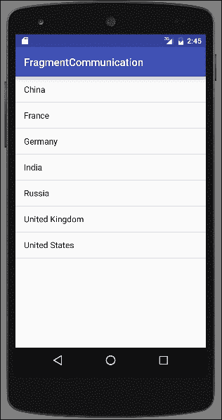
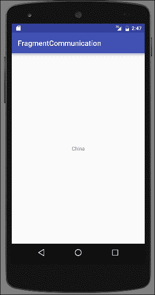
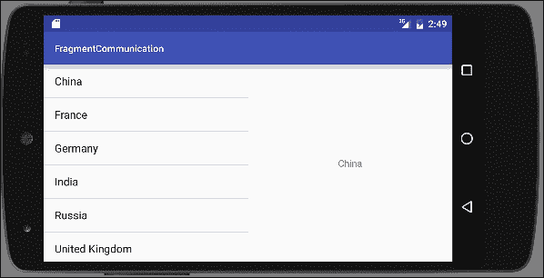
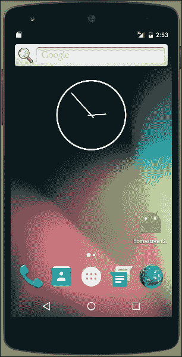
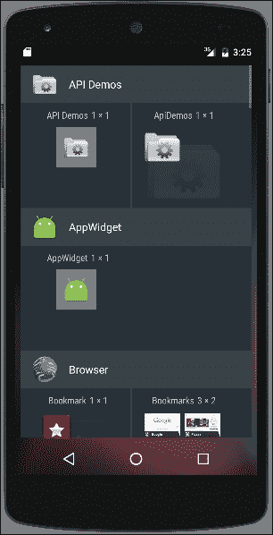
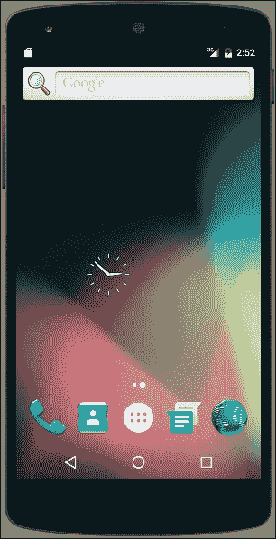
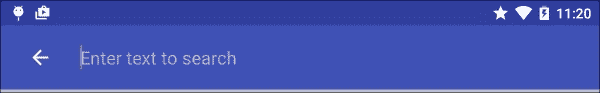

# 第五章：探索片段、应用小部件和系统界面

在本章中，我们将涵盖以下主题：

+   创建和使用片段

+   运行时添加和移除片段

+   在片段间传递数据

+   在主屏幕上创建快捷方式

+   在主屏幕上创建小部件

+   向操作栏添加搜索

+   让你的应用全屏显示

# 引言

通过第二章对布局的深入了解，*布局*，我们将进一步探讨使用片段的用户界面开发。片段是将你的用户界面分割成更小部分的一种方式，这些部分可以轻松复用。将片段视为迷你活动，它们有自己的类、布局和生命周期。你不需要在一个活动布局中设计整个屏幕，可能在多个布局中重复功能，你可以将屏幕分解成更小、逻辑上的部分，并将它们转换为片段。然后，你的活动布局可以根据需要引用一个或多个片段。前三个食谱将深入探讨片段。

了解片段后，我们准备扩展关于小部件的讨论。在第三章中，*视图、小部件和样式*，我们讨论了如何向你的应用添加小部件。现在，我们将看看如何创建一个应用小部件，以便用户可以将他们的应用放在主屏幕上。

本章最后的食谱将探讨系统界面选项。我们有一个食谱，介绍如何使用 Android `SearchManager` API 在操作栏中添加 `Search` 选项。最后一个食谱展示了全屏模式以及几种改变系统界面的额外变体。

# 创建和使用片段

安卓并非一直支持片段。早期的安卓版本是为手机设计的，当时屏幕相对较小。直到安卓开始被用在平板上，才需要将屏幕分割成更小的部分。安卓 3.0 引入了 `Fragments` 类和片段管理器。

随着新类的出现，也引入了片段生命周期。片段生命周期与第一章中介绍的活动生命周期相似，*活动*，因为大多数事件与活动生命周期平行。

下面是主要回调函数的简要概述：

+   `onAttach()`: 当片段与活动关联时调用。

+   `onCreate()`: 当片段首次被创建时调用。

+   `onCreateView()`: 当片段即将第一次显示时调用。

+   `onActivityCreated()`: 当关联的活动被创建时调用。

+   `onStart()`: 当片段将要对用户可见时调用。

+   `onResume()`: 在片段显示之前调用。

+   `onPause()`: 当片段首次被暂停时调用。用户可能会返回到片段，但这里是你应该保存任何用户数据的地方。

+   `onStop()`: 当片段对用户不再可见时调用。

+   `onDestroyView()`：它被调用以允许最后的清理。

+   `onDetach()`：当片段不再与活动关联时调用。

在我们的第一个练习中，我们将创建一个从标准`Fragment`类派生的新片段。但我们还可以从其他几个`Fragment`类派生，包括：

+   `DialogFragment`：用于创建一个浮动的对话框

+   `ListFragment`：它在片段中创建一个`ListView`，类似于`ListActivity`

+   `PreferenceFragment`：它创建一个偏好设置对象列表，通常用于设置页面

在本教程中，我们将通过创建一个基于`Fragment`类的简单片段，并将其包含在活动布局中来逐步操作。

## 准备工作

在 Android Studio 中创建一个新项目，并将其命名为`CreateFragment`。使用默认的**Phone & Tablet**选项，在选择活动类型时选择**Empty Activity**选项。

## 如何操作...

在本教程中，我们将创建一个带有伴随布局文件的新`Fragment`类。然后，我们将片段添加到活动布局中，以便在活动启动时能够看到它。以下是创建和显示新片段的步骤：

1.  使用以下 XML 创建一个名为`fragment_one.xml`的新布局：

    ```kt
    <RelativeLayout 
        android:layout_height="match_parent"
        android:layout_width="match_parent">
        <TextView
            android:layout_width="wrap_content"
            android:layout_height="wrap_content"
            android:text="Fragment One"
            android:id="@+id/textView"
            android:layout_centerVertical="true"
            android:layout_centerHorizontal="true" />
    </RelativeLayout>
    ```

1.  创建一个名为`FragmentOne`的新 Java 文件，并使用以下代码：

    ```kt
    public class FragmentOne extends Fragment {
        @Override
        public View onCreateView(LayoutInflater inflater, ViewGroup container, Bundle savedInstanceState) {
            return inflater.inflate(R.layout.fragment_one, container, false);
        }
    }
    ```

1.  打开`main_activity.xml`文件，用以下`<fragment>`元素替换现有的`<TextView>`元素：

    ```kt
      <fragment
        android:name="com.packtpub.androidcookbook.createfragment.FragmentOne"
        android:id="@+id/fragment"
        android:layout_width="wrap_content"
        android:layout_height="wrap_content"
        android:layout_centerVertical="true"
        android:layout_centerHorizontal="true"
        tools:layout="@layout/fragment_one" />
    ```

1.  在设备或模拟器上运行程序。

## 它是如何工作的...

我们首先像创建活动一样创建一个新类。在本教程中，我们只创建了一个`onCreateView()`方法的覆盖，以加载我们的片段布局。但是，与活动事件一样，我们可以根据需要覆盖其他事件。创建新的片段后，我们将其添加到活动布局中。由于`Activity`类是在`Fragments`存在之前创建的，所以它们不支持`Fragments`。如果我们使用纯框架类，我们会希望使用`FragmentActivity`。如果你使用了 Android Studio 的新项目向导，那么默认情况下`MainActivity`扩展了`AppCompatActivity`，这已经包括了片段的支持。

## 还有更多...

在此教程中，我们仅创建一个简单的片段来教授片段的基础知识。但现在是指出片段强大功能的好时机。如果我们正在创建多个片段（通常是这样，因为使用片段的目的就在于此），在步骤 4 中创建活动布局时，我们可以使用 Android 资源文件夹创建不同的布局配置。竖屏布局可能只有一个片段，而横屏可能有多个片段。

# 在运行时添加和移除片段

在布局中定义一个 Fragment，就像我们在上一个配方中所做的那样，这称为静态 Fragment，在运行时无法更改。我们将创建一个容器来保存 Fragment，而不是使用`<fragment>`元素，然后在 Activity 的`onCreate()`方法中动态创建 Fragment。

`FragmentManager`提供了在运行时使用`FragmentTransaction`添加、移除和更改 Fragments 的 API。一个 Fragment 事务包括：

+   开始一个事务

+   执行一个或多个动作

+   提交事务

这个配方将展示通过在运行时添加和移除 Fragments 来演示`FragmentManager`。

## 准备就绪

在 Android Studio 中创建一个新项目，并将其命名为`RuntimeFragments`。使用默认的**Phone & Tablet**选项，在选择**Activity Type**时选择**Empty Activity**。

## 如何操作...

为了演示添加和移除 Fragments，我们首先需要创建 Fragments，这可以通过扩展`Fragment`类来完成。创建新的 Fragments 后，我们需要更改主活动的布局以包含`Fragment`容器。从那里，我们只需添加处理 Fragment 事务的代码。以下是步骤：

1.  创建一个名为`fragment_one.xml`的新布局文件，并包含以下 XML：

    ```kt
    <RelativeLayout 
        android:layout_height="match_parent"
        android:layout_width="match_parent">
        <TextView
            android:layout_width="wrap_content"
            android:layout_height="wrap_content"
            android:text="Fragment One"
            android:id="@+id/textView"
            android:layout_centerVertical="true"
            android:layout_centerHorizontal="true" />
    </RelativeLayout>
    ```

1.  第二个名为`fragment_two.xml`的布局文件几乎相同，唯一的区别是文本：

    ```kt
    android:text="Fragment Two"
    ```

1.  创建一个名为`FragmentOne`的新 Java 文件，并包含以下代码：

    ```kt
    public class FragmentOne extends Fragment {
        @Override
        public View onCreateView(LayoutInflater inflater, ViewGroup container, Bundle savedInstanceState) {
            return inflater.inflate(R.layout.fragment_one, container, false);
        }
    }
    ```

    从以下库导入：

    ```kt
    android.support.v4.app.Fragment
    ```

1.  创建第二个名为`FragmentTwo`的 Java 文件，并包含以下代码：

    ```kt
    public class FragmentTwo extends Fragment {
        @Override
        public View onCreateView(LayoutInflater inflater, ViewGroup container, Bundle savedInstanceState) {
            return inflater.inflate(R.layout.fragment_two, container, false);
        }
    }
    ```

    从以下库导入：

    ```kt
    android.support.v4.app.Fragment
    ```

1.  现在我们需要在主活动布局中添加一个容器和一个按钮。如下更改`main_activity.xml`：

    ```kt
    <?xml version="1.0" encoding="utf-8"?>
    <RelativeLayout 

        android:layout_width="match_parent"
        android:layout_height="match_parent">
        <FrameLayout
            android:id="@+id/frameLayout"
            android:layout_width="match_parent"
            android:layout_height="wrap_content"
            android:layout_above="@+id/buttonSwitch"
            android:layout_alignParentTop="true">
        </FrameLayout>
        <Button
            android:id="@+id/buttonSwitch"
            android:layout_width="wrap_content"
            android:layout_height="wrap_content"
            android:text="Switch"
            android:layout_alignParentBottom="true"
            android:layout_centerInParent="true"
            android:onClick="switchFragment"/>
    </RelativeLayout>
    ```

1.  创建了 Fragments 并且将容器添加到布局中后，我们现在准备编写操作 Fragments 的代码。打开`MainActivity.java`并在类构造函数下面添加以下代码：

    ```kt
    FragmentOne mFragmentOne;
    FragmentTwo mFragmentTwo;
    int showingFragment=0;
    ```

1.  在现有的`onCreate()`方法中，在`setContentView()`下面添加以下代码：

    ```kt
    mFragmentOne = new FragmentOne();
    mFragmentTwo = new FragmentTwo();
    FragmentManager fragmentManager = getSupportFragmentManager();
    FragmentTransaction fragmentTransaction = fragmentManager.beginTransaction();
    fragmentTransaction.add(R.id.frameLayout, mFragmentOne);
    fragmentTransaction.commit();
    showingFragment=1;
    ```

    从以下库导入：

    ```kt
    android.support.v4.app.FragmentManager
    android.support.v4.app.FragmentTransaction
    ```

1.  我们需要添加的最后一段代码处理按钮触发的 Fragment 切换：

    ```kt
    public void switchFragment(View view) {
        FragmentManager fragmentManager = getSupportFragmentManager();
        FragmentTransaction fragmentTransaction = fragmentManager.beginTransaction();
        if (showingFragment==1) {
            fragmentTransaction.replace(R.id.frameLayout, mFragmentTwo);
            showingFragment = 2;
        } else {
            fragmentTransaction.replace(R.id.frameLayout, mFragmentOne);
            showingFragment=1;
        }
        fragmentTransaction.commit();
    }
    ```

1.  在设备或模拟器上运行程序。

## 工作原理...

这个配方的多数步骤涉及设置 Fragments。一旦声明了 Fragments，我们将在`onCreate()`方法中创建它们。尽管代码可以压缩成单行，但它以长形式展示，这样更容易阅读和理解。

首先，我们获取`FragmentManager`以便开始一个`FragmentTransaction`。一旦有了`FragmentTransaction`，我们通过`beginTransaction()`开始事务。在事务中可以发生多个动作，但这里我们只需要`add()`我们的初始 Fragment。我们调用`commit()`方法来最终确定事务。

现在您理解了 Fragment 事务，这是`onCreate()`的简洁版本：

```kt
getFragmentManager().beginTransaction().add(R.id.framLayout, mFragmentOne).commit();
```

`switchFragment`基本上执行相同类型的 Fragment 事务。我们不是调用`add()`方法，而是使用`replace()`方法替换现有 Fragment。我们通过`showingFragment`变量跟踪当前 Fragment，这样我们就知道接下来要显示哪个 Fragment。我们不仅限于在两个 Fragment 之间切换。如果我们需要额外的 Fragment，只需创建它们即可。

## 还有更多...

在第一章《活动》中的*活动间切换*一节，我们讨论了返回栈。大多数用户会期望按返回键可以向后穿过“屏幕”，他们不知道或不在乎这些屏幕是活动还是 Fragment。幸运的是，Android 通过在调用`commit()`之前添加对`addToBackStack()`的调用，非常容易地将 Fragment 添加到返回栈中。

### 提示

如果在没有将 Fragment 添加到返回栈的情况下移除或替换它，它将被立即销毁。如果添加到返回栈中，它会被停止，如果用户返回到该 Fragment，它将被重新启动，而不是重新创建。

# 在 Fragment 之间传递数据

通常，需要在 Fragment 之间传递信息。电子邮件应用程序就是一个典型的例子。通常在一个 Fragment 中显示电子邮件列表，在另一个 Fragment 中显示电子邮件详情（这通常被称为 Master/Detail 模式）。由于我们只需要为每个 Fragment 编写一次代码，然后就可以将它们包含在不同的布局中，所以 Fragment 使得创建这种模式变得更容易。我们可以在纵向布局中轻松地拥有一个单独的 Fragment，并在选择电子邮件时，用详情 Fragment 替换主 Fragment。我们还可以创建一个双面板布局，其中列表和详情 Fragment 并排显示。无论哪种方式，当用户点击列表中的电子邮件时，电子邮件都会在详情面板中打开。这就是我们需要在两个 Fragment 之间进行通信的时候。

由于 Fragment 的一个主要目标是完全自包含，因此不建议直接在 Fragment 之间进行通信，这有充分的理由。如果 Fragment 必须依赖其他 Fragment，当布局更改且只有一个 Fragment 可用时，你的代码很可能会出问题。幸运的是，在这种情况下也不需要直接通信。所有 Fragment 的通信都应该通过宿主活动进行。宿主活动负责管理 Fragment，并且可以正确地传递消息。

现在的问题变成了：Fragment 是如何与活动通信的？答案是：通过一个`接口`。你可能已经熟悉了接口，因为视图就是通过接口将事件回传给活动的。按钮点击就是一个常见的例子。

在此食谱中，我们将创建两个片段，以展示通过宿主活动从一个片段向另一个片段传递数据。我们将在上一个食谱的基础上，包括两种不同的活动布局——一种用于竖屏，一种用于横屏。在竖屏模式下，活动将根据需要交换片段。以下是应用程序首次在竖屏模式下运行时的截图：



这是当你点击国家名称时显示详情片段的屏幕：



在横屏模式下，两个片段将并排显示，如下横屏截图所示：



由于主/详模式通常涉及主列表，我们将利用 `ListFragment`（在*创建和使用片段*介绍中提到）。当列表中的项目被选中时，项目文本（在我们的示例中是国家名称）将通过宿主 Activity 发送到详情片段。

## 准备工作

在 Android Studio 中创建一个新项目，并将其命名为 `Fragmentcommunication`。使用默认的 **Phone & Tablet** 选项，在选择 **Activity Type** 时选择 **Empty Activity**。

## 如何操作...

为了完全展示工作的片段，我们需要创建两个片段。第一个片段将继承自 `ListFragment`，因此不需要布局。我们还将进一步创建活动和横屏模式下的两种布局。对于竖屏模式，我们将交换片段，对于横屏模式，我们将并排显示两个片段。

### 注意

在输入这段代码时，Android Studio 会提供两个不同的库导入选项。由于新项目向导会自动引用 `AppCompat` 库，我们需要使用支持库 API 而非框架 API。尽管它们非常相似，以下代码使用了支持片段 API。

下面是从第一个片段开始的步骤：

1.  创建一个名为 `MasterFragment` 的新 Java 类，并将其更改为继承 `ListFragment`，如下所示：

    ```kt
    public class MasterFragment extends ListFragment
    ```

    从以下库导入：

    ```kt
    android.support.v4.app.ListFragment
    ```

1.  在 `MasterFragment` 类内部创建以下 `interface`：

    ```kt
    public interface OnMasterSelectedListener {
        public void onItemSelected(String countryName);
    }
    ```

1.  使用以下代码设置接口回调监听器：

    ```kt
    private OnMasterSelectedListener mOnMasterSelectedListener=null;

    public void setOnMasterSelectedListener(OnMasterSelectedListener listener) {
        mOnMasterSelectedListener=listener;
    }
    ```

1.  `MasterFragment` 的最后一步是创建一个 `ListAdapter` 来填充 `ListView`，我们在 `onViewCreated()` 方法中进行。我们将使用 `setOnItemClickListener()` 在选择国家名称时调用我们的 `OnMasterSelectedListener` 接口，代码如下：

    ```kt
    public void onViewCreated(View view, Bundle savedInstanceState) {
        super.onViewCreated(view, savedInstanceState);
        String[] countries = new String[]{"China", "France", "Germany", "India", "Russia", "United Kingdom", "United States"};
        ListAdapter countryAdapter = new ArrayAdapter<String>(getActivity(), android.R.layout.simple_list_item_1, countries);
        setListAdapter(countryAdapter);
        getListView().setChoiceMode(ListView.CHOICE_MODE_SINGLE);
        getListView().setOnItemClickListener(new AdapterView.OnItemClickListener() {
            @Override
            public void onItemClick(AdapterView<?> parent, View view, int position, long id) {
                if (mOnMasterSelectedListener != null) {
                    mOnMasterSelectedListener.onItemSelected(((TextView) view).getText().toString());
                }
            }
        });
    }
    ```

1.  接下来我们需要创建 `DetailFragment`，从布局开始。创建一个名为 `fragment_detail.xml` 的新布局文件，包含以下 XML：

    ```kt
    <?xml version="1.0" encoding="utf-8"?>
    <RelativeLayout

        android:layout_width="match_parent"
        android:layout_height="match_parent">
        <TextView
            android:id="@+id/textViewCountryName"
            android:layout_width="wrap_content"
            android:layout_height="wrap_content"
            android:layout_centerVertical="true"
            android:layout_centerHorizontal="true" />
    </RelativeLayout>
    ```

1.  创建一个名为 `DetailFragment` 的新 Java 类，继承自 `Fragment`，如下所示：

    ```kt
    public class DetailFragment extends Fragment
    ```

    从以下库导入：

    ```kt
    android.support.v4.app.Fragment
    ```

1.  将以下常量添加到类中：

    ```kt
    public static String KEY_COUNTRY_NAME="KEY_COUNTRY_NAME";
    ```

1.  按如下方式覆盖 `onCreateView()`：

    ```kt
    public View onCreateView(LayoutInflater inflater, ViewGroup container, Bundle savedInstanceState) {
        return inflater.inflate(R.layout.fragment_detail, container, false);
    }
    ```

1.  按如下方式编写 `onViewCreated()`：

    ```kt
    public void onViewCreated(View view, Bundle savedInstanceState) {
        super.onViewCreated(view, savedInstanceState);

        Bundle bundle = getArguments();
        if (bundle != null && bundle.containsKey(KEY_COUNTRY_NAME)) {
            showSelectedCountry(bundle.getString(KEY_COUNTRY_NAME));
        }
    }
    ```

1.  对于这个 Fragment 的最后一个步骤是在接收到选定的国家名称时更新 TextView。将以下方法添加到类中：

    ```kt
    public void showSelectedCountry(String countryName) {
        ((TextView)getView().findViewById(R.id.textViewCountryName)).setText(countryName);
    }
    ```

1.  现有的`activity_main.xml`布局将处理竖屏模式的布局。移除现有的`<TextView>`并替换为以下`<FrameLayout>`：

    ```kt
    <FrameLayout
        android:id="@+id/frameLayout"
        android:layout_width="match_parent"
        android:layout_height="match_parent"/>
    ```

1.  在**res**文件夹中为横屏布局创建一个新目录，如：`res/layout-land`。

    ### 提示

    如果你没有看到新的`res/layout-land`目录，从**Android**视图更改为**Project**视图。

1.  在`res/layout-land`中创建一个新的`activity_main.xml`布局，如下所示：

    ```kt
    <?xml version="1.0" encoding="utf-8"?>
    <LinearLayout 

        android:layout_width="match_parent"
        android:layout_height="match_parent"
        android:orientation="horizontal">
        <FrameLayout
            android:id="@+id/frameLayoutMaster"
            android:layout_width="0dp"
            android:layout_weight="1"
            android:layout_height="match_parent"/>
        <FrameLayout
            android:id="@+id/frameLayoutDetail"
            android:layout_width="0dp"
            android:layout_weight="1"
            android:layout_height="match_parent"/>
    </LinearLayout>
    ```

1.  最后的步骤是设置`MainActivity`以处理 Fragments。打开`MainActivity.java`文件，并添加以下类变量以跟踪单/双面板：

    ```kt
    boolean dualPane;
    ```

1.  接下来，按如下方式更改`onCreate()`：

    ```kt
    protected void onCreate(Bundle savedInstanceState) {
        super.onCreate(savedInstanceState);
        setContentView(R.layout.activity_main);

        MasterFragment masterFragment=null;
        FrameLayout frameLayout = (FrameLayout)findViewById(R.id.frameLayout);
        if (frameLayout != null) {
            dualPane=false;
            FragmentTransaction fragmentTransaction = getSupportFragmentManager().beginTransaction();
            masterFragment=(MasterFragment)getSupportFragmentManager().findFragmentByTag("MASTER");
            if (masterFragment == null) {
                masterFragment = new MasterFragment();
                fragmentTransaction.add(R.id.frameLayout, masterFragment, "MASTER");
            }
            DetailFragment detailFragment = (DetailFragment)getSupportFragmentManager().findFragmentById(R.id.frameLayoutDetail);
            if (detailFragment != null) {
                fragmentTransaction.remove(detailFragment);
            }
            fragmentTransaction.commit();
        } else {
            dualPane=true;
            FragmentTransaction fragmentTransaction = getSupportFragmentManager().beginTransaction();
            masterFragment=(MasterFragment)getSupportFragmentManager().findFragmentById(R.id.frameLayoutMaster);
            if (masterFragment==null) {
                masterFragment = new MasterFragment();
                fragmentTransaction.add(R.id.frameLayoutMaster, masterFragment);
            }
            DetailFragment detailFragment=(DetailFragment)getSupportFragmentManager().findFragmentById(R.id.frameLayoutDetail);
            if (detailFragment==null) {
                detailFragment = new DetailFragment();
                fragmentTransaction.add(R.id.frameLayoutDetail, detailFragment);
            }
            fragmentTransaction.commit();
        }
        masterFragment.setOnMasterSelectedListener(new MasterFragment.OnMasterSelectedListener() {
            @Override
            public void onItemSelected(String countryName) {
                sendCountryName(countryName);
            }
        });
    }
    ```

1.  需要添加的最后一段代码是处理将国家名称发送给`DetailFragment`的`sendCountryName()`方法：

    ```kt
    private void sendCountryName(String countryName) {
        DetailFragment detailFragment;
        if (dualPane) {
            //Two pane layout
            detailFragment = (DetailFragment)getSupportFragmentManager().findFragmentById(R.id.frameLayoutDetail);
            detailFragment.showSelectedCountry(countryName);
        } else {
            // Single pane layout
            detailFragment = new DetailFragment();
            Bundle bundle = new Bundle();
            bundle.putString(DetailFragment.KEY_COUNTRY_NAME, countryName);
            detailFragment.setArguments(bundle);
            FragmentTransaction fragmentTransaction = getSupportFragmentManager().beginTransaction();
            fragmentTransaction.replace(R.id.frameLayout, detailFragment);
            fragmentTransaction.addToBackStack(null);
            fragmentTransaction.commit();
        }
    }
    ```

1.  在设备或模拟器上运行程序。

## 工作原理...

我们首先创建`MasterFragment`。在我们使用的 Master/Detail 模式中，这通常代表一个列表，因此我们通过扩展`ListFragment`来创建一个列表。`ListFragment`是`ListActivity`对应的 Fragment 版本。除了从 Fragment 扩展而来，基本上是相同的。

如菜谱介绍中所说，我们不应该尝试直接与其他 Fragments 进行通信。

为了提供一种方法来通知列表项的选择，我们暴露了接口：`OnMasterSelectedListener`。每次在列表中选择一个项目时，我们都会调用`onItemSelected()`。

在 Fragments 之间传递数据的大部分工作由宿主活动完成，但最终，接收 Fragment 需要一种接收数据的方法。`DetailFragment`通过以下两种方式支持这一点：

+   在创建时通过参数包传递国家名称。

+   一个供活动直接调用的公共方法。

当活动创建 Fragment 时，它还会创建一个`bundle`来保存我们想要发送的数据。这里我们使用在步骤 7 中定义的`KEY_COUNTRY_NAME`添加国家名称。我们在`onViewCreated()`中使用`getArguments()`获取这个包。如果包中找到了键，则提取并使用`showSelectedCountry()`方法显示。如果 Fragment 已经可见（在双面板布局中），活动将直接调用此方法。

本菜谱的大部分工作都在活动中完成。我们创建了两个布局：一个用于竖屏，一个用于横屏。Android 将使用在*步骤 12*中创建的`res/layout-land`目录选择横屏布局。这两个布局都使用类似于之前练习的`<FrameLayout>`占位符。我们在`onCreate()`和`sendCountryName()`中管理两种 Fragments。

在`onCreate()`中，我们通过检查当前布局是否包含`frameLayout`视图来设置`dualPane`标志。如果找到了`frameLayout`（它不会为空），那么我们只有一个面板，因为`frameLayout`的 ID 只存在于竖屏布局中。如果没有找到 frameLayout，那么我们将有两个`<FrameLayout>`元素：一个用于`MasterFragment`，另一个用于`DetailFragment`。

在`onCreate()`中我们最后要做的事情是设置`MasterFragment`的监听器，通过创建一个匿名回调函数，将国家名称传递给`sendCountryName()`。

`sendCountryName()`是实际将数据传递给`DetailFragment`的地方。如果我们处于竖屏（或单面板）模式，我们需要创建一个`DetailFragment`并替换现有的`MasterFragment`。在这里，我们创建带有国家名称的包，并调用`setArguments()`。注意我们在提交事务之前是如何调用`addToBackStack()`的吗？这使得按下返回键可以将用户带回列表（`MasterFragment`）。如果我们处于横屏模式，`DetailFragment`已经可见，因此我们直接调用`showSelectedCountry()`公共方法。

## 还有更多...

在`MasterFragment`中，在发送`onItemSelected()`事件之前，我们通过以下代码检查以确保监听器不为空：

```kt
if (mOnMasterSelectedListener != null)
```

虽然活动负责设置回调以接收事件，但我们不希望如果没有监听器这段代码崩溃。另一种方法是在 Fragment 的`onAttach()`回调中验证活动是否扩展了我们的接口。

## 另请参阅

+   有关 ListViews 的更多信息，请参见第二章中的*使用 ListView、GridView 和适配器*，*布局*。

+   有关资源目录的更多信息，请参见第三章中的*根据 Android 版本选择主题*，*视图、小部件和样式*。

# 在主屏幕上创建快捷方式

本食谱解释了如何在用户的主屏幕上为你的应用创建链接或快捷方式。为了避免过于突兀，通常最好让用户在设置中自行选择启动这一选项。

下面是一张截图，展示了我们在主屏幕上的快捷方式：



如你所见，这只是个快捷方式，但在下一个食谱中我们将探讨创建主屏幕（AppWidget）的方法。

## 准备工作

在 Android Studio 中创建一个新项目，将其命名为：`HomescreenShortcut`。使用默认的**手机 & 平板**选项，并在提示**活动类型**时选择**空活动**选项。

## 如何操作...

第一步是添加适当的权限。以下是步骤：

1.  打开`AndroidManifest`文件，并添加以下权限：

    ```kt
    <uses-permission android:name="com.android.launcher.permission.INSTALL_SHORTCUT" />
    ```

1.  接下来，打开`activity_main.xml`，并用以下按钮替换现有的 TextView：

    ```kt
    <Button
        android:layout_width="wrap_content"
        android:layout_height="wrap_content"
        android:text="Create Shortcut"
        android:id="@+id/button"
        android:layout_centerVertical="true"
        android:layout_centerHorizontal="true"
        android:onClick="createShortcut"/>
    ```

1.  向`ActivityMain.java`添加以下方法：

    ```kt
    public void createShortcut(View view) {
        Intent shortcutIntent = new Intent(this, MainActivity.class);
        shortcutIntent.setAction(Intent.ACTION_MAIN);
        Intent intent = new Intent();
        intent.putExtra(Intent.EXTRA_SHORTCUT_INTENT, shortcutIntent);
        intent.putExtra(Intent.EXTRA_SHORTCUT_NAME, getString(R.string.app_name));
        intent.putExtra(Intent.EXTRA_SHORTCUT_ICON_RESOURCE, Intent.ShortcutIconResource.fromContext(this, R.mipmap.ic_launcher));
        intent.setAction("com.android.launcher.action.INSTALL_SHORTCUT");
        sendBroadcast(intent);
    }
    ```

1.  在设备或模拟器上运行程序。注意，每次你按按钮，应用将在主屏幕上创建一个快捷方式。

## 工作原理...

设置了适当的权限后，这个任务相当直接。当按钮被点击时，代码创建了一个名为`shortcutIntent`的新意图。这是当在主屏幕上按下图标时将被调用的意图。接下来创建的意图`installIntent`负责实际创建快捷方式。

## 还有更多...

如果你还想移除快捷方式，你需要以下权限：

```kt
<uses-permission android:name="com.android.launcher.permission.UNINSTALL_SHORTCUT" />
```

与其使用 INSTALL_SHORTCUT 动作，不如设置以下动作：

```kt
com.android.launcher.action.UNINSTALL_SHORTCUT
```

# 创建主屏幕小部件

在我们深入研究创建 App Widget 的代码之前，让我们先了解基础知识。有三个必需和一个可选的组件：

+   `AppWidgetProviderInfo`文件：稍后描述的 XML 资源

+   `AppWidgetProvider`类：这是一个 Java 类

+   视图布局文件：这是一个标准的布局 XML 文件，稍后会列出一些限制

+   App Widget 配置 Activity（可选）：在放置小部件时启动此 Activity 以设置配置选项

`AppWidgetProvider`还必须在`AndroidManifest`文件中声明。由于`AppWidgetProvider`是基于广播接收器的辅助类，因此它使用`<receiver>`元素在清单中声明。以下是一个示例清单条目：

```kt
<receiver android:name="AppWidgetProvider" >
    <intent-filter>
        <action android:name="android.appwidget.action.APPWIDGET_UPDATE" />
    </intent-filter>
    <meta-data android:name="android.appwidget.provider"
        android:resource="@xml/appwidget_info" />
</receiver>
```

元数据指向`AppWidgetProviderInfo`文件，该文件位于`res/xml`目录中。以下是一个示例`AppWidgetProviderInfo.xml`文件：

```kt
<appwidget-provider 
    android:minWidth="40dp"
    android:minHeight="40dp"
    android:updatePeriodMillis="1800000"
    android:previewImage="@drawable/preview_image"
    android:initialLayout="@layout/appwidget"
    android:configure="com.packtpub.androidcookbook.AppWidgetConfiguration"
    android:resizeMode="horizontal|vertical"
    android:widgetCategory="home_screen">
</appwidget-provider>
```

下面是可用属性的简要概述：

+   `minWidth`：放置在主屏幕上的默认宽度

+   `minHeight`：放置在主屏幕上的默认高度

+   `updatePeriodMillis`：它是`onUpdate()`轮询间隔的一部分（以毫秒为单位）

+   `initialLayout`：AppWidget 布局

+   `previewImage`（可选）：浏览 App Widgets 时显示的图片

+   `configure`（可选）：用于启动配置设置的 activity

+   `resizeMode`（可选）：标志表示调整大小选项 - `horizontal`（水平）、`vertical`（垂直）、`none`（无）

+   `minResizeWidth`（可选）：调整大小时允许的最小宽度

+   `minResizeHeight`（可选）：调整大小时允许的最小高度

+   `widgetCategory`（可选）：Android 5+仅支持主屏幕小部件

`AppWidgetProvider`扩展了`BroadcastReceiver`类，这就是在清单中声明 App Widget 时使用`<receiver>`的原因。由于它是`BroadcastReceiver`，该类仍然接收操作系统的广播事件，但辅助类将这些事件过滤为适用于 App Widget 的事件。`AppWidgetProvider`类公开以下方法：

+   `onUpdate()`：在最初创建时以及指定的时间间隔调用。

+   `onAppWidgetOptionsChanged()`：在最初创建时以及任何大小更改时调用。

+   `onDeleted()`：每当小部件被移除时调用。

+   `onEnabled()`: 当小部件首次被放置时调用（在添加第二个及以后的小部件时不会调用）。

+   `onDisabled()`: 当最后一个部件被移除时调用。

+   `onReceive()`: 在接收到每个事件时调用，包括前面的那些事件。通常不重写，因为默认实现只发送适用的事件。

最后一个必需的组件是布局。Remote Views 只支持可用布局的一个子集。由于 App Widget 是 Remote View，因此只支持以下布局：

+   `FrameLayout`

+   `LinearLayout`

+   `RelativeLayout`

+   `GridLayout`

以及以下小部件：

+   `AnalogClock`

+   `Button`

+   `Chronometer`

+   `ImageButton`

+   `ImageView`

+   `ProgressBar`

+   `TextView`

+   `ViewFlipper`

+   `ListView`

+   `GridView`

+   `StackView`

+   `AdapterViewFlipper`

了解了 App Widget 的基础知识后，现在开始编码。我们的示例将涵盖基础知识，以便你可以根据需要扩展功能。这个示例使用了一个带有时钟的视图，按下时，会打开我们的活动。

这张截图显示了在添加到主屏幕时小部件在部件列表中的样子：



### 注意

小部件列表的外观因启动器而异。

这是一张添加到主屏幕后的小部件截图：



## 准备就绪

在 Android Studio 中创建一个新项目，并将其命名为：`AppWidget`。使用默认的**Phone & Tablet**选项，在选择**Activity Type**时选择**Empty Activity**。

## 如何操作...

我们将从创建小部件布局开始，该布局位于标准布局资源目录中。然后我们将创建 xml 资源目录以存储`AppWidgetProviderInfo`文件。我们将添加一个新的 Java 类并扩展`AppWidgetProvider`，它处理小部件的`onUpdate()`调用。创建接收器后，我们可以将其添加到 Android 清单中。

以下是详细的步骤：

1.  在`res/layout`中创建一个名为`widget.xml`的新文件，使用以下 XML：

    ```kt
    <?xml version="1.0" encoding="utf-8"?>
    <RelativeLayout 
        android:layout_width="match_parent"
        android:layout_height="match_parent">
        <AnalogClock
            android:layout_width="wrap_content"
            android:layout_height="wrap_content"
            android:id="@+id/analogClock"
            android:layout_centerVertical="true"
            android:layout_centerHorizontal="true" />
    </RelativeLayout>
    ```

1.  在资源目录中创建一个名为`xml`的新目录。最终结果将是：`res/xml`。

1.  在`res/xml`中创建一个名为`appwidget_info.xml`的新文件，使用以下 xml：

    ```kt
    <appwidget-provider 
        android:minWidth="40dp"
        android:minHeight="40dp"
        android:updatePeriodMillis="0"
        android:initialLayout="@layout/widget"
        android:resizeMode="none"
        android:widgetCategory="home_screen">
    </appwidget-provider>
    ```

    ### 提示

    如果你看不到新的 xml 目录，请在**项目**面板下拉菜单中将视图从**Android**切换到**Project**。

1.  创建一个名为`HomescreenWidgetProvider`的新 Java 类，继承自`AppWidgetProvider`。

1.  在`HomescreenWidgetProvider`类中添加以下`onUpdate()`方法：

    ```kt
    public void onUpdate(Context context, AppWidgetManager appWidgetManager, int[] appWidgetIds) {
        super.onUpdate(context, appWidgetManager, appWidgetIds);
        for (int count=0; count<appWidgetIds.length; count++) {
            RemoteViews appWidgetLayout = new RemoteViews(context.getPackageName(), R.layout.widget);
            Intent intent = new Intent(context, MainActivity.class);
            PendingIntent pendingIntent = PendingIntent.getActivity(context, 0, intent, 0);
            appWidgetLayout.setOnClickPendingIntent(R.id.analogClock, pendingIntent);
            appWidgetManager.updateAppWidget(appWidgetIds[count], appWidgetLayout);
        }
    }
    ```

1.  在`AndroidManifest`中使用以下 XML 声明将`HomescreenWidgetProvider`添加到`<application>`元素中：

    ```kt
    <receiver android:name=".HomescreenWidgetProvider" >
        <intent-filter>
            <action android:name="android.appwidget.action.APPWIDGET_UPDATE" />
        </intent-filter>
        <meta-data android:name="android.appwidget.provider"
            android:resource="@xml/appwidget_info" />
    </receiver>
    ```

1.  在设备或模拟器上运行程序。首次运行应用程序后，小部件就可以添加到主屏幕上了。

## 工作原理...

我们的第一步是创建小部件的布局文件。这是一个标准的布局资源，受到 App Widget 作为远程视图的限制，如菜谱介绍中所述。尽管我们的示例使用了模拟时钟小部件，但这是根据你的应用程序需求扩展功能的地方。

XML 资源目录用于存储`AppWidgetProviderInfo`，它定义了默认的小部件设置。配置设置决定了在最初浏览可用小部件时如何显示小部件。本例中我们使用非常基础的设置，但它们可以轻松扩展，以包含如预览图像显示功能正常的小部件和大小选项等附加功能。`updatePeriodMillis`属性设置了更新频率。由于更新将唤醒设备，这是保持数据最新与电池寿命之间的权衡。（这时可选的设置活动就很有用，可以让用户决定。）

`AppWidgetProvider`类是我们处理由`updatePeriodMillis`轮询触发的`onUpdate()`事件的地方。我们的示例不需要任何更新，因此我们将轮询设置为 0。尽管如此，在最初放置小部件时仍会调用更新。在`onUpdate()`中，我们设置了当按下时钟时打开我们应用的待定意图。

由于`onUpdate()`方法可能是 AppWidgets 最复杂的方面，我们将详细解释这一点。首先需要注意的是，`onUpdate()`在每个轮询间隔内只发生一次，对于由此提供者创建的所有小部件。（创建第一个之后的小部件将遵循第一个小部件的周期。）这就解释了`for`循环的必要性，我们需要它来遍历所有现有的小部件。在这里，我们创建了一个待定意图，当按下时钟时调用我们的应用。如前所述，AppWidget 是一个远程视图。因此，为了获取布局，我们使用带有完全限定包名和布局 ID 的`RemoteViews()`。一旦我们有了布局，就可以使用`setOnClickPendingIntent()`将待定意图附加到时钟视图上。我们调用名为`updateAppWidget()`的`AppWidgetManager`来启动我们做出的更改。

要使所有这些工作正常，最后一步是在 Android Manifest 中声明小部件。我们使用`<intent-filter>`标识我们要处理的行为。大多数应用小部件可能都想处理更新事件，就像我们的例子一样。声明中需要注意的另一项是这一行：

```kt
<meta-data android:name="android.appwidget.provider"
    android:resource="@xml/appwidget_info" />
```

这告诉系统在哪里找到我们的配置文件。

## 还有更多...

添加 App Widget 配置活动可以使你的小部件更加灵活。你不仅可以提供轮询选项，还可以提供不同的布局、点击行为等。用户往往非常重视灵活的 App Widgets。

添加配置 Activity 需要几个额外的步骤。Activity 需要像往常一样在 Manifest 中声明，但需要包含 `APPWIDGET_CONFIGURE` 动作，如下例所示：

```kt
<activity android:name=".AppWidgetConfigureActivity">
    <intent-filter>
        <action android:name="android.appwidget.action.APPWIDGET_CONFIGURE"/>
    </intent-filter>
</activity>
```

Activity 还需要在 `AppWidgetProviderInfo` 文件中使用 configure 属性指定，如下例所示：

```kt
android:configure="com.packtpub.androidcookbook.appwidget.AppWidgetConfigureActivity"
```

`configure` 属性需要完全限定的包名，因为此 Activity 将从您的应用外部调用。

### 提示

请记住，使用配置 Activity 时不会调用 `onUpdate()` 方法。如果需要，配置 Activity 负责处理任何初始设置。

## 另请参阅

+   有关应用微件设计指南，请访问 Google 的页面：[`developer.android.com/design/patterns/widgets.html`](http://developer.android.com/design/patterns/widgets.html)

# 将搜索添加到操作栏

除了操作栏，Android 3.0 还引入了 `SearchView` 小部件，创建菜单时可以作为菜单项包含。这是现在推荐使用以提供一致用户体验的 UI 模式。

以下截图展示了搜索图标在操作栏中的初始外观：


此截图展示了按下搜索选项时如何展开：



如果你想在应用中添加搜索功能，本指南将引导你完成设置用户界面和正确配置搜索管理器 API 的步骤。

## 准备就绪

在 Android Studio 中创建一个新项目，并将其命名为 `SearchView`。使用默认的 **Phone & Tablet** 选项，在选择 Activity 类型时选择 **Empty Activity**。

## 如何操作...

要设置搜索 UI 模式，我们需要创建一个搜索菜单项和一个名为 `searchable` 的资源。我们将创建第二个 Activity 以接收搜索查询。然后我们将在 `AndroidManifest` 文件中连接所有内容。首先，打开 `res/values` 中的 `strings.xml` 文件，并按照以下步骤操作：

1.  添加以下字符串资源：

    ```kt
    <string name="search_title">Search</string>
    <string name="search_hint">Enter text to search</string>
    ```

1.  创建菜单目录：`res/menu`。

1.  在 `res/menu` 中创建一个名为 `menu_options.xml` 的新菜单资源，使用以下 xml：

    ```kt
    <?xml version="1.0" encoding="utf-8"?>
    <menu

        >
        <item android:id="@+id/menu_search"
            android:title="@string/search_title"
            android:icon="@android:drawable/ic_menu_search"
            app:showAsAction="collapseActionView|ifRoom"
            app:actionViewClass="android.support.v7.widget.SearchView" />
    </menu>
    ```

1.  重写 `onCreateOptionsMenu()` 以展开菜单并按以下方式设置搜索管理器：

    ```kt
    public boolean onCreateOptionsMenu(Menu menu) {
        MenuInflater inflater = getMenuInflater();
        inflater.inflate(R.menu.menu_options, menu);
        SearchManager searchManager = (SearchManager) getSystemService(Context.SEARCH_SERVICE);
        SearchView searchView = (SearchView) MenuItemCompat.getActionView(menu.findItem(R.id.menu_search));
        searchView.setSearchableInfo(searchManager.getSearchableInfo(getComponentName()));
        return true;
    }
    ```

1.  创建一个新的 xml 资源目录：`res/xml`。

1.  在 `res/xml` 中创建一个名为 `searchable.xml` 的新文件，使用以下 xml：

    ```kt
    <?xml version="1.0" encoding="utf-8"?>
    <searchable 
        android:label="@string/app_name"
        android:hint="@string/search_hint" />
    ```

1.  使用此 xml 创建一个名为 `activity_search_result.xml` 的新布局：

    ```kt
    <?xml version="1.0" encoding="utf-8"?>
    <RelativeLayout 

        android:layout_width="match_parent"
        android:layout_height="match_parent" >
        <TextView
            android:id="@+id/textViewSearchResult"
            android:layout_width="wrap_content"
            android:layout_height="wrap_content"
            android:layout_centerInParent="true" />
    </RelativeLayout>
    ```

1.  创建一个名为 `SearchResultActivity` 的新 Activity。

1.  向类中添加以下变量：

    ```kt
    TextView mTextViewSearchResult;
    ```

1.  将 `onCreate()` 方法改为加载我们的布局，设置 TextView 并检查 `QUERY` 动作：

    ```kt
    protected void onCreate(Bundle savedInstanceState) {
        super.onCreate(savedInstanceState);
        setContentView(R.layout.activity_search_result);
        mTextViewSearchResult = (TextView)findViewById(R.id.textViewSearchResult);

        if (Intent.ACTION_SEARCH.equals(getIntent().getAction())) {
            handleSearch(getIntent().getStringExtra(SearchManager.QUERY));
    }
    ```

1.  添加以下方法来处理搜索：

    ```kt
    private void handleSearch(String searchQuery) {
        mTextViewSearchResult.setText(searchQuery);
    }
    ```

1.  界面和代码现在已完成，我们只需要在 `AndroidManifest` 中正确地连接所有内容。以下是包含两个活动的完整 manifest：

    ```kt
    <?xml version="1.0" encoding="utf-8"?>
    <manifest 
        package="com.packtpub.androidcookbook.searchview" >
        <application
            android:allowBackup="true"
            android:icon="@mipmap/ic_launcher"
            android:label="@string/app_name"
            android:supportsRtl="true"
            android:theme="@style/AppTheme" >
            <meta-data
                android:name="android.app.default_searchable"
                android:value=".SearchResultActivity" />
            <activity android:name=".MainActivity" >
                <intent-filter>
                    <action android:name="android.intent.action.MAIN" />
                    <category android:name="android.intent.category.LAUNCHER" />
                </intent-filter>
            </activity>
            <activity android:name=".SearchResultActivity" >
                <intent-filter>
                    <action android:name="android.intent.action.SEARCH" />
                </intent-filter>
                <meta-data android:name="android.app.searchable" android:resource="@xml/searchable" />
            </activity>
        </application>
    </manifest>
    ```

1.  在设备或模拟器上运行应用程序。输入搜索查询并点击**搜索**按钮（或按回车键）。`SearchResultActivity`将显示，并展示输入的搜索查询。

## 工作原理...

由于新建项目向导使用了`AppCompat`库，我们的示例使用了支持库 API。使用支持库可以提供最大的设备兼容性，因为它允许在旧版本的 Android OS 上使用现代功能（如操作栏）。这有时可能会带来额外的挑战，因为官方文档通常关注的是框架 API。尽管支持库通常紧跟框架 API，但它们并不总是可以互换的。搜索 UI 模式就是这样的情况，因此值得对之前概述的步骤给予更多关注。

我们从为`searchable`创建字符串资源开始，如第 6 步中声明的那样。

在第 3 步中，我们创建菜单资源，就像我们之前多次做的那样。一个不同点是，我们为`showAsAction`和`actionViewClass`属性使用`app`命名空间。早期版本的 Android OS 在其 Android 命名空间中不包括这些属性。这可以作为将新功能引入旧版本 Android OS 的一种方式。

在第 4 步中，我们设置了`SearchManager`，同样使用了支持库 API。

第 6 步是定义`searchable`的地方，这是一个由`SearchManager`使用的 xml 资源。唯一必需的属性是`label`，但建议使用`hint`，以便用户了解他们应该在字段中输入什么。

### 提示

`android:label`必须与应用程序名称或活动名称相匹配，并且必须使用字符串资源（因为它不适用于硬编码的字符串）。

第 7-11 步是针对`SearchResultActivity`的。调用第二个活动不是`SearchManager`的要求，但通常这样做是为了为应用程序中启动的所有搜索提供一个单一的活动。

如果您在此刻运行应用程序，您将看到搜索图标，但没有任何功能可以使用。第 12 步是我们将所有内容在`AndroidManifest`文件中整合在一起的地方。首先要注意的是以下内容：

```kt
<meta-data
android:name="android.app.default_searchable"
android:value=".SearchResultActivity" />
```

请注意，这是在应用程序元素中，而不是在任一`<activity>`元素中。

我们在`SearchResultActivity <meta-data>`元素中指定可搜索的资源：

```kt
<meta-data android:name="android.app.searchable" android:resource="@xml/searchable" />
```

我们还需要为`SearchResultActivity`设置意图过滤器，就像这里做的那样：

```kt
<intent-filter>
    <action android:name="android.intent.action.SEARCH" />
</intent-filter>
```

当用户发起搜索时，`SearchManager`会广播`SEARCH`意图。此声明将意图指向`SearchResultActivity`活动。一旦触发搜索，查询文本就会通过`SEARCH`意图发送到`SearchResultActivity`。我们在`onCreate()`中检查`SEARCH`意图，并使用以下代码提取查询字符串：

```kt
if (Intent.ACTION_SEARCH.equals(getIntent().getAction())) {
    handleSearch(getIntent().getStringExtra(SearchManager.QUERY));
}
```

现在你已经完全实现了搜索 UI 模式。UI 模式完成后，如何处理搜索取决于你的应用需求。根据你的应用，你可能要搜索本地数据库，或者可能是网络服务。

## 另请参阅

如果要在互联网上进行搜索，请查看第十二章中的*互联网查询*，*电信、网络和 Web*。

# 显示应用全屏

Android 4.4（API 19）引入了一个名为沉浸模式的 UI 特性。与之前的全屏标志不同，应用在沉浸模式下接收所有触摸事件。这种模式非常适合某些活动，如阅读书籍和新闻、全屏绘图、游戏或观看视频。实现全屏有几种不同的方法，每种方法都有最佳使用场景：

+   阅读书籍/文章等：带有便捷访问系统 UI 的沉浸模式

+   游戏/绘图应用：沉浸模式用于全屏使用但系统 UI 最小化

+   观看视频：全屏和正常系统 UI

这两种模式的主要区别在于系统 UI 的响应方式。在前两种场景中，应用期望用户交互，因此隐藏系统 UI 以便用户更容易操作（例如，在玩游戏时不会误按返回按钮）。而在使用带有正常系统 UI 的全屏观看视频时，你不会期望用户操作屏幕，所以当用户操作时，系统 UI 应该正常响应。在所有模式下，用户可以通过在隐藏的系统栏内向内滑动来调出系统 UI。

由于观看视频不需要新的**沉浸模式**，可以使用两个标志`SYSTEM_UI_FLAG_FULLSCREEN`和`SYSTEM_UI_FLAG_HIDE_NAVIGATION`实现全屏模式，这两个标志自 Android 4.0（API 14）起可用。

我们的教程将演示如何设置沉浸模式。我们还将添加通过在屏幕上轻敲来切换系统 UI 的功能。

## 准备就绪

在 Android Studio 中创建一个新项目，名为`ImmersiveMode`。使用默认的**手机 & 平板**选项，在选择**活动类型**时选择**空活动**。在选择**最低 API 级别**时，选择**API 19**或更高。

## 如何操作...

我们将创建两个处理系统 UI 可见性的函数，然后我们将创建一个手势监听器来检测屏幕轻敲。这个食谱的所有步骤都是向`MainActivity.java`添加代码，所以打开文件，让我们开始吧：

1.  添加以下方法以隐藏系统 UI：

    ```kt
    private void hideSystemUi() {
        getWindow().getDecorView().setSystemUiVisibility(
            View.SYSTEM_UI_FLAG_IMMERSIVE | View.SYSTEM_UI_FLAG_FULLSCREEN | View.SYSTEM_UI_FLAG_LAYOUT_STABLE | View.SYSTEM_UI_FLAG_LAYOUT_HIDE_NAVIGATION | View.SYSTEM_UI_FLAG_LAYOUT_FULLSCREEN | View.SYSTEM_UI_FLAG_HIDE_NAVIGATION);
    }
    ```

1.  添加以下方法以显示系统 UI：

    ```kt
    private void showSystemUI() {
        getWindow().getDecorView().setSystemUiVisibility(
            View.SYSTEM_UI_FLAG_LAYOUT_STABLE | View.SYSTEM_UI_FLAG_LAYOUT_HIDE_NAVIGATION | View.SYSTEM_UI_FLAG_LAYOUT_FULLSCREEN);
    }
    ```

1.  添加以下类变量：

    ```kt
    private GestureDetectorCompat mGestureDetector;
    ```

1.  在类级别的先前类变量下方，添加以下`GestureListener`类：

    ```kt
    private class GestureListener extends GestureDetector.SimpleOnGestureListener {
        @Override
        public boolean onDown(MotionEvent event) {
            return true;
        }

        @Override
        public boolean onFling(MotionEvent event1, MotionEvent event2, float velocityX, float velocityY) {
            return true;
        }

        @Override
        public boolean onSingleTapUp(MotionEvent e) {
            if (getSupportActionBar()!= null && getSupportActionBar().isShowing()) {
                hideSystemUi();
            } else {
                showSystemUI();
            }
            return true;
        }
    }
    ```

1.  使用以下内容重写`onTouchEvent()`回调：

    ```kt
    public boolean onTouchEvent(MotionEvent event){
        mGestureDetector.onTouchEvent(event);
        return super.onTouchEvent(event);
    }
    ```

1.  在`onCreate()`方法中添加以下代码，以设置`GestureListener`和隐藏系统 UI：

    ```kt
    mGestureDetector = new GestureDetectorCompat(this, new GestureListener());
    hideSystemUi();
    ```

1.  在设备或模拟器上运行应用。向内滑动隐藏的系统栏将显示系统界面。轻触屏幕将切换系统界面。

## 工作原理...

我们通过在应用窗口上使用`setSystemUiVisibility()`来创建`showSystemUI()`和`hideSystemUI()`方法。我们设置的标志（以及不设置的标志）控制着哪些是可见的，哪些是隐藏的。当我们不带有`SYSTEM_UI_FLAG_IMMERSIVE`标志设置可见性时，实际上，我们禁用了沉浸模式。

如果我们只想隐藏系统界面，我们可以在`onCreate()`中添加`hideSystemUI()`就完成了。问题是它不会保持隐藏。一旦用户退出沉浸模式，它将保持常规显示模式。这就是为什么我们创建了`GestureListener`。（我们将在第八章，*使用触摸屏和传感器*中再次讨论手势。）由于我们只想响应`onSingleTapUp()`手势，所以我们没有实现全套手势。当检测到`onSingleTapUp`时，我们会切换系统界面。

## 还有更多...

让我们看看一些其他重要的任务：

### 粘性沉浸

如果我们希望系统界面能自动保持隐藏，还有另一种选择。我们可以不使用`SYSTEM_UI_FLAG_IMMERSIVE`来隐藏界面，而是使用`SYSTEM_UI_FLAG_IMMERSIVE_STICKY`。

### 淡化系统界面

如果你只需要减少导航栏的可见性，还可以使用`SYSTEM_UI_FLAG_LOW_PROFILE`来淡化界面。

使用这个标志与沉浸模式标志相同的`setSystemUiVisibility()`调用：

```kt
getWindow().getDecorView().setSystemUiVisibility(View.SYSTEM_UI_FLAG_LOW_PROFILE);
```

使用`setSystemUiVisibility()`并传入 0 来清除所有标志：

```kt
getWindow().getDecorView().setSystemUiVisibility(0);
```

### 将操作栏设置为覆盖层

如果你只需要隐藏或显示操作栏，请使用以下方法：

```kt
getActionBar().hide();
getActionBar().show();
```

这种方法的一个问题是，每次调用这两个方法时，系统都会调整布局的大小。相反，你可能需要考虑使用主题选项使系统界面表现为覆盖层。要启用覆盖模式，请在主题中添加以下内容：

```kt
<item name="android:windowActionBarOverlay">true</item>
```

### 透明的系统栏

这两个主题启用了半透明设置：

```kt
Theme.Holo.NoActionBar.TranslucentDecor
Theme.Holo.Light.NoActionBar.TranslucentDecor
```

如果你正在创建自己的主题，请使用以下主题设置：

```kt
<item name="android:windowTranslucentNavigation">true</item>
<item name="android:windowTranslucentStatus">true</item>
```

## 另请参阅

在第八章，*使用触摸屏和传感器*中的*识别手势*部分。
