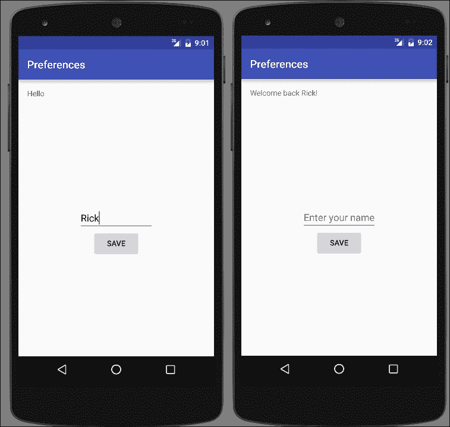
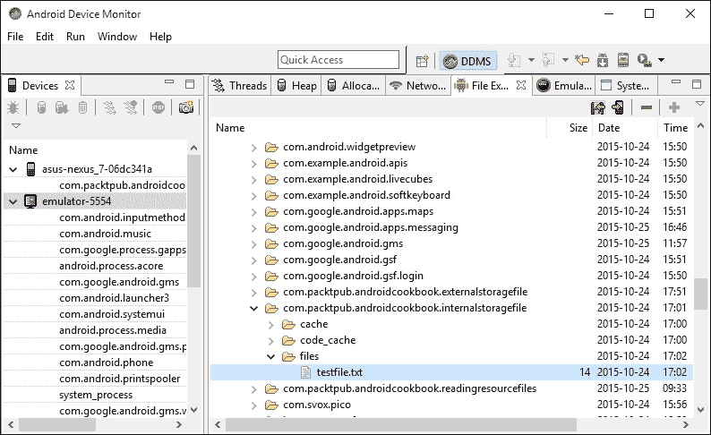
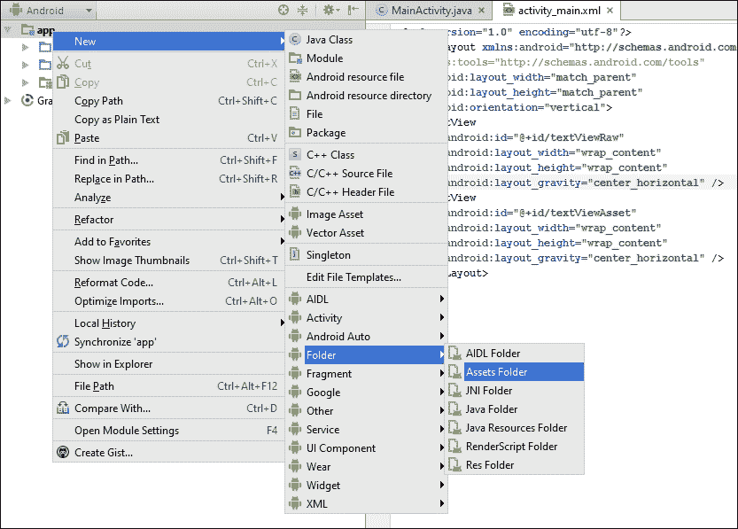
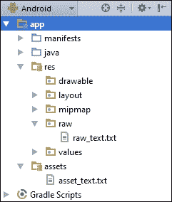

# 第六章：数据处理

在本章中，我们将涵盖以下主题：

+   存储简单数据

+   读写内部存储的文本文件

+   读写外部存储的文本文件

+   在项目中包含资源文件

+   创建和使用 SQLite 数据库

+   使用加载器在后台访问数据

# 简介

由于几乎任何大小应用都需要保存某种类型的数据，Android 提供了许多选项。从保存一个简单值到使用 SQLite 创建完整的数据库，存储选项包括以下内容：

+   共享偏好设置：简单的名称/值对

+   内部存储：私有存储中的数据文件

+   外部存储：在私有或公共存储中的数据文件

+   SQLite 数据库：私有数据可以通过内容提供者暴露数据

+   云存储：私有服务器或服务提供商

使用内部和外部存储有其优点和权衡。我们将在这里列出一些差异，以帮助你决定是使用内部存储还是外部存储：

+   **内部存储**：

    +   与外部存储不同，内部存储始终可用，但通常可用空间较少

    +   文件对用户不可见（除非设备拥有 root 权限）

    +   当你的应用被卸载时，文件会自动删除（或者在应用管理器中使用清除缓存/清理文件选项）

+   **外部存储**：

    +   设备可能没有外部存储，或者可能无法访问（例如连接到计算机时）

    +   文件对用户（和其他应用）可见，无需 root 权限

    +   当你的应用被卸载时，文件不会被删除（除非你使用`getExternalFilesDir()`获取特定于应用的公共存储）

在本章中，我们将演示如何使用共享偏好设置、内部和外部存储以及 SQLite 数据库。对于云存储，请查看第十二章中的互联网食谱，*电信、网络和互联网*以及第十五章中的在线服务提供商，*后端即服务选项*。

# 存储简单数据

存储简单数据是一个常见需求，Android 使用偏好设置 API 使其变得简单。不仅限于用户偏好；你可以使用名称/值对存储任何原始数据类型。

我们将演示如何从`EditText`保存一个名字，并在应用启动时显示它。以下屏幕截图显示了应用首次启动时没有保存名字的样子，以及在保存名字后启动时的样子：



## 准备工作

在 Android Studio 中创建一个新项目，并将其命名为：`Preferences`。使用默认的**手机 & 平板**选项，在选择**活动类型**时选择**空活动**。

## 如何操作...

我们将使用现有的**TextView**显示**欢迎回来**的消息，并创建一个新的`EditText`按钮来保存名字。首先打开`activity_main.xml`文件：

1.  替换现有的**TextView**并添加以下新的视图：

    ```kt
    <TextView
        android:id="@+id/textView"
        android:text="Hello World!"
        android:layout_width="wrap_content"
        android:layout_height="wrap_content" />

    <EditText
        android:id="@+id/editTextName"
        android:layout_width="wrap_content"
        android:layout_height="wrap_content"
        android:layout_centerVertical="true"
        android:layout_centerHorizontal="true"
        android:hint="Enter your name" />

    <Button
        android:id="@+id/button"
        android:layout_width="wrap_content"
        android:layout_height="wrap_content"
        android:text="Save"
        android:layout_centerHorizontal="true"
        android:layout_below="@id/editTextName"
        android:onClick="saveName"/>
    ```

1.  打开`ActivityMain.java`文件，并添加以下全局声明：

    ```kt
    private final String NAME="NAME";
    private EditText mEditTextName;
    ```

1.  在`onCreate()`中添加以下代码，以便保存对`EditText`的引用并在加载已保存名称时使用：

    ```kt
    TextView textView = (TextView)findViewById(R.id.textView);
    SharedPreferences sharedPreferences = getPreferences(MODE_PRIVATE);
    String name = sharedPreferences.getString(NAME,null);
    if (name==null) {
        textView.setText("Hello");
    } else {
        textView.setText("Welcome back " + name + "!");
    }
    mEditTextName = (EditText)findViewById(R.id.editTextName);
    ```

1.  添加以下`saveName()`方法：

    ```kt
    public void saveName(View view) {
        SharedPreferences.Editor editor = getPreferences(MODE_PRIVATE).edit();
        editor.putString(NAME, mEditTextName.getText().toString());
        editor.commit();
    }
    ```

1.  在设备或模拟器上运行程序。由于我们要演示持久化数据，所以在`onCreate()`期间会加载名称，因此保存一个名称并重新启动程序以查看加载过程。

## 它是如何工作的...

为了加载名称，我们首先获取对`SharedPreference`的引用，这样就可以调用`getString()`方法。我们传入名称/值对的关键字，以及如果找不到关键字时要返回的默认值。

为了保存首选项，我们首先需要获取对首选项编辑器的引用。我们使用`putString()`然后调用`commit()`。如果没有`commit()`，更改将不会被保存。

## 还有更多...

我们的示例将所有首选项存储在单个文件中。我们还可以使用`getSharedPreferences()`并传递名称，在不同文件中存储首选项。如果你想要为多个用户设置不同的配置文件，可以使用这个选项。

# 在内部存储中读写文本文件

当简单的名称/值对不够用时，Android 还支持常规文件操作，包括处理文本和二进制数据。

以下示例展示了如何将文件读取和写入内部或私有存储。

## 准备工作

在 Android Studio 中创建一个新项目，并将其命名为`InternalStorageFile`。选择默认的**Phone & Tablet**选项，并在提示**Activity Type**时选择**Empty Activity**。

## 如何操作...

为了演示读取和写入文本，我们需要一个带有`EditText`和两个按钮的布局。首先打开`main_activity.xml`文件，并按照以下步骤操作：

1.  用以下视图替换现有的`<TextView>`元素：

    ```kt
    <EditText
        android:id="@+id/editText"
        android:layout_width="wrap_content"
        android:layout_height="wrap_content"
        android:inputType="textMultiLine"
        android:ems="10"
        android:layout_above="@+id/buttonRead"
        android:layout_alignParentTop="true"
        android:layout_centerHorizontal="true" />
    <Button
        android:layout_width="wrap_content"
        android:layout_height="wrap_content"
        android:text="Read"
        android:id="@+id/buttonRead"
        android:layout_centerVertical="true"
        android:layout_centerHorizontal="true"
        android:onClick="readFile"/>
    <Button
        android:layout_width="wrap_content"
        android:layout_height="wrap_content"
        android:text="Write"
        android:id="@+id/buttonWrite"
        android:layout_below="@+id/buttonRead"
        android:layout_centerHorizontal="true"
        android:onClick="writeFile"/>
    ```

1.  现在打开`ActivityMain.java`文件，并添加以下全局变量：

    ```kt
    private final String FILENAME="testfile.txt";
    EditText mEditText;
    ```

1.  在`setContentView()`方法后，向`onCreate()`方法中添加以下内容：

    ```kt
    mEditText = (EditText)findViewById(R.id.editText);
    ```

1.  添加以下`writeFile()`方法：

    ```kt
    public void writeFile(View view) {
        try {
            FileOutputStream fileOutputStream = openFileOutput(FILENAME, Context.MODE_PRIVATE);
            fileOutputStream.write(mEditText.getText().toString().getBytes());
            fileOutputStream.close();
        } catch (java.io.IOException e) {
            e.printStackTrace();
        }
    }
    ```

1.  现在添加`readFile()`方法：

    ```kt
    public void readFile(View view) {
        StringBuilder stringBuilder = new StringBuilder();
        try {
            InputStream inputStream = openFileInput(FILENAME);
            if ( inputStream != null ) {
                InputStreamReader inputStreamReader = new InputStreamReader(inputStream);
                BufferedReader bufferedReader = new BufferedReader(inputStreamReader);
                String newLine = null;
                while ((newLine = bufferedReader.readLine()) != null ) {
                    stringBuilder.append(newLine+"\n");
                }
                inputStream.close();
            }
        } catch (java.io.IOException e) {
            e.printStackTrace();
        }
        mEditText.setText(stringBuilder);
    }
    ```

1.  在设备或模拟器上运行程序。

## 它是如何工作的...

我们使用`InputStream`和`FileOutputStream`类分别进行读取和写入操作。将文件写入操作简化为从`EditText`获取文本并调用`write()`方法。

读取内容会稍微复杂一些。我们可以使用`FileInputStream`类进行读取，但在处理文本时，辅助类会使操作更简单。在我们的示例中，我们使用`openFileInput()`打开文件，它返回一个`InputStream`对象。然后我们使用`InputStream`获取一个`BufferedReader`，它提供了`ReadLine()`方法。我们遍历文件中的每一行并将其附加到我们的`StringBuilder`中。当我们完成文件读取后，我们将文本赋值给`EditText`。

### 提示

我们之前的文件是在应用的私有数据文件夹中创建的。要查看文件内容，你可以使用 Android 设备监视器将文件拉取到你的电脑上。完整的文件路径是：`/data/data/com.packtpub.androidcookbook.internalstoragetile/files/testfile.txt`。

下面的屏幕截图显示了通过**Android 设备监视器**查看文件时的样子：



### 注意

你需要一个具有 root 权限的设备来查看之前显示的私有文件夹。

## 还有更多...

让我们看看一些可能有所帮助的额外信息。

### 缓存文件

如果你只需要临时存储数据，也可以使用缓存文件夹。以下方法返回缓存文件夹作为一个`File`对象（下一个食谱演示了如何使用`File`对象）：

```kt
getCacheDir()
```

缓存文件夹的主要优点是，如果存储空间不足，系统可以清除缓存。（用户还可以在设置中的应用管理中清除缓存文件夹。）

例如，如果你的应用下载新闻文章，你可以将这些文章存储在缓存中。当你的应用启动时，可以显示已经下载的新闻。这些文件不是使你的应用工作所必需的。如果系统资源不足，可以清除缓存，而不会对你的应用产生不利影响。（尽管系统可能会清除缓存，但你的应用删除旧文件仍然是一个好主意。）

## 另请参阅

+   下一个食谱，*读取和写入外部存储的文本文件*。

# 读取和写入外部存储的文本文件

读取和写入外部存储的文件过程基本上与使用内部存储相同。区别在于获取存储位置的引用。另外，如*介绍*中提到的，外部存储可能不可用，因此在尝试访问之前最好检查其可用性。

这个食谱将读取和写入文本文件，就像之前的食谱中所做的那样。我们还将演示如何在访问之前检查外部存储状态。

## 准备工作

在 Android Studio 中创建一个新项目，将其命名为：`ExternalStorageFile`。使用默认的**手机 & 平板**选项，并在提示**活动类型**时选择**空活动**。我们将使用之前的食谱中的相同布局，所以如果你已经输入了，可以直接复制粘贴。否则，使用之前食谱中的第 1 步布局，*读取和写入内部存储的文本文件*。

## 如何操作...

如之前在*准备工作*部分提到的，我们将使用之前的食谱中的布局。布局文件完成后，第一步将是添加访问外部存储的写入权限。以下是步骤：

1.  打开 Android Manifest 并添加以下权限：

    ```kt
    <uses-permission android:name="android.permission.WRITE_EXTERNAL_STORAGE" />
    ```

1.  接下来，打开`ActivityMain.java`并添加以下全局变量：

    ```kt
    private final String FILENAME="testfile.txt";
    EditText mEditText;
    ```

1.  在`onCreate()`方法中，在`setContentView()`之后添加以下内容：

    ```kt
    mEditText = (EditText)findViewById(R.id.editText);
    ```

1.  添加以下两种方法来检查存储状态：

    ```kt
    public boolean isExternalStorageWritable() {
        if (Environment.MEDIA_MOUNTED.equals(Environment.getExternalStorageState())) {
            return true;
        }
        return false;
    }

    public boolean isExternalStorageReadable() {
        if (Environment.MEDIA_MOUNTED.equals(Environment.getExternalStorageState()) ||
                Environment.MEDIA_MOUNTED_READ_ONLY.equals(Environment.getExternalStorageState())) {
            return true;
        }
        return false;
    }
    ```

1.  添加以下`writeFile()`方法：

    ```kt
    public void writeFile(View view) {
        if (isExternalStorageWritable()) {
            try {
                File textFile = new File(Environment.getExternalStorageDirectory(), FILENAME);
                FileOutputStream fileOutputStream = new FileOutputStream(textFile);
                fileOutputStream.write(mEditText.getText().toString().getBytes());
                fileOutputStream.close();
            } catch (java.io.IOException e) {
                e.printStackTrace();
                Toast.makeText(this, "Error writing file", Toast.LENGTH_LONG).show();
            }
        } else {
            Toast.makeText(this, "Cannot write to External Storage", Toast.LENGTH_LONG).show();
        }
    }
    ```

1.  添加以下`readFile()`方法：

    ```kt
    public void readFile(View view) {
        if (isExternalStorageReadable()) {
            StringBuilder stringBuilder = new StringBuilder();
            try {
                File textFile = new File(Environment.getExternalStorageDirectory(), FILENAME);
                FileInputStream fileInputStream = new FileInputStream(textFile);
                if (fileInputStream != null ) {
                    InputStreamReader inputStreamReader = new InputStreamReader(fileInputStream);
                    BufferedReader bufferedReader = new BufferedReader(inputStreamReader);
                    String newLine = null;
                    while ( (newLine = bufferedReader.readLine()) != null ) {
                        stringBuilder.append(newLine+"\n");
                    }
                    fileInputStream.close();
                }
                mEditText.setText(stringBuilder);
            } catch (java.io.IOException e) {
                e.printStackTrace();
                Toast.makeText(this, "Error reading file", Toast.LENGTH_LONG).show();
            }
        } else {
            Toast.makeText(this, "Cannot read External Storage", Toast.LENGTH_LONG).show();
        }
    }
    ```

1.  在具有外部存储的设备或模拟器上运行程序。

## 工作原理...

对于内部和外部存储，读取和写入文件基本上是相同的。主要的区别在于，在尝试访问它之前，我们应该检查外部存储的可用性，这是通过`isExternalStorageWritable()`和`isExternalStorageReadable()`方法完成的。在检查存储状态时，`MEDIA_MOUNTED`意味着我们可以读取和写入它。

与内部存储示例不同，我们请求工作路径，就像在这行代码中所做的那样：

```kt
File textFile = new File(Environment.getExternalStorageDirectory(), FILENAME);
```

实际的读写操作是由相同的类完成的，因为只是位置不同。

### 提示

硬编码外部文件夹路径是不安全的。该路径可能会因操作系统的版本不同而有所差异，尤其是在不同硬件制造商之间。最佳的做法是调用`getExternalStorageDirectory()`，如所示。

## 还有更多...

以下是一些额外的信息讨论。

### 获取公共文件夹

`getExternalStorageDirectory()`方法返回外部存储的根目录。如果你想获取特定的公共文件夹，比如`Music`或`Ringtone`文件夹，请使用`getExternalStoragePublicDirectory()`并传入所需的文件夹类型，例如：

```kt
getExternalStoragePublicDirectory(Environment.DIRECTORY_MUSIC)
```

### 检查可用空间

内部存储和外部存储之间的一致问题是空间有限。如果你提前知道你需要多少空间，可以在`File`对象上调用`getFreeSpace()`方法。（`getTotalSpace()`将返回总空间。）以下是一个使用`getFreeSpace()`调用的简单示例：

```kt
if (Environment.getExternalStorageDirectory().getFreeSpace() < RQUIRED_FILE_SPACE) {
    //Not enough space
} else {
    //We have enough space
}
```

### 删除文件

通过`File`对象提供了许多帮助方法，包括删除文件。如果我们想删除在示例中创建的文本文件，我们可以如下调用`delete()`：

```kt
textFile.delete()
```

### 使用目录

尽管它被称为`File`对象，但它也支持目录命令，比如创建和删除目录。如果你想创建或删除目录，构建`File`对象，然后调用相应的方法：`mkdir()`和`delete()`。（还有一个方法叫做`mkdirs()`（复数形式），它也会创建父目录。）有关完整列表，请参见以下链接。

### 防止文件被包含在图库中

安卓使用了一个**媒体扫描器**，它会自动将声音、视频和图像文件包含在系统集合中，比如图片库。要排除你的目录，请在你要排除的文件所在的同一目录中创建一个名为`.nomedia`的空文件（注意前面的句点）。

## 另请参阅

+   有关`File`类中可用方法的完整列表，请访问[`developer.android.com/reference/java/io/File.html`](http://developer.android.com/reference/java/io/File.html)

# 在项目中包含资源文件

Android 为您的项目提供了两种包含文件的方式：`raw` 文件夹和 `Assets` 文件夹。您使用哪种选项取决于您的需求。首先，我们将简要概述每种选项，帮助您决定何时使用每种选项：

+   **原始文件**

    +   包含在资源目录中：`/res/raw`

    +   作为资源，通过原始标识符访问：`R.raw.<资源名>`

    +   存储媒体文件（如 MP3、MP4 和 OOG 文件）的好地方

+   **资产文件**

    +   在您的 APK 中编译文件系统（*不*提供资源 ID）

    +   通过文件名访问文件，通常使得它们更容易与动态创建的名称一起使用。

    +   某些 API 不支持资源标识符，因此需要作为资产包含

通常，`raw` 文件更容易处理，因为它们是通过资源标识符访问的。正如我们将在本食谱中演示的，主要区别在于您如何访问文件。在这个例子中，我们将加载一个 `raw` 文本文件和一个 `asset` 文本文件，并显示其内容。

## 准备工作

在 Android Studio 中创建一个新项目，并将其命名为：`ReadingResourceFiles`。使用默认的 **手机 & 平板** 选项，并在提示 **活动类型** 时选择 **空活动**。

## 如何操作...

为了演示从两个资源位置读取内容，我们将创建一个分割布局。我们还需要创建这两个资源文件夹，因为它们不包括在默认的 Android 项目中。以下是步骤：

1.  打开 `activity_main.xml` 文件，并将其内容替换为以下布局：

    ```kt
    <?xml version="1.0" encoding="utf-8"?>
    <LinearLayout 

        android:layout_width="match_parent"
        android:layout_height="match_parent"
        android:orientation="vertical">
        <TextView
            android:id="@+id/textViewRaw"
            android:layout_width="match_parent"
            android:layout_height="0dp"
            android:layout_weight="1"
            android:gravity="center_horizontal|center_vertical"/>
        <TextView
            android:id="@+id/textViewAsset"
            android:layout_width="match_parent"
            android:layout_height="0dp"
            android:layout_weight="1"
            android:gravity="center_horizontal|center_vertical"/>
    </LinearLayout>
    ```

1.  在 res 文件夹中创建 `raw` 资源文件夹。它将被读取为：`res/raw`。

1.  在 `raw` 文件夹上右键点击，选择 **新建** | **文件** 创建一个新文本文件。将文件命名为 `raw_text.txt`，并在文件中输入一些文本。（运行应用程序时将显示此文本。）

1.  创建 `asset` 文件夹。由于位置的原因，`asset` 文件夹更难以处理。幸运的是，Android Studio 提供了一个菜单选项，使得创建它变得非常简单。转到 **文件** 菜单（或者在 **app** 节点上右键点击），然后选择 **新建** | **文件夹** | **资产文件夹**，如下截图所示：

1.  在 asset 文件夹中创建另一个名为 `asset_text.txt` 的文本文件。同样，您在这里输入的任何文本在运行应用时都会显示。以下是创建两个文本文件后的最终结果应该看起来像这样：

1.  现在是编写代码的时候了。打开 `MainActivity.java` 文件，并添加以下方法来读取文本文件（传递到该方法中）：

    ```kt
    private String getText(InputStream inputStream) {
        StringBuilder stringBuilder = new StringBuilder();
        try {;
            if ( inputStream != null ) {
                InputStreamReader inputStreamReader = new InputStreamReader(inputStream);
                BufferedReader bufferedReader = new BufferedReader(inputStreamReader);
                String newLine = null;
                while ((newLine = bufferedReader.readLine()) != null ) {
                    stringBuilder.append(newLine+"\n");
                }
                inputStream.close();
            }
        } catch (java.io.IOException e) {
            e.printStackTrace();
        }
        return stringBuilder.toString();
    }
    ```

1.  最后，在 `onCreate()` 方法中添加以下代码：

    ```kt
    TextView textViewRaw = (TextView)findViewById(R.id.textViewRaw);
    textViewRaw.setText(getText(this.getResources().openRawResource(R.raw.raw_text)));

    TextView textViewAsset = (TextView)findViewById(R.id.textViewAsset);
    try {
        textViewAsset.setText(getText(this.getAssets().open("asset_text.txt")));
    } catch (IOException e) {
        e.printStackTrace();
    }
    ```

1.  在设备或模拟器上运行程序。

## 工作原理...

总结一下，唯一的区别在于我们如何获取对每个文件的引用。这行代码读取 `raw` 资源：

```kt
this.getResources().openRawResource(R.raw.raw_text)
```

而这段代码读取 `asset` 文件：

```kt
this.getAssets().open("asset_text.txt")
```

这两个调用都返回一个 `InputStream`，`getText()` 方法使用它来读取文件内容。值得注意的是，打开 `asset` 文本文件的调用需要一个额外的 `try`/`catch`。正如菜谱介绍中所提到的，资源是经过索引的，因此我们有编译时验证，而 `asset` 文件夹没有。

## 还有更多...

一种常见的方法是将资源包含在 APK 中，但在新资源可用时下载它们。（请参阅 第十二章中的网络通信，*电信、网络和互联网*。）如果新资源不可用，你总是可以退回到 APK 中的资源。

## 另请参阅

+   第十二章中的网络通信菜谱，*电信、网络和互联网*。

# 创建和使用 SQLite 数据库

在这个菜谱中，我们将演示如何使用 SQLite 数据库。如果你已经熟悉来自其他平台的 SQL 数据库，那么你所知道的大部分内容都将适用。如果你是 SQLite 的新手，请查看“另请参阅”部分中的参考链接，因为此菜谱假设你具有数据库概念的基本理解，包括模式、表、游标和原始 SQL。

为了让你快速开始使用 SQLite 数据库，我们的示例实现了基本的 CRUD 操作。通常，在 Android 中创建数据库时，你会创建一个扩展 `SQLiteOpenHelper` 的类，这是实现数据库功能的地方。以下是为每个基本操作提供功能的函数列表：

+   创建：`insert()`

+   读取：`query()` 和 `rawQuery()`

+   更新：`update()`

+   删除：`delete()`

为了演示一个完全工作的数据库，我们将创建一个简单的 `Dictionary` 数据库，以便我们可以存储单词及其定义。我们将通过允许添加新单词（及其定义）和更新现有单词定义来演示 CRUD 操作。我们将使用游标在 `ListView` 中显示单词。点击 `ListView` 中的单词将从数据库中读取定义并在 Toast 消息中显示。长按将删除单词。

## 准备就绪

在 Android Studio 中创建一个新项目，命名为 `SQLiteDatabase`。使用默认的 **Phone & Tablet** 选项，并在提示选择 **Activity Type** 时选择 **Empty Activity**。

## 如何操作...

首先，我们将创建一个 UI，它包括两个 `EditText` 字段，一个按钮，和一个 `ListView`。当我们向数据库添加单词时，它们将填充 `ListView`。开始时，打开 `activity_main.xml` 并按照以下步骤操作：

1.  用以下新视图替换现有的 `<TextView>`：

    ```kt
    <EditText
        android:id="@+id/et_word"
        android:layout_width="wrap_content"
        android:layout_height="wrap_content"
        android:layout_alignParentTop="true"
        android:layout_alignParentLeft="true"
        android:layout_alignParentStart="true"
        android:hint="Word"/>
    <EditText
        android:id="@+id/et_definition"
        android:layout_width="match_parent"
        android:layout_height="wrap_content"
        android:layout_below="@+id/editTextWord"
        android:layout_alignParentLeft="true"
        android:layout_alignParentStart="true"
        android:hint="Definition"/>
    <Button
        android:layout_width="wrap_content"
        android:layout_height="wrap_content"
        android:text="Save"
        android:id="@+id/button_add_update"
        android:layout_alignParentRight="true"
        android:layout_alignParentTop="true" />
    <ListView
        android:layout_width="wrap_content"
        android:layout_height="wrap_content"
        android:id="@+id/listView"
        android:layout_below="@+id/et_definition"
        android:layout_alignParentLeft="true"
        android:layout_alignParentBottom="true" />
    ```

1.  向项目中添加一个名为 `DictionaryDatabase` 的新 Java 类。这个类从 `SQLiteOpenHelper` 扩展而来，处理所有的 SQLite 函数。以下是类声明：

    ```kt
    public class DictionaryDatabase extends SQLiteOpenHelper {
    ```

1.  在声明下方，添加以下常量：

    ```kt
    private static final String DATABASE_NAME = "dictionary.db";
    private static final String TABLE_DICTIONARY = "dictionary";

    private static final String FIELD_WORD = "word";
    private static final String FIELD_DEFINITION = "definition";
    private static final int DATABASE_VERSION = 1;
    ```

1.  添加以下构造函数，`OnCreate()` 和 `onUpgrade()` 方法：

    ```kt
    DictionaryDatabase(Context context) {
        super(context, DATABASE_NAME, null, DATABASE_VERSION);
    }

    @Override
    public void onCreate(SQLiteDatabase db) {
        db.execSQL("CREATE TABLE " + TABLE_DICTIONARY +
                "(_id integer PRIMARY KEY," +
                FIELD_WORD + " TEXT, " +
                FIELD_DEFINITION + " TEXT);");
    }

    @Override
    public void onUpgrade(SQLiteDatabase db, int oldVersion, int newVersion) {
        //Handle database upgrade as needed
    }
    ```

1.  以下方法负责创建、更新和删除记录：

    ```kt
    public void saveRecord(String word, String definition) {
        long id = findWordID(word);
        if (id>0) {
            updateRecord(id, word,definition);
        } else {
            addRecord(word,definition);
        }
    }

    public long addRecord(String word, String definition) {
        SQLiteDatabase db = getWritableDatabase();

        ContentValues values = new ContentValues();
        values.put(FIELD_WORD, word);
        values.put(FIELD_DEFINITION, definition);
        return db.insert(TABLE_DICTIONARY, null, values);
    }

    public int updateRecord(long id, String word, String definition) {
        SQLiteDatabase db = getWritableDatabase();
        ContentValues values = new ContentValues();
        values.put("_id", id);
        values.put(FIELD_WORD, word);
        values.put(FIELD_DEFINITION, definition);
        return db.update(TABLE_DICTIONARY, values, "_id = ?", new String[]{String.valueOf(id)});
    }
    public int deleteRecord(long id) {
        SQLiteDatabase db = getWritableDatabase();
        return db.delete(TABLE_DICTIONARY, "_id = ?", new String[]{String.valueOf(id)});
    }
    ```

1.  而这些方法处理从数据库读取信息：

    ```kt
    public long findWordID(String word) {
        long returnVal = -1;
        SQLiteDatabase db = getReadableDatabase();
        Cursor cursor = db.rawQuery("SELECT _id FROM " + TABLE_ DICTIONARY + " WHERE " + FIELD_WORD + " = ?", new String[]{word});
        Log.i("findWordID","getCount()="+cursor.getCount());
        if (cursor.getCount() == 1) {
            cursor.moveToFirst();
            returnVal = cursor.getInt(0);
        }
        return returnVal;
    }

    public String getDefinition(long id) {
        String returnVal = "";
        SQLiteDatabase db = getReadableDatabase();
        Cursor cursor = db.rawQuery("SELECT definition FROM " + TABLE_ DICTIONARY + " WHERE _id = ?", new String[]{String.valueOf(id)});
        if (cursor.getCount() == 1) {
            cursor.moveToFirst();
            returnVal = cursor.getString(0);
        }
        return returnVal;
    }

    public Cursor getWordList() {
        SQLiteDatabase db = getReadableDatabase();
        String query = "SELECT _id, " + FIELD_WORD + " FROM " + TABLE_DICTIONARY + " ORDER BY " + FIELD_WORD + " ASC";
        return db.rawQuery(query, null);
    }
    ```

1.  数据库类完成后，打开`MainActivity.java`。在类声明下面添加以下全局变量：

    ```kt
    EditText mEditTextWord;
    EditText mEditTextDefinition;
    DictionaryDatabase mDB;
    ListView mListView;
    ```

1.  添加以下方法以在点击按钮时保存字段：

    ```kt
    private void saveRecord() {
        mDB.saveRecord(mEditTextWord.getText().toString(), mEditTextDefinition.getText().toString());
        mEditTextWord.setText("");
        mEditTextDefinition.setText("");
        updateWordList();
    }
    ```

1.  添加这个方法来填充`ListView`：

    ```kt
    private void updateWordList() {
        SimpleCursorAdapter simpleCursorAdapter = new SimpleCursorAdapter(
            this,
            android.R.layout.simple_list_item_1,
            mDB.getWordList(),
            new String[]{"word"},
            new int[]{android.R.id.text1},
            0);
        mListView.setAdapter(simpleCursorAdapter);
    }
    ```

1.  最后，在`onCreate()`中添加以下代码： 

    ```kt
    mDB = new DictionaryDatabase(this);

    mEditTextWord = (EditText)findViewById(R.id.editTextWord);
    mEditTextDefinition = (EditText)findViewById(R.id.editTextDefinition);

    Button buttonAddUpdate = (Button)findViewById(R.id.buttonAddUpdate);
    buttonAddUpdate.setOnClickListener(new View.OnClickListener() {
        @Override
        public void onClick(View v) {
            saveRecord();
        }
    });

    mListView = (ListView)findViewById(R.id.listView);
    mListView.setOnItemClickListener(new AdapterView.OnItemClickListener() {
        @Override
        public void onItemClick(AdapterView<?> parent, View view, int position, long id) {
            Toast.makeText(MainActivity.this, mDB.getDefinition(id),Toast.LENGTH_SHORT).show();
        }
    });
    mListView.setOnItemLongClickListener(new AdapterView.OnItemLongClickListener() {
        @Override
        public boolean onItemLongClick(AdapterView<?> parent, 
            View view, int position, long id) {
            Toast.makeText(MainActivity.this, "Records deleted = " + mDB.deleteRecord(id), Toast.LENGTH_SHORT).show();
            updateWordList();
            return true;
        }
    });
    updateWordList();
    ```

1.  在设备或模拟器上运行程序并尝试一下。

## 它的工作原理是...

我们将从解释`DictionaryDatabase`类开始，因为这是 SQLite 数据库的核心。首先要注意的是构造函数：

```kt
DictionaryDatabase(Context context) {
    super(context, DATABASE_NAME, null, DATABASE_VERSION);
}
```

注意`DATABASE_VERSION`吗？只有当你对数据库架构进行更改时，才需要增加这个值。

接下来是`onCreate()`，实际创建数据库的地方。这只有在第一次创建数据库时才会被调用，而不是每次创建类时。还值得注意的是`_id`字段。Android 并不要求表具有主字段，除了像`SimpleCursorAdapter`这样的某些类需要`_id`。

我们需要实现`onUpgrade()`回调，但因为是新的数据库，所以不需要做任何事情。当数据库版本增加时，将调用此方法。

`saveRecord()`方法负责调用`addRecord()`或`updateRecord()`，视情况而定。由于我们将要修改数据库，这两个方法都调用`getWritableDatabase()`以便我们可以进行更改。可写数据库需要更多资源，所以如果你不需要进行更改，请获取只读数据库。

需要注意的最后一个方法是`getWordList()`，它使用游标对象返回数据库中的所有单词。我们使用这个游标来填充`ListView`，这就把我们带到了`ActivityMain.java`。`onCreate()`方法进行了我们之前见过的标准初始化，并使用以下代码行创建数据库实例：

```kt
mDB = new DictionaryDatabase(this);
```

`onCreate()`方法也是我们设置事件的地方，当点击项目时显示单词定义（通过 Toast 弹出），以及长按删除单词。最复杂的代码可能是在`updateWordList()`方法中。

这不是我们第一次使用适配器，但这是我们第一次使用游标适配器，所以我们会解释一下。我们使用`SimpleCursorAdapter`来创建游标中的字段与`ListView`项之间的映射。我们使用`layout.simple_list_item_1`布局，它只包括一个带有 ID `android.R.id.text1`的单个文本字段。在实际应用中，我们可能会创建一个自定义布局，并在`ListView`项中包含定义，但我们想要演示一种从数据库读取定义的方法。

我们在三个地方调用`updateWordList()`——在`onCreate()`时创建初始列表，添加/更新列表后再次调用，以及删除列表时最后调用。

## 还有更多...

尽管这是一个功能完整的 SQLite 示例，但它仍然只是基础。整本书都可以，也确实有，关于 Android 中的 SQLite 的内容。

### 升级数据库

如我们之前提到的，当增加数据库版本时，将调用 `onUpgrade()` 方法。这里需要执行的操作取决于所做的更改。如果你更改了现有的表，理想情况下，你将希望通过查询现有数据并将其插入到新格式中来迁移用户数据。请记住，不能保证用户会按连续的顺序升级——例如，他们可能会从版本 1 直接跳到版本 4。

## 另请参阅

+   SQLite 主页：[`www.sqlite.org/`](https://www.sqlite.org/)

+   SQLite 数据库 Android 参考文档：[`developer.android.com/reference/android/database/sqlite/SQLiteDatabase.html`](http://developer.android.com/reference/android/database/sqlite/SQLiteDatabase.html)

# 在后台使用 Loader 访问数据

任何可能长时间运行的操作都不应该在 UI 线程上执行，因为这可能导致应用程序变慢或无响应。当应用程序无响应时，Android OS 会弹出 **应用程序无响应** (**ANR**) 对话框。

由于查询数据库可能很耗时，Android 在 Android 3.0 中引入了 Loader API。Loader 在后台线程上处理查询，并在完成后通知 UI 线程。

Loaders 的两个主要优点包括：

+   数据库查询操作（自动）在后台线程中处理

+   查询（在使用内容提供者数据源时）会自动更新

为了演示 Loader，我们将修改之前的 SQLite 数据库示例，使用 `CursorLoader` 填充 `ListView`。

## 准备工作

我们将使用上一个示例中的项目，*创建和使用 SQLite 数据库*，作为这个示例的基础。在 Android Studio 中创建一个新项目，将其命名为 `Loader`。使用默认的 **Phone & Tablet** 选项，并在提示 **Activity Type** 时选择 **Empty Activity**。复制上一个示例中的 `DictionaryDatabase` 类和布局。尽管我们将使用之前 `ActivityMain.java` 代码的部分内容，但在这个示例中我们将从头开始，以便更容易跟随。

## 如何操作...

按照之前的描述设置项目后，我们将从创建两个新的 Java 类开始，然后在 `ActivityMain.java` 中将所有内容整合在一起。以下是步骤：

1.  创建一个名为 `DictionaryAdapter` 的新 Java 类，该类继承自 `CursorAdapter`。这个类替代了我们在上一个示例中使用的 `SimpleCursorAdapter`。以下是完整代码：

    ```kt
    public class DictionaryAdapter extends CursorAdapter {
        public DictionaryAdapter(Context context, Cursor c, int flags) {
            super(context, c, flags);
        }

        @Override
        public View newView(Context context, Cursor cursor, ViewGroup parent) {
            return LayoutInflater.from(context).inflate(android.R.layout.simple_list_item_1,parent,false);
        }

        @Override
        public void bindView(View view, Context context, Cursor cursor) {
            TextView textView = (TextView)view.findViewById(android.R.id.text1);
            textView.setText(cursor.getString(getCursor().getColumnIndex("word")));
        }
    }
    ```

1.  接下来，创建另一个新的 Java 类，将这个类命名为 `DictionaryLoader`。尽管这是处理后台线程数据加载的类，但它实际上非常简单：

    ```kt
    public class DictionaryLoader extends CursorLoader {
        Context mContext;
        public DictionaryLoader(Context context) {
            super(context);
            mContext = context;
        }

        @Override
        public Cursor loadInBackground() {
            DictionaryDatabase db = new DictionaryDatabase(mContext);
            return db.getWordList();
        }
    }
    ```

1.  接下来，打开 `ActivityMain.java`。我们需要将声明更改为实现 `LoaderManager.LoaderCallbacks<Cursor>` 接口，如下所示：

    ```kt
    public class MainActivity extends AppCompatActivity implements {
    ```

1.  将适配器添加到全局声明中。完整的列表如下：

    ```kt
    EditText mEditTextWord;
    EditText mEditTextDefinition;
    DictionaryDatabase mDB;
    ListView mListView;
    DictionaryAdapter mAdapter;
    ```

1.  修改`onCreate()`以使用新的适配器，并在删除记录后添加调用以更新加载器。最终的`onCreate()`方法应如下所示：

    ```kt
    protected void onCreate(Bundle savedInstanceState) {
        super.onCreate(savedInstanceState);
        setContentView(R.layout.activity_main);

        mDB = new DictionaryDatabase(this);

        mEditTextWord = (EditText) findViewById(R.id.editTextWord);
        mEditTextDefinition = (EditText) findViewById(R.id.editTextDefinition);

        Button buttonAddUpdate = (Button) findViewById(R.id.buttonAddUpdate);
        buttonAddUpdate.setOnClickListener(new View.OnClickListener() {
            @Override
            public void onClick(View v) {
                saveRecord();
            }
        });

        mListView = (ListView) findViewById(R.id.listView);
        mListView.setOnItemClickListener(new AdapterView.OnItemClickListener() {
            @Override
            public void onItemClick(AdapterView<?> parent, View view, int position, long id) {
                Toast.makeText(MainActivity.this, mDB.getDefinition(id), Toast.LENGTH_SHORT).show();
            }
        });
        mListView.setOnItemLongClickListener(new AdapterView.OnItemLongClickListener() {
            @Override
            public boolean onItemLongClick(AdapterView<?> parent, View view, int position, long id) {
                Toast.makeText(MainActivity.this, "Records deleted = " + mDB.deleteRecord(id), Toast.LENGTH_SHORT).show();
                getSupportLoaderManager().restartLoader(0, null, MainActivity.this);
                return true;
            }
        });
        getSupportLoaderManager().initLoader(0, null, this);
        mAdapter = new DictionaryAdapter(this,mDB.getWordList(),0);
        mListView.setAdapter(mAdapter);
    }
    ```

1.  我们不再有`updateWordList()`方法，因此按照以下方式更改`saveRecord()`：

    ```kt
    private void saveRecord() {
        mDB.saveRecord(mEditTextWord.getText().toString(), mEditTextDefinition.getText().toString());
        mEditTextWord.setText("");
        mEditTextDefinition.setText("");
        getSupportLoaderManager().restartLoader(0, null, MainActivity.this);
    }
    ```

1.  最后，为加载器接口实现以下三个方法：

    ```kt
    @Override
    public Loader<Cursor> onCreateLoader(int id, Bundle args) {
        return new DictionaryLoader(this);
    }

    @Override
    public void onLoadFinished(Loader<Cursor> loader, Cursor data) {
        mAdapter.swapCursor(data);
    }

    @Override
    public void onLoaderReset(Loader<Cursor> loader) {
        mAdapter.swapCursor(null);
    }
    ```

1.  在设备或模拟器上运行程序。

## 工作原理...

默认的`CursorAdapter`需要一个内容提供者 URI。由于我们直接访问 SQLite 数据库（而不是通过内容提供者），我们没有 URI 传递，因此我们通过扩展`CursorAdapter`类创建了一个自定义适配器。`DictionaryAdapter`仍然执行与之前的`SimpleCursorAdapter`相同的功能，即将游标中的数据映射到项目布局。

我们添加的下一个类是`DictionaryLoader`，这是实际的加载器。如您所见，它实际上非常简单。它所做的只是从`getWordList()`返回游标。关键在于此查询是在后台线程中处理的，并在完成时调用`onLoadFinished()`回调（在`MainActivity.java`中）。幸运的是，大部分繁重的工作都在基类中处理。

这将我们带到`ActivityMain.java`，在那里我们实现了`LoaderManager.LoaderCallbacks`接口的以下三个回调：

+   `onCreateLoader()`: 最初在`onCreate()`中的`initLoader()`调用时调用。在我们对数据库进行更改后，通过`restartLoader()`调用再次调用。

+   `onLoadFinished()`: 当加载器的`loadInBackground()`完成时调用。

+   `onLoaderReset()`: 当加载器被重新创建时调用（例如使用`restart()`方法）。我们将旧的游标设置为`null`，因为它将无效，我们不想保留引用。

## 还有更多...

正如您在前一个示例中看到的，我们需要手动通知加载器使用`restartLoader()`重新查询数据库。使用加载器的一个好处是它可以自动更新，但这需要一个内容提供者作为数据源。内容提供者支持使用 SQLite 数据库作为数据源，对于严肃的应用程序，建议使用。请参阅以下内容提供者链接以开始操作。

## 另请参阅

+   第十四章中的*AsyncTask*配方，*让你的应用准备好上架 Play 商店*。

+   创建内容提供者：[`developer.android.com/guide/topics/providers/content-provider-creating.html`](http://developer.android.com/guide/topics/providers/content-provider-creating.html)
