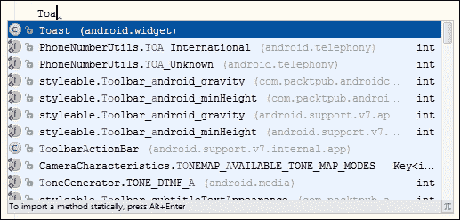
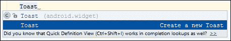
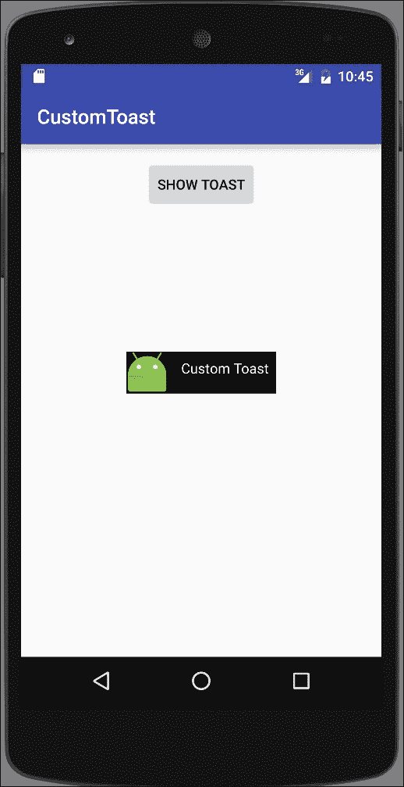
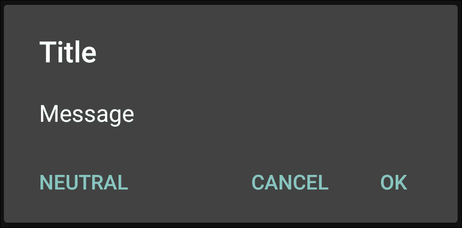
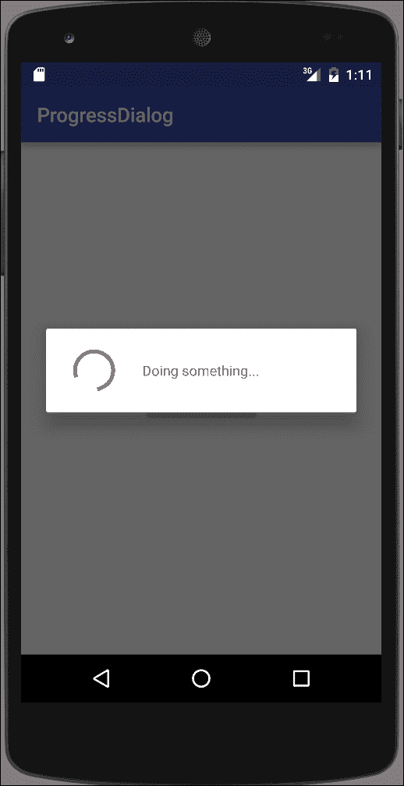
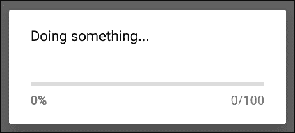
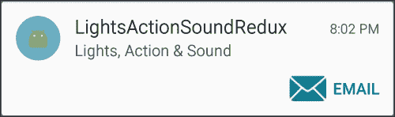
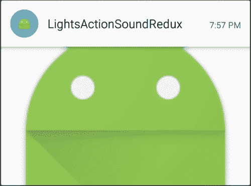
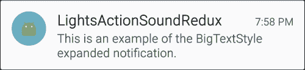

# 第七章：警报和通知

在本章中，我们将涵盖以下主题：

+   灯光、动作和声音——吸引用户的注意！

+   使用自定义布局创建 Toast

+   使用 AlertDialog 显示消息框

+   显示进度对话框

+   使用通知重新实现灯光、动作和声音

+   创建媒体播放器通知

+   使用抬头通知制作手电筒

# 简介

Android 提供了多种方式来通知用户——从非视觉方法，包括声音、灯光和振动，到视觉方法，包括 Toast、对话框和状态栏通知。

请记住，通知会分散用户的注意力，因此在使用任何通知时都应该非常谨慎。用户喜欢控制他们的设备（毕竟这是他们的设备），所以给他们启用和禁用通知的选择。否则，用户可能会感到烦恼，并完全卸载你的应用。

我们将从以下基于非 UI 的通知选项开始回顾：

+   闪烁 LED

+   振动手机

+   播放铃声

然后我们将继续讨论视觉通知，包括：

+   Toasts

+   `AlertDialog`

+   `ProgressDialog`

+   状态栏通知

接下来的食谱将向你展示如何在你的应用程序中实现这些功能。阅读以下链接以了解使用通知时的“最佳实践”是非常值得的：

### 提示

请参考**Android 通知设计指南**，网址为：[`developer.android.com/design/patterns/notifications.html`](http://developer.android.com/design/patterns/notifications.html)

# 灯光、动作和声音——吸引用户的注意！

本章中的大部分食谱使用 Notification 对象来提醒用户，所以这个食谱将展示当你实际上不需要通知时的替代方法。

如标题所示，我们将使用灯光、动作和声音：

+   **灯光**：通常，你会使用 LED 设备，但这仅通过 Notification 对象才可用，我们将在本章后面演示。相反，我们将借此机会使用`setTorchMode()`（在 API 23—Android 6.0 中添加），使用相机闪光灯作为手电筒。（注意：正如你在代码中看到的，这个功能只会在带有相机闪光灯的 Android 6.0 设备上工作。）

+   **动作**：我们将使手机振动。

+   **声音**：我们将使用`RingtoneManager`播放默认通知声音。

如你所见，这些的代码都非常简单。

如以下 *使用通知的 Lights, Action, 和 Sound Redux* 配方所示，LED、振动和声音这三个选项都可以通过 Notification 对象使用。当用户没有积极使用你的应用时，Notification 对象当然是最合适的方法来提供警报和提醒。但是，当你想在用户使用你的应用时提供反馈时，这些选项是可用的。振动选项就是一个很好的例子；如果你想对按钮按下提供触觉反馈（键盘应用中很常见），可以直接调用振动方法。

## 准备工作

在 Android Studio 中创建一个新项目，命名为 `LightsActionSound`。当提示选择 API 级别时，我们需要 API 21 或更高版本来编译项目。在选择 **Activity 类型** 时，选择 **Empty Activity**。

## 如何操作...

我们将使用三个按钮来启动每个操作，首先打开 `activity_main.xml` 并按照以下步骤操作：

1.  用以下三个按钮替换现有的 `<TextView>` 元素：

    ```kt
    <ToggleButton
        android:id="@+id/buttonLights"
        android:layout_width="wrap_content"
        android:layout_height="wrap_content"
        android:text="Lights"
        android:layout_centerHorizontal="true"
        android:layout_above="@+id/buttonAction"
        android:onClick="clickLights" />
    <Button
        android:id="@+id/buttonAction"
        android:layout_width="wrap_content"
        android:layout_height="wrap_content"
        android:text="Action"
        android:layout_centerVertical="true"
        android:layout_centerHorizontal="true"
        android:onClick="clickVibrate"/>
    <Button
        android:id="@+id/buttonSound"
        android:layout_width="wrap_content"
        android:layout_height="wrap_content"
        android:text="Sound"
        android:layout_below="@+id/buttonAction"
        android:layout_centerHorizontal="true"
        android:onClick="clickSound"/>
    ```

1.  向 Android Manifest 添加以下权限：

    ```kt
    <uses-permission android:name="android.permission.VIBRATE"></uses-permission>
    ```

1.  打开 `ActivityMain.java` 并添加以下全局变量：

    ```kt
    private CameraManager mCameraManager;
    private String mCameraId=null;
    private ToggleButton mButtonLights;
    ```

1.  添加以下方法以获取相机 ID：

    ```kt
    private String getCameraId() {
        try {
            String[] ids = mCameraManager.getCameraIdList();
            for (String id : ids) {
                CameraCharacteristics c = mCameraManager.getCameraCharacteristics(id);
                Boolean flashAvailable = c.get(CameraCharacteristics.FLASH_INFO_AVAILABLE);
                Integer facingDirection = c.get(CameraCharacteristics.LENS_FACING);
                if (flashAvailable != null && flashAvailable && facingDirection != null && facingDirection == CameraCharacteristics.LENS_FACING_BACK) {
                    return id;
                }
            }
        } catch (CameraAccessException e) {
            e.printStackTrace();
        }
        return null;
    }
    ```

1.  在 `onCreate()` 方法中添加以下代码：

    ```kt
    mButtonLights = (ToggleButton)findViewById(R.id.buttonLights);
    if (Build.VERSION.SDK_INT >= Build.VERSION_CODES.M) {
        mCameraManager = (CameraManager) this.getSystemService(Context.CAMERA_SERVICE);
        mCameraId = getCameraId();
        if (mCameraId==null) {
            mButtonLights.setEnabled(false);
        } else {
            mButtonLights.setEnabled(true);
        }
    } else {
        mButtonLights.setEnabled(false);
    }
    ```

1.  现在添加处理每个按钮点击的代码：

    ```kt
    public void clickLights(View view) {
        if (Build.VERSION.SDK_INT >= Build.VERSION_CODES.M) {
            try {
                mCameraManager.setTorchMode(mCameraId, mButtonLights.isChecked());
            } catch (CameraAccessException e) {
                e.printStackTrace();
            }
        }
    }

    public void clickVibrate(View view) {
        ((Vibrator)getSystemService(VIBRATOR_SERVICE)).vibrate(1000);
    }

    public void clickSound(View view) {
        Uri notificationSoundUri = RingtoneManager.getDefaultUri(RingtoneManager.TYPE_NOTIFICATION);
        Ringtone ringtone = RingtoneManager.getRingtone(getApplicationContext(), notificationSoundUri);
        ringtone.play();
    }
    ```

1.  你已经准备好在物理设备上运行应用程序了。这里提供的代码需要 Android 6.0（或更高版本）才能使用手电筒选项。

## 工作原理...

如前文所述，大部分代码都是关于查找并打开摄像头以使用闪光灯功能。`setTorchMode()` 在 API 23 中引入，这就是为什么我们要进行 API 版本检查：

```kt
if (Build.VERSION.SDK_INT >= Build.VERSION_CODES.M){}
```

这个应用展示了使用在 Lollipop (API 21) 中引入的新的 `camera2` 库。`vibrate` 和 `ringtone` 方法自 API 1 以来都已可用。

`getCameraId()` 方法是我们检查摄像头的位置。我们想要一个带闪光灯的外向摄像头。如果找到，则返回其 ID，否则为 null。如果摄像头 ID 为 null，我们将禁用按钮。

为了播放声音，我们使用来自 `RingtoneManager` 的 `Ringtone` 对象。除了实现相对简单之外，这种方法的好处是我们可以使用默认通知声音，通过以下代码获取：

```kt
Uri notificationSoundUri = RingtoneManager.getDefaultUri(RingtoneManager.TYPE_NOTIFICATION);
```

这样，如果用户更改了他们首选的通知声音，我们会自动使用它。

最后是调用手机振动的部分。这是最简单的代码使用，但它确实需要权限，我们已经将其添加到 Manifest 中：

```kt
<uses-permission android:name="android.permission.VIBRATE"></uses-permission>
```

## 还有更多...

在一个生产级别的应用中，如果你不必这样做，你不会想要简单地禁用按钮。在这种情况下，还有其他方法可以使用相机闪光灯作为手电筒。查看多媒体章节，了解更多关于使用摄像头的示例，我们将会再次看到 `getCameraId()` 的使用。

## 另请参阅

+   在本章后面的*用通知的灯光、动作和声音 Redux*食谱中，可以看到使用通知对象的等效功能。

+   有关使用新相机 API 和其他声音选项的示例，请参考第十一章，*多媒体*。

# 使用自定义布局创建 Toast

在前面的章节中，我们已经大量使用了 Toast，因为它们提供了一种快速简便的方式来显示信息——既适用于用户，也适用于我们调试时。

前面的例子都使用了简单的一行语法，但 Toast 并不限于此。与 Android 中的大多数组件一样，Toast 也可以自定义，我们将在本节中演示这一点。

Android Studio 为制作简单的 Toast 语句提供了快捷方式。当你开始输入 Toast 命令时，按下*Ctrl* + *Spacebar*，你会看到以下内容：



按下*Enter*键以自动完成。然后，再次按下*Ctrl* + *Spacebar*，你会看到以下内容：



当你再次按下*Enter*键时，它会自动完成以下内容：

```kt
Toast.makeText(MainActivity.this, "", Toast.LENGTH_SHORT).show();
```

在本节中，我们将使用 Toast Builder 来更改默认布局和定位，以创建一个自定义的 Toast，如以下屏幕截图所示：



## 准备就绪

在 Android Studio 中创建一个新项目，将其命名为`CustomToast`。使用默认的**Phone & Tablet**选项，并在提示**Activity Type**时选择**Empty Activity**。

## 如何操作...

我们将改变 Toast 的形状为正方形，并创建一个自定义布局来显示图像和文本信息。首先打开`activity_main.xml`并按照以下步骤操作：

1.  使用以下内容替换现有的`<TextView>`元素为`<Button>`：

    ```kt
    <Button
        android:layout_width="wrap_content"
        android:layout_height="wrap_content"
        android:text="Show Toast"
        android:id="@+id/button"
        android:layout_alignParentTop="true"
        android:layout_centerHorizontal="true"
        android:onClick="showToast"/>
    ```

1.  在`res/drawable`文件夹中创建一个名为`border_square.xml`的新资源文件，并输入以下代码：

    ```kt
    <?xml version="1.0" encoding="utf-8"?>
    <layer-list >
        <item
            android:left="4px"
            android:top="4px"
            android:right="4px"
            android:bottom="4px">
            <shape android:shape="rectangle" >
                <solid android:color="@android:color/black" />
                <stroke android:width="5px" android:color="@android:color/white"/>
            </shape>
        </item>
    </layer-list>
    ```

1.  在`res/layout`文件夹中创建一个名为`toast_custom.xml`的新资源文件，并输入以下代码：

    ```kt
    <?xml version="1.0" encoding="utf-8"?>
    <LinearLayout 
        android:id="@+id/toast_layout_root"
        android:layout_width="match_parent"
        android:layout_height="match_parent"
        android:orientation="horizontal"
        android:background="@drawable/border_square">
        <ImageView
            android:layout_width="wrap_content"
            android:layout_height="wrap_content"
            android:id="@+id/imageView"
            android:layout_weight="1"
            android:src="img/ic_launcher" />
        <TextView
            android:id="@android:id/message"
            android:layout_width="0dp"
            android:layout_height="match_parent"
            android:layout_weight="1"
            android:textColor="@android:color/white"
            android:padding="10dp" />
    </LinearLayout>
    ```

1.  现在，打开`ActivityMain.java`并输入以下方法：

    ```kt
    public void showToast(View view) {
        LayoutInflater inflater = (LayoutInflater)this.getSystemService(Context.LAYOUT_INFLATER_SERVICE);
        View layout = inflater.inflate(R.layout.toast_custom, null);
        ((TextView) layout.findViewById(android.R.id.message)).setText("Custom Toast");
        Toast toast = new Toast(this);
        toast.setGravity(Gravity.CENTER, 0, 0);
        toast.setDuration(Toast.LENGTH_LONG);
        toast.setView(layout);
        toast.show();
    }
    ```

1.  在设备或模拟器上运行程序。

## 工作原理...

这个自定义的 Toast 更改了默认的定位、形状，并添加了图像，只是展示“这是可以做到的”。

第一步是创建一个新的 Toast 布局，我们通过膨胀我们的`custom_toast`布局来实现。一旦我们有了新的布局，我们需要获取`TextView`，这样我们就可以设置我们的信息，我们使用标准的`setText()`方法来完成这个操作。完成这些后，我们创建一个 Toast 对象并设置各个属性。我们使用`setGravity()`方法设置 Toast 的定位。定位决定了我们的 Toast 在屏幕上的显示位置。我们通过`setView()`方法调用指定我们的自定义布局。与单行版本一样，我们使用`show()`方法显示 Toast。

# 使用 AlertDialog 显示消息框

在第四章，*菜单*中，我们创建了一个主题，使活动看起来像一个对话框。在这个菜谱中，我们将演示如何使用`AlertDialog`类创建对话框。`AlertDialog`提供了标题，最多三个按钮，以及一个列表或自定义布局区域，如下例所示：



### 注意

按钮的位置可能会根据操作系统版本而有所不同。

## 准备就绪

在 Android Studio 中创建一个新项目，将其命名为：`AlertDialog`。使用默认的**手机 & 平板**选项，在选择**活动类型**时选择**空活动**选项。

## 如何操作...

为了演示，我们将创建一个**确认删除**对话框，在用户按下*删除*按钮后提示用户确认。首先打开`main_activity.xml`布局文件，并按照以下步骤操作：

1.  添加以下`<Button>`：

    ```kt
    <Button
        android:id="@+id/buttonClose"
        android:layout_width="wrap_content"
        android:layout_height="wrap_content"
        android:text="Delete"
        android:layout_centerVertical="true"
        android:layout_centerHorizontal="true"
        android:onClick="confirmDelete"/>
    ```

1.  添加由按钮调用的`confirmDelete()`方法：

    ```kt
    public void confirmDelete(View view) {
        AlertDialog.Builder builder = new AlertDialog.Builder(this);
        builder.setTitle("Delete")
            .setMessage("Are you sure you?")
            .setPositiveButton(android.R.string.ok, new DialogInterface.OnClickListener() {
                public void onClick(DialogInterface dialog, int id) {
                    Toast.makeText(MainActivity.this, "OK Pressed", Toast.LENGTH_SHORT).show();
            }})
            .setNegativeButton(android.R.string.cancel, new DialogInterface.OnClickListener() {
                public void onClick(DialogInterface dialog, int id) {
                    Toast.makeText(MainActivity.this, "Cancel Pressed", Toast.LENGTH_SHORT).show();
            }});
        builder.create().show();
    }
    ```

1.  在设备或模拟器上运行应用程序。

## 作用机理...

这个对话框旨在作为一个简单的确认对话框——例如确认删除操作。基本上，只需创建一个`AlertDialog.Builder`对象并根据需要设置属性。我们使用一个 Toast 消息来指示用户的选择，甚至不需要关闭对话框；它由基类处理。

## 还有更多...

如菜谱介绍截图所示，`AlertDialog`还有一个第三按钮，称为中性按钮，可以通过以下方法设置：

```kt
builder.setNeutralButton()
```

### 添加一个图标

若要在对话框中添加图标，请使用`setIcon()`方法。以下是一个示例：

```kt
.setIcon(R.mipmap.ic_launcher)
```

### 使用列表

我们还可以创建一个项目列表供选择，包括各种列表设置方法：

```kt
.setItems()
.setAdapter()
.setSingleChoiceItems()
.setMultiChoiceItems()
```

如你所见，也有用于单选（使用单选按钮）和多选列表（使用复选框）的方法。

### 提示

你不能同时使用消息和列表，因为`setMessage()`将优先处理。

### 自定义布局

最后，我们还可以创建一个自定义布局，并通过以下方式设置：

```kt
.setView()
```

如果你使用自定义布局并替换标准按钮，你还需要负责关闭对话框。如果你打算重用对话框，请使用`hide()`，完成后使用`dismiss()`释放资源。

# 显示进度对话框

`ProgressDialog`从 API 1 开始可用，并被广泛使用。正如我们在这个食谱中展示的，它使用起来很简单，但请记住（来自 Android 对话框指南网站）的这句话：

> 避免使用 ProgressDialog
> 
> Android 另外提供了一个名为 ProgressDialog 的对话框类，它显示带有进度条的对话框。然而，如果你需要指示加载或不确定的进度，你应该遵循进度与活动的设计指南，并在你的布局中使用 ProgressBar。

[`developer.android.com/guide/topics/ui/dialogs.html`](http://developer.android.com/guide/topics/ui/dialogs.html)

这条消息并不意味着`ProgressDialog`已经废弃或者代码不好。它建议应避免使用`ProgressDialog`，因为当对话框显示时，用户无法与你的应用互动。如果可能，使用包含进度条的布局，而不是使用`ProgressDialog`。

Google Play 应用提供了一个很好的例子。当添加下载项时，Google Play 显示一个进度条，但它不是一个对话框，所以用户可以继续与应用互动，甚至可以添加更多下载项。如果可能，请使用这种方法。

有时你可能没有这种奢侈，比如在下了订单之后，用户会期待一个订单确认。（即使是使用 Google Play，在实际购买应用时你仍然会看到一个确认对话框。）所以，请记住，如果可能的话，避免使用进度对话框。但是，对于那些必须在继续之前完成的事情，这个示例提供了一个如何使用`ProgressDialog`的例子。以下截图展示了示例中的`ProgressDialog`：



## 准备工作

在 Android Studio 中创建一个新项目，并将其命名为：`ProgressDialog`。使用默认的**手机和平板电脑**选项，并在提示**活动类型**时选择**空活动**。

## 如何操作...

1.  由于这只是一个使用`ProgressDialog`的演示，我们将创建一个按钮来显示对话框。为了模拟等待服务器响应，我们将使用一个延迟消息来关闭对话框。首先，打开`activity_main.xml`并按照以下步骤操作：

1.  将`<TextView>`替换为以下`<Button>`：

    ```kt
    <Button
        android:layout_width="wrap_content"
        android:layout_height="wrap_content"
        android:text="Show Dialog"
        android:id="@+id/button"
        android:layout_centerVertical="true"
        android:layout_centerHorizontal="true"
        android:onClick="startProgress"/>
    ```

1.  打开`MainActivity.java`并添加以下两个全局变量：

    ```kt
    private ProgressDialog mDialog;
    final int THIRTY_SECONDS=30*1000;
    ```

1.  添加由按钮点击引用的`showDialog()`方法：

    ```kt
    public void startProgress(View view) {
        mDialog= new ProgressDialog(this);
        mDialog.setMessage("Doing something...");
        mDialog.setCancelable(false);
        mDialog.show();
        new Handler().postDelayed(new Runnable() {
            public void run() {
                mDialog.dismiss();
            }}, THIRTY_SECONDS);
    ```

1.  在设备或模拟器上运行程序。当你按下**显示对话框**按钮时，你会看到与简介中屏幕显示的对话框一样的内容。

## 工作原理...

我们使用`ProgressDialog`类来显示我们的对话框。这些选项应该是自解释的，但这个设置值得注意：

```kt
mDialog.setCancelable(false);
```

通常，可以通过按下*返回*键来取消对话框，但当这被设置为 false 时，用户将停留在对话框上，直到从代码中隐藏/关闭它。为了模拟服务器的延迟响应，我们使用了一个`Handler`和`postDelayed()`方法。在指定的毫秒数（在本例中是 30,000，代表 30 秒）之后，将调用`run()`方法，该方法将关闭我们的对话框。

## 还有更多...

在这个示例中，我们使用了默认的`ProgressDialog`设置，创建了一个不确定的对话框指示器，例如，连续旋转的圆圈。如果你可以衡量当前的任务，比如加载文件，你可以使用确定样式代替。添加并运行这行代码：

```kt
mDialog.setProgressStyle(ProgressDialog.STYLE_HORIZONTAL);
```

你将得到以下对话框样式作为前一行代码的输出：



# 使用通知重新实现灯光、动作和声音

你可能已经对通知（Notifications）很熟悉了，因为它们已经成为一个突出的功能（甚至已经应用到桌面环境中），而且有充分的理由。它们为向用户发送信息提供了极好的方式。与其他可用的警告和通知选项相比，它们提供了最小侵扰性的选择。

正如我们在第一个食谱“*灯光、动作和声音——吸引用户的注意！*”中所看到的，灯光、振动和声音都是吸引用户注意力的非常有用的方法。这就是为什么通知对象包括支持这三种方式的原因，我们将在本食谱中展示这一点。鉴于这种吸引用户注意力的能力，仍然应该注意不要滥用用户。否则，他们很可能会卸载你的应用。通常来说，给用户选择启用/禁用通知甚至如何显示通知是一个好主意——带声音或不带声音等。

## 准备就绪

在 Android Studio 中创建一个新项目，命名为：`LightsActionSoundRedux`。使用默认的**手机 & 平板**选项，并在提示选择**活动类型**时选择**空活动**。

## 如何操作...

我们需要获得使用振动功能的权限，因此首先打开 Android Manifest 文件，并按照以下步骤操作：

1.  添加以下权限：

    ```kt
    <uses-permission android:name="android.permission.VIBRATE"/>
    ```

1.  打开`activity_main.xml`，用以下按钮替换现有的`<TextView>`：

    ```kt
    <Button
        android:id="@+id/buttonSound"
        android:layout_width="wrap_content"
        android:layout_height="wrap_content"
        android:text="Lights, Action, and Sound"
        android:layout_centerVertical="true"
        android:layout_centerHorizontal="true"
        android:onClick="clickLightsActionSound"/>
    ```

1.  现在打开`MainActivity.java`，并添加以下方法来处理按钮点击：

    ```kt
    public void clickLightsActionSound(View view) {
        Uri notificationSoundUri = RingtoneManager.getDefaultUri(RingtoneManager.TYPE_NOTIFICATION);
        NotificationCompat.Builder notificationBuilder = new NotificationCompat.Builder(this)
            .setSmallIcon(R.mipmap.ic_launcher)
            .setContentTitle("LightsActionSoundRedux")
            .setContentText("Lights, Action & Sound")
            .setSound(notificationSoundUri)
            .setLights(Color.BLUE, 500, 500)
            .setVibrate(new long[]{250,500,250,500,250,500});
        NotificationManager notificationManager = (NotificationManager) this.getSystemService(Context.NOTIFICATION_SERVICE);
        notificationManager.notify(0, notificationBuilder.build());
    }
    ```

1.  在设备或模拟器上运行程序。

## 工作原理...

首先，我们将三个动作合并为一个通知，仅仅是因为我们可以这样做。你不必使用所有三个额外的通知选项，甚至一个也不用。以下内容是必需的：

```kt
.setSmallIcon()
.setContentText()
```

如果你不设置图标和文本，通知将不会显示。

其次，我们使用了`NotificationCompat`来构建我们的通知。这是来自支持库的，使得更容易与旧操作系统版本向后兼容。如果我们请求的通知功能在用户的操作系统版本上不可用，它将被简单地忽略。

产生我们额外通知选项的三行代码包括以下内容：

```kt
.setSound(notificationSoundUri)
.setLights(Color.BLUE, 500, 500)
.setVibrate(new long[]{250,500,250,500,250,500});
```

值得注意的是，我们在此通知中使用与之前的“*灯光、动作和声音*”食谱中的`RingtoneManager`相同的铃声 URI。振动功能也要求与之前的食谱相同的振动权限，但请注意我们发送的值是不同的。我们不是只发送振动的持续时间，而是发送一个振动模式。第一个值表示`关闭`的持续时间（以毫秒为单位），下一个值表示振动的`开启`持续时间，并重复。

### 提示

在具有 LED 通知功能的设备上，当屏幕处于激活状态时，你不会看到 LED 通知。

## 还有更多...

本指南展示了通知的基础知识，但与 Android 上的许多功能一样，随着后来操作系统版本的更新，选项也扩展了。

### 使用 addAction()向通知中添加按钮

在添加操作按钮时，你应该考虑到一些设计上的注意事项，如本章引言中链接的通知指南所述。你可以使用通知构建器上的`addAction()`方法添加一个按钮（最多三个）。下面是一个带有一个操作按钮的通知的示例：



下面是创建此通知的代码：

```kt
NotificationCompat.Builder notificationBuilder = new NotificationCompat.Builder(this).setSmallIcon(R.mipmap.ic_launcher)
        .setContentTitle("LightsActionSoundRedux")
        .setContentText("Lights, Action & Sound");
Intent activityIntent = new Intent(this,MainActivity.class);
PendingIntent pendingIntent = PendingIntent.getActivity(this,0,activityIntent,0);
notificationBuilder.addAction(android.R.drawable.ic_dialog_email, "Email", pendingIntent);
notificationManager.notify(0, notificationBuilder.build());
```

`Action`需要三个参数——图像、文本和一个`PendingIntent`。前两项用于视觉显示，而第三项，即`PendingIntent`，在用户按下按钮时调用。

之前的代码创建了一个非常简单的`PendingIntent`；它只是启动了应用。这可能是通知中最常见的意图，通常用于用户点击通知时。要设置通知意图，请使用以下代码：

```kt
.setContentIntent(pendingIntent)
```

按钮操作可能需要更多信息，因为它应该引导用户到应用中的特定项目。你也应该创建一个应用的后退栈以获得最佳用户体验。查看以下链接中的话题"**启动活动时保持导航**"：

[`developer.android.com/guide/topics/ui/notifiers/notifications.html#NotificationResponse`](http://developer.android.com/guide/topics/ui/notifiers/notifications.html#NotificationResponse)

### 展开式通知

展开式通知在 Android 4.1（API 16）中引入，可以通过在通知构建器上使用`setStyle()`方法来使用。如果用户的操作系统不支持展开式通知，通知将显示为普通通知。

`NotificationCompat`库中当前可用的三种展开式样式包括：

+   `InboxStyle`

+   `BigPictureStyle`

+   `BigTextStyle`

下面是每种通知样式的示例，以及创建示例的代码：


+   `InboxStyle`：

    ```kt
    NotificationCompat.Builder notificationBuilderInboxStyle = new NotificationCompat.Builder(this).setSmallIcon(R.mipmap.ic_launcher);
    NotificationCompat.InboxStyle inboxStyle = new NotificationCompat.InboxStyle();
    inboxStyle.setBigContentTitle("InboxStyle - Big Content Title")
        .addLine("Line 1")
        .addLine("Line 2");
    notificationBuilderInboxStyle.setStyle(inboxStyle);
    notificationManager.notify(0, notificationBuilderInboxStyle.build());
    ```

    

+   `BigPictureStyle`：

    ```kt
    NotificationCompat.Builder notificationBuilderBigPictureStyle = new NotificationCompat.Builder(this).setSmallIcon(R.mipmap.ic_launcher).setContentTitle("LightsActionSoundRedux").setContentText("BigPictureStyle");
    NotificationCompat.BigPictureStyle bigPictureStyle = new NotificationCompat.BigPictureStyle();
    bigPictureStyle.bigPicture(BitmapFactory.decodeResource(getResources(), R.mipmap.ic_launcher));
    notificationBuilderBigPictureStyle.setStyle(bigPictureStyle);
    notificationManager.notify(0, notificationBuilderBigPictureStyle.build());
    ```

    

+   `BigTextStyle`

    ```kt
    NotificationCompat.Builder notificationBuilderBigTextStyle = new NotificationCompat.Builder(this).setSmallIcon(R.mipmap.ic_launcher).setContentTitle("LightsActionSoundRedux");
    NotificationCompat.BigTextStyle BigTextStyle = new NotificationCompat.BigTextStyle();
    BigTextStyle.bigText("This is an example of the BigTextStyle expanded notification.");
    notificationBuilderBigTextStyle.setStyle(BigTextStyle);
    notificationManager.notify(0, notificationBuilderBigTextStyle.build());
    ```

### 锁屏通知

Android 5.0（API 21）及以上版本可以根据用户的锁屏可见性在锁屏上显示通知。使用`setVisibility()`指定通知可见性，使用以下值：

+   `VISIBILITY_PUBLIC`：所有内容都可以显示

+   `VISIBILITY_SECRET`：不显示任何内容

+   `VISIBILITY_PRIVATE`：显示基本内容（标题和图标），其余内容隐藏

## 另请参阅

+   查看关于 Android 5.0（API 21）及更高版本的通知选项的*创建媒体播放器通知*和*使用抬头通知制作手电筒*的食谱。

# 创建媒体播放器通知

这个示例将查看在 Android 5.0（API 21）中引入的新媒体播放器样式。与之前使用`NotificationCompat`的示例*使用通知的灯光、动作和声音重做*不同，这个示例没有使用，因为这种样式在支持库中不可用。

下面是通知显示方式的截图：


这张截图展示了锁定屏幕上媒体播放器通知的一个示例：


## 准备就绪

在 Android Studio 中创建一个新项目，并将其命名为：`MediaPlayerNotification`。当提示选择 API 级别时，我们需要为这个项目选择 API 21（或更高）。在选择**活动类型**时，选择**空活动**。

## 如何操作...

我们只需要一个按钮来调用我们的代码发送通知。打开`activity_main.xml`并按照以下步骤操作：

1.  用以下按钮代码替换现有的`<TextView>`：

    ```kt
    <Button
        android:layout_width="wrap_content"
        android:layout_height="wrap_content"
        android:text="Show Notification"
        android:id="@+id/button"
        android:layout_centerVertical="true"
        android:layout_centerHorizontal="true"
        android:onClick="showNotification"/>
    ```

1.  打开`MainActivity.java`并添加`showNotification()`方法：

    ```kt
    @Deprecated
    public void showNotification(View view) {
        Intent activityIntent = new Intent(this,MainActivity.class);
        PendingIntent pendingIntent = PendingIntent.getActivity(this, 0, activityIntent, 0);

        Notification notification;
        if (Build.VERSION.SDK_INT >= Build.VERSION_CODES.M) {
            notification = new Notification.Builder(this).setVisibility(Notification.VISIBILITY_PUBLIC)
                .setSmallIcon(Icon.createWithResource(this, R.mipmap.ic_launcher))
                .addAction(new Notification.Action.Builder(Icon.createWithResource(this, android.R.drawable.ic_media_previous), "Previous", pendingIntent).build())
                .addAction(new Notification.Action.Builder(Icon.createWithResource(this, android.R.drawable.ic_media_pause), "Pause", pendingIntent).build())
                .addAction(new Notification.Action.Builder(Icon.createWithResource(this, android.R.drawable.ic_media_next), "Next", pendingIntent).build())
                .setContentTitle("Music")
                .setContentText("Now playing...")
                .setLargeIcon(Icon.createWithResource(this, R.mipmap.ic_launcher))
                .setStyle(new Notification.MediaStyle().setShowActionsInCompactView(1)).build();
        } else {
            notification = new Notification.Builder(this)
                .setVisibility(Notification.VISIBILITY_PUBLIC)
                .setSmallIcon(R.mipmap.ic_launcher)
                .addAction(new Notification.Action.Builder(android.R.drawable.ic_media_previous, "Previous", pendingIntent).build())
                .addAction(new Notification.Action.Builder(android.R.drawable.ic_media_pause, "Pause", pendingIntent).build())
                .addAction(new Notification.Action.Builder(android.R.drawable.ic_media_next, "Next", pendingIntent).build())
                .setContentTitle("Music")
                .setContentText("Now playing...")
                .setLargeIcon(BitmapFactory.decodeResource(getResources(), R.mipmap.ic_launcher))
                .setStyle(new Notification.MediaStyle()
                .setShowActionsInCompactView(1)).build();
        }
        NotificationManager notificationManager = (NotificationManager) this.getSystemService(Context.NOTIFICATION_SERVICE);
        notificationManager.notify(0, notification);
    }
    ```

1.  在设备或模拟器上运行程序。

## 工作原理...

首先要注意的细节是，我们对`showNotification()`方法进行了以下装饰：

```kt
@Deprecated
```

这告诉编译器我们知道我们正在使用弃用的调用。（如果没有这个，编译器会标记代码。）我们接着使用 API 检查，通过以下调用：

```kt
if (Build.VERSION.SDK_INT >= Build.VERSION_CODES.M)
```

图标资源在 API 23 中进行了更改，但我们希望这个应用程序能在 API 21（Android 5.0）及更高版本上运行，所以在 API 21 和 API 22 上仍然需要调用旧的方法。

如果用户运行在 Android 6.0（或更高版本）上，我们使用新的`Icon`类来创建我们的图标，否则我们使用旧的构造函数。（你会注意到 IDE 会用删除线显示弃用的调用。）在运行时检查当前的操作系统版本是一种保持向后兼容的常见策略。

我们使用`addAction()`创建了三个动作来处理媒体播放器的功能。由于我们实际上并没有一个正在运行的媒体播放器，所以所有动作我们都使用了相同的意图，但在你的应用程序中，你应创建独立的意图。

为了让通知在锁定屏幕上可见，我们需要将可见性级别设置为`VISIBILITY_PUBLIC`，我们通过以下调用实现：

```kt
.setVisibility(Notification.VISIBILITY_PUBLIC)
```

这个调用值得注意：

```kt
.setShowActionsInCompactView(1)
```

正如方法名称所暗示的，这设置了在通知以简化布局显示时展示的动作。（请参阅菜谱介绍中的锁定屏幕图片。）

## 还有更多...

在这个示例中，我们只创建了视觉通知。如果我们正在创建一个实际的媒体播放器，我们可以实例化一个`MediaSession`类，并通过以下调用传递会话令牌：

```kt
.setMediaSession(mMediaSession.getSessionToken())
```

这将允许系统识别媒体内容并做出相应的反应，例如在锁定屏幕上用当前专辑封面进行更新。

## 另请参阅

+   请参考[`developer.android.com/reference/android/media/session/MediaSession.html`](https://developer.android.com/reference/android/media/session/MediaSession.html)的**开发者文档——媒体会话**

+   *在“使用通知的灯光、动作和声音 Redux”食谱中的“锁屏可见性”部分讨论了可见性选项。*

# 使用抬头通知制作手电筒

安卓 5.0—棒棒糖（API 21）引入了一种新的通知类型，称为抬头通知。很多人不喜欢这种新通知，因为它可能会非常侵入式，强制出现在其他应用之上。（请看以下截图。）在使用这种类型的通知时要记住这一点。我们将通过一个手电筒来演示抬头通知，因为这展示了一个好的使用场景。

下面是一张稍后我们将要创建的抬头通知的截图：


如果你有一个运行安卓 6.0 的设备，你可能已经注意到了新的手电筒设置选项。作为演示，我们将在本食谱中创建类似的东西。

## 准备就绪

在 Android Studio 中创建一个新项目，并将其命名为`FlashlightWithHeadsUp`。当被提示选择 API 级别时，我们需要为这个项目选择 API 23（或更高）。在选择**活动类型**时，选择**空活动**。

## 如何操作...

我们的活动布局将仅包含一个`ToggleButton`来控制手电筒模式。我们将使用与之前提供的*灯光、动作和声音——吸引用户的注意！*食谱相同的`setTorchMode()`代码，并添加一个抬头通知。我们需要使用振动选项的权限，因此首先打开 Android 清单，并按照以下步骤操作：

1.  添加以下权限：

    ```kt
    <uses-permission android:name="android.permission.VIBRATE"/>
    ```

1.  通过向`<MainActivity>`元素添加`android:launchMode="singleInstance"`来指定我们只希望有一个`MainActivity`的实例。它将如下所示：

    ```kt
    <activity android:name=".MainActivity"
        android:launchMode="singleInstance">
    ```

1.  对`AndroidManifest`的更改完成后，打开`activity_main.xml`布局，并将现有的`<TextView>`元素替换为此`<ToggleButton>`代码：

    ```kt
    <ToggleButton
        android:id="@+id/buttonLight"
        android:layout_width="wrap_content"
        android:layout_height="wrap_content"
        android:text="Flashlight"
        android:layout_centerVertical="true"
        android:layout_centerHorizontal="true"
        android:onClick="clickLight"/>
    ```

1.  现在，打开`ActivityMain.java`并添加以下全局变量：

    ```kt
    private static final String ACTION_STOP="STOP";
    private CameraManager mCameraManager;
    private String mCameraId=null;
    private ToggleButton mButtonLight;
    ```

1.  在`onCreate()`中添加以下代码来设置相机：

    ```kt
    mButtonLight = (ToggleButton)findViewById(R.id.buttonLight);

    mCameraManager = (CameraManager) this.getSystemService(Context.CAMERA_SERVICE);
    mCameraId = getCameraId();
    if (mCameraId==null) {
        mButtonLight.setEnabled(false);
    } else {
        mButtonLight.setEnabled(true);
    }
    ```

1.  添加以下方法来处理用户按下通知时的响应：

    ```kt
    @Override
    protected void onNewIntent(Intent intent) {
        super.onNewIntent(intent);
        if (ACTION_STOP.equals(intent.getAction())) {
            setFlashlight(false);
        }
    }
    ```

1.  添加获取相机 id 的方法：

    ```kt
    private String getCameraId() {
        try {
            String[] ids = mCameraManager.getCameraIdList();
            for (String id : ids) {
                CameraCharacteristics c = mCameraManager.getCameraCharacteristics(id);
                Boolean flashAvailable = c.get(CameraCharacteristics.FLASH_INFO_AVAILABLE);
                Integer facingDirection = c.get(CameraCharacteristics.LENS_FACING);
                if (flashAvailable != null && flashAvailable && facingDirection != null && facingDirection == CameraCharacteristics.LENS_FACING_BACK) {
                    return id;
                }
            }
        } catch (CameraAccessException e) {
            e.printStackTrace();
        }
        return null;
    }
    ```

1.  添加这两个方法来处理手电筒模式：

    ```kt
    public void clickLight(View view) {
        setFlashlight(mButtonLight.isChecked());
        if (mButtonLight.isChecked()) {
            showNotification();
        }
    }

    private void setFlashlight(boolean enabled) {
        mButtonLight.setChecked(enabled);
        try {
            mCameraManager.setTorchMode(mCameraId, enabled);
        } catch (CameraAccessException e) {
            e.printStackTrace();
        }
    }
    ```

1.  最后，添加这个方法来创建通知：

    ```kt
    private void showNotification() {
        Intent activityIntent = new Intent(this,MainActivity.class);
        activityIntent.setAction(ACTION_STOP);
        PendingIntent pendingIntent = PendingIntent.getActivity(this,0,activityIntent,0);
        final Builder notificationBuilder = new Builder(this).setContentTitle("Flashlight")
            .setContentText("Press to turn off the flashlight")
            .setSmallIcon(R.mipmap.ic_launcher)
            .setLargeIcon(BitmapFactory.decodeResource(getResources(), R.mipmap.ic_launcher))
            .setContentIntent(pendingIntent)
            .setVibrate(new long[]{DEFAULT_VIBRATE})
            .setPriority(PRIORITY_MAX);
        NotificationManager notificationManager = (NotificationManager) this.getSystemService(Context.NOTIFICATION_SERVICE);
        notificationManager.notify(0, notificationBuilder.build());
    }
    ```

1.  你已经准备好在物理设备上运行应用程序了。如前所述，你需要一个运行安卓 6.0（或更高版本）且具有外向摄像头闪光灯的设备。

## 它是如何工作的...

由于这个食谱使用了与*灯光、动作和声音——吸引用户的注意！*相同的闪光灯代码，我们将跳到`showNotification()`方法。大部分通知构建器的调用与之前的示例相同，但有两个重要的区别：

```kt
.setVibrate()
.setPriority(PRIORITY_MAX)
```

### 提示

除非将优先级设置为 `HIGH`（或更高）并使用振动或声音，否则通知不会被升级为浮动通知。

请注意来自开发者文档的以下内容，文档地址为：[`developer.android.com/reference/android/app/Notification.html#headsUpContentView`](http://developer.android.com/reference/android/app/Notification.html#headsUpContentView)：

"系统界面可以自行决定是否将此作为浮动通知显示。"

我们像之前一样创建了一个 `PendingIntent`，但在这里我们通过以下方式设置动作：

```kt
activityIntent.setAction(ACTION_STOP);
```

我们在 `AndroidManifest` 文件中将应用设置为只允许单个实例，因为当用户点击通知时，我们不希望启动应用的新实例。我们创建的 `PendingIntent` 设定了动作，我们在 `onNewIntent()` 回调中检查这个动作。如果用户在没有点击通知的情况下打开应用，他们仍然可以使用 `ToggleButton` 关闭闪光灯。

## 还有更多内容...

就像之前在*使用自定义布局创建 Toast* 的方法中一样，我们也可以在通知中使用自定义布局。在构建器上使用以下方法来指定布局：

```kt
headsupContentView()
```

## 另请参阅

+   请参考 *灯光、动作和声音 —— 获取用户的注意!* 的方法
