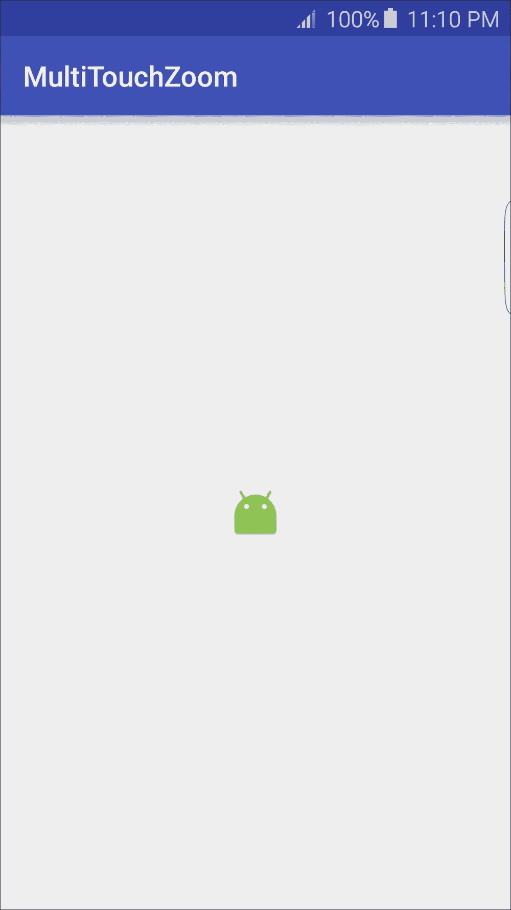
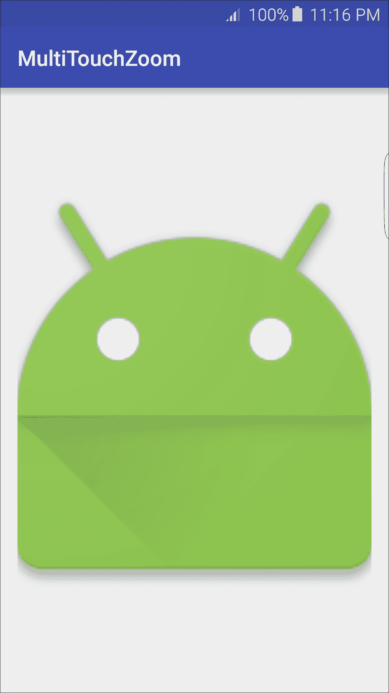
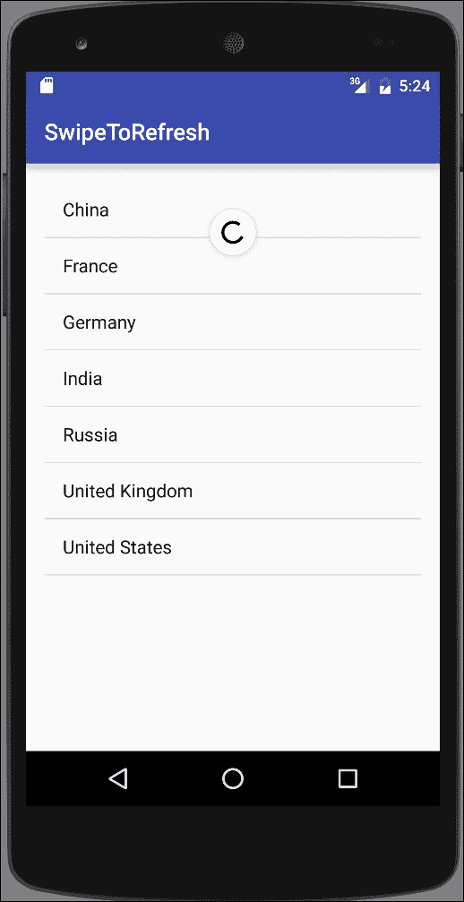
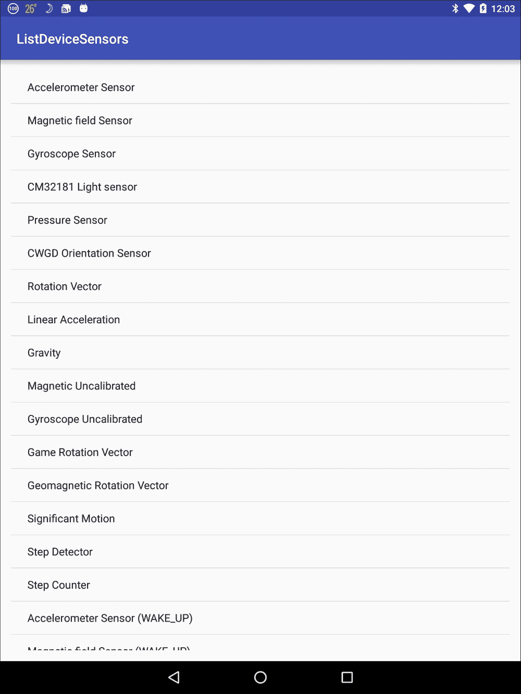

# 第八章：使用触摸屏和传感器

在本章中，我们将涵盖以下主题：

+   监听点击和长按事件

+   识别轻敲和其他常见手势

+   多指触控下的捏合缩放手势

+   滑动刷新

+   列出可用的传感器——安卓传感器框架简介

+   读取传感器数据——使用安卓传感器框架事件

+   读取设备方向

# 引言

如今，移动设备配备了众多传感器，通常包括陀螺仪、磁力、重力、压力和/或温度传感器，更不用说触摸屏了。这为与用户互动提供了许多新颖而激动人心的选项。通过传感器，您可以确定三维设备位置以及设备本身的使用方式，如摇晃、旋转、倾斜等。即使是触摸屏也提供了许多新的输入方法，从简单的点击到手势和多指触控。

我们将从探索触摸屏交互开始本章内容，先从简单的点击和长按开始，然后使用`SimpleOnGestureListener`类来检测常见的手势。接下来，我们将通过`ScaleGestureDetector`来探讨多指触控下的捏合缩放手势。

本书旨在为您的应用添加特性和功能提供快速指南。因此，它专注于所需的代码。强烈建议您花些时间阅读设计指南。

### 提示

请参考[谷歌手势设计指南](https://www.google.com/design/spec/patterns/gestures.html)

在本章的后面部分，我们将探讨安卓中的传感器能力，使用安卓传感器框架。我们将演示如何获取所有可用传感器的列表，以及如何检查特定传感器。一旦获取到传感器，我们将演示如何设置一个监听器来读取传感器数据。最后，我们将通过确定设备方向来结束本章的演示。

# 监听点击和长按事件

几乎每个应用都需要识别并响应基本的点击和长按事件。这是如此基础，在大多数菜谱中，我们使用 XML 的`onClick`属性，但对于更高级的监听器，需要通过代码设置。

安卓提供了一个事件监听器接口，当发生某些特定动作时会收到通知，如下所示：

+   `onClick()`: 当视图被按下时调用

+   `onLongClick()`: 当视图被长按时调用

+   `onFocusChange()`: 当用户导航到或离开视图时调用

+   `onKey()`: 当硬件按键被按下或释放时调用

+   `onTouch()`: 当触摸事件发生时调用

本节将演示如何响应用户的点击事件以及长按事件。

## 准备就绪

在 Android Studio 中创建一个新项目，命名为`PressEvents`。使用默认的**手机 & 平板**选项，并在提示**活动类型**时选择**空活动**。

## 如何操作...

接收基本视图事件设置非常简单。首先我们将创建一个视图；我们的示例将使用按钮，然后在活动的`onCreate()`方法中设置事件监听器。以下是步骤：

1.  打开`activity_main.xml`，并用以下`Button`替换现有的`TextView`：

    ```kt
    <Button
        android:id="@+id/button"
        android:layout_width="wrap_content"
        android:layout_height="wrap_content"
        android:text="Button"
        android:layout_centerVertical="true"
        android:layout_centerHorizontal="true" />
    ```

1.  现在打开`MainActivy.java`，并在现有的`onCreate()`方法中添加以下代码：

    ```kt
    Button button = (Button)findViewById(R.id.button);
    button.setOnClickListener(new View.OnClickListener() {
        @Override
        public void onClick(View v) {
            Toast.makeText(MainActivity.this, "Click", Toast.LENGTH_SHORT).show();
        }
    });
    button.setOnLongClickListener(new View.OnLongClickListener() {
        @Override
        public boolean onLongClick(View v) {
            Toast.makeText(MainActivity.this, "Long Press", Toast.LENGTH_SHORT).show();
            return true;
        }
    });
    ```

1.  在设备或模拟器上运行应用程序，尝试常规点击和长按。

## 工作原理...

在本书中使用的大多数示例中，我们使用以下属性在 XML 中设置`onClick`监听器：

```kt
android:onClick=""
```

你可能会注意到 XML 的`onClick()`方法回调需要与`setOnClickListener`的`.onClick()`回调具有相同的方法签名：

```kt
public void onClick(View v) {}
```

这是因为当我们使用 XML 的`onClick`属性时，Android 会自动为我们设置回调。此示例还演示了我们可以对单个视图设置多个监听器。

需要注意的最后一点是，`onLongClick()`方法返回一个布尔值，大多数其他事件监听器也是如此。返回`true`表示事件已被处理。

## 还有更多...

尽管按钮通常用于指示用户应该“按下”的位置，但我们也可以在任何视图上使用`setOnClickListener()`和`setOnLongClickListener()`，甚至是一个`TextView`。

如引言所述，还有其他事件监听器。你可以使用 Android Studio 的自动完成功能。首先输入以下命令：

```kt
button.setOn
```

然后按*Ctrl* + *空格键*查看列表。

# 识别轻敲和其他常见手势

与前一个食谱中描述的事件监听器不同，手势识别需要两个步骤的过程：

+   收集移动数据

+   分析数据以确定它是否与已知的手势匹配

第一步是当用户触摸屏幕时开始，此时会触发`onTouchEvent()`回调，并通过`MotionEvent`对象发送移动数据。幸运的是，Android 通过`GestureDetector`类使第二步（分析数据）变得更容易，该类可以检测以下手势：

+   `onTouchEvent()`

+   `onDown()`

+   `onFling()`

+   `onLongPress()`

+   `onScroll()`

+   `onShowPress()`

+   `onDoubleTap()`

+   `onDoubleTapEvent()`

+   `onSingleTapConfirmed()`

本食谱将演示使用`GestureDetector.SimpleOnGestureListener`来识别触摸和双击手势。

## 准备工作

在 Android Studio 中创建一个新项目，命名为`CommonGestureDetector`。使用默认的**手机 & 平板**选项，并在提示**活动类型**时选择**空活动**。

## 如何操作...

我们将使用活动本身来检测手势，因此不需要向布局中添加任何视图。打开`MainActivity.java`并按照以下步骤操作：

1.  添加以下全局变量：

    ```kt
    private GestureDetectorCompat mGestureDetector;
    ```

1.  在`MainActivity`类中添加以下`GestureListener`类：

    ```kt
    private class GestureListener extends GestureDetector.SimpleOnGestureListener {
        @Override
        public boolean onSingleTapConfirmed(MotionEvent e) {
            Toast.makeText(MainActivity.this, "onSingleTapConfirmed", Toast.LENGTH_SHORT).show();
            return super.onSingleTapConfirmed(e);
        }
        @Override
        public boolean onDoubleTap(MotionEvent e) {
            Toast.makeText(MainActivity.this, "onDoubleTap", Toast.LENGTH_SHORT).show();
            return super.onDoubleTap(e);
        }
    }
    ```

1.  如下重写`onTouchEvent()`：

    ```kt
    public boolean onTouchEvent(MotionEvent event) {
        mGestureDetector.onTouchEvent(event);
        return super.onTouchEvent(event);
    }
    ```

1.  最后，在`onCreate()`中添加以下代码行：

    ```kt
    mGestureDetector = new GestureDetectorCompat(this, new GestureListener());
    ```

1.  在设备或模拟器上运行此应用程序。

## 工作原理...

我们使用了来自支持库的`GestureDetectorCompat`，它使得 Android 1.6 及以上版本的设备能够支持手势操作。

如食谱介绍中所述，检测手势是一个两步的过程。为了收集运动或手势数据，我们从触摸事件开始追踪运动。每次调用`onTouchEvent()`时，我们将这些数据发送给`GestureDetector`。`GestureDetector`处理第二步，即分析数据。一旦检测到手势，就会进行适当的回调。我们的示例处理了单点和双击手势。

## 还有更多...

您的应用程序只需通过重写适当的回调，就可以轻松添加对`GestureDetector`检测到的其余手势的支持。

## 另请参阅

+   有关多指手势，请参阅下一个食谱，*使用多指手势进行捏合缩放*

# 使用多指手势进行捏合缩放

之前的食谱使用了`SimpleOnGestureListener`来提供简单的一指手势的检测。在本食谱中，我们将使用`SimpleOnScaleGestureListener`类来演示常见的捏合缩放多指手势。

下面的截图展示了使用以下食谱创建的应用程序中图标缩小后的效果：



下面的截图展示了图标放大后的效果：



## 准备工作

在 Android Studio 中创建一个新项目，命名为`MultiTouchZoom`。使用默认的**Phone & Tablet**选项，并在提示**Activity Type**时选择**Empty Activity**。

## 如何操作...

为了提供捏合缩放的视觉提示，我们将使用一个带有应用图标的`ImageView`。打开`activity_main.xml`并按照以下步骤操作：

1.  使用以下`ImageView`替换现有的`TextView`：

    ```kt
    <ImageView
        android:id="@+id/imageView"
        android:layout_width="wrap_content"
        android:layout_height="wrap_content"
        android:src="img/ic_launcher"
        android:layout_centerVertical="true"
        android:layout_centerHorizontal="true" />
    ```

1.  现在打开`MainActivity.java`，并向类中添加以下全局变量：

    ```kt
    private ScaleGestureDetector mScaleGestureDetector;
    private float mScaleFactor = 1.0f;
    private ImageView mImageView;
    ```

1.  如下重写`onTouchEvent()`：

    ```kt
    public boolean onTouchEvent(MotionEvent motionEvent) {
        mScaleGestureDetector.onTouchEvent(motionEvent);
        return true;
    }
    ```

1.  在`MainActivity`类中添加以下`ScaleListener`类：

    ```kt
    private class ScaleListener extends ScaleGestureDetector.SimpleOnScaleGestureListener {
        @Override
        public boolean onScale(ScaleGestureDetector scaleGestureDetector) {
            mScaleFactor *= scaleGestureDetector.getScaleFactor();
            mScaleFactor = Math.max(0.1f, Math.min(mScaleFactor, 10.0f));
            mImageView.setScaleX(mScaleFactor);
            mImageView.setScaleY(mScaleFactor);
            return true;
        }
    }
    ```

1.  在现有的`onCreate()`方法中添加以下代码：

    ```kt
    mImageView=(ImageView)findViewById(R.id.imageView);
    mScaleGestureDetector = new ScaleGestureDetector(this, new ScaleListener());
    ```

1.  要实验捏合缩放功能，请在带有触摸屏的设备上运行应用程序。

## 工作原理...

`ScaleGestureDetector`通过分析手势数据并最终通过`onScale()`回调报告缩放因子来完成所有工作。我们通过在`ScaleGestureDetector`上调用`getScaleFactor()`来获取实际的缩放因子。

我们使用一个带有应用图标的`ImageView`，通过设置`ImageView`的缩放比例来提供视觉上的缩放表示，该比例来自`ScaleGestureDetector`返回的缩放因子。为了防止缩放过大或过小，我们添加了以下检查：

```kt
mScaleFactor = Math.max(0.1f, Math.min(mScaleFactor, 10.0f));
```

# 滑动刷新

通过下拉列表来表示手动刷新的手势称为 Swipe-to-Refresh（下拉刷新）。这是一个如此常见的功能，以至于这个功能已经被封装在一个名为`SwipeRefreshLayout`的单个小部件中。

本食谱将展示如何使用小部件为`ListView`添加 Swipe-to-Refresh（下拉刷新）功能。以下屏幕截图显示了刷新动作：



## 准备就绪

在 Android Studio 中创建一个新项目，命名为`SwipeToRefresh`。选择默认的**Phone & Tablet**（手机和平板）选项，并在提示**Activity Type**（活动类型）时选择**Empty Activity**（空活动）。

## 如何操作...

首先，我们需要将`SwipeRefreshLayout`小部件和`ListView`添加到活动布局中，然后我们将在 java 代码中实现刷新监听器。以下是详细步骤：

1.  打开`activity_main.xml`文件，并用以下内容替换现有的`<TextView>`：

    ```kt
    <android.support.v4.widget.SwipeRefreshLayout

        android:id="@+id/swipeRefresh"
        android:layout_width="match_parent"
        android:layout_height="match_parent">
        <ListView
            android:id="@android:id/list"
            android:layout_width="match_parent"
            android:layout_height="match_parent" />
    </android.support.v4.widget.SwipeRefreshLayout>
    ```

1.  现在打开`MainActivity.java`文件，并向类中添加以下全局变量：

    ```kt
    SwipeRefreshLayout mSwipeRefreshLayout;
    ListView mListView;
    List mArrayList = new ArrayList<>();
    private int mRefreshCount=0;
    ```

1.  添加以下方法以处理刷新：

    ```kt
    private void refreshList() {
        mRefreshCount++;
        mArrayList.add("Refresh: " + mRefreshCount);
        ListAdapter countryAdapter = new ArrayAdapter<String>(this, android.R.layout.simple_list_item_1, mArrayList);
        mListView.setAdapter(countryAdapter);
        mSwipeRefreshLayout.setRefreshing(false);
    }
    ```

1.  在现有的`onCreate()`方法中添加以下代码：

    ```kt
    mSwipeRefreshLayout = (SwipeRefreshLayout)findViewById(R.id.swipeRefresh);
    mSwipeRefreshLayout.setOnRefreshListener(new SwipeRefreshLayout.OnRefreshListener() {
        @Override
        public void onRefresh() {
            refreshList();
        }
    });

    mListView = (ListView)findViewById(android.R.id.list);
    final String[] countries = new String[]{"China", "France", "Germany", "India", "Russia", "United Kingdom", "United States"};
    mArrayList = new ArrayList<String>(Arrays.asList(countries));
    ListAdapter countryAdapter = new ArrayAdapter<String>(this, android.R.layout.simple_list_item_1, mArrayList);
    mListView.setAdapter(countryAdapter);
    ```

1.  在设备或模拟器上运行应用程序。

## 工作原理...

本食谱的大部分代码是为了在每次调用刷新方法时向`ListView`添加项以模拟刷新。实现 Swipe-to-Refresh（下拉刷新）的主要步骤包括：

1.  添加`SwipeRefreshLayout`小部件。

1.  在`SwipeRefreshLayout`中包含`ListView`。

1.  添加`OnRefreshListener`以调用你的刷新方法。

1.  更新完成后调用`setRefreshing(false)`。

就这样。这个小部件使得添加 Swipe-to-Refresh（下拉刷新）变得非常简单！

## 还有更多...

尽管 Swipe-to-Refresh（下拉刷新）手势如今是应用程序的常见功能，但仍然建议包含一个菜单项（特别是出于可访问性的考虑）。以下是菜单布局的 XML 代码片段：

```kt
<menu  >
    <item
        android:id="@+id/menu_refresh"
        android:showAsAction="never"
        android:title="@string/menu_refresh"/>
</menu>
```

在`onOptionsItemSelected()`回调中调用你的刷新方法。当从代码中执行刷新，比如从菜单项事件中，你需要通知`SwipeRefreshLayout`刷新，以便它可以更新 UI。使用以下代码实现：

```kt
SwipeRefreshLayout.setRefreshing(true);
```

这告诉`SwipeRefreshLayout`刷新开始了，所以它可以显示进行中的指示器。

# 列出可用的传感器——Android 传感器框架简介

Android 通过 Android Sensor Framework 支持硬件传感器。该框架包括以下类和接口：

+   `SensorManager`

+   `Sensor`

+   `SensorEventListener`

+   `SensorEvent`

大多数 Android 设备包括硬件传感器，但它们在不同的制造商和模型之间有很大差异。如果你的应用程序使用传感器，你有两个选择：

+   在 Android Manifest 中指定传感器

+   在运行时检查传感器

要指定你的应用程序使用传感器，请在 Android Manifest 中包含`<uses-feature>`声明。以下是一个要求提供指南针的示例：

```kt
<uses-feature android:name="android.hardware.sensor.compass" android:required="true"/>
```

如果你的应用程序使用指南针，但不需要它来正常工作，你应该设置`android:required="false"`，否则应用程序将无法通过 Google Play 获得。

传感器被分为以下三个类别：

+   运动传感器

+   环境传感器

+   位置传感器

Android SDK 支持以下传感器类型：

| 传感器 | 检测 | 用途 |
| --- | --- | --- |
| `TYPE_ACCELEROMETER` | 包括重力在内的运动检测 | 用于确定震动、倾斜等 |
| `TYPE_AMBIENT_TEMPERATURE` | 测量环境室温 | 用于确定本地温度 |
| `TYPE_GRAVITY` | 测量三个轴上的重力 | 用于运动检测 |
| `TYPE_GYROSCOPE` | 测量三个轴上的旋转 | 用于确定转弯、旋转等 |
| `TYPE_LIGHT` | 测量光线水平 | 用于设置屏幕亮度 |
| `TYPE_LINEAR_ACCELERATION` | 排除重力影响的运动检测 | 用于确定加速度 |
| `TYPE_MAGNETIC_FIELD` | 测量地磁场 | 用于创建指南针或确定方位 |
| `TYPE_PRESSURE` | 测量气压 | 用于气压计 |
| `TYPE_PROXIMITY` | 测量物体相对于屏幕的位置 | 用于确定在通话期间设备是否紧贴耳朵 |
| `TYPE_RELATIVE_HUMIDITY` | 测量相对湿度 | 用于确定露点和湿度 |
| `TYPE_ROTATION_VECTOR` | 测量设备方向 | 用于检测运动和旋转 |

还有两个额外的传感器：`TYPE_ORIENTATION`和`TYPE_TEMPERATURE`，它们已被弃用，因为它们已被新型传感器所取代。

本教程将演示如何获取可用传感器的列表。以下是物理设备上的屏幕截图：



## 准备工作

在 Android Studio 中创建一个新项目，命名为：`ListDeviceSensors`。选择默认的**手机 & 平板**选项，并在提示**活动类型**时选择**空活动**。

## 如何操作...

首先，我们将查询可用的传感器列表，然后在`ListView`中显示结果。以下是详细步骤：

1.  打开`activity_main.xml`，并用以下内容替换现有的`TextView`：

    ```kt
    <ListView
        android:id="@+id/list"
        android:layout_width="match_parent"
        android:layout_height="match_parent" />
    ```

1.  接下来，打开`ActivityMain.java`，并在现有的`onCreate()`方法中添加以下代码：

    ```kt
    ListView listView = (ListView)findViewById(R.id.list);
    List sensorList = new ArrayList<String>();

    List<Sensor> sensors = ((SensorManager) getSystemService(Context.SENSOR_SERVICE)).getSensorList(Sensor.TYPE_ALL);
    for (Sensor sensor : sensors ) {
        sensorList.add(sensor.getName());
    }
    ListAdapter sensorAdapter = new ArrayAdapter<String>(this, android.R.layout.simple_list_item_1, sensorList);
    listView.setAdapter(sensorAdapter);
    ```

1.  在设备或模拟器上运行程序。

## 工作原理...

以下代码行负责获取可用传感器的列表；其余代码用于填充`ListView`：

```kt
List<Sensor> sensors = ((SensorManager) getSystemService(Context.SENSOR_SERVICE)).getSensorList(Sensor.TYPE_ALL);
```

请注意，我们获得了一个`Sensor`对象的列表。我们只获取传感器名称以在`ListView`中显示，但还有其他属性可用。有关完整列表，请参阅*另请参阅*部分提供的链接。

## 还有更多...

如介绍中的 Nexus 9 屏幕截图所示，一个设备可以有多个相同类型的传感器。如果你在寻找一个特定的传感器，可以传入介绍中表格显示的一个常量。在这种情况下，如果你想查看所有可用的加速度计传感器，可以使用以下调用：

```kt
List<Sensor> sensors = sensorManager.getSensorList(Sensor.TYPE_ACCELEROMETER);
```

如果你不是在寻找传感器列表，而是需要与特定传感器一起工作，可以使用以下代码检查默认传感器：

```kt
if (sensorManager.getDefaultSensor(Sensor.TYPE_ACCELEROMETER) != null){
    //Sensor is available - do something here
}
```

## 另请参阅

+   **Android 开发者传感器**网站在[`developer.android.com/reference/android/hardware/Sensor.html`](http://developer.android.com/reference/android/hardware/Sensor.html)

# 读取传感器数据——使用 Android 传感器框架事件

前一个菜谱，*列出可用传感器——Android 传感器框架简介*，提供了对 Android 传感器框架的介绍。现在，我们将使用`SensorEventListener`来读取传感器数据。`SensorEventListener`接口只有两个回调：

+   `onSensorChanged`()

+   `onAccuracyChanged`()

当传感器有新数据要报告时，它会使用`SensorEvent`对象调用`onSensorChanged()`。本示例将演示如何读取光线传感器，但由于所有传感器都使用相同的框架，因此很容易将此示例适配到其他任何传感器。（请参阅前一个菜谱介绍中可用的传感器类型列表。）

## 准备就绪

在 Android Studio 中创建一个新项目，并将其命名为：`ReadingSensorData`。使用默认的**手机 & 平板**选项，并在提示**活动类型**时选择**空活动**。

## 如何操作...

我们将在活动布局中添加一个`TextView`以显示传感器数据，然后我们将`SensorEventListener`添加到 java 代码中。我们将使用`onResume()`和`onPause()`事件来启动和停止我们的事件监听器。要开始，请打开`activity_main.xml`并按照以下步骤操作：

1.  按照以下方式修改现有的`TextView`：

    ```kt
    <TextView
        android:id="@+id/textView"
        android:layout_width="wrap_content"
        android:layout_height="wrap_content"
        android:layout_centerHorizontal="true"
        android:layout_centerVertical="true"
        android:text="0"/>
    ```

1.  现在，打开`MainActivity.java`并添加以下全局变量声明：

    ```kt
    private SensorManager mSensorManager;
    private Sensor mSensor;
    private TextView mTextView;
    ```

1.  按照以下方式将`SensorListener`类添加到`MainActivity`类：

    ```kt
    private SensorEventListener mSensorListener = new SensorEventListener() {
        @Override
        public void onSensorChanged(SensorEvent event) {
            mTextView.setText(String.valueOf(event.values[0]));
        }
        @Override
        public void onAccuracyChanged(Sensor sensor, int accuracy) {
            //Nothing to do
        }
    };
    ```

1.  我们将在`onResume()`和`onPause()`中如下注册和注销传感器事件：

    ```kt
    @Override
    protected void onResume() {
        super.onResume();
        mSensorManager.registerListener(mSensorListener, mSensor, SensorManager.SENSOR_DELAY_NORMAL);
    }

    @Override
    protected void onPause() {
        super.onPause();
        mSensorManager.unregisterListener(mSensorListener);
    }
    ```

1.  在`onCreate()`中添加以下代码：

    ```kt
    mTextView = (TextView)findViewById(R.id.textView);
    mSensorManager = (SensorManager) getSystemService(Context.SENSOR_SERVICE);
    mSensor = mSensorManager.getDefaultSensor(Sensor.TYPE_LIGHT);
    ```

1.  现在，你可以在物理设备上运行应用程序，以查看光传感器的原始数据。

## 工作原理...

使用 Android 传感器框架从获取传感器开始，这一步我们在`onCreate()`方法中完成。在这里，我们调用`getDefaultSensor()`，请求`TYPE_LIGHT`类型的传感器。我们在`onResume()`中注册监听器，在`onPause()`中再次注销，以减少电池消耗。在调用`registerListener()`时，我们传入我们的`mSensorListener`对象。

在我们的案例中，我们只需要传感器数据，这些数据在`onSensorChanged()`回调中发送。当传感器变化时，我们使用传感器数据更新`TextView`。

## 还有更多...

现在您已经使用了一个传感器，您就知道如何使用所有传感器了，因为它们都使用相同的框架。当然，您对数据的处理会根据您读取的数据类型而有很大差异。如这里所示，环境传感器返回单一值，但位置和运动传感器也可以返回其他元素，如下所示。

### 环境传感器

Android 支持以下四种环境传感器：

+   湿度

+   光线

+   压力

+   温度

环境传感器通常更容易处理，因为返回的数据是单一元素，通常不需要校准或过滤。由于大多数设备都包括一个控制屏幕亮度的光线传感器，我们在此演示中使用了光线传感器。

### 位置传感器

位置传感器包括：

+   地磁场

+   近距离

以下传感器类型使用地磁场：

+   `TYPE_GAME_ROTATION_VECTOR`

+   `TYPE_GEOMAGNETIC_ROTATION_VECTOR`

+   `TYPE_MAGNETIC_FIELD`

+   `TYPE_MAGNETIC_FIELD_UNCALIBRATED`

除了`TYPE_MAGNETIC_FIELD_UNCALIBRATED`发送六个值外，这些传感器在`onSensorChanged()`事件中返回三个值。

第三个传感器，方向传感器，已被弃用，现在建议使用`getRotation()`和`getRotationMatrix()`来计算方向变化。（对于设备方向，例如纵向和横向模式，请参阅下一个菜谱：*读取设备方向*。）

### 运动传感器

运动传感器包括以下内容：

+   加速度计

+   陀螺仪

+   重力

+   线性加速度

+   旋转矢量

这些包括以下传感器类型：

+   `TYPE_ACCELEROMETE`

+   `TYPE_GRAVITY`

+   `TYPE_GYROSCOPE`

+   `TYPE_GYROSCOPE_UNCALIBRATED`

+   `TYPE_LINEAR_ACCELERATION`

+   `TYPE_ROTATION_VECTOR`

+   `TYPE_SIGNIFICANT_MOTION`

+   `TYPE_STEP_COUNTER`

+   `TYPE_STEP_DETECTOR`

除了最后三个之外，这些传感器也包括三个数据元素。`TYPE_SIGNIFICANT_MOTION`和`TYPE_STEP_DETECTOR`表示事件，而`TYPE_STEP_COUNTER`返回自上次启动以来（传感器处于活动状态时）的步数。

## 另请参阅

+   *列举可用传感器——介绍 Android 传感器框架*的菜谱

+   第九章，*图形和动画*中的*使用传感器数据和 RotateAnimation 创建指南针*的菜谱

+   关于设备方向，请参阅*读取设备方向*的菜谱

+   第十三章，*获取位置和使用地理围栏*，涵盖了*GPS 和位置*的菜谱

# 读取设备方向

尽管 Android 框架会在方向变化时自动加载新资源（如布局），但有时您可能希望禁用此行为。如果您希望被通知方向变化而不是让 Android 自动处理，请在 Android Manifest 中的 Activity 添加以下属性：

```kt
android:configChanges="keyboardHidden|orientation|screenSize"
```

当以下配置更改发生时，系统将通过`onConfigurationChanged()`方法通知你，而不是自动处理：

+   `keyboardHidden`

+   `orientation`

+   `screenSize`

`onConfigurationChanged()`的签名如下：

```kt
onConfigurationChanged (Configuration newConfig)
```

你可以在`newConfig.orientation`中找到新的方向。

### 提示

禁用自动配置更改（这会导致布局重新加载并重置状态信息）不应用于替代正确保存状态信息。你的应用程序仍然可能在任何时候被中断或完全停止，并被系统杀死。（请参阅第一章中的*保存活动状态*，了解如何正确保存状态。）

本教程将演示如何确定当前设备方向。

## 准备就绪

在 Android Studio 中创建一个新项目，并将其命名为：`GetDeviceOrientation`。使用默认的**手机 & 平板**选项，并在提示**活动类型**时选择**空活动**。

## 如何操作...

我们将在布局中添加一个按钮，以便按需检查方向。首先打开`activity_main.xml`并按照以下步骤操作：

1.  使用以下`Button`替换现有的`TextView`：

    ```kt
    <Button
        android:layout_width="wrap_content"
        android:layout_height="wrap_content"
        android:text="Check Orientation"
        android:id="@+id/button"
        android:layout_centerVertical="true"
        android:layout_centerHorizontal="true"
        android:onClick="checkOrientation"/>
    ```

1.  添加以下方法来处理按钮点击：

    ```kt
    public void checkOrientation(View view){
        int orientation = getResources().getConfiguration().orientation;
        switch (orientation) {
            case Configuration.ORIENTATION_LANDSCAPE:
                Toast.makeText(MainActivity.this, "ORIENTATION_LANDSCAPE", Toast.LENGTH_SHORT).show();
                break;
            case Configuration.ORIENTATION_PORTRAIT:
                Toast.makeText(MainActivity.this, "ORIENTATION_PORTRAIT", Toast.LENGTH_SHORT).show();
                break;
            case Configuration.ORIENTATION_UNDEFINED:
                Toast.makeText(MainActivity.this, "ORIENTATION_UNDEFINED", Toast.LENGTH_SHORT).show();
                break;
        }
    }
    ```

1.  在设备或模拟器上运行应用程序。

    ### 提示

    使用*Ctrl* + *F11*旋转模拟器。

## 工作原理...

要获取当前方向，我们只需调用以下代码行：

```kt
getResources().getConfiguration().orientation
```

方向以`int`类型返回，我们可以将其与三个可能值之一进行比较，如示例所示。

## 还有更多...

### 获取当前设备旋转

另一个可能需要知道当前方向的情况是处理摄像头数据时——图片和/或视频。通常，图像可能会根据设备方向或补偿当前方向而旋转。在这种情况下，有另一个选项可用于获取旋转：

```kt
int rotation = getWindowManager().getDefaultDisplay().getRotation();
```

在上面的代码行中，`rotation`将是以下值之一：

+   `Surface.ROTATION_0`

+   `Surface.ROTATION_90`

+   `Surface.ROTATION_180`

+   `Surface.ROTATION_270`

### 提示

旋转值将从其正常方向开始。例如，当使用正常方向为横屏的桌子时，如果在纵向方向拍摄照片，该值将是`ROTATION_90`或`ROTATION_270`。

## 另请参阅

+   第一章中的*保存活动状态*教程

+   请参考**配置开发者链接**在 [`developer.android.com/reference/android/content/res/Configuration.html`](http://developer.android.com/reference/android/content/res/Configuration.html)

+   请参考**显示开发者链接**在 [`developer.android.com/reference/android/view/Display.html#getRotation()`](http://developer.android.com/reference/android/view/Display.html#getRotation())
