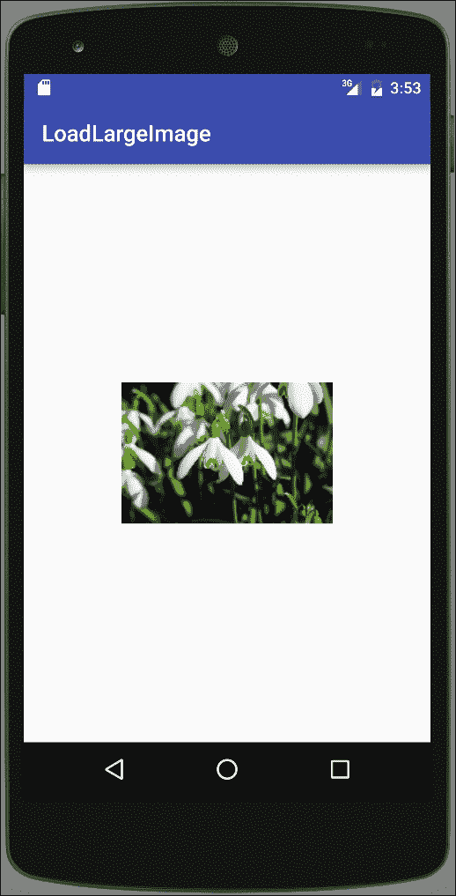
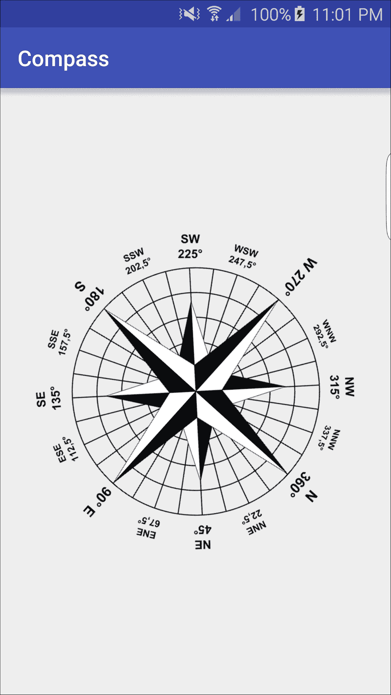
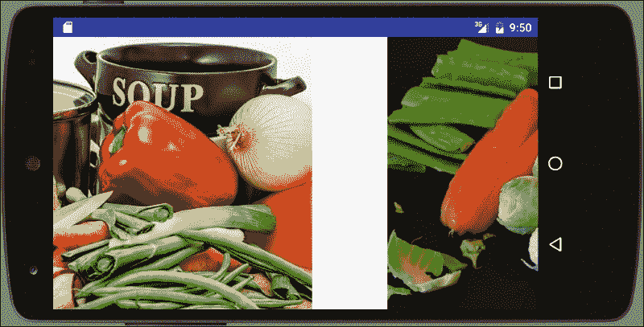
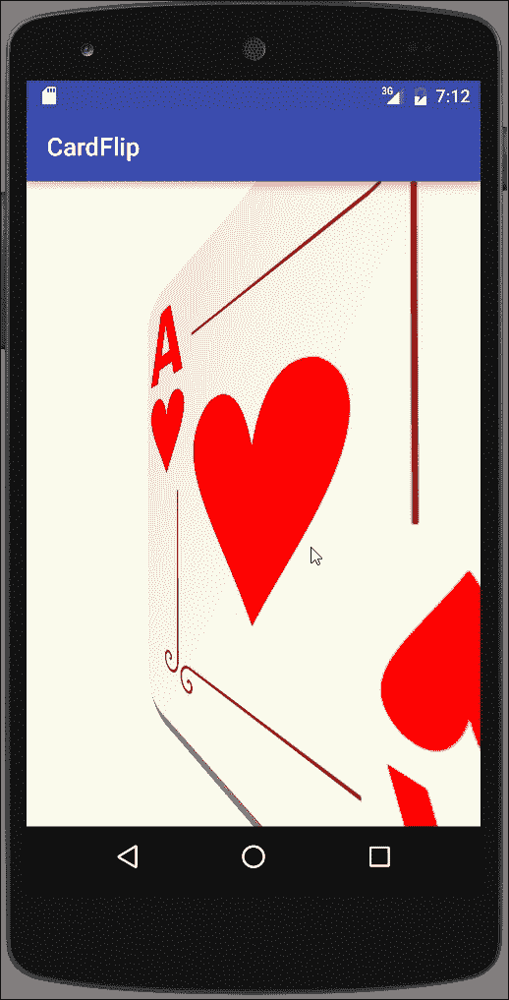
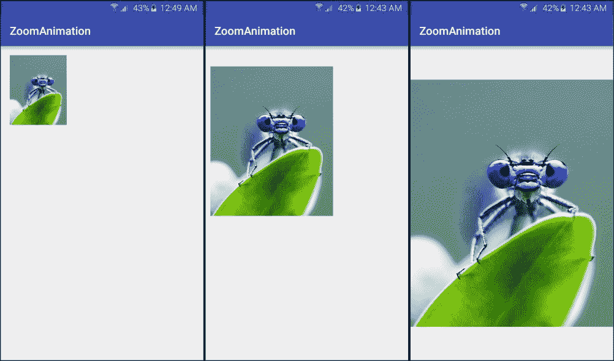

# 第九章：图形和动画

在本章中，我们将涵盖以下主题：

+   缩小大图片以避免内存溢出异常

+   过渡动画——定义场景并应用过渡

+   使用传感器数据和 RotateAnimation 创建指南针

+   使用 ViewPager 创建幻灯片展示

+   使用片段创建卡片翻转动画

+   使用自定义过渡创建缩放动画

# 引言

动画既可以是视觉上吸引人的，也可以是功能性的，简单的按钮按下操作就证明了这一点。按钮按下的图形表示使应用生动起来，同时通过为用户的事件提供视觉反馈，提供了功能性价值。

Android 框架提供了几种动画系统，以便在您的应用程序中更容易地包含动画。它们包括以下内容：

+   **视图动画**：（原始动画系统。）它通常需要的代码较少，但动画选项有限

+   **属性动画**：这是一个更灵活的系统，允许对任何对象的任何属性进行动画处理

+   **Drawable 动画**：它使用 drawable 资源逐帧创建动画（像电影一样）

属性动画系统在 Android 3.0 中引入，通常由于其灵活性而比视图动画更受欢迎。视图动画的主要缺点包括：

+   可以动画化的方面有限——例如缩放和旋转

+   只能对视图的内容进行动画处理——它不能改变视图在屏幕上的绘制位置（因此它不能动画化球在屏幕上的移动）

+   只能对 View 对象进行动画处理

这是一个简单的示例，演示了使用视图动画使视图“闪烁”（模拟按钮按下的简单操作）：

```kt
Animation blink =AnimationUtils.loadAnimation(this,R.anim.blink);
view.startAnimation(blink);
```

这是位于`res/anim`文件夹中的`blink.xml`资源文件的内容：

```kt
<?xml version="1.0" encoding="utf-8"?>
<set >
    <alpha android:fromAlpha="1.0"
        android:toAlpha="0.0"
        android:background="#000000"
        android:interpolator="@android:anim/linear_interpolator"
        android:duration="100"
        android:repeatMode="restart"
        android:repeatCount="0"/>
</set>
```

如您所见，创建这种动画非常简单，所以如果视图动画实现了您的目标，请使用它。当它不符合您的需求时，转向属性动画系统。我们将在*使用片段创建卡片翻转动画*和*使用自定义过渡创建缩放动画*的菜谱中展示属性动画，使用新的`objectAnimator`。

*过渡动画——定义场景并应用过渡*的菜谱将提供有关 Android Transition Framework 的额外信息，我们将在许多菜谱中使用它。

### 注意

插值器是定义动画变化速率的函数。

`插值器`将在本章的几个菜谱和前面的闪烁示例中提到。插值器定义了过渡是如何计算的。线性插值器会在设定的持续时间内均匀计算变化，而`AccelerateInterpolator`函数会在持续时间内创建更快的移动。以下是可用的插值器完整列表，以及 XML 标识符：

+   `AccelerateDecelerateInterpolator (@android:anim/accelerate_decelerate_interpolator)`

+   `AccelerateInterpolator (@android:anim/accelerate_interpolator)`

+   `AnticipateInterpolator (@android:anim/anticipate_interpolator)`

+   `AnticipateOvershootInterpolator (@android:anim/anticipate_overshoot_interpolator)`

+   `BounceInterpolator (@android:anim/bounce_interpolator)`

+   `CycleInterpolator (@android:anim/cycle_interpolator)`

+   `DecelerateInterpolator (@android:anim/decelerate_interpolator)`

+   `LinearInterpolator (@android:anim/linear_interpolator)`

+   `OvershootInterpolator (@android:anim/overshoot_interpolator)`

尽管动画通常不会占用太多内存，但图形资源往往需要。你可能想要处理的许多图片经常超出设备可用内存。在本章的第一个食谱中，我们将会讨论如何避免内存溢出异常，即*缩小大图片*。

# 避免内存溢出异常，缩小大图片

处理图片可能非常占用内存，经常导致应用程序因*内存溢出*异常而崩溃。这在处理设备摄像头拍摄的图片时尤其如此，因为它们的分辨率通常比设备本身要高得多。

由于在这个例子中，加载比 UI 支持的分辨率更高的图片并不会带来任何视觉上的好处，因此这个食谱将演示如何为显示取用图片的小样本。我们将使用`BitmapFactory`首先检查图片大小，然后加载缩小后的图片。

这是本食谱的一个截图，展示了一幅非常大图片的缩略图：



## 准备工作

在 Android Studio 中创建一个新项目，命名为`LoadLargeImage`。使用默认的**Phone & Tablet**选项，并在提示**Activity Type**时选择**Empty Activity**。

对于这个食谱，我们需要一张大图片；因此我们访问了[www.Pixabay.com](http://www.Pixabay.com)获取了一张图片。由于图片本身并不重要，我们下载了当时显示的第一张图片。（原始尺寸的图片是 6000 x 4000，3.4MB 大小。）

## 如何操作...

如在*准备工作*中所述，我们需要一张大图片来演示缩放。一旦你有了图片，按照以下步骤操作：

1.  将图片复制到`res/drawable`目录下，并命名为`image_large.jpg`（如果你选择了不同的文件类型，请使用适当的扩展名）。

1.  打开`activity_main.xml`文件，将现有的`TextView`替换为以下`ImageView`：

    ```kt
    <ImageView
        android:id="@+id/imageViewThumbnail"
        android:layout_width="100dp"
        android:layout_height="100dp"
        android:layout_centerInParent="true" />
    ```

1.  现在打开`MainActivity.java`文件，并添加这个方法，我们稍后会解释：

    ```kt
    public Bitmap loadSampledResource(int imageID, int targetHeight, int targetWidth) {
        final BitmapFactory.Options options = new BitmapFactory.Options();
        options.inJustDecodeBounds = true;
        BitmapFactory.decodeResource(getResources(), imageID, options);
        final int originalHeight = options.outHeight;
        final int originalWidth = options.outWidth;
        int inSampleSize = 1;
        while ((originalHeight / (inSampleSize *2)) > targetHeight && (originalWidth / (inSampleSize *2)) > targetWidth) {
            inSampleSize *= 2;
        }
        options.inSampleSize = inSampleSize;
        options.inJustDecodeBounds = false;
        return BitmapFactory.decodeResource(getResources(), imageID, options);
    }
    ```

1.  在现有的`onCreate()`方法中添加以下代码：

    ```kt
    ImageView imageView = (ImageView)findViewById(R.id.imageViewThumbnail);
    imageView.setImageBitmap(loadSampledResource(R.drawable.image_large, 100, 100));
    ```

1.  在设备或模拟器上运行应用程序。

## 工作原理...

`loadSampledResource()`方法的目的是加载一张较小的图片，以减少图片的内存消耗。如果我们尝试加载从[www.Pixabay.Com](http://www.Pixabay.Com)选择的完整图片（见前面的*准备*部分），应用需要超过 3MB 的 RAM 来加载。这对于大多数设备来说（至少目前是这样）是过多的内存，即使能够完全加载，对于我们的缩略图视图也没有视觉上的好处。

为了避免出现`内存不足`的情况，我们使用`BitmapFactory.Options`的`inSampleSize`属性来减少或子采样图像。（如果我们设置`inSampleSize=2`，它会将图像减少一半。如果我们使用`inSampleSize=4`，它会将图像减少四分之一）要计算`inSampleSize`，首先我们需要知道图像的大小。我们可以使用以下方法中的`inJustDecodeBounds`属性：

```kt
options.inJustDecodeBounds = true;
```

这告诉`BitmapFactory`获取图像尺寸，而实际上不存储图像内容。一旦我们有了图像大小，我们使用以下代码计算采样：

```kt
while ((originalHeight / (inSampleSize *2)) > targetHeight && (originalWidth / (inSampleSize *2)) > targetWidth) {
        inSampleSize *= 2;
}
```

这段代码的目的是确定不将图像尺寸降低到目标尺寸以下的最大的采样大小。为此，我们加倍采样大小并检查尺寸是否超过目标尺寸。如果没有，我们保存加倍后的采样大小并重复此过程。一旦缩小后的尺寸低于目标尺寸，我们使用最后保存的`inSampleSize`。

### 注意

从`inSampleSize`的文档（在下面的*另请参阅*部分中的链接）中注意，解码器使用基于 2 的幂的最终值，任何其他值都会被四舍五入到最近的 2 的幂。

一旦我们有了采样大小，我们设置`inSampleSize`属性并将`inJustDecodeBounds`设置为`false`，以正常加载。以下是代码：

```kt
options.inSampleSize = inSampleSize;
options.inJustDecodeBounds = false;
```

需要注意的是，这个方法说明了在您自己的应用程序中应用该任务的概念。加载和处理图像可能是一个长时间的操作，这可能导致您的应用程序停止响应。这不是一件好事，可能导致 Android 显示**应用程序无响应**（**ANR**）对话框。建议在后台线程上执行长时间的任务，以保持 UI 线程响应。`AsyncTask`类可用于执行后台网络处理，但还有许多其他库可用（在食谱末尾的链接）：

+   **Volley**：在网络上进行快速、可扩展的 UI 操作（见第十二章，*电信、网络与互联网*）

+   **Picasso**：一个强大的 Android 图像下载和缓存库

+   **Android Universal Image Loader**：用于加载、缓存和显示图片的强大而灵活的库

## 还有更多...

需要注意的是，我们传递给`loadSampledResource()`方法的`targetHeight`和`targetWidth`参数实际上并不设置图片大小。如果你使用我们使用的相同大小的图片运行应用程序，那么样本大小将为 32，导致加载的图片大小为 187 x 125。

如果你的布局需要特定大小的图片，可以在布局文件中设置大小，或者可以直接使用 Bitmap 类修改图片大小。

## 另请参阅

+   **开发者文档: BitmapFactory.inSampleSize()** 请访问[`developer.android.com/reference/android/graphics/BitmapFactory.Options.html#inSampleSize`](https://developer.android.com/reference/android/graphics/BitmapFactory.Options.html#inSampleSize)

+   请参考[Android Universal Image Loader](https://github.com/nostra13/Android-Universal-Image-Loader)页面

+   请参考[Picasso](https://square.github.io/picasso/)的相关内容

+   检查第十四章中的*AsyncTask*任务，*让你的应用准备好上架 Play 商店*，以在后台线程上处理长时间运行的操作。

# 转换动画——定义场景并应用转换

安卓转换框架提供了以下内容：

+   **组级别动画**: 动画适用于层次结构中的所有视图

+   **基于转换的动画**: 基于开始和结束属性变化的动画

+   **内置动画**: 一些常见的过渡效果，如淡入/淡出和移动

+   **资源文件支持**: 将动画值保存到资源（XML）文件中，以便在运行时加载

+   **生命周期回调**: 动画期间接收回调通知

转换动画包括以下内容：

+   **起始场景**: 动画开始时的视图（或`ViewGroup`）

+   **Transition**: 变化类型（稍后介绍）

+   **结束场景**: 动画结束时的视图（或`ViewGroup`）

+   **Transitions**: 安卓为以下三种转换提供了内置支持：

    +   **AutoTransition（默认转换）**: 淡出，移动和调整大小，然后淡入（按此顺序）

    +   **Fade**: 淡入，淡出（默认），或两者都有（指定顺序）

    +   **ChangeBounds**: 移动和调整大小

转换框架将自动创建从开始场景到结束场景所需的帧。

以下是在使用以下类时转换框架的一些已知限制：

+   **SurfaceView**: 由于`SurfaceView`动画是在非 UI 线程上执行的，因此动画可能不会正确显示，因此它们可能与应用程序不同步

+   **TextView**: 动态文本大小变化可能不会正确工作，导致文本直接跳转到最终状态

+   **AdapterView**: 扩展了`AdapterView`的类，如`ListView`和`GridView`可能会挂起

+   **TextureView**: 某些转换可能不起作用

本教程提供了一个关于使用过渡动画系统的快速指南。我们将从定义场景和过渡资源开始，然后应用过渡，创建动画。以下步骤将指导您使用 XML 创建资源，这是通常推荐的。也可以通过代码创建资源，我们将在*更多内容*部分讨论这一点。

## 准备工作

在 Android Studio 中创建一个新项目，命名为：`TransitionAnimation`。在**目标 Android 设备**对话框中，选择**手机和平板**选项，并为**最低 SDK**选择 API 19（或更高）。当提示选择**活动类型**时，选择**空活动**。

## 如何操作...

以下是创建资源文件并应用过渡动画的步骤：

1.  按照以下方式更改现有的`activity.main.xml`布局文件：

    ```kt
    <?xml version="1.0" encoding="utf-8"?>
    <RelativeLayout 

        android:id="@+id/layout"
        android:layout_width="match_parent"
        android:layout_height="match_parent">
        <TextView
            android:layout_width="wrap_content"
            android:layout_height="wrap_content"
            android:text="Top"
            android:id="@+id/textViewTop"
            android:layout_alignParentTop="true"
            android:layout_centerHorizontal="true" />
        <TextView
            android:layout_width="wrap_content"
            android:layout_height="wrap_content"
            android:text="Bottom"
            android:id="@+id/textViewBottom"
            android:layout_alignParentBottom="true"
            android:layout_centerHorizontal="true" />
        <Button
            android:layout_width="wrap_content"
            android:layout_height="wrap_content"
            android:text="Go"
            android:id="@+id/button"
            android:layout_centerInParent="true"
            android:onClick="goAnimate"/>
    </RelativeLayout>
    ```

1.  使用以下 XML 创建一个名为`activity_main_end.xml`的新布局文件：

    ```kt
    <?xml version="1.0" encoding="utf-8"?>
    <RelativeLayout 

        android:id="@+id/layout"
        android:layout_width="match_parent"
        android:layout_height="match_parent">
        <TextView
            android:layout_width="wrap_content"
            android:layout_height="wrap_content"
            android:text="Bottom"
            android:id="@+id/textViewBottom"
            android:layout_alignParentTop="true"
            android:layout_centerHorizontal="true" />
        <TextView
            android:layout_width="wrap_content"
            android:layout_height="wrap_content"
            android:text="Top"
            android:id="@+id/textViewTop"
            android:layout_alignParentBottom="true"
            android:layout_centerHorizontal="true" />
        <Button
            android:layout_width="wrap_content"
            android:layout_height="wrap_content"
            android:text="Go"
            android:id="@+id/button"
            android:layout_centerInParent="true"/>
    </RelativeLayout>
    ```

1.  新建一个过渡资源目录（**文件** | **新建** | **Android 资源目录**，并选择**过渡**作为**资源类型**）。

1.  在`res/transition`文件夹中创建一个名为`transition_move.xml`的新文件，使用以下 XML：

    ```kt
    <?xml version="1.0" encoding="utf-8"?>
    <changeBounds  />
    ```

1.  使用以下代码添加`goAnimate()`方法：

    ```kt
    public void goAnimate(View view) {
        ViewGroup root = (ViewGroup) findViewById(R.id.layout);
        Scene scene = Scene.getSceneForLayout(root, R.layout.activity_main_end, this);
        Transition transition = TransitionInflater.from(this).inflateTransition(R.transition.transition_move);
        TransitionManager.go(scene, transition);
    }
    ```

1.  您已经准备好在设备或模拟器上运行应用程序。

## 工作原理...

您可能会发现代码本身相当简单。正如简介中所概述的，我们只需要创建开始和结束场景并设置过渡类型。以下是代码的详细分解。

### 创建开始场景

运行以下代码行将创建开始场景：

```kt
ViewGroup root = (ViewGroup) findViewById(R.id.layout);
```

### 创建过渡：

运行以下代码行将创建过渡：

```kt
Transition transition = TransitionInflater.from(this).inflateTransition(R.transition.transition_move);
```

### 定义结束场景：

运行以下代码行将定义结束场景：

```kt
Scene scene = Scene.getSceneForLayout(root, R.layout.activity_main_end, this);
```

### 开始过渡：

运行以下代码行将开始过渡：

```kt
TransitionManager.go(scene, transition);
```

尽管简单，但本教程的大部分工作在于创建必要的资源文件。

## 更多内容...

现在，我们将看看仅使用代码解决方案创建相同的过渡动画（尽管我们仍将使用初始`activity_main.xml`布局文件）：

```kt
ViewGroup root = (ViewGroup) findViewById(R.id.layout);
Scene scene = new Scene(root);

Transition transition = new ChangeBounds();
TransitionManager.beginDelayedTransition(root,transition);

TextView textViewTop = (TextView)findViewById(R.id.textViewTop);
RelativeLayout.LayoutParams params = (RelativeLayout.LayoutParams)textViewTop.getLayoutParams();
params.addRule(RelativeLayout.ALIGN_PARENT_BOTTOM,1);
params.addRule(RelativeLayout.ALIGN_PARENT_TOP, 0);
textViewTop.setLayoutParams(params);

TextView textViewBottom = (TextView)findViewById(R.id.textViewBottom);
params = (RelativeLayout.LayoutParams)textViewBottom.getLayoutParams();
params.addRule(RelativeLayout.ALIGN_PARENT_BOTTOM,0);
params.addRule(RelativeLayout.ALIGN_PARENT_TOP, 1);
textViewBottom.setLayoutParams(params);

TransitionManager.go(scene);
```

我们仍然需要开始和结束场景以及过渡；唯一的区别在于我们如何创建资源。在前面的代码中，我们使用当前布局创建了开始场景。

在我们开始通过代码修改布局之前，我们使用`TransitionManager`的`beginDelayedTransition()`方法以及过渡类型。`TransitionManager`将跟踪结束场景的变化。当我们调用`go()`方法时，`TransitionManager`会自动对变化进行动画处理。

## 另请参阅

+   请参考[动画资源网页](https://developer.android.com/guide/topics/resources/animation-resource.html)（[`developer.android.com/guide/topics/resources/animation-resource.html`](https://developer.android.com/guide/topics/resources/animation-resource.html)）。

# 使用传感器数据和 RotateAnimation 创建罗盘。

在上一章中，我们演示了从物理设备传感器读取传感器数据。在那个教程中，我们使用了光线传感器，因为环境传感器数据通常不需要额外的处理。尽管获取磁感应强度数据很容易，但这些数字本身并没有太多意义，当然也不能创建吸引人的显示效果。

在本教程中，我们将演示如何获取磁感应数据以及加速度计数据来计算磁北。我们将使用`SensorManager.getRotationMatrix`来响应设备移动时对指南针进行动画处理。下面是在物理设备上我们指南针应用程序的截图：



## 准备工作

在 Android Studio 中创建一个新项目，命名为`Compass`。使用默认的**手机和平板**选项，在选择**活动类型**时选择**空活动**。

我们需要一个图像作为指南针指示器。同样，我们可以从[www.Pixabay.Com](http://www.Pixabay.Com)获取图像。我们使用了以下这张图片：

[`pixabay.com/en/geography-map-compass-rose-plot-42608/`](https://pixabay.com/en/geography-map-compass-rose-plot-42608/)

尽管不是必须的，但这张图片具有透明背景，在旋转图像时看起来更好。

## 如何操作...

如前文*准备工作*部分所述，我们需要一个指南针的图像。你可以下载之前链接的那个，或者使用你喜欢的任何图像，然后按照以下步骤操作：

1.  将你的图像复制到`res/drawable`文件夹中，并将其命名为`compass.png`。

1.  打开`activity_main.xml`文件，将现有的`TextView`替换为以下`ImageView`：

    ```kt
    <ImageView
        android:id="@+id/imageViewCompass"
        android:layout_width="wrap_content"
        android:layout_height="wrap_content"
        android:layout_centerInParent="true"
        android:src="img/compass"/>
    ```

1.  现在打开`MainActivity.java`文件，并添加以下全局变量声明：

    ```kt
    private SensorManager mSensorManager;
    private Sensor mMagnetometer;
    private Sensor mAccelerometer;
    private ImageView mImageViewCompass;
    private float[] mGravityValues=new float[3];
    private float[] mAccelerationValues=new float[3];
    private float[] mRotationMatrix=new float[9];
    private float mLastDirectionInDegrees = 0f;
    ```

1.  在`MainActivity`类中添加以下`SensorEventListener`类：

    ```kt
    private SensorEventListener mSensorListener = new SensorEventListener() {
        @Override
        public void onSensorChanged(SensorEvent event) {
            calculateCompassDirection(event);
        }
        @Override
        public void onAccuracyChanged(Sensor sensor, int accuracy) {
            //Nothing to do
        }
    };
    ```

1.  按如下方式覆盖`onResume()`和`onPause()`：

    ```kt
    @Override
    protected void onResume() {
        super.onResume();
        mSensorManager.registerListener(mSensorListener, mMagnetometer, SensorManager.SENSOR_DELAY_FASTEST);
        mSensorManager.registerListener(mSensorListener, mAccelerometer, SensorManager.SENSOR_DELAY_FASTEST);
    }

    @Override
    protected void onPause() {
        super.onPause();
        mSensorManager.unregisterListener(mSensorListener);
    }
    ```

1.  在现有的`onCreate()`方法中添加以下代码：

    ```kt
    mImageViewCompass=(ImageView)findViewById(R.id.imageViewCompass);
    mSensorManager = (SensorManager) getSystemService(Context.SENSOR_SERVICE);
    mMagnetometer = mSensorManager.getDefaultSensor(Sensor.TYPE_MAGNETIC_FIELD);
    mAccelerometer = mSensorManager.getDefaultSensor(Sensor.TYPE_ACCELEROMETER);
    ```

1.  最终代码执行实际计算和动画：

    ```kt
    private void calculateCompassDirection(SensorEvent event) {
        switch (event.sensor.getType()) {
            case Sensor.TYPE_ACCELEROMETER:
                mAccelerationValues = event.values.clone();
                break;
            case Sensor.TYPE_MAGNETIC_FIELD:
                mGravityValues = event.values.clone();
                break;
        }
        boolean success = SensorManager.getRotationMatrix(mRotationMatrix, null, mAccelerationValues, mGravityValues);
        if(success){
            float[] orientationValues = new float[3];
            SensorManager.getOrientation(mRotationMatrix, orientationValues);
            float azimuth = (float)Math.toDegrees(-orientationValues[0]);
            RotateAnimation rotateAnimation = new RotateAnimation(mLastDirectionInDegrees, azimuth, Animation.RELATIVE_TO_SELF, 0.5f, Animation.RELATIVE_TO_SELF, 0.5f);
            rotateAnimation.setDuration(50);
            rotateAnimation.setFillAfter(true);
            mImageViewCompass.startAnimation(rotateAnimation);
            mLastDirectionInDegrees = azimuth;
        }
    ```

1.  你已经准备好运行应用程序了。尽管你可以在模拟器上运行这个应用程序，但如果没有加速度计和磁力计，你是看不到指南针移动的。

## 工作原理...

由于我们已经在上一章的*读取传感器数据——使用 Android 传感器框架*中涵盖了读取传感器数据，所以我们不会重复解释传感器框架，而是直接跳到`calculateCompassDirection()`方法。

我们直接从`onSensorChanged()`回调中调用这个方法。由于我们使用了相同的类来处理磁力计和加速度计的传感器回调，因此我们首先检查`SensorEvent`中报告的是哪个传感器。然后我们调用`SensorManager.getRotationMatrix()`，传入最后的传感器数据。如果计算成功，它将返回一个`RotationMatrix`，我们使用它来调用`SensorManager.getOrientation()`方法。`getOrientation()`将在`orientationValues`数组中返回以下数据：

+   **Azimuth**: `value [0]`

+   **Pitch**: `value [1]`

+   **Roll**: `value [2]`

方位角以弧度报告，方向相反，因此我们改变符号并使用`Math.toDegrees()`将其转换为度数。方位角表示北方的方向，因此我们在`RotateAnimation`中使用它。

由于`SensorManager`已经完成了数学计算，实际的指南针动画非常简单。我们使用之前的方向和新方向创建一个`RotateAnimation`。我们使用`Animation.RELATIVE_TO_SELF`标志和 0.5f（或 50%）将图像中心设置为旋转点。在调用`startAnimation()`更新指南针之前，我们使用`setDuration()`和`setFillAfter(true)`设置动画持续时间。（使用`true`表示动画完成后我们希望图像保持原样，否则图像将重置回原始图像。）最后，我们保存方位角以供下次传感器更新使用。

## 还有更多...

花时间实验`RotationAnimation`设置和传感器更新时机是值得的。在我们注册传感器监听器的调用中，我们使用`SensorManager.SENSOR_DELAY_FASTEST`和 50 毫秒的`setDuration()`来创建快速动画。你也可以尝试使用更慢的传感器更新和更慢的动画，并比较结果。

## 另请参阅

+   有关读取传感器数据的详细信息，请参阅前一章中的*使用 Android 传感器框架读取传感器数据*。

+   请参考**getRotationMatrix()开发者文档**，位于[http://developer.android.com/reference/android/hardware/SensorManager.html#getRotationMatrix(float[], float[], float[], float[])](http://developer.android.com/reference/android/hardware/SensorManager.html#getRotationMatrix(float%5B%5D,%20float%5B%5D,%20float%5B%5D,%20float%5B%5D))

+   请参考**getOrientation()开发者文档**，位于[http://developer.android.com/reference/android/hardware/SensorManager.html#getOrientation(float[], float[])](http://developer.android.com/reference/android/hardware/SensorManager.html#getOrientation(float%5B%5D,%20float%5B%5D))

+   请参考**RotateAnimation 开发者文档**，位于[`developer.android.com/reference/android/view/animation/RotateAnimation.html`](http://developer.android.com/reference/android/view/animation/RotateAnimation.html)

# 使用 ViewPager 创建幻灯片放映

本教程将向您展示如何使用`ViewPager`类创建幻灯片。以下是显示从一张图片过渡到另一张图片的屏幕截图：



## 准备就绪

在 Android Studio 中创建一个新项目，名为`SlideShow`。使用默认的**Phone & Tablet**选项，并在提示**Activity Type**时选择**Empty Activity**。

我们需要几幅图像用于幻灯片。为了演示目的，我们从[www.Pixabay.com](http://www.Pixabay.com)下载了四张图片包含在项目源文件中，但你可以使用任何图片。

## 如何操作...

我们将创建一个 Fragment 来显示幻灯片中的每张图片，然后在主活动中设置`ViewPager`。以下是步骤：

1.  将四张图片复制到`/res/drawable`文件夹中，并将它们命名为`slide_0`至`slide_3`，保持其原始文件扩展名。

1.  使用以下 XML 创建一个名为`fragment_slide.xml`的新布局文件：

    ```kt
    <?xml version="1.0" encoding="utf-8"?>
    <LinearLayout 
        android:orientation="vertical"
        android:layout_width="match_parent"
        android:layout_height="match_parent">
        <ImageView
            android:layout_width="wrap_content"
            android:layout_height="wrap_content"
            android:id="@+id/imageView"
            android:layout_gravity="center_horizontal" />
    </LinearLayout>
    ```

1.  现在创建一个名为`SlideFragment`的新 Java 类。它将如下扩展`Fragment`：

    ```kt
    public class SlideFragment extends Fragment {
    ```

    使用以下导入：

    ```kt
    import android.support.v4.app.Fragment;
    ```

1.  添加以下全局声明：

    ```kt
    private int mImageResourceID;
    ```

1.  添加以下空的默认片段构造函数：

    ```kt
    public SlideFragment() {}
    ```

1.  添加以下方法以保存图像资源 ID：

    ```kt
    public void setImage(int resourceID) {
        mImageResourceID=resourceID;
    }
    ```

1.  如下重写`onCreateView()`：

    ```kt
    @Override
    public View onCreateView(LayoutInflater inflater, ViewGroup container, Bundle savedInstanceState) {
        ViewGroup rootView = (ViewGroup) inflater.inflate(R.layout.fragment_slide, container, false);
        ImageView imageView = (ImageView)rootView.findViewById(R.id.imageView);
        imageView.setImageResource(mImageResourceID);
        return rootView;
    }
    ```

1.  我们的主活动将只显示一个`ViewPager`。打开`activity_main.xml`，并按以下方式替换文件内容：

    ```kt
    <android.support.v4.view.ViewPager

        android:id="@+id/viewPager"
        android:layout_width="match_parent"
        android:layout_height="match_parent" />
    ```

1.  现在打开`MainActivity.java`，将`MainActivity`更改为扩展`FragmentActivity`，如下所示：

    ```kt
    public class MainActivity extends FragmentActivity {
    ```

    使用以下导入：

    ```kt
    import android.support.v4.app.FragmentActivity;
    ```

1.  添加以下全局声明：

    ```kt
    private final int PAGE_COUNT=4;
    private ViewPager mViewPager;
    private PagerAdapter mPagerAdapter;
    ```

    使用以下导入：

    ```kt
    import android.support.v4.view.PagerAdapter;
    import android.support.v4.view.ViewPager;
    ```

1.  在`MainActivity`中创建以下子类：

    ```kt
    private class SlideAdapter extends FragmentStatePagerAdapter {
        public SlideAdapter(FragmentManager fm) {
            super(fm);
        }
        @Override
        public Fragment getItem(int position) {
            SlideFragment slideFragment = new SlideFragment();
            switch (position) {
                case 0:
                    slideFragment.setImage(R.drawable.slide_0);
                    break;
                case 1:
                    slideFragment.setImage(R.drawable.slide_1);
                    break;
                case 2:
                    slideFragment.setImage(R.drawable.slide_2);
                    break;
                case 3:
                    slideFragment.setImage(R.drawable.slide_3);
                    break;
            }
            return slideFragment;
        }
        @Override
        public int getCount() {
            return PAGE_COUNT;
        }
    }
    ```

    使用以下导入：

    ```kt
    import android.support.v4.app.Fragment;
    import android.support.v4.app.FragmentManager;
    import android.support.v4.app.FragmentStatePagerAdapter;
    ```

1.  如下重写`onBackPressed()`：

    ```kt
    @Override
    public void onBackPressed() {
        if (mViewPager.getCurrentItem() == 0) {
            super.onBackPressed();
        } else {
            mViewPager.setCurrentItem(mViewPager.getCurrentItem() - 1);
        }
    }
    ```

1.  在`onCreate()`方法中添加以下代码：

    ```kt
    mViewPager = (ViewPager) findViewById(R.id.viewPager);
    mPagerAdapter = new SlideAdapter(getSupportFragmentManager());
    mViewPager.setAdapter(mPagerAdapter);
    ```

1.  在设备或模拟器上运行应用程序。

## 工作原理...

第一步是创建一个片段。由于我们要做幻灯片，我们只需要一个`ImageViewer`。我们还更改`MainActivity`以扩展`FragmentActivity`，以便将片段加载到`ViewPager`中。

`ViewPager`使用`FragmentStatePagerAdapter`作为片段过渡的来源。我们创建`SlideAdapter`来处理`FragmentStatePagerAdapter`类中的两个回调：

+   `getCount()`

+   `getItem()`

`getCount()`简单地返回我们幻灯片中的页面数。`getItem()`返回实际要显示的片段。这里我们指定要显示的图像。如您所见，添加或更改幻灯片会非常容易。

处理*返回*键不是`ViewPager`的要求，但它确实提供了更好的用户体验。`onBackPressed()`递减当前页面，直到达到第一页，然后它将*返回*键发送给超类，退出应用程序。

## 还有更多...

如示例所示，`ViewPager`处理了大部分工作，包括过渡动画的处理。如果我们需要，可以通过实现`ViewPager.PageTransformer`接口上的`transformPage()`回调来自定义过渡。（有关自定义动画，请参见下一个食谱。）

### 创建设置向导

`ViewPager`还可以用于创建设置向导。而不是创建一个用于显示图片的单个碎片，为向导的每个步骤创建一个碎片，并在`getItem()`回调中返回适当的碎片。

## 另请参阅

+   请参考[**Android ViewPager 文档**](http://developer.android.com/reference/android/support/v4/view/ViewPager.html)

+   要创建自定义动画，请参考*创建自定义缩放动画*食谱中的示例。

# 使用碎片创建卡牌翻转动画

牌面翻转是一个常见的动画，我们将使用碎片过渡来演示。我们将使用两张不同的图片——一张用于正面，一张用于背面，以创建牌面翻转效果。我们需要四个动画资源：两个用于正面过渡，两个用于背面过渡，我们将使用`objectAnimator`在 XML 中定义它们。

这是我们将要构建的应用程序的屏幕截图，展示了卡牌翻转动画的实际效果：



## 准备工作

在 Android Studio 中创建一个新项目，命名为`CardFlip`。使用默认的**Phone & Tablet**选项，并在提示**Activity Type**时选择**Empty Activity**。

对于扑克牌的正反面图片，我们在[www.Pixabay.com](http://www.Pixabay.com)上找到了以下图片：

+   [在 Pixabay 上查看图片](https://pixabay.com/en/ace-hearts-playing-cards-poker-28357/)

+   [在 Pixabay 上查看图片](https://pixabay.com/en/card-game-deck-of-cards-card-game-48978/)

## 如何操作...

我们将需要两个碎片——一个用于牌的正面，另一个用于背面。每个碎片将定义牌的图片。然后我们需要四个动画文件以实现完整的牌面翻转效果。以下是正确设置项目结构并创建所需资源的步骤：

1.  一旦有了牌的正反面图片，将它们复制到`res/drawable`文件夹中，分别命名为`card_front.jpg`和`card_back.jpg`（如果图片原始文件扩展名不同，请保持原样）。

1.  创建一个动画资源目录：`res/animator`。（在 Android Studio 中，转到**File** | **New** | **Android resource directory**。当显示**New Android Resource**对话框时，在**Resource Type**下拉菜单中选择`animator`。）

1.  在`res/animator`中创建`card_flip_left_enter.xml`，使用以下 XML：

    ```kt
    <set >
        <objectAnimator
            android:valueFrom="1.0"
            android:valueTo="0.0"
            android:propertyName="alpha"
            android:duration="0" />
        <objectAnimator
            android:valueFrom="-180"
            android:valueTo="0"
            android:propertyName="rotationY"
            android:interpolator="@android:interpolator/accelerate_decelerate"
            android:duration="@integer/card_flip_duration_full"/>
        <objectAnimator
            android:valueFrom="0.0"
            android:valueTo="1.0"
            android:propertyName="alpha"
            android:startOffset="@integer/card_flip_duration_half"
            android:duration="1" />
    </set>
    ```

1.  在`res/animator`中创建`card_flip_left_exit.xml`，使用以下 XML：

    ```kt
    <set >
        <objectAnimator
            android:valueFrom="0"
            android:valueTo="180"
            android:propertyName="rotationY"
            android:interpolator="@android:interpolator/accelerate_decelerate"
            android:duration="@integer/card_flip_duration_full"/>
        <objectAnimator
            android:valueFrom="1.0"
            android:valueTo="0.0"
            android:propertyName="alpha"
            android:startOffset="@integer/card_flip_duration_half"
            android:duration="1" />
    </set>
    ```

1.  在`res/animator`中创建`card_flip_right_enter.xml`，使用以下 XML：

    ```kt
    <set >
        <objectAnimator
            android:valueFrom="1.0"
            android:valueTo="0.0"
            android:propertyName="alpha"
            android:duration="0" />
        <objectAnimator
            android:valueFrom="180"
            android:valueTo="0"
            android:propertyName="rotationY"
            android:interpolator="@android:interpolator/accelerate_decelerate"
            android:duration="@integer/card_flip_duration_full" />
        <objectAnimator
            android:valueFrom="0.0"
            android:valueTo="1.0"
            android:propertyName="alpha"
            android:startOffset="@integer/card_flip_duration_half"
            android:duration="1" />
    </set>
    ```

1.  在 `res/animator` 中创建 `card_flip_right_exit.xml`，使用以下 XML：

    ```kt
    <set >
        <objectAnimator
            android:valueFrom="0"
            android:valueTo="-180"
            android:propertyName="rotationY"
            android:interpolator="@android:interpolator/accelerate_decelerate"
            android:duration="@integer/card_flip_duration_full" />
        <objectAnimator
            android:valueFrom="1.0"
            android:valueTo="0.0"
            android:propertyName="alpha"
            android:startOffset="@integer/card_flip_duration_half"
            android:duration="1" />
    </set>
    ```

1.  在 `res/values` 中创建一个名为 `timing.xml` 的新资源文件，使用以下 XML：

    ```kt
    <?xml version="1.0" encoding="utf-8"?>
    <resources>
        <integer name="card_flip_duration_full">1000</integer>
        <integer name="card_flip_duration_half">500</integer>
    </resources>
    ```

1.  在 `res/layout` 中创建一个名为 `fragment_card_front.xml` 的新文件，使用以下 XML：

    ```kt
    <?xml version="1.0" encoding="utf-8"?>
    <ImageView 
        android:layout_width="match_parent"
        android:layout_height="match_parent"
        android:src="img/card_front"
        android:scaleType="centerCrop" />
    ```

1.  在 `res/layout` 中创建一个名为 `fragment_card_back.xml` 的新文件，使用以下 XML：

    ```kt
    <?xml version="1.0" encoding="utf-8"?>
    <ImageView 
        android:layout_width="match_parent"
        android:layout_height="match_parent"
        android:src="img/card_back"
        android:scaleType="centerCrop" />
    ```

1.  使用以下代码创建一个名为 `CardFrontFragment` 的新 Java 类：

    ```kt
    public class CardFrontFragment extends Fragment {
        @Override
        public View onCreateView(LayoutInflater inflater, ViewGroup container, Bundle savedInstanceState) {
            return inflater.inflate(R.layout.fragment_card_front, container, false);
        }
    }
    ```

1.  使用以下代码创建一个名为 `CardBackFragment` 的新 Java 类：

    ```kt
    public class CardBackFragment extends Fragment {
        @Override
        public View onCreateView(LayoutInflater inflater, ViewGroup container, Bundle savedInstanceState) {
            return inflater.inflate(R.layout.fragment_card_back, container, false);
        }
    }
    ```

1.  使用以下 XML 替换现有的 `activity_main.xml` 文件：

    ```kt
    <FrameLayout

        android:id="@+id/container"
        android:layout_width="match_parent"
        android:layout_height="match_parent" />
    ```

1.  打开 `MainActivity.java` 并添加以下全局声明：

    ```kt
    boolean mShowingBack = false;
    ```

1.  在现有的 `onCreate()` 方法中添加以下代码：

    ```kt
    FrameLayout frameLayout = (FrameLayout)findViewById(R.id.frameLayout);
    frameLayout.setOnClickListener(new View.OnClickListener() {
        @Override
        public void onClick(View v) {
            flipCard();
        }
    });

    if (savedInstanceState == null) {
        getFragmentManager()
            .beginTransaction()
            .add(R.id.frameLayout, new CardFrontFragment())
            .commit();
    }
    ```

1.  添加以下方法，该方法处理实际的片段过渡：

    ```kt
    private void flipCard() {
        if (mShowingBack) {
            mShowingBack = false;
            getFragmentManager().popBackStack();
        } else {
            mShowingBack = true;
            getFragmentManager()
                .beginTransaction()
                .setCustomAnimations(
                    R.animator.card_flip_right_enter, R.animator.card_flip_right_exit, R.animator.card_flip_left_enter, R.animator.card_flip_left_exit)
                .replace(R.id.frameLayout, new CardBackFragment())
                .addToBackStack(null)
                .commit();
        }
    }
    ```

1.  现在你可以在设备或模拟器上运行应用程序了。

## 工作原理...

创建卡牌翻转的大部分工作在于设置资源。由于我们需要卡牌的正面和背面视图，因此我们创建了两个带有适当图片的片段。当点击卡牌时，我们调用 `flipCard()` 方法。实际的动画由 `setCustomAnimations()` 处理。在这里，我们传递了在 XML 中定义的四个动画资源。正如你所看到的，Android 使这一过程变得非常简单。

需要注意的是，我们没有使用 Support Library Fragment Manager，因为支持库不支持 `objectAnimator`。如果你想要支持低于 Android 3.0 的版本，你需要包含旧的 `anim` 资源并在运行时检查操作系统版本，或者在代码中创建动画资源。（请参阅下一个示例。）

## 参见

+   请参阅下一个示例，*使用自定义过渡创建缩放动画*，了解在代码中创建的动画资源示例。

+   参阅 **Integer Resource Type** 的网页，链接为 [`developer.android.com/guide/topics/resources/more-resources.html#Integer`](https://developer.android.com/guide/topics/resources/more-resources.html#Integer)。

# 使用自定义过渡创建缩放动画

前一个示例，*使用片段创建卡牌翻转动画*，演示了使用动画资源文件的过渡动画。在本示例中，我们将使用代码中创建的动画资源来创建缩放效果。应用程序显示一个缩略图，当点击时会放大显示完整图片。

下图包含了三个屏幕截图，展示了缩放动画的实际效果：



## 准备工作

在 Android Studio 中创建一个新项目，命名为 `<项目名称>`。使用默认的 **Phone & Tablet** 选项，并在提示 **Activity Type** 时选择 **Empty Activity**。

为了这个示例所需的图片，我们从 [www.Pixabay.com](http://www.Pixabay.com) 下载了一张图片并包含在项目源文件中，但你可以使用任何图片。

## 如何操作...

按照之前所述准备好你的图片后，执行以下步骤：

1.  将你的图片复制到`res/drawable`文件夹中，并将其命名为`image.jpg`（如果不是 jpeg 格式，保持原始文件扩展名）。

1.  现在，打开`activity_main.xml`文件，用以下内容替换现有的 XML：

    ```kt
    <?xml version="1.0" encoding="utf-8"?>
    <FrameLayout 
        android:id="@+id/frameLayout"
        android:layout_width="match_parent"
        android:layout_height="match_parent">
        <LinearLayout
            android:layout_width="match_parent"
            android:layout_height="wrap_content"
            android:orientation="vertical"
            android:padding="16dp">
            <ImageButton
                android:id="@+id/imageViewThumbnail"
                android:layout_width="wrap_content"
                android:layout_height="wrap_content"
                android:scaleType="centerCrop"
                android:background="@android:color/transparent"/>
        </LinearLayout>
        <ImageView
            android:id="@+id/imageViewExpanded"
            android:layout_width="match_parent"
            android:layout_height="match_parent"
            android:visibility="invisible" />
    </FrameLayout>
    ```

1.  现在，打开`MainActivity.java`文件，并声明以下全局变量：

    ```kt
    private Animator mCurrentAnimator;
    private ImageView mImageViewExpanded;
    ```

1.  添加我们在*缩放大型图片以避免内存溢出异常*食谱中创建的`loadSampledResource()`方法来缩放图片：

    ```kt
    public Bitmap loadSampledResource(int imageID, int targetHeight, int targetWidth) {
        final BitmapFactory.Options options = new BitmapFactory.Options();
        options.inJustDecodeBounds = true;
        BitmapFactory.decodeResource(getResources(), imageID, options);
        final int originalHeight = options.outHeight;
        final int originalWidth = options.outWidth;
        int inSampleSize = 1;
        while ((originalHeight / (inSampleSize *2)) > targetHeight && (originalWidth / (inSampleSize *2)) > targetWidth) {
            inSampleSize *= 2;
        }
        options.inSampleSize =inSampleSize;
        options.inJustDecodeBounds = false;
        return (BitmapFactory.decodeResource(getResources(), imageID, options));
    }
    ```

1.  在`onCreate()`方法中添加以下代码：

    ```kt
    final ImageView imageViewThumbnail = (ImageView)findViewById(R.id.imageViewThumbnail);
    imageViewThumbnail.setImageBitmap(loadSampledResource(R.drawable.image, 100, 100));
    imageViewThumbnail.setOnClickListener(new View.OnClickListener() {
        @Override
        public void onClick(View view) {
            zoomFromThumbnail((ImageView) view);
        }
    });
    mImageViewExpanded = (ImageView) findViewById(R.id.imageViewExpanded);
    mImageViewExpanded.setOnClickListener(new View.OnClickListener() {
        @Override
        public void onClick(View v) {
            mImageViewExpanded.setVisibility(View.GONE);
            mImageViewExpanded.setImageBitmap(null);
            imageViewThumbnail.setVisibility(View.VISIBLE);
        }
    });
    ```

1.  添加以下`zoomFromThumbnail()`方法，该方法处理实际的动画，稍后会进行解释：

    ```kt
    private void zoomFromThumbnail(final ImageView imageViewThumb) {
        if (mCurrentAnimator != null) {
            mCurrentAnimator.cancel();
        }

        final Rect startBounds = new Rect();
        final Rect finalBounds = new Rect();
        final Point globalOffset = new Point();

        imageViewThumb.getGlobalVisibleRect(startBounds);
        findViewById(R.id.frameLayout).getGlobalVisibleRect(finalBounds, globalOffset);
        mImageViewExpanded.setImageBitmap(loadSampledResource(R.drawable.image, finalBounds.height(), finalBounds.width()));

        startBounds.offset(-globalOffset.x, -globalOffset.y);
        finalBounds.offset(-globalOffset.x, -globalOffset.y);

        float startScale;
        if ((float) finalBounds.width() / finalBounds.height() > (float) startBounds.width() / startBounds.height()) {
            startScale = (float) startBounds.height() / finalBounds.height();
            float startWidth = startScale * finalBounds.width();
            float deltaWidth = (startWidth - startBounds.width()) / 2;
            startBounds.left -= deltaWidth;
            startBounds.right += deltaWidth;
        } else {
            startScale = (float) startBounds.width() / finalBounds.width();
            float startHeight = startScale * finalBounds.height();
            float deltaHeight = (startHeight - startBounds.height()) / 2;
            startBounds.top -= deltaHeight;
            startBounds.bottom += deltaHeight;
        }

        imageViewThumb.setVisibility(View.GONE);
        mImageViewExpanded.setVisibility(View.VISIBLE);
        mImageViewExpanded.setPivotX(0f);
        mImageViewExpanded.setPivotY(0f);

        AnimatorSet animatorSet = new AnimatorSet();
        animatorSet.play(ObjectAnimator.ofFloat(mImageViewExpanded, View.X,startBounds.left, finalBounds.left)).with(ObjectAnimator.ofFloat(mImageViewExpanded, View.Y,startBounds.top, finalBounds.top))
                    .with(ObjectAnimator.ofFloat(mImageViewExpanded, View.SCALE_X, startScale, 1f))
                    .with(ObjectAnimator.ofFloat(mImageViewExpanded, View.SCALE_Y, startScale, 1f));
        animatorSet.setDuration(1000);
        animatorSet.setInterpolator(new DecelerateInterpolator());
        animatorSet.addListener(new AnimatorListenerAdapter() {
            @Override
            public void onAnimationEnd(Animator animation) {
                mCurrentAnimator = null;
            }
            @Override
            public void onAnimationCancel(Animator animation) {
                mCurrentAnimator = null;
            }
        });
        animatorSet.start();
        mCurrentAnimator = animatorSet;
    }
    ```

1.  在设备或模拟器上运行应用程序。

## 它是如何工作的...

首先，看看我们使用的布局文件。它有两部分——带有缩略图`ImageView`的`LinearLayout`，以及展开的`ImageView`。当点击图片时，我们控制这两个视图的可见性。我们使用与*缩放大型图片以避免内存溢出异常*食谱中讨论的相同的`loadSampledResource()`来设置开始的缩略图。

`zoomFromThumbnail()`是本次演示中实际完成工作的地方。代码很多，下面进行分解说明。

首先，我们将当前动画存储在`mCurrentAnimator`中，这样如果动画当前正在运行，我们可以取消它。

接下来，我们使用`getGlobalVisibleRect()`方法获取图片的起始位置。这返回视图的屏幕位置。当我们获取展开的`ImageView`的可见边界时，我们还会获取视图的`GlobalOffset`，以将坐标从应用坐标偏移到屏幕坐标。

设置了起始边界后，下一步是计算结束边界。我们希望最终图片保持相同的宽高比，以防止它变形。我们需要计算边界需要如何调整，以保持宽高比在展开的`ImageView`内。引言中的截图显示了此图片的大小，但这将因图片和设备而异。

计算好起始和结束边界后，我们现在可以创建动画——实际上，在这种情况下是四个动画。如下代码所示，每个矩形的每个点都有一个动画：

```kt
animatorSet.play(ObjectAnimator.ofFloat(mImageViewExpanded, View.X,startBounds.left, finalBounds.left)).with(ObjectAnimator.ofFloat(mImageViewExpanded, View.Y,startBounds.top, finalBounds.top)).with(ObjectAnimator.ofFloat(mImageViewExpanded, View.SCALE_X,startScale, 1f)).with(ObjectAnimator.ofFloat(mImageViewExpanded, View.SCALE_Y, startScale, 1f));
```

这两行代码控制动画的外观：

```kt
animatorSet.setDuration(1000);
animatorSet.setInterpolator(new AccelerateInterpolator());
```

`setDuration()`方法告诉动画对象完成之前设置的转换需要多长时间。`setInterpolator()`控制如何进行转换。（在*引言*中提到了插值器，并在后面提供了链接。）使用`start()`方法启动动画后，我们将当前动画保存到`mCurrentAnimator`变量中，以便在需要时可以取消动画。我们创建了一个`AnimatorListenerAdapter`以响应动画事件，清除`mCurrentAnimator`变量。

## 还有更多...

当用户点击展开的图片时，应用只是隐藏了展开的`ImageView`并将缩略图设置为`可见`。我们可以在`mImageViewExpanded`的点击事件中使用扩展边界作为起点，返回到缩略图边界来创建反向缩放动画。（在`zoomFromThumbnail()`中创建`mImageViewExpanded`事件可能更容易，以避免再次重复计算开始和结束边界。）

### 获取默认动画持续时间

我们的代码在调用`setDuration()`设置持续时间时使用了 1000 毫秒。我们故意使用较长的持续时间，以便更容易查看动画。我们可以使用以下代码获取默认的 Android 动画持续时间：

```kt
getResources().getInteger(android.R.integer.config_shortAnimTime)
```

## 另请参阅

+   第一个食谱，*缩小大图以避免内存溢出异常*，其中详细解释了`loadSampledResource()`方法。

+   请参考[`developer.android.com/reference/android/view/animation/Interpolator.html`](http://developer.android.com/reference/android/view/animation/Interpolator.html)的**插值器开发者文档**。
