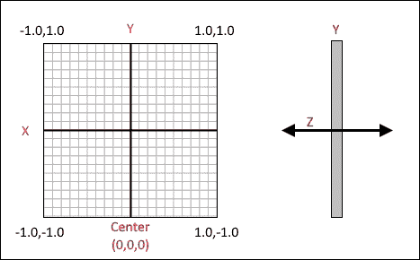
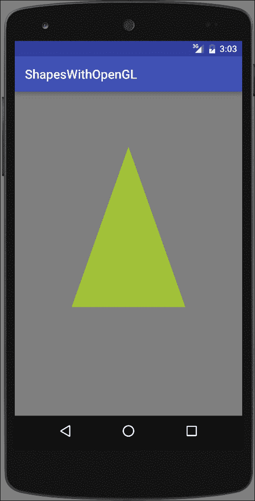
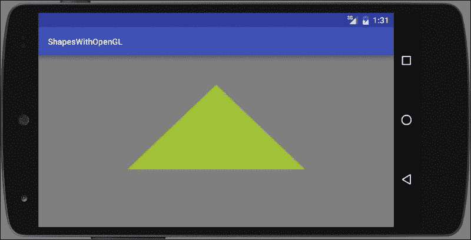
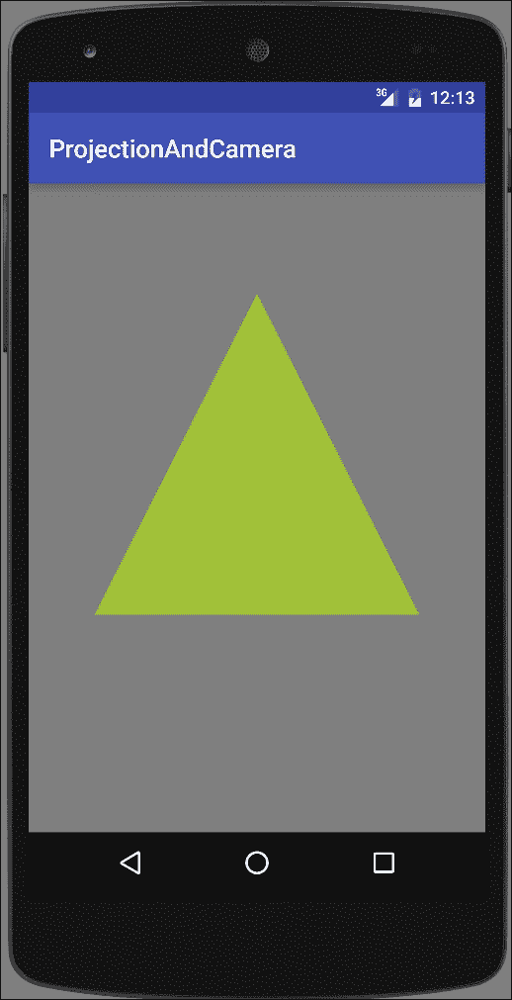
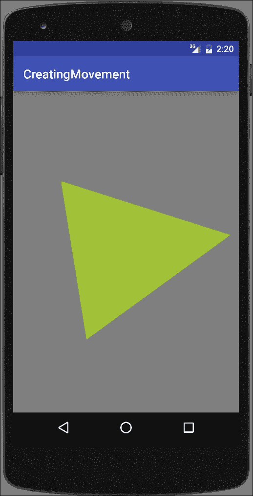
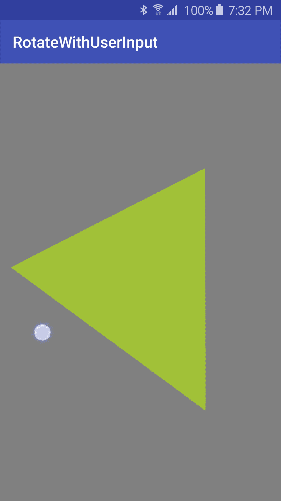

# 第十章：初识 OpenGL ES

本章节，我们将涵盖以下主题：

+   设置 OpenGL ES 环境

+   在 GLSurfaceView 上绘制形状

+   绘制时应用投影和摄像机视图

+   使用旋转移动三角形

+   使用用户输入旋转三角形

# 简介

正如我们在上一章看到的，Android 提供了许多处理图形和动画的工具。尽管画布和可绘制对象是为了自定义绘图设计的，但当你需要高性能图形，尤其是 3D 游戏图形时，Android 也支持 OpenGL ES。**嵌入式系统开放图形库**（**OpenGL ES**）针对的是嵌入式系统。（嵌入式系统包括游戏机和手机。）

本章旨在作为在 Android 上使用 OpenGL ES 的入门介绍。像往常一样，我们会提供步骤并解释事物是如何工作的，但不会深入探讨 OpenGL 的数学或技术细节。如果你在其他平台（如 iOS）上已经熟悉 OpenGL ES，那么本章应能让你快速上手。如果你是 OpenGL 的新手，希望这些教程能帮助你决定这是否是一个你想追求的领域。

Android 支持以下版本的 OpenGL：

+   **OpenGL ES 1.0**：Android 1.0

+   **OpenGL ES 2.0**：在 Android 2.2（API 8）中引入

+   **OpenGL ES 3.0**：在 Android 4.3（API 18）中引入

+   **OpenGL ES 3.1**：在 Android 5.0（API 21）中引入

本章节的教程具有入门性质，针对的是 OpenGL ES 2.0 及更高版本。几乎所有的现有设备都支持 OpenGL ES 2.0。与 OpenGL ES 2.0 及更低版本不同，OpenGL 3.0 及更高版本需要硬件制造商提供驱动程序实现。这意味着，即使你的应用程序运行在 Android 5.0 上，OpenGL 3.0 及更高版本可能也无法使用。因此，在运行时检查可用的 OpenGL 版本是一个好的编程实践。另外，如果你的应用程序需要 3.0 及更高版本的功能，你可以在 Android 清单中添加一个`<uses-feature/>`元素。（我们将在接下来的第一个教程中讨论这个问题。）

与本书的其他章节不同，本章更像是一个教程，每个教程都建立在从前一个教程中学到的知识上。《准备就绪》部分将每个教程的前提条件讲清楚。

# 建立 OpenGL ES 环境

我们第一个教程将从展示如何设置一个活动以使用 OpenGL `GLSurfaceView`的步骤开始。与画布类似，`GLSurfaceView`是你执行 OpenGL 绘图的地方。由于这是起点，其他教程在需要创建`GLSurfaceView`时会将这个教程作为基本步骤引用。

## 准备就绪

在 Android Studio 中创建一个新项目，并将其命名为：`SetupOpenGL`。使用默认的**手机 & 平板**选项，并在提示**活动类型**时选择**空活动**。

## 如何操作...

我们将从在 Android Manifest 中指明应用程序对 OpenGL 的使用开始，然后将 OpenGL 类添加到活动中。以下是步骤：

1.  打开 Android Manifest 并添加以下 XML：

    ```kt
    <uses-feature android:glEsVersion="0x00020000" android:required="true" />
    ```

1.  打开`MainActivity.java`并添加以下全局变量：

    ```kt
    private GLSurfaceView mGLSurfaceView;
    ```

1.  向`MainActivity`类添加以下内部类：

    ```kt
    class CustomGLSurfaceView extends GLSurfaceView {

        private final GLRenderer mGLRenderer;

        public CustomGLSurfaceView(Context context){
            super(context);
    		setEGLContextClientVersion(2);
            mGLRenderer = new GLRenderer();
            setRenderer(mGLRenderer);
        }
    }
    ```

1.  向`MainActivity`类添加另一个内部类：

    ```kt
    class GLRenderer implements GLSurfaceView.Renderer {
        public void onSurfaceCreated(GL10 unused, EGLConfig config) {
            GLES20.glClearColor(0.5f, 0.5f, 0.5f, 1.0f);
        }
        public void onDrawFrame(GL10 unused) {
    	GLES20.glClear(GLES20.GL_COLOR_BUFFER_BIT);
        }
        public void onSurfaceChanged(GL10 unused, int width, int height) {
            GLES20.glViewport(0, 0, width, height);}
    }
    ```

1.  在现有的`onCreate()`方法中添加以下代码：

    ```kt
    mGLSurfaceView = new CustomGLSurfaceView(this);
    setContentView(mGLSurfaceView);
    ```

1.  你现在可以在设备或模拟器上运行这个应用程序了。

## 工作原理...

如果你运行了前面的应用程序，你会看到活动创建并且背景设置为灰色。由于这些是设置 OpenGL 的基本步骤，你将在这个章节的其他食谱中重用这段代码。以下是详细解释的过程：

### 在 Android Manifest 中声明 OpenGL

我们首先在 Android Manifest 中通过这行代码声明我们要求使用 OpenGL ES 版本 2.0：

```kt
<uses-feature android:glEsVersion="0x00020000" android:required="true" />
```

如果我们使用的是版本 3.0，我们会使用这个：

```kt
<uses-feature android:glEsVersion="0x00030000" android:required="true" />
```

对于版本 3.1，使用这个：

```kt
<uses-feature android:glEsVersion="0x00030001" android:required="true" />
```

### 扩展 GLSurfaceView 类

通过扩展`GLSurfaceView`创建一个自定义的 OpenGL `SurfaceView`类，就像这段代码中做的那样：

```kt
class CustomGLSurfaceView extends GLSurfaceView {

    private final GLRenderer mGLRenderer;

    public CustomGLSurfaceView(Context context){
        super(context);
        setEGLContextClientVersion(2);
        mGLRenderer = new GLRenderer();
        setRenderer(mGLRenderer);
    }
}
```

在这里，我们实例化一个 OpenGL 渲染类，并通过`setRenderer()`方法将其传递给`GLSurfaceView`类。OpenGL `SurfaceView`为我们的 OpenGL 绘制提供了一个表面，类似于`Canvas`和`SurfaceView`对象。实际的绘制在`Renderer`中完成，我们接下来会创建它：

### 创建一个 OpenGL 渲染类

最后一步是创建`GLSurfaceView.Renderer`类并实现以下三个回调：

+   `onSurfaceCreated()`

+   `onDrawFrame()`

+   `onSurfaceChanged()`

以下是代码：

```kt
class GLRenderer implements GLSurfaceView.Renderer {
    public void onSurfaceCreated(GL10 unused, EGLConfig config) {
        GLES20.glClearColor(0.5f, 0.5f, 0.5f, 1.0f);
    }
    public void onDrawFrame(GL10 unused) {
        GLES20.glClear(GLES20.GL_COLOR_BUFFER_BIT);
    }
    public void onSurfaceChanged(GL10 unused, int width, int height) {
        GLES20.glViewport(0, 0, width, height);
    }
}
```

目前，我们用这个类所做的就是设置回调并使用`glClearColor()`（在这种情况下是灰色）清除屏幕。

## 还有更多...

设置好 OpenGL 环境后，我们将继续下一个食谱，在那里我们将实际在视图中进行绘制。

# 在 GLSurfaceView 上绘制形状

上一个食谱设置了使用 OpenGL 的活动。这个食谱将继续展示如何在`OpenGLSurfaceView`上进行绘制。

首先，我们需要定义形状。使用 OpenGL 时，要意识到形状顶点的定义顺序非常重要，因为它们决定了形状的前面（面）和后面。通常（也是默认行为）是按逆时针定义顶点。（尽管这种行为可以改变，但这需要额外的代码，并不是标准做法。）

了解 OpenGL 屏幕坐标系统同样重要，因为它与 Android 画布的坐标系统不同。默认的坐标系统将(`0,0,0`)定义为屏幕中心。四个边缘点的坐标如下：

+   **左上角**：(-1.0, 1.0, 0)

+   **右上角**：(1.0, 1.0, 0)

+   **左下角**：(-1.0, -1.0, 0)

+   **右下角**：(1.0, -1.0, 0)

*z*轴直接从屏幕前或屏幕后出来。

下面是一个展示*x*、*y*和*z*轴的图示：



我们将创建一个`Triangle`类，因为它是基本形状。在 OpenGL 中，你通常会使用一系列三角形来创建对象。要使用 OpenGL 绘制形状，我们需要定义以下内容：

+   **顶点着色器**：这是为了绘制形状

+   **片元着色器**：这是为了给形状上色

+   **程序**：这是前面着色器的 OpenGL ES 对象

着色器使用**OpenGL 着色语言**（**GLSL**）定义，然后编译并添加到 OpenGL 程序对象中。

这有两张屏幕截图，展示了三角形在纵向和横向的显示效果：



## 准备工作

在 Android Studio 中创建一个新项目，并将其命名为：`ShapesWithOpenGL`。使用默认的**手机 & 平板**选项，并在提示**活动类型**时选择**空活动**。

本食谱使用了前一个食谱*设置 OpenGL 环境*中创建的 OpenGL 环境。如果你还没有完成那些步骤，请参考前一个食谱。

## 如何操作...

如前所述，我们将使用前一个食谱中创建的 OpenGL 环境。以下步骤将指导你创建一个三角形形状的类并在 GLSurfaceView 上绘制它：

1.  创建一个名为`Triangle`的新 Java 类。

1.  向`Triangle`类中添加以下全局声明：

    ```kt
    private final String vertexShaderCode ="attribute vec4 vPosition;" +"void main() {" +"  gl_Position = vPosition;" +"}";

    private final String fragmentShaderCode ="precision mediump float;" +"uniform vec4 vColor;" +"void main() {" +"  gl_FragColor = vColor;" +"}";

    final int COORDS_PER_VERTEX = 3;
    float triangleCoords[] = {
            0.0f,  0.66f, 0.0f,
            -0.5f, -0.33f, 0.0f,
            0.5f, -0.33f, 0.0f
    };

    float color[] = { 0.63f, 0.76f, 0.22f, 1.0f };

    private final int mProgram;
    private FloatBuffer vertexBuffer;
    private int mPositionHandle;
    private int mColorHandle;
    private final int vertexCount = triangleCoords.length / COORDS_PER_VERTEX;
    private final int vertexStride = COORDS_PER_VERTEX * 4;
    ```

1.  向`Triangle`类中添加以下`loadShader()`方法：

    ```kt
    public int loadShader(int type, String shaderCode){
        int shader = GLES20.glCreateShader(type);
        GLES20.glShaderSource(shader, shaderCode);
        GLES20.glCompileShader(shader);
        return shader;
    }
    ```

1.  添加如下所示的`Triangle`构造函数：

    ```kt
    public Triangle() {
        int vertexShader = loadShader(GLES20.GL_VERTEX_SHADER,vertexShaderCode);
        int fragmentShader = loadShader(GLES20.GL_FRAGMENT_SHADER,fragmentShaderCode);
        mProgram = GLES20.glCreateProgram();
        GLES20.glAttachShader(mProgram, vertexShader);
        GLES20.glAttachShader(mProgram, fragmentShader);
        GLES20.glLinkProgram(mProgram);

        ByteBuffer bb = ByteBuffer.allocateDirect(triangleCoords.length * 4);
        bb.order(ByteOrder.nativeOrder());

        vertexBuffer = bb.asFloatBuffer();
        vertexBuffer.put(triangleCoords);
        vertexBuffer.position(0);
    }
    ```

1.  添加如下`draw()`方法：

    ```kt
    public void draw() {
        GLES20.glUseProgram(mProgram);
        mPositionHandle = GLES20.glGetAttribLocation(mProgram, "vPosition");
        GLES20.glEnableVertexAttribArray(mPositionHandle);
        GLES20.glVertexAttribPointer(mPositionHandle, COORDS_PER_VERTEX,GLES20.GL_FLOAT, false,vertexStride, vertexBuffer);
        mColorHandle = GLES20.glGetUniformLocation(mProgram, "vColor");
        GLES20.glUniform4fv(mColorHandle, 1, color, 0);
        GLES20.glDrawArrays(GLES20.GL_TRIANGLES, 0, vertexCount);
        GLES20.glDisableVertexAttribArray(mPositionHandle);
    }
    ```

1.  现在打开`MainActivity.java`，并向`GLRenderer`类中添加一个`Triangle`变量，如下所示：

    ```kt
    private Triangle mTriangle;
    ```

1.  在`onSurfaceCreated()`回调中初始化`Triangle`变量，如下所示：

    ```kt
    mTriangle = new Triangle();
    ```

1.  在`onDrawFrame()`回调中调用`draw()`方法：

    ```kt
    mTriangle.draw();
    ```

1.  你现在可以在设备或模拟器上运行应用程序了。

## 工作原理...

如引言中所述，要使用 OpenGL 绘图，我们首先必须定义着色器，我们使用以下代码来完成：

```kt
private final String vertexShaderCode ="attribute vec4 vPosition;" +"void main() {" +"  gl_Position = vPosition;" +"}";

private final String fragmentShaderCode ="precision mediump float;" +"uniform vec4 vColor;" +"void main() {" +"  gl_FragColor = vColor;" +"}";
```

由于这是未编译的**OpenGL 着色语言**（**OpenGLSL**），下一步是编译并将其附加到我们的 OpenGL 对象上，我们使用以下两个 OpenGL ES 方法来完成：

+   `glAttachShader()`

+   `glLinkProgram()`

设置着色器后，我们创建`ByteBuffer`来存储三角形顶点，这些顶点在`triangleCoords`中定义。`draw()`方法是实际使用 GLES20 库调用进行绘制的位置，它从`onDrawFrame()`回调中被调用。

## 还有更多...

你可能已经从引言中的屏幕截图注意到，纵向和横向的三角形看起来是相同的。从代码中可以看出，在绘制时我们没有区分方向。我们将在下一个食谱中解释为什么会这样，并展示如何纠正这个问题。

## 另请参阅

有关 OpenGL 着色语言的更多信息，请参考以下链接：

[`www.opengl.org/documentation/glsl/`](https://www.opengl.org/documentation/glsl/)

# 在绘制时应用投影和摄像机视角

正如在前一个食谱中我们所看到的，当我们把形状绘制到屏幕上时，形状会被屏幕方向扭曲。之所以会发生这种情况，是因为 OpenGL 默认假设屏幕是完美正方形。我们之前提到过，默认的屏幕坐标右上角是(1,1,0)，左下角是(-1,-1,0)。

由于大多数设备屏幕都不是完美正方形，我们需要将显示坐标映射到与我们的物理设备相匹配。在 OpenGL 中，我们通过*投影*来实现这一点。这个食谱将展示如何使用投影将 GLSurfaceView 坐标与设备坐标相匹配。除了投影，我们还将展示如何设置摄像机视角。以下是显示最终结果的屏幕截图：



## 准备工作

在 Android Studio 中创建一个新项目，并将其命名为：`ProjectionAndCamera`。使用默认的**手机 & 平板**选项，在选择**活动类型**时选择**空活动**。

这个食谱基于之前的食谱*在 GLSurfaceView 上绘制形状*。如果你还没有输入之前的食谱，请在开始这些步骤之前完成它。

## 如何操作...

如前所述，这个食谱将基于前一个食谱，所以在开始之前请完成那些步骤。我们将修改之前的代码，在绘图计算中添加投影和摄像机视角。以下是步骤：

1.  打开`Triangle`类，并在现有声明中添加以下全局声明：

    ```kt
    private int mMVPMatrixHandle;
    ```

1.  在`vertexShaderCode`中添加一个矩阵变量，并在位置计算中使用它。以下是最终结果：

    ```kt
    private final String vertexShaderCode =
        "attribute vec4 vPosition;" +
        "uniform mat4 uMVPMatrix;" +
        "void main() {" +
        "  gl_Position = uMVPMatrix * vPosition;" +
        "}";
    ```

1.  改变`draw()`方法，按以下方式传入一个矩阵参数：

    ```kt
    public void draw(float[] mvpMatrix) {
    ```

1.  为了使用变换矩阵，在`draw()`方法中，在`GLES20.glDrawArrays()`方法之前添加以下代码：

    ```kt
    mMVPMatrixHandle = GLES20.glGetUniformLocation(mProgram, "uMVPMatrix");
    GLES20.glUniformMatrix4fv(mMVPMatrixHandle, 1, false, mvpMatrix, 0);
    ```

1.  打开`MainActivity.java`文件，在`GLRenderer`类中添加以下类变量：

    ```kt
    private final float[] mMVPMatrix = new float[16];
    private final float[] mProjectionMatrix = new float[16];
    private final float[] mViewMatrix = new float[16];
    ```

1.  修改`onSurfaceChanged()`回调，按照以下方式计算位置矩阵：

    ```kt
    public void onSurfaceChanged(GL10 unused, int width, int height) {
        GLES20.glViewport(0, 0, width, height);
        float ratio = (float) width / height;
        Matrix.frustumM(mProjectionMatrix, 0, -ratio, ratio, -1, 1, 3, 7);
    }
    ```

1.  修改`onDrawFrame()`回调，按照以下方式计算摄像机视角：

    ```kt
    public void onDrawFrame(GL10 unused) {
        Matrix.setLookAtM(mViewMatrix, 0, 0, 0, -3, 0f, 0f, 0f, 0f, 1.0f, 0.0f);
        Matrix.multiplyMM(mMVPMatrix, 0, mProjectionMatrix, 0, mViewMatrix, 0);
        GLES20.glClear(GLES20.GL_COLOR_BUFFER_BIT);
        mTriangle.draw(mMVPMatrix);
    }
    ```

1.  你现在可以在设备或模拟器上运行应用程序了。

## 工作原理...

首先，我们修改`vertexShaderCode`以包含一个矩阵变量。我们在`onSurfaceChanged()`回调中使用传入的宽度和高度参数来计算矩阵。我们将变换矩阵传递给`draw()`方法，在计算绘图位置时使用它。

在我们调用`draw()`方法之前，我们计算摄像机视角。这两行代码计算摄像机视角：

```kt
Matrix.setLookAtM(mViewMatrix, 0, 0, 0, -3, 0f, 0f, 0f, 0f, 1.0f, 0.0f);
Matrix.multiplyMM(mMVPMatrix, 0, mProjectionMatrix, 0, mViewMatrix, 0);
```

如果没有这段代码，实际上不会绘制出三角形，因为摄像机视角无法“看到”我们的顶点。（这回到了我们之前讨论的顶点顺序如何决定图像的前后。）

现在运行程序，你会看到在*引言*中展示的输出。注意，即使屏幕旋转，我们现在也有一个均匀的三角形。

## 还有更多...

在下一个教程中，我们将通过旋转三角形来展示 OpenGL 的强大功能。

# 通过旋转移动三角形

到目前为止，我们用 OpenGL 展示的内容可能使用传统的画布或可绘制对象更容易实现。这个教程将通过旋转三角形来展示 OpenGL 的一些强大功能。并不是说我们不能用其他绘图方法创建运动，但是使用 OpenGL 可以轻松实现这一点！

这个教程将演示如何旋转三角形，如下面的截图所示：



## 准备工作

在 Android Studio 中创建一个新项目，并将其命名为：`CreatingMovement`。在选择**活动类型**时，使用默认的**手机 & 平板**选项，并选择**空活动**。

本教程基于之前的教程*在绘制时应用投影和相机视图*。如果你还没有输入之前的教程，请在继续之前完成。

## 如何操作...

由于我们是从上一个教程继续，所以需要做的工作非常少。打开 `MainActivity.java` 并按照以下步骤操作：

1.  向 `GLRendered` 类中添加一个矩阵：

    ```kt
    private float[] mRotationMatrix = new float[16];
    ```

1.  在 `onDrawFrame()` 回调中，用以下代码替换现有的 `mTriangle.draw(mMVPMatrix);` 语句：

    ```kt
    float[] tempMatrix = new float[16];
    long time = SystemClock.uptimeMillis() % 4000L;
    float angle = 0.090f * ((int) time);
    Matrix.setRotateM(mRotationMatrix, 0, angle, 0, 0, -1.0f);
    Matrix.multiplyMM(tempMatrix, 0, mMVPMatrix, 0, mRotationMatrix, 0);
    mTriangle.draw(tempMatrix);
    ```

1.  你已经准备好在设备或模拟器上运行应用程序了。

## 工作原理...

我们使用 `Matrix.setRotateM()` 方法来根据我们传入的角度计算新的旋转矩阵。在这个例子中，我们使用系统运行时间来计算一个角度。我们可以使用任何我们想要的方法来推导一个角度，比如传感器读数或触摸事件。

## 还有更多...

使用系统时钟提供了创建连续运动的额外好处，这对于演示目的来说肯定看起来更好。下一个教程将展示如何使用用户输入来导出一个旋转三角形的角。

### 渲染模式

OpenGL 提供了一个 `setRenderMode()` 选项，只有在视图变脏时才绘制。通过在 `setRenderer()` 调用下面的 `CustomGLSurfaceView()` 构造函数中添加以下代码，可以启用此功能：

```kt
setRenderMode(GLSurfaceView.RENDERMODE_WHEN_DIRTY);
```

这将导致显示更新一次，然后等待我们通过 `requestRender()` 请求更新。

# 使用用户输入旋转三角形

上一个示例演示了基于系统时钟旋转三角形。这创建了一个根据我们使用的渲染模式连续旋转的三角形。但是，如果你想要响应用户的输入呢？

在这个教程中，我们将通过覆盖 `GLSurfaceView` 的 `onTouchEvent()` 回调来展示如何响应用户输入。我们将仍然使用 `Matrix.setRotateM()` 方法来旋转三角形，但不是从系统时间导出角度，而是根据触摸位置计算角度。

这是一张在物理设备上运行此食谱的截图（为了突出触摸，启用了**显示触摸**的开发者选项）：



## 准备就绪

在 Android Studio 中创建一个新项目，并将其命名为`RotateWithUserInput`。使用默认的**手机 & 平板**选项，并在提示**活动类型**时选择**空活动**。

本食谱展示了与上一个食谱不同的方法，因此将基于*绘制时应用投影和摄像机视图*（与上一个食谱相同的起点）。

## 如何操作...

如前所述，我们将继续从*绘制时应用投影和摄像机视图*的食谱开始，而不是从上一个食谱。打开`MainActivity.java`并按照以下步骤操作：

1.  在`MainActivity`类中添加以下全局变量：

    ```kt
    private float mCenterX=0;
    private float mCenterY=0;
    ```

1.  在`GLRendered`类中添加以下代码：

    ```kt
    private float[] mRotationMatrix = new float[16];
    public volatile float mAngle;
    public void setAngle(float angle) {
        mAngle = angle;
    }

    ```

1.  在同一类中，通过替换现有的`mTriangle.draw(mMVPMatrix);`语句，修改`onDrawFrame()`方法，使用以下代码：

    ```kt
    float[] tempMatrix = new float[16];
    Matrix.setRotateM(mRotationMatrix, 0, mAngle, 0, 0, -1.0f);
    Matrix.multiplyMM(tempMatrix, 0, mMVPMatrix, 0, mRotationMatrix, 0);
    mTriangle.draw(tempMatrix);
    ```

1.  在`onSurfaceChanged()`回调中添加以下代码：

    ```kt
    mCenterX=width/2;
    mCenterY=height/2;
    ```

1.  在`CustomGLSurfaceView`构造函数中添加以下代码，位于`setRenderer()`下方：

    ```kt
    setRenderMode(GLSurfaceView.RENDERMODE_WHEN_DIRTY);
    ```

1.  在`CustomGLSurfaceView`类中添加以下`onTouchEvent()`：

    ```kt
    @Override
    public boolean onTouchEvent(MotionEvent e) {
      float x = e.getX();
      float y = e.getY();
      switch (e.getAction()) {
          case MotionEvent.ACTION_MOVE:
              double angleRadians = Math.atan2(y-mCenterY,x-mCenterX);
              mGLRenderer.setAngle((float)Math.toDegrees(-angleRadians));
              requestRender();
      }
      return true;
    }
    ```

1.  你已经准备好在设备或模拟器上运行应用程序了。

## 它是如何工作的...

本示例与上一个食谱最明显的区别在于我们如何导出传递给`Matrix.setRotateM()`调用的角度。我们还通过使用`setRenderMode()`更改了`GLSurfaceView`的渲染模式，仅在请求时绘制。在`onTouchEvent()`回调中计算出新角度后，我们使用`requestRender()`发出请求。

我们还证明了派生我们自己的`GLSurfaceView`类的重要性。如果没有我们的`CustomGLSurfaceView`类，我们将无法重写`onTouchEvent`回调，也无法重写来自`GLSurfaceView`的其他任何回调。

## 还有更多...

这结束了 OpenGL ES 的食谱，但我们只是触及了 OpenGL 的强大功能。如果你认真想要学习 OpenGL，请查看下一节中的链接，并阅读关于 OpenGL 的众多书籍之一。

检查可用的众多框架之一，例如 Unreal Engine，也是值得的：

### 提示

Unreal Engine 4 是由游戏开发者为游戏开发者制作的一套完整的游戏开发工具。

[`www.unrealengine.com/what-is-unreal-engine-4`](https://www.unrealengine.com/what-is-unreal-engine-4)

## 另请参阅

+   **OpenGL**：高性能图形的行业标准

    [`www.opengl.org/`](https://www.opengl.org/)

+   **OpenGL ES**：嵌入式加速 3D 图形的标准

    [`www.khronos.org/opengles/`](https://www.khronos.org/opengles/)

+   **Unreal Engine**：Android 快速入门

    [`docs.unrealengine.com/latest/INT/Platforms/Android/GettingStarted/index.html`](https://docs.unrealengine.com/latest/INT/Platforms/Android/GettingStarted/index.html)
