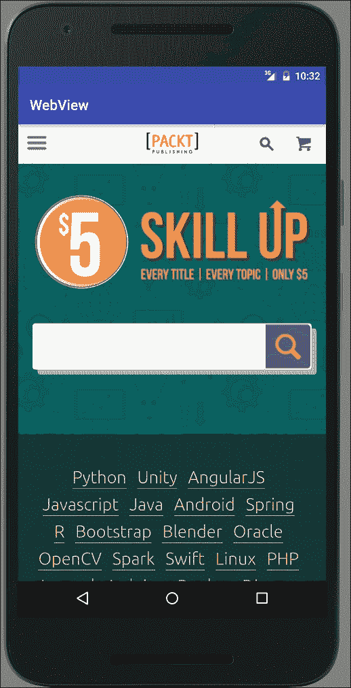
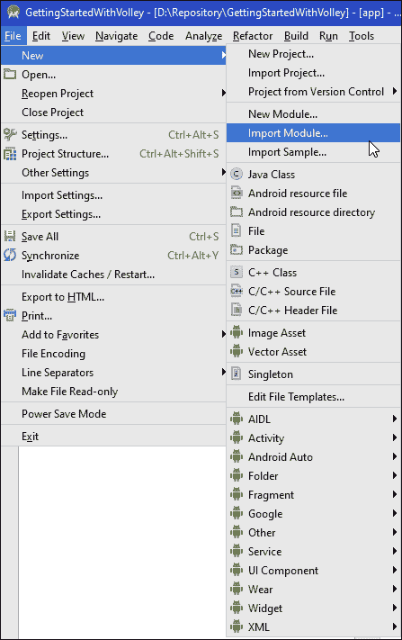
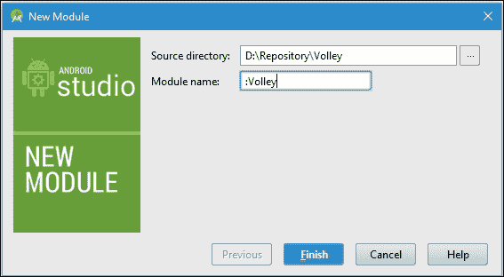
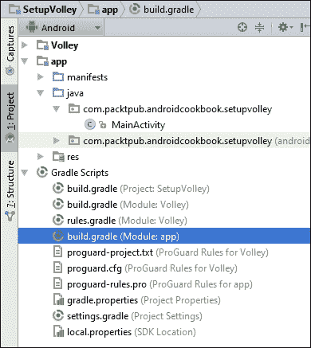

# 第十二章：电信、网络与互联网

本章将涵盖以下主题：

+   如何拨打电话

+   监控电话通话事件

+   如何发送短信（文本消息）

+   接收短信

+   在你的应用中显示网页

+   检查在线状态和连接类型

+   Volley 网络请求入门

+   取消 Volley 请求

+   使用 Volley 请求 JSON 响应

+   使用 Volley 请求图像

+   使用 Volley 的 NetworkImageView 和 ImageLoader

# 引言

我们将通过《*如何拨打电话*》一节开始本章，了解电话功能。探索了如何拨打电话之后，我们将通过《*监控电话通话事件*》了解如何监控电话通话。然后，我们将通过《*如何发送短信*》转到短信通讯，接着通过《*接收短信*》介绍接收短信。

我们将探索`WebView`以向应用添加浏览器功能。在基本层面上，`WebView`是一个基本的 HTML 查看器。我们将展示如何扩展`WebViewClient`类并通过`WebSettings`修改设置以创建完整的浏览器功能，包括 JavaScript 和缩放功能。

本章剩余部分将介绍 Volley，这是通过 AOSP 提供的一个新库。《*Volley 网络请求入门*》一节将提供一些关于 Android 上可用的在线库的背景信息，并讨论为何创建 Volley。它还提供了将 Volley 添加到你的 Android Studio 项目的完整演练。

# 如何拨打电话

如我们在之前的食谱中所见，只需使用 Intent 即可调用默认应用。为了拨打电话，创建 Intent 时使用`Intent.ACTION_DIAL`。你可以使用`setData()`方法包含一个电话号码。以下是调用拨号应用并指定电话号码的示例代码：

```kt
Intent intent = new Intent(Intent.ACTION_DIAL);
intent.setData(Uri.parse("tel:" + number));
startActivity(intent);
```

由于你的应用不执行拨号操作，且用户必须按下**拨号**按钮，因此你的应用无需任何拨号权限。以下步骤将向你展示如何直接拨打电话，绕过`Dial`活动。（为此，你需要添加一个权限。）

## 准备就绪

在 Android Studio 中创建一个新项目，将其命名为`DialPhone`。选择默认的**电话 & 平板**选项，并在提示**活动类型**时选择**空活动**。

## 如何操作...

首先，我们需要添加适当的权限来拨打电话。然后，我们需要添加一个按钮来调用我们的`Dial`方法。从打开 Android Manifest 开始，按照以下步骤操作：

1.  添加以下权限：

    ```kt
    <uses-permission android:name="android.permission.CALL_PHONE"></uses-permission>
    ```

1.  打开`activity_main.xml`，用以下按钮替换现有的`TextView`：

    ```kt
    <Button
        android:id="@+id/button"
        android:layout_width="wrap_content"
        android:layout_height="wrap_content"
        android:text="Dial"
        android:layout_centerInParent="true"
        android:onClick="dialPhone"/>
    ```

1.  添加此方法，检查你的应用是否被授予了`CALL_PHONE`权限：

    ```kt
    private boolean checkPermission(String permission) {
        int permissionCheck = ContextCompat.checkSelfPermission(
                this, permission);
        return (permissionCheck == PackageManager.PERMISSION_GRANTED);
    }
    ```

1.  添加拨号的代码：

    ```kt
    public void dialPhone(View view){
        if (checkPermission("android.permission.CALL_PHONE")) {
            Intent intent = new Intent(Intent.ACTION_CALL);
            intent.setData(Uri.parse("tel:0123456789"));
            startActivity(intent);
        }
    }
    ```

1.  在你的设备上运行此操作之前，请确保将`0123456789`替换为有效的电话号码。

## 工作原理...

正如我们在引言中的代码所看到的，当调用默认拨号应用时，我们不需要任何权限。但如果我们想直接拨号，我们需要添加`CALL_PHONE`权限。从 Android 6.0 Marshmallow（API 23）开始，权限不再在安装时授予，因此，在尝试拨号之前，我们会检查应用是否拥有权限。

## 参见

+   想获取更多信息，请参阅第十四章中的*新的运行时权限模型*食谱，*准备应用上架 Play 商店*。

# 监控电话呼叫事件

在上一个食谱中，我们演示了如何拨打电话，既通过意图调用默认应用程序，也可以直接拨号，无需 UI。

如果你希望在通话结束时得到通知，这就有点复杂了，因为你需要监听电话事件并跟踪电话状态。在本食谱中，我们将演示如何创建一个`PhoneStateListener`来读取电话状态事件。

## 准备就绪

在 Android Studio 中创建一个新项目，命名为`PhoneStateListener`。选择默认的**Phone & Tablet**选项，并在提示**Activity Type**时选择**Empty Activity**。

尽管这不是必须的，但你可以使用上一个食谱来发起电话呼叫以查看事件。否则，使用默认拨号盘和/或观察来电事件。（下载文件中提供的示例代码包括上一个食谱，以便更容易查看事件。）

## 如何操作...

我们只需要在布局中添加一个`TextView`来显示事件信息。无论你是接着上一个食谱继续操作，还是开始一个新食谱，打开`activity_main.xml`文件，并按照以下步骤操作：

1.  按照以下方式添加或修改`TextView`：

    ```kt
    <TextView
        android:id="@+id/textView"
        android:layout_width="wrap_content"
        android:layout_height="wrap_content" />
    ```

1.  向 Android Manifest 中添加以下权限：

    ```kt
    <uses-permission android:name="android.permission.READ_PHONE_STATE">
    </uses-permission>
    ```

1.  打开`MainActivity.java`，并在`MainActivity`类中添加以下`PhoneStateListener`类：

    ```kt
    PhoneStateListener mPhoneStateListener = new PhoneStateListener() {
        @Override
        public void onCallStateChanged(int state, String number) {
            String phoneState = number;
            switch (state) {
                case TelephonyManager.CALL_STATE_IDLE:
                    phoneState += "CALL_STATE_IDLE\n";
                case TelephonyManager.CALL_STATE_RINGING:
                    phoneState += "CALL_STATE_RINGING\n";
                case TelephonyManager.CALL_STATE_OFFHOOK:
                    phoneState += "CALL_STATE_OFFHOOK\n";
            }
            TextView textView = (TextView)findViewById(R.id.textView);
            textView.append(phoneState);
        }
    };
    ```

1.  修改`onCreate()`以设置监听器：

    ```kt
    final TelephonyManager telephonyManager = (TelephonyManager)getSystemService(Context.TELEPHONY_SERVICE);
    telephonyManager.listen(mPhoneStateListener,PhoneStateListener.LISTEN_CALL_STATE);
    ```

1.  在设备上运行应用程序，并发起和/或接收电话以查看事件。

## 工作原理...

为了演示如何使用监听器，我们在`onCreate()`中创建 Telephony 监听器，用这两行代码：

```kt
final TelephonyManager telephonyManager = (TelephonyManager)getSystemService(Context.TELEPHONY_SERVICE);
telephonyManager.listen(mPhoneStateListener,PhoneStateListener.LISTEN_CALL_STATE);
```

当`PhoneState`事件发生时，它会被发送到我们的`PhoneStateListener`类。

## 还有更多...

在这个食谱中，我们监听通话状态事件，用这个常量表示：`LISTEN_CALL_STATE`。其他有趣的选项包括以下内容：

+   `LISTEN_CALL_FORWARDING_INDICATOR`

+   `LISTEN_DATA_CONNECTION_STATE`

+   `LISTEN_SIGNAL_STRENGTHS`

查看以下`PhoneStateListener`链接以获取完整列表。

当我们完成事件监听时，调用`listen()`方法，并传递`LISTEN_NONE`，如下所示：

```kt
telephonyManager.listen(mPhoneStateListener,PhoneStateListener.LISTEN_NONE);
```

## 参见

+   **开发者文档：PhoneStateListener**在[`developer.android.com/reference/android/telephony/PhoneStateListener.html`](https://developer.android.com/reference/android/telephony/PhoneStateListener.html)

# 如何发送短信（文本消息）

由于你可能已经熟悉短信（或文本消息），我们不会花时间解释它们是什么或为什么重要。（如果你不熟悉短信或想了解更多信息，请查看本示例中*另请参阅*部分提供的链接。）本示例将演示如何发送短信。（下一个示例将演示如何接收新消息的通知以及如何读取现有消息。）

## 准备就绪

在 Android Studio 中创建一个新项目，命名为`SendSMS`。选择默认的**Phone & Tablet**选项，并在提示**Activity Type**时选择**Empty Activity**。

## 如何操作...

首先，我们将添加发送短信所需的权限。然后，我们将创建一个带有**Phone Number**和**Message**字段以及**Send**按钮的布局。点击发送按钮时，我们将创建并发送短信。以下是步骤：

1.  打开 Android Manifest 并添加以下权限：

    ```kt
    <uses-permission android:name="android.permission.SEND_SMS"/>
    ```

1.  打开`activity_main.xml`，用以下 XML 替换现有的`TextView`：

    ```kt
    <EditText
        android:id="@+id/editTextNumber"
        android:layout_width="match_parent"
        android:layout_height="wrap_content"
        android:inputType="number"
        android:ems="10"
        android:layout_alignParentTop="true"
        android:layout_centerHorizontal="true"
        android:hint="Number"/>
    <EditText
        android:id="@+id/editTextMsg"
        android:layout_width="match_parent"
        android:layout_height="wrap_content"
        android:layout_below="@+id/editTextNumber"
        android:layout_centerHorizontal="true"
        android:hint="Message"/>
    <Button
        android:id="@+id/buttonSend"
        android:layout_width="wrap_content"
        android:layout_height="wrap_content"
        android:text="Send"
        android:layout_below="@+id/editTextMsg"
        android:layout_centerHorizontal="true"
        android:onClick="send"/>
    ```

1.  打开`MainActivity.java`并添加以下全局变量：

    ```kt
    final int SEND_SMS_PERMISSION_REQUEST_CODE=1;
    Button mButtonSend;
    ```

1.  在现有的`onCreate()`回调中添加以下代码：

    ```kt
    mButtonSend = (Button)findViewById(R.id.buttonSend);
    mButtonSend.setEnabled(false);

    if (checkCallPermission(Manifest.permission.SEND_SMS)) {
        mButtonSend.setEnabled(true);
    } else {
        ActivityCompat.requestPermissions(this,
                new String[]{Manifest.permission.SEND_SMS},
                SEND_SMS_PERMISSION_REQUEST_CODE);
    }
    ```

1.  添加以下方法以检查权限：

    ```kt
    private boolean checkPermission(String permission) {
        int permissionCheck = ContextCompat.checkSelfPermission(this,permission);
        return (permissionCheck == PackageManager.PERMISSION_GRANTED);
    }
    ```

1.  重写`onRequestPermissionsResult()`以处理权限请求响应：

    ```kt
    @Override
    public void onRequestPermissionsResult(int requestCode,String permissions[], int[] grantResults) {
        switch (requestCode) {
            case SEND_SMS_PERMISSION_REQUEST_CODE: {
                if (grantResults.length > 0 && grantResults[0] == PackageManager.PERMISSION_GRANTED) {
                    mButtonSend.setEnabled(true);
                }
                return;
            }
        }
    }
    ```

1.  最后，添加实际发送短信的方法：

    ```kt
    public void send(View view) {
        String phoneNumber = ((EditText)findViewById(R.id.editTextNumber)).getText().toString();
        String msg = ((EditText)findViewById(R.id.editTextMsg)).getText().toString();

        if (phoneNumber==null || phoneNumber.length()==0 || msg==null || msg.length()==0 ) {
            return;
        }

        if (checkPermission(Manifest.permission.SEND_SMS)) {
            SmsManager smsManager = SmsManager.getDefault();
            smsManager.sendTextMessage(phoneNumber, null, msg, null, null);
        } else {
            Toast.makeText(MainActivity.this, "No Permission", Toast.LENGTH_SHORT).show();
        }
    }
    ```

1.  你已经准备好在设备或模拟器上运行应用程序了。（向另一个模拟器发送时，使用模拟器设备号，如 5556。）

## 工作原理...

发送短信的代码只有两行，如下所示：

```kt
SmsManager smsManager = SmsManager.getDefault();
smsManager.sendTextMessage(phoneNumber, null, msg, null, null);
```

`sendTextMessage()`方法负责实际发送操作。本示例的大部分代码是为了设置权限，因为从 Android 6.0 Marshmallow（API 23）开始权限模型发生了变化。

## 还有更多...

尽管发送短信很简单，但我们仍然有更多的选项。

### 多部分消息

虽然根据运营商可能有所不同，但通常每条短信允许的最大字符数是 160。你可以修改前面的代码，检查消息是否超过 160 个字符，如果是，可以调用 SMSManager 的`divideMessage()`方法。该方法返回一个`ArrayList`，你可以将其发送给`sendMultipartTextMessage()`。以下是示例代码：

```kt
ArrayList<String> messages=smsManager.divideMessage(msg);
smsManager.sendMultipartTextMessage(phoneNumber, null, messages, null, null);
```

### 提示

请注意，使用模拟器时，通过`sendMultipartTextMessage()`发送的消息可能无法正常工作，因此请务必在真实设备上进行测试。

### 发送状态通知

如果你希望收到消息状态的通知，有两个可选字段可以使用。以下是**SMSManager**文档中定义的`sendTextMessage()`方法：

```kt
sendTextMessage(String destinationAddress, String scAddress, String text, PendingIntent sentIntent, PendingIntent deliveryIntent)
```

你可以包含一个待定意图，以便在发送状态和/或投递状态时得到通知。收到你的待定意图后，它将包含一个结果代码，如果发送成功，则为 `Activity.RESULT_OK`，或者如 **SMSManager** 文档（在以下*另请参阅*部分提到的链接）中定义的错误代码：

+   `RESULT_ERROR_GENERIC_FAILURE`：一般失败原因

+   `RESULT_ERROR_NO_SERVICE`：由于服务当前不可用而失败

+   `RESULT_ERROR_NULL_PDU`：由于没有提供 PDU 而失败

+   `RESULT_ERROR_RADIO_OFF`：由于无线电被明确关闭而失败

## 另请参阅

+   维基百科上的短信服务 [`en.wikipedia.org/wiki/Short_Message_Service`](https://en.wikipedia.org/wiki/Short_Message_Service)

+   **开发者文档：SMSManager** 在 [`developer.android.com/reference/android/telephony/SmsManager.html`](https://developer.android.com/reference/android/telephony/SmsManager.html)

# 接收短信消息

本教程将演示如何设置一个广播接收器，以便在接收到新短信时通知你。值得注意的是，你的应用无需运行即可接收短信意图。Android 会启动你的服务来处理短信。

## 准备工作

在 Android Studio 中创建一个新项目，并将其命名为 `ReceiveSMS`。使用默认的 **Phone & Tablet** 选项，并在提示 **Activity Type** 时选择 **Empty Activity**。

## 如何操作...

在本演示中，我们将不使用布局，因为所有工作都将在广播接收器中进行。我们将使用 Toast 来显示传入的短信。打开 Android 清单文件并按照以下步骤操作：

1.  添加以下权限：

    ```kt
    <uses-permission android:name="android.permission.RECEIVE_SMS" />
    ```

1.  向 `<application>` 元素添加以下广播接收器的声明：

    ```kt
    <receiver android:name=".SMSBroadcastReceiver">
        <intent-filter>
            <action android:name="android.provider.Telephony.SMS_RECEIVED">
            </action>
        </intent-filter>
    </receiver>
    ```

1.  打开 `MainActivity.java` 并添加以下方法：

    ```kt
    private boolean checkPermission(String permission) {
        int permissionCheck = ContextCompat.checkSelfPermission(
                this, permission);
        return (permissionCheck == PackageManager.PERMISSION_GRANTED);
    }
    ```

1.  修改现有的 `onCreate()` 回调以检查权限：

    ```kt
    if (!checkPermission(Manifest.permission.RECEIVE_SMS)) {
        ActivityCompat.requestPermissions(this,new String[]{Manifest.permission.RECEIVE_SMS}, 0);
    }
    ```

1.  使用以下代码向项目中添加一个名为 `SMSBroadcastReceiver` 的新 Java 类：

    ```kt
    public class SMSBroadcastReceiver extends BroadcastReceiver {
        final String SMS_RECEIVED = "android.provider.Telephony.SMS_RECEIVED";

        @Override
        public void onReceive(Context context, Intent intent) {
            if (SMS_RECEIVED.equals(intent.getAction())) {
                Bundle bundle = intent.getExtras();
                if (bundle != null) {
                    Object[] pdus = (Object[]) bundle.get("pdus");
                    String format = bundle.getString("format");
                    final SmsMessage[] messages = new SmsMessage[pdus.length];
                    for (int i = 0; i < pdus.length; i++) {
                        if (Build.VERSION.SDK_INT >= Build.VERSION_CODES.M) {
                            messages[i] = SmsMessage.createFromPdu((byte[]) pdus[i], format);
                        } else {
                            messages[i] = SmsMessage.createFromPdu((byte[]) pdus[i]);
                        }
                        Toast.makeText(context, messages[0].getMessageBody(), Toast.LENGTH_SHORT).show();
                    }
                }
            }
        }
    }
    ```

1.  现在你可以在设备或模拟器上运行应用程序了。

## 工作原理...

就像在前一个关于发送短信的教程中一样，我们首先需要检查应用是否有权限。（在 Android 6.0 之前的设备上，清单声明将自动提供权限，但对于棉花糖及以后的版本，我们需要像这里一样提示用户。）

如你所见，广播接收器接收新短信的通知。我们使用此代码在 Android 清单文件中告诉系统我们希望接收新的短信接收广播：

```kt
<receiver android:name=".SMSBroadcastReceiver">
    <intent-filter>
        <action android:name="android.provider.Telephony.SMS_RECEIVED"></action>
    </intent-filter>
</receiver>
```

通知通过标准的 `onRecieve()` 回调传入，因此我们使用此代码检查动作：

```kt
if (SMS_RECEIVED.equals(intent.getAction())) {}
```

这可能是本演示中最复杂的代码行：

```kt
messages[i] = SmsMessage.createFromPdu((byte[]) pdus[i]);
```

基本上，它调用 `SmsMessage` 库从 PDU 创建一个 SMSMessage 对象。（PDU，即协议数据单元，是短信的二进制数据格式。）如果你不熟悉 PDU 格式，你不需要了解。`SmsMessage` 库会为你处理并返回一个 SMSMessage 对象。

### 提示

如果你的应用没有收到短信广播消息，可能是其他应用阻止了你的应用。你可以尝试像这样增加 `intent-filter` 中的优先级值，或者禁用/卸载其他应用：

```kt
<intent-filter android:priority="100">
    <action android:name="android.provider.Telephony.SMS_RECEIVED" />
</intent-filter>
```

## 还有更多...

本指南演示了接收到短信时如何显示短信，但如何读取现有消息呢？

### 阅读现有短信

首先，要读取现有消息，你需要以下权限：

```kt
<uses-permission android:name="android.permission.READ_SMS" />
```

这是一个使用短信内容提供者获取游标的示例：

```kt
Cursor cursor = getContentResolver().query(Uri.parse("content://sms/"), null, null, null, null);
while (cursor.moveToNext()) {
    textView.append("From :" + cursor.getString(1) + " : " + cursor.getString(11)+"\n");
}
```

在撰写本文时，短信内容提供者有超过 30 列。以下是前 12 列，最有用（记住，列计数从零开始）：

0\. `_id`

1\. `thread_id`

2\. `address`

3\. `person`

4\. `date`

5\. `protocol`

6\. `read`

7\. `status`

8\. `type`

9\. `reply_path_present`

10\. `subject`

11\. `body`

请记住，内容提供者不是公共 API 的一部分，可能会在未经通知的情况下更改。

## 另请参阅

+   **开发者文档：SmsManager** 在 [`developer.android.com/reference/android/telephony/SmsManager.html`](https://developer.android.com/reference/android/telephony/SmsManager.html)

+   **PDU (协议数据单元)** 在 [`en.wikipedia.org/wiki/Protocol_data_unit`](https://en.wikipedia.org/wiki/Protocol_data_unit)

+   **开发者文档：Telephony.Sms.Intents** 在 [`developer.android.com/reference/android/provider/Telephony.Sms.Intents.html`](https://developer.android.com/reference/android/provider/Telephony.Sms.Intents.html)

# 在应用中显示网页

当你想要在网页上显示 HTML 内容时，你有两个选择：调用默认浏览器或在你的应用内显示。如果你只想调用默认浏览器，可以使用如下 Intent：

```kt
Uri uri = Uri.parse("https://www.packtpub.com/");
Intent intent = new Intent(Intent.ACTION_VIEW, uri);
startActivity(intent);
```

如果你需要在自己的应用内显示内容，可以使用 `WebView`。本指南将展示如何在你的应用中显示网页，如图所示：



## 准备工作

在 Android Studio 中创建一个新项目，命名为 `WebView`。选择默认的**手机和平板**选项，并在提示**活动类型**时选择**空活动**。

## 如何操作...

我们将通过代码创建 `WebView`，因此不会修改布局。我们将从打开 Android Manifest 开始，并按照以下步骤操作：

1.  添加以下权限：

    ```kt
    <uses-permission android:name="android.permission.INTERNET"/>
    ```

1.  修改现有的 `onCreate()` 以包含以下代码：

    ```kt
    WebView webview = new WebView(this);
    setContentView(webview);
    webview.loadUrl("https://www.packtpub.com/");
    ```

1.  你已经准备好在设备或模拟器上运行应用程序。

## 工作原理...

我们创建一个 `WebView` 作为我们的布局，并使用 `loadUrl()` 加载我们的网页。前面的代码可以工作，但在这一级别上，它非常基础，仅显示第一页。如果你点击任何链接，默认浏览器将处理请求。

## 还有更多...

如果你希望拥有完整的网页浏览功能，以便他们点击的任何链接仍在你的 `WebView` 中加载？按照此代码所示创建一个 `WebViewClient`：

```kt
webview.setWebViewClient(new WebViewClient());
```

### 控制页面导航

如果你想要更多控制页面导航，例如只允许在你自己的网站内链接，你可以创建自己的 `WebViewClient` 类并覆盖 `shouldOverrideUrlLoading()` 回调，如下所示：

```kt
private class mWebViewClient extends WebViewClient {
    @Override
    public boolean shouldOverrideUrlLoading(WebView view, String url) {
        if (Uri.parse(url).getHost().equals("www.packtpub.com")) {
            return false;  //Don't override since it's the same //host
        } else {
            return true; //Stop the navigation since it's a //different site
        }
    }
}
```

### 如何启用 JavaScript

我们可以通过 `WebView` 的 `WebSettings` 进行许多其他自定义设置。如果你想启用 JavaScript，获取 `WebView` 的 `WebSettings` 并调用 `setJavaScriptEnabled()`，如下所示：

```kt
WebSettings webSettings = webview.getSettings();
webSettings.setJavaScriptEnabled(true);
```

### 启用内置缩放

另一个 `webSetting` 选项是 `setBuiltInZoomControls()`。从前面的代码继续，只需添加：

```kt
webSettings.setBuiltInZoomControls(true);
```

在下一节中查看 `webSetting` 链接，以获取大量附加选项。

## 另请参阅

+   **开发者文档：WebView** 在 [`developer.android.com/reference/android/webkit/WebView.html`](https://developer.android.com/reference/android/webkit/WebView.html)

+   **开发者文档：WebSettings** 在 [`developer.android.com/reference/android/webkit/WebSettings.html`](https://developer.android.com/reference/android/webkit/WebSettings.html)

+   **开发者文档：android.webkit** 在 [`developer.android.com/reference/android/webkit/package-summary.html`](https://developer.android.com/reference/android/webkit/package-summary.html)

# 检查在线状态和连接类型

这是一个简单的食谱，但非常常见，可能会包含在你构建的每个互联网应用程序中：检查在线状态。在检查在线状态时，我们还可以检查连接类型：WIFI 或 MOBILE。

## 准备就绪

在 Android Studio 中创建一个新项目，并将其命名为 `isOnline`。在选择 **Activity Type** 时，使用默认的 **Phone & Tablet** 选项，并选择 **Empty Activity**。

## 如何操作...

首先，我们需要添加必要的权限来访问网络。然后，我们将创建一个带有 `Button` 和 `TextView` 的简单布局。要开始，请打开 Android Manifest 文件，并按照以下步骤操作：

1.  添加以下权限：

    ```kt
    <uses-permission android:name="android.permission.INTERNET"/>
    <uses-permission android:name="android.permission.ACCESS_NETWORK_STATE" />
    ```

1.  打开 `activity_main.xml` 文件，并用以下视图替换现有的 `TextView`：

    ```kt
    <TextView
        android:id="@+id/textView"
        android:layout_width="wrap_content"
        android:layout_height="wrap_content"
        android:text="" />
    <Button
        android:layout_width="wrap_content"
        android:layout_height="wrap_content"
        android:text="Check"
        android:layout_centerInParent="true"
        android:onClick="checkStatus"/>
    ```

1.  添加以下方法来报告连接状态：

    ```kt
    private boolean isOnline() {
        ConnectivityManager connectivityManager = (ConnectivityManager)getSystemService(Context.CONNECTIVITY_SERVICE);
        NetworkInfo networkInfo = connectivityManager.getActiveNetworkInfo();
        return (networkInfo != null && networkInfo.isConnected());
    }
    ```

1.  添加以下方法来处理按钮点击：

    ```kt
    public void checkStatus(View view) {
        TextView textView = (TextView)findViewById(R.id.textView);
        if (isOnline()) {
            ConnectivityManager connectivityManager = (ConnectivityManager)getSystemService(Context.CONNECTIVITY_SERVICE);
            NetworkInfo networkInfo = connectivityManager.getActiveNetworkInfo();
            textView.setText(networkInfo.getTypeName());
        } else {
            textView.setText("Offline");
        }
    }
    ```

1.  你现在可以在设备或模拟器上运行应用程序了。

## 工作原理...

我们创建了 `isOnline()` 方法，以方便重用此代码。

为了检查状态，我们获取 `ConnectivityManager` 的实例来读取 `NetworkInfo` 的状态。如果它报告我们已连接，我们可以通过调用 `getType()` 来获取活动网络的名字，这将返回以下常量之一：

+   `TYPE_MOBILE`

+   `TYPE_WIFI`

+   `TYPE_WIMAX`

+   `TYPE_ETHERNET`

+   `TYPE_BLUETOOTH`

另外，请参阅后面的`ConnectivityManager`链接，了解其他常量。为了显示目的，我们调用`getTypeName()`。我们也可以调用`getType()`来获取数值常量。

## 还有更多...

让我们看看`ConnectivityManager`的一些其他常量。

### 监控网络状态变化

如果你的应用需要响应网络状态的变化，请查看`ConnectivityManager`中的`CONNECTIVITY_ACTION`。你需要创建一个广播接收器，然后注册该事件。以下是如何通过 Android 清单在接收器的意图过滤器中包含动作的示例：

```kt
<receiver android:name="com.vcs.timetrac.VCSBroadcastReceiver">
    <intent-filter>
        <action android:name="android.net.conn.CONNECTIVITY_CHANGE" />
    </intent-filter>
</receiver>
```

使用 Android 清单时要小心，因为它会在每次网络状态变化时通知你的应用，即使你的应用没有被使用。这可能会导致不必要的电池消耗。如果你的应用只需要在用户实际使用你的应用时响应网络变化，请在代码中创建监听器。

## 另请参阅

+   **开发者文档：ConnectivityManager** 在 [`developer.android.com/reference/android/net/ConnectivityManager.html`](https://developer.android.com/reference/android/net/ConnectivityManager.html)

+   **开发者文档：NetworkInfo** 在 [`developer.android.com/reference/android/net/NetworkInfo.html`](https://developer.android.com/reference/android/net/NetworkInfo.html)

# 开始使用 Volley 进行网络请求

Android 提供了多个用于互联网查询的库，包括 Apache 的`HttpClient`和`HttpURLConnection`。在 Android 2.3 Gingerbread（API 9）之前，Apache `HttpClient`是推荐的库。在 Android 2.3 Gingerbread（API 9）中，对`HttpURLConnection`库进行了许多改进，使其成为了推荐的库，至今仍然如此。随着 Android 6.0 的发布，Apache `HttpClient`已完全从 SDK 中移除，`HttpURLConnection`库成为了推荐的替代品。

尽管`HttpURLConnection`库仍然可用并有其用途，但也有其缺点：如果你是初次编写网络请求，它不是最易于使用的库，并且需要编写很多重复的样板代码。幸运的是，来自 Google Play 团队的谷歌开发者*Ficus Kirkpatrick*提供了一个新选择。他发布了一个名为 Volley 的库，该库提供了一个简化的封装器。（默认使用`HttpURLConnection`库，也可以与其他库一起使用。）

### 注意

你可以在这里观看他的 Google I/O 演讲：

[观看此视频](https://www.youtube.com/watch?v=yhv8l9F44qo)

使用 Volley 而不是`HttpURLConnection`的几个原因包括以下：

+   线程池（默认为四个线程）

+   透明磁盘缓存

+   队列优先级设置

还有其他的好处，但这三点就足以让你想要了解 Volley。第四个好处，如果你曾经使用过`HttpURLConnection`，就会很明显，那就是它减少了模板代码。你不需要围绕许多调用编写一堆标准的`try`/`catch`代码，库将在内部处理检查，让你更专注于手头的具体任务。

Volley 内置支持以下请求类型：

+   字符串

+   JSON

+   图像

+   自定义

虽然 Volley 擅长处理多个小型请求调用（例如在`ListView`中滚动时），但不适合大文件下载，因为返回的对象是在内存中解析的。对于大文件下载，请查看`DownloadManager`（请参考食谱末尾的链接）。同样，由于这个原因，它也不适合流式内容；对于流式内容，请参考`HttpURLConnection`。

由于 Volley 目前不在 Android SDK 中，我们需要下载代码并将其添加到我们的项目中。这个食谱将指导你完成将 Volley 添加到你的应用程序项目并发出一个简单请求的步骤。

## 准备就绪

在创建你的新项目之前，使用以下 Git 命令从**Android Open Source Project**（**AOSP**）网站下载 Volley 项目文件：

```kt
git clone https://android.googlesource.com/platform/frameworks/volley

```

如果你不太熟悉 Git，请查看本食谱末尾的 Git（软件）链接，获取更多信息以及帮助你找到适合你平台的 Git 客户端。Git 是一种在许多平台上使用的**版本控制软件**（**VCS**）。(安装后，你还可以在 Android Studio 中集成 Git VCS。)

在 Android Studio 中创建一个新项目，并将其命名为`SetupVolley`。使用默认的**Phone & Tablet**选项，并在提示**Activity Type**时选择**Empty Activity**。

## 如何操作...

在开始以下步骤之前，请确保你已经按照先前的描述下载了 Volley 项目。下面我们将从将 Volley 添加到我们的项目开始，进行一个简单的互联网调用。我们将在布局中使用一个按钮来发起请求，并使用`TextView`来显示结果。以下是步骤：

1.  打开 Android Manifest 并添加以下权限：

    ```kt
    <uses-permission android:name="android.permission.INTERNET"/>
    ```

1.  通过选择**File** | **New** | **Import Module**导入`Volley`模块（请参考以下截图），并按照向导操作。

1.  在**New Module**导入向导的第二页（请参考以下截图），你需要指定 Volley 文件的位置并分配**Module name**。这是下一步我们需要用到的名称：

1.  在`Gradle Scripts`部分，打开`build.gradle (Module: app)`文件。请参考以下截图：

1.  在`dependencies`部分添加/验证以下声明：

    ```kt
    compile project(":Volley")
    ```

    ### 注意

    括号内的值需要与你上一步指定的模块名称相匹配。

1.  在`Gradle Scripts`下，打开`settings.gradle`文件，并按以下内容验证：

    ```kt
    include ':app', ':Volley'
    ```

1.  打开`activity_main.xml`文件，用以下`TextView`和`Button`元素替换现有的`TextView`：

    ```kt
    <TextView
        android:id="@+id/textView"
        android:layout_width="wrap_content"
        android:layout_height="wrap_content"
        android:layout_alignParentTop="true"
        android:layout_alignParentLeft="true"
        android:layout_above="@+id/button" />
    <Button
        android:id="@+id/button"
        android:layout_width="wrap_content"
        android:layout_height="wrap_content"
        android:text="Request"
        android:layout_alignParentBottom="true"
        android:layout_centerHorizontal="true"
        android:onClick="sendRequest"/>
    ```

1.  添加由按钮点击调用的`sendRequest()`方法：

    ```kt
    public void sendRequest(View view) {
        final TextView textView = (TextView)findViewById(R.id.textView);
        RequestQueue queue = Volley.newRequestQueue(this);
        String url ="https://www.packtpub.com/";
        StringRequest stringRequest = new StringRequest(Request.Method.GET, url,new Response.Listener<String>() {
            @Override
            public void onResponse(String response) {
                textView.setText(response.substring(0,500));
            }
        }, new Response.ErrorListener() {
            @Override
            public void onErrorResponse(VolleyError error) {
                textView.setText("onErrorResponse(): "+ error.getMessage());
            }
        });
        queue.add(stringRequest);
    }
    ```

1.  您已经准备好在设备或模拟器上运行应用程序。

## 工作原理...

了解在 Volley 中，网络事务被称为*请求*可能很有帮助。要执行请求，请将其添加到队列中。为此，我们首先创建一个 Volley `RequestQueue`的实例，然后创建一个`StringRequest`并将其添加到队列中。`StringRequest`顾名思义；我们请求的是字符串响应。

对于这个食谱，我们只需调用 Packt Publishing 网站，并将页面作为字符串响应获取。由于这只是为了说明，我们只显示前 500 个字符。

## 还有更多...

现在您已经正确设置了 Volley 并进行了网络请求，这个食谱将是后续 Volley 食谱的基础。

## 另请参阅

+   **Volley**: 在 Google 的 Git 存储库中位于[`android.googlesource.com/platform/frameworks/volley`](https://android.googlesource.com/platform/frameworks/volley)

+   **Git**（软件）: 维基百科，自由的百科全书，位于[`en.wikipedia.org/wiki/Git_(software)`](https://en.wikipedia.org/wiki/Git_(software))

+   **开发者文档：DownloadManager**位于[`developer.android.com/reference/android/app/DownloadManager.html`](http://developer.android.com/reference/android/app/DownloadManager.html)

+   **开发者文档：HttpURLConnection**位于[`developer.android.com/reference/java/net/HttpURLConnection.html`](https://developer.android.com/reference/java/net/HttpURLConnection.html)

# 取消 Volley 请求

在上一个食谱中，我们演示了如何将请求添加到 Volley 队列中。如果您不再需要响应会怎样？这可能发生在用户通过`ListView`滚动时，您通过从网上获取信息来更新`ListItems`。如果允许请求完成，知道您将丢弃响应，这将是带宽、电力和 CPU 周期的浪费。

如果您之前使用的是`HTTPURLConnection`库，您需要手动跟踪并取消所有请求。这个食谱将向您展示如何在 Volley 中轻松取消请求。

## 准备工作

如果您还没有完成之前的食谱，即*开始使用 Volley 进行网络请求*，您需要按照步骤 1-5 将 Volley 模块添加到您的应用程序中。

在 Android Studio 中创建一个新项目，并将其命名为`CancelVolleyRequest`。选择默认的**Phone & Tablet**选项，并在提示**Activity Type**时选择**Empty Activity**。

## 如何操作...

如果您还没有将 Volley 模块添加到您的应用程序中，请回顾之前的章节。在您的项目中添加了 Volley 之后，请按照以下步骤操作：

1.  打开`activity_main.xml`，用以下 XML 替换现有的`TextView`：

    ```kt
    <TextView
        android:id="@+id/textView"
        android:layout_width="wrap_content"
        android:layout_height="wrap_content"
        android:layout_alignParentTop="true"
        android:layout_alignParentLeft="true"
        android:layout_above="@+id/button" />
    <Button
        android:id="@+id/button"
        android:layout_width="100dp"
        android:layout_height="wrap_content"
        android:text="Request"
        android:layout_centerInParent="true"
        android:onClick="sendRequest"/>
    <Button
        android:id="@+id/buttonClose"
        android:layout_width="100dp"
        android:layout_height="wrap_content"
        android:layout_below="@+id/button"
        android:layout_centerHorizontal="true"
        android:text="Close"
        android:onClick="close"/>
    ```

1.  打开`MainActivity.java`并添加以下全局变量：

    ```kt
    RequestQueue mRequestQueue;
    ```

1.  编辑现有的`onCreate()`以初始化`RequestQueue`：

    ```kt
    mRequestQueue = Volley.newRequestQueue(this);
    ```

1.  添加以下`sendRequest()`方法（注意，这与前一个食谱中的`sendRequest()`方法相似，但有几个变化）：

    ```kt
    public void sendRequest(View view) {
        final TextView textView = (TextView)findViewById(R.id.textView);

        String url ="https://www.packtpub.com/";
        StringRequest stringRequest = new StringRequest(Request.Method.GET, url,new Response.Listener<String>() {
            @Override
            public void onResponse(String response) {
                textView.setText(response.substring(0,500));
            }
        }, new Response.ErrorListener() {
            @Override
            public void onErrorResponse(VolleyError error) {
                textView.setText("onErrorResponse(): "+ error.getMessage());
            }
        });
        stringRequest.setTag(this);
        mRequestQueue.add(stringRequest);
        finish();
    }
    ```

1.  添加**关闭**按钮的`onClick`方法：

    ```kt
    public void close(View view){
        finish();
    }
    ```

1.  为`onStop()`回调创建以下覆盖方法：

    ```kt
    @Override
    protected void onStop() {
        super.onStop();
        mRequestQueue.cancelAll(this);
    }
    ```

1.  你已经准备好在设备或模拟器上运行应用程序。

## 工作原理...

要取消请求，我们可以调用`RequestQueue`的`cancelAll()`方法，并传入我们的标签。在这个例子中，我们使用活动`this`作为我们的标签，但我们可以使用任何对象作为标签。这允许你为请求创建所需的任何分组。

## 还有更多...

我们不仅仅是在展示如何轻松取消请求，同时也在演示一种防御性编程策略。通过确保取消所有请求，我们无需在响应中添加检查 null 活动的代码，因为 Volley 保证在请求被取消后，我们将不会收到*任何*响应。

# 使用 Volley 请求 JSON 响应。

由于 JavaScript Object Notation（JSON）可能是最常见的数据交换格式，你可能需要调用一个 JSON 网络服务。（如果你不熟悉 JSON，请查看本食谱末尾的链接。）本食谱将演示如何使用 Volley 进行 JSON 请求。

## 准备工作。

在 Android Studio 中创建一个新项目，名为`JSONRequest`。选择默认的**Phone & Tablet**选项，并在提示**Activity Type**时选择**Empty Activity**。

本食谱将使用如*Volley 入门进行网络请求*中所述的 Volley 设置。按照步骤 1-5 将 Volley 添加到你的新项目中。

## 如何操作...

按照前面的描述将 Volley 添加到你的项目中，然后执行以下步骤：

1.  打开`activity_main.xml`，用以下 XML 替换现有的`TextView`：

    ```kt
    <TextView
        android:id="@+id/textView"
        android:layout_width="wrap_content"
        android:layout_height="wrap_content"
        android:layout_alignParentTop="true"
        android:layout_alignParentLeft="true"
        android:layout_above="@+id/button" />
    <Button
        android:id="@+id/button"
        android:layout_width="wrap_content"
        android:layout_height="wrap_content"
        android:text="Request"
        android:layout_alignParentBottom="true"
        android:layout_centerHorizontal="true"
        android:onClick="sendRequest"/>
    ```

1.  添加以下`sendRequest()`方法：

    ```kt
    public void sendRequest(View view) {
        final TextView textView = (TextView)findViewById(R.id.textView);
        RequestQueue queue = Volley.newRequestQueue(this);
        String url ="<json service>";
        //"http://ip.jsontest.com/"

        JsonObjectRequest jsonObjectRequest = new JsonObjectRequest(Request.Method.GET, url, null, new Response.Listener<JSONObject>() {
            @Override
            public void onResponse(JSONObject response) {
                textView.setText(response.toString());
            }
        }, new Response.ErrorListener() {
            @Override
            public void onErrorResponse(VolleyError error) {
                textView.setText("onErrorResponse(): "+ error.getMessage());
            }
        });
        queue.add(jsonObjectRequest);
    }
    ```

1.  在运行此应用程序之前，请替换代码中的`url`字符串。

## 工作原理...

使用`JsonObjectRequest()`请求 JSON 响应基本上与`StringRequest()`相同。不同之处在于响应，它返回一个`JSONObject`。

要运行此代码，你需要将`url`参数替换为你的网络服务 URL。如果你没有可测试的网络服务，你可以尝试来自 JSON Test 网站([`www.jsontest.com/`](http://www.jsontest.com/))的链接。

## 还有更多...

在前面的示例中，我们使用`JsonObjectRequest`请求了`JSONObject`。我们还可以使用`JsonArrayRequest`请求`JSONARray`。

## 另请参阅。

+   访问[`json.org/`](http://json.org/)的 JSON 网页。

+   查看[开发者文档：org.json（JSON 库）](http://developer.android.com/reference/org/json/package-summary.html)。

# 使用 Volley 请求图像。

一旦你按照前一个菜谱中的演示进行了 JSON 请求，接下来最可能进行的调用就是获取一个图片。本示例将演示如何请求一个图片来更新一个 `ImageView`。

## 准备工作

在 Android Studio 中创建一个新项目，并将其命名为 `ImageRequest`。使用默认的 **手机 & 平板** 选项，并在提示选择 **活动类型** 时选择 **空活动**。

本示例将使用在 *Volley 网络请求入门* 示例中描述的设置。按照步骤 1-5 在你的新项目中添加 Volley。

## 如何操作...

按照之前的描述将 Volley 添加到你的项目中，然后遵循以下步骤：

1.  打开 `activity_main.xml` 并用以下 XML 替换现有的 `TextView`：

    ```kt
    <ImageView
        android:id="@+id/imageView"
        android:layout_width="wrap_content"
        android:layout_height="wrap_content"
        android:layout_centerInParent="true" />
    <Button
        android:id="@+id/button"
        android:layout_width="wrap_content"
        android:layout_height="wrap_content"
        android:text="Request"
        android:layout_alignParentBottom="true"
        android:layout_centerHorizontal="true"
        android:onClick="sendRequest"/>
    ```

1.  添加以下 `sendRequest()` 方法：

    ```kt
    public void sendRequest(View view) {
        final ImageView imageView = (ImageView)findViewById(R.id.imageView);
        RequestQueue queue = Volley.newRequestQueue(this);
        String url ="http://www.android.com/static/img/logos-2x/android-wordmark-8EC047.png";
        ImageRequest imageRequest = new ImageRequest(url,
            new Response.Listener<Bitmap>() {
                @Override
                public void onResponse(Bitmap bitmap) {
                    imageView.setImageBitmap(bitmap);
                }
            }, 0, 0, ImageView.ScaleType.CENTER, null,
            new Response.ErrorListener() {
                @Override
                public void onErrorResponse(VolleyError error) {
                    error.printStackTrace();
                }
            });
        queue.add(imageRequest);
    }
    ```

1.  在设备或模拟器上运行应用程序。

## 工作原理...

本示例基本上与前两个 Volley 请求的方式相同。在这个示例中，我们传递一个图片的 URL 并在响应中加载 `ImageView`。

我们现在已经涵盖了三种基本请求类型：String，JSON 和 Image。

## 还有更多内容...

尽管基本类型可能覆盖了你的大部分需求，但 Volley 是可扩展的，你也可以通过扩展 `Request<T>` 来实现自定义响应。

本示例演示了我们的示例代码中存在的问题。如果你改变设备的方向，你会看到活动重新创建时图像闪烁。

### 创建一个 Volley 单例

建议将 Volley 实例化为单例。（另一种方法是在应用类中创建队列。）要在 Android Studio 中创建单例类，请转到 **新建** | **文件** | **单例** 并为其提供一个类名，例如 `VolleySingleton`。

将创建请求队列的代码移动到单例类中。如果你按照如下方式创建一个方法：

```kt
public <T> void addToRequestQueue(Request<T> req) {
    mRequestQueue.add(req);
}
```

然后，你可以使用以下代码从任何地方向你的队列中添加请求：

```kt
VolleySingleton.getInstance(this).addToRequestQueue(stringRequest);
```

正确实现这一点的关键在于始终通过在传入的上下文中调用 `getApplicationContext()` 来使用应用上下文（而不是活动或广播接收器的上下文）。

## 另请参阅

+   **开发者文档：应用（类）** 在 [`developer.android.com/reference/android/app/Application.html`](https://developer.android.com/reference/android/app/Application.html)

# 使用 Volley 的 NetworkImageView 和 ImageLoader

我们关于 Volley 的最后一个菜谱不是一个请求本身，而是对 `ImageView` 的替换。请求图片来填充 `ImageView` 是如此常见的任务；Volley 将这一功能组合到一个名为 `NetworkImageView` 的新视图中。本示例将演示如何使用 `NetworkImageView`。

## 准备工作

在 Android Studio 中创建一个新项目，并将其命名为 `NetworkImageView`。使用默认的 **手机 & 平板** 选项，并在提示选择 **活动类型** 时选择 **空活动**。

本示例将使用在 *Volley 网络请求入门* 示例中描述的设置。按照步骤 1-5 在你的新项目中添加 Volley。

## 如何操作...

按照之前描述的方式将 Volley 添加到你的项目中，然后执行以下步骤：

1.  打开 `activity_main.xml` 文件，将现有的 `TextView` 替换为以下 XML 代码：

    ```kt
    <com.android.volley.toolbox.NetworkImageView
        android:id="@+id/networkImageView"
        android:layout_width="wrap_content"
        android:layout_height="wrap_content"
        android:layout_centerInParent="true" />
    ```

1.  将以下代码添加到现有的 `onCreate()` 回调中：

    ```kt
    NetworkImageView networkImageView = (NetworkImageView)findViewById(R.id.networkImageView);
    String url="http://www.android.com/static/img/logos-2x/android-wordmark-8EC047.png";
    RequestQueue queue = Volley.newRequestQueue(this);
    ImageLoader imageLoader = new ImageLoader(queue,new ImageLoader.ImageCache() {
            private final LruCache<String, Bitmap>cache = new LruCache<String, Bitmap>(20);

            @Override
            public Bitmap getBitmap(String url) {
                return cache.get(url);
            }

            @Override
            public void putBitmap(String url, Bitmap bitmap) {
                cache.put(url, bitmap);
            }
        });
    networkImageView.setImageUrl(url,imageLoader);
    ```

1.  你已经准备好在设备或模拟器上运行应用程序。

## 工作原理...

这个示例与之前的 Volley 示例非常不同。我们没有创建请求对象，而是创建了一个 `ImageLoader`。`ImageLoader` 类允许我们覆盖默认的缓存行为，比如位图的数量或大小计算方式（我们可以将缓存改为基于总内存而不是图片数量）。有关更多信息，请参阅后面的 `LruCache` 链接。

创建了 `ImageLoader` 之后，你可以将图片 URL 分配给 `NetworkImageView`，并将 `ImageLoader` 作为第二个参数传递。

## 还有更多...

如我们在上一个食谱中提到的，我们 Volley 示例的问题在于我们在活动中创建了队列。这在处理图片时最为明显，但不管怎样，建议创建一个 Volley 单例。有关更多信息，请参阅上一个食谱中的 *创建 Volley 单例* 部分。

如果你按照前一个食谱创建了一个单例，你还可以将 `ImageLoader` 代码移动到单例中，并像这样公开 `ImageLoader`：

```kt
public ImageLoader getImageLoader() {
    return mImageLoader;
}
```

创建了单例后，这个食谱可以按照以下方式编写代码：

```kt
NetworkImageView networkImageView = (NetworkImageView)findViewById(R.id.networkImageView);
String url="http://www.android.com/static/img/logos-2x/android-wordmark-8EC047.png";
networkImageView.setImageUrl(url, VolleySingleton.getInstance(this).getImageLoader());
```

## 另请参阅

+   **开发者文档：LruCache** 在 [`developer.android.com/reference/android/util/LruCache.html`](https://developer.android.com/reference/android/util/LruCache.html)
