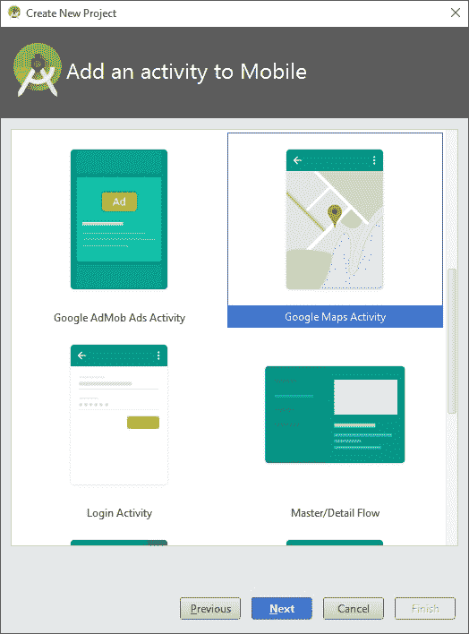
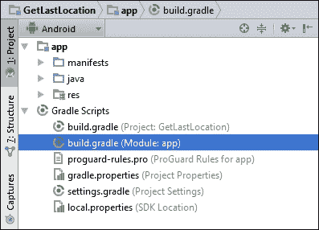
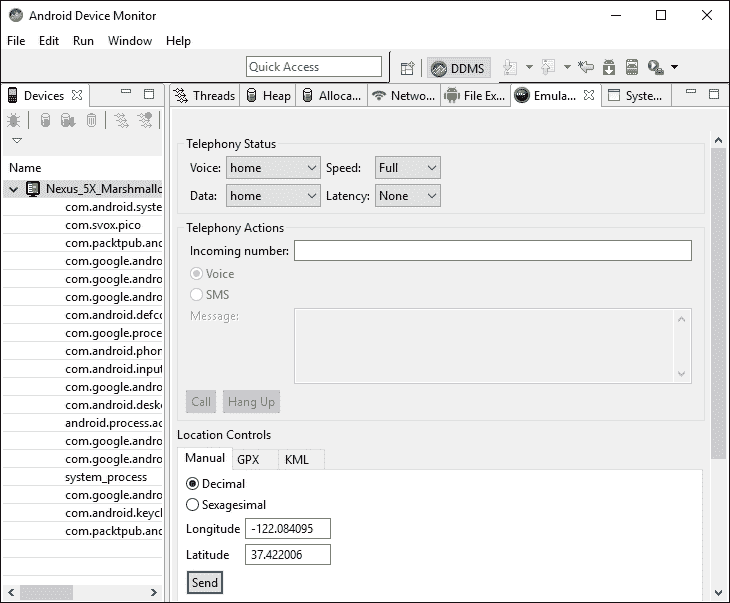

# 第十三章：获取位置和使用地理围栏

在本章中，我们将涵盖以下主题：

+   如何获取最后一次位置

+   解决使用 GoogleApiClient OnConnectionFailedListener 报告的问题

+   如何接收位置更新

+   创建并监控地理围栏

# 引言

位置感知为应用带来了许多好处，实际上，好处如此之多，以至于现在连桌面应用也尝试获取用户的位置信息。位置信息的用途包括逐向导航、"查找最近"的应用程序、基于位置的提醒，以及现在甚至有了让你用设备去探索的基于位置的游戏。

Google API 提供了丰富的功能，用于创建具有位置感知的应用程序和地图功能。我们的第一个方法*如何获取最后一次位置*将查看设备上存储的最后一次已知位置。如果你的应用不是位置密集型的，这可能提供了一种获取用户位置而不需要大量资源开销的理想方式。如果你需要持续更新，那么请转向*如何接收位置更新*的方法。尽管持续的位置更新需要更多资源，但用户可能会理解你为他们提供逐向导航时的情况。如果你请求位置更新是为了邻近位置，请查看使用地理围栏选项，在*创建和监控地理围栏*的方法中。

本章中的所有方法都使用 Google 库。如果你还没有下载 SDK 包，请按照 Google 的说明操作。

### 提示

从[`developer.android.com/sdk/installing/adding-packages.html`](http://developer.android.com/sdk/installing/adding-packages.html)添加 SDK 包。

现在你已经获得了位置信息，你很可能会想要将其映射出来。这也是 Google 在 Android 上使用 Google Maps API 使操作变得非常简单的另一个领域。要开始使用 Google Maps，请在 Android Studio 中创建新项目时查看**Google Maps Activity**选项。与我们在这些方法中通常选择的**空白活动**不同，请选择**Google Maps Activity**，如下截图所示：



# 如何获取最后一次位置

我们将从这一章开始介绍一个常用的简单方法：如何获取最后一次已知位置。这是一种使用 API 而几乎不消耗资源的方法。（这意味着，你的应用不会耗尽电池电量。）

本方法还提供了设置 Google 位置 API 的良好介绍。

## 准备就绪

在 Android Studio 中创建一个新项目，并将其命名为：`GetLastLocation`。使用默认的**手机 & 平板**选项，在选择**活动类型**时，选择**空活动**。

## 如何操作...

首先，我们将在 Android Manifest 中添加必要的权限，然后创建一个带有`Button`和`TextView`元素的布局。最后，我们将创建一个`GoogleAPIClient` API 来访问最后一次位置。打开 Android Manifest 并按照以下步骤操作：

1.  添加以下权限：

    ```kt
    <uses-permission android:name="android.permission.ACCESS_COARSE_LOCATION"/>
    ```

1.  在**Gradle Scripts**部分下，打开**build.gradle (Module: app)**文件，如下截图所示：

1.  在`dependencies`部分添加以下声明：

    ```kt
    compile 'com.google.android.gms:play-services:8.4.0'
    ```

1.  打开`activity_main.xml`文件，用以下 XML 替换现有的`TextView`：

    ```kt
    <TextView
        android:id="@+id/textView"
        android:layout_width="wrap_content"
        android:layout_height="wrap_content" />
    <Button
        android:id="@+id/button"
        android:layout_width="wrap_content"
        android:layout_height="wrap_content"
        android:text="Get Location"
        android:layout_centerInParent="true"
        android:onClick="getLocation"/>
    ```

1.  打开`MainActivity.java`文件，并添加以下全局变量：

    ```kt
    GoogleApiClient mGoogleApiClient;
    TextView mTextView;
    Button mButton;
    ```

1.  添加`ConnectionCallbacks`的类：

    ```kt
    GoogleApiClient.ConnectionCallbacks mConnectionCallbacks = new GoogleApiClient.ConnectionCallbacks() {
        @Override
        public void onConnected(Bundle bundle) {
            mButton.setEnabled(true);
        }
        @Override
        public void onConnectionSuspended(int i) {}
    };
    ```

1.  添加处理`OnConnectionFailedListener`回调的类：

    ```kt
    GoogleApiClient.OnConnectionFailedListener mOnConnectionFailedListener = new GoogleApiClient.OnConnectionFailedListener() {
        @Override
        public void onConnectionFailed(ConnectionResult connectionResult) {
            Toast.makeText(MainActivity.this, connectionResult.toString(), Toast.LENGTH_LONG).show();
        }
    };
    ```

1.  将以下代码添加到现有的`onCreate()`方法中：

    ```kt
    mTextView = (TextView) findViewById(R.id.textView);
    mButton = (Button) findViewById(R.id.button);
    mButton.setEnabled(false);
    setupGoogleApiClient();
    ```

1.  添加设置`GoogleAPIClient`的方法：

    ```kt
    protected synchronized void setupGoogleApiClient() {
        mGoogleApiClient = new GoogleApiClient.Builder(this)
            .addConnectionCallbacks(mConnectionCallbacks)
            .addOnConnectionFailedListener(mOnConnectionFailedListener)
            .addApi(LocationServices.API)
            .build();
        mGoogleApiClient.connect();
    }
    ```

1.  为按钮点击添加以下方法：

    ```kt
    public void getLocation(View view) {
        try {
            Location lastLocation = LocationServices.FusedLocationApi.getLastLocation(
                mGoogleApiClient);
            if (lastLocation != null) {
                mTextView.setText(
                    DateFormat.getTimeInstance().format(lastLocation.getTime()) + "\n" + "Latitude="+lastLocation.getLatitude() + "\n" + "Longitude=" + lastLocation.getLongitude());
            } else {
                Toast.makeText(MainActivity.this, "null", Toast.LENGTH_LONG).show();
            }
        }
        catch (SecurityException e) {e.printStackTrace();}
    }
    ```

1.  您已准备好在设备或模拟器上运行应用程序。

## 工作原理...

在我们调用`getLastLocation()`方法之前，需要设置`GoogleApiClient`。我们在`setupGoogleApiClient()`方法中调用`GoogleApiClient.Builder`方法，然后连接到库。当库准备就绪时，它会调用我们的`ConnectionCallbacks.onConnected()`方法。出于演示目的，这里是我们启用按钮的地方。（在后续的食谱中，我们将使用此回调启动附加功能。）

我们使用了按钮来显示我们可以按需调用`getLastLocation()`；这不是一次性的调用。系统负责更新位置，并在重复调用时可能返回相同的最后位置。（这可以在时间戳中看到——它是位置时间戳，而不是按下按钮时的时间戳。）

这种按需调用位置的方法在您只需要在应用程序中发生某些事情时获取位置（例如对对象进行地理编码）的情况下可能很有用。由于系统负责位置更新，因此您的应用程序不会因为位置更新而导致电池耗尽。

我们收到的位置对象的精确度基于我们的权限设置。我们使用了`ACCESS_COARSE_LOCATION`，但如果我们想要更高的精确度，可以改为请求`ACCESS_FINE_LOCATION`，并使用以下权限：

```kt
<uses-permission android:name="android.permission.ACCESS_FINE_LOCATION"/>
```

最后，为了使代码专注于`GoogleApiClient`，我们只需用`SecurityException`包装`getLastLocation()`。在生产应用程序中，您应该检查并请求上一章显示的权限。（请参阅*新的运行时权限模型*。）

## 还有更多...

如果在连接到`GoogleApiClient`时出现问题，将调用`OnConnectionFailedListener`。在这个例子中，我们显示了一个 Toast。下一个食谱，*解决 GoogleApiClient OnConnectionFailedListener 报告的问题*，将展示一种更健壮的方式来处理这种情况。

测试位置可能是一个挑战，因为在测试和调试时实际上移动设备是困难的。幸运的是，我们有能力用模拟器模拟 GPS 数据。（也可以在物理设备上创建模拟位置，但这并不容易。）

### 模拟位置

有三种方法可以在模拟器中模拟位置：

+   Android Studio

+   DDMS

+   通过 Telnet 的`Geo`命令

若要在 Android Studio 中设置模拟位置，请按照以下步骤操作：

1.  导航至**工具** | **Android** | **Android Device Monitor**。

1.  在设备窗口中选择**Emulator Control**标签页。

1.  在**Location Controls**下输入 GPS 坐标。

下面是一个显示**Location** **Controls**的截图：



### 提示

请注意，模拟位置是通过发送 GPS 数据来实现的。因此，为了让你的应用接收模拟位置，它需要接收 GPS 数据。测试`lastLocation()`可能不会发送模拟 GPS 数据，因为它并不完全依赖 GPS 来确定设备位置。尝试使用教程*如何接收位置更新*设置模拟位置，在那里我们可以请求优先级。（我们无法强制系统使用任何特定的位置传感器，我们只能提出请求。系统会选择最佳方案来提供结果。）

## 另请参阅

+   第十四章中的*新的 Android 6.0 运行时权限模型*教程

+   设置 Google Play 服务：[`developers.google.com/android/guides/setup`](https://developers.google.com/android/guides/setup)

+   **FusedLocationProviderApi**接口：[`developers.google.com/android/reference/com/google/android/gms/location/FusedLocationProviderApi`](https://developers.google.com/android/reference/com/google/android/gms/location/FusedLocationProviderApi)

# 解决使用 GoogleApiClient OnConnectionFailedListener 报告的问题

鉴于 Google API 的不断变化，你的用户可能会尝试使用你的应用程序，但由于文件过时而无法使用。在之前的示例中，我们只是显示了一个 Toast，但我们还可以做得更好。我们可以使用`GoogleApiAvailability`库来显示一个对话框，帮助用户解决问题。

我们将继续之前的教程，并在`onConnectionFailed()`回调中添加代码。我们将使用错误结果向用户显示更多信息，以解决他们的问题。

## 准备工作

本教程将从之前的教程*如何获取最后的位置*继续。如果你是从下载的源文件中加载项目，它被称为`HandleGoogleAPIError`。

## 如何操作...

由于我们是从上一个教程继续，我们只涵盖更新之前代码所需的步骤。打开`ActivityMain.java`并按照以下步骤操作：

1.  在全局类变量中添加以下行：

    ```kt
    private final int REQUEST_RESOLVE_GOOGLE_CLIENT_ERROR=1;
    boolean mResolvingError;
    ```

1.  添加以下方法以显示 Google API 错误对话框：

    ```kt
    private void showGoogleAPIErrorDialog(int errorCode) {
      GoogleApiAvailability googleApiAvailability = GoogleApiAvailability.getInstance();
      Dialog errorDialog = googleApiAvailability.getErrorDialog(this, errorCode, REQUEST_RESOLVE_GOOGLE_CLIENT_ERROR);
      errorDialog.show();
    }
    ```

1.  添加以下代码以覆盖`onActivityResult()`：

    ```kt
    @Override
    protected void onActivityResult(int requestCode, int resultCode, Intent data) {
      if (requestCode == REQUEST_RESOLVE_GOOGLE_CLIENT_ERROR) {
        mResolvingError = false;
        if (resultCode == RESULT_OK && !mGoogleApiClient.isConnecting() && !mGoogleApiClient.isConnected()) {
            mGoogleApiClient.connect();
        }
      }
    }
    ```

1.  在`onConnectionFailed()`中，使用以下代码替换调用 Toast 的现有行：

    ```kt
    if (mResolvingError) {
      return;
    } else if (connectionResult.hasResolution()) {
      mResolvingError = true;
      try {
        connectionResult.startResolutionForResult(MainActivity.this, REQUEST_RESOLVE_GOOGLE_CLIENT_ERROR);
      } catch (IntentSender.SendIntentException e) {
        mGoogleApiClient.connect();
      }
    } else {
      showGoogleAPIErrorDialog(connectionResult.getErrorCode());
    }
    ```

1.  你已经准备好在设备或模拟器上运行应用程序。

## 工作原理...

与之前使用 Toast 显示错误消息不同，我们现在检查 `connectionResult` 以了解我们能做什么。`GoogleAPIClient` 使用 `connectionResult` 指示可能的行动方案。我们可以按如下方式调用 `hasResolution()` 方法：

```kt
connectionResult.hasResolution()
```

如果响应为 `true`，则用户可以解决，例如启用位置服务。如果响应为 `false`，我们将获取 `GoogleApiAvailability` 的实例并调用 `getErrorDialog()` 方法。完成后，我们的 `onActivityResult()` 回调将被调用，在那里我们重置 `mResolvingError`，如果成功，尝试重新连接。

### 提示

如果你没有带有旧版 Google API 的设备进行测试，你可以尝试在带有旧版 Google API 版本的模拟器上进行测试。

## 还有更多内容...

如果你的应用正在使用片段，你可以使用以下代码获取一个对话框片段：

```kt
ErrorDialogFragment errorFragment = new ErrorDialogFragment();
Bundle args = new Bundle();
args.putInt("dialog_error", errorCode);
errorFragment.setArguments(args);
errorFragment.show(getSupportFragmentManager(), "errordialog");
```

## 另请参阅

+   访问 Google API：[`developers.google.com/android/guides/api-client`](https://developers.google.com/android/guides/api-client)

# 如何接收位置更新

如果你的应用需要频繁的位置更新，你的应用可以请求周期性的更新。本示例将使用 `GoogleApiClient` 的 `requestLocationUpdates()` 方法来演示这一点。

## 准备工作

在 Android Studio 中创建一个新项目，命名为 `LocationUpdates`。使用默认的 **Phone & Tablet** 选项，并在提示选择 **Activity Type** 时选择 **Empty Activity**。

## 如何操作...

由于我们将从系统接收更新，因此这个示例不需要按钮。我们的布局将只包含 `TextView` 以查看位置数据。打开 Android 清单文件并按照以下步骤操作：

1.  添加以下权限：

    ```kt
    <uses-permission android:name="android.permission.ACCESS_FINE_LOCATION"/>
    ```

1.  打开 `build.gradle (Module: app)` 文件，并在 `dependencies` 部分添加以下声明：

    ```kt
    compile 'com.google.android.gms:play-services:8.4.0'
    ```

1.  打开 `activity_main.xml` 文件，并用以下 XML 替换现有的 `TextView`：

    ```kt
    <TextView
        android:id="@+id/textView"
        android:layout_width="wrap_content"
        android:layout_height="wrap_content" />
    ```

1.  打开 `MainActivity.java` 文件，并添加以下全局变量：

    ```kt
    GoogleApiClient mGoogleApiClient;
    LocationRequest mLocationRequest;
    TextView mTextView;
    ```

1.  创建以下 `LocationListener` 类：

    ```kt
    LocationListener  mLocationListener = new LocationListener() {
        @Override
        public void onLocationChanged(Location location) {
            if (location != null) {
                mTextView.setText(
                    DateFormat.getTimeInstance().format(location.getTime()) + "\n" + "Latitude="+location.getLatitude()+"\n" + "Longitude="+location.getLongitude());
            }
        }
    };
    ```

1.  创建一个 `ConnectionCallbacks` 类以接收位置更新：

    ```kt
    GoogleApiClient.ConnectionCallbacks mConnectionCallbacks = new GoogleApiClient.ConnectionCallbacks() {
        @Override
        public void onConnected(Bundle bundle) {
            Log.i("onConnected()", "start");
            try {
                LocationServices.FusedLocationApi.requestLocationUpdates(
                    mGoogleApiClient, mLocationRequest, mLocationListener);
            } catch (SecurityException e) {
                Log.i("onConnected()","SecurityException: "+e.getMessage());
            }
        }
        @Override
        public void onConnectionSuspended(int i) {}
    };
    ```

1.  创建一个 `OnConnectionFailedListener` 类：

    ```kt
    GoogleApiClient.OnConnectionFailedListener mOnConnectionFailedListener = new GoogleApiClient.OnConnectionFailedListener() {
        @Override
        public void onConnectionFailed(ConnectionResult connectionResult) {
            Toast.makeText(MainActivity.this, connectionResult.toString(), Toast.LENGTH_LONG).show();
            Log.i("onConnected()", "SecurityException: " +connectionResult.toString());
        }
    };
    ```

1.  在现有的 `onCreate()` 回调中添加以下代码：

    ```kt
    mTextView = (TextView) findViewById(R.id.textView);
    setupLocationRequest();
    ```

1.  创建 `setupLocationRequest()` 方法：

    ```kt
    protected synchronized void setupLocationRequest() {
        mLocationRequest = new LocationRequest();
        mLocationRequest.setInterval(10000);
        mLocationRequest.setFastestInterval(10000);
        mLocationRequest.setPriority(LocationRequest.PRIORITY_HIGH_ACCURACY);
        mGoogleApiClient = new GoogleApiClient.Builder(this)
                .addConnectionCallbacks(mConnectionCallbacks)
                .addOnConnectionFailedListener(mOnConnectionFailedListener)
                .addApi(LocationServices.API)
                .build();
        mGoogleApiClient.connect();
    }
    ```

1.  你可以准备在设备或模拟器上运行应用程序了。

## 工作原理...

本示例与 *如何获取最后位置* 的示例相似，因为我们需要像之前一样设置 `GoogleApiClient`。但是，不是按需调用 `lastLocation()` 方法，我们调用 `requestLocationUpdates()` 方法，通过 `LocationListener` 类接收周期性的位置更新。

`requestLocationUpdates()` 方法需要三个参数：

+   `GoogleApiClient`

+   `LocationRequest`

+   `LocationListener`

我们像之前一样创建 `GoogleApiClient`。这是我们创建 `LocationRequest` 的代码：

```kt
mLocationRequest = new LocationRequest();
mLocationRequest.setInterval(10000);
mLocationRequest.setFastestInterval(10000);
mLocationRequest.setPriority(LocationRequest.PRIORITY_HIGH_ACCURACY)
```

调用`setInterval()`时，通常最好使用对您目的来说最慢的延迟，因为它需要更少的设备资源。调用`setPriority()`时也是同样的道理。第三个参数`LocationListener`是我们定义回调方法`onLocationChanged()`的地方。在这里，我们仅显示位置数据以及位置时间戳。

## 还有更多...

与之前的 Android API 不同，`GoogleApiClient` API 不允许为位置更新选择特定的传感器。如*如何获取最后位置*的*模拟位置*部分所述，使用`LocationRequest.PRIORITY_HIGH_ACCURACY`以及`ACCESS_FINE_LOCATION`权限应该会使用 GPS 传感器。有关模拟位置的说明，请参考*模拟位置*部分。

### 停止接收位置更新

当您的应用程序不再需要位置更新时，请调用`removeLocationUpdates()`方法，如下所示：

```kt
LocationServices.FusedLocationApi.removeLocationUpdates(
    mGoogleApiClient, mLocationListener);
```

通常，当您的应用程序不再处于前台时，您可能希望关闭更新，但这取决于您的具体应用程序需求。如果您的应用程序需要持续更新，可能更希望创建一个后台服务来处理回调。

## 另请参阅

+   **开发者文档：onLocationChanged**在[`developer.android.com/reference/com/google/android/gms/location/LocationRequest.html`](https://developer.android.com/reference/com/google/android/gms/location/LocationRequest.html)

# 创建并监控一个地理围栏

如果您的应用程序需要知道用户进入某个特定位置的时间，有一种替代方法可以避免不断检查用户位置：地理围栏。地理围栏是一个带有半径的地理位置（纬度和经度）。您可以创建一个地理围栏，当用户进入您指定的位置范围时，系统会通知您。（Android 目前允许每个用户最多设置 100 个地理围栏。）

地理围栏属性包括：

+   **位置**：经度和纬度

+   **半径**：圆的大小（以米为单位）

+   **逗留延迟**：用户在发送通知前可以在半径内停留的时间

+   **过期时间**：地理围栏自动过期的时长

+   **过渡** **类型**：以下列出了这些类型：

    +   `GEOFENCE_TRANSITION_ENTER`

    +   `GEOFENCE_TRANSITION_EXIT`

    +   `INITIAL_TRIGGER_DWELL`

本指南将向您展示如何创建一个地理围栏对象，并使用它来创建一个`GeofencingRequest`实例。

## 准备就绪

在 Android Studio 中创建一个新项目，命名为`Geofence`。使用默认的**手机 & 平板**选项，在选择**活动类型**时，选择**空活动**。

## 如何操作...

由于我们将使用提示信息和通知与用户互动，因此本指南不需要布局。我们需要为`IntentService`创建一个额外的 Java 类，用于处理地理围栏警报。打开 Android Manifest 文件，按照以下步骤操作：

1.  添加以下权限：

    ```kt
    <uses-permission android:name="android.permission.ACCESS_FINE_LOCATION"/>
    ```

1.  打开文件`build.gradle (Module: app)`并在`dependencies`部分添加以下声明：

    ```kt
    compile 'com.google.android.gms:play-services:8.4.0'
    ```

1.  创建一个名为`GeofenceIntentService`的新 Java 类并继承`IntentService`类。声明如下所示：

    ```kt
    public class GeofenceIntentService extends IntentService {
    ```

1.  添加以下构造函数：

    ```kt
    public GeofenceIntentService() {
        super("GeofenceIntentService");
    }
    ```

1.  添加`onHandleIntent()`以接收 Geofence 警告：

    ```kt
    protected void onHandleIntent(Intent intent) {
        GeofencingEvent geofencingEvent = GeofencingEvent.fromIntent(intent);
        if (geofencingEvent.hasError()) {
            Toast.makeText(getApplicationContext(), "Geofence error code= " + geofencingEvent.getErrorCode(), Toast.LENGTH_SHORT).show();
            return;
        }
        int geofenceTransition = geofencingEvent.getGeofenceTransition();
        if (geofenceTransition == Geofence.GEOFENCE_TRANSITION_DWELL) {
            sendNotification();
        }
    }
    ```

1.  添加`sendNotification()`方法以向用户显示消息：

    ```kt
    private void sendNotification() {
        Log.i("GeofenceIntentService", "sendNotification()");
        Uri notificationSoundUri = RingtoneManager.getDefaultUri(RingtoneManager.TYPE_NOTIFICATION);
        NotificationCompat.Builder notificationBuilder = new NotificationCompat.Builder(this)
                .setSmallIcon(R.mipmap.ic_launcher)
                .setContentTitle("Geofence Alert")
                .setContentText("GEOFENCE_TRANSITION_DWELL")
                .setSound(notificationSoundUri)
                .setLights(Color.BLUE, 500, 500);
        NotificationManager notificationManager = (NotificationManager) getApplicationContext().getSystemService(Context.NOTIFICATION_SERVICE);
        notificationManager.notify(0, notificationBuilder.build());
    }
    ```

1.  打开 Android 清单并在与`<activity>`元素同一级别的`<application>`元素内添加以下内容：

    ```kt
    <service android:name=".GeofenceIntentService"/>
    ```

1.  打开`MainActivity.java`并添加以下全局变量：

    ```kt
    private final int MINIMUM_RECOMENDED_RADIUS=100;
    GoogleApiClient mGoogleApiClient;
    PendingIntent mGeofencePendingIntent;
    ```

1.  创建以下`ResultCallback`类：

    ```kt
    ResultCallback mResultCallback = new ResultCallback() {
        @Override
        public void onResult(Result result) {
            Log.i("onResult()", "result: " + result.getStatus().toString());
        }
    };
    ```

1.  创建一个`ConnectionCallbacks`类：

    ```kt
    GoogleApiClient.ConnectionCallbacks mConnectionCallbacks = new GoogleApiClient.ConnectionCallbacks() {
        @Override
        public void onConnected(Bundle bundle) {
            try {
              LocationServices.GeofencingApi.addGeofences(
                  mGoogleApiClient,
                  createGeofencingRequest(),
                  getGeofencePendingIntent()
              ).setResultCallback(mResultCallback);
            } catch (SecurityException e) {
                Log.i("onConnected()", "SecurityException: " + e.getMessage());
            }
        }
        @Override
        public void onConnectionSuspended(int i) {}
    };
    ```

1.  创建一个`OnConnectionFailedListener`类：

    ```kt
    GoogleApiClient.OnConnectionFailedListener mOnConnectionFailedListener = new GoogleApiClient.OnConnectionFailedListener() {
        @Override
        public void onConnectionFailed(ConnectionResult connectionResult) {
            Log.i("onConnectionFailed()", "connectionResult: " +connectionResult.toString());
        }
    };
    ```

1.  在现有的`onCreate()`回调中添加以下代码：

    ```kt
      setupGoogleApiClient();
    ```

1.  添加设置`GoogleAPIClient`的方法：

    ```kt
    protected synchronized void setupGoogleApiClient() {
        mGoogleApiClient = new GoogleApiClient.Builder(this)
            .addConnectionCallbacks(mConnectionCallbacks)
            .addOnConnectionFailedListener(mOnConnectionFailedListener)
            .addApi(LocationServices.API)
            .build();
        mGoogleApiClient.connect();
    }
    ```

1.  创建`setupGoogleApiClient()`方法：

    ```kt
    protected synchronized void setupGoogleApiClient() {
        mGoogleApiClient = new GoogleApiClient.Builder(this)
            .addConnectionCallbacks(mConnectionCallbacks)
            .addOnConnectionFailedListener(mOnConnectionFailedListener)
            .addApi(LocationServices.API)
            .build();
        mGoogleApiClient.connect();
    }
    ```

1.  使用以下方法创建一个待定意图：

    ```kt
    private PendingIntent getGeofencePendingIntent() {
        if (mGeofencePendingIntent != null) {
            return mGeofencePendingIntent;
        }
        Intent intent = new Intent(this, GeofenceIntentService.class);
        return PendingIntent.getService(this, 0, intent, PendingIntent.FLAG_UPDATE_CURRENT);
    }
    ```

1.  创建一个`geofence`对象并将其添加到请求的列表中：

    ```kt
    private List createGeofenceList() {
        List<Geofence> geofenceList = new ArrayList<Geofence>();
        geofenceList.add(new Geofence.Builder()
                .setRequestId("GeofenceLocation")
                .setCircularRegion(
                        37.422006, //Latitude
                        -122.084095, //Longitude
                        MINIMUM_RECOMENDED_RADIUS)
                .setLoiteringDelay(30000)
                .setExpirationDuration(Geofence.NEVER_EXPIRE)
                .setTransitionTypes(Geofence.GEOFENCE_TRANSITION_DWELL)
        .build());
        return geofenceList;
    }
    ```

1.  按如下方式创建`createGeofencingRequest()`方法：

    ```kt
    private GeofencingRequest createGeofencingRequest() {
        GeofencingRequest.Builder builder = new GeofencingRequest.Builder();
        builder.setInitialTrigger(GeofencingRequest.INITIAL_TRIGGER_DWELL);
        builder.addGeofences(createGeofenceList());
        return builder.build();
    }
    ```

1.  你现在可以在设备或模拟器上运行应用程序了。

## 工作原理...

首先，我们添加`ACCESS_FINE_LOCATION`权限，因为这是 Geofencing 所必需的。我们像在以前的食谱中一样设置`GoogleApiClient`，并等待`onConnected()`被调用以设置`GeofencingApi`。

在我们可以调用`GeofencingApi.addGeofences()`方法之前，我们必须准备三个对象：

+   `GoogleApiClient`

+   Geofence 请求

+   待定意图

我们已经创建了`GoogleApiClient`，我们将其保存在`mGoogleApiClient`中。

要创建 Geofence 请求，我们使用`GeofencingRequest.Builder`。构建器需要 Geofence 对象列表，这些对象在`createGeofenceList()`方法中创建。（即使我们只创建了一个 Geofence 对象，构建器也需要一个列表，所以我们只需将单个 Geofence 添加到`ArrayList`中。）以下是设置 Geofence 属性的地方：

```kt
.setRequestId("GeofenceLocation")
.setCircularRegion(
        37.422006, //Latitude
        -122.084095, //Longitude
        MINIMUM_RECOMENDED_RADIUS)
.setLoiteringDelay(30000)
.setExpirationDuration(Geofence.NEVER_EXPIRE)
.setTransitionTypes(Geofence.GEOFENCE_TRANSITION_DWELL)
```

只有 Loitering 延迟是可选的，但我们需要它，因为我们使用了`DWELL`转换。在调用`setTransitionTypes()`时，我们可以使用管道显示的`OR`运算符组合多个转换类型。以下是使用`ENTER`和`EXIT`的示例：

```kt
.setTransitionTypes(Geofence.GEOFENCE_TRANSITION_ENTER | Geofence.GEOFENCE_TRANSITION_EXIT)
```

在这个例子中，我们使用了与模拟器相同的默认纬度和经度。根据需要更改这些值。

我们调用`Geofence.Builder()`创建 Geofence 对象。准备好 Geofence 列表后，我们调用`GeofencingRequest.Builder`并将我们的初始触发器设置为`INITIAL_TRIGGER_DWELL`。（如果你更改前面的转换类型，你可能还需要更改初始触发器。）

我们需要的最后一个对象是 Pending Intent，这是系统在满足 Geofence 条件时通知我们应用的途径。我们创建了 `GeofenceIntentService` 来处理 Geofence 意图，通过向用户发送通知。（有关通知的更多信息，请参阅第七章中的 *使用通知的灯光、动作和声音 Redux* 配方，*警报和通知*。）

创建了所有三个对象后，我们只需调用 `LocationServices.GeofencingApi.addGeofences()` 并等待通知的到来。

## 还有更多...

若要停止接收 Geofence 通知，可以调用 `removeGeofences()` 方法，并使用 `RequestID` 参数或 `PendingIntent`。以下示例使用了与通知相同的 `PendingIntent` 方法：

```kt
LocationServices.GeofencingApi.removeGeofences(
    mGoogleApiClient,
    getGeofencePendingIntent()
).setResultCallback(mResultCallback);
```

## 另请参阅

+   `Geofence.Builder` 类位于：[`developers.google.com/android/reference/com/google/android/gms/location/Geofence.Builder.html`](https://developers.google.com/android/reference/com/google/android/gms/location/Geofence.Builder.html)

+   `GeofencingRequest.Builder` 类位于：[`developers.google.com/android/reference/com/google/android/gms/location/GeofencingRequest.Builder`](https://developers.google.com/android/reference/com/google/android/gms/location/GeofencingRequest.Builder)
