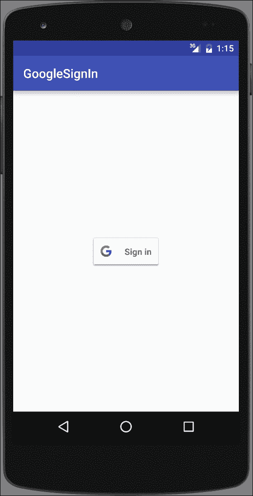

# 第十四章：为 Play 商店准备你的应用

在本章中，我们将涵盖以下主题：

+   新的 Android 6.0 运行时权限模型

+   如何安排闹钟

+   接收设备启动通知

+   使用 AsyncTask 进行后台工作

+   将语音识别添加到你的应用

+   使用 Google 云消息推送通知

+   如何将谷歌登录添加到你的应用

# 引言

当我们接近这本书的结尾时，是时候在发布到 Play 商店之前为你的应用添加最后的润色了。本章的食谱涵盖了可能决定用户保留还是卸载你的应用的主题。

我们的第一部分，*新的 Android 6.0 运行时权限模型*，无疑是一个重要的话题，可能是 Android 从版本 5.x 升级到版本 6 的主要原因！对 Android 权限模型的更改已经被请求了一段时间，所以这个新模型是一个受欢迎的改变，至少对用户来说是这样。

接下来，我们将看看在 Android 中使用闹钟。闹钟的主要优点之一是操作系统负责维护闹钟，即使你的应用没有运行。由于闹钟在设备重启后不会保留，我们还将看看如何在*接收设备启动通知*中检测设备重启，以便你可以重新创建你的闹钟。

几乎任何严肃的 Android 应用都需要一种方法在主线程之外执行可能阻塞的任务。否则，你的应用可能会被视为反应迟钝，或者更糟，完全无响应。`AsyncTask`旨在使创建后台工作线程更容易，我们将在*使用 AsyncTask 进行后台工作*这一部分中演示。

如果你希望你的应用能够从免提输入或语音识别中受益，请查看一下*将语音识别添加到你的应用*这一部分，我们将探讨谷歌语音 API。

与你的用户沟通的最有趣的功能之一可能是推送通知或谷歌所谓的**Google Cloud Messaging** (**GCM**)。*使用 Google 云消息推送通知*这一部分将指导你将 GCM 添加到你的应用程序，并解释更大的图景。

最后，我们将在*如何将谷歌登录添加到你的应用*这一部分结束本章，展示如何让你的应用更加舒适并鼓励用户登录。

# 新的 Android 6.0 运行时权限模型

旧的安全模型是 Android 中许多人的痛点。评论中经常看到对应用所需权限的评论是很常见的。有时，权限是过分的（比如一个手电筒应用需要网络权限），但其他时候，开发者请求某些权限是有充分理由的。主要问题是这是一个全有或全无的前景。

这最终在 Android 6 Marshmallow（API 23）版本中得到了改变。新的权限模型仍然像以前一样在清单中声明权限，但用户可以选择性地接受或拒绝每个权限。用户甚至可以撤销之前授予的权限。

尽管这对于许多人是受欢迎的改变；然而，对于开发者来说，这可能会破坏之前正常工作的代码。我们之前讨论过这个权限变化，因为它具有深远的影响。这个菜谱将汇总所有信息，以便在您自己的应用中实施此更改时作为单一参考点。

需要记住的一个重要点是，这个变化只影响 Android 6.0（API 23）及以上版本的用户。

## 准备就绪

在 Android Studio 中创建一个新项目，并将其命名为 `RuntimePermission`。对于 **Activity 类型**，使用默认的 **Phone & Tablet** 选项并选择 **Empty Activity**。

示例源代码将最低 API 设置为 23，但这并不是必须的。如果您的 `compileSdkVersion` 是 API 23 或以上，编译器将针对新的安全模型标记您的代码。

## 如何操作...

我们需要先在清单中添加我们所需的权限，然后我们将添加一个按钮来调用我们的检查权限代码。打开 Android 清单并按照以下步骤操作：

1.  添加以下权限：

    ```kt
    <uses-permission android:name="android.permission.SEND_SMS"/>
    ```

1.  打开 `activity_main.xml` 并用此按钮替换现有的 `TextView`：

    ```kt
    <Button
        android:id="@+id/button"
        android:layout_width="wrap_content"
        android:layout_height="wrap_content"
        android:text="Do Something"
        android:layout_centerInParent="true"
        android:onClick="doSomething"/>
    ```

1.  打开 `MainActivity.java` 并向类中添加以下常量：

    ```kt
    private final int REQUEST_PERMISSION_SEND_SMS=1;
    ```

1.  添加此方法来检查权限：

    ```kt
    private boolean checkPermission(String permission) {
        int permissionCheck = ContextCompat.checkSelfPermission(
                this, permission);
        return (permissionCheck == PackageManager.PERMISSION_GRANTED);
    }
    ```

1.  添加此方法以显示解释对话框：

    ```kt
    private void showExplanation(String title,
        String message, final String permission, final int permissionRequestCode) {
        AlertDialog.Builder builder = new AlertDialog.Builder(this);
        builder.setTitle(title).setMessage(message).setPositiveButton(android.R.string.ok, new DialogInterface.OnClickListener() {
            public void onClick(DialogInterface dialog, int id) {
                requestPermission(permission, permissionRequestCode);
            }
        });
        builder.create().show();
    }
    ```

1.  添加此方法来请求权限：

    ```kt
    private void requestPermission(String permissionName, int permissionRequestCode) {
        ActivityCompat.requestPermissions(this, new String[]{permissionName}, permissionRequestCode);
    }
    ```

1.  添加按钮点击的方法：

    ```kt
    public void doSomething(View view) {
        if (!checkPermission(Manifest.permission.SEND_SMS)) {
            if (ActivityCompat.shouldShowRequestPermissionRationale(this, Manifest.permission.SEND_SMS)) {
                showExplanation("Permission Needed", "Rationale", Manifest.permission.SEND_SMS, REQUEST_PERMISSION_SEND_SMS);
            } else {
                requestPermission(Manifest.permission.SEND_SMS, REQUEST_PERMISSION_SEND_SMS);
            }
        } else {
            Toast.makeText(MainActivity.this, "Permission (already) Granted!", Toast.LENGTH_SHORT).show();
        }
    }
    ```

1.  如下重写 `onRequestPermissionsResult()`：

    ```kt
    @Override
    public void onRequestPermissionsResult(
        int requestCode,
        String permissions[],
        int[] grantResults) {
        switch (requestCode) {
            case REQUEST_PERMISSION_SEND_SMS: {
                if (grantResults.length > 0 && grantResults[0] == PackageManager.PERMISSION_GRANTED) {
                    Toast.makeText(MainActivity.this, "Permission Granted!", Toast.LENGTH_SHORT).show();
                } else {
                    Toast.makeText(MainActivity.this, "Permission Denied!", Toast.LENGTH_SHORT).show();
                }
                return;
            }
        }
    }
    ```

1.  现在，你可以在设备或模拟器上运行应用程序了。

## 它是如何工作的...

使用新的运行时权限模型涉及以下内容：

1.  检查你是否拥有所需的权限。

1.  如果没有，检查我们是否应该显示理由（意味着，之前的请求被拒绝了）。

1.  请求权限；只有操作系统可以显示权限请求。

1.  处理请求响应。

以下是相应的方法：

+   `ContextCompat.checkSelfPermission`

+   `ActivityCompat.requestPermissions`

+   `ActivityCompat.shouldShowRequestPermissionRationale`

+   `onRequestPermissionsResult`

    ### 注意

    尽管你在运行时请求权限，但所需的权限必须在 Android 清单中列出。如果未指定权限，操作系统将自动拒绝请求。

## 还有更多...

你可以通过 ADB 使用以下命令来授权/撤销权限：

```kt
adb shell pm [grant|revoke] <package> <permission-name>
```

这是一个示例，为我们的测试应用授予 SEND_SMS 权限：

```kt
adb shell pm grant com.packtpub.androidcookbook.runtimepermissions android.permission.SEND_SMS
```

## 另请参阅

+   **开发者文档：系统权限** 在 [`developer.android.com/guide/topics/security/permissions.html`](https://developer.android.com/guide/topics/security/permissions.html)

# 如何计划一个闹钟

Android 提供了 `AlarmManager` 来创建和计划闹钟。闹钟提供以下功能：

+   计划在设定的时间或间隔触发报警

+   由操作系统维护，而不是您的应用程序，因此即使您的应用程序没有运行，或者设备在休眠，也会触发报警

+   可用于触发周期性任务（例如每小时新闻更新），即使应用程序没有运行

+   您的应用程序不使用资源（如计时器或后台服务），因为操作系统管理调度

如果您在应用程序运行时只需要一个简单的延迟，例如，一个 UI 事件的短暂延迟，报警并不是最佳解决方案。对于短暂延迟，使用处理程序更容易、更高效，正如我们在之前的几个食谱中所做的那样。

使用报警时，请记住以下最佳实践：

+   尽可能使用不频繁的报警时间

+   避免唤醒设备

+   尽可能使用不精确的时间——时间越精确，所需的资源越多

+   避免基于时钟时间设置报警（例如 12:00）；如果可能，添加随机调整以避免服务器拥堵（尤其是在检查新内容，如天气或新闻时尤为重要）

报警有三个属性，如下所示：

+   报警类型（见以下列表）

+   触发时间（如果时间已经过去，则立即触发报警）

+   待定意图

重复报警具有相同的三个属性，以及一个间隔：

+   报警类型（见以下列表）

+   触发时间（如果时间已经过去，则立即触发）

+   间隔

+   待定意图

有四种报警类型：

+   `RTC`（**实时时钟**）：这是基于墙钟时间。它不会唤醒设备。

+   `RTC_WAKEUP`：这是基于墙钟时间。如果设备在休眠，它会唤醒设备。

+   `ELAPSED_REALTIME`：这是基于设备自启动以来的时间。它不会唤醒设备。

+   `ELAPSED_REALTIME_WAKEUP`：这是基于设备自启动以来的时间。如果设备在休眠，它会唤醒设备。

Elapsed Real Time 更适合时间间隔报警——例如每 30 分钟。

### 提示

设备重启后，报警不会保留。设备关闭时，所有报警都会被取消，因此，在设备启动时重置报警是您应用程序的责任。（更多信息请参见*接收设备启动通知*。）

以下食谱将演示如何使用 `AlarmManager` 创建报警。

## 准备就绪

在 Android Studio 中创建一个新项目，并将其命名为：`Alarms`。选择默认的**手机和平板**选项，并在提示**活动类型**时选择**空活动**。

## 如何操作...

设置报警需要一个待定意图，当触发报警时，Android 会发送该意图。因此，我们需要设置一个广播接收器来捕获报警意图。我们的用户界面将仅包含一个简单按钮来设置报警。首先，打开 Android 清单文件并按照以下步骤操作：

1.  在与现有 `<activity>` 元素同一级别的 `<application>` 元素中添加以下 `<receiver>`：

    ```kt
    <receiver android:name=".AlarmBroadcastReceiver">
        <intent-filter>
            <action android:name="com.packtpub.androidcookbook.alarms.ACTION_ALARM" />
        </intent-filter>
    </receiver>
    ```

1.  打开 `activity_main.xml` 文件，将现有的 TextView 替换为以下按钮：

    ```kt
    <Button
        android:id="@+id/button"
        android:layout_width="wrap_content"
        android:layout_height="wrap_content"
        android:text="Set Alarm"
        android:layout_centerInParent="true"
        android:onClick="setAlarm"/>
    ```

1.  使用以下代码创建一个名为 `AlarmBroadcastReceiver` 的新 Java 类：

    ```kt
    public class AlarmBroadcastReceiver extends BroadcastReceiver {

        public static final String ACTION_ALARM="com.packtpub.androidcookbook.alarms.ACTION_ALARM";

        @Override
        public void onReceive(Context context, Intent intent) {
            if (ACTION_ALARM.equals(intent.getAction())) {
                Toast.makeText(context, ACTION_ALARM, Toast.LENGTH_SHORT).show();
            }
        }
    }
    ```

1.  打开 `ActivityMain.java` 并添加按钮点击的方法：

    ```kt
    public void setAlarm(View view) {
        Intent intentToFire = new Intent(getApplicationContext(), AlarmBroadcastReceiver.class);
        intentToFire.setAction(AlarmBroadcastReceiver.ACTION_ALARM);
        PendingIntent alarmIntent = PendingIntent.getBroadcast(getApplicationContext(), 0, intentToFire, 0);
        AlarmManager alarmManager = (AlarmManager)getApplicationContext().getSystemService(Context.ALARM_SERVICE);
        long thirtyMinutes=SystemClock.elapsedRealtime() + 30 * 60 * 1000;
        alarmManager.set(AlarmManager.ELAPSED_REALTIME, thirtyMinutes, alarmIntent);
    }
    ```

1.  你已经准备好在设备或模拟器上运行应用程序。

## 工作原理...

创建闹钟是通过以下这行代码完成的：

```kt
alarmManager.set(AlarmManager.ELAPSED_REALTIME, thirtyMinutes, alarmIntent);
```

这是方法的签名：

```kt
set(AlarmType, Time, PendingIntent);
```

### 注意

在 Android 4.4 KitKat（API 19）之前，这是请求确切时间的方法。从 Android 4.4 开始，出于效率考虑，这被视为一个非确切时间，但不会在请求的时间之前传递意图。（如果你需要确切时间，请参考下面的 `setExact()` 方法。）

为了设置闹钟，我们创建了一个带有之前定义的闹钟动作的待定意图：

```kt
public static final String ACTION_ALARM="com.packtpub.androidcookbook.alarms.ACTION_ALARM";
```

（这是一个任意字符串，可以是任何我们想要的内容，但它需要是唯一的，因此我们在前面加上我们的包名。）我们在广播接收器的 `onReceive()` 回调中检查这个动作。

## 还有更多...

如果你点击 **设置闹钟** 按钮，等待三十分钟，当闹钟触发时你会看到 Toast。如果你在第一个闹钟触发之前就迫不及待地再次点击 **设置闹钟** 按钮，你不会得到两个闹钟。相反，操作系统将用新的闹钟替换第一个闹钟，因为它们都使用相同的待定意图。（如果你需要多个闹钟，你需要创建不同的待定意图，比如使用不同的动作。）

### 取消闹钟

如果你想要取消闹钟，通过传递用于创建闹钟的相同待定意图来调用 `cancel()` 方法。如果我们继续按照我们的指南操作，这将是这样子的：

```kt
alarmManager.cancel(alarmIntent);
```

### 重复闹钟

如果你想创建一个重复的闹钟，请使用 `setRepeating()` 方法。它的签名与 `set()` 方法类似，但包含一个间隔。如下所示：

```kt
setRepeating(AlarmType, Time (in milliseconds), Interval, PendingIntent);
```

对于间隔，你可以以毫秒为单位指定间隔时间，或者使用 `AlarmManager` 的预定义常量之一：

+   `INTERVAL_DAY`

+   `INTERVAL_FIFTEEN_MINUTES`

+   `INTERVAL_HALF_DAY`

+   `INTERVAL_HALF_HOUR`

+   `INTERVAL_HOUR`

## 另请参阅

+   **开发者文档：AlarmManager** 在 [`developer.android.com/reference/android/app/AlarmManager.html`](https://developer.android.com/reference/android/app/AlarmManager.html)

# 接收设备启动通知

安卓在其生命周期中发送许多意图。最早发送的意图之一是 `ACTION_BOOT_COMPLETED`。如果你的应用程序需要知道设备何时启动，你需要捕获这个意图。

本指南将引导你完成在设备启动时接收通知所需的步骤。

## 准备就绪

在 Android Studio 中创建一个新项目，并将其命名为 `DeviceBoot`。在选择 **Activity Type** 时，使用默认的**Phone & Tablet**选项并选择**Empty Activity**。

## 如何操作...

首先，打开 Android Manifest 文件并按照以下步骤操作：

1.  添加以下权限：

    ```kt
    <uses-permission android:name="android.permission.RECEIVE_BOOT_COMPLETED"/>
    ```

1.  在 `<application>` 元素中添加以下 `<receiver>`，与现有的 `<activity>` 元素同一级别：

    ```kt
    <receiver android:name=".BootBroadcastReceiver">
        <intent-filter>
            <action android:name="android.intent.action.BOOT_COMPLETED"/>
        </intent-filter>
    </receiver>
    ```

1.  使用以下代码创建一个名为 `BootBroadcastReceiver` 的新 Java 类：

    ```kt
    public class BootBroadcastReceiver extends BroadcastReceiver {
        @Override
        public void onReceive(Context context, Intent intent) {
            if (intent.getAction().equals("android.intent.action.BOOT_COMPLETED")) {
                Toast.makeText(context, "BOOT_COMPLETED", Toast.LENGTH_SHORT).show();
            }
        }
    }
    ```

1.  重启设备以查看提示消息。

## 工作原理...

当设备启动时，Android 会发送`BOOT_COMPLETED`意图。只要我们的应用程序有接收意图的权限，我们就会在广播接收器中收到通知。

要实现这一功能，需要考虑以下三个方面：

+   `RECEIVE_BOOT_COMPLETED`的权限

+   将`BOOT_COMPLETED`添加到接收意图过滤器中

+   在广播接收器中检查`BOOT_COMPLETED`动作

显然，你希望用你自己的代码替换提示消息，比如重新创建你可能需要的任何闹钟。

## 还有更多...

如果你按照前面的步骤操作，那么你已经有一个广播接收器了。不需要为每个动作分别创建`BroadcastReceiver`，只需根据需要检查每个动作即可。以下是如果我们需要处理另一个动作的示例：

```kt
public void onReceive(Context context, Intent intent) {
    if (intent.getAction().equals("android.intent.action.BOOT_COMPLETED")) {
        Toast.makeText(context, "BOOT_COMPLETED", Toast.LENGTH_SHORT).show();
    } else if (intent.getAction().equals("<another_action>")) {
        //handle another action
    }
}
```

## 另请参阅

+   **开发者文档：意图**在[`developer.android.com/reference/android/content/Intent.html`](https://developer.android.com/reference/android/content/Intent.html)

# 使用 AsyncTask 进行后台工作

在整本书中，我们提到了不要阻塞主线程的重要性。在主线程上执行长时间运行的操作可能会导致你的应用程序看起来反应迟钝，甚至挂起。如果你的应用程序在约 5 秒内没有响应，系统可能会显示**应用程序无响应**（**ANR**）对话框，并给出终止你应用程序的选项。（这是你要避免的事情，因为这会导致你的应用程序被卸载。）

Android 应用程序使用单线程模型，有两个简单的规则，如下：

+   不要阻塞主线程

+   所有 UI 操作*都*应该在主线程上执行

当 Android 启动你的应用程序时，它会自动创建主线程（或 UI 线程）。所有 UI 操作都必须从这条线程中调用。第一条规则是“不要阻塞主线程”。这意味着你需要为任何长时间运行或可能阻塞的任务创建一个后台线程或工作线程。这就是为什么所有基于网络的任务都应该在主线程之外执行。

Android 在处理后台线程时提供以下选项：

+   `Activity.runOnUiThread()`

+   `View.post()`

+   `View.postDelayed()`

+   `Handler`

+   `AsyncTask`

本教程将探讨`AsyncTask`类；由于它之前已经创建过，你无需直接使用 Handler 或 post 方法。

## 准备工作

在 Android Studio 中创建一个新项目，并将其命名为：`AsyncTask`。选择默认的**手机 & 平板**选项，并在提示**活动类型**时选择**空活动**。

## 如何操作...

这个示例我们只需要一个按钮。打开`activity_main.xml`并按照以下步骤操作：

1.  使用以下按钮替换现有的 TextView：

    ```kt
    <Button
        android:id="@+id/buttonStart"
        android:layout_width="wrap_content"
        android:layout_height="wrap_content"
        android:text="Start"
        android:layout_centerInParent="true"
        android:onClick="start" />
    ```

1.  打开`MainActivity.java`并添加以下全局变量：

    ```kt
    Button mButtonStart;
    ```

1.  添加`AsyncTask`类：

    ```kt
    private class CountingTask extends AsyncTask<Integer, Integer, Integer> {
        @Override
        protected Integer doInBackground(Integer... params) {
            int count = params[0];
            for (int x=0;x<=count; x++){
                //Nothing to do
            }
            return count;
        }
        @Override
        protected void onPostExecute(Integer integer) {
            super.onPostExecute(integer);
            mButtonStart.setEnabled(true);
        }
    }
    ```

1.  在`onCreate()`中添加以下代码以初始化按钮：

    ```kt
    mButtonStart=(Button)findViewById(R.id.buttonStart);
    ```

1.  添加按钮点击的方法：

    ```kt
    public void start(View view){
        mButtonStart.setEnabled(false);
        new CountingTask().execute(10000000);
    }
    ```

1.  你已经准备好在设备或模拟器上运行应用程序了。

## 它是如何工作的...

这是一个非常简单的`AsyncTask`示例，只是为了让它工作。从技术上讲，只有`doInBackground()`是必需的，但通常，你可能希望在它完成时通过`onPostExecute()`接收通知。

`AsyncTask`通过为`doInBackground()`方法创建一个工作线程来工作，然后在 UI 线程的`onPostExecute()`回调中响应。

注意我们是如何等到`onPostExecute()`被调用之后才进行任何 UI 操作，比如启用按钮。如果我们尝试在工作线程中修改 UI，它要么无法编译，要么会抛出运行时异常。你还应该注意，我们是如何在每个按钮点击时实例化一个新的`CountingTask`对象。这是因为`AsyncTask`只能执行一次。尝试再次调用 execute 将会抛出异常。

## 还有更多...

`AsyncTask`可以非常简单，但如果你需要，它仍然具有很多灵活性选项。当与 Activity 一起使用`AsyncTask`时，了解 Activity 是否被销毁和重新创建（如在屏幕方向改变时）或`AsyncTask`是否继续运行非常重要。这可能导致你的`AsyncTask`成为孤儿，并且可能对已销毁的活动做出响应（导致`NullPointer`异常）。因此，通常使用与 Fragment 一起的`AysncTask`（在屏幕旋转时不会销毁），或者使用 Loader 代替。（有关 Loader 的链接请参见下一节。）

### 参数类型

对于许多人来说，创建自己的类时`AsyncTask`最令人困惑的方面是参数。如果你看我们的类声明，`AsyncTask`有三个参数；它们定义如下：

```kt
AsyncTask<Params, Progress, Result >
```

这些参数是泛型类型，使用方法如下：

+   **参数**: 这是调用`doInBackground()`的参数类型。

+   **进度**: 这是发布更新的参数类型。

+   **结果**: 这是发布结果的参数类型。

当你声明自己的类时，请将参数替换为你需要的变量类型。

这是`AsyncTask`的流程以及上述参数的使用方法：

+   `onPreExecute()`: 这在`doInBackground()`开始之前被调用。

+   `doInBackground(Params)`: 这在后台线程中执行。

+   `onProgressUpdate(Progress)`: 这在 UI 线程中响应工作线程中的`publishProgress(Progress)`调用。

+   `onPostExecute(Result)`: 当工作线程完成时，在 UI 线程中调用。

### 取消任务

要取消任务，请按照以下方式在对象上调用 cancel 方法：

```kt
< AsyncTask>.cancel(true);
```

你需要拥有对象实例来访问`cancel()`方法。（在我们的上一个示例中，我们没有保存该对象。）在设置`cancel(true)`之后，在`doInBackground()`中调用`isCancelled()`将返回`true`，这样你就可以退出循环了。如果取消，将调用`onCancelled()`而不是`onPostExecute()`。

## 另请参阅

+   请参考第六章《*在后台使用 Loader 访问数据*》的菜谱，*处理数据*

+   **开发者文档：AsyncTask**在[`developer.android.com/reference/android/os/AsyncTask.html`](http://developer.android.com/reference/android/os/AsyncTask.html)

# 在你的应用中添加语音识别

Android 2.2（API 8）在 Android 中引入了语音识别功能，并且几乎在每一个新的主要 Android 版本发布时都会进行改进。本教程将演示如何使用谷歌语音服务在你的应用中添加语音识别功能。

## 准备工作

在 Android Studio 中创建一个新项目，将其命名为`SpeechRecognition`。使用默认的**手机 & 平板**选项，在选择**活动类型**时选择**空活动**。

## 如何操作...

我们首先在布局中添加一个“立即说话”（或麦克风）按钮，然后添加必要的代码来调用语音识别器。打开`activity_main.xml`并按照以下步骤操作：

1.  使用以下 XML 替换现有的`TextView`：

    ```kt
    <TextView
        android:id="@+id/textView"
        android:layout_width="wrap_content"
        android:layout_height="wrap_content"
        android:layout_alignParentTop="true"
        android:layout_alignParentLeft="true"
        android:layout_alignParentStart="true" />
    <ImageButton
        android:id="@+id/imageButton"
        android:layout_width="wrap_content"
        android:layout_height="wrap_content"
        android:layout_alignParentBottom="true"
        android:layout_centerHorizontal="true"
        android:src="img/ic_btn_speak_now"
        android:onClick="speakNow"/>
    ```

1.  定义`REQUEST_SPEECH`常量：

    ```kt
    private final int REQUEST_SPEECH=1;
    ```

1.  在现有的`onCreate()`回调中添加以下代码：

    ```kt
    PackageManager pm = getPackageManager();
    List<ResolveInfo> activities = pm.queryIntentActivities(
        new Intent(RecognizerIntent.ACTION_RECOGNIZE_SPEECH), 0);
    if (activities.size() == 0) {
        findViewById(R.id.imageButton).setEnabled(false);
        Toast.makeText(this, "Speech Recognition Not Supported", Toast.LENGTH_LONG).show();
    }
    ```

1.  添加按钮点击方法：

    ```kt
    public void speakNow(View view) {
        Intent intent = new Intent(RecognizerIntent.ACTION_RECOGNIZE_SPEECH);
        intent.putExtra(RecognizerIntent.EXTRA_LANGUAGE_MODEL,
            RecognizerIntent.LANGUAGE_MODEL_FREE_FORM);
        startActivityForResult(intent, REQUEST_SPEECH);
    }
    ```

1.  添加以下代码以覆盖`onActivityResult()`回调：

    ```kt
    @Override
    protected void onActivityResult(int requestCode, int resultCode, Intent data) {
        super.onActivityResult(requestCode, resultCode, data);
        if (requestCode==REQUEST_SPEECH && resultCode == RESULT_OK && data!=null) {
            ArrayList<String> result = data.getStringArrayListExtra(RecognizerIntent.EXTRA_RESULTS);
            TextView textView = (TextView)findViewById(R.id.textView);
            if (result.size()>0){
                textView.setText("");
                for (String item : result ) {
                    textView.append(item+"\n");
                }
            }
        }
    }
    ```

1.  你已经准备好在设备或模拟器上运行应用程序。

## 工作原理...

这里的工作由 Android 中包含的谷歌语音识别器完成。为了确保设备上可用该服务，我们在`onCreate()`中调用`PackageManager`。如果至少有一个活动注册以处理`RecognizerIntent.ACTION_RECOGNIZE_SPEECH`意图，那么我们知道它是可用的。如果没有活动可用，我们会显示一个提示语音识别不可用并禁用麦克风按钮的 Toast。

按钮点击通过调用使用`RecognizerIntent.ACTION_RECOGNIZE_SPEECH`创建的意图来启动识别过程。

`EXTRA_LANGUAGE_MODEL`参数是必需的，有以下两个选择：

+   `LANGUAGE_MODEL_FREE_FORM`

+   `LANGUAGE_MODEL_WEB_SEARCH`

我们在`onActivityResult()`回调中获取结果。如果我们得到`RESULT_OK`，那么我们应该有一个已识别单词的列表，可以使用`getStringArrayListExtra()`检索该列表。该数组列表将按识别信心最高开始排序。

如果你想要获取信心评分，可以使用`EXTRA_CONFIDENCE_SCORES`检索浮点数组。下面是一个例子：

```kt
float[] confidence = data.getFloatArrayExtra(RecognizerIntent.EXTRA_CONFIDENCE_SCORES);
```

信心评分是可选的，可能不会出现。分数为 1.0 表示最高信心，而 0.0 表示最低信心。

## 还有更多...

使用意图是获取语音识别的快速简便方法；然而，如果你不想使用默认的谷歌活动，可以直接调用`SpeechRecognizer`类。以下是实例化该类的一个例子：

```kt
SpeechRecognizer speechRecognizer = SpeechRecognizer.createSpeechRecognizer(this);
```

你需要添加`RECORD_AUDIO`权限并实现`RecognitionListener`类来处理语音事件。（更多信息请参见以下链接。）

## 另请参阅

+   **开发者文档：RecognizerIntent** 在 [`developer.android.com/reference/android/speech/RecognizerIntent.html`](http://developer.android.com/reference/android/speech/RecognizerIntent.html)

+   **开发者文档：SpeechRecognizer** 在 [`developer.android.com/reference/android/speech/SpeechRecognizer.html`](http://developer.android.com/reference/android/speech/SpeechRecognizer.html)

+   **开发者文档：RecognitionListener** 在 [`developer.android.com/reference/android/speech/RecognitionListener.html`](http://developer.android.com/reference/android/speech/RecognitionListener.html)

# 使用 GCM 的推送通知

GCM，谷歌版的推送通知，可以让你的应用程序接收消息。这个想法与短信类似，但更加灵活。GCM 有三个组成部分：

+   你的服务器（这是你发起消息的地方）

+   谷歌的 GCM 服务器

+   安卓设备（尽管 GCM 也适用于其他平台）

当用户启动你的应用程序时，你的代码需要连接到 GCM 服务器并获取一个设备令牌，然后将该令牌发送到你的服务器。你的服务器负责发起消息并将其传递给 GCM 服务器。你的服务器需要跟踪在发起消息时需要发送的设备令牌。（你的服务器告诉 GCM 服务器需要发送哪些设备令牌。）

你可以实施自己的服务器，或者选择使用许多可用的服务之一。下一章，*后端服务选项*，将查看几个 BaaS 选项，其中许多也提供推送通知。（*简单测试选项*部分提供了一个选项来验证你的代码是否正常工作。）

本指南将带你通过使用当前（版本 8.3）的谷歌服务库添加 GCM 的步骤。在开始步骤之前，值得注意的是 GCM 支持回溯到 API 8，只要用户有谷歌账户即可。在安卓 4.0.4 之后，不再需要谷歌账户。

## 准备工作

在 Android Studio 中创建一个新项目，并将其命名为`GCM`。使用默认的**手机和平板**选项，并在提示**活动类型**时选择**空活动**。

GCM 使用谷歌服务插件，该插件需要从谷歌开发者控制台获取谷歌服务配置文件。要创建配置文件，你需要以下信息：

+   你的应用程序包名

+   拿到信息后，登录这个谷歌链接并按照向导为你的应用启用 GCM：[`developers.google.com/mobile/add`](https://developers.google.com/mobile/add)

### 注意

如果你下载了源文件，按照前面的步骤操作时，你需要创建一个新的包名，因为现有的包名已经被注册了。

## 如何操作...

完成前面的准备工作后，按照以下步骤操作：

1.  将你在*准备工作*部分下载的`google-services.json`文件复制到你的应用文件夹（<项目文件夹>\`GCM\app`）。

1.  打开项目 Gradle 构建文件：`build.gradle (Project: GCM)`，并向`buildscript dependencies`部分添加以下内容：

    ```kt
    classpath 'com.google.gms:google-services:1.5.0-beta2'
    ```

1.  打开 app 模块的 Gradle 构建文件：`build.gradle (Module: app)`，并在文件开头（`android`部分之上）添加以下声明：

    ```kt
    apply plugin: 'com.google.gms.google-services'
    ```

1.  在第 3 步的同一模块构建文件中，向依赖项部分添加以下声明：

    ```kt
    compile 'com.google.android.gms:play-services-auth:8.3.0'
    ```

1.  打开 Android Manifest 文件，并添加以下权限：

    ```kt
    <uses-permission android:name="android.permission.WAKE_LOCK" />
    <permission android:name="< packageName >.permission.C2D_MESSAGE"
        android:protectionLevel="signature" />
    <uses-permission android:name="< packageName >.permission.C2D_MESSAGE" />
    ```

1.  在`<application>`元素内，添加以下`<receiver>`和`<service>`声明（这些应该与`<activity>`在同一级别）：

    ```kt
    <receiver
        android:name="com.google.android.gms.gcm.GcmReceiver"
        android:exported="true"
        android:permission="com.google.android.c2dm.permission.SEND" >
        <intent-filter>
            <action android:name="com.google.android.c2dm.intent.RECEIVE" />
            <category android:name="<packageName>" />
            <action android:name="com.google.android.c2dm.intent.REGISTRATION" />
        </intent-filter>
    </receiver>
    <service
        android:name=".GCMService"
        android:exported="false" >
        <intent-filter>
            <action android:name="com.google.android.c2dm.intent.GCM_RECEIVED_ACTION"/>
            <action android:name="com.google.android.c2dm.intent.RECEIVE" />
        </intent-filter>
    </service>
    <service
        android:name=".GCMInstanceService"
        android:exported="false">
        <intent-filter>
            <action android:name="com.google.android.gms.iid.InstanceID" />
        </intent-filter>
    </service>
    <service
        android:name=".GCMRegistrationService"
        android:exported="false">
    </service>
    ```

1.  创建一个名为`GCMRegistrationService`的新 Java 类，它扩展了`IntentService`，如下所示：

    ```kt
    public class GCMRegistrationService extends IntentService {

        private final String SENT_TOKEN="SENT_TOKEN";

        public GCMRegistrationService() {
            super("GCMRegistrationService");
        }

        @Override
        protected void onHandleIntent(Intent intent) {
            super.onCreate();
            SharedPreferences sharedPreferences = PreferenceManager.getDefaultSharedPreferences(this);
            try {
                InstanceID instanceID = InstanceID.getInstance(this);
                String token = instanceID.getToken(getString(R.string.gcm_defaultSenderId), GoogleCloudMessaging.INSTANCE_ID_SCOPE, null);
                Log.i("GCMRegistrationService", "GCM Registration Token: " + token);
                //sendTokenToServer(token);
                sharedPreferences.edit().putBoolean(SENT_TOKEN, true).apply();
            } catch (Exception e) {
                sharedPreferences.edit().putBoolean(SENT_TOKEN, false).apply();
            }
        }
    }
    ```

1.  创建一个名为`GCMInstanceService`的新 Java 类，它扩展了`InstanceIDListenerService`，如下所示：

    ```kt
    public class GCMInstanceService extends InstanceIDListenerService {
        @Override
             public void onTokenRefresh() {
            Intent intent = new Intent(this, GCMRegistrationService.class);
            startService(intent);
        }
    }
    ```

1.  创建一个名为`GCMService`的新 Java 类，它扩展了`GcmListenerService,`如下所示：

    ```kt
    public class GCMService extends GcmListenerService {

        @Override
        public void onMessageReceived(String from, Bundle data) {
            super.onMessageReceived(from, data);
            Log.i("GCMService", "onMessageReceived(): " + data.toString());
        }
    }
    ```

1.  在现有的`onCreate()`回调中添加以下代码：

    ```kt
    Intent intent = new Intent(this, GCMRegistrationService.class);
    startService(intent);
    ```

1.  你现在可以在设备或模拟器上运行应用程序了。

## 工作原理...

大部分实际的 GCM 代码被封装在 Google API 中，简化了实现。我们只需要设置项目以包含 Google 服务，并给我们的应用程序所需权限。

### 注意

**重要**！在第 5 步和第 6 步添加权限时，请将`<packageName>`占位符替换为你的应用程序包名。

GCM 最复杂的方面可能是需要多个服务。尽管每个服务中的代码都很少，但每个服务都有特定的任务。GCM 主要有两个方面的内容：

+   将应用与 GCM 服务器注册

+   接收消息

这是向 GCM 服务器注册的代码：

```kt
String token = instanceID.getToken(getString(R.string.gcm_defaultSenderId), GoogleCloudMessaging.INSTANCE_ID_SCOPE, null);
```

我们不在 Activity 中调用`getToken()`，因为它可能会阻塞 UI 线程。相反，我们调用`GCMRegistrationService`，它在后台线程中处理调用。在收到设备令牌后，你需要将其发送到你的服务器，因为初始化消息时需要它。

接收 GCM 消息的过程在`GCMService`中处理，它扩展了`GcmListenerService`。由于 Google API 已经处理了大部分工作，我们只需要响应`onMessageReceived()`回调。

## 还有更多...

为了便于输入，我们省略了一个重要的谷歌服务 API 验证，这个验证在生产应用中应当被包含。我们在前面的部分中的`onCreate()`直接调用了`GCMRegistrationService`，而不是首先检查 Google API 服务是否可用。以下是一个如何调用`isGooglePlayServicesAvailable()`方法的示例：

```kt
private boolean isGooglePlayServicesAvailable() {
    GoogleApiAvailability googleApiAvailability = GoogleApiAvailability.getInstance();
    int resultCode = googleApiAvailability.isGooglePlayServicesAvailable(this);
    if (resultCode != ConnectionResult.SUCCESS) {
        if (googleApiAvailability.isUserResolvableError(resultCode)) {
            googleApiAvailability.getErrorDialog(this, resultCode, PLAY_SERVICES_RESOLUTION_REQUEST).show();
        } else {
            Toast.makeText(MainActivity.this, "Unsupported Device", Toast.LENGTH_SHORT).show();
            finish();
        }
        return false;
    }
    return true;
}
```

然后，更改`onCreate()`代码，首先调用这个方法：

```kt
if (isGooglePlayServicesAvailable()) {
    Intent intent = new Intent(this, GCMRegistrationService.class);
    startService(intent);
}
```

### 简单的测试选项

为了帮助验证你的代码是否正确运行，创建了一个测试应用并发布在 Google Play 上。这个应用可以在实体设备和模拟器上运行。Google Play 列表还包含一个下载源代码并直接运行项目的链接，以便更容易输入所需字段。

### 提示

**GCM (推送通知) 测试器**：更多信息请参考以下链接：

[`play.google.com/store/apps/details?id=com.eboyer.gcmtester`](https://play.google.com/store/apps/details?id=com.eboyer.gcmtester)

## 参阅

+   请参考 Google 云消息传递网页[`developers.google.com/android/reference/com/google/android/gms/gcm/GoogleCloudMessaging`](https://developers.google.com/android/reference/com/google/android/gms/gcm/GoogleCloudMessaging)

+   请参考关于 GCM 连接服务器网页的说明，网址为[`developers.google.com/cloud-messaging/server`](https://developers.google.com/cloud-messaging/server)

# 如何在应用中添加 Google 登录

Google 登录允许你的用户使用他们的 Google 凭据登录你的应用。本教程将指导你如何在应用中添加 Google 登录。以下是将在教程中创建的应用中显示的 Google 登录按钮的截图：



## 准备工作

在 Android Studio 中创建一个新项目，命名为 `GoogleSignIn`。选择默认的**手机 & 平板**选项，并在提示**活动类型**时选择**空活动**。

Google 登录使用 Google 服务插件，该插件需要一个 Google 服务配置文件，你可以在 Google 开发者控制台获取。要创建配置文件，你需要以下信息：

+   您的应用程序包名

+   你的签名证书的 SHA-1 哈希码（有关更多信息，请参阅教程末尾的*验证客户端*链接）

当你拥有这些信息后，登录此 Google 链接，并按照向导启用登录：

[`developers.google.com/mobile/add`](https://developers.google.com/mobile/add)

### 注意

如果你正在下载源文件，按照前面的步骤操作时，你需要创建一个新的包名，因为现有的包名已经被注册。

## 如何操作...

完成前面的*准备工作*部分后，请遵循以下步骤：

1.  将在*准备工作*部分下载的 `google-services.json` 文件复制到你的应用文件夹（`<项目文件夹>\GoogleSignIn\app`）

1.  打开项目 Gradle 构建文件：`build.gradle (项目：GoogleSignIn)`，并在 `buildscript dependencies` 部分添加以下内容：

    ```kt
    classpath 'com.google.gms:google-services:1.5.0-beta2'
    ```

1.  打开应用模块 Gradle 构建文件：`build.gradle (模块：app)`，并在文件开头（`android` 部分之上）添加以下声明：

    ```kt
    apply plugin: 'com.google.gms.google-services'
    ```

1.  在步骤 3 的同一模块构建文件中，将以下声明添加到依赖项部分：

    ```kt
    compile 'com.google.android.gms:play-services-auth:8.3.0'
    ```

1.  打开`activity_main.xml`，用以下 XML 替换现有的`TextView`：

    ```kt
    <TextView
        android:id="@+id/textView"
        android:layout_width="wrap_content"
        android:layout_height="wrap_content"
        android:layout_alignParentTop="true" />

    <com.google.android.gms.common.SignInButton
        android:id="@+id/signInButton"
        android:layout_width="wrap_content"
        android:layout_height="wrap_content"
        android:layout_centerInParent="true" />
    ```

1.  打开`MainActivity.java`并添加以下全局声明：

    ```kt
    private final int REQUEST_SIGN_IN=1;
    GoogleApiClient mGoogleApiClient;
    ```

1.  添加以下`OnConnectionFailedListener`：

    ```kt
    GoogleApiClient.OnConnectionFailedListener mOnConnectionFailedListener = new GoogleApiClient.OnConnectionFailedListener() {
        @Override
        public void onConnectionFailed(ConnectionResult connectionResult) {
            Toast.makeText(MainActivity.this, "connectionResult="+connectionResult.getErrorMessage(), Toast.LENGTH_SHORT).show();
        }
    };
    ```

1.  在现有的`onCreate()`中添加以下代码：

    ```kt
    GoogleSignInOptions googleSignInOptions = new GoogleSignInOptions.Builder(GoogleSignInOptions.DEFAULT_SIGN_IN)
        .requestEmail()
        .build();
    mGoogleApiClient = new GoogleApiClient.Builder(this)
        .addOnConnectionFailedListener(mOnConnectionFailedListener)
        .addConnectionCallbacks(mConnectionCallbacks)
        .addApi(Auth.GOOGLE_SIGN_IN_API, googleSignInOptions)
        .build();
    findViewById(R.id.signInButton).setOnClickListener(new View.OnClickListener() {
        @Override
        public void onClick(View v) {
            signIn();
        }
    });
    ```

1.  按照以下步骤为`onActivityResult()`回调创建一个覆盖方法：

    ```kt
    @Override
    public void onActivityResult(int requestCode, int resultCode, Intent data) {
        super.onActivityResult(requestCode, resultCode, data);
        if (requestCode == REQUEST_SIGN_IN) {
            GoogleSignInResult googleSignInResult = Auth.GoogleSignInApi.getSignInResultFromIntent(data);
            if (googleSignInResult.isSuccess()) {
                GoogleSignInAccount googleSignInAccount = googleSignInResult.getSignInAccount();
                TextView textView = (TextView)findViewById(R.id.textView);
                textView.setText("Signed in: " + googleSignInAccount.getDisplayName());
                findViewById(R.id.signInButton).setVisibility(View.GONE);
            }
        }
    }
    ```

1.  现在你可以将应用程序运行在设备或模拟器上了。

## 工作原理...

Google 使用他们的`GoogleApiClient`和`GoogleSignInOptions` API 相对简单地添加了 Google 登录。首先，我们使用构建器创建一个`GoogleSignInOptions`对象。在这里，我们指定所需的登录选项，例如请求电子邮件 ID。然后，我们将其传递给`GoogleApiClient`构建器。

当用户点击使用`com.google.android.gms.common.SignInButton`类创建的 Google 登录按钮时，我们会向`GoogleSignInApi`发送一个 Intent。我们在`onActivityResult()`中处理结果。如果登录成功，我们可以获取账户详情。在我们的示例中，我们只获取电子邮件，但还有其他信息可用，例如：

+   `getDisplayName()`: 这是显示名称

+   `getEmail(``)`: 电子邮件地址

+   `getId()`: Google 账户的唯一 ID

+   `getPhotoUrl()`: 显示照片

+   `getIdToken()`: 这是用于后端认证的

在*另请参阅*部分查看*GoogleSignInAccount*链接以获取完整列表。

## 还有更多...

如果你想让你的应用程序能够被更广泛的受众使用，你需要考虑本地化。

### 本地化资源

Google 在 SDK 中提供了许多本地化字符串，位于此链接：`<SDK 安装文件夹>/sdk/extras/google/google_play_services/libproject/google-play-services_lib/res/`。

## 另请参阅

+   请参考关于验证客户端的网页，网址为[`developers.google.com/android/guides/client-auth`](https://developers.google.com/android/guides/client-auth)

+   访问[`developers.google.com/android/reference/com/google/android/gms/auth/api/signin/GoogleSignInAccount`](https://developers.google.com/android/reference/com/google/android/gms/auth/api/signin/GoogleSignInAccount)了解 GoogleSignInAccount
