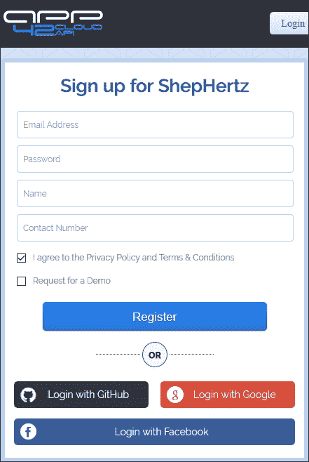
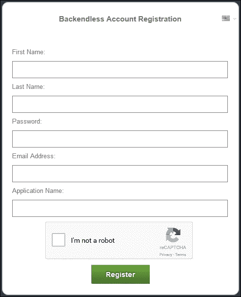
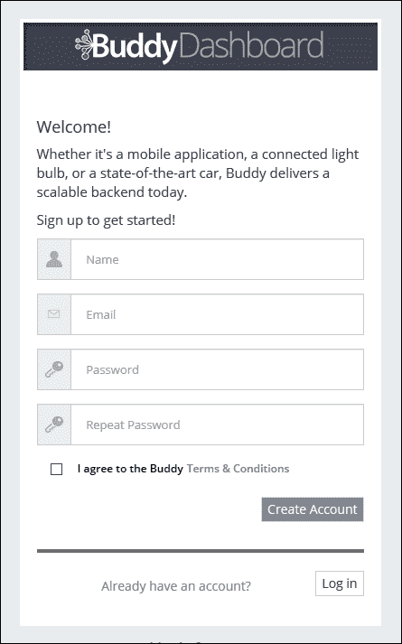
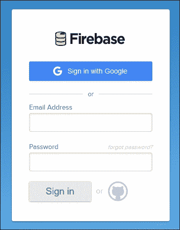
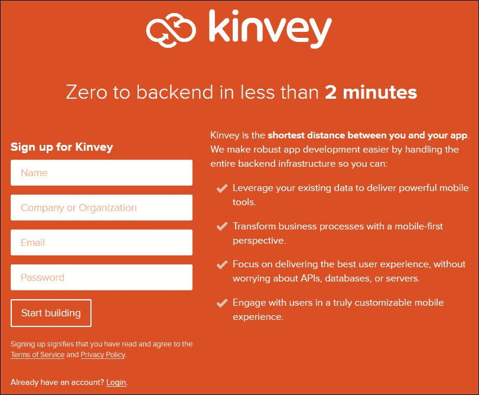

# 第十五章：后端即服务选项

在本章中，我们将涵盖以下主题：

+   App42

+   Backendless

+   Buddy

+   Firebase

+   Kinvey

# 简介

当您的应用程序和用户基础增长时，您可能希望将应用程序跨设备甚至用户连接起来，例如高分排行榜。您有两个选择：

+   创建和维护您自己的服务器

+   使用**后端即服务**（**BaaS**）提供商

作为移动开发者，创建和维护一个网站服务器是一个耗时的任务，可能会让您偏离开发工作。

### 备注

如果您不熟悉 BaaS 提供商，以下是一些背景信息：

维基百科——移动后端即服务：

[`en.wikipedia.org/wiki/Mobile_backend_as_a_service`](https://en.wikipedia.org/wiki/Mobile_backend_as_a_service)

我们将研究几个针对 Android 开发者的特定功能的 BaaS 提供商。仅包括提供原生 Android 支持和免费订阅的提供商。（仅提供免费试用或付费计划的提供商不包括在内。）当您的应用程序超出免费层级时，所有这些提供商都提供更高层级的服务，月费用各不相同。

下表提供了每个提供商每月免费服务的快速比较：

| 提供商 | 月用户数 | API 调用 | 推送通知 | 文件存储 |
| --- | --- | --- | --- | --- |
| Firebase | 无限制 | 100 SC | N/A | 1 GB |
| Buddy | * | 20/秒 | 500 万 | 10 GB |
| App42 | * | 每月 100 万 | 100 万 | 1 GB |
| Kinvey | 1000 | * | * | 30 GB |
| Backendless | 100 | 50/秒 | 100 万 | 20 GB |

> * = 他们的网站上没有发布
> 
> N/A = 功能不可用
> 
> SC = 同时连接数

### 备注

**免责声明**：前述表格和以下食谱的信息是从它们的公共网站获取的，可能会在它们的意愿下进行更改。如您所知，移动行业一直在变化；预计价格和服务会有所变动。请仅将此信息作为起点。

最后，这并不是一个详尽的 BaaS 提供商列表。希望这一章能提供一个关于 BaaS 能做什么以及如何为您的应用程序使用 BaaS 的好介绍。接下来的食谱将研究每个提供商，并带您了解将它们的库添加到您的项目的步骤。这将直接比较这些服务。正如您将看到的，一些服务比其他服务更容易使用，这可能是决定性因素。

# App42

App42 是 ShepHertz 公司的 BaaS API 产品，提供包括游戏平台、平台即服务、营销分析在内的多种云服务。它们具有非常丰富的功能集，包括许多特别适用于游戏的服务。

App42 Android SDK 支持以下功能：

+   用户服务

+   存储服务

+   自定义代码服务

+   推送通知服务

+   事件服务

+   礼品管理服务

+   定时服务

+   社交服务

+   A/B 测试服务

+   Buddy 服务

+   头像服务

+   成就服务

+   排行榜服务

+   奖励服务

+   上传服务

+   图库服务

+   地理服务

+   会话服务

+   评论服务

+   购物车服务

+   目录服务

+   消息服务

+   推荐服务

+   邮件服务

+   日志服务

### 注意

要注册 App42/ShepHertz，请访问以下链接：

[`apphq.shephertz.com/register`](https://apphq.shephertz.com/register)

这是 App4 注册屏幕的截图：



## 准备就绪

在 Android Studio 中创建一个名为 `App42` 的新项目。使用默认的 **Phone & Tablet** 选项，在选择 **Activity Type** 时选择 **Empty Activity**。

从以下链接下载并解压 App42 SDK：

[`github.com/shephertz/App42_ANDROID_SDK/archive/master.zip`](https://github.com/shephertz/App42_ANDROID_SDK/archive/master.zip)

创建 App42 账户后（见前一个链接），登录到 AppHQ 管理控制台，并注册你的应用。你需要 ApiKey 和 SecretKey。

## 如何操作...

要向你的项目添加对 App42 的支持，首先打开 Android Manifest 文件，并按照以下步骤操作：

1.  添加以下权限：

    ```kt
    <uses-permission android:name="android.permission.INTERNET"/>
    <uses-permission android:name="android.permission.ACCESS_NETWORK_STATE" />
    ```

1.  在你的文件浏览器中打开以下文件夹：`<project folder>\App42\app\libs`（如果 `libs` 文件夹不存在，请创建它），并将 `App42_ANDROID-CAMPAIGN_x.x.jar` 文件复制到 `app\libs` 文件夹。

1.  打开 app 模块的 Gradle 构建文件：`build.gradle (Module: app)`，并在 `dependencies` 部分添加以下内容：

    ```kt
    compile files('libs/App42_ANDROID-CAMPAIGN_x.x.jar')
    ```

1.  打开 `ActivityMain.java` 并添加以下导入：

    ```kt
    import com.shephertz.app42.paas.sdk.android.App42API;
    ```

1.  在 `onCreate()` 回调中添加以下代码：

    ```kt
    App42API.initialize(this, "YOUR_API_KEY", "YOUR_SECRET_KEY");
    ```

1.  你已经准备好在设备或模拟器上运行应用程序。

## 工作原理...

不幸的是，App42 不支持 Gradle 构建格式，因此你需要下载 JAR 文件并将其手动复制到 `\libs` 文件夹。

在第 3 步中，将 `App42_ANDROID-CAMPAIGN_x.x.jar` 中的 `x.x` 替换为你下载文件中的当前版本号。

在第 5 步中，用你注册 App42 应用时收到的凭证替换 `YOUR_API_KEY` 和 `YOUR_SECRET_KEY`。

## 还有更多...

下面是使用 App42 API 注册用户的示例：

```kt
UserService userService = App42API.buildUserService();
userService.createUser("userName", "password", "email", new App42CallBack() {
    public void onSuccess(Object response) {
        User user = (User)response;
        Log.i("UserService","userName is " + user.getUserName());
        Log.i("UserService", "emailId is " + user.getEmail());
    }
    public void onException(Exception ex) {
        System.out.println("Exception Message"+ex.getMessage());
    }
});
```

## 另请参阅

+   有关更多信息，请参考 App42 网页 [`api.shephertz.com/`](http://api.shephertz.com/)

# Backendless

除了**MBaaS**（即他们所说的**移动后端即服务**），Backendless 还提供其他服务，如托管、API 服务和市场。它们的 MBaaS 功能包括：

+   用户管理

+   数据持久化

+   地理定位

+   媒体流

+   发布/订阅消息传递

+   推送通知

+   自定义业务逻辑

+   分析

+   移动代码生成

### 注意

要注册 Backendless，请点击此链接：

[`develop.backendless.com/#registration`](https://develop.backendless.com/#registration)

这是 Backendless 注册窗口的截图：



## 准备就绪

在 Android Studio 中创建一个新项目，命名为`Backendless`。使用默认的**Phone & Tablet**选项，并在提示**Activity Type**时选择**Empty Activity**。

你需要一个**Backendless**账户（见前一个链接），并通过他们的**Backendless**控制台注册你的应用程序。获取到你的 App ID 和 Secret Key 后，开始以下步骤。

## 如何操作...

要将`Backendless`添加到你的项目中，打开 Android Manifest 并按照以下步骤操作：

1.  添加以下权限：

    ```kt
    <uses-permission android:name="android.permission.INTERNET"/>
    <uses-permission android:name="android.permission.ACCESS_NETWORK_STATE" />
    ```

1.  打开 app 模块的 Gradle 构建文件：`build.gradle (Module: app)`，并在`dependencies`部分添加以下内容：

    ```kt
    compile 'com.backendless:android:3.0.3'
    ```

1.  打开`ActivityMain.java`并添加以下导入：

    ```kt
    import com.backendless.Backendless;
    ```

1.  在`onCreate()`回调中添加以下代码：

    ```kt
    String appVersion = "v1";
    Backendless.initApp(this, YOUR_APP_ID, YOUR_SECRET_KEY, appVersion);
    ```

1.  你准备好在设备或模拟器上运行应用程序。

## 工作原理...

在步骤 4 中，将`YOUR_APP_ID`和`YOUR_SECRET_KEY`替换为你从**Backendless**控制台收到的凭证。

如果你更愿意直接下载 SDK 而不是使用 Maven 依赖，请在这里下载：[`backendless.com/sdk/java/3.0.0/backendless-sdk-android.zip`](https://backendless.com/sdk/java/3.0.0/backendless-sdk-android.zip)。

## 还有更多...

下面是使用`BackendlessUser`对象注册用户的示例：

```kt
BackendlessUser user = new BackendlessUser();
user.setEmail("<user@email>");
user.setPassword("<password>");
Backendless.UserService.register(user, new BackendlessCallback<BackendlessUser>() {
    @Override
    public void handleResponse(BackendlessUser backendlessUser) {
        Log.d("Registration", backendlessUser.getEmail() + " successfully registered");
    }
} );
```

## 另请参阅

+   有关更多信息，请参考 Backendless 网页：[`backendless.com/`](https://backendless.com/)

# Buddy

Buddy 与其他 BaaS 提供商略有不同，因为他们主要专注于连接设备和传感器。为了帮助维护隐私法规，Buddy 允许你选择将数据托管在美国或欧盟。

Buddy 支持以下常见场景：

+   记录度量事件

+   发送推送通知

+   接收并安全存储遥测数据

+   存储和管理二进制文件

+   深入了解客户如何使用应用程序的移动分析

+   将设备或应用程序数据与公司的 BI 系统整合

+   在你选择的地理位置的沙盒私有数据。

如果你想要查看或贡献 Buddy SDK 的源代码，可以使用以下 Git 命令获取：

```kt
git clone https://github.com/BuddyPlatform/Buddy-Android-SDK.git
```

### 注意

要注册 Buddy，请点击以下链接：

[`www.buddyplatform.com/Signup`](https://www.buddyplatform.com/Signup)

这是 Buddy 注册的截图：



## 准备就绪

在 Android Studio 中创建一个新项目，命名为`Buddy`。使用默认的**Phone & Tablet**选项，并在提示**Activity Type**时选择**Empty Activity**。

你需要一个 Buddy 账户（见前一个链接），并通过他们的仪表板注册你的应用程序。获取到你的 App ID 和 App Key 后，开始以下步骤。

## 如何操作...

要将 Buddy 添加到你的项目中，打开 Android Manifest 并按照以下步骤操作：

1.  添加以下权限：

    ```kt
    <uses-permission android:name="android.permission.INTERNET"/>
    <uses-permission android:name="android.permission.ACCESS_NETWORK_STATE" />
    ```

1.  打开 app 模块的 Gradle 构建文件：`build.gradle (Module: app)`，并在`dependencies`部分添加以下内容：

    ```kt
    compile 'com.buddy:androidsdk:+'
    ```

1.  打开`ActivityMain.java`并添加以下导入：

    ```kt
    import com.buddy.sdk.Buddy;
    ```

1.  在`onCreate()`回调中添加以下代码：

    ```kt
    Buddy.init(myContext, "appId", "appKey");
    ```

1.  你已经准备好在设备或模拟器上运行应用程序。

## 工作原理...

在第 4 步中，将`appId`和`appKey`替换为你在 Buddy 仪表盘中收到的凭据。

与其他大多数 BaaS 提供商类似，我们只需在 Gradle 构建中添加对 Maven 仓库的引用。然后，我们添加一个导入并开始调用 Buddy API。

## 还有更多...

下面是使用 Buddy 注册用户的示例：

```kt
Buddy.createUser("someUser", "somePassword", null, null, null, null, null, null, new BuddyCallback<User>(User.class) {
    @Override
    public void completed(BuddyResult<User> result) {
        if (result.getIsSuccess()) {
            Log.w(APP_LOG, "User created: " + result.getResult().userName);
        }
    }
});
```

## 另请参阅

+   有关更多信息，请参考 Buddy 网页：[`buddy.com/`](https://buddy.com/)

# Firebase

Firebase 是一个主要关注数据库功能的 BaaS 提供商。虽然它们的功能不如其他大多数 BaaS 提供商全面，但它们确实擅长数据库。它们是此列表中唯一具有自动同步数据库功能的提供商。

Firebase 服务包括：

+   Firebase 实时数据库

+   Firebase 认证

+   Firebase 托管

+   用户认证——电子邮件和密码、Facebook、Twitter、GitHub 和 Google

由于它们最近被谷歌收购，你可以期待与谷歌云解决方案的进一步整合，正如你在这个链接上看到的：

[`cloud.google.com/solutions/mobile/firebase-app-engine-android-studio`](https://cloud.google.com/solutions/mobile/firebase-app-engine-android-studio)

### 注意

要使用 Firebase 注册，请访问此链接：

[`www.firebase.com/login/`](https://www.firebase.com/login/)

这是 Firebase 注册窗口的截图：



## 准备就绪

在 Android Studio 中创建一个新项目，并将其命名为`Firebase`。使用默认的**Phone & Tablet**选项，在选择**Activity Type**时选择**Empty Activity**。

你需要在你用 Firebase 注册应用程序时提供的 Firebase URL。

## 如何操作...

要将 Firebase 添加到你的项目中，首先打开 Android Manifest 并按照以下步骤操作：

1.  添加以下权限：

    ```kt
    <uses-permission android:name="android.permission.INTERNET"/>
    ```

1.  打开 app 模块的 Gradle 构建文件：`build.gradle (Module: app)`，并在`dependencies`部分添加以下内容：

    ```kt
    compile 'com.firebase:firebase-client-android:2.5.0+'
    ```

1.  打开`ActivityMain.java`并添加以下导入：

    ```kt
    import com.firebase.client.Firebase;
    ```

1.  在`onCreate()`回调中添加以下代码：

    ```kt
    Firebase.setAndroidContext(this);
    Firebase firebase = new Firebase("https://<YOUR-FIREBASE-APP>.firebaseio.com/");
    ```

1.  你已经准备好在设备或模拟器上运行应用程序。

## 工作原理...

将 Firebase 添加到你的应用程序中相当简单。将`<YOUR-FIREBASE-APP>`占位符替换为你在注册应用程序时 Firebase 提供的链接。

## 还有更多...

下面是使用 Firebase 注册用户的示例：

```kt
firebase.createUser("bobtony@firebase.com", "correcthorsebatterystaple", new Firebase.ValueResultHandler<Map<String, Object>>() {
    @Override
    public void onSuccess(Map<String, Object> result) {
        Log.i("Firebase", "Successfully created user account with uid: " + result.get("uid"));
    }
    @Override
    public void onError(FirebaseError firebaseError) {
        // there was an error
    }
});
```

## 另请参阅

+   有关更多信息，请参考 Firebase 网页：[`www.firebase.com/`](https://www.firebase.com/)

# Kinvey

Kinvey 是最早开始提供移动后端服务的提供商之一。他们的功能包括：

+   用户管理

+   数据存储

+   文件存储

+   推送通知

+   社交网络集成

+   位置服务

+   生命周期管理

+   版本控制

    ### 注意

    在[`console.kinvey.com/sign-up`](https://console.kinvey.com/sign-up)注册 Kinvey。

这是 Kinvey 注册窗口的截图：



## 准备工作

在 Android Studio 中创建一个新项目，并将其命名为`Kinvey`。使用默认的**手机和平板**选项，并在提示**活动类型**时选择**空活动**。

从以下链接下载并解压 Kinvey SDK：[download.kinvey.com/Android/kinvey-android-2.10.5.zip](http://download.kinvey.com/Android/kinvey-android-2.10.5.zip)

你需要一个 Kinvey 账户（见前一个链接），并通过他们的开发者控制台注册你的应用程序。一旦你有 App Key 和 App Secret，就可以开始以下步骤。

## 如何操作...

要将 Kinvey 添加到你的项目中，请按照以下步骤操作：

1.  在 Android Manifest 中添加以下权限：

    ```kt
    <uses-permission android:name="android.permission.INTERNET"/>
    ```

1.  在你的文件浏览器中打开以下文件夹：`<项目文件夹>\Kinvey\app\libs`（如果`libs`文件夹不存在，请创建它），并将 SDK 的`lib`和`libJar`文件夹中的所有文件复制到`app\libs`文件夹中。

1.  打开 app 模块的 Gradle 构建文件：`build.gradle (Module: app)`，并添加以下`repositories`和`dependencies`（保留任何现有的条目）：

    ```kt
    repositories {
        flatDir {
            dirs 'libs'
        }
    }

    dependencies {
        compile fileTree(dir: 'libs', include: ['*.jar'])
        compile(name:'kinvey-android-*', ext:'aar')
    }
    ```

1.  打开`MainActivity.java`并添加以下导入：

    ```kt
    import com.kinvey.android.Client;
    ```

1.  在类声明中添加以下内容：

    ```kt
    final Client mKinveyClient = new mKinveyClient("your_app_key", "your_app_secret", this.getApplicationContext()).build();
    ```

1.  你现在可以在设备或模拟器上运行应用程序了。

## 工作原理...

Kinvey 不是最容易设置的 BaaS，因为它不提供简单的 Gradle 依赖项。相反，你需要像在第 2 步中那样，直接将他们的库添加到项目库中。

这些步骤将设置好 Kinvey 客户端，并准备开始向你的应用程序添加额外的功能。只需确保在 Kinvey 客户端构建器中用你的应用程序凭据替换占位符。

## 还有更多...

要验证你的设置是否正确，请在`onCreate()`方法中或在按钮点击时调用以下代码：

```kt
mKinveyClient.ping(new KinveyPingCallback() {
    public void onFailure(Throwable t) {
        Log.d("KinveyPingCallback", "Kinvey Ping Failed", t);
    }

    public void onSuccess(Boolean b) {
        Log.d("KinveyPingCallback", "Kinvey Ping Success");
    }
});
```

## 另请参阅

+   有关更多信息，请访问 Kinvey 的网页：[`www.kinvey.com/`](http://www.kinvey.com/)
