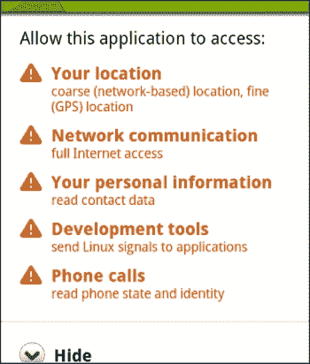
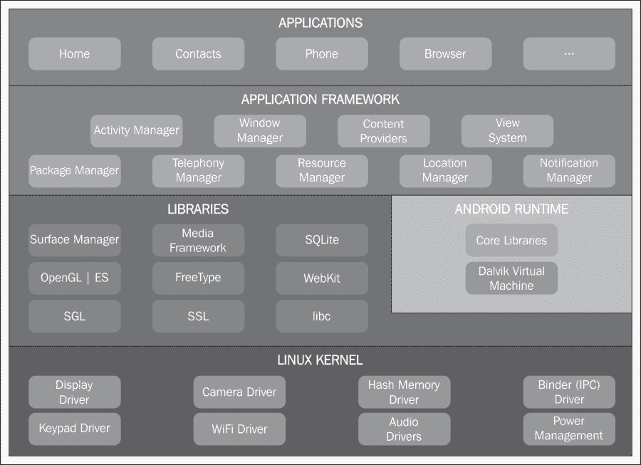
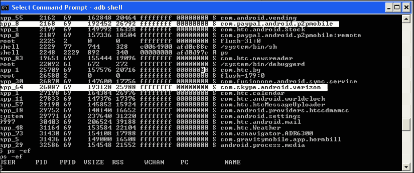
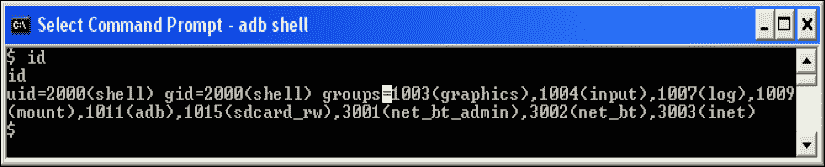
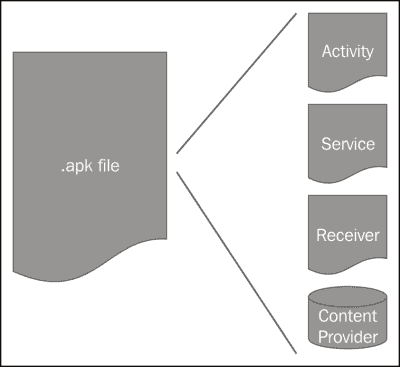
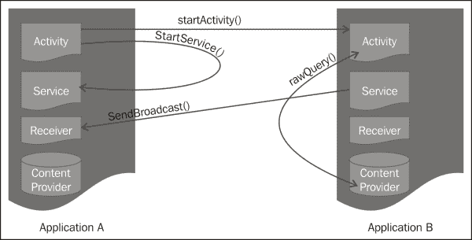

# 第一章：安卓安全模型 – 大局观

欢迎阅读《安卓应用安全基础》的第一章！

安卓系统在许多方面与众不同。它是开放的，比其他一些平台更先进，并汲取了之前开发移动平台的经验教训。在本章中，我们将从内核到应用层，介绍安卓安全模型的基础知识。本章中引入的每个安全工件事后都会在后续章节中进行更详细的讨论。

我们从解释为什么安装时应用程序权限评估对安卓平台和用户数据的安全至关重要开始本章。安卓具有分层架构，本章将讨论每个架构层的安全评估。我们以讨论核心安全工件事物作为本章的结束，如应用程序签名、设备上的安全数据存储、加密 API 以及安卓设备的管理等。

# 谨慎安装

安卓与其他移动操作系统不同的一个特点是应用安装时的权限审查。应用程序所需的所有权限都必须在其清单文件中声明。这些权限是应用程序正常运行所需的权限，例如访问用户的联系人列表、从手机发送短信、拨打电话以及访问互联网等。详细描述这些权限的内容请参考第三章，*权限*。

当用户安装应用程序时，清单文件中声明的所有权限都会呈现给用户。用户可以审查这些权限，并做出是否安装应用的明智决定。用户应仔细审查这些权限，因为这是唯一一次要求用户授权。这一步骤之后，用户对应用程序的控制就极为有限，最多只能卸载应用。有关参考，请查看以下屏幕截图。在这个例子中，应用程序将追踪或访问用户位置，使用网络，读取用户联系人列表，读取手机状态，并使用某些开发能力。在安全审查此应用程序时，用户必须评估授予该应用程序某些权限是否必要。如果这是一个游戏应用，可能不需要开发工具能力。如果这是一个面向儿童的教育应用，它不应该需要访问联系人列表或用户位置。还要注意，开发者可以添加自己的权限，特别是如果他们想要与可能在设备上安装的其他自己开发的应用程序进行通信时。开发者有责任为这类权限提供清晰的描述。

在安装时，框架会确保应用程序中使用的所有权限都在清单文件中声明。操作系统在运行时会强制执行这些权限。

# Android 平台架构

Android 是一个具有分层软件堆栈的现代操作系统。下图说明了 Android 软件堆栈中的层。此软件堆栈运行在设备硬件之上。Android 的软件堆栈可以运行在许多不同的硬件配置上，如智能手机、平板电脑、电视，甚至嵌入式设备如微波炉、冰箱、手表和笔。每一层都提供了安全性，为移动应用程序提供了一个安全运行和执行的环境。在本节中，我们将讨论 Android 堆栈每一层提供的安全保障。

## Linux 内核

设备硬件之上是**Linux 内核**。Linux 内核已经被用作一个安全的多用户操作系统数十年，将一个用户与另一个用户隔离开来。Android 使用 Linux 的此属性作为 Android 安全的基础。将 Android 想象成一个多用户平台，每个用户都是一个应用程序，每个应用程序都与其他应用程序隔离。Linux 内核托管设备驱动程序，如蓝牙、摄像头、Wi-Fi 和闪存驱动程序。内核还提供了一种安全的**远程过程调用**（**RPC**）机制。

每个应用程序在设备上安装时，都会被赋予唯一的**用户识别码**（**UID**）和**组识别码**（**GID**）。只要应用程序在设备上安装，这个 UID 就是应用程序的身份标识。

请参考以下屏幕截图。第一列列出了所有应用程序的 UID。请注意突出的应用程序。应用程序`com.paypal.com`具有 UID `app_8`，而`com.skype.com`具有 UID `app_64`。在 Linux 内核中，这两个应用程序都以其自己的进程运行，并使用这个 ID。

请参考下一张屏幕截图。当我们在壳层中输入`id`命令时，内核会显示 UID、GID 以及与壳层关联的组。这是 Android 用来将一个进程与另一个进程隔离的进程沙箱模型。两个进程可以相互共享数据。如何正确进行数据共享的机制将在第四章，*定义应用程序的策略文件*中进行讨论。

尽管大多数 Android 应用程序是用 Java 编写的，但有时需要编写本地应用程序。本地应用程序更为复杂，因为开发者需要管理内存和特定于设备的问题。开发者可以使用 Android NDK 工具集来用 C/C++开发应用程序的部分。所有本地应用程序都符合 Linux 进程沙箱化；本地应用程序和 Java 应用程序的安全性没有区别。请记住，与任何 Java 应用程序一样，需要适当的加密、散列和安全的通信等安全构件。

## 中间件

在 Linux 内核之上是提供代码执行库的中间件。这类库的例子有`libSSL`、`libc`、`OpenGL`。这一层还提供了 Java 应用程序的运行时环境。

由于大多数用户在 Android 上用 Java 编写应用程序，一个显而易见的问题是：Android 是否提供了一个**Java 虚拟机**？这个问题的答案是：不，Android 没有提供 Java 虚拟机。因此，**Java 归档文件**（**JAR**）在 Android 上无法执行，因为 Android 不执行字节码。Android 提供的是**Dalvik 虚拟机**。Android 使用一个名为`dx`的工具将字节码转换为**Dalvik 可执行文件**（**DEX**）。

### Dalvik 虚拟机

Dalvik 虚拟机最初由 Dan Bornstein 开发，他以冰岛的一个渔村 Dalvik 命名，那里住着他的部分祖先。Dalvik 是一个基于寄存器、高度优化、开源的虚拟机。它与 Java SE 或 Java ME 并不一致，其库基于**Apache Harmony**。

每个 Java 应用程序都在其自己的虚拟机中运行。当设备启动时，一个名为**Zygote**的原始进程会生成一个虚拟机进程。这个 Zygote 进程随后根据请求分叉以创建新的虚拟机进程。

Dalvik 背后的主要动机是通过增加共享来减少内存占用。因此，Dalvik 中的常量池是一个共享池。它还在不同的虚拟机进程之间共享核心的只读库。

Dalvik 依赖 Linux 平台提供所有底层功能，如线程和内存管理。Dalvik 为每个虚拟机设置了独立的垃圾收集器，但会处理共享资源的进程。

Dan Bornstein 在 2008 年的 Google IO 上关于 Dalvik 做了精彩的演讲。你可以在[`www.youtube.com/watch?v=ptjedOZEXPM`](http://www.youtube.com/watch?v=ptjedOZEXPM)找到它。去看看吧！

## 应用层

开发基于 Java 的应用程序的应用程序开发者与 Android 堆栈的应用层交互。除非你正在创建一个本地应用程序，否则这一层将为你提供创建应用程序所需的所有资源。

我们可以将应用层进一步划分为应用框架层和应用层。应用框架层提供了由 Android 堆栈公开供应用程序使用的类。例如，活动管理器管理活动的生命周期，包管理器管理应用程序的安装和卸载，通知管理器向用户发送通知。

应用层是应用程序所在的层次。这些可以是系统应用程序或用户应用程序。系统应用程序是设备预装的应用程序，如邮件、日历、联系人和浏览器。用户无法卸载这些应用程序。用户应用程序是用户在设备上安装的第三方应用程序。用户可以根据自己的意愿自由安装和卸载这些应用程序。

### Android 应用程序结构

要理解应用层的安全性，重要的是要了解 Android 应用程序的结构。每个 Android 应用程序都被创建为一堆组件的栈。这种应用程序结构的美妙之处在于，每个组件都是自包含的实体，甚至可以被其他应用程序独立调用。这种应用程序结构鼓励组件共享。下图展示了 Android 应用程序的组成，包括活动、服务、广播接收器和内容提供者：

Android 支持四种类型的组件：

+   **活动**：这个组件通常是应用程序的用户界面部分。这是与用户交互的组件。活动组件的一个例子是登录页面，用户在该页面输入用户名和密码以对服务器进行身份验证。

+   **服务**：这个组件负责在后台运行的过程。服务组件没有 UI。一个例子是，一个与音乐播放器同步并在用户预先选择的情况下播放歌曲的组件。

+   **广播接收器**：这个组件是接收来自 Android 系统或其他应用程序消息的邮箱。例如，Android 系统在启动后会触发一个名为`BOOT_COMPLETED`的 Intent。应用程序组件可以在清单文件中注册，以便监听此广播。

+   **内容提供者**：这个组件是应用程序的数据存储。应用程序还可以将此数据与其他 Android 系统的组件共享。内容提供者组件的一个示例用例是，一个应用程序存储了用户为购物保存的物品列表。

所有上述组件都在`AndroidManifest.xml`（清单）文件中声明。除了组件，清单文件还列出了应用的其他需求，如 Android 所需的最低 API 级别，应用所需的用户权限，例如访问互联网和读取联系人列表，应用使用硬件的权限，如蓝牙和相机，以及应用链接到的库，如 Google Maps API。第四章，*定义应用的策略文件*，将更详细地讨论清单文件。

活动、服务、内容提供者和广播接收器都通过意图（Intents）相互通信。意图是 Android 的异步**进程间通信**（**IPC**）机制。组件通过发射意图来执行一个动作，接收组件根据意图采取行动。有单独的机制用于将意图传递给每种类型的组件，因此活动意图只传递给活动，广播意图只传递给广播接收器。意图还包括一个名为`Intent`对象的信息包，接收组件使用它来采取适当的行动。重要的是要了解意图并不安全。任何监听应用都可以嗅探意图，因此不要在其中放置任何敏感信息！并且想象一下，如果意图不仅被嗅探，还被恶意应用篡改的场景。

例如，下图展示了两个应用，**应用 A**和**应用 B**，它们各自有一组组件。只要它们有权限，这些组件就可以相互通信。**应用 A**中的**活动**组件可以使用`startActivity()`启动**应用 B**中的**活动**组件，也可以使用`startService()`启动自己的**服务**。

在应用级别，Android 组件遵循基于权限的模型。这意味着组件必须拥有适当的权限才能调用其他组件。尽管 Android 提供了应用可能需要的绝大多数权限，但开发者仍有能力扩展此模型。但这种情形应很少使用。

额外的资源，如位图、UI 布局、字符串等，在另一个不同的目录中独立维护。为了提供最佳的用户体验，这些资源应当针对不同的地区进行本地化处理，并针对不同的设备配置进行定制。

接下来的三章将详细讨论应用结构、清单文件和权限模型。

# 应用签名

Android 的一个区别因素是 Android 应用程序的签名方式。Android 中的所有应用程序都是自签名的。不需要使用证书颁发机构对应用程序进行签名。这与传统的应用程序签名不同，后者通过签名识别作者，并基于签名建立信任。

应用程序的签名将应用程序与作者关联起来。如果用户安装了同一作者编写的多个应用程序，且这些应用程序想要共享彼此的数据，它们需要具有相同的签名，并且在清单文件中设置了`SHARED_ID`标志。

应用程序签名在应用程序升级时也会被使用。应用程序升级要求两个应用程序具有相同的签名，且没有权限提升。这是 Android 中确保应用程序安全的另一机制。

作为应用程序开发者，保持用于签名应用程序的私钥安全是非常重要的。作为应用程序作者，你的声誉取决于它。

# 设备上的数据存储

Android 提供了不同的解决方案，用于设备上的安全数据存储。基于数据类型和应用程序用例，开发者可以选择最适合的解决方案。

对于需要在用户会话之间持久化的基本数据类型，如整数（ints）、布尔值（booleans）、长整数（longs）、浮点数（floats）和字符串（strings），最好使用共享数据类型。共享偏好设置中的数据以键值对的形式存储，允许开发者`保存`、`检索`和`持久化`数据。

所有应用程序数据都与应用程序一起存储在沙盒中。这意味着这些数据只能由该应用程序或具有相同签名且被授权共享数据的其他应用程序访问。最好将私有数据文件存储在此内存中。这些文件将在应用程序被卸载时被删除。

对于大型数据集，开发者可以选择使用 Android 软件堆中捆绑的 SQLite 数据库。

所有 Android 设备允许用户挂载外部存储设备，如 SD 卡。开发者可以编写应用程序，以便将这些大文件存储在这些外部设备上。这些外部存储设备大多数采用 VFAT 文件系统，Linux 访问控制在这里不起作用。敏感数据在存储在这些外部设备上之前应进行加密。

从 Android 2.2（API 8）开始，APK 可以存储在外部设备上。使用随机生成的密钥，APK 被存储在一个名为`asec`文件的加密容器中。这个密钥存储在设备上。Android 上的外部设备是以`noexec`方式挂载的。所有的 DEX 文件、私有数据和本地共享库仍然存放在内部存储中。

在任何可以连接网络的地方，开发者可以将数据存储在自己的网络服务器上。建议将可能泄露用户隐私的数据存储在自家服务器上。例如，银行应用程序应将用户账户信息和交易细节存储在服务器上，而不是用户设备上。

第七章，*保护应用程序数据*，详细讨论了 Android 设备上的数据存储选项。

如视频、电子书和音乐等权利受保护的内容，可以使用 DRM 框架 API 在 Android 上得到保护。应用程序开发者可以使用此 DRM 框架 API 将设备注册到 DRM 方案，获取与内容相关的许可证，提取约束，并将相关内容与其许可证关联。

# 加密 API

Android 拥有一套全面的加密 API 套件，应用开发者可以使用它来保护数据，无论是在静止状态还是在传输过程中。

Android 提供了用于数据对称和不对称加密、随机数生成、散列、消息认证码和不同密码模式的 API。支持的算法包括 DH、DES、三重 DES、RC2 和 RC5。

安全通信协议如 SSL 和 TLS，结合加密 API，可用于保护传输中的数据。还提供了包括 X.509 证书管理的密钥管理 API。

自 Android 1.6 以来，系统密钥存储已被用于 VPN。Android 4.0 引入了一个名为`KeyChain`的新 API，允许应用程序访问存储在那里的凭据。此 API 还支持从 X.509 证书和 PKCS#12 密钥存储中安装凭据。一旦应用程序被授予访问证书的权限，它就可以访问与证书关联的私钥。

加密 API 在第六章，*你的工具 – 加密 API*中进行了详细讨论。

# 设备管理

随着移动设备在工作场所的普及，Android 2.2 引入了**设备管理 API**，允许用户和 IT 专业人士管理访问企业数据的设备。使用此 API，IT 专业人士可以在设备上实施系统级安全策略，如远程擦除，密码启用及具体设置。Android 3.0 和 Android 4.0 进一步增强了此 API，增加了密码过期、密码限制、设备加密要求和禁用摄像头等策略。如果你有邮件客户端并在 Android 手机上用它来访问公司邮件，那么你很可能正在使用设备管理 API。

设备管理 API 通过强制执行安全策略来工作。`DevicePolicyManager`列出了设备管理员可以在设备上执行的所有策略。

设备管理员编写一个应用程序，用户在其设备上安装该程序。安装后，用户需要激活策略以在设备上实施安全策略。如果用户未安装该应用，则不适用安全策略，但用户也无法访问该应用提供的任何功能。如果设备上有多个设备管理应用程序，则最严格的策略优先。如果用户卸载该应用，则策略会被停用。在卸载时，根据其拥有的权限，应用程序可能会决定将手机重置为出厂设置或删除数据。

我们将在第八章，*企业中的 Android*中更详细地讨论设备管理。

# 总结

安卓是一个现代操作系统，安全性已经内置于平台中。正如我们在本章中学到的，具有进程隔离特性的 Linux 内核构成了安卓安全模型的基础。每个应用程序及其应用数据都与其它进程隔离。在应用程序层面，组件通过意图相互交流，并且需要具备适当的权限才能调用其他组件。这些权限在久经考验的安全多用户操作系统 Linux 内核中得到执行。开发者拥有一套全面的加密 API，用以保护用户数据。

有了对安卓平台的基本了解，让我们迈向下一章，从安全角度理解应用程序组件和组件间通信。祝您好运！
