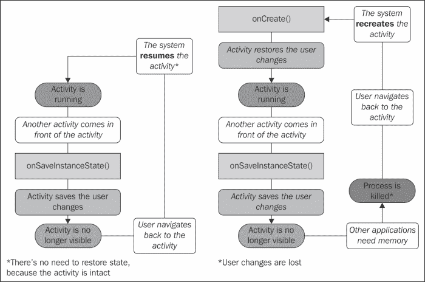
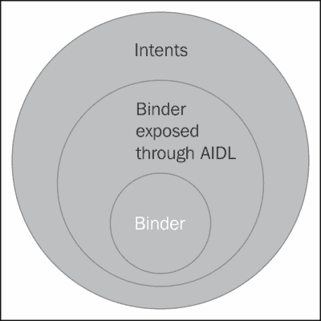
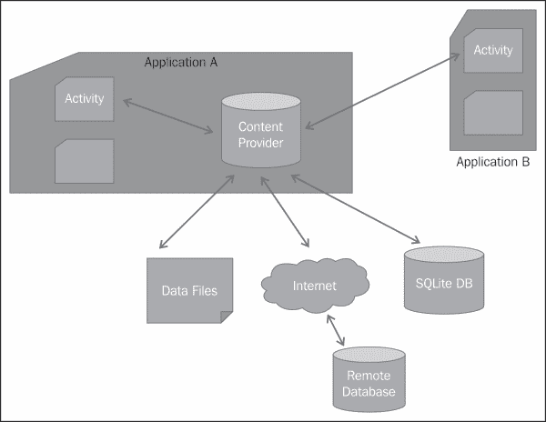
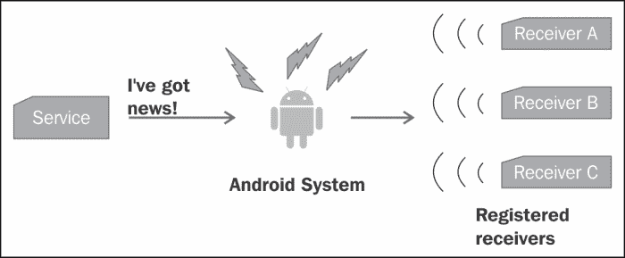
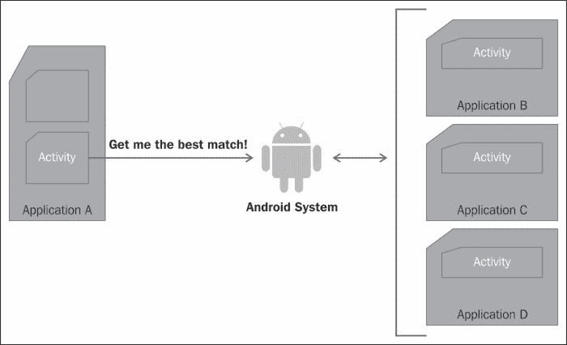

# 第二章：应用程序构建块

本章节关注 Android 应用程序的构建块，即应用程序组件和组件间通信。Android 系统中有四种类型的组件：活动（Activities）、服务（Services）、广播接收器（Broadcast Receivers）和内容提供器（Content Providers）。每个组件都特别设计用来完成一个特定任务。这些组件的集合构成了一个 Android 应用程序。这些组件通过 Intents 进行相互通信，Intents 是 Android 的跨进程通信机制。

有几本书讨论了如何构建 Android 组件和 Intents。实际上，Android 开发者网站在介绍使用这些组件进行编程方面也做得相当不错。因此，在本章中，我们不是要涵盖实施细节，而是要讨论每个组件的安全方面，以及如何在应用程序中定义和使用组件及 Intents，以保护我们作为开发者的声誉和消费者的隐私。

本章节的重点是组件和 Intents。对于每个 Android 组件，我们将涵盖组件声明、与组件相关的权限以及特定于该组件的其他安全考虑。我们将讨论不同类型的 Intents 以及在不同情境下最佳 Intents 的使用。

# 应用程序组件

正如我们在第一章简要提及的，*Android 安全模型 - 大蓝图*，一个 Android 应用程序是由一系列松散绑定的应用组件组成的。应用组件、清单文件以及应用资源被打包在一个**应用包格式** `.apk` 文件中。一个**APK**文件本质上是一个采用 JAR 文件格式的 ZIP 文件。Android 系统只识别 APK 格式，因此所有要安装在 Android 设备上的包都必须是 APK 格式。APK 文件随后使用开发者的签名进行签名，以确认作者身份。`PackageManager` 类负责安装和卸载应用程序的任务。

在本节中，我们将详细讨论每个组件的安全性。这包括在清单文件中声明组件，因此我们会梳理掉松散的结尾以及其他针对每个组件的独特安全考虑。

## 活动

活动是通常与用户交互的应用程序组件。活动扩展了 `Activity` 类，并作为视图和片段实现。片段是在**Honeycomb**中引入的，以解决不同屏幕尺寸的问题。在较小的屏幕上，一个片段显示为一个单一的活动，并允许用户导航到第二个活动以显示第二个片段。片段和活动启动的线程在活动的上下文中运行。因此，如果活动被销毁，与其相关的片段和线程也将被销毁。

一个应用程序可以有多个活动。最好使用一个活动专注于单一任务，并为各个任务创建不同的活动。例如，如果我们正在创建一个让用户在网站上订购书籍的应用程序，最好创建一个用于用户登录的活动，另一个用于在数据库中搜索书籍的活动，另一个用于输入订购信息，再一个用于输入支付信息，等等。这种风格鼓励在应用程序内以及设备上安装的其他应用程序中重用活动。组件的重用有两个主要好处。首先，它有助于减少错误，因为代码重复较少。其次，它使应用程序更安全，因为不同组件之间的数据共享较少。

### 活动声明

应用程序使用的任何活动都必须在`AndroidManifest.xml`文件中声明。以下代码段显示了在清单文件中声明的登录活动和订单活动：

```kt
<activity android:label="@string/app_name" android:name=".LoginActivity">
  <intent-filter>
    <action android:name="android.intent.action.MAIN" />
    <category android:name="android.intent.category.LAUNCHER" />
  </intent-filter>
</activity>
<activity android:name=".OrderActivity" android:permission="com.example.project.ORDER_BOOK" android:exported="false"/>
```

请注意，`LoginActivity`被声明为一个公共活动，可以被系统中的任何其他活动启动。`OrderActivity`被声明为一个私有活动（没有意图过滤器的活动是一个私有活动，只能通过指定其确切的文件名来调用）。此外，可以使用`android:exported`标签指定它是否对应用程序外部可见。值为`true`使活动在应用程序外部可见，值为`false`则相反。本章稍后将讨论意图过滤器（Intent Filter）。

所有的活动都可以通过权限进行保护。在上述示例中，除了是私有的，`OrderActivity`还受到权限`com.example.project.ORDER_BOOK`的保护。任何尝试调用`OrderActivity`的组件都应该具有此自定义权限才能调用它。

通常情况下，每当启动一个活动时，它都会运行在声明它的应用程序进程中。将`android:multiprocess`属性设置为`true`可以让活动运行在一个与应用程序不同的进程中。这些进程的具体设置可以通过使用`android:process`属性来定义。如果此属性的值以冒号（`:`）开头，将为应用程序创建一个新的私有进程；如果以小写字母开头，则活动将在全局进程中运行。

`android:configChanges`标签允许应用程序处理由于列出的配置更改而重新启动活动。这样的更改包括本地化更改、插入外部键盘和 SIM 卡更改。

### 保存活动状态

系统通过**活动栈**管理所有活动（Activities）。当前与用户交互的活动在前台运行。当前活动可以启动其他活动。由于资源限制，处于后台的任何活动都可能被 Android 系统杀死。在配置更改（例如从垂直方向更改为水平方向）期间，活动也可能被重新启动。如前一部分所述，活动可以使用`android:configChanges`标签自行处理其中一些事件。不建议这样做，因为它可能导致不一致。

在重新启动之前，应该保存活动（Activity）的状态。活动的生命周期由以下方法定义：

```kt
public class Activity extends ApplicationContext {
  protected void onCreate(Bundle savedInstanceState);
  protected void onStart();
  protected void onRestart();
  protected void onResume();
  protected void onPause();
  protected void onStop();
  protected void onDestroy();
}
```

活动可以重写`onSaveInstanceState(Bundle savedInstanceState)`和`onRestoreInstanceState(Bundle savedInstanceState)`方法，以保存和恢复例如用户偏好和未保存文本的实例值。Android 开发者网站 [`www.developer.android.com`](http://www.developer.android.com) 使用以下流程图精美地说明了这个过程：



下面的代码片段展示了活动（Activity）如何存储和检索首选语言、搜索结果数量和作者名称。当活动被销毁时，用户偏好作为**Bundle**存储，它存储名称-值对。当活动重新启动时，这个 Bundle 会被传递给`onCreate`方法，该方法恢复了活动的状态。需要注意的是，这种存储方法不会在应用程序重新启动后保持。

```kt
@Override
public void onSaveInstanceState(Bundle savedInstanceState) {
  super.onSaveInstanceState(savedInstanceState);
  savedInstanceState.putInt("ResultsNum", 10);
  savedInstanceState.putString("MyLanguage", "English");
  savedInstanceState.putString("MyAuthor", "Thomas Hardy");
}

@Override
public void onRestoreInstanceState(Bundle savedInstanceState) {
  super.onRestoreInstanceState(savedInstanceState);
  int ResultsNum = savedInstanceState.getInt("ResultsNum");
  String MyLanguage = savedInstanceState.getString("MyLanguage");
  String MyAuthor = savedInstanceState.getString("MyAuthor");
}
```

### 保存用户数据

如我们之前所讨论的，活动（Activities）与用户交互，因此它们可能会收集一些用户数据。这些数据可能是应用程序私有的，也可能是与其他人共享的。这类数据的一个例子可能是用户的偏好语言或书籍类别。这种数据通常被应用程序保留以增强用户体验。它对应用程序本身有用，并且不与其他应用程序共享。

一个共享数据的例子可能是用户在浏览商店时不断添加到收藏中的书籍愿望清单。这类数据可能与其他应用程序共享，也可能不共享。

根据数据的隐私性和类型，可以采用不同的存储机制。应用程序可以决定使用`SharedPreferences`、内容提供者、内部或外部存储的文件，甚至是开发者自己的网站来存储这类数据。本章将讨论内容提供者。其他持久性数据存储机制将在第七章《保护应用程序数据》中详细讨论。

## 服务（Service）

与活动（Activities）不同，服务（Services）没有视觉界面，主要用于后台长时间运行的任务。理想情况下，即使启动它的活动（Activity）不再存在，服务也应该在后台继续运行。任务完成后，服务应该自行停止。适合使用服务执行的任务例如与数据库同步、从网络上传或下载文件、与音乐播放器交互以播放用户选择的曲目，以及应用程序可以绑定获取信息的全局服务。

保护服务的第一步是在清单文件中声明服务。接下来，识别正确服务用例并管理服务生命周期非常重要。这包括启动和停止服务，并创建工作线程以避免阻塞应用程序。在接下来的几节中，我们将逐一介绍这些方面。本章的最后一节是关于绑定器（binders），它是大多数 Android 进程间通信（IPC）的基础，并使服务能够以客户端-服务器的方式使用。

### 服务声明

应用程序计划启动的所有服务都需要在清单文件中声明。服务声明定义了一旦创建服务后，它将如何运行。清单文件中`<service>`标签的语法在以下代码段中展示：

```kt
<service android:enabled=["true" | "false"]
         android:exported=["true" | "false"]
         android:icon="drawable resource"
         android:isolatedProcess=["true" | "false"]
         android:label="string resource"
         android:name="string"
         android:permission="string"
         android:process="string" >
   . . . . .
</service>
```

根据上述声明语法，一个私有的、在全局进程中运行以将书籍存储在数据库中的应用程序服务可以如下声明：

```kt
<service
  android:name="bookService"
  android:process=":my_process"
  android:icon="@drawable/icon"
  android:label="@string/service_name" >
</service>
```

默认情况下，服务在应用程序的全局进程中运行。如果应用程序想要在不同的进程中启动服务，可以使用`android:process`属性。如果此属性的值以冒号（`:`）开头，服务将在应用程序内的新私有进程中启动。如果值以小写字母开头，将创建一个新的全局进程，该进程对 Android 系统的所有应用程序可见和可访问。在上述示例中，服务在其自己的全局进程中运行。应用程序应该有权限创建此类进程。

这个`android:enabled`属性定义了系统是否可以实例化服务。默认值为`true`。

`android:exported`属性限制了服务的暴露。值为`true`意味着此服务对应用程序外部可见。如果服务包含意图过滤器（Intent Filter），则该服务对其他应用程序可见。此属性的默认值为`true`。

要在隔离的进程中运行服务，且没有任何权限，请将`android:isolatedProcess`属性设置为`true`。在这种情况下，与服务交互的唯一方式是通过绑定到服务。此属性的默认值为`false`。

与活动一样，服务可以通过权限进行保护。这些服务在清单文件中使用`android:permission`属性声明。调用组件需要有适当的权限来调用服务，否则从调用中抛出`SecurityException`。

### 服务模式

服务可以在两个上下文中使用。第一种情况是，服务作为一个辅助服务，组件可以启动它来运行长时间运行的任务。这样的服务被称为**启动服务**。服务的第二种用例是作为向一个或多个应用程序组件提供信息的服务。在这种情况下，服务在后台运行，应用程序组件通过调用`bindService()`来绑定服务。这样的服务被称为**绑定服务**。

启动的服务可以扩展`Service`类或`IntentService`类。这两种方法的主要区别在于处理多个请求的方式。当扩展`Service`类时，应用程序需要处理多个请求，这通过`onStartCommand()`方法完成。

`IntentService()`类通过排队所有请求并一次处理一个，从而简化了操作，因此开发者无需处理线程问题。如果适用于某种用例，最好使用`IntentService`类以避免多线程错误。`IntentService`类为任务启动一个工作线程，并且请求会自动排队。任务在`onHandleIntent`中完成，就是这样！以下是`IntentService`类的一个示例：

```kt
public class MyIntentService extends IntentService {
  public MyIntentService() {
    super("MyIntentService");
  }
  @Override
  protected void onHandleIntent(Intent intent) {
    // TODO Auto-generated method stub
  }
}
```

绑定服务是客户端服务器的情况，服务作为服务器，客户端绑定到它以获取信息。这是通过使用`bindService()`方法完成的。当客户端满意时，它们使用`unbindService()`从服务中解绑自己。

绑定服务可以服务于一个应用程序的组件，也可以服务于不同应用程序的组件。仅服务于一个应用程序组件的绑定服务可以扩展`Binder`类并实现返回`IBinder`对象的`onBind()`方法。如果一个服务服务于多个应用程序，可以使用信使或**Android 接口定义语言**（**AIDL**）工具来生成服务发布的接口。使用信使更容易实现，因为它处理多线程问题。

当绑定到一个服务时，检查活动绑定到的服务身份是非常重要的。这可以通过显式指定服务名称来完成。如果服务名称不可用，客户端可以使用`ServiceConnection.onServiceConnected()`来检查它所连接的服务的身份。另一种方法是使用权限检查。

### 提示

对于启动的服务，`onBind()`方法返回 null。

### 生命周期管理

任何组件都可以通过使用`startService()`方法并传递一个 Intent 对象来启动一个服务，如下所示：

```kt
Intent intent = new Intent(this, MyService.class);
startService(intent);
```

与其他任何组件一样，启动的 Service 也可以被 Android 系统销毁，以便为用户交互的进程收集资源。在这种情况下，Service 将根据 `onStartCommand` 方法中设置的返回值重新启动。以下是一个示例：

```kt
@Override
public int onStartCommand(Intent intent, int flags, int startId) {
  handleCommand(intent);
  // Let the service run until it is explicitly stopped
  return START_STICKY;
}
```

重新启动 Service 有以下三种选项：

+   `START_NOT_STICKY`：这个选项表示除非有挂起的 Intent，否则 Android 系统不应重新启动 Service。挂起的 Intent 在本章后面会讨论。这个选项最适合可以安全地稍后重新启动并完成未完成工作的场景。

+   `START_STICKY`：这个选项表示系统应该启动 Service。如果最初的 Intent 丢失，`onStartCommand()` 方法会以 null Intent 的形式被启动。这对于即使初始 Intent 丢失，Service 也能恢复其任务的情况最为合适。例如音乐播放器，一旦被系统杀死，可以重新开始播放。

+   `START_REDELIVER_INTENT`：在这种情况下，Service 会被重新启动，并且挂起的 Intent 会重新传递给 Service 的 `onStartCommand()`。例如，通过网络下载文件。

需要特别注意的是，Service 与创建线程是不同的。当启动线程的组件被销毁时，线程会立即被杀死。而默认情况下，Service 在全局应用线程中运行，即使调用它的组件被销毁，Service 仍然保持存活。如果 Service 正在进行一些耗时操作，比如下载大文件，最好在一个单独的线程中进行，以避免阻塞应用程序。

启动的 Service 默认在应用线程中运行。任何可能阻塞的活动都应该在一个单独的线程中进行，以避免在运行应用程序时出现潜在的瓶颈。`IntentService` 类通过生成一个工作线程来处理这种情况。

两种启动服务都应该在任务完成后通过调用 `stopSelf()` 来停止自己。任何组件也可以通过使用 `stopService()` 方法来停止 Service。

当没有更多的客户端绑定到 Service 时，系统会销毁绑定的服务。

### 注意

Service 可以被启动也可以被绑定。在这种情况下，不要忘记调用 `stopSelf()` 或 `stopService()` 来停止 Service 在后台继续运行。

### 绑定器

**Binder**是大多数 Android IPC 的核心。它是一个内核驱动程序，所有对 Binder 的调用都通过内核进行。信使也是基于 Binder 的。Binder 的实现可能会令人困惑，只有当服务需要为在不同进程中运行的多应用程序提供服务，并希望自行处理多线程时，才应使用 Binder。Binder 框架集成在操作系统中，因此，如果一个进程打算使用另一个进程的服务，它需要将对象封送进基本类型。操作系统然后将它跨进程边界传递。为了使开发者的这项任务更加容易，Android 提供了 AIDL。下图说明了 Binder 是如何成为所有 Android IPC 的核心的。Binder 通过 AIDL 暴露。意图也被实现为 Binder。但这些复杂性对用户是隐藏的。随着我们向更大的同心圆移动，实现变得更加抽象。



要使用 AIDL 创建绑定服务，我们首先创建 AIDL 文件。然后，使用 Android SDK 工具，我们生成接口。这个接口包含扩展了`android.os.Binder`类并实现了`onTransact()`方法的`stub`方法。客户端接收 Binder 接口的引用，并调用其`transact()`方法。数据通过这个通道作为一个`Parcel`对象流动。`Parcel`对象是可序列化的，因此它可以有效地跨越进程边界。

### 注意事项

`Parcel`对象是为了高性能的 IPC 传输而定义的，因此它们不应用于通用目的的序列化。

如果有多个进程正在使用服务，请注意，一旦公开了 AIDL，就尽量不要更改它，因为其他应用程序可能也在使用它。如果这种更改是绝对必要的，那么至少它应该是向后兼容的。

Binder 在系统中全局唯一，对 Binder 的引用可以用作验证可信组件的共享密钥。保持 Binder 私有始终是一个好主意。任何拥有 Binder 引用的人都可以调用它，并且可以调用`transact()`方法。由服务来响应请求。例如，Zygote，这个系统服务，公开了一个任何 Activity 都可以绑定的 Binder。但是调用它的`transact()`方法并不意味着它会得到响应。

根据 `<service>` 标签的 `android:process` 属性，Binder 可以在同一进程或不同进程中运行。

Binder 通过内核安全地提供调用组件及其权限的身份。可以使用 Binder 的`getCallingPid()`和`getCallingUid()`方法来检查调用者的身份。Binder 反过来可以调用其他 Binder，在这种情况下，它们可以使用调用 Binder 的身份。要检查调用者的权限，可以使用`Context.checkCallingPermission()`。要检查调用者或 Binder 本身是否有特定权限，可以使用`Context.checkCallingOrSelfPermission()`。

## 内容提供者

安卓系统使用内容提供者（Content Providers）来存储数据，如联系人列表、日历和字典。内容提供者是安卓跨进程边界处理结构化数据的机制，也可以在应用内使用。

在大多数情况下，内容提供者的数据存储在 SQL 数据库中。标识符`_id`用作主键。与 SQL 一样，用户通过编写查询来访问数据。这些可以是`rawQuery()`或`query()`，具体取决于它们是原始 SQL 语句还是结构化查询。查询的返回类型是一个指向结果行之一的`Cursor`对象。用户可以使用辅助方法如`getCount()`、`moveToFirst()`、`isAfterLast()`和`moveToNext()`来导航多行。完成任务后，需要使用`close()`关闭`Cursor`。

提供者支持许多不同类型的数据，包括整数、长整数、浮点数、双精度数以及作为 64 KB 数组实现的 BLOB（二进制大对象）。提供者还可以返回标准或 MIME 类型。标准 MIME 类型的一个例子是`text/html`。对于自定义 MIME 类型，值总是`vnd.android.cursor.dir`和`vnd.android.cursor.item`，分别用于多行和单行。

下图展示了一个可以抽象数据库、文件甚至远程服务器的内容提供者。应用程序的其他组件可以访问它，其他应用组件也可以访问，前提是它们具有适当的权限。



以下各节将讨论正确声明提供者、定义适当的权限以及避免常见的安全陷阱，这些都是安全访问提供者数据所必需的。

### 提供者声明

应用程序想要使用的任何提供者都必须在清单文件中声明。`provider`标签的语法如下：

```kt
<provider android:authorities="list"
          android:enabled=["true" | "false"]
          android:exported=["true" | "false"]
          android:grantUriPermissions=["true" | "false"]
          android:icon="drawable resource"
          android:initOrder="integer"
          android:label="string resource"
          android:multiprocess=["true" | "false"]
          android:name="string"
          android:permission="string"
          android:process="string"
          android:readPermission="string"
          android:syncable=["true" | "false"]
          android:writePermission="string" >
  . . . . . . .
</provider>
```

根据前面的声明语法，可以如下声明一个自定义提供者，用于维护用户愿望清单中的书籍列表。该提供者具有读写权限，客户端可以请求对`/figures`路径的临时访问。

```kt
<provider
  android:authorities="com.example.android.books.contentprovider"
  android:name=".contentprovider.MyBooksdoContentProvider"
  android:readPermission="com.example.android.books.DB_READ"
  android:writePermission="com.example.android.book.DB_WRITE">

  <grant-uri-permission android:path="/figures/" />
  <meta-data android:name="books" android:value="@string/books" />
</provider>
```

字符串`android:authorities`列出了应用程序公开的提供者。例如，如果一个提供者的 URI 是`content://com.example.android.books.contentprovider/wishlist/English`，`content://`是方案，`com.example.android.books.contentprovider`是权限，而`wishlist/English`是路径。至少需要指定一个权限。如果有多权限，应该使用分号分隔。它应该遵循 Java 命名空间规则以避免冲突。

布尔型标签`android:enabled`指定系统可以启动提供者。如果值为 true，系统可以启动。如果值为 false，系统则不能启动提供者。需要注意的是，为了实现这一点，`<application>`标签和`<provider>`标签中的`android:enabled`属性都需要为 true。

如果提供商被发布给其他应用程序，`android:exported`会被设置为 true。对于将`android:targetSdkVersion`或`android:minSdkVersion`设置为 16 或更低的应用程序，默认值为 true。对于所有其他应用程序，默认值是 false。

属性标签`android:grantUriPermissions`用于提供一次性访问受权限保护的数据，否则该数据无法被组件访问。如果此功能设置为`true`，则允许组件绕过`android:readPermission`、`android:writePermission`和`android:permission`属性施加的限制，并允许访问内容提供商的任何数据。如果此属性设置为`false`，则权限只能授予`<grant-uri-permission>`标签中列出的数据集。此标签的默认值为 false。

整数`android:initOrder`是提供商初始化的顺序。数字越大，初始化越早。如果应用程序中的提供商之间存在依赖关系，这个属性特别重要。

字符串`android:label`是内容提供商的用户可读标签。

布尔值`android:multiprocess`属性，如果设置为 true，允许系统在每个与应用程序交互的应用程序进程中创建提供商的实例。这样可以避免进程间通信的开销。默认值为 false，意味着提供商仅在定义它的应用程序进程中实例化。

字符串`android:permission`标签声明了客户端应具备的与提供商交互的权限。

字符串`android:readPermission`和字符串`android:writePermission`分别定义了客户端应具备的读取和写入提供商数据的权限。如果定义了这些权限，它们将覆盖`android:permission`的值。值得注意的是，尽管字符串`android:writePermission`只允许对数据库进行写操作，但它通常会使用`WHERE`子句，一个聪明的工程师可以绕过这些来读取数据库。因此，写权限也应被视为读权限。

`android:process`属性定义了提供商应该运行在哪个进程中。通常，提供商运行在与应用程序相同的进程中。但是，如果需要将进程运行在单独的私有进程中，可以分配一个以冒号（`:`）开头的名称。如果名称以小写字母开头，则提供商将在全局进程中实例化，以实现跨应用程序共享。

`android:syncable`属性通过设置为`true`允许数据同步到服务器。值为`false`时不允许数据同步到服务器。

`<provider>`标签可以包含三个子标签。

第一个是具有以下语法的`<grant-uri-permission>`：

```kt
<grant-uri-permission android:path="string"
                      android:pathPattern="string"
                      android:pathPrefix="string" />
```

另一个是具有以下语法的`<path-permission>`标签：

```kt
<path-permission android:path="string"
 android:pathPrefix="string"
 android:pathPattern="string"
 android:permission="string"
 android:readPermission="string"
 android:writePermission="string" />

```

第三个是`<meta-data>`标签，它定义了与提供商相关的元数据，如下所示：

```kt
<meta-data android:name="string"
           android:resource="resource specification"
           android:value="string" />
```

### 注意

要提供提供者级别的单一读写权限，分别使用`android:readPermission`和`android:writePermission`。要提供提供者级别的全面读写权限，请使用`android:permission`属性。要启用临时权限，请设置`android:grantUriPermissions`属性。你也可以使用`<grant-uri-permission>`子元素来实现同样的功能。要启用路径级别的权限，请使用`<provider>`的`<path-permission>`子元素。

### 其他安全考虑

内容提供者扩展了`ContentProvider`抽象类。这个类有六个方法，如`query()`、`insert()`、`update()`、`delete()`、`getType()`和`onCreate()`，都需要被实现。如果提供者不支持某些功能，应该返回一个异常。这个异常应该能够跨进程边界进行通信。

如果多个线程正在读取和写入提供者数据，同步可能是一个问题。这可以通过使用关键字`synchronize`使所有先前提到的方法同步来解决，这样只有一个线程可以访问提供者。另外，可以设置`android:multipleprocess=true`，以便为每个客户端创建一个实例。在这种情况下，需要平衡延迟和性能问题。

在某些情况下，为了维护数据完整性，可能需要以特定格式在提供者中输入数据。例如，可能需要每个元素都附加一个标签。为了实现这一点，客户端可能会决定不直接调用`ContentProvider`和`ContentResolver`类。相反，可以委托一个活动与提供者进行接口交互。所有需要访问提供者数据的客户端都应该向这个活动发送一个 Intent，然后这个活动执行预期的操作。

如果向查询中输入的值没有得到验证，内容提供者很容易受到 SQL 注入的攻击。以下是发生这种情况的一个示例：

```kt
// mUserInput is the user input
String mSelectionClause =  "var = " + mUserInput;
```

恶意用户可以在这里输入任何文本。它可能是`nothing; DROP TABLE *;`，这将删除表。开发人员应该对任何 SQL 查询应用同样的判断。用户数据应该是参数化的，并经过检查以排除可能的恶意行为。

用户可能会决定使用正则表达式来检查用户输入的输入语法。以下代码段展示了如何验证用户输入的字母数字字符。该代码段使用了`String`类的`matches`函数。

```kt
if (myInput.length() <= 0) {
  valid = false;
} else if (!myInput.matches("[a-zA-Z0-9 ]+")) {
  valid = false;
} else {
  valid = true;
}
```

在数据库中存储数据时，你可能会想在存储之前对敏感信息（如密码和信用卡信息）进行加密。请注意，加密某些字段可能会影响你索引和排序字段的能力。此外，还有一些开源工具，如针对 Android 的 SQLCipher（[`sqlcipher.net`](http://sqlcipher.net)），它使用 256 位 AES 提供了完整的 SQLite 数据库加密。

## 广播接收器

在 API 级别 1 中引入，广播接收器是一种应用程序从系统或其他应用程序接收 Intent 的机制。接收器的美妙之处在于，即使应用程序没有运行，它仍然可以接收到可以触发进一步事件的 Intent。用户不会察觉到广播。例如，一个应用程序打算在系统启动后立即启动后台服务，可以注册 `Intent.ACTION_BOOT_COMPLETE` 系统 Intent。想要根据新的时区自定义自己的应用程序可以注册 `ACTION_TIMEZONE_CHANGED` 事件。下面显示了发送广播 Intent 的服务的一个示例。已使用 Android 系统注册此类广播的接收器将收到广播 Intent。



应用程序可以在清单文件中声明接收器。然后接收器类扩展 `BroadcastReceiver` 类并实现 `onReceive()` 方法。或者应用程序也可以动态创建并注册接收器，使用 `Context.registerReceiver`。

### 接收器声明

接收器可以在清单文件中如下声明： 

```kt
<receiver android:enabled=["true" | "false"]
          android:exported=["true" | "false"]
          android:icon="drawable resource"
          android:label="string resource"
          android:name="string"
          android:permission="string"
          android:process="string" >
    . . .
</receiver>
```

作为一个例子，假设有两个应用程序。第一个应用程序允许用户搜索书籍并将书籍添加到愿望清单中。第二个应用程序监听一个书籍被添加到愿望清单的 Intent。第二个应用程序然后将愿望清单与服务器上的列表同步。第二个应用程序清单文件中的示例接收器声明可能如下所示：

```kt
<receiver
  android:name="com.example.android.book2.MessageListener" >
  <intent-filter>
    <action
      android:name="com.example.android.book1.my-broadcast" />
  </intent-filter>
</receiver>
```

接收器 `com.example.android.book2.MessageListener` 是一个公共接收器，它监听来自应用程序 `com.example.android.book1` 的事件。`intent-filter` 标签过滤出 Intent。

应用程序 `book1` 可以如下发送 Intent：

```kt
Intent intent = new Intent();
intent.setAction("com.example.android.book1.my-broadcast");
sendBroadcast(intent);
```

`<receiver>` 标签的属性如下所述：

+   `android:enabled`：将此属性设置为 true 允许系统实例化接收器。此属性的默认值是 true。此标签必须与 `<application>` 的 `android:enabled` 属性结合使用。两者都必须为 true，系统才能实例化它。

+   `android:exported`：将此属性设置为 true 使你的接收器对所有系统中的应用程序可见。如果设置为 false，则它只能接收来自同一应用程序或具有相同用户 ID 的应用程序的 Intent。如果你的应用程序没有 Intent 过滤器，那么默认值是 false，因为它假定这个接收器对你来说是私有的。如果你定义了 Intent 过滤器，那么默认值是 true。在我们前面的示例中，我们确实有 Intent 过滤器，所以接收器对系统的其余部分是可见的。

+   `android:name`：这是实现接收器的类的名称。这是一个必需的属性，应该是类的完全限定名。声明接收器后，应尽量不要更改名称，因为其他应用程序可能会使用它，更改名称将破坏它们的功能。

+   `android:permission`：你可以通过权限保护你的接收器。使用此属性，你可以指定发送意图到你的接收器的组件应该具有的权限。如果这里没有列出权限，则使用`<application>`标签的权限。如果那里也没有指定权限，那么你的接收器将完全不受保护。

+   `android:process`：默认情况下，接收器在应用程序进程中实例化。如果你愿意，可以在这里声明一个进程的名称。如果名称以冒号（`:`）开头，它将在应用程序内的私有进程中实例化。如果以小写字母开头，并且你的应用程序有权限这样做，它将在全局进程中运行。

### 安全地发送和接收广播。

广播分为两种类型：普通广播和有序广播。普通广播通过`Context.sendBroadcast()`以异步方式发送，所有监听它的接收器都将收到它。有序广播通过`Context.sendOrderedBoradcast`发送，一次只传递给一个接收器。接收器添加其结果并将其发送给下一个接收器。可以使用 Intent Filter 中的`android:priority`属性设置顺序。如果有多个具有相同优先级的过滤器，则接收广播的顺序是随机的。

广播是异步的。你发送它们，但不能保证接收器一定能收到。在这种情况下，应用程序必须优雅地处理。

广播可以包含额外的信息。任何监听广播的接收器都可以接收到发送的广播。因此，明智的做法是在广播中不要发送任何敏感信息。此外，可以通过权限保护广播。这是通过在`sendBroadcast()`方法中提供权限字符串来完成的。只有通过使用`<uses-permission>`声明适当权限的应用程序才能接收它。同样，可以在`sendOrderedBroadcast()`方法中添加权限字符串。

当一个进程仍在执行`onReceive()`时，它被视为前台进程。一旦进程离开了`onReceive()`方法，它就被视为非活动进程，系统将尝试杀死它。在`onReceive()`方法中执行的任何异步操作可能会被杀死。例如，当接收到广播时启动服务应该使用`Context.startService()`。

粘性广播会在手机关机或某些组件移除之前一直存在。当广播中的信息更新时，广播会使用新信息进行更新。任何拥有`BROADCAST_STICKY`权限的应用程序都可以移除或发送粘性广播，因此不要在其中放置任何敏感信息。此外，粘性广播不能通过权限保护，因此应谨慎使用。

可以在接收器上实施权限。如前所述，这可以通过在清单文件中添加权限或在`registerReceiver()`方法中动态添加来实现。

通过设置`Intent.setPackage`，从**冰淇淋三明治**开始，你可以限制广播只被一个应用程序接收。

`Intent`类中定义了一些系统广播动作。这些事件由系统触发，应用程序无法触发它们。接收者可以注册监听这些事件中的任何一个。这些动作包括`ACTION_TIMEZONE_CHANGED`、`ACTION_BOOT_COMPLETED`、`ACTION_PACKAGE_ADDED`、`ACTION_PACKAGE_REMOVED`、`ACTION_POWER_DISCONNECTED`和`ACTION_SHUTDOWN`。

### 本地广播

如果广播仅针对应用程序内的组件，最好使用`LocalBroadcastManager`帮助类。这个帮助类是 Android 支持包的一部分。除了比发送全局广播更有效之外，它还更安全，因为它不会离开应用程序进程，其他应用程序也无法看到它。本地广播不需要在清单中声明，因为它仅限于应用程序内部。

可以如下创建本地广播：

```kt
Intent intent = new Intent("my-local-broadcast");
Intent.putExtra("message", "Hello World!");
LocalBroadcastManager.getInstance(this).sendBroadcast(intent);
```

下面的代码段监听一个本地广播：

```kt
@Override
public void onCreate(Bundle savedInstanceState) {
  super.onCreate(savedInstanceState);
  //  ... other code goes here

  LocalBroadcastManager.getInstance(this).registerReceiver(
    mMessageReceiver, new IntentFilter("my-local-broadcast"));
}

private BroadcastReceiver mMessageReceiver = new BroadcastReceiver() {
  @Override
  public void onReceive(Context context, Intent intent) {
    String message = intent.getStringExtra("message");
    Log.d("Received local broadcast" + message);
    // ... other code goes here
  }
};
```

# 意图

意图是 Android 组件间通信的机制。意图是异步的，组件发出它们，而接收组件有责任验证传入意图的数据并据此采取行动。Android 系统使用意图来启动活动或服务，与服务通信，广播事件或变化，使用待定意图接收通知，以及查询内容提供者。

对于每个组件，有不同的机制来处理意图。因此，发送到活动、服务和广播接收器的意图只由 Android 系统发送给它们各自的对应组件。例如，使用`Context.startActivity()`发送出去以启动活动的的事件将只解决与意图标准匹配的活动。同样，使用`Context.sendBroadcast()`发送的广播将只被接收者接收，而不是其他组件。

在意图被发送出去之前，重要的是要检查是否有组件来处理意图。如果没有组件来处理意图，应用程序将会崩溃。可以使用`PackageManager`类的`queryIntentActivities()`方法查询匹配的意图。

### 注意

任何恶意应用程序都可以向暴露的组件发送 Intent。在对其采取行动之前，验证输入是您组件的责任。

Intent 基本上是在组件间传递的序列化对象。这个对象包含了一些被其他组件用来执行操作的信息。例如，使用用户登录凭据登录用户的 Activity 可能会启动另一个 Activity，使用`Context.startActivity()`加载用户之前选择的书籍。在这种情况下，Intent 可能包含用户的账户名，该账户名将用于从服务器获取存储的书籍。

`Intent`对象包含以下四种信息：

1.  **组件名称（Component Name）**：只有在显式 Intent 的情况下才需要组件名称。如果与外部组件通信，它必须是完全限定类名；如果是内部组件，则只需类名。

1.  **动作字符串（Action String）**：动作字符串是应该执行的动作。例如，动作字符串`ACTION_CALL`发起电话呼叫。广播动作`ACTION_BATTERY_LOW`是关于低电量对应用程序的警告。

1.  **数据（Data）**：这是带有 MIME 类型的数据的 URI。例如，对于`ACTION_CALL`，数据类型将为`tel:`。数据和数据的类型是相辅相成的。为了处理某些数据，了解其类型很重要，以便可以适当地处理。

1.  **类别（Category）**：类别提供了关于组件可以接收的 Intent 类型附加信息，从而增加了进一步的限制。例如，浏览器可以安全地调用具有`CATEGORY_BROWSERABLE`类别的 Activity。

Intents 是异步的，因此不期望有结果。在 Activity 的情况下，Intent 也可以用于启动一个 Activity 以获取结果。这是通过使用`Context.startActivityForResult()`完成的，结果通过`finish()`方法返回给调用 Activity。

用于广播的 Intent 通常是关于刚刚发生动作的通告。广播接收者注册监听这些事件。一些示例包括`ACTION_PACKAGE_ADDED`、`ACTION_TIME_TICK`、`ACTION_BOOT_COMPLETED`。在这种情况下，Intent 就像一个触发器，一旦事件发生就会执行某些动作。

### 注意

不要在`Intent`对象中放置任何敏感信息。应使用其他机制，如可以通过权限保护的内容提供者（Content Provider）来在组件间共享信息。

接收组件通过使用`getIntent().getExtras()`获取附加在`Intent`类上的额外信息。安全的编程实践要求对此输入进行验证，并确保其值为可接受值。

## 显式 Intents

组件可以发送一个特定的 Intent，只针对一个组件。为此，组件应知道目标组件的完全限定名称。**应用 A**中的 Activity 向**应用 B**中的 Activity 发送显式 Intent，可以图形化表示如下：


例如，活动可以使用以下代码显式地与名为`ViewBooksActivity`的内部活动通信：

```kt
Intent myIntent = new Intent (this, ViewBooksActivity.class);
startActivity(myIntent);
```

如果`ViewBooksActivity`是一个外部活动，则组件名称应该是类的完全限定名。可以这样操作：

```kt
Intent myIntent = new Intent (this, "com.example.android.Books.ViewBooksActivity.class");
startActivity(myIntent);
```

由于意图可以被任何应用拦截，如果组件名称可用，最好显式调用该组件。

## 隐式意图

如果不知道组件的完全限定名，可以通过指定接收组件需要用它执行的动作来隐式调用该组件。然后系统通过匹配`Intent`对象中指定的标准，识别出最适合处理意图的组件。以下是一个隐式意图的说明：**应用 A**中的活动发出一个意图，系统搜索可以处理此类意图的相关组件（基于它们的意图过滤器和权限）。



以下是一些隐式意图的示例：

```kt
// Intent to view a webpage
Intent intent = new Intent(Intent.ACTION_VIEW, Uri.parse("http://www.google.com"));

// Intent to dial a telephone number
Intent intent = new Intent(Intent.ACTION_DIAL, Uri.parse("tel:4081112222"));

//Intent to send an email
Intent intent = new Intent(Intent.ACTION_SEND);
emailIntent.setType(HTTP.PLAIN_TEXT_TYPE);
emailIntent.putExtra(Intent.EXTRA_EMAIL, new String[] {"me@example.com"});
emailIntent.putExtra(Intent.EXTRA_SUBJECT, "Hello Intent!");
emailIntent.putExtra(Intent.EXTRA_TEXT, "My implicit intent");
```

## 意图过滤器

为了让系统解析组件，需要在清单文件中用适当的标识符声明该组件。这项任务是通过意图过滤器完成的。意图过滤器是为活动使用`<activity>`、`<service>`或`<receiver>`声明中的`<intent-filter>`子标签定义的。在解析意图的适当活动时，系统只考虑`Intent`对象的三个方面：动作、数据（URI 和 MIME 类型）和类别。所有这些意图方面必须匹配才能成功解析。组件名称仅用于显式意图。

意图过滤器必须包含`<action>`子标签，并且可能包含`<category>`和`<data>`。以下是一些`<intent-filter>`声明的示例。

以下标签标识了应用的启动点活动：

```kt
<intent-filter>
  <action android:name="android.intent.action.MAIN" />
  <category android:name="android.intent.category.LAUNCHER" />
</intent-filter>
```

一个允许用户请求`book`类型数据的活动可以定义如下：

```kt
<intent-filter>
  <action android:name="android.intent.action.GET_CONTENT" />
  <category android:name="android.intent.category.DEFAULT" />
  <data android:mimeType="vnd.android.cursor.item/vnd.example.book"/>
</intent-filter>
```

意图过滤器不是安全边界，不应依赖它们来保证安全。意图过滤器不能通过权限来保护。此外，具有意图过滤器的任何组件都将成为导出组件，任何应用都可以向这个组件发送意图。

## 待定意图

在意图的情况下，接收应用以其自身的权限执行代码，就如同它是接收应用的一部分。在待定意图的情况下，接收应用使用原始应用的标识和权限，并代表其执行代码。

因此，待定意图是应用程序提供给另一个应用程序的令牌，以便另一个应用程序可以以原始应用程序的权限和身份执行一段代码。即使发送应用程序的进程被杀死或销毁，待定意图仍将执行。待定意图的此属性可以很好地用于在事件发生后向原始应用程序发送通知。待定意图可以是显式的也可以是隐式的。

为了增加安全性，使得只有一个组件接收意图，可以使用`setComponent()`方法将组件内嵌到意图中。默认情况下，待定意图（pending Intent）不能被接收组件修改。这对于安全来说是有好处的。接收组件唯一可以编辑的部分是`extras`。然而，发送者可以设置标志，明确允许接收组件编辑`PendingIntent`。为此，发送者需要使用`fillIn(Intent, int)`方法的规则。例如，如果发送者希望接收者覆盖数据字段，即使它已经被设置，发送者可以设置`FILL_IN_DATA=true`。这是一个非常敏感的操作，应当谨慎处理。

# 总结

在本章中，我们回顾了 Android 系统的四个组件——活动（Activities）、服务（Services）、内容提供者（Content Providers）和广播接收器（Broadcast Receivers），以及组件间通信机制——意图（Intents）和绑定器（Binders）。安全性的起点是这些组件的安全声明。按照安全的一般规则，暴露最少的信息总是一个好主意。所有 Android 组件都通过权限进行保护。意图（Intents）是异步组件，应始终验证其输入。意图过滤器（Intent Filters）是减少应用程序攻击面的好方法，但显式意图（Explicit Intent）仍然可以向其发送意图。现在我们了解了 Android 组件和通信机制，让我们在下一章中详细查看 Android 权限。
