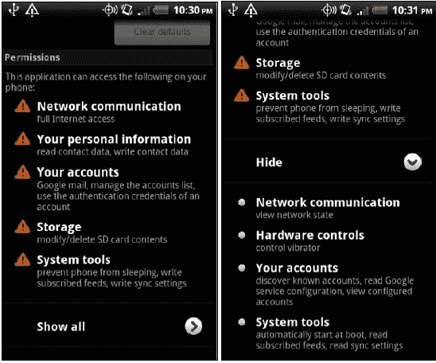
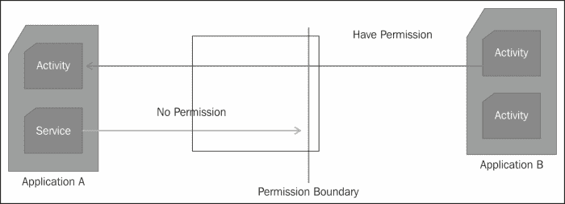

# 第三章：权限

本章的重点是权限。权限是 Android 应用程序的必要组成部分，几乎所有的应用程序开发者和用户都会在不同时间遇到它们。正如我们在第一章中讨论的，*Android 安全模型 - 大局观*，安装时的应用程序审查是最重要的安全关卡。这一步是用户的全或无决策；用户要么接受所有列出的权限，要么拒绝下载应用。因此，作为 Android 手机的用户，了解权限对于明智地决定安装哪个应用程序至关重要。权限是保护组件和用户数据的基础。

本章从介绍 Android 系统中现有的权限开始。我们讨论了四种权限保护级别：普通、危险、签名和签名或系统。然后，我们将讨论如何使用权限来保护应用程序及其组件。接下来，我们学习如何通过添加用户定义的权限来扩展权限模型。这一节将讨论权限组、权限树以及在清单文件中创建新权限的语法。

# 权限保护级别

在应用程序层面，Android 安全基于权限。使用这种基于权限的模型，Android 系统保护系统资源，如相机和蓝牙，以及应用程序资源，如文件和组件。应用程序应该有权限去操作或使用这些资源。任何打算使用这些资源的应用程序需要向用户声明它将访问这些资源。例如，如果一个应用程序将发送和读取短信，它需要在清单文件中声明 `android.permission.SEND_SMS` 和 `android.permission.READ_SMS`。

权限也是应用程序之间进行访问控制的有效方法。应用程序的清单文件包含一个权限列表。任何希望访问此应用程序资源的外部应用程序应具备这些权限。下一章将详细讨论这一点。

所有 Android 权限都在 `Manifest.permission` 类中声明为常量。然而，这个类并没有提到权限的类型。这可以用来检查 Android 源代码。我尝试在以下部分列出一些这些权限。权限列表会根据功能的变化而变化，因此最好参考 Android 源代码以获取最新的权限列表。例如，`android.permission.BLUETOOTH` 从 API 级别 1 开始就有，而 `android.permission.AUTHENTICATE_ACCOUNTS` 是在 API 5 中添加的。您可以在 [source.android.com](http://source.android.com) 获取获取 Android 源代码的信息。

所有 Android 权限都属于四个保护级别之一。任何保护级别的权限都需要在清单文件中声明。第三方应用只能使用保护级别为 0 和 1 的权限。以下将讨论这些保护级别：

+   普通权限：这一级别（级别 0）的权限对用户造成不了多大伤害。它们通常不会让用户花钱，但可能会引起用户的一些烦恼。下载应用时，可以通过点击**查看全部**箭头来查看这些权限。这些权限会自动授予应用。例如，权限`android.permission.GET_PACKAGE_SIZE`和`android.permission.FLASHLIGHT`分别允许应用获取任何包的大小和访问闪光灯。

    以下是本书编写时 Android 系统中存在的一些普通权限列表。

    用于设置用户偏好的权限包括：

    +   `android.permission.EXPAND_STATUS_BAR` 展开状态栏

    +   `android.permission.KILL_BACKGROUND_PROCESSES` 结束后台进程

    +   `android.permission.SET_WALLPAPER` 设置壁纸

    +   `android.permission.SET_WALLPAPER_HINTS` 设置壁纸提示

    +   `android.permission.VIBRATE` 震动

    +   `android.permission.DISABLE_KEYGUARD` 禁用键盘锁

    +   `android.permission.FLASHLIGHT` 闪光灯

    允许用户访问系统或应用信息的权限包括：

    +   `android.permission.ACCESS_LOCATION_EXTRA_COMMANDS` 访问位置额外命令

    +   `android.permission.ACCESS_NETWORK_STATE` 访问网络状态

    +   `android.permission.ACCESS_WIFI_STATE` 访问 WiFi 状态

    +   `android.permission.BATTERY_STATS` 电池统计

    +   `android.permission.GET_ACCOUNTS` 获取账户

    +   `android.permission.GET_PACKAGE_SIZE` 获取包大小

    +   `android.permission.READ_SYNC_SETTINGS` 读取同步设置

    +   `android.permission.READ_SYNC_STATS` 读取同步统计

    +   `android.permission.RECEIVE_BOOT_COMPLETED` 接收开机完成

    +   `android.permission.SUBSCRIBED_FEEDS_READ` 读取订阅源

    +   `android.permission.WRITE_USER_DICTIONARY` 写入用户词典

    用户应该谨慎请求的权限包括`android.permission.BROADCAST_STICKY`，它允许应用发送粘性广播，即使广播已经送达后仍然保持存活。

+   危险权限：这一保护级别（级别 1）的权限总是向用户显示。向应用授予危险权限允许它们访问设备功能和数据。这些权限可能导致用户隐私或财务损失。例如，授予如`android.permission.ACCESS_FINE_LOCATION`和`android.permission.ACCESS_COARSE_LOCATION`之类的危险权限，允许应用访问用户的位置，如果应用不需要这种功能，可能会成为隐私问题。同样，授予应用`android.permission.READ_SMS`和`android.permission.SEND_SMS`权限，允许应用发送和接收短信，这也可能涉及隐私问题。

    用户可以在任何时候进入设置，选择应用来查看已授予应用的权限。参考以下两张图片，它们展示了 Gmail 应用的权限。第一张图片显示了总是向用户显示的危险权限。注意**显示全部**的下拉菜单按钮。此选项显示了应用请求的所有权限。注意**硬件控制**权限，以及默认不向用户显示的正常权限。

    

    以下是本书撰写时 Android 系统中一些危险权限的列表。

    一些危险权限对用户来说可能是代价高昂的。例如，发送短信或订阅付费内容的应用可能导致用户花费大量资金。以下是一些其他例子：

    +   `android.permission.RECEIVE_MMS`

    +   `android.permission.RECEIVE_SMS`

    +   `android.permission.SEND_SMS`

    +   `android.permission.SUBSCRIBED_FEEDS_WRITE`

    有权改变手机状态的权限包括以下内容。这些权限应谨慎使用，因为它们可能导致系统不稳定，引起用户烦恼，并使系统安全性降低。例如，挂载和卸载文件系统的权限可以改变手机的状态。任何具有录音权限的恶意应用都可以轻松地用垃圾音频占用手机内存。以下是一些例子：

    +   `android.permission.MODIFY_AUDIO_SETTINGS`

    +   `android.permission.MODIFY_PHONE_STATE`

    +   `android.permission.MOUNT_FORMAT_FILESYSTEMS`

    +   `android.permission.WAKE_LOCK`

    +   `android.permission.WRITE_APN_SETTINGS`

    +   `android.permission.WRITE_CALENDAR`

    +   `android.permission.WRITE_CONTACTS`

    +   `android.permission.WRITE_EXTERNAL_STORAGE`

    +   `android.permission.WRITE_OWNER_DATA`

    +   `android.permission.WRITE_SETTINGS`

    +   `android.permission.WRITE_SMS`

    +   `android.permission.SET_ALWAYS_FINISH`

    +   `android.permission.SET_ANIMATION_SCALE`

    +   `android.permission.SET_DEBUG_APP`

    +   `android.permission.SET_PROCESS_LIMIT`

    +   `android.permission.SET_TIME_ZONE`

    +   `android.permission.SIGNAL_PERSISTENT_PROCESSES`

    +   `android.permission.SYSTEM_ALERT_WINDOW`

    一些危险权限可能存在隐私风险。允许用户读取短信、日志和日历的权限可能被僵尸网络和木马轻易利用，按照远程主人的命令执行有趣的操作。以下是一些其他例子：

    +   `android.permission.MANAGE_ACCOUNTS`

    +   `android.permission.MODIFY_AUDIO_SETTINGS`

    +   `android.permission.MODIFY_PHONE_STATE`

    +   `android.permission.MOUNT_FORMAT_FILESYSTEMS`

    +   `android.permission.MOUNT_UNMOUNT_FILESYSTEMS`

    +   `android.permission.PERSISTENT_ACTIVITY`

    +   `android.permission.PROCESS_OUTGOING_CALLS`

    +   `android.permission.READ_CALENDAR`

    +   `android.permission.READ_CONTACTS`

    +   `android.permission.READ_LOGS`

    +   `android.permission.READ_OWNER_DATA`

    +   `android.permission.READ_PHONE_STATE`

    +   `android.permission.READ_SMS`

    +   `android.permission.READ_USER_DICTIONARY`

    +   `android.permission.USE_CREDENTIALS`

+   签名权限：这一保护级别（第 2 级）的权限允许同一开发者编写的两个应用程序互相访问对方的组件。如果下载的应用程序具有与声明权限的应用程序相同的证书，则自动授予此权限。例如，应用程序 A 定义了一个权限 `com.example.permission.ACCESS_BOOK_STORE`。由与应用程序 A 相同证书签名的应用程序 B 在其清单文件中声明了它。由于应用程序 A 和 B 具有相同的证书，因此当安装应用程序 B 时，此权限不会显示给用户。用户当然可以使用**查看全部**来查看它。应用这一组权限的应用程序可以执行非常强大的操作。例如，有了 `android.permission.INJECT_EVENTS` 权限，应用程序可以向任何应用程序注入按键、触摸和轨迹球事件，而 `android.permission.BROADCAST_SMS` 可以广播短信确认。这一保护组中由 Android 系统定义的权限仅保留给系统应用。

    这一级别的某些权限允许应用程序使用系统级别的功能。例如，`ACCOUNT_MANAGER` 权限允许应用程序使用账户验证器，而 BRIK 权限允许应用程序锁定手机。以下是编写本书时一些签名权限的列表。要获取完整的参考资料，请查看 Android 源代码或 `Manifest.permission` 类：

    +   `android.permission.ACCESS_SURFACE_FLINGER`

    +   `android.permission.ACCOUNT_MANAGER`

    +   `android.permission.BRICK`

    +   `android.permission.BIND_INPUT_METHOD`

    +   `android.permission.SHUTDOWN`

    +   `android.permission.SET_ACTIVITY_WATCHER`

    +   `android.permission.SET_ORIENTATION`

    +   `android.permission.HARDWARE_TEST`

    +   `android.permission.UPDATE_DEVICE_STATS`

    +   `android.permission.CLEAR_APP_USER_DATA`

    +   `android.permission.COPY_PROTECTED_DATA`

    +   `android.permission.CHANGE_COMPONENT_ENABLED_STATE`

    +   `android.permission.FORCE_BACK`

    +   `android.permission.INJECT_EVENTS`

    +   `android.permission.INTERNAL_SYSTEM_WINDOW`

    +   `android.permission.MANAGE_APP_TOKENS`

    这一级别的某些权限允许应用程序发送系统级别的广播和意图，如发送意图和短信。这些权限包括：

    +   `android.permission.BROADCAST_PACKAGE_REMOVED`

    +   `android.permission.BROADCAST_SMS`

    +   `android.permission.BROADCAST_WAP_PUSH`

    这一级别的其他权限允许应用程序访问第三方应用程序无法访问的系统级别数据。这些权限包括：

    +   `android.permission.PACKAGE_USAGE_STATS`

    +   `android.permission.CHANGE_BACKGROUND_DATA_SETTING`

    +   `android.permission.BIND_DEVICE_ADMIN`

    +   `android.permission.READ_FRAME_BUFFER`

    +   `android.permission.DEVICE_POWER`

    +   `android.permission.DIAGNOSTIC`

    +   `android.permission.FACTORY_TEST`

    +   `android.permission.FORCE_STOP_PACKAGES`

    +   `android.permission.GLOBAL_SEARCH_CONTROL`

+   签名或系统权限：与签名保护级别一样，此权限授予与定义该权限的应用具有相同证书的应用。此外，此保护级别还包括与 Android 系统映像具有相同证书的应用。这个权限级别主要用于手机制造商、运营商和系统应用构建的应用。第三方应用不允许使用这些权限。这些权限允许应用执行一些非常强大的功能。例如，权限 `android.permission.REBOOT` 允许应用重启设备。权限 `android.permission.SET_TIME` 允许应用设置系统时间。

    在撰写本书时，一些 SignatureOrSystem 权限列表如下：

    +   `android.permission.ACCESS_CHECKIN_PROPERTIES`

    +   `android.permission.BACKUP`

    +   `android.permission.BIND_APPWIDGET`

    +   `android.permission.BIND_WALLPAPER`

    +   `android.permission.CALL_PRIVILEGED`

    +   `android.permission.CONTROL_LOCATION_UPDATES`

    +   `android.permission.DELETE_CACHE_FILES`

    +   `android.permission.DELETE_PACKAGES`

    +   `android.permission.GLOBAL_SEARCH`

    +   `android.permission.INSTALL_LOCATION_PROVIDER`

    +   `android.permission.INSTALL_PACKAGES`

    +   `android.permission.MASTER_CLEAR`

    +   `android.permission.REBOOT`

    +   `android.permission.SET_TIME`

    +   `android.permission.STATUS_BAR`

    +   `android.permission.WRITE_GSERVICES`

    +   `android.permission.WRITE_SECURE_SETTINGS`

# 应用程序级别权限

有两种方法可以将权限应用于整个应用程序。在第一种情况下，应用程序声明应用程序正常运行所需的权限。因此，将发送短信的应用程序将在清单文件中声明此类权限。在第二种情况下，应用程序可以声明尝试与此应用程序交互的其他应用程序应具有的权限。例如，一个应用程序可以声明任何想要与其组件交互的应用程序都应具有访问摄像头的权限。这两种类型的权限都必须在清单文件中声明。让我们逐一了解它们。

这个 `<uses-permission>` 标签在 `<manifest>` 内声明，表示应用程序请求正常运行所需的权限。标签的语法如下：

```kt
<uses-permission android:name=" " />
```

用户在下载应用时，必须接受这些权限。`android:name` 是权限的名称。此标签的声明示例如下。以下权限声明用户即将安装的应用程序将访问用户的短信：

```kt
<uses-permission android:name="android.permission.READ_SMS"/>
```

`<application>`标签有一个名为`android:permission`的属性，用于声明组件的通用权限。任何尝试与此应用程序的组件交互的应用程序都需要这些权限。以下代码显示了这一点。以下代码表明，与`MyApplication`的任何组件交互的应用程序都应该有访问摄像头的权限：

```kt
<application android:name="MyApplication" android:icon="@drawable/icon" android:label="@string/app_name""android.permission.CAMERA"/>
```

正如下一节所讨论的，各个组件也可以设置权限。组件权限会覆盖使用`<application>`标签设置的权限。上述方法是声明所有组件的通用权限的最佳位置。

# 组件级别权限

所有 Android 组件都可以使用权限进行保护。以下图示说明了这一概念：



让我们讨论一下每个组件的权限声明和实施。

## 活动

任何活动都可以通过在`<activity>`标签的活动声明中调用权限来进行保护。例如，具有自定义权限`com.example.project.ORDER_BOOK`的活动`OrderActivity`将如下声明。任何尝试启动`OrderActivity`的组件都需要拥有这个自定义权限。

```kt
<activity android:name=".OrderActivity" android:permission="com.example.project.ORDER_BOOK" android:exported="false"/>
```

对于活动，权限实施发生在使用`Context.startActivity()`和`Context.startActivityForResult()`启动活动时。如果启动组件没有适当的权限，将抛出`SecurityException`。

## 服务

任何服务都可以通过在`<service>`标签中列出所需的权限来进行保护。例如，基于关键词识别短信的服务`FindUsefulSMS`声明了一个权限`android.permission.READ_SMS`。这个权限将如下声明。任何尝试启动`FindUsefulSMS`的组件都需要拥有这个权限。

```kt
<service android:name=".FindUsefulSMS" android:enabled="true"
android:permission="android.permission.READ_SMS">            
</service>
```

对于服务的权限实施是在使用`Context.startService()`启动服务、使用`Context.stopService()`停止服务以及使用`Context.bindService()`绑定服务时进行的。如果请求的组件没有适当的权限，将抛出`SecurityException`。

如果服务公开了一个允许其他应用程序绑定的 Binder 接口，可以在绑定到 Binder 时使用`Context.checkCallingPermission()`来检查调用者的权限。

## 内容提供者

内容提供者可以通过`<provider>`标签中指定的权限来保护。以下示例中，任何想要与提供者通信的组件都应该拥有`android.permission.READ_SMS`权限：

```kt
<provider
   android:authorities="com.example.android.books.contentprovider"
   android:name=".contentprovider.MyBooksdoContentProvider" 
   android:grantUriPermissions="true"
   android:Permission="android.permission.READ_CALENDAR"/>
```

正如在第二章 *应用构建块* 中所讨论的，`<provider>`标签也具有细粒度的读写权限属性。为了能够从`<provider>`标签中读取，应用程序应具有读取权限。这会在`ContentResolver.query()`过程中进行检查。为了能够更新、删除和插入提供者，组件应具有读写权限。这些权限会在`ContentResolver.insert()`、`ContentResolver.update()`和`ContentResolver.delete()`过程中进行检查。如果权限不适当，将导致调用时抛出`SecurityException`。

`<grant-uri-permission>`标签是`<provider>`标签的子标签，用于在有限时间内授予对提供者某些特定数据集的访问权限。考虑一个将短信保存到数据库的应用程序示例。某些短信可能附有照片。为了使应用程序正确查看短信，它会启动图像查看器，而图像查看器可能无法访问提供者。**URI**（**通用资源标识符**）权限将允许图像查看器读取特定图片的权限。在前面的示例中，提供者设置了`android:grantIriPermissions="true"`，图像查看器将具有对整个提供者的读取权限。这构成了安全风险。为了提供有限的访问权限，提供者可以声明它希望对 URI 权限开放的部分。

URI 权限的语法如下：

```kt
<grant-uri-permission android:path="string"
                      android:pathPattern="string"
                      android:pathPrefix="string" />
```

### 注意

URI 权限不是递归的。

我觉得最有趣的是，我们可以使用通配符和模式来定义我们想要强制实施 URI 权限的提供者的哪些部分。以下是一个例子：

```kt
<grant-uri-permission android:pathPattern="/picture/" />
```

记得在任务完成后使用`Context.revokeUriPermission()`撤销 URI 权限。

## 广播接收器

广播可以通过两种方式使用权限进行保护。在第一种情况下，接收者使用权限保护自己，因此它只接收想要听到的广播。在另一种情况下，广播者选择哪些接收者可以接收广播。我们将在下一节讨论这两种情况。

任何接收者都可以通过在`<receiver>`标签中的接收者声明中调用权限来保护。例如，接收者`MyListener`声明了一个权限`android.permission.READ_SMS`，这将按如下方式声明。`MyListener`只接收具有`android.permission.READ_SMS`权限的广播者的广播。

```kt
<receiver android:name=".MyListener"
android:permission="android.permission.READ_SMS">    
        <intent-filter> 
            <action android:name=
                "android.provider.Telephony.SMS_RECEIVED" /> 
        </intent-filter>         
</receiver>
```

### 提示

请记住，粘性广播无法通过权限进行保护。

接收广播所需的权限在广播意图传递后被检查，即在调用`Context.sendBroadcast()`返回之后。因此，如果广播者没有适当的权限，不会抛出异常；只是广播不会被传递。如果通过使用`Context.registerReceiver()`动态创建接收者，可以在创建此接收者时设置权限。

第二种情况，广播者限制哪些接收者可以接收意图，是通过使用`sendBroadcast()`方法实现的。以下代码片段定义了一个仅发送给具有`android.permission.READ_SMS`权限的应用程序接收者的广播示例：

```kt
Intent intent = new Intent();
intent.setAction(MY_BROADCAST_ACTION);
sendBroadcast(intent, "android.provider.Telephony.SMS_RECEIVED");
```

### 注意

使用组件声明的权限不会授予应用程序。这是尝试与之交互的组件所属的应用程序应具备的权限。

# 扩展 Android 权限

开发者可以通过添加自己的权限来扩展权限系统。这些权限将在用户下载应用时向用户展示，因此确保它们被适当地本地化和标记是非常重要的。

## 添加新权限

开发者可以选择仅添加一个新权限或整个权限树。在清单文件中声明新权限。要添加新权限，应用程序可以使用`<permission>`标签声明，如下面的代码片段所示：

```kt
<permission android:name="string"
            android:description="string resource"
            android:icon="drawable resource"
            android:label="string resource"
            android:permissionGroup="string"
            android:protectionLevel=["normal" | "dangerous" | 
                            "signature" | "signatureOrSystem"] />
```

以下代码片段中用于新权限组的属性描述如下：

+   `android:name`：这是正在声明的新的权限名称。

+   `android:description`：这详细描述了正在声明的新的权限。

+   `android:icon`：这是权限图标。

+   `android:label`：这是在安装时向用户显示的标签。

+   `android:permissionGroup`：这将为权限分配一个预先存在的用户定义的组或新组。如果没有指定名称，权限不属于任何组，这也是可以的。我将在本节后面讨论如何创建权限组。

+   `android:protectionLevel`：这指定了新权限的保护级别。这些保护级别在本章前面已经讨论过。

这样的权限的一个示例可能如下：

```kt
<permission android:name="com.example.android.book.READ_BOOKSTORE"
            android:description="@string/perm_read_bookstore"
            android:label="Read access to books database"
            android:permissionGroup="BOOKSTORE_PERMS"
            android:protectionLevel="dangerous"/>
```

为了便于本地化和维护，使用字符串资源总比使用原始字符串要好。

一旦声明了新权限，请确保在`<uses-permission>`标签中声明它。

## 创建权限组

可以使用`<permission-group>`标签创建权限组。这是一个逻辑上的权限分组，当向用户展示时，它们将一起呈现。权限组是使用以下语法创建的：

```kt
<permission-group android:name="string" 
      android:description="string resource"
                  android:icon="drawable resource"
                  android:label="string resource" />
```

以下代码片段中用于新权限组的属性描述如下：

+   `android:name`：这是新权限组的名称。这是在`<permission>`标签中提到的名称。

+   `android:description`：这详细描述了正在声明的新权限组。

+   `android:icon`：这是权限组的图标。（注意：这里重复了，根据注意事项，不应该重复输出，所以这里不翻译）

+   `android:label`：这是在安装时显示的标签。（注意：这里重复了，根据注意事项，不应该重复输出，所以这里不翻译）

一个带有书店权限的权限组声明示例如下：

```kt
<permission-group android:description="@string/perm_group_bookstore"
                  android:label="@string/perm_group_bookstore_label"
                  android:name="BOOKSTORE_PERMS" />
```

## 创建权限树

如果需要将权限组织为一个命名空间，以便创建权限树，那么应用程序可以声明一个`<permission-tree>`标签。这样的树的一个示例如下：

```kt
com.example.android.book
com.example.android.book.READ_BOOK
com.example.android.book.bookstore.READ_BOOKSTORE
com.example.android.book.bookstore.WRITE_BOOKSTORE
```

这个标签并不定义任何新权限，它只是为你创建一个用于分组权限的命名空间。我看到这个概念被那些有多款应用的开发商使用，所有这些应用都会相互通信。`<permission-tree>`标签的语法定义如下：

```kt
<permission-tree android:name="string" 
    android:icon="drawable resource"
                 android:label="string resource"  />
```

以下是对前述代码片段中使用的新权限组属性描述：

+   `android:name`：这是新权限组的名称。名称至少应由三个由点分隔的部分组成，例如`com.example.android`是可以的，但`com.example`则不行。

+   `android:icon`：这是权限组的图标。

+   `android:label`：这是在安装时向用户显示的标签。

一个声明示例如下：

```kt
<permission-tree android:name="com.example.android.book" 
                  android:label="@string/perm_tree_book"  />
```

# 总结

权限是 Android 应用安全的核心，本章详细介绍了权限。我们了解了四种权限保护级别，如何使用权限保护组件，以及如何定义新权限。对于开发者和 Android 手机用户来说，了解和掌握权限模型至关重要。现在我们拥有了关于组件、组件间通信和权限的知识，让我们迈向下一章，学习如何定义应用程序的策略文件。
