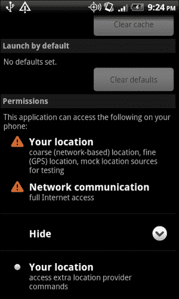
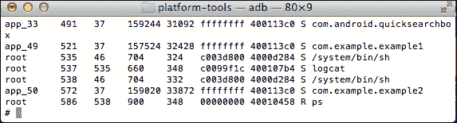
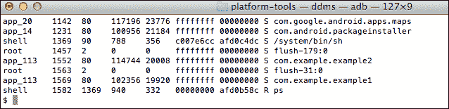
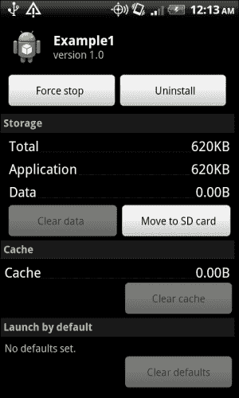
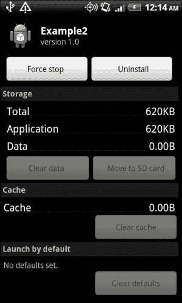
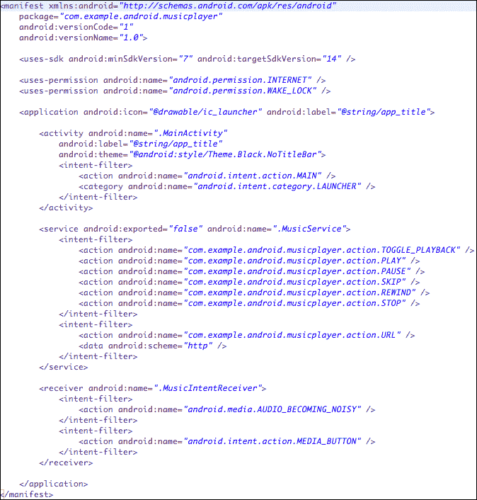

# 第四章：定义应用程序的策略文件

本章将把我们迄今为止所学的所有内容汇集在一起。我们将使用应用程序组件、意图和权限，并将它们全部放在一起来定义我们应用程序的策略文件。这个策略文件被称为`AndroidManifest.xml`，无疑是应用程序最重要的文件。正如您将看到的，这个文件是定义应用程序及其组件访问控制策略的地方。这也是定义应用程序和组件级别特定信息的地方，安卓系统将使用这些信息与您的应用程序交互。

本章从讨论`AndroidManfiest.xml`开始。我们将讨论到目前为止尚未讨论的两个重要标签：`<manifest>`和`<application>`。接下来，我们将讨论在清单文件中可以执行的操作，例如声明权限、与其他应用程序共享进程、外部存储以及管理组件可见性。在您发布应用程序之前，本章将以策略文件的核对清单作为结束讨论。您应该根据您的使用情况调整核对清单。一旦有了全面的核对清单，您就可以在每次准备发布新版本时参考它。

# `AndroidManifest.xml`文件

所有安卓应用程序都需要有一个清单文件。这个文件必须命名为`AndroidManifest.xml`，并且必须放在应用程序的根目录中。这个清单文件是应用程序的策略文件。它声明了应用程序组件、它们的可见性、访问规则、库、特性以及应用程序运行的最低安卓版本。

安卓系统使用清单文件进行组件解析。因此，`AndroidManfiest.xml`文件是整个应用程序中最重要文件，定义时需要特别小心，以加强应用程序的安全性。

清单文件是不可扩展的，因此应用程序不能添加自己的属性或标签。以下是如何嵌套这些标签的完整标签列表：

```kt
<uses-sdk><?xml version="1.0" encoding="utf-8"?>

<manifest>
    <uses-permission />
    <permission />
    <permission-tree />
    <permission-group />
    <instrumentation />
    <uses-sdk />
    <uses-configuration />  
    <uses-feature />  
    <supports-screens />  
    <compatible-screens />  
    <supports-gl-texture />  
    <application>
       <activity>
            <intent-filter>
                <action />
                <category />
                <data />
            </intent-filter>
            <meta-data />
        </activity>
        <activity-alias>
            <intent-filter>       </intent-filter>
            <meta-data />
        </activity-alias>
        <service>
            <intent-filter>       </intent-filter>
            <meta-data/>
        </service>
        <receiver>
            <intent-filter>       </intent-filter>
            <meta-data />
        </receiver>
        <provider>
            <grant-uri-permission />
            <meta-data />
            <path-permission />
        </provider>
        <uses-library />
    </application>
</manifest>
```

我们在前面的章节中已经涵盖了大部分标签。

只有两个标签`<manifest>`和`<application>`是必需的标签。声明组件没有特定的顺序。

`<manifest>`标签声明了应用程序特定的属性。它的声明方式如下：

```kt
<manifest xmlns:android="http://schemas.android.
  com/apk/res/android"
          package="string"
          android:sharedUserId="string"
          android:sharedUserLabel="string resource"
          android:versionCode="integer"
          android:versionName="string"
          android:installLocation=["auto" | "internalOnly" | 
            "preferExternal"] >

</manifest>
```

下面的代码片段展示了`<manifest>`标签的一个示例。在这个例子中，包名为`com.android.example`，内部版本为 10，用户看到的版本为 2.7.0。安装位置由安卓系统根据存储应用程序的空间决定。

```kt
<manifest package="com.android.example"
  android:versionCode="10"
  android:versionName="2.7.0"
  android:installLocation="auto"
  >
```

`<manifest>`标签的属性如下：

+   `package`：这是包的名称。这是应用 Java 风格的命名空间，例如 `com.android.example`。这是您应用的唯一 ID。如果您更改已发布应用的名称，它将被视为一个新应用，自动更新将不起作用。

+   `android:sharedUserId`：如果两个或更多应用共享同一个 Linux ID，则使用此属性。此属性将在后面的章节中详细讨论。

+   `android:sharedUserLabel`：这是共享用户 ID 的用户可读名称，仅当设置了 `android:sharedUserId` 时才有意义。它必须是一个字符串资源。

+   `android:versionCode`：这是应用内部用来跟踪修订版本的应用版本代码。更新应用至较新版本时会参考此代码。

+   `android:versionName`：这是向用户展示的应用版本。它可以设置为原始字符串或引用，并且仅用于向用户展示。

+   `android:installLocation`：此属性定义了 APK 将要安装的位置。此属性将在本章后面详细讨论。

应用标签定义如下：

```kt
<application android:allowTaskReparenting=["true" | "false"]
             android:backupAgent="string"
             android:debuggable=["true" | "false"]
             android:description="string resource"
             android:enabled=["true" | "false"]
             android:hasCode=["true" | "false"]
             android:hardwareAccelerated=["true" | "false"]
             android:icon="drawable resource"
             android:killAfterRestore=["true" | "false"]
             android:largeHeap=["true" | "false"]
             android:label="string resource"
             android:logo="drawable resource"
             android:manageSpaceActivity="string"
             android:name="string"
             android:permission="string"
             android:persistent=["true" | "false"]
             android:process="string"
             android:restoreAnyVersion=["true" | "false"]
             android:supportsRtl=["true" | "false"]
             android:taskAffinity="string"
             android:theme="resource or theme"
             android:uiOptions=["none" | 
                "splitActionBarWhenNarrow"] >

</application>
```

`<application>` 标签的一个示例在以下代码片段中展示。在此示例中，设置了应用名称、描述、图标和标签。应用不可调试，Android 系统可以实例化组件。

```kt
<application android:label="@string/app_name"
    android:description="@string/app_desc"
    android:icon="@drawable/example_icon"
    android:enabled="true"
    android:debuggable="false">

</application>
```

`<application>` 标签的许多属性作为应用内部声明的组件的默认值。这些标签包括 `permission`、`process`、`icon` 和 `label`。其他如 `debuggable` 和 `enabled` 的属性是为整个应用设置的。以下将讨论 `<application>` 标签的属性：

+   `android:allowTaskReparenting`：此值可以被 `<activity>` 元素覆盖。它允许当 Activity 被带到前台时，Activity 与其有亲缘关系的 Activity 重新分组。

+   `android:backupAgent`：此属性包含应用的备份代理的名称。

+   `android:debuggable`：当此属性设置为 `true` 时，应用可以被调试。在将应用发布到市场之前，此值应始终设置为 `false`。

+   `android:description`：这是作为对字符串资源的引用的应用的用户可读描述。

+   `android:enabled`：如果此属性设置为 `true`，Android 系统可以实例化应用组件。此属性可以被组件覆盖。

+   `android:hasCode`：如果此属性设置为 `true`，应用在启动组件时会尝试加载一些代码。

+   `android:hardwareAccelerated`：当此属性设置为 `true` 时，应用可以支持硬件加速渲染。它是在 API 级别 11 中引入的。

+   `android:icon`：这是作为对可绘制资源的引用的应用图标。

+   `android:killAfterRestore`：如果此属性设置为 `true`，则在完整系统恢复期间恢复应用程序设置后，应用程序将被终止。

+   `android:largeHeap`：此属性允许安卓系统为该应用程序创建一个大的 Dalvik 堆，并增加应用程序的内存占用，因此应谨慎使用。

+   `android:label`：这是应用程序的用户可读标签。

+   `android:logo`：这是应用程序的标志。

+   `android:manageSpaceActivity`：此值是管理应用程序内存的活动名称。

+   `android:name`：此属性包含将在任何其他组件启动之前实例化的子类的完全限定名称。

+   `android:permission`：此属性可以被组件覆盖，并设置客户端应具有与应用程序交互的权限。

+   `android:persistent`：通常由系统应用程序使用，此属性允许应用程序始终运行。

+   `android:process`：这是组件将要运行的进程的名称。这可以被任何组件的 `android:process` 属性覆盖。

+   `android:restoreAnyVersion`：此属性允许备份代理在即使当前存储的备份是由比尝试恢复的应用程序更新的新应用程序创建的情况下，尝试恢复。

+   `android:supportsRtl`：当此属性设置为 `true` 时，支持从右到左的布局。它是在 API 级别 17 中添加的。

+   `android:taskAffinity`：此属性让所有活动都与包名称有关联，除非活动明确设置。

+   `android:theme`：这是对应用程序样式资源的引用。

+   `android:uiOptions`：如果此属性设置为 `none`，则没有额外的 UI 选项；如果设置为 `splitActionBarWhenNarrow`，则在屏幕受限时会在底部设置一个栏。

在以下各节中，我们将讨论如何使用策略文件处理特定要求。

# 应用程序策略使用场景

本节讨论如何使用清单文件定义应用程序策略。我使用了使用场景，并且我们将讨论如何在策略文件中实现这些使用场景。

## 声明应用程序权限

安卓平台上的应用程序必须声明它打算使用哪些资源，以便应用程序能够正常运行。这些权限是用户在下载应用程序时显示的权限。正如在第三章 *权限* 中所讨论的，应用程序也可以定义自定义权限。应用程序权限应该是描述性的，以便用户能够理解它们。此外，与安全相关的普遍规则是，请求所需的最低权限是很重要的。

应用程序权限在清单文件中通过使用 `<uses-permission>` 标签声明。以下代码段展示了一个使用 GPS 获取位置信息的基于位置的清单文件的示例：

```kt
<uses-permissionandroid:name="android.
    permission.ACCESS_COARSE_LOCATION" />
<uses-permissionandroid:name="android.
    permission.ACCESS_FINE_LOCATION" />
<uses-permissionandroid:name="android.
    permission.ACCESS_LOCATION_EXTRA_COMMANDS" />
<uses-permissionandroid:name="android.
    permission.ACCESS_MOCK_LOCATION" />
<uses-permissionandroid:name="android.permission.INTERNET" />
```

这些权限将在用户安装应用程序时显示给他们，并且可以通过进入设置菜单下的**应用程序**进行检查。以下屏幕截图显示了这些权限：



## 声明外部应用程序的权限

清单文件还声明了一个外部应用程序（不与相同的 Linux ID 运行）需要访问应用程序组件的权限。这可以是策略文件中的两个位置之一：在`<application>`标签中或者在`<activity>`、`<provider>`、`<receiver>`和`<service>`标签中的组件旁边。

如果应用程序的所有组件都需要某些权限，那么在`<application>`标签中指定它们很容易。如果一个组件需要某些特定的权限，那么可以在特定的组件标签中定义。请记住，任何标签中只能声明一个权限。如果一个组件受到权限保护，那么组件权限将覆盖在`<application>`标签中声明的权限。

以下是一个应用程序示例，它要求外部应用程序具有`android.permission.ACCESS_COARSE_LOCATION`权限才能访问其组件和资源：

```kt
    <application
        android:allowBackup="true"
        android:icon="@drawable/ic_launcher"
        android:label="@string/app_name"
        android:permission="android.
            permission.ACCESS_COARSE_LOCATION">
```

如果一个服务要求访问它的任何应用程序组件都需要访问外部存储，那么可以按如下方式定义：

```kt
<service android:enabled="true"
    android:name=".MyService" 
        android:permission="android.
            permission.WRITE_EXTERNAL_STORAGE">            
</service>
```

如果策略文件同时具有前面的标签，那么当外部组件请求此服务时，它应该具有`android.permission.WRITE_EXTERNAL_STORAGE`权限，因为此权限将覆盖应用程序标签中声明的权限。

## 具有相同 Linux ID 的应用程序运行

应用程序之间共享数据总是很棘手。维护数据保密性和完整性并不容易。必须根据谁可以访问多少数据来建立适当的访问控制机制。在本节中，我们将讨论如何与内部应用程序（由同一开发密钥签名）共享应用程序数据。

安卓是一个分层架构，其应用程序隔离由操作系统本身强制执行。每当在安卓设备上安装一个应用程序时，安卓系统都会给它分配一个由系统定义的唯一用户 ID。请注意，以下屏幕截图中，两个应用程序**example1**和**example2**是作为不同的用户 ID 运行的，分别是**app_49**和**app_50**：



然而，一个应用程序可以请求系统分配一个它选择的用户 ID。另一个应用程序也可以请求相同的用户 ID。这会创建紧密耦合，不需要将组件对另一个应用程序可见或创建共享的内容提供者。这种紧密耦合是在所有希望在同一进程中运行的应用程序清单标签中完成的。

下面是两个应用`com.example.example1`和`com.example.example2`的清单文件片段，它们使用相同的用户 ID：

```kt
<manifest xmlns:android="http://schemas.android.
  com/apk/res/android"
    package="com.example.example1"
    android:versionCode="1"
    android:versionName="1.0"
    android:sharedUserId="com.sharedID.example">

<manifest xmlns:android="http://schemas.android.
  com/apk/res/android"
    package="com.example.example2"
    android:versionCode="1"
    android:versionName="1.0"
    android:sharedUserId="com.sharedID.example">
```

下面的截图展示了当这两个应用在设备上运行时的显示效果。注意，应用`com.example.example1`和`com.example.example2`现在有了**app_113**的应用 ID。



你会注意到共享 UID 遵循一定的格式，类似于包名。任何其他命名约定都可能导致错误，例如安装错误：`INSTALL_PARSE_FAILED_BAD_SHARED_USER_ID`。

### 提示

所有共享相同 UID 的应用应该具有相同的证书。

## 外部存储

从 API 级别 8 开始，安卓提供了支持将安卓应用（APK 文件）存储在外部设备上的功能，例如 SD 卡。这有助于释放手机内部内存。一旦 APK 移动到外部存储，应用所占的唯一内存就是存储在内部内存上的应用私有数据。需要注意的是，即使是 SD 卡上的 APK，**DEX**（**Dalvik 可执行文件**）、私有数据目录和本地共享库仍然存储在内部存储上。

在清单文件中添加一个可选属性可以启用这个功能。对于这样的应用，应用信息屏幕会有一个移动到 SD 卡或移动到手机的按钮，具体取决于 APK 当前的存储位置。然后用户可以选择相应地移动 APK 文件。

如果外部设备被卸载或 USB 模式设置为`Mass Storage`（设备被用作磁盘驱动器），所有在外部设备上运行的活动和服务都会立即被终止。第七章 *保护应用数据*中对外部存储及其安全性进行了详细分析。在本节中，我们将讨论如何在策略文件中指定外部存储的首选设置。

通过在应用的清单文件的`<manifest>`元素中添加可选属性`android:installLocation`，可以启用在外部设备上存储 APK 的功能。属性`android:installLocation`可以有以下三个值：

+   `InternalOnly`：安卓系统只会在内部存储上安装应用。如果内部存储空间不足，将返回存储错误。

+   `PreferExternal`：安卓系统将尝试在外部存储上安装应用。如果外部存储空间不足，应用将被安装在内部存储上。用户可以根据需要将应用从外部存储移动到内部存储，反之亦然。

+   `auto`：此选项允许 Android 系统决定应用程序的最佳安装位置。默认的系统策略是首先在内部存储上安装应用程序。如果系统内部内存不足，则将应用程序安装在外部存储上。用户可以根据需要将应用程序从外部存储移动到内部存储，反之亦然。

    例如，如果将`android:installLocation`设置为`Auto`，那么在运行 Android 2.2 以下版本的设备上，系统将忽略此功能，APK 只能安装在内部存储上。以下是具有此选项的应用程序清单文件中的代码片段：

    ```kt
    <manifest package="com.example.android"
      android:versionCode="10"
      android:versionName="2.7.0"
      android:installLocation="auto"
      xmlns:android="http://schemas.android.
        com/apk/res/android">
    ```

以下是先前指定的应用程序的屏幕截图。你会注意到在这种情况下启用了**移动到 SD 卡**功能：



在另一个未设置`android:installLocation`的应用程序中，**移动到 SD 卡**功能被禁用，如下面的屏幕截图所示：



## 设置组件可见性

应用程序的任何组件，即活动、服务、提供者和接收器都可以被外部应用程序发现。本节讨论了这些场景的细节。

任何活动或服务都可以通过设置`android:exported=false`变为私有的。这也是活动的默认值。以下是一个私有活动的两个示例：

```kt
<activity android:name=".Activity1" android:exported="false" />
<activity android:name=".Activity2" />
```

然而，如果你给活动添加了一个意图过滤器（Intent Filter），那么该活动就会对意图过滤器中的意图变得可发现。因此，意图过滤器绝不能作为安全边界依赖。以下是意图过滤器声明的示例：

```kt
<activity
    android:name=".Activity1"
    android:label="@string/app_name" >
    <intent-filter>
      <action android:name="android.intent.action.MAIN" />
      <category android:name="android.intent.category.LAUNCHER" />
    </intent-filter>
</activity>
<activity android:name=".Activity2">
    <intent-filter>
      <action  android:name="com.example.android.
        intent.START_ACTIVITY2" />
    </intent-filter>
</activity>
```

活动和服务也可以通过外部组件所需的访问权限进行保护。这是通过使用组件标签的`android:permission`属性来实现的。

内容提供者可以通过使用`android:exported=false`设置为私有访问。这也是提供者的默认值。在这种情况下，只有具有相同 ID 的应用程序才能访问提供者。通过设置提供者标签的`android:permission`属性，甚至可以进一步限制此访问。

广播接收器可以通过使用`android:exported=false`设置为私有。如果接收器不包含任何意图过滤器，这是接收器的默认值。在这种情况下，只有具有相同 ID 的组件才能向接收器发送广播。如果接收器包含意图过滤器，则它变得可发现，且`android:exported`的默认值为`false`。

## 调试

在应用程序开发过程中，我们通常将应用程序设置为调试模式。这允许开发者看到详细的日志，并可以进入应用程序检查错误。这通过在`<application>`标签中设置`android:debuggable`为`true`来实现。为了避免安全漏洞，在发布应用程序之前，将此属性设置为`false`非常重要。

根据我的经验，敏感信息的示例包括用户名和密码、内存转储、内部服务器错误，甚至一些有趣的个人笔记，包括服务器状态和开发者对一段代码的看法。

`android:debuggable`的默认值是`false`。

## 备份

从 API 级别 8 开始，应用程序可以选择一个备份代理将设备备份到云端或服务器。这可以在清单文件的`<application>`标签中设置`android:allowBackup`为`true`，然后设置`android:backupAgent`为一个类名来实现。`android:allowBackup`的默认值设置为`true`，如果应用程序希望选择退出备份，可以将其设置为`false`。`android:backupAgent`没有默认值，应该指定一个类名。

这种备份的安全性是有争议的，因为用于备份数据的服务不同，且敏感数据，如用户名和密码可能会被泄露。

## 整合所有内容

以下示例将我们迄今为止的学习内容应用于分析随 Android SDK 示例`RandomMusicPlayer`提供的`AndroidManifest.xml`。

清单文件指定这是应用程序`com.example.android.musicplayer`的第 1 版，它在 SDK 14 上运行，但支持回退至 SDK 7。应用程序使用了两个权限，分别是`android.permission.INTERNET`和`android.permission.WAKE_LOCK`。应用程序有一个名为`MainActivity`的 Activity 作为入口点，一个名为`MusicService`的服务，以及一个名为`MusicIntentReceiver`的接收器。

`MusicService`定义了名为`PLAY`、`REWIND`、`PAUSE`、`SKIP`、`STOP`和`TOGGLE_PLAYBACK`的自定义动作。

接收器使用 Android 系统定义的动作意图`android.media.AUDIO_BECOMING_NOISY`和`android.media.MEDIA_BUTTON`。

所有组件都没有受到权限保护。以下屏幕截图显示了`AndroidManifst.xml`文件的一个示例：



# 示例清单

在本节中，我尝试整理了一个建议您在准备发布应用程序版本时参考的示例列表。这是一个非常通用的版本，您应该根据自身使用案例和组件进行适配。在创建清单时，要考虑与整个应用程序相关的问题，与特定组件相关的问题，以及可能由组件和应用程序规范设置共同引发的问题。

## 应用程序级别

在本节中，我列出了一些问题，在定义应用程序特定偏好时，你应该问自己这些问题。它们可能会影响用户如何看待、存储和感知你的应用程序。你可能需要问的一些应用程序级别的问题如下：

+   你是否希望与其他你开发的应用程序共享资源？

    +   你是否指定了唯一的用户 ID？

    +   你是否故意或无意地为另一个应用程序定义了这个唯一 ID？

+   你的应用程序是否需要一些功能，如摄像头、蓝牙和短信？

    +   你的应用程序是否需要所有这些权限？

    +   是否有比你所定义的权限更严格的权限？请记住最小权限原则。

    +   你的应用程序的所有组件都需要这个权限，还是只有少数需要？

    +   再次检查所有权限的拼写。即使权限拼写错误，应用程序也可能编译并运行。

    +   如果你定义了此权限，这是否是你需要的正确权限？

+   应用程序在哪个 API 级别上工作？

+   你的应用程序能够支持的最小 API 级别是什么？

+   你的应用程序是否需要任何外部库？

+   你在发布前是否记得关闭调试属性？

+   如果你使用了备份代理，那么请记得在这里提及。

+   你是否记得设置一个版本号？这将有助于你在应用程序升级时。

+   你是否希望设置自动升级？

+   你是否记得用你的发布密钥签名应用程序？

+   有时设置特定的屏幕方向将不允许你的应用程序在某些设备上显示。例如，如果你的应用程序只支持竖屏模式，那么它可能不会在只支持横屏模式的设备上显示。

+   你想在哪个位置安装 APK？

+   如果意图没有及时接收，是否有可能会停止工作的服务？

+   你是否希望有一些其他的应用程序级别设置，比如系统恢复组件的能力？

+   如果定义了新的权限，请三思是否真的需要它们。可能已经有一个现成的权限可以涵盖你的使用场景。

## 组件级别

这里列出了一些你需要在策略中考虑的组件级别的问题。这些问题是你在每个组件上都应该问自己的问题：

+   你是否定义了所有组件？

+   如果你的应用程序使用了第三方库，你是否定义了你将使用的所有组件？

+   第三方库是否期望你的应用程序有特定的设置？

+   你是否希望这个组件对其他应用程序可见？

+   你需要添加一些意图过滤器吗？

+   如果组件不应该可见，你是否添加了意图过滤器？请记住，一旦你添加了意图过滤器，你的组件就会变得可见。

+   其他组件是否需要一些特殊权限来触发这个组件？

+   核对权限名称的拼写。

+   您的应用程序是否需要某些功能，如相机、蓝牙和短信？

# 概述

在本章中，我们学习了如何定义应用程序的策略文件。清单文件是应用程序最重要的工件，应当非常谨慎地定义。这个清单文件声明了应用程序请求的权限以及外部应用程序访问其组件所需的权限。通过策略文件，我们还定义了 APK 输出的存储位置以及应用程序将运行的最低 SDK 版本。策略文件公开了那些对应用程序不敏感的组件。在本章的末尾，我们讨论了开发者在编写清单文件时应该注意的一些示例问题。

本章节结束了本书第一部分的内容，我们学习了关于 Android 应用程序结构的知识。让我们继续学习本书的下一部分，重点关注用户数据的的安全存储。
