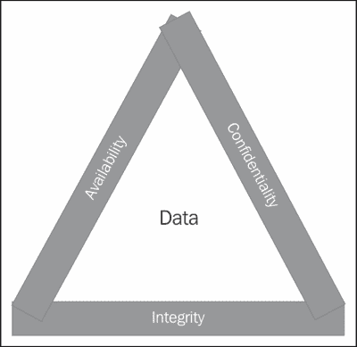
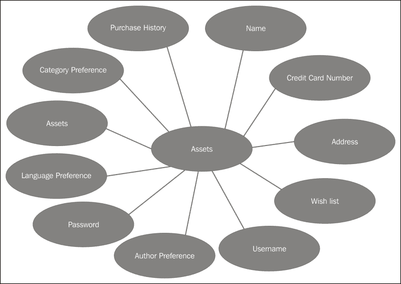
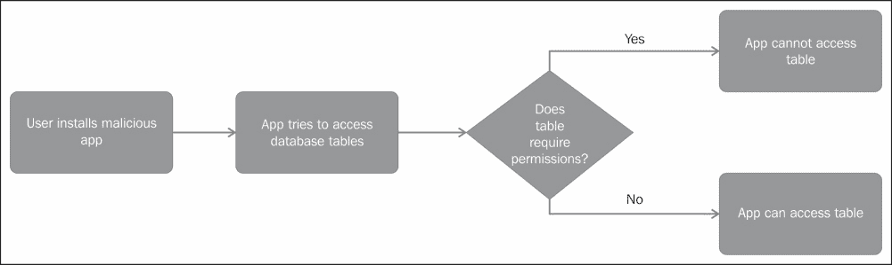
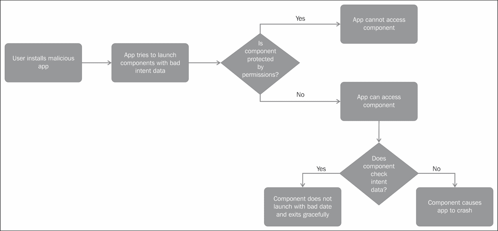
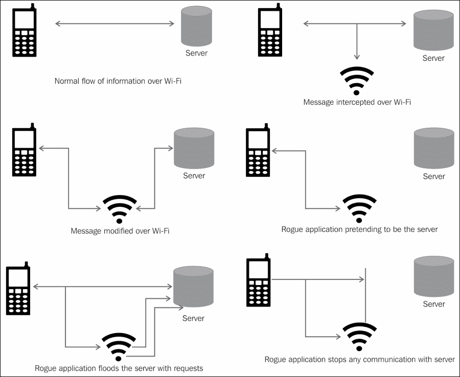
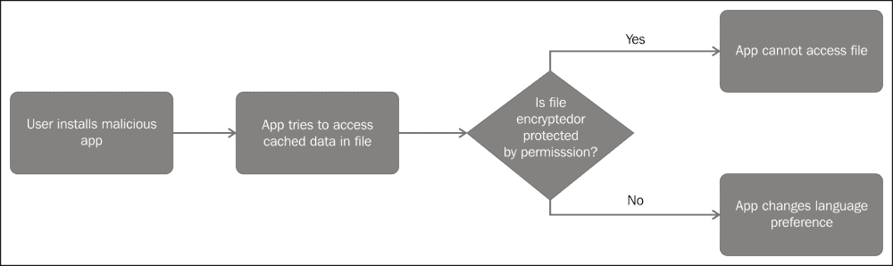
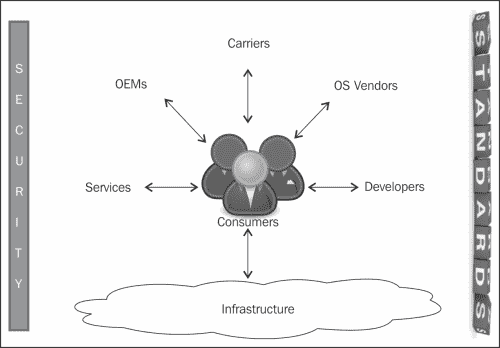
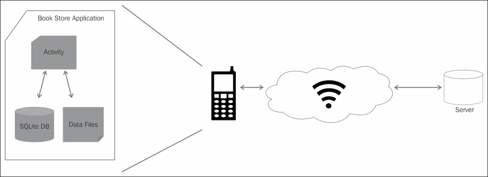
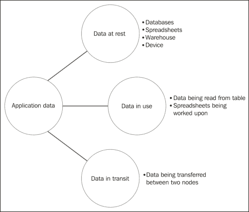
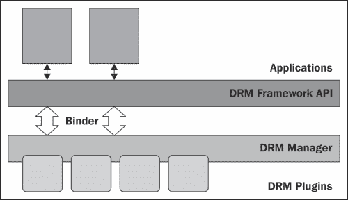

# 第五章：尊重你的用户

既然我们已经清楚地理解了 Android 平台和应用程序安全框架及组件，让我们深入到安全最具挑战性的方面：数据保护。正如我之前所述，作为应用程序开发人员，你的信誉取决于你处理用户数据的安全程度。因此，本章的名称是：*尊重你的用户*！

本章构成了理解保护用户数据的重要性和意义的基础。本章从讨论评估数据安全性的基准和 CIA 三原则开始。接下来，我们以我们的书店应用程序为例，通过资产、威胁和攻击场景进行分析。我们讨论移动生态系统以及生态系统的不同组件如何影响用户数据的安全性。最后，我们将回顾 Android 的**数字版权管理**（**DRM**）框架。

# 数据安全原则

本节讨论数据安全的三个原则，即保密性、完整性和可用性，通常称为**CIA 三原则**。存储在设备或服务器上的任何数据都应满足这三个属性以确保安全。理解这些基准可以帮助我们评估我们的数据存储解决方案的安全性。这三个原则通常以 CIA 三合体的形式表达。



## 保密性

保密性是安全的第一支柱，它关注数据的隐私。这一原则确保私人数据远离窥探的目光，只对具有适当访问权限的用户可用。例如，Android 应用程序的私人数据应只对该应用程序的组件或其他具有适当权限的组件（如果数据受到权限保护）可访问。Linux 操作系统的沙盒和权限强制执行此保密性。在另一种情况下，可能存在包含敏感数据的加密文件在 SD 卡上。即使设备或 SD 卡遭到破坏，这些信息也不会泄露。这种保密性是通过密码学强制执行的。另一个保密性的例子是设备在一段时间不活动后自动锁定，需要用户凭据才能解锁。请注意，Linux 内核默认不支持文件系统加密，因此在存储之前对敏感数据进行加密对于安全至关重要。

## 完整性

数据完整性确保数据在传输过程中或静态存储时不会被故意或意外地更改或修改。例如，不恰当地写入数据库表可能会导致意外的完整性问题。因此，除非你对自己的技术非常了解，否则建议使用内置的同步方法来强制执行数据完整性。故意破坏数据完整性的一个例子可能是在应用程序与服务器通信的传输过程中发生。中间人可以监听数据并在其传输过程中进行修改。为了减轻这种欺诈行为，建议在通信时对数据进行加密，并使用**安全套接字层**（**SSL**）协议。为了额外的安全，可以使用校验和。SSL 还需要证书颁发机构（CA）的证书验证链，这在 Android 应用程序中很少使用。

## 可用性

数据可用性确保在需要时数据能够获得。我想补充一点，即数据应当在有适当权限的用户需要时可用。这非常重要，因为应用程序不应让未授权用户访问敏感信息，以可用性为名。

# 识别资产、威胁和攻击

没有绝对的安全。当我们谈论数据安全时，我们需要确定我们正在保护什么以及保护的对象是谁。以下三个问题可以帮助我们规划方法：

1.  *我们试图保护什么？* 从 Android 应用程序的角度来看，我们是试图保护用户的用户名和密码，还是用户可能通过你的应用程序进行购买时输入的优惠码和信用卡号码，或者是用户使用你的应用程序购买的保护版权的歌曲或图片？通过回答这个问题，我们可以确定我们的资产。

1.  *我们试图保护资产免受谁的侵害？* 换句话说，我们的威胁是什么？我们是否试图保护用户数据不受系统上其他应用程序的侵害，还是试图保护这些信息不受你开发的其他应用程序的侵害？即使设备被盗，我们也想要保护我们的资产吗？

1.  *什么是攻击？* 回答这个问题有助于识别我们应用程序中的漏洞。我们要站在黑客的角度思考如何利用应用程序中的漏洞。

回答前面的三个问题将有助于我们确定资产的价值以及我们愿意在保护这些资产上投入的时间和精力。让我们尝试用一个示例应用程序来回答前面的问题。回到我们的书店应用程序，用户可以浏览目录中的书籍，将书籍添加到愿望清单中，并订购书籍以便寄送给用户。我们的应用程序会记住用户的基本信息，例如用户最后浏览的作者和类别以及语言和用户名，这样当用户登录时，应用程序会提供建议，让用户感到宾至如归。我们的应用程序还向用户提供商店的信用卡号、邮寄地址和姓名，以便用户准备好支付书籍费用时可以轻松结账。

让我们尝试回答第一个问题：我们试图保护什么？在前面示例中，我们的资产是：

+   姓名

+   信用卡号码

+   邮寄地址

+   最后搜索的作者

+   最后搜索的语言

+   最后搜索的类别

+   用户名

+   密码

+   书籍愿望清单

下图说明了我们示例中不同的敏感数据工件：



请注意，并非所有这些资产都需要同等程度地保护。存储机制应根据信息的敏感程度来决定。例如，信用卡号码和密码（如果存储在设备上）需要被强烈保护。您可以加密此类信息，并存储信息的哈希值，而不是以原始形式存储此信息。您将在传输过程中加密信息，并使用 SSL 协议进行安全通信。用户偏好（如语言、作者和类别）的丢失不会带来重大风险。即使这些信息丢失，用户也可以重新设置。

前面的分析还引发了关于 PII 的厚客户端和薄客户端的争论。厚客户端在设备本身上存储大量信息。因此，应用程序最终会在设备上存储 PII。薄客户端依赖后端服务器进行所有繁重的工作。它们在设备上存储最少的信息。这是一个好的方法，因为设备可能会丢失或被盗，然后用户数据的风险就会受到威胁。

接下来，我们要确定攻击场景。以下是一些示例场景的讨论。

假设用户安装了一个恶意应用程序。现在这个应用程序试图以不同的方式窃取用户信息。在第一种情况下，它试图访问不同的数据库表并提取用户信息。这是窃取私人信息的情况。如果数据库表受到权限保护，我们处于安全的位置。如果内容提供者检查组件的身份，我们将会处于更安全的情况。



在另一种情况下，恶意应用程序可能会发送带有不良数据的广播消息，接收应用程序可能会尝试对此采取行动，或者恶意应用程序可能会尝试启动其他应用程序的组件，并带有格式不良的数据，可能导致其他应用程序崩溃。因此，在采取行动之前，检查调用应用程序的身份并审查输入数据是非常重要的。

从这种攻击场景中我们可以得到的重要教训如下：

+   除非绝对必要，否则不要暴露组件。保持组件私有是我们的第一道防线。

+   如果我们暴露了一个组件，我们会确保我们用权限来保护它。这是决定是否希望将其暴露给整个系统还是仅暴露给由您创建的其他应用程序的好地方。如果用例是在同一作者编写的应用程序之间共享组件，我们可以定义自定义权限。

+   通过指定一些意图过滤器来减少攻击面。

+   在采取行动之前，请务必检查输入数据。如果数据不是所需的格式或形式，应该有一个优雅退出当前情况的计划。在这种情况下，向用户显示错误消息可以作为一个选项。

其他场景可能包括一个恶意应用程序监听通过流氓 Wi-Fi 连接的设备之间的数据交换。这个应用程序可以拦截信息，修改它，假装成用户正在连接的服务器，或者完全阻止数据流。所有这些场景都是安全风险。



另一个例子是，当恶意应用程序更改设备上存储的数据时。用户甚至可能没有意识到这些信息已经被更改。假设我们的应用程序在不同语言环境中本地化，并且用户设置了首选语言。在以下场景中，用户的首选语言从英语更改为例如日语。下次用户登录时，应用程序会以日语打开。在我们的案例中，安全风险并不大，这对用户来说是个烦恼，但这个例子证明了信息修改是另一种安全风险。



最后，我们需要考虑在发生安全漏洞时如何获取损失和我们的行动计划。如果信用卡信息、密码和社会安全号码等私人信息被窃取，这将是一个严重的安全风险。在发生安全漏洞时通知用户的计划必须仔细考虑。如果用户的偏好和愿望清单被不适当地访问，可能会引起用户的不满，但可能不会造成太大的隐私风险。

## 什么数据应该存储以及存储在哪里

之前的分析使我们意识到应用程序开发人员必须考虑的两个重要决策。

首先，应用程序开发者必须决定他/她想要从用户那里收集哪些信息。正如有最小权限原则一样，也有最少存储原则。最少存储原则导致风险和责任的最小化。应用程序开发者应始终尝试减轻**个人识别信息**（**PII**）的存储负担。在我们之前的例子中，应用程序可能不想存储信用卡详情、账单地址以及与支付相关的其他信息。支付是一个棘手的领域，而像 PayPal 这样的公司可以帮助用户处理结账过程。此外，任何处理信用卡号码的应用程序都建议遵循**支付卡行业**（**PCI**）标准。该标准列出了此类应用程序和服务器必须遵守的要求。我的建议是将此类操作交给最擅长这些事情的服务。

第二个需要深思的重要决定是用户数据存储在哪里。在当今分布式的数据存储环境中，开发者有许多存储选项，例如设备上、服务器上、云上或第三方应用程序。移动设备不应被视为安全的存储位置，部分原因是它可能容易被盗或丢失，而且大多数设备没有像台式机和笔记本电脑那样的高级安全机制，如安全元件和双启动。密码、加密密钥、大内容文件、个人识别信息（PII）和其他敏感数据应存储在后端服务器上。同样，重要的是要为这些服务器设置防火墙。

我们将在第七章《*保护应用数据*》中回到这个例子，根据前面的分析，我们将决定适当的存储选项和保护机制。

# 端到端的安全

大约十年前，我们把音乐存储在磁带和磁盘上；我们的照片放在相册里，我们只把电话用于紧急情况。快进到今天；我们的生活越来越多地走向数字化。我们的朋友、家人、喜好、不喜欢、照片、联系人列表，甚至我们的购买历史和信用卡号码都在数字化。想象一下用户丢失手机的场景。除了设备的价值和存储在其中的内容的情感价值，最大的风险是存储在设备上的用户个人信息的安全。这些信息可能包括可以识别个人的 PII，如姓名、社会安全号码、出生日期和母亲的婚前姓名。它还可能包括对密码、联系人列表和短信数据的访问。即使设备所有者拥有设备并且设备因恶意软件而受到威胁，这种风险仍然存在。

## 移动生态系统

如下图所示，移动生态系统中有不同的构件，如设备、网络、用户在设备上安装的应用程序、OEM（原始设备制造商）以及消费者的设备与之交互的其他服务。



让我们更深入地了解这些组件。

+   **消费者**：整个生态系统都围绕着消费者以及消费者如何与生态系统的不同部分互动。

+   **设备制造商**：也称为 OEM，这些公司生产设备的硬件。像 HTC、摩托罗拉、三星和 LG 这样的公司都设计和制造 Android 设备。除了设备的大小和样式，每个设备制造商都会加入他们自己的**系统芯片**（**SOC**）、设备驱动和固件，这些都会影响应用程序在不同设备上的工作方式。如果你在不同的设备上测试过你的应用程序，你可以轻易地注意到这些差异。硬件层面的任何安全缺陷都会影响使用该硬件的所有设备。硬件缺陷也很难修补。

+   **操作系统供应商**：Android 是一个开源操作系统，制造商可以自由修改它或使用自己的软件。例如，设备制造商可能会决定使用不同的 WebKit 引擎、音乐播放器或屏幕，而不是 Android 堆栈中捆绑的那个。这将导致应用程序在不同设备上的行为和外观有所不同。这些专有软件包中的安全缺陷可能导致你的应用程序受到威胁。运行特定版本操作系统的所有设备都会受到缺陷的影响。软件层面的缺陷通常可以修补，建议用户始终保持软件更新。

+   **运营商**：AT&T、Sprint、Verizon、Orange 和 Vodafone 等运营商提供了使移动设备真正移动的基础设施。他们为我们的设备提供数据和语音计划。他们还与设备制造商（在大多数情况下也是操作系统供应商）合作，将他们的定制应用程序捆绑在系统映像中。他们也可能与 OEM 合作，调整安全规则以满足他们的需求。例如，他们可能要求 OEM 直接加载和安装应用程序，而无需征得用户的同意或显示权限请求。

+   **服务**：这些是设备交互的服务，例如用于备份的云服务。在大多数情况下，用户会安装一个与后端交互的客户端。其他服务可能包括像 PayPal 这样的支付服务，像 Gmail 这样的邮件服务，以及像 Facebook 和 Twitter 这样的社交网络服务。这些服务大多数以第三方应用程序的形式提供给用户。

+   **应用开发者**：这是指个人应用开发者或小型开发者团队，他们将应用发布到如 Google Play 和亚马逊应用商店等应用商店。这类应用包括实用程序、游戏、内容消费应用等。本书的大部分读者属于这一类。

+   **基础设施**：这些技术和协议是移动基础设施的支柱。这包括**CDMA**（**码分多址**）、**GSM**（**全球移动通信系统**）、**WiMAX**（**微波全球互操作性接入**）、**WAP**（**无线应用协议**）以及如 NFC、RFID 和蓝牙等近场通信技术。这些技术中的安全漏洞可能导致我们的应用易受攻击。

+   **标准和安全**：在我们撰写这本书时，这两个移动生态系统的重要组成部分仍在不断发展中。

你可能已经注意到，移动生态系统中有许多参与者，从而增加了风险和威胁表面。此外，移动领域的一些主要玩家并不总是合作，有时甚至相互对抗，导致攻击模型复杂化。同时，制造商为特定市场生产设备。因此，这是一个复杂且不断变化的局面。从端到端的角度来看待安全问题，不难意识到应用开发者唯一能控制的也就是他们创建的应用。设备或操作系统中的任何其他缺陷也可能导致安全漏洞。例如，操作系统中的一个缺陷可能导致权限提升，让应用以 root 权限运行。在这种情况下，这个 root 应用可以访问设备上的所有信息。所有应用都会受到威胁，但如果开发者采用了良好的安全标准，他们的责任将最小化。

### 提示

应用开发者唯一能掌控的就是他们自己的应用。任何恶意用户都可以利用设备硬件、操作系统或运营商应用中的弱点，获取用户数据。

例如，我们的书店应用与数据库通信，向服务器发送信息并缓存一些数据。所有这些情况都需要得到保护。如果设备使用某种近场通信技术，如**近场通信**（**NFC**）、蓝牙或**射频识别**（**RFID**）来交换数据，了解这些技术相关的安全风险和新的附加场景是非常重要的。

第六章，*你的工具 – 加密 APIs*，讨论了可以用来保护传输中数据的加密算法。

## 数据的三个状态

让我们看看典型移动应用程序中的信息流。再次考虑书店应用程序。在我们的书店应用程序中，用户可以浏览目录中的书籍，将书籍添加到愿望清单中，并订购书籍以便邮寄给用户。我们的应用程序会记住用户的基本信息，例如用户最后浏览的作者和类别、用户的语言和用户名。用户的信用卡号、邮寄地址和姓名也会被存储以方便结账。

下图展示了一个可能的情况。书店应用程序在 Android 设备上使用 SQLite 数据库和平面文件作为缓存。应用程序在外部服务器上存储账户详情、书籍目录和愿望清单，并通过 Wi-Fi 连接到后端服务器。



在任何给定时刻，数据可以处于以下三种状态之一：在某个位置静止、从一个节点传输到另一个节点中、或在处理过程中。我们将这三种数据状态称为静止数据、传输中的数据和使用中的数据。让我们更详细地了解这三种状态：

1.  **静止数据**：这是存储在某些存储介质上的数据，如 SD 卡、设备内存、后端服务器和数据库。此数据处于非活动状态。在上一个示例中，位于平面文件、SQLite 数据库表和后端服务器上的数据都被认为是静止数据。

1.  **使用中的数据**：当前正在处理的数据称为使用中的数据。这类数据的例子包括从数据库表中访问的数据、通过意图发送到应用程序组件的数据，以及当前正在写入或从中读取的文件。

1.  **传输中的数据**：当数据正在从一个节点传输到另一个节点时，称为传输中的数据。响应查询，将数据从数据库传输到应用程序是传输中数据的例子。

在处理数据和考虑端到端安全时，保护三种状态下的数据都是重要的。

# 数字版权管理

**数字版权管理**（**DRM**）是针对数字内容如音乐、电子书、应用程序、视频和电影等的访问控制技术。访问控制基于与内容相关联的权利对象。这个权利对象包含限制内容的使用、分发和复制的规则。**开放移动联盟**（**OMA**）开发了如 OMA DRM v1 和 OMA DRM v2 等 DRM 方案，但许多设备制造商也有自己的专有 DRM 方案。

DRM 系统包含以下组件：

+   **内容服务器**：这是设备从中获取媒体内容的服务器。

+   **权利服务器**：设备从中获取权利对象的的服务器。权利对象通常是一个带有与内容相关联的权限和约束的 XML 文件。

+   **DRM 代理**：该代理内置于设备中，是将内容和权限相关联并执行内容权限管理的可信实体。

+   **存储设备**：这是存储内容和权利对象的设备。它可以是手机或平板电脑，或者是外部存储，如 SD 卡，甚至是云存储。数字版权管理

你可以在[www.openmobilealliance.org](http://www.openmobilealliance.org)阅读关于 OMA DRM 的完整规范。OMA DRM 1.0 支持诸如内容锁定（内容不能转发到另一设备）、联合交付（内容和权利对象一起交付）以及分离交付（内容和权利对象从不同的服务器分别拉取）等模型。OMA DRM v2.0 的安全性基于 PKI，安全性显著提高。制造商可以选择支持其设备上的 DRM 方案。他们还可以根据需要实现或修改 DRM 方案。

安卓从 API 11 开始支持 DRM。安卓对 DRM 的支持是开放的，这样制造商可以选择自己的 DRM 代理。这是通过在两个架构层实现 DRM 框架来实现的。Android 开发者网站（[developer.android.com](http://developer.android.com)）以下图解地展示了这一点：



DRM 管理器实现了 DRM 框架，对那些将他们选择的 DRM 代理与此框架集成作为插件的设备制造商来说很有兴趣。框架层抽象了 DRM 管理器的所有复杂性，并向开发者展示了一组统一的 API 以供使用。这些 API 在 Dalvik VM 中运行，与应用程序的其他代码一起。

所有 DRM API 都在`android.drm`包中。这个包有类和接口来获取权利信息，关联内容与权利，查询 DRM 插件和 MIME 类型。`DrmManager`类为每个`DrmManagerClient`提供一个唯一的 ID 以便操作。

应用程序首先需要*找出设备上可用的 DRM 插件*。这可以通过使用`DrmManagerClient`类来完成。

```kt
DrmManagerClient mDrmManagerClient = new DrmManagerClient(getContext());
String[] plugins = mDrmManagerClient.getAvailableDrmEngines();
```

下一步是*向 DRM 服务器注册*并下载权利对象。

```kt
DrmManagerClient mDrmManagerClient = new DrmManagerClient(context);
DrmInfoRequest infoRequest = new DrmInfoRequest(DrmInfoRequest.TYPE_RIGHTS_ACQUISITION_INFO, MIME);
mDrmManagerClient.acquireDrmInfo(infoRequest);
```

第三步是*从权利对象中提取许可信息*。这是通过使用`DrmManager`的`getConstraints`方法完成的。

```kt
ContentValues constraintsValues = mDrmManager.getConstraints(String path, int action);
ContentValues constraintsValues = mDrmManager.getConstraints(Uri uri, int action);
```

现在，我们需要*将内容与权利对象关联*。这是通过在`DrmManager`的`saveRights`方法中指定内容路径和权利路径来完成的。一旦完成这种关联，DRM 代理将继续执行内容的权限管理，无需用户干预。

```kt
int status = mDrmManager.saveRights(DrmRights  drmRights, String rightsPath, String  contentPath);
```

`android.drm` 包还提供了一些其他实用功能。查看此包以了解所有可用的功能（[`developer.android.com/reference/android/drm/package-summary.html`](https://developer.android.com/reference/android/drm/package-summary.html)）。

# 本章总结

本章节介绍了数据安全的基础知识。我们讨论了数据安全的三个核心原则，即保密性、完整性和可用性。我们通过一个示例应用场景进行了演练，并尝试绘制我们的资产、威胁和攻击场景。我们试图评估安全漏洞相关的成本。我们的数据存储选项以及我们计划在保护数据上投入的时间、精力和资金将取决于这一分析。我们还反思了整个移动生态系统，以及在移动环境中端到端安全的意义。不难意识到，我们仅控制我们所编写的应用程序。我们以回顾 Android 的 DRM 框架和可用功能结束了这一章节。凭借所有这些关于数据安全的知识，让我们迈向下一章，学习应用程序开发人员可以使用的不同工具来保护用户数据。
