# 第六章：你的工具 - 加密 API

为了尊重用户隐私，处理敏感数据的应用程序需要保护这些数据不被窥探。尽管 Android 栈提供了分层的安全架构，安全功能内置于操作系统本身，但在设备上获取 root 访问权限相对容易，从而危及存储在设备上的数据。因此，应用程序开发者了解他们可以用来安全存储数据的工具是很重要的。同样，他们了解如何正确传输数据也是至关重要的。

Android 栈为开发者提供了工具，用于执行诸如加密和解密、散列、生成随机数以及消息认证码等任务。这些工具是栈中各个软件包提供的加密 API。`javax.crypto` 软件包提供了加密和解密消息、生成消息认证码和密钥协商 API 的能力。`java.util.Random` 类提供了生成随机数的工具，而 `java.security` 软件包提供了散列、密钥生成和证书管理的 API。

在本章中，我们将讨论 Android 栈提供的加密 API，应用程序开发者可以利用这些 API 来保护敏感信息。我们首先介绍密码学中使用的基本术语，然后是如何确定可用的安全提供者。接下来，我们将讨论随机数生成，随后是散列函数。接着会讨论非对称和对称密钥密码学以及不同的加密模式，然后是消息认证码。

# 术语

让我们先了解一些在密码学中使用的术语。随着我们深入本章，这些术语将反复出现，因此在我们继续之前，熟悉它们是很重要的。

+   密码学：密码学是在不安全环境中以及在对手存在的情况下进行安全通信的研究和实践。随着我们的生活越来越数字化和互联，密码学的重要性日益增加。密码学以算法和协议的形式实践，这些算法和协议是使用数学公式和计算上困难的问题设计的。

+   明文：也称为纯文本，明文是发送者想要传输的需要保密的消息。如果爱丽丝想要向鲍勃发送一条消息"Hello World"，那么"Hello World"就是明文。

+   密文：也称为编码文本，这是发送给接收者的经过编码或加密的明文消息。让我们继续之前的例子，爱丽丝想要将消息"Hello World"发送给鲍勃。爱丽丝使用了一种替换方法，每个字母被下一个字母替换，形成密文。因此，明文"Hello World"现在变成了"Ifmmp Xpsme"。"Ifmmp Xpsme"就是传送给鲍勃的密文。

+   加密：加密是将明文转换为密文的过程，这样窃听者无法在传输或存储过程中解读信息，只有知道密码的双方才能理解。在上述示例中，将"Hello World"转换为"Ifmmp Xpsme"的过程称为加密。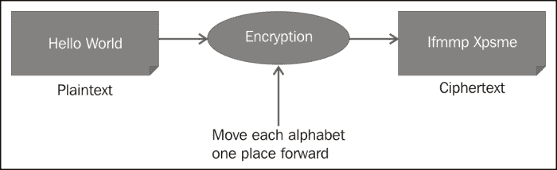

+   解密：解密是加密的逆过程。它是在接收端将密文转换回明文以获取信息的过程。因此，将"Ifmmp Xpsme"转换回"Hello World"的过程称为解密。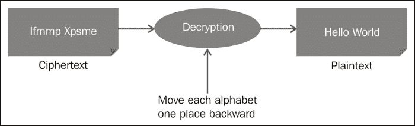

+   关键：在密码学术语中，密钥是决定加密算法输出的关键信息或数学参数。在上述示例中，将"Hello World"转换为"Ifmmp Xpsme"时，关键信息是给每个字母加一，这就是密钥。在解密过程中，关键信息是从每个字母减一，这就是解密的密钥。

+   密码：密码是执行消息加密和解密的加密算法。它也被称为加密算法。在上述示例中，密码是一种将"Hello World"加密为"Ifmmp Xpsme"的算法，然后在接收端将"Ifmmp Xpsme"转换回"Hello World"。

# 安全提供者

就安全提供者而言，Android 堆栈是可定制的。这意味着设备制造商可以添加他们自己的加密提供者。作为应用程序开发者，您也可以自由使用自己的安全提供者。由于 Android 堆栈仅提供 Bouncy Castle 安全提供者的一些功能，因此 Spongy Castle 非常受欢迎。此外，不同版本的 Android 堆栈通过移除不安全的加密算法并添加新的算法，不断更新其加密功能。您可能想要检查在特定时间点提供者及其支持算法的完整列表。同时，确保在不同的设备上测试您的应用程序，以确认加密算法按预期工作。

下面的代码片段展示了如何使用`java.security.Providers`方法获取加密提供者列表：

```kt
for (Provider provider: Security.getProviders()) {
    System.out.println(provider.getName());
}
```

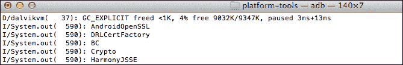

现在为了获取每个提供者的详细信息，让我们增强函数以记录更多细节，如下所示：

```kt
for (Provider provider: Security.getProviders()) {
    System.out.println(provider.getName());
    for (String key: provider.stringPropertyNames()) {
      System.out.println("\t" + key +
        "\t" + provider.getProperty(key));
    }
}
```

下面的屏幕截图显示了有关一些安全提供者的详细信息：

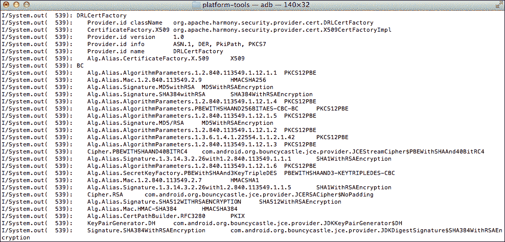

始终使用知名、行业标准的加密算法。编写加密例程听起来很有趣也很简单，但实际上比看上去要困难得多。我们将在下一节学习的行业标准算法是由加密专家开发并经过彻底测试的。如果发现这些算法有任何弱点，那么这些信息会被公开，开发者可以用更强大的加密算法更新他们的代码。

# 随机数生成

生成随机数是密码学中最重要的任务之一。随机数作为其他加密功能的种子，如加密和生成消息认证码。模拟真正的随机数生成是很困难的，因为它们来自自然界不可预测的行为。计算机系统生成伪随机数，这意味着它们并不是真正的随机，但看起来是随机的。

计算生成的随机数有两种方法：**伪随机数生成器**（**PRNG**）和**真随机数生成器**（**TRNG**）。PRNG 是基于某些数学公式算法生成的。TRNG 基于系统特性，如**CPU**（**中央处理单元**）周期、时钟、噪声和按键操作等。都柏林三一学院的 Mads Haahr 博士运行着[www.random.org](http://www.random.org)，这是任何对随机性感兴趣的人的一个非常有趣的站点。请查看！

随机数的应用场景包括游戏应用，比如用户掷骰子的应用、赌博应用、随机播放歌曲的音乐应用，以及作为加密操作（如哈希、加密或密钥生成）的种子等。并非所有的应用场景都需要强烈的随机性。比如，随机播放曲目的音乐播放器不需要像密钥生成算法那样强烈的随机性。

安卓提供了使用`java.util`包中的`java.util.Random`类生成随机数的能力。这个类提供了生成一个或多个随机双精度浮点数、字节、浮点数、整数或长整数的数组的方法。这个类是线程安全的。

下面的代码片段展示了如何在 1 到 100 的范围内生成一个随机数的例子。

```kt
int min = 1;
int max = 100;

public int getRandom(int min, int max) {
  Random random = new Random();
  int num = random.nextInt(max - min + 1) + min;
  return num;
}
```

也可以使用种子生成随机数。然而，由于安卓堆栈有一个伪随机数生成器，它使用一个相当不可预测的初始状态作为种子，实际上种子使得随机数更容易被预测。

# 哈希函数

哈希函数是处理任意长度数据以产生固定长度输出的算法。对于相同的输入，输出总是相同的，对于不同的输入值，输出总是不同的。这些函数是单向的，这意味着对数据的反向操作是不可能的。

在数学术语中，单向哈希函数可以定义如下：

给定一个消息*M*，和一个单向哈希函数*H*，很容易计算出*x*使得*H(M) = x*。但是给定*x*和*H*，要得到消息*M*是不可行的。这可以数学上如下表示：

*H(M) = x*

*H(x) ≠ M*

哈希函数的另一个特性是低碰撞概率。这意味着给定一个消息*M*，很难找到另一个消息*M*，使得：

*H(M)* ≠ *H(M')*

单向哈希函数可用于各种应用。它们用于为可变长度字符串创建固定大小的输出。使用哈希，可以安全地存储给定哈希的值；无法检索原始消息。例如，在表中存储密码的哈希，而不是密码本身。由于给定的消息哈希值始终相同，输入正确的密码将导致生成相同的哈希值。它们用作校验和，以确保消息在传输过程中未被更改。

目前广泛使用的最流行的哈希函数是**MD5**（**消息摘要算法**）和**SHA**（**安全哈希算法**）系列的哈希函数。所有这些哈希函数在强度和碰撞概率上都有所不同，你应该选择最适合你应用的一个。通常，使用 SHA-256 是一个不错的选择。许多应用程序仍然使用 MD5 和 SHA-1，但现在这些被认为足够安全。对于需要非常高级别安全的应用程序，应考虑使用更强大的哈希函数，如 SHA-3。以下表格总结了一些常见哈希函数的输出长度：

| 哈希算法 | 块长度（位） | 输出长度（位） |
| --- | --- | --- |
| MD5 | 512 | 128 |
| SHA-1 | 512 | 160 |
| SHA-256 | 512 | 256 |
| SHA-512 | 1024 | 512 |

下面的维基百科图片展示了输入的微小变化如何完全改变输出。这个案例中的哈希函数是 SHA-1：

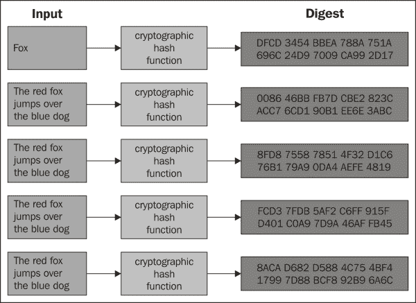

`java.security`包中的`java.security.MessageDigest`类提供了哈希功能。以下代码片段展示了如何使用这个类对字符串`s`创建一个 SHA-256 哈希。`update`方法使用字节更新摘要，而`digest`方法创建最终的摘要。

```kt
final MessageDigest digest = MessageDigest.getInstance("SHA-256");
digest.update(s.getBytes());
byte messageDigest[] = digest.digest();
```

# 公钥密码学

公钥密码学是一种使用两个密钥的密码系统：一个用于加密，另一个用于解密。其中一个密钥是公开的，另一个是私有的。

公钥密码学最常见的用途是针对两个用例。一个是保密性，另一个是认证。在保密性情况下，发送者使用接收者的公钥加密消息并发送。由于接收者持有私钥，接收者使用私钥来解密消息。

在作为数字签名的认证情况下，发送者使用他们的私钥加密消息（在大多数使用场景中，加密的是消息的哈希值而不是整个消息），并将其公开。任何拥有公钥的人都可以访问它，并确信消息来自发送者。

下面的截图展示了两个使用场景：

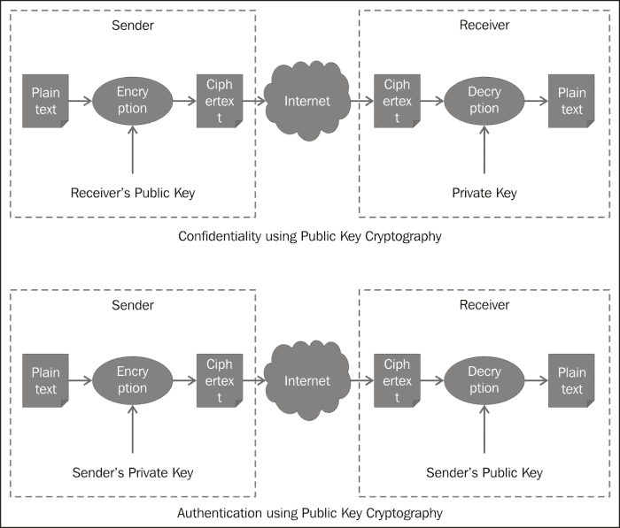

在以下章节中，我们讨论了两种常见的公钥密码算法：用于加密和认证的 RSA，以及用于密钥交换的 Diffie-Hellman。

## RSA

以其发明者 Ron Rivest、Adi Shamir 和 Leonard Adleman 的名字命名，RSA 是基于公钥密码学的一种算法。RSA 的安全性基于分解两个大素数。算法本身不是秘密，公钥也不是。只有素数是秘密的。

根据所需的强度，使用的 RSA 密钥长度可以是 512、1024、2048 或 4096 位。目前 2048 位的密钥被认为是强的。RSA 非常慢，因此应避免用它来加密大量数据集。需要注意的是，可以用 RSA 加密的消息长度不能超过模数（两个素数的乘积的长度）。由于 RSA 本质上很慢，通常的做法是使用对称密钥加密明文，然后再用 RSA 加密密钥。

RSA 可以用于保密和认证的数字签名。在使用 RSA 时有三种主要操作，如下所述：

### 密钥生成

实现 RSA 的第一步是生成密钥。在 Android 中，可以通过使用`java.security.KeyPairGenerator`类来完成。以下代码片段展示了如何生成一个 2048 位的密钥对：

```kt
KeyPairGenerator keyGen = KeyPairGenerator.getInstance("RSA");
keyGen.initialize(2048);
KeyPair key = keyGen.generateKeyPair();
```

如果密钥已经以原始形式存在，并且需要从中提取私钥和公钥，那么可以使用`java.security.KeyFactory`类从密钥规格中提取公钥和私钥，如下所示：

```kt
KeyFactory keyFactory = KeyFactory.getInstance("RSA");
keyFactory.generatePublic(keySpecs);
```

### 加密

根据使用场景，加密和解密可以通过私钥或公钥来执行。以下代码片段使用接收者的公钥加密数据。这个示例紧接着前面使用`java.security.KeyPairGenerator`类生成密钥对的方法。以下示例使用`java.security.Cipher`类来初始化密码并执行操作：

```kt
private String rsaEncrypt (String plainText) {
    Cipher cipher = Cipher.getInstance("RSA/ECB/PKCS1Padding");
    PublicKey publicKey = key.getPublic();
    cipher.init(Cipher.ENCRYPT_MODE, publicKey);
    byte [] cipherBytes = cipher.doFinal(plainText.getBytes());
    String cipherText = new String(cipherBytes,
        "UTF8").toString();
    return cipherText;
}
```

### 解密

解密是加密的相反操作。以下代码展示了如何使用私钥来解密数据。接着前面的示例，这是一个发送者使用接收者的公钥加密消息，然后接收者使用他们的私钥进行解密的案例。

```kt
private String rsaDecrypt (String cipherText) {
    Cipher cipher = Cipher.getInstance("RSA/ECB/PKCS1Padding");
    PrivateKey privateKey = key.getPrivate();
    cipher.init(Cipher.DECRYPT_MODE, privateKey);
    byte [] plainBytes = cipher.doFinal(cipherText.getBytes());
    String plainText = new String(plainBytes, "UTF8").toString();
    return plainText;
}
```

### 填充（Padding）

在前面的示例中，您会注意到加密算法是用**PKCS1Padding**进行初始化的。让我们来更多地了解一下填充。RSA 算法没有随机成分。这意味着使用相同的密钥加密相同的明文将产生相同的密文。这种特性可能导致针对加密系统的选定明文攻击。在加密明文之前，通常会用随机数据填充。由 RSA 实验室发布的**PKCS#1**（**公钥密码学标准**）用于在明文中嵌入结构化随机数据。后来证明，即使是 PKCS#1 填充也不足以避免适应性选定明文攻击。这是一种选定密文攻击，在这种攻击中，随后的密文是根据第一组解密密文的结果来选择的。为了减轻这类攻击，建议使用 PKCS#1 v1.5。另一种可以使用的填充是**OAEP**（**光不对称加密填充**）。

在示例中，您还会注意到参数中的**CBC**（**Cipher Block Chaining**，密文块链）。这种模式将在本章的*块密码模式*部分进行讨论。

## Diffie-Hellman 算法

由 Whitefield Diffie 和 Martin Hellman 于 1976 年发布，Diffie-Hellman 是最受欢迎的密钥交换算法。这个算法的巧妙之处在于，双方可以在不安全的通道上独立生成一个秘密密钥，而无需交换秘密密钥。然后可以使用这个秘密密钥进行对称加密。

Diffie-Hellman 算法没有验证双方的身份。因此，它容易受到中间人攻击，在这种攻击中，窃听者坐在中间，冒充另一方与双方通信。维基百科下面的插图完美地解释了 Diffie-Hellman 的概念，使用了两方：Alice 和 Bob：

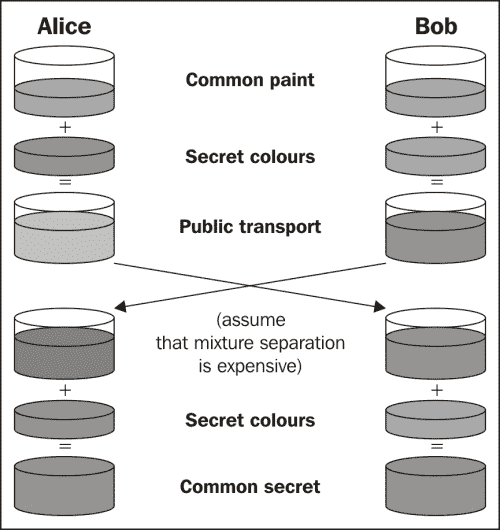

下面的代码示例显示了生成密钥对的示例实现。使用`java.security.KeyPairGenerator`类基于 DH 参数生成密钥对。接下来，使用`javax.crypto`类生成密钥协商：

```kt
// DH params
BigInteger g = new BigInteger("0123456789", 16);
BigInteger p = new BigInteger("0123456789", 16);
DHParameterSpec dhParams = new DHParameterSpec(p, g);

// Generate Key pair
KeyPairGenerator keyGen = KeyPairGenerator.getInstance("DH");
keyGen.initialize(dhParams, new SecureRandom());

// Generate individual keys
KeyAgreement aKeyAgree = KeyAgreement.getInstance("DH");
KeyPair aPair = keyGen.generateKeyPair();
aKeyAgree.init(aPair.getPrivate());

KeyAgreement bKeyAgree = KeyAgreement.getInstance("DH");
KeyPair bPair = keyGen.generateKeyPair();
bKeyAgree.init(bPair.getPrivate());

// Do the final phase of key agreement using other party's 
  public key
aKeyAgree.doPhase(bPair.getPublic(), true);
bKeyAgree.doPhase(aPair.getPublic(), true);
```

# 对称密钥加密

对称密钥加密基于一个秘密密钥，双方都相同。加密和解密都使用相同的密钥。与公钥密码学相比，这是一个问题，因为需要通过某种方式安全地交换秘密密钥。如果窃听者获得了密钥，系统的安全性就被破坏了。

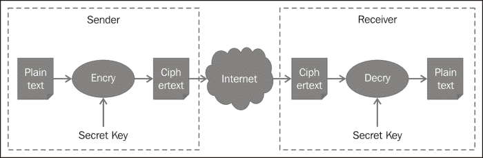

对称密钥比公钥快得多，在加密/解密大量数据时非常理想。对称密钥算法的安全性基于密钥的长度。

## 流密码

流密码是一种对称密钥加密类型，其中每个位或字节的数据是使用称为密钥流的随机位序列单独进行加密的。通常，每个位或字节与密钥流进行**异或**（**Exclusive OR**）操作。密钥流的长度与数据的长度相同。流密码的安全性取决于密钥流的随机性。如果使用相同的密钥流对多个数据集进行加密，那么算法的漏洞可能会被发现并利用。下图展示了流密码的工作情况：

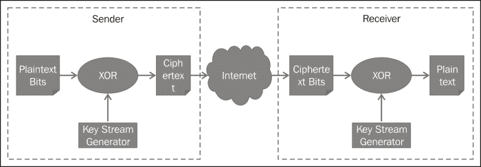

流密码的最佳应用场景是数据长度可变的情况，如在 Wi-Fi 或加密语音数据中。它们在硬件中的实现也相对容易。使用流密码技术的一些算法示例包括 RC4、A5/1、A5/2 和 Helix。

由于密钥与需要加密的数据长度相同，流密码在密钥管理上存在严重问题。

## 块密码

在块密码的情况下，数据块是逐个使用密钥进行加密的。明文被划分为固定长度的块，每个块单独进行加密。下图展示了块密码的基本思想。每个明文被划分为固定大小的数据块。如果块不能均匀划分，它们会使用一组标准的位进行填充，以达到期望的长度。然后每个块使用一个密钥进行加密，并生成固定长度的加密块。

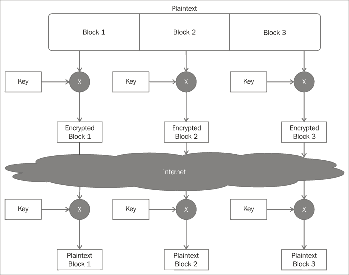

块密码的一个问题是，如果相同的数据块被重复，输出总是相同的。另一个问题是，如果数据块在传输过程中丢失，没有办法识别出数据块已经丢失。已经设计出各种块密码模式来解决前面提到的问题。块密码在加密算法中得到了广泛的应用，例如 AES、DES、RC5 和 Blowfish。

由于明文被划分为块，通常最后一个块将没有足够的位来填满块。在这种情况下，最后一个块会填充额外的位以达到所需的长度。这个过程被称为填充。

## 块密码模式

在块密码模式下，明文被划分为多个块，每个块都使用相同的密钥进行加密。在下面一节中，将讨论实现块加密的一些技术。这些模式既用于对称加密，也用于非对称加密，如 RSA。然而，在实际应用中，很少使用非对称密码对大量数据进行加密，因为它们通常速度非常慢。

### 电子密码本（ECB）

在 ECB 模式下，明文被划分为块，每个块独立地使用密钥进行加密。这种模式可以很容易地进行并行处理，因此速度很快。这种模式不隐藏明文模式。因此，相同的块将产生相同的密文。任何攻击者都可以修改或窃取明文，而发送者却一无所知。

下图展示了在 ECB 模式下如何实现加密和解密：

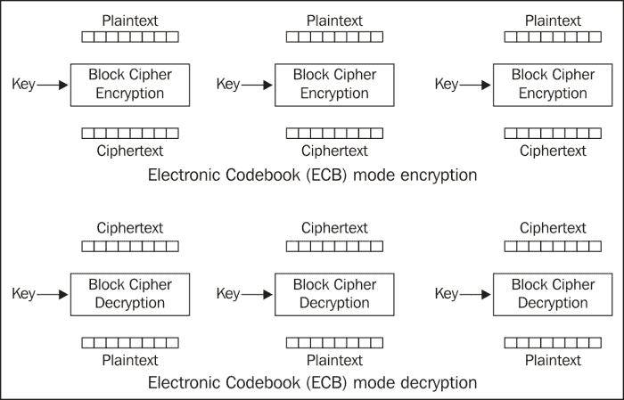

下面的代码演示了如何使用 ECB 模式初始化 RSA 密码：

```kt
Cipher cipher = Cipher.getInstance("RSA/ECB/PKCS1Padding");
```

同样，为了使用 ECB 初始化 AES 对称算法，可以使用以下代码：

```kt
Cipher cipher = Cipher.getInstance("AES/ECB");
```

### 密文块链（CBC）

在 CBC 模式下，每个明文块与之前的密文块进行异或操作，然后进行加密。这种模式解决了与 ECB 模式相关的两个缺点。将块与之前的明文块进行异或操作可以隐藏明文中的任何模式。此外，如果除了第一个和最后一个块之外的任何块被删除或更改，接收者可以轻松检测到。

下图说明了使用 CBC 模式对明文块进行加密和解密。注意使用**初始化向量**（**IV**）为第一个块添加随机性。IV 是一组随机的位，与第一个块进行异或操作：

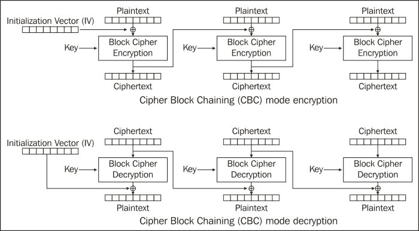

下面的代码演示了如何使用 CBC 模式初始化 RSA 密码：

```kt
Cipher cipher = Cipher.getInstance("RSA/CBC/PKCS1Padding");
```

同样，为了使用 CBC 初始化 AES 对称算法，可以使用以下代码：

```kt
Cipher cipher = Cipher.getInstance("AES/CBC");
```

### 密文反馈链（CFB）

在 CFB 模式下，先对前一个密文块进行加密，然后与明文进行异或操作以生成密文。这种模式同样隐藏了明文模式，并使一个明文块依赖于前一个块。这使得在传输过程中可以跟踪和验证块的一致性。同样，注意第一个块使用了初始化向量（IV）。

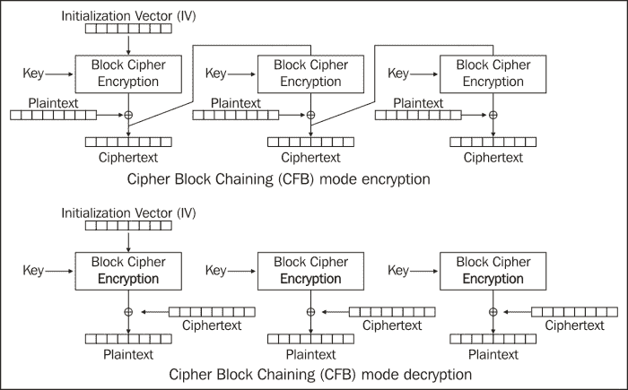

下面的代码演示了如何使用 CFB 模式初始化 RSA 密码：

```kt
Cipher cipher = Cipher.getInstance("RSA/ECB/PKCS1Padding");
```

同样，为了使用 CFB 初始化 AES 对称算法，可以使用以下代码：

```kt
Cipher cipher = Cipher.getInstance("AES/CFB");
```

### 输出反馈模式（OFB）

OFB 模式与 CFB 模式相似，不同之处在于异或的密文充当同步流密码，这样一位的错误只会影响一位，而不是整个块。同样，使用 IV 来启动该过程，如下所示：

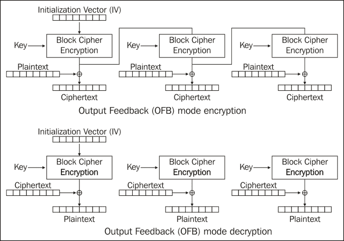

下面的代码演示了如何使用 OFB 模式初始化 RSA 密码：

```kt
Cipher cipher = Cipher.getInstance("RSA/OFB/PKCS1Padding");
```

同样，为了使用 OFB 初始化 AES 对称算法，可以使用以下代码：

```kt
Cipher cipher = Cipher.getInstance("AES/OFB");
```

## 高级加密标准（AES）

AES 是最受欢迎的块对称密码。它比其他常见的块对称密码（如 DES 和 DES3）更安全。此密码将明文划分为固定块大小，为 128 位，密钥可以是 128 位，192 或 256 位密钥。AES 速度快，内存要求低。Android 磁盘加密也使用 AES 128 位加密，主密钥也使用 AES 128 位加密。

以下代码段展示了如何生成 128 位 AES 密钥：

```kt
//Generate individual keys
Cipher cipher = Cipher.getInstance("AES");
KeyGenerator keyGen = KeyGenerator.getInstance("AES");
generator.init(128);
Key secretKey = keyGen.generateKey();
byte[] key = skey.getEncoded();
```

接下来，以下代码展示了如何使用 AES 密钥加密明文：

```kt
byte[] plaintext = "plainText".getBytes();
SecretKeySpec skeySpec = new SecretKeySpec(raw, "AES");
Cipher cipher = Cipher.getInstance("AES");
cipher.init(Cipher.ENCRYPT_MODE, skeySpec);
byte[] cipherText = cipher.doFinal(plainText);
```

继续前面的示例，要使用 AES 解密，可以使用以下代码：

```kt
SecretKeySpec skeySpec = new SecretKeySpec(raw, "AES");
Cipher cipher = Cipher.getInstance("AES");
cipher.init(Cipher.ENCRYPT_MODE, skeySpec);
byte[] encrypted = cipher.doFinal(cipherText);
```

# 消息认证码

**消息认证码**（**MAC**）是附加到消息上以确定其真实性和完整性的标签或校验和。通过拥有一个秘密密钥来提供认证，验证消息的意外或有意更改提供了完整性。下图说明了 MAC 的工作原理：

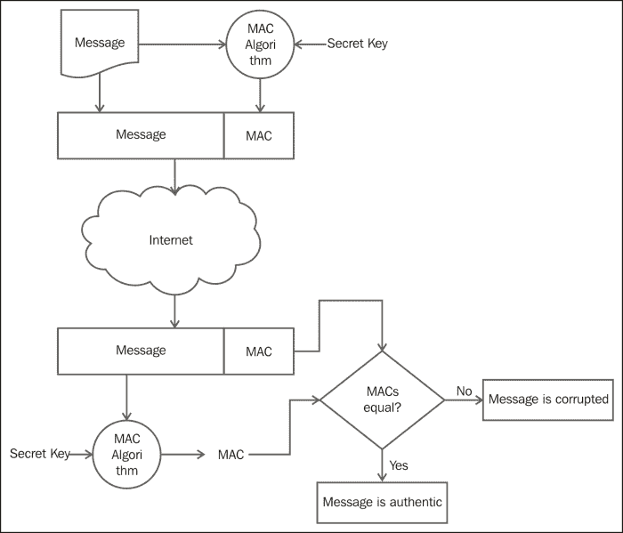

可以使用不同的方法生成 MAC：使用一次性密钥或一次性秘密密钥、使用哈希函数、使用流密码，或者使用块密码并将最后一个块作为校验和输出。最后一种方法的例子是使用 CBC 模式的 DES。

哈希函数用于创建称为**哈希 MAC**（**HMAC**）的校验和。然后使用对称密钥加密此哈希并将其附加到消息中。这是生成 MAC 最受欢迎的方法。这种 MAC 的一些示例是带有 SHA1 的 AES 128 和带有 SHA1 的 AES 256。

Android 通过使用`javax.crypto.Mac`类提供了生成 HMAC 的能力。以下代码段展示了如何使用 SHA-1 生成摘要：

```kt
String plainText = "This is my test string.";
String key = "This is my test key.";
Mac mac = Mac.getInstance("HmacSHA1");
SecretKeySpec secret = new SecretKeySpec(key.getBytes("UTF-8"),
    mac.getAlgorithm());
mac.init(secret);
byte[] digest = mac.doFinal(plainText.getBytes());
String stringDigest = new String(digest);
```

# 总结

在本章中，我们讨论了应用程序开发人员可以使用哪些工具来保护其应用程序和用户数据的隐私。我们讨论了用于种子和加密算法初始化向量的随机数生成。讨论了哈希技术，如 SHA-1 和 MD5，开发人员可以使用这些技术来存储密码。它们还非常适合将大量数据压缩成有限且定义的长度。我们讨论了用于交换密钥的公钥密码学和对称密钥算法，如 AES 加密大量数据。我们还讨论了流密码和块密码以及块密码模式。大多数算法都有已发布的测试向量，并且可以在网上找到。开发人员可以针对这些测试向量测试他们的实现。在以下章节中，我们将使用这些工具和技术来保护数据。现在让我们继续下一章，学习如何为不同类型的数据选择最佳的存储选项。
