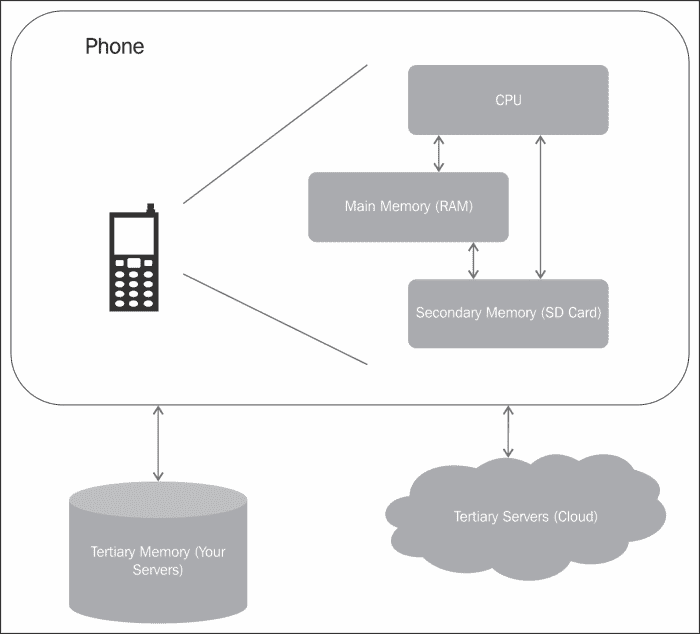
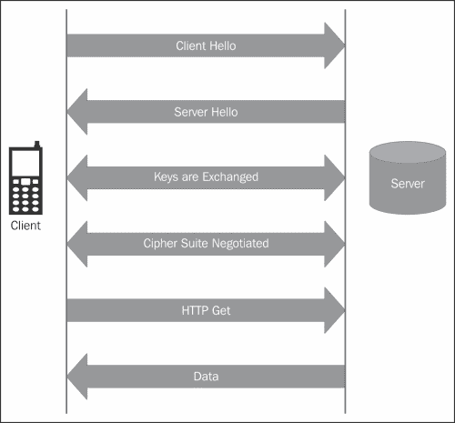
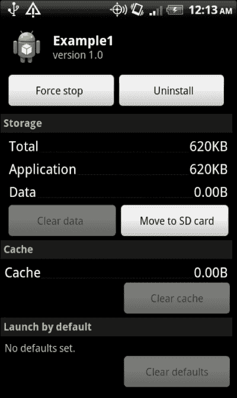

# 第七章：保护应用数据

应用程序开发者的信誉取决于他们如何安全地处理用户数据。明智的做法是从不在设备上存储大量用户数据。这不仅会占用内存，而且是一个巨大的安全风险。然而，有些用例需要应用程序共享数据，缓存应用程序偏好设置，并在设备上存储数据。这类数据可能是应用程序私有的，也可能是与其他应用程序共享的。此类数据的例子可能是用户的偏好语言或书籍类别。应用程序保存此类数据是为了提升用户体验。它对应用程序本身有用，并且不与其他应用程序共享。共享数据的例子可能是用户在浏览商店时不断添加到收藏中的书籍愿望清单。此类数据可能会也可能不会与其他应用程序共享。

根据隐私和数据类型，可以采用不同的存储机制。应用程序可以选择使用共享偏好设置、内容提供者、存储在内部或外部内存中的文件，甚至是开发者自己的服务器来存储数据。

本章从最重要的问题开始，即确定应用程序应存储的识别信息以及如何决定数据的存储位置。通常情况下，应收集最少量的信息，并在收集敏感信息前获得用户同意。接下来，我们将讨论 Android 中的存储机制，包括共享偏好设置、设备存储、外部存储以及在后端服务器上存储数据。我们将讨论保护传输中数据的协议。我们将以讨论在外部存储上安装应用程序来结束本章。

# 数据存储决策

在应用程序的背景下，许多因素会影响数据存储的决定。其中大部分是基于开发者应该了解的数据安全方面，如隐私、数据保留和系统实现细节。以下各节将讨论这些问题。

## 隐私

当今的应用程序收集和使用关于用户的不同类型的信息。用户偏好、位置、健康记录、金融账户和资产等都是其中的一部分。收集此类信息应当谨慎，并得到用户同意，因为收集私人信息可能引发法律和道德问题，并可能被视为侵犯隐私。即使收集了此类信息，也应妥善加密存储并安全传输。本章后半部分的重点是安全数据存储和传输。

隐私以不同的形式表现。首先，在不同的文化和国家中是不同的。每个国家都建立了关于个人识别信息（PII）的规则和法规。例如，欧盟有一个关于处理和转移个人数据的**数据保护指令**。更多信息可以在欧洲委员会司法总司维护的此网站上找到：[`ec.europa.eu/justice/data-protection/index_en.htm`](http://ec.europa.eu/justice/data-protection/index_en.htm)。关于此方面的印度网络法律可以在[`deity.gov.in/content/cyber-laws`](http://deity.gov.in/content/cyber-laws)找到。美国采取的是分部门的数据保护方法。这是立法、监管和自我监管的结合，而不是仅由政府执行。

第二，不同的使用场景有不同的法律。例如，如果一个应用程序与医疗或健康相关，那么其规则与跟踪用户位置或进行金融交易的应用程序是不同的。美国一些具体的法律例子包括美国残疾人法案、1998 年的儿童在线隐私法案和 1986 年的电子通信隐私法案。因此，了解与您的使用案例以及您希望运营的国家相关的规则和法规非常重要。如有疑问，可以寻求在其领域内具有专业知识的公司的服务。例如，与其尝试建立自己的支付系统，不如使用像 PayPal 这样的支付提供商，后者已经进行了多年的支付处理，并且符合此领域如 PCI 等的规则和法规。

第三，从一个国家向另一个国家转移私人信息也受到规则和法规的约束。在大多数情况下，另一个国家应具备足够的保护法律以满足另一国家的保护标准。

《世界人权宣言》第 12 条规定了隐私规则如下：

> *"任何人不得受到任意干涉其隐私、家庭、住宅或通信，也不得受到对其荣誉和声誉的攻击。每个人都有权受到法律的保护，以免受到此类干涉或攻击。"*

PII 的一些例子包括全名、电子邮件地址、邮寄地址、驾驶执照、选民登记号、出生日期、母亲的婚前姓、出生地、信用卡号码、犯罪记录和国民身份证号码。在某些情况下，年龄、性别、工作职位和种族可能被视为 PII。有时，隐私可能意味着匿名。

如果您的应用程序正在收集 PII，您将不得不向用户披露，并可能需要获得他们的同意。您可以向他们展示使用应用程序或使用可能需要您的应用程序收集有关用户的敏感信息的特定功能的条款和条件。

## 数据保留

数据保留是指在一定时间内存储数据。这种数据用于追踪和识别如人员、设备和位置等信息。例如，银行数据通常保存七年。在大多数使用场景中，数据保留不应成为问题，除非是针对特定使用场景的组织，如邮政、银行、政府、电信、公共卫生和安全。在大多数情况下，必须为访问此类个人识别信息（PII）定义适当的访问权限。同样，不同国家和不同使用场景的数据保留规则是不同的。

## 实施决策

在处理数据并决定最安全的安全机制时，第一个问题是确定数据将存储在哪里。让我们回到我们的书店示例。正如我们在第三章，*权限*中所确定的那样，我们示例中的数据元素是：

+   姓名

+   信用卡号码

+   邮寄地址

+   最后搜索的作者

+   最后搜索的语言

+   最后搜索的分类

+   用户名

+   密码

+   书籍愿望清单

根据它们的隐私需求对上述资产进行进一步分析，我们确定了 PII 为姓名、信用卡号码、邮寄地址和密码。请注意，这种分类也会根据国家而改变。

接下来是持久性的问题。我们希望数据在应用程序的一个实例中可用，还是在多个实例中？我们希望数据在重置后仍然存在吗？在我们的示例中，我们希望所有资产都能持久化。然而，如果用户偏好（如作者、分类和语言）在重置后不保留，我们并没有丢失有价值的信息，用户可以再次选择它们。

第三项重要的任务是识别哪些数据对应用程序是私有的，哪些数据是共享的。数据的可见性将影响我们选择的存储选项。

第四个问题是数据的大小。大文件最好存储在外部存储上。下图展示了典型安卓手机设备中可用的内存选项：



始终建议使用框架提供的存储机制，而不是发明一个新的。在以下各节中，我将讨论 Android 框架为不同存储需求提供的存储机制。

# 用户偏好

应用程序以两种方式收集用户偏好设置。在第一种情况下，应用程序向用户展示设置屏幕，让用户选择如语言、每页显示的结果数量等偏好设置。这类偏好设置最好使用`Preference`类进行存储。另一种情况是在用户浏览应用程序时自动获取用户偏好设置。例如，在搜索书籍时，用户选择了特定作者的书籍。应用程序可能希望保存此类偏好设置，以便用户下次登录时使用。这类用户偏好设置最好使用`SharedPreferences`进行存储。需要注意的是，`Preference`类在底层也调用了`SharedPreferences`。请记住，`SharedPreferences`只能持久化基本数据类型。

## 共享偏好设置

`SharedPreferences`类用于以键值对的形式存储基本数据类型。这些基本类型包括`int`、`long`、`Boolean`、`float`、`string set`和`string`。存储在`SharedPreferences`中的数据在应用程序会话中持久存在。偏好文件以 XML 文件的形式存储在设备上应用程序的`data`目录中。因此，该文件受到与应用程序相同的 Linux 权限的沙盒保护。即使应用程序被杀死，偏好文件中的数据仍然存在，只有在应用程序被卸载或使用`Preference`类的方法删除特定值时，文件才会被销毁。

对于任何类型的数据存储，有三个操作：实例化存储、存储数据和检索数据。

### 创建偏好设置文件

下面的代码片段使用默认文件名实例化`SharedPreferences`：

```kt
SharedPreferences preferences = PreferenceManager.getDefaultSharedPreferences(context);
```

在这种情况下，文件名可以通过以下代码获取：

```kt
String preferencesName = this.getPreferenceManager().getSharedPreferencesName();
```

你也可以指定偏好设置文件的名称。在以下示例中，偏好设置文件的名称为`MyPref`：

```kt
public Static final String PREF_FILE = "MyPref";
SharedPreferences preferences = getSharedPreferences(PREF_FILE, MODE_PRIVATE);
```

上面的代码片段引发了一个关于偏好文件可见性和共享的重要讨论。默认情况下，所有偏好文件都是创建它的应用程序私有的。因此，它们的模式是`MODE_PRIVATE`。如果需要在不同应用程序之间共享偏好文件，可以将其设置为`MODE_WORLD_WRITABLE`或`MODE_WORLD_READABLE`，分别允许其他应用程序写入和读取偏好文件。

### 写入偏好设置

下一步是将基本数据存储到偏好文件中。下面的代码片段紧接着前面的代码片段，展示了如何将数据添加到偏好文件中。你会注意到，需要使用`SharedPreferences.Editor`类来存储值。`Editor`类中的所有值都是批处理的，需要提交才能使值持久化。在以下示例中，`MyString`是字符串的键，其值为`Hello World!`。

```kt
SharedPreferences.Editor editor = preferences.edit();
editor.putString("MyString", "Hello World!");
editor.commit();
```

### 读取偏好设置

下一步是读取偏好文件中的键值对。下面的代码片段紧接着前面的代码片段，展示了如何从偏好文件中读取数据：

```kt
String myString = preferences.getString("MyString", "");
```

### 提示

`SharedPreferences`可以被应用程序的所有组件访问。如果设置为`MODE_WORLD_WRITABLE`或`MODE_WORLD_READABLE`，其他应用程序可以写入和读取偏好设置文件。

要读取另一个应用程序的偏好设置文件，第一步是获取指向另一个应用程序上下文的指针，然后读取该值。

```kt
Context myContext = getApplicationContext().createPackageContext("com.android.example", Context.MODE_WORLD_READABLE);
SharedPreferences preference =
myContext.getSharedPreferences("MyPref",Context.MODE_WORLD_READABLE);
String mMyString = preference.getString("MyString", "");
```

## 偏好设置 Activity

从 Honeycomb 开始，Android 扩展了`Preference`类的功能，以从 UI 收集设置。这些值被设置为 XML 文件，而 Activity 从中加载。在幕后，`Preference`类使用`SharedPreferences`类来存储键值对。这些设置是应用程序私有的，只有`Activity`类可以访问。

要选择铃声，需要在`res/xml`目录下的`Preference.xml`文件中设置以下代码：

```kt
<RingtonePreference
  android:name="Ringtone Preference"
  android:summary="Select a Ringtone"
  android:title="Ringtones"
  android:key="ringtonePref" />
```

要从该 XML 文件中加载一个 Activity，可以在`onCreate()`方法中使用以下代码：

```kt
public class Preferences extends PreferenceActivity {
  @Override
  protected void onCreate(Bundle savedInstanceState) {
    super.onCreate(savedInstanceState);
    addPreferencesFromResource(R.xml.preferences);
. . . .
}
```

记得在清单文件中添加这个 Activity。

# 文件

应用程序也可以使用 Android 的文件系统来存储和检索数据。`java.io`包提供了这一功能。这个包提供了从文件中读写不同数据类型的类。默认情况下，应用程序创建的文件是私有的，其他应用程序无法访问。文件在重启和应用程序崩溃后仍然存在；只有在应用程序被卸载时才会被删除。

## 创建文件

下面的代码片段展示了如何创建一个文件。正如我之前所说，默认情况下，所有文件都是应用程序私有的。

```kt
FileOutputStream fOut = openFileOutput("MyFile.txt", MODE_WORLD_READABLE);
```

文件`MyFile.txt`将被创建在`/data/data/<application-path>/files/`目录中。前面提到的文件是作为`MODE_WORLD_READABLE`创建的，这意味着其他应用程序可以读取这个文件。其他选项分别是`MODE_WORLD_READABLE`、`MODE_PRIVATE`和`MODE_APPEND`，它们允许其他应用程序写入文件、保持文件对应用程序私有或向文件追加内容。决定适当的可见性很重要。在安全性方面，永远只给出所需的最小可见性。

由于`MODE_WORLD_READABLE`和`MODE_WORLD_WRITABLE`是非常危险的选择，从 API 级别 17 开始，这些选项已被弃用。如果仍需要与同一证书关联的应用程序之间共享文件，可以使用`android:sharedUserId`选项。如果这些是不同的应用程序，则可以使用封装类来处理文件访问，并提供读写功能。可以通过权限来保护对此封装类的访问。

## 写入文件

下一步是写入文件。以下代码段展示了如何使用`OutputStreamWriter`类将字符串写入文件。在`java.io`包中有许多选项可用于将不同类型的数据写入文件。请检查该包以选择适合您用例的正确选项。

```kt
String myString = new String ("Hello World!");
FileOutputStream fOut = context.openFileOutput("MyFile.txt", MODE_PRIVATE);
OutputStreamWriter osw = new OutputStreamWriter(fOut);
osw.write(myString);
osw.flush();
osw.close();
```

## 从文件中读取

如前所述，请检查`java.io`包以找到从文件中读取数据的最佳方法。以下代码段展示了如何从文件中读取字符串。

下面的示例一次从文件中读取一行：

```kt
FileInputStream fIn = context.openFileInput("MyFile.txt");
InputStreamReader isr = new InputStreamReader(fIn);
BufferedReader bReader = new BufferedReader(isr);
StringBuffer stringBuf = new StringBuffer();
String in;
while ((in = bReader.readLine()) != null) {
  stringBuf.append(in);
  stringBuf.append("\n");
}
bReader.close();
String myString = stringBuf.toString();
```

## 外部存储上的文件操作

文件也可以创建在外部存储上。如果 API 级别为 8 或更高，Android 提供了一个特殊的函数`getExternalFilesDir()`，用于获取外部存储上的应用程序目录。

```kt
File file = new File (getExternalFilesDir(null), "MyFile.txt");
```

如您在前面的代码段中注意到的，`getExternalFilesDir()`方法接受一个参数。此参数用于根据媒体类型识别适当的存储目录。例如，要存储图片，使用`ENVIRONMENT.DIRECTORY_PICTURES`，要存储音乐文件，使用`ENVIRONMENT.DIRECTORY_MUSIC`。如果这样的目录不存在，它将被创建，然后文件将存储在那里。值`null`是应用程序的根目录。

```kt
File file = new File(
  getExternalFilesDir(ENVIRONMENT.DIRECTORY_PICTURES),
  "MyFile.jpg");
```

对于 API 级别小于 8 的情况，用户可以使用`getExternalStorageDirectory()`来获取外部存储的根目录。然后可以在`/Android/data/<application-path>/files/`目录中创建文件。

要在外部存储上创建文件，应用程序应具有`WRITE_EXTERNAL_STORAGE`权限。创建在外部存储上的文件将在用户卸载应用程序时被移除。

外部存储缺少内部存储的安全机制。最好假设存储在外部存储上的任何数据都是不安全的，并且可以被全局读取。如果外部存储未挂载，文件将无法访问，必须采用适当的错误处理机制，以便应用程序优雅地失败。

在某些情况下，可能实际上需要外部存储，特别是如果文件不包含个人识别信息（PII），并且旨在跨不同设备共享和可用。媒体扫描器在搜索相关内容时会扫描这些目录。这些目录如下列出。这些目录遵循应用程序的根目录`/data/data/<application-path>/`。

+   **音频（音乐）文件**：`Music/`

+   **播客文件**：`Podcasts/`

+   **视频文件（除摄像机外）**：`Movie/`

+   **铃声**：`Ringtones/`

+   **图片**：`Pictures/`

+   **杂项下载**：`Downloads/`

+   **通知声音**：`Notifications/`

+   **闹钟**：`Alarms/`

# 缓存

如果一个应用程序需要缓存数据，那么使用 Android 栈提供的缓存存储机制是明智的。Android 将缓存文件与应用程序一起存储在文件系统中，这样它们就会被创建它们的应用程序沙盒化。所有缓存文件都创建在`/data/data/<application-path>/cache/`目录中。当系统内存不足时，这些缓存文件会被首先删除。定期修剪这些文件是必要的，因为它们可能会变得很大并占用磁盘空间。

下面的代码片段首先将字符串写入缓存文件，然后从缓存文件中读取相同的字符串。您会注意到，读取和写入与任何文件输入/输出都相同，只是使用`getCacheDir()`获取文件的位置来写入字符串。

```kt
//Write to the cache file
String myString = new String ("Hello World!");
File file = new File (getCacheDir(), "MyCacheFile");
FileOutputStream fOut = new FileOutputStream(file);
OutputStreamWriter osw = new OutputStreamWriter(fOut);
osw.write(myString);
osw.flush();
osw.close();

// Now read from the cache file
File file = new File (getCacheDir(), "MyCacheFile");

FileInputStream fIn = new FileInputStream (file);
InputStreamReader isr = new InputStreamReader(fIn);
BufferedReader bReader = new BufferedReader(isr);
StringBuffer stringBuf = new StringBuffer();
String in;
while ((in = bReader.readLine()) != null) {
  stringBuf.append(in);
  stringBuf.append("\n");
}
bReader.close();
String myString = stringBuf.toString();
```

与在外部存储上创建文件一样，也可以创建缓存文件。根据 API 级别，方法会有所不同。从 API 级别 8 开始，Android 提供了一个特殊的函数`getExternalCacheDir()`，用于获取外部存储上的缓存目录。

```kt
File file = new File (getExternalCacheDir(), "MyCacheFile");
```

这个目录与应用程序关联，当应用程序被卸载时，这个目录将不复存在。如果是多用户环境，每个用户都有自己的个人目录。

如果 API 级别小于 8，用户可以使用`getExternalStorageDirectory()`获取外部存储，然后在`/Android/data/<application-path>/cache/`目录中创建文件。

要在外部存储上创建缓存，应用程序应具有`WRITE_EXTERNAL_STORAGE`权限。

在外部存储上创建缓存并非没有安全顾虑。首先，如果外部存储没有挂载缓存文件，那么它是无法访问的，必须为应用程序实施适当的错误处理机制，以便应用程序能够优雅地失败。其次，外部存储本质上是安全的，因此应假定外部存储上的任何内容都是全局可读的。

### 提示

应定期修剪缓存文件，并移除不需要的文件以保留内存。

# 数据库

数据库是存储结构化数据的最佳选择。Android 通过`android.database.sqlite`包支持 SQLite。这个数据库是 Android 栈的一部分，系统管理数据库。对于移动操作系统来说，使用 SQLite 是一个明智的选择，因为它体积小，无需设置或管理，且是免费的！

创建后，数据库文件与应用程序一起被沙盒化，并存储在`/data/data/<application-path>/databases/`目录中。这个私有数据库将对应用程序的所有组件开放，但不会对外开放。

下面的代码片段展示了如何创建一个位于内部存储上的数据库。这个类将扩展`SQLiteOpenHelper`类，并使用 SQL（结构化查询语言）的`CREATE_TABLE`子句。该表存储用户标记为心愿单的书籍列表。我们的表`wishlist`中有两列，一列是自动递增的 ID，另一列是书名。

你会注意到这里有两个方法，`onCreate()`和`onUpgrade()`。`onCreate()`将创建一个新的数据库（如果它不存在）以及一个新的数据库表。如果数据库已经存在，则会调用`onUpgrade()`方法。

```kt
public class MySQLiteHelper extends SQLiteOpenHelper {
  public static final String TABLE_NAME = "wishlist";
  public static final String COLUMN_ID = "_id";
  public static final String COLUMN_BOOK = "book";
  private static final String DATABASE_NAME = "bookstore.db";
  private static final int DATABASE_VERSION = 1;
  @Override
  public void onCreate(SQLiteDatabase database) {
    database.execSQL("create table " + TABLE_NAME + "("
      + COLUMN_ID + " integer primary key autoincrement, "
      + COLUMN_BOOK + " text not null);");
  }

  @Override
  public void onUpgrade(SQLiteDatabase database) {
    database.execSQL("drop table if exists " + TABLE_NAME);
    onCreate(db);
  }
. . . .
}
```

同样，其他数据库查询可以用来添加一行、读取一行和删除一行。任何关于 SQL 的好书都可以帮助你完成这些查询。

也有可能在外部内存中创建一个数据库。创建一个接受目录路径的自定义上下文类可以实现这一点。你还需要拥有对外部存储的写入权限。然而，如果表中有敏感信息，则不建议这样做。

正如我之前所提到的，SQLite 数据库是一个私有数据库，与应用程序一起被沙盒化。如果需要将此数据与其他应用程序共享，则可以通过作为 URI 地址的内容提供者来实现。我们在第二章，*应用程序构建块*中已经详细介绍了内容提供者。

# 账户管理器

在存储敏感数据的背景下，存储密码或认证令牌是一个重要的方面。考虑像 Google 邮箱、Twitter 和 Facebook 这样的应用程序，它们允许用户登录。其他应用程序使用像 OAuth2 这样的身份协议所使用的认证令牌。

安卓提供了`android.accounts.AccountManager`类作为存储用户凭据的中心化存储库。应用程序可以选择使用自己的可插拔认证器来处理账户认证。从存储用户名到身份信息，再到创建你自己的自定义账户管理器，安卓的`AccountManager`是一个强大的工具。

`AccountManager`类的功能受到权限保护，因此你的应用程序需要请求`android.permission.GET_ACCOUNTS`来访问存储在其上的账户列表，以及使用 OAuth2 的`android.permission.ACCOUNT_MANAGER`。

每个账户都采用命名空间格式。例如，Google 账户使用`com.google`，Twitter 账户使用`com.twitter.android.auth.login`。以下是如何访问`AccountManager`：

```kt
AccountManager am = AccountManager.get(getApplicationContext());
```

可以使用以下代码获取整个账户列表：

```kt
Account[] accounts = am.getAccounts();
```

`auth`令牌以`Bundle`的形式获取，使用名为`KEY_AUTHTOKEN`的值来检索。

```kt
String token = bundle.getString(AccountManager.KEY_AUTHTOKEN);
```

使用`AccountManager`时有两大要点需记住。首先，如果你的应用尝试使用 OAuth2 进行认证，你的应用将和服务器进行通信，这可能会导致延迟，因此这些调用应该是异步进行的。其次，凭据以明文形式存储在`AccountManager`中。所以在已获得根权限的手机上，任何使用`adb shell`命令的用户都能看到这些凭据。因此，在设备上存储信息时，应避免以明文形式存储密码和个人识别信息（PII），而应通过散列或加密以加密安全的方式存储，这将最小化设备被入侵的风险。

# SSL/TLS

我阅读了一项由德国汉诺威莱布尼茨大学和马尔堡菲利普大学的学生进行的研究，非常有趣，关于传输中数据的中间人（MITM）攻击。研究的应用程序使用了 SSL（安全套接层）或 TLS（传输层安全）协议来保护网络上的数据。许多应用程序没有正确使用 SSL/TLS，导致存在漏洞。另一个有趣的观察是，由于 Android 浏览器通常不会显示通常与使用 SSL/TLS 的网站相关的绿色挂锁，用户并不了解他们正在使用一个不安全的网站。查看这篇论文：[`www2.dcsec.uni-hannover.de/files/android/p50-fahl.pdf`](http://www2.dcsec.uni-hannover.de/files/android/p50-fahl.pdf)。我相信这将是一次有趣的阅读。

前述研究揭示了在应用程序中正确实现协议的重要性。本节介绍了 SSL/TLS 并提供了一些正确实现它的注意事项。SSL 是由 Netscape 开发的，用于在互联网上进行安全通信的协议。该协议遵循客户端和服务器之间的一系列调用，在这些调用中，它们协商用于数据交换的密钥和密码套件。

Android 提供了通过`javax.net.ssl`、`org.apache.http.conn.ssl`和`android.net`包集成 SSL/TLS 的能力。以下图示展示了 SSL 的顺序：



第一步是设置一个密钥库并导入服务器证书链。接下来是将密钥库链接到`DefaultHttpClient`，这样它就知道在哪里找到服务器的证书。

在开发阶段，尤其是在企业环境中，我们通过创建自定义`TrustManager`使 SSL 信任所有证书，并通过`SSLSocketFactory.ALLOW_ALL_HOSTNAME_VERIFIER`允许所有主机名。如果这样的应用程序被发布，它将存在严重的安全缺陷。在发布你的应用程序之前，请检查这一点。因此，在发布应用程序之前，请记得修复这些问题。

# 在外部存储上安装应用程序

正如在第四章 *定义应用程序的策略文件* 中所讨论的，从 API 级别 8 开始，应用程序可以选择安装在 SD 卡上。一旦 APK 移动到外部存储，应用程序所占用的唯一内存就是存储在内部内存中的应用程序私有数据。需要注意的是，即使是 SD 卡上的 APK，DEX（Dalvik 可执行）文件、私有数据目录和本地共享库仍然保留在内部存储上。

在清单文件中添加一个可选属性可以启用此功能。对于此类应用程序的 **应用程序信息** 屏幕上，要么有 **移动到 SD 卡** 按钮，要么有 **移动到手机** 按钮，具体取决于 APK 的当前存储位置。然后用户可以选择相应地移动 APK 文件。如果外部设备被卸载或 USB 模式设置为 **大容量存储**（设备被用作磁盘驱动器），则托管在该外部设备上的所有运行中的活动和服务的进程会被立即结束。

下面的屏幕截图显示了应用程序设置中的 **移动到 SD 卡** 选项：



现在，每个应用程序的 `ApplicationInfo` 对象都有一个名为 `FLAG_EXTERNAL_STORAGE` 的新标志。对于存储在外部设备上的应用程序，此标志的值为 `true`。如果这样的应用程序被卸载，该应用程序的内部存储也会被移除。如果外部设备不可用（例如，当 SD 卡被卸载时），内部存储不会被清除。在这种情况下，用户可以通过卸载应用程序来清除内部存储。执行此操作不需要挂载 SD 卡。

同时也添加了两个新的广播。

+   `ACTION_EXTERNAL_APPLICATIONS_UNAVAILABLE`：当 SD 卡被卸载时，会发送此意图。它包含一个禁用应用程序的列表（使用 `EXTRA_CHANGED_PACKAGE_LIST` 属性）和一个不可用应用程序 UID 的列表（使用 `EXTRA_CHANGED_UID_LIST` 属性）。

+   `ACTION_EXTERNAL_APPLICATIONS_AVAILABLE`：当 SD 卡再次可用时，会发送此意图。它包含一个禁用应用程序的列表（使用 `EXTRA_CHANGED_PACKAGE_LIST` 属性）和一个不可用应用程序 UID 的列表（使用 `EXTRA_CHANGED_UID_LIST` 属性）。

当一个应用程序从内部存储移动到外部位置时，会触发 `ACTION_EXTERNAL_APPLICATIONS_UNAVAILABLE`。然后，资源和资产会被复制到新位置。应用程序启用后，会再次触发 `ACTION_EXTERNAL_APPLICATIONS_AVAILABLE` 广播意图。

### 提示

任何类型的外部设备本质上都是不安全的。例如，由于电源故障（在手机中就是电池耗尽）或不正确的移除方式（没有正确卸载），SD 卡可能会遭受内存损坏。SD 卡在全球范围内可读，因此应用程序可以被读取、写入、复制或删除。

为了在外部设备上安全存储 APK，安卓应用程序被存储在一个加密容器（ASEC 文件）中，以防止其他应用程序或程序修改或损坏它们。ASEC 文件是一个加密的文件系统，其密钥是随机生成的并由设备存储，因此只能由最初安装它的设备进行解密。因此，安装在 SD 卡上的应用程序只适用于一个设备。

挂载 SD 卡（使用 Linux 回环机制）时，这些容器与内部存储上的应用程序以相同的方式挂载。文件系统强制执行权限，使得其他应用程序不能修改其内容，除了系统本身，没有其他人可以通过 ASEC 文件修改任何内容，因为其他应用程序没有相应的密钥。此外，SD 卡以`noexec`方式挂载，因此没有人可以在那里放置可执行代码。

一个设备可以关联多个 SD 卡，以便轻松更换 SD 卡。只要 SD 卡被挂载，就没有性能问题。

安卓开发者网站（[developer.android.com](http://developer.android.com)）列出了在 SD 卡上安装应用程序可能导致应用程序表现不稳定的使用场景，尤其是当 SD 卡被卸载时。其中一些，如服务，是基于服务在手机启动时可用顺序的。以下是列出的部分情况：

+   **服务**：运行中的服务将被杀死。应用程序可以注册`ACTION_EXTERNAL_APPLICATIONS_AVAILABLE`广播意图，当安装在扩展存储上的应用程序对系统可用时，该意图会通知你的应用程序。一旦收到该意图，服务就可以重新启动。

+   **闹钟服务**：使用`AlarmManager`注册的闹钟将被取消，并在外部存储重新挂载时手动重新注册。

+   **输入法引擎（IME）**：IME 是一个控件，允许用户输入文本。如果你的 IME 位于外部存储上，它将被默认的 IME 替换。当外部存储重新挂载时，用户将需要打开系统设置以重新启用自定义 IME。

+   **动态壁纸**：如果设置的动态壁纸存储在外部存储上，那么默认的动态壁纸将替换正在运行的动态壁纸。当外部存储重新挂载时，用户将需要重新选择他们自定义的动态壁纸。

+   **应用小部件**：如果你的应用小部件存储在外部存储上，它将被从主屏幕移除。在大多数情况下，需要系统重置才能让应用小部件再次出现在主屏幕上。

+   **账户管理器**：如果使用`AccountManager`创建了任何账户，它们将在外部存储重新挂载之前消失。

+   **同步适配器**：`AbstractThreadedSyncAdapter`及其所有同步功能将无法工作。需要重新挂载外部存储才能使同步功能再次工作。

+   **设备管理员**：这一部分非常重要，因为`DeviceAdminReceiver`及其所有管理功能将被禁用，即使重新挂载 SD 卡，这些功能可能也无法完全正常工作。

+   **广播接收器**：任何监听`ACTION_BOOT_COMPLETE`广播的广播接收器将停止工作，因为系统在外部存储挂载到设备之前发送此广播。因此，在外部存储上安装的任何应用程序都无法接收此广播。

# 概述

本章介绍了 Android 上可用的存储机制。我们从理解隐私和数据保留等术语开始。在收集可识别个人信息之前，我们应当始终考虑这些问题，以避免法律和道德问题。需要注意的是，关于隐私和数据安全的规则和法规根据国家和使用情况的不同而有所不同。我们探讨了使用共享偏好存储用户偏好，以及在文件、缓存和数据库上存储、读取和写入数据的方法。我们还讨论了在使用 SSL/TLS 以及在外部存储上安装应用程序时需要考虑的一些重要事项。

接下来的三章将介绍非常有趣的话题，包括设备管理、以安全为重点的测试以及 Android 上的新出现的使用案例。请继续阅读！
