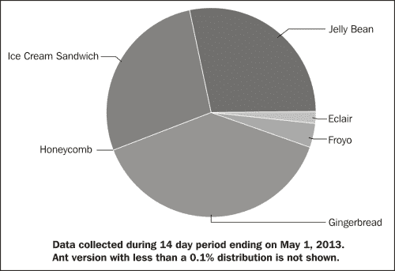
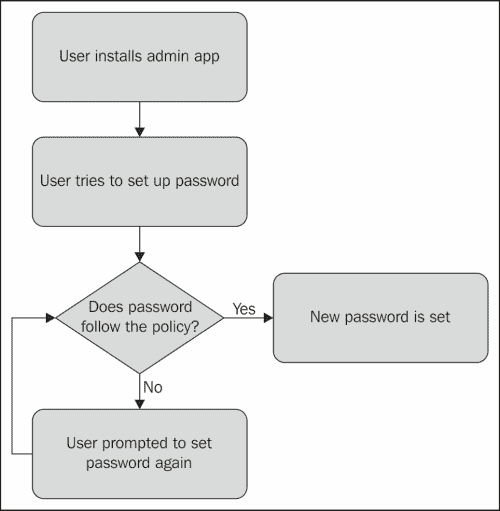
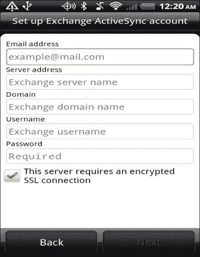
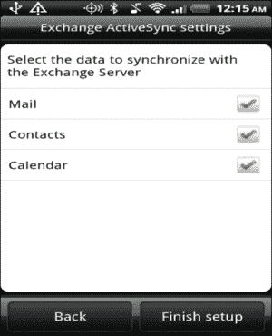
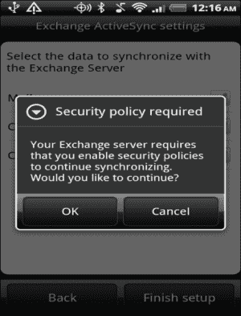
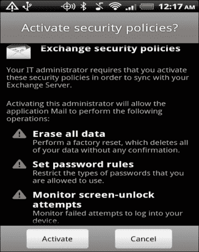
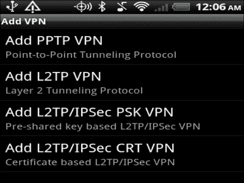
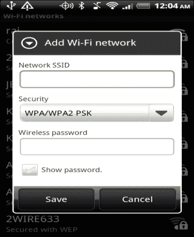
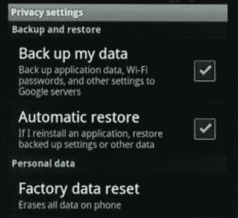
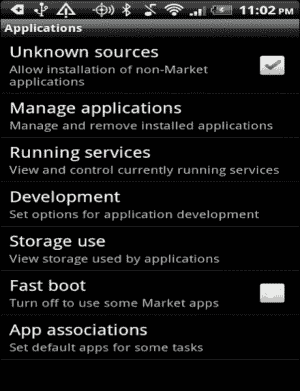

# 第八章：企业中的安卓

随着移动设备的普及，越来越多的员工将设备带到工作中，并要求企业数据能够在他们的个人或企业移动设备上访问。这带来了极大的便利，但同时也带来了日益增加的挑战。由于设备被破坏或丢失而造成的企业数据丢失成本非常高。

随着移动设备在工作场所的普及，IT 部门面临着许多挑战。第一个挑战是各种各样的移动设备，它们有着不同的外形和功能。第二个挑战是让员工接受并在特定应用程序和设备部分上接受企业控制。第三个挑战是持续支持设备管理。

本章节专注于安卓设备的管理。如果你不是为企业开发应用程序，可以安全地跳过这一章，直接进入下一章关于安卓应用程序的安全测试。

本章从设备管理的基础和安卓生态系统的独特挑战开始。其次，我们讨论设置和实施设备管理策略以及为安卓设置接收器的机制。我们还讨论了存储在设备上和传输过程中的数据的安全性。我们以提出为安卓设置设备管理的下一步建议以及设备管理员应了解的政策和合规性指南来结束本章。

# 基础知识

在企业中设备的背景下，BYOD、MDM 和 MAM 这三个术语经常被使用。我们将在本章的剩余部分继续使用它们，让我们了解它们各自的含义。

第一个术语是**自带设备**（**BYOD**）。这个术语指的是员工将自己的移动设备带到工作场所，并在个人设备上访问企业数据和应用程序的最新趋势。例如，在个人移动设备上访问电子邮件和办公文档。

第二个经常使用的术语是**移动设备管理**（**MDM**）。MDM 指的是对企业拥有或员工拥有的移动设备进行远程管理，这些设备访问企业应用程序和数据。例如远程擦除企业数据并要求用户设置密码等功能，这些都是 MDM 的例子。这些功能强化了企业对系统功能的控制。

在此背景下经常使用的第三个术语是**移动应用管理**（**MAM**）。这个术语指的是管理访问企业数据的移动设备上的软件和服务。MAM 的例子包括应用程序升级、捕获崩溃日志和用户统计信息并将其发送给 IT 部门。MAM 与 MDM 不同，因为后者专注于设备功能，而 MAM 专注于设备上安装的软件和服务。

# 理解安卓生态系统

Android 是一个具有众多定制版本的挑战性生态系统。下图展示了在撰写本书时 Android 版本的使用情况。如您所注意，在任何给定时间，都有不同版本的 Android 堆栈在使用中。理解每个版本细微差别和特殊需求本身就是一份全职工作。您始终可以在[`developer.android.com/about/dashboards/index.html`](http://developer.android.com/about/dashboards/index.html)查看最新的使用统计数据。

加上前述问题，每个制造商都有一个定制的 Android 堆栈版本，以及他们选择的功能和能力。在此堆栈之上，运营商也添加了他们的定制内容。这导致了市场的高度碎片化。



# 设备管理功能

从 Android 2.2 开始，Android 增加了越来越多的功能，使 Android 准备好迎接企业环境。后续的每个版本都在改进现有功能并增加更多功能。下表列出了特定企业功能在 Android 堆栈中添加的时间。本节将重点介绍其中一些功能：

| Android 发布版 | 企业功能 |
| --- | --- |
| Froyo（发布版 2.2） |

+   密码策略

+   远程擦除

+   远程锁定

|

| Gingerbread（发布版 2.3） |
| --- |

+   SIP 支持

|

| Honeycomb（发布版 3.0） |
| --- |

+   平板电脑的加密和密码策略

+   平板电脑的系统加密

|

| Ice cream sandwich（发布版 4.0） |
| --- |

+   扩展系统加密，对设备实施加密和密码策略

+   证书管理功能

+   VPN

+   SSL VPN 的开发者接口

+   人脸识别解锁

+   网络数据使用监控

+   离线电子邮件搜索

|

## 设备管理 API

如前表所示，从 Android 2.2 开始，Android 一直在增加对设备管理的支持。在这方面最大的步骤是在 Android 2.2 中引入了设备管理 API，以支持对需要企业级系统级控制的设备的控制。

设备管理 API 通过四个步骤进行操作：

1.  系统管理员编写一个应用程序，以远程管理设备政策。

1.  用户从 Google Play 或其他应用商店下载应用程序。用户还可以通过电子邮件安装应用程序。

1.  下载完成后，用户安装应用程序。在安装时，用户会看到将在设备上执行的政策。用户必须同意这些政策才能激活应用程序。

1.  安装后，用户必须遵守这些政策才能访问敏感信息。用户可以卸载应用程序，这将导致无法访问敏感数据。

下图展示了如果用户安装了一个强制执行密码策略的管理应用程序，要求密码必须包含特定类型的字符，流程会是怎样的：



设备管理 API 被封装为`android.app.admin`。这个包有三个类：用于定义和实现策略的`DevicePolicyManager`，包含设备管理类元数据的`DeviceAdminInfo`，以及用于实现接收器组件的`DeviceAdminReceiver`。

### 策略

策略是设备管理的重要组成部分。在撰写本书时，设备管理 API 支持的策略与密码、远程擦除、禁用摄像头、设备加密和锁定设备有关。密码策略的示例包括要求密码包含字母数字字符、密码过期和超时，以及最大密码尝试次数。当前策略的列表可以在`android.app.admin.DevicePolicyManager`中验证。

策略在`res`文件夹下的 XML 文件中定义。一个示例策略文件可以限制密码，远程重置设备到出厂设置，禁用摄像头，加密存储，并锁定设备。在安装期间，这些策略会展示给用户。

```kt
<device-admin >
    <uses-policies>
        <limit-password />
        <force-lock />
        <wipe-data />
        <expire-password />
        <encrypted-storage />
        <disable-camera />
    </uses-policies>
</device-admin>
```

新版本中会不断添加额外的策略。你可以检查当前构建版本，并根据情况实施策略。

设备管理应用程序包含`DevicePolicyManager`，它管理一个或多个设备管理接收器的策略。

```kt
DevicePolicyManager mDPMgr = 
  (DevicePolicyManager)getSystemService
    (Context.DEVICE_POLICY_SERVICE);
```

使用以下代码可以远程从手机中擦除数据。需要注意的是，市场上也有一些假的设备管理应用程序。请确保下载管理员建议的正确管理应用程序。不安全或受到木马影响的程序很容易导致数据泄露：

```kt
DevicePolicyManager mDPMgr;
mDPMgr.wipeData(0);
```

要设置加密文件系统的策略，可以使用以下代码片段：

```kt
DevicePolicyManager mDPMgr;
ComponentName mMyDeviceAdmin;
mDPMgr.setStorageEncryption(mMyDeviceAdmin, true);
```

### DeviceAdminReceiver

继承`DeviceAdminReceiver`类来创建设备管理应用程序。这个类包含了一些回调函数，当发生特定事件时会被触发。这些意图由系统发送。因此，接收器应该能够处理`ACTION_DEVICE_ADMIN_ENABLED`意图。

`DeviceAdminReceiver`需要`BIND_DEVICE_ADMIN`权限。`BIND_DEVICE_ADMIN`是一个特殊的权限，只有系统可以访问；应用程序无法访问。这确保只有系统与接收器交互。

接收器还引用了我们在上一节中讨论的元数据策略文件。以下代码片段展示了示例声明。

```kt
<receiver android:name="MyDeviceAdminReceiver"
        android:label="@string/my_device_admin_receiver"
        android:description="@string/my_device_admin_desc"
        android:permission="android.permission.BIND_DEVICE_ADMIN">
    <meta-data android:name="android.app.my_device_admin"
                android:resource="@xml/my_device_admin" />
    <intent-filter>
      <action   android:name="android.app.action.DEVICE_ADMIN_ENABLED" />
    </intent-filter>
</receiver>
```

以下屏幕截图展示了企业电子邮件的 Exchange ActiveSync 设置。这只是一个示例来说明流程。在第一张截图中，需要填写 Exchange 的实际账户详情。这些将是企业账户详情。注意选择加密的 SSL 连接：



在下一步中，用户选择应同步到设备的功能。在我们的案例中，用户勾选了 Exchange ActiveSync 提供的所有功能，即**邮件**、**联系人**和**日历**。这如下面的截图所示：



在第三步中，如下截图所示，用户必须确认他们同意在设备上实施的安全策略，如果他们决定安装应用程序并能够访问敏感信息。如果用户拒绝同意，将不会安装应用程序（在我们的案例中，**邮件**、**联系人**和**日历**将不会同步）。



在下一步中，用户将审查通过同步电子邮件实施的政策。这些是在前面示例中定义的策略文件中的政策。在我们的示例中，如下截图所示，设备管理员可以在设备丢失、员工停止为企业工作或任何其他原因的情况下远程擦除员工设备上的所有数据。第二个政策是设备管理员将设置密码规则。这些密码规则可能是以下任何一种：



## 保护设备上的数据

MDM 的主要要求是保护设备上的企业数据。Android 设备通常有两种数据存储形式：内部存储和外部（可移动）存储介质。从 Honeycomb 开始，内部文件系统挂载在`/mnt/sdcard`，外部存储挂载在`/mnt/external#`（其中`#`是外部设备的数量）。早期版本将内部存储挂载在`/mnt/sdcard`，SD 卡挂载在`/mnt/sdcard/external_sd`。Android 堆栈的定制版本可能会也可能不会遵循这些指导方针。

Android 通过全盘加密和支持加密算法来解决企业数据保护在设备上的问题。

### 加密

在 Android 3.0 中增加了支持全盘加密的能力，以防止未经授权访问用户数据。文件系统使用`dm_crypt`内核特性进行加密，并在块设备层上工作。密钥源自用户密码，使用的加密方式是带有 CBC 和 ESSIV: SHA-256 的 AES-128。主密钥或加密密钥通过使用 Open SSL 和 AES-128 进行加密。

为了使全盘加密工作，设备需要使用密码进行保护（图案密码将不起作用）。在访问文件系统之前，必须使用密码解锁设备。设备管理员可以设置一个政策，限制密码尝试次数，超过该次数设备将重置为出厂设置。

用户必须手动同意加密设备。注意，当设备首次进行加密时，设备应有足够的电量来完成加密过程。如果设备电量耗尽，那么必须将其恢复到出厂设置，所有用户数据将会丢失。

### 提示

只有设备上的文件系统被加密。外部存储，如 SD 卡，没有被加密。

如在第六章中讨论的，*你的工具 - 加密 API*，安卓堆栈支持加密和散列等加密算法。在需要将信息存储在 SD 卡上的情况下，可以使用堆栈支持的加密功能。设备管理员可以强制执行政策，要求所有存储在 SD 卡上的数据必须加密。

即使设备完全加密，用户仍然需要注意几个问题。首先是肩窥问题，在拥挤的地方，有人可能会从别人肩膀上偷看密码。人们应该注意这个问题。第二，尽管输入密码解锁手机相当麻烦，但这是为了保护企业数据的安全，建议选择更复杂的密码，而不是倾向于选择简单的密码。设备策略可能会对此提出要求。第三，请注意，只有文件系统的数据分区被加密。虽然很容易在其他地方存储数据，但出于安全考虑，任何企业数据都应该存储在数据分区中。

### 备份

谷歌为安卓设备提供备份服务。备份内容包括壁纸、设置、词典和浏览器设置等。当手机恢复出厂设置时，这些设置会被恢复。敏感数据，如密码、屏幕锁定 PIN 码、短信和通话记录不会被备份。备份服务只能通过使用`BackupManager` API 进行访问。用户需要在设置下的**隐私**选项手动开启备份功能。

谷歌不保证备份的安全性，因为不同的安卓版本实现备份的方式不同。此备份服务可能不支持所有类型的安卓设备。

## 安全连接

安卓设备原生支持 VPN。管理员可能会建议使用自定义 VPN，并可能要求所有通信都开启 VPN。这尤其在连接开放热点时特别有用。后者功能仅在安卓 4.2 及以上版本中提供。以下截图展示了我手机上支持的一些 VPN 协议：



当用户连接 Wi-Fi 时，应选择安全的无线连接。在这种情况下，用户将被提示输入密码密钥。以下截图展示了这一过程：



## 身份

Android 支持证书存储，用于在设备上存储证书，并允许授权应用在诸如电子邮件、Wi-Fi 和**VPN**（**虚拟专用网络**）的使用场景中使用它进行身份验证。Android 支持 DER 编码的 X.509 证书。它还支持存储为 PKCS#12 密钥库文件的 X.509 证书。

Android 支持 Bouncy Castle，并预装了证书。它们位于`cacerts.bks`密钥库中。

用户还可以从设备内存中安装证书。在**位置与安全**设置下，通过选择**从 SD 卡安装**选项，可以在设备上安装新的证书。用户在安装证书时应注意，安装非合法证书可能会危及设备的安全。

要删除证书，用户可以进入**个人** | **安全** | **凭据存储** | **信任的凭据**，并禁用或删除证书。

# 下一步

既然我们已经了解了 Android 支持 BYOD 的能力，本节将讨论如何利用这些知识在企业中推出 Android 支持。

## 设备特定决策

要充分利用 Android 设备的功能，设备必须与 Google 账户关联。这使用户能够访问 Google Play、位置服务以及其他一系列应用程序，如 Gmail、Drive、日历和 YouTube。设备管理员面临的重要问题是，他们是否希望员工使用个人 Google 账户还是单独的企业账户。

另一个重要的问题是启用位置服务，这可能会对一些高价值员工造成隐私风险，因为他们可能不希望被追踪。另一方面，启用位置服务可以帮助确定设备如果被盗时的位置。

第三个重要问题是备份和存储。与位置服务的情况一样，备份和存储是重要的功能，但可能会引发隐私问题。设备管理员可能会强制使用加密存储或指定一个私有的企业云。但这很快就会增加维护成本。要启用备份，用户必须明确进入**设置** | **隐私**，并选择**备份我的数据**，如下面的截图所示：



在这里，重要的是要解决 root 过的 Android 设备的问题。root 一个 Android 设备并不需要太多时间，而且相关指导随处可见。在澳大利亚、欧洲和美国，root 设备是合法的。root 过的设备不符合企业使用的安全标准。因此，检测 root 过的设备是设备管理员的一个重要考虑因素。检测 root 过的设备并不容易，因为 root 设备的方法有很多种。

然后，还有一个问题是从哪个应用商店下载企业应用程序。除了 Google Play，Android 应用程序还可以从其他应用商店下载，如亚马逊应用商店和 GetJar。上次我查看时，有超过 128 个应用商店，应用程序可以托管在任何一家。应用程序也可以从网站下载，或者通过电子邮件或侧加载获取。设备管理员可以选择建立一个企业应用商店来解决这个问题。这样可以确保这里只有合法的应用程序。为了从除了 Google Play 以外的外部位置下载应用程序，用户必须明确选择以下截图所示的**未知来源**选项：



设备管理的核心理念是，设备应该是可用的、直观的，并且在不妨碍安全的前提下保留原生体验。这是一个艰难的平衡，也是一个确定的挑战。

要紧跟 Android 不断进化和充满活力的生态系统，需要一位热爱 Android、对 Android 生态系统的即将到来的变化保持关注的 Android 专家和爱好者。为了保持你的知识是最新的，需要对用户如何与他们的设备互动以及该领域即将到来的创新有敏锐的理解。这位 Android 专家应该成为企业在 Android 设备上部署应用程序的权威和主要联系人。

## 了解你的社区

在此部署中的第二步是了解你的员工队伍的偏好、需求和需要。这一步很重要，以便做出关于你的员工需要哪些应用程序和服务的明智决定，以及需要创建何种访问控制和政策。收集有关他们的设备偏好（他们喜欢手机还是平板电脑）、他们习惯的应用程序、他们在设备上需要的访问量等信息是重要的。另一个因素是地理多样性。没有一种解决方案适合所有情况。不同的地点有不同的首选设备，他们自己的首选应用程序，以及与设备上的企业数据的互动程度。

## 定义边界

明确哪些设备是被接受，哪些不被接受，将有助于处理 Android 的碎片化问题。这些边界应该基于功能而不是版本或发布，因为不同的制造商和运营商会在不同的设备上以不同的方式移植相同版本。

另一个需要定义的边界是信任。公司的**信息技术** (**IT**) 部门应根据设备能力的提升允许增加访问权限。例如，如果一个设备不支持全磁盘加密，它们只能读取数据，而不能将数据存储在设备上。鉴于 Android 开放的 应用生态系统，对用户在设备上安装的应用程序进行定期监控也很重要。

第三种边界是用户可以在其设备上安装的应用程序。Android 应用程序可以从不同的来源安装，这些来源在安全性上并没有像苹果 App Store 那样严格筛选应用程序。定义哪些应用程序允许安装，哪些不允许，将大大有助于保持设备的安全。

### 安卓兼容性计划

开放性是 Android 生态系统的目标。然而，为了在不同设备上提供一致的用户体验，OEM 必须参与 Android 兼容性计划。此计划向 OEM 提供工具和指导，以便他们正确标记设备并确保应用程序按预期在设备上运行。这对于 IT 人员来说是一个有趣的计划，因为他们可以根据兼容性级别定义自己的边界。

兼容性计划提供了三个关键组件：

+   **兼容性定义文档** (**CDC**): 这是关于兼容性的政策文件。它定义了兼容堆栈的要求。例如，它列出了一系列被认为是 Android 堆栈核心的 Intents，并且应该始终得到支持。

+   **兼容性测试套件** (**CTS**): CTS 是一个免费的测试套件，可在桌面上运行，用于在模拟器或设备上自动执行兼容性测试。在撰写本书时，CTS 包括单元测试、功能测试和健壮性以及性能测试的参考测试，未来还有计划增加更多测试。一些例子包括检查硬件特性，比如 Wi-Fi 和蓝牙。

+   **兼容性测试套件验证器** (**CTS Verifier**): CTS 是一个免费的测试套件，在桌面上运行，需要手动输入以在模拟器或设备上运行兼容性测试。它是 CTS 的补充。

根据上述标准，市场上存在三种类型的 Android 设备。以下表格展示了每种兼容性类型的关键特性：

| 谷歌领先设备 | 谷歌体验设备 | 其他（开放）设备 |
| --- | --- | --- |

|

+   纯正的 Android，100%由谷歌引领

+   无 OEM 或运营商定制

+   例子：三星 Galaxy Nexus，摩托罗拉 Xoom，HTC Nexus One

|

+   CTS 合规

+   OEM 和运营商定制

+   应符合谷歌升级承诺

+   例子：三星 Galaxy S11，HTC Rezound

|

+   非 CTS 合规

+   高度由 OEM 和运营商定制

+   例子：Kindle Fire，摩托罗拉 ET1 平板电脑

|

你可能会决定只支持提供一致特性并有一定定制体验的领先设备。

## 推出支持工作

规划分阶段的方法来推出对 Android 设备支持。IT 部门可以先进行试点推广，然后逐渐扩大范围。这有助于两个方面：首先，IT 部门可以确定他们的支持基础设施是否能够随着用户数量的增加而扩展；其次，他们可以根据收集到的使用统计数据调整支持。随着支持范围扩大到更多员工，可以修复任何错误和遗漏的需求。

在此推广过程中，通过培训、维基、海报和警报教育员工，将帮助员工了解正在发生的事情。这也帮助他们理解为什么允许某些设备而排除其他设备，他们可以期待什么，以及如何在设备上安全访问企业数据。

## 政策与合规性

在回顾所有前面的步骤时，不要忽视该领域新兴的标准和合规性。同时，要紧跟 BYOD、MDM 和 MAM 领域的研究进展，以及不同公司采用的创新方法。

### 金融行业监管局（FINRA）

**金融行业监管局（FINRA）** 是美国所有证券公司中最大的独立监管机构。FINRA 的使命是通过确保证券行业的公平和诚信运作来保护美国投资者的利益。他们发布了关于监管其会员公司移动设备电子通信的指导方针。这些方针需要与公司自身的分析相结合来考虑。更多信息请访问 FINRA 的网站：[www.finra.org](http://www.finra.org)。FINRA 发布了三项通知，以应对个人移动设备和社交网站日益增多的情况。在所有情况下，它都建议应对所有员工进行适当的培训，包括维护记录、审慎在社交媒体网站发布内容，以及持续的监管。

FINRA 在 2007 年 12 月发布了他们的第一个监管通知 07-59（[`www.finra.org/web/groups/industry/@ip/@reg/@notice/documents/notices/p037553.pdf`](https://www.finra.org/web/groups/industry/@ip/@reg/@notice/documents/notices/p037553.pdf)）。该通知提供了通过移动设备监管电子通信的核心指导原则。它建议企业电子邮件应始终通过企业电子邮件系统流转，不应通过个人账户转发。这些企业电子邮件应只通过受监控的网络流转。这将使得电子邮件得到适当的监管。

美国金融业监管局（FINRA）在 2010 年 1 月发布的第二份监管通知 10-06，主要关注社交媒体网站和博客的使用（[`www.finra.org/web/groups/industry/@ip/@reg/@notice/documents/notices/p120779.pdf`](http://www.finra.org/web/groups/industry/@ip/@reg/@notice/documents/notices/p120779.pdf)）。该通知建议员工不应在社交媒体网络上使用商业账户。这些网站应持续监控以避免员工发布误导性信息，因为这可能会对投资者产生不利影响。

2011 年 8 月发布的第三份监管通知 11-39，进一步扩展了关于个人设备和社会媒体网站指导方针（[`www.finra.org/web/groups/industry/@ip/@reg/@notice/documents/notices/p124186.pdf`](http://www.finra.org/web/groups/industry/@ip/@reg/@notice/documents/notices/p124186.pdf)）。该通知指出，只要确保信息可检索且与个人通信分离，员工可以使用个人设备进行通信。对设备的持续监督和培训至关重要。

### 安卓更新联盟

遵守标准并不总是容易的。在 2011 年 5 月的 Google I/O 大会上，谷歌与许多其他设备制造商承诺，将在任何新版本安卓发布后的 18 个月内更新设备。这个联盟被称为安卓更新联盟。这个想法很高尚，受到了好评，但原始设备制造商（OEM）很难跟上这一承诺。

# 摘要

在本章中，我们重点关注了公司及员工所有访问企业数据的设备的管理。携带个人设备办公（BYOD）面临的问题包括信任、合规性、治理和隐私，因为越来越多的员工要求在他们的移动设备上访问企业数据。用户体验与安全之间需要精妙的平衡。我们从复杂的安卓生态系统开始，接着讨论设备管理的实施细节以及安卓堆栈提供的企业其他功能。我们以关于合规性和政策的讨论结束本章，并考虑下一步如何在企业领域支持安卓。

现在，是时候进入下一章，从安全的角度讨论测试安卓应用程序。祝阅读愉快！
