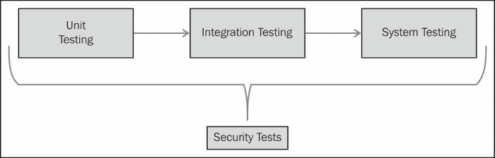
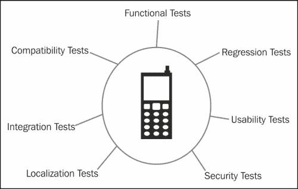
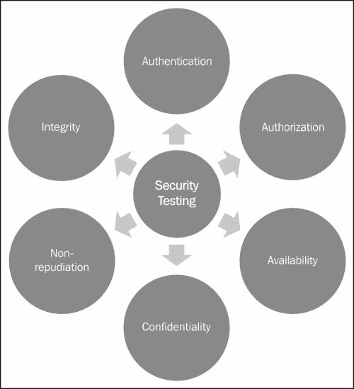
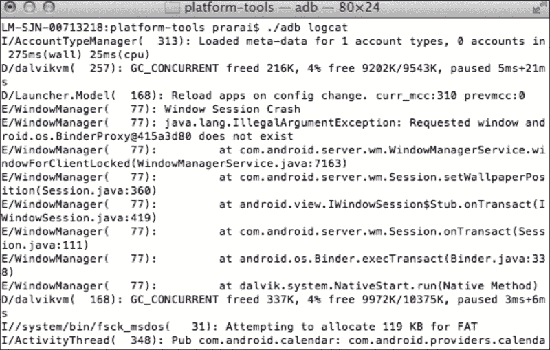
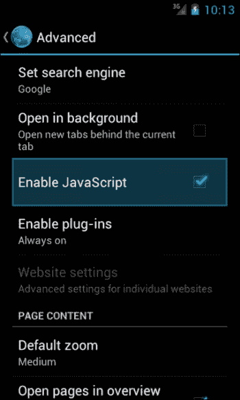
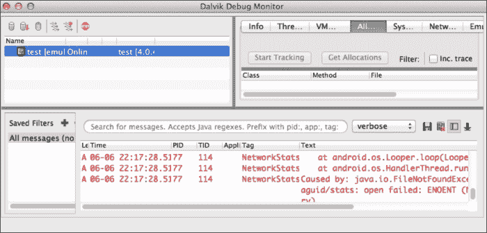
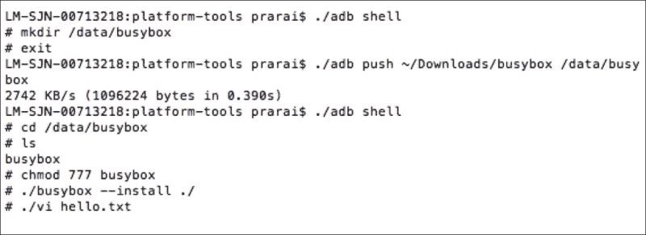
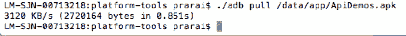
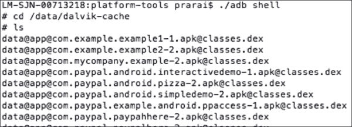
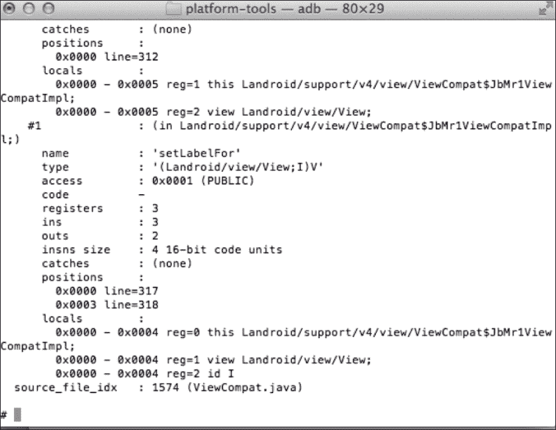

# 第九章：安全测试

这无疑是本书最重要的章节。作为开发者，我们都在努力编写优美、可用且安全的代码。我们都体验过伟大想法的兴奋和看到它实现的冲动。我们的工作安排和截止日期也常常很疯狂。因此，出现 bug 是自然的，而 bug 测试是任何编码生命周期的一部分。

目前大多数测试用例关注于可用性、功能性和压力测试。在大多数情况下，当涉及到安全测试时，测试工程师往往不知所措。当合规性和安全被忽视时，有时应用程序需要重新设计或实现。以创建消息摘要为例，用于确保完整性。开发者可能会选择 SHA-1，它产生一个 160 位的摘要。在服务器端，数据库被设计为容纳 160 位数据。一个非道德的黑客入侵了应用程序。在进行安全审查时，决定 SHA-1 对于该用例来说不够强大，需要更新到 SHA-256。由于数据库仅被设计为容纳 160 位，因此在客户端快速修复变得具有挑战性，因为整个设计必须改变。事情现在变得严重了。尤其是在考虑到移动生态系统快速发展和变化的情况下，这真是浪费时间。

本章节旨在介绍以安全为重点的测试概念。章节首先概述了测试。如果你已经熟悉测试，可以轻松跳过这一部分。下一节将讨论安全测试以及你可以如何测试应用程序的安全性，即安全审查、手动测试和利用工具的自动化测试。接下来的部分讨论一些可以作为编写测试基线的安全测试用例示例。章节最后讨论了开发者和测试工程师在开发测试用例和进行安全测试时可以使用的一些工具和资源。

# 测试概述

由于设备能力、外形和版本的不同，Android 是最具挑战性的操作系统之一进行测试。即使是获取基本的功能和用户体验本身就是一个挑战。下图说明了通常在 Android 应用程序开发背景下执行的测试。正如我们这个时代伟大的密码学家 Bruce Schneier 恰当指出的那样，“安全不是一个产品，而是一个过程”，因此你会注意到，我已经将安全测试添加到应用程序测试的整个生命周期中。



让我们花点时间了解从 Android 的角度看，单元测试、集成测试和系统测试各自的含义。

+   **单元测试**：在大多数情况下，编写模块的开发人员也会开发单元测试。开发人员在将代码交给测试工程师之前，应该编写并单元测试他们的模块。Android SDK 附带了用于单元测试的仪器化 API。这个框架是基于 JUnit 实现的，JUnit 是 Java 单元测试中一个流行的框架。单元测试可以很容易地自动化。这些测试涵盖了边界测试、输入验证测试以及与后端的连接测试。

+   **集成测试**：单元测试完成后，不同的组件开始集成时，进行集成测试以确保不同的组件能够协同工作。这些测试是在组件捆绑在一起时执行的。设想有两个团队分别独立工作，一个负责登录模块，另一个负责搜索结果页面。一旦模块开发完成并且它们被集成在一起，就应该执行测试，检查这两个模块的组合。如今，大多数开发环境都使用持续集成来执行一些基本的健全性测试，以确保这两个模块能够一起编译。

+   **系统测试**：这些测试针对整个应用程序以及应用程序与 Android 平台的交互进行测试。系统测试的一些示例包括在不同平台上测试搜索功能以及基于 Android 的设备差异如何影响搜索结果的显示。

    安全测试应该在测试的每个阶段执行。例如，在单元测试级别，开发人员应该测试不一致和错误的输入值、缓冲区溢出以及用户的访问级别。

    在集成级别，工程师可以测试两个模块之间安全数据传输以及传递错误数据时的行为。

    在系统测试阶段，工程师可以测试他们的应用程序在不同 Android 平台上的外观和行为。在 Android 的情况下，由于不同厂商和运营商的 Android 设备和堆栈能力存在差异，这一阶段尤为重要。

    流程中提到的任何测试套件通常都包含不同类型的测试混合。这些在以下图中有所说明。请注意，我再次在混合中加入了安全测试。

    

+   **功能测试**：这类测试检查应用程序是否表现出预期行为。例如，登录功能的功 能测试将检验用户输入用户名和密码并按下*回车*的情况；如果凭据有效，用户将能够登录系统，否则将显示错误。你可能还想验证在不同错误情况下是否生成了正确的错误消息。

+   **本地化测试**：如今，大多数应用程序都是全球性的，在不同的国家可用。为了支持不同的地区，应用程序必须进行本地化和国际化。本地化指的是语言翻译，而国际化是指根据特定地区的规范调整应用程序。例如，考虑一个适应接受日语地址的视图的情况（即你想支持日本作为国家）。本地化会将地址行 1、地址行 2、城市、州、邮编和国家翻译成日语对应的内容。然而，在日本，地址系统与罗马系统不同，接受地址的视图将不得不重新设计，一些标签可能需要重新排列。

    安卓有一个非常用户友好的框架，用于存储字符串和本地化视图，开发者应该充分利用这一点。在新的市场推出应用程序时，最好咨询本地化专家的意见。

+   **可用性测试**：也称为 UI 测试，这些测试关注用户界面的外观和感觉，确保用户能够轻松输入、在屏幕上阅读信息，以及改变应用程序的美观和总体流程。在屏幕空间受限的设备和不同屏幕尺寸的设备上，可用性非常重要。

+   **硬件兼容性测试**：这一系列测试将针对在不同设备上测试应用程序中使用的硬件特性。例如，如果一个应用程序使用了设备相机，就应该进行测试，以检查代码是否在不同设备相机和不同的对焦能力下正常工作。

+   **回归测试**：这些通常是自动化测试，在应用程序每次更改后运行，以确保应用程序仍然按预期工作。例如，在书店应用程序中，您可能会确定关键功能，如登录、登出、搜索书籍以及将书籍添加到愿望清单。每当添加新功能或更新现有功能时，都会执行这些健全性测试，以确保没有破坏任何功能。

以下各节将详细讨论安全测试。

如您所料，这些测试案例中的大多数是相互协作的。例如，要测试新国家的地址页面，本地化和 UI 测试必须同时进行。

# 安全测试基础

本章节概述了安全测试。我们讨论了可以围绕其开发安全测试的安全支柱。第二部分讨论了不同类型的安全测试。

## 安全原则

任何类型的应用程序安全测试都应遵循安全的六个原则，即认证、授权、可用性、保密性、完整性和不可否认性。我们在第六章，*您的工具 – 加密 API*中涵盖了这些概念的大部分内容以及如何实现它们。



*认证*是识别用户的措施。你可以使用来自 Facebook、Twitter、LinkedIn 和 PayPal 等公司的认证 API。主要使用的协议是 OAuth 和 OpenID Connect。这些技术将认证任务从应用程序中卸载。这对于应用程序开发者和用户来说都是一个双赢的局面。应用程序开发者不需要实现自己的方案，可以使用内置的认证机制。用户不需要与不信任的应用程序共享个人信息。这对于开发此类方案的公司来说非常有用，因为它可以引导流量到他们的网站。这些技术大多数基于为用户提供一个认证令牌。

第十章，*展望未来*，讨论了认证方面的一些新进展。

授权是指访问控制——确定用户是否有适当的权限来访问资源。在 Android 的情况下，这可以通过保护应用程序组件的权限并在可能的情况下检查调用者身份来实现。

*可用性*意味着数据应在需要时对授权用户可用。使用带有数据的广播和意图可以确保这一安全措施。

*保密性*是指确保数据安全，只向预期的方透露数据。对数据加密、使用适当的权限、并符合 Android 沙盒可以帮助实现这一安全措施。

*完整性*意味着数据在传输或静态存储过程中未被修改。如果数据被篡改，这种篡改可以被识别出来。添加消息摘要、数字签名以及无论是在传输过程中还是静态存储时对数据进行加密，都可以帮助保持数据的完整性。

*不可否认性*可以通过使用数字签名、时间戳和证书来实现，确保发送方不能否认发送数据。在第六章，*你的工具 - 加密 API*中讨论的 DRM（数字版权管理）被实施，以使用户不能否认接收内容。

## 安全测试类别

在牢记刚刚讨论的安全原则的基础上，安全测试可以分为三个类别：应用程序审查、手动测试和自动化测试。

### 应用程序审查

安全测试的第一步是应用程序审查过程。这个过程关注于理解应用程序，并识别应用程序所使用的硬件、不同技术和功能。一旦识别出这些特性，审查者就会尝试访问这些功能中的安全漏洞。审查过程识别出的问题包括清单文件中明显的问题、使用破损或弱加密、协议的不安全使用以及在开发过程中可能遗漏的技术和硬件安全问题。它涵盖了合规性和标准，以及是否适当遵守了这些标准。

在清单文件中可以识别的一些安全问题示例包括：清单文件中不必要的权限，应用程序实际上不需要但为了调试目的而添加的权限，未使用权限保护组件，忘记关闭调试模式，以及日志语句等。

合规性基于用例。根据应用程序编写的用例，应用不同的标准。例如，支付和商务用例应用程序可能会关注 PCC-DSS 标准。基于地理位置的应用程序则必须注意隐私问题。

目前有一些专门从事移动应用程序审查过程的安全审计公司。如果你有疑问，应该使用这些公司。

### 手动测试

如其名称所示，手动安全测试是在开发过程中或由测试工程师手动完成的。工程师通过输入不同的数据来观察应用程序在不同场景下的行为。例如，查看日志以验证没有敏感信息泄露，多次返回上一个活动以观察应用程序的表现，尝试破坏应用程序的认证方案，以及检查用户是否具有适当的访问权限。无法自动化的场景也属于这一类。有一些公司如 uTest（[www.utest.com](http://www.utest.com)）雇佣手动测试人员可以为你的应用程序执行手动测试。

### 动态测试

也称为自动化测试，这些测试理想情况下是通过编写测试脚本来执行的。如输入验证、压力测试、模糊测试和边界测试等测试可以很容易地自动化。这些测试大多数可以轻松地成为标准开发/测试周期的一部分，并在添加新功能时作为健全性测试。你可能会决定使用专门从事此领域的安全公司的服务，如 Device Anywhere（[www.deviceanywhere.com](http://www.deviceanywhere.com)）。

# 样本测试案例场景

在本节中，我尝试列举了一些从安全角度出发有趣的样本测试案例。它们没有特定的顺序，你可以在为特定用例识别测试案例时参考它们。

## 服务器端测试

移动生态系统非常有趣；它年轻且仍在不断发展。应用程序可能希望将数据发送到服务器，但服务器接收到的内容可能大相径庭。这可能是因为通信通道出现问题，黑客窃听并更改传输中的内容，或者是因为客户端的问题。无论原因是什么，仅测试应用程序是不够的，服务器测试对你的应用程序的安全性至关重要。这些测试关注的是服务器端是否接收到了预期的内容，PII 是否以明文形式存储在服务器上，如果业务逻辑驻留在客户端，那么它是否正常工作。我们在第六章，*你的工具 - 加密 API*中讨论了这一点。

这个测试领域已经成熟，并且有大量的示例和工具可用于服务器端测试。使用像 Nmap 这样的端口扫描工具可以轻松检查开放端口和防火墙。

## 测试网络

基础设施层是移动设备的支柱，使移动性无处不在。它也带来了新的挑战和测试案例。设备使用不同的协议与服务器通信，每种协议都带来独特的安全漏洞。GSM 容易被破解；Wi-Fi 本质上不安全，特别是当你连接到恶意热点时。**长期演进**（**LTE**）是一种新的高速无线数据通信标准，基于 IP 但尚未经过彻底测试，而 NFC、蓝牙和 RFID 等邻近技术带来了完全不同的测试范式。因此，测试你的应用程序所使用的技术并围绕它构建测试案例是非常重要的。

## 保护传输中的数据

如果你的应用程序使用**传输层安全**（**TLS**），这是好的，但请确保它被正确实施，因此需要测试它。测试客户端和服务器之间的所有通信是否都已加密，并且没有 PII 或密钥在明文中传输。记住，序列化不是加密，混淆也不是加密。确保服务器正在检查证书验证和证书过期。检查所使用的加密算法和协议是否当前、对于你的用例足够安全。

## 安全存储

将敏感数据如私钥、用户名、密码及其他个人识别信息（PII）存储在客户端始终不是一个好主意。理想情况下，这些信息应当存储在服务器上。将密钥与它加密的数据一起存储违背了安全的目的。如果必须在客户端存储密钥，首先，它们不应当以明文形式存储；其次，它们不应当存储在文件、缓存文件或共享首选项中。密钥应当存储在`keystore`中，密码在`AccountManager`中，所有敏感信息应以加密方式存储。在大多数情况下，可以存储哈希值而不是密码。

## 行动前的验证

验证在不同应用程序组件之间以及来自其他应用程序传递的输入、数据和调用者。任何 Activity 都可以在 Intent 中封装任何类型的数据，而接收组件有责任在采取行动之前进行测试和验证。我们在第二章中详细讨论了这一点，*应用程序构建块*。在这种情况下，测试将包括向组件传递无效和错误的数据，并观察它的行为。

在某些情况下，你可能可以在处理来自他们的请求之前检查调用者的身份。使用它！特别是在启动敏感操作之前，检查调用者身份和你将要处理的数据。

## 最小权限原则

这类测试包括检查不同应用程序组件的权限，并确保它们具有正常功能所需的最小权限。这包括检查文件、缓存文件和`SharedPrferences`的可见性和可访问性权限。检查它们是否真的需要`MODE_WORLD_READABLE`或`MODE_WORLD_WRITABLE`权限。

检查你的应用程序请求的权限。例如，如果你不需要精确的位置访问权限，只需请求粗略的位置权限，如果你只需要读取短信，就不要请求读取和写入短信的权限。随着消费者对移动领域安全问题的认识不断提高，如果应用程序请求的权限没有意义，他们可能会对你的应用程序产生怀疑。对于浏览图书的应用程序来说，访问用户联系人列表和设备摄像头是没有意义的。

## 管理责任

了解你所在领域的规则和法规。涉及责任诉讼是一件麻烦的事，最好避免。另外，如果使用专门处理这些问题的第三方工具和服务是有意义的，那么请务必使用它们。如果你的应用程序收集用户数据，请确保你已经从用户那里获得了适当的同意，并且你收集的所有内容都已列出。例如，加州在线隐私保护法案规定，如果一个应用程序在加州收集信息，那么它应该被公开。

让我们以一个处理支付的应用程序为例。不要试图自己开发，而应使用现有的支付解决方案，如 PayPal。支付处理涉及用户的资金，有诸如 PCI-DSS 这样的指导方针来规定如何使用这些功能。

同样，与其设计和开发自家的安全算法和协议，不如使用经过时间和行业测试的安全套件和库。

了解你的应用程序在支持的国家将如何被使用。不同的国家有不同的规则和法规。个人识别信息（PII）的定义也有所不同。

## 清理

首先，不要记录敏感信息。在将应用程序发布到野外之前，确保关闭调试。从文件、cookies 和缓存中清理所有敏感信息；即，清零内存。

## 易用性与安全性的权衡

平衡易用性和安全性是一门棘手且微妙的艺术。应用程序可能为了方便而持久保存用户名、密码和会话令牌，但这也会使安全性降低。如果你的应用程序中有记住用户身份的功能，要权衡便利性和安全性。你可能决定限制会话长度，以及限制保持 cookies 和令牌存活的时间。

## 认证方案

这里的问题是，你是想要验证设备还是用户？设备可能会丢失或被盗。基于设备特性如 IMEI、IMSI 或 UDID 来识别用户可能不是一个很好的验证方案。这些会导致远程擦除和重置。你可能需要评估基于生物特征的验证机制或双因素验证方案来验证用户。

## 以黑客的思维思考

以黑客的思维去测试，想象他们会如何尝试攻击你的应用程序。利用互联网上已有的工具和漏洞。使用黑客的工具进行测试可以揭示黑客在试图破解你的应用程序时能看到什么，能得到什么信息。有一些工具，比如 Fiddler （[www.fiddler2.com](http://www.fiddler2.com)），你可以用来监控应用程序的网络流量。重要的是要记住，混淆代码并不是安全。

## 谨慎集成

无论是与硬件（内部和外部）还是第三方应用程序集成，都要小心谨慎。

如果应用程序使用了某些硬件组件，如摄像头、蓝牙、NFC 芯片、加速度计、麦克风或 GPS，那么测试它们的安全性也很重要。任何硬件的缺陷都可能影响应用程序的整体安全性。

同样，第三方库中的错误可能导致应用程序受到威胁。在与这样的外部库集成时，要求查看他们的测试结果，在线查找并寻求推荐。

# 安全测试资源

本节重点介绍可以创造性地用于测试应用程序安全的工具、技术和其他资源。

## OWASP

**OWASP**（**开放网络应用安全项目**）是一个致力于移动安全的组织。它们在移动安全领域提供工具和研究。查看它们的网站 [`www.owasp.org`](https://www.owasp.org)。这是寻找与安全相关问题的好地方，为开源贡献，创新并参与移动安全讨论。OWASP 每年都会整理一份十大安全漏洞列表，并挑战社区去解决这些问题。

## 安卓工具

Android 提供了一系列可以创造性地用于测试应用程序的工具。除了测试，这些工具还可以帮助开发者调试他们的应用程序。

### Android 调试桥

**Android 调试桥**（**ADB**）可用于日志、内存检查等多种用途。你可以在开发者网站上查看 ADK 提供的完整功能列表。下方的截图展示了一些 ADB 的使用示例：



之前的截图展示了使用`adb logcat`命令的示例日志。

### 设置设备

为了设置用于监控 Web 应用程序的高级设置，你可以开启高级功能，以便在渗透测试期间获取更多数据。



之前的截图显示了如何启用 JavaScript 和插件来检查信息泄露。

### SQlite3

使用 SQLite3 工具，用户可以探索它创建的数据库以及一些与平台捆绑的其他数据库。

SQLite 工具允许用户查询数据库并检查数据库中的值。这种数据库的查询和检查可以指出诸如以明文存储 PII 等问题。

### Dalvik 调试监控服务

**Dalvik 调试监控服务**（**DDMS**）是 Android 框架提供的另一个重要工具。DDMS 提供了如端口转发、屏幕截图、线程和堆信息、`logcat`进程、以及无线电状态信息、来电和短信欺骗、位置数据欺骗等功能。下方的截图展示了 DDMS 的窗口。你可以在 Android 开发者网站上查看这些功能的具体详情。



还有一些其他第三方工具，如由 iSecPartners 开发的 Intent Sniffer 和 Manifest Explorer（[`www.isecpartners.com`](https://www.isecpartners.com)）。其他 Linux 工具如`strace`和`procrank`也可以使用。你可以使用下面章节讨论的 BusyBox 来实现这一目的。

## BusyBox

BusyBox 被称为嵌入式 Linux 的瑞士军刀，提供了许多 Unix 工具，如`vi`、`whoami`、`watchdog`等。这些工具可以在不 root 手机的情况下用于测试。在 Android 上安装 BusyBox 非常简单。只需从[www.busybox.net](http://www.busybox.net)下载即可。



如前一个截图所示，`busybox`可以轻松地推送并安装。安装后，可以轻松执行 Linux 命令。

## 反编译 APK

反编译 APK 并阅读其内容相对简单。进行这项练习可以帮助你理解黑客将如何接近你的 APK。

APK 文件实际上只是一个 ZIP 文件，将 APK 文件重命名为 ZIP 文件后，你可以使用任何 ZIP 文件浏览器打开它。这些文件位于`/data/app`目录下。你可以使用`adb pull`命令将其拉到你的机器上。在其中，你可以看到清单文件、资源、资产以及其他文件。



接下来，使用 Android 提供的`dexdump`工具，可以转储`/data/dalvik-cache`目录下的类。



举个例子，要将`data@app@com.example.example1-1.apk@classes.dex`转储到一个名为`dump`的文件中，需要使用的命令是：

```kt
dexdump –d –f –h data@app@com.example.example1-1.apk@classes .dex > dump

```

以下是在转储文件中收集的数据类型的截图：



这个转储将以跳转语句的形式出现，难以阅读。可以使用如`baksmali`或`dedexer`这样的 DEX 反编译器，使这些文件更具可读性。

# 总结

安全测试是一个相对较新的领域。模式和测试策略仍在发展中，安全已成为识别应用弱点、提高应用质量的重要基准。在本章中，我们将之前所有章节的学习成果汇集起来，用它来定义应用程序的测试用例。这只是一个开始，你应该根据你的使用情况，定义你认为合适的测试用例。

我们首先概述了测试的基本原理。然后，我们讨论了围绕六个安全支柱设计的测试用例。我们讨论了一些示例测试用例，这些用例应该为你测试应用程序提供了一个基础。最后，我们讨论了你可以用于以安全为重点的测试资源和工具，以此结束了这一章节。

现在让我们走向本书的最后一章，看看在 Android 领域有哪些新的挑战在考验我们的安全基础知识。
