# 第十章：展望未来

恭喜你阅读到了最后一章！那么让我们在这一章中找些乐趣，尝试预测未来。

移动是一个相对较新的领域。它正处于实验阶段，一些技术和用例取得了成功，而其他技术可能没有得到预期的那么多的关注。本章的重点是研究移动领域内一些新技术和用例。

本章分为多个部分，每部分讨论了在移动领域对某些技术或用例的实验。我们将从移动商务的讨论开始，重点关注产品发现、支付和利用移动设备进行销售点的操作。接下来将讨论近距离技术，如 NFC、RFID 和蓝牙。接下来的部分将谈论移动设备在医疗保健和身份验证方面的应用。在最后一节中，我们将从安全的角度讨论硬件方面的最新进展。

# 移动商务

消费者行为正在改变商务模式。如今，商务已不再仅仅是到商家或商店选购产品并付款的简单行为。如下所示，随着新技术的出现，移动商务包括使用地理围栏进行产品发现、店内和在线研究、通过自助扫描和自助结账进行支付、与朋友分享购买内容，以及管理账户。我们也看到在线和离线商务之间的界限越来越模糊。

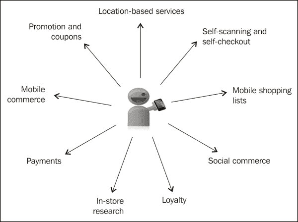

在接下来的几节中，我们将从安全的角度讨论商务的不同组成部分。

## 使用移动设备进行产品发现

产品发现是寻找产品的过程。商家使用不同的机制，要么吸引顾客到实体店，要么鼓励他们在线购买。产品发现还包括如购物清单、比较购物和有关产品的信息等功能，这些都有助于消费者购买产品。移动设备非常适合这种用例，因为消费者可以实时获取产品信息并检查产品的可用性。

移动领域的一些示例应用包括条形码扫描、基于位置的购物、有针对性的广告、用户进入零售店时所获得的积分和优惠、创建购物清单并在消费者接近拥有购物清单商品的商店时提醒他们，以及将会员卡存储在钱包中的能力。

从安全的角度来看，最大的挑战是隐私问题。针对性的广告和地理围栏是基于对用户数据及其购物模式的分析。应用程序开发者在使用和收集用户数据及偏好时，应了解相关法律法规，并在使用或共享数据时遵守这些法律法规。在几乎所有情况下，收集信息之前都需要用户同意。此同意声明应包括正在收集的内容以及是否将与第三方共享。在添加新功能或更新或扩展现有功能时，请注意更新此用户同意。

## 移动支付

支付是移动商务中最大的组成部分。在任何支付用例中，都有三个主要实体：消费者（也称为买家）、卖家或商家以及支持支付的基础设施层。

### 配置

消费者可能正在使用移动设备搜索并支付产品，商家可能正在使用移动设备，或者消费者和商家可能都在使用移动设备。理想情况下，在交互期间这三个实体都应该连接。这是完全连接的情况，到目前为止，这是支付的最安全渠道。用户从 eBay 的移动网站购买商品是一个完全连接的例子，如下面的图所示：

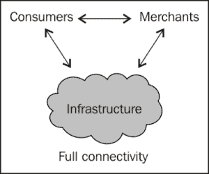

然而，在某些情况下，它们可能会断开连接。当消费者和商家都连接到基础设施，但彼此之间并未连接时，这就是以基础设施为中心的连接性案例。一个例子是地理围栏，当用户靠近商店时，他们会收到商店的优惠券。在这种情况下，商店和用户都在与基础设施对话（第三方或运营商），但彼此之间并未交流。另一个案例是用户通过使用销售点终端的设备结账。在这种情况下，用户将设备用作身份验证机制，但不一定连接到基础设施层。这是以商家为中心的连接性案例，商家连接到消费者和基础设施，但消费者断开了连接。还有一种情况是，消费者同时与基础设施和商家对话，但商家断开了连接。例如，当用户从自动售货机购买苏打水时，售货机可能会在特定时间间隔与后端同步，否则可能会断开连接。以下图示了部分连接配置：

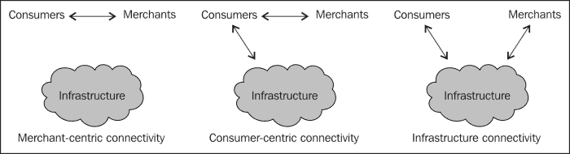

在部分连接中，基本的 security 挑战是端到端的安全问题。由于在任何时候都只有三个连接中的两个，客户端或服务器端的任何陈旧状态都很难被检测到。然后，还有客户端-商家身份验证、通信认证和隐私问题，如下面的图所示：

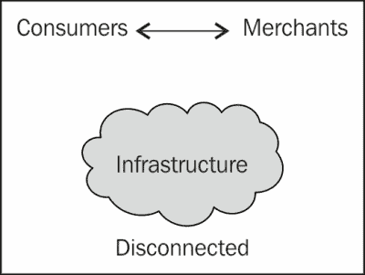

然后还有一种断开连接的情况，即商家和消费者相互交流，但没有人与基础设施层交流。在这种情况下，维护设备的完整性是一个挑战。以消费者在销售点终端尝试使用优惠券为例。

消费者可能会继续多次使用优惠券，而无法与服务器同步以更新优惠券状态的**PoS**（**销售点**）终端将无法检测到欺诈行为。同样，客户端证书可能已经过期或被撤销，但商家设备将不会意识到这一点。如果你的应用程序被设置为在这样的场景下工作，那么离线应该只有有限的功能集。涉及 PII 或金钱的情况最好是完全连接或至少是部分连接的情况。

作为一名应用程序开发者，应该了解你的用例是如何工作的。如果你的应用程序可以在部分或无连接的情况下工作，那么在处理支付时你需要采取额外的安全措施。

### PCI 标准

**支付卡行业**（**PCI**）是一个独立组织，致力于提高支付用例中安全性的意识。他们开发了一套通用的支付标准，以确保用户安全不受损害。PCI **PTS**（**PIN 交易安全**）适用于接受支付的附加设备；PCI **P2PE**（**端到端加密**）适用于基于硬件的安全，而 PCI **DSS**（**数据安全标准**）适用于安全管理、政策、程序、网络架构、软件设计以及其他关键保护措施。最新的版本是 2.0，它帮助组织有效地保护用户数据。它有六个核心目标，作为十二个核心要求实施。这些在以下图表中列举：

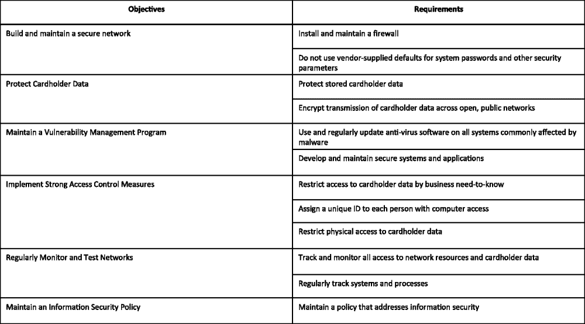

作为处理支付的应用程序开发者，应该了解 DSS。支付是复杂的，以安全的方式正确处理支付本身就是一项挑战。因此，你可能希望使用现有的支付提供商，例如 PayPal。

关于 PCI 的更多信息可以在他们的网站 [pcisecuritystandards.org](http://pcisecuritystandards.org) 上找到。

### 销售点

移动销售点（PoS）是随着移动设备的普及和本章前面讨论的邻近技术的使用而变得可行的一种应用。你的移动设备本质上充当销售点终端，可以管理你的账本和当天的所有交易。像 PayPal 和 Square 这样的公司提供的解决方案使用手机音频插孔来接入刷卡设备。该设备读取信用卡详细信息，并以加密形式将其发送到设备上。其他解决方案还包括移动销售点终端。

作为应用开发者，最好是与现有解决方案集成，而不是试图重新发明轮子。但是，在选择解决方案之前，记得要问一些问题。首先，你需要询问解决方案提供商是否采取了适当的安全措施来加密数据。请注意 PCI DSS 和 PCI PTN，正如我们在前面的章节中讨论的那样。处理、存储或传输信用卡号码的零售商必须符合 PCI DSS 标准，否则他们可能会失去处理信用卡支付的能力。由于不同国家之间的信用卡基础设施存在差异，必须采用不同的技术来读取信用卡/借记卡。例如，在欧洲，芯片和密码技术是标准，因此你的 PoS 支付提供商应该在各个领域都有解决方案。你可能希望选择一个提供商，通过它可以管理你的信用卡以及支票、现金和其他形式的支付。

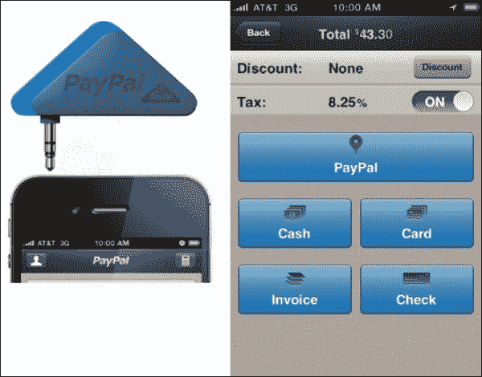

前一个图展示了一些移动销售点解决方案的例子。第一张图片是北美地区的 PayPal 卡片阅读器及其管理的所有支付模式的应用程序。

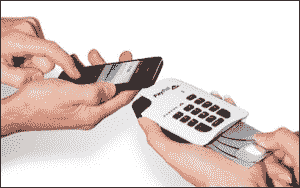

前面的图片是 PayPal 在欧洲使用的密码和芯片解决方案，它通过使用蓝牙工作。

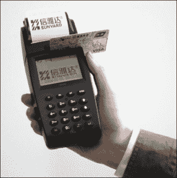

上图是另一个移动销售点的例子。通常由快递员和销售代表使用。

# 近距离技术

近距离技术在几英寸或厘米的范围内工作。这些技术包括**近场通信**（**NFC**）、蓝牙和**射频识别**（**RFID**）。这些技术中的大多数已经存在了一段时间，但移动设备的普及为它们带来了许多新的使用场景。这些技术现在被用于移动支付、不同设备的配对、识别和认证。

蓝牙现在已经成为大多数手机的标准。这是一项将设备配对的好技术。随着市场上出现如眼镜和手表等设备，这可能是将它们连接在一起的技术。

NFC 和 RFID 都通过产生在一定频率上调制的电磁场来工作。由于这些标签是全球可读的，当它们被用作标签或识别机制时，这些标签会带来隐私风险。第一部支持 NFC 的 Android 手机，Nexus S，在 2010 年推出。Android SDK 附带了使用 NFC 标签的 API。

由于操作范围有限，近距离技术被错误地认为是安全的。然而，事实并非如此。快速搜索将揭示所有情况下的攻击场景。数据调制、数据干扰和隐私是与这些技术相关的一些风险。

# 社交网络

目前应用商店中存在着大量的社交网络应用，并且每天都有新的使用案例在测试中。这些应用程序让朋友、熟人、邻居、同事以及有特殊兴趣的人们能够分享、协作，并基本上保持相互之间的联系。一些成功的例子包括 Facebook、Twitter、Pinterest、Google Hangout 和 LinkedIn。

社交网络作为将实体联系在一起的网络的图形。图中的任何不良节点都有可能对其他节点进行垃圾信息攻击或感染。在下图中，节点 A 和 B 之间的消息被拦截并替换为垃圾信息。这将导致所有连接到 B 的节点被感染。这种情况会持续，如您所想，会迅速在节点间传播：

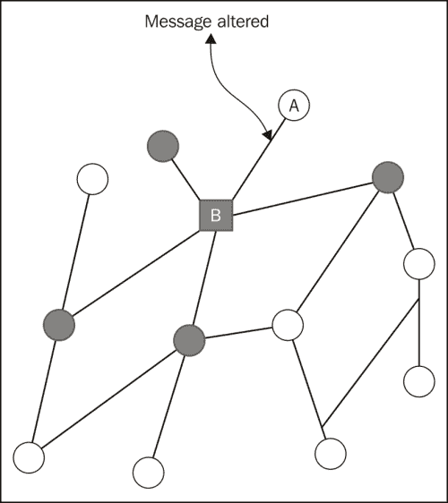

社交网络应用最大的挑战是隐私问题。首先，用户必须注意他们与联系人分享了什么。在大多数情况下，用户使用的是他们的真实姓名和其他私人信息。

其次，用户需要意识到垃圾信息和恶意软件的存在。不是每个人都是你的朋友。你的朋友们玩的游戏并不都是由好人编写的。也没有必要点击你关注的人分享的所有链接。

第三，应用开发者必须注意他们如何存储和处理用户的敏感信息。第一道防线是明确询问用户他们想分享什么以及与谁分享。这种用户同意可以保护开发者免受责任问题的困扰。其次，他们必须根据用户偏好定义适当的访问控制。第三，他们必须保证用户的详细信息和个人识别信息（PII）在静态存储和传输过程中都是安全的。

社交网络网站的另一个问题是身份盗窃。恶意用户很容易通过使用他人的身份来创建账户。

# 医疗保健

开发医疗保健的移动应用程序是另一个非常注重安全的使用案例。在医疗保健使用案例中，开发者需要处理用户身份识别、电子病历、实验室检测和处方药物。泄露这些信息可能会影响患者的健康。

移动设备在医疗保健方面可以发挥巨大作用，因为它们非常个人化，我们始终随身携带。因此，提醒我们按时服药、就诊、为医生和患者记笔记的应用程序、即时通知实验室结果以及提醒处方药物需要重新配药的应用程序都是重要且有用的。

在紧急情况下，移动设备也可以被用来帮助患病的人，用户可以通过移动设备实时分享视频并实时与医生交谈以获得帮助。

医疗保健开发的另一方面是在嵌入式设备中使用 Android 平台，例如扫描仪、放射学、X 光机、机器人手术和超声波设备。

在医疗保健中准确识别一个人至关重要。还要记住一个重要的安全规则：信任但要验证。因此，你识别了一个人，但想再确认一次以确信。访问控制和个人识别信息（PII）的安全存储和传输同样重要。

了解医疗保健领域的标准和规定，例如**健康保险携带和责任法案**（**HIPAA**）。

# 认证

认证是识别实体的行为。在我们的案例中，认证通常与识别一个人有关。当前的认证方法是使用用户名和密码。由于密码复杂，在小设备上输入困难，因此通常使用电话号码和个人识别码（PIN）来认证用户。

## 双因素认证

当前最常见的方法是双因素认证。这是基于这样的理论：为了唯一识别一个人，该人应提供以下三个标识符中的两个：

+   用户拥有的东西；这包括数字签名、安全令牌、电话、标签等。

+   用户知道的东西；这包括密码、秘密、PIN 或只有用户才应知道的问题的答案。

+   用户自身的东西；例如视网膜扫描、指纹和面部识别。

双因素认证的一个例子是使用用户名/密码或电话/PIN 登录，然后输入发送到用户设备的短信中的秘密代码。另一个例子可能是输入用户名和密码，然后回答如下图像所示的挑战问题：

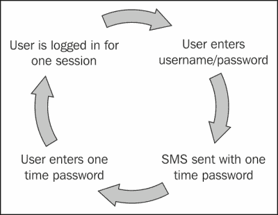

在 Android 上实现双因素认证很容易。谷歌认证器通过使用短信或语音通话来实现双因素认证。

## 生物识别

生物识别认证是使用用户的生物学属性来识别用户。这些包括使用指纹、面部识别、视网膜扫描和虹膜扫描。基于虹膜扫描，印度实施了世界上最大的识别系统，称为 Aadhar。这个雄心勃勃的项目将使用所有五岁及以上印度公民的人口和生物识别信息为他们提供唯一的编号。查看**印度唯一身份认证机构**（**UIDAI**）的网站，网址为 [www.uidai.gov.in](http://www.uidai.gov.in)。

安卓上有些应用程序使用生物识别作为关键。使用此类应用程序时的重要考虑因素是确保用户识别规格没有存储在设备上。其次，如果这些信息存储在服务器上，它们是如何传输和存储的？第三，你如何访问这些信息？

### 提示

生物识别技术与可以轻松更改密码或更新 RSA 安全令牌的双因素认证不同。生物识别技术是个人信息，泄露这些信息会带来巨大风险。

有两种场景会使用生物识别。在第一种情况下，通过使用一些生物学属性（如指纹）来验证用户。这会与设备中存储的副本进行比对。使用面部登录手机就是验证的一个例子，如下所示：

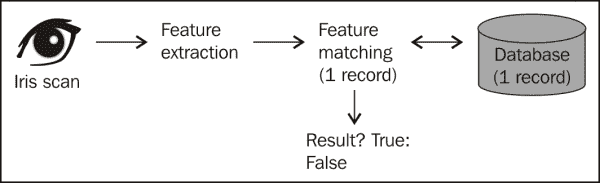

第二种情况是识别，其中生物识别身份与数据库中存储的身份进行比对以找到匹配项。印度正在实施的生物识别身份识别系统就是一个例子。下图说明了这个过程：

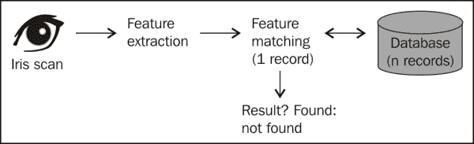

# 硬件方面的进步

移动操作系统已经取得了长足的进步。当我开始从事移动设备工作时，我们使用的是功能仅限于打电话和基本工具（如计算器和显示时间和日期的小部件）的糖果棒形状的手机。为了支持移动设备的高级用例，必须在硬件本身构建安全性。我将在以下各节中讨论这方面的一些努力。

## 硬件安全模块

硬件安全模块，也称为安全元件，是嵌入硬件中的一块硬件（芯片），用于存储加密密钥和其他敏感信息。这个想法是提供一个隔离的、防篡改的环境来存储 PII（个人识别信息）。在某些情况下，安全元件也可以随设备携带。安全元件的例子包括由移动网络运营商控制的增强型 SIM 卡、嵌入设备本身的芯片，或带有特殊电路的微型 SD 卡。许多 Android 手机都配备了安全元件。

在某些情况下，安全模块还可以作为安全加速器工作。这些加速器除了存储密钥外，还在硬件中执行加密功能，如加密、解密、散列和随机数生成。这大大减轻了 CPU 的负担，从而提高了性能。

为了让开发者能够使用安全元件，必须通过 API 将其暴露出来。Android 的**安全元件评估工具包**（**SEEK**）就是朝这个方向迈出的一步。基于开放的移动 API，这套被称为智能卡 API 的 API 的目标是提供一种机制，让应用程序能够与嵌入式安全元件、SIM 卡或其他设备加密模块进行通信。更多信息可以在[code.google.com/p/seek-for-android](http://code.google.com/p/seek-for-android)上查看。以下来自[code.google.com](http://code.google.com)的图片非常有效地说明了 SEEK 的概念：

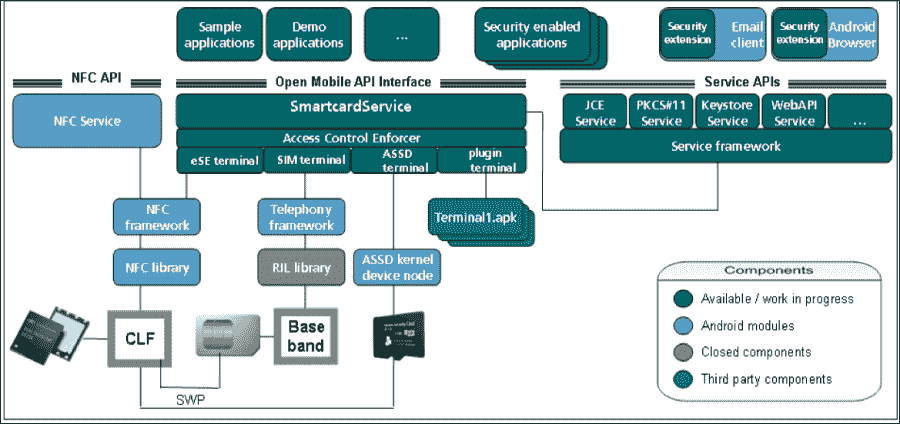

基于 Android 的权限机制，智能卡 API 需要一种特殊权限，称为 `android.permission.SMARTCARD`，以便应用程序访问这些 API。智能卡 API 远程进程注册了智能卡唯一的 UID/GID。请注意，这种安全机制在已获得根权限的设备上不再起作用。`GoogleOtpAuthenticator` 是使用双因素认证在智能卡 API 上实现的。

## TrustZone

由 ARM 开发，现在与 GlobalPlatforms 合作，TrustZone 技术是设备的安全解决方案。它基于系统芯片，TrustZone 为应用程序（如支付、内容流和管理、访问控制以及其他 PII）提供了一个可信执行环境。TrustZone 的酷炫功能是每个应用程序都在其自己的封闭环境中运行，完全与其他应用程序隔离。

你可能想访问[www.arm.com/products/processors/technologies/trustzone.php](http://www.arm.com/products/processors/technologies/trustzone.php)网站了解详细信息。以下来自前述网站的画面展示了这项技术的高级视图。许多移动处理器，例如德州仪器和 Nvidia 的 Tegra 核心，都是基于 TrustZone 技术构建的。

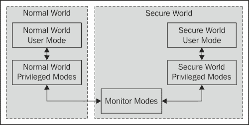

如前图所示，通过虚拟化，处理器被划分为两个虚拟域：一个用于正常模式，另一个用于执行敏感过程的安全模式。通过使用监控模式，进程可以从一个模式过渡到另一个模式。所有敏感代码、数据和资源都远离设备上的正常操作系统环境、软件和内存进行处理。这种隔离由 SoC 架构强制执行，因此它对软件和探测攻击具有高度鲁棒性。

## 移动可信模块

2010 年，**可信计算组**（**TCG**）发布了**移动可信模块**（**MTM**）1.0 版本。TCG 是一个国际标准化机构，与会员合作开发标准和规范。MTM 的目标是将现有的 TCG 技术适应于移动和嵌入式使用。

可信计算基于硬件信任根，被称为**可信平台模块**（**TPM**）。它检测恶意软件并检查系统的完整性。这种能力被称为可信平台模块。TPM 的安全始于启动过程。硬件信任根（通常是一个密钥）烧录在处理器本身中。启动安全建立在这个信任根上。启动软件的逐步阶段通过加密验证，以确保设备只执行正确、授权的软件。

访问他们的网站 [www.trustedcomputinggroup.org](http://www.trustedcomputinggroup.org)。这对于内核开发者来说更为相关，但对于任何人来说都是一个非常有趣的阅读。

# 应用程序架构

现在有三种编写应用程序的方法：原生、移动网络和混合。

原生应用特定于一个平台，并且使用该平台的本地语言编写。这些应用使用操作系统制造商提供的本地工具和 SDK。这些应用性能更好，并且可以使用本地功能和 API 进行安全数据存储。以下图示说明了原生应用和混合应用的工作原理：

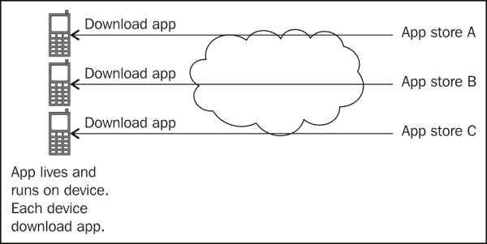

移动网页应用是用网页技术编写的，比如 HTML5、CSS、PHP、JavaScript 和 ASP.net。这些应用跨平台，一旦编写完成，就可以在任何拥有浏览器的平台上运行。它们提供了集中更新的便利，但也继承了所有浏览器的漏洞。在编写移动网页应用时，要警惕浏览器漏洞。浏览器代码对所有人来说都很容易获取。此外，URL 漏洞也是这类应用的风险，因为应用程序并不驻留在设备上，只能通过有效的 URL 访问。以下是说明移动网页应用工作原理的图示：

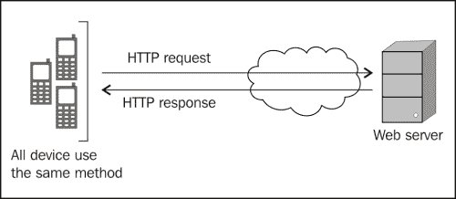

编写应用的第三种方式是开发混合应用。这种应用结合了原生应用和移动网页应用的优势。应用使用网页技术编写一次。用户需要像安装原生应用一样安装该应用，并且它使用设备的浏览器引擎在原生环境中运行。这样，应用可以在离线模式下运行，可以访问设备功能，并且开发者可以针对多个平台。

选择哪种架构的决定取决于你的使用场景。原生应用程序比混合型或移动网页应用更安全，它们在速度和用户体验方面的表现也更好。另一方面，混合型和移动网页应用通过使用网页技术，开发起来更容易、更快速，并且跨平台。

# 概述

本章重点介绍了即将到来的使用场景和技术，以及它们与移动安全的一般关系。我们讨论了移动商务、近场技术、移动医疗安全以及身份验证。我们以硬件领域安全增强的视角结束了本章。正如你所注意到的，移动领域正在发生很多事情，我认为在事情稳定下来之前，这种情况还会持续一段时间。

通过本章，我们已到达本书的结尾。希望你在本书中学到了一些新知识，并且和我一样享受这段旅程。
