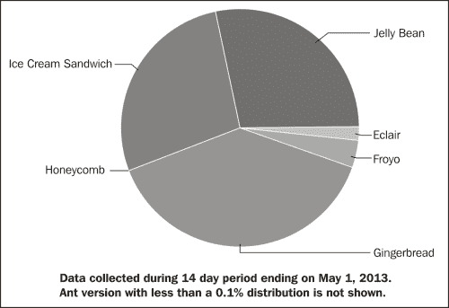
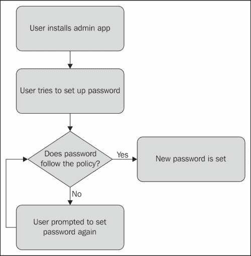
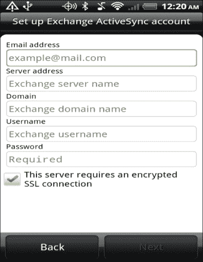
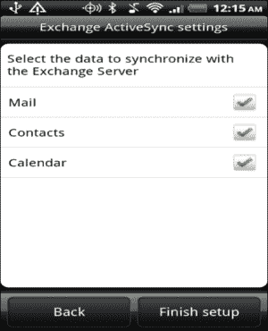
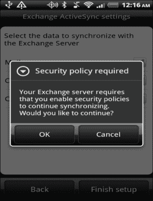
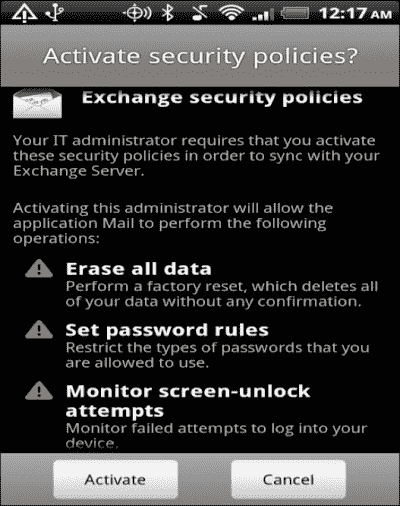
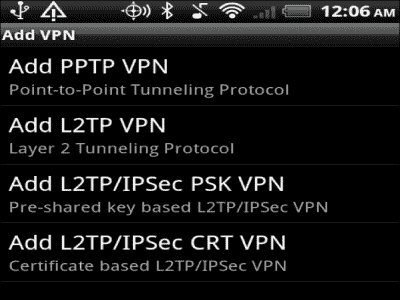
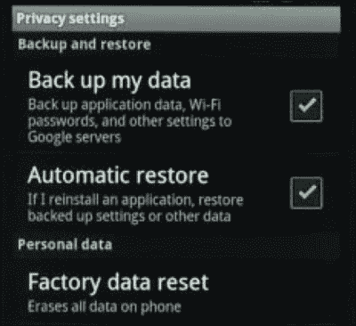
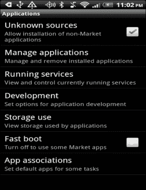

# 八、企业中的安卓

随着移动设备的普及，越来越多的员工将他们的设备带到工作场所，并要求公司数据可以在他们的个人或企业移动设备上访问。这是一个极大的便利，但也是一个越来越大的挑战。由于设备受损或丢失，公司数据丢失的成本是巨大的。

随着移动设备在劳动力中的扩散，信息技术部门面临着许多挑战。第一个挑战是各种不同外形和功能的移动设备。第二个挑战是让员工参与进来，并接受企业对其设备的特定应用和部分的控制。第三个挑战是对设备管理的持续支持。

本章的重点是安卓设备的设备管理。如果您不是为企业开发应用，您可以安全地跳过这一章，转到下一章，关于安卓应用的安全集中测试。

本章从设备管理的基础知识和安卓生态系统的独特挑战开始。其次，我们讨论了为 Android 设置和实现设备管理策略和接收器的机制。我们还讨论了存储在设备上和传输中的数据的安全性。我们在这一章的最后提出了在安卓系统上设置设备管理的后续步骤，以及设备管理员应该了解的政策和合规准则。

# 基础

在企业设备的上下文中，三个术语——自带设备、移动设备和移动设备被重复使用。我们也将在本章的剩余部分使用它们，所以让我们理解它们各自的含义。

第一个术语是**自带设备** ( **自带设备**)。这个术语指的是最近员工带着自己的移动设备去工作，并在他们的个人设备上访问公司数据和应用的趋势。一个例子是在个人移动设备上访问电子邮件和办公文档。

经常使用的第二个术语是**移动设备管理** ( **MDM** )。MDM 指的是对公司拥有或员工拥有的访问企业应用和数据的移动设备的远程管理。远程擦除公司数据和要求用户设置密码等功能就是 MDM 的例子。这些功能加强了企业对系统功能的控制。

在这种情况下经常使用的第三个术语是**移动应用管理** ( **MAM** )。该术语指的是对访问企业数据的移动设备上的软件和服务的管理。MAM 的例子包括应用升级、捕获崩溃日志和用户统计数据并将其发送给 it 部门。MAM 不同于 MDM，后者侧重于设备功能，而 MAM 侧重于设备上安装的软件和服务。

# 了解安卓生态系统

安卓是一个具有挑战性的生态系统，拥有众多定制版本。下图显示了撰写本书时安卓版本的使用情况。正如您将注意到的，在任何给定的时间，都有不同版本的安卓堆栈在使用。理解每个版本的细微差别和特殊需求本身就是一项全职工作。您可以随时在[http://developer.android.com/about/dashboards/index.html](http://developer.android.com/about/dashboards/index.html)查看可用的最新使用统计数据。

除了前面的问题之外，每个制造商都有一个定制版本的安卓堆栈，带有他们选择的特性和功能。在此基础上，运营商也增加了他们的定制。这造成了一个高度分散的市场。



# 设备管理能力

从安卓 2.2 开始，安卓增加了越来越多的功能，让安卓为企业做好准备。每个后续版本都对现有功能进行了改进，并增加了更多功能。下表列出了在安卓堆栈中添加特定企业功能的时间。本节将重点介绍其中的一些功能:

<colgroup><col style="text-align: left"> <col style="text-align: left"></colgroup> 
| 

安卓版本

 | 

企业功能

 |
| --- | --- |
| froyo(2.2 版) | 

*   Password policy
*   Remote erase
*   Remote locking

 |
| 姜饼(版本 2.3) | 

*   SIP support

 |
| 蜂巢(3.0 版) | 

*   Encryption and password strategy of tablet computer
*   System encryption of tablet computer

 |
| 冰淇淋三明治(4.0 版) | 

*   Extend system encryption, encryption and password policies to devices
*   Certificate management function
*   虚拟专用网络
*   Developer interface for SSL VPN
*   Face recognition unlock
*   Network data usage monitoring
*   Off-line email search

 |

## 设备管理应用编程接口

如上表所示，从 Android 2.2 开始，Android 不断增加对设备管理的支持。朝着这个方向迈出的最大一步是在安卓 2.2 中引入了设备管理应用编程接口，以支持对企业所需设备的系统级控制。

设备管理应用编程接口分四个步骤工作:

1.  系统管理员编写一个应用，使策略能够远程管理设备。
2.  用户从谷歌游戏或任何其他应用商店下载应用。用户也可以使用电子邮件安装应用。
3.  下载后，用户安装应用。安装时，会向用户显示将在设备上实施的策略。用户必须同意这些策略才能激活应用。
4.  安装后，用户必须遵守这些策略才能访问敏感信息。用户可以卸载应用，这将导致拒绝访问敏感数据。

下图说明了如果用户安装了一个管理应用，该应用强制实施密码策略，使得密码必须包含某些类型的字符时的流程:



设备管理应用编程接口封装为`android.app.admin` 。这个包有三个类:`DevicePolicyManager`定义和实现策略，`DeviceAdminInfo`包含设备管理器类的元数据，以及`DeviceAdminReceiver` 实现接收器组件。

### 政策

策略是设备管理不可分割的一部分。在撰写本书时，设备管理应用编程接口支持与密码、远程擦除、禁用摄像头、设备加密和锁定设备相关的策略。密码策略的示例包括要求密码包含字母数字字符、密码过期和超时以及密码尝试的最大次数。当前策略列表可在`android.app.admin.DevicePolicyManager`验证。

在`res`文件夹下的一个 XML 文件中定义了一个策略。对密码进行限制的示例策略文件可以远程将设备重置为出厂设置、禁用摄像头、加密存储和锁定设备。在安装期间，这些策略会显示给用户。

```java
<device-admin xmlns:android="http://schemas.android.com/apk/res/android">
    <uses-policies>
        <limit-password />
        <force-lock />
        <wipe-data />
        <expire-password />
        <encrypted-storage />
        <disable-camera />
    </uses-policies>
</device-admin>
```

新版本中不断添加其他策略。您可以检查当前版本的版本，并相应地实施策略。

设备管理应用包含管理一个或多个设备管理接收器的策略的`DevicePolicyManager`。

```java
DevicePolicyManager mDPMgr = 
  (DevicePolicyManager)getSystemService
    (Context.DEVICE_POLICY_SERVICE);
```

可以使用以下代码从手机远程清除数据。需要注意的是，市场上也有一些假冒的设备管理应用。请务必按照管理员的建议下载正确的管理应用。不安全或受特洛伊木马影响的应用很容易导致数据泄露:

```java
DevicePolicyManager mDPMgr;
mDPMgr.wipeData(0);
```

要设置加密文件系统的策略，可以使用以下代码片段:

```java
DevicePolicyManager mDPMgr;
ComponentName mMyDeviceAdmin;
mDPMgr.setStorageEncryption(mMyDeviceAdmin, true);
```

### 设备管理接收器

子类化`DeviceAdminReceiver`类来创建设备管理应用。这个类包含当特定事件发生时触发的回调。这些意图由系统发送。因此，接收者应该能够处理`ACTION_DEVICE_ADMIN_ENABLED`意图。

`DeviceAdminReceiver` 需要`BIND_DEVICE_ADMIN`的权限。`BIND_DEVICE_ADMIN` 是只有系统才能访问的特殊权限；应用无法访问它。这确保了只有系统与接收器交互。

接收器还引用了我们在上一节中讨论的元数据策略文件。下面的代码片段显示了一个示例声明。

```java
<receiver android:name="MyDeviceAdminReceiver"
        android:label="@string/my_device_admin_receiver"
        android:description="@string/my_device_admin_desc"
        android:permission="android.permission.BIND_DEVICE_ADMIN">
    <meta-data android:name="android.app.my_device_admin"
                android:resource="@xml/my_device_admin" />
    <intent-filter>
      <action   android:name="android.app.action.DEVICE_ADMIN_ENABLED" />
    </intent-filter>
</receiver>
```

以下截图显示了公司电子邮件的 Exchange 动态同步设置。这只是一个说明流程的例子。在第一张截图中，必须填写交易所的实际账户详细信息。这些将是公司账户的详细信息。请注意加密 SSL 连接的选择:



在下一步，用户选择哪些功能应该同步到设备。在我们的案例中，用户检查 Exchange ActiveSync 提供的所有功能，即**邮件**、**联系人**和**日历**。这显示在下面的截图中:



第三步，如下图所示，如果用户决定安装应用并能够访问敏感信息，则必须确认他们同意将在设备上实施的安全策略。如果用户拒绝同意，将不会安装应用(在我们的情况下，**邮件**、**联系人**、**日历**将不会同步)。



下一步，用户查看将通过同步电子邮件实施的策略。在前面的示例中，这些是策略文件中定义的策略。在我们的示例中，如下图所示，设备管理员可以远程擦除员工设备上的所有数据，以防设备丢失、员工停止为企业工作或任何其他原因。第二个策略是设备管理员将设置密码规则。这些密码规则可以是以下任何一种:



## 保护设备上的数据

MDM 的一个主要要求是保护设备上的企业数据。安卓设备通常有两种形式的数据存储:内部存储和外部(可移动)存储介质。从蜂巢开始，在`/mnt/sdcard`安装一个内部文件系统，在`/mnt/external#`安装一个外部存储器(其中`#`是外部设备的数量)。早期版本在`/mnt/sdcard`安装了内部存储器，在`/mnt/sdcard/external_sd`安装了 SD 卡。安卓堆栈的定制版本可能遵循也可能不遵循这些准则。

安卓通过全磁盘加密和支持加密算法来解决设备上的企业数据保护问题。

### 加密

安卓 3.0 增加了支持全磁盘加密的功能，以防止未经授权的访问用户数据。文件系统使用`dm_crypt` 内核特性进行加密，并在块设备层工作。秘密来自用户密码，使用的加密是 AES-128，带有 CBC 和 ESSIV: SHA-256。主密钥或加密密钥通过使用带有 AES-128 的开放 SSL 进行加密。

要使全磁盘加密起作用，设备需要用密码保护(模式密码不起作用)。在访问文件系统之前，必须使用密码解锁设备。设备管理员可以为有限次数的密码试验设置策略，超过该次数，设备将重置为出厂设置。

用户必须手动接受才能加密设备。请注意，当设备第一次被加密时，设备应该有足够的功率来完成加密过程。如果设备电量耗尽，则必须将其设置为出厂设置，所有用户数据都将丢失。

### 类型

只有设备上的文件系统被加密。外部存储器，如 SD 卡，没有加密。

正如[第 6 章](06.html "Chapter 6. Your Tools – Crypto APIs")、*你的工具–加密 API*中所讨论的，安卓堆栈支持加密算法，例如加密和散列。在信息必须存储在 SD 卡上的情况下，可以使用堆栈支持的加密功能。设备管理员可能会强制要求存储在 SD 卡上的任何数据都必须加密。

即使使用全设备加密，用户也应该注意几个问题。首先是肩部冲浪的情况，在拥挤的地方，人们从一个人的肩膀上窥探密码。人们应该注意这个问题。其次，虽然输入密码解锁手机相当麻烦，但这是为了公司数据的安全，与其倾向于选择简单的密码，不如选择更强的密码。设备策略可以为其设置要求。第三，请记住，只有文件系统的数据分区是加密的。将数据存储在其他地方很容易，但是出于安全原因，任何公司数据都应该存储在数据分区中。

### 备份

谷歌为安卓设备提供备份服务。备份壁纸、设置、词典、浏览器设置等数据。当手机设置为出厂复位时，这些设置将被恢复。不会备份敏感数据，如密码、屏幕锁定个人识别码、短信和通话记录。只能使用`BackupManager`API 访问备份服务。必须通过转到设置下的**隐私**选项手动启用备份。

谷歌不保证备份的安全性，因为安卓的不同实现对备份的实现方式不同。该备份服务可能不适用于所有类型的安卓设备。

## 安全连接

安卓系统本身支持虚拟专用网。管理员可以建议自定义虚拟专用网络，并可以要求为所有通信打开虚拟专用网络。当连接开放的热点时，这将特别有用。后一种功能仅在 Android 4.2 上可用。下面的截图显示了我的手机支持的一些 VPN 协议:



当连接到无线网络时，用户应该选择安全的无线连接。在这种情况下，将提示用户输入密码。这显示在下面的截图中:


## 身份

安卓支持用于在设备上存储证书的证书存储，并允许授权的应用在用例中使用它进行识别，如电子邮件、Wi-Fi 和 **VPN** ( **虚拟专用网络**)。安卓支持 DER 编码的 X.509 证书。它还支持存储为 PKCS#12 密钥库文件的 X.509 证书。

安卓支持 Bouncy Castle，并预装了证书。它们在`cacerts.bks` 密钥库中可用。

用户也可以从他们的设备内存安装证书。通过导航到**位置&安全**设置下设置中的【从 SD 卡安装】选项 T2，可以在设备上安装新证书。用户应该注意他们安装的证书，因为安装不合法的证书可能会危及设备的安全。

要删除证书，用户可以转到**个人** | **安全** | **凭证存储** | **可信凭证**并禁用或删除证书。

# 下一步

现在我们已经了解了支持自带设备的安卓功能，本节将讨论如何利用这些知识在企业中推广安卓支持。

## 设备特定决策

要充分利用安卓设备，设备必须与谷歌账户相关联。这使用户能够访问谷歌游戏、定位服务和许多其他应用，如 Gmail、驱动器、日历和 YouTube。对于设备管理员来说，重要的问题是他们是否希望员工使用他们的个人谷歌帐户或单独的企业帐户。

另一个重要的问题是位置服务的启用，这可能会给一些不喜欢被跟踪的高价值员工带来隐私风险。另一方面，如果设备被盗，启用定位服务可以帮助确定设备的位置。

第三个重要问题是备份和存储。同样，与位置服务的情况一样，备份和存储是重要的功能，但可能会带来隐私问题。设备管理员可能会强制实施加密存储或指定私有企业云。但这很快就增加了维护成本。要启用备份，用户必须明确进入**设置** | **隐私**并选择**备份我的数据**，如下图所示:



在这里，重要的是解决根植安卓设备的问题。安装安卓设备不需要太多时间，指令也很容易获得。在澳大利亚、欧洲和美国，植入设备也是合法的。根设备不符合企业使用的安全标准。因此，根设备的检测是设备管理员的重要考虑因素。检测根设备并不容易，因为根设备有很多方法。

然后就是 App Store 的问题，员工从哪里下载企业应用。除了谷歌 Play，安卓应用还可以从亚马逊应用商店和 GetJar 等其他应用商店下载。上次我查看了超过 128 个应用商店，其中任何一个都可以托管一个应用。应用也可以从网站下载，或通过电子邮件或通过侧面加载。设备管理员可以选择设置企业应用商店来解决这种情况。这确保了这里只存在合法的应用。要从 Google Play 之外的外部位置下载应用，用户必须明确选择**未知来源**选项，如下图所示:



设备管理的基本思想是，设备应该是可用的、直观的，并且应该在不损害安全性的情况下保留原生体验。这是一个艰难的平衡，也是一个确定的挑战。

保持对安卓不断发展和充满活力的生态系统的关注，需要一个对安卓充满热情并随时了解安卓生态系统即将发生的变化的安卓专家和发烧友。为了让你的知识保持最新，需要对用户如何与他们的设备交互以及这个领域即将到来的创新有敏锐的理解。这位安卓专家应该是安卓设备上企业应用部署的权威和主要联系人。

## 了解你的社区

此次推广的第二个重要步骤是了解员工群体的偏好、要求和需求。这一步对于就您的员工需要哪些应用和服务以及需要创建的访问控制和策略做出明智的决定非常重要。收集关于他们的设备偏好(无论他们喜欢手机还是平板电脑)、他们喜欢的应用以及他们需要的设备访问量的信息非常重要。另一个因素是地理多样性。没有放之四海而皆准的解决方案。不同的地点有不同的首选设备，它们自己的首选应用，以及它们自己与设备上的公司数据的交互级别。

## 定义边界

为哪些设备被接受和哪些设备不被接受定义一个明确的界限将有助于处理安卓系统上的碎片化问题。这些界限应该基于功能，而不是版本或版本，因为制造商和运营商在不同的设备上以不同的方式移植相同的版本。

另一个需要界定的界限是信任。一家公司的**信息技术** ( **信息技术**)部门应允许基于设备能力水平的提高而增加访问。例如，如果设备不支持全磁盘加密，他们只能读取数据，不能将其存储在设备上。由于安卓开放的应用生态系统，定期监控用户在设备上安装的应用也很重要。

第三个界限是用户可以在他们的设备上安装的应用。安卓应用可以从不同的来源安装，这些来源不会像苹果应用商店那样出于安全目的精心策划应用。定义哪些应用被允许，哪些不被允许的界限将大大有助于保持设备的安全。

### 安卓兼容程序

开放是安卓生态系统的目标。然而，为了在不同设备上获得一致的用户体验，原始设备制造商必须参与安卓兼容性计划。该计划为原始设备制造商提供了工具和指南，以便他们能够正确标记设备，并确保应用在设备上按预期运行。对于 IT 人员来说，这是一个有趣的计划，因为他们可以根据兼容性级别定义自己的边界。

兼容性计划提供三个关键组件:

*   **兼容性定义文件** ( **疾控中心**):这是兼容性的政策文件。它定义了兼容堆栈的要求。例如，它列出了一组被认为是安卓堆栈核心的意图，应该始终得到支持。
*   **兼容性测试套件** ( **CTS** ): CTS 是一个免费的测试套件，运行在桌面上，可以用来自动在仿真器或设备上运行兼容性测试。在撰写本书时，CTS 包括单元测试、功能测试和具有健壮性的参考测试，以及为未来计划的性能测试。一些例子包括检查硬件功能，如无线网络和蓝牙。
*   **兼容性测试套件验证器** ( **CTS 验证器** ): CTS 是一个免费的测试套件，在桌面上运行，需要手动输入才能在仿真器或设备上运行兼容性测试。是 CTS 的补充。

基于上述标准，市场上存在三种安卓设备。下表中的显示了每种兼容类型的关键特征:

<colgroup><col style="text-align: left"> <col style="text-align: left"> <col style="text-align: left"></colgroup> 
| 

谷歌领先设备

 | 

谷歌体验设备

 | 

其他(开放式)设备

 |
| --- | --- | --- |
| 

*   Android 100% Google
*   No OEM or operator customization
*   例子：三星 Galaxy Nexus、摩托罗拉 Xoom、HTC Nexus one

 | 

*   CTS compatibility

*   Example: Samsung Galaxy S11, HTC rewinding

 | 

*   Non-compliance with CTS
*   Highly customized by OEMs and operators
*   Examples: Kindle Fire, Motorola ET1 tablet

 |

您可能决定只支持基本上提供一致功能和某种定制体验的销售线索和体验设备。

## 展开支撑

计划分阶段推出对安卓设备的支持。信息技术部门可以从试点推广开始，然后慢慢扩展。这有两方面的帮助。首先，IT 可以确定他们的支持基础架构是否可以随着用户数量的增加而扩展。其次，他们可以根据收集的使用统计数据调整他们的支持。随着支持范围扩大到更多员工，任何错误和缺失的需求都可以得到解决。

在此次推广过程中，通过培训、维基、海报和提醒来教育员工将有助于员工了解正在发生的事情。这也有助于他们理解为什么一些设备被允许而另一些设备不被允许的基本原理、期望什么以及在设备上访问公司数据的安全实践。

## 政策和合规

在回顾所有前面的步骤时，不要忽略这个领域的新兴标准和合规性。此外，要及时了解自带设备、多媒体数据管理和多媒体管理领域的研究，以及不同公司采用的新方法。

### 不错

**金融行业监管局** ( **FINRA** )是美国所有开展业务的证券公司最大的独立监管机构。FINRA 的使命是通过确保证券行业公平和诚实地运作来保护美国的投资者。他们已经发布了关于在其成员公司监管移动设备电子通信的指导方针。这些需要结合公司自己的分析来考虑。查看 FINRA 网站了解更多信息:[www.finra.org](http://www.finra.org)。FINRA 发布了三项通知，以扩大个人移动设备和社交网站日益增长的规模。在所有情况下，它建议对所有 it 员工进行适当的培训，保持记录，明智地在社交媒体网站上发布，并持续监督。

FINRA 于 2007 年 12 月发布了第一份监管通知 07-59([https://www . FINRA . org/web/group/industry/@ IP/@ reg/@ notice/documents/notifications/p 037553 . pdf](https://www.finra.org/web/groups/industry/@ip/@reg/@notice/documents/notices/p037553.pdf))。本通知提供了通过移动设备进行电子通信监管的核心指南。它建议公司电子邮件应该始终通过公司电子邮件系统，而不应该通过个人帐户转发。这些公司电子邮件应该只能通过受监控的网络。这将有助于对电子邮件进行适当的监督。

FINRA 于 2010 年 1 月发布的第二份监管通知 10-06，重点关注社交媒体网站和博客的使用情况([http://www . FINRA . org/web/group/industry/@ IP/@ reg/@ notice/documents/notifications/p 120779 . pdf](http://www.finra.org/web/groups/industry/@ip/@reg/@notice/documents/notices/p120779.pdf))。该通知建议员工不要在社交媒体网络上使用商业账户。这些网站应持续进行员工代表筛选，因为误导性信息会对投资者产生不利影响。

2011 年 8 月发布的第三份监管通知 11-39 对个人设备和社交媒体网站的指引进行了扩展(http://www . finra . org/web/group/industry/@ IP/@ reg/@ notice/documents/notifications/p 124186 . pdf)。该通知指出，只要这些信息是可检索的并且与个人通信分开，员工就可以使用个人设备进行通信。设备的持续监控至关重要，持续培训也是如此。

### 安卓更新联盟

遵守标准并不总是容易的。在 2011 年 5 月的谷歌输入/输出会议上，谷歌和许多其他设备制造商承诺，在安卓新版本发布后的 18 个月内更新设备。这个联盟被称为安卓更新联盟。这个想法很高尚，也很受赞赏，但原始设备制造商很难跟上它。

# 总结

在本章中，我们将重点放在访问企业数据的公司和员工自有设备的管理上。自带设备的问题在于信任、合规性、治理和隐私，因为越来越多的员工要求访问其移动设备上的公司数据。这是用户体验和安全性之间的微妙平衡。我们从具有挑战性的安卓生态系统开始，接下来是设备管理的实现细节，以及对安卓堆栈提供的其他企业功能的讨论。我们以围绕法规遵从性和政策的讨论结束了关于开始在企业领域支持安卓应考虑的后续步骤的一章。

现在，是时候进入下一章，从安全角度讨论测试安卓应用了。快乐阅读！