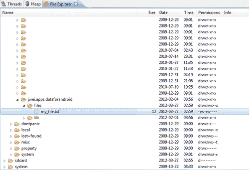
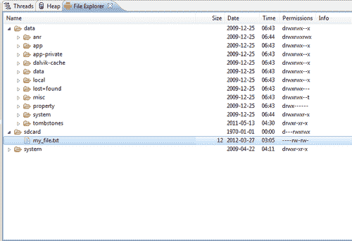

# 一、在安卓系统上存储数据

今天，我们生活在一个日益以数据为中心和数据驱动的世界。我们生活在这样一个世界里，像亚马逊这样的公司跟踪我们看到的每一件商品和购买的每一件商品，以便向我们推荐类似的产品。我们生活在这样一个世界里，像谷歌这样的公司存储向他们抛出的每一个搜索查询，以便在未来推荐更好的搜索查询。我们生活在这样一个世界里，像脸书这样的社交媒体网站会记住我们与朋友分享的每一件事和每一个想法，以便更好地了解他们数亿用户中的每一个人。我们生活在一个越来越以数据为中心的世界，因此我们必须从以数据为中心的角度开发应用程序。

现在，为什么你可能会问安卓？或者更一般地说，为什么是移动应用？看看你周围——智能手机和平板电脑等移动设备的增长在过去几年中呈爆炸性增长。此外，移动设备隐含地为我们提供了另一层数据，这是我们以前在桌面应用程序中没有的。当你随身携带智能手机或平板电脑时，它知道你的位置，它知道你在哪里签到，你在做什么；简而言之，它对你的了解比你可能意识到的要多得多。

牢记这两点，我们开始探索数据和安卓，快速深入了解谷歌的工作人员在安卓操作系统中构建的各种方法。这本书假设读者已经对安卓操作系统有了一些体验，因为我们将直接进入代码。现在，不仅了解您可以使用的所有不同数据存储方法很重要，同样重要的是了解每种方法的优缺点，这样您就可以创建一个高效、设计良好且可扩展的应用程序。

# 使用共享引用

`SharedPreferences`是在你的安卓应用中存储本地数据最简单、快速、高效的方式。它是一个框架，本质上允许您存储各种**键值对**并将其与您的应用程序相关联(将此视为您的应用程序附带的地图，您可以随时访问)，并且因为每个应用程序都与其自己的 `SharedPreferences`类相关联，所以存储和提交的数据会在所有用户会话中持续存在。但是，由于其简单高效的特性， `SharedPreferences`只允许您保存原始数据类型(即布尔、浮点、长整型、整型和字符串)，因此在决定将什么存储为共享首选项时，请记住这一点。

让我们看一个如何访问和使用应用程序的 `SharedPreferences`类的例子:

```java
public class SharedPreferencesExample extends Activity {
private static final String MY_DB = "my_db";
@Override
public void onCreate(Bundle savedInstanceState) {
super.onCreate(savedInstanceState);
setContentView(R.layout.main);
// INSTANTIATE SHARED PREFERENCES CLASS
SharedPreferences sp = getSharedPreferences(MY_DB,
Context.MODE_PRIVATE);
// LOAD THE EDITOR REMEMBER TO COMMIT CHANGES!
Editor e = sp.edit();
e.putString("strKey", "Hello World");
e.putBoolean("boolKey", true);
e.commit();
String stringValue = sp.getString("strKey", "error");
boolean booleanValue = sp.getBoolean("boolKey", false);
Log.i("LOG_TAG", "String value: " + stringValue);
Log.i("LOG_TAG ", "Boolean value: " + booleanValue);
}
}

```

让我们来看看这个小代码片段中发生了什么。首先我们启动一个 `Activity`，在 `onCreate()`方法中，我们请求检索一个 `SharedPreferences`类。 `getSharedPreferences()`方法的论据是:

```java
getSharedPreferences(String mapName, int mapMode)

```

这里，第一个参数只是指定您想要的共享首选项映射(每个应用程序可以拥有几个单独的共享首选项映射，因此，就像您在数据库中指定表名一样，您必须指定您想要检索的映射)。第二个参数稍微复杂一点——在上面的例子中，我们传入 `MODE_PRIVATE`作为参数，这个参数只是指定了您正在检索的共享首选项实例的可见性(在这种情况下，可见性被设置为私有，因此只有您的应用程序可以访问映射内容)。其他模式包括:

*   `MODE_WORLD_READABLE:`使其他应用程序可以访问您地图的可见性，尽管内容只能被读取
*   `MODE_WORD_WRITEABLE:`使其他应用程序可以通过阅读和书写来访问您的地图的可见性
*   `MODE_MULTI_PROCESS:`此模式自 API Level 11 起可用，允许您通过多个进程修改地图，这些进程可能正在写入同一个共享首选项实例

现在，一旦我们有了共享偏好对象，我们就可以立即开始通过它的各种 `get()`方法来检索内容——例如，我们前面看到的 `getString()`和 `getBoolean()`方法。这些 `get()`方法通常会采用两个参数:第一个是*键*，第二个是给定键未找到时的默认值。举前面的例子，我们有:

```java
String stringValue = sp.getString("strKey", "error");
boolean booleanValue = sp.getBoolean("boolKey", false);

```

因此，在第一种情况下，我们试图检索与键 `strKey`相关联的字符串值，如果没有找到这样的键，则默认为字符串 `error`。同样，在第二种情况下，我们试图检索与关键字 `boolKey`相关联的布尔值，如果没有找到这样的关键字，则默认为布尔值 `false`。

但是，如果您想要*编辑*内容或*添加新的*内容，那么您必须检索每个共享首选项实例包含的 `Editor`对象。这个 `Editor`对象包含了所有的 `put()`方法，允许你传递一个键和它的相关值(就像你传递一个标准的 `Map`对象一样)——唯一需要注意的是，在你添加或者更新你的共享偏好的内容之后，你需要调用 `Editor`对象的 `commit()`方法来*保存那些改变*。再者，就像一个标准的 `Map`对象一样， `Editor`类也包含 `remove()`和 `clear()`方法，供您自由操作共享偏好的内容。

在我们进入 `SharedPreferences`的典型用例之前，最后要注意的一点是，如果您决定将共享首选项实例的可见性设置为 `MODE_WORLD_WRITEABLE`，那么您可能会面临恶意外部应用程序的各种安全漏洞。因此，在实践中，不建议使用这种模式。然而，在两个应用程序之间本地共享信息的愿望仍然是许多开发人员面临的问题，因此开发了一种方法，只需在应用程序的清单文件中设置一个 `android:sharedUserId`。

其工作原理是，每个应用程序在签名和导出时，都被赋予一个自动生成的应用程序标识。但是，如果您在应用程序的清单文件中显式设置了该标识，那么，假设两个应用程序使用相同的密钥签名，它们将能够自由访问彼此的数据，而不必将其数据暴露给用户电话上的其他应用程序。换句话说，通过为两个应用程序设置相同的 ID，那两个*和只有那两个*应用程序将能够访问彼此的数据。

## 共享引用的常见用例

既然我们已经知道了如何实例化和编辑一个共享的首选项对象，考虑这种类型的数据存储的一些典型用例就很重要了。因此，下面是几个例子，说明应用程序倾向于保存哪些类型的小的、原始的键值对数据。

### 检查这是否是用户第一次访问您的应用程序

对于许多应用程序，如果这是用户的第一次访问，那么他们将希望显示某种说明/教程活动或闪屏活动:

```java
public class SharedPreferencesExample2 extends Activity {
private static final String MY_DB = "my_db";
@Override
protected void onCreate(Bundle savedInstanceState) {
super.onCreate(savedInstanceState);
setContentView(R.layout.main);
SharedPreferences sp = getSharedPreferences(MY_DB,
Context.MODE_PRIVATE);
/**
* CHECK IF THIS IS USER'S FIRST VISIT
*/
boolean hasVisited = sp.getBoolean("hasVisited",
false);
if (!hasVisited) {
// ...
// SHOW SPLASH ACTIVITY, LOGIN ACTIVITY, ETC
// ...
// DON'T FORGET TO COMMIT THE CHANGE!
Editor e = sp.edit();
e.putBoolean("hasVisited", true);
e.commit();
}
}
}

```

### 检查应用程序上次更新自身的时间

许多应用程序将内置某种缓存或同步功能，这将需要定期更新。通过保存上次更新时间，我们可以快速查看已经过去了多少时间，并决定是否需要进行更新/同步:

### 类型

**下载示例代码**

您可以从您在[http://www.packtpub.com](http://www.packtpub.com)的账户中下载您购买的所有 Packt 书籍的示例代码文件。如果您在其他地方购买了这本书，您可以访问[http://www.packtpub.com/support](http://www.packtpub.com/support)并注册，以便将文件直接通过电子邮件发送给您。

```java
/**
* CHECK LAST UPDATE TIME
*/
long lastUpdateTime = sp.getLong("lastUpdateKey", 0L);
long timeElapsed = System.currentTimeMillis() -
lastUpdateTime;
// YOUR UPDATE FREQUENCY HERE
final long UPDATE_FREQ = 1000 * 60 * 60 * 24;
if (timeElapsed > UPDATE_FREQ) {
// ...
// PERFORM NECESSARY UPDATES
// ...
}
// STORE LATEST UPDATE TIME
Editor e = sp.edit();
e.putLong("lastUpdateKey", System.currentTimeMillis());
e.commit();

```

### 记住用户的登录用户名是什么

许多应用程序将允许用户记住他们的用户名(以及其他面向登录的字段，如 pin、电话号码等)，共享首选项是存储简单原始字符串 ID 的好方法:

```java
/**
* CACHE USER NAME AS STRING
*/
// TYPICALLY YOU WILL HAVE AN EDIT TEXT VIEW
// WHERE THE USER ENTERS THEIR USERNAME
EditText userNameLoginText = (EditText)
findViewById(R.id.login_editText);
String userName =
userNameLoginText.getText().toString();
Editor e = sp.edit();
e.putString("userNameCache", userName);
e.commit();

```

### 记住应用程序的状态

对于许多应用程序，应用程序的功能将根据应用程序的状态而变化，通常由用户设置。考虑一个电话铃声应用程序——如果用户指定如果电话处于静音模式，则不应出现任何功能，那么这可能是需要记住的一个重要状态:

```java
/**
* REMEBERING A CERTAIN STATE
*/
boolean isSilentMode = sp.getBoolean("isSilentRinger",
false);
if (isSilentMode) {
// ...
// TURN OFF APPLICATION
// ...
}

```

### 缓存用户位置

任何基于位置的应用程序通常都希望缓存用户的最后位置，原因有很多(可能是用户关闭了 GPS，或者信号弱，等等)。这可以通过将用户的纬度和经度转换为浮点数，然后将这些浮点数存储在共享首选项实例中来轻松完成:

```java
/**
* CACHING A LOCATION
*/
// INSTANTIATE LOCATION MANAGER
LocationManager locationManager = (LocationManager)
this.getSystemService(Context.LOCATION_SERVICE);
// ...
// IGNORE LOCATION LISTENERS FOR NOW
// ...
Location lastKnownLocation =
locationManager.getLastKnownLocation
(LocationManager.NETWORK_PROVIDER);
float lat = (float) lastKnownLocation.getLatitude();
float lon = (float) lastKnownLocation.getLongitude();
Editor e = sp.edit();
e.putFloat("latitudeCache", lat);
e.putFloat("longitudeCache", lon);
e.commit();

```

在最新版本的 Android (API Level 11)中，还有一个新的 `getStringSet()`方法，允许您为给定的关联键设置和检索一组字符串对象。下面是它在行动中的样子:

```java
Set<String> values = new HashSet<String>();
values.add("Hello");
values.add("World");
Editor e = sp.edit();
e.putStringSet("strSetKey", values);
e.commit();
Set<String> ret = sp.getStringSet(values, new HashSet<String>());
for(String r : ret) {
Log.i("SharedPreferencesExample", "Retrieved vals: " + r);
}

```

这方面的用例很多，但现在让我们继续。

# 内部储存方法

让我们从 Android 上的内部存储机制开始。对于那些有标准 Java 编程经验的人来说，这一部分会很自然地出现。安卓上的内部存储只是允许你读写与每个应用程序的内部内存相关的文件。这些文件只能由应用程序访问，不能由其他应用程序或用户访问。此外，卸载应用程序时，这些文件也会自动删除。

以下是如何访问应用程序内部存储的简单示例:

```java
public class InternalStorageExample extends Activity {
@Override
protected void onCreate(Bundle savedInstanceState) {
super.onCreate(savedInstanceState);
setContentView(R.layout.main);
// THE NAME OF THE FILE
String fileName = "my_file.txt";
// STRING TO BE WRITTEN TO FILE
String msg = "Hello World.";
try {
// CREATE THE FILE AND WRITE
FileOutputStream fos = openFileOutput(fileName,
Context.MODE_PRIVATE);
fos.write(msg.getBytes());
fos.close();
} catch (IOException e) {
e.printStackTrace();
}
}
}

```

这里我们简单地使用 `Context`类的 `openFileOutput()`方法，该方法将要创建(或覆盖)的文件的名称作为第一个参数，将该文件的可见性作为第二个参数(就像使用 `SharedPreferences`一样，您可以控制文件的可见性)。然后，它将我们想要写入的字符串转换为字节形式，并将其传递给输出流的 `write()`方法。不过有一点要提的是可以用 `openFileOutput()`指定的附加模式，那就是:

*   `MODE_APPEND:`该模式允许您打开一个现有文件，并向其现有内容添加一个字符串(任何其他模式和现有内容将被删除)

此外，如果您在 Eclipse 中编程，那么您可以转到 **DDMS** 屏幕，查看应用程序的内部文件(以及其他内容):



所以我们看到了刚刚创建的文本文件。对于那些用终端开发的人来说，这条路是 `/data/data/{your-app-path}/files/ my_file.txt`。现在，不幸的是，回读文件要冗长得多，你应该如何做的代码看起来像:

```java
public class InternalStorageExample2 extends Activity {
@Override
protected void onCreate(Bundle savedInstanceState) {
super.onCreate(savedInstanceState);
setContentView(R.layout.main);
// THE NAME OF THE FILE
String fileName = "my_file.txt";
try {
// OPEN FILE INPUT STREAM THIS TIME
FileInputStream fis = openFileInput(fileName);
InputStreamReader isr = new InputStreamReader(fis);
// READ STRING OF UNKNOWN LENGTH
StringBuilder sb = new StringBuilder();
char[] inputBuffer = new char[2048];
int l;
// FILL BUFFER WITH DATA
while ((l = isr.read(inputBuffer)) != -1) {
sb.append(inputBuffer, 0, l);
}
// CONVERT BYTES TO STRING
String readString = sb.toString();
Log.i("LOG_TAG", "Read string: " + readString);
// CAN ALSO DELETE THE FILE
deleteFile(fileName);
} catch (IOException e) {
e.printStackTrace();
}
}
}

```

在这里，我们从打开一个文件输入流开始，并将其传递到流读取器中。这将允许我们调用 `read()`方法，以字节的形式读入数据，然后我们可以将其附加到 `StringBuilder`中。一旦内容被完全读回，我们只需从 `StringBuilder`返回字符串，瞧！最后，为了完整起见， `Context`类为您提供了一个删除保存在内部存储器中的文件的简单方法。

# 外部存储方式

另一方面，外部存储包括将数据和文件存储到手机的外部**安全数字(SD)** 卡。内部存储和外部存储背后的概念是相似的，因此让我们首先列出这种存储与我们之前看到的(即 `SharedPreferences`)相比的优缺点。在共享首选项中，开销要小得多，因此读/写一个简单的 `Map`对象比读/写磁盘更有效。但是，因为您仅限于简单的原始值(在大多数情况下；同样，最新版本的安卓允许您保存字符串集)，您本质上是在用灵活性换取效率。借助内部和外部存储机制，您不仅可以保存更大的数据块(即整个 XML 文件)，还可以保存更复杂的数据形式(即媒体文件、图像文件等)。

现在，内部存储和外部存储如何？这两者的利弊要微妙得多。首先，我们来考虑一下**存储空间** ( *内存*)的大小。尽管这因用户拥有的手机而异，但内存量通常很低，即使是相对较新的手机，内存量低至 512 MB 也并不罕见。另一方面，外部存储完全取决于用户手机中的 SD 卡。通常，如果存在 SD 卡，则外部存储量可能是内部存储量的许多倍(取决于 SD 卡的大小，这可能高达 32 GB 的存储量)。

现在，让我们考虑一下内部和外部存储的**访问速度**。不幸的是，在这种情况下，不能得出任何结论，因为读写速度高度依赖于手机使用的内部闪存的类型，以及用于外部存储的 SD 卡的分类。所以最后要考虑的是每种存储机制的*可访问性*。同样，对于内部存储，数据只能由您的应用程序访问，因此它对潜在的恶意外部应用程序极其安全。缺点是，如果应用程序被卸载，那么内存也会被清除。对于外部存储，可见性本质上是世界可读和可写的，因此保存的任何文件都会向外部应用程序和用户公开。无法保证您的文件将保持安全和不受损坏。

现在我们已经消除了一些差异，让我们回到代码，看看如何通过下面的例子访问外部 SD 卡:

```java
public class ExternalStorageExample extends Activity {
@Override
protected void onCreate(Bundle savedInstanceState) {
super.onCreate(savedInstanceState);
setContentView(R.layout.main);
String fileName = "my_file.txt";
String msg = "Hello World.";
boolean externalAvailable = false;
boolean externalWriteable = false;
String state = Environment.getExternalStorageState();
if (state.equals(Environment.MEDIA_MOUNTED)) {
// HERE MEDIA IS BOTH AVAILABLE AND WRITEABLE
externalAvailable = true;
externalWriteable = true;
} else if
(state.equals(Environment.MEDIA_MOUNTED_READ_ONLY)) {
// HERE SD CARD IS AVAILABLE BUT NOT WRITEABLE
externalAvailable = true;
} else {
// HERE FAILURE COULD BE RESULT OF MANY SITUATIONS
// NO OP
external storage methodsabout}
if (externalAvailable && externalWriteable) {
// FOR API LEVEL 7 AND BELOW
// RETRIEVE SD CARD DIRECTORY
File r = Environment.getExternalStorageDirectory();
File f = new File(r, fileName);
try {
// NOTE DIFFERENT FROM INTERNAL STORAGE WRITER
FileWriter fWriter = new FileWriter(f);
BufferedWriter out = new BufferedWriter(fWriter);
out.write(msg);
out.close();
} catch (IOException e) {
e.printStackTrace();
}
} else {
Log.e("LOG_TAG", "SD CARD UNAVAILABLE");
}
}
}

```

为了执行前面的代码，不要忘记在你的清单文件中添加 `WRITE_EXTERNAL_STORAGE`权限。在这里，我们首先调用 `Environment`类的 `getExternalStorageState()`方法，该方法允许我们检测外部 SD 卡是否被实际装载和写入。试图在不执行这些初步检查的情况下读取或写入文件将导致引发错误。

一旦我们知道安装了 SD 卡，并且确实是可写的，那么对于那些 API 级别为 7 及以下的，我们调用 `getExternalStorageDirectory()`来检索 SD 卡根目录的文件路径。此时，我们只需要创建我们的新文件，实例化一个 `FileWriter`和 `BufferedWriter`，并将我们的字符串写入文件。这里需要注意的一点是，在处理外部存储时写入磁盘的方法不同于我们以前使用内部存储写入磁盘的方法。

这其实是一个需要注意和理解的重要点，这也是我如此强调这些写作方法的原因。在内部存储示例中，我们通过调用 `Context`类的 `openFileOutput()`方法获得了一个 `FileOutputStream`对象，该方法的第二个参数是一个模式。当传入 `MODE_PRIVATE`时，幕后发生的事情是，每次创建一个文件并用该 `FileOutStream`写入时，该文件都用您的应用程序的唯一标识进行加密和签名(如前所述)，因此外部应用程序无法访问这些文件的内容。但是，请记住，当在*外部存储*中创建和写入文件时，默认情况下，它们是在没有安全强制措施的情况下创建的，因此任何应用程序(或用户)都可以读取和写入这些文件。这就是为什么可以使用标准的 Java 方法(例如 `FileWriter)`写入外部 SD 卡，但写入内部存储时不能使用。最后要注意的是，正如您可以在 Eclipse 中的 **DDMS** 透视图中看到新创建的文件一样，假设您有 SD 卡设置，您也可以在 **DDMS:** 中轻松看到新创建的文本文件



因此，在开发您的应用程序时，通过利用这个 **DDMS** 视角，您可以快速地推、拉和监控您正在写入磁盘的文件。

说到这里，我将很快提到在 API Level 8 之后引入的对外部存储的一些写入更改。这些变化实际上在[http://developer . Android . com/reference/Android/content/context . html # getExternalFilesDir(Java . lang . string)](http://developer.android.com/reference/android/content/Context.html#getExternalFilesDir(java.lang.String))上有很好的记录

但是从高层次来看，在 API Level 8 及以上，我们只是有两个新的主要方法:

```java
getExternalFilesDir(String type)
getExternalStoragePublicDirectory(String type)

```

您会注意到，对于这些方法中的每一个，您现在都可以传入一个 `type`参数。这些 `type`参数允许您指定您的文件是什么类型的，以便将其组织到正确的子文件夹中。在第一种方法中，返回的外部文件根目录是特定于您的应用程序的，因此当您的应用程序被卸载时，所有相关的文件也会从外部 SD 卡中删除。在第二种方法中，返回的文件根目录是公共的，因此即使卸载应用程序，存储在这些路径上的文件也将保持持久。决定使用哪一个只是取决于您试图保存的文件类型，例如，如果它是一个在您的应用程序中播放的媒体文件，那么如果用户决定卸载您的应用程序，他/她可能对它没有任何用处。

但是，假设您的应用程序允许用户为他们的手机下载壁纸:在这种情况下，您可以考虑将任何图像文件保存到公共目录中，这样即使用户卸载了您的应用程序，系统仍然可以访问这些文件。您可以指定的不同 `type`参数有:

```java
DIRECTORY_ALARMS
DIRECTORY_DCIM
DIRECTORY_DOWNLOADS
DIRECTORY_MOVIES
DIRECTORY_MUSIC
DIRECTORY_NOTIFICATIONS
DIRECTORY_PICTURES
DIRECTORY_PODCASTS
DIRECTORY_RINGTONES

```

因此，我们结束了关于内部和外部存储机制的冗长讨论，直接进入了更重要的主题 SQLite 数据库。

# SQLite 数据库

最后但并非最不重要的一点是，到目前为止，本地存储最复杂，也可以说是最强大的方法是使用 SQLite 数据库。每个应用程序都配备了自己的 SQLite 数据库，该数据库可由应用程序中的任何类访问，但不能由任何外部应用程序访问。在继续讨论复杂的查询或代码片段之前，让我简单总结一下什么是 SQLite 数据库。

**SQL(结构化查询语言)**是一种专门为管理*关系*数据库中的数据而设计的编程语言。**关系数据库**允许您提交插入、删除、更新和获取查询，同时还允许您创建和修改模式(更简单地认为是表)。 **SQLite** 则只是 MySQL、PostgreSQL 和其他流行数据库系统的缩小版。它完全是独立的和无服务器的，同时仍然是事务性的，并且仍然使用标准的 SQL 语言来执行查询。因为它是独立的和可执行的，所以它非常高效、灵活，并且可以被各种平台上的各种编程语言访问(包括我们自己的安卓平台)。

现在，让我们简单地看一下如何实例化一个新的 SQLite 数据库模式，并用下面的代码片段创建一个非常简单的表:

```java
public class SQLiteHelper extends SQLiteOpenHelper {
private static final String DATABASE_NAME = "my_database.db";
// TOGGLE THIS NUMBER FOR UPDATING TABLES AND DATABASE
private static final int DATABASE_VERSION = 1;
// NAME OF TABLE YOU WISH TO CREATE
public static final String TABLE_NAME = "my_table";
// SOME SAMPLE FIELDS
public static final String UID = "_id";
public static final String NAME = "name";
SQLiteHelper(Context context) {
super(context, DATABASE_NAME, null, DATABASE_VERSION);
}
@Override
public void onCreate(SQLiteDatabase db) {
db.execSQL("CREATE TABLE " + TABLE_NAME + " (" + UID + "
INTEGER PRIMARY KEY AUTOINCREMENT," + NAME
+ " VARCHAR(255));");
}
@Override
public void onUpgrade(SQLiteDatabase db, int oldVersion,
int newVersion) {
Log.w("LOG_TAG", "Upgrading database from version " +
oldVersion + " to " + newVersion + ",
which will destroy all old data");
// KILL PREVIOUS TABLE IF UPGRADED
db.execSQL("DROP TABLE IF EXISTS " + TABLE_NAME);
// CREATE NEW INSTANCE OF TABLE
onCreate(db);
}
}

```

在这里，我们首先会注意到，为了创建一个可定制的数据库模式，我们必须覆盖 `SQLiteOpenHelper`类。通过覆盖它，我们可以覆盖 `onCreate()`方法，这将允许我们支配表的结构。在我们的例子中，您会注意到我们只是创建了一个包含两列的表，一个标识列和一个名称列。该查询相当于在 SQL 中运行以下命令:

```java
CREATE TABLE my_table (_id INTEGER PRIMARY KEY AUTOINCREMENT,
name VARCHAR(255));

```

您还会看到，ID 列被指定为一个 `PRIMARY KEY`并被赋予了 `AUTOINCREMENT`属性——这实际上是推荐给在 Android 中创建的所有表的，我们将继续遵循这个标准。最后，您将看到名称列被声明为最大字符长度为 `255`的字符串类型(对于更长的字符串，我们可以简单地将该列键入为 `LONGTEXT`类型)。

覆盖 `onCreate()`方法后，我们也覆盖 `onUpgrade()`方法。这允许我们快速简单地改变我们的桌子的结构。你所需要做的就是增加 `DATABASE_VERSION`整数，下次实例化 `SQLiteHelper`时，它会自动调用其 `onUpgrade()`方法，此时我们将首先删除旧版本的数据库，然后创建新版本。

最后，让我们快速了解一下如何在我们最基本的基本表中插入和查询值:

```java
public class SQLiteExample extends Activity {
@Override
protected void onCreate(Bundle savedInstanceState) {
super.onCreate(savedInstanceState);
setContentView(R.layout.main);
// INIT OUR SQLITE HELPER
SQLiteHelper sqh = new SQLiteHelper(this);
// RETRIEVE A READABLE AND WRITEABLE DATABASE
SQLiteDatabase sqdb = sqh.getWritableDatabase();
// METHOD #1: INSERT USING CONTENTVALUE CLASS
ContentValues cv = new ContentValues();
cv.put(SQLiteHelper.NAME, "jason wei");
// CALL INSERT METHOD
sqdb.insert(SQLiteHelper.TABLE_NAME, SQLiteHelper.NAME,
cv);
// METHOD #2: INSERT USING SQL QUERY
String insertQuery = "INSERT INTO " +
SQLiteHelper.TABLE_NAME +
" (" + SQLiteHelper.NAME + ") VALUES ('jwei')";
sqdb.execSQL(insertQuery);
// METHOD #1: QUERY USING WRAPPER METHOD
Cursor c = sqdb.query(SQLiteHelper.TABLE_NAME,
new String[] { SQLiteHelper.UID, SQLiteHelper.NAME },
null, null, null, null, null);
while (c.moveToNext()) {
// GET COLUMN INDICES + VALUES OF THOSE COLUMNS
int id = c.getInt(c.getColumnIndex(SQLiteHelper.UID));
String name =
c.getString(c.getColumnIndex(SQLiteHelper.NAME));
Log.i("LOG_TAG", "ROW " + id + " HAS NAME " + name);
}
c.close();
// METHOD #2: QUERY USING SQL SELECT QUERY
String query = "SELECT " + SQLiteHelper.UID + ", " +
SQLiteHelper.NAME + " FROM " + SQLiteHelper.TABLE_NAME;
Cursor c2 = sqdb.rawQuery(query, null);
while (c2.moveToNext()) {
int id =
c2.getInt(c2.getColumnIndex(SQLiteHelper.UID));
String name =
c2.getString(c2.getColumnIndex(SQLiteHelper.NAME));
Log.i("LOG_TAG", "ROW " + id + " HAS NAME " + name);
}
c2.close();
// CLOSE DATABASE CONNECTIONS
sqdb.close();
sqh.close();
}
}

```

请密切关注这个例子，因为它将为接下来的几章设定路径。在这个例子中，我们首先实例化我们的 `SQLiteHelper`并获得一个可写的 `SQLiteDatabase`对象。然后我们介绍 `ContentValues`类，这是一个非常方便的包装方法，允许您快速插入、更新或移除表中的行。这里您会注意到，由于我们的标识列是用 `AUTOINCREMENT`字段创建的，所以在插入行时，我们不需要手动分配或增加标识。因此，我们只需要将非标识字段传递给 `ContentValues`对象:在我们的例子中只是名称列。

之后，我们回到我们的 `SQLiteDatabase`对象，调用它的 `insert()`方法。第一个参数只是数据库的名称，第三个参数是我们刚刚创建的 `ContentValue`。第二个参数是唯一的*棘手的*参数——基本上，如果传入一个空的 `ContentValue`，因为 SQLite 数据库不能插入一个空行，无论传入什么列作为第二个参数，SQLite 数据库都会自动将该列的值设置为 `null`。通过这样做，我们可以更好地避免抛出 SQLite 异常。

此外，我们可以通过将原始的 SQL 查询传递给 `execSQL()`方法来将行插入到我们的数据库中，如第二个方法所示。最后，现在我们已经在表中插入了两行，让我们练习获取和读取这些行。这里我还展示了两种方法——第一种是通过使用 `SQLiteDatabase`助手方法 `query()`，第二种是通过执行一个原始的 SQL 查询。在这两种情况下，都会返回一个 `Cursor`对象，您可以将其视为查询返回的子表行的迭代器:

```java
while (c.moveToNext()) {
// GET COLUMN INDICES + VALUES OF THOSE COLUMNS
int id = c.getInt(c.getColumnIndex(SQLiteHelper.UID));
String name = c.getString(c.getColumnIndex(SQLiteHelper.NAME));
Log.i("LOG_TAG", "ROW " + id + " HAS NAME " + name);
}

```

一旦我们有了想要的 `Cursor`，剩下的就简单了。因为 `Cursor`的行为就像一个迭代器，为了检索每一行，我们需要把它扔进一个 `while`循环，在每个循环中，我们把光标下移一行。然后，在 `while`循环中，我们获取想要从中提取数据的列的列索引:在我们的例子中，我们只获取这两个列，尽管在实践中，在任何给定时间，您通常只想要特定列的数据。最后，将这些列索引传递到适当的 `Cursor`的 `get()`方法中——即，如果列的类型是整数，则调用 `getInt()`方法；如果是字符串，那么调用 `getString()`方法，以此类推。

但是，我们在这里看到的只是通向大量工具和武器的积木，这些工具和武器将很快为我们所用。很快，我们将了解在开发大规模应用程序时，如何编写各种包装方法来简化我们的生活，以及如何进一步挖掘 `SQLiteDatabase`类为我们提供的各种方法和参数。

# 总结

在第一章中，我们完成了很多。我们从最简单、最有效的数据存储方法开始——T0 类。我们研究了在您的应用程序中使用 `SharedPreferences`对象的利弊，尽管该类本身仅限于存储原始数据类型，但我们发现它的用例非常多。

然后，我们将复杂性提高了一点，并检查了内部和外部存储机制。虽然不如共享偏好对象直观和高效，但通过利用内部和外部存储，我们能够存储更多的数据和更复杂的数据(即图像、媒体文件等)。使用内部存储和外部存储的利弊要微妙得多，而且很多时候高度依赖电话和硬件。但无论如何，这说明了我之前的观点，即在安卓上掌握数据的一部分是能够分析每种存储方法的优缺点，并智能地决定最适合您的应用程序需求的方法。

最后，我们深入研究了 SQLite 数据库，并研究了如何覆盖 `SQLiteOpenHelper`类来创建定制的 SQLite 数据库和表。在这里，我们看到了一个示例，说明如何从一个 `Activity`类中打开和检索这个 SQLite 数据库，以及如何在表中插入和检索行。由于 `SQLiteDatabase`类的灵活性，我们看到有多种方法可以插入和检索数据，允许那些不太熟悉 SQL 的人使用包装器方法，同时允许那些 SQL 爱好者通过执行原始 SQL 命令来展示他们的查询能力。

在下一章中，我们将关注 SQLite 数据库，并尝试构建一个更复杂但更现实的数据库模式。