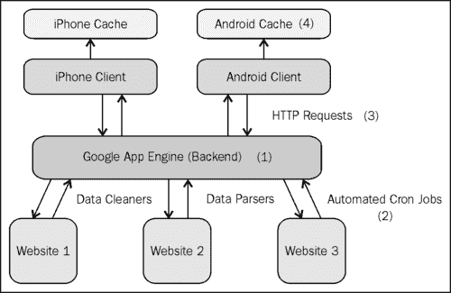

# 第七章。安卓数据库的实践

在前一章中，我们终于看到了将后端数据库绑定到用户界面的方法。至此，我们已经了解了 Android OS 中内置的所有各种本地存储方法([第 1 章](01.html "Chapter 1. Storing Data on Android")、*在 Android 上存储数据*和[第 2 章](02.html "Chapter 2. Using a SQLite Database")、*使用 SQLite 数据库)*，最著名的是 SQLite 数据库，以及利用 SQLite 语言执行强大查询的方法([第 3 章](03.html "Chapter 3. SQLite Queries")、 *SQLite 查询)*。此外，我们知道如何通过内容提供商向外部应用程序公开我们的定制 SQLite 数据库([第 4 章](04.html "Chapter 4. Using Content Providers")、*使用内容提供商)*，以及如何查询预先存在的内容提供商，例如 `Contacts`内容提供商([第 5 章](05.html "Chapter 5. Querying the Contacts Table")、*查询联系人表*)。

因此，在这一点上，我们已经为自己配备了许多工具——足以开始构建成熟的应用程序。然而，在此之前，让我们停下来思考一下。

我们真的应该依赖本地的 SQLite 数据库吗？如果用户的手机出了什么问题，他们的数据被删除了怎么办？或者更重要的是，每个用户都应该下载整个*数据集，并将其存储在本地手机上吗？请记住，手机的内存相当有限，只是台式电脑的一小部分。*

 *当我们开始考虑如何设计我们的应用程序时，所有这些问题都会发挥作用。因此，在本章中，我们将从为您的安卓应用程序创建本地化的 SQLite 数据库的一些实际用例开始，然后转向其他更典型的应用程序设计，特别是针对以数据为中心的应用程序(如果您的应用程序将是一个游戏，那么这可能不适用)。

# 本地数据库用例

因此，让我们从不同的方式开始，人们可能会看到安卓应用程序使用本地化的 SQLite 数据库。澄清一下，我所说的*本地化* SQLite 数据库是指仅存在于手机内存中的数据库，更具体地说，存在于应用程序分配的内存中，并且不受外部数据库的备份/支持。这与*外部*数据库形成对比，后者将存在于服务器上(或云中)，将作为本地化数据库的备份，或作为中央数据库，所有应用程序将从该数据库请求、插入、更新和删除数据。

对于我们的第一个示例，考虑一个基于谜题的应用程序，它跟踪用户在每个级别的所有高分。高分表将具有诸如相应分数的等级(即第一、第二、第三等)、获得该分数的用户的姓名以及分数本身的字段。让我们仔细检查每种形式的数据存储，并思考这是否是完成手头任务的明智方法:

*   `SharedPreferences:`我们可以用一个基于地图的类来完成这个吗？我想，如果我们只需要一个高分表(而不是每个级别一个)，并且该表只有几行，我们可以使用一个简单的地图。但是这可能不是 `SharedPreferences`类的一个非常自然的用法，我们可能可以用一个不同类型的数据存储做得更好，所以现在让我们继续这个。
*   **外置 SD 卡:**你可能还记得，写 SD 卡对于保存和备份文件非常有用。理论上，我们可以将这些表格保存为文件格式，特别是通过将它们保存在**逗号分隔值(CSV)** 文件中(将这些视为电子表格)。然后，我们可以每个级别只有一个 CSV 文件，由于 CSV 文件的结构类似于电子表格，我们可以非常容易地读入这些文件，并将它们绑定到类似 `GridView`的东西上。现在，将资料保存到 SD 卡的一个好处是，您的数据自然会得到备份。例如，如果用户出于任何原因必须卸载并重新安装您的应用程序，那些 CSV 文件将仍然存在，数据将被保留。然而，另一方面，如果用户出于某种原因移除了他们的 SD 卡或篡改了他们的 SD 卡，那么数据可能会丢失或损坏。无论如何，使用 CSV 文件和外置 SD 卡并不是一个可怕的解决方案，但它可能不是最理想或最自然的解决方案。
*   **SQLite 数据库:**鉴于我们试图保存一系列表，自然我们应该考虑使用某种数据库模式。现在，根据我们的游戏中有多少级别(以及随后我们需要多少表)，我们可以设计一个数据库模式，每个级别都有一个单独的表，对于每个级别，我们只需将 `Cursor`指向正确的表的 URI。然而，考虑一个我们有 50 个级别的场景。在这种情况下，用 50 个独特的 URIs 创造 50 张相同的桌子似乎有点愚蠢。因此，我们可以为*级*增加一个额外的字段。然后，当我们进行查询时，我们可以按*级别*列过滤该表，并按排名对剩余的子表进行排序。在这种情况下使用 SQLite 数据库会特别巧妙，因为我们可以通过一个“T2”将结果直接绑定到用户界面。现在，这里有什么问题？嗯，如果用户不得不卸载你的应用程序，那么你的 SQLite 数据库极有可能会从手机的内存中消失。
*   **外部数据库:**在这种情况下使用外部数据库可能会变得非常混乱。为什么呢？首先，让我们考虑一下我们的模式应该是什么样子。我们可能有一个巨大的表，其中包含发出请求的设备的字段(即请求数据的设备的电话号码或用户名)、被请求的级别等，然后只进行包含一堆筛选子句的查询。或者，更好的解决方案可能是每个级别都有一个表，并且对于每个表都包含该行所属设备的附加字段。正如您所看到的，无论哪种情况，模式看起来都有点混乱，但是现在让我们继续使用后一种模式。假设你的游戏做得还不错，达到了 10 万次活跃安装。此外，假设你的游戏有 50 个等级，对于每个高分表，你保留前 10 名。对于一个半受欢迎的游戏来说不是不合理的，对吧？在这个 sce nario 下，突然你的外部数据库有 50 个表，每个表有 100 万行，剩下一个相当大的内存密集型数据库。然后，您必须考虑到，每次用户请求查看高分表时，他/她都需要向您的外部数据库发出一个 HTTP 请求，以便检索相应的表。这个 HTTP 请求将比对本地数据库的简单 SQLite 查询慢几个数量级。那么所有这些工作的好处是什么呢？这种方法将允许您备份每个用户的高分，而不管他们卸载和重新安装您的应用程序的次数，或者他们更换手机的次数等等。另一个很好的功能是，一旦你有了所有用户的所有数据，你就可以潜在地创建一个全球高分表——让你的用户不仅可以看到他们特定安卓设备的高分，还可以看到所有玩你游戏的用户的最高分！

因此，即使在这种情况下，使用本地化数据库和外部数据库也各有利弊。在这种情况下，你需要问自己的问题是:

*   我备份用户的高分有多重要？
*   建立全球高分榜的可能性/有用性如何？

如果你的目标游戏和受众是一个竞争非常激烈的游戏，并且你认为如果重新安装你的应用程序/切换手机意味着失去他们的高分历史，用户会非常沮丧，那么使用外部数据库可能是明智的。然而，我最大的猜测是，很少有手机游戏会让用户的变得*比*有竞争力，在这种情况下，拥有一个简单的本地化数据库会更加实用。

结论？对于一个普通的基于益智游戏的简单高分表，一个本地化的数据库就可以了。数据的格式(也就是一个表)使得这个数据库成为一个自然的选择，并且假设用户不会关心他们的高分是否被保留，这使得实现一个本地化的数据库比外部数据库更加实用。

在继续之前，让我们再考虑一个例子。假设你想创建一个应用程序，让用户更好地找到咖啡馆和咖啡店。也许你想添加一些功能，让用户可以根据空间的可用性(很多时候，我发现自己走进附近的星巴克，却发现所有的桌子都被占了)或无线网络的可用性来过滤咖啡馆和咖啡店。这是一个不错的应用程序，但是你在哪里可以找到你最初的咖啡馆/咖啡店数据库呢？

谢天谢地，您遇到了来自各种服务(即 Yelp、Zagat 等)的几个 API，它们允许您查询它们的数据库，因此数据源不再是问题。但是现在呢？你会如何设计你的安卓应用的后端？让我们再次浏览我们的选项:

*   `SharedPreferences:`这一次很容易理解为什么像 `SharedPreferences`类这样简单和轻量级的方法是不合适的。我们就不讨论这个了。
*   **外部 SD 卡:**所以，像我们前面的例子一样，使用外部 SD 卡的一种可能方式是将您的数据存储在 CSV 文件(即电子表格格式)中，然后读写这些文件。因此，我们在这里可能做的是，在第一次进入我们的应用程序时，我们进行一系列的 API 调用来加载我们的咖啡馆/咖啡店的初始数据库。然后，我们将数据写入 CSV 文件，并在以后引用/更新该 CSV 文件。目前为止一切顺利。但是当我们想要开始过滤数据时会发生什么呢？假设用户只希望看到他/她附近的位置，或者只希望看到有免费无线网络的位置。当我们处理 CSV 文件时，不存在*查询*这个 CSV 文件的概念一个文件就是一个文件，我们唯一的解决方案是打开到该文件的连接，遍历每一行，并手动挑选出我们想要的行。在这个例子中，虽然它将是缓慢和繁重的，理论上我们可以用这个 SD 卡解决方案实现我们的后端。然而，很容易看出，一旦我们的模式变得更加复杂(需要多个表而不是一个表)，无法执行高效、复杂的查询将导致极其糟糕的设计决策。更不用说前面提到的用户移除 SD 卡、损坏 SD 卡等问题了。也许在这种情况下，我们最好远离 SD 卡。
*   **SQLite 数据库:**对于 SQLite 数据库，同样，考虑到我们数据的固有表格式，这是一个自然的解决方案。我们可以非常容易地创建一个包含名称、位置、无线可用性等字段的模式，然后编写一系列查询来快速过滤我们的数据。此外，使用 SQLite 数据库，我们将受益于数据可以轻松绑定到用户界面。然而，我们后端的机制会是什么样的呢？在第一次到达应用程序时，我们是否需要点击所有 API 并下载全国所有咖啡馆/咖啡店的整个数据集？如果我们不这样做，那么我们就会遇到这样的问题:当用户在旅行时，或者想要查找他们当前城市之外的位置时，我们唯一的解决方案很可能是为引入的每个新位置调用 API。如果我们一次下载整个数据集，那么根据美国咖啡馆/咖啡店的数量，我们可能会遇到内存和性能的问题。在这两种情况下，我们都需要有条不紊地选择如何使用通过 API 获得的最新信息来同步和更新我们的 SQLite 数据库，这本身就是一个完全不同的问题。
*   **外部数据库:**有了外部数据库，我们还可以利用数据固有的表格格式。就像本地化数据库一样，我们仍然可以执行快速查询来过滤数据。我们受益于集中式数据库，确保每次用户请求数据子集时，它都是最新的数据。此外，由于我们的数据库将存在于外部服务器中，因此我们不需要应用程序端的任何额外内存，并且我们还应该看到性能的大幅提升，因为向一个外部数据库发出一个请求比向几个 API 发出几个请求要快得多。我们丢失的地方(与 SQLite 数据库相比)是当用户重复发出相同的请求*时会发生什么。例如，假设用户打开搜索 `Activity`，搜索他/她想要的位置列表，等待几秒钟网络请求返回，然后意外关闭该 `Activity`。如果用户随后重新打开应用程序并返回到那个 `Activity`，他/她将需要做出相同的*网络请求，并再等待几秒钟，以便获得相同的*结果。对于活跃用户来说，这通常是一个巨大的麻烦，并且考虑到许多移动用户相对较短的注意力持续时间，这可能对您的应用程序的成功是致命的。***

 ***现在，我们已经浏览了可供我们使用的数据存储方法列表，让我们快速总结一下每种方法的优缺点。首先，就纯*实现*而言，本地化数据库和外部数据库显然是赢家。然后，就*内存消耗*而言，外部数据库是比本地化数据库更好的选择，因为整个数据集可以存在于应用程序之外。就*性能*而言，外部数据库很好，因为我们只需要访问一个数据库(我们自己的)，而不是访问多个应用编程接口。然而，本地化的数据库很好，因为用户可以在搜索中来回移动 `Activity`，而不必进行任何额外的网络呼叫。

这里没有明确的赢家，但是有一种方法可以将这两种方法结合起来，设计一个健壮的后端来解决前面讨论的所有问题。这种组合方法使用外部数据库作为中央存储单元，但随后使用本地化数据库作为*缓存*来提高性能。在下一节中，让我们深入研究将本地化的 SQLite 数据库用作外部数据库而不是独立数据库的缓存意味着什么。

# 作为缓存的数据库

那么什么是缓存呢？**缓存**通常被定义为内存中存储重复数据的地方，以便将来可以更快地提供服务。就我们而言，这正是我们要找的。

在前面的示例中，我们看到通过使用外部数据库，我们能够在不影响实现的情况下提高内存消耗，有时还能提高性能。此外，我们可以自然地确保所有用户拥有相同的数据，并且这些数据是最新的。唯一一次仅仅依赖外部数据库会受到影响的情况是，用户在您的应用程序周围活动，每次都必须向您的外部数据库发出相同(或相似)的网络请求，然后不得不反复等待这些网络请求返回。

一种解决方案是使用缓存，只需发出一次网络请求*。然后，当网络请求完成时，将返回数据的重复版本存储在本地化的数据库中，这样，如果用户发出相同(或相似)的请求，我们的系统只需要进行本地查询，而不是网络查询。*

 *为了帮助您更好地理解低级实现，让我们仔细看看这个缓存是如何工作的。

所以用户登陆你的搜索 `Activity`并发出请求。假设请求针对的是距离他/她的位置三英里以内的所有咖啡馆和咖啡店，这些咖啡馆和咖啡店也有免费无线网络。您必须做出的一个设计选择是，在这种情况下应该缓存多少数据？当然，您可以使用用户想要的所有过滤器发出请求，并且只缓存那些结果。但是如果用户突然决定他/她不在乎有免费的 Wi-Fi 怎么办？或者，如果用户决定放宽搜索标准，而是想寻找五英里范围内的所有商店？

虽然拥有缓存肯定会提高性能，但真正的好处来自于缓存的命中频率。对于那些熟悉设计缓存的人来说，折衷来自于缓存被命中的频率和缓存的大小。换句话说，在极端情况下，如果您将缓存设计为包含您的整个*数据集，那么显然每个请求都将是缓存命中，因此从这个意义上来说，您的缓存将非常有效。然而，您将整个数据集存储在内存中的事实是次优的(根据数据库的大小，这通常是不可能的)，因此缓存在这方面会失败。试图找到两者的完美结合是目标，所以在这种情况下，与其只请求三英里内有免费无线网络的位置，为什么不尝试请求五英里内的所有位置，并完全排除无线网络过滤器？*

 *相反，通过缓存这个请求，现在当用户决定将他/她的搜索条件从 3 英里放宽到 5 英里(或向下放宽到 2 英里)时，你已经有了所有的结果；因此，您无需发出另一个网络请求，只需过滤缓存中所需的数据子集即可。同样，如果您的用户想要移除 Wi-Fi 过滤器，您可以快速查询您的缓存中的该数据，这次仅移除了*Wi-Fi*过滤器。在这两种情况下，用户都会访问您的缓存，从而避免您发出耗时的网络请求。

设计缓存系统的最后一步是确定刷新缓存的频率。永远不要刷新缓存不是最佳选择，因为随着时间的推移，缓存的每个新请求只会消耗更多的内存，此外，您还会遇到数据过期的问题。例如，假设您的用户向他们的家乡提出咖啡馆/咖啡店请求，而您缓存了这个结果。但是，您的缓存系统永远不会刷新缓存。一年内可能会发生很多事情，一年后当用户再次拉出您的应用程序并发出相同的咖啡馆/咖啡店请求时，他/她会访问缓存并拉出旧数据，而不是发出新的请求。

另一方面，通过允许您的缓存刷新过于频繁，您将降低缓存命中频率，并最终不得不做出比预期更多的网络请求。因此，我们又遇到了一个优化问题，我们希望最大化缓存命中的数量，同时最小化所需的内存消耗，并最小化提取陈旧数据的频率。

这个简化的优化问题是每个缓存系统的核心，也是使用本地化数据库缓存外部数据库网络请求时需要牢记的问题。虽然关于缓存还有很多可以讨论的地方，但本节(以及整个章节)的目标是激发您的思考过程，并向您介绍本地化数据库的众多用途之一，以及它们如何与外部数据库结合使用。

在下一节中，我将讨论一个典型的以数据为中心的应用程序的外观，以及典型的数据流。同样，我所说的*以数据为中心的*应用程序是那些其主要功能涉及显示/与某种形式的数据交互的应用程序。这可能包括从用户可以相互读/写消息的社交网络应用程序(本例中的数据包括消息、事件、照片——任何可以共享的东西)到用户可以加载附近餐馆的详细信息的食品和餐饮应用程序的一切。这通常会排除许多基于游戏的应用程序，尽管即使基于游戏的应用程序有时也需要采用某种外部数据库(例如，我们前面讨论的全局高分表)。因此，让我们再次转移我们的注意力，从更全面的角度开始考虑移动应用程序——作为外部数据库和外部应用程序的扩展，而不是简单的独立应用程序。

# 典型应用设计

到目前为止，我们只是讨论和玩弄关于后端应用程序设计的想法。我们首先考虑了使用完全本地化的后端与完全外部的后端的利弊，然后考虑了在应用程序中使用这两者的方法，以尝试并获得两者的最佳效果。我们可以做到这一点的方法之一是通过使用缓存，在单独设计缓存时，我们看到必须做出大量的设计决策。

不管你是否意识到这一点，这段时间你一直在分析不同应用程序的不同后端设计的优缺点，现在我们准备专注于一个非常通用的设计，这个设计非常实用，并且经常在以数据为中心的移动应用程序中使用。不过话不多说，让我们为我们的设计画一幅画:

这里到底发生了什么？让我们分解一下:

1.  首先，我们有外部的集中式数据库。这是我们后端的核心。所有应用程序(无论是网络还是移动)都将引用该数据库，这样，我们可以确保所有移动设备上的所有数据都将同步并保持最新。此外，在这个设计中，我们的应用程序不再是特定于平台的。换句话说，人们可以很容易地创建一个适用于所有移动设备的应用程序，包括安卓和 iOS，因为所有设备都指向同一个数据库。
2.  外部数据库还将客户端(即移动应用程序和 web 应用程序)与数据收集/解析/清理端分开。在后一种情况下，我们拥有所有用于收集、解析和清理后端数据的流程。这可能包括定期调用 API(假设 API 允许您存储其数据的副本)、抓取网站(稍后讨论)，或者在某些情况下手动插入新数据。然后，一旦数据进来，通常需要对其进行解析和清理，以符合数据库的规范。此外，通过使用 CRON 作业(在[第 9 章](09.html "Chapter 9. Collecting and Storing Data")、*收集和存储数据*中讨论)，收集和清理数据的整个过程本身可以实现自动化。因此，通过以这种方式设置您的应用程序，您可以在幕后向用户隐藏所有这些数据挖掘。
3.  另一方面，网络应用程序和移动应用程序不断向外部数据库发出请求。这些请求通常采用 HTTP GET 和 POST 请求的形式(获取数据相对于插入/更新数据)，并将返回 XML 或 JSON 格式的结果。同样，因为这些只是标准的 HTTP 网络请求，它独立于发出请求的平台，所以您可以轻松地将应用程序从一个平台移植到另一个平台。
4.  最后，我们有缓存，它是外部数据库的一个临时的、本地化的子集，并且存在于移动/web 应用程序端。如前所述，这些缓存旨在提高应用程序的性能，使我们不必进行重复的网络请求。

这就是了。同样，就目前而言，这仍然是非常高的水平，但是我们已经看到并讨论了与我们设计的第四部分相关的组件，在接下来的章节中，我们还将看到前三部分。

# 总结

即使我们没有在这一章中查看任何代码，我们仍然设法完成了很多。我们从确定两个非常现实的需求(一个简单的高分表，然后是位置/场地数据库)开始这一章，并研究了如何选择合适的存储方法背后的思考过程。

我们看到，对于像高分表这样简单的东西，本地化的 SQLite 数据库既有效又易于实现。这种方法唯一真正的缺点是不能显示全球高分表，但对于大多数游戏来说，这只是一个小功能。然而，对于我们的咖啡馆/咖啡店应用程序，我们发现本地化的 SQLite 数据库远不如集中式外部数据库有效，外部数据库解决方案的唯一缺点是，如果频繁进行重复的、不必要的网络调用，性能会受到影响。

为了解决这个问题，我们将缓存作为一种解决方案，使用外部和本地数据库，并尝试利用每种方法的优势。然而，要构建有效的缓存，需要做出几个设计决策，以优化缓存命中频率，同时最大限度地减少内存消耗和陈旧数据。

最后，我们结束了这一章，不仅远离了代码，还远离了安卓应用程序本身，并试图从更全面的角度来看待我们的应用程序。我们研究了典型的以数据为中心的应用程序会是什么样子，并将数据的流通分成了四个部分。到目前为止，我们已经讨论了足够多的内容，能够实现设计的第四部分(本地缓存)，现在我们将为剩下的三个部分各写一章。到本书结束时，目标是让您能够自信地设计和实现一个全面的以数据为中心的应用程序。******