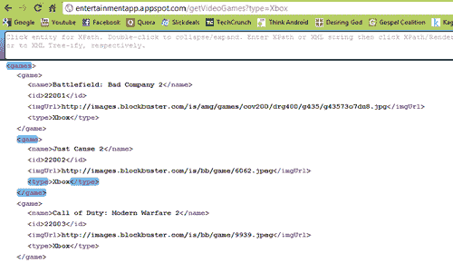
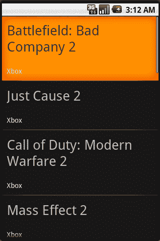

# 十、把它们放在一起

最后，是时候把所有的东西都放在一起了。早些时候在[第 8 章](08.html "Chapter 8. Exploring External Databases")、*探索外部数据库*中，我们通过创建一个新的谷歌应用引擎(GAE)项目和建立 JDO 数据库，开始了我们编写一个重磅游戏应用程序的例子。我们首先定义了我们的 `VideoGame`表应该是什么样子，然后我们编写了一些方便的包装方法，允许我们从后端检索、插入、更新和/或删除 `VideoGame`数据。然后在[第 9 章](09.html "Chapter 9. Collecting and Storing Data")、*收集和存储数据*中，我们研究了各种可以收集数据的方法，或者使用方便的 API，或者编写刮刀为我们做脏活。在我们的例子中，刮刀是必要的，因此我们编写了一些代码来首先清理和构建 Blockbuster 的游戏租赁页面，然后最终导航和解析所需的数据。第一步只是将我们自己重新引入到 HTTP servlets 中，看看我们如何实现一个 servlet，当它被击中时，会用最新的游戏刮擦和更新我们的数据库。

现在，我们将通过编写一个实际查询和返回数据的 HTTP servlet 来结束应用程序(与我们前面的示例相反，该示例只返回一条成功或失败的消息)，并且，一旦返回，我们将编写一些简单的 XML 解析器和列表适配器，向您展示一旦数据在移动端，该如何处理它。然后，您将拥有一个功能齐全的后端，它将定期抓取和更新自己的数据，一系列 HTTP servlets 将允许您独立于平台检索数据，以及一个安卓应用程序，它将解析数据并将其绑定到用户界面供用户查看。

# 实现 HTTP GET 请求

在最后一章中，我们简要介绍了 GET 和 POST 请求之间的区别。我们应用程序开发的下一步是在 GAE 服务器端编写几个类，这将允许我们点击一个网址并获得一个视频游戏对象列表。

这意味着我们需要重写另一个 HTTP servlet，它可能会采用一个参数来指示我们正在寻找的游戏平台。直观地说，一旦我们知道了我们要寻找的平台，我们就会想起，我们的 JDO 数据库的包装方法之一涉及查询某个平台的所有游戏。因此，我们可能需要再次使用我们的 JDO 包装类。

但是，您可能还记得，我们的 JDO 数据库返回的行不是字符串，而是对象，因此我们需要采取额外的步骤，将每个 `VideoGame`对象转换为某种可读的格式化字符串，无论是 XML 还是 JSON。有了这些初步的想法和直觉，让我们看看如何实现这个新的 GET 请求:

```java
public class GetVideoGames extends HttpServlet {
// HTTP GET REQUEST SINCE WE'RE REQUESTING FOR DATA
public void doGet(HttpServletRequest request, HttpServletResponse response) throws IOException, ServletException {
String platform = request.getParameter("type");
// USE OUR JDO WRAPPER TO QUERY FOR GAMES BY PLATFORM
List<VideoGame> games = VideoGameJDOWrapper.getGamesByType(platform);
// WRAP GAMES INTO XML FORMAT
String ret = GamesToXMLConverter.convertGamesToXML(games);
// SET THE RESPONSE TYPE TO XML
response.setContentType("text/xml");
response.setHeader("Cache-Control", "no-cache");
// WRITE DATA TO RESPONSE
response.getWriter().write(ret);
}
}

```

一切看起来都应该很熟悉，逻辑也相当简单。唯一不清楚的部分是当我传入一个 `VideoGame`对象列表并得到一个字符串时，接近结束。顾名思义，我编写了一个简单的类，它获取 `VideoGame`对象，剥离它们的字段，并将它们组织成格式良好的 XML 代码(同样，您也可以使用 JSON)。让我们快速看看我是如何定义我的 `GamesToXMLConverter`班级的:

```java
public class GamesToXMLConverter {
public static String convertGamesToXML(List<VideoGame> games) {
String content = "";
for (VideoGame g : games) {
// WRAP EACH GAME IN ITS OWN TAG
content += convertGameToXml(g);
}
// WRAP ALL GAME TAGS TOGETHER INTO ROOT TAG
String ret = addTag("games", content);
return ret;
}
/**
* METHOD FOR CONVERTING OBJECT TO XML FORMAT
*
* @param g
* a video game object
* @return
*/
public static String convertGameToXml(VideoGame g) {
String content = "";
// ADD TAG FOR NAME
content += addTag("name", g.getName().replaceAll("&", "and"));
// ADD TAG FOR ID
content += addTag("id", String.valueOf(g.getId()));
// ADD TAG FOR IMAGE IF NOT NULL
if (g.getImgUrl() != null) {
content += addTag("imgUrl", g.getImgUrl().getValue());
}
// ADD TAG FOR TYPE
content += addTag("type", VideoGameConsole.convertIntToString(g.getConsoleType()));
// WRAP ENTIRE GAME IN <game> TAGS
String ret = addTag("game", content);
return ret;
}
public static String addTag(String tag, String value) {
return ("<" + tag + ">" + value + "</" + tag + ">");
}
}

```

瞧，没什么太复杂的。实际上，你可以用任何你喜欢的方式编写你的 XML/JSON 转换器。事实上，如果你足够努力地搜索，我敢打赌有一些方便的库是为你设计的。然而，正如这本书的主题一样，更多地关注概念，而不是我的实际代码——想法是你进入你的 JDO 数据库，得到一个对象列表，从那里你只需要想一个干净的方法把这些对象写入返回的 `HttpServletResponse`对象。

同样，就像我们之前的 HTTP servlet 一样，为了让我们的 GAE 项目将它识别为有效的 servlet，我们需要在 `/war/WEB-INF/web.xml`文件中将其定义为一个:

```java
<?xml version="1.0" encoding="utf-8"?>
<servlet>
<servlet-name>getVideoGames</servlet-name>
<servlet-class>app.requests.GetVideoGames</servlet-class>
</servlet>
<servlet-mapping>
<servlet-name>getVideoGames</servlet-name>
<url-pattern>/getVideoGames</url-pattern>
</servlet-mapping>

```

一旦我们定义了名称和 URL 模式，我们只需部署项目并点击以下 URL:

`http://{your-project-name}.appspot.com/getVideoGames?type={type}`

我们结束了。对于那些跟随的人，我邀请你检查一下，看看你是否得到一个格式良好的数据列表。否则，请随意查看以下链接以查看我的结果:

`http://entertainmentapp.appspot.com/getVideoGames?type=Xbox`

`http://entertainmentapp.appspot.com/getVideoGames?type=Ps3`

以下是在旅途中阅读这篇文章的人的截图:



现在，让我们把它移回安卓端，看看我们如何发出请求，然后处理/解析结果。

# 回到安卓:解析响应

现在我们已经完全完成了后端，剩下的就是实现来自安卓的这些 HTTP 请求，解析出数据，然后在检索到数据后将这些数据绑定到用户界面(尽管这可能是第 6 章、*绑定到用户界面*的翻版)。

首先，您需要构建一个允许您发出 GET/POST 请求的 HTTP 客户端。这个 HTTP 客户端本质上做的是充当一个工具，您可以为它发出各种 HTTP 请求。HTTP 客户端要求您为如何发出请求设置一些 HTTP 参数。然后，基于这些参数，客户端知道如何相应地处理每个请求。例如，一个这样的参数是告诉 HTTP 客户端如何处理 HTTP 和 HTTPS 请求(也就是说，通过不安全通道和安全通道发出的请求)。每个通道都要求您指定不同的端口，因此您必须在客户端中相应地定义这些端口。在下面的代码中，您可以看到一个为 HTTP 和 HTTPS 请求配置的 HTTP 客户端:

```java
public class ConnectionManager {
public static DefaultHttpClient getClient() {
DefaultHttpClient ret = null;
// SET PARAMETERS
HttpParams params = new BasicHttpParams();
HttpProtocolParams.setVersion(params, HttpVersion.HTTP_1_1);
HttpProtocolParams.setContentCharset(params, "utf-8");
params.setBooleanParameter("http.protocol.expect-continue", false);
// REGISTER SCHEMES FOR HTTP AND HTTPS REQUESTS
SchemeRegistry registry = new SchemeRegistry();
registry.register(new Scheme("http", PlainSocketFactory.getSocketFactory(), 80));
final SSLSocketFactory sslSocketFactory = SSLSocketFactory.getSocketFactory();
sslSocketFactory.setHostnameVerifier (SSLSocketFactory.BROWSER_COMPATIBLE_HOSTNAME_VERIFIER);
registry.register(new Scheme("https", sslSocketFactory, 443));
ThreadSafeClientConnManager manager = new ThreadSafeClientConnManager(params, registry);
ret = new DefaultHttpClient(manager, params);
return ret;
}
}

```

一旦有了这些，我更喜欢构建一些简单的 GET/POST 包装方法，当传递给一个 HTTP 客户端和一个 URL 时，它会以字符串的形式返回结果:

```java
public class GetMethods {
/**
* MAKE AN HTTP GET REQUEST
*
* @param mUrl
* the url of the request you're making
* @param httpClient
* a configured http client
* @return
*/
public static String doGetWithResponse(String mUrl, DefaultHttpClient httpClient) {
String ret = null;
HttpResponse response = null;
// INITIATE THE GET METHOD WITH THE DESIRED URL
HttpGet getMethod = new HttpGet(mUrl);
try {
// USE YOUR HTTP CLIENT TO EXECUTE THE METHOD
response = httpClient.execute(getMethod);
System.out.println("STATUS CODE: " + String.valueOf(response.getStatusLine(). getStatusCode()));
if (null != response) {
// CONVERT HTTP RESPONSE TO STRING
ret = getResponseBody(response);
}
} catch (Exception e) {
System.out.println(e.getMessage());
}
return ret;
}
public static String getResponseBody(HttpResponse response) {
String response_text = null;
HttpEntity entity = null;
try {
// GET THE MESSAGE BODY OF THE RESPONSE
entity = response.getEntity();
if (entity == null) { throw new IllegalArgumentException("HTTP entity may not be null"); }
// IF NOT NULL GET CONTENT AS STREAM
InputStream instream = entity.getContent();
if (instream == null) { return ""; }
// CHECK FOR LENGTH
if (entity.getContentLength() > Integer.MAX_VALUE) { throw new IllegalArgumentException(
"HTTP entity too large to be buffered in memory"); }
// GET THE CHARACTER SET OF THE RESPONSE
String charset = null;
if (entity.getContentType() != null) {
HeaderElement values[] = entity.getContentType(). getElements();
if (values.length > 0) {
NameValuePair param = values[0]. getParameterByName("charset");
if (param != null) {
charset = param.getValue();
}
}
}
if (charset == null) {
charset = HTTP.DEFAULT_CONTENT_CHARSET;
}
// ONCE CHARSET IS OBTAINED - READ FROM STREAM
Reader reader = new InputStreamReader(instream, charset);
StringBuilder buffer = new StringBuilder();
try {
// USE A BUFFER TO READ FROM STREAM
char[] tmp = new char[2048];
int l;
while ((l = reader.read(tmp)) != -1) {
buffer.append(tmp, 0, l);
}
} finally {
reader.close();
}
// CONVERT BUFFER TO STRING
response_text = buffer.toString();
} catch (Exception e) {
e.printStackTrace();
}
return response_text;
}
}

```

乍一看，这一切似乎都非常令人生畏，尤其是对于从未见过这些技术或类的人来说。是的——有很多新的课程，但这些都不是火箭科学；事实上，类名都是非常直观和描述性的，除此之外没有太多内容。

在第一种方法中，我们所做的非常简单。Java 有一个 `HttpGet`类，它包含在安卓软件开发工具包和 Java 软件开发工具包中，然后用一个网址进行实例化。接下来，我们将这个 `HttpGet`对象传递到我们的 HTTP 客户端，等待响应返回给我们。响应最终将作为一个 `HttpResponse`对象返回，在这个对象中有描述性的字段，告诉您 HTTP 状态代码、响应的内容(这是我们很快需要的)等等。状态代码是一个有用的东西，因为它将告诉我们 GET 请求是否成功，如果不成功，它失败的原因是什么。有了这些不同的错误代码，我们就可以相应地处理每一个事件，例如，如果服务器停机了，那么我们就倒霉了，应该告诉用户稍后再检查，或者潜在地将他们引导到应用程序的离线版本。另一方面，如果这只是一个暂时的连接问题，那么也许我们会再次默默地提出请求。

一旦我们有了响应并检查它是否成功，就是时候获取响应体了！这方面的代码在下一部分，也就是 `getResponseBody()`方法。这种方法有点麻烦，但希望内联注释有助于引导您了解正在发生的事情。从高层次来看，本质上我们正在做的是抓取 `HttpResponse`对象的内容主体，在这种情况下称为实体。然而，实体是一个包含大量描述性字段的独立对象，但我们真正感兴趣的是 `HttpEntity`对象的字符串表示。因此，从 `HttpEntity`我们请求一个 `InputStream`，这将允许我们利用一个 `StringBuilder`对象并逐行流式传输内容主体的字符。现在，中间代码的其余部分只是一系列检查，以确保确实有一条消息需要缓冲，如果是这样的话，它对于我们的缓冲区来说不会太大(也就是说，它不会超过字符串的最大大小)。最后，我们只需要检索内容主体的字符集，以便我们的 `InputStreamReader`知道在将消息转换为字符时使用哪个字符集。

现在，我们将如何使用前面两个类从安卓客户端发出 GET 请求:

```java
public class GetVideoGamesAndroid {
private static String URL_BASE = "http://entertainmentapp.appspot.com";
private static String REQUEST_BASE = "/getVideoGames?type=";
// THIS RETRIEVES THE HTTP CLIENT CONFIGURED ABOVE
private static DefaultHttpClient httpClient = ConnectionManager.getClient();
// PASS IN THE PLATFORM YOU WANT I.E. XBOX, PS3, ETC
public static List<VideoGame> getGamesByType(String type) {
// CONSTRUCT GET REQUEST URL
String url = URL_BASE + REQUEST_BASE + type;
// XML RESPONSE AS A STRING GETS RETURNED
String response = GetMethods.doGetWithResponse(url, httpClient);
// RUN THROUGH SIMPLE XML PARSER
List<VideoGame> games = ObjectParsers.parseGameResponse(response);
return games;
}
}

```

在这一点上，你会注意到正在发生的事情的核心确实在我们的 `GetMethods`类中，一旦这个类被实现，发出 GET 请求就变得非常简单:只需要一个网址。那么在这种情况下，XML 解析器是什么样子的呢？您可以通过多种方式来实现它，这取决于 XML 有多复杂和/或您对各种 XML 文档解析器有多熟悉。对于极其简单的 XML(即只有一层节点的文档)，有时使用简单的 REGEX 命令就可以了。在更复杂的 XML 中，有时使用 Java 内置的 `SAXParser`类或者甚至使用我们的伙伴 `HtmlCleaner`会有所帮助。请注意，在许多情况下，返回的数据也可能是 JSON 格式的，在这种情况下，您需要编写一些简单的 JSON 解析器，这些解析器采用各种键值对，并在移动端重建 `VideoGame`对象。

由于所有这些先前的依赖关系，我将把 `parseGameResponse()`方法的实际实现留给你们——目标是明确的，如果你需要一个数据是什么样子的提示，只需参考本章的第一个图像。现在您只需要解析它，这应该是一个相对简单的练习。我要提到的最后一件事是，这些 HTTP 请求通常需要一些时间(至少几秒钟，有时超过 10-20 秒，这取决于服务器上完成的工作量)。因为如果主用户界面线程被延迟太长时间(取决于条件，5-10 秒)，安卓操作系统会抛出“应用程序不响应”(ANR)错误，所以我强烈建议在不同的线程上发出所有的 HTTP 请求。你可以用传统的方法使用 `Runnable`和 `Handler`类来实现，但是安卓也为你提供了像 `A syncTask`类一样的包装类。我也鼓励你阅读我们在谷歌的朋友发的这篇文章，了解更多关于设计响应应用的信息:

[http://developer . Android . com/guide/practices/design/responsibility . html](http://developer.android.com/guide/practices/design/responsiveness.html)

所以现在，我们已经发出了 GET 请求，解析了数据，我们在移动端有一个很好的 `VideoGame`对象列表，它们是来自我们服务器的 `VideoGame`对象的副本。剩下唯一要做的就是使用我们在本书前面看到的一个 `ListAdapters`并将其绑定到用户界面！

# 最终步骤:绑定到 UI(再次)

现在是最后也是最后一步了——将我们的数据绑定到用户界面。这一部分对于那些看完整本书的人来说应该很熟悉，所以我会尽量简短但完整。

在前面的部分中，我们基本上将所有的网络请求都连接在一起，包括应用程序端和服务器端，因此现在我们应该能够从任何移动应用程序无缝地发出 GET 请求。我们还研究了解析结果响应的方法(同样，这只是一个练习，因为响应可以以任何方式返回)，并将数据从字符串形式转换回 `VideoGame`对象形式。

所以现在让我们回想一下[第 6 章](06.html "Chapter 6. Binding to the UI")，*绑定到 UI* 。在那一章中，我们看了 `ListAdapters` `BaseAdapter`和 `CursorAdapter`的两个子类。大家还记得，当我们的数据存储到 SQLite 数据库中时，会用到 `CursorAdapter`。对我们的 SQLite 数据库的后续查询以 `Cursor`对象的形式返回，然后被 `CursorAdapter`类包装。在我们的 `VideoGame`示例中，我们当前有一个对象列表，而不是 `Cursor`。这并不是说我们不能将结果存储到 SQLite 数据库中，从而有效地创建缓存(还记得这些吗？)在我们的应用程序端，然后向我们的缓存发出一个查询来获得一个 `Cursor`。但是，为了简单起见，让我们继续使用我们的 `VideoGame`对象列表，并简单地使用一个专门为这种列表设计的 `BaseAdapter`。它的代码可能如下所示:

```java
public class VideoGameBaseAdpater extends BaseAdapter {
// REMEMBER CONTEXT SO THAT CAN BE USED TO INFLATE VIEWS
private LayoutInflater mInflater;
// LIST OF VIDEO GAMES
private List<VideoGame> mItems = new ArrayList<VideoGame>();
public VideoGameBaseAdpater(Context context, List<VideoGame> items) {
// HERE WE CACHE THE INFLATOR FOR EFFICIENCY
mInflater = LayoutInflater.from(context);
mItems = items;
}
public int getCount() {
return mItems.size();
}
public Object getItem(int position) {
return mItems.get(position);
}
public long getItemId(int position) {
return position;
UIUIdata, binding to}
public View getView(int position, View convertView, ViewGroup parent) {
VideoGameViewHolder holder;
// IF NULL THEN NEED TO INSTANTIATE IT BY INFLATING IT
if (convertView == null) {
convertView = mInflater.inflate(R.layout.list_entry, null);
holder = new VideoGameViewHolder();
holder.name_entry = (TextView) convertView.findViewById (R.id.name_entry);
holder.type_entry = (TextView) convertView.findViewById (R.id.number_type_entry);
convertView.setTag(holder);
} else {
// GET VIEW HOLDER BACK FOR FAST ACCESS TO FIELDS
holder = (VideoGameViewHolder) convertView.getTag();
}
// EFFICIENTLY BIND DATA WITH HOLDER
VideoGame v = mItems.get(position);
holder.name_entry.setText(v.getName());
String type = VideoGameConsole.convertIntToString (v.getConsoleType());
holder.type_entry.setText(type);
return convertView;
}
static class VideoGameViewHolder {
TextView name_entry;
TextView type_entry;
}
}

```

所以就像在[第 6 章](06.html "Chapter 6. Binding to the UI")、*绑定到 UI* 中一样，我们实现了一个自定义 `BaseAdpater`，它创建了一个 `Contact`对象的列表——在这种情况下，我们正在做一些极其相似的事情，但是针对的是我们的 `VideoGame`对象！请注意，我的 `VideoGameViewHolder`只显示游戏名称和游戏类型，我没有对图像网址做任何事情。同样，可以通过使用 `ImageView`很容易地将它合并到每一行中，但这需要将一个网址转换成位图对象——这并不难做到，但在我们的例子中是不必要的；你现在明白了。

现在已经完成了，我们只需要创建一个发出 GET 请求的 Activity，获取结果列表 `VideoGames`，并使用自定义 `VideoGameBaseAdapter`将它们设置为它的 `ListAdapter`。这个的代码非常简单:

```java
public class VideoGameBaseAdapterActivity extends ListActivity {
private List<VideoGame> games;
@Override
public void onCreate(Bundle savedInstanceState) {
super.onCreate(savedInstanceState);
setContentView(R.layout.list);
// MAKE GET REQUEST TO RETRIEVE GAMES
games = GetVideoGamesAndroid.getGamesByType (VideoGameConsole.XBOX);
// USE VIDEO GAME ADAPTER
VideoGameBaseAdpater vAdapter = new VideoGameBaseAdpater(this, games);
// SET THIS ADAPTER AS YOUR LIST ACTIVITY'S ADAPTER
this.setListAdapter(vAdapter);
}
@Override
protected void onListItemClick(ListView l, View v, int position, long id) {
super.onListItemClick(l, v, position, id);
VideoGame vg = games.get(position);
String name = vg.getName();
System.out.println("CLICKED ON " + name);
}
}

```

完成后，我们的最终结果如下所示:



瞧啊。拍拍你自己的背，因为我们刚刚完成了我们的第一个全面的以数据为中心的应用！现在，我们不仅有一个功能齐全的后端，配备了自己的一组 HTTP 请求，而且我们还构建了一个有前途的安卓应用程序的开始，它可以向这个后端发出 HTTP 请求，获取结果，并在一个简单的列表中显示它们。

# 总结

所以，我们已经到达了终点，但是在我们分开之前，让我们从头到尾看一看我们已经学习和涵盖的所有不可思议的事情。我们从安卓系统上的各种本地存储方法开始看这本书——重量极轻、效率极高的方法，以及像 SQLite 数据库这样更复杂但同时功能更强大的方法。

然后，我们深入研究了 SQLite 数据库，这可能是您在 Android 应用程序开发生涯中遇到的最常见的本地数据存储形式，然后在[第 3 章](03.html "Chapter 3. SQLite Queries")、 *SQLite 查询*中讨论 SQL 查询。接下来，我们了解了通过将 SQLite 数据库包装在内容提供者中，向外部应用程序公开它们的方法。然后我们看了安卓操作系统上最受欢迎的内容供应器——联系人内容供应器，并实现了一些可能会遇到的常见查询。

一旦我们完全掌握了本地存储方法，我们就开始通过各种 `ListAdapter`类将这些本地数据源绑定到用户界面。正是在这一章中，我们看到了 `CursorAdapter`和 `BaseAdapter`的实现和用例。

从那时起，我们开始更全面地看待以数据为中心的应用程序设计和编程。我们讨论了使用所有各种形式的本地数据存储的实用方法，还引入了缓存的概念，作为 SQLite 数据库的一个极其实用的用例。这自然促使我们考虑外部数据库，因为缓存通常与 web 请求和 web 编程齐头并进。

我们是通过外部数据库来结束这本书的。我们讨论了可以使用的不同类型的外部数据库，并决定在我们的示例实现中继续使用谷歌应用引擎(GAE)。正是在 GAE，我们实现了一个功能齐全的 JDO 数据库(全部在云中完成)，在这一点上，我们还实现了一系列允许我们发出 HTTP GET 和 POST 请求的 HTTP servlets。最后，我们结束了这本书，实现了应用程序移动端的代码——让我们回到了安卓。

我希望通过这一切，我们可以更好地看到本地和外部数据库如何融入开发强大的、以数据为中心的安卓应用程序的宏伟计划。祝你好运，发展愉快。