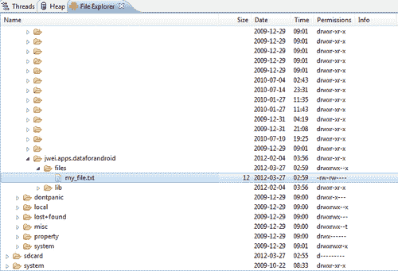
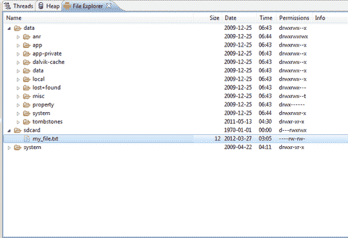

# 第一章：在 Android 上存储数据

今天，我们生活在一个日益以数据为中心和数据驱动的社会中。我们生活在一个像亚马逊这样的公司追踪我们查看的每一个商品和我们购买的每一个商品，以便向我们推荐类似商品的世界。我们生活在一个像谷歌这样的公司存储每一个向他们提出的搜索查询，以便未来推荐更好的搜索查询的世界。我们生活在一个像 Facebook 这样的社交媒体网站记住我们与朋友分享的每一个事件和每一个想法，以便更好地了解他们数亿用户中的每一个的世界。我们生活在一个日益以数据为中心的世界中，因此，我们必须以数据为中心的视角开发应用程序，这是至关重要的。

你可能会问，为什么是 Android？或者更普遍地问，为什么是移动应用？看看你周围，近几年来，移动设备的增长，如智能手机和平板电脑，已经爆炸式增长。此外，移动设备隐含地为我们提供了之前在桌面应用中没有的另一层数据。当你随身携带智能手机或平板电脑时，它知道你的位置，知道你在哪里签到以及你在做什么；简而言之，它知道的你比你意识到的要多得多。

在记住这两个要点的同时，我们从数据和 Android 的角度开始探索，快速深入了解谷歌的工程师们为 Android 操作系统内置的各种方法。本书假设读者对 Android 操作系统有一定的经验，因为我们将直接进入代码。现在，了解你可以使用的所有不同的数据存储方法很重要，但同样重要的是要了解每种方法的优点和缺点，这样你才能构建一个高效、设计良好且可扩展的应用程序。

# 使用 SharedPreferences

`SharedPreferences`是在你的 Android 应用程序中存储本地数据最简单、快捷、高效的方式。它本质上是一个允许你存储和关联各种**键值**对与你的应用程序的框架（可以把它看作是随应用程序附带的地图，你可以随时利用它），因为每个应用程序都与其自己的`SharedPreferences`类关联，所以存储和提交的数据在所有用户会话中都是持久的。然而，由于其简单和高效的本质，`SharedPreferences`只允许你保存基本数据类型（即布尔值、浮点数、长整数、整数和字符串），因此在决定将什么作为共享偏好存储时要记住这一点。

让我们看看你如何访问和使用应用程序的`SharedPreferences`类的一个例子：

```kt
public class SharedPreferencesExample extends Activity {
private static final String MY_DB = "my_db";
@Override
public void onCreate(Bundle savedInstanceState) {
super.onCreate(savedInstanceState);
setContentView(R.layout.main);
// INSTANTIATE SHARED PREFERENCES CLASS
SharedPreferences sp = getSharedPreferences(MY_DB,
Context.MODE_PRIVATE);
// LOAD THE EDITOR REMEMBER TO COMMIT CHANGES!
Editor e = sp.edit();
e.putString("strKey", "Hello World");
e.putBoolean("boolKey", true);
e.commit();
String stringValue = sp.getString("strKey", "error");
boolean booleanValue = sp.getBoolean("boolKey", false);
Log.i("LOG_TAG", "String value: " + stringValue);
Log.i("LOG_TAG ", "Boolean value: " + booleanValue);
}
}

```

让我们逐步了解这段小代码片段中发生的事情。首先，我们启动一个`Activity`，在`onCreate()`方法中，我们请求获取一个`SharedPreferences`类。`getSharedPreferences()`方法的参数是：

```kt
getSharedPreferences(String mapName, int mapMode)

```

在这里，第一个参数简单地指定你想要哪个共享偏好设置映射（每个应用程序可以拥有几个独立的共享偏好设置映射，因此，就像在数据库中指定表名一样，你必须指定要检索哪个映射）。第二个参数稍微复杂一些——在上面的例子中，我们传入`MODE_PRIVATE`作为参数，这个参数只是指定你正在检索的共享偏好设置实例的可见性（在这种情况下，可见性设置为私有，只有你的应用程序可以访问映射内容）。其他模式包括：

+   `MODE_WORLD_READABLE:` 使你的地图对其他应用程序可见，尽管内容只能读取。

+   `MODE_WORD_WRITEABLE:` 使你的地图对其他应用程序可见，并可用于读取和写入。

+   `MODE_MULTI_PROCESS:` 此模式自 API Level 11 起可用，允许你通过多个进程修改地图，这些进程可能会写入同一个共享偏好设置实例。

现在，一旦我们有了共享偏好设置对象，就可以立即通过其各种`get()`方法检索内容——比如我们之前看到的`getString()`和`getBoolean()`方法。这些`get()`方法通常需要两个参数：第一个是*键*，第二个是如果找不到给定键时的默认值。以上一个例子为例，我们有：

```kt
String stringValue = sp.getString("strKey", "error");
boolean booleanValue = sp.getBoolean("boolKey", false);

```

因此，在第一个案例中，我们尝试检索与键`strKey`关联的字符串值，如果找不到这样的键，则默认为字符串`error`。同样，在第二个案例中，我们尝试检索与键`boolKey`关联的布尔值，如果找不到这样的键，则默认为布尔值`false`。

但是，如果你想*编辑*内容或*添加新*内容，那么你需要检索每个共享偏好设置实例中包含的`Editor`对象。这个`Editor`对象包含了所有允许你传递键及其关联值的`put()`方法（就像你对标准`Map`对象所做的那样）——唯一需要注意的是，在添加或更新共享偏好设置的内容后，你需要调用`Editor`对象的`commit()`方法来*保存这些更改*。此外，同样地，就像标准`Map`对象一样，`Editor`类也包含`remove()`和`clear()`方法，让你自由地操作共享偏好设置的内容。

在我们继续讨论`SharedPreferences`的典型用例之前，需要记住的最后一件事是，如果你决定将共享偏好实例的可见性设置为`MODE_WORLD_WRITEABLE`，那么你可能会因为恶意外部应用程序而面临各种安全漏洞。因此，实际上，不推荐使用这种模式。然而，许多开发人员仍然面临在两个应用程序之间本地共享信息的愿望，因此，开发了一种简单的方法，只需在应用程序的清单文件中设置一个`android:sharedUserId`即可实现。

这个工作原理是，每个签名并导出的应用程序都会获得一个自动生成的应用程序 ID。但是，如果你在应用程序的清单文件中明确设置此 ID，那么假设有两个应用程序使用相同的密钥签名，它们将能够自由访问彼此的数据，而无需将数据暴露给用户手机上的其他应用程序。换句话说，通过为两个应用程序设置相同的 ID，只有这两个应用程序能够访问彼此的数据。

## SharedPreferences 的常见用例

既然我们已经知道如何实例化和编辑共享偏好对象，那么考虑这种数据存储类型的典型用例是很重要的。因此，以下是几个示例，说明应用程序倾向于保存哪些类型的小型、原始的键值对数据。

### 检查这是否是用户第一次访问你的应用程序

对于许多应用程序来说，如果这是用户的第一次访问，那么他们可能希望显示一些说明/教程活动或启动屏幕活动：

```kt
public class SharedPreferencesExample2 extends Activity {
private static final String MY_DB = "my_db";
@Override
protected void onCreate(Bundle savedInstanceState) {
super.onCreate(savedInstanceState);
setContentView(R.layout.main);
SharedPreferences sp = getSharedPreferences(MY_DB,
Context.MODE_PRIVATE);
/**
* CHECK IF THIS IS USER'S FIRST VISIT
*/
boolean hasVisited = sp.getBoolean("hasVisited",
false);
if (!hasVisited) {
// ...
// SHOW SPLASH ACTIVITY, LOGIN ACTIVITY, ETC
// ...
// DON'T FORGET TO COMMIT THE CHANGE!
Editor e = sp.edit();
e.putBoolean("hasVisited", true);
e.commit();
}
}
}

```

### 检查应用程序上次更新时间

许多应用程序内置了某种缓存或同步功能，这将需要定期更新。通过保存上次更新时间，我们可以快速检查已经过去了多少时间，并决定是否需要进行更新/同步：

### 提示

**下载示例代码**

你可以从你的账户下载你购买的所有 Packt 图书的示例代码文件，网址是[`www.packtpub.com`](http://www.packtpub.com)。如果你在其他地方购买了这本书，可以访问[`www.packtpub.com/support`](http://www.packtpub.com/support)注册，我们会直接将文件通过电子邮件发送给你。

```kt
/**
* CHECK LAST UPDATE TIME
*/
long lastUpdateTime = sp.getLong("lastUpdateKey", 0L);
long timeElapsed = System.currentTimeMillis() -
lastUpdateTime;
// YOUR UPDATE FREQUENCY HERE
final long UPDATE_FREQ = 1000 * 60 * 60 * 24;
if (timeElapsed > UPDATE_FREQ) {
// ...
// PERFORM NECESSARY UPDATES
// ...
}
// STORE LATEST UPDATE TIME
Editor e = sp.edit();
e.putLong("lastUpdateKey", System.currentTimeMillis());
e.commit();

```

### 记住用户的登录用户名

许多应用程序将允许用户记住他们的用户名（以及其他登录相关的字段，如 PIN 码、电话号码等），而共享偏好是存储简单原始字符串 ID 的好方法：

```kt
/**
* CACHE USER NAME AS STRING
*/
// TYPICALLY YOU WILL HAVE AN EDIT TEXT VIEW
// WHERE THE USER ENTERS THEIR USERNAME
EditText userNameLoginText = (EditText)
findViewById(R.id.login_editText);
String userName =
userNameLoginText.getText().toString();
Editor e = sp.edit();
e.putString("userNameCache", userName);
e.commit();

```

### 记住应用程序的状态

对于许多应用程序，应用程序的功能会根据应用程序的状态而改变，通常由用户设置。以电话铃声应用程序为例——如果用户指定在静音模式下不执行任何功能，那么这很可能是一个需要记住的重要状态：

```kt
/**
* REMEBERING A CERTAIN STATE
*/
boolean isSilentMode = sp.getBoolean("isSilentRinger",
false);
if (isSilentMode) {
// ...
// TURN OFF APPLICATION
// ...
}

```

### 缓存用户的位置

任何基于位置的应用程序通常都会因为多种原因想要缓存用户的最后位置（可能用户关闭了 GPS，或者信号弱等）。这可以通过将用户的纬度和经度转换为浮点数，然后存储在共享偏好设置实例中轻松完成：

```kt
/**
* CACHING A LOCATION
*/
// INSTANTIATE LOCATION MANAGER
LocationManager locationManager = (LocationManager)
this.getSystemService(Context.LOCATION_SERVICE);
// ...
// IGNORE LOCATION LISTENERS FOR NOW
// ...
Location lastKnownLocation =
locationManager.getLastKnownLocation
(LocationManager.NETWORK_PROVIDER);
float lat = (float) lastKnownLocation.getLatitude();
float lon = (float) lastKnownLocation.getLongitude();
Editor e = sp.edit();
e.putFloat("latitudeCache", lat);
e.putFloat("longitudeCache", lon);
e.commit();

```

在最新版本的 Android（API 级别 11）中，还有一个新的`getStringSet()`方法，它允许你为给定的关联键设置和检索一组字符串对象。以下是它的实际应用：

```kt
Set<String> values = new HashSet<String>();
values.add("Hello");
values.add("World");
Editor e = sp.edit();
e.putStringSet("strSetKey", values);
e.commit();
Set<String> ret = sp.getStringSet(values, new HashSet<String>());
for(String r : ret) {
Log.i("SharedPreferencesExample", "Retrieved vals: " + r);
}

```

这种情况的用例很多——但现在让我们继续。

# 内部存储方法

让我们从 Android 的内部存储机制开始。对于那些有标准 Java 编程经验的用户，这一部分会非常自然。Android 上的内部存储允许你读取和写入与每个应用程序内部存储关联的文件。这些文件只能由应用程序访问，其他应用程序或用户无法访问。此外，当应用程序被卸载时，这些文件也会自动删除。

下面的例子展示了如何访问应用程序的内部存储：

```kt
public class InternalStorageExample extends Activity {
@Override
protected void onCreate(Bundle savedInstanceState) {
super.onCreate(savedInstanceState);
setContentView(R.layout.main);
// THE NAME OF THE FILE
String fileName = "my_file.txt";
// STRING TO BE WRITTEN TO FILE
String msg = "Hello World.";
try {
// CREATE THE FILE AND WRITE
FileOutputStream fos = openFileOutput(fileName,
Context.MODE_PRIVATE);
fos.write(msg.getBytes());
fos.close();
} catch (IOException e) {
e.printStackTrace();
}
}
}

```

这里我们简单使用了`Context`类的`openFileOutput()`方法，它第一个参数是待创建（或覆盖）的文件名，第二个参数是文件的可见性（与`SharedPreferences`类似，你可以控制文件的可见性）。然后它将我们想要写入的字符串转换为字节形式，并传递给输出流的`write()`方法。不过有一点需要提及，可以使用`openFileOutput()`指定一个额外的模式，即：

+   `MODE_APPEND:` 这个模式允许你打开一个已存在的文件，并将字符串追加到其现有内容之后（使用其他任何模式，现有内容将被删除）

此外，如果你在 Eclipse 中编程，那么你可以进入**DDMS**屏幕，查看应用程序的内部文件（以及其他内容）。



我们可以看到刚刚创建的文本文件。对于那些在终端进行开发的用户，这个文件的路径会是`/data/data/{your-app-path}/files/my_file.txt`。不幸的是，读取文件要复杂得多，相应的代码如下所示：

```kt
public class InternalStorageExample2 extends Activity {
@Override
protected void onCreate(Bundle savedInstanceState) {
super.onCreate(savedInstanceState);
setContentView(R.layout.main);
// THE NAME OF THE FILE
String fileName = "my_file.txt";
try {
// OPEN FILE INPUT STREAM THIS TIME
FileInputStream fis = openFileInput(fileName);
InputStreamReader isr = new InputStreamReader(fis);
// READ STRING OF UNKNOWN LENGTH
StringBuilder sb = new StringBuilder();
char[] inputBuffer = new char[2048];
int l;
// FILL BUFFER WITH DATA
while ((l = isr.read(inputBuffer)) != -1) {
sb.append(inputBuffer, 0, l);
}
// CONVERT BYTES TO STRING
String readString = sb.toString();
Log.i("LOG_TAG", "Read string: " + readString);
// CAN ALSO DELETE THE FILE
deleteFile(fileName);
} catch (IOException e) {
e.printStackTrace();
}
}
}

```

我们从这里开始通过打开一个文件输入流，并将其传递给一个流阅读器。这将允许我们调用 `read()` 方法，将数据以字节的形式读取进来，然后我们可以将这些字节追加到一个 `StringBuilder` 中。一旦完全读取回内容，我们只需从 `StringBuilder` 返回字符串，瞧！在最后，为了完整性起见，`Context` 类为你提供了一个简单的删除保存在内部存储中的文件的方法。

# 外部存储方法

另一方面，外部存储涉及将数据和文件保存到手机的外部**安全数字（SD）卡**。内部和外部存储背后的概念是相似的，因此让我们首先列举这种存储方式与之前看到的 `SharedPreferences` 相比的优缺点。在共享偏好设置中，开销要小得多，因此读写简单的 `Map` 对象比读写磁盘要高效得多。然而，由于你基本上只能使用简单的原始值（大部分情况下；再次强调，最新版本的 Android 允许你保存字符串集合），你实际上是在用灵活性换取效率。使用内部和外部存储机制，不仅可以保存更大的数据块（即整个 XML 文件），还可以保存更复杂的数据形式（即媒体文件、图像文件等）。

那么，内部与外部存储如何选择呢？这两种选择的优缺点要微妙得多。首先，让我们考虑一下**存储空间**（*内存*）。尽管这取决于用户拥有的手机，但内部存储空间通常可能非常有限，即使是相对较新的手机，内部存储空间也可能低至 512 MB。而外部存储则完全取决于用户手机中的 SD 卡。通常，如果存在 SD 卡，那么外部存储空间可以是内部存储空间的许多倍（这取决于 SD 卡的大小，这可以达到 32 GB 的存储空间）。

现在，让我们考虑一下内部与外部存储的**访问速度**。不幸的是，在这种情况下，不能得出任何明确的结论，因为读写速度高度依赖于手机使用的内部闪存类型，以及外部存储的 SD 卡的分类。因此，最后要考虑的是每种存储机制的*可访问性*。再次强调，对于内部存储，数据只能由你的应用程序访问，因此它非常安全，不受潜在恶意的外部应用程序的影响。缺点是，如果应用程序被卸载，那么内部存储空间也会被清除。对于外部存储，其可见性本质上是全球可读和可写的，因此保存的任何文件都会暴露给外部应用程序以及用户。这样就不能保证你的文件会保持安全和未被篡改。

既然我们已经弄清楚了一些差异，让我们回到代码，看看你如何通过以下示例实际访问外部 SD 卡：

```kt
public class ExternalStorageExample extends Activity {
@Override
protected void onCreate(Bundle savedInstanceState) {
super.onCreate(savedInstanceState);
setContentView(R.layout.main);
String fileName = "my_file.txt";
String msg = "Hello World.";
boolean externalAvailable = false;
boolean externalWriteable = false;
String state = Environment.getExternalStorageState();
if (state.equals(Environment.MEDIA_MOUNTED)) {
// HERE MEDIA IS BOTH AVAILABLE AND WRITEABLE
externalAvailable = true;
externalWriteable = true;
} else if
(state.equals(Environment.MEDIA_MOUNTED_READ_ONLY)) {
// HERE SD CARD IS AVAILABLE BUT NOT WRITEABLE
externalAvailable = true;
} else {
// HERE FAILURE COULD BE RESULT OF MANY SITUATIONS
// NO OP
external storage methodsabout}
if (externalAvailable && externalWriteable) {
// FOR API LEVEL 7 AND BELOW
// RETRIEVE SD CARD DIRECTORY
File r = Environment.getExternalStorageDirectory();
File f = new File(r, fileName);
try {
// NOTE DIFFERENT FROM INTERNAL STORAGE WRITER
FileWriter fWriter = new FileWriter(f);
BufferedWriter out = new BufferedWriter(fWriter);
out.write(msg);
out.close();
} catch (IOException e) {
e.printStackTrace();
}
} else {
Log.e("LOG_TAG", "SD CARD UNAVAILABLE");
}
}
}

```

为了执行之前的代码，不要忘记在你的清单文件中添加`WRITE_EXTERNAL_STORAGE`权限。这里，我们从调用`Environment`类的`getExternalStorageState()`方法开始，这允许我们检测外部 SD 卡是否实际已挂载且可写。在没有执行这些初步检查的情况下尝试读取或写入文件，将导致抛出错误。

一旦我们知道 SD 卡已挂载并且确实可写，那么对于 API 级别 7 及以下，我们调用`getExternalStorageDirectory()`来获取到 SD 卡根目录的文件路径。在这一点上，我们只需要创建我们的新文件并实例化一个`FileWriter`和`BufferedWriter`，然后将我们的字符串写入文件。这里需要注意的是，处理外部存储时写入磁盘的方法与我们之前写入内部存储的磁盘方法不同。

这实际上是一个需要注意和理解的重要点，这就是为什么我如此强调这些写入方法。在内部存储示例中，我们通过调用`Context`类的`openFileOutput()`方法获取`FileOutputStream`对象，该方法以模式作为第二个参数。当传入`MODE_PRIVATE`时，幕后发生的事情是，每次使用该`FileOutStream`创建和写入文件时，该文件都会用你的应用程序的唯一 ID（如前所述）进行加密和签名，这样外部应用程序就无法访问这些文件的内容。然而，请记住，在*外部存储*中创建和写入文件时，默认情况下它们是没有安全强制的，所以任何应用程序（或用户）都可以读取和写入这些文件。这就是为什么你可以使用标准的 Java 方法（例如，`FileWriter`）来写入外部 SD 卡，但在写入内部存储时则不行。还需要注意的最后一件事是，正如你可以在 Eclipse 的**DDMS**视图中看到新创建的文件，假设你有 SD 卡设置，你也可以很容易地在**DDMS**中看到新创建的文本文件：



因此，在开发你的应用程序时，利用这个**DDMS**视角，你可以快速地推、拉和监控你写入磁盘的文件。

说到这里，我会快速提及一些在 API 级别 8 之后引入的外部存储写入的变化。这些变化实际上在[`developer.android.com/reference/android/content/Context.html#getExternalFilesDir(java.lang.String)`](http://developer.android.com/reference/android/content/Context.html#getExternalFilesDir(java.lang.String))有很好的文档记录。

但从高层次来看，在 API 级别 8 及以上，我们有两个新的主要方法：

```kt
getExternalFilesDir(String type)
getExternalStoragePublicDirectory(String type)

```

你会注意到，对于这些方法中的每一个，你现在可以传递一个`type`参数。这些`type`参数允许你指定你的文件类型，以便它们被组织到正确的子文件夹中。在第一个方法中，返回的外部文件目录根是特定于你的应用程序的，这样当你的应用程序被卸载时，与这些文件相关联的所有文件也会从外部 SD 卡上删除。在第二个方法中，返回的文件目录根是公共的，因此即使你的应用程序被卸载，保存在这些路径上的文件也会保持持久。决定使用哪个方法仅仅取决于你试图保存的文件类型 — 例如，如果它是在你的应用程序中播放的媒体文件，那么如果用户决定卸载你的应用程序，他/她可能不再需要这个文件。

然而，假设你的应用程序允许用户为他们的手机下载壁纸：在这种情况下，你可能会考虑将任何图像文件保存到公共目录中，这样即使用户卸载了你的应用程序，这些文件仍然可以被系统访问。你可以指定的不同`type`参数有：

```kt
DIRECTORY_ALARMS
DIRECTORY_DCIM
DIRECTORY_DOWNLOADS
DIRECTORY_MOVIES
DIRECTORY_MUSIC
DIRECTORY_NOTIFICATIONS
DIRECTORY_PICTURES
DIRECTORY_PODCASTS
DIRECTORY_RINGTONES

```

因此，我们结束了关于内部和外部存储机制的略显冗长的讨论，并直接进入更厚重的 SQLite 数据库主题。

# SQLite 数据库

最后但同样重要的是，迄今为止最复杂且可以说最强大的本地存储方法是使用 SQLite 数据库。每个应用程序都配备了其自己的 SQLite 数据库，该数据库可以被应用程序中的任何类访问，但不能被外部应用程序访问。在深入到复杂的查询或代码片段之前，让我简要概述一下 SQLite 数据库是什么。

**SQL（结构化查询语言）** 是一种专门为管理*关系型*数据库中的数据而设计的编程语言。**关系型数据库**允许你提交插入、删除、更新和获取查询，同时还可以让你创建和修改模式（简单来说就是表格）。**SQLite** 就是 MySQL、PostgreSQL 和其他流行数据库系统的简化版。它完全自包含且无需服务器，同时仍然支持事务处理，并使用标准的 SQL 语言来执行查询。由于其自包含和可执行的特点，它非常高效、灵活，并且可以被各种编程语言在各种平台上访问（包括我们自己的 Android 平台）。

现在，让我们看看如何实例化一个新的 SQLite 数据库模式，并使用以下代码片段创建一个非常简单的表：

```kt
public class SQLiteHelper extends SQLiteOpenHelper {
private static final String DATABASE_NAME = "my_database.db";
// TOGGLE THIS NUMBER FOR UPDATING TABLES AND DATABASE
private static final int DATABASE_VERSION = 1;
// NAME OF TABLE YOU WISH TO CREATE
public static final String TABLE_NAME = "my_table";
// SOME SAMPLE FIELDS
public static final String UID = "_id";
public static final String NAME = "name";
SQLiteHelper(Context context) {
super(context, DATABASE_NAME, null, DATABASE_VERSION);
}
@Override
public void onCreate(SQLiteDatabase db) {
db.execSQL("CREATE TABLE " + TABLE_NAME + " (" + UID + "
INTEGER PRIMARY KEY AUTOINCREMENT," + NAME
+ " VARCHAR(255));");
}
@Override
public void onUpgrade(SQLiteDatabase db, int oldVersion,
int newVersion) {
Log.w("LOG_TAG", "Upgrading database from version " +
oldVersion + " to " + newVersion + ",
which will destroy all old data");
// KILL PREVIOUS TABLE IF UPGRADED
db.execSQL("DROP TABLE IF EXISTS " + TABLE_NAME);
// CREATE NEW INSTANCE OF TABLE
onCreate(db);
}
}

```

在这里，我们首先会注意到，为了创建一个可定制的数据库架构，我们必须重写`SQLiteOpenHelper`类。通过重写它，我们可以接着重写`onCreate()`方法，这将允许我们指定表的结构。在我们的例子中，你会注意到我们只是创建了一个包含两列的表，一个 ID 列和一个 name 列。该查询等价于在 SQL 中运行以下命令：

```kt
CREATE TABLE my_table (_id INTEGER PRIMARY KEY AUTOINCREMENT,
name VARCHAR(255));

```

你还会看到 ID 列被指定为`PRIMARY KEY`并赋予了`AUTOINCREMENT`属性——这实际上是针对在 Android 中创建的所有表推荐的，我们将遵循这一标准。最后，你会看到 name 列被声明为字符串类型，最大字符长度为`255`（对于更长的字符串，我们可以简单地将列类型设置为`LONGTEXT`）。

重写`onCreate()`方法之后，我们还重写了`onUpgrade()`方法。这让我们可以快速简单地改变表的结构。你需要做的是增加`DATABASE_VERSION`整数值，下次实例化`SQLiteHelper`时，它将自动调用其`onUpgrade()`方法，此时我们首先会删除旧版本的数据库，然后创建新版本。

最后，让我们快速地看看如何在我们非常基础且简陋的表中插入和查询值：

```kt
public class SQLiteExample extends Activity {
@Override
protected void onCreate(Bundle savedInstanceState) {
super.onCreate(savedInstanceState);
setContentView(R.layout.main);
// INIT OUR SQLITE HELPER
SQLiteHelper sqh = new SQLiteHelper(this);
// RETRIEVE A READABLE AND WRITEABLE DATABASE
SQLiteDatabase sqdb = sqh.getWritableDatabase();
// METHOD #1: INSERT USING CONTENTVALUE CLASS
ContentValues cv = new ContentValues();
cv.put(SQLiteHelper.NAME, "jason wei");
// CALL INSERT METHOD
sqdb.insert(SQLiteHelper.TABLE_NAME, SQLiteHelper.NAME,
cv);
// METHOD #2: INSERT USING SQL QUERY
String insertQuery = "INSERT INTO " +
SQLiteHelper.TABLE_NAME +
" (" + SQLiteHelper.NAME + ") VALUES ('jwei')";
sqdb.execSQL(insertQuery);
// METHOD #1: QUERY USING WRAPPER METHOD
Cursor c = sqdb.query(SQLiteHelper.TABLE_NAME,
new String[] { SQLiteHelper.UID, SQLiteHelper.NAME },
null, null, null, null, null);
while (c.moveToNext()) {
// GET COLUMN INDICES + VALUES OF THOSE COLUMNS
int id = c.getInt(c.getColumnIndex(SQLiteHelper.UID));
String name =
c.getString(c.getColumnIndex(SQLiteHelper.NAME));
Log.i("LOG_TAG", "ROW " + id + " HAS NAME " + name);
}
c.close();
// METHOD #2: QUERY USING SQL SELECT QUERY
String query = "SELECT " + SQLiteHelper.UID + ", " +
SQLiteHelper.NAME + " FROM " + SQLiteHelper.TABLE_NAME;
Cursor c2 = sqdb.rawQuery(query, null);
while (c2.moveToNext()) {
int id =
c2.getInt(c2.getColumnIndex(SQLiteHelper.UID));
String name =
c2.getString(c2.getColumnIndex(SQLiteHelper.NAME));
Log.i("LOG_TAG", "ROW " + id + " HAS NAME " + name);
}
c2.close();
// CLOSE DATABASE CONNECTIONS
sqdb.close();
sqh.close();
}
}

```

请仔细关注这个例子，因为它将为我们接下来的几章内容定下基调。在这个例子中，我们首先实例化我们的`SQLiteHelper`并获取一个可写的`SQLiteDatabase`对象。然后我们引入了`ContentValues`类，这是一个非常方便的包装方法，可以让你快速地在表中插入、更新或删除行。在这里你会注意到，由于我们的 ID 列是使用`AUTOINCREMENT`字段创建的，我们在插入行时不需要手动分配或增加 ID。因此，我们只需要将非 ID 字段传递给`ContentValues`对象：在我们的例子中，只需传递 name 列。

之后，我们回到`SQLiteDatabase`对象，并调用其`insert()`方法。第一个参数仅仅是数据库名称，第三个参数是我们刚刚创建的`ContentValue`。第二个参数是唯一一个有点*棘手*的参数——基本上，如果传递了一个空的`ContentValue`，因为 SQLite 数据库不能插入空行，所以无论作为第二个参数传递的列是什么，SQLite 数据库都会自动将那个列的值设置为`null`。通过这样做，我们可以更好地避免抛出 SQLite 异常。

此外，我们可以通过向`execSQL()`方法传递原始 SQL 查询（如第二个方法所示）来向数据库中插入行。最后，既然我们已经向表中插入了两个行，让我们练习获取和读取这些行。这里我展示了两种方法——第一种是使用`SQLiteDatabase`帮助方法`query()`，第二种是执行原始 SQL 查询。在这两种情况下，都会返回一个`Cursor`对象，您可以将其视为对由您的查询返回的子表行的迭代器：

```kt
while (c.moveToNext()) {
// GET COLUMN INDICES + VALUES OF THOSE COLUMNS
int id = c.getInt(c.getColumnIndex(SQLiteHelper.UID));
String name = c.getString(c.getColumnIndex(SQLiteHelper.NAME));
Log.i("LOG_TAG", "ROW " + id + " HAS NAME " + name);
}

```

一旦我们获得了所需的`Cursor`，其余部分就非常直接了。因为`Cursor`的行为类似于迭代器，为了检索每一行，我们需要将其放入一个`while`循环中，并在每次循环中将游标向下移动一行。然后，在`while`循环中，我们获取我们想要从中提取数据的列的列索引：在我们的例子中，让我们获取两列，尽管实际上很多时候您只想在特定时间从特定列获取数据。最后，将这些列索引传递给`Cursor`的正确`get()`方法——具体来说，如果列的类型是整数，则调用`getInt()`方法；如果是字符串，则调用`getString()`方法，依此类推。

但再次强调，我们现在看到的仅仅是通往丰富工具和武器库的基石。很快，我们将会探讨如何编写各种包装方法，以便在开发大型应用程序时简化我们的生活，同时进一步深入挖掘`SQLiteDatabase`类提供给我们的各种方法和参数。

# 总结

在第一章中，我们完成了很多工作。我们从最简单、最高效的数据存储方法——`SharedPreferences`类开始讲起。我们探讨了在应用程序中使用`SharedPreferences`对象的优缺点，尽管这个类本身仅限于存储基本数据类型，但我们看到了它的使用场景非常丰富。

然后，我们提高了一点复杂性，并研究了内部和外部存储机制。虽然它们不如共享偏好对象直观和高效，但通过利用内部和外部存储，我们能够存储更多的数据以及更复杂的数据（即图片、媒体文件等）。使用内部存储与外部存储的优缺点更为微妙，很多时候它们高度依赖于手机和硬件。但无论如何，这都说明了我早先的观点：掌握 Android 上的数据部分，就是要能够分析每种存储方法的优缺点，并明智地选择最适合应用程序需求的方法。

最后，我们初步探索了 SQLite 数据库，并了解了如何重写`SQLiteOpenHelper`类以创建自定义的 SQLite 数据库和表。从那里，我们看到了一个示例，演示了如何从`Activity`类打开和检索 SQLite 数据库，以及如何向表中插入和检索行。由于`SQLiteDatabase`类的灵活性，我们了解到插入和检索数据有多种方法，这让那些不太熟悉 SQL 的人可以使用包装方法，同时也让那些 SQL 爱好者通过执行原始 SQL 命令来展示他们的查询能力。

在下一章中，我们将重点关注 SQLite 数据库，并尝试构建一个更为复杂但现实的数据库架构。
