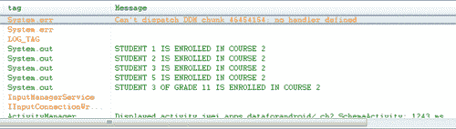
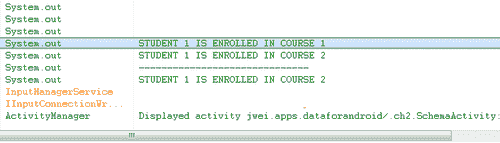
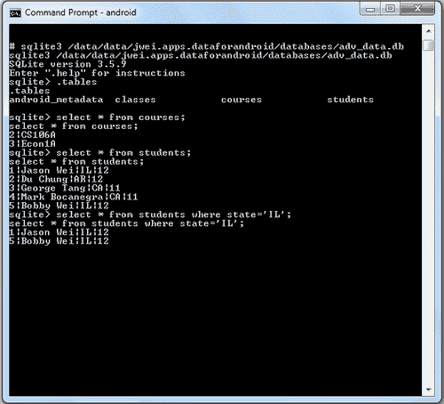

# 第二章：使用 SQLite 数据库

之前我们介绍了在 Android 上存储数据的各种方法，从小型简单的原始值到大型的复杂文件类型。在本章中，我们将深入探讨一种极其强大且高效的方式来保存和检索结构化数据：即使用 SQLite 数据库。目前，我们将关注 SQLite 数据库的灵活性和健壮性，将其作为应用程序的本地后端，在后续章节中，我们再关注如何将这个 SQLite 后端与用户界面前端绑定。

# 创建高级 SQLite 模式

在上一章中，我们通过一个简单的例子了解了如何创建和使用包含两个字段的表：一个整数 ID 字段和一个字符串名称字段。然而，你的应用程序所需的数据库模式通常会比一个表复杂得多。因此，当你突然需要多个表，有些可能还相互依赖时，如何有效地利用`SQLiteOpenHelper`类来使应用程序的开发保持清晰和直接，同时又不损害模式的健壮性呢？让我们通过一个例子一起来解决这个问题！

考虑一个包含三个表的简单模式：第一个是`Students`表，包含字段 ID、姓名、状态和年级；第二个是`Courses`表，包含字段 ID 和名称；第三个是`Classes`表，包含字段 ID、学生 ID 和课程 ID。我们将尝试创建一个模式，在这个模式中，我们可以添加/移除学生，添加/移除课程，以及注册/退选不同课程的学生。我们可以立即想到的一些挑战如下：

+   我们如何获得简单的分析，比如每个课程的学生人数？

+   当我们删除一个还有学生的课程时会发生什么？

+   当我们移除一个已选课的学生时会发生什么？

话不多说，让我们直接进入代码。我们从定义几个类的模式开始：

```kt
public class StudentTable {
// EACH STUDENT HAS UNIQUE ID
public static final String ID = "_id";
// NAME OF THE STUDENT
public static final String NAME = "student_name";
// STATE OF STUDENT'S RESIDENCE
public static final String STATE = "state";
// GRADE IN SCHOOL OF STUDENT
public static final String GRADE = "grade";
// NAME OF THE TABLE
public static final String TABLE_NAME = "students";
}
public class CourseTable {
// UNIQUE ID OF THE COURSE
public static final String ID = "_id";
// NAME OF THE COURSE
public static final String NAME = "course_name";
// NAME OF THE TABLE
public static final String TABLE_NAME = "courses";
}
// THIS ESSENTIALLY REPRESENTS A MAPPING FROM STUDENTS TO COURSES
public class ClassTable {
// UNIQUE ID OF EACH ROW - NO REAL MEANING HERE
public static final String ID = "_id";
// THE ID OF THE STUDENT
public static final String STUDENT_ID = "student_id";
// THE ID OF ASSOCIATED COURSE
public static final String COURSE_ID = "course_id";
// THE NAME OF THE TABLE
public static final String TABLE_NAME = "classes";
}

```

下面是创建数据库模式的代码（这应该和我们之前看到的非常相似）：

```kt
public class SchemaHelper extends SQLiteOpenHelper {
private static final String DATABASE_NAME = "adv_data.db";
// TOGGLE THIS NUMBER FOR UPDATING TABLES AND DATABASE
private static final int DATABASE_VERSION = 1;
SchemaHelper(Context context) {
super(context, DATABASE_NAME, null, DATABASE_VERSION);
}
@Override
public void onCreate(SQLiteDatabase db) {
// CREATE STUDENTS TABLE
db.execSQL("CREATE TABLE " + StudentTable.TABLE_NAME
+ " (" + StudentTable.ID + " INTEGER PRIMARY KEY AUTOINCREMENT,"
+ StudentTable.NAME + " TEXT,"
+ StudentTable.STATE + " TEXT,"
+ StudentTable.GRADE + " INTEGER);");
// CREATE COURSES TABLE
db.execSQL("CREATE TABLE " + CourseTable.TABLE_NAME + " (" + CourseTable.ID + " INTEGER PRIMARY KEY AUTOINCREMENT,"
+ CourseTable.NAME + " TEXT);");
// CREATE CLASSES MAPPING TABLE
db.execSQL("CREATE TABLE " + ClassTable.TABLE_NAME + " (" + ClassTable.ID + " INTEGER PRIMARY KEY AUTOINCREMENT,"
+ ClassTable.STUDENT_ID + " INTEGER,"
+ ClassTable.COURSE_ID + " INTEGER);");
}
@Override
public void onUpgrade(SQLiteDatabase db, int oldVersion, int newVersion) {
Log.w("LOG_TAG", "Upgrading database from version " + oldVersion + " to " + newVersion + ", which will destroy all old data");
// KILL PREVIOUS TABLES IF UPGRADED
db.execSQL("DROP TABLE IF EXISTS " + StudentTable.TABLE_NAME);
db.execSQL("DROP TABLE IF EXISTS " + CourseTable.TABLE_NAME);
db.execSQL("DROP TABLE IF EXISTS " + ClassTable.TABLE_NAME);
// CREATE NEW INSTANCE OF SCHEMA
onCreate(db);
}
}

```

所以在这里我们看到，在我们的`onCreate()`方法中，我们执行 SQL 命令来创建所有三个表，而且，在`onUpgrade()`方法中，我们执行 SQL 命令来删除所有三个表，随后重新创建所有三个表。当然，由于我们重写了`SQLiteOpenHelper`类，理论上我们可以按照自己的方式定制这些方法的行为（例如，一些开发者可能不希望在`onUpgrade()`方法中删除整个模式），但现在让我们保持功能简单。

在这一点上，对于那些精通 SQL 编程和数据库模式的读者，您可能想知道是否可以向 SQLite 数据库模式中添加触发器和键约束。答案是：“是的，您可以使用触发器，但不行，您不能使用外键约束。”无论如何，花时间编写和实施触发器将偏离本书的核心内容，因此我选择省略这一讨论（尽管这些在我们的简单示例中也可能非常有帮助）。

现在我们已经创建好了模式，在开始设计各种复杂查询以提取不同的数据组之前（我们将在下一章看到这些内容），是时候编写一些包装方法了。这将帮助我们解决之前提到的一些问题，最终帮助我们创建一个健壮的数据库。

# 为您的 SQLite 数据库提供包装方法

所以现在我们面前有一个相当复杂的模式，之前我们提到过，如果我们移除一个已选课的学生会发生什么，反之，如果我们删除一个有多个学生选课的课程会发生什么？显然，我们不想出现任何一种情况——在第一种情况下，我们会有充满已不再就读于大学的学生课程，而在第二种情况下，我们会遇到学生参加已经不再提供的课程！

因此，是时候实施一些这些规则了，我们将通过向我们的`SchemaHelper`类添加一些方便的方法来实现这一点。同样，这些规则可以通过使用触发语句来实施（记住，Android 的 SQLite 数据库不支持键约束），但使用包装方法的好处在于，它们对于可能刚接触应用程序代码库的开发人员来说更加直观。通过使用包装类，开发人员可以安全地与可能对其模式知之甚少的数据库进行交互。现在，让我们从简单的包装方法开始：

```kt
public class SchemaHelper extends SQLiteOpenHelper {
private static final String DATABASE_NAME = "adv_data.db";
// TOGGLE THIS NUMBER FOR UPDATING TABLES AND DATABASE
private static final int DATABASE_VERSION = 1;
SchemaHelper(Context context) {
super(context, DATABASE_NAME, null, DATABASE_VERSION);
}
@Override
public void onCreate(SQLiteDatabase db) {
...
}
@Override
public void onUpgrade(SQLiteDatabase db, int oldVersion, int newVersion) {
...
}
// WRAPPER METHOD FOR ADDING A STUDENT
public long addStudent(String name, String state, int grade) {
// CREATE A CONTENTVALUE OBJECT
ContentValues cv = new ContentValues();
cv.put(StudentTable.NAME, name);
cv.put(StudentTable.STATE, state);
cv.put(StudentTable.GRADE, grade);
// RETRIEVE WRITEABLE DATABASE AND INSERT
SQLiteDatabase sd = getWritableDatabase();
long result = sd.insert(StudentTable.TABLE_NAME, StudentTable.NAME, cv);
return result;
}
// WRAPPER METHOD FOR ADDING A COURSE
public long addCourse(String name) {
ContentValues cv = new ContentValues();
cv.put(CourseTable.NAME, name);
SQLiteDatabase sd = getWritableDatabase();
long result = sd.insert(CourseTable.TABLE_NAME, CourseTable.NAME, cv);
return result;
}
// WRAPPER METHOD FOR ENROLLING A STUDENT INTO A COURSE
public boolean enrollStudentClass(int studentId, int courseId) {
ContentValues cv = new ContentValues();
cv.put(ClassTable.STUDENT_ID, studentId);
cv.put(ClassTable.COURSE_ID, courseId);
SQLiteDatabase sd = getWritableDatabase();
long result = sd.insert(ClassTable.TABLE_NAME, ClassTable.STUDENT_ID, cv);
return (result >= 0);
}
}

```

现在我们有了三个向模式中添加数据的简单包装方法。前两个涉及向数据库中添加新学生和新课程，最后一个涉及在学生（由他的/她的 ID 表示）和课程之间添加新的映射（本质上，我们是通过这个映射将学生注册到课程中）。注意，在每个包装方法中，我们只是将值添加到`ContentValue`对象中，获取可写的 SQLite 数据库，然后将这个`ContentValue`作为新行插入到指定的表中。接下来，让我们编写一些用于检索数据的包装方法：

```kt
public class SchemaHelper extends SQLiteOpenHelper {
public long addStudent(String name, String state, int grade) {
}
public long addCourse(String name) {
}
public boolean enrollStudentClass(int studentId, int courseId) {
}
// GET ALL STUDENTS IN A COURSE
public Cursor getStudentsForCourse(int courseId) {
SQLiteDatabase sd = getWritableDatabase();
// WE ONLY NEED TO RETURN STUDENT IDS
String[] cols = new String[] { ClassTable.STUDENT_ID };
String[] selectionArgs = new String[] { String.valueOf(courseId) };
// QUERY CLASS MAP FOR STUDENTS IN COURSE
Cursor c = sd.query(ClassTable.TABLE_NAME, cols, ClassTable.COURSE_ID + "= ?", selectionArgs, null, null, null);
return c;
}
// GET ALL COURSES FOR A GIVEN STUDENT
public Cursor getCoursesForStudent(int studentId) {
SQLiteDatabase sd = getWritableDatabase();
// WE ONLY NEED TO RETURN COURSE IDS
String[] cols = new String[] { ClassTable.COURSE_ID };
String[] selectionArgs = new String[] { String.valueOf(studentId) };
Cursor c = sd.query(ClassTable.TABLE_NAME, cols, ClassTable.STUDENT_ID + "= ?", selectionArgs, null, null, null);
return c;
}
public Set<Integer> getStudentsByGradeForCourse(int courseId, int grade) {
SQLiteDatabase sd = getWritableDatabase();
// WE ONLY NEED TO RETURN COURSE IDS
String[] cols = new String[] { ClassTable.STUDENT_ID };
String[] selectionArgs = new String[] { String.valueOf(courseId) };
// QUERY CLASS MAP FOR STUDENTS IN COURSE
Cursor c = sd.query(ClassTable.TABLE_NAME, cols, ClassTable.COURSE_ID + "= ?", selectionArgs, null, null, null);
Set<Integer> returnIds = new HashSet<Integer>();
while (c.moveToNext()) {
int id = c.getInt(c.getColumnIndex
(ClassTable.STUDENT_ID));
returnIds.add(id);
}
// MAKE SECOND QUERY
cols = new String[] { StudentTable.ID };
selectionArgs = new String[] { String.valueOf(grade) };
c = sd.query(StudentTable.TABLE_NAME, columns, StudentTable.GRADE + "= ?", selectionArgs, null, null, null);
Set<Integer> gradeIds = new HashSet<Integer>();
while (c.moveToNext()) {
int id = c.getInt(c.getColumnIndex(StudentTable.ID));
gradeIds.add(id);
}
// RETURN INTERSECTION OF ID SETS
returnIds.retainAll(gradeIds);
return returnIds;
}
}

```

在这里，我们有三个相当类似的方法，它们允许我们从模式中获得非常实用的数据集：

+   能够获取给定课程的学生列表

+   能够获取给定学生的课程列表

+   最后（为了增加一些复杂性），能够获取给定课程特定年级的学生列表

请注意，在所有三种方法中，我们开始尝试`SQLiteDatabase`对象的`query()`方法中的一些参数，所以现在似乎是仔细看看这些参数是什么以及我们之前到底做了什么的好时机：

```kt
public Cursor query(String table, String[] columns, String selection, String[] selectionArgs, String groupBy, String having, String orderBy)

```

另一种方式：

```kt
public Cursor query(String table, String[] columns, String selection, String[] selectionArgs, String groupBy, String having, String orderBy, String limit)
public Cursor query(boolean distinct, String table, String[] columns, String selection, String[] selectionArgs, String groupBy, String having, String orderBy, String limit)

```

为了简单起见，以下是调用上一个方法的方式： 

```kt
Cursor c = sd.query(ClassTable.TABLE_NAME, cols, ClassTable.COURSE_ID + "= ?", selectionArgs, null, null, null);

```

所以这里快速解释一下这三种方法。第一个`query()`方法是标准方法，你首先在第一个参数中指定表，然后在第二个参数中指定要返回的列。这相当于在标准 SQL 中执行一个`SELECT`语句。然后，在第三个参数中我们开始过滤我们的查询，这些过滤器的语法等同于在`SELECT`查询的末尾包含一个`WHERE`子句。在我们的示例中，我们只要求返回包含学生 ID 的列，因为这是我们唯一关心的列（由于我们按课程 ID 列进行过滤，因此返回此列将是不必要的重复）。然后，在过滤参数中，我们要求按课程 ID 进行过滤，其语法等同于传入以下字符串：

```kt
WHERE course_id = ?

```

在这里，问号充当占位符，代表我们将要传递到过滤器的任何值。换句话说，`WHERE`语句的格式已经存在，但我们只需要将实际的过滤值替换到问号中。在这种情况下，我们将给定的课程 ID 传递到第四个参数中。

最后三个参数（`groupBy`、`having`和`orderBy`）对于熟悉 SQL 的人来说应该很有意义，但对于那些不熟悉的人，以下是每个参数的快速解释：

+   `groupBy` - 添加这个功能可以让你按照指定的列对结果进行分组。如果你需要获取例如课程 ID 和该课程学生数量的表格，这个功能将非常有用：只需在`Class`表中按课程 ID 分组即可实现这一点。

+   `having` - 与`groupBy`子句结合使用，这个子句允许你过滤聚合后的结果。假设你在`Class`表中按课程 ID 分组，并希望过滤掉所有注册学生少于 10 人的班级，你可以使用`having`子句来实现这一点。

+   `orderBy` - 这是一个相当直观的子句，`orderBy`子句允许我们按指定列（们）以及升序或降序对查询结果子表进行排序。例如，假设你想按成绩和姓名对`Students`表进行排序——指定一个`orderBy`子句将允许你这样做。

最后，在两个`query()`变体中，你会看到增加了`limit`和`distinct`参数：`limit`参数允许你限制返回的行数，而`distinct`布尔值允许你指定是否只返回唯一的行。如果这些对你来说还是不太明白，不用害怕——我们将在下一章重点介绍构建复杂查询。

既然我们已经理解了`query()`方法的工作原理，让我们回顾一下之前的例子，并详细阐述`getStudentsByGradeForCourse()`方法。尽管执行这个方法有很多种方式，但从概念上讲它们都非常相似：首先，我们查询给定课程的所有学生，然后在这些学生中筛选并只保留指定年级的学生。我的实现方式是首先从给定课程获取所有学生 ID 的集合，然后获取给定年级的所有学生的集合，并简单地返回这两个集合的交集。至于这是否是最优实现，完全取决于你的数据库大小。

现在，最后但同样重要的是，让我们通过一些特殊的移除包装方法来加强之前提到的移除规则：

```kt
public class SchemaHelper extends SQLiteOpenHelper {
public Cursor getStudentsForCourse(int courseId) {
...
}
public Cursor getCoursesForStudent(int studentId) {
...
}
public Set<Integer> getStudentsAndGradeForCourse(int courseId, int grade) {
...
}
// METHOD FOR SAFELY REMOVING A STUDENT
public boolean removeStudent(int studentId) {
SQLiteDatabase sd = getWritableDatabase();
String[] whereArgs = new String[] { String.valueOf(studentId) };
// DELETE ALL CLASS MAPPINGS STUDENT IS SIGNED UP FOR
sd.delete(ClassTable.TABLE_NAME, ClassTable.STUDENT_ID + "= ? ", whereArgs);
// THEN DELETE STUDENT
int result = sd.delete(StudentTable.TABLE_NAME, StudentTable.ID + "= ? ", whereArgs);
return (result > 0);
}
// METHOD FOR SAFELY REMOVING A STUDENT
public boolean removeCourse(int courseId) {
SQLiteDatabase sd = getWritableDatabase();
String[] whereArgs = new String[] { String.valueOf(courseId) };
// MAKE SURE YOU REMOVE COURSE FROM ALL STUDENTS ENROLLED
sd.delete(ClassTable.TABLE_NAME, ClassTable.COURSE_ID + "= ? ", whereArgs);
// THEN DELETE COURSE
int result = sd.delete(CourseTable.TABLE_NAME, CourseTable.ID + "= ? ", whereArgs);
return (result > 0);
}
}

```

在这里，我们有两个移除方法，在每一个方法中，我们通过阻止有人在从`Class`映射表中先移除这些课程之前取消课程，以及反之亦然，手动实施一些模式规则。我们调用`SQLiteDatabase`类的`delete()`方法，这个方法与`query()`方法类似，允许你传入表名，指定一个过滤参数（即一个`WHERE`子句），然后允许你传入这些过滤器的值（注意，在`delete()`和`query()`方法中，你可以指定多个过滤器，但关于这一点稍后会详细介绍）。

最后，让我们将这些方法付诸实践，并实现一个`Activity`类：

```kt
public class SchemaActivity extends Activity {
@Override
protected void onCreate(Bundle savedInstanceState) {
super.onCreate(savedInstanceState);
setContentView(R.layout.main);
SchemaHelper sh = new SchemaHelper(this);
// ADD STUDENTS AND RETURN THEIR IDS
long sid1 = sh.addStudent("Jason Wei", "IL", 12);
long sid2 = sh.addStudent("Du Chung", "AR", 12);
long sid3 = sh.addStudent("George Tang", "CA", 11);
long sid4 = sh.addStudent("Mark Bocanegra", "CA", 11);
long sid5 = sh.addStudent("Bobby Wei", "IL", 12);
// ADD COURSES AND RETURN THEIR IDS
long cid1 = sh.addCourse("Math51");
long cid2 = sh.addCourse("CS106A");
long cid3 = sh.addCourse("Econ1A");
// ENROLL STUDENTS IN CLASSES
sh.enrollStudentClass((int) sid1, (int) cid1);
sh.enrollStudentClass((int) sid1, (int) cid2);
sh.enrollStudentClass((int) sid2, (int) cid2);
sh.enrollStudentClass((int) sid3, (int) cid1);
sh.enrollStudentClass((int) sid3, (int) cid2);
sh.enrollStudentClass((int) sid4, (int) cid3);
sh.enrollStudentClass((int) sid5, (int) cid2);
// GET STUDENTS FOR COURSE
Cursor c = sh.getStudentsForCourse((int) cid2);
while (c.moveToNext()) {
int colid = c.getColumnIndex(ClassTable.STUDENT_ID);
int sid = c.getInt(colid);
System.out.println("STUDENT " + sid + " IS ENROLLED IN COURSE " + cid2);
}
// GET STUDENTS FOR COURSE AND FILTER BY GRADE
Set<Integer> sids = sh.getStudentsByGradeForCourse ((int) cid2, 11);
for (Integer sid : sids) {
System.out.println("STUDENT " + sid + " OF GRADE 11 IS ENROLLED IN COURSE " + cid2);
}
}
}

```

首先，我们在模式中添加一些虚拟数据；在我这个案例中，我会添加五个学生和三门课程，然后将这些学生报名到一些课程中。当模式中有了数据后，我会尝试一些方法，并首先请求所有报名 CS106A 的学生。之后，我会测试我们编写的另一个包装方法，并请求所有 11 年级报名 CS106A 的学生。以下是运行这个`Activity`的输出结果：



看吧！我们很快发现学生 1、2、3 和 5 都报名了 CS106A。然而，在按 11 年级筛选后，我们发现只有学生 3 在 11 年级报名了 CS106A —— 可怜的乔治。现在让我们测试一下移除方法：

```kt
public class SchemaActivity extends Activity {
@Override
protected void onCreate(Bundle savedInstanceState) {
super.onCreate(savedInstanceState);
setContentView(R.layout.main);
SchemaHelper sh = new SchemaHelper(this);
long sid1 = sh.addStudent("Jason Wei", "IL", 12);
// GET CLASSES I'M TAKING
c = sh.getCoursesForStudent((int) sid1);
while (c.moveToNext()) {
int colid = c.getColumnIndex(ClassTable.COURSE_ID);
int cid = c.getInt(colid);
System.out.println("STUDENT " + sid1 + " IS ENROLLED IN COURSE " + cid);
}
// TRY REMOVING A COURSE
sh.removeCourse((int) cid1);
System.out.println("------------------------------");
// SEE IF REMOVAL KEPT SCHEMA CONSISTENT
c = sh.getCoursesForStudent((int) sid1);
while (c.moveToNext()) {
int colid = c.getColumnIndex(ClassTable.COURSE_ID);
int cid = c.getInt(colid);
System.out.println("STUDENT " + sid1 + " IS ENROLLED IN COURSE " + cid);
}
}
}

```

这一次，我们首先查询学生 1（我自己）所报名的所有课程。但是哎呀！这个季度数学 51 出了点问题，所以被取消了！我们删除这门课程，并再次请求查看学生 1 所——报名的所有课程，期待看到数学 51 已经从列表中移除。输出结果如下：



事实上，我们可以看到一开始我同时选了 Math51 和 CS106A，但课程移除后，我不仅仅只选了 CS106A！通过对这些常见的插入、获取和删除函数进行封装，我们既可以简化未来的开发工作，同时也可以强制实施某些架构规则。

最后，让我们通过介绍如何连接到 SQLite 终端以表格形式查看你的数据以及发送 SQLite 查询来结束本章内容——这在调试你的应用程序并确保你的数据被正确添加/更新/删除时非常有用。

# 调试你的 SQLite 数据库

Android 平台为你提供了一个非常强大的调试工具，名为**Android Debug Bridge (adb)**。adb shell 是一个多功能的命令行接口，可以让你与正在运行的模拟器或连接的 Android 设备进行通信。adb 工具可以在你的 SDK 的/platform-tools 目录中找到，一旦启动，它就能做到从安装应用程序，到从模拟器推送和拉取数据，再到连接到 sqlite3 数据库并发送查询（更多详情请见开发者文档[`developer.android.com/guide/developing/tools/adb.html`](http://developer.android.com/guide/developing/tools/adb.html)）。

要使用 adb，只需打开你的终端，导航到 `/<你的-sdk-目录>/platform-tools/` 并输入以下命令：

```kt
adb shell

```

如果你想要连接到特定的模拟器，可以输入以下命令：

```kt
adb –s emulator-xxxx shell

```

在此阶段，你应该已经启动了 adb 工具，这时你需要告诉它连接到模拟器的 sqlite3 数据库。可以通过发出 sqlite3 命令，然后传递到你的应用程序的数据库文件路径，如下所示：

```kt
# sqlite3 /data/data/<your-package-path>/databases/<your-database>.db

```

在我们的例子中，命令如下所示：

```kt
# sqlite3 /data/data/jwei.apps.dataforandroid/databases/adv_data.db

```

在这个阶段，我们应该能够发出各种 SQL 查询，从查看数据库架构到更新和删除我们任何表中的单个数据行。以下是一些你可能觉得最有用的示例命令：

+   `.tables` 显示你数据库中的所有表

+   `.output FILENAME` 允许你将查询结果输出到文件中（例如，用于进一步分析）

+   `.mode MODE` 允许你指定输出文件格式（即 CSV、HTML 等，对于电子表格类型的分析可能很有用）

+   `SELECT * FROM table_name` 是选择给定表所有列的标准查询（这相当于表的行执行 `get()` 命令）

+   `SELECT * FROM table_name WHERE col = 'value'` 是选择给定表的所有列但带有列筛选的标准查询

+   `SELECT col1, col2 FROM table_name` 是选择给定表特定列的标准查询

下面是我们使用之前架构中的一些命令的例子：



希望这能帮助您开始，但若要获取 sqlite3 命令的完整列表，请查看[`www.sqlite.org/sqlite.html`](http://www.sqlite.org/sqlite.html)，若要获取更详尽的复杂查询列表，请稍等片刻——接下来将会介绍。

# 本章概要

在本章中，我们从仅包含一个表的超级基础数据库架构，发展到了包含多个相互依赖的表的完整架构。我们首先了解了如何通过重写`SQLiteOpenHelper`类来创建和升级多个表，然后考虑了围绕具有相互依赖关系的数据库架构的一些挑战。我们决定通过围绕我们的数据库架构及其表创建一系列包装方法来应对这些挑战，这些方法旨在便于未来的开发，同时也确保未来数据的健壮性。这些包装方法包括从简单的添加方法（因为我们能够隐藏不断请求可写`SQLiteDatabase`的需求），到更复杂的删除方法，隐藏了实施各种架构规则所需的所有功能。

然后，我们实际实现了一个`Activity`类来展示我们的新数据库架构，并运行了一些示例数据库命令以测试其功能。尽管我们能够验证和输出所有命令的结果，但我们意识到这对于调试我们的 sqlite3 数据库来说相当冗长且不是最佳方式，因此我们研究了 Android 调试桥（adb）工具。通过 adb 工具，我们能够打开一个命令行终端，进而连接到正在运行的模拟器或 Android 设备实例，随后连接到该模拟器/设备的 sqlite3 数据库。在这里，我们可以通过发出各种 SQL 命令和查询，以非常自然的方式与 sqlite3 数据库进行交互。

现在，我们迄今为止所见到的查询相当基础，但在必要时，它们将满足大多数应用程序开发的需求。然而，我们将在下一章看到，通过掌握更高级的 SQL 查询概念，我们可以在应用程序中获得显著的性能提升和内存提升！
