# 第三章：SQLite 查询

在上一章中，我们将数据库构建提升了一个层次——将仅涉及一个孤表的简单模式转变为涉及三个相互依赖的复杂模式。现在我们已经为在 Android 上开发自定义 SQLite 数据库打下了坚实的基础，是时候锦上添花了。

理论上，我们可以有一个通用的`get()`查询，它将数据库中的所有列的每一行作为`Cursor`对象返回给我们，然后过滤和处理每一行以获取我们想要的数据——我们可以做得更好。不要误会我的意思——Java 很快——但是当涉及到在相对有限的内存中处理可能成千上万行数据时，为什么不优化事物并让 SQL 发挥其最大的作用——那就是查询事物！

在下一章中，我们将重点介绍在 Android 客户端端（即使用 Java 接口）解析和过滤数据与在 SQLite 数据库本身构建更高级的 SQL 查询和解析/过滤数据之间找到正确的平衡。

# 构建 SQLite 查询的方法

首先，让我们确定构建查询的不同方式。正如我们之前看到的，查询 SQLite 数据库最低级的方法是通过`SQLiteDatabase`类的`rawQuery()`方法，定义如下：

```kt
Cursor rawQuery(String sql, String[] selectionArgs)

```

这个方法主要是为那些在 SQL 方面有扎实背景的人准备的，因为您可以直接将 SQL 查询作为第一个参数传递给方法。如果您的 SQL 查询涉及到任何`WHERE`过滤，那么第二个参数允许您传入这些过滤值（我们很快将看到几个使用这个的例子）。

`SQLiteDatabase`类提供的第二种查询方法是提交查询的便捷包装——使用`query()`方法（我们之前也见过），任何实际的 SQL 编程都被隐藏起来，取而代之的是将查询的所有部分作为参数传递：

```kt
Cursor query(String table, String[] columns, String selection, String[] selectionArgs, String groupBy, String having, String orderBy)

```

使用包含`distinct`和`limit`约束参数的替代`query()`方法。同样，前面的参数应该相对容易理解，但所有这些方法在看到一个给定查询时一起看会更有意义。但是，在继续这些示例之前，让我们先看看构建 SQL 查询的第三种方法。

这第三种方法是我们尚未见过，它来自`SQLiteQueryBuilder`类。由于不需要提交原始 SQL 查询，或者处理便捷方法，这对于那些完全不了解 SQL 的新手来说可能仍然显得有些吓人，因此 Android 平台决定提供一个完整的便捷类，以帮助开发者尽可能无缝地与 SQLite 数据库交互。尽管这个类有许多与之相关的方法（我邀请您在线浏览开发者文档以获取更多详细信息），以下是我们将在本章中重点介绍的一些更重要方法：

```kt
String buildQuery(String[] projectionIn, String selection, String groupBy, String having, String sortOrder, String limit)

```

前面的方法是为了构建`SELECT`语句提供方便，可以用于一组通过`UNION`操作在`buildUnionQuery()`方法中连接的`SELECT`语句：

```kt
String buildUnionQuery(String[] subQueries, String sortOrder, String limit)

```

以下是一种允许你传递一组`SELECT`语句（可能使用`buildQuery()`便利方法构建）的方法，并构建一个将返回这些子查询的`UNION`的查询：

```kt
String buildQueryString(boolean distinct, String tables, String[] columns, String where, String groupBy, String having, String orderBy, String limit)

```

使用给定参数构建 SQL 查询，类似于`SQLiteDatabase`类的`query()`方法，但只是将查询作为字符串返回：

```kt
Void setDistinct(boolean distinct)

```

上面的操作允许你将当前查询设置为仅`DISTINCT`行。

```kt
Void setTables(String inTables)

```

允许你设置要查询的表格列表，如果传递了多个表格，则可以对这些表格执行`JOIN`操作。

既然我们已经了解了所有可用的不同方法，让我们探索一些基本的 SQLite 查询，看看如何使用前面描述的每种方法来执行相对简单的查询！

# `SELECT`语句

使用我们来自第二章，*使用 SQLite 数据库*的`Students`架构，让我们先看看此时我们的`Students`表的样子：

| Id | 姓名 | 州 | 年级 |
| --- | --- | --- | --- |
| 1 | 魏杰森 | 伊利诺伊州 | 12 |
| 2 | 杜钟 | 阿肯色州 | 12 |
| 3 | 乔治·唐 | 加利福尼亚州 | 11 |
| 4 | 马克·博卡内格拉 | 加利福尼亚州 | 11 |
| 5 | 魏波比 | 伊利诺伊州 | 12 |

这样，对于我们要进行的每个查询，我们都会确切地知道应该期望什么结果，因此我们可以验证我们的查询。在我们深入探讨之前，以下是本节将涵盖的内容列表：

+   `SELECT`语句

+   带有列规范的`SELECT`语句

+   `WHERE`筛选条件

+   `AND/OR`操作符

+   `DISTINCT`子句

+   `LIMIT`子句

一次要掌握的内容很多，尤其是对于那些没有 SQL 经验的人来说，但一旦你学会了这些基本构建块，你将能够构建更长、更复杂的查询。那么，让我们从最基本的`SELECT`查询开始：

```kt
public class BasicQueryActivity extends Activity {
@Override
protected void onCreate(Bundle savedInstanceState) {
super.onCreate(savedInstanceState);
setContentView(R.layout.main);
/*
* SELECT Query
*/
System.out.println("METHOD 1");
// METHOD #1 - SQLITEDATABASE RAWQUERY()
Cursor c = sqdb.rawQuery("SELECT * from " + StudentTable.TABLE_NAME, null);
while (c.moveToNext()) {
int colid = c.getColumnIndex(StudentTable.NAME);
String name = c.getString(colid);
System.out.println("GOT STUDENT " + name);
}
SELECT statementsaboutSystem.out.println("METHOD 2");
// METHOD #2 - SQLITEDATABASE QUERY()
c = sqdb.query(StudentTable.TABLE_NAME, null, null, null, null, null, null);
while (c.moveToNext()) {
int colid = c.getColumnIndex(StudentTable.NAME);
String name = c.getString(colid);
System.out.println("GOT STUDENT " + name);
}
System.out.println("METHOD 3");
// METHOD #3 - SQLITEQUERYBUILDER
String query = SQLiteQueryBuilder.buildQueryString (false, StudentTable.TABLE_NAME, null, null, null, null, null, null);
System.out.println(query);
c = sqdb.rawQuery(query, null);
while (c.moveToNext()) {
int colid = c.getColumnIndex(StudentTable.NAME);
String name = c.getString(colid);
System.out.println("GOT STUDENT " + name);
}
}
}

```

在这里，我们看到在第一个方法中，我们只是传递标准的 SQL 查询，而在第二个方法中我们将查询分解为其不同的参数（即表名、选择筛选器等）。最后，在最后一个方法中，我们注意到它看起来与第二个方法非常相似（目前是这样），我们再次将查询分解为其不同的参数，但不是返回`Cursor`，我们的方法将查询作为字符串返回，然后我们可以将其作为原始查询执行。这样做的原因是 SQLiteQueryBuilder 的一个优点是你可以指定多个查询并一次性提交它们，有效地执行`UNION` SQL 查询 - 但我们稍后会玩转这个功能。

现在，让我们看看这些查询的结果，并验证这些结果是否正确：

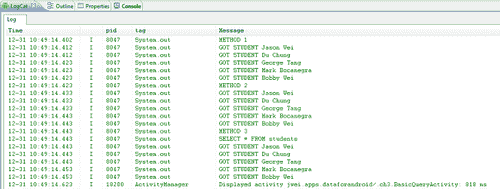

在我看来效果很不错！我们可以看到，每种方法都能如预期那样返回我们表格的所有行。在第三种方法下，我们还可以看到使用我们的`SQLiteQueryBuilder`类构建的查询，并且可以确认，在第一种方法中提交的 SQL 查询与第三种方法中构建的查询完全匹配。

现在，假设你有一个包含成千上万行数据、几十列的大型表格——为了效率和内存考虑，实践中通常建议不要用查询返回整个表格，而是应该细化查询，只返回那些感兴趣的数据列！那么，让我们看看如何在`SELECT`查询中指定要返回哪些列：

```kt
/*
* SELECT COLUMNS Query
*/
System.out.println("METHOD 1");
// METHOD #1 - SQLITEDATABASE RAWQUERY()
c = sqdb.rawQuery(
"SELECT " + StudentTable.NAME + "," + StudentTable.STATE + " from " + StudentTable.TABLE_NAME, null);
while (c.moveToNext()) {
int colid = c.getColumnIndex(StudentTable.NAME);
int colid2 = c.getColumnIndex(StudentTable.STATE);
}
System.out.println("METHOD 2");
// METHOD #2 - SQLITEDATABASE QUERY()
String[] cols = new String[] { StudentTable.NAME, StudentTable.STATE };
c = sqdb.query(StudentTable.TABLE_NAME, cols, null, null, null, null, null);
SELECT statementsresults, validatingwhile (c.moveToNext()) {
SELECT statementsaboutint colid = c.getColumnIndex(StudentTable.NAME);
int colid2 = c.getColumnIndex(StudentTable.STATE);
}
System.out.println("METHOD 3");
// METHOD #3 - SQLITEQUERYBUILDER
query = SQLiteQueryBuilder.buildQueryString(false, StudentTable.TABLE_NAME, cols, null, null, null, null, null);
System.out.println(query);
c = sqdb.rawQuery(query, null);
while (c.moveToNext()) {
int colid = c.getColumnIndex(StudentTable.NAME);
int colid2 = c.getColumnIndex(StudentTable.STATE);
}

```

我们可以看到，所有三种方法的查询整体结构是相同的，但在第二种和第三种方法中，我们传递一个包含我们想要的数据列的`String[]`。再次，为了验证我们的查询是否按预期工作，以下是这些查询的输出：


我们可以看到，确实能够返回每个学生及其各自的状态。最后再次注意，第三种方法中构建的查询与传递给第一种方法的原始 SQL 查询是相同的——它们应该完全匹配，实际上也确实如此。

# `WHERE`筛选器和 SQL 运算符

通常，能够根据列的值来过滤数据是非常重要的！这正是`WHERE`筛选器派上用场的地方，作为数据库开发者，你将经常使用这些`WHERE`筛选器。就此而言，让我们看看这些`WHERE`筛选器（在 Android 中也被称为选择参数）是如何通过我们的三种查询构建方法实现的：

```kt
/*
* WHERE Filter - Filter by State
*/
System.out.println("METHOD 1");
// METHOD #1 - SQLITEDATABASE RAWQUERY()
c = sqdb.rawQuery("SELECT * from " + StudentTable.TABLE_NAME + " WHERE " + StudentTable.STATE + "= ? ", new String[] { "IL" });
while (c.moveToNext()) {
int colid = c.getColumnIndex(StudentTable.NAME);
int colid2 = c.getColumnIndex(StudentTable.STATE);
}
System.out.println("METHOD 2");
// METHOD #2 - SQLITEDATABASE QUERY()
c = sqdb.query(StudentTable.TABLE_NAME, null, StudentTable.STATE + "= ? ", new String[] { "IL" }, null, null, null);
while (c.moveToNext()) {
int colid = c.getColumnIndex(StudentTable.NAME);
int colid2 = c.getColumnIndex(StudentTable.STATE);
}
System.out.println("METHOD 3");
// METHOD #3 - SQLITEQUERYBUILDER
query = SQLiteQueryBuilder.buildQueryString(false, StudentTable.TABLE_NAME, null, StudentTable.STATE + "='IL'", null, null, null, null);
System.out.println(query);
c = sqdb.rawQuery(query, null);
while (c.moveToNext()) {
int colid = c.getColumnIndex(StudentTable.NAME);
int colid2 = c.getColumnIndex(StudentTable.STATE);
}

```

在第一种方法中，我们可以看到一个标准的 SQL `WHERE`子句是如何格式化的。知道了这一点，通过我们的第二和第三种方法，我们可以看到，只需将一个类似于`WHERE`子句格式的字符串传递给选择参数（`WHERE`本身省略，因为这会自动附加到你的查询中）。这可以在第三种方法中由我们的`SQLiteQueryBuilder`类返回的构建查询中明确看到：


与任何编程语言一样，你可以通过使用`AND/OR`运算符来实现过滤逻辑；这对 SQL 同样适用，特别是对于 SQL `WHERE`筛选器。你可以编写不仅满足一组条件的所有行的查询，也可以编写满足所有给定条件或宽松地说，仅满足多个给定条件之一的行的查询。以下是一个例子，我们不仅返回伊利诺伊州的学生，还利用 SQL `OR`运算符，也查询阿肯色州的学生：

```kt
/*
* AND/OR Clauses
*/
System.out.println("METHOD 1");
// METHOD #1 - SQLITEDATABASE RAWQUERY()
c = sqdb.rawQuery("SELECT * from " + StudentTable.TABLE_NAME + " WHERE " + StudentTable.STATE + "= ? OR " + StudentTable.STATE + "= ?", new String[] { "IL", "AR" });
System.out.println("METHOD 2");
// METHOD #2 - SQLITEDATABASE QUERY()
c = sqdb.query(StudentTable.TABLE_NAME, null, StudentTable.STATE + "= ? OR " + StudentTable.STATE + "= ?", new String[] { "IL", "AR" }, null, null, null);
System.out.println("METHOD 3");
// METHOD #3 - SQLITEQUERYBUILDER
query = SQLiteQueryBuilder.buildQueryString(false, StudentTable.TABLE_NAME, null, StudentTable.STATE + "='IL' OR " + StudentTable.STATE + "='AR'", null, null, null, null);
System.out.println(query);
c = sqdb.rawQuery(query, null);

```

启动电源，让我们来看看 SQL 中的`DISTINCT`子句：

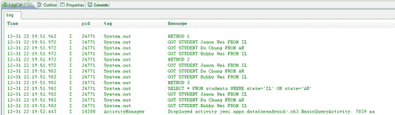

`LIMIT`子句仅仅允许您限制要返回的行数。`LIMIT`有两种格式：

# `DISTINCT`和`LIMIT`子句

因此，我们的朋友 Du 已经出现在结果集中！

```kt
/*
* DISTINCT Clause
*/
System.out.println("METHOD 1");
// METHOD #1 - SQLITEDATABASE RAWQUERY()
c = sqdb.rawQuery("SELECT DISTINCT " + StudentTable.STATE + " from " + StudentTable.TABLE_NAME, null);
System.out.println("METHOD 2");
// METHOD #2 - SQLITEDATABASE QUERY()
// SWITCH TO MORE GENERAL QUERY() METHOD
c = sqdb.query(true, StudentTable.TABLE_NAME, new String[] { StudentTable.STATE }, null, null, null, null, null, null);
...
System.out.println("METHOD 3");
// METHOD #3 - SQLITEQUERYBUILDER
query = SQLiteQueryBuilder.buildQueryString(true, StudentTable.TABLE_NAME, new String[] { StudentTable.STATE },null, null, null, null, null);
System.out.println(query);
c = sqdb.rawQuery(query, null);

```

`DISTINCT`子句也相对简单直接，它允许您在查询中指定，对于给定的列，您只想返回具有该列不同值的行子集。需要注意的是，为了使`DISTINCT`子句有意义，一个列必须在您的查询中被指定。

对于这个查询的结果是：

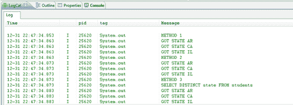

这确实是我们当前表的案例！最后但同样重要的是，让我们来看看`LIMIT`子句：

```kt
/*
* LIMIT Clause
*/
System.out.println("METHOD 1");
// METHOD #1 - SQLITEDATABASE RAWQUERY()
c = sqdb.rawQuery("SELECT * from " + StudentTable.TABLE_NAME + " LIMIT 0,3", null);
...
System.out.println("METHOD 2");
// METHOD #2 - SQLITEDATABASE QUERY()
// SWITCH TO MORE GENERAL QUERY() METHOD
c = sqdb.query(false, StudentTable.TABLE_NAME, null, null, null, null, null, null, "3");
System.out.println("METHOD 3");
// METHOD #3 - SQLITEQUERYBUILDER
query = SQLiteQueryBuilder.buildQueryString(false, StudentTable.TABLE_NAME, null, null, null, null, null, "3");
System.out.println(query);
c = sqdb.rawQuery(query, null);

```

在我之前的示例中，我们会注意到一些事情。首先，在我们的查询中，请注意我们遵循`DISTINCT`子句与想要应用它的列，即`State`列。本质上，我们要求查询只返回数据库中每个州的不同行。换句话说，我们想要知道学生来自哪些州，并且每个州只想要一行数据。另外值得一提的是，我们已经更改了之前使用的`query()`语句——这次改为使用更通用的`query()`方法，该方法具有指定`DISTINCT`子句的参数。

+   `LIMIT n, m`

+   `LIMIT n`

第一种格式告诉查询只返回 m 行（也就是说，限制返回的行数）从第 n 行开始。第二种格式简单告诉查询返回满足给定条件的第一个 n 行。第一种格式确实为我们提供了更大的灵活性，但是不幸的是，第二种和第三种格式都不允许我们利用这种格式（由于它自动为我们构建查询的方式），而原始 SQL 查询（原始 SQL 查询）可以执行任何有效的 SQL 查询。这是一个小示例，展示了执行原始 SQL 查询给我们的多用途性，是交换灵活性和便利性以及抽象性的完美示例。

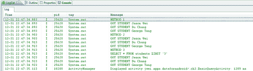

是的，看起来不错！在所有方法中，尽管我们没有指定任何`WHERE`筛选器，但我们仍然只得到了预期的前三个有效结果。

在这一部分，我们查看了一些内置于 SQL 语言中的子句，它们允许我们控制数据。通过逐个引入这些子句，希望你能首先看到所有谜题的碎片。然后，当你需要实现自己的数据库时，你将能够把碎片拼凑起来，执行强大的查询，快速返回有意义的数据。然而，在我们结束本章之前，让我们看看一些高级查询，它们需要更多时间来掌握和理解，但同样会为你增加一个工具。

# ORDER BY 和 GROUP BY 子句

在这一部分，我们将查看 SQL 语言中一些更高级和更细微的功能以及它们在 Android 各种 SQL 便捷类中的实现。同样，在我们深入探讨这些特性之前，以下是我们在下一部分将要涵盖的内容列表：

+   `ORDER BY`子句

+   `GROUP BY`子句

+   `HAVING`筛选器

+   SQL 函数

+   联接（JOINS）

让我们看看 SQL 中的`ORDER BY`子句：

```kt
public class AdvancedQueryActivity extends Activity {
@Override
protected void onCreate(Bundle savedInstanceState) {
super.onCreate(savedInstanceState);
setContentView(R.layout.main);
SchemaHelper sch = new SchemaHelper(this);
SQLiteDatabase sqdb = sch.getWritableDatabase();
/*
* ORDER BY Clause
*/
System.out.println("METHOD 1");
// METHOD #1 - SQLITEDATABASE RAWQUERY()
Cursor c = sqdb.rawQuery("SELECT * from " + StudentTable. TABLE_NAME + " ORDER BY " + StudentTable.STATE + " ASC", null);
while (c.moveToNext()) {
int colid = c.getColumnIndex(StudentTable.NAME);
int colid2 = c.getColumnIndex(StudentTable.STATE);
String name = c.getString(colid);
String state = c.getString(colid2);
System.out.println("GOT STUDENT " + name + " FROM " + state);
}
System.out.println("METHOD 2");
// METHOD #2 - SQLITEDATABASE QUERY()
c = sqdb.query(StudentTable.TABLE_NAME, null, null, null, null, null, StudentTable.STATE + " ASC");
while (c.moveToNext()) {
int colid = c.getColumnIndex(StudentTable.NAME);
int colid2 = c.getColumnIndex(StudentTable.STATE);
...
}
System.out.println("METHOD 3");
// METHOD #3 - SQLITEQUERYBUILDER
String query = SQLiteQueryBuilder.buildQueryString (false, StudentTable.TABLE_NAME, null, null, null, null, StudentTable.STATE + " ASC", null);
System.out.println(query);
c = sqdb.rawQuery(query, null);
while (c.moveToNext()) {
int colid = c.getColumnIndex(StudentTable.NAME);
int colid2 = c.getColumnIndex(StudentTable.STATE);
...
}
}
}

```

这里是`ORDERBY`子句的语法：

```kt
ORDER BY your_column ASC|DESC

```

在第一个方法中，我们看到了这个语法的实际应用，然后在后两个方法中，我们看到只需将列名后跟`ASC`或`DESC`（作为字符串）传递给相应查询方法的`ORDERBY`参数。在后两个方法中，语法本质上相同，因此我在这里不过多赘述，但重要的是要了解 SQL `ORDERBY`子句的组成部分。在展示的所有三种方法中，我们都是通过州（state）列对结果子表进行排序，因此为了验证我们的查询，我们检查输出并看到以下内容：

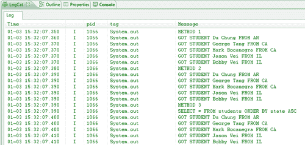

事实上，我们可以看到，结果行是按照州（state）以升序排列的。此外，就像在基本查询中一样，我们可以看到由`SQLiteQueryBuilder`类创建的输出 SQL 查询，并可以验证这是我们第一个方法中执行的相同查询。

现在，我们继续讨论`GROUPBY`子句：

```kt
/*
* GROUP BY Clause
*/
System.out.println("METHOD 1");
// METHOD #1 - SQLITEDATABASE RAWQUERY()
String colName = "COUNT(" + StudentTable.STATE + ")";
c = sqdb.rawQuery("SELECT " + StudentTable.STATE + "," + colName + " from " + StudentTable.TABLE_NAME + " GROUP BY " + StudentTable.STATE, null);
while (c.moveToNext()) {
int colid = c.getColumnIndex(StudentTable.STATE);
int colid2 = c.getColumnIndex(colName);
String state = c.getString(colid);
int count = c.getInt(colid2);
System.out.println("STATE " + state + " HAS COUNT " + count);
}
System.out.println("METHOD 2");
// METHOD #2 - SQLITEDATABASE QUERY()
c = sqdb.query(StudentTable.TABLE_NAME, new String[] { StudentTable.STATE, colName }, null, null, StudentTable.STATE, null, null);
while (c.moveToNext()) {
int colid = c.getColumnIndex(StudentTable.STATE);
int colid2 = c.getColumnIndex(colName);
}
SQLGROUPBY clausesSystem.out.println("METHOD 3");
// METHOD #3 - SQLITEQUERYBUILDER
query = SQLiteQueryBuilder.buildQueryString(false, StudentTable.TABLE_NAME, new String[] { StudentTable.STATE, colName }, null, StudentTable.STATE, null, null, null);
System.out.println(query);
c = sqdb.rawQuery(query, null);
while (c.moveToNext()) {
int colid = c.getColumnIndex(StudentTable.STATE);
int colid2 = c.getColumnIndex(colName);
}

```

现在，理解`GROUPBY`查询的结构再次变得至关重要，因为它与我们之前所见过的任何子句或筛选器都不同。结构如下：

```kt
SELECT your_column, aggregate_function(your_column) FROM your_table GROUP BY your_column

```

查询中最棘手的部分是`aggregate_function(your_column)`部分。在我们的例子中，我们使用 SQL 中所谓的`COUNT()`函数，顾名思义，它只是计算查询（或子查询）返回的行数，并返回计算值。在 SQL 中你可以使用任何数量的`aggregate_functions`，但现在我们先坚持使用`COUNT()`，稍后当我们讨论 SQL 函数时，我会列出其他一些函数。

这里的思路很简单——首先我们选择一列来对数据进行分组（在我们的案例中，是按州），然后我们告诉查询返回两列：第一列是州本身，第二列是那个州在表中出现的次数（即表中状态的聚合数量）。你还会注意到，在第二种和第三种方法中，`GROUPBY`查询的完成方式非常简单，唯一棘手的部分是指定用`COUNT()`函数包裹的列名（看看我们如何声明字符串`colName`）。一旦你这样做了，其余部分就非常直观，表现得就像带有列的标准`SELECT`查询一样！注意`COUNT()`函数也可以接受一个`*`作为参数，它只是返回子表中所有行的计数。

现在，让我们看看我们的输出是什么：

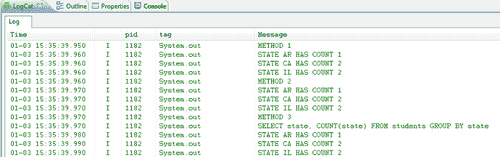

看吧！正如我们所预期的——我们的查询返回了每个状态以及它们各自的出现频率！

# `HAVING`过滤器和聚合函数

现在，随着`GROUPBY`子句的出现，也有了`HAVING`过滤器。`HAVING`过滤器只能与`GROUPBY`子句一起使用，以前面的查询为例，假设我们想要按照表中状态的数量进行分组，但我们只关心出现特定次数的状态。使用`HAVING`过滤器，我们本质上可以构建这样的查询：先按照状态数量分组，然后只返回那些总计数大于或小于某个值的状态。

让我们看看以下代码，并仔细注意我是如何构建查询的（它将与`GROUPBY`查询非常相似，但在最后加上了一个额外的过滤器）：

```kt
/*
* HAVING Filter
*/
System.out.println("METHOD 1");
// METHOD #1 - SQLITEDATABASE RAWQUERY()
String colName = "COUNT(" + StudentTable.STATE + ")";
c = sqdb.rawQuery("SELECT " + StudentTable.STATE + "," + colName + " from " + StudentTable.TABLE_NAME + " GROUP BY " + StudentTable.STATE + " HAVING " + colName + " > 1", null);
while (c.moveToNext()) {
int colid = c.getColumnIndex(StudentTable.STATE);
int colid2 = c.getColumnIndex(colName);
}
System.out.println("METHOD 2");
// METHOD #2 - SQLITEDATABASE QUERY()
c = sqdb.query(StudentTable.TABLE_NAME, new String[] { StudentTable.STATE, colName }, null, null, StudentTable.STATE, colName + " > 1", null);
System.out.println("METHOD 3");
// METHOD #3 - SQLITEQUERYBUILDER
query = SQLiteQueryBuilder.buildQueryString(false, StudentTable.TABLE_NAME, new String[] { StudentTable.STATE, colName }, null, StudentTable.STATE, colName + " > 1", null, null);
System.out.println(query);
c = sqdb.rawQuery(query, null);

```

你看，就是这样。再次注意我在第一种方法中的查询结构，以及它是如何转化为第二种和第三种方法的查询便捷方法中的`HAVING`参数的。现在让我们看看查询结果如何，以及它是否从输出中排除了 AR：

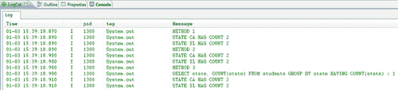

很完美——非常直观。之前我们遇到了`COUNT()`聚合函数，它与`SUM()`和`AVG()`一样，是最受欢迎的聚合函数之一（完整列表请见：[`www.sqlite.org/lang_aggfunc.html)`](http://www.sqlite.org/lang_aggfunc.html)。这些函数，如它们的名字所暗示的，可以统计子表特定列返回的行总数，或者该列值的总和，或者该列值的平均值，等等。首先，让我们检查以下一些聚合函数（注意列名如何变化）：

```kt
/*
* SQL Functions - MIN/MAX/AVG
*/
System.out.println("METHOD 1");
// METHOD #1 - SQLITEDATABASE RAWQUERY()
String colName = "MIN(" + StudentTable.GRADE + ")";
c = sqdb.rawQuery("SELECT " + colName + " from " + StudentTable.TABLE_NAME, null);
while (c.moveToNext()) {
int colid = c.getColumnIndex(colName);
int minGrade = c.getInt(colid);
System.out.println("MIN GRADE " + minGrade);
}
System.out.println("METHOD 2");
// METHOD #2 - SQLITEDATABASE QUERY()
colName = "MAX(" + StudentTable.GRADE + ")";
c = sqdb.query(StudentTable.TABLE_NAME, new String[] { colName }, null, null, null, null, null);
System.out.println("METHOD 3");
// METHOD #3 - SQLITEQUERYBUILDER
colName = "AVG(" + StudentTable.GRADE + ")";
query = SQLiteQueryBuilder.buildQueryString(false, StudentTable.TABLE_NAME, new String[] { colName }, null,
null, null, null, null);
System.out.println(query);
c = sqdb.rawQuery(query, null);
while (c.moveToNext()) {
int colid = c.getColumnIndex(colName);
double avgGrade = c.getDouble(colid);
System.out.println("AVG GRADE " + avgGrade);
}

```

所以，这里我们使用这三种方法中的每一种来测试不同的聚合函数。结果如下所示：

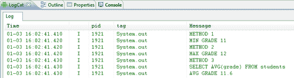

引用之前表的状况后，你可以快速验证输出的数字，并确认这些函数确实在按预期工作。除了聚合函数（通常用于数值类型的列），SQLite 还提供了一系列其他核心函数，帮助你操作从字符串到日期类型等所有内容。这些核心函数的完整列表可以在[`www.sqlite.org/lang_corefunc.html`](http://www.sqlite.org/lang_corefunc.html)找到，但现在，让我们来看几个例子：

```kt
/*
* SQL Functions - UPPER/LOWER/SUBSTR
*/
System.out.println("METHOD 1");
// METHOD #1 - SQLITEDATABASE RAWQUERY()
String colName = "UPPER(" + StudentTable.NAME + ")";
c = sqdb.rawQuery("SELECT " + colName + " from " + StudentTable.TABLE_NAME, null);
while (c.moveToNext()) {
int colid = c.getColumnIndex(colName);
String upperName = c.getString(colid);
System.out.println("GOT STUDENT " + upperName);
}
System.out.println("METHOD 2");
// METHOD #2 - SQLITEDATABASE QUERY()
colName = "LOWER(" + StudentTable.NAME + ")";
c = sqdb.query(StudentTable.TABLE_NAME, new String[] { colName }, null, null, null, null, null);
System.out.println("METHOD 3");
// METHOD #3 - SQLITEQUERYBUILDER
colName = "SUBSTR(" + StudentTable.NAME + ",1,4)";
query = SQLiteQueryBuilder.buildQueryString(false, StudentTable.TABLE_NAME, new String[] { colName }, null,
null, null, null, null);
System.out.println(query);
c = sqdb.rawQuery(query, null);

```

再次，以下是这些核心函数的相关输出：

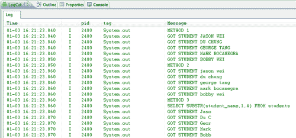

现在，关于在 SQLite 中运行这些函数与在 Java 端执行它们相比能带来多大的性能提升，这是一个有争议的问题，并且高度依赖于你的数据库大小和你调用的函数。例如，一些字符串操作函数可能不会提供像其他更复杂的聚合函数那样的性能提升。实际上，我们将在下一节更深入地研究 SQLite 与 Java 的比较，但不管怎样，了解 SQLite 中可用的函数并添加到你的武器库中总是更好的！

最后，是时候看看使用`SQLiteQueryBuilder`的好处了（到目前为止，很多语法与`SQLiteDatabase`中的`query()`方法非常相似），我们来看看如何利用这个便捷类来执行更复杂的连接：

```kt
/*
* SQL JOINS
*/
SQLiteQueryBuilder sqb = new SQLiteQueryBuilder();
// NOTICE THE SYNTAX FOR COLUMNS IN JOIN QUERIES
String courseIdCol = CourseTable.TABLE_NAME + "." + CourseTable.ID;
String classCourseIdCol = ClassTable.TABLE_NAME + "." + ClassTable.COURSE_ID;
String classIdCol = ClassTable.TABLE_NAME + "." + ClassTable.ID;
sqb.setTables(ClassTable.TABLE_NAME + " INNER JOIN " + CourseTable.TABLE_NAME + " ON (" + classCourseIdCol + " = " + courseIdCol + ")");
String[] cols = new String[] { classIdCol, ClassTable.COURSE_ID, CourseTable.NAME };
query = sqb.buildQuery(cols, null, null, null, null, null, null);
System.out.println(query);
c = sqdb.rawQuery(query, null);
while (c.moveToNext()) {
int colid = c.getColumnIndex(0);
int colid2 = c.getColumnIndex(cols[1]);
int colid3 = c.getColumnIndex(cols[2]);
int rowId = c.getInt(colid);
int courseId = c.getInt(colid2);
String courseName = c.getString(colid3);
System.out.println(rowId + " || COURSE ID " + courseId + " || " + courseName);
}

```

首先，让我指出一些与`JOIN`语句相关的问题。本质上，`JOIN`语句允许你根据某些列值连接两个表。例如，在我们的案例中，我们的模式构建了一个用于班级的表，每个班级都映射了学生 ID 和课程 ID。但是，假设我们不仅想要快速知道班级映射是什么，还想要知道每个映射的课程名称（即课程的名称和哪些学生在上这门课）。我们不需要返回所有的班级映射以及课程列表（即请求两个表回来）然后手动进行这些查找，我们可以使用 SQL 的`JOIN`语句返回一个联合表。

现在，由于在进行`JOIN`语句时我们请求返回多个表，通常当你要求返回特定列时，你需要指定该列来自哪个表。例如，考虑两个表都有 ID 字段的情况——在这种情况下，仅仅请求 ID 列会导致错误，因为不清楚你真正想要的是哪个表的 ID 列。这就是我们在初始化字符串`courseIdCol, classIdCol`和`classCourseIdCol`时所做的事情，语法如下：

```kt
table_name.column_name

```

然后在我们的`SQLiteQueryBuilder`类中，我们使用`setTables()`方法来格式化我们的`JOIN`语句。同样，你可以看到我们在上一个示例中使用的确切语法，但一般的格式是首先指定你想连接的两个表，然后告诉查询你想使用哪种类型的`JOIN`（在我们的案例中，我们想使用`INNER JOIN`）。之后，你需要告诉查询对哪两列执行`JOIN`，在我们的案例中，我们希望通过课程 ID 连接这两个表，因此我们指定了`Class`表的课程 ID 列以及`Course`表对应的课程 ID 列。这样做，`JOIN`语句就知道对于每个班级映射，它应该取课程 ID，然后转到`Course`表找到相应的课程 ID，并将该表的行附加到`Class`表。关于不同类型的 JOIN 以及每种 JOIN 的语法深入讨论，我邀请你查看[`www.w3schools.com/sql/sql_join.asp`](http://www.w3schools.com/sql/sql_join.asp)并阅读文档。上一个`JOIN`语句的输出如下：

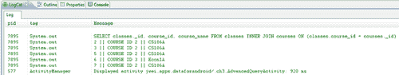

这样你就可以立即看到查询的语法以及结果。

# SQL 与 Java 性能比较

那么，SQL 语言究竟有多强大和高效呢？在前两节中，我们探讨了 SQL 的基本和更高级功能 - 所有这些功能（理论上）仅用 Java 就可以模仿（也就是说，仅用最基础的`SELECT`语句获取整个表，并用 Java `if`语句解析等）。然而，现在是探索在 SQLite 端过滤和操作我们的数据是否真的有实际优势（相对于在 Java 端），如果有，它提供了多少优势的时候了。因此，首先，我们需要一个更大的数据集来更好地说明性能的改进。

首先，我们创建一个具有新架构的新表，该表仅包含姓名、州和收入列 - 可以将这个看作是一个美国数据库，包含每个家庭的名字、他们居住的州以及家庭收入。该表有 17,576 行 - 考虑到一些实际应用程序表的规模，这并不算多 - 但希望这个测试表能说明一些性能差异。让我们从`WHERE`过滤器开始：

```kt
public class PerformanceActivity extends Activity {
@Override
protected void onCreate(Bundle savedInstanceState) {
super.onCreate(savedInstanceState);
setContentView(R.layout.main);
TestSchemaHelper sch = new TestSchemaHelper(this);
SQLiteDatabase sqdb = sch.getWritableDatabase();
// TEST WHERE FILTER PERFORMANCE //
// SQL OPTIMIZED
long start = System.nanoTime();
String query = SQLiteQueryBuilder.buildQueryString(false, TestTable.TABLE_NAME, new String[] { TestTable.NAME }, TestTable.INCOME + " > 500000", null, null, null, null);
System.out.println(query);
Cursor c = sqdb.rawQuery(query, null);
int numRows = 0;
while (c.moveToNext()) {
int colid = c.getColumnIndex(TestTable.NAME);
String name = c.getString(colid);
numRows++;
}
System.out.println("RETRIEVED " + numRows);
System.out.println((System.nanoTime() - start) / 1000000 + " MILLISECONDS");
c.close();
// JAVA OPTIMIZED
start = System.nanoTime();
query = SQLiteQueryBuilder.buildQueryString(false, TestTable.TABLE_NAME, new String[] { TestTable.NAME,
TestTable.INCOME }, null, null, null, null, null);
System.out.println(query);
c = sqdb.rawQuery(query, null);
numRows = 0;
while (c.moveToNext()) {
int colid = c.getColumnIndex(TestTable.NAME);
int colid2 = c.getColumnIndex(TestTable.INCOME);
String name = c.getString(colid);
int income = c.getInt(colid2);
if (income > 500000) {
numRows++;
}
}
System.out.println("RETRIEVED " + numRows);
System.out.println((System.nanoTime() - start) / 1000000 + " MILLISECONDS");
c.close();
}
}

```

在 SQLite 方面，我们仅使用了一个`WHERE`过滤器，它返回给我们表中所有家庭收入超过 500,000 的家庭。在 Java 方面，我们获取整个表，并遍历每一行，使用`if`语句执行相同的过滤。我们可以验证输出的行是相同的，同时比较两种方法的速度：

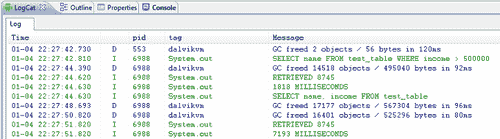

我们可以看到，这里性能提升了近 5 倍！接下来，让我们看看使用`GROUPBY`子句时性能的提升。在 SQLite 方面，我们只需在 states 列上执行一个`GROUPBY`语句，并统计每个州有多少家庭。然后，在 Java 方面，我们将请求整个表格，并手动遍历每一行，使用标准的`Map`对象来跟踪每个州及其相应的计数，如下所示：

```kt
// TEST GROUP BY PERFORMANCE //
// SQL OPTIMIZED
start = System.nanoTime();
String colName = "COUNT(" + TestTable.STATE + ")";
query = SQLiteQueryBuilder.buildQueryString(false, TestTable. TABLE_NAME, new String[] { TestTable.STATE,
colName }, null, TestTable.STATE, null, null, null);
System.out.println(query);
c = sqdb.rawQuery(query, null);
while (c.moveToNext()) {
int colid = c.getColumnIndex(StudentTable.STATE);
int colid2 = c.getColumnIndex(colName);
String state = c.getString(colid);
int count = c.getInt(colid2);
System.out.println("STATE " + state + " HAS COUNT " + count);
}
System.out.println((System.nanoTime() - start) / 1000000 + " MILLISECONDS");
c.close();
// JAVA OPTIMIZED
start = System.nanoTime();
query = SQLiteQueryBuilder.buildQueryString(false, TestTable. TABLE_NAME, new String[] { TestTable.STATE },
null, null, null, null, null);
System.out.println(query);
c = sqdb.rawQuery(query, null);
Map<String, Integer> map = new HashMap<String, Integer>();
while (c.moveToNext()) {
int colid = c.getColumnIndex(TestTable.STATE);
String state = c.getString(colid);
if (map.containsKey(state)) {
int curValue = map.get(state);
map.put(state, curValue + 1);
} else {
map.put(state, 1);
}
}
for (String key : map.keySet()) {
System.out.println("STATE " + key + " HAS COUNT " + map. get(key));
}
System.out.println((System.nanoTime() - start) / 1000000 + " MILLISECONDS");
c.close();

```

让我们看看我们做得如何：

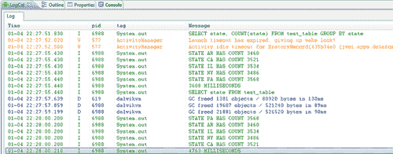

所以在这种情况下，我们看到了性能的提升，但不太明显，效率提高了 33%。需要注意的是，这些统计数据高度依赖于您的表模式和表大小，所以对这些数字要持保留态度。然而，这些小实验的目标只是让我们了解这两种方法如何比较。最后，让我们看看像 SQL 中的`avg()`这样的内置聚合函数与 Java 相比如何。两种方法的代码如下：

```kt
// TEST AVERAGE PERFORMANCE //
// SQL OPTIMIZED
start = System.nanoTime();
colName = "AVG(" + TestTable.INCOME + ")";
query = SQLiteQueryBuilder.buildQueryString(false, TestTable.TABLE_NAME, new String[] { colName }, null, null,
null, null, null);
System.out.println(query);
c = sqdb.rawQuery(query, null);
while (c.moveToNext()) {
int colid = c.getColumnIndex(colName);
double avgGrade = c.getDouble(colid);
System.out.println("AVG INCOME " + avgGrade);
}
System.out.println((System.nanoTime() - start) / 1000000 + " MILLISECONDS");
c.close();
// JAVA OPTIMIZED
start = System.nanoTime();
colName = TestTable.INCOME;
query = SQLiteQueryBuilder.buildQueryString(false, TestTable.TABLE_NAME, new String[] { colName }, null, null,
null, null, null);
System.out.println(query);
c = sqdb.rawQuery(query, null);
SQL language performancecheckingdouble sumIncomes = 0.0;
double numIncomes = 0.0;
while (c.moveToNext()) {
int colid = c.getColumnIndex(colName);
int income = c.getInt(colid);
sumIncomes += income;
numIncomes++;
}
System.out.println("AVG INCOME " + sumIncomes / numIncomes);
System.out.println((System.nanoTime() - start) / 1000000 + " MILLISECONDS");
c.close();

```

快速查看输出结果：

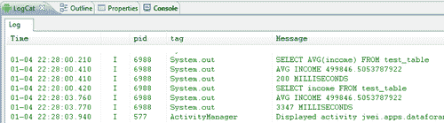

哇——无需多言。两种方法的结果相同，但使用 SQL 函数时，性能提高了 16 倍。

# 总结

在本章中，我们从关注 Android OS 开始，查看了可用哪些类型的查询方法。我们了解到，与 SQLite 数据库交互有三种众所周知的方式，有些方式比其他方式更“方便”，有些则更灵活、更强大。

然而，我们也看到，尽管每种方法都有其优缺点，但所有三种查询方法最终都能执行相同的查询，只是使用了不同的语法集或不同的参数集。这时，我们从这些方法本身转移开，更多地关注查询本身，从简单的查询开始，这些查询从最基本的`SELECT`查询到允许您指定特定列和行的更复杂的查询。后来，我们讨论了更高级的查询，这些查询从`ORDERBY`和`GROUPBY`查询到最复杂、最深入的`JOIN`语句。

最后，作为我们这些好奇且注重性能的程序开发者，我们在上一节中比较了 SQL 和 Java 的执行速度，在 SQL 和 Java 中实施各种查询，然后运行它们以观察各自的执行速度。我们看到，在每种情况下，能够将你所需的功能嵌入到 SQL 查询中，与在 Java 中执行相同功能相比，都可以提供性能提升（在一个案例中，它提供了高达 16 倍的性能提升）。因此，本节的结论是，当可能时，应尽量在 SQL 端而非 Java 端处理数据，这将帮助你优化速度和内存使用！

但在我们继续之前，让我们花点时间来总结一下我们已经学到的知识。在之前的第二章中，*使用 SQLite 数据库*，我们学习了如何在 Android 应用程序中实现 SQLite 数据库架构，刚才我们又了解了内置于 SQL 中的所有不同特性，这些特性最终能让你以极其强大和高效的方式处理数据。但是，如果你想要访问用户 Android 设备上的现有数据呢？每个 Android 设备都包含大量的数据，其中许多数据可供外部应用程序查询，因此在开发应用程序时这一点很重要。此外，如果你想要将数据库和架构暴露给其他应用程序呢？如果你正在构建一个任务列表应用程序，并希望允许其他应用程序（可能是基于日历的应用程序）查询用户的现有任务，该怎么办？所有这些功能都是通过一个称为`ContentProvider`的机制实现的，接下来的两章我们将详细讲解这个在 Android 中极其重要的类。
