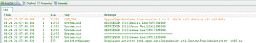

# 第四章：使用内容提供者

到目前为止，我们在本书中已经完成了很多工作！在仅仅三章中，我们已经了解了从简单的、不起眼的`SharedPreferences`类到功能强大且复杂的 SQLite 数据库的各种数据存储机制，SQLite 数据库配备了各种查询方法和类，它们利用同样强大的 SQL 语言。

然而，假设你已经掌握了前三章的内容，并且从头开始成功构建了应用程序的数据库模式，现在该应用程序已经在市场上运行。现在，假设你想创建第二个应用程序，扩展第一个应用程序的功能，并且需要访问你原始应用程序的数据库。或者，也许你并不需要创建第二个应用程序，你只是想通过让外部应用程序访问和集成你的数据库来更好地推广你的应用程序。

或者，也许你从未想过要构建自己的数据库，而只是想利用每个 Android 设备上已经存在的丰富数据，这些数据可以随时查询！在本章中，我们将学习如何使用`ContentProvider`类完成所有这些事情，最后我们将花一些时间讨论实际用例，探讨为什么你可能需要通过`ContentProvider`公开你的数据库模式。

# 内容提供者

让我们先来回答这个问题：`ContentProvider`究竟是什么？为什么我需要与这个`ContentProvider`交互？

`ContentProvider`本质上是位于开发人员和存储所需数据的数据库模式之间的一个*接口*。为什么需要这个中介接口呢？考虑以下（真实）场景：

在 Android 操作系统中，用户的联系人列表（这包括电话号码、地址、生日以及与联系人相关的许多其他数据字段）存储在用户设备上相当复杂的数据库模式中。设想一个场景，作为开发人员，我想查询用户的联系人电话号码。

想想看，如果我只想访问一个或两个字段，却要学习整个数据库的模式，这会有多不方便？或者，如果每次谷歌更新 Android 操作系统并调整联系人模式（相信我，这已经发生了好几次了），我都必须重新学习模式并相应地重构我的查询，这会有多不方便？

正是因为这些原因，才存在这样的中介——这样，人们就不需要直接与模式交互，只需通过内容提供者查询即可。现在，请注意，每次谷歌更新其联系人模式时，他们都需要确保重新调整他们对`Contacts`内容提供者的实现；否则我们通过内容提供者进行的查询可能会失败。

换句话说，本章的大部分内容以及`ContentProvider`类的实现，都会让你想起我们之前在编写数据库便捷方法时的操作。如果你选择通过内容提供者公开你的数据，你需要定义外部应用程序如何查询你的数据，如何插入新数据或更新现有数据等。这些都需要你重写和实现的方法。

但现在让我们更细致一些。从开始到结束实现一个内容提供者有许多部分和步骤，所以首先，让我们开始概述这一部分，并查看所有这些步骤：

+   定义数据模型（通常是 SQLite 数据库，然后扩展`ContentProvider`类）

+   定义其**统一资源标识符（URI）**

+   在 Manifest 文件中声明内容提供者

+   实现`ContentProvider`的抽象方法（`query(), insert(), update(), delete(), getType()`和`onCreate()`）

现在，让我们从定义数据模型开始。通常，数据模型类似于 SQLite 数据库（虽然它不一定是），然后简单地扩展`ContentProvider`类。在我的例子中，我选择实现了一个非常简单的数据库架构，只包含一个表——公民表，旨在复制一个标准的数据库，用于跟踪具有唯一 ID（如社会安全 ID）、姓名、注册状态，以及在我的案例中报告的收入。首先，让我们定义这个`CitizensTable`类及其架构：

```kt
public class CitizenTable {
public static final String TABLE_NAME = "citizen_table";
/**
* DEFINE THE TABLE
*/
// ID COLUMN MUST LOOK LIKE THIS
public static final String ID = "_id";
public static final String NAME = "name";
public static final String STATE = "state";
public static final String INCOME = "income";
/**
* DEFINE THE CONTENT TYPE AND URI
*/
// TO BE DISCUSSED LATER. . .
}

```

很直观。现在让我们创建一个扩展了`SQLiteOpenHelper`类的类（就像我们在上一章所做的那样），但这次我们将把它声明为一个内部类，其中外部类扩展了`ContentProvider`类：

```kt
public class CitizenContentProvider extends ContentProvider {
private static final String DATABASE_NAME = "citizens.db";
private static final int DATABASE_VERSION = 1;
public static final String AUTHORITY =
"jwei.apps.dataforandroid.ch4.CitizenContentProvider";
// OVERRIDE AND IMPLEMENT OUR DATABASE SCHEMA
private static class DatabaseHelper extends SQLiteOpenHelper{
DatabaseHelper(Context context) {
super(context,DATABASE_NAME,null,DATABASE_VERSION);
}
@Override
public void onCreate(SQLiteDatabase db) {
// CREATE INCOME TABLE
db.execSQL("CREATE TABLE " + CitizenTable.TABLE_NAME +
" (" + CitizenTable.ID + " INTEGER PRIMARY KEY
AUTOINCREMENT," + CitizenTable.NAME + " TEXT," +
CitizenTable.STATE + " TEXT," + CitizenTable.INCOME +
" INTEGER);");
}
@Override
public void onUpgrade(SQLiteDatabase db, int oldVersion,
int newVersion) {
Log.w("LOG_TAG", "Upgrading database from version " +
oldVersion + " to " + newVersion +
", which will destroy all old data");
// KILL PREVIOUS TABLES IF UPGRADED
db.execSQL("DROP TABLE IF EXISTS " +
CitizenTable.TABLE_NAME);
// CREATE NEW INSTANCE OF SCHEMA
onCreate(db);
}
}
private DatabaseHelper dbHelper;
// NOTE THE DIFFERENT METHODS THAT NEED TO BE IMPLEMENTED
@Override
public boolean onCreate() {
// . . .
}
@Override
public int delete(Uri uri, String where, String[] whereArgs){
// . . .
}
@Override
public String getType(Uri uri) {
// . . .
}
@Override
public Uri insert(Uri uri, ContentValues initialValues) {
// . . .
ContentProviderContentProviderabout}
@Override
public Cursor query(Uri uri, String[] projection, String
selection, String[] selectionArgs, String sortOrder) {
// . . .
}
@Override
public int update(Uri uri, ContentValues values, String where,
String[] whereArgs) {
// . . .
}
}

```

你不必将 SQLite 数据库声明为内部类——对于我来说，这仅仅使实现稍微容易一些，并且所有内容都集中在一个地方。在任何情况下，你会注意到数据模型本身的实现与之前完全相同——重写`onCreate()`方法并创建你的表，然后重写`onUpdate()`方法并删除/重新创建表。在我们刚才看到的框架中，你还会看到由于扩展了`ContentProvider`类而需要实现的各种方法（这将在下一节中介绍）。

我们刚才看到的代码唯一不同的地方是包含了以下字符串： 

```kt
public static final String AUTHORITY =
"jwei.apps.dataforandroid.ch4.CitizenContentProvider";

```

这个权限是*标识提供者的内容*——不一定是路径。我的意思是，稍后我们会看到，你可以定义整个*路径*（这被称为 URI），以指导查询到数据库架构中的正确位置。

在我们的内容提供者中，我们将允许开发人员以两种方式之一查询我们的数据库：

`content://jwei.apps.dataforandroid.ch4.CitizenContentProvider/citizen`

`content://jwei.apps.dataforandroid.ch4.CitizenContentProvider/citizen/#`

这两个完全指定的路径是我们将在内容提供者中注册的，根据开发者请求的路径，内容提供者将知道如何查询我们的数据库。这些意味着什么——注意，两者都以`content://`前缀开始，这只是告诉对象这是一个指向内容提供者的 URI（就像`http://`告诉浏览器路径指向一个网页）。

在前缀之后，我们指定权限，以便对象知道要访问哪个内容提供者，之后我们有后缀`/citizen`和`/citizen/#`。前者我们将简单地定义为基本查询——开发者只需发出一个标准查询，并在`query()`方法中传递任何过滤器。后者适用于开发者已经知道公民的 ID（即社会安全号码）并且只想获取表中的特定行。我们不必强迫开发者使用带有 ID 的`WHERE`过滤器，我们可以简化操作，允许开发者以路径的形式指定`WHERE`过滤器。

如果所有这些听起来仍然让人困惑，最直观的类比可能是：当你注册一个互联网域名时，你必须指定一个基础 URL，一旦注册，浏览器就会知道如何根据这个基础 URL 找到其他文件的位置。同样，在我们的例子中，我们在**Android Manifest**（我们应用程序的主板）中指定我们想要公开一个内容提供者，并定义了到它的路径。一旦注册，任何开发者想要访问我们的内容提供者时，他/她必须指定这个*基础* URI（即权限），并且他/她还需要通过完成 URI 的路径来指定他们要进行的查询类型。关于如何定义`ContentProvider` URI 的更多信息，我邀请您查看：

[Android 开发者指南关于内容提供者的部分](http://developer.android.com/guide/topics/providers/content-providers.html#urisum)

但现在，让我们快速查看一下如何在 Android 的 Manifest 文件中声明你的提供者，之后，我们将深入到实现的核心部分，即重写抽象方法：

```kt
<?xml version="1.0" encoding="utf-8"?>
<manifest

package="jwei.apps.dataforandroid"
android:versionCode="1"
android:versionName="1.0">
<application android:icon="@drawable/icon"
android:label="@string/app_name">
<provider
android:name=
"jwei.apps.dataforandroid.ch4.CitizenContentProvider"
android:authorities=
"jwei.apps.dataforandroid.ch4.CitizenContentProvider"/>
</application>
</manifest>

```

同样，这非常直观。你需要为你的内容提供者定义一个名称和权限——实际上，如果给定的基础 URI 作为权限不合适，Manifest 文件会报错，只要它能编译，你就知道可以开始了！现在，让我们继续学习内容提供者更复杂的实现部分。

## 实现`query`方法

现在我们已经构建了数据模型，定义了表的权限和 URI，并在我们的 Android Manifest 文件中成功声明了它，是时候编写类的主体并实现其六个抽象方法了。我们将从`onCreate()`和`query()`方法开始：

```kt
public class CitizenContentProvider extends ContentProvider {
private static final String DATABASE_NAME = "citizens.db";
private static final int DATABASE_VERSION = 1;
public static final String AUTHORITY =
"jwei.apps.dataforandroid.ch4.CitizenContentProvider";
private static final UriMatcher sUriMatcher;
private static HashMap<String, String> projectionMap;
// URI MATCH OF A GENERAL CITIZENS QUERY
private static final int CITIZENS = 1;
// URI MATCH OF A SPECIFIC CITIZEN QUERY
private static final int SSID = 2;
private static class DatabaseHelper extends SQLiteOpenHelper {
// . . .
}
private DatabaseHelper dbHelper;
@Override
public boolean onCreate() {
// HELPER DATABASE IS INITIALIZED
dbHelper = new DatabaseHelper(getContext());
return true;
}
@Override
public int delete(Uri uri, String where, String[] whereArgs){
// . . .
}
@Override
public String getType(Uri uri) {
// . . .
}
@Override
public Uri insert(Uri uri, ContentValues initialValues) {
// . . .
}
@Override
public Cursor query(Uri uri, String[] projection,
String selection, String[] selectionArgs, String sortOrder) {
SQLiteQueryBuilder qb = new SQLiteQueryBuilder();
qb.setTables(CitizenTable.TABLE_NAME);
switch (sUriMatcher.match(uri)) {
case CITIZENS:
qb.setProjectionMap(projectionMap);
break;
case SSID:
String ssid =
uri.getPathSegments(). get(CitizenTable.SSID_PATH_POSITION);
qb.setProjectionMap(projectionMap);
// FOR QUERYING BY SPECIFIC SSID
qb.appendWhere(CitizenTable.ID + "=" + ssid);
break;
default:
throw new IllegalArgumentException ("Unknown URI " + uri);
}
SQLiteDatabase db = dbHelper.getReadableDatabase();
Cursor c = qb.query(db, projection, selection,
selectionArgs, null, null, sortOrder);
// REGISTERS NOTIFICATION LISTENER WITH GIVEN CURSOR
// CURSOR KNOWS WHEN UNDERLYING DATA HAS CHANGED
c.setNotificationUri(getContext().getContentResolver(),
uri);
return c;
ContentProviderContentProviderquery method, implementing}
@Override
public int update(Uri uri, ContentValues values, String where,
String[] whereArgs) {
// . . .
}
// INSTANTIATE AND SET STATIC VARIABLES
static {
sUriMatcher = new UriMatcher(UriMatcher.NO_MATCH);
sUriMatcher.addURI(AUTHORITY, "citizen", CITIZENS);
sUriMatcher.addURI(AUTHORITY, "citizen/#", SSID);
// PROJECTION MAP USED FOR ROW ALIAS
projectionMap = new HashMap<String, String>();
projectionMap.put(CitizenTable.ID, CitizenTable.ID);
projectionMap.put(CitizenTable.NAME, CitizenTable.NAME);
projectionMap.put(CitizenTable.STATE, CitizenTable.STATE);
projectionMap.put(CitizenTable.INCOME,
CitizenTable.INCOME);
}
}

```

所以，让我们先从简单的事情开始。你会注意到首先在我们定义了 SQLite 数据库（通过扩展`SQLiteOpenHelper`类）之后，我们声明了一个全局的`DatabaseHelper`变量，并在我们的`onCreate()`方法中初始化它。`onCreate()`方法是在活动通过`ContentResolver`对象（我们稍后会讨论）请求打开我们的特定内容提供者之后自动调用的。当然，任何其他的初始化工作也应该在这里进行，但在我们的例子中，我们只想初始化与数据库的连接。

完成这些后，让我们看看我们在最后声明的那些静态变量。`projectionMap`的作用是允许你为列设置别名。在大多数内容提供者中，这种映射看起来可能有些没有意义，因为你只是告诉内容提供者将表的列映射到它们自己（正如我们在`onCreate()`和`query()`方法的实现中所做的那样）。然而，在某些情况下，对于更复杂的架构（即包含联合表的那些），能够重命名和为表的列设置别名可以使访问内容提供者的数据更加直观。

现在还记得我们之前提到的两个路径吗（即`/citizen`和`/citizen/#`）？这里我们所做的就是实例化一个`UriMatcher`对象，通过`addURI()`方法来定义这些路径。

在高层次上，这个方法定义了一组映射关系——它告诉我们的`ContentProvider`类，任何带有路径`/citizen`的查询都应该映射到带有`CITIZENS`标志的行为上。同理，带有路径`/citizen/#`的查询应该映射到带有`SSID`标志的行为上（这些标志都是在类的顶部定义的）。这种功能对开发者很有用，因为它允许他如果提前知道公民的 ID，就可以高效地查询。

这些标志通常出现在`switch`语句中，所以现在我们将注意力集中在`query()`方法上。它首先初始化一个`SqliteQueryBuilder`类（我们在前面的章节中花了大量时间研究它），然后使用我们的`UriMatcher`对象来匹配传入的 URI。换句话说，`UriMatcher`所做的就是查看请求的路径，首先判断它是否是有效的路径（如果不是，我们会抛出一个带有错误`unknown URI`的异常）。一旦它看到开发者提交了一个有效的 URI，它就会返回该路径关联的标志（在我们的例子中就是`CITIZENS`或`SSID`），此时我们可以使用`switch`语句来导航到正确的功能。

一旦你理解了高级层面的操作，其余部分现在应该相当直接和熟悉。如果用户刚刚提交了一个常规查询（即带有`CITIZENS`标志的查询），那么我们需要做的就是定义投影映射和将被查询的表名。再次强调，如果用户想要直接访问我们表中的某一行，那么通过在路径中指定社会保险 ID，我们可以使用以下这行代码解析出该公民信息：

```kt
String ssid =
uri.getPathSegments().get(CitizenTable.SSID_PATH_POSITION);

```

不用太担心`SSID_PATH_POSITION`变量——我们在这里所做的就是获取传入的 URI 并将其分解为路径段。一旦有了路径段，我们将获取第一个路径段（随后`SSID_PATH_POSITION`被设置为`1`，我们很快就会看到），因为在我们的示例中，只会有一个路径段传入。

现在，一旦我们获得了查询中传入的期望的社会保险 ID，我们需要做的就是将其附加到`WHERE`过滤器上，其余部分就是我们之前看到的内容——获取可读数据库，并填充`SQLiteDatabase`的`query()`方法。

最后我要提到的是，在成功发起查询并获取指向数据的`Cursor`之后，由于我们将内容提供者暴露给了设备上的所有外部应用，可能会有多个应用同时访问我们的数据库，这种情况下我们的数据可能会发生变化。因此，我们告诉返回的`Cursor`去*监听*其基础数据发生的任何变化，这样当有变化发生时，`Cursor`就会知道更新自身，进而更新可能使用我们的`Cursor`的任何 UI 组件。

## 实现 delete 和 update 方法

在这一点上，希望一切都有意义，所以让我们继续看看`delete()`和`update()`方法，这两个方法在结构上将与`query()`方法非常相似：

```kt
public class CitizenContentProvider extends ContentProvider {
private static final String DATABASE_NAME = "citizens.db";
private static final int DATABASE_VERSION = 1;
public static final String AUTHORITY =
"jwei.apps.dataforandroid.ch4.CitizenContentProvider";
private static final UriMatcher sUriMatcher;
private static HashMap<String, String> projectionMap;
// URI MATCH OF A GENERAL CITIZENS QUERY
private static final int CITIZENS = 1;
// URI MATCH OF A SPECIFIC CITIZEN QUERY
private static final int SSID = 2;
private static class DatabaseHelper extends SQLiteOpenHelper {
// . . .
}
private DatabaseHelper dbHelper;
@Override
public boolean onCreate() {
// HELPER DATABASE IS INITIALIZED
dbHelper = new DatabaseHelper(getContext());
return true;
}
@Override
public int delete(Uri uri, String where, String[] whereArgs) {
SQLiteDatabase db = dbHelper.getWritableDatabase();
int count;
switch (sUriMatcher.match(uri)) {
case CITIZENS:
// PERFORM REGULAR DELETE
count = db.delete(CitizenTable.TABLE_NAME, where,
whereArgs);
break;
case SSID:
// FROM INCOMING URI GET SSID
String ssid =
uri.getPathSegments(). get(CitizenTable.SSID_PATH_POSITION);
// USER WANTS TO DELETE A SPECIFIC CITIZEN
String finalWhere = CitizenTable.ID+"="+ssid;
// IF USER SPECIFIES WHERE FILTER THEN APPEND
if (where != null) {
finalWhere = finalWhere + " AND " + where;
}
count = db.delete(CitizenTable.TABLE_NAME,
finalWhere, whereArgs);
break;
default:
throw new IllegalArgumentException ("Unknown URI " + uri);
}
getContext().getContentResolver().notifyChange(uri, null);
return count;
}
ContentProviderContentProviderupdate() methods, implementing@Override
public String getType(Uri uri) {
// . . .
}
@Override
public Uri insert(Uri uri, ContentValues initialValues) {
// . . .
}
@Override
public Cursor query(Uri uri, String[] projection,
String selection, String[] selectionArgs, String sortOrder) {
// . . .
}
@Override
public int update(Uri uri, ContentValues values, String where,
String[] whereArgs) {
SQLiteDatabase db = dbHelper.getWritableDatabase();
int count;
switch (sUriMatcher.match(uri)) {
case CITIZENS:
// GENERAL UPDATE ON ALL CITIZENS
count = db.update(CitizenTable.TABLE_NAME, values,
where, whereArgs);
break;
case SSID:
// FROM INCOMING URI GET SSID
String ssid =
uri.getPathSegments(). get(CitizenTable.SSID_PATH_POSITION);
// THE USER WANTS TO UPDATE A SPECIFIC CITIZEN
String finalWhere = CitizenTable.ID+"="+ssid;
if (where != null) {
finalWhere = finalWhere + " AND " + where;
}
// PERFORM THE UPDATE ON THE SPECIFIC CITIZEN
count = db.update(CitizenTable.TABLE_NAME, values,
finalWhere, whereArgs);
break;
default:
throw new IllegalArgumentException ("Unknown URI " + uri);
}
getContext().getContentResolver().notifyChange(uri, null);
return count;
}
// INSTANTIATE AND SET STATIC VARIABLES
static {
// . . .
}
}

```

我们可以看到，这两个语句背后的逻辑与`query()`方法非常相似。我们看到在`delete()`方法中，我们首先获取可写数据库（注意在这种情况下我们不需要`SQLiteQueryBuilder`的帮助，因为我们正在删除某物而不是查询任何内容），然后将传入的 URI 指向我们的`UriMatcher`。一旦`UriMatcher`验证了路径，它就会将其指向适当的标志，在这一点上我们可以相应地调整功能。

在我们的案例中，带有`CITIZEN`路径规范的任何查询都变成了一个标准的`delete()`语句，而带有`SSID`路径规范的查询变成了带有对表 ID 列额外`WHERE`过滤器的`delete()`语句。再次强调，这里的直觉是我们正在从数据库中删除一个特定的公民。看看以下代码片段：

```kt
String finalWhere = CitizenTable.ID+"="+ssid;
// IF USER SPECIFIES WHERE FILTER THEN APPEND
if (where != null) {
finalWhere = finalWhere + " AND " + where;
}

```

请注意我们是如何将 ID 过滤器添加到用户可能指定的原始`WHERE`过滤器上的。在你的实现中记住这样的细节很重要——即开发者可能在路径规范中与 ID 一起传递了额外的参数，因此你的最终`WHERE`过滤器应该考虑所有这些因素。剩下的唯一细节就在这一行：

```kt
getContext().getContentResolver().notifyChange(uri, null);

```

这里我们所做的是请求`Context`和发起此调用的`ContentResolver`，并通知它对底层数据的更改已成功完成。为什么这很重要，当我们讨论如何将`Cursors`绑定到 UI 时会更加清晰，但现在考虑一个情况，在你的活动中，你将数据的行显示为列表。自然，每次底层数据库中的数据行发生更改时，你都希望你的列表反映出这些变化，这就是为什么我们需要在方法末尾通知这些变化。

现在，关于`update()`方法我不会说太多，因为其逻辑与`delete()`方法相同——唯一的不同在于你对可写 SQLite 数据库调用的差异。所以，让我们继续前进，用`getType()`和`insert()`方法完成我们的实现！

## 实现`insert()`和`getType()`方法

是时候实现最后两个方法，完成我们的`ContentProvider`实现了。让我们看看：

```kt
public class CitizenContentProvider extends ContentProvider {
private static final String DATABASE_NAME = "citizens.db";
private static final int DATABASE_VERSION = 1;
public static final String AUTHORITY =
"jwei.apps.dataforandroid.ch4.CitizenContentProvider";
private static final UriMatcher sUriMatcher;
private static HashMap<String, String> projectionMap;
// URI MATCH OF A GENERAL CITIZENS QUERY
private static final int CITIZENS = 1;
// URI MATCH OF A SPECIFIC CITIZEN QUERY
private static final int SSID = 2;
private static class DatabaseHelper extends SQLiteOpenHelper {
// . . .
}
private DatabaseHelper dbHelper;
@Override
public boolean onCreate() {
// . . .
}
@Override
public int delete(Uri uri, String where, String[] whereArgs) {
// . . .
}
@Override
public String getType(Uri uri) {
switch (sUriMatcher.match(uri)) {
case CITIZENS:
return CitizenTable.CONTENT_TYPE;
case SSID:
return CitizenTable.CONTENT_ITEM_TYPE;
default:
throw new IllegalArgumentException("Unknown URI " + uri);
}
}
@Override
public Uri insert(Uri uri, ContentValues initialValues) {
// ONLY GENERAL CITIZENS URI IS ALLOWED FOR INSERTS
// DOESN'T MAKE SENSE TO SPECIFY A SINGLE CITIZEN
if (sUriMatcher.match(uri) != CITIZENS) { throw new IllegalArgumentException("Unknown URI " + uri); }
// PACKAGE DESIRED VALUES AS A CONTENTVALUE OBJECT
ContentValues values;
if (initialValues != null) {
values = new ContentValues(initialValues);
} else {
values = new ContentValues();
}
SQLiteDatabase db = dbHelper.getWritableDatabase();
long rowId = db.insert(CitizenTable.TABLE_NAME,
CitizenTable.NAME, values);
if (rowId > 0) {
Uri citizenUri = ContentUris.withAppendedId(CitizenTable.CONTENT_URI, rowId);
// NOTIFY CONTEXT OF THE CHANGE
getContext().getContentResolver().notifyChange(citizenUri,
null);
ContentProviderContentProvidergetType() method, implementingreturn citizenUri;
}
throw new SQLException("Failed to insert row into " + uri);
}
@Override
public Cursor query(Uri uri, String[] projection,
String selection, String[] selectionArgs, String sortOrder) {
// . . .
}
@Override
public int update(Uri uri, ContentValues values, String where,
String[] whereArgs) {
// . . .
}
// INSTANTIATE AND SET STATIC VARIABLES
static {
// . . .
}
}

```

首先，让我们处理`getType()`方法。这个方法只是返回请求给定 URI 的数据对象的**多用途互联网邮件扩展（MIME）**类型，这实际上意味着你为数据的每一行（或行）指定了一个可区分的数据类型。这使得开发者（如果需要）能够确定指向你的表的`Cursor`是否确实检索到有效的*公民*对象。为你的数据指定 MIME 类型的规则是：

+   `vnd.android.cursor.item/`用于单一记录

+   `vnd.android.cursor.dir/`用于多条记录

接着，我们将在`CitizenTable`类中定义我们的 MIME 类型（这也是我们定义列和架构的地方）：

```kt
public class CitizenTable {
public static final String TABLE_NAME = "citizen_table";
/**
* DEFINE THE TABLE
*/
// . . .
/**
* DEFINE THE CONTENT TYPE AND URI
*/
// THE CONTENT URI TO OUR PROVIDER
public static final Uri CONTENT_URI = Uri.parse("content://" +
CitizenContentProvider.AUTHORITY + "/citizen");
// MIME TYPE FOR GROUP OF CITIZENS
public static final String CONTENT_TYPE =
"vnd.android.cursor.dir/vnd.jwei512.citizen";
// MIME TYPE FOR SINGLE CITIZEN
public static final String CONTENT_ITEM_TYPE =
"vnd.android.cursor.item/vnd.jwei512.citizen";
// RELATIVE POSITION OF CITIZEN SSID IN URI
public static final int SSID_PATH_POSITION = 1;
}

```

所以现在我们已经定义了我们的 MIME 类型，剩下的就是将 URI 再次传递给`UriMatcher`并返回相应的 MIME 类型。

最后但同样重要的是，我们有我们的`insert()`方法。这个方法略有不同，但不是显著不同。唯一的区别在于，当插入某物时，传递一个`SSID` URI 路径是没有意义的（想想看——如果你正在插入一个*新的*公民，你怎么可能已经有一个想要传递给 URI 的社会安全 ID）。因此，在这种情况下，如果没有传递带有`CITIZEN`路径规范的 URI，我们就抛出一个错误。否则，我们继续并简单地获取我们的可写数据库并将值插入到我们的内容提供者中（这我们之前也见过）。

就是这样！目标是看到完整的实现后，所有的部分能够联系在一起，并且你开始直观地了解我们的`ContentProvider`类中发生了什么。只要直观上讲得通，当你自己编程和实现内容提供者时，其余部分就会随之而来！

现在，在讨论通过内容提供者暴露数据的具体原因之前，让我们快速了解一下如何与内容提供者（现在我们先使用我们自己的）交互，并随后介绍`ContentResolver`类，到现在为止我们已经多次提到过它。现在看起来可能很快，但不用担心——我们将在接下来的章节中专门介绍最常用的内容提供者：`Contacts`内容提供者。

## 与 ContentProvider 交互

在这一点上，我们已经成功实现了自己的内容提供者，现在可以被外部应用程序读取、查询和更新（假设已授予适当的权限）！要交互内容提供者，第一步是从你的`Context`获取相关的`ContentResolver`。这个类与`SQLiteDatabase`类非常相似，因为它具有标准的`insert(), query(), update()`和`delete()`方法（实际上，这两个类的方法语法和参数也非常相似），但它特别设计用于通过开发者传入的 URI 与内容提供者交互。

让我们看看你如何在`Activity`类中实例化一个`ContentResolver`，然后使用路径规范插入和查询数据：

```kt
public class ContentProviderActivity extends Activity {
@Override
protected void onCreate(Bundle savedInstanceState) {
super.onCreate(savedInstanceState);
setContentView(R.layout.main);
ContentResolver cr = getContentResolver();
ContentValues contentValue = new ContentValues();
contentValue.put(CitizenTable.NAME, "Jason Wei");
contentValue.put(CitizenTable.STATE, "CA");
contentValue.put(CitizenTable.INCOME, 100000);
cr.insert(CitizenTable.CONTENT_URI, contentValue);
contentValue = new ContentValues();
contentValue.put(CitizenTable.NAME, "James Lee");
contentValue.put(CitizenTable.STATE, "NY");
contentValue.put(CitizenTable.INCOME, 120000);
cr.insert(CitizenTable.CONTENT_URI, contentValue);
contentValue = new ContentValues();
contentValue.put(CitizenTable.NAME, "Daniel Lee");
contentValue.put(CitizenTable.STATE, "NY");
contentValue.put(CitizenTable.INCOME, 80000);
cr.insert(CitizenTable.CONTENT_URI, contentValue);
// QUERY TABLE FOR ALL COLUMNS AND ROWS
Cursor c = cr.query(CitizenTable.CONTENT_URI, null, null,
null, CitizenTable.INCOME + " ASC");
// LET THE ACTIVITY MANAGE THE CURSOR
startManagingCursor(c);
int idCol = c.getColumnIndex(CitizenTable.ID);
int nameCol = c.getColumnIndex(CitizenTable.NAME);
int stateCol = c.getColumnIndex(CitizenTable.STATE);
int incomeCol = c.getColumnIndex(CitizenTable.INCOME);
while (c.moveToNext()) {
int id = c.getInt(idCol);
String name = c.getString(nameCol);
String state = c.getString(stateCol);
int income = c.getInt(incomeCol);
System.out.println("RETRIEVED ||" + id + "||" + name +
"||" + state + "||" + income);
}
System.out.println("-------------------------------");
// QUERY BY A SPECIFIC ID
Uri myC = Uri.withAppendedPath(CitizenTable.CONTENT_URI,
"2");
Cursor c1 = cr.query(myC, null, null, null, null);
// LET THE ACTIVITY MANAGE THE CURSOR
startManagingCursor(c1);
while (c1.moveToNext()) {
int id = c1.getInt(idCol);
String name = c1.getString(nameCol);
String state = c1.getString(stateCol);
int income = c1.getInt(incomeCol);
System.out.println("RETRIEVED ||" + id + "||" + name +
"||" + state + "||" + income);
}
}
}

```

这里发生的情况是，我们首先向数据库中插入三行，这样公民表现在看起来像这样：

| ID | 姓名 | 州 | 收入 |
| --- | --- | --- | --- |
| 1 | 魏佳森 | 加利福尼亚 | 100000 |
| 2 | 詹姆斯·李 | 纽约 | 120000 |
| 3 | 丹尼尔·李 | 纽约 | 80000 |

在这里，我们使用内容解析器对我们的表进行一般查询（即，只需传入基本的 URI 路径规范），按收入递增的顺序。然后，我们使用内容解析器通过`SSID`路径规范进行特定查询。为此，我们使用了以下静态方法：

```kt
Uri myC = Uri.withAppendedPath(CitizenTable.CONTENT_URI, "2");

```

这将基本内容 URI 从以下形式转换：

`content://jwei.apps.dataforandroid.ch4.CitizenContentProvider/citizen`

转换为以下形式：

`content://jwei.apps.dataforandroid.ch4.CitizenContentProvider/citizen/2`

因此，为了验证我们的结果，让我们看看输出的内容：



从之前的截图中，我们可以看到两个查询确实输出了正确的数据行！

关于上一个例子，我要说的最后一件事（因为大部分语法和`Cursor`处理与之前章节的例子相同）是关于`startManagingCursor()`方法。在之前的章节中，你会注意到每次我通过`query()`打开一个`Cursor`，我必须确保在`Activity`结束时关闭它，否则操作系统会抛出各种悬挂`Cursor`的警告。然而，使用`startManagingCursor()`便利方法，`Activity`会为你管理`Cursor`的生命周期，确保在`Activity`销毁自身之前关闭它，等等。通常，让`Activity`为你管理`Cursors`是一个好主意。

# 实际使用场景

所以，现在你知道了如何实现和访问内容提供者，你可能会挠头自问：*我为什么要这么做呢？*

有哪些实际的使用场景可以证明内容提供者的价值，让你愿意经历构建内容提供者的额外麻烦，而不是仅仅扩展`SQLiteOpenHelper`并编写一些便利方法？

好吧，`ContentProvider`的一个特点是它允许你将数据暴露给所有外部应用程序，我们可以从这里开始我们的头脑风暴。比方说你正在运营一家小型（或大型）初创公司，你开发了一款允许用户查找餐厅并预订的应用程序。

当然，你的应用程序很可能会将这些预订信息存储在某种类型的数据库中，这样用户每次打开应用程序时都能看到他们之前所做的预订。但是，假设你暴露了你的内容提供者，并将其变成了一个*本地* API（或许对于一些人来说，将内容提供者视为这样的东西最为简单）——在这种情况下，其他应用程序，比如日历应用程序或任务列表应用程序，可以开发一些特殊功能，使它们能够与该用户的餐厅预订*同步*它们的日历和/或任务！

在这个例子中，你有两个应用程序，各自具有特定的功能，利用内容提供者的力量为用户提供出色的体验（用户满意意味着你的应用程序会获得好评！）。

在结束本章并进入下一章之前，让我们再头脑风暴一个例子。Android OS（以及谷歌公司）的一大优点是搜索功能！因此，在 Android OS 中，有一个原生的快速搜索应用程序，它通常作为设备主屏幕上的一个小部件出现（更多信息请参见[`developer.android.com/resources/articles/qsb.html`](http://developer.android.com/resources/articles/qsb.html)）。

这个快速搜索小部件特别酷，因为它允许你搜索所有声明为可搜索的数据库。那么，让你的数据库可搜索需要什么前提条件呢？你已经猜到了——必须通过内容提供者。再次强调，只有通过内容提供者公开你的数据，任何应用程序（无论是本地还是第三方）才能读取和访问你的数据库。

假设你正在编写一个短信应用程序，因此你维护一个内容提供者，存储了你与朋友的所有最新短信。你可以添加的一个很酷的功能是声明你的内容提供者为可搜索的，然后在你的内容提供者中指定搜索应在哪些字段上进行（在这种情况下，它可能是包含短信正文的字段）。完成这些操作后，用户可以使用主屏幕的搜索小部件快速搜索，无缝地浏览与朋友的短信！

最终，内容提供者背后的原则和概念是简单的，实现只是工作的一半——另一半是要有创意，思考出创新且有用的应用场景。

# 总结

在本章中，我们详细介绍了`ContentProvider`是什么以及如何实现它，因此我们看到了大量的代码。然而，从概念上讲，`ContentProvider`相当简单：你首先定义一个扩展了`SQLiteOpenHelper`的内部类，然后指定如何根据传递给每个方法的*指令*查询和/或修改 SQLite 数据库。这些指令以 URI 的形式出现，因此在每个方法中，你将解析 URI 的不同路径并执行适当的功能。

然后，我们快速了解了如何通过`ContentResolver`与新的内容提供者（实际上是与任何内容提供者）进行交互，`ContentResolver`可以从`Context`获取，然后用于`query(), insert(), delete()`或`update()`相应的内容提供者。

最后，我们花了一些时间从代码中抽身，考虑实际使用内容提供者的方法。在开发应用程序时，这始终是一个重要的练习，这也是本书的一个目标——为你提供这些技术的底层实现细节以及高层动机和使用场景。

之前我提到过，Android 操作系统充满了预先存在的内容提供者，任何开发者都可以自由查询和更新。这是事实，系统中内置的一些更常见的内容提供者包括媒体和日历内容提供者。然而，最重要且最常使用的`ContentProvider`无疑是`Contacts`内容提供者——这是内置于操作系统中的数据库架构，用于存储用户的联系人列表。

在下一章中，我们将全力以赴学习和理解这个`Contacts`内容提供者，它的架构，以及如何与它互动以完成标准查询和更新。
