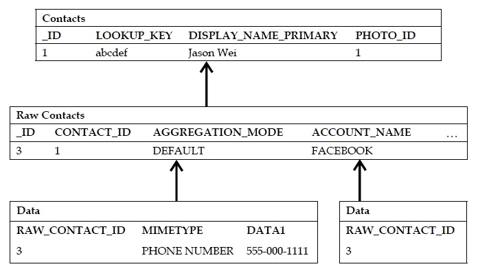
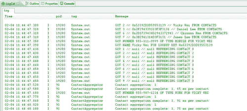

# 第五章：查询联系人表

在本书前面，我们探讨了如何通过重写`SQLiteOpenHelper`类为我们的应用程序构建一个 SQLite 数据库。然后，我们通过引入`ContentProvider`类扩展了对 Android 上数据库的理解，它允许我们将 SQLite 数据库暴露给外部应用程序，以及更一般地暴露给 Android 操作系统本身。

然而，尽管设计和实现你自己的数据库是一项强大的技能，但利用用户设备上现有的数据同样有益。通常，这意味着查询现有内容提供者以获取各种类型的数据，但尤其重要的是`联系人`内容提供者，到目前为止它是最常被查询的内容提供者。

在本章中，我们将首先探索`联系人`内容提供者的结构（即其模式），然后查看查询联系人和其相关元数据的不同方式。

# 联系人内容提供者结构

理解`联系人`内容提供者的模式架构是挑战的一半。由于潜在地与一个联系人关联的数据量很大，因此在设计一个既灵活又强大到足以满足每个用户需求的模式上，我们必须做了大量的工作。在下面的表格中，我勾勒出了这个模式是如何布局的，然后我们将从高层次上探讨这个模式是如何工作的，再深入到模式中的每个表：



所以你现在看到的就是这些——看起来并不是特别令人畏惧，对吧？当然，之前显示的列只是每个表中实际列的一个子集，但希望这足以让你了解这些表是如何协同工作的。如果你想查看每个表中的所有列，我建议你查看以下链接：

[Android 联系人数据提供者参考](http://developer.android.com/reference/android/provider/ContactsContract.Contacts.html)

[Android 联系人原始数据提供者参考](http://developer.android.com/reference/android/provider/ContactsContract.RawContacts.html)

[Android 联系人数据提供者参考](http://developer.android.com/reference/android/provider/ContactsContract.Data.html)

首先让我们从高层次思考这个模式。最顶层是`联系人`表。在之前版本的 Android（API 级别 4 及以下）中，这几乎是你可以使用的一切。它只是一个典型的、直观的`联系人`表，包含了每个联系人的唯一 ID 以及他们的姓名、电话号码、电子邮件等。

然后事情变得复杂了。突然间，Android 2.0（API 级别 5 及以上）出现了，用户可以将联系人同步到 Facebook、Twitter、谷歌以及众多其他服务。仅有一个简单的`Contacts`表还有意义吗？每个来源的每个联系人是否都是独立的一行？我们如何知道哪些行实际上指的是同一个联系人？

因此，谷歌不得不开发一个引用`Contacts`表的第二层表格——这些表格被称为`Raw Contacts`。用户拥有的每个联系人都是由原始联系人汇总而成的，其中每个原始联系人代表来自特定来源的单个联系人。例如，你有一个朋友，并且你已经将这个联系人同步到了 Facebook 和 Twitter。这位朋友就会有两组`Raw Contact`表格，一组描述了他/她在 Facebook 的元数据，另一组描述了他/她在 Twitter 的元数据。这两个原始联系人都会指向`Contacts`表中的单一条目。

但是等等，之前每个联系人的元数据基本上限于几个电话号码和电子邮件，现在由于社交网络，每个联系人都有大量的元数据可用。我们如何存储所有这些元数据？每个联系人的最新状态消息或最新推文？我们是否只需要一个拥有大约三十列的巨大`Raw Contacts`表？

最好不要——这很可能不是内存的好用法，因为那个表格可能会相当稀疏。因此，谷歌团队决定创建一个第三层表格，称为`Data`表。这些`Data`表都引用一个原始联系人，后者再次引用一个联系人。因此，在 Android 操作系统中描述联系人的方式基本上是这样的：一个联系人是特定于各个来源（即 Facebook 或 Twitter）的原始联系人的汇总，每个原始联系人又是一组独立数据表的汇总，每个数据表包含一种类型的数据（即电话号码、电子邮件、状态消息等）。这是发生的事情的高级视图，下一节我们将探讨如何实际查询这些表以获取常见字段，如电话号码和电子邮件。

现在，有许多技术细节可以完全描述架构中发生的事情，但现在我将以此节的一个简短讨论结束，介绍原始联系人之间实际如何进行汇总。

系统会自动汇总原始联系人，因此每次你创建新联系人或同步新账户到现有联系人时，都会以`DEFAULT`聚合模式创建一个原始联系人，这告诉系统将这个原始联系人与其他引用同一联系人的原始联系人进行汇总。但你可以明确指定你想要对该原始联系人进行的汇总类型，以下是可以选择的选项：

+   `AGGREGATION_MODE_DEFAULT` 允许自动汇总的默认状态

+   `AGGREGATION_MODE_DISABLED` 不允许自动聚合，原始联系人将不会被聚合

+   `AGGREGATION_MODE_SUSPENDED` 自动聚合被禁用，但是，如果原始联系人之前已经聚合，那么它将保持聚合状态

这三种是聚合模式，你可以针对每个原始联系人进行更新和调整。至于聚合是如何完成的，它主要是通过匹配名字和/或昵称来完成的，如果没有名字，那么将尝试使用电话号码和电子邮件进行匹配。

到目前为止，你应该对`Contacts`内容提供者的样子有了相当的了解，因此我们将继续看一些代码！

# 查询联系人

首先，让我们从一个简单的查询开始，这个查询针对的是`Contacts`表，并返回联系人 ID，每个联系人的名字（请记住，这是一个聚合的显示名称），以及他们的`lookup`键。这个`lookup`键对于`Contacts`内容提供者来说是一个相对较新的概念，它被设计成比使用传统的行 ID 更可靠的方式来引用`Contacts`。

这是因为行 ID 往往不可靠，特别是对于像`Contacts`内容提供者这样的内容提供者，它可能有多个应用程序引用，并可能同时对其进行更新。假设你尝试通过其行 ID 引用联系人，但用户设备上的另一个应用程序之前已经对`Contacts`数据库进行了更改，以至于该行 ID 的联系人现在不同了，或者可能现在它已经不再那里了！相反，`lookup`键是每个原始联系人的服务器端标识符的串联（换句话说，它是原始联系人元数据的一个函数），将更加稳定。但解释就到这里，让我们看看一个简单查询可能长什么样：

```kt
public class ContactsQueryActivity extends Activity {
@Override
protected void onCreate(Bundle savedInstanceState) {
super.onCreate(savedInstanceState);
setContentView(R.layout.main);
/*
* QUERY EXAMPLE
*/
// FIRST QUERY FOR CONTACT LOOKUPS
Cursor c = getContentResolver().query(
ContactsContract.Contacts.CONTENT_URI,
new String[] { ContactsContract.Contacts._ID, ContactsContract.Contacts.DISPLAY_NAME, ContactsContract.Contacts.LOOKUP_KEY }, ContactsContract.Contacts.DISPLAY_NAME + " IS NOT NULL", null, null);
startManagingCursor(c);
int idCol = c.getColumnIndex(Contacts._ID);
int nameCol = c.getColumnIndex(Contacts.DISPLAY_NAME);
int lookCol = c.getColumnIndex(Contacts.LOOKUP_KEY);
// USE A MAP TO KEEP TRACK OF LOOKUP VALUES
Map<String, String> lookups = new HashMap<String, String>();
while (c.moveToNext()) {
int id = c.getInt(idCol);
String name = c.getString(nameCol);
String lookup = c.getString(lookCol);
lookups.put(name, lookup);
System.out.println("GOT " + id + " // " + lookup + " // " + name + " FROM CONTACTS");
}
}
}

```

因此，这里我们像上一章一样获取内容解析器，并传入`Contacts CONTENT_URI`。然后，我们遍历游标并获取我们在投影数组中请求的字段。注意，我还使用了一个`Map`来跟踪每个联系人的`lookup`键。在我的例子中，我将键设置为联系人的显示名称，但你可以使用任何你喜欢的数据结构来存储`lookup`键和/或联系人 ID。

如果你已经知道你的联系人的`lookup`键（可能它之前已经被缓存在某个地方），那么你可以使用以下代码片段中的`lookup`键直接访问联系人：

```kt
// ALTERNATIVELY - USE LOOKUP KEY LIKE THIS
Uri lookupUri = Uri.withAppendedPath( Contacts.CONTENT_LOOKUP_URI, lookups.get("Vicky Wei"));
Cursor c3 = getContentResolver().query(lookupUri, new String[] { Contacts.DISPLAY_NAME }, null, null, null);
if (c3.moveToFirst()) {
int nameCol = c3.getColumnIndex(Contacts.DISPLAY_NAME);
String displayName = c3.getString(nameCol);
System.out.println("GOT NAME " + displayName + " FOR LOOKUP KEY " + lookups.get("Vicky Wei"));
}
c3.close();

```

所以，在这里我们将`lookup`值附加到 URI 本身——类似于我们之前将行 ID 附加到标准内容 URI 以获取单个市民的方式。但是，这种方法的问题是，与传统的通过行 ID 匹配相比，通过`lookup`键匹配通常会有一些额外的开销。换句话说，你牺牲了一些速度性能，以获得更好的查询准确性。然而，Android 为你提供了另一种方法，旨在让你既提高准确性又提高性能：

```kt
Uri lookupUri = getLookupUri(contactId, lookupKey)

```

这个方法允许你首先通过联系人 ID 查找联系人——这是一个更快且仍然相当可靠的方法。但是，如果系统未能通过该联系人 ID 找到联系人，它会转而使用`lookup`键。在任何一种情况下，只要联系人存在，你就能保证获取到该联系人的正确`lookup`URI，但通常使用这种方法会给你带来很好的性能提升，而不会牺牲任何准确性。

既然你已经有了联系人 ID、`lookup`键和他们的名字，那么你如何查询更具体的元数据——比如他们的电话号码或电子邮件？让我们看看以下示例，其中我通过过滤他们的`lookup`键来请求联系人的电话号码和电话类型：

```kt
// THEN WITH LOOKUP KEYS - FIND SPECIFIC DATA FIELDS
Cursor c2 = getContentResolver().query( ContactsContract.Data.CONTENT_URI,
new String[] { ContactsContract.CommonDataKinds.Phone.NUMBER, Phone.TYPE },ContactsContract.Data.LOOKUP_KEY + "=?", new String[] { lookups.get("Vicky Wei") }, null);
startManagingCursor(c2);
int numberCol = c2.getColumnIndex(Phone.NUMBER);
int typeCol = c2.getColumnIndex(Phone.TYPE);
if (c2.moveToFirst()) {
String number = c2.getString(numberCol);
int type = c2.getInt(typeCol);
String strType = "";
switch (type) {
case Phone.TYPE_HOME:
strType = "HOME";
break;
case Phone.TYPE_MOBILE:
strType = "MOBILE";
break;
case Phone.TYPE_WORK:
strType = "WORK";
break;
default:
strType = "MOBILE";
break;
}
System.out.println("GOT NUMBER " + number + " OF TYPE " + strType + " FOR VICKY WEI");
}

```

请注意，我们省略了到`Phone`和`Data`类的完整包路径，以再次让你了解架构的层次性质。在这里，由于我们现在针对的是`Data`表而不是`Contact`表，因此我们传递相应的`Data CONTENT_URI`。然后在投影参数中，我们请求电话号码以及电话类型，在选择参数中我确保通过`lookup`键进行过滤。成功查询后，我们只需移动光标（此时只有一个与 Vicky 相关的号码；否则，我们将使用`while`循环）并再次获取字段。注意，我们编写了一个简单的`switch`语句，它允许我们将作为整数返回的`PHONE_TYPE`转换成更友好的字符串。

最后但同样重要的是，让我们看看如何查询`Raw Contacts`表：

```kt
// NOW LOOK AT RAW CONTACT IDS
c = getContentResolver().query(
ContactsContract.RawContacts.CONTENT_URI,
new String[] { ContactsContract.RawContacts._ID, RawContacts.ACCOUNT_NAME, RawContacts.ACCOUNT_TYPE, RawContacts.CONTACT_ID }, null, null, null);
startManagingCursor(c);
int rawIdCol = c.getColumnIndex(RawContacts._ID);
int accNameCol = c.getColumnIndex(RawContacts.ACCOUNT_NAME);
int accTypeCol = c.getColumnIndex(RawContacts.ACCOUNT_TYPE);
int contactIdCol = c.getColumnIndex(RawContacts.CONTACT_ID);
while (c.moveToNext()) {
int rawId = c.getInt(rawIdCol);
String accName = c.getString(accNameCol);
String accType = c.getString(accTypeCol);
int contactId = c.getInt(contactIdCol);
System.out.println("GOT " + rawId + " // " + accName + " // " + accType + " REFRENCING CONTACT " + contactId);
}

```

这特别适用于如果你想查看特定来源（比如你只想了解 Facebook 上该联系人的元数据）的联系人元数据。那么你可能会通过`ACCOUNT_NAME`或`ACCOUNT_TYPE`过滤`Raw Contacts`表，一旦你获得了与特定来源相关联的原始联系人 ID，你就可以查询与这些特定原始联系人 ID 相关联的`Data`表中的任何元数据！

现在，让我们快速了解一下如何修改联系人数据——更具体地说，是如何插入和更新联系人数据。需要注意的是，为了成功运行这些活动，我们将在`Android Manifest`文件中请求特殊权限。但现在，让我们继续关注代码，并确保在最后详细探讨所有权限问题。

# 修改联系人

以下示例的代码应该看起来非常熟悉。正如我之前所说，挑战的一半在于掌握模式并理解每个表如何与其他表交互（如果之前没有像这样展开模式，可能会非常困惑，可能需要浏览大量详细的文档）。假设我们想要为用户插入一个新的电话号码。我们应该引用哪个表的 URI 呢？

好吧，它必须是`Data`表中的一个，我们可能还需要传递数据的`MIMETYPE`，以便内容提供者确切知道要在哪个`Data`表中插入新行。在这种情况下，我们将指定电话内容类型，并传递一个数字和数字类型。我们唯一缺少的字段是 ID——这个新行应该进入哪个联系人的电话`Data`表？回想一下，每个`Data`表都指向一个`Raw Contact`表，传递相应联系人的原始联系人 ID 是合理的。

因此，我们尝试对每一个需要进行的插入、更新或删除操作都重复这一思考过程，最终代码如下所示：

```kt
public class ContactsQueryActivity extends Activity {
@Override
protected void onCreate(Bundle savedInstanceState) {
super.onCreate(savedInstanceState);
setContentView(R.layout.main);
/*
* INSERT EXAMPLE
*/
ContentValues values = new ContentValues();
// IN THIS CASE - EACH RAW ID IS JUST THE CONTACT ID
values.put(ContactsContract.Data.RAW_CONTACT_ID, 2);
values.put(Data.MIMETYPE, Phone.CONTENT_ITEM_TYPE);
values.put(Phone.NUMBER, "555-987-1234");
values.put(Phone.TYPE, Phone.TYPE_WORK);
Uri contactUri = getContentResolver().insert( Data.CONTENT_URI, values);
Cursor c4 = getContentResolver().query(contactUri, new String[] { Phone.NUMBER, Phone.TYPE }, null, null, null);
startManagingCursor(c4);
// READ BACK THE ROW
if (c4.moveToFirst()) {
String number = c4.getString(numberCol);
int type = c4.getInt(typeCol);
String strType = "";
switch (type) {
case Phone.TYPE_HOME:
strType = "HOME";
break;
case Phone.TYPE_MOBILE:
strType = "MOBILE";
break;
case Phone.TYPE_WORK:
strType = "WORK";
break;
default:
strType = "MOBILE";
break;
}
System.out.println("GOT NUMBER " + number + " OF TYPE " + strType + " FOR VICKY WEI");
}
}
}

```

在这里，我们使用内容解析器和一个`ContentValues`对象进行标准的插入操作。一旦我们插入了它，系统会返回新插入行的 URI，然后我们只需对该 URI 运行查询，并读取我们刚刚插入的数据，以验证插入是否成功。以下面的截图我会指出这一点。

现在，谷歌的开发者们提倡另一种插入方式，即使用批量插入。这是 Android 操作系统中的另一个相对较新的概念，是传统`ContentValues`类的一个变体。通过使用批量操作，你不仅可以一次性插入多行时获得相当大的性能提升（节省了从客户端到服务器端切换的时间），而且还能保证插入的**原子性**。这是一个花哨的数据库术语，意思是所有行要么全部插入，要么都不插入，这样如果在插入过程中发生错误，系统将确保回滚之前的插入，以保持数据库的一致性。

这些批量插入的语法如下所示，非常直观：

```kt
// NOW INSERT USING BATCH OPERATIONS
ArrayList<ContentProviderOperation> ops = new ArrayList<ContentProviderOperation>();
ops.add(ContentProviderOperation.newInsert(Data.CONTENT_URI)
.withValue(Data.RAW_CONTACT_ID, 3)
.withValue(Data.MIMETYPE, Email.CONTENT_ITEM_TYPE)
.withValue(Email.DATA, "daniel@stanford.edu")
.withValue(Email.TYPE, Email.TYPE_WORK)
.build());
try {
getContentResolver().applyBatch (ContactsContract.AUTHORITY, ops);
} catch (Exception e) {
e.printStackTrace();
System.out.println("ERROR: BATCH TRANSACTION FAILED");
}

```

为了结束本章内容，我们将快速了解一下如何使用这种新的批量操作机制来更新联系人的电子邮件：

```kt
/*
* UPDATE EXAMPLE
*/
ops = new ArrayList<ContentProviderOperation>();
ops.add(ContentProviderOperation.newUpdate(Data.CONTENT_URI)
.withSelection(Data.RAW_CONTACT_ID + "=? AND " + Email.TYPE + "=?",new String[] { "7", String.valueOf(Email. TYPE_WORK) }).withValue(Email.DATA,"james@android.com"). build());
try {
getContentResolver().applyBatch( ContactsContract.AUTHORITY, ops);
} catch (Exception e) {
e.printStackTrace();
System.out.println("ERROR: BATCH TRANSACTION FAILED");
}

```

就是这样！再次，我们认为我们可能需要指定原始联系人 ID，以便内容提供者知道要更新哪个`Data`表，以及`Data`表的`MIMETYPE`，以便内容提供者知道要更新哪个`Data`表。至于本节中所有查询、插入和更新的结果，请参考以下内容：



首先，我们看到了我的联系人列表中的所有联系人以及他们的`lookup`键、ID 和显示名称。然后，我们看到了从 Vicky 那里获取的电话号码，以及通过她的`lookup`键而不是联系人 ID 查找她的结果，以及对我们查询`Raw Contacts`表的跟进。注意，对于账户名称和账户类型，你会看到一堆空值，但这只是我在模拟器上运行代码的结果。当你尝试在完全同步且实时的联系人列表上运行代码时，预计会看到更多丰富多彩的结果。最后，我们只是看到了我们插入和更新的一些结果，并且可以通过实际查看联系人列表中的联系人来进一步验证我们的插入/更新是否成功，如下所示：


在这里，我们可以看到我们已经成功为联系人 Vicky 插入了一个工作号码，然后对于 Daniel，我们看到了以下内容：


这样，他现在确实有一个与我们指定的工作电子邮件地址正确对应的工作电子邮件。就是这样！希望现在你能够对`Contacts`内容提供者的架构以及构建有效查询或插入的通用语法有一个深入的理解。在考虑要传递哪些字段以及你真正想要查询的表时，请记住保持架构在心中。

# 设置权限

现在我们已经掌握了在不声明适当权限的情况下使用`Contacts`内容提供者的方法，你可能发现在尝试运行前面的代码时遇到了一些粗鲁的强制关闭。为了保护用户的个人联系人信息，防止潜在恶意应用程序的侵犯，Android 操作系统要求你在应用程序的`Android Manifest`文件中声明一些读取和写入权限。要做到这一点，你只需要在清单文件中添加以下两行内容：

```kt
<?xml version="1.0" encoding="utf-8"?>
<manifest 
package="jwei.apps.dataforandroid"
android:versionCode="1"
android:versionName="1.0">
<application android:icon="@drawable/icon" android:label= "@string/app_name">
<activity android:name=".ch5.ContactsQueryActivity" android:label="@string/app_name">
<intent-filter>
<action android:name="android.intent.action.MAIN" />
<category android:name="android.intent.category.LAUNCHER" />
</intent-filter>
</activity>
</application>
<uses-sdk android:minSdkVersion="5" />
<uses-permission android:name="android.permission.READ_CONTACTS"/>
<uses-permission android:name="android.permission.WRITE_CONTACTS"/> 
</manifest>

```

所以基本上，你只需要在清单文件中声明你希望既能读取也能写入（即修改）联系人（或者根据你的应用程序需求只声明其中一个）。这样，在用户下载你的应用程序之前，系统会提示用户你的应用程序需要这些权限，只要用户接受，你的应用程序就可以运行了！

# 概述

在本章中，我们通过掌握每个应用在每个设备上都可以使用的最广泛使用的内容提供者——`Contacts`内容提供者，扩展了我们对内容提供者的知识。我们从查看`Contacts`内容提供者的模式开始，由于各种社交网络来源，与给定联系人关联的元数据越来越多，这一模式变得日益复杂。为了解决这个问题，谷歌的团队决定通过一个简单称为`Contacts`表的一级表，接着是称为`Raw Contact`表的二级表，然后是简单称为`Data`表的三级表，来改变模式。每个联系人然后是一个特定于源（即 Facebook 或 Twitter）的原始联系人组的聚合，每个原始联系人又是一系列`Data`表的聚合，每个表都有自己的数据类型（即电话号码或电子邮件）。

之后，我们探讨了多种查询`Contacts`内容提供者的方法，以及多种在内容提供者中插入和更新现有联系人的方法。这在代码上相对简单（与我们之前章节看到的非常相似），再次证明了半数战斗在于理解模式并确保我们包含了所有适当的字段。

到目前为止，在这本书中，我们已经探讨了查询自己的以及外部数据库的方法，但每次我们都依赖于简单的系统打印语句来实际查看查询结果（我相信到现在你已经厌倦了看 DDMS 日志）。因此问题变成了——既然我已经知道如何实际构建和查询数据库，那么我应该如何设计活动，以便将这数据绑定到用户界面供用户查看和交互？这将是我们在下一章关注的重点，我们将探讨如何通过用户界面与数据库进行绑定和交互。
