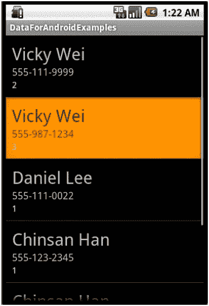
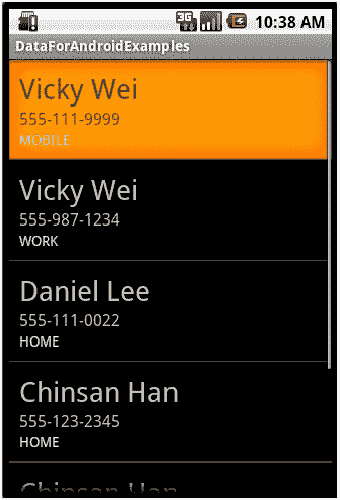

# 第六章：绑定到用户界面

在之前的五章中，我们已经涵盖了大量的内容——从轻量级数据存储形式（如`SharedPreferences`）到更重量级的数据存储形式（如 SQLite 数据库）。但是，对于每种数据存储方法和我们查看的每个示例——为了实际查看查询结果和后端数据操作的结果，我们不得不依赖非常简单的系统 IO 打印命令。

然而，作为移动开发者，我们的应用程序通常需要美观地显示这些数据查询的结果，同时也需要为用户提供直观的界面来存储和插入数据。

在本章中，我们将关注前者——将数据绑定到用户界面（UI），并特别关注各种允许我们以列表形式绑定数据的类（这是显示数据行最常见和直观的方式）。

# `SimpleCursorAdapters`和`ListViews`

在 Android 上有两种主要的数据检索方式，每种方式都有自己的`ListAdapters`类，这些类将知道如何处理和绑定传入的数据。我们熟悉的第一个数据检索方式是通过查询并获得`Cursor`对象。围绕`Cursor`的`ListAdapters`的子类被称为`CursorAdapter`，在下一节中，我们将关注`SimpleCursorAdapter`，这是`CursorAdapter`最直接的实例。

正如我们所知，`Cursor`指向包含我们查询结果的行子表。通过遍历这个游标，我们能够检查每一行的字段，在之前的章节中，我们打印出了这些字段的值以检查返回的子表。现在，我们希望将子表的每一行转换为我们列表中对应的行。实现这一目标的第一步是设置一个`ListActivity`（更常见的`Activity`类的一个变体）。

顾名思义，`ListActivity`只是`Activity`类的一个子类，它带有允许你附加`ListAdapters`的方法。`ListActivity`类还允许你膨胀 XML 布局，这些布局包含列表标签。在我们的示例中，我们将使用一个非常基础的 XML 布局（名为`list.xml`），它只包含一个`ListView`标签，如下所示：

```kt
<?xml version="1.0" encoding="utf-8"?>
<LinearLayout 
android:orientation="vertical"
android:layout_width="fill_parent"
android:layout_height="wrap_content" >
<ListView
android:id="@android:id/android:list"
android:layout_width="fill_parent"
android:layout_height="wrap_content" />
</LinearLayout>

```

这是设置 Android 中所谓的`ListView`的第一步。类似于定义`TextView`允许你在`Activity`中看到一个文本块，定义`ListView`将允许你与`Activity`中的可滚动行对象列表进行交互。

直观地，你脑海中接下来应该的问题是：我在哪里定义每一行实际的样子？你不仅需要在某个地方定义实际的列表对象，而且每一行都应该有自己的布局。因此，为此我们在布局目录中创建了一个单独的`list_entry.xml`文件。

我即将使用的示例是查询`Contacts`内容提供者并返回一个列表，其中包含每个联系人的姓名、电话号码和电话号码类型。因此，我的列表中的每一行都应该包含三个`TextView`，每个数据字段一个。随后，我的`list_entry.xml`文件如下所示：

```kt
<?xml version="1.0" encoding="utf-8"?>
<LinearLayout 
android:orientation="vertical"
android:layout_width="fill_parent"
android:layout_height="wrap_content"
android:padding="10dip" >
<TextView
android:id="@+id/name_entry"
android:layout_width="wrap_content"
android:layout_height="wrap_content"
android:textSize="28dip" />
<TextView
android:id="@+id/number_entry"
android:layout_width="wrap_content"
android:layout_height="wrap_content"
android:textSize="16dip" />
<TextView
android:id="@+id/number_type_entry"
android:layout_width="wrap_content"
android:layout_height="wrap_content"
android:textColor="#DDD"
android:textSize="14dip" />
</LinearLayout>

```

所以我们有一个垂直的`LinearLayout`，包含三个`TextView`，每个都有自己的正确定义的 ID 以及自己的审美属性（即文本大小和文本颜色）。

在设置方面——这就是我们所需要的全部！现在我们只需要创建`ListActivity`本身，加载`list.xml`布局，并指定适配器。为了了解如何完成所有这些操作，让我们先看一下代码，然后逐块分解：

```kt
public class SimpleContactsActivity extends ListActivity {
@Override
public void onCreate(Bundle savedInstanceState) {
super.onCreate(savedInstanceState);
setContentView(R.layout.list);
// MAKE QUERY TO CONTACT CONTENTPROVIDER
String[] projections = new String[] { Phone._ID, Phone.DISPLAY_NAME, Phone.NUMBER, Phone.TYPE };
Cursor c = getContentResolver().query(Phone.CONTENT_URI, projections, null, null, null);
startManagingCursor(c);
// THE DESIRED COLUMNS TO BE BOUND
String[] columns = new String[] { Phone.DISPLAY_NAME, Phone.NUMBER, Phone.TYPE };
// THE XML DEFINED VIEWS FOR EACH FIELD TO BE BOUND TO
int[] to = new int[] { R.id.name_entry, R.id.number_entry, R.id.number_type_entry };
// CREATE ADAPTER WITH CURSOR POINTING TO DESIRED DATA
SimpleCursorAdapter cAdapter = new SimpleCursorAdapter(this, R.layout.list_entry, c, columns, to);
// SET THIS ADAPTER AS YOUR LIST ACTIVITY'S ADAPTER
this.setListAdapter(cAdapter);
}
}

```

那么这里发生了什么？嗯，代码的第一部分你现在应该已经熟悉了——我们只是在手机的联系人列表上执行查询（特别是针对联系人内容提供者的`Phone`表），并请求联系人的姓名、号码和号码类型。

接下来，`SimpleCursorAdapter`有两个参数，一个是字符串数组，一个是整数数组，它们代表`Cursor`列与 XML 布局视图之间的映射关系。在我们的例子中，如下所示：

```kt
// THE DESIRED COLUMNS TO BE BOUND
String[] columns = new String[] { Phone.DISPLAY_NAME, Phone.NUMBER, Phone.TYPE };
// THE XML DEFINED VIEWS FOR EACH FIELD TO BE BOUND TO
int[] to = new int[] { R.id.name_entry, R.id.number_entry, R.id.number_type_entry };

```

这样，`DISPLAY_NAME`列中的数据就会被绑定到 ID 为`name_entry`的`TextView`上，依此类推。定义好这些映射关系后，下一步就是实例化`SimpleCursorAdapter`，这在以下这行代码中可以看到：

```kt
// CREATE ADAPTER WITH CURSOR POINTING TO DESIRED DATA
SimpleCursorAdapter cAdapter = new SimpleCursorAdapter(this, R.layout.list_entry, c, columns, to);

```

现在，`SimpleCursorAdapter`接受五个参数——第一个是`Context`，它基本上告诉`CursorAdapter`需要绑定行的父`Activity`。下一个参数是之前定义的 R 布局的 ID，这将告诉`CursorAdapter`每一行应该是什么样子，以及它可以在哪里加载相应的视图。接下来，我们传递`Cursor`，它告诉适配器底层数据实际是什么，最后，我们传递映射关系。

希望之前的代码是有意义的，`SimpleCursorAdapter`的参数也应该是有意义的。上一个`Activity`的结果可以在以下屏幕截图中看到：



所有内容看起来都很好，除了电话号码下面漂浮的这些随机整数。为什么在每一行类型应该出现的地方有一堆 1、2、3 呢？回想一下前一章，电话号码类型不是作为字符串返回的，而是作为整数返回的。从那里通过一个简单的`switch`语句，我们可以很容易地将这些整数转换成更具描述性的字符串。

然而，你会很快发现，在我们非常简单直接地使用内置的`SimpleCursorAdapter`类时，我们没有任何地方可以实施任何允许我们将返回的整数转换为字符串的“特殊”逻辑。这正是重写`SimpleCursorAdapter`类变得必要的时候，因为只有这样我们才能完全控制如何在每一行中显示游标的数据。因此，我们继续下一部分，那里我们会看到这一点。

# 自定义`CursorAdapter`

在这一部分，我们将扩展`SimpleCursorAdapter`并尝试编写我们自己的`CursorAdapter`类，这将让我们在如何显示底层数据方面有更大的灵活性。我们自定义类的目标很简单——不是将电话号码类型显示为整数，而是找到一种方法将它们显示为可读的字符串。

在扩展`SimpleCursorAdapter`类之后，我们将需要重写并实现`newView()`方法，最重要的是`bindView()`方法。可选地，我们还可以自定义我们的构造函数，根据你的实现，这对于缓存和提高性能可能很有用（我们稍后会看到一个例子）。

在这里的概念是，每当一个新的行在 Android 设备的屏幕上实际显示时，`newView()`方法就会被调用。这意味着当用户在 Activity 的列表中滚动，并且新的行首次出现在设备的屏幕上时，这个`newView()`方法将被触发。因此，这个`newView()`的功能应该保持相对简单。在我的实现中，这意味着在给定上下文的情况下，我会请求相关的`LayoutInflater`类，并使用它来填充新行的布局（如在`list_entry.xml`中定义的）。

逻辑的核心随后在`bindView()`方法中发生。一旦调用了`newView()`方法并且行的实际布局初始化后，接下来被调用的方法就是`bindView()`。这个方法接收之前实例化的新 View 对象以及属于这个适配器类的`Cursor`作为参数。需要注意的是，传递进来的`Cursor`已经移动到了正确的索引位置。换句话说，适配器足够智能，能够传递给你一个指向与你正在创建的布局行相对应的数据行的`Cursor`！当然，没有看到代码并排比较，很难理解和看到这些方法。因此，在我继续之前，让我们快速地看一下：

```kt
public class CustomContactsAdapter extends SimpleCursorAdapter {
private int layout;
public CustomContactsAdapter(Context context, int layout, Cursor c, String[] from, int[] to) {
super(context, layout, c, from, to);
this.layout = layout;
}
@Override
public View newView(Context context, Cursor cursor, ViewGroup parent) {
final LayoutInflater inflater = LayoutInflater.from(context);
View v = inflater.inflate(layout, parent, false);
return v;
}
@Override
public void bindView(View v, Context context, Cursor c) {
int nameCol = c.getColumnIndex(Phone.DISPLAY_NAME);
int numCol = c.getColumnIndex(Phone.NUMBER);
int typeCol = c.getColumnIndex(Phone.TYPE);
String name = c.getString(nameCol);
String number = c.getString(numCol);
int type = c.getInt(typeCol);
String numType = "";
switch (type) {
case Phone.TYPE_HOME:
numType = "HOME";
break;
case Phone.TYPE_MOBILE:
numType = "MOBILE";
break;
case Phone.TYPE_WORK:
numType = "WORK";
break;
default:
numType = "MOBILE";
break;
}
// FIND THE VIEW AND SET THE NAME
TextView name_text = (TextView) v.findViewById (R.id.name_entry);
name_text.setText(name);
TextView number_text = (TextView) v.findViewById (R.id.number_entry);
number_text.setText(number);
TextView type_text = (TextView) v.findViewById
(R.id.number_type_entry);
type_text.setText(numType);
}
}

```

同样，你会注意到 `newView()` 方法的实现非常直接。你还会发现传递进来的 Context 对于每新增的一行是相同的——这意味着每次调用此方法时，实际上我请求的是同一个 `LayoutInflater` 对象。尽管在这个案例中没有明显差异，但像这样的小细节（即，不是持续请求相同的资源）是你可以优化列表性能的小方法。在这里，通过在构造函数中实例化一次 `LayoutInflater` 并每次重用它，我们可能节省了数百次不必要的请求。虽然这可能看起来是一个非常小的优化，但请记住，当涉及到列表时，尤其是在移动设备上，用户期望它们能够非常快速和响应迅速。随着时间的推移，一个卡顿的列表常常会成为用户的巨大烦恼，并且通常表示应用程序编写得不好。

现在来看 `bindView()` 方法。同样，流程是首先调用 `newView()` 并实例化新的一行，然后调用 `bindView()` 并传递这个新行的布局视图。这里我们也传递了一个 `Cursor` 对象，但重要的是要注意 `Cursor` 实际上指向的是下一行数据。换句话说，`Cursor` 并没有指向查询子表的第一行，而是指向单一行，并在幕后相应地递增。这就是我所说的 `CursorAdapter` 类是一个很好的类来使用，因为它如何为你处理底层的 `Cursor`，当列表上下滚动时。

至于我们绑定逻辑——非常简单。给定一个 `Cursor`，我们请求相应的字段及其各自值，由于我们也传递了那一行的 View 对象，我们只需要为每个 `TextView` 设置正确的字符串值。但是，请注意，这里我们有灵活性插入额外的逻辑，这允许我们处理电话号码类型作为整数返回的事实。因此，我们自然在这里包含了一个 switch 语句，而不是将整数设置到 `type_text TextView` 中，我们设置了一个可读的字符串值！

现在，尽管这个例子非常简单，但这个练习的目标是了解通过扩展 `SimpleCursorAdapter` 类并实现我们自己的 `CursorAdapter`，我们可以覆盖 `bindView()` 方法，并使用传递进来的 View 和 `Cursor` 对象以我们希望的任何方式自定义行的显示！

至于如何在实际中使用你自定义的 `CursorAdapter` 替换前面的 `SimpleCursorAdapter` 示例，只需替换以下这行代码：

```kt
SimpleCursorAdapter cAdapter = new SimpleCursorAdapter(this, R.layout.list_entry, c, columns, to);

```

以及这一行：

```kt
CustomContactsAdapter cAdapter = new CustomContactsAdapter(this, R.layout.list_entry, c, columns, to);

```

那么最后这一切看起来如何呢？让我们快速看一下：



在这里，我们看到在每一行中，我们不是简单地显示电话号码的整数类型，而是可以按需看到实际的易读字符串类型！现在看起来好多了。

# 基础适配器（BaseAdapters）和自定义基础适配器（Custom BaseAdapters）

之前我们提到，通常有两种方式来检索数据——第一种是`Cursor`对象的形式，第二种是对象列表的形式。在本节中，我们将关注后一种检索和处理数据的方法，以及如何将对象列表转换为可查看的数据行。

那么，在什么情况下我们实际上会有一个对象列表，而不是`Cursor`呢？到目前为止，我们的所有关注点都集中在构建 SQLite 数据库和内容提供者上，在所有情况下我们都返回了一个`Cursor`。但是，正如我们将在后续章节中看到的，数据存储实际上并不总是在移动设备端完成，而是在外部数据库完成。

在这些情况下，获取数据并不像简单地执行 SQLite 查询那么容易，而是需要通过网络通过 HTTP 请求来完成。此外，一旦获取到数据，它很可能是某种字符串格式（通常是 XML 或 JSON——关于这一点稍后会详细介绍），而不是解析这个字符串以获取数据，然后将其插入到 SQLite 数据库中，通常你会将每个字符串简单地转换为一个对象，并将其存储在标准列表中。为了处理对象列表，Android 有一种名为`BaseAdapter`的`ListAdapter`，我们将在本节中重写并剖析它。

让我们举一个简单的例子，这里有一个联系人对象列表（为了简化，我们称这个类为`ContactEntry`），与之前的例子一样，它包含姓名、电话号码和电话号码类型字段。这段代码如下所示：

```kt
public class ContactEntry {
private String mName;
private String mNumber;
private String mType;
public ContactEntry(String name, String number, int type) {
mName = name;
mNumber = number;
String numType = "";
switch (type) {
case Phone.TYPE_HOME:
numType = "HOME";
break;
case Phone.TYPE_MOBILE:
numType = "MOBILE";
break;
case Phone.TYPE_WORK:
numType = "WORK";
break;
default:
numType = "MOBILE";
break;
}
mType = numType;
}
public String getName() {
return mName;
}
public String getNumber() {
return mNumber;
}
public String getType() {
return mType;
}
}

```

在这里，你会注意到在`ContactEntry`的构造函数中，我将整数类型直接转换为了可读的字符串类型。至于实现，我们创建了自己的`ContactBaseAdapter`类并扩展了`BaseAdapter`类，使我们能够覆盖`getView()`方法。

从概念上讲，`BaseAdapter`与`CursorAdapter`非常相似，区别在于我们传递并保持的是一个对象列表，而不是`Cursor`。这仅仅是在`BaseAdapter`的构造函数中完成，此时我们保存了对该对象列表的私有指针，并可以选择围绕该列表编写一系列包装方法（即`getCount(), getItem()`等）。同样，正如`CursorAdapter`类知道如何管理和遍历`Cursor`一样，`BaseAdapter`类也将知道如何给定的对象列表进行管理和遍历。

重点在于`BaseAdapter`的`getView()`方法。注意在`CursorAdapter`类中，我们既有`newView()`方法，也有`bindView()`方法。在这里，我们的`getView()`方法被设计来扮演这两个角色——实例化新的视图，在行之前为空的情况下，以及将数据绑定到旧的行，在行之前已经被填充的情况下。让我们快速查看代码，并尝试再次连接所有这些片段：

```kt
public class ContactBaseAdapter extends BaseAdapter {
// REMEMBER CONTEXT SO THAT IT CAN BE USED TO INFLATE VIEWS
private LayoutInflater mInflater;
// LIST OF CONTACTS
private List<ContactEntry> mItems = new ArrayList<ContactEntry>();
// CONSTRUCTOR OF THE CUSTOM BASE ADAPTER
public ContactBaseAdapter(Context context, List<ContactEntry> items) {
// HERE WE CACHE THE INFLATOR FOR EFFICIENCY
mInflater = LayoutInflater.from(context);
mItems = items;
}
public int getCount() {
return mItems.size();
}
public Object getItem(int position) {
return mItems.get(position);
}
public View getView(int position, View convertView, ViewGroup parent) {
ContactViewHolder holder;
// IF VIEW IS NULL THEN WE NEED TO INSTANTIATE IT BY INFLATING IT - I.E. INITIATING THAT ROWS VIEW IN THE LIST
if (convertView == null) {
convertView = mInflater.inflate(R.layout.list_entry, null);
holder = new ContactViewHolder();
holder.name_entry = (TextView) convertView.findViewById (R.id.name_entry);
holder.number_entry = (TextView) convertView. findViewById(R.id.number_entry);
holder.type_entry = (TextView) convertView.findViewById (R.id.number_type_entry);
convertView.setTag(holder);
} else {
// GET VIEW HOLDER BACK FOR FAST ACCESS TO FIELDS
holder = (ContactViewHolder) convertView.getTag();
}
// EFFICIENTLY BIND DATA WITH HOLDER
ContactEntry c = mItems.get(position);
holder.name_entry.setText(c.getName());
holder.number_entry.setText(c.getNumber());
holder.type_entry.setText(c.getType());
return convertView;
}
static class ContactViewHolder {
TextView name_entry;
TextView number_entry;
TextView type_entry;
}
}

```

首先，让我们看一下构造函数。注意我使用了之前提到的优化——即在构造函数中只实例化一次`LayoutInflater`，因为我知道在整个 Activity 中 Context 将保持不变。这样在实际运行 Activity 时，性能会有所提升。

现在，让我们看看这个`getView()`方法中发生了什么。这个方法的参数是行的位置、行的视图和父视图。我们首先需要检查的是当前行的视图是否为空——这将是在当前行之前没有被实例化时的情况，这种情况发生在当前行第一次出现在用户的屏幕上。如果是这样，那么我们就实例化和膨胀这个行的视图。否则，我们知道我们已经预先膨胀了这行的视图，只需要更新它的字段。

在这里，我们还利用了一个静态的`ContactViewHolder`类作为缓存。这种方法是由谷歌的 Android 团队推荐的（详情请见[`developer.android.com/resources/samples/ApiDemos/src/com/example/android/apis/view/List14.html`](http://developer.android.com/resources/samples/ApiDemos/src/com/example/android/apis/view/List14.html)），旨在提高列表的性能。视图的膨胀如下所示：

```kt
if (convertView == null) {
convertView = mInflater.inflate(R.layout.list_entry, null);
holder = new ContactViewHolder();
holder.name_entry = (TextView) convertView.findViewById (R.id.name_entry);
holder.number_entry = (TextView) convertView. findViewById(R.id.number_entry);
holder.type_entry = (TextView) convertView.findViewById (R.id.number_type_entry);
convertView.setTag(holder);
} else {
// GET VIEW HOLDER BACK FOR FAST ACCESS TO FIELDS
holder = (ContactViewHolder) convertView.getTag();
}

```

注意，当视图为空时，视图的膨胀过程相当标准——使用`LayoutInflater`类并告诉它膨胀哪个 R 布局。然而，一旦视图被膨胀，我们会创建一个`ContactViewHolder`类的实例，并为每个新膨胀的视图的`TextView`字段创建指针（在这种情况下——它们同样可以是`ImageViews`等）。一旦新的`ContactViewHolder`类完全初始化，我们通过将其设置为当前行的标签来关联它（可以将这个过程视为视图到持有者的映射，其中视图是键，持有者是值）。

如果视图不为空，那么我们只需要获取之前实例化视图的标签（再次，你可以将其视为请求一个键的值）。

一旦我们有了相应的`ContactViewHolder`，我们可以使用传入的位置获取列表中对应的`ContactEntry`对象。从那里，我们知道当前行引用的是哪个联系人，因此我们可以挖掘出姓名、号码和电话类型，然后相应地设置它们。

就是这样！让我们看看如何实现我们的`ContactBaseAdapter`：

```kt
public class CustomBaseAdapterActivity extends ListActivity {
@Override
public void onCreate(Bundle savedInstanceState) {
super.onCreate(savedInstanceState);
setContentView(R.layout.list);
// MAKE QUERY TO CONTACT CONTENTPROVIDER
String[] projections = new String[] { Phone._ID, Phone.DISPLAY_NAME, Phone.NUMBER, Phone.TYPE };
Cursor c = getContentResolver().query(Phone.CONTENT_URI, projections, null, null, null);
startManagingCursor(c);
List<ContactEntry> contacts = new ArrayList<ContactEntry>();
while (c.moveToNext()) {
int nameCol = c.getColumnIndex(Phone.DISPLAY_NAME);
int numCol = c.getColumnIndex(Phone.NUMBER);
int typeCol = c.getColumnIndex(Phone.TYPE);
String name = c.getString(nameCol);
String number = c.getString(numCol);
int type = c.getInt(typeCol);
contacts.add(new ContactEntry(name, number, type));
}
// CREATE ADAPTER USING LIST OF CONTACT OBJECTS
ContactBaseAdapter cAdapter = new ContactBaseAdapter(this, contacts);
// SET THIS ADAPTER AS YOUR LIST ACTIVITY'S ADAPTER
this.setListAdapter(cAdapter);
}
}

```

对于我们的目的来说，你可以忽略第一部分，因为我们实际上是在查询联系人内容提供者，获取结果`Cursor`，遍历它，并创建一个`ContactEntry`对象列表。显然这是愚蠢的，所以在你的实现中，假设你将直接获得一个对象列表。一旦我们有了这个列表，调用就很简单了：

```kt
// CREATE ADAPTER USING LIST OF CONTACT OBJECTS
ContactBaseAdapter cAdapter = new ContactBaseAdapter(this, contacts);

```

运行这段代码的结果与之前示例中的第二个截图完全一样（如预期）。

现在我们已经了解了`CursorAdapters`和`BaseAdapters`以及如何用代码实现每一个，让我们后退一步，考虑这两个类的潜在用例。

# 处理列表交互

在 Android 中，每个`ListView`的一个常见特性是用户应该经常能够选择列表中的一行，并期待某种附加功能。例如，你可能有一个餐厅列表，选择列表中的特定餐厅会带你到一个更详细的描述页面。这正是`ListActivity`类派上用场的地方，因为我们可以重写的一个方法是`onListItemClick()`。这个方法有几个参数，但最重要的是位置参数。

方法的完整声明如下：

```kt
@Override
protected void onListItemClick(ListView l, View v, int position, long id) { }

```

一旦我们有了位置索引，无论底层数据是`Cursor`还是对象列表，我们都可以使用这个位置索引来检索所需的行/对象。之前`CursorAdapter`的代码示例如下所示：

```kt
@Override
protected void onListItemClick(ListView l, View v, int position, long id) {
super.onListItemClick(l, v, position, id);
Cursor c = (Cursor) cAdapter.getItem(position);
int nameCol = c.getColumnIndex(Phone.DISPLAY_NAME);
int numCol = c.getColumnIndex(Phone.NUMBER);
int typeCol = c.getColumnIndex(Phone.TYPE);
String name = c.getString(nameCol);
String number = c.getString(numCol);
int type = c.getInt(typeCol);
System.out.println("CLICKED ON " + name + " " + number + " " + type);
}

```

同样，`BaseAdapter`示例的代码如下：

```kt
@Override
protected void onListItemClick(ListView l, View v, int position, long id) {
super.onListItemClick(l, v, position, id);
ContactEntry c = contacts.get(position);
String name = c.getName();
String number = c.getNumber();
String type = c.getType();
System.out.println("CLICKED ON " + name + " " + number + " " + type);
}

```

两者非常相似且不言自明。我们只需使用位置索引检索所需的行/对象，然后输出所需的字段。通常，开发者可能有一个单独的 Activity，在这里他们向用户提供了他们点击的行中的对象（即餐厅、联系人等）的更多详细信息。这可能需要从`ListActivity`传递行的 ID（或其他标识符）到新的详细信息 Activity，这是通过将字段嵌入到 Intent 对象中完成的——但这更多内容将在下一章介绍。

# 比较`CursorAdapter`和`BaseAdapter`

那么，在什么典型场景下，你会发现自己使用`BaseAdapter`而不是`CursorAdapter`，反之亦然？我们之前已经考虑了一些情况，但让我们花更多的时间来头脑风暴一些用例，以使你更加熟悉这两个`ListAdapters`以及何时在两者之间切换。

通常的规则是，当你的底层数据以`Cursor`的形式返回时，使用`CursorAdapter`；当你的数据可以以对象列表的形式返回或操作时，使用`BaseAdapter`。

这意味着对于大多数网络请求，当数据以长字符串的形式返回时（再次，有点提前说，但这个字符串通常会是 XML 或 JSON 格式），最好解析这个字符串并将其转换为对象。然后，这些对象可以存储在列表中，并传递给自定义的`BaseAdapter`。如果你调用外部 API，通常数据也会以 XML 或 JSON 格式返回，这也是通常的情况。如果想要缓存结果，则是例外情况。

缓存通常涉及在内存中更本地（或更快）的区域临时存储一些数据（对于 CPU 系统，这意味着将数据存储在 RAM 中而不是磁盘上，对于移动应用，这意味着将数据本地存储而不是通过网络持续请求外部数据）。如果你想缓存一些网络调用——无论是出于性能原因还是离线访问原因——那么建议的流程是进行你的网络请求，获取格式化的数据字符串，解析数据字符串，并将数据插入 SQLite 数据库（旨在模仿外部数据库）。然后，由于你的数据已经存储在 SQLite 数据库中，最好（也是最简单）的方法是快速查询并获取一个`Cursor`。

那么，如果你有一个静态的基本对象列表，比如字符串，该怎么办呢？如果你有一个预定义选项列表的固定目录，这通常就是这种情况。在这种情况下，`BaseAdapter`和`CursorAdapter`都显得过于复杂，你应该选择使用一种更简单的适配器，即`ArrayAdapter`。我尽量不花时间在这种`ListAdapter`上，因为它的使用非常简单，概念上也非常简单——如果你有一个静态的字符串数组，并且你想从中创建一个列表，只需将这个数组传递给`ArrayAdapter`即可。

然而，关于`ArrayAdapter`我就说这么多，我邀请你阅读以下网站的示例：

[`developer.android.com/resources/tutorials/views/hello-listview.html`](http://developer.android.com/resources/tutorials/views/hello-listview.html)

否则，请记住，对于轻量级的静态数据，使用`ArrayAdapter`；对于动态的面向对象数据，使用`BaseAdapter`；对于基于本地存储的子表数据，使用`CursorAdapter`。

# 概述

在本章中，我们最终将焦点从后端转移到了前端——深入了解了我们可以将数据绑定到用户界面的方法。当然，用户可以通过多种方式与数据交互，但迄今为止最常见的方式是通过`ListView`。

`ListViews`和`ListActivities`是非常方便的类，它们允许我们将`ListAdapters`绑定到 Activity，进而绑定到列表布局，处理诸如用户触摸列表中某行的事件。`ListAdapters`是那些接收底层数据并为你处理绑定过程的类——也就是说，当你的列表上下滚动时，你无需跟踪列表中的位置；所有这些工作都在幕后完成。相反，你需要做的就是根据你拥有的底层数据类型选择合适的`ListAdapter`，并指定你希望如何进行绑定。

配备了这些`ListAdapters`，我们能够重新创建一个简化版的联系人列表，更重要的是，我们得以初步了解所有将数据以交互式、美观的方式展现出来的方法。

在本章的最后，我们思考了`ListAdapters`每个子类的使用场景（总共看到了三个不同的子类，分别是`CursorAdapter`、`BaseAdapter`以及最后的`ArrayAdapter`），同样地，希望这能够帮助我们在后端和前端应用程序设计过程中建立直觉。

在下一章中，我们将继续进行头脑风暴，尝试将我们所学到的知识整合在一起——通过一些实际例子来走查，并讨论我们如何设计后端和前端来实现这些例子。
