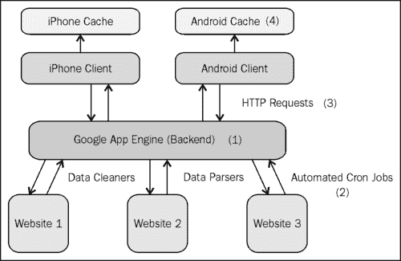

# 第七章：实践中的 Android 数据库

在上一章中，我们最终探讨了将后端数据库绑定到用户界面的方法。在这一点上，我们了解了所有内置在 Android 操作系统中的各种本地存储方法（第一章，*在 Android 上存储数据*和第二章，*使用 SQLite 数据库*），尤其是 SQLite 数据库，以及如何利用 SQLite 语言执行强大查询的方法（第三章，*SQLite 查询*）。此外，我们还知道如何通过内容提供者将自定义 SQLite 数据库暴露给外部应用程序（第四章，*使用内容提供者*），以及如何查询预存在的内容提供者，如`Contacts`内容提供者（第五章，*查询联系人表*）。

在这一点上，我们已经装备了自己大量的工具——足以开始构建完整的应用程序。然而，在我们开始之前，让我们暂停一下并思考一下。

我们真的应该依赖*本地*SQLite 数据库吗？如果用户的手机出了问题，他们的数据被删除了怎么办？或者更重要的是，每个用户是否需要下载*整个*数据集，并将其本地存储在手机上？请记住，手机的内存相当有限，仅是台式机内存的一小部分。

当我们开始考虑如何设计我们的应用程序时，所有这些问题都会发挥作用。因此，在本章中，我们将从一些实际的使用场景开始，探讨为您的 Android 应用程序提供本地化 SQLite 数据库的用途，然后转移到针对以数据为中心的应用程序的其他更典型的应用程序设计（如果您的应用程序将是一款游戏，那么这可能不适用）。

# 本地数据库使用场景

因此，让我们从不同的角度考虑一个 Android 应用程序可能会如何使用本地化的 SQLite 数据库。为了澄清，我所说的*本地化*的 SQLite 数据库是指仅存在于手机内存中，更具体地是在应用程序分配的内存中，并且没有外部数据库支持/备份的数据库。这与*外部*数据库形成对比，外部数据库存在于服务器（或云中），可以作为本地数据库的备份，或者作为中央数据库，所有应用程序都会请求、插入、更新和删除数据。

以我们的第一个示例来说，考虑一个基于谜题的应用程序，它跟踪每个级别的用户高分。高分表格将包含诸如该分数的排名（即第一、第二、第三等）、获得该分数的用户名称以及分数本身等字段。让我们逐一考虑每种数据存储形式，思考它是否是完成当前任务的一个合理的方案：

+   `SharedPreferences：` 我们可以使用基于 Map 的类来完成这个任务吗？我想，如果我们只需要一个高分表格（而不是每个级别一个）并且该表格只有几行数据，我们或许可以使用简单的 Map 来实现。但这可能并不是`SharedPreferences`类的自然使用方式，而且我们可能通过使用不同的数据存储类型来做得更好，所以现在我们先不考虑这个方案。

+   **外部 SD 卡：** 如你所知，写入 SD 卡对于保存和备份文件非常有用。理论上，我们可能通过将表格保存为**逗号分隔值（CSV）**文件（你可以将这些文件视为电子表格）来进行文件格式的保存。这样，每个级别对应一个 CSV 文件，由于 CSV 文件的格式与电子表格类似，我们可以很容易地将这些文件读取并绑定到类似`GridView`的控件中。将数据保存到 SD 卡的优点之一是数据自然得到了备份。例如，如果用户由于某种原因需要卸载并重新安装你的应用程序，那些 CSV 文件仍然存在，数据也得到了保留。然而另一方面，如果用户出于某种原因移除了 SD 卡或对 SD 卡进行了篡改，那么数据可能会丢失或损坏。无论如何，使用 CSV 文件和外部 SD 卡并不是一个糟糕的解决方案，但它可能不是最优化或最自然的选择。

+   **SQLite 数据库：**考虑到我们试图保存一系列表格，自然我们会考虑使用某种数据库架构。现在，根据我们的游戏中包含多少个级别（以及我们可能需要的表格数量），我们可以设计一个数据库架构，每个级别都有一个单独的表格，对于每个级别，我们只需将`Cursor`指向正确表格的 URI。然而，设想一下如果我们有 50 个级别会怎样。在这种情况下，创建 50 个具有 50 个唯一 URI 的相同表格似乎有点愚蠢。因此，我们可能会在表中增加一个用于表示*级别*的字段。然后，当我们执行查询时，可以通过*级别*列过滤表格，并对剩余的子表格按排名进行排序。在这种情况下使用 SQLite 数据库特别方便，因为我们可以将生成的`Cursor`直接通过`ListView`绑定到用户界面。那么，这里的问题是什么呢？好吧，如果用户必须卸载你的应用程序，那么你的 SQLite 数据库极有可能从手机内存中被清除。

+   **外部数据库：**在这种情况下使用外部数据库可能会变得相当复杂。为什么？首先，我们考虑一下我们的数据模型会是什么样子。可能我们会有一个巨大的表格，包含发出请求的设备（即请求数据的手机号或用户名）、请求的关卡等字段，然后就是包含一堆过滤子句的查询。或者，更好的解决方案可能是为每个关卡设置一个表格，并为每个表格包含一个附加字段，指明哪一行属于哪个设备。如您所见，无论哪种情况，数据模型都会有些混乱，但目前我们还是坚持后一种模式。假设你的游戏表现不错，达到了 10 万的活跃安装量。再假设你的游戏有 50 个关卡，每个高分排行榜都保留前 10 名成绩。对于一个半热门的游戏来说，这并不过分，对吧？在这种情况下，你的外部数据库突然就有了 50 个表格，每个表格有百万行数据，这会导致一个相当庞大且占用内存的数据库。此外，你还需要考虑到，每次用户请求查看一个高分排行榜时，他/她都需要向你的外部数据库发出一个 HTTP 请求，以获取相应的表格。这个 HTTP 请求的速度将远远慢于对本地数据库的简单 SQLite 查询。那么，所有这些工作的优点是什么？这种方法可以备份每个用户的高分记录，无论他们卸载和重新安装应用多少次，或者更换多少次手机等等。另一个很好的特性是，一旦你收集了所有用户的数据，你就可以创建一个全球高分排行榜——让你的用户不仅能看到他们特定 Android 设备上的高分，还能看到所有玩过你游戏用户的史上最高分！

因此，即便在这种情况下，使用本地数据库与外部数据库也各有优缺点。在这种情况下你需要问自己的问题是：

+   用户的高分记录备份有多重要？

+   构建一个全球高分排行榜的可能性/实用性有多大？

如果你的目标是打造一款竞争性极强的游戏，并且你认为用户如果重新安装应用或更换手机会非常不满，因为他们会失去高分记录，那么使用外部数据库可能是明智之举。然而，我推测，很少有手机游戏会让用户变得如此竞争激烈，在这种情况下，使用简单的本地数据库将更为实际。

结论是什么？对于一款基于普通谜题的游戏，以及一个简单的高分排行榜，使用本地化数据库就足够了。数据的格式（也就是表格）使得这个数据库成为自然的选择，而且假设用户不会关心他们的高分是否被保存，这使得实现一个本地化数据库比外部数据库更为实际。

在我们继续之前，再考虑一个例子。假设你想创建一个应用程序，使用户能更好地找到咖啡馆和咖啡店。也许你想添加一些功能，允许用户根据空间可用性或 Wi-Fi 可用性筛选咖啡馆和咖啡店（我经常发现自己走进附近的星巴克，结果发现所有的桌子都被占了）。这个应用不错——但你会从哪里找到你的初始咖啡馆/咖啡店数据库呢？

幸运的是，你遇到了一些来自不同服务（如 Yelp、Zagat 等）的 API，它们允许你查询它们的数据库，因此数据源不再是问题。但现在怎么办？你将如何设计你的 Android 应用程序的后端？让我们再次审视我们的选择：

+   `SharedPreferences:` 这一次，很明显，像`SharedPreferences`这样简单轻量级的方法并不合适。我们将放弃这个选项。

+   **外部 SD 卡：**就像我们之前的例子，使用外部 SD 卡的一个可能方法是，将你的数据存储在 CSV 文件中（即电子表格格式），然后读取和写入这些文件。那么，我们在这里可能会做的是，在第一次进入我们的应用程序时，我们进行一系列的 API 调用，以加载我们初始的咖啡馆/咖啡店数据库。然后我们将数据写入 CSV 文件，并引用/更新这个 CSV 文件。到目前为止，一切顺利。但是当我们想要开始筛选我们的数据时会发生什么？比如用户只想看到他/她附近的地点，或者只想看到提供免费 Wi-Fi 的地点。当处理 CSV 文件时，并不存在*查询*这个 CSV 文件的概念，因为文件就是文件，我们唯一的解决方案就是打开与文件的连接，遍历每一行，手动挑选出我们想要的行。在这个例子中，尽管这会变得缓慢且繁重，理论上我们可以用这个 SD 卡解决方案实现后端。然而，很容易看出，一旦我们的模式变得更加复杂（需要多个表而不仅仅是一个），不能执行高效、复杂的查询将导致一个极其糟糕的设计决策。更不用说之前提到的一些问题，比如用户移除 SD 卡、SD 卡损坏等。在这种情况下，我们最好还是远离 SD 卡。

+   **SQLite 数据库：**对于 SQLite 数据库来说，这也是一个自然而然的解决方案，因为我们的数据具有固有的表格格式。我们可以很容易地创建一个包含名称、位置、Wi-Fi 可用性等字段的架构，然后编写一系列查询来快速相应地过滤数据。此外，使用 SQLite 数据库，我们还能够轻松地将数据绑定到用户界面。然而，我们的后端机制会是什么样的呢？用户首次打开应用程序时，我们是否需要访问所有 API 并下载全国所有咖啡馆/咖啡店的全量数据集？如果我们不这样做，那么当用户旅行或想要查看他们当前城市以外的位置时，我们很可能会遇到问题，唯一的解决方案可能是为每个新位置调用 API。如果我们一次性下载整个数据集，那么根据美国咖啡馆/咖啡店的数量，我们可能会遇到内存和性能方面的问题。在两种情况下，我们都需要有计划地选择如何将 SQLite 数据库与通过 API 获取的最新信息同步和更新，这本身就是一个完全不同的问题。

+   **外部数据库：**通过使用外部数据库，我们可以利用数据的固有表格格式。与本地数据库一样，我们仍然可以执行快速查询来过滤数据。我们受益于拥有一个集中式数据库，确保每次用户请求数据子集时，获取到的都是最新的数据。此外，由于我们的数据库将位于外部服务器上，因此在应用端不需要额外的内存，并且我们应能显著提升性能，因为访问一个外部数据库远比多次访问多个 API 要快。我们相对于 SQLite 数据库的劣势在于（当用户）*反复*进行相同请求时会发生的情况。例如，假设用户打开搜索`Activity`，搜索他/她想要的位置列表，等待几秒钟让网络请求返回，然后意外关闭了那个`Activity`。如果用户随后重新打开应用程序并返回到该`Activity`，他/她将需要再次进行*相同*的网络请求，并等待几秒钟才能获取到*相同*的结果。这对于活跃用户来说通常是一个巨大的烦恼，并且鉴于许多移动用户相对较短的注意力集中时间，这可能会对应用程序的成功产生致命影响。

现在我们已经了解了我们可以使用的数据存储方法列表，让我们快速总结一下每种方法的优缺点。首先，从纯*实现*的角度来看，本地数据库和外部数据库是明显的胜者。然后，在*内存消耗*方面，由于整个数据集可以存在于应用程序之外，外部数据库比本地数据库是更好的选择。在*性能*方面，外部数据库的好处在于，我们不是访问多个 API，只需访问一个数据库（我们自己的）。然而，本地数据库的好处在于，用户可以在不进行任何额外网络调用的情况下，在搜索`Activity`中自由进出。

在这里没有明确的胜者，但是有一种方法可以*结合*这两种方法，设计一个健壮的后端，解决之前讨论的所有问题。这种结合方法使用外部数据库作为中央存储单元，但使用本地数据库作为*缓存*来提高性能。在下一节中，让我们深入了解使用本地 SQLite 数据库作为外部数据库的缓存而不是独立数据库意味着什么。

# 数据库作为缓存

那么，缓存究竟是什么呢？**缓存**通常被定义为内存中的一个位置，用于存储重复数据，以便在将来可以更快地提供服务。在我们的案例中，这正是我们需要的。

在我们之前的示例中，我们看到了通过使用外部数据库，可以在不牺牲实现的前提下，提高内存消耗和性能。此外，我们自然可以确保所有用户拥有相同的数据，且这些数据是最新的。唯一当仅依赖外部数据库会受到影响的情况是，当用户在你的应用程序中操作时，每次都必须对外部数据库进行相同（或相似）的网络请求，并且不得不反复等待这些网络请求返回。

一种解决方案是使用缓存，并且只需进行一次网络请求。然后，在网络请求完成后，将返回数据的副本存储在本地数据库上，这样，如果用户进行相同（或相似）的请求，我们的系统只需进行本地查询，而不是网络查询。

为了帮助您更好地理解底层实现，让我们更详细地看看这个缓存是如何工作的。

用户启动你的搜索`Activity`并发出请求。假设用户的请求是查找他/她位置三英里内提供免费 Wi-Fi 的咖啡馆和咖啡店。你需要做出一个设计选择：在这种情况下应该缓存多少数据？当然，你可以带着用户的所有期望筛选条件发出请求，只缓存这些结果。但如果用户突然决定不再需要免费 Wi-Fi 呢？或者用户决定放宽搜索条件，想要查找五英里内的所有商店怎么办？

虽然拥有缓存将肯定会提升性能，但真正的收益来自于你的缓存被命中的频率。对于那些熟悉设计缓存的人来说，权衡来自于缓存被命中的频率与其大小之间的平衡。换句话说，在极端情况下，如果你设计的缓存包含了你的*整个*数据集，那么显然每个请求都会命中缓存，从这个意义上说，你的缓存将非常有效。然而，将整个数据集存储在内存中是不理想的（通常取决于数据库的大小，这往往是不可行的），在这方面缓存就会失败。尝试找到两者之间的良好平衡是目标所在。因此，在这种情况下，为什么不尝试请求五英里内的所有位置，并完全排除 Wi-Fi 筛选器呢？

通过缓存这个请求，当用户决定将搜索条件从三英里放宽到五英里（或者减少到两英里）时，你已经有所有结果了；所以，你不需要发出另一个网络请求，只需简单地过滤缓存以获取所需的数据子集即可。同样，如果用户想要移除 Wi-Fi 筛选器，你可以迅速查询缓存中的数据，这次移除*仅限 Wi-Fi*的筛选器。在这两种情况下，用户命中了你的缓存，从而为你节省了耗时的网络请求。

设计缓存系统的最后一步就是确定多久刷新一次缓存。从不刷新缓存是不理想的，因为随着时间的推移，每次你缓存新请求，它只会消耗更多的内存，而且，你还会遇到数据过时的问题。例如，假设用户对其家乡的咖啡馆/咖啡店发出请求，你缓存了这个结果。然而，你的缓存系统从不刷新缓存。一年内很多事情都可能发生，一年后用户再次拿出你的应用并发出同样的请求，他/她将会命中缓存并获取旧数据，而不是发出新的请求。

另一方面，如果允许你的缓存太频繁地刷新，你将降低缓存命中频率，最终不得不进行比预期更多的网络请求。因此，我们再次面临一个优化问题，我们希望最大化缓存命中次数，同时最小化所需的内存消耗，并最小化我们拉取陈旧数据的频率。

这个简化的优化问题位于每个缓存系统的核心，当你使用本地数据库来缓存外部数据库网络请求时，这是你需要牢记的问题。尽管关于缓存还有很多可以讨论的内容，但本节（以及整章）的目标是激发你的思考过程，并介绍本地数据库的众多用途之一，以及它们如何与外部数据库结合使用。

在下一节中，我将讨论一个典型的以数据为中心的应用程序的外观，以及典型的数据流程。再次强调，我所说的*以数据为中心*的应用程序是指那些主要功能涉及显示/与某种形式的数据进行交互的应用程序。这可以包括从社交网络应用程序（用户可以相互阅读/发送消息，这里的数据包括消息、事件、照片——任何可以共享的内容），到餐饮应用程序（用户可以加载附近餐厅的详细信息）。这通常不包括许多基于游戏的应用程序，尽管即使是基于游戏的应用程序有时也需要采用某种外部数据库（例如，我们之前讨论的全局高分表）。接下来，让我们再次调整焦点，从更全面的角度思考移动应用程序——作为外部数据库和外部应用程序的扩展，而不仅仅是简单的独立应用程序。

# 典型应用程序设计

迄今为止，我们只讨论了关于后端应用程序设计的想法。我们首先考虑了完全本地化的后端与完全外部后端使用的优缺点，然后考虑了在应用程序中使用两者的方法，试图两全其美。我们可以这样做的一种方式是使用缓存，仅在设计缓存时，我们就发现有许多设计决策必须被做出。

不论你是否意识到，这段时间你一直在分析不同应用程序的不同后端设计的优缺点，现在我们准备关注一个非常通用且极其实用的设计，这种设计在以数据为中心的移动应用程序中经常使用。但是关于文字就到此为止，让我们给我们的设计配上图片：

那么这里到底发生了什么？让我们来分解一下：

1.  首先，我们有我们的外部集中式数据库。这是我们后端的核心。所有应用程序（无论是网页还是移动应用）都将引用这个数据库，这样我们可以确保所有移动设备上的数据都是同步且最新的。此外，在这种设计中，我们的应用程序不再是特定于某个平台的。换句话说，可以轻松创建一个在所有移动设备上都能运行的应用程序，包括 Android 和 iOS，因为所有设备都指向同一个数据库。

1.  外部数据库还将客户端（即移动应用和网页应用）与数据收集/解析/清洗端分离。在这里，后者包含了所有旨在收集、解析和清洗后端数据的流程。这可能包括定期调用 API（假设 API 允许你存储其数据的副本）、抓取网页（稍后讨论）、或者在有些情况下手动插入新数据。一旦数据进来，通常需要被解析和清洗以符合你的数据库规格。此外，通过使用 CRON 作业（在第九章中讨论的*收集和存储数据*），整个数据收集和清洗的过程本身也可以自动化。因此，以这种方式设置你的应用程序，你可以将所有这些后台数据挖掘工作从用户面前隐藏起来。

1.  另一方面，网页应用和移动应用在不断地向你的外部数据库发送请求。这些请求通常以 HTTP GET 和 POST 请求的形式（获取数据与插入/更新数据），并以 XML 或 JSON 格式返回结果。再次强调，由于这些只是标准的 HTTP 网络请求，因此与发起请求的平台无关，你可以轻松地将应用程序从一个平台移植到另一个平台。

1.  最后，我们有缓存，这是外部数据库的一个临时的、局部的子集，存在于移动/网页应用端。如早前讨论的，这些缓存设计用来通过避免重复的网络请求来提高应用程序的性能。

这就是我们要介绍的内容。再次强调，目前这还是一个很高的层面，但我们已经看到了并讨论了与我们的设计第四部分相关的组件，在接下来的章节中，我们还将看看前三个部分。

# 总结

尽管在本章中我们没有查看任何代码，但我们仍然完成了很多工作。我们通过确定两个非常现实的需求（一个简单的高分榜和一个位置/场所数据库）开始本章，并走过了选择合适存储方法的思考过程。

我们发现，对于像高分排行榜这样简单的功能，一个本地化的 SQLite 数据库既有效又易于实现。这种方法唯一真正的缺点是无法显示全局高分排行榜，但对于大多数游戏来说，这只是一个小功能。然而，对于我们的咖啡馆/咖啡店应用程序，我们发现本地化的 SQLite 数据库远不如中央外部数据库有效，外部数据库解决方案唯一的缺点是，如果频繁进行重复且不必要的网络调用，性能会受到影响。

为了解决这个问题，我们求助于缓存作为一种解决方案——同时使用外部和本地数据库，试图利用每种方法的优点。然而，要构建一个有效的缓存，需要做出几个设计决策，以优化缓存命中频率，同时最小化内存消耗和陈旧数据。

最后，我们在本章的结尾不仅从代码中抽身，也从 Android 应用程序本身抽身，试图从更全面的角度审视我们的应用程序。我们探讨了典型的以数据为中心的应用程序的外观，并将数据循环分解为四个部分。至此，我们已经涵盖了足够的内容，能够实现设计部分的第四部分（本地缓存），接下来我们将用一章的篇幅来讲解剩余的三个部分。通过本书的学习，我们的目标是让您能够自信地设计和实现一个完整规模的数据中心应用程序。
