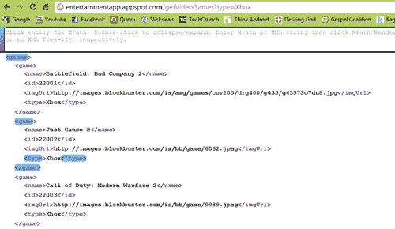
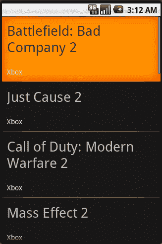

# 第十章：将一切整合到一起

最后，是时候将所有内容整合到一起了。在之前的第八章，*探索外部数据库*中，我们通过创建一个新的 Google App Engine (GAE) 项目并构建 JDO 数据库，开始了编写一个 Blockbuster 游戏应用示例。我们首先定义了`VideoGame`表应该是什么样子，然后编写了一些方便的包装方法，允许我们从后端检索、插入、更新和/或删除`VideoGame`数据。然后在第九章，*收集和存储数据*中，我们探讨了我们可以通过使用方便的 API 或者编写抓取器来完成数据的收集。在我们的示例中，需要一个抓取器，因此我们编写了一些代码来首先清理和构建 Blockbuster 的游戏租赁页面，然后最终导航和解析所需数据。最后一步就是重新介绍 HTTP servlet，并查看我们如何实现一个 servlet，当被访问时，它会抓取并更新我们数据库中的最新游戏。

现在，我们将通过编写一个 HTTP servlet 来完成应用程序的编写，该 servlet 实际上会查询并返回数据（与之前的示例不同，之前的示例只是返回成功或失败的消息），一旦返回数据，我们将编写一些简单的 XML 解析器和列表适配器，以展示一旦数据在移动端上该如何处理。然后，你将拥有一个可以定期抓取和更新自身数据的功能齐全的后端，一系列允许你根据平台独立检索数据的 HTTP servlet，以及一个 Android 应用程序，它将解析数据并将其绑定到用户可以看到的 UI 上。

# 实现 HTTP GET 请求

在上一章中，我们简要介绍了 GET 和 POST 请求之间的区别。在我们的应用程序开发中的下一步是在 GAE 服务器端编写几个类，允许我们访问一个 URL 并获取视频游戏对象的列表。

这意味着我们需要重写另一个 HTTP servlet，它可能会带有一个参数，指示我们正在寻找哪个游戏平台。直观地，一旦我们知道我们正在寻找的平台，我们会回忆起之前我们的 JDO 数据库包装方法之一涉及到查询特定平台的所有游戏。因此，我们很可能会再次利用我们的 JDO 包装类。

然而，你可能也会回忆起我们的 JDO 数据库返回的行不是字符串，而是对象，因此我们需要将每个`VideoGame`对象转换为某种可读的、格式化的字符串，无论是 XML 还是 JSON。有了这些初步的想法和直觉，让我们看看你将如何实现这个新的 GET 请求：

```kt
public class GetVideoGames extends HttpServlet {
// HTTP GET REQUEST SINCE WE'RE REQUESTING FOR DATA
public void doGet(HttpServletRequest request, HttpServletResponse response) throws IOException, ServletException {
String platform = request.getParameter("type");
// USE OUR JDO WRAPPER TO QUERY FOR GAMES BY PLATFORM
List<VideoGame> games = VideoGameJDOWrapper.getGamesByType(platform);
// WRAP GAMES INTO XML FORMAT
String ret = GamesToXMLConverter.convertGamesToXML(games);
// SET THE RESPONSE TYPE TO XML
response.setContentType("text/xml");
response.setHeader("Cache-Control", "no-cache");
// WRITE DATA TO RESPONSE
response.getWriter().write(ret);
}
}

```

一切都应该看起来很熟悉，逻辑相当简单。唯一不清楚的部分是在最后我传入一个`VideoGame`对象列表并返回一个字符串。顾名思义，我编写了一个简单的类，它接收`VideoGame`对象，提取它们的字段，并将它们组织成格式良好的 XML 代码（同样，你也可以使用 JSON）。让我们快速看看我是如何定义我的`GamesToXMLConverter`类的：

```kt
public class GamesToXMLConverter {
public static String convertGamesToXML(List<VideoGame> games) {
String content = "";
for (VideoGame g : games) {
// WRAP EACH GAME IN ITS OWN TAG
content += convertGameToXml(g);
}
// WRAP ALL GAME TAGS TOGETHER INTO ROOT TAG
String ret = addTag("games", content);
return ret;
}
/**
* METHOD FOR CONVERTING OBJECT TO XML FORMAT
*
* @param g
* a video game object
* @return
*/
public static String convertGameToXml(VideoGame g) {
String content = "";
// ADD TAG FOR NAME
content += addTag("name", g.getName().replaceAll("&", "and"));
// ADD TAG FOR ID
content += addTag("id", String.valueOf(g.getId()));
// ADD TAG FOR IMAGE IF NOT NULL
if (g.getImgUrl() != null) {
content += addTag("imgUrl", g.getImgUrl().getValue());
}
// ADD TAG FOR TYPE
content += addTag("type", VideoGameConsole.convertIntToString(g.getConsoleType()));
// WRAP ENTIRE GAME IN <game> TAGS
String ret = addTag("game", content);
return ret;
}
public static String addTag(String tag, String value) {
return ("<" + tag + ">" + value + "</" + tag + ">");
}
}

```

噔噔噔——没什么复杂的。实际上，你可以按照自己喜欢的方式编写 XML/JSON 转换器，如果你足够努力寻找，我敢打赌肯定有方便的库是为了帮你完成这项工作而设计的。然而，正如本书的主题，更多地关注概念而不是我的实际代码——这个想法是你深入到 JDO 数据库中，获取一个对象列表，然后你需要考虑一种简洁的方式来将那些对象写入返回的`HttpServletResponse`对象中。

同样，就像我们之前的 HTTP servlet 一样，为了让我们的 GAE 项目识别这是一个有效的 servlet，我们需要在`/war/WEB-INF/web.xml`文件中将其定义为一个 servlet。

```kt
<?xml version="1.0" encoding="utf-8"?>
<servlet>
<servlet-name>getVideoGames</servlet-name>
<servlet-class>app.requests.GetVideoGames</servlet-class>
</servlet>
<servlet-mapping>
<servlet-name>getVideoGames</servlet-name>
<url-pattern>/getVideoGames</url-pattern>
</servlet-mapping>

```

一旦我们定义了名称和 URL 模式，我们只需部署项目并访问以下 URL：

`http://{你的项目名}.appspot.com/getVideoGames?type={类型}`

完成了。对于那些跟随进度的读者，我邀请你们检查一下，看看是否能得到一个格式良好的数据列表。否则，欢迎查看以下链接来查看我的结果： 

`http://entertainmentapp.appspot.com/getVideoGames?type=Xbox`

`http://entertainmentapp.appspot.com/getVideoGames?type=Ps3`

以下是给那些在移动中阅读此内容的读者的截图：



现在，让我们回到 Android 端，看看我们是如何发起请求并处理/解析结果。

# 回到 Android：解析响应

既然我们的后端已经完全完成，剩下的就是从 Android 实现这些 HTTP 请求，解析数据，并在获取数据后将其绑定到 UI 上（尽管这可能需要重新复习第六章，*绑定到 UI*）。

首先，你需要构建一个 HTTP 客户端，以便你可以发起 GET/POST 请求。这个 HTTP 客户端本质上是一个载体，你可以通过它发起各种 HTTP 请求。HTTP 客户端要求你设置一些 HTTP 参数，以确定请求应该如何进行。然后，根据这些参数，客户端知道如何相应地处理每个请求。例如，这样的一个参数就是告诉 HTTP 客户端如何处理 HTTP 与 HTTPS 请求（即通过非安全通道与安全通道发起的请求）。每个通道都要求你指定不同的端口，因此你需要在客户端中相应地定义这些端口。在下面的代码中，你可以看到一个为 HTTP 和 HTTPS 请求配置的 HTTP 客户端：

```kt
public class ConnectionManager {
public static DefaultHttpClient getClient() {
DefaultHttpClient ret = null;
// SET PARAMETERS
HttpParams params = new BasicHttpParams();
HttpProtocolParams.setVersion(params, HttpVersion.HTTP_1_1);
HttpProtocolParams.setContentCharset(params, "utf-8");
params.setBooleanParameter("http.protocol.expect-continue", false);
// REGISTER SCHEMES FOR HTTP AND HTTPS REQUESTS
SchemeRegistry registry = new SchemeRegistry();
registry.register(new Scheme("http", PlainSocketFactory.getSocketFactory(), 80));
final SSLSocketFactory sslSocketFactory = SSLSocketFactory.getSocketFactory();
sslSocketFactory.setHostnameVerifier (SSLSocketFactory.BROWSER_COMPATIBLE_HOSTNAME_VERIFIER);
registry.register(new Scheme("https", sslSocketFactory, 443));
ThreadSafeClientConnManager manager = new ThreadSafeClientConnManager(params, registry);
ret = new DefaultHttpClient(manager, params);
return ret;
}
}

```

一旦有了这些，我更喜欢构建一些简单的 GET/POST 包装方法，当你传递一个 HTTP 客户端和 URL 时，它会将结果作为字符串返回：

```kt
public class GetMethods {
/**
* MAKE AN HTTP GET REQUEST
*
* @param mUrl
* the url of the request you're making
* @param httpClient
* a configured http client
* @return
*/
public static String doGetWithResponse(String mUrl, DefaultHttpClient httpClient) {
String ret = null;
HttpResponse response = null;
// INITIATE THE GET METHOD WITH THE DESIRED URL
HttpGet getMethod = new HttpGet(mUrl);
try {
// USE YOUR HTTP CLIENT TO EXECUTE THE METHOD
response = httpClient.execute(getMethod);
System.out.println("STATUS CODE: " + String.valueOf(response.getStatusLine(). getStatusCode()));
if (null != response) {
// CONVERT HTTP RESPONSE TO STRING
ret = getResponseBody(response);
}
} catch (Exception e) {
System.out.println(e.getMessage());
}
return ret;
}
public static String getResponseBody(HttpResponse response) {
String response_text = null;
HttpEntity entity = null;
try {
// GET THE MESSAGE BODY OF THE RESPONSE
entity = response.getEntity();
if (entity == null) { throw new IllegalArgumentException("HTTP entity may not be null"); }
// IF NOT NULL GET CONTENT AS STREAM
InputStream instream = entity.getContent();
if (instream == null) { return ""; }
// CHECK FOR LENGTH
if (entity.getContentLength() > Integer.MAX_VALUE) { throw new IllegalArgumentException(
"HTTP entity too large to be buffered in memory"); }
// GET THE CHARACTER SET OF THE RESPONSE
String charset = null;
if (entity.getContentType() != null) {
HeaderElement values[] = entity.getContentType(). getElements();
if (values.length > 0) {
NameValuePair param = values[0]. getParameterByName("charset");
if (param != null) {
charset = param.getValue();
}
}
}
if (charset == null) {
charset = HTTP.DEFAULT_CONTENT_CHARSET;
}
// ONCE CHARSET IS OBTAINED - READ FROM STREAM
Reader reader = new InputStreamReader(instream, charset);
StringBuilder buffer = new StringBuilder();
try {
// USE A BUFFER TO READ FROM STREAM
char[] tmp = new char[2048];
int l;
while ((l = reader.read(tmp)) != -1) {
buffer.append(tmp, 0, l);
}
} finally {
reader.close();
}
// CONVERT BUFFER TO STRING
response_text = buffer.toString();
} catch (Exception e) {
e.printStackTrace();
}
return response_text;
}
}

```

一开始，这可能看起来非常令人畏惧，尤其是对于那些从未见过这些技术或类的人。是的——涉及很多新的类，但这并不是火箭科学；实际上，类名都非常直观和具有描述性，除了这些并没有太多复杂的内容。

第一种方法非常简单。Java 中有一个`HttpGet`类，它包含在 Android SDK 和 Java SDK 中，我们可以用 URL 来实例化它。接下来，我们将这个`HttpGet`对象传递给我们的 HTTP 客户端，并等待响应返回。响应最终会以一个`HttpResponse`对象的形式返回，在这个对象内部有一些描述性字段，可以告诉我们 HTTP 状态码、响应内容（这是我们很快需要的东西）等。状态码是一个很有用的东西，因为它会告诉我们 GET 请求是否成功，如果不成功，它还会显示失败的错误。有了这些不同的错误代码，我们可以相应地处理每个事件，例如，如果服务器宕机，那么我们运气不佳，应该告诉用户稍后再检查，或者可能引导他们访问应用程序的离线版本。另一方面，如果只是临时的连接问题，那么我们可能会默默重试请求。

一旦我们得到响应并确认请求成功，接下来就是获取响应体了！下一节将介绍这部分代码——即`getResponseBody()`方法。这个方法稍微有些复杂，但希望内联注释能帮助你理解正在发生的事情。从高层次来看，我们本质上是在获取`HttpResponse`对象的内容体，在这个例子中称为实体。然而，实体是一个单独的对象，包含许多描述性字段，但我们实际上感兴趣的是`HttpEntity`对象的字符串表示。因此，我们从`HttpEntity`请求一个`InputStream`，这将允许我们使用一个`StringBuilder`对象逐行流式传输内容体的字符。现在，中间的其余代码只是一系列检查，以确保实际上有消息需要缓冲，并且，如果有，它的大小不会太大，以至于我们的缓冲区无法处理（即它不会超过字符串的最大大小）。最后，我们只需要检索内容体的字符集，这样我们的`InputStreamReader`在将消息转换为字符时就知道使用哪个字符集了。

现在，以下是我们要如何使用前两个类从 Android 客户端实际发起 GET 请求的方法：

```kt
public class GetVideoGamesAndroid {
private static String URL_BASE = "http://entertainmentapp.appspot.com";
private static String REQUEST_BASE = "/getVideoGames?type=";
// THIS RETRIEVES THE HTTP CLIENT CONFIGURED ABOVE
private static DefaultHttpClient httpClient = ConnectionManager.getClient();
// PASS IN THE PLATFORM YOU WANT I.E. XBOX, PS3, ETC
public static List<VideoGame> getGamesByType(String type) {
// CONSTRUCT GET REQUEST URL
String url = URL_BASE + REQUEST_BASE + type;
// XML RESPONSE AS A STRING GETS RETURNED
String response = GetMethods.doGetWithResponse(url, httpClient);
// RUN THROUGH SIMPLE XML PARSER
List<VideoGame> games = ObjectParsers.parseGameResponse(response);
return games;
}
}

```

在这一点上，你会注意到实际发生的事情确实在我们的`GetMethods`类中，一旦实现了这个类，发起 GET 请求就变得相当简单：只需要一个 URL。那么在这种情况下，XML 解析器是什么样的呢？嗯，你可以根据 XML 的复杂程度以及你对各种 XML 文档解析器的熟悉程度以多种方式实现它。对于极其简单的 XML（即只有单层节点的文档），有时使用简单的正则表达式命令就可以解决问题。在更复杂的 XML 中，有时使用 Java 内置的`SAXParser`类甚至使用我们的朋友`HtmlCleaner`也会有所帮助。请注意，在很多情况下返回的数据也可能是 JSON 格式，在这种情况下，你需要编写一些简单的 JSON 解析器，这些解析器获取各种键值对，并在移动端重新构建`VideoGame`对象。

由于所有这些先前的依赖，我将实际的`parseGameResponse()`方法的实现留给你们去完成——目标很明确，如果你需要回顾数据的样子，只需参考本章的第一张图片。现在你需要做的是解析它，这应该是一个相对简单的练习。我要提到的最后一点是，通常这些 HTTP 请求可能需要一些时间（至少几秒钟，有时根据服务器上执行的工作量可能会达到 10-20 秒）。由于 Android 操作系统如果主 UI 线程长时间被占用（根据情况可能 5-10 秒），会抛出“应用无响应”(ANR)错误，我强烈建议在单独的线程上执行所有 HTTP 请求。你可以使用传统的`Runnable`和`Handler`类来实现这一点，但 Android 也为你提供了很好的封装类，如`AsyncTask`类。我还鼓励你阅读谷歌朋友的这篇文章，了解更多关于设计响应式应用的信息：

[`developer.android.com/guide/practices/design/responsiveness.html`](http://developer.android.com/guide/practices/design/responsiveness.html)

所以现在，我们已经发出了 GET 请求，解析了数据，并且在移动端拥有了一个漂亮的`VideoGame`对象列表，这些对象是我们从服务器接收到的`VideoGame`对象的副本。剩下要做的就是使用我们在书中前面看到的`ListAdapter`之一并将其绑定到 UI！

# 最后的步骤：绑定到 UI（再次）

现在是最后一步——将数据绑定到用户界面。对于那些已经阅读完全书的读者来说，这一部分应该非常熟悉，因此我会尽量简洁但全面的讲解。

在前面的章节中，我们实际上已经将所有网络请求连接在一起，无论是在应用端还是在服务器端，因此现在我们应该能够从任何移动应用无缝地发出 GET 请求。我们还研究了如何解析返回的响应（这同样作为一个练习留给你，因为响应可能以任何方式返回）并将数据从字符串形式转换回`VideoGame`对象形式。

现在让我们回顾一下第六章，*绑定到 UI*。在那章中，我们了解了`ListAdapters`的两个子类：`BaseAdapter`和`CursorAdapter`。您还记得，当我们的数据存储在 SQLite 数据库中时，使用`CursorAdapter`。后续对 SQLite 数据库的查询以`Cursor`对象的形式返回，然后由`CursorAdapter`类包装。在我们的`VideoGame`示例中，目前有一个对象列表，而不是`Cursor`。这并不是说我们不能将结果存储到 SQLite 数据库中，在应用程序端有效地创建一个缓存（还记得这些吗？），然后向缓存发出查询以获取`Cursor`。但为了简单起见，让我们坚持使用我们的`VideoGame`对象列表，并简单地使用专为这类列表设计的`BaseAdapter`。它的代码可能如下所示：

```kt
public class VideoGameBaseAdpater extends BaseAdapter {
// REMEMBER CONTEXT SO THAT CAN BE USED TO INFLATE VIEWS
private LayoutInflater mInflater;
// LIST OF VIDEO GAMES
private List<VideoGame> mItems = new ArrayList<VideoGame>();
public VideoGameBaseAdpater(Context context, List<VideoGame> items) {
// HERE WE CACHE THE INFLATOR FOR EFFICIENCY
mInflater = LayoutInflater.from(context);
mItems = items;
}
public int getCount() {
return mItems.size();
}
public Object getItem(int position) {
return mItems.get(position);
}
public long getItemId(int position) {
return position;
UIUIdata, binding to}
public View getView(int position, View convertView, ViewGroup parent) {
VideoGameViewHolder holder;
// IF NULL THEN NEED TO INSTANTIATE IT BY INFLATING IT
if (convertView == null) {
convertView = mInflater.inflate(R.layout.list_entry, null);
holder = new VideoGameViewHolder();
holder.name_entry = (TextView) convertView.findViewById (R.id.name_entry);
holder.type_entry = (TextView) convertView.findViewById (R.id.number_type_entry);
convertView.setTag(holder);
} else {
// GET VIEW HOLDER BACK FOR FAST ACCESS TO FIELDS
holder = (VideoGameViewHolder) convertView.getTag();
}
// EFFICIENTLY BIND DATA WITH HOLDER
VideoGame v = mItems.get(position);
holder.name_entry.setText(v.getName());
String type = VideoGameConsole.convertIntToString (v.getConsoleType());
holder.type_entry.setText(type);
return convertView;
}
static class VideoGameViewHolder {
TextView name_entry;
TextView type_entry;
}
}

```

正如在第六章中，*绑定到 UI*，我们实现了一个自定义的`BaseAdapter`，创建了一个`Contact`对象的列表——在这种情况下，我们正在做一些非常相似的事情，但针对的是我们的`VideoGame`对象！请注意，我的`VideoGameViewHolder`只显示了游戏名称和游戏类型，并没有处理图片 URL。同样，通过使用`ImageView`，可以很容易地将这些内容整合到每一行中，但这需要将 URL 转换为 Bitmap 对象——虽然这并不难，但在我们的情况下是不必要的；现在您应该明白这个想法了。

完成这些后，我们只需要创建一个 Activity，它发起 GET 请求，获取结果中的`VideoGames`列表，并通过使用自定义的`VideoGameBaseAdapter`将其设置为`ListAdapter`。这个代码非常简单：

```kt
public class VideoGameBaseAdapterActivity extends ListActivity {
private List<VideoGame> games;
@Override
public void onCreate(Bundle savedInstanceState) {
super.onCreate(savedInstanceState);
setContentView(R.layout.list);
// MAKE GET REQUEST TO RETRIEVE GAMES
games = GetVideoGamesAndroid.getGamesByType (VideoGameConsole.XBOX);
// USE VIDEO GAME ADAPTER
VideoGameBaseAdpater vAdapter = new VideoGameBaseAdpater(this, games);
// SET THIS ADAPTER AS YOUR LIST ACTIVITY'S ADAPTER
this.setListAdapter(vAdapter);
}
@Override
protected void onListItemClick(ListView l, View v, int position, long id) {
super.onListItemClick(l, v, position, id);
VideoGame vg = games.get(position);
String name = vg.getName();
System.out.println("CLICKED ON " + name);
}
}

```

完成后，我们的最终结果如下所示：



完成了！给自己点个赞，因为我们刚刚完成了一个完整的数据中心应用程序！现在，我们不仅拥有一个功能齐全的后端，配备了自己的 HTTP 请求集合，而且还构建了一个有前景的 Android 应用程序，它能向后端发起 HTTP 请求，获取结果，并以简单的列表形式展示。

# 概述

我们已经到达了结尾，但在我们结束之前，让我们从开始到结束看看我们所学习和涵盖的所有令人惊叹的事情。我们通过查看 Android 上的各种本地存储方法开始了这本书——这些方法非常轻量级和高效，还有像 SQLite 数据库这样更复杂但同时也更强大的方法。

我们接着深入探讨了 SQLite 数据库——这可能是你在 Android 应用开发职业生涯中遇到的最常见的本地数据存储形式，然后进入了第三章，*SQLite 查询*。接下来，我们学习了如何通过将 SQLite 数据库包装在内容提供者中来向外部应用公开这些数据库。然后我们研究了 Android 操作系统中最受欢迎的内容提供者——联系人内容提供者，并实现了一些可能会遇到的一些常见查询。

在完全掌握了本地存储方法之后，我们继续学习如何通过各种`ListAdapter`类将这些本地数据源绑定到用户界面上。在这一章节中，我们看到了`CursorAdapter`和`BaseAdapter`的实现和使用场景。

从那里，我们转向了以数据为中心的应用程序设计和编程的更全面视角。我们讨论了实际使用各种本地数据存储形式的方法，并引入了缓存概念，这是 SQLite 数据库的一个极其实用的用例。这自然引导我们考虑外部数据库，因为缓存通常与网络请求和网络编程密切相关。

我们以外部数据库结束了本书。我们讨论了可以使用的外部数据库的不同类型，并决定在示例实现中使用 Google App Engine (GAE)。使用 GAE，我们实现了一个完全功能的 JDO 数据库（全部在云端完成），此时我们还实现了一系列 HTTP Servlet，使我们能够进行 HTTP GET 和 POST 请求。最后，我们通过实现应用程序移动端的代码结束了本书——这让我们回到了 Android，并圆满完成了整个学习过程。

我希望通过这些内容，我们能更好地理解数据库（无论是本地的还是外部的）是如何融入开发强大、以数据为中心的 Android 应用程序的整体架构中的。祝你好运，开发愉快。
