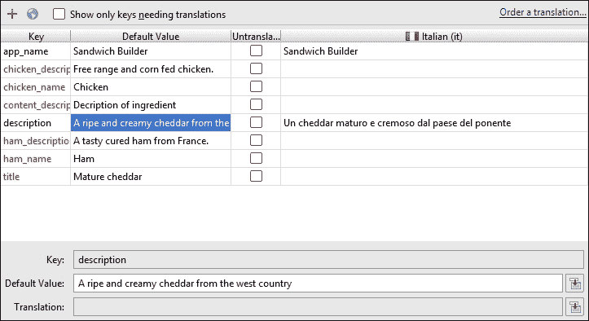
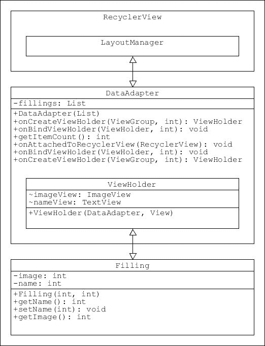
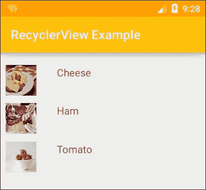
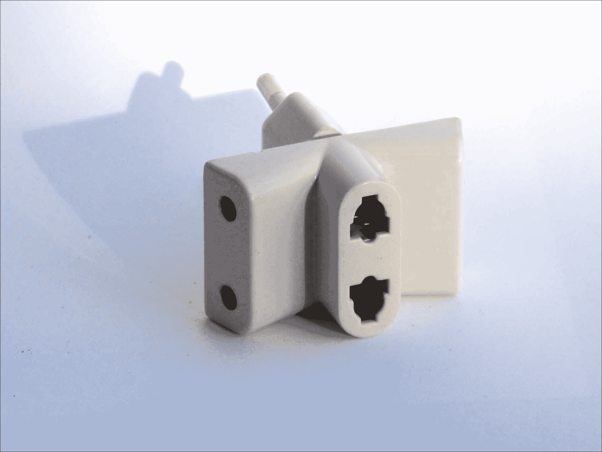
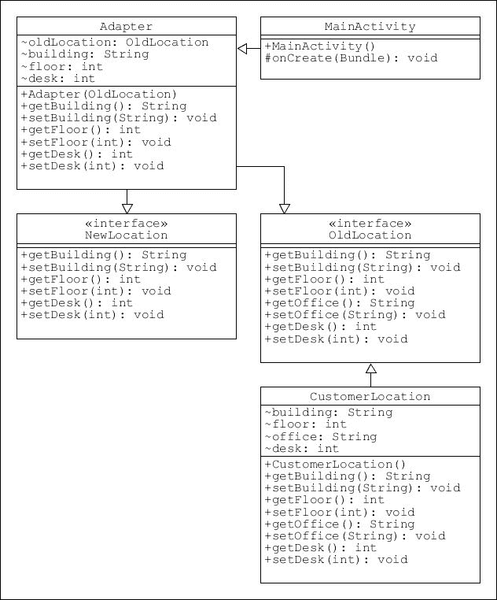
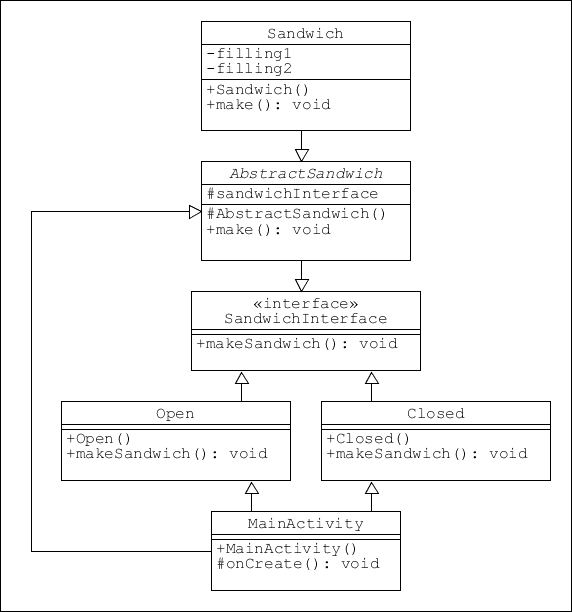
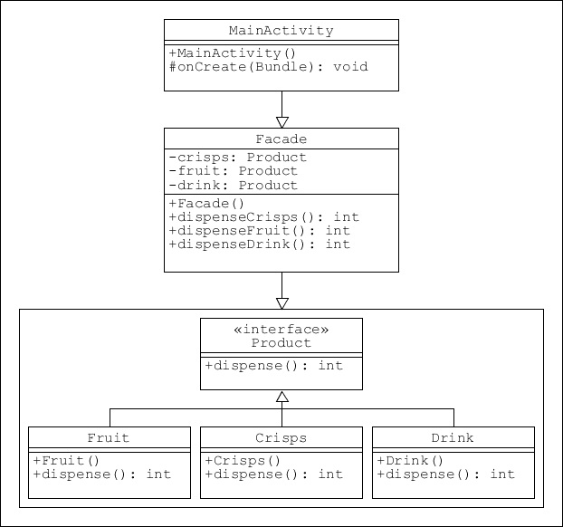
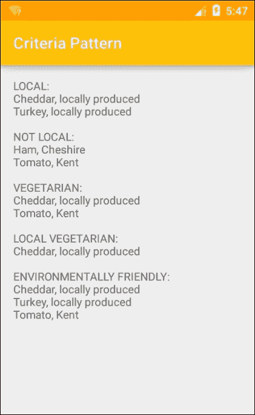
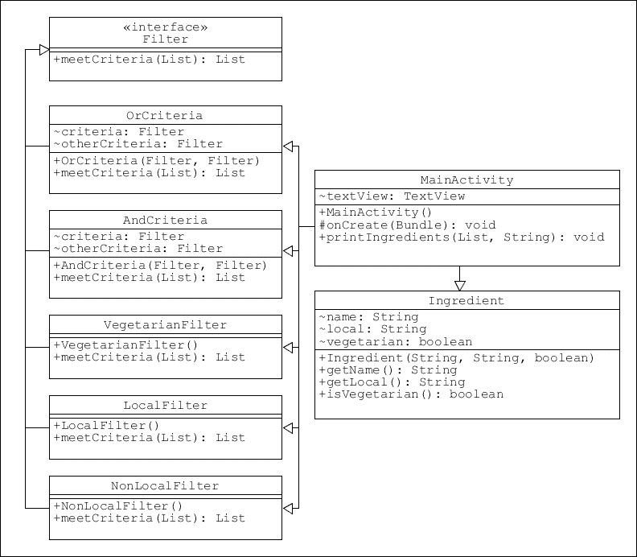

# 五、结构模式

到目前为止，在本书中，我们已经研究了保存和返回数据以及将对象组合成更大的对象的模式，但是我们还没有考虑如何为用户提供选择。

在规划我们的三明治构建器应用程序时，我们希望为客户提供各种可能的配料。可能呈现这种选择的最佳方式是通过一个列表，或者对于大量的数据集合，通过一系列列表。安卓用**recycle view**很好地管理这些过程，它是一个列表容器和管理器，取代了以前的列表视图。这并不是说永远不应该使用简单的旧列表视图，在我们想要的只是几个项目的简短文本列表的情况下，使用回收视图可能会被认为是矫枉过正，列表视图通常是一种选择。话虽如此，回收视图要优越得多，尤其是在管理数据、保持较小的内存占用和平滑滚动方面，并且当包含在 CoordinatorLayout 中时，允许用户拖放或滑动和取消列表项目。

为了了解这一切是如何完成的，我们将构建一个界面，该界面将包含一个供用户选择的成分列表。这将需要 RecyclerView 来保存列表，这又将向我们介绍适配器模式。

在本章中，您将学习如何:

*   应用 recyclerview
*   应用坐标或布局
*   生成列表
*   翻译字符串资源
*   申请签证持有人
*   使用回收视图适配器
*   创建适配器设计模式
*   构建桥梁设计模式
*   应用外观模式
*   使用模式过滤数据

# 生成列表

RecyclerView 是相对较新的版本，取代了旧版本的 ListView。它执行相同的功能，但管理数据的效率要高得多，尤其是非常长的列表。RecyclerView 是 v7 支持库的一部分，需要与此处显示的其他内容一起编译到`build.gradle`文件中:

```java
compile 'com.android.support:appcompat-v7:24.1.1'compile 'com.android.support:design:24.1.1'compile 'com.android.support:cardview-v7:24.1.1'compile 'com.android.support:recyclerview-v7:24.1.1'
```

协调器布局将形成主活动的根布局，如下所示:

```java
<android.support.design.widget.CoordinatorLayoutxmlns:android="http://schemas.android.com/apk/res/android"xmlns:app="http://schemas.android.com/apk/res-auto"android:id="@+id/content"android:layout_width="match_parent"android:layout_height="match_parent"></android.support.design.widget.CoordinatorLayout>
```

回收器视图可以放在布局中:

```java
<android.support.v7.widget.RecyclerView 
    android:id="@+id/main_recycler_view" 
    android:layout_width="match_parent" 
    android:layout_height="match_parent" 
    /> 

```


RecyclerView 为我们提供了一个虚拟列表，但是我们将根据卡片视图创建我们的列表。

# 列出项目布局

使用卡片视图来显示列表中的单个项目是非常诱人的，可以找到许多这样使用它的例子。然而，谷歌并不推荐这种做法，理由也很充分。卡片被设计成显示大小不一致的内容，圆形的边缘和阴影只会使屏幕变得杂乱。当列表项的大小都相同并且符合相同的布局时，它们应该显示为简单的矩形布局，有时用简单的分隔线将它们分开。

我们将在本书后面创建复杂的交互式列表项目，所以现在我们将只有一个图像和一个字符串作为我们的项目视图。

创建一个以水平线性布局为根的布局文件，并将这两个视图放入其中:

```java
<ImageView 
    android:id="@+id/item_image" 
    android:layout_width="@dimen/item_image_size" 
    android:layout_height="@dimen/item_image_size" 
    android:layout_gravity="center_vertical|end" 
    android:layout_margin="@dimen/item_image_margin" 
    android:scaleType="fitXY" 
    android:src="@drawable/placeholder" /> 

<TextView 
    android:id="@+id/item_name" 
    android:layout_width="0dp" 
    android:layout_height="wrap_content" 
    android:layout_gravity="center_vertical" 
    android:layout_weight="1" 
    android:paddingBottom="24dp" 
    android:paddingStart="@dimen/item_name_paddingStart" 
    tools:text="placeholder" 
    android:textSize="@dimen/item_name_textSize" /> 

```

我们在这里使用了`tools`名称空间，稍后应该会删除，这样我们就可以看到我们的布局是什么样子，而不必编译整个项目:


### 类型

您可能已经注意到，在旧设备上测试时，CardViews 上的一些边距和填充看起来有所不同。`card_view:cardUseCompatPadding="true"`属性通常会解决这个问题，而不是创建替代布局资源。

我们在此应用的文本大小和边距不是任意的，而是由材质设计指南指定的。

## 材质字体大小

当涉及到材质设计时，文本大小非常重要，并且在某些情况下只允许特定的大小。在当前示例中，我们选择 24sp 作为名称，选择 16 作为描述。一般来说，我们在材质设计应用程序中显示的几乎所有文本都是 12、14、16、20、24 或 34sp。在选择使用哪种尺寸和何时使用时，有一定程度的灵活性，但下面的列表应该提供一个很好的指导:


# 连接数据

安卓配备了 **SQLite** 库，这是一个创建和管理复杂数据库的强大工具。人们可以很容易地用一整章甚至整本书来讲述这个主题。这里我们不是在处理一个大集合，创建我们自己的数据类会更简单，也更有希望更清晰。

### 注

如果您想了解更多关于 SQLite 的信息，可以在以下网址找到全面的文档:[http://developer . Android . com/reference/Android/database/SQLite/SQLite database . html](http://developer.android.com/reference/android/database/sqlite/SQLiteDatabase.html)

稍后我们将创建复杂的数据结构，但是现在我们只需要看看设置是如何工作的，所以我们将只创建三个项目。要添加这些，创建一个名为`Filling`的新 Java 类，并完成如下操作:

```java
public class Filling { 
    private int image; 
    private int name; 

    public Filling(int image, int name) { 
        this.image = image; 
        this.name = name; 
    } 
} 

```

这些可以在主活动中定义，如下所示:

```java
static final Filling fillings[] = new Filling[3]; 
fillings[0] = new Filling(R.drawable.cheese, R.string.cheese); 
fillings[1] = new Filling(R.drawable.ham, R.string.ham); 
fillings[2] = new Filling(R.drawable.tomato, R.string.tomato); 

```

如您所见，我们已经在`strings.xml`文件中定义了我们的字符串资源:

```java
<string name="cheese">Cheese</string> 
<string name="ham">Ham</string> 
<string name="tomato">Tomato</string> 

```

这有两大好处。首先，它允许我们将视图和模型分开，其次，如果我们要将我们的应用翻译成其他语言，现在只需要一个替代的`strings`文件。事实上，安卓工作室让这个过程变得如此简单，值得在这里花一点时间看看它是如何完成的。

# 翻译字符串资源

安卓工作室提供了一个**翻译编辑器**来简化提供替代资源的过程。就像我们为不同的屏幕尺寸创建指定的文件夹一样，我们为不同的语言创建可选的值目录。编辑为我们管理这个，我们不需要知道太多，但是知道这一点很有用，如果我们希望将我们的应用翻译成意大利语，比如说，那么编辑将创建一个名为`values-it`的文件夹，并将替代的`strings.xml`文件放在其中:



要访问翻译编辑器，只需在项目浏览器中右键单击现存的`strings.xml`文件并选择它。

尽管 RecyclerView 是一个以高效方式管理和绑定数据的出色工具，但它确实需要大量的设置。除了视图和数据之外，还有另外两个元素需要将数据绑定到我们的活动，即**布局管理器**和**数据适配器**。

## 适配器和布局管理器

回收者通过使用`RecyclerView.LayoutManager`和`RecyclerView.Adapter`来管理他们的数据。布局管理器可以被认为属于回收视图，它与适配器通信，而适配器又以下图所示的方式绑定到我们的数据:



创建布局管理器非常简单。只需遵循这两个步骤。

1.  打开`MainActivity.Java`文件，包括以下字段:

    ```java
    RecyclerView recyclerView; 
    DataAdapter adapter;; 

    ```

2.  然后在`onCreate()`方法中添加以下几行:

    ```java
    final ArrayList<Filling> fillings = initializeData(); 
    adapter = new DataAdapter(fillings); 

    recyclerView = (RecyclerView) findViewById(R.id.recycler_view); 
    recyclerView.setHasFixedSize(true); 
    recyclerView.setLayoutManager(new LinearLayoutManager(this)); 
    recyclerView.setAdapter(adapter); 

    ```

这段代码很容易理解，但是`RecyclerView.setHasFixedSize(true)`命令的目的需要一些解释。如果我们事先知道我们的列表总是一样长，那么这个调用将使列表的管理更加高效。

要创建适配器，请按照下列步骤操作:

1.  创建一个名为`DataAdapter`的新 Java 类，并让它扩展`RecyclerView.Adapter<RecyclerViewAdapter.ViewHolder.`
2.  这将产生错误，点击红色的快速修复图标，并实施建议的方法。
3.  这三种方法应该填写如下所示:

    ```java
    // Inflate recycler view 
    @Override 
    public DataAdapter.ViewHolder onCreateViewHolder(ViewGroup parent, int viewType) { 
        Context context = parent.getContext(); 
        LayoutInflater inflater = LayoutInflater.from(context); 

        View v = inflater.inflate(R.layout.item, parent, false); 
        return new ViewHolder(v); 
        } 

    // Display data 
    @Override 
    public void onBindViewHolder(DataAdapter.ViewHolder holder, int position) { 
        Filling filling = fillings.get(position); 

        ImageView imageView = holder.imageView; 
        imageView.setImageResource(filling.getImage()); 

        TextView textView = holder.nameView; 
        textView.setText(filling.getName()); 
    } 

    @Override 
    @Overridepublic int getItemCount() {    return fillings.size();}
    ```

4.  最后，观看者:

    ```java
    public class ViewHolder extends RecyclerView.ViewHolder { 
        ImageView imageView; 
        TextView nameView; 

        public ViewHolder(View itemView) { 
            super(itemView); 
            imageView = (ImageView) itemView.findViewById(R.id.item_image); 
            nameView = (TextView) itemView.findViewById(R.id.item_name); 
        } 
    } 

    ```

**视图持有者**只需对`findViewById()`进行一次调用就能加速长列表，这是一个资源匮乏的过程。

该示例现在可以在仿真器或手持设备上运行，并将具有与此处类似的输出:



显然，我们想要的填充物远远不止三种，但从这个例子中很容易看出，我们可以根据自己的意愿添加更多的填充物。

我们在这里完成的示例充分解释了 RecyclerView 是如何工作的，以便能够在各种情况下实现它。我们使用了一个线性布局管理器来创建我们的列表，但是还有一个**网格布局管理器**和一个**StaggeredGridLayoutManager**，它们的工作方式非常相似。

# 适配器模式

在我们这里研究的例子中，我们使用了一个适配器模式，以我们的`DataAdapter`的形式将我们的数据与我们的布局连接起来。这是一个现成的适配器，虽然很清楚它是如何工作的，但它没有告诉我们适配器的结构或如何自己构造一个。

安卓提供内置模式的情况很多，这非常有用，但是经常会有我们自己创建的类需要一个适配器的时候，我们现在将看到这是如何实现的，以及如何创建相关的设计模式，即桥。最好从概念上看这些模式开始。

适配器的用途可能是最容易理解的。一个很好的类比是，当我们将电子设备带到其他国家时，我们使用的物理适配器，这些国家的电源插座在不同的电压和频率下工作。适配器有两个面，一个用来接受我们的插头，一个用来安装插座。有些适配器甚至足够智能，可以接受多种配置，这正是软件适配器的工作方式。



有很多情况下，我们的接口不匹配，就像插头不与外部插座对齐一样，适配器是最广泛依赖的设计模式之一。我们之前看到安卓应用编程接口本身也在使用它们。

解决接口不兼容问题的一种方法是更改接口本身，但这可能会导致一些非常混乱的代码和类之间类似意大利面条的连接。适配器解决了这个问题，也允许我们在不破坏整体结构的情况下对软件进行大规模的修改。

想象一下，我们的三明治应用程序已经推出，并且运行良好，但是我们交付的办公室改变了平面图，从小办公室变成了开放的平面结构。以前，我们使用建筑、地板、办公室和办公桌等区域来定位客户，但现在办公室区域毫无意义，我们必须相应地重新设计。

如果我们的应用程序很复杂，毫无疑问会有很多位置类的引用和使用，重写它们可能会很耗时。幸运的是，适配器模式意味着我们可以很少大惊小怪地适应这种变化。

这里是原始位置界面:

```java
public interface OldLocation { 

    String getBuilding(); 
    void setBuilding(String building); 

    int getFloor(); 
    void setFloor(int floor); 

    String getOffice(); 
    void setOffice(String office); 

    int getDesk(); 
    void setDesk(int desk); 
} 

```

以下是它的实现方式:

```java
public class CustomerLocation implements OldLocation { 
    String building; 
    int floor; 
    String office; 
    int desk; 

    @Override 
    public String getBuilding() { return building; } 

    @Override 
    public void setBuilding(String building) { 
        this.building = building; 
    } 

    @Override 
    public int getFloor() { return floor; } 

    @Override 
    public void setFloor(int floor) { 
        this.floor = floor; 
    } 

    @Override 
    public String getOffice() { return office; } 

    @Override 
    public void setOffice(String office) { 
        this.office = office; 
    } 

    @Override 
    public int getDesk() { return desk; } 

    @Override 
    public void setDesk(int desk) { 
        this.desk = desk; 
    } 
} 

```

假设这些类已经存在，并且我们希望适应这些类，只需要适配器类和一些测试代码就可以将整个应用程序从旧系统转换到新系统:

1.  适配器类:

    ```java
    public class Adapter implements NewLocation { 
        final OldLocation oldLocation; 

        String building; 
        int floor; 
        int desk; 

        // Wrap in old interface 
        public Adapter(OldLocation oldLocation) { 
            this.oldLocation = oldLocation; 
            setBuilding(this.oldLocation.getBuilding()); 
            setFloor(this.oldLocation.getFloor()); 
            setDesk(this.oldLocation.getDesk()); 
        } 

        @Override 
        public String getBuilding() { return building; } 

        @Override 
        public void setBuilding(String building) { 
            this.building = building; 
        } 

        @Override 
        public int getFloor() { return floor; } 

        @Override 
        public void setFloor(int floor) { 
            this.floor = floor; 
        } 

        @Override 
        public int getDesk() { return desk; } 

        @Override 
        public void setDesk(int desk) { 
            this.desk = desk; 
        } 
    } 

    ```

2.  The test code:

    ```java
    TextView textView = (TextView)findViewById(R.id.text_view); 

    OldLocation oldLocation = new CustomerLocation(); 
    oldLocation.setBuilding("Town Hall"); 
    oldLocation.setFloor(3); 
    oldLocation.setDesk(14); 

    NewLocation newLocation = new Adapter(oldLocation); 

    textView.setText(new StringBuilder() 
            .append(newLocation.getBuilding()) 
            .append(", floor ") 
            .append(newLocation.getFloor()) 
            .append(", desk ") 
            .append(newLocation.getDesk()) 
            .toString()); 

    ```

    尽管适配器模式很有用，但它的结构非常简单，如下图所示:

    

适配器模式的关键是适配器类实现新接口和包装旧接口的方式。

很容易看出这种模式如何应用于我们需要将一种接口转换成另一种接口的许多其他环境中。适配器是最有用和最常用的结构模式之一。在某些方面，它类似于我们将遇到的下一个模式，桥，因为它们都有一个用于转换接口的类。然而，正如我们接下来将看到的，桥模式起着非常不同的作用。

# 桥的图案

适配器和桥的主要区别在于，适配器的构建是为了纠正我们设计中出现的不兼容性，而桥是在之前构建的，其目的是将接口与其实现分开，这样我们就可以在不更改客户端代码的情况下修改甚至替换实现。

在下面的示例中，我们将假设三明治构建器应用程序的用户可以选择打开或关闭三明治。除了这一个因素，这些三明治是相同的，因为它们可以包含任何馅料的组合，尽管为了简化问题，最多只有两种成分。这将演示我们如何从抽象类的实现中分离抽象类，以便独立修改它们。

以下步骤解释了如何构建简单的桥模式:

1.  首先创建一个类似于这里的界面:

    ```java
    public interface SandwichInterface { 

        void makeSandwich(String filling1, String filling2); 
    } 

    ```

2.  接下来，创建一个类似这样的抽象类:

    ```java
    public abstract class AbstractSandwich { 
        protected SandwichInterface sandwichInterface; 

        protected AbstractSandwich(SandwichInterface sandwichInterface) { 
            this.sandwichInterface = sandwichInterface; 
        } 

        public abstract void make(); 
    } 

    ```

3.  现在像这样扩展这个类:

    ```java
    public class Sandwich extends AbstractSandwich { 
        private String filling1, filling2; 

        public Sandwich(String filling1, String filling2, SandwichInterface sandwichInterface) { 
            super(sandwichInterface); 
            this.filling1 = filling1; 
            this.filling2 = filling2; 
        } 

        @Override 
        public void make() { 
            sandwichInterface.makeSandwich(filling1, filling2); 
        } 
    } 

    ```

4.  然后创建两个具体的类来表示我们对三明治的选择:

    ```java
    public class Open implements SandwichInterface { 
        private static final String DEBUG_TAG = "tag"; 

        @Override 
        public void makeSandwich(String filling1, String filling2) { 
            Log.d(DEBUG_TAG, "Open sandwich " + filling1 + filling2); 
        } 
    } 

    public class Closed implements SandwichInterface { 
        private static final String DEBUG_TAG = "tag"; 

        @Override 
        public void makeSandwich(String filling1, String filling2) { 
            Log.d(DEBUG_TAG, "Closed sandwich " + filling1 + filling2); 
        } 
    } 

    ```

5.  现在可以通过将这些行添加到客户端代码中来测试这个模式:

    ```java
    AbstractSandwich openSandwich = new Sandwich("Cheese ", "Tomato", new Open()); 
    openSandwich.make(); 

    AbstractSandwich closedSandwich = new Sandwich("Ham ", "Eggs", new Closed()); 
    closedSandwich.make();  

    ```

6.  调试屏幕中的输出将与此匹配:

    ```java
    D/tag: Open sandwich Cheese Tomato 
    D/tag: Closed sandwich Ham Eggs 

    ```

这展示了模式如何允许我们使用相同的抽象类方法，但是使用不同的桥实现器类，以不同的方式制作三明治。

适配器和桥都通过创建干净的结构来工作，我们可以使用这些结构来统一或分离类和接口，以解决出现的结构不兼容性，或者在规划过程中预测它们。从图表上看，两者之间的差异变得更加明显:



大多数结构模式(以及一般的设计模式)依赖于创建这些额外的层来阐明代码。简化复杂的结构无疑是设计模式最大的财富，很少有模式比外观模式更能帮助我们简化代码。

# 外立面图案

立面模式可能是理解和创建的最简单的结构模式之一。顾名思义，它就像一张坐在复杂系统前面的脸。当对客户端代码进行编程时，我们从来不需要关心系统其他部分的复杂逻辑，如果我们有一个外观来表示它的话。我们所要做的就是处理门面本身，这意味着我们可以设计门面来最大限度地简化。

想象一下门面模式，比如你可能在典型的自动售货机上找到的简单键盘。自动售货机是非常复杂的系统，结合了各种机械和物理组件。然而，要操作一个，我们只需要知道如何在它的键盘上输入一两个数字。键盘是门面，它隐藏了背后的所有复杂性。我们可以通过想象中的自动售货机来证明这一点，概述如下步骤:

1.  首先创建以下界面:

    ```java
    public interface Product { 

        int dispense(); 
    } 

    ```

2.  接下来，添加三个具体的实现，比如:

    ```java
    public class Crisps implements Product { 

        @Override 
        public int dispense() { 
            return R.drawable.crisps; 
        } 
    } 

    public class Drink implements Product { 
       ... 
            return R.drawable.drink; 
       ... 
    } 

    public class Fruit implements Product { 
        ... 
            return R.drawable.fruit; 
        ... 
    } 

    ```

3.  现在添加门面类:

    ```java
    public class Facade { 
        private Product crisps; 
        private Product fruit; 
        private Product drink; 

        public Facade() { 
            crisps = new Crisps(); 
            fruit = new Fruit(); 
            drink = new Drink(); 
        } 

        public int dispenseCrisps() { 
            return crisps.dispense(); 
        } 

        public int dispenseFruit() { 
            return fruit.dispense(); 
        } 

        public int dispenseDrink() { 
            return drink.dispense(); 
        } 
    } 

    ```

4.  将合适的图像放在合适的可绘制目录中。
5.  创建一个简单的布局文件，其图像视图与此类似:

    ```java
    <ImageView 
        android:id="@+id/image_view" 
        android:layout_width="match_parent" 
        android:layout_height="match_parent" /> 

    ```

6.  在活动类别中添加一个【T0:

    ```java
    ImageView imageView = (ImageView) findViewById(R.id.image_view); 

    ```

7.  创建外观:

    ```java
    Facade facade = new Facade(); 

    ```

8.  Then test output with calls like the one here:

    ```java
    imageView.setImageResource(facade.dispenseCrisps()); 

    ```

    这构成了我们的门面模式。可视化非常简单:

    

当然，这个例子中的外观模式可能看起来毫无意义。`dispense()`方法无非是显示一个图像，不需要简化。然而，在一个更现实的模拟中，分配过程将涉及所有形式的调用和检查，必须计算变化，检查库存可用性，并且任何数量的伺服系统需要设置为行动。门面模式的美妙之处在于，如果我们将所有这些过程都放在适当的位置，我们就不必更改客户端代码或门面类中的一行。对`dispenseDrink()` 的一次调用就会有正确的结果，不管背后的逻辑有多复杂。

尽管外观模式非常简单，但在我们想要为复杂系统呈现简单有序的界面的许多情况下，它非常有用。标准(或过滤器)模式远不那么简单，但同样有用，它允许我们询问复杂的数据结构。

# 标准模式

标准设计模式为根据设定的标准过滤对象提供了一种清晰简洁的技术。正如下一个练习将展示的那样，它可能是一个非常强大的工具。

在这个例子中，我们将应用一个过滤模式来对一个成分列表进行排序，并根据它们是否是素食主义者以及它们的产地对它们进行过滤:

1.  首先创建过滤器界面，如:

    ```java
    public interface Filter { 

        List<Ingredient> meetCriteria(List<Ingredient> ingredients); 
    } 

    ```

2.  接下来添加配料类，如下所示:

    ```java
    public class Ingredient { 

        String name; 
        String local; 
        boolean vegetarian; 

        public Ingredient(String name, String local, boolean vegetarian){ 
            this.name = name; 
            this.local = local; 
            this.vegetarian = vegetarian; 
        } 

        public String getName() { 
            return name; 
        } 

        public String getLocal() { 
            return local; 
        } 

        public boolean isVegetarian(){ 
            return vegetarian; 
        } 
    } 

    ```

3.  现在实现过滤器以满足素食标准:

    ```java
    public class VegetarianFilter implements Filter { 

        @Override 
        public List<Ingredient> meetCriteria(List<Ingredient> ingredients) { 
            List<Ingredient> vegetarian = new ArrayList<Ingredient>(); 

            for (Ingredient ingredient : ingredients) { 
                if (ingredient.isVegetarian()) { 
                    vegetarian.add(ingredient); 
                } 
            } 
            return vegetarian; 
        } 
    } 

    ```

4.  然后，添加一个过滤器来测试本地产品:

    ```java
    public class LocalFilter implements Filter { 

        @Override 
        public List<Ingredient> meetCriteria(List<Ingredient> ingredients) { 
            List<Ingredient> local = new ArrayList<Ingredient>(); 

            for (Ingredient ingredient : ingredients) { 
                if (Objects.equals(ingredient.getLocal(), "Locally produced")) { 
                    local.add(ingredient); 
                } 
            } 
            return local; 
        } 
    } 

    ```

5.  一个用于非本地成分:

    ```java
    public class NonLocalFilter implements Filter { 

        @Override 
        public List<Ingredient> meetCriteria(List<Ingredient> ingredients) { 
            List<Ingredient> nonLocal = new ArrayList<Ingredient>(); 

            for (Ingredient ingredient : ingredients) { 
                if (ingredient.getLocal() != "Locally produced") { 
                    nonLocal.add(ingredient); 
                } 
            } 
            return nonLocal; 
        } 
    } 

    ```

6.  现在我们需要包含一个`AND`标准过滤器:

    ```java
    public class AndCriteria implements Filter { 
        Filter criteria; 
        Filter otherCriteria; 

        public AndCriteria(Filter criteria, Filter otherCriteria) { 
            this.criteria = criteria; 
            this.otherCriteria = otherCriteria; 
        } 

        @Override 
        public List<Ingredient> meetCriteria(List<Ingredient> ingredients) { 
            List<Ingredient> firstCriteria = criteria.meetCriteria(ingredients); 
            return otherCriteria.meetCriteria(firstCriteria); 
        } 
    } 

    ```

7.  接着是一个`OR`标准:

    ```java
    public class OrCriteria implements Filter { 
        Filter criteria; 
        Filter otherCriteria; 

        public OrCriteria(Filter criteria, Filter otherCriteria) { 
            this.criteria = criteria; 
            this.otherCriteria = otherCriteria; 
        } 

        @Override 
        public List<Ingredient> meetCriteria(List<Ingredient> ingredients) { 
            List<Ingredient> firstCriteria = criteria.meetCriteria(ingredients); 
            List<Ingredient> nextCriteria = otherCriteria.meetCriteria(ingredients); 

            for (Ingredient ingredient : nextCriteria) { 
                if (!firstCriteria.contains(ingredient)) { 
                    firstCriteria.add(ingredient); 
                } 
            } 
            return firstCriteria; 
        } 
    } 

    ```

8.  现在，沿着这些线添加一个小数据集:

    ```java
    List<Ingredient> ingredients = new ArrayList<Ingredient>(); 

    ingredients.add(new Ingredient("Cheddar", "Locally produced", true)); 
    ingredients.add(new Ingredient("Ham", "Cheshire", false)); 
    ingredients.add(new Ingredient("Tomato", "Kent", true)); 
    ingredients.add(new Ingredient("Turkey", "Locally produced", false)); 

    ```

9.  在主活动中，创建以下过滤器:

    ```java
    Filter local = new LocalFilter(); 
    Filter nonLocal = new NonLocalFilter(); 
    Filter vegetarian = new VegetarianFilter(); 
    Filter localAndVegetarian = new AndCriteria(local, vegetarian); 
    Filter localOrVegetarian = new OrCriteria(local, vegetarian); 

    ```

10.  使用基本文本视图创建简单布局。
11.  将以下方法添加到主活动中:

    ```java
    public void printIngredients(List<Ingredient> ingredients, String header) { 

        textView.append(header); 

        for (Ingredient ingredient : ingredients) { 
            textView.append(new StringBuilder() 
                    .append(ingredient.getName()) 
                    .append(" ") 
                    .append(ingredient.getLocal()) 
                    .append("\n") 
                    .toString()); 
        } 
    } 

    ```

12.  该模式现在可以用类似下面的调用进行测试:

    ```java
    printIngredients(local.meetCriteria(ingredients), 
    "LOCAL:\n"); 
    printIngredients(nonLocal.meetCriteria(ingredients), 
    "\nNOT LOCAL:\n"); 
    printIngredients(vegetarian.meetCriteria(ingredients), 
    "\nVEGETARIAN:\n"); 
    printIngredients(localAndVegetarian.meetCriteria(ingredients), 
    "\nLOCAL VEGETARIAN:\n"); 
    printIngredients(localOrVegetarian.meetCriteria(ingredients), 
    "\nENVIRONMENTALLY FRIENDLY:\n"); 

    ```

在设备上测试模式应该会产生以下输出:



我们在这里只应用了几个简单的标准，但是我们可以很容易地包括关于过敏、卡路里、价格和我们选择的任何其他信息，以及适当的过滤器。正是这种从多个标准中创建单一标准的能力，使得这种模式如此有用和通用。可以这样直观地看到:



像许多其他模式一样，过滤器模式不会做任何我们以前没有做过的事情。相反，它展示了另一种执行常见任务的方法，例如根据特定标准过滤数据。如果我们为正确的任务选择了正确的模式，这些久经考验的结构使得最佳实践几乎不可避免。

# 总结

在本章中，我们已经介绍了一些最常用和最有用的结构模式。我们首先看到框架如何将模型与视图分开，然后看到如何使用 RecyclerView 及其适配器管理数据结构，以及这与适配器设计模式有何相似之处。建立了这种联系后，我们接着创建了一个例子，说明我们如何使用适配器来应对对象之间不可避免的不兼容性，这与我们接下来构建的桥模式不同，后者是预先设计好的。

在以相当实用的笔记开始这一章之后，它以仔细研究另外两个重要的结构模式来结束，外观模式用于简化结构外观功能，标准模式用于数据集，返回过滤后的对象集，尽可能简单地应用多个标准。

在下一章中，我们将探索用户界面以及如何应用设计库来提供滑动和消除行为。我们还将重新访问工厂模式，并将其应用于我们的布局，使用定制的对话框来显示其输出。