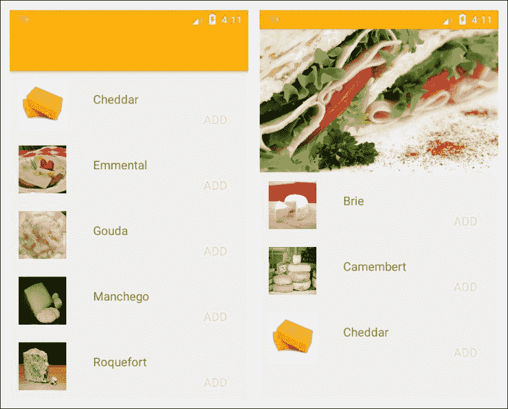
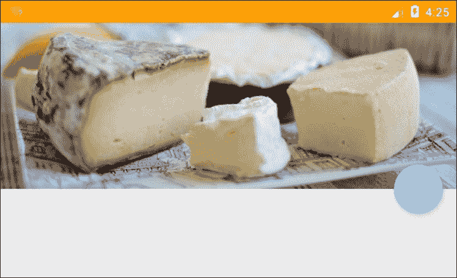
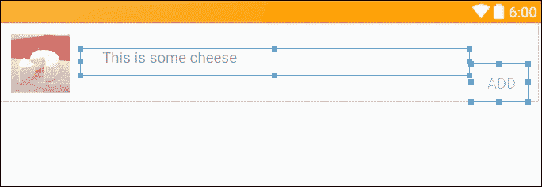
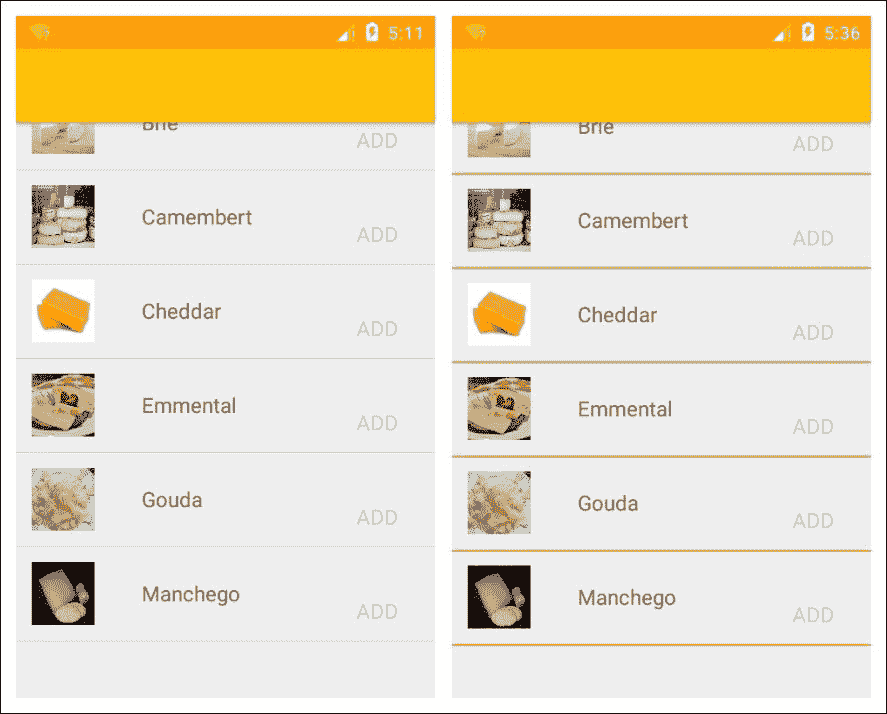
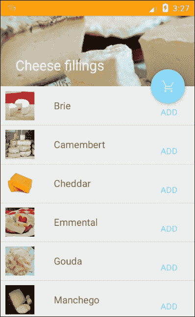
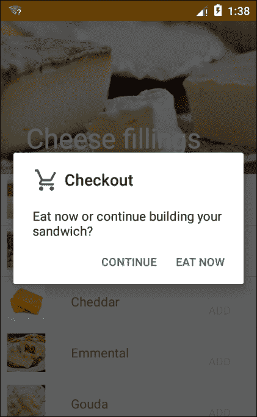
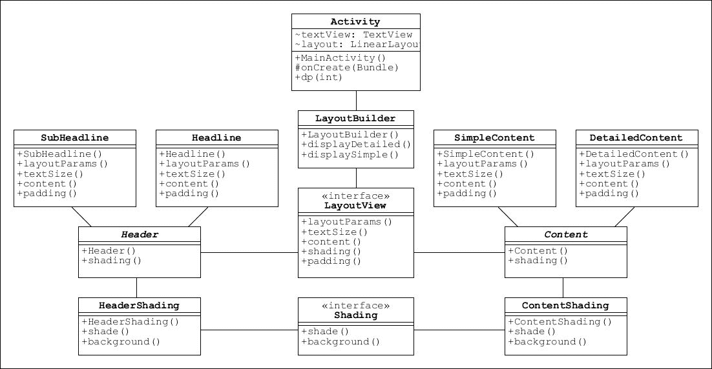
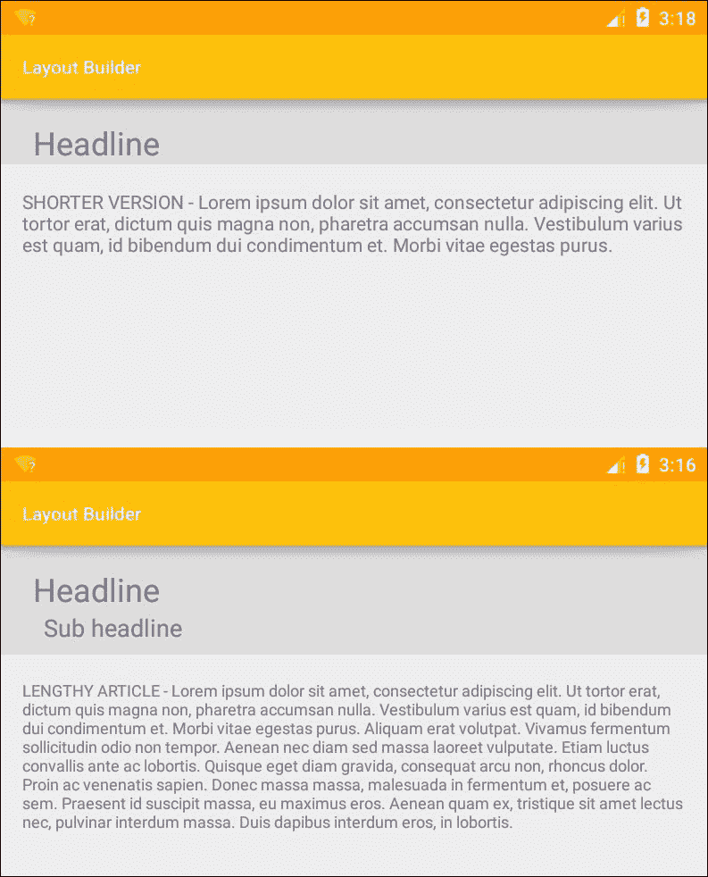

# 六、激活模式

到目前为止的章节已经作为一个扩展的介绍，探索了安卓开发的实用性和设计模式应用的理论。我们已经介绍了安卓应用的许多基本组件，并看到了一些最有用的模式是如何形成的，但我们还没有将两者结合起来。

在本章中，我们将构建应用的主要部分之一，即配料选择菜单。这将涉及一个可滚动的填充列表，可以选择、扩展和取消。在途中，我们还将查看可折叠工具栏和一两个其他方便的支持库功能，为操作按钮、浮动操作按钮和警报对话框添加功能。

在这段代码的核心，我们将应用一个简单的工厂模式来创建每个成分。这将很好地展示这种模式如何对客户端类隐藏创建逻辑。在本章中，我们将只创建一个填充类型的示例，看看它是如何完成的，但是随着复杂性的增加，相同的结构和过程将在后面使用。这将引导我们探索回收视图格式和装饰，如网格布局和分隔线。

然后，我们将继续通过单击按钮来生成和自定义警报对话框。这将需要一个内置的构建器模式，并引导我们了解如何创建一个自己的构建器模式来膨胀布局。

在本章中，您将学习如何:

*   创建应用栏布局
*   应用折叠工具栏
*   控制滚动行为
*   包括嵌套滚动视图
*   应用数据工厂
*   创建列表项视图
*   将文本视图转换为按钮
*   应用网格布局
*   添加分隔装饰
*   配置操作图标
*   创建警报对话框
*   自定义对话框
*   添加第二个活动
*   应用扫动和消除行为
*   创建布局生成器图案
*   运行时创建布局

我们应用的用户将需要某种方式来选择配料。我们当然可以给他们一个长长的清单，但是这样会很麻烦，也没有吸引力。显然，我们需要将我们的配料分成不同的类别。在下面的例子中，我们将只关注其中的一个组，因为这将有助于简化基础流程，以便稍后考虑更复杂的场景。我们将从创建必要的布局开始，从折叠工具栏布局开始。

# 折叠工具栏

方便地滑出的工具栏是材质设计 ui 的一个常见特征，它提供了一种优雅而巧妙的方式来很好地利用手机甚至笔记本电脑上有限的空间。



正如你想象的那样**折叠工具栏布局**是设计支持库的一部分。它是 **AppBarLayout** 的子布局，这是一个线性布局，专门为材质设计特性而设计。

折叠工具栏有助于优雅地管理空间，也为展示吸引人的图形和帮助推广我们的产品提供了一个很好的机会。它们几乎不需要时间来实现，并且很容易调整。

了解它们如何工作的最好方法是构建一个，下面的步骤演示了如何做到这一点:

1.  启动一个新项目，包括回收视图和设计支持库。
2.  通过将主题更改为

    ```java
    Theme.AppCompat.Light.NoActionBar 

    ```

    来移除动作栏
3.  打开`activity_main.xml`文件，应用如下根布局:

    ```java
    <android.support.design.widget.CoordinatorLayout  
        xmlns:android="http://schemas.android.com/apk/res/android" 
        xmlns:app="http://schemas.android.com/apk/res-auto" 
        android:layout_width="match_parent" 
        android:layout_height="match_parent"> 

    </android.support.design.widget.CoordinatorLayout> 

    ```

4.  在这里面，加上这个`AppBarLayout` :

    ```java
    <android.support.design.widget.AppBarLayout 
        android:id="@+id/app_bar" 
        android:layout_width="match_parent" 
        android:layout_height="wrap_content" 
        android:fitsSystemWindows="true"> 

    </android.support.design.widget.AppBarLayout> 

    ```

5.  将此`CollapsingToolbarLayout`放在应用栏内:

    ```java
    <android.support.design.widget.CollapsingToolbarLayout 
        android:id="@+id/collapsing_toolbar" 
        android:layout_width="match_parent" 
        android:layout_height="wrap_content" 
        android:fitsSystemWindows="true" 
        app:contentScrim="?attr/colorPrimary" 
        app:layout_scrollFlags="scroll|exitUntilCollapsed|enterAlwaysCollapsed"> 

    </android.support.design.widget.CollapsingToolbarLayout> 

    ```

6.  折叠工具栏的内容有以下两个视图:

    ```java
    <ImageView 
        android:id="@+id/toolbar_image" 
        android:layout_width="match_parent" 
        android:layout_height="match_parent" 
        android:fitsSystemWindows="true" 
        android:scaleType="centerCrop" 
        android:src="@drawable/some_drawable" 
        app:layout_collapseMode="parallax" /> 

    <android.support.v7.widget.Toolbar 
        android:id="@+id/toolbar" 
        android:layout_width="match_parent" 
        android:layout_height="?attr/actionBarSize" 
        app:layout_collapseMode="pin" /> 

    ```

7.  现在，在应用栏布局下方，添加这个回收器视图:

    ```java
    <android.support.v7.widget.RecyclerView 
        android:id="@+id/recycler_view" 
        android:layout_width="match_parent" 
        android:layout_height="match_parent" 
        android:scrollbars="vertical" 
        app:layout_behavior="@string/appbar_scrolling_view_behavior" /> 

    ```

8.  Finally, add this floating action button:

    ```java
    <android.support.design.widget.FloatingActionButton 
        android:id="@+id/fab" 
        android:layout_width="wrap_content" 
        android:layout_height="wrap_content" 
        android:layout_marginEnd="@dimen/fab_margin_end" 
        app:layout_anchor="@id/app_bar" 
        app:layout_anchorGravity="bottom|end" /> 

    ```

    

    ### 类型

    将状态栏设置为半透明是可能的，而且通常是可取的，这样我们的应用栏图像就可以在它的后面看到。这是通过向 styles.xml 文件中添加以下两项来实现的:

    ```java
    <item name="android:windowDrawsSystemBarBackgrounds">true</item> 
    <item name="android:statusBarColor">@android:color/transparent</item> 

    ```

我们已经在前一章中遇到了协调器布局，并看到它如何促进许多材质设计功能。`AppBarLayout`做了类似的事情，一般用作折叠工具栏的容器。

另一方面，**协同工具栏布局**需要一两件事来解释。首先，使用`android:layout_height="wrap_content"`会产生不同的效果，这取决于其 ImageView 包含的图像的高度。这样做是为了当我们为不同的屏幕尺寸和密度设计替代布局时，我们可以简单地相应地缩放该图像。这里它是为一个小型(480 x 854dp) 240dpi 设备配置的，高 192dp。我们当然可以在 dp 中设置布局高度，并在各种`dimens.xml`文件中缩放该值。然而，我们仍然必须缩放图像，所以这种方法一举两得。

关于折叠工具栏布局的另一个有趣的点是，我们可以控制它如何滚动，正如您所想象的，这是由**布局 _ 滚动标志**属性处理的。这里我们用了`scroll`、`exitUntilCollapsed`、`enterAlwaysCollapsed`。这意味着工具栏永远不会从屏幕顶部消失，并且工具栏不会展开，直到列表不再向下滚动。

有五个滚动标志，它们是:

*   `scroll` -启用滚动
*   `exitUntilCollapsed` -防止工具栏向上滚动时消失(忽略直到向下滚动时才丢失工具栏)
*   `enterAlways` -只要列表向下滚动，工具栏就会展开
*   `enterAlwaysCollapsed` -工具栏仅从列表顶部展开
*   `snap` -工具栏快速就位，而不是滑动

折叠工具栏中的图像视图几乎与我们可能看到的任何其他图像视图相同，除了`layout_collapseMode` 属性。这有两种可能的设置，`pin`和`parallax`:

*   `pin` -列表和工具栏一起移动
*   `parallax` -列表和工具栏分别移动

欣赏这些效果的最好方法就是尝试一下。我们也可以在图像下方的工具栏上应用这些布局折叠模式中的任何一种，但是当我们希望工具栏保持在屏幕上时，我们不需要关心它的折叠行为。

这里包含我们数据的回收视图与我们在本书前面使用的视图只有一个方面不同。那就是包含了一行:

```java
app:layout_behavior="@string/appbar_scrolling_view_behavior" 

```

这个属性是我们必须添加到位于应用栏下方的任何视图或视图组中的全部内容，以允许两者协调它们的滚动行为。

当涉及到实现材质设计时，这些简单的类为我们节省了大量的工作，并让我们专注于提供功能。除了图像的大小之外，只需要很少的重构就可以创建在大量可能的设备上工作的布局。

虽然我们在这里使用的是回收视图，但是在应用栏下面可以放置任意数量的视图和视图组。只要他们拥有`app:layout_behavior="@string/appbar_scrolling_view_behavior"` 属性，他们就会和酒吧步调一致。有一个布局特别适合这个目的，那就是**嵌套的滚动视图**。举例来说，它看起来像这样:

```java
<android.support.v4.widget.NestedScrollView 
    android:layout_width="match_parent" 
    android:layout_height="match_parent" 
    app:layout_behavior="@string/appbar_scrolling_view_behavior"> 

    <TextView 
        android:id="@+id/nested_text" 
        android:layout_width="match_parent" 
        android:layout_height="wrap_content" 
        android:padding="@dimen/nested_text_padding" 
        android:text="@string/some_text" 
        android:textSize="@dimen/nested_text_textSize" /> 

</android.support.v4.widget.NestedScrollView> 

```

下一个逻辑步骤是创建一个布局来填充回收器视图，但是首先我们需要准备数据。在本章中，我们将开发一个应用组件，负责向用户呈现特定类别的配料列表，在本例中是奶酪。我们将使用**工厂模式**来创建这些对象。

# 应用数据工厂模式

在本节中，我们将应用工厂模式来创建类型为*奶酪*的对象。这将依次实现一个*填充*界面。每件物品都将由价格和热值等几个属性组成。其中一些值将显示在我们的列表项中，而其他值只能通过扩展视图或通过代码访问。

设计模式为数不多的缺点之一是很快就会积累大量的类。为此，在开始下面的练习之前，在`java`目录内创建一个新的包，称为`fillings`。

按照以下步骤创建我们的奶酪工厂:

1.  在`fillings`包中创建一个名为`Filling`的新界面，并像这样完成:

    ```java

    public interface Filling { 

        String getName(); 
        int getImage(); 
        int getKcal(); 
        boolean isVeg(); 
        int getPrice(); 
    } 

    ```

2.  接下来，创建一个实现`Filling`的抽象类，称为`Cheese`，如下所示:

    ```java
    public abstract class Cheese implements Filling { 
        private String name; 
        private int image; 
        private String description; 
        private int kcal; 
        private boolean vegetarian; 
        private int price; 

        public Cheese() { 
        } 

        public abstract String getName(); 

        public abstract int getImage(); 

        public abstract int getKcal(); 

        public abstract boolean getVeg(); 

        public abstract int getPrice(); 
    } 

    ```

3.  创建一个名为`Cheddar`的具体类，就像这里的这个:

    ```java
    public class Cheddar extends Cheese implements Filling { 

        @Override 
        public String getName() { 
            return "Cheddar"; 
        } 

        @Override 
        public int getImage() { 
            return R.drawable.cheddar; 
        } 

        @Override 
        public int getKcal() { 
            return 130; 
        } 

        @Override 
        public boolean getVeg() { 
            return true; 
        } 

        @Override 
        public int getPrice() { 
            return 75; 
        } 
    } 

    ```

4.  按照`Cheddar`的思路创建其他几个`Cheese`类。

创建了工厂后，我们需要一种方法来代表每一种奶酪。为此，我们将创建一个项目布局。

# 定位项目布局

为了保持界面干净，我们将为回收视图列表创建一个非常简单的项目。它将只包含一个图像、一个字符串和一个操作按钮，供用户将配料添加到三明治中。

初始项目布局如下所示:



这可能看起来是一个非常简单的布局，但它并不像看上去那样简单。以下是三个视图的代码:

图像:

```java
<ImageView 
    android:id="@+id/item_image" 
    android:layout_width="@dimen/item_image_size" 
    android:layout_height="@dimen/item_image_size" 
    android:layout_gravity="center_vertical|end" 
    android:layout_margin="@dimen/item_image_margin" 
    android:scaleType="fitXY" 
    android:src="@drawable/placeholder" /> 

```

标题:

```java
<TextView 
    android:id="@+id/item_name" 
    android:layout_width="0dp" 
    android:layout_height="wrap_content" 
    android:layout_gravity="center_vertical" 
    android:layout_weight="1" 
    android:paddingBottom="@dimen/item_name_paddingBottom" 
    android:paddingStart="@dimen/item_name_paddingStart" 
    android:text="@string/placeholder" 
    android:textSize="@dimen/item_name_textSize" /> 

```

操作按钮:

```java
<Button 
    android:id="@+id/action_add" 
    style="?attr/borderlessButtonStyle" 
    android:layout_width="wrap_content" 
    android:layout_height="wrap_content" 
    android:layout_gravity="center_vertical|bottom" 
    android:layout_marginEnd="@dimen/action_marginEnd"" 
    android:minWidth="64dp" 
    android:padding="@dimen/action_padding" 
    android:paddingEnd="@dimen/action_paddingEnd" 
    android:paddingStart="@dimen/action_paddingStart" 
    android:text="@string/action_add_text" 
    android:textColor="@color/colorAccent" 
    android:textSize="@dimen/action_add_textSize" /> 

```

这里各种资源的管理方式值得一看。以下是`dimens.xml`文件:

```java
<dimen name="item_name_paddingBottom">12dp</dimen> 
<dimen name="item_name_paddingStart">24dp</dimen> 
<dimen name="item_name_textSize">16sp</dimen> 

<dimen name="item_image_size">64dp</dimen> 
<dimen name="item_image_margin">12dp</dimen> 

<dimen name="action_padding">12dp</dimen> 
<dimen name="action_paddingStart">16dp</dimen> 
<dimen name="action_paddingEnd">16dp</dimen> 
<dimen name="action_marginEnd">12dp</dimen> 
<dimen name="action_textSize">16sp</dimen> 

<dimen name="fab_marginEnd">16dp</dimen> 

```

很明显，这些属性中有几个具有相同的值，我们只需要五个就可以达到相同的效果。然而，这可能会导致代码混乱，尤其是在以后进行更改时，尽管采用了这种奢侈的方法，但仍然存在一些隐藏的效率。动作按钮的填充和边距设置对于整个应用中的所有此类按钮都是相同的，从它们的名称中可以清楚地看到，并且只需要声明一次。同样，这个布局中的文本和图像视图在这个应用中是唯一的，因此会相应地命名。这也使得调整单个属性更加清晰。

最后，`android:minWidth="64dp"`的使用是一个实质性的规定，旨在确保所有这些按钮对于普通手指来说足够宽。

这就完成了这个活动的布局，我们的对象工厂也就位了，我们现在可以像以前一样，用一个数据适配器和一个视图容器填充我们的回收器视图。

# 使用带有回收视图的工厂

正如我们在本书前面简要看到的，RecyclerViews 利用了一个内部布局管理器。这又通过使用适配器与数据集进行通信。这些适配器的功能与我们在本书前面探讨的适配器设计模式完全相同。该函数可能看起来不太明显，但它充当了数据集和回收视图的布局管理器之间的连接。适配器用它的视图支架穿过这座桥。适配器的工作与客户端代码完全分离，我们只需要几行代码就可以创建一个新的适配器和布局管理器。

考虑到这一点并准备好数据，我们可以通过以下简单步骤快速组装适配器:

1.  首先在你的主包中创建这个新类:

    ```java
    public class DataAdapter extends RecyclerView.Adapter<DataAdapter.ViewHolder> { 

    ```

2.  它需要以下字段和构造函数:

    ```java
    private List<Cheese> cheeses; 

    public DataAdapter(List<Cheese> cheeses) { 
        this.cheeses = cheeses; 
    } 

    ```

3.  现在添加`ViewHolder`作为内部类，像这样:

    ```java
    public static class ViewHolder extends RecyclerView.ViewHolder { 
        public ImageView imageView; 
        public TextView nameView; 

        public ViewHolder(View itemView) { 
            super(itemView); 

            imageView = (ImageView) itemView.findViewById(R.id.item_image); 
            nameView = (TextView) itemView.findViewById(R.id.item_name); 
        } 
    } 

    ```

4.  有三个继承的方法必须被重写。`onCreateViewHolder()`方法:

    ```java
    @Override 
    public DataAdapter.ViewHolder onCreateViewHolder(ViewGroup parent, int viewType) { 
        Context context = parent.getContext(); 
        LayoutInflater inflater = LayoutInflater.from(context); 

        View cheeseView = inflater.inflate(R.layout.item_view, parent, false); 

        return new ViewHolder(cheeseView); 
    } 

    ```

5.  `onBindViewHolder()`方法:

    ```java
    @Override 
    public void onBindViewHolder(DataAdapter.ViewHolder viewHolder, int position) { 
        Cheese cheese = cheeses.get(position); 

        ImageView imageView = viewHolder.imageView; 
        imageView.setImageResource(cheese.getImage()); 

        TextView nameView = viewHolder.nameView; 
        nameView.setText(cheese.getName()); 
    } 

    ```

6.  `getItemCount()`方法:

    ```java
    @Override 
    public int getItemCount() { 
        return cheeses.size(); 
    } 

    ```

这就是现在完成的适配器，我们需要关心的是将它连接到我们的数据和回收视图。这个我们从`onCreate()`法的主要活动来做。首先，我们需要创建一个所有奶酪的列表。有了我们的模式，这非常简单。下面的方法可以在任何地方使用，但这里放在主活动中:

```java
private ArrayList<Cheese> buildList() { 
    ArrayList<Cheese> cheeses = new ArrayList<>(); 

    cheeses.add(new Brie()); 
    cheeses.add(new Camembert()); 
    cheeses.add(new Cheddar()); 
    cheeses.add(new Emmental()); 
    cheeses.add(new Gouda()); 
    cheeses.add(new Manchego()); 
    cheeses.add(new Roquefort()); 

    return cheeses; 
}
```

### 注

请注意，您需要从填充包中导入这些类中的每一个。

我们现在可以通过适配器将它连接到回收器视图，方法是将这些行添加到主活动中的`onCreate()`方法中:

```java
RecyclerView recyclerView = (RecyclerView) findViewById(R.id.recycler_view); 

ArrayList<Cheese> cheeses = buildList(); 
DataAdapter adapter = new DataAdapter(cheeses); 

recyclerView.setLayoutManager(new LinearLayoutManager(this)); 
recyclerView.setAdapter(adapter); 

recyclerView.setHasFixedSize(true); 

```

最突出的第一件事就是需要的客户端代码有多少，它有多不言自明。不仅是设置回收器视图和适配器的代码，还有构建列表的代码。如果没有这个模式，我们最终会得到这样的代码:

```java
cheeses.add(new Cheese("Emmental", R.drawable.emmental), 120, true, 65); 

```

该项目现在可以在设备上进行测试。


我们在这里使用的线性布局管理器并不是我们唯一可用的。还有另外两个管理器，一个用于网格布局，一个用于交错布局。它们可以这样应用:

```java
recyclerView.setLayoutManager(new StaggeredGridLayoutManager(3, StaggeredGridLayoutManager.VERTICAL)); 

recyclerView.setLayoutManager(new GridLayoutManager(this, 2)); 

```

这样只需要稍微调整布局文件，我们甚至可以提供替代布局，让用户选择他们喜欢的。

从视觉角度来看，我们已经把一切都准备好了。然而，有了这样一个稀疏的项目设计，在项目之间添加分隔线可能会很好。这并不像人们想象的那样简单，但它仍然是一个简单而优雅的过程。

# 添加分频器

在 RecyclerView 之前，ListView 有自己的分隔符元素。另一方面，回收者的观点则不然。然而，这不应被视为不足，因为后一种方法允许更大的灵活性。

通过在项目布局的底部添加非常窄的视图来创建分隔线似乎很有诱惑力，但这被认为是非常糟糕的做法，因为当项目被移动或取消时，分隔线会随之移动。

RecyclerView 使用一个内部类**项目装饰**来提供项目之间的分隔，以及空间和高光。它还有一个非常有用的子类，ItemTouchHelper，当我们看到如何刷卡和退卡时，我们很快就会遇到它。

首先，按照以下步骤将分隔线添加到我们的回收视图中:

1.  创建新的项目装饰类:

    ```java
    public class ItemDivider extends RecyclerView.ItemDecoration 

    ```

2.  包括该可绘制字段:

    ```java
    Private Drawable divider; 

    ```

3.  后跟此构造函数:

    ```java
        public ItemDivider(Context context) { 
            final TypedArray styledAttributes = context.obtainStyledAttributes(ATTRS); 
            divider = styledAttributes.getDrawable(0); 
            styledAttributes.recycle(); 
        } 

    ```

4.  然后覆盖`onDraw()`方法:

    ```java
    @Override 
    public void onDraw(Canvas canvas, RecyclerView parent, RecyclerView.State state) { 
        int left = parent.getPaddingLeft(); 
        int right = parent.getWidth() - parent.getPaddingRight(); 

        int count = parent.getChildCount(); 
        for (int i = 0; i < count; i++) { 
            View child = parent.getChildAt(i); 

            RecyclerView.LayoutParams params = (RecyclerView.LayoutParams) child.getLayoutParams(); 

            int top = child.getBottom() + params.bottomMargin; 
            int bottom = top + divider.getIntrinsicHeight(); 

            divider.setBounds(left, top, right, bottom); 
            divider.draw(canvas); 
        } 
    } 

    ```

5.  现在只需要在`LayoutManager`设置好之后，在活动的`onCreate()`方法中实例化分割线:

    ```java
    recyclerView.addItemDecoration(new ItemDivider(this)); 

    ```

这段代码提供了项目之间的系统划分。物品装饰也使得非常简单地创建**定制分隔器**成为可能。

只需遵循这两个步骤，就可以了解它是如何实现的:

1.  在名为`item_divider.xml`的`drawable`目录中创建一个 XML 文件，如下所示:

    ```java
    <?xml version="1.0" encoding="utf-8"?> 
    <shape xmlns:android="http://schemas.android.com/apk/res/android" 
        android:shape="rectangle"> 

        <size android:height="1dp" /> 
        <solid android:color="@color/colorPrimaryDark" /> 

    </shape> 

    ```

2.  向`ItemDivider`类添加第二个构造函数，如下所示:

    ```java
    public ItemDivider(Context context, int resId) { 
        divider = ContextCompat.getDrawable(context, resId); 
    } 

    ```

3.  Then replace the divider initialization in the activity, with this one:

    ```java
    recyclerView.addItemDecoration(new ItemDivider(this, R.drawable.item_divider)); 

    ```

    运行时，这两种技术将产生如下所示的结果:

    

    ### 类型

    上述方法在视图之前绘制分隔线。如果您有一个花哨的分割线，并希望它的一部分与视图重叠，那么您将需要覆盖`onDrawOver()`方法，这将导致分割线在视图之后绘制。

现在是时候开始给我们的项目增加一点功能了。我们将从考虑我们希望为浮动操作按钮提供哪些功能开始。

# 配置浮动动作按钮

到目前为止，我们的布局只提供了一个动作，*在每个列表项上添加*动作按钮。这将用于在用户的最终三明治中包括该填充物。确保用户离花钱永远不会超过一次点击总是一个好主意，因此我们将在活动中添加结账功能。

我们首先需要的是一个图标。图标的最佳来源可能是我们在本书前面使用的资产工作室。这是一个在我们的项目中包含图标的好方法，主要是因为它会自动为所有可用的屏幕密度生成版本。但是图标数量有限，没有结账篮。我们在这里有两个选择:我们可以在网上找到一个图标，或者我们可以自己设计。

网上有大量符合材质的图标，谷歌也有自己的图标，可在以下网址找到:

*   [design.google.com/icons/](http://design.google.com/icons/)

很多开发者更喜欢自己设计图形，总会有找不到需要的图标的时候。谷歌还提供图标设计综合指南，网址为:

*   [material.google.com/style/icons.html](http://material.google.com/style/icons.html)

无论您选择哪个选项，都可以通过其`src`属性将其添加到按钮中，如下所示:

```java
android:src="@drawable/ic_cart" 

```

创建了我们的图标后，我们现在需要考虑颜色。根据材质设计指南，动作和系统图标应与主要或次要文本颜色相同。正如人们可能想象的那样，这些不是两种灰色，而是由透明度定义的。这样做是因为它在彩色背景下比灰色阴影效果更好。到目前为止，我们已经使用了默认的文本颜色，并且没有将其包含在我们的`styles.xml`文件中。这很容易做到，因为关于材质文本颜色的规则如下:


要为我们的主题创建主要和次要文本颜色，请将这些行添加到`colors`文件中:

```java
<color name="text_primary_dark">#DE000000</color> 
<color name="text_secondary_dark">#8A000000</color> 

<color name="text_primary_light">#FFFFFFFF</color> 
<color name="text_secondary_light">#B3FFFFFF</color> 

```

然后根据背景色调在`styles`文件中添加适当的线条，例如:

```java

<item name="android:textColorPrimary">@color/text_primary_light</item> 
<item name="android:textColorSecondary">@color/text_secondary_light</item> 

```

如果你使用了一个图像资源或者下载了谷歌的一个素材图标，那么系统会自动将主要的文本颜色应用到我们的 FAB 图标上。否则，您需要直接给图标上色。

我们现在可以通过以下两个步骤激活工具栏和 FAB:

1.  将这些行添加到主活动的`onCreate()`方法中:

    ```java
    Toolbar toolbar = (Toolbar) findViewById(R.id.toolbar); 
    setSupportActionBar(toolbar); 

    ```

2.  Add the following click listener to the `onCreate()` method of its activity:

    ```java
    FloatingActionButton fab = (FloatingActionButton) findViewById(R.id.fab); 
    fab.setOnClickListener(new View.OnClickListener() { 

        @Override 
        public void onClick(View view) { 
            // SYSTEM DISMISSES DIALOG 
        } 
    }); 

    ```

    当视图滚动时，FAB 图标和工具栏标题现在将可见并正确动画化:

    

点击 FAB 会将用户带到另一个活动，即结账活动。但是，他们可能错误地单击了按钮，因此我们应该首先向他们显示一个对话框，让他们确认选择。

# 对话框构建器

除了对少数应用至关重要之外，安卓对话框还提供了一个很好的方式来查看框架本身如何使用设计模式。在这种情况下，是对话构建器，它将一系列设置器串在一起来构建我们的对话。

在目前的情况下，我们真正需要的是一个非常简单的对话框，允许用户确认他们的选择，但是对话框构建是一个非常有趣的话题，所以我们将仔细看看它是如何完成的，以及如何使用内置的构建器模式来构建它们。

如果得到确认，我们将要构建的对话框会将用户带到另一个活动，因此在此之前，我们应该创建该活动。从项目浏览器菜单中选择`New | Activity | Blank Activity`即可轻松完成。这里我们称之为`CheckoutActivity.java`。

创建此活动后，请遵循以下两个步骤:

1.  点击侦听器上的浮动操作按钮将构建和扩展我们的对话框。它相当长，所以创建一个名为`buildDialog()`的新方法:并在`onCreate()`方法的底部添加以下两行:

    ```java
    fab = (FloatingActionButton) findViewById(id.fab); 
    buildDialog(fab); 

    ```

2.  Then define the method like this:

    ```java
    private void buildDialog(FloatingActionButton fab) { 
        fab.setOnClickListener(new View.OnClickListener() { 

            @Override 
            public void onClick(View view) { 
                AlertDialog.Builder builder = new AlertDialog.Builder(MainActivity.this); 

                LayoutInflater inflater = MainActivity.this.getLayoutInflater(); 

            builder.setTitle(R.string.checkout_dialog_title) 

                    .setMessage(R.string.checkout_dialog_message) 

                    .setIcon(R.drawable.ic_sandwich_primary) 

                    .setPositiveButton(R.string.action_ok_text, new DialogInterface.OnClickListener() { 

                        public void onClick(DialogInterface dialog, int id) { 
                            Intent intent = new Intent(MainActivity.this, CheckoutActivity.class); 
                            startActivity(intent); 
                        } 
                    }) 

                    .setNegativeButton(R.string.action_cancel_text, new DialogInterface.OnClickListener() { 

                        public void onClick(DialogInterface dialog, int id) { 
                            // SYSTEM DISMISSES DIALOG 
                        } 
                    }); 

                AlertDialog dialog = builder.create(); 
                dialog.show(); 
            } 
        }); 
    } 

    ```

    

对于这样一个简单的对话框，没有必要有一个标题和一个图标，这些只是作为例子。`AlertDialog.Builder`还提供了许多其他属性，综合指南可在以下位置找到:

developer.android.com/reference/android/app/AlertDialog.Builder.html

这提供了一种方便的方法来组合我们所能想到的几乎所有警报对话框，但是它有一些不足。例如，上面的对话框使用默认主题为按钮文本着色。有了我们定制的主题，很高兴看到这也应用到我们的对话框中。这很容易通过创建自定义对话框来实现。

## 自定义对话框

如您所料，自定义对话框是用 XML 布局文件定义的，就像我们设计其他布局一样。此外，我们可以在构建器链中扩展这个布局，这意味着我们可以在同一个对话框中组合自定义和默认功能。

定制我们的对话框只有两个步骤:

1.  首先，创建一个名为`checkout_dialog.xml`的新布局资源文件，并像这样完成:

    ```java
    <?xml version="1.0" encoding="utf-8"?> 
    <LinearLayout xmlns:android="http://schemas.android.com/apk/res/android" 
        android:layout_width="match_parent" 
        android:layout_height="match_parent" 
        android:orientation="vertical" 
        android:theme="@style/AppTheme"> 

        <ImageView 
            android:id="@+id/dialog_title" 
            android:layout_width="match_parent" 
            android:layout_height="@dimen/dialog_title_height" 
            android:src="@drawable/dialog_title" /> 

        <TextView 
        android:id="@+id/dialog_content" 
        android:layout_width="wrap_content" 
        android:layout_height="wrap_content" 
        android:paddingStart="@dimen/dialog_message_padding" 
        android:text="@string/checkout_dialog_message" 
        android:textAppearance="?android:attr/textAppearanceSmall" 
        android:textColor="@color/text_secondary_dark" /> 

    </LinearLayout> 

    ```

2.  然后，编辑`buildDialog()`方法以匹配这里看到的方法。与前一种方法不同的地方突出显示了:

    ```java
    private void buildDialog(FloatingActionButton fab) { 
        fab.setOnClickListener(new View.OnClickListener() { 

            @Override 
            public void onClick(View view) { 
                AlertDialog.Builder builder = new AlertDialog.Builder(MainActivity.this); 

                LayoutInflater inflater = MainActivity.this.getLayoutInflater(); 

                builder.setView(inflater.inflate(layout.checkout_dialog, null)) 

                        .setPositiveButton(string.action_ok_text, new DialogInterface.OnClickListener() { 
                            public void onClick(DialogInterface dialog, int id) { 
                                Intent intent = new Intent(MainActivity.this, CheckoutActivity.class); 
                                startActivity(intent); 
                            } 
                        }) 

                        .setNegativeButton(string.action_cancel_text, new DialogInterface.OnClickListener() { 
                            public void onClick(DialogInterface dialog, int id) { 
                                // System dismisses dialog 
                            } 
                        }); 

                AlertDialog dialog = builder.create(); 
                dialog.show(); 

                Button cancelButton = dialog.getButton(DialogInterface.BUTTON_NEGATIVE); 
                cancelButton.setTextColor(getResources().getColor(color.colorAccent)); 

                Button okButton = dialog.getButton(DialogInterface.BUTTON_POSITIVE); 
                okButton.setTextColor(getResources().getColor(color.colorAccent)); 
            } 
        }); 
    } 

    ```

这里，我们使用`AlertDialog.Builder`将视图设置为自定义布局。这需要布局资源和父级，但是在这种情况下，我们是从侦听器中构建的，所以它仍然是`null`。

在设备上测试时，输出应该类似于下面的截图:


### 类型

值得注意的是，在为按钮定义字符串资源时，最好不要将整个字符串大写，而只将第一个字母大写。例如，以下定义在前面的示例中创建了按钮上的文本:

```java
<string name="action_ok_text">Eat now</string> 
<string name="action_cancel_text">Continue</string> 

```

在这个例子中，我们定制了对话框的标题和内容，但是仍然使用了提供的“确定”和“取消”按钮，并且我们可以将自己的定制与对话框的许多设置器混合和匹配。

在我们继续之前，我们将为回收器视图、滑动和消除行为提供另一种形式的功能。

# 添加扫动和消除动作

在这个特殊的应用中，我们不太可能需要滑动和消除行为，因为列表很短，允许用户编辑它们几乎没有什么好处。然而，为了让我们看到这个重要而有用的功能是如何应用的，我们将在这里实现它，尽管我们不会将它包括在最终设计中。

滑动以及拖放很大程度上是由**itemttouchhelper**来管理的，这是 RecyclerView.ItemDecoration 的一种类型，为这个类提供的回调允许我们检测项目的移动和方向，并拦截这些动作，并在代码中做出响应。

正如您在这里看到的，实现刷取和消除行为只需几个步骤:

1.  首先，我们的列表现在要改变长度，所以删除线 `recyclerView.setHasFixedSize(true);` 或将其设置为`false`。
2.  保持我们的`onCreate()`方法尽可能简单总是一个好主意，因为那里经常会发生很多事情。我们将创建一个单独的方法来初始化我们的项目触摸助手，并从`onCreate()`调用它。方法如下:

    ```java
    private void initItemTouchHelper() { 
        ItemTouchHelper.SimpleCallback callback = new ItemTouchHelper.SimpleCallback(0, ItemTouchHelper.LEFT | ItemTouchHelper.RIGHT) { 

            @Override 
            public boolean onMove(RecyclerView recyclerView, RecyclerView.ViewHolder viewHolder, RecyclerView.ViewHolder viewHolder1) { 
                return false; 
            } 

            @Override 
            public void onSwiped(RecyclerView.ViewHolder viewHolder, int direction) { 
                int position = viewHolder.getAdapterPosition(); 
                adapter.removeItem(position); 
            } 
        }; 

        ItemTouchHelper itemTouchHelper = new ItemTouchHelper(callback); 
        itemTouchHelper.attachToRecyclerView(recyclerView); 
    } 

    ```

3.  Now add the following line to the `onCreate()` method:

    ```java
    InitItemTouchHelper(); 

    ```

    尽管执行了六个功能，`onCreate()`方法仍然简短明了:

    ```java
    @Override 
    protected void onCreate(Bundle savedInstanceState) { 
        super.onCreate(savedInstanceState); 
        setContentView(layout.activity_main); 

        Toolbar toolbar = (Toolbar) findViewById(id.toolbar); 
        setSupportActionBar(toolbar); 

        final ArrayList<Cheese> cheeses = buildList(); 
        adapter = new DataAdapter(cheeses); 

        recyclerView = (RecyclerView) findViewById(id.recycler_view); 
        recyclerView.setLayoutManager(new LinearLayoutManager(this)); 
        recyclerView.addItemDecoration(new ItemDivider(this)); 
        recyclerView.setAdapter(adapter); 

        initItemTouchHelper(); 

        fab = (FloatingActionButton) findViewById(id.fab); 
        buildDialog(fab); 
    } 

    ```

如果你在这一点上测试这个应用，你会注意到，虽然项目在被刷的时候从屏幕上消失了，但是差距并没有缩小。这是因为我们尚未通知回收者视图它已被删除。虽然这可以从`initItemTouchHelper()`方法中完成，但它确实属于适配器类，因为它利用了自己的方法。向适配器添加以下方法来完成此任务:

```java
public void removeItem(int position) { 
    cheeses.remove(position); 
    notifyItemRemoved(position); 
    notifyItemRangeChanged(position, cheeses.size()); 

```

移除项目后，回收器视图列表将重新排序:


在这个例子中，用户可以以任何方式滑动一个项目来取消它，这对于我们这里的目的来说是可以的，但是很多时候这种区分非常有用。许多移动应用使用向右滑动来接受项目，向左滑动来取消项目。这很容易通过使用`onSwiped()`方法的方向参数来实现。例如:

```java
if (direction == ItemTouchHelper.LEFT) { 
    Log.d(DEBUG_TAG, "Swiped LEFT"); 
} else { 
    Log.d(DEBUG_TAG, "Swiped RIGHT"); 
} 

```

在本章的前面，我们使用了一个本机模式，AlertDialog。构建器，用于构建布局。正如创建模式的情况一样，过程背后的逻辑对我们来说是隐藏的，但是构建器设计模式提供了一个很好的机制来从单个视图组件构建布局和视图组，我们将在下面看到。

# 构建布局构建器

到目前为止，在本书中，我们构建的所有布局都是静态的 XML 定义。然而，正如您所料，从我们的源代码中动态构建和扩展用户界面是完全可能的。此外，安卓布局非常适合构建器模式，正如我们在警报对话框中看到的，因为它们是由有序的较小对象集合组成的。

以下示例将遵循构建器设计模式，从一系列预定义的*布局视图*展开线性布局。和以前一样，我们将从接口构建到抽象和具体的类。我们将创建两种布局项目，一个标题或*标题*视图和一个*内容*视图。然后我们制作几个具体的例子，这些例子可以由构建者构建。由于所有视图都有一些共同的特性(在这种情况下是文本和背景颜色)，我们将通过另一个接口避免重复方法，该接口有自己的具体扩展来处理这种阴影。

要最好地了解这是如何工作的，请启动一个新的安卓项目，并按照以下步骤构建模型:

1.  创建一个名为`builder`的内包装。将以下所有类添加到此包中。
2.  为我们的视图类创建以下界面:

    ```java
    public interface LayoutView { 

        ViewGroup.LayoutParams layoutParams(); 
        int textSize(); 
        int content(); 
        Shading shading(); 
        int[] padding(); 
    } 

    ```

3.  现在创建文本和背景颜色的界面，像这样:

    ```java
    public interface Shading { 

        int shade(); 
        int background(); 
    } 

    ```

4.  我们将创造`Shading`的具体例子。它们看起来像这样:

    ```java
    public class HeaderShading implements Shading{ 

        @Override 
        public int shade() { 
            return R.color.text_primary_dark; 
        } 

        @Override 
        public int background() { 
            return R.color.title_background; 
        } 
    } 

    public class ContentShading implements Shading{ 

        ... 
            return R.color.text_secondary_dark; 
        ... 

        ... 
            return R.color.content_background; 
        ... 
    } 

    ```

5.  现在我们可以创建我们想要的两种视图的抽象实现。这些应符合以下条件:

    ```java
    public abstract class Header implements LayoutView { 

        @Override 
        public Shading shading() { 
            return new HeaderShading(); 
        } 
    } 

    public abstract class Content implements LayoutView { 

        ... 
            return new ContentShading(); 
        ... 
    } 

    ```

6.  接下来，我们需要创建这两种类型的具体类。首先是标题:

    ```java
    public class Headline extends Header { 

        @Override 
        public ViewGroup.LayoutParams layoutParams() { 
            final int width = ViewGroup.LayoutParams.MATCH_PARENT; 
            final int height = ViewGroup.LayoutParams.WRAP_CONTENT; 

            return new ViewGroup.LayoutParams(width,height); 
        } 

        @Override 
        public int textSize() { 
            return 24; 
        } 

        @Override 
        public int content() { 
            return R.string.headline; 
        } 

        @Override 
        public int[] padding() { 
            return new int[]{24, 16, 16, 0}; 
        } 
    } 

    public class SubHeadline extends Header { 

        ... 

        @Override 
        public int textSize() { 
            return 18; 
        } 

        @Override 
        public int content() { 
            return R.string.sub_head; 
        } 

        @Override 
        public int[] padding() { 
            return new int[]{32, 0, 16, 8}; 
        } 
        ... 

    ```

7.  然后内容:

    ```java
    public class SimpleContent extends Content { 

        @Override 
        public ViewGroup.LayoutParams layoutParams() { 
            final int width = ViewGroup.LayoutParams.MATCH_PARENT; 
            final int height = ViewGroup.LayoutParams.MATCH_PARENT; 

            return new ViewGroup.LayoutParams(width, height); 
        } 

        @Override 
        public int textSize() { 
            return 14; 
        } 

        @Override 
        public int content() { 
            return R.string.short_text; 
        } 

        @Override 
        public int[] padding() { 
            return new int[]{16, 18, 16, 16}; 
        } 
    } 

    public class DetailedContent extends Content { 

        ... 
            final int height = ViewGroup.LayoutParams.WRAP_CONTENT; 
        ... 

        @Override 
        public int textSize() { 
            return 12; 
        } 

        @Override 
        public int content() { 
            return R.string.long_text; 
        } 

        ... 

    ```

这就完成了我们的模型。对于每种类型的视图，我们有两种单独的视图和颜色设置。我们现在可以创建一个助手类，按照我们希望的顺序将这些视图放在一起。这里我们只有两个，一个用于简单的输出，一个用于更详细的布局。

这是构建器的外观:

```java
public class LayoutBuilder { 

    public List<LayoutView> displayDetailed() { 
        List<LayoutView> views = new ArrayList<LayoutView>(); 
        views.add(new Headline()); 
        views.add(new SubHeadline()); 
        views.add(new DetailedContent()); 
        return views; 
    } 

    public List<LayoutView> displaySimple() { 
        List<LayoutView> views = new ArrayList<LayoutView>(); 
        views.add(new Headline()); 
        views.add(new SimpleContent()); 
        return views; 
    } 
} 

```

该模式的类图如下:



正如构建器模式和其他模式的一般意图一样，我们刚才所做的所有工作都是为了对客户端代码隐藏模型逻辑，特别是当前活动和`onCreate()`方法。

我们当然可以在主 XML 活动提供的默认根视图组中扩展这些视图，但是动态生成这些视图通常也很有用，尤其是当我们想要生成嵌套布局时。

下面的活动演示了我们现在如何使用构建器动态膨胀布局:

```java
public class MainActivity extends AppCompatActivity { 
    TextView textView; 
    LinearLayout layout; 

    @Override 
    protected void onCreate(Bundle savedInstanceState) { 
        final int width = ViewGroup.LayoutParams.MATCH_PARENT; 
        final int height = ViewGroup.LayoutParams.WRAP_CONTENT; 

        super.onCreate(savedInstanceState); 

        layout = new LinearLayout(this); 
        layout.setOrientation(LinearLayout.VERTICAL); 
        layout.setLayoutParams(new ViewGroup.LayoutParams(width, height)); 

        setContentView(layout); 

        // COULD USE layoutBuilder.displaySimple() INSTEAD         
        LayoutBuilder layoutBuilder = new LayoutBuilder(); 
        List<LayoutView> layoutViews = layoutBuilder.displayDetailed(); 

                for (LayoutView layoutView : layoutViews) { 
            ViewGroup.LayoutParams params = layoutView.layoutParams(); 
            textView = new TextView(this); 

            textView.setLayoutParams(params); 
            textView.setText(layoutView.content()); 
            textView.setTextSize(TypedValue.COMPLEX_UNIT_SP, layoutView.textSize()); 
            textView.setTextColor(layoutView.shading().shade()); 
            textView.setBackgroundResource(layoutView.shading().background()); 

            int[] pad = layoutView.padding(); 
            textView.setPadding(dp(pad[0]), dp(pad[1]), dp(pad[2]), dp(pad[3])); 

            layout.addView(textView); 
        } 
    } 
} 

```

您还需要以下方法，用于从`px`转换到`dp`:

```java
public int dp(int px) { 
    final float scale = getResources().getDisplayMetrics().density; 
    return (int) (px * scale + 0.5f); 
} 

```

当在设备上运行时，将产生以下两个用户界面之一:



不出所料，客户端代码简单、简短且易于理解。

不需要使用编程布局或静态布局，两者可以混合使用。视图可以用 XML 设计，然后像我们在 Java 中做的那样膨胀它们。我们甚至可以保持在这里使用的相同模式。

这里还有很多内容可以介绍，比如如何包含其他类型的视图，比如使用适配器或桥接模式的图像，但是我们将在本书的后面介绍组合模式。目前，我们已经了解了布局构建器的工作原理，以及它如何将其逻辑与客户端代码分离。

# 总结

这一章已经讲了很多。我们首先创建了一个折叠工具栏和一个功能回收视图。我们看到了如何将基本功能添加到我们的大部分布局中，以及工厂模式如何应用于特定的情况。这让我们开始探索如何使用内部和创建的构建器来构建详细的布局。

在下一章中，我们将进一步研究对用户活动的响应，现在我们有了一些可用的小部件和视图，如何将它们连接到一些有用的逻辑。