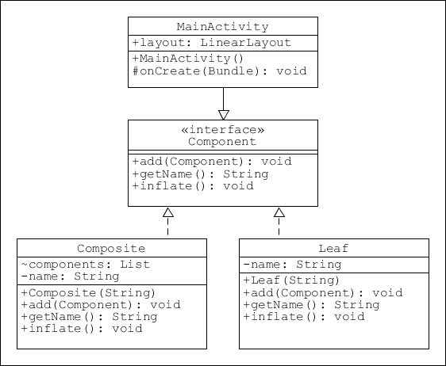
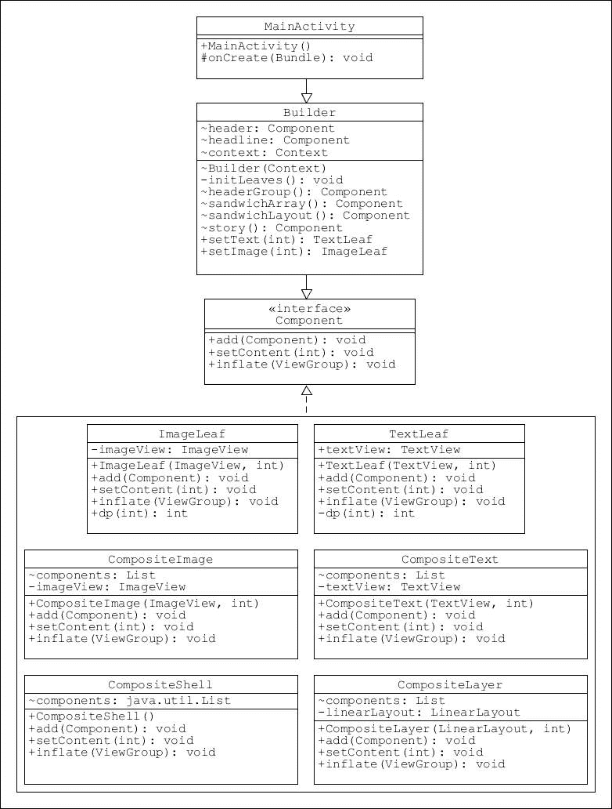
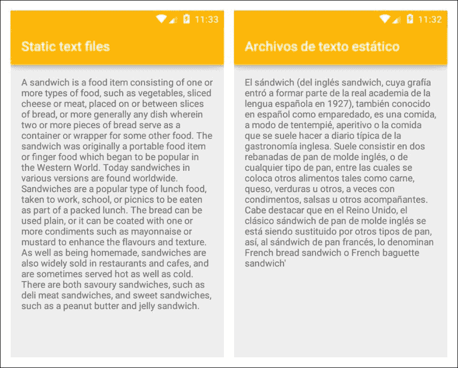
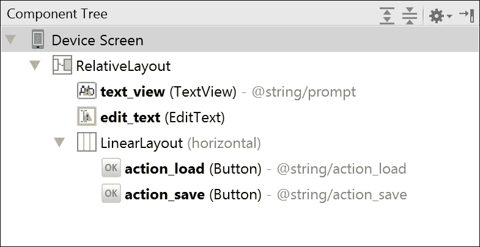
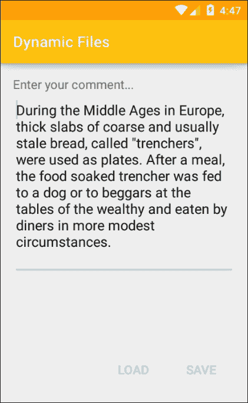
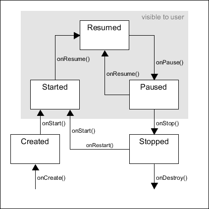
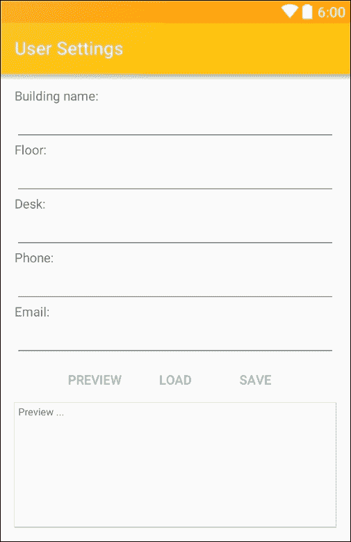

# 八、复合模式

我们已经看到了如何使用模式来操作、组织和呈现数据，但是这些数据转瞬即逝，我们还没有考虑如何确保数据从一个会话持续到下一个会话。在本章中，我们将了解如何使用内部数据存储机制来实现这一点。特别是，我们将探索用户如何保存他们的偏好，使应用更简单，使用起来更有趣。在我们这样做之前，我们将从检查复合模式及其用途开始这一章，特别是在构建分层结构(如安卓用户界面)时。

在本章中，您将学习如何执行以下操作:

*   构建复合模式
*   使用 composer 创建布局
*   使用静态文件
*   编辑应用文件
*   存储用户首选项
*   了解活动生命周期
*   添加唯一标识符

我们可以将设计模式应用于安卓项目的最直接的方法之一是布局膨胀，回到[第 6 章](06.html#aid-1DOR02 "Chapter 6. Activating Patterns")、*激活模式*，我们使用构建器模式来膨胀一个简单的布局。这个例子有一些严重的缺点。它只处理文本视图，不支持嵌套布局。为了让动态布局膨胀对我们真正有用，我们需要能够在布局层次的任何级别包含任何类型的小部件或视图，这就是复合设计模式的来源。

# 复合图案

乍一看，复合模式似乎与构建器模式非常相似，因为两者都是用较小的对象构建复杂的对象。然而，这些模式采取的方法有很大的不同。构建者以非常线性的方式工作，一次添加一个对象。另一方面，复合模式可以添加对象组，也可以添加单个对象组。更重要的是，它这样做的方式是，客户端可以添加单个对象或对象组，而不必关心它正在处理的对象。换句话说，我们可以用完全相同的代码添加完整的布局、单个视图或视图组。

除了编写分支数据结构的能力之外，向客户端隐藏被操作对象的细节的能力也是 composer 模式如此强大的原因。

在创建布局编辑器之前，我们将看一下应用于一个非常简单的模型的模式本身，这样我们就可以更好地理解模式的工作原理。这里是整体结构。如你所见，这在概念上非常简单。

按照以下步骤构建我们的复合模式:

1.  从一个既能表示单个组件又能表示组件集合的接口开始，比如:

    ```java
    public interface Component { 

        void add(Component component); 
        String getName(); 
        void inflate(); 
    } 

    ```

2.  添加这个类来扩展单个组件的接口:

    ```java
    public class Leaf implements Component { 
        private static final String DEBUG_TAG = "tag"; 
        private String name; 

        public Leaf(String name) { 
            this.name = name; 
        } 

        @Override 
        public void add(Component component) { } 

        @Override 
        public String getName() { 
            return name; 
        } 

        @Override 
        public void inflate() { 
            Log.d(DEBUG_TAG, getName()); 
        } 
    } 

    ```

3.  然后添加收藏类:

    ```java
    public class Composite implements Component { 
        private static final String DEBUG_TAG = "tag"; 

        // Store components 
        List<Component> components = new ArrayList<>(); 
        private String name; 

        public Composite(String name) { 
            this.name = name; 
        } 

        @Override 
        public void add(Component component) { 
            components.add(component); 
        } 

        @Override 
        public String getName() { 
            return name; 
        } 

        @Override 
        public void inflate() { 
            Log.d(DEBUG_TAG, getName()); 

            // Inflate composites including children 
            for (Component component : components) { 
                component.inflate(); 
            } 
        } 
    } 

    ```

正如你在这里看到的，这个模式非常简单，但是非常有效:



为了看到它的作用，我们需要定义一些组件和复合材质。我们可以用这样的线条定义组件:

```java
Component newLeaf = new Leaf("New leaf"); 

```

我们可以使用`add()`方法创建复合集合，如下所示:

```java
Component composite1 = new Composite("New composite"); 
composite1.add(newLeaf); 
composite1.add(oldLeaf); 

```

相互嵌套组合同样简单，因为我们已经编写了代码，所以我们可以忽略我们是在创建一个`Leaf`还是一个`Composite`，并对两者使用相同的代码。这里有一个例子:

```java
Component composite2 = Composite("Another composite"); 
composite2.add(someLeaf); 
composite2.add(composite1); 
composite2.add(anotherComponent); 

```

显示一个组件，在这种情况下只是文本，就像调用它的`inflate()`方法一样简单。

## 添加构建器

定义和打印一个合理的输出选择会使客户端代码变得相当混乱，我们将采用的解决方案是从另一个模式中窃取一个想法，并使用一个构建器类来构建我们想要的组合。这些可以是我们喜欢的任何东西，这里有一个可能的构建者:

```java
public class Builder { 

    // Define individual components 
    Component image = new Leaf("  image view"); 
    Component text = new Leaf("  text view"); 
    Component list = new Leaf("  list view"); 

    // Define composites 
    Component layout1(){ 
        Component c = new Composite("layout 1"); 
        c.add(image); 
        c.add(text); 
        return c; 
    } 

    // Define nested composites 
    Component layout2() { 
        Component c = new Composite("layout 2"); 
        c.add(list); 
        c.add(layout1()); 
        return c; 
    } 

    Component layout3(){ 
        Component c = new Composite("layout 3"); 
        c.add(layout1()); 
        c.add(layout2()); 
        return c; 
    } 
} 

```

这使得我们活动的`onCreate()`方法简单明了，如下图所示:

```java
@Override 
protected void onCreate(Bundle savedInstanceState) { 

    super.onCreate(savedInstanceState); 
    setContentView(R.layout.activity_main); 

```

```java
    Builder builder = new Builder(); 

    // Inflate a single component 
    builder.list.inflate(); 

    // Inflate a composite component 
    builder.layout1().inflate(); 

    // Inflate nested components 
    builder.layout2().inflate(); 
    builder.layout3().inflate(); 
} 

```

虽然我们只产生了一个基本的输出，但是应该很清楚我们现在如何将它扩展到膨胀的真实布局，以及这种技术有多有用。

# 布局作曲家

在[第 6 章](06.html#aid-1DOR02 "Chapter 6. Activating Patterns")、*激活模式*中，我们使用构建器构建了一个简单的 UI。构建器是这项任务的完美选择，因为我们只关心包含一种类型的视图。我们本可以修改这个方案(字面上，用一个适配器)来迎合其他视图类型，但是使用一个不关心它所处理的组件类型的模式要好得多。希望前面的例子演示了复合模式对这种任务的适用性。

在下面的例子中，我们将把相同的原理应用到一个实际的用户界面充气机中，该充气机可以处理不同类型的视图、复合视图组以及最重要的动态嵌套布局。

出于本练习的目的，我们假设我们的应用有一个新闻页面。这在很大程度上是一种促销功能，但事实证明，当广告被装扮成新闻时，消费者更容易受到影响。许多组件，如标题和徽标，将保持静态，而其他组件将在内容和布局结构中频繁更改。这使得它成为我们作曲家模式的理想主题。

以下是我们将开发的用户界面:


## 添加成分

我们将逐个处理每个问题，边走边构建代码。首先，我们将通过以下步骤解决创建和显示单个组件视图的问题:

1.  和之前一样，我们从`Component`界面开始:

    ```java
    public interface Component { 

        void add(Component component); 
        void setContent(int id); 
        void inflate(ViewGroup layout); 
    } 

    ```

2.  现在用下面的类实现它:

    ```java
    public class TextLeaf implements Component { 
        public TextView textView; 

        public TextLeaf(TextView textView, int id) { 
            this.textView = textView; 
            setContent(id); 
        } 

        @Override 
        public void add(Component component) { } 

        @Override 
        public void setContent(int id) { 
            textView.setText(id); 
        } 

        @Override 
        public void inflate(ViewGroup layout) { 
            layout.addView(textView); 
        } 
    } 

    ```

3.  接下来，添加`Builder`，目前它非常简单，只包含两个属性和一个构造函数:

    ```java
    public class Builder { 
        Context context; 
        Component text; 

        Builder(Context context) { 
            this.context = context; 
            init(); 
            text = new TextLeaf(new TextView(context), 
                    R.string.headline); 
        } 
    } 

    ```

4.  最后，编辑活动的`onCreate()`方法，使用我们自己的布局作为根，并向其中添加我们的视图，如下所示:

    ```java
    @Override 
    protected void onCreate(Bundle savedInstanceState) { 

        super.onCreate(savedInstanceState); 

        // Replace default layout 
        LinearLayout layout = new LinearLayout(this); 

        layout.setOrientation(LinearLayout.VERTICAL); 
        layout.setLayoutParams(new ViewGroup.LayoutParams( 
                ViewGroup.LayoutParams.MATCH_PARENT, 
                ViewGroup.LayoutParams.WRAP_CONTENT)); 
        setContentView(layout); 

        // Add component 
        Builder builder = new Builder(this); 
        builder.headline.inflate(layout); 
    } 

    ```

就目前情况而言，我们在这里所做的没有什么令人印象深刻的，但是通过前面的例子，我们将清楚地知道我们要做什么，我们的下一步是创建一个处理图像视图的组件。

正如您在下面的代码片段中看到的那样，`ImageLeaf`类与其文本同级几乎相同，不同之处仅在于它生成的视图类型和使用`setImageResource()`对`id`参数进行操作:

```java
public class ImageLeaf implements Component { 
    private ImageView imageView; 

    public ImageLeaf(ImageView imageView, int id) { 
        this.imageView = imageView; 
        setContent(id); 
    } 

    @Override 
    public void add(Component component) { } 

    @Override 
    public void setContent(int id) {         
        imageView.setImageResource(id); 
    } 

    @Override 
    public void inflate(ViewGroup layout) { 
        layout.addView(imageView); 
    } 
} 

```

这可以像文本视图一样很容易地添加到构建器中，尽管现在我们将为此创建一个小方法，并从构造器中调用它，因为我们可能想要添加许多其他方法。代码现在应该如下所示:

```java
Builder(Context context) { 
    this.context = context; 
    initLeaves(); 
} 

private void initLeaves() { 

    header = new ImageLeaf(new ImageView(context), 
            R.drawable.header); 

    headline = new TextLeaf(new TextView(context), 
            R.string.headline); 
} 

```

正如预期的那样，就客户端代码而言，这与任何其他组件没有区别，可以用以下内容来膨胀:

```java
builder.header.inflate(layout); 

```

图像视图和文本视图都可以将各自的主要内容(图像和文本)作为资源标识整数，因此我们可以对两者使用相同的`int`参数。在`setContent()`方法中处理这个问题允许我们分离实际的实现，并允许我们简单地将它们中的每一个引用为`Component`。当我们应用一些格式化属性时，`setContent()`方法也将很快被证明是有用的。

这仍然是非常基本的，如果我们像这样创建我们的所有组件，不管它们是如何组合成组合的，构建器代码很快就会变得非常冗长。我们刚刚创建的横幅视图不太可能改变，因此这个系统适合这种设置。然而，我们需要为更多的可变内容找到一种更灵活的方法，但是在此之前，我们将看到如何创建类的复合版本。

## 创建复合材质

复合模式的真正用处在于它能够将对象组视为一个整体，我们的两个标题视图提供了一个很好的展示机会。鉴于它们总是一起出现，将它们视为一体是完全合理的。我们有三种方法可以做到这一点:

*   调整一个现有的叶类，以便它可以创建子类
*   创建没有父级的复合
*   创建以布局为父布局的复合

我们将看到如何做到所有这些，但首先我们将实现在这种情况下最有效的，并基于我们的一个叶类创建一个复合类。我们希望我们的标题图像在文本之上，所以将使用`ImageLeaf`类作为我们的模板。

这项任务只有三个快速步骤:

1.  `CompositeImage`级与`ImageLeaf`级相同，但有以下例外:

    ```java
    public class CompositeImage implements Component { 
        List<Component> components = new ArrayList<>(); 

        ... 

        @Override 
        public void add(Component component) { 
            components.add(component); 
        } 

        ... 

        @Override 
        public void inflate(ViewGroup layout) { 
            layout.addView(imageView); 

            for (Component component : components) { 
                component.inflate(layout); 
            } 
        } 
    } 

    ```

2.  在构建器中构建这个组就这么简单:

    ```java
    Component headerGroup() { 
        Component c = new CompositeImage(new ImageView(context), 
                R.drawable.header); 
        c.add(headline); 
        return c; 
    } 

    ```

3.  我们现在也可以在活动中替换我们的呼叫:

    ```java
    builder.headerGroup().inflate(layout); 

    ```

这也可以被视为完全相同的所有其他组件，并制作一个等效的文本版本将非常简单。像这样的类可以被看作是它们的叶版本的扩展，在这里很有用，但是创建一个没有容器的组合会更整洁，因为这将使我们能够组织组，我们可以稍后插入到布局中。

以下类是一个精简的复合类，可用于对任何组件进行分组，包括其他组:

```java
class CompositeShell implements Component { 
    List<Component> components = new ArrayList<>(); 

    @Override 
    public void add(Component component) { 
        components.add(component); 
    } 

    @Override 
    public void setContent(int id) { } 

    @Override 
    public void inflate(ViewGroup layout) { 

        for (Component component : components) { 
            component.inflate(layout); 
        } 
    } 
} 

```

想象一下，我们希望将三个图像分组，稍后添加到布局中。按照代码的方式，我们必须在构建过程中添加这些定义。这可能会导致一些庞大且不吸引人的代码。我们将在这里通过简单地向构建器添加方法来解决这个问题，这些方法允许我们根据需要创建组件。

这两种方法如下:

```java
public TextLeaf setText(int t) { 
    TextLeaf leaf = new TextLeaf(new TextView(context), t); 
    return leaf; 
} 

public ImageLeaf setImage(int t) { 
    ImageLeaf leaf = new ImageLeaf(new ImageView(context), t); 
    return leaf; 
} 

```

我们可以使用构建器构建这些组，如下所示:

```java
Component sandwichArray() { 
    Component c = new CompositeShell(); 

    c.add(setImage(R.drawable.sandwich1)); 
    c.add(setImage(R.drawable.sandwich2)); 
    c.add(setImage(R.drawable.sandwich3)); 
    return c; 

```

这个组可以像客户端的任何其他组件一样膨胀，因为我们的布局具有垂直方向，所以将显示为一列。如果我们希望它们连续输出，我们将需要一个水平方向，因此需要一个类来生成一个。

## 创建复合布局

下面是一个复合组件的代码，该组件将生成一个线性布局作为其根，并将任何添加的视图放置在其内部:

```java
class CompositeLayer implements Component { 
    List<Component> components = new ArrayList<>(); 
    private LinearLayout linearLayout; 

    CompositeLayer(LinearLayout linearLayout, int id) { 
        this.linearLayout = linearLayout; 
        setContent(id); 
    } 

    @Override 
    public void add(Component component) { 
        components.add(component); 
    } 

    @Override 
    public void setContent(int id) { 
        linearLayout.setBackgroundResource(id); 
        linearLayout.setOrientation(LinearLayout.HORIZONTAL); 
    } 

    @Override 
    public void inflate(ViewGroup layout) { 
        layout.addView(linearLayout); 

        for (Component component : components) { 
            component.inflate(linearLayout); 
        } 
    } 
} 

```

在构建器中构建它的代码与其他代码没有什么不同:

```java
Component sandwichLayout() { 
    Component c = new CompositeLayer(new LinearLayout(context), 
            R.color.colorAccent); 
    c.add(sandwichArray()); 
    return c; 
} 

```

现在，我们可以在活动中用几行清晰易懂的代码来扩展我们的组合:

```java
Builder builder = new Builder(this); 
builder.headerGroup().inflate(layout); 
builder.sandwichLayout().inflate(layout); 

```

值得注意的是，我们是如何使用复合层的`setContent()`方法来设置方向的。从整体结构来看，这显然是做这件事的正确地方，这将我们带到下一个任务，格式化我们的用户界面。

## 运行时格式化布局

尽管我们现在已经有能力生产任何数量的复杂布局，但快速查看以下输出可以证明，就外观和设计而言，我们离理想的设计还有很长的路要走:


我们之前已经看到了如何通过`setContent()`方法设置插入布局的方向，这就是我们如何更好地控制组件的外观。更进一步，只需要一两个瞬间就能产生一个可接受的布局。只需遵循这些简单的步骤:

1.  首先编辑`TextLeaf`的`setContent()`方法，像这样:

    ```java
    @Override 
    public void setContent(int id) { 

        textView.setText(id); 

        textView.setPadding(dp(24), dp(0), dp(0), dp(16)); 
        textView.setTextSize(TypedValue.COMPLEX_UNIT_SP, 24); 
        textView.setLayoutParams(new ViewGroup.LayoutParams( 
                ViewGroup.LayoutParams.MATCH_PARENT, 
                ViewGroup.LayoutParams.WRAP_CONTENT)); 
    } 

    ```

2.  这也需要以下从 px 转换为 dp 的方法:

    ```java
    private int dp(int px) { 
        float scale = textView.getResources() 
                .getDisplayMetrics() 
                .density; 
        return (int) (px * scale + 0.5f); 
    } 

    ```

3.  `ImageLeaf`组件只需要这些变化:

    ```java
    @Override 
    public void setContent(int id) { 
        imageView.setScaleType(ImageView.ScaleType.FIT_CENTER); 

        imageView.setLayoutParams(new ViewGroup.LayoutParams( 
                ViewGroup.LayoutParams.WRAP_CONTENT, 
                dp(R.dimen.imageHeight))); 

        imageView.setImageResource(id); 
    } 

    ```

4.  我们还在构建器中增加了一个构造，比如:

    ```java
    Component story(){ 
        Component c = new CompositeText(new TextView(context) 
                ,R.string.story); 
        c.add(setImage(R.drawable.footer)); 
        return c; 
    } 

    ```

5.  现在可以通过活动中的以下行来实现这一点:

    ```java
    Builder builder = new Builder(this); 

    builder.headerGroup().inflate(layout); 
    builder.sandwichLayout().inflate(layout); 
    builder.story().inflate(layout); 

    ```

这些调整现在应该会产生一个符合我们原始规范的设计。虽然我们已经添加了大量代码并创建了特定的安卓对象，但是看一下下图将会发现整体模式保持不变:



我们在这里还可以做很多事情，例如，解决为不同屏幕配置开发横向布局和缩放的问题，所有这些都可以简单地使用相同的方法来管理。然而，我们所做的足以演示如何在运行时使用复合模式动态构建布局。

我们将暂时离开这个模式，因为我们将探索如何提供一点定制功能，并考虑用户偏好以及如何存储持久数据。

# 存储选项

几乎所有的应用都有某种形式的**设置**菜单，允许用户存储定期访问的信息，并根据自己的喜好定制应用。这些设置可以是任何东西，从更改密码到个性化配色方案或任何数量的其他调整和调整。

如果您有大量数据并可以访问 web 服务器，通常最好缓存来自该源的数据，因为这样既可以节省电池，又可以加快应用的速度。

首先，我们应该考虑这些设置如何节省用户时间。没有人希望每次点三明治时都必须输入自己的所有细节，也没有人希望一遍又一遍地制作同一个三明治。这就引出了这样一个问题:我们如何在整个系统中表示一个三明治，以及订单信息是如何被发送给供应商和被供应商接收的。

无论我们使用什么技术来传输订单数据，我们都可以假设在这个过程中的某个时刻会有一个人在制作真正的三明治。一个简单的文本字符串似乎是我们所需要的全部，它肯定足以作为供应商的说明并存储用户的收藏夹。然而，这里有一个宝贵的机会，错过它是愚蠢的。每一份订单都包含有价值的销售数据，通过整理这些数据，我们可以了解哪些产品卖得好，哪些卖得不好。为此，我们需要在订单消息中包含尽可能多的数据。购买历史可以包含许多有用的数据，购买的时间和日期也是如此。

无论我们选择收集什么样的支持数据，有一点非常有用，那就是能够识别个人客户，但人们不喜欢泄露个人信息，也不应该泄露。没有理由仅仅为了买一个三明治就需要说出自己的出生日期或性别。然而，正如我们将看到的，我们可以为每个下载的应用和/或运行它的设备附加一个唯一的标识符。此外，我们或任何其他人都无法通过这种方式识别个人，因此这不会对他们的安全或隐私构成威胁，我们必须保护他们的安全或隐私。

有几种方法可以将数据存储在用户的设备上，以便属性在会话之间保持不变。通常，我们希望这些数据保密，在下一节中，我们将了解如何实现这一点。

## 创建静态文件

本章这一部分我们的主要焦点将是用户偏好的存储。从设备的内部存储开始，我们应该先了解一两个其他存储选项。

在本章的前半部分，我们使用`strings.xml`值文件分配了一个相当长的字符串。这种以及类似的资源文件最适合存储单个单词和短语，但对于存储长句子或段落来说，这种方法并不吸引人。对于这些情况，我们可以使用文本文件，并将其存储在`res/raw`目录中。

`raw`目录的便利之处在于它被编译为`R`类的一部分，这意味着它的内容可以像任何其他资源一样被引用，例如字符串或可绘制的，例如`R.raw.some_text`。

要了解如何在不弄乱字符串文件的情况下包含冗长的文本，请执行以下简单步骤:

1.  默认情况下不包括`res/raw`文件夹，所以从创建它开始。
2.  在此文件夹中创建一个包含文本的新文件。在这里，它被称为`wiki`，因为它取自维基百科的三明治条目。
3.  打开你的活动或者你正在使用的任何代码来扩展你的布局，并添加这个方法:

    ```java
    public static String readFile(Context context, int resId) { 

        InputStream stream = context.getResources() 
                .openRawResource(R.raw.wiki); 
        InputStreamReader inputReader = new InputStreamReader(stream); 
        BufferedReader bufferedReader = new BufferedReader(inputReader); 
        String line; 
        StringBuilder builder = new StringBuilder(); 

        try { 
            while ((line = bufferedReader.readLine()) != null) { 
                builder.append(line) 
                        .append('\n'); 
            } 
        } catch (IOException e) { 

            return null; 
        } 

        return builder.toString(); 
    } 

    ```

4.  现在只需添加这些行来填充您的视图。

    ```java
    TextView textView = (TextView) findViewById(R.id.text_view); 
    String data = readFile(this, R.raw.wiki); 
    textView.setText(data); 

    ```

原始文件夹被视为其他资源目录的好处之一是，我们可以为不同的设备或地区创建指定的版本。例如，这里我们创建了一个名为`raw-es`的文件夹，并在其中放置了一个同名文本的西班牙语翻译:



### 类型

如果您正在使用外部文本编辑器，如记事本，您将需要确保文件以`UTF-8`格式保存，以便非拉丁字符正确显示。

这种资源非常有用，并且非常容易实现，但是这种文件是只读的，并且一定会有我们想要创建和编辑这种文件的时候。

## 创建和编辑应用文件

当然，除了方便地存储长字符串，我们还可以做更多的事情，并且能够在运行时更改这些文件的内容给了我们很大的空间。如果没有这样一种方便的方法来存储用户偏好，它将是一个很好的候选，并且仍然有一些时候共享偏好结构不足以满足我们的所有需求。这是使用这些文件的主要原因之一；另一个是作为定制功能，允许用户制作和存储笔记或书签。编码的文本文件甚至可以被创建，以被建设者理解，并用于重建包含用户最喜欢的成分的三明治对象。

我们将要探索的方法使用一个内部应用目录，该目录对设备上的其他应用是隐藏的。在下面的练习中，我们将演示用户如何使用我们的应用存储持久和私有文本文件。启动一个新项目或打开一个要添加内部存储功能的项目，并按照以下步骤操作:

1.  Start by creating a simple layout. Base it on the following component tree:

    

2.  为了简单起见，我们将使用 XML onClick 属性分别使用`android:onClick="loadFile"`和`android:onClick="saveFile"`为每个按钮分配代码。
3.  首先，构建`saveFile()`方法:

    ```java
    public void saveFile(View view) { 

        try { 
            OutputStreamWriter writer = new OutputStreamWriter(openFileOutput(fspc, 0)); 
            writer.write(editText.getText().toString()); 
            writer.close(); 

        } catch (IOException e) { 
            e.printStackTrace(); 
        } 
    } 

    ```

4.  然后进行`loadFile()`方法:

    ```java
    public void loadFile(View view) { 

        try { 
            InputStream stream = openFileInput(fspc); 

            if (stream != null) { 
                InputStreamReader inputReader = new InputStreamReader(stream); 
                BufferedReader bufferedReader = new BufferedReader(inputReader); 
                String line; 
                StringBuilder builder = new StringBuilder(); 

                while ((line = bufferedReader.readLine()) != null) { 
                    builder.append(line) 
                            .append("\n"); 
                } 

                stream.close(); 
                editText.setText(builder.toString()); 
            } 

        } catch (IOException e) { 
            e.printStackTrace(); 
        } 
    } 

    ```

这个例子非常简单，但它只需要展示能够以这种方式存储数据的潜力。使用前面的布局，代码很容易测试。



像这样存储用户数据，或者我们想要的用户数据，非常方便，也非常安全。我们也可以加密这些数据，但这是另一本书的主题。安卓框架不比其他任何移动平台更安全，而且由于我们不会在三明治馅料中存储比偏好更敏感的东西，这个系统将非常适合我们的目的。

当然，也可以在设备的外部存储器(如微型 SD 卡)上创建和访问文件。默认情况下，这些文件是公开的，通常是在我们想要与其他应用共享某些内容时创建的。这个过程类似于我们刚刚探索过的过程，所以我们在这里不做介绍。相反，我们将继续使用内置的**共享引用**界面存储用户偏好。

# 存储用户偏好

我们已经介绍了为什么能够存储用户设置如此重要，并简要思考了我们希望存储哪些设置。共享偏好使用键值对来存储它们的数据，这对于像`name="desk" value="4"`这样的值来说很好，但是我们想要一些关于一些事情的相当详细的信息。例如，我们希望用户能够存储他们喜欢的三明治，以便于回忆。

这方面的第一步是看看安卓共享首选项界面通常是如何工作的，以及应该在哪里应用。

## 活动生命周期

使用**共享引用**界面存储和检索用户首选项使用键值对存储和检索原始数据类型。这很容易应用，只有当我们询问何时何地应该执行这些操作时，这个过程才会变得有趣。这就把我们带到了活动生命周期。

与桌面应用不同，移动应用通常不会被用户故意关闭。相反，它们通常被导航离开，通常让它们在后台处于半活跃状态。在运行时，活动将进入各种状态，如暂停、停止或恢复。每个状态都有一个相关的回调方法，比如我们非常熟悉的`onCreate()`方法。其中有几个我们可以用来保存和加载我们的用户设置，为了决定哪一个，我们需要看看生命周期本身:



前面的图表可能看起来有点混乱，最好的方法是编写一点调试代码。包括`onCreate()`，在一个活动的生命周期内可以调用的回调方法有七种:

*   onCreate()
*   onStart（）
*   onResume（）
*   onpause()
*   onStop()
*   onDestroy()
*   onRestart（）

首先，从 `onDestroy()` 方法中保存用户设置似乎是有意义的，因为这是最后一种可能的状态。要了解为什么这通常不起作用，请打开任何项目，重写前面列表中的每个方法，并添加一些调试代码，如下面的示例所示:

```java
@Override 
public void onResume() { 
    super.onResume(); 
    Log.d(DEBUG_TAG, "Resuming..."); 
} 

```

几分钟的实验足以看出 `onDestroy()` 并不总是被调用。为了确保我们的数据得到保存，我们需要存储来自 `onPause()` 或 `onStop()` 方法的偏好。

## 应用首选项

要查看如何存储和检索首选项，请启动一个新项目或打开一个现有项目，并按照以下步骤操作:

1.  首先，创建一个新的类，`User`，像这样:

    ```java
    // Singleton class as only one user 
    public class User { 
        private static String building; 
        private static String floor; 
        private static String desk; 
        private static String phone; 
        private static String email; 
        private static User user = new User(); 

        public static User getInstance() { 
            return user; 
        } 

        public String getBuilding() { 
            return building; 
        } 

        public void setBuilding(String building) { 
            User.building = building; 
        } 

        public String getFloor() { 
            return floor; 
        } 

        public void setFloor(String floor) { 
            User.floor = floor; 
        } 

        public String getDesk() { 
            return desk; 
        } 

        public void setDesk(String desk) { 
            User.desk = desk; 
        } 

        public String getPhone() { 
            return phone; 
        } 

        public void setPhone(String phone) { 
            User.phone = phone; 
        } 

        public String getEmail() { 
            return email; 
        } 

        public void setEmail(String email) { 
            User.email = email; 
        } 
    } 

    ```

2.  Next, create an XML layout to match this data based on the following preview:

    

3.  修改活动，使其实现以下侦听器。

    ```java
    public class MainActivity 
        extends AppCompatActivity 
        implements View.OnClickListener 

    ```

4.  包括以下字段，并以通常的方式将它们与对应的 XML 相关联:

    ```java
    private User user = User.getInstance(); 

    private EditText editBuilding; 
    private EditText editFloor; 
    private EditText editDesk; 
    private EditText editPhone; 
    private EditText editEmail; 

    private TextView textPreview; 

    ```

5.  在`onCreate()`方法中本地添加按钮，并设置它们的点击监听器:

    ```java
    Button actionLoad = (Button) findViewById(R.id.action_load); 
    Button actionSave = (Button) findViewById(R.id.action_save); 
    Button actionPreview = (Button) findViewById(R.id.action_preview); 

    actionLoad.setOnClickListener(this); 
    actionSave.setOnClickListener(this); 
    actionPreview.setOnClickListener(this); 

    ```

6.  创建以下方法并从`onCreate()`内调用:

    ```java
    public void loadPrefs() { 
        SharedPreferences prefs = getApplicationContext() 
            .getSharedPreferences("prefs", MODE_PRIVATE); 

        // Retrieve settings 
        // Use second parameter if never saved 
        user.setBuilding(prefs.getString("building", "unknown")); 
        user.setFloor(prefs.getString("floor", "unknown")); 
        user.setDesk(prefs.getString("desk", "unknown")); 
        user.setPhone(prefs.getString("phone", "unknown")); 
        user.setEmail(prefs.getString("email", "unknown")); 
    } 

    ```

7.  创建一个存储首选项的方法，如下所示:

    ```java
    public void savePrefs() { 
        SharedPreferences prefs = getApplicationContext().getSharedPreferences("prefs", MODE_PRIVATE); 
        SharedPreferences.Editor editor = prefs.edit(); 

        // Store preferences 
        editor.putString("building", user.getBuilding()); 
        editor.putString("floor", user.getFloor()); 
        editor.putString("desk", user.getDesk()); 
        editor.putString("phone", user.getPhone()); 
        editor.putString("email", user.getEmail()); 

        // Use apply() not commit() 
        // to perform operation in background 
        editor.apply(); 
    } 

    ```

8.  添加`onPause()`方法调用:

    ```java
    @Override 
    public void onPause() { 
        super.onPause(); 
        savePrefs(); 
    } 

    ```

9.  最后添加点击监听器，像这样:

    ```java
    @Override 
    public void onClick(View view) { 

        switch (view.getId()) { 

            case R.id.action_load: 
                loadPrefs(); 
                break; 

            case R.id.action_save: 
                // Recover data from form 
                user.setBuilding(editBuilding.getText().toString()); 
                user.setFloor(editFloor.getText().toString()); 
                user.setDesk(editDesk.getText().toString()); 
                user.setPhone(editPhone.getText().toString()); 
                user.setEmail(editEmail.getText().toString()); 
                savePrefs(); 
                break; 

            default: 
                // Display as string 
                textPreview.setText(new StringBuilder() 
                        .append(user.getBuilding()).append(", ") 
                        .append(user.getFloor()).append(", ") 
                        .append(user.getDesk()).append(", ") 
                        .append(user.getPhone()).append(", ") 
                        .append(user.getEmail()).toString()); 
                break; 
        } 
    } 

    ```

这里添加了加载和预览功能，只是为了允许我们测试代码，但是正如您所看到的，这个过程可以用来存储和检索任意数量的相关数据:


### 类型

如果出于任何原因您需要清空您的首选项文件，这可以通过`edit.clear()`方法来完成。

得益于安卓设备监视器，很有可能找到并查看我们的共享首选项，可以通过**工具|安卓**菜单访问。打开**文件浏览器**，导航至`data/data/com.your_app/shared_prefs/prefs.xml`。应该是这样的:

```java
<?xml version='1.0' encoding='utf-8' standalone='yes' ?> 
<map> 
    <string name="phone">+44 0102 555 6789</string> 
    <string name="email">kyle@blt.com</string>     <string name="floor">5</string> 
    <string name="desk">13</string>     <string name="user_id"> 
        fbc08fca-f375-4786-9e2d-d610c9cd0377</string> 
    <boolean name="new_user" value="false" />     <string name="building">Bagel Building</string> </map> 

```

尽管它很简单，但共享偏好构成了几乎所有安卓移动应用的基本元素，除了这些明显的优势，我们还可以在这里表演另一个巧妙的技巧。我们可以使用共享首选项文件的内容来确定应用是否是第一次运行。

## 添加唯一标识符

在收集销售数据时，有一些识别个人客户的方法总是一个好主意。这不需要通过名字或任何个人的，一个简单的身份证号码可以添加一个全新的维度到一个数据集。

在许多情况下，我们会使用一个简单的增量系统，并给每个新客户一个数字标识，其值比上一个高一。当然，这在像我们这样的分布式系统上是不可能的，因为每个安装都不知道还会有多少其他安装。在一个理想的世界里，我们会说服我们所有的客户向我们注册，也许会提供免费的三明治，但除了贿赂我们的客户，还有另一种相当聪明的技术，可以在分布式系统上生成真正唯一的标识符。

**通用唯一标识符** (UUID)是一种创建唯一值的方法，可用作`java.util`。有几个版本，其中一些基于名称空间，名称空间本身就是唯一的标识符。我们这里使用的版本(版本 4)使用了随机数生成器。人们很容易认为这可能会产生重复，但标识符的构造方式意味着，在 200 亿年内，必须每秒下载一次，才会有严重的重复风险，因此对于我们的三明治供应商来说，这个系统可能就足够了。

### 类型

我们还可以使用许多其他功能，例如在偏好设置中添加点击计数器，并使用它来计算我们的应用被访问了多少次，我们卖出了多少三明治，或者保留总支出。

欢迎新用户和添加 ID 是我们只想在应用第一次运行时做的事情，因此我们将同时添加这两个功能。以下是添加欢迎功能和分配唯一用户标识所需的步骤:

1.  将这两个字段、设置器和获取器添加到`User`类:

    ```java
    private static boolean newUser; 
    private static String userId; 

    ... 

    public boolean getNewUser() { 
        return newUser; 
    } 

    public void setNewUser(boolean newUser) { 
        User.newUser = newUser; 
    } 

    public String getUserId() { 
        return userId; 
    } 

    public void setUserId(String userId) { 
        User.userId = userId; 
    } 

    ```

2.  将此代码添加到`loadPrefs()`方法中:

    ```java
    if (prefs.getBoolean("new_user", true)) { 
        // Display welcome dialog 
        // Add free credit for new users 
        String uuid = UUID.randomUUID().toString(); 
        prefs.edit().putString("user_id", uuid); 
        prefs.edit().putBoolean("new_user", false).apply(); 
    } 

    ```

我们的应用现在可以欢迎和识别我们应用的每个用户。仅在第一次运行应用时使用共享首选项来运行代码的好处在于，该方法将忽略更新。

### 类型

创建用户标识的一个稍微简单但不太优雅的解决方案是获取设备的序列号，这可以通过类似以下的方式来实现:`user.setId(` **构建。串行** `.toString())`。

# 总结

在这一章中，我们已经讨论了两个完全不同的主题，包括理论和实践主题。复合模式非常有用，我们看到它可以很容易地代替其他模式使用，比如构建器。

如果我们不能处理软件必须执行的更机械的过程，比如文件存储，模式就没有用，应该清楚的是，数据文件的列表性质，比如我们之前使用的共享首选项，非常适合构建器模式，更复杂的数据结构可以用复合来处理。

在下一章中，当我们探索如何在应用当前不活动时创建服务并向用户发布通知时，我们将查看更多非即时结构。这将以侦听器方法的形式引入您无疑会遇到的观察者模式。