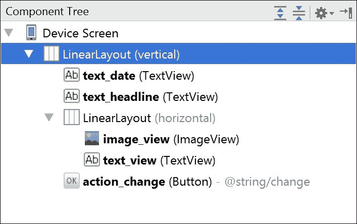
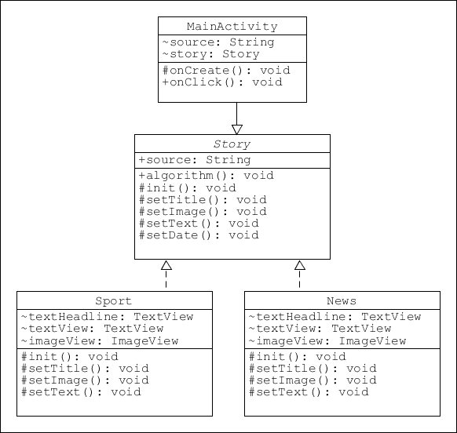
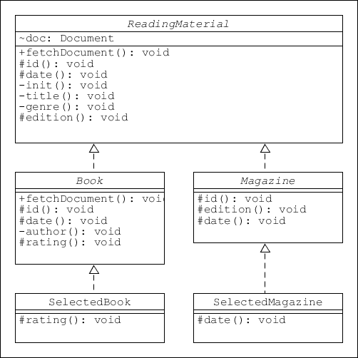
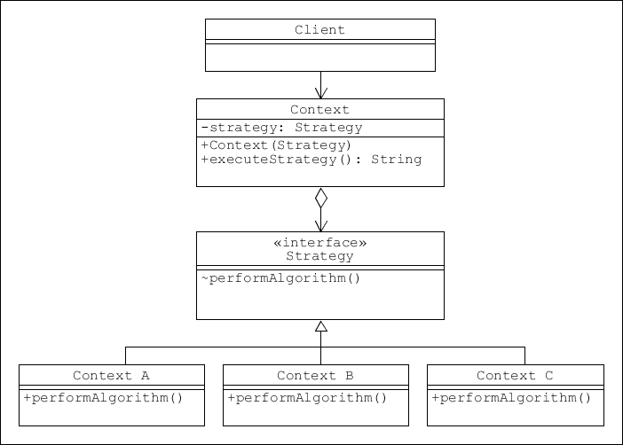
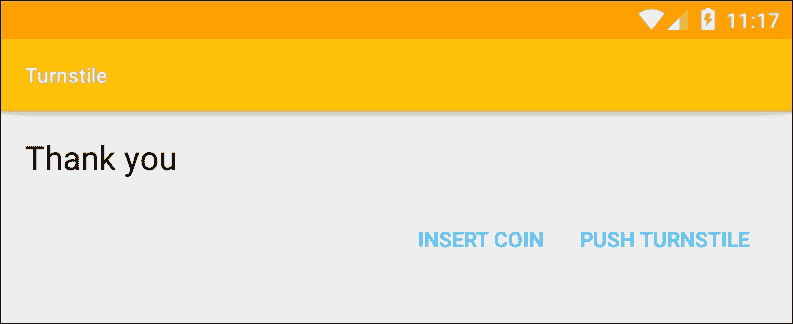
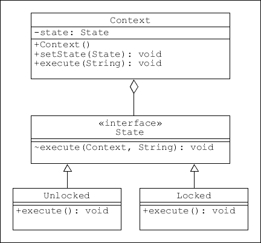

# 十、行为模式

到目前为止，在这本书里，我们已经仔细研究了许多最重要的创造和结构设计模式。这给了我们构建各种架构的能力，但是为了执行我们需要的任务，这些结构需要能够在它们自己的元素之间以及与其他结构之间进行通信。

行为模式是为我们经常遇到的许多一般开发问题建模而设计的，例如响应特定对象状态的变化，或者根据硬件变化调整行为。在观察者的最后一章中，我们已经遇到了一个，在这里我们将进一步研究一些最有用的行为模式。

行为模式比创造和行为模式更能适应各种各样的任务，尽管这种灵活性很大，但在选择最佳模式时，它也会使事情复杂化，因为对于给定的任务，通常会有两三种可能的候选模式。将这些模式放在一起看一看，看看理解这些有时微妙的差异如何帮助我们有效地应用行为模式，这是一个好主意。

在本章中，您将学习如何:

*   创建模板模式
*   向模式中添加专门化层
*   应用策略模式
*   构建和使用访问者模式
*   创建一个状态机

这些模式的一般化性质意味着它们可以应用于大量不同的情况，但是它们可以执行的任务类型的一个很好的例子是点击或触摸监听器，当然还有前一章的观察者模式。在许多行为模式中看到的另一个共同特征是使用抽象类来创建一般化的算法，正如我们将在本章后面看到的**访问者**和**策略模式**，特别是**模板模式**，我们现在将对此进行探索。

# 模板图案

即使您对设计模式是全新的，您也会熟悉模板模式是如何工作的，因为它使用抽象类和方法来形成一个通用的(模板)解决方案，该解决方案可以用来创建专门的子类，就像抽象在 OOP 中的使用方式一样。

最简单地说，模板模式只不过是抽象类形式的概括，至少有一个具体的实现。例如，模板可以定义一个空布局，然后它的实现控制内容。这种方法的一大优势是公共元素和共享逻辑只需要在基类中定义，这意味着我们只需要编写实现互不相同的代码。

如果以基类专门化的形式添加另一个抽象层，模板模式会变得更加强大和灵活。然后，这些可以用作其父类的子类别，并得到类似的处理。在探索这些多层模式之前，我们将看一下基础模板的最简单的例子，它提供了根据它们的具体实现产生不同输出的属性和逻辑。

一般来说，模板模式作用于一个算法或任何一组可以分解成步骤的过程。这个模板方法是在基类中定义的，并通过实现来实现。

最好的方法是通过举例的方式。在这里，我们将想象一个简单的新闻提要应用程序，它有一个带有*新闻*和*体育*实现的通用*故事*模板。按照以下步骤创建此模式:

1.  Start a new project and create a main layout based on the following component tree:

    

2.  创建一个名为`Story`的新抽象类，作为我们的概括，像这样:

    ```java
            abstract class Story { 
                public String source; 

                // Template skeleton algorithm 
                public void publish(Context context) { 
                    init(context); 
                    setDate(context); 
                    setTitle(context); 
                    setImage(context); 
                    setText(context); 
                } 

                // Placeholder methods 
                protected abstract void init(Context context); 

                protected abstract void setTitle(Context context); 

                protected abstract void setImage(Context context); 

                protected abstract void setText(Context context); 

                // Calculate date as a common property 
                protected void setDate(Context context) { 
                    Calendar calendar = new GregorianCalendar(); 
                    SimpleDateFormat format = 
                         new SimpleDateFormat("MMMM d"); 

                    format.setTimeZone(calendar.getTimeZone()); 

                    TextView textDate = (TextView) 
                        ((Activity) context) 
                        .findViewById(R.id.text_date); 
                    textDate.setText(format.format(calendar.getTime())); 
                } 
            } 

    ```

3.  现在，扩展这个来创建`News`类，就像这样:

    ```java
            public class News extends Story { 
                TextView textHeadline; 
                TextView textView; 
                ImageView imageView; 

                @Override 
                protected void init(Context context) { 
                    source = "NEWS"; 
                    textHeadline = (TextView) ((Activity) context).findViewById(R.id.text_headline); 
                    textView = (TextView) ((Activity) context).findViewById(R.id.text_view); 
                    imageView = (ImageView) ((Activity) context).findViewById(R.id.image_view); 
                } 

                @Override 
                protected void setTitle(Context context) { 
                    ((Activity) context).setTitle(context.getString(R.string.news_title)); 
                } 

                @Override 
                protected void setImage(Context context) { 
                    imageView.setImageResource(R.drawable.news); 
                } 

                @Override 
                protected void setText(Context context) { 
                    textHeadline.setText(R.string.news_headline); 
                    textView.setText(R.string.news_content); 
                } 
            } 

    ```

4.  `Sport`的实现是相同的，但有以下例外:

    ```java
            public class Sport extends Story { 
                ... 

                @Override 
                protected void init(Context context) { 
                    source = "NEWS"; 
                    ... 
                } 

                @Override 
                     protected void setTitle(Context context) { 
                    ((Activity) context).setTitle(context.getString(R.string.sport_title)); 
                } 

                @Override 
                protected void setImage(Context context) { 
                    imageView.setImageResource(R.drawable.sport); 
                } 

                @Override 
                protected void setText(Context context) { 
                    textHeadline.setText(R.string.sport_headline); 
                    textView.setText(R.string.sport_content); 
                } 
            } 

    ```

5.  最后，将这些行添加到主活动中:

    ```java
    public class MainActivity 
        extends AppCompatActivity 
        implements View.OnClickListener { 

        String source = "NEWS"; 
        Story story = new News(); 

        @Override 
        protected void onCreate(Bundle savedInstanceState) { 
            ... 

            Button button = (Button) 
                findViewById(R.id.action_change); 
            button.setOnClickListener(this); 

            story.publish(this); 
        } 

        @Override 
        public void onClick(View view) { 

            if (story.source == "NEWS") { 
                story = new Sport(); 

            } else { 
                story = new News(); 
            } 

            story.publish(this); 
        } 
    } 

    ```

在真实或虚拟设备上运行这段代码，可以让我们在`Story`模板的两种实现之间切换:


这个模板例子很好，简单又熟悉，但是该模板可以应用于许多情况，并提供了一种非常方便的方法来组织代码，特别是当有许多派生类需要定义时。类图和代码一样简单明了:



## 扩展模板

当各个实现彼此非常相似时，前面的模式非常有用，但是经常会出现这样的情况:我们希望对彼此足够相似的对象进行建模，以保证共享代码，但是拥有不同类型或数量的属性。一个很好的例子是阅读图书馆的数据库。我们可以创建一个名为 *ReadingMaterial* 的基类，如果有合适的属性，它可以用来覆盖几乎任何一本书，无论其体裁、内容或年代如何。然而，如果我们想要包括杂志和期刊，我们可能会发现我们的模型不能代表这些期刊的多重性质。在这种情况下，我们可以创建一个全新的基类，或者创建新的专用抽象类来扩展基类，但它们本身也是可扩展的。

我们将使用上面的例子来演示这个更实用的模板模式。这个模型现在有三层，概括层、专门化层和实现层。因为模式的结构在这里很重要，所以我们将节省时间并使用调试器来输出我们实现的对象。要了解如何将其付诸实践，请遵循以下步骤:

1.  首先创建一个抽象的基类，比如:

    ```java
    abstract class ReadingMaterial { 

        // Generalization 
        private static final String DEBUG_TAG = "tag"; 
        Document doc; 

        // Standardized skeleton algorithm 
        public void fetchDocument() { 
            init(); 
            title(); 
            genre(); 
            id(); 
            date(); 
            edition(); 
        } 

        // placeholder functions 
        protected abstract void id(); 

        protected abstract void date(); 

        // Common functions 
        private void init() { 
            doc = new Document(); 
        } 

        private void title() { 
            Log.d(DEBUG_TAG,"Title : "+doc.title); 
        } 

        private void genre() { 
            Log.d(DEBUG_TAG, doc.genre); 
        } 

        protected void edition() { 
            Log.d(DEBUG_TAG, doc.edition); 
        } 
    } 

    ```

2.  接下来，图书类别的另一个抽象类:

    ```java
    abstract class Book extends ReadingMaterial { 

        // Specialization 
        private static final String DEBUG_TAG = "tag"; 

        // Override implemented base method 
        @Override 
        public void fetchDocument() { 
            super.fetchDocument(); 
            author(); 
            rating(); 
        } 

        // Implement placeholder methods 
        @Override 
        protected void id() { 
            Log.d(DEBUG_TAG, "ISBN : " + doc.id); 
        } 

        @Override 
        protected void date() { 
            Log.d(DEBUG_TAG, doc.date); 
        } 

        private void author() { 
            Log.d(DEBUG_TAG, doc.author); 
        } 

        // Include specialization placeholder methods 
        protected abstract void rating(); 
    } 

    ```

3.  `Magazine`类应该是这样的:

    ```java
    abstract class Magazine extends ReadingMaterial { 

        //Specialization 
        private static final String DEBUG_TAG = "tag"; 

        // Implement placeholder methods 
        @Override 
        protected void id() { 
            Log.d(DEBUG_TAG, "ISSN : " + doc.id); 
        } 

        @Override 
        protected void edition() { 
            Log.d(DEBUG_TAG, doc.period); 
        } 

        // Pass placeholder on to realization 
        protected abstract void date(); 
    } 

    ```

4.  现在我们可以创建具体的实现类了。首先是书类:

    ```java
    public class SelectedBook extends Book { 

        // Realization 
        private static final String DEBUG_TAG = "tag"; 

        // Implement specialization placeholders 
        @Override 
        protected void rating() { 
            Log.d(DEBUG_TAG, "4 stars"); 
        } 
    } 

    ```

5.  其次是杂志类:

    ```java
    public class SelectedMagazine extends Magazine { 

        // Realization 
        private static final String DEBUG_TAG = "tag"; 

        // Implement placeholder method only once instance created 
        @Override 
        protected void date() { 
            Calendar calendar = new GregorianCalendar(); 
            SimpleDateFormat format = new SimpleDateFormat("MM-d-yyyy"); 
            format.setTimeZone(calendar.getTimeZone()); 
            Log.d(DEBUG_TAG,format.format(calendar.getTime())); 
        } 
    } 

    ```

6.  创建一个 POJO 用作虚拟数据，如:

    ```java
    public class Document { 
        String title; 
        String genre; 
        String id; 
        String date; 
        String author; 
        String edition; 
        String period; 

        public Document() { 
            this.title = "The Art of Sandwiches"; 
            this.genre = "Non fiction"; 
            this.id = "1-23456-789-0"; 
            this.date = "06-19-1993"; 
            this.author = "J Bloggs"; 
            this.edition = "2nd edition"; 
            this.period = "Weekly"; 
        } 
    } 

    ```

7.  这个模式现在可以在主活动中用如下代码进行测试:

```java
// Print book 
ReadingMaterial document = new SelectedBook(); 
document.fetchDocument(); 

// Print magazine 
ReadingMaterial document = new SelectedMagazine(); 
document.fetchDocument(); 

```

通过改变虚拟文档代码，任何实现都可以被测试，并将产生如下输出:

```java
D/tag: The Art of Sandwiches
D/tag: Non fiction
D/tag: ISBN : 1-23456-789-0
D/tag: 06-19-1963
D/tag: 2nd edition
D/tag: J Bloggs
D/tag: 4 stars
D/tag: Sandwich Weekly
D/tag: Healthy Living
D/tag: ISSN : 1-23456-789-0
D/tag: 09-3-2016
D/tag: Weekly

```

前面的例子简短而简单，但是它展示了使模式如此有用和通用的每个特性，如这个列表中所详述的:

*   基类提供标准化的框架定义和代码，如`fetchDocument()`方法所示
*   实现共有的代码在基类中定义，例如`title()`和 `genre()`
*   占位符是在专用实现的基类中定义的，正如管理`date()` 的方式所示
*   派生类可以重写占位符方法和实现的方法；见`rating()`
*   派生类可以用`super`回调基类，如`Book`类中的`fetchDocument()` 方法所示

虽然模板模式起初看起来很复杂，但如此多的元素被共享的事实意味着经过深思熟虑的概括和专门化可以在具体的类本身中产生非常简单和清晰的代码，这是我们在处理不止一两个模板实现时会感激的事情。抽象类中定义的代码的这种集中可以在模式的类图中非常清楚地看到，其中派生类只包含与它相关的代码:



正如本章顶部提到的，在给定的情况下，通常有不止一种行为模式可以使用，我们之前讨论的模板模式，以及策略、访问者和状态模式都属于这一类，因为它们都是从一般的大纲中派生出专门的案例。这些模式中的每一种都值得详细探讨。

## 战略格局

策略模式与模板模式非常相似，唯一的区别在于创建个体实现的点。这发生在使用模板模式进行编译的过程中，但在策略模式的运行时，可以动态选择。

策略模式反映了发生的变化，其输出依赖于上下文，就像天气应用程序的输出依赖于位置一样。我们可以在演示中使用这个场景，但是首先考虑策略模式的类图:



这可以很容易地通过天气例子来实现。打开一个新项目，并按照以下步骤查看如何:

1.  从策略界面开始；看起来是这样的:

    ```java
    public interface Strategy { 

        String reportWeather(); 
    } 

    ```

2.  在这里按照类的思路创建几个具体的实现:

    ```java
    public class London implements Strategy { 

        @Override 
        public String reportWeather() { 
            return "Constant drizzle"; 
        } 
    } 

    ```

3.  接下来，创建上下文类，这里是位置:

    ```java
    public class Location { 
        private Strategy strategy; 

        public Location(Strategy strategy) { 
            this.strategy = strategy; 
        } 

        public void executeStrategy(Context context) { 
            TextView textView=(TextView) 
                    ((Activity)context) 
                    .findViewById(R.id.text_view); 
            textView.setText(strategy.reportWeather()); 
        } 
    } 

    ```

4.  通过用字符串值模拟位置，我们可以用客户端代码测试模式，如下所示:

    ```java
    Location context; 
    String location = "London"; 

    switch (location) { 
        case "London": 
            context = new Location(new London()); 
            break; 
        case "Glasgow": 
            context = new Location(new Glasgow()); 
            break; 
        default: 
            context = new Location(new Paris()); 
            break; 
    } 

    context.executeStrategy(this); 

    ```

正如这个例子所展示的，虽然策略模式类似于模板，但是它们被用于不同的任务，因为它们分别应用于不同的场合，运行时和编译时。

除了应用我们自己的模板和策略，大多数平台也将自己的模板和策略作为系统的一部分。每次旋转设备并应用模板来安装不同设备的布局时，都可以看到安卓框架中策略模式起作用的一个很好的例子。我们将很快对此进行更深入的研究，但是首先我们需要检查另外两种模式。

# 访客模式

就像模板和策略模式一样，访问者模式足够灵活，可以执行我们到目前为止考虑的任何任务，就像其他行为模式一样，诀窍在于将正确的模式应用到正确的问题上。术语*访客*也许不像*模板*或*策略*那样不言自明。

设计访问者模式是为了让客户端可以将一个进程应用于一组不相关的对象，而不必担心它们的差异。一个很好的现实例子是去一家超市，在那里我们可能会购买带有条形码的罐头产品以及需要称重的新鲜物品。这种差异不需要我们在超市里担心，因为收银员会为我们处理这一切。在这种情况下，收银员充当访问者，就如何处理单个项目做出所有必要的决定，而我们(客户)只需考虑最终账单。

这确实不符合我们对*访客*这个词的直观理解，但是从设计模式的角度来看这就是它的意思。另一个现实世界的例子是，如果我们希望穿越城镇。在这个例子中，我们可以在出租车和公交车之间进行选择。在这两种情况下，我们只关心最终目的地(也许还有成本)，让司机/游客协商实际路线的细节。

按照以下步骤查看如何实现访问者模式来模拟前面概述的超市场景:

1.  启动一个新的安卓项目，添加如下界面定义购物项目，如是:

    ```java
    public interface Item { 

        int accept(Visitor visitor); 
    } 

    ```

2.  接下来，创建两个项目示例。第一个罐头:

    ```java
    public class CannedFood implements Item { 
        private int cost; 
        private String name; 

        public CannedFood(int cost, String name) { 
            this.cost = cost; 
            this.name = name; 
        } 

        public int getCost() { 
            return cost; 
        } 

        public String getName() { 
            return name; 
        } 

        @Override 
        public int accept(Visitor visitor) { 
            return visitor.visit(this); 
        } 
    } 

    ```

3.  接下来，添加新鲜食物项目类别:

    ```java
    public class FreshFood implements Item { 
        private int costPerKilo; 
        private int weight; 
        private String name; 

        public FreshFood(int cost, int weight, String name) { 
            this.costPerKilo = cost; 
            this.weight = weight; 
            this.name = name; 
        } 

        public int getCostPerKilo() { 
            return costPerKilo; 
        } 

        public int getWeight() { 
            return weight; 
        } 

        public String getName() { 
            return name; 
        } 

        @Override 
        public int accept(Visitor visitor) { 
            return visitor.visit(this); 
        } 
    } 

    ```

4.  现在我们可以添加访客界面本身了，像这样:

    ```java
    public interface Visitor { 

        int visit(FreshFood freshFood); 
        int visit(CannedFood cannedFood); 
    } 

    ```

5.  这可以实现为以下`Checkout`类:

    ```java
    public class Checkout implements Visitor { 
        private static final String DEBUG_TAG = "tag"; 

        @Override 
        public int visit(CannedFood cannedFood) { 
            int cost = cannedFood.getCost(); 
            String name = cannedFood.getName(); 
            Log.d(DEBUG_TAG, "Canned " + name + " : " + cost + "c"); 
            return cost; 
        } 

        @Override 
        public int visit(FreshFood freshFood) { 
            int cost = freshFood.getCostPerKilo() * freshFood.getWeight(); 
            String name = freshFood.getName(); 
            Log.d(DEBUG_TAG, "Fresh " + name + " : " + cost + "c"); 
            return cost; 
        } 
    } 

    ```

6.  We can now see how the pattern allows us to write clean client code, like so:

    ```java
    public class MainActivity extends AppCompatActivity { 
        private static final String DEBUG_TAG = "tag"; 

        private int totalCost(Item[] items) { 
            Visitor visitor = new Checkout(); 
            int total = 0; 
            for (Item item : items) { 
                System.out.println(); 
                total += item.accept(visitor); 
            } 
            return total; 
        } 

        @Override 
        protected void onCreate(Bundle savedInstanceState) { 
            super.onCreate(savedInstanceState); 
            setContentView(R.layout.activity_main); 

            Item[] items = new Item[]{ 
                    new CannedFood(65, "Tomato soup"), 
                    new FreshFood(60, 2, "Bananas"), 
                    new CannedFood(45, "Baked beans"), 
                    new FreshFood(45, 3, "Apples")}; 

            int total = totalCost(items); 
            Log.d(DEBUG_TAG, "Total cost : " + total + "c"); 
        } 
    } 

    ```

    这将产生如下输出:

    ```java
    D/tag: Canned Tomato soup : 65c
    D/tag: Fresh Bananas : 120c
    D/tag: Canned Baked beans : 45c
    D/tag: Fresh Apples : 135c
    D/tag: Total cost : 365

    ```

    访问者模式有两个特别的优势。首先，它使我们不必使用复杂的条件嵌套来区分项目类型。第二个更重要的优势在于访问者和被访问者是如何分开的，这意味着可以添加和更改新的项目类型，而无需对客户端进行任何更改。要了解这是如何实现的，只需添加以下代码:

1.  打开并编辑`Visitor`界面，使其在此突出显示额外的一行:

    ```java
    public interface Visitor { 

        int visit(FreshFood freshFood); 
        int visit(CannedFood cannedFood); 

        int visit(SpecialOffer specialOffer); 
    } 

    ```

2.  创建一个`SpecialOffer`类，比如:

    ```java
    public class SpecialOffer implements Item { 
        private int baseCost; 
        private int quantity; 
        private String name; 

        public SpecialOffer(int cost,  
                            int quantity,  
                            String name) { 
            this.baseCost = cost; 
            this.quantity = quantity; 
            this.name = name; 
        } 

        public int getBaseCost() { 
            return baseCost; 
        } 

        public int getQuantity() { 
            return quantity; 
        } 

        public String getName() { 
            return name; 
        } 

        @Override 
        public int accept(Visitor visitor) { 
            return visitor.visit(this); 
        } 
    } 

    ```

3.  像这样重载`Checkout`访客类中的`visit()`方法:

    ```java
    @Override 
    public int visit(SpecialOffer specialOffer) { 

        String name = specialOffer.getName(); 
        int cost = specialOffer.getBaseCost(); 
        int number = specialOffer.getQuantity(); 
        cost *= number; 

        if (number > 1) { 
            cost = cost / 2; 
        } 

        Log.d(DEBUG_TAG, "Special offer" + name + " : " + cost + "c"); 
        return cost; 
    } 

    ```

正如所展示的，访问者模式可以扩展到管理任意数量的项目和任意数量的不同解决方案。访问者可以一次使用一个，也可以作为流程链的一部分使用，并且通常在导入不同格式的文件时使用。

我们在本章中看到的所有行为模式都有非常广泛的范围，可以用来解决各种各样的软件设计问题。然而，有一种模式甚至比这些模式范围更广，那就是状态设计模式或机器。

# 状态模式

状态模式无疑是所有行为模式中最灵活的。该模式演示了我们如何在代码中实现**有限状态机**。状态机是数学家艾伦·图灵的发明，他用状态机实现了通用计算机，并证明了任何数学上可计算的过程都可以机械地执行。简而言之，状态机可以用来执行我们选择的任何任务。

国家设计模式的机制简单而优雅。在有限状态机生命周期的任何一点上，模式都知道自己的内部状态和当前的外部状态或输入。基于这两个属性，机器将产生一个输出(可以是无)并改变它自己的内部状态(可以是相同的)。信不信由你，非常复杂的算法可以通过适当配置的有限状态机来实现。

展示国家模式的一种传统方式是用一种投币式旋转栅门的例子，这种类型的旋转栅门可以在体育场或游乐场找到。这有两种可能的状态，锁定和解锁，并采取两种形式的输入，硬币和物理推动。

要了解如何对此进行建模，请执行以下步骤:

1.  Start a new Android project and build a layout along the lines of the one here:

    

2.  增加如下界面:

    ```java
    public interface State { 

        void execute(Context context, String input); 
    } 

    ```

3.  接下来是`Locked`状态:

    ```java
    public class Locked implements State { 

        @Override 
        public void execute(Context context, String input) { 

            if (Objects.equals(input, "coin")) { 
                Output.setOutput("Please push"); 
                context.setState(new Unlocked()); 

            } else { 
                Output.setOutput("Insert coin"); 
            } 
        } 
    } 

    ```

4.  接着是`Unlocked`状态:

    ```java
    public class Unlocked implements State { 

        @Override 
        public void execute(Context context, String input) { 

            if (Objects.equals(input, "coin")) { 
                Output.setOutput("You have already paid"); 

            } else { 
                Output.setOutput("Thank you"); 
                context.setState(new Locked()); 
            } 
        } 
    } 

    ```

5.  创建以下单例来保存输出字符串:

    ```java
    public class Output { 
        private static String output; 

        public static String getOutput() { 
            return output; 
        } 

        public static void setOutput(String o) { 
            output = o; 
        } 
    } 

    ```

6.  接下来添加`Context`类，如下所示:

    ```java
    public class Context { 
        private State state; 

        public Context() { 
            setState(new Locked()); 
        } 

        public void setState(State state) { 
            this.state = state; 
        } 

        public void execute(String input) { 
            state.execute(this, input); 
        } 
    } 

    ```

7.  最后编辑主活动以匹配该代码:

    ```java
    public class MainActivity extends AppCompatActivity implements View.OnClickListener { 
        TextView textView; 
        Button buttonCoin; 
        Button buttonPush; 

        Context context = new Context(); 

        @Override 
        protected void onCreate(Bundle savedInstanceState) { 
            super.onCreate(savedInstanceState); 
            setContentView(R.layout.activity_main); 

            textView = (TextView) findViewById(R.id.text_view); 

            buttonCoin = (Button) findViewById(R.id.action_coin); 
            buttonPush = (Button) findViewById(R.id.action_push); 
            buttonCoin.setOnClickListener(this); 
            buttonPush.setOnClickListener(this); 
        } 

        @Override 
        public void onClick(View view) { 

            switch (view.getId()) { 

                case R.id.action_coin: 
                    context.execute("coin"); 
                    break; 

                case R.id.action_push: 
                    context.execute("push"); 
                    break; 
            } 

            textView.setText(Output.getOutput()); 
        } 
    } 

    ```

这个例子可能很简单，但是它完美地展示了这个模式是多么强大。很容易看出如何将相同的方案扩展到更复杂的锁定系统，并且有限状态机通常用于实现密码锁。如前所述，状态模式可以用来建模任何可以数学建模的东西。前面的例子易于测试和扩展:



状态模式的真正魅力不仅在于它有多么难以置信的灵活性，还在于它在概念上有多么简单，这一点可以通过类图看得最清楚:



状态模式，就像本章中的所有模式和其他行为模式一样，非常灵活，这种适应大量情况的能力归结于它们的抽象本质。这可能会使行为模式在概念上更难掌握，但是一点点尝试和错误是为正确的情况找到正确模式的好方法。

# 总结

行为模式在结构上可能看起来非常相似，并且有很多功能上的重叠，这一章主要是理论性的，所以我们可以集体探讨它们。一旦我们熟悉了这些结构，我们会发现自己经常在许多情况下回到它们。

在下一章中，我们将专注于更多的技术问题，并看看如何为各种各样的外形开发应用程序，例如手表和电视屏幕。从我们到目前为止所做的工作中，我们可以看到像访问者这样的模式是如何被用来管理这样的选择的。正如我们已经经历过的，系统为我们管理了很多，经常使用它自己的内置模式。然而，有很多机会可以用设计模式来简化和合理化我们的代码。