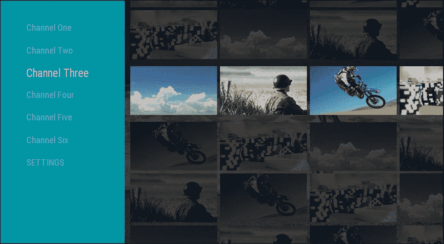
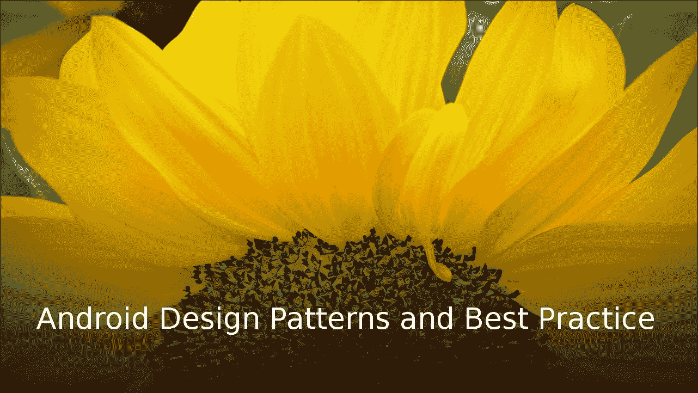
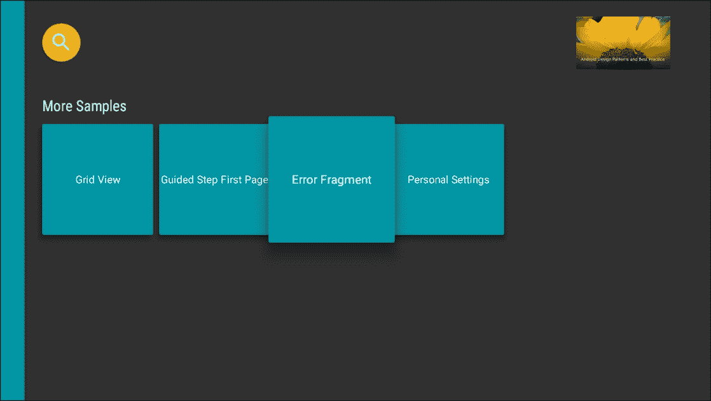
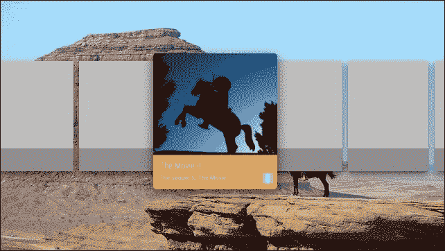
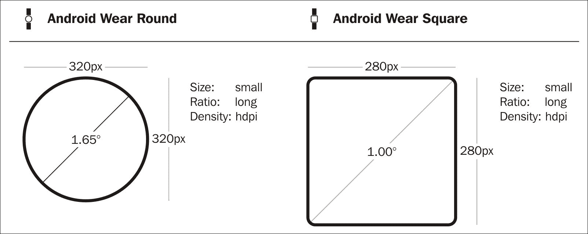
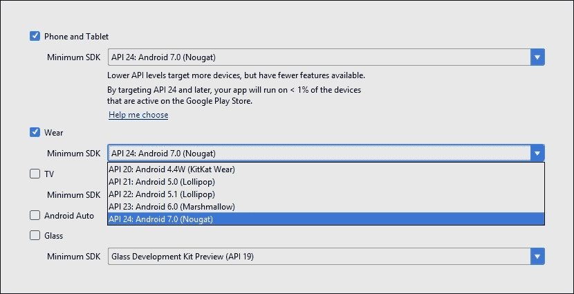

# 第十一章。可穿戴图案

到目前为止，在本书中，我们考虑的所有安卓应用都是为手机和平板电脑等移动设备设计的。正如我们所看到的，该框架为确保我们的设计在各种可用的屏幕尺寸和形状上运行良好提供了很好的便利。然而，有三个形状因素是我们迄今为止所做的工作没有涵盖的，那就是手表、车载控制台和电视机等可穿戴设备。


当设计模式应用到这些替代平台时，我们选择哪种模式取决于应用的目的，而不是平台本身。由于我们在前一章中主要集中在模式上，这一章将主要介绍为每种设备类型构建应用程序的实用性。然而，正如我们在看电视应用时将会看到的，这些应用采用了**模型-视图-演示者模式**。

由于我们还没有涉及传感器编码，这一章将包括探索如何通过我们的代码读取和响应用户的心率。物理传感器(如心率监测器和加速度计)的管理方式非常相似，通过检查一个，我们可以了解其他传感器是如何处理的。

在本章中，您将学习如何:

*   设置电视应用程序
*   使用 leanback 库
*   应用 MVP 模式
*   创建横幅和媒体组件
*   了解浏览器和消费视图
*   连接到可穿戴设备
*   管理可穿戴屏幕形状
*   处理可穿戴通知
*   读取传感器数据
*   了解汽车安全功能
*   为媒体服务配置自动应用程序
*   为消息服务配置自动应用程序

在为如此广泛的外形进行开发时，首先要考虑的不仅仅是我们需要准备的图形的大小，还有从远处观看的距离。大多数安卓设备都是在几英寸之外使用的，通常被设计成可以旋转、移动和触摸。这里的例外是电视屏幕，通常从大约 10 英尺远的地方观看。

# Android 电视

电视通常最适合放松的活动，如看电影、表演和玩游戏。然而，仍然有很大的重叠区域，尤其是在游戏方面，许多应用程序可以很容易地转换为在电视上工作。观看距离、高清晰度和控制器设备意味着需要进行一些调整，这在很大程度上得益于 leanback 支持库。这个库促进了模型-视图-演示者设计模式，这是模型-视图-控制器模式的一种改编。

可以为电视开发的应用类型没有限制，但很大一部分属于游戏和媒体两类。与游戏不同，游戏通常受益于独特的界面和控件，基于媒体的应用通常应该使用熟悉的小部件和界面，并且在整个平台上保持一致。这就是**瘦背库**出现的地方，它提供了各种细节、浏览器和搜索小部件以及覆盖。



leanback 库不是唯一对电视开发有用的支持库，CardView 和 recycle view 都很有用，而 recycle view 实际上是必需的，因为一些 leanback 类依赖于它。

安卓工作室提供了一个非常有用的电视模块模板，它提供了十几个类，展示了许多基于媒体的电视应用程序所需的大多数功能。很值得好好看看这个模板，因为它是一个相当好的教程。然而，它不一定是单个项目的最佳起点，除非它们在本质上相当通用。如果你正在计划任何原创项目，有必要了解一两件关于电视项目如何设置的事情，从设备主屏幕开始。

## 电视主屏幕

主屏幕是安卓电视用户的切入点。从这里，他们可以搜索内容，调整设置，并访问应用程序和游戏。用户对我们的应用程序的第一次浏览将以横幅图像的形式出现在这个屏幕上。

每个电视应用程序都有一个横幅图像。这是一个 320 x 180 dp 位图，它应该以简单有效的方式描述我们的应用程序所做的事情。例如:



横幅也可以包含丰富多彩的图片，但文字应始终保持粗体和最小化。然后可以在项目清单中声明横幅。要了解这是如何实现的，以及如何设置与电视应用相关的其他**清单**属性，请按照以下步骤操作:

1.  启动新项目，选择**电视**作为**目标安卓设备**和**安卓电视活动**作为活动模板。
2.  将您的图像添加到可绘制的文件夹中，并将其称为`banner`或类似的名称。
3.  打开`manifests/AndroidManifest.xml`文件。
4.  删除以下一行:

    ```java
            android:banner="@drawable/app_icon_your_company" 

    ```

5.  编辑开始的`<application>`节点，包括以下高亮显示的行:

    ```java
            <application 
                android:allowBackup="true" 
                android:banner="@drawable/banner" 
                android:label="@string/app_name" 
                android:supportsRtl="true" 
                android:theme="@style/Theme.Leanback"> 

    ```

6.  在根`<manifest>`节点，添加以下属性:

    ```java
            <uses-feature 
                android:name="android.hardware.microphone" 
                android:required="false" /> 

    ```

最后一个`<uses-feature>`节点并不是严格要求的，但它将使您的应用程序可用于没有麦克风的旧电视。如果你的应用依赖于语音控制，那么忽略这个属性。

我们还需要为我们的主要活动声明一个 leanback 启动器，如下所示:

```java
<intent-filter> 
  <action 
        android:name="android.intent.action.MAIN" /> 
  <category 
        android:name="android.intent.category.LEANBACK_LAUNCHER" /> 
</intent-filter> 

```

如果你是单独为电视而建，那么这就是你在 Play 商店的电视部分让你的应用程序可用所需要做的。但是，您可能正在开发一个应用程序，例如可以在其他设备上玩的游戏。在这种情况下，还应包括以下条款，使其可用于可旋转的设备:

```java
<uses-feature 
    android:name="android.hardware.screen.portrait" 
    android:required="false" /> 

```

在这些情况下，您也应该将`android.software.leanback`设置为`required="false"`，并恢复到素材或 *appcompat* 主题。

您可能想知道为什么我们将横幅声明从主活动整体移动到应用程序。这并不是严格必要的，我们所做的只是将一个横幅应用于整个应用程序，而不管它包含多少活动。除非你希望每个活动都有单独的横幅，否则这通常是最好的方法。

## 电视模型-视图-主持人模式

leanback 库是少数几个直接促进设计模式使用的库之一，即模型-视图-演示者(MVP)模式，它是模型-视图-控制器(MVC)的派生。这两种模式都非常简单和明显，有些人可能会说它们根本不符合模式的要求。即使你以前从未遇到过设计模式，你也会应用这些*架构*中的一个或两个。

我们之前简单介绍了 MVC 和 MVP，但是概括地说，在 MVC 模式中，视图和控制器是分开的。例如，当控制器接收到来自用户的输入时，比如点击一个按钮，它将此传递给执行其逻辑的模型，并将此更新的信息转发给视图，然后视图将此更改显示给用户，等等。

MVP 模式结合了视图和控制器的功能，使其成为用户和模型之间的中介。这是我们以前在适配器模式的形状中看到的，特别是回收器视图及其适配器的工作方式。

leanback presenter 类还与嵌套的视图支架结合使用，就 MVP 模式而言，视图是任何 Android 视图，模型可以是我们选择的任何 Java 对象或对象集合。这意味着我们可以使用演示者作为我们选择的任何逻辑和我们希望的任何布局之间的适配器。

尽管这个系统很自由，但在开始项目开发之前，还是值得看一下电视应用程序开发中使用的一些约定。

## 电视 app 结构

大量的媒体电视应用程序只提供有限的一组功能，而这通常是所有需要的。大多数情况下，用户希望:

*   浏览内容
*   搜索内容
*   消费内容

leanback 库为其中的每一个都提供了片段类。典型的**浏览器视图**由`BrowserFragment`提供，模板用一个简单的例子和一个`SearchFragment`演示了这一点:



**消费视图**由`PlaybackOverlayFragment`提供，可能是最简单的视图，只包含视频视图和控件。

还有提供内容特定信息的`DetailsFragment`。此视图的内容和布局取决于主题，可以采用您选择的任何形式，材料设计的常规规则适用。**设计视图**从消费视图底部向上滚动:


leanback 图书馆在将材料设计引入电视设备方面做得很轻。如果您决定使用其他地方的视图，那么适用于其他地方的同样的材料规则也适用于这里。在继续之前，值得一提的是，背景图像需要在边缘周围有 5%的出血，以确保它们到达所有电视屏幕的侧面。这意味着 1280 x 720 px 的图像需要是 1408 x 792 px。

之前，我们介绍了用于启动应用程序的横幅图像，但我们也需要一种方法来引导用户访问个人内容，特别是熟悉或相关的内容。

## 推荐卡

安卓电视主屏幕的最上面一行是**推荐行**。这允许用户基于他们的观看历史快速访问内容。可以推荐内容，因为它是以前查看的内容的延续，或者基于用户的查看历史以某种方式相关。

设计推荐卡时，我们需要考虑的设计因素屈指可数。这些卡片由图像或大图标、标题、副标题和应用程序图标构成，如下所示:


在卡片图像的纵横比方面有一定的灵活性。卡片的宽度不得小于其高度的 2/3 或大于 3/2。图像中不得有透明元素，并且高度不得小于 176 dp。

### 类型

在许多电视上，大片的白色会非常刺眼。如果你需要大面积的白色，使用#EEE 而不是#FFF。

如果你看一下安卓电视直播上的推荐行，你会发现随着每张卡片的高亮显示，背景图像也会发生变化，我们也应该为每张推荐卡片提供背景图像。这些图像必须与卡片上的图像不同，并且是 2016 x 1134 px，以允许 5%的出血，并确保它们在屏幕边缘周围没有间隙。这些图像也应该没有透明部分。



为这种大屏幕设计的挑战为我们提供了机会，将色彩丰富、充满活力的图像与高质量的图形结合起来。在这个尺寸范围的另一端是可穿戴设备，那里的空间非常宝贵，需要一种完全不同的方法。

# 安卓穿戴

可穿戴安卓应用值得特殊对待还有另一个原因，那就是几乎所有的安卓穿戴应用都作为配套应用，与运行在用户手机上的主模块协同工作。这种捆绑是一个有趣而简单的过程，许多移动应用程序可以通过添加可穿戴组件来大大增强。另一个让可穿戴设备开发变得非常有趣的特性是令人兴奋的新传感器和小配件的可用性。特别是，在许多智能手表中发现的心率监测器在健身应用中受到欢迎，这并不奇怪。

可穿戴设备是智能设备发展最令人兴奋的领域之一。智能手机和其他带有一系列新传感器的破旧设备为开发者带来了无数新的可能性。

运行在可穿戴设备上的应用程序需要连接到运行在移动手机上的父应用程序，最好将其视为主应用程序的扩展。尽管大多数开发人员至少可以使用一部手机，但可穿戴设备仅用于测试可能是一个昂贵的选择，尤其是因为我们至少需要两部手机。这是因为**方形屏幕和圆形屏幕**的处理方式不同。幸运的是，我们可以用模拟器创建 avd，并将它们连接到真实的手机或平板电脑或虚拟手机。

## 与可穿戴设备配对

要最好地了解圆形和方形屏幕管理之间的区别，首先要为每个屏幕创建一个模拟器:



### 类型

还有一个 chinned 版本，但出于编程目的，我们可以将其视为与圆形屏幕相同。

如何配对可穿戴式自动增值设备将取决于您是将其与真正的手机还是另一个仿真器耦合。如果您使用手机，您需要从以下网址下载安卓穿戴应用:

[https://play.google.com/store/apps/details?id = com . Google . Android . wealth . app](https://play.google.com/store/apps/details?id=com.google.android.wearable.app)

然后定位`adb.exe`文件，默认位于`user\AppData\Local\Android\sdk\platform-tools\`

在此打开命令窗口并发出以下命令:

```java
 adb -d forward tcp:5601 tcp:5601 

```

您现在可以启动配套应用程序，并按照说明配对设备。

### 注

每次连接手机时，您都需要发出此端口转发命令。

如果你把你的可穿戴模拟器和模拟手机配对，那么你需要一个面向谷歌应用程序接口的自动增值设备，而不是一个普通的安卓平台。然后可以下载`com.google.android.wearable.app-2.apk`。网上有很多地方可以找到这个，比如:[www.file-upload.net/download](http://www.file-upload.net/download)

apk 应该放在您的`sdk/platform-tools`目录中，可以使用以下命令安装:

```java
adb install com.google.android.wearable.app-2.apk

```

现在启动您的可穿戴式 AVD，并在命令提示符下输入`adb devices`，确保两个仿真器都可见，并有类似如下的输出:

```java
List of devices attached 
emulator-5554   device 
emulator-5555   device

```

输入:

```java
adb telnet localhost 5554

```

在命令提示符下，其中`5554`是电话模拟器。接下来，进入`adb redir add tcp:5601:5601\.` 现在可以使用手持 AVD 上的 Wear app 连接手表了。

创建穿戴项目时，您需要包括两个模块，一个用于可穿戴组件，一个用于手机。



安卓提供了一个**可穿戴用户界面支持库**，为穿戴开发者和设计师提供了一些非常有用的功能。如果您已经使用向导创建了一个可穿戴项目，这将包括在设置过程中。否则，您需要在`Module: wear` `build.gradle`文件中包含以下依赖项:

```java
compile 'com.google.android.support:wearable:2.0.0-alpha3' 
compile 'com.google.android.gms:play-services-wearable:9.6.1' 

```

您还将需要模块:移动构建文件中的这些行:

```java
wearApp project(':wear') 
compile 'com.google.android.gms:play-services:9.6.1' 

```

## 管理屏幕形状

我们事先不知道我们的应用程序将在哪些形状上运行，这个难题有两种解决方案。第一个，也是最明显的，就是为每个形状创建一个布局，这通常是最好的解决方案。如果您使用向导创建了一个可穿戴项目，您会看到两个形状的模板活动都已包含在内。

当应用程序在实际设备或模拟器上运行时，我们仍然需要一种方法来检测屏幕形状，以便它知道要膨胀哪个布局。这是通过 **WatchViewStub** 完成的，调用它的代码必须包含在我们主活动文件的`onCreate()`方法中，如下所示:

```java
@Override 
protected void onCreate(Bundle savedInstanceState) { 
    super.onCreate(savedInstanceState); 
    setContentView(R.layout.activity_main); 

    final WatchViewStub stub = (WatchViewStub) 
            findViewById(R.id.watch_view_stub); 
    stub.setOnLayoutInflatedListener( 
            new WatchViewStub.OnLayoutInflatedListener() { 

        @Override 
        public void onLayoutInflated(WatchViewStub stub) { 
            mTextView = (TextView) stub.findViewById(R.id.text); 
        } 

    }); 
} 

```

这可以用 XML 实现，如下所示:

```java
<android.support.wearable.view.WatchViewStub xmlns:android="http://schemas.android.com/apk/res/android" 
    xmlns:app="http://schemas.android.com/apk/res-auto" 
    xmlns:tools="http://schemas.android.com/tools" 
    android:id="@+id/watch_view_stub" 
    android:layout_width="match_parent" 
    android:layout_height="match_parent" 
    app:rectLayout="@layout/rect_activity_main" 
    app:roundLayout="@layout/round_activity_main" 
    tools:context=".MainActivity" 
    tools:deviceIds="wear"> 
 </android.support.wearable.view.WatchViewStub> 

```

为每个屏幕形状创建单独布局的替代方法是使用本身知道屏幕形状的布局。这是以**框的形式出现的**，它调整圆形屏幕的填充设置，并且只将视图定位在该圆内最大可能的正方形内。

BoxInsetLayout 可以像任何其他布局一样用作您的主要 XML 活动中的根视图组:

```java
<android.support.wearable.view.BoxInsetLayout 
    xmlns:android="http://schemas.android.com/apk/res/android" 
    xmlns:app="http://schemas.android.com/apk/res-auto" 
    android:layout_height="match_parent" 
    android:layout_width="match_parent"> 

    . . .  

</android.support.wearable.view.BoxInsetLayout> 

```

这种方法肯定有缺点，因为它并不总是能最大限度地利用圆脸上的可用空间，但它弥补了 BoxInsetLayout 在灵活性方面的不足，便于使用。在大多数情况下，这根本不是一个缺点，因为一个设计良好的 Wear 应用程序应该只通过简单的信息短暂地吸引用户的注意力。用户并不热衷于在手表上浏览复杂的用户界面。我们在手表屏幕上显示的信息应该能够被一目了然地吸收，响应动作应该仅限于轻敲或轻扫。

智能设备的主要用途之一是在用户无法访问手机时接收通知，例如在锻炼时。

## 可穿戴通知

在任何移动应用中添加可穿戴通知功能都没什么意义。回忆通知是如何从[第 9 章](09.html#aid-22O7C2 "Chapter 9. Observing Patterns")、*观察模式*发出的:

```java
private void sendNotification(String message) { 

    NotificationCompat.Builder builder = 
            (NotificationCompat.Builder) 
            new NotificationCompat.Builder(this) 
                    .setSmallIcon(R.drawable.ic_stat_bun) 
                    .setContentTitle("Sandwich Factory") 
                    .setContentText(message); 

    NotificationManager manager = 
            (NotificationManager) 
            getSystemService(NOTIFICATION_SERVICE); 
    manager.notify(notificationId, builder.build()); 

    notificationId += 1; 
} 

```

为了使它也能向配对的可穿戴设备发送通知，只需将这两行添加到构建器字符串中:

```java
.extend(new NotificationCompat.WearableExtender() 

.setHintShowBackgroundOnly(true)) 

```

可选的`setHintShowBackgroundOnly`设置允许我们在没有背景卡的情况下显示通知。

大多数情况下，可穿戴设备被用作输出设备，但它也可以用作输入，当传感器靠近身体放置时，可以获得许多新功能，例如许多智能手机中包含的心率监视器。

## 读取传感器

如今，大多数智能设备上都有越来越多的传感器，智能手表为开发者提供了新的机会。幸运的是，这些传感器编程非常简单，毕竟它们只是另一个输入设备，因此，我们雇佣了监听器*来观察*它们。

尽管单个传感器的功能和用途差异很大，但读取它们的方式几乎相同，唯一的区别是它们输出的性质。下面我们将看看在许多可穿戴设备上发现的心率监测器:

1.  打开或启动一个磨损项目。
2.  打开穿戴模块，在主活动 XML 文件中添加一个带有 TextView 的 BoxInsetLayout，如下所示:

    ```java
            <android.support.wearable.view.BoxInsetLayout 
                xmlns:android="http://schemas.android.com/apk/res/android" 
                xmlns:app="http://schemas.android.com/apk/res-auto" 
                android:layout_height="match_parent" 
                android:layout_width="match_parent"> 

                <TextView 
                    android:id="@+id/text_view" 
                    android:layout_width="match_parent" 
                    android:layout_height="wrap_content" 
                    android:layout_gravity="center_vertical" />  

            </android.support.wearable.view.BoxInsetLayout> 

    ```

3.  打开穿戴模块中的 Manifest 文件，在根`manifest`节点内添加如下权限。

    ```java
            <uses-permission android:name="android.permission.BODY_SENSORS" /> 

    ```

4.  在穿戴模块打开主 Java 活动文件，添加如下字段:

    ```java
            private TextView textView; 
            private SensorManager sensorManager; 
            private Sensor sensor; 

    ```

5.  在活动上实施一个`SensorEventListener`:

    ```java
            public class MainActivity extends Activity 
                    implements SensorEventListener { 

    ```

6.  实现侦听器所需的两种方法。
7.  像这样编辑`onCreate()`方法:

    ```java
            @Override 
            protected void onCreate(Bundle savedInstanceState) { 
                super.onCreate(savedInstanceState); 
                setContentView(R.layout.activity_main); 

                textView = (TextView) findViewById(R.id.text_view); 

                sensorManager = ((SensorManager) 
                        getSystemService(SENSOR_SERVICE)); 
                sensor = sensorManager.getDefaultSensor 
                        (Sensor.TYPE_HEART_RATE); 
            } 

    ```

8.  加上这个`onResume()`方法:

    ```java
            protected void onResume() { 
                super.onResume(); 

                sensorManager.registerListener(this, this.sensor, 3); 
            } 

    ```

9.  而这个`onPause()` 方法:

    ```java
            @Override 
            protected void onPause() { 
                super.onPause(); 

                sensorManager.unregisterListener(this); 
            } 

    ```

10.  编辑`onSensorChanged()`回调，如是:

    ```java
            @Override 
            public void onSensorChanged(SensorEvent event) { 
                textView.setText(event.values[0]) + "bpm"; 
            } 

    ```


正如你所看到的，传感器监听器就像观察者一样，就像点击和触摸监听器一样。唯一真正的区别是，传感器需要明确注册和取消注册，因为它们在默认情况下不可用，并且需要在完成后关闭以保存电池。

所有传感器都可以通过传感器事件监听器以相同的方式进行管理，通常最好在使用以下工具初始化应用程序时检查每个传感器是否存在:

```java
 private SensorManager sensorManagerr = (SensorManager) getSystemService(Context.SENSOR_SERVICE); 
    if (mSensorManager.getDefaultSensor(Sensor.TYPE_ACCELEROMETER) != null){ 
      . . . 
    } 
    else { 
    . . .  
} 

```

可穿戴设备开辟了一个全新的应用可能性世界，将安卓带入了我们生活中越来越多的方面。另一个这样的例子是在我们的汽车中使用安卓设备。

# 安卓汽车

与安卓电视一样，安卓汽车可以运行许多原本为移动设备设计的应用。当然，对于车内软件来说，安全是压倒一切的优先事项，这就是为什么大多数 Auto 应用程序都专注于音频功能，如消息和音乐。

### 注

由于强调安全性，安卓汽车应用在发布前必须经过严格的测试。

几乎不需要提及的是，在开发车载应用时，安全是压倒一切的原则，因此，安卓汽车应用几乎都分为两类:音乐或音频播放器和消息传递。

所有应用程序都需要在开发阶段进行大量测试。显然，在实时设备上测试自动应用程序是不切实际的，也是非常危险的，因此提供了自动应用程序接口模拟器。这些可以从 SDK 管理器的工具选项卡中安装。


## 汽车安全注意事项

许多管理汽车安全的规则都是简单的常识，避免动画、干扰和延迟，但当然有必要将这些正式化，谷歌已经这样做了。这些规则涉及驾驶员注意力、屏幕布局和可读性。最重要的可以在这里的列表中找到:

*   “自动”屏幕上不能有动画元素
*   只允许音频广告
*   应用程序必须支持语音控制
*   所有按钮和可点击控件必须在两秒钟内响应
*   文本长度必须超过 120 个字符，并且必须始终使用默认的 Roboto 字体
*   图标必须是白色的，以便系统可以控制对比度
*   应用程序必须支持日夜模式
*   应用程序必须支持语音命令
*   特定于应用程序的按钮必须在不超过两秒钟的延迟内响应用户操作

全面的列表可在以下网址找到:

[developer . Android . com/distribute/essentials/quality/auto . html](http://developer.android.com/distribute/essentials/quality/auto.html)

重要提示:这些以及其他一些规定将在发布前由谷歌进行测试，所以你必须自己运行所有这些测试。

### 类型

设计适用于白天和夜晚模式的应用程序，并通过系统控制对比度，使其在不同光线条件下自动保持可读性，这是一个相当详细的主题，谷歌为此制作了一份非常有用的指南，可在以下网址找到:[commondatastorage . googleapi . com/androiddevelopers/shareables/auto/AndroidAuto-custom-colors . pdf](http://commondatastorage.googleapis.com/androiddevelopers/shareables/auto/AndroidAuto-custom-colors.pdf)

除了安全性和应用程序类型的限制之外，自动应用程序与我们已经探索过的其他应用程序的不同之处仅在于它们是如何设置和配置的。

## 配置自动应用

如果您使用工作室向导来设置一个自动应用程序，您将会看到，与穿戴应用程序一样，我们必须同时包括移动和自动模块。与可穿戴项目不同，这不涉及第二个模块，一切都从移动模块管理。自动组件的添加提供了一个可以在`res/xml`中找到的配置文件。例如:

```java
<?xml version="1.0" encoding="utf-8"?> 
<automotiveApp> 
    <uses name="media" /> 
</automotiveApp> 

```

对于消息应用程序，我们将使用:

```java
    <uses name="media" /> 

```

通过检查模板生成的清单文件，可以找到其他重要的自动元素。无论您选择开发哪种类型的应用程序，您都需要添加以下元数据:

```java
<meta-data 
    android:name="com.google.android.gms.car.application" 
    android:resource="@xml/automotive_app_desc" /> 

```

正如你所想象的那样，音乐或音频提供商需要一项服务来配合启动器的活动，而消息应用程序则需要一个接收器。音乐服务标签看起来像下面的片段:

```java
<service 
    android:name=".SomeAudioService" 
    android:exported="true"> 
    <intent-filter> 
        <action android:name="android.media.browse.MediaBrowserService" /> 
    </intent-filter> 
</service> 

```

对于消息传递应用程序，我们需要一个服务和两个接收器，一个接收消息，一个发送消息，如下所示:

```java
<service android:name=".MessageService"> 
</service> 

<receiver android:name=".MessageRead"> 
    <intent-filter> 
        <action android:name="com.kyle.someapplication.ACTION_MESSAGE_READ" /> 
    </intent-filter> 
</receiver> 

<receiver android:name=".MessageReply"> 
    <intent-filter> 
        <action android:name="com.kyle.someapplication.ACTION_MESSAGE_REPLY" /> 
    </intent-filter> 
</receiver> 

```

车载设备代表了安卓发展的最大增长领域之一，随着免提驾驶变得越来越普遍，这一领域将进一步增长。通常，我们可能只想在一个主要为其他外形设计的应用程序中包含一个自动功能。

与手持和可穿戴设备不同，我们不必过度关注屏幕尺寸、形状或密度，也不必担心特定车辆的品牌或型号。随着驾驶和运输性质的变化，这无疑将在不久的将来发生变化。

# 总结

本章中描述的可选外形为开发人员提供了令人兴奋的新平台，以及我们可以创建的应用程序类型。这不仅仅是为每个平台开发应用程序的问题，在一个应用程序中包含所有三种设备类型是完全可能的。

以我们之前看到的三明治建筑应用为例；我们可以很容易地调整它，这样用户在看电影时就可以点一份三明治。同样，我们可以向他们的智能手机或汽车控制台发送订单准备就绪的通知。简而言之，这些设备为新应用打开了市场，并为现有应用增加了功能。

无论我们的创作多么聪明或多才多艺，很少有应用不能从我的社交媒体提供的推广机会中受益。像这样的一条*推文*或*就可以达到数不清的数量，而无需花费广告费用。*

在下一章中，我们将看到向我们的应用程序添加社交媒体功能有多容易，以及我们如何使用 SDK 的网络工具包和网络视图将网络应用程序功能构建到安卓应用程序中，甚至构建完整的网络应用程序。